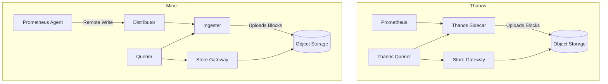

# Observability at Scale

**Complexity:** Advanced. **Time to complete:** 90-120 minutes. **Prerequisites:** Prometheus fundamentals, Kubernetes operations, basic object storage concepts, and comfort reading YAML manifests.

## Learning Outcomes

By the end of this module you will be able to:

- **Diagnose** scaling bottlenecks in a Prometheus deployment by interpreting active-series counts, WAL size, ingest latency, and head-block memory pressure, then recommending federation, sharding, or Agent mode as the architecturally appropriate fix.
- **Design** a long-term metric platform on bare-metal hardware by choosing between Thanos and Mimir based on tenancy, ingestion model, and operational maturity, justifying the choice with concrete trade-offs.
- **Build** an OpenTelemetry Collector pipeline that splits the Agent and Gateway tiers, attaches Kubernetes metadata, applies memory-limited batching, and routes metrics, logs, and traces to separate backends.
- **Debug** cardinality explosions and Loki stream-limit violations by tracing the offending label back to its source instrumentation, then applying drop-relabeling, recording rules, or label promotion controls in the right layer.
- **Evaluate** an alerting configuration for fatigue risk and **redesign** routes, grouping, and inhibition rules so that on-call receives one symptom-based page per real incident, not a cascade of cause-based noise.

## Why This Module Matters

At 03:14 on a Saturday, a regional bank's payment authorization service starts dropping transactions. The on-call SRE wakes to a phone full of pages: 312 alerts in the first nine minutes, fired by 312 separate routes because each microservice owns its own routing tree. Buried somewhere in that wall is the actual cause, but the engineer cannot find it because the central Prometheus has just OOM-killed itself trying to evaluate the dashboards everyone is opening, and the standby instance is in a 40-minute WAL replay loop with no query path. The metrics platform built to *show them* what was happening is the platform that is now *blind* during the incident, and the post-mortem will conclude that the observability stack added forty minutes to mean-time-to-resolution.

This is not a hypothetical. Every team that runs Prometheus past about 500 nodes, or past a few million active series, runs into a version of the same wall. The default architecture is intentionally simple: one binary scrapes targets, writes a local TSDB, evaluates rules, and serves queries. That simplicity is wonderful at small scale and ruinous at large scale, because every one of those responsibilities competes for the same memory, the same disk, and the same CPU budget on a single node. The first time a developer ships a metric labelled with `user_id`, the cardinality of that single series multiplies by your active user count, and the head block grows fast enough to outrun your ability to react. By the time the page fires, the platform is already half-down.

Observability at scale is therefore not a "bigger machine" problem. It is an architectural problem that demands you separate ingestion from storage, separate hot data from cold, separate the responsibilities of scraping, storing, querying, and alerting onto components that can each scale independently. It is also a *humans-and-instrumentation* problem, because the platform's worst enemy is usually a well-meaning developer adding one more dimension to one more counter, and the only way to keep that bounded is to make limits visible, enforced, and owned by someone. By the end of this module you will know the moving parts of a scale observability stack on bare metal, you will know which pieces fail first, and you will know what to demand from the engineers shipping metrics into your platform.

## The Limits of Single-Node Prometheus

Prometheus was designed primarily for reliability in the small case. It runs as a single binary, scrapes targets on a fixed interval, stores the resulting samples in a Time Series Database (TSDB) on local disk, evaluates alerting and recording rules on that local data, and serves queries from the same process. This shared-nothing posture is a feature: you can lose every other component in your cluster and a Prometheus pod with a working disk will keep collecting and alerting. The trade-off is that *every* responsibility lives on one machine, and the pressure points compound rather than stack neatly.

The first pressure point is **memory**. Prometheus keeps the active head block, which contains the last two to three hours of samples, fully in RAM, indexed by label set so that PromQL can answer queries without paging from disk. Memory consumption is dominated by the *number of active series* — that is, unique combinations of metric name plus label values currently being written to. A series consumes roughly three to four kilobytes of resident memory regardless of how often it is sampled. A cluster with fifteen million active series therefore needs fifty to sixty gigabytes of RAM just for the head, plus working memory for queries and rule evaluation, before you have left any headroom for the spikes that happen when a Deployment rolls and every pod gets a new `pod-template-hash` label.

The second pressure point is **CPU**. Rule evaluation runs on a fixed schedule, queries arrive whenever a human or a dashboard fires them, and both must walk the index to resolve label matchers into series IDs and then iterate over chunks. Complex queries — anything with `histogram_quantile`, `rate` over long ranges, or unbounded `sum without`-style aggregations — read a lot of chunks and do a lot of allocation. The third pressure point is **storage I/O**: every two hours the TSDB compacts the head into a persistent block, and continuously the Write-Ahead Log (WAL) is fsync'd to disk to make scrape data crash-safe. On NVMe these operations are usually invisible, but on a spinning disk or a slow network volume the WAL falls behind the scrape, scrapes start dropping with `out of order sample` errors, and the data your alerts depend on is silently incomplete.

> **Stop and think:** before reading on, sketch on paper which of those three resources you would expect to be the *first* to saturate as you grow from 50 nodes to 500 nodes with the same workload mix. Now ask the harder question: which one will be the first to saturate as you grow the *cardinality* of your existing services tenfold while keeping node count flat? The answers are different, and that difference is the whole motivation for the rest of this module.

### Hierarchical Federation Versus Sharding

When a single Prometheus cannot scrape all targets, you must distribute the workload. There are two common shapes, and they solve different problems despite being often confused.

**Hierarchical federation** deploys multiple "leaf" Prometheus servers, typically one per failure domain or per namespace, each scraping the targets in its slice of the world. A higher-level "global" Prometheus scrapes the leaves through their `/federate` endpoint, pulling only *aggregated* series selected by a `match[]` parameter. The pattern is good for two narrow purposes: building a small cross-cluster summary view, and isolating blast radius so that one greedy team's metrics cannot OOM the cluster-wide instance. It is famously bad at one thing people repeatedly ask it to do: replicating raw data into a central store. Pulling raw series through `/federate` defeats the purpose of leaf-and-aggregate, because the global instance now carries the full cardinality cost it was supposed to escape.

:::caution
Federation is an anti-pattern for "centralize everything." If you find yourself writing `match[]={__name__=~".+"}`, you are not federating; you are building a single point of failure with extra hops. Use federation only for pre-aggregated recording rule output such as `job:http_requests:rate5m`.
:::

**Hash-based sharding** takes the opposite approach: it deploys multiple identical Prometheus replicas that all run the same service discovery, but each replica only scrapes the subset of targets whose hash matches its shard index. The targets are partitioned, not the metrics. Every shard owns its own slice of the world end-to-end, and each shard remote-writes to the same backend. The pattern below uses the `hashmod` action to assign targets to four shards.

```yaml
scrape_configs:
  - job_name: 'kubernetes-pods'
    kubernetes_sd_configs:
      - role: pod
    relabel_configs:
      - source_labels: [__address__]
        modulus: 4
        target_label: __tmp_hash
        action: hashmod
      - source_labels: [__tmp_hash]
        regex: 0
        action: keep
```

You deploy four pods, each with `regex: 0`, `regex: 1`, `regex: 2`, and `regex: 3`. Together they cover the world; individually each one carries one quarter of the active series and the work that goes with them. Because the hash is over a stable target identifier, target-to-shard assignment is deterministic across restarts, which means a given series stays on a given shard and downstream tools can reason about it. This is the mechanism the Prometheus Operator's `shards:` field uses behind the scenes.

> **Stop and think:** if you double `modulus` from 4 to 8 to handle growth, what happens to series that were on shard 1 yesterday and now hash onto shard 5 today? Trace what your remote-write backend sees in the moments around the rollout. The answer reveals why you treat shard count changes as a planned migration, not a routine rolling restart.

### Prometheus Agent Mode

Introduced in version 2.32, Agent mode (enabled with `--enable-feature=agent`) strips Prometheus down to its scraping responsibilities. There is no local TSDB beyond the WAL, no query path, no rule evaluation, and no alerting. The agent scrapes targets, appends samples to the WAL, and forwards them via remote-write to a centralized backend such as Mimir or Thanos Receive. Memory consumption falls dramatically because there is no head block to maintain in RAM; the WAL on disk becomes the buffer for transient backend outages, and the agent does nothing more clever than ship bytes.

Agent mode is the right shape when you have already decided that long-term storage and querying live somewhere else. It is the wrong shape if you want local autonomy — for example, if you want each cluster to keep alerting even when its remote-write target is unreachable. In that case, run a full Prometheus and let it remote-write a copy upward; the local copy keeps you alive when the wide-area network breaks, and the central copy gives you a global view when it doesn't.

## Long-Term Storage: Thanos Versus Mimir

Local NVMe is fast and finite. Once you decide that you want global queries, multi-week retention, multi-tenant isolation, or the ability to fail any single Prometheus host without losing data, you need a distributed system backed by object storage. On bare metal that object store is usually MinIO or Ceph RGW, both of which speak the S3 API that Thanos and Mimir expect. The two systems solve the same problem in noticeably different ways, and the choice has long-tail operational consequences.



In the Thanos model, each Prometheus instance keeps a full local TSDB, and a co-located *Sidecar* container watches the on-disk blocks and uploads them to object storage as they are completed. A central *Querier* fans out PromQL queries simultaneously to every Sidecar (for recent data) and to a *Store Gateway* (for historical blocks in object storage), then merges and deduplicates the responses. Thanos preserves the existing Prometheus deployment shape and bolts longevity onto the side; you do not have to redesign your scraping topology to adopt it.

In the Mimir model, scraping is a separate concern from storage. Prometheus runs in Agent mode (or any compatible remote-write client) and pushes samples into a *Distributor*, which validates them, hashes them across a ring of *Ingesters*, and replicates each sample to multiple ingesters for durability. Ingesters hold a few hours in memory and on local disk, then upload completed blocks to object storage. *Queriers*, *Store Gateways*, and *Compactors* round out the system. Multi-tenancy is built into the protocol via the `X-Scope-OrgID` header; the same Mimir cluster can serve isolated tenants without external proxies.

| Concern | Thanos | Mimir |
|---|---|---|
| **Ingestion model** | Pull from Sidecar plus block upload | Push via remote-write to Distributor |
| **Prometheus role** | Full Prometheus with local TSDB required | Agent mode is sufficient |
| **Multi-tenancy** | Add-on (Receive, external proxy) | Native, header-based |
| **Op complexity** | Lower; sidecars piggyback on existing pods | Higher; microservices plus Memcached |
| **Query performance** | Good; depends on Sidecar reachability | Excellent; query sharding plus caching |
| **Failure mode** | Partial; lose Sidecar, lose recent data window | Replicated; lose one ingester, no data loss |
| **Best fit** | Existing Prometheus estates wanting longevity | New centralized platforms with many tenants |

The bare-metal recommendation usually comes down to two questions. First, do you already have a stable Prometheus deployment that you do not want to redesign? If so, Thanos is the lower-risk path: you keep your scraping, you add Sidecars, and you gain global querying and unlimited retention without changing how anything writes data. Second, are you building a *platform* that hosts metrics for many internal tenants who must not see each other's data? If so, Mimir is the more honest answer: native tenancy, query sharding for steady performance under load, and shuffle-sharding to limit the blast radius of a noisy tenant. Mimir's operational cost is real (you will operate Memcached or Redis, several stateless microservices, and the ring), and you should not adopt it just because the architecture diagram looks impressive.

> **Stop and think:** suppose your security team requires that one specific application's metrics be cryptographically isolated such that no other team can query them, even by mistake. Which architecture lets you implement that with a configuration change, and which one requires you to bolt on additional infrastructure? Why?

## OpenTelemetry Collector Pipelines

Older observability stacks shipped a different agent for each signal: Promtail or Fluentbit for logs, the Jaeger Agent for traces, node\_exporter and friends for metrics, and a half-dozen language-specific instrumentation libraries on top. The OpenTelemetry Collector replaces that menagerie with a single binary that speaks every signal, running in two tiers — Agents on each node, Gateways in the centre — and connecting them with a uniform configuration model.

The **Agent tier** runs as a DaemonSet on every node. Its job is to collect what is intrinsically *node-local*: kernel-level metrics, container logs from `/var/log/pods`, and traces sent over localhost from pods on the same node. Because the Agent is on the node, it has the cheapest possible access to that data and the lowest possible failure radius if a remote backend is unreachable; in the worst case, an Agent can buffer to disk while the network heals. The **Gateway tier** runs as a Deployment behind a service. It receives data from Agents over OTLP/gRPC, performs heavier processing (tail-based sampling, cardinality reduction, redaction, tenant tagging), and exports to the actual backends. Splitting these two tiers is the most important architectural decision you will make with OpenTelemetry: it lets you do cheap edge processing on every node and expensive cluster-wide processing in a small number of tightly resourced pods, without putting either kind of work in the wrong place.

A Collector pipeline is built from four primitives: *Receivers* take data in, *Processors* transform it, *Exporters* send it out, and the *Service* section glues those together into named pipelines per signal. The configuration below shows a Gateway that accepts OTLP, applies a memory limiter to avoid OOMing the pod under load, attaches Kubernetes metadata, batches for throughput, and exports each signal to its appropriate backend.

```yaml
receivers:
  otlp:
    protocols:
      grpc:
        endpoint: 0.0.0.0:4317
      http:
        endpoint: 0.0.0.0:4318

processors:
  memory_limiter:
    check_interval: 1s
    limit_mib: 4000
    spike_limit_mib: 800

  k8sattributes:
    auth_type: "serviceAccount"
    passthrough: false
    extract:
      metadata:
        - k8s.pod.name
        - k8s.namespace.name

  batch:
    send_batch_size: 10000
    timeout: 10s

exporters:
  prometheusremotewrite:
    endpoint: "http://mimir-nginx.mimir.svc.cluster.local/api/v1/push"
  otlphttp/loki:
    endpoint: "http://loki-gateway.loki.svc.cluster.local/otlp"
  otlp/tempo:
    endpoint: "tempo-distributor.tempo.svc.cluster.local:4317"
    tls:
      insecure: true

service:
  pipelines:
    metrics:
      receivers: [otlp]
      processors: [memory_limiter, k8sattributes, batch]
      exporters: [prometheusremotewrite]
    traces:
      receivers: [otlp]
      processors: [memory_limiter, k8sattributes, batch]
      exporters: [otlp/tempo]
```

The order of processors in each pipeline is not cosmetic. `memory_limiter` must run *first* so that incoming data is dropped at the boundary when memory is tight, rather than after enrichment has already consumed CPU on data you will throw away. `k8sattributes` then enriches with metadata so that downstream filtering and routing can use it. `batch` is *last*, because batching after enrichment means every record in a batch carries the metadata the backend wants, and because batching is what gets you throughput on the network without melting the receiver under per-record overhead.

> **Stop and think:** suppose you discover that ninety percent of your span volume comes from a single health-check endpoint, and you want to drop those spans before they leave the cluster. Which tier should the filter live in — Agent or Gateway — and why does the answer change if the goal is "never let them touch the network" versus "decide at sample time, after we have seen the trace's full shape"?

## The Grafana LGTM Stack

The LGTM stack — Loki for logs, Grafana for visualization, Tempo for traces, Mimir for metrics — is Grafana Labs' integrated answer to "what should we run at the back end?" All four storage components share a deliberately similar microservices shape: Distributors, Ingesters, Queriers, Compactors, and Store Gateways, each scaling independently and sharing object storage as the source of truth. Once you have learned how Mimir is operated, you have learned eighty percent of how Loki and Tempo are operated, which is a deliberate design choice and a real productivity win for platform teams.

### Loki: Logs Indexed By Label Only

Loki's central design decision is that it does not index the *content* of log lines — only their labels. A log line is just bytes, compressed and stored in object storage in chunks; the index records "for label set X, between time T1 and T2, the chunks are at offsets Y and Z." This is how Loki keeps storage costs an order of magnitude lower than Elasticsearch on the same workload. The cost of that decision is paid in label discipline: every unique combination of labels creates a separate *stream*, every stream consumes ingester memory, and the number of permitted streams per tenant is bounded.

The fundamental rule is to keep dynamic data *inside* the log line and *out* of the labels. A `request_id` belongs in the JSON payload where you can extract it at query time with `| json | request_id="..."`; it does not belong as a Loki label, because every distinct `request_id` value would create a new stream. The labels are for *infrastructure metadata* that has tens of distinct values across the entire cluster: namespace, app name, container, level. If you find yourself adding a label that would have more than a few hundred distinct values across the lifetime of a tenant, you are about to crash the ingester.

### Tempo: Traces At Object-Storage Cost

Tempo stores trace data as Parquet files in object storage and queries them with TraceQL, a structured query language designed for spans. Like Loki, Tempo trades expensive indexes for cheap storage: the only thing you can look up directly is a trace ID, and richer queries scan over Parquet using TraceQL's filter pushdown. Most observability stacks therefore use Tempo as a *destination*, not a search tool — you find the trace some other way (an exemplar from a metric, a trace ID from a log), and then you read it from Tempo.

**Exemplars** are the bridge between metrics and traces, and they are the killer feature that justifies running both systems. When your application records a histogram observation for a latency metric, the instrumentation can attach the current `trace_id` to that observation as an exemplar. Grafana renders exemplars as small diamonds on histogram panels; clicking a diamond at the slow tail of your latency distribution navigates straight to the actual trace that produced that latency. The user flow turns from "the p99 spiked at 14:22, let me grep logs for fifteen minutes" into "click the diamond, read the trace, find the slow database call." This is what people mean when they talk about "joined" observability, and it is essentially free once both backends are in place.

### Pyroscope: Continuous Profiling

Pyroscope (now part of Grafana's stack) collects continuous CPU and memory profiles from running applications, retains them, and lets you diff profiles across arbitrary time windows. The product question it answers is "why was my service slower today than yesterday?" without requiring a profiler to be attached after the fact. Pyroscope supports both eBPF-based profiling (no application changes needed for compiled languages such as Go, Rust, and C/C++) and native SDK integration (preferred for JVM and CPython, where eBPF cannot easily resolve symbols). The output is a flame graph that you can load into Grafana alongside your dashboards.

> **Stop and think:** an end-user complains that their request was slow at 11:42:03. You have metrics, logs, traces, and profiles all wired up. Sketch the order in which you would consult those four signals, and at each step state what the *next* signal is meant to disambiguate. The discipline of asking "what is this signal for, given what I already know?" is the difference between effective observability and a tab full of dashboards.

## Cardinality Management

Cardinality is the total number of unique time series in your TSDB, computed as the metric name multiplied by the count of unique label-value combinations on that metric. A well-behaved counter like `http_requests_total{method, status, handler}` might have a few thousand series across a moderately complex application. A poorly behaved counter like `http_requests_total{path="/api/users/123", status="200"}`, where the user ID is in the path label, has *one series per user*, and the platform's memory footprint becomes a function of your customer count. A single such metric, shipped by a well-meaning developer at 09:00, can crash a Prometheus by lunch.

The interventions stack from cheap-and-coarse to expensive-and-precise, and you generally want all of them in place because they catch failures at different layers. The first lever is **drop-relabeling at scrape time**, which removes a known-bad metric or label before it hits the TSDB. This is the right intervention when you have already identified the offender and you cannot get a fix shipped quickly enough.

```yaml
metric_relabel_configs:
  - source_labels: [__name__]
    regex: 'http_requests_total_bad_metric'
    action: drop
```

The second lever is **scrape-side limits**, which tell Prometheus to refuse a scrape that produces too many series, or labels with values too long, or label names too long. This is your defense against unknown-future-bad metrics, the ones that have not been written yet. Set sensible global limits and tighten them as you learn what your applications produce in steady state.

```yaml
sample_limit: 10000
label_limit: 50
label_name_length_limit: 200
label_value_length_limit: 200
```

The third lever is **recording rules**, which pre-aggregate expensive high-cardinality metrics into low-cardinality derived metrics that you can store and query cheaply. If your raw `http_requests_total` has one series per user, you almost certainly do not need that for the dashboards anyone actually looks at; what you need is `sum by (handler, status) (rate(http_requests_total[5m]))`, materialized once a minute as a recording rule. Once the recording rule exists, you can drop the raw metric after a short retention window, keeping the aggregate forever and the explosion only briefly.

The fourth lever, and the one most platform teams underuse, is **organizational**. The platform team owns the metric platform, but it does *not* own every metric a developer writes. The way out is a shared cardinality budget: each tenant gets a quota, the platform exposes that tenant's current usage as a metric, and a developer who blows their quota gets a 429 from the ingester rather than crashing the platform. Mimir's per-tenant limits do exactly this, and they are the single most useful feature for platform teams hosting many internal customers.

> **Stop and think:** which of those four levers requires the *fewest* people to coordinate to deploy, and which requires the *most*? Now sort them by how durable the protection is. The shape of those two answers — fast-and-fragile to slow-and-permanent — is the order in which a real platform team adopts them.

## Alerting Fatigue Mitigation

Alert fatigue is the slow-motion failure mode of observability platforms. Every page that turns out to be ignorable raises the threshold for the *next* page, and the threshold drifts upward until a real incident is missed. The cure is not "fewer alerts" as a slogan; it is a small number of disciplined mechanisms in Alertmanager that turn many cause-based notifications into one symptom-based incident.

The first mechanism is **routing**. Alertmanager's route tree lets you send alerts to different receivers based on labels: critical alerts to PagerDuty, warnings to a low-traffic Slack channel, info to a logged audit channel only. You write the tree once, and severity becomes part of every alert's metadata. The principle is that *severity is the contract between the sender and the receiver*, and the route tree is where that contract is enforced.

The second mechanism is **grouping**. Alertmanager waits a short configurable interval after the first alert in a group fires, and consolidates all related alerts into a single notification. If a node dies and fifteen pods on it page simultaneously, the on-call gets one notification ("15 targets down on node-X") rather than fifteen separate emails. The grouping key is the set of labels that define "related"; for node-down, it might be `[node]`, and for an application-wide latency regression it might be `[cluster, service]`.

The third mechanism is **inhibition**. An inhibit rule says: when alert A is firing, suppress alert B. The classic example is a NodeDown alert inhibiting all the per-target alerts on that node. Suppression is not the same as deletion; the inhibited alerts still exist, they are still visible in the Alertmanager UI, but they do not page. Inhibition is the right tool when you have a known causal chain and you want the page to fire on the cause, not on the symptoms downstream.

```yaml
inhibit_rules:
  - source_matchers:
      - alertname = "NodeDown"
    target_matchers:
      - alertname = "TargetDown"
    equal: ['node']
```

:::tip
**Symptom-based alerting** is the philosophical principle that ties the mechanisms together. Page on things users care about — error rate, latency, saturation, availability — not on causes that may or may not actually impact users. High CPU is a problem if, and only if, it is causing user-visible latency. If it is not, it is just efficient resource utilization, and paging on it will train the team to ignore CPU pages, which means they will ignore the *real* CPU page when it eventually arrives.
:::

> **Stop and think:** you currently page on "disk above 85%". A team-wide policy change moves you to "disk will be full in less than 4 hours at current write rate." What changes about the alert's signal-to-noise ratio, and what changes about the *response* you expect on-call to take when it fires? The shift from threshold-based to *predictive* alerts is one of the highest-leverage moves a mature platform team makes.

## Patterns & Anti-Patterns

The first durable pattern is to separate local collection from global storage, then make the boundary explicit in both ownership and SLOs. A cluster-local Prometheus, Prometheus Agent, or OpenTelemetry Collector Agent should have a narrow responsibility: discover targets, collect data close to the workload, survive short local disruptions, and forward to the platform backend. The global tier should own tenancy, retention, query acceleration, rule evaluation at platform scope, and object-storage durability. This pattern works because it lets the local tier fail small and the central tier scale wide, but it only holds if the remote-write and OTLP paths are treated as production dependencies with their own alerts, capacity plans, and backpressure behavior.

The second proven pattern is to enforce budgets before data lands, not after it has already become expensive. Prometheus scrape limits, Mimir tenant limits, Loki stream limits, Collector memory limiters, and relabeling rules are all admission-control mechanisms, even though they live in different products. They protect the platform at the boundary where a bad label, a broken exporter, or a runaway trace producer first appears. Teams sometimes resist this because a rejected scrape or HTTP 429 feels harsh, but the alternative is worse: accepting unbounded data into shared storage and then asking every other tenant to pay the memory, compaction, and query cost.

The third pattern is to make each signal answer a different operational question. Metrics should tell you whether the service is healthy and where saturation is trending; logs should explain discrete events with enough context to reproduce the path; traces should connect a slow or failed request across process boundaries; profiles should show which code path consumed CPU or allocation time during a window. When a dashboard tries to make logs behave like metrics, or a trace backend becomes the first place operators search for every outage, the stack becomes expensive and confusing. A mature runbook names the signal to consult next and states what uncertainty that signal is meant to remove.

The most common anti-pattern is the heroic central Prometheus: one enormous instance, one enormous disk, one large query path, and a pile of recording rules everyone is afraid to touch. It usually survives longer than it should because vertical scaling buys time, but the architecture has no graceful failure mode when the next cardinality event arrives. A better design shards scraping, remote-writes raw samples to a backend built for multi-node ingest, and moves expensive global queries away from the collection path. The point is not that Prometheus is weak; the point is that single-process reliability and platform-wide multi-tenancy are different design goals.

Another anti-pattern is using labels as a search engine. Prometheus labels, Loki labels, and resource attributes in OpenTelemetry are powerful because they build indexes, and indexes are exactly why they must be controlled. If a developer promotes `customer_id`, raw URL path, trace ID, or request ID into a label, the platform stops storing observations and starts storing one stream or series per request. The better alternative is to keep dynamic values inside the payload, normalize paths at instrumentation time, use exemplars to bridge metrics to traces, and reserve labels for dimensions that support aggregation.

A subtler anti-pattern is alerting on every component's private fear instead of on the user's experience. High CPU, a full queue, a slow compaction, and a failed scrape can all matter, but they do not all deserve to wake a human at night. The better alternative is a layered alert design: symptom alerts page, cause alerts enrich, and diagnostic alerts route to dashboards or low-urgency channels. Inhibition and grouping then express operational truth directly in configuration, so a rack failure, node failure, and pod failure become one incident narrative rather than competing pages.

## Decision Framework

Start with the failure you are trying to survive. If the main risk is that a single Prometheus is running out of memory while your team still wants local alerting and a familiar operational model, keep full Prometheus servers, shard scraping deliberately, and add Thanos Sidecars for durable historical queries. This path preserves local autonomy: when the central query layer or object store has a bad day, the cluster-local Prometheus still evaluates alerts from its own TSDB. The trade-off is that recent global queries depend on live sidecars, and true tenant isolation requires extra architecture around Thanos Receive or an external gateway.

Choose Prometheus Agent plus Mimir when the main requirement is a shared metrics platform for many tenants. That design makes the ingestion contract explicit: agents collect and forward, Mimir enforces the tenant boundary, per-tenant limits, replication, and query path. It is the better fit when different teams need independent retention, rate limits, ruler namespaces, and access control. The cost is operational complexity, because the platform team now owns distributors, ingesters, store gateways, compactors, caches, ring health, and object-storage latency as first-class production systems.

For logs, choose Loki only if the team accepts label discipline as part of the operating contract. Loki is excellent when labels describe infrastructure and the log line carries dynamic request context, because object storage and chunk indexes stay compact. It is a poor fit when teams expect full-text indexing of every field at ingestion time without paying Elasticsearch-like cost. The decision is less about product preference than about query shape: if operators usually start from namespace, app, container, level, and time, Loki fits; if they usually start from arbitrary words inside the message body, the ingestion model must be discussed honestly.

For traces and profiles, decide where sampling and retention decisions belong. Head-based sampling in the Agent tier is cheap and protects the network, but it cannot know whether a trace will become interesting later. Tail-based sampling in the Gateway tier can keep slow or failed traces after seeing the whole request, but it needs memory, buffering, and careful backpressure handling. Continuous profiling adds another cost surface, so introduce it first for services where CPU, allocation, or lock contention is already a recurring incident theme rather than enabling it everywhere on day one.

Finally, decide what pages a human. The default should be symptom-based alerts tied to user-visible SLOs, with component alerts routed as context unless the component is itself the user-facing service. Use grouping when several alerts describe the same incident, inhibition when one alert explains another, and routing when different receivers genuinely own different response actions. If an alert cannot name a likely owner, a likely action, and a likely consequence of inaction, it belongs in a dashboard or ticket queue until it earns the right to page.

## Did You Know?

1. The Prometheus TSDB's two-hour head block is not arbitrary. It was chosen because two hours is short enough to keep the in-memory index manageable on commodity hardware, and long enough that a typical query window (last hour, last thirty minutes) almost always lives entirely in the head, avoiding any disk read at all. Changing it is technically possible but operationally inadvisable.
2. Mimir's *shuffle sharding* assigns each tenant to a deterministic random subset of ingesters, rather than spreading every tenant across every ingester. This bounds the blast radius of a noisy tenant: at most the subset is affected, and statistically the overlap between any two tenants is small. The technique was originally formalized by AWS for SQS and is now used widely in multi-tenant data systems.
3. Tempo's storage format started as bespoke and migrated to Parquet so that the same files could be queried by general-purpose tools like Apache DataFusion. This is part of a wider pattern in observability: backends are increasingly settling on Parquet plus object storage as the universal substrate, because it is cheap and lets independent tools share data without re-ingestion.
4. The `prometheus_remote_storage_dropped_samples_total` counter is one of the most under-watched metrics in the ecosystem. When it is non-zero, your remote-write pipeline is silently losing data; alerts that depend on the dropped data will never fire, and dashboards will show an apparent return to baseline that is in fact a measurement gap. Treat any non-zero rate on this counter as a paging-grade event.

## Common Mistakes

| Mistake | Why It Happens | How to Fix It |
|---------|----------------|---------------|
| Federating raw metrics through `/federate` to a "central" Prometheus | Global instance OOMs as it carries the full cardinality of every leaf; the architecture you wanted (isolation) becomes the architecture you got (single point of failure) | Federate only pre-aggregated recording-rule output; for raw data, use remote-write to Mimir or Thanos Receive |
| Promoting a high-cardinality field (request ID, user ID, trace ID) into a Loki label | Ingester memory explodes; "maximum active streams" rejection follows; ingestion drops with HTTP 429 | Keep dynamic fields in the log payload; extract at query time with `| json | field="..."`; reserve labels for infrastructure metadata only |
| Running Prometheus Agent mode without sizing the WAL for expected network outages | When remote-write is unreachable, the WAL fills, and once full the agent silently drops new samples; you do not detect this until the dashboard returns from the dead with a hole in it | Size the WAL volume for the longest tolerable network partition; alert on `prometheus_remote_storage_dropped_samples_total` and on WAL disk usage |
| Restarting a memory-pressured Prometheus and watching it crash-loop on WAL replay | Replay loads every uncompacted sample into the head block; if the WAL grew past the new pod's limit, every restart OOMs again at the same point | Increase memory temporarily, or in a true emergency move the `wal/` directory aside (you lose recent uncompacted data) and bring the pod up clean before fixing the underlying cardinality cause |
| Relying on threshold-based CPU alerts for application health | Pages fire constantly during normal busy hours; on-call learns to ignore them; the real CPU saturation page that matters is buried | Move to symptom-based alerts (error rate, latency, queue depth); use CPU only as a *correlating* signal during incident triage, not a paging signal |
| Ordering the Collector pipeline as `[batch, k8sattributes, memory_limiter]` | Memory limiter runs after batching has already consumed memory; under pressure the limiter cannot help; OOMKills follow | Always place `memory_limiter` first, enrichment in the middle, and `batch` last so the collector drops early, enriches once, and batches the enriched result |
| Running multiple Thanos Compactors against the same object-storage bucket | Compactors overwrite each other's metadata; "overlapping blocks" errors halt the singleton-by-design component; data integrity at risk | Run exactly one Compactor per bucket; use a Lease or a dedicated StatefulSet with `replicas: 1` and pod anti-affinity to enforce singleton |
| Building one Alertmanager route tree per team without inhibition rules | Same root cause (a rack power loss, a network partition) fires dozens of unrelated alerts; on-call is paged from many directions; mean-time-to-resolution rises | Add inhibition rules linking infrastructure alerts to application alerts; group by the failure-domain label (rack, AZ, cluster) so one event becomes one notification |

## Quiz

<details>
<summary>1. Your central Prometheus has 18 million active series and is OOMKilling at 64 GiB. You need to diagnose the scaling bottleneck without redesigning the existing scraping topology. Which architecture should you propose first?</summary>

Hash-based sharding combined with Thanos for longevity is the least disruptive proposal. The diagnosis is that active-series count and head-block memory pressure are the bottleneck, so a larger node only delays the next OOM rather than changing the scaling curve. The first component is the Thanos Sidecar attached to the existing Prometheus pods, because that gives you object-storage-backed retention without changing how anything writes. Once Sidecars are in place and uploads are healthy, partition targets across replicas using `hashmod` so each replica owns a deterministic slice.
</details>

<details>
<summary>2. A developer adds a `customer_id` label to a Loki log stream. Ingesters start returning HTTP 429 with "maximum active streams" errors. What do you change first, and why?</summary>

Change the agent's label configuration first to stop promoting `customer_id` to a Loki label. That stops the bleed in seconds and brings ingestion back. Raising the tenant's stream limit treats the symptom and lets the explosion grow further; fixing the application's logging code is correct but takes a release cycle, during which you would still be down. Once ingestion is recovered, file the application fix as a follow-up so that the dynamic field stays in the log payload (queryable with `| json`) rather than the label set.
</details>

<details>
<summary>3. Your OpenTelemetry Gateway is OOMKilling under load, and the pipeline is ordered as `processors: [k8sattributes, batch, memory_limiter]`. What is wrong, and what order should replace it?</summary>

With `memory_limiter` last, batches accumulate before memory pressure is checked, so by the time the limiter looks at usage the pod has already allocated past its limit and the kernel kills it. The corrected order is `[memory_limiter, k8sattributes, batch]`. `memory_limiter` first drops incoming data at the boundary under pressure, before any CPU is spent on enrichment. `k8sattributes` runs second so that the data that *is* admitted gets enriched once. `batch` runs last so the network gets full, enriched batches and the per-record overhead is amortized.
</details>

<details>
<summary>4. You are evaluating alerting fatigue in a cluster where a rack power event creates pod, node, and rack alerts. How do routing, grouping, and inhibition turn that cascade into one page?</summary>

Use grouping plus inhibition together, and keep routing focused on ownership. Add `group_by: [rack]` so that all alerts sharing a `rack` label are consolidated into a single notification within `group_wait`. Add an inhibit rule that suppresses NotReady-pod and NotReady-node alerts when a rack-power-fault alert is firing for the same rack: `equal: [rack]`, `source_matchers: [alertname="RackPowerFault"]`, `target_matchers: [alertname=~"Pod|Node.*NotReady"]`. Routing decides which receiver owns the rack-power incident, while grouping and inhibition redesign the notification flow so the on-call sees one cause with clear symptoms instead of many competing pages.
</details>

<details>
<summary>5. A Prometheus Agent loses its network link to Mimir for two hours, then recovers with a permanent data gap. What probably happened, and which counter should have warned you?</summary>

First, the agent's WAL filled before the link was restored, and once full it began dropping new samples silently rather than buffering further. Second, the link came back partway through the outage but the agent could not catch up before the WAL pruned the oldest data, leaving a hole between "first dropped sample" and "first sample after WAL caught up." The warning counter is `prometheus_remote_storage_dropped_samples_total`, which becomes non-zero at the moment the WAL begins evicting un-shipped data. A standing alert on a non-zero rate of this counter, plus monitoring of WAL disk usage, would have paged you while the recovery was still possible.
</details>

<details>
<summary>6. A new bare-metal observability platform will host metrics for 14 internal teams, and one team requires strict query isolation. Which backend simplifies that requirement?</summary>

Mimir simplifies it because multi-tenancy is native: every write and query carries an `X-Scope-OrgID` header, and Mimir enforces tenant isolation at the storage layer (per-tenant blocks in object storage) and at the query layer (queriers cannot cross tenant boundaries without explicit configuration). The regulated team gets its own tenant ID, the gateway propagates the header, and other tenants are physically incapable of querying that data. With Thanos you would have to bolt on Thanos Receive plus an external proxy and reverse-proxy header manipulation to approximate the same isolation, and you would carry the operational burden of that custom stack.
</details>

<details>
<summary>7. A platform team enforces `sample_limit: 10000` and `label_limit: 50`, and a developer asks for a higher label limit after ingestion is rejected. What is the right response?</summary>

The right response is no. The label limit is not a quota the developer can buy more of; it is a defense against a class of mistakes that have crashed the platform before. The principle is that the platform team's contract with each tenant is "predictable cost in exchange for predictable behaviour," and unbounded label growth is what makes cost unpredictable. The right path forward is to help the developer audit which label is exceeding the limit and either reshape the metric (move dynamic fields out of labels) or pre-aggregate it with a recording rule. Raising the limit hides the signal that the metric was poorly designed.
</details>

<details>
<summary>8. During a rolling Mimir upgrade, exemplar diamonds disappear from a histogram panel for a brief window even though the metric remains continuous. Is this an incident?</summary>

The most likely explanation is that exemplar storage in Mimir uses a separate in-memory ring per ingester, and during the rolling upgrade some ingesters have rolled before others, briefly serving exemplar queries from a partial set of replicas. The metric histogram is replicated and quorum-read, so it appears continuous; exemplars have weaker durability guarantees by design and do not survive ingester restarts the same way. This is expected behaviour, not a defect, and it should not be escalated. It is a useful reminder that exemplars are a *navigation aid*, not a system of record — if you ever feel tempted to alert on exemplar presence, you have misunderstood the contract.
</details>

## Hands-On Exercise

Build a small but honest Mimir-backed metrics platform on a kind cluster and verify that it survives the failure modes discussed above. The lab is structured so that every step has a verifiable success criterion; do not move on until the criterion is met.

### Prerequisites

- A Kubernetes cluster, version 1.35 or later (kind is fine for the lab; the same configuration works on bare metal with no changes).
- `helm` v3 installed and reachable.
- `kubectl` configured against the cluster. For the commands below, define `alias k=kubectl` in your shell and use `k` for cluster operations.
- About 8 GiB of free RAM on the host running the cluster.

### Step 1: Object Storage Backend

Mimir keeps blocks, ruler state, and Alertmanager state in object storage, so the first thing you stand up is a MinIO. In production you would point at a durable Ceph RGW or an external S3 endpoint; for the lab, an in-cluster MinIO is sufficient.

```bash
helm repo add bitnami https://charts.bitnami.com/bitnami
helm repo update

cat <<EOF > minio-values.yaml
auth:
  rootUser: admin
  rootPassword: supersecretpassword
defaultBuckets: "mimir-blocks,mimir-ruler,mimir-alertmanager"
persistence:
  size: 10Gi
EOF

helm install minio bitnami/minio -f minio-values.yaml -n observability --create-namespace
```

Success criteria:
- [ ] `kubectl get pods -n observability -l app.kubernetes.io/name=minio` shows the pod `Running` and `1/1 Ready`.
- [ ] `kubectl logs -n observability deploy/minio | head` shows the three buckets created on first start.

### Step 2: Mimir in Monolithic Mode

For the lab we will run Mimir in a single-binary "monolithic" mode, but pointed at the same S3 endpoints it would use in production. This lets you exercise the configuration surface without operating Memcached, query-frontends, and a half-dozen separate Deployments.

```bash
helm repo add grafana https://grafana.github.io/helm-charts
helm repo update

cat <<EOF > mimir-values.yaml
mimir:
  structuredConfig:
    multitenancy_enabled: true
    blocks_storage:
      backend: s3
      s3:
        endpoint: minio.observability.svc.cluster.local:9000
        access_key_id: admin
        secret_access_key: supersecretpassword
        insecure: true
        bucket_name: mimir-blocks
    alertmanager_storage:
      backend: s3
      s3:
        endpoint: minio.observability.svc.cluster.local:9000
        access_key_id: admin
        secret_access_key: supersecretpassword
        insecure: true
        bucket_name: mimir-alertmanager
    ruler_storage:
      backend: s3
      s3:
        endpoint: minio.observability.svc.cluster.local:9000
        access_key_id: admin
        secret_access_key: supersecretpassword
        insecure: true
        bucket_name: mimir-ruler
EOF

helm install mimir grafana/mimir-distributed -f mimir-values.yaml -n observability
```

Success criteria:
- [ ] `kubectl get pods -n observability | grep mimir` shows distributor, ingester, querier, and store-gateway pods all `Running`.
- [ ] `kubectl logs -n observability statefulset/mimir-ingester` shows no S3 connectivity errors.

### Step 3: Prometheus Agent Pushing to Mimir

Now stand up a Prometheus in Agent mode that scrapes itself and remote-writes to Mimir under tenant ID `tenant-a`. The tenant ID is the `X-Scope-OrgID` header on every request.

```bash
cat <<EOF > prom-agent.yaml
apiVersion: v1
kind: ConfigMap
metadata:
  name: prometheus-agent-config
  namespace: observability
data:
  prometheus.yml: |-
    global:
      scrape_interval: 15s
    scrape_configs:
      - job_name: 'prometheus'
        static_configs:
          - targets: ['localhost:9090']
    remote_write:
      - url: http://mimir-nginx.observability.svc.cluster.local/api/v1/push
        headers:
          X-Scope-OrgID: "tenant-a"
---
apiVersion: apps/v1
kind: Deployment
metadata:
  name: prometheus-agent
  namespace: observability
spec:
  replicas: 1
  selector:
    matchLabels:
      app: prometheus-agent
  template:
    metadata:
      labels:
        app: prometheus-agent
    spec:
      containers:
        - name: prometheus
          image: prom/prometheus:v2.51.0
          args:
            - "--config.file=/etc/prometheus/prometheus.yml"
            - "--enable-feature=agent"
          ports:
            - containerPort: 9090
          volumeMounts:
            - name: config
              mountPath: /etc/prometheus
      volumes:
        - name: config
          configMap:
            name: prometheus-agent-config
EOF

k apply -f prom-agent.yaml
```

Success criteria:
- [ ] `k logs -n observability deploy/prometheus-agent` shows `WAL started` and no remote-write errors after sixty seconds.
- [ ] Querying Mimir for tenant-a returns the `up` series: `k exec -n observability deploy/prometheus-agent -- wget -qO- --header "X-Scope-OrgID: tenant-a" "http://mimir-nginx.observability.svc.cluster.local/prometheus/api/v1/query?query=up"` returns `"status":"success"` with at least one result.

### Step 4: Provoke and Recover a Cardinality Event

This is the step most learners skip and most learners need. Add a metric exporter that emits a high-cardinality counter, watch the platform respond, and apply the relabel-drop fix.

Deploy a simple emitter that exposes `bad_metric{customer_id="N"}` with N varying every scrape. Then add the following `metric_relabel_configs` to the Prometheus Agent's job for that target:

```yaml
metric_relabel_configs:
  - source_labels: [__name__]
    regex: 'bad_metric'
    action: drop
```

Success criteria:
- [ ] Before the relabel: `mimir_ingester_memory_series` for tenant-a grows monotonically.
- [ ] After the relabel and a thirty-second wait: the rate of growth flattens.
- [ ] You can articulate, in two sentences, *why* the drop must happen at scrape time and not at query time.

### Step 5: Wire an Alert and Inhibit a Symptom

Add a recording rule and an alert in Mimir's ruler — `up == 0` for any target, severity `critical`, plus an inhibit rule in Alertmanager that suppresses `TargetDown` alerts when a `NodeDown` alert is firing for the same node label. Then deliberately stop the Prometheus Agent pod and observe that you receive *one* alert, not many.

Success criteria:
- [ ] Stopping the agent fires exactly one notification through your test webhook receiver.
- [ ] Inhibition is visible in the Alertmanager UI (`/#/alerts` shows the suppressed targets in grey, not in the active list).
- [ ] You can explain why this is "one incident, one page," not "fifteen targets, fifteen pages."

### Step 6: Tear Down

```bash
helm uninstall mimir -n observability
helm uninstall minio -n observability
k delete -f prom-agent.yaml
k delete namespace observability
```

## Next Module

Continue to [Module 7.9: Capacity Planning and Forecasting](../module-7.9-capacity-planning/) to learn how to model the growth of the platform you have just built, set the cardinality and storage budgets that keep it healthy, and forecast when you will need to add ingester capacity before the page fires.

## Further Reading

- [Prometheus Hash-based Sharding Documentation](https://prometheus.io/docs/prometheus/latest/configuration/configuration/#relabel_config)
- [Prometheus Agent Mode](https://prometheus.io/docs/prometheus/latest/feature_flags/#prometheus-agent)
- [Prometheus Storage Internals](https://prometheus.io/docs/prometheus/latest/storage/)
- [Prometheus Alerting Rules](https://prometheus.io/docs/prometheus/latest/configuration/alerting_rules/)
- [Alertmanager Configuration](https://prometheus.io/docs/alerting/latest/configuration/)
- [Thanos Architecture and Design](https://thanos.io/tip/thanos/design.md/)
- [Grafana Mimir Architecture](https://grafana.com/docs/mimir/latest/references/architecture/)
- [Grafana Mimir Multi-tenancy](https://grafana.com/docs/mimir/latest/manage/secure/authentication-and-authorization/)
- [OpenTelemetry Collector Deployment Patterns](https://opentelemetry.io/docs/collector/deployment/gateway/)
- [OpenTelemetry Collector Processors](https://opentelemetry.io/docs/collector/configuration/#processors)
- [Loki Label Best Practices](https://grafana.com/docs/loki/latest/get-started/labels/)
- [Tempo TraceQL Documentation](https://grafana.com/docs/tempo/latest/traceql/)
