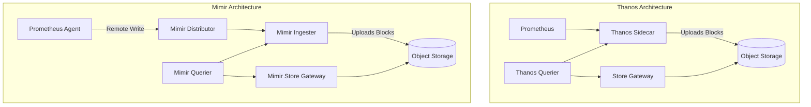

# Observability at Scale

## Learning Outcomes

- Configure Prometheus sharding and federation to handle scraping workloads that exceed single-node vertical scaling limits.
- Implement highly available, long-term metric storage using Grafana Mimir and S3-compatible object storage on bare metal.
- Design OpenTelemetry Collector pipelines for unified routing, batching, and sampling of metrics, logs, and traces.
- Diagnose and resolve high-cardinality explosions using relabeling rules, recording rules, and ingestion limits.
- Deploy and operate the Grafana LGTM (Loki, Grafana, Tempo, Mimir) stack with continuous profiling (Pyroscope) and exemplars.
- Mitigate alerting fatigue using advanced Alertmanager routing, grouping, and inhibition rules.

## The Limits of Single-Node Prometheus

Prometheus is designed primarily for reliability, favoring a shared-nothing architecture where a single binary scrapes targets, stores data locally in its Time Series Database (TSDB), and evaluates alerting rules. On bare-metal clusters exceeding 500 nodes or emitting millions of active series, a single Prometheus instance hits vertical scaling limits.

The primary bottlenecks are:
1. **Memory:** Prometheus keeps the head block (the last 2-3 hours of data) in memory. High active series count dictates memory requirements. OOM kills are common during high churn events (e.g., node rotation, massive deployment rollouts).
2. **CPU:** Evaluating complex PromQL queries over long time ranges or many series consumes significant CPU.
3. **Storage I/O:** Compacting the TSDB and appending to the Write-Ahead Log (WAL) requires fast NVMe drives. Spinning disks will cause WAL backpressure, leading to dropped scrapes.

### Hierarchical Federation vs. Sharding

When a single Prometheus cannot scrape all targets, the workload must be distributed.

**Hierarchical Federation** involves deploying multiple "leaf" Prometheus servers (e.g., one per namespace or failure domain) that scrape targets. A "global" Prometheus server then scrapes the leaf servers using the `/federate` endpoint, pulling only aggregated data (via `match[]` parameters) rather than raw metrics.

:::caution
Federation is an anti-pattern for simply moving all raw data to a central location. Pulling massive amounts of raw data via `/federate` will crash the global Prometheus. It must be used strictly for aggregating summary metrics (e.g., `job:http_requests:rate5m`).
:::

**Hash-based Sharding** distributes the scrape load across multiple identical Prometheus replicas. Each replica discovers all targets but only scrapes a subset based on a hash of the target's address.

```yaml
scrape_configs:
  - job_name: 'kubernetes-pods'
    kubernetes_sd_configs:
      - role: pod
    relabel_configs:
      # Keep only targets whose hash matches the shard index
      - source_labels: [__address__]
        modulus: 4    # Total number of shards
        target_label: __tmp_hash
        action: hashmod
      - source_labels: [__tmp_hash]
        regex: 0      # This specific shard's index (0, 1, 2, or 3)
        action: keep
```

### Prometheus Agent Mode

Introduced in v2.32, Agent mode (`--enable-feature=agent`) runs Prometheus without a local TSDB, alerting, or querying capabilities. It only scrapes targets, appends to the WAL, and remote-writes to a centralized storage backend (like Mimir or Thanos). This drastically reduces the memory footprint on edge nodes.

## Long-Term Storage: Thanos vs. Mimir

To achieve global querying, high availability, and long-term retention beyond the capacity of local NVMe drives, metrics must be shipped to a distributed system backed by object storage (e.g., MinIO or Ceph RGW on bare metal).

### Architecture Comparison

Both Thanos and Mimir aim to solve the same problem but take different architectural approaches.



| Feature | Thanos | Grafana Mimir |
|---------|--------|---------------|
| **Data Ingestion** | Pull (Querier reads from Sidecar) + Block upload | Push (Remote Write to Distributor) |
| **Prometheus Role** | Full Prometheus (with local TSDB) required | Agent mode sufficient (stateless scrape) |
| **Multitenancy** | Requires external proxies (e.g., Thanos Receive) | Native (tenant ID headers) |
| **Operational Complexity** | Lower (Sidecars piggyback on existing Prometheus) | Higher (Microservices architecture, requires Memcached/Redis) |
| **Query Performance** | Good, but query time depends on Sidecar availability | Excellent (extensive caching, query sharding, shuffle-sharding) |

**Bare Metal Recommendation:** If you already have a stable Prometheus setup and just need long-term retention, **Thanos** is less invasive. If you are building a centralized metrics platform for multiple internal teams (tenants) and need to isolate their workloads, **Mimir** is the superior choice.

## OpenTelemetry Collector Pipelines

The OpenTelemetry (OTel) Collector standardizes telemetry ingestion, processing, and exporting. Instead of running Fluentbit for logs, Promtail for Loki, and Jaeger Agent for traces, the OTel Collector handles all three signals.

### Deployment Patterns

1. **Agent (DaemonSet):** Runs on every node. Collects node metrics, container logs, and receives traces from local pods via localhost. Adds infrastructure metadata (node name, pod IP).
2. **Gateway (Deployment):** Runs as a standalone cluster. Receives data from Agents. Handles heavy processing (tail-based sampling, cardinality reduction, API key enrichment) before exporting to backends.

### Pipeline Configuration

The Collector configuration consists of Receivers, Processors, Exporters, and the Service pipeline that connects them.

```yaml
receivers:
  otlp:
    protocols:
      grpc:
        endpoint: 0.0.0.0:4317
      http:
        endpoint: 0.0.0.0:4318

processors:
  # Crucial for preventing OOMs in the Collector
  memory_limiter:
    check_interval: 1s
    limit_mib: 4000
    spike_limit_mib: 800
  
  # Adds Kubernetes metadata to telemetry
  k8sattributes:
    auth_type: "serviceAccount"
    passthrough: false
    extract:
      metadata:
        - k8s.pod.name
        - k8s.namespace.name

  batch:
    send_batch_size: 10000
    timeout: 10s

exporters:
  prometheusremotewrite:
    endpoint: "http://mimir-nginx.mimir.svc.cluster.local/api/v1/push"
  otlphttp/loki:
    endpoint: "http://loki-gateway.loki.svc.cluster.local/otlp"
  otlp/tempo:
    endpoint: "tempo-distributor.tempo.svc.cluster.local:4317"
    tls:
      insecure: true

service:
  pipelines:
    metrics:
      receivers: [otlp]
      processors: [memory_limiter, k8sattributes, batch]
      exporters: [prometheusremotewrite]
    traces:
      receivers: [otlp]
      processors: [memory_limiter, k8sattributes, batch]
      exporters: [otlp/tempo]
```

## The Grafana LGTM Stack

The LGTM stack (Loki, Grafana, Tempo, Mimir) shares a similar underlying microservices architecture: Distributors, Ingesters, Queriers, and Compactor components backed by object storage.

### Loki (Logs)
Loki does not index the content of logs. It only indexes labels. This makes it extremely cost-effective to operate but requires strict label discipline.
- **Gotcha:** Do not extract high-cardinality data (like `user_id` or `trace_id`) into Loki labels. Keep them in the log line and parse them at query time using LogQL (e.g., `| json | user_id="123"`). Extracting them into labels will create a new log stream for every user, overwhelming the Ingesters.

### Tempo (Traces)
Tempo stores trace data in Parquet format in object storage. It relies heavily on TraceQL for querying.
- **Exemplars:** Exemplars bridge the gap between metrics and traces. They attach a specific `trace_id` to a metric histogram bucket. In Grafana, this manifests as a diamond on a latency graph. Clicking the diamond jumps directly to the Tempo trace that experienced that exact latency, eliminating the need to manually search logs for the timeframe.

### Pyroscope (Continuous Profiling)
Pyroscope collects continuous CPU and memory profiles from applications. It allows you to diff profiles across time (e.g., "Why is CPU usage higher today than yesterday?").
- Deployment requires language-specific agents (e.g., eBPF for C/C++/Rust/Go, or native SDKs for Java/Python).

## Cardinality Management

Cardinality is the total number of unique time series in your TSDB.
`Active Series = Metric Name * Unique Label Combinations`

A single poorly designed metric can bring down an observability stack. For example:
`http_requests_total{path="/api/users/123", status="200"}`
If the user ID is in the path, every user creates a new series. This is a cardinality explosion.

### Mitigation Strategies

1. **Relabeling (Drop at Scrape Time):**
   If a developer exposes a bad metric, drop it before ingestion.
   ```yaml
   metric_relabel_configs:
     - source_labels: [__name__]
       regex: 'http_requests_total_bad_metric'
       action: drop
   ```

2. **Limits (Fencing):**
   Configure Mimir or Prometheus to reject scrapes that have too many series or labels.
   ```yaml
   # Prometheus scrape config
   sample_limit: 10000
   label_limit: 50
   label_name_length_limit: 200
   label_value_length_limit: 200
   ```

3. **Recording Rules (Aggregation):**
   Pre-compute expensive queries and store the result as a new, low-cardinality metric. Drop the raw high-cardinality metric after a short retention period.

## Alerting Fatigue Mitigation

Alert fatigue destroys on-call mental health. Alertmanager provides three mechanisms to control alert volume.

1. **Routing:** Send critical alerts to PagerDuty, warnings to Slack.
2. **Grouping:** Group alerts by `cluster` and `namespace`. If a node dies, you get one notification ("15 pods down on node-X") instead of 15 separate emails.
3. **Inhibition:** Suppress downstream alerts if an upstream alert is firing.

```yaml
inhibit_rules:
  # If the whole node is down, don't alert me about individual pods failing on that node.
  - source_matchers:
      - alertname = "NodeDown"
    target_matchers:
      - alertname = "TargetDown"
    equal: ['node']
```

:::tip
**Symptom-Based Alerting:** Alert on symptoms that affect users (e.g., "High Error Rate", "High Latency"), not on causes (e.g., "CPU at 90%"). High CPU is only a problem if it impacts latency or error rates. If it doesn't, it's just efficient resource utilization.
:::

## Hands-on Lab

In this lab, we will deploy a scalable, multi-tenant capable metric backend using Grafana Mimir, backed by a local MinIO instance, and configure a Prometheus Agent to remote-write to it.

### Prerequisites
- A running Kubernetes cluster (v1.32+).
- `helm` installed.
- `kubectl` configured.

### Step 1: Deploy MinIO (Object Storage Backend)

Mimir requires object storage for blocks, rules, and alerts. We will deploy a simple MinIO instance.

```bash
helm repo add bitnami https://charts.bitnami.com/bitnami
helm repo update

# Create a values file for MinIO
cat <<EOF > minio-values.yaml
auth:
  rootUser: admin
  rootPassword: supersecretpassword
defaultBuckets: "mimir-blocks,mimir-ruler,mimir-alertmanager"
persistence:
  size: 10Gi
EOF

helm install minio bitnami/minio -f minio-values.yaml -n observability --create-namespace
```

**Verification:**
```bash
kubectl get pods -n observability -l app.kubernetes.io/name=minio
# Expected: Pod is READY 1/1
```

### Step 2: Deploy Grafana Mimir

We will deploy Mimir in "monolithic" mode for the lab, but configure it to use the S3 backend. In production, you would deploy microservices.

```bash
helm repo add grafana https://grafana.github.io/helm-charts
helm repo update

cat <<EOF > mimir-values.yaml
mimir:
  structuredConfig:
    multitenancy_enabled: true
    blocks_storage:
      backend: s3
      s3:
        endpoint: minio.observability.svc.cluster.local:9000
        access_key_id: admin
        secret_access_key: supersecretpassword
        insecure: true
        bucket_name: mimir-blocks
    alertmanager_storage:
      backend: s3
      s3:
        endpoint: minio.observability.svc.cluster.local:9000
        access_key_id: admin
        secret_access_key: supersecretpassword
        insecure: true
        bucket_name: mimir-alertmanager
    ruler_storage:
      backend: s3
      s3:
        endpoint: minio.observability.svc.cluster.local:9000
        access_key_id: admin
        secret_access_key: supersecretpassword
        insecure: true
        bucket_name: mimir-ruler
EOF

helm install mimir grafana/mimir-distributed -f mimir-values.yaml -n observability
```

**Verification:**
Wait for the components to start.
```bash
kubectl get pods -n observability | grep mimir
# Expected: distributor, ingester, querier, store-gateway pods should be Running.
```

### Step 3: Deploy Prometheus in Agent Mode

Configure Prometheus to scrape its own metrics and remote write to Mimir, specifying a tenant ID header.

```bash
cat <<EOF > prom-agent.yaml
apiVersion: v1
kind: ConfigMap
metadata:
  name: prometheus-agent-config
  namespace: observability
data:
  prometheus.yml: |-
    global:
      scrape_interval: 15s
    scrape_configs:
      - job_name: 'prometheus'
        static_configs:
          - targets: ['localhost:9090']
    remote_write:
      - url: http://mimir-nginx.observability.svc.cluster.local/api/v1/push
        headers:
          X-Scope-OrgID: "tenant-a"
---
apiVersion: apps/v1
kind: Deployment
metadata:
  name: prometheus-agent
  namespace: observability
spec:
  replicas: 1
  selector:
    matchLabels:
      app: prometheus-agent
  template:
    metadata:
      labels:
        app: prometheus-agent
    spec:
      containers:
        - name: prometheus
          image: prom/prometheus:v2.51.0
          args:
            - "--config.file=/etc/prometheus/prometheus.yml"
            - "--enable-feature=agent"
          ports:
            - containerPort: 9090
          volumeMounts:
            - name: config
              mountPath: /etc/prometheus
      volumes:
        - name: config
          configMap:
            name: prometheus-agent-config
EOF

kubectl apply -f prom-agent.yaml
```

**Verification:**
Check the Prometheus agent logs to ensure it is successfully remote-writing.
```bash
kubectl logs -n observability deploy/prometheus-agent
# Expected: No "remote_write" error logs. Should see "WAL started" and scraping active.
```

**Troubleshooting:**
If the remote write fails, ensure the `mimir-nginx` service name matches the deployed Mimir gateway service, and that MinIO credentials are correct in the Mimir configuration. If Mimir ingesters crash, check if the buckets were successfully created in MinIO.

## Practitioner Gotchas

1. **The WAL Replay OOMKill:** When a Prometheus Pod restarts, it must replay the Write-Ahead Log (WAL) into memory before it can begin scraping or serving queries. If the WAL is massive (due to high cardinality or slow disk I/O preventing compaction), the replay will spike memory usage beyond the container's limits, resulting in continuous `OOMKilled` crash loops. *Fix:* Delete the `wal` directory (losing recent uncompacted data) to restore service, then implement metric limits.
2. **Loki "Maximum active streams" Errors:** Loki groups logs into "streams" based on their exact label combinations. If you map a highly dynamic Kubernetes label (like a `pod-template-hash` or a unique request ID) to a Loki label, you will exceed the tenant stream limits and Loki will reject ingestion with a 429 error. *Fix:* Ensure Promtail/OTel only promotes static infrastructure metadata (namespace, app name, cluster) to labels. Keep dynamic data in the JSON payload.
3. **Thanos Compactor Halting:** The Thanos Compactor is a singleton. It downloads blocks from object storage, deduplicates them, and uploads larger blocks. If multiple compactors run simultaneously, or if a block becomes corrupted, the Compactor will halt to prevent data loss, throwing "overlapping blocks" errors. *Fix:* Ensure only one Compactor runs per object storage bucket. Manually delete the `compactor-meta.json` or the specific overlapping block in object storage if corruption occurs.
4. **Agent Mode Dropped Scrapes:** Prometheus Agent mode has no local TSDB to buffer data for long periods. If the network to the remote-write endpoint (e.g., Mimir) goes down, the Agent will buffer data in its WAL up to the configured capacity. Once full, it will silently drop new scrapes. *Fix:* Monitor `prometheus_remote_storage_dropped_samples_total`. Size the WAL disk appropriately for expected network partition durations.

## Quiz

**1. A cluster experiences a network partition lasting 4 hours. The central Thanos Querier cannot reach the Thanos Sidecars running in that cluster. What happens to the metrics generated during this time once the network is restored?**
A. The metrics are permanently lost because Thanos Sidecars only serve real-time data.
B. The central Querier will fetch the metrics from the Sidecars, provided the local Prometheus instances had enough disk space to retain the data.
C. The Thanos Compactor will automatically synthesize the missing data using linear regression.
D. The metrics must be manually imported using the Prometheus remote-write API.
**Correct Answer: B** (Thanos Sidecars serve data directly from the local Prometheus TSDB. As long as the data hasn't aged out of the local retention window, it is recoverable).

**2. You notice your Loki Ingesters are constantly crashing with OutOfMemory errors, and ingestion performance is degrading. The application teams recently started logging a `transaction_id` with every request. Which of the following is the most likely cause?**
A. The `transaction_id` is being parsed from the JSON body during queries, exhausting query memory.
B. The Loki retention period is set too high, filling up the local disk.
C. The `transaction_id` was mapped to a Loki label, causing a massive cardinality explosion of log streams.
D. The OpenTelemetry Collector is batching too many logs at once.
**Correct Answer: C** (Loki creates a separate stream in memory for every unique combination of labels. High cardinality labels like IDs will exhaust memory).

**3. You are designing an OpenTelemetry Collector pipeline for a bare-metal Kubernetes cluster. You want to drop all logs that do NOT contain the word "error" before they are sent over the network to a central logging cluster. Where should this filtering logic reside?**
A. In a tail-based sampling Processor on the central Gateway Collectors.
B. In a filter Processor on the Agent (DaemonSet) Collectors running on each node.
C. In the Receiver configuration of the central Gateway Collectors.
D. In the Promtail Sidecar attached to each application pod.
**Correct Answer: B** (Filtering at the edge/Agent level prevents unnecessary network transmission and reduces load on the central Gateway).

**4. A single Prometheus server is consuming 60GB of RAM and frequently OOMKills. You analyze the TSDB and find 15 million active series. You want to scale the scraping workload without losing any data or setting up a complex microservices backend like Mimir yet. What is the most appropriate architectural change?**
A. Switch Prometheus to Agent Mode.
B. Implement Hierarchical Federation to pull all metrics to a larger machine.
C. Implement Hash-based Sharding across multiple Prometheus replicas.
D. Decrease the scrape interval from 15s to 60s.
**Correct Answer: C** (Hash-based sharding divides the 15 million series across multiple smaller Prometheus instances, reducing the memory footprint of each without requiring a new backend).

**5. You are receiving 50 individual emails every time a physical rack loses power because 50 database pods go down simultaneously. What is the correct Alertmanager configuration to fix this fatigue?**
A. Create an `inhibit_rule` that suppresses Pod alerts if a Rack alert is firing.
B. Set the `repeat_interval` to 24 hours for all alerts.
C. Create a `route` that groups alerts by `rack_id`.
D. Both A and C.
**Correct Answer: D** (Grouping consolidates the 50 pod alerts into one notification. Inhibition suppresses the pod alerts entirely if the rack itself is the known root cause).

## Further Reading

- [Prometheus Hash-based Sharding Documentation](https://prometheus.io/docs/prometheus/latest/configuration/configuration/#relabel_config)
- [Grafana Mimir Architecture](https://grafana.com/docs/mimir/latest/core-concepts/architecture/)
- [Thanos Architecture and Design](https://thanos.io/tip/thanos/design.md/)
- [OpenTelemetry Collector Deployment Patterns](https://opentelemetry.io/docs/collector/deployment/gateway/)
- [Loki Label Best Practices](https://grafana.com/docs/loki/latest/get-started/labels/)