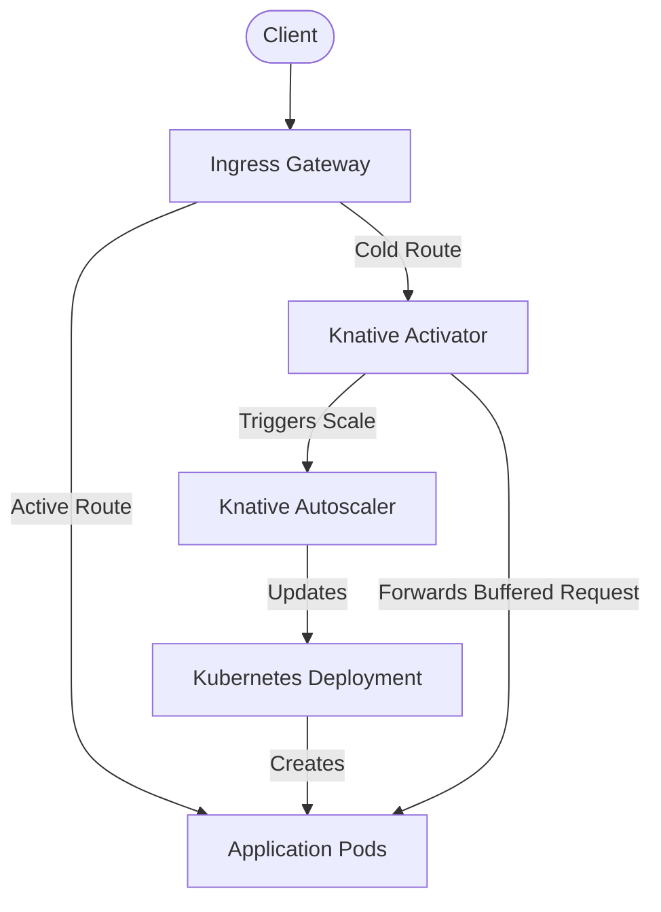
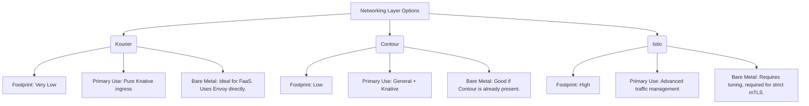

# Serverless on Bare Metal

## Learning Outcomes

*   **Design and evaluate** Knative Serving architectures alongside bare-metal compatible networking layers like Kourier and Contour.
*   **Implement** event-driven scale-to-zero workloads utilizing KEDA and external metric triggers.
*   **Compare and contrast** the architectural trade-offs between full Serverless platforms and lightweight FaaS frameworks in on-premises environments.
*   **Diagnose** cold start latency issues and implement mitigation strategies for compiled and interpreted application runtimes.
*   **Configure** Knative Eventing brokers and triggers for decoupled message processing on premises.

## Why This Module Matters

In early 2024, a major European telecommunications provider attempted to migrate a legacy VM-based messaging application to a bare-metal Kubernetes cluster. They aimed to reduce compute overhead by running their asynchronous SMS processing workers as serverless functions. Because they relied exclusively on a vanilla Horizontal Pod Autoscaler, they could not scale their idle workloads to zero. As a result, hundreds of processing pods remained active during off-peak hours, consuming vast amounts of reserved memory and CPU, entirely defeating the purpose of their serverless migration.

When they subsequently attempted to integrate a poorly configured event-driven framework to achieve scale-to-zero, they encountered severe network routing loops and dropped packets at the ingress layer. The resulting cold starts caused thousands of dropped SMS messages during a critical holiday surge. This architectural misstep cost the company over three million euros in service-level agreement (SLA) penalties and required an emergency rollback to their legacy virtual machines.

Mastering serverless architectures on bare metal is not merely about adopting a new deployment syntax; it is about taking absolute control of your compute footprint. In a managed cloud environment, the provider handles the complex ingress buffering and metric pipelines necessary to wake sleeping pods. On bare metal, you are the cloud provider. You must construct the exact mechanisms that detect an incoming request, buffer the connection, spin up the workload, and route the traffic without dropping the client connection. This module equips you with the deeply technical knowledge required to build and operate these mechanisms safely, efficiently, and with the utmost reliability.

## Did You Know?

*   Knative was accepted to CNCF on March 2, 2022 (Incubating) and moved to Graduated on September 11, 2025.
*   KEDA is a CNCF graduated project; it joined as Sandbox in 2020, moved to Incubating in 2021, and moved to Graduated on August 22, 2023.
*   KEDA’s 2.19 documentation shows tested Kubernetes compatibility for versions 1.32–1.34 and states compatibility follows an N-2 policy with possible maintainer extensions.
*   OpenFaaS Community Edition is limited for commercial use and intended for personal/non-production scenarios with a 60-day commercial usage limit.

## The Bare Metal Serverless Paradigm

Running serverless architectures on bare metal shifts the operational burden entirely onto the platform engineering team. In public cloud environments, serverless abstracts infrastructure management away from the user. On bare metal, the goal is no longer avoiding infrastructure management, but rather optimizing resource utilization through aggressive bin-packing and accelerating developer velocity via simplified deployment abstractions. 

Cloud providers rely on proprietary load balancers, deeply integrated metric pipelines, and hidden control planes to route cold-start traffic and trigger rapid scaling. On bare metal, you must wire ingress controllers, service meshes, and metric adapters manually to achieve the exact same request-driven scaling mechanics. You are responsible for ensuring that the underlying network can route traffic to dynamically created endpoints within milliseconds.

Knative serves as the premier solution for this challenge. Knative is an open CNCF serverless and event-driven layer for Kubernetes with three components: Serving, Eventing, and Functions. By leveraging these components, you can transform a static bare-metal cluster into a highly dynamic, request-driven compute engine.

Crucially, Knative runs on any Kubernetes cluster, including on-premises environments. It does not rely on proprietary cloud hooks. Furthermore, Knative can be installed in production on an existing Kubernetes cluster (YAML or operator) and supports quickstart local installs on kind/Minikube. This portability ensures that the serverless workloads you design for your bare-metal datacenter can be seamlessly tested on a developer's laptop or eventually migrated to a public cloud if business needs dictate.

> **Pause and predict**: If you deploy a serverless function that scales to zero, what must happen to the very first network request that arrives before the container has even started? How does the system prevent the client from immediately receiving a "Connection Refused" error?

## Knative: Serving and Eventing Foundations

Knative provides the foundational primitives for request-driven compute and complex event routing. The architecture is modular by design. Knative Serving and Eventing can be installed independently, allowing platform teams to adopt only the capabilities they strictly require without bloating their control plane.

### Knative Serving Architecture

Knative Serving builds directly on Kubernetes to support deploying and serving serverless applications. It handles the complex routing, revision tracking, and autoscaling required for serverless workloads. Most importantly, Knative Serving supports autoscaling to zero and allows this behavior to be controlled via scale-to-zero configuration.

To achieve this, Knative declares that its services are built on Kubernetes pods/CRDs and manages workload lifecycle through Kubernetes-native resources. This means operators can inspect Knative workloads using standard `kubectl` commands.



Let's break down the critical components of this architecture:

*   **Autoscaler (KPA):** The Knative Pod Autoscaler collects metrics, primarily concurrency or requests-per-second (RPS), directly from the workload pods. It dictates the desired scale of the deployment. When these metrics drop to zero for a configurable grace period, the KPA scales the underlying deployment to zero.
*   **Activator:** This is the most critical component for scale-to-zero operations. When a service is scaled to zero, the ingress routing table is dynamically updated to point to the Activator instead of the non-existent application pods. The Activator accepts the incoming request, buffers it in memory, and instantly reports the metric spike to the Autoscaler. It then waits patiently for the application pods to become ready, at which point it proxies the buffered requests to the newly spawned pods.
*   **Queue-Proxy:** A lightweight sidecar container injected into every Knative Service pod. It enforces strict concurrency limits and continuously reports metrics back to the Autoscaler.

### Networking Layer on Bare Metal

Knative Serving requires an ingress networking layer to manage traffic routing, load balancing, and traffic splitting between different revisions of a service. While Istio is a common choice in enterprise environments, it carries a massive operational footprint and complexity. For bare metal deployments focused purely on serverless execution, lightweight alternatives are often vastly preferred.

| Networking Layer | Footprint | Primary Use Case | Bare Metal Considerations |
| :--- | :--- | :--- | :--- |
| **Kourier** | Very Low | Pure Knative ingress | Ideal for strict FaaS environments. Uses Envoy. Directly exposes LoadBalancer or NodePort services. |
| **Contour** | Low | General Ingress + Knative | Good if Contour is already handling cluster ingress. |
| **Istio** | High | Advanced traffic management | Required if mTLS or complex cross-service auth is needed. Requires significant tuning. |

To visualize this table architecturally, consider the following flowchart of your ingress choices:



> **Caution:** When using bare metal without a MetalLB or Cilium BGP setup, Knative ingress gateways will default to `NodePort` or remain pending as `LoadBalancer`. Ensure your L2/L3 VIP configuration is entirely functional before attempting to deploy Knative, otherwise external traffic will simply drop.

### Knative Eventing

While Knative Serving focuses on request-driven synchronous traffic, Knative Eventing provides the infrastructure for routing asynchronous events from producers to consumers utilizing the open CloudEvents specification. 

*   **Broker:** A routing hub for events. Producers fire events into the Broker, remaining entirely unaware of who or what will consume them.
*   **Trigger:** Defines a strict filter and a subscriber destination. Consumers create Triggers to specify exactly which events they want the Broker to forward to them.
*   **Channel / Subscription:** Lower-level primitives for direct publish/subscribe mechanics without the Broker's filtering complexity.

On bare metal environments, the backing storage for Brokers and Channels dictates your system's reliability. The default in-memory channel provided during installation is strictly for development. Production bare-metal deployments require a robust backing store, such as the Kafka broker implementation, to ensure at-least-once delivery semantics and prevent message loss during hardware failures.

### Configuring Brokers and Triggers

To configure an in-memory Broker and a corresponding Trigger that routes specific filtered events to a Knative Service, you must apply the following definitions. Note that they are separated here into distinct documents to ensure clean YAML parsing and application.

```yaml
apiVersion: eventing.knative.dev/v1
kind: Broker
metadata:
  name: default
  namespace: default
```

```yaml
apiVersion: eventing.knative.dev/v1
kind: Trigger
metadata:
  name: my-service-trigger
  namespace: default
spec:
  broker: default
  filter:
    attributes:
      type: dev.knative.samples.helloworld
  subscriber:
    ref:
      apiVersion: serving.knative.dev/v1
      kind: Service
      name: hello
```

## KEDA: Event-Driven Autoscaling

Knative Serving is brilliant at scaling based on HTTP request concurrency, but what if your workload processes messages from a RabbitMQ queue, reads from a Kafka topic, or executes based on a schedule? This is where KEDA shines.

KEDA is a Kubernetes-based autoscaler that provides event-driven scale for Kubernetes workloads. KEDA is not a function-as-a-service platform itself; rather, it is a highly specialized autoscaling engine that works alongside and enhances the standard Horizontal Pod Autoscaler (HPA).

KEDA supports scaling Kubernetes Deployments and StatefulSets and can also scale custom resources that expose the Kubernetes `/scale` subresource. This flexibility allows platform engineers to bring serverless scaling characteristics to entirely legacy workloads, provided they are packaged correctly in Kubernetes.

> **Stop and think**: If a custom resource does not expose the `/scale` subresource, can KEDA scale it directly? How might you architect a workaround if you are forced to scale a proprietary operator?

### Scale-to-Zero Mechanics with KEDA

The standard Kubernetes HPA fundamentally cannot scale workloads to zero. It requires at least one pod to exist so that metrics can be scraped. KEDA elegantly bridges this architectural gap.

1.  **Metric Server Adapter:** KEDA acts directly as a Kubernetes Metrics Server, exposing external metrics (like queue depths) to the cluster's internal HPA.
2.  **KEDA Operator:** The KEDA controller continuously monitors the external event source.
3.  **Scale 0 -> 1:** When the event source transitions from an empty state to having work (e.g., a message arrives in the queue), the KEDA operator bypasses the HPA and directly scales the workload Deployment from 0 to 1.
4.  **Scale 1 -> N:** Once the workload is running and processing, KEDA steps back and hands off the scaling logic to the standard HPA, continuously feeding it the translated external metrics.
5.  **Scale 1 -> 0:** When the queue empties, the HPA scales the deployment down to its configured minimum (usually 1). The KEDA operator detects the empty queue and forces the final scale down to 0.

```yaml
apiVersion: keda.sh/v1alpha1
kind: ScaledObject
metadata:
  name: rabbitmq-worker-scaler
spec:
  scaleTargetRef:
    name: rabbitmq-worker
  minReplicaCount: 0
  maxReplicaCount: 50
  triggers:
  - type: rabbitmq
    metadata:
      queueName: task_queue
      queueLength: "5"
```

> **Tip:** KEDA polling intervals dictate exactly how quickly a scale-from-zero event occurs. Aggressive polling (e.g., every 1 second) against massive external systems can induce severe control-plane starvation. Default polling is typically 30 seconds, which must be factored into your SLA calculations.

## Alternative FaaS Frameworks

If Knative provides the heavy infrastructure, alternative FaaS frameworks focus entirely on the developer experience and simplicity. Knative generally requires developers to build and push container images. Dedicated FaaS frameworks often abstract the container build process, allowing developers to deploy raw source code directly to the cluster.

### OpenFaaS

OpenFaaS focuses heavily on operational simplicity. OpenFaaS CE and Pro documentation says OpenFaaS can run on any Kubernetes cluster, including self-managed on-prem or managed cloud. It uses a centralized API Gateway to route traffic to functions. Functions are cleanly packaged as containers via the `faas-cli` and utilize internal watchdog processes to pipe HTTP requests to standard input.

*   **Architecture:** The core platform consists of an API Gateway, NATS (for asynchronous execution), a Queue Worker, and Prometheus.
*   **Scaling:** OpenFaaS uses Prometheus metrics (RPS) read by the API Gateway to scale function deployments. It supports scale-to-zero via the `faas-idler` component.

However, organizations must be acutely aware of licensing. OpenFaaS Community Edition is limited for commercial use and intended for personal/non-production scenarios with a 60-day commercial usage limit. Deploying CE into a revenue-generating environment violates this limit.

Furthermore, deployment topology matters. OpenFaaS CE requires a Kubernetes cluster with full internet access continuously; air-gapped/restricted environments are positioned as better fit for OpenFaaS Standard. The CE edition routinely checks external registries and validation endpoints, which will instantly crash loop in a disconnected datacenter.

For extreme edge use cases or isolated bare-metal environments lacking a full orchestration control plane, OpenFaaS can also be deployed as faasd on a single host without Kubernetes, using containerd and CNI. This makes it an incredibly versatile tool for IoT gateways or isolated industrial servers.

### Fission

Fission optimizes aggressively for cold start latency by maintaining a pool of pre-warmed environment containers. The Fission architecture consists of four primary components: a Controller, a Router, Environments (the pre-warmed containers), and a Builder (which compiles code in-cluster). When a request arrives, the router grabs a pre-warmed container, dynamically injects the function code, and routes the request. This provides near-instant cold starts (sub-100ms) but breaks the pattern of immutable container images, which often triggers alerts in strictly governed enterprise security environments. Additionally, maintaining these warm pools leads to a higher baseline resource consumption compared to scale-to-zero platforms.

## Cold Start Optimization on Bare Metal

Cold starts remain the primary operational hurdle in any serverless environment. A cold start consists of a strictly sequential chain of events:
1.  Kubernetes scheduling the Pod to an available node.
2.  The container runtime executing the image pull over the network.
3.  The container runtime starting the container process.
4.  The application framework bootstrapping (e.g., initializing the JVM or Node event loop).
5.  The readiness probe finally passing and returning a 200 OK.

On bare metal, network latency to an external container registry across the public internet is almost always the largest and most unpredictable variable.

### Mitigation Strategies

1.  **Image Locality and Aggressive Pre-pulling:** Utilize local registry mirrors (such as Harbor) running on the exact same L2 network as the compute nodes. Utilize tools like `kube-flannel` or specialized DaemonSets to pre-pull large base images onto all nodes before they are requested by a serverless workload.
2.  **Runtime Selection and AOT Compilation:** Interpreted languages (Node.js, Python) have moderate startup times. JIT-compiled languages (Java/Spring, C#) suffer from extreme cold starts. Utilizing Ahead-of-Time (AOT) compiled languages like Go, Rust, or GraalVM Java offers the absolute best cold start performance, often cutting boot times from 15 seconds to under 50 milliseconds.
3.  **Init Container Elimination:** Strictly avoid init containers in serverless workloads. They execute sequentially and completely block the main application container from even beginning to start.
4.  **CPU Bursting Capabilities:** Container startup is inherently a massively CPU-intensive operation. Ensure serverless workloads have high CPU limits (or no limits at all) relative to their base requests, allowing them to instantly burst and consume idle node cycles during their critical initialization phase.

## Common Mistakes

| Mistake | Why It Happens | How to Fix It |
| :--- | :--- | :--- |
| **The Activator Bottleneck under burst load** | If cold start latency is high, a rapid traffic spike can exhaust the Knative Activator's memory and connection pools, leading to cascading 503 errors. | Ensure Activator deployments are scaled out and configured with appropriate resource limits in high-burst environments. |
| **Relying on default DNS resolution for bare-metal testing** | Without cloud DNS integrators, wildcard routing fails, causing Knative services to remain entirely unreachable via standard URLs. | Deploy the `serving-default-domain.yaml` or configure a custom DomainMapping pointing directly to your Ingress IP. |
| **Deploying Istio without mTLS needs** | Istio introduces massive control-plane overhead and proxy memory consumption, which is often overkill for pure FaaS. | Use Kourier as a lightweight alternative unless your security posture explicitly mandates Istio's advanced cross-service features. |
| **Aggressive KEDA polling against heavy backends** | Polling a massive Kafka cluster or monolithic database every second can induce severe control-plane starvation and network congestion. | Use a minimum 30-second polling interval or leverage webhook-based scaling triggers where supported by the external system. |
| **Overlooking OpenFaaS CE limits** | The Community Edition restricts commercial usage to 60 days, leading to potential licensing violations in production deployments. | Evaluate OpenFaaS Standard or Pro for commercial workloads, or migrate entirely to a fully open-source CNCF graduated project. |
| **Ignoring image locality for cold starts** | Bare-metal nodes fetching multi-gigabyte container images from external registries will consistently time out the edge ingress proxy. | Implement local L2 registry mirrors, utilize daemonsets for pre-pulling base images, and eliminate sequential init containers. |
| **Mismatched ingress timeouts** | The external LoadBalancer or edge proxy has a hard timeout that is shorter than the application's cold start time, resulting in 504 errors even if the pod eventually boots. | Align upstream ingress timeouts with the 99th percentile cold start time of your slowest serverless workload. |
| **Ignoring metric resolution delays** | Default Prometheus scraping intervals are 15-30 seconds. Relying on external Prometheus queries for KEDA or Knative scaling artificially delays reaction time by the scrape interval. | Use dedicated, tightly polled metric adapters for scaling components rather than general-purpose cluster monitoring pipelines. |
| **Failing to configure scale-to-zero bounds** | Workloads will scale infinitely or fail to scale down, consuming unnecessary resources or overwhelming the cluster memory. | Explicitly define the scale-to-zero configuration and establish strict maximum replica bounds in the Knative Service definition. |
| **Deploying OpenFaaS CE air-gapped** | The CE installation mechanism and runtime checks mandate continuous internet access, causing immediate and permanent crash loops. | Transition to OpenFaaS Standard for restricted environments, or deploy an entirely air-gap compatible framework. |
| **Abrupt pod termination during scale-down** | If a worker exits before acknowledging a queue message, the message returns to the queue, triggering an endless scale-up loop. | Implement robust SIGTERM handlers for graceful shutdown, and ensure `minReplicaCount: 1` if graceful shutdown cannot guarantee completion. |

## Hands-on Lab

This comprehensive lab walks through deploying Knative Serving utilizing Kourier for ingress, deploying a highly optimized scale-to-zero service, and explicitly testing the autoscaler behavior on your bare-metal cluster.

### Prerequisites
*   A running Kubernetes cluster.
*   `kubectl` configured with administrative access.
*   The cluster must be capable of allocating `LoadBalancer` IPs (e.g., via MetalLB) or you must access services via `NodePort`.

### Step 1: Install Knative Serving CRDs and Core Components

You must first install the foundational Knative Serving components directly from the official release artifacts.

```bash
kubectl apply -f https://github.com/knative/serving/releases/download/knative-v1.14.0/serving-crds.yaml
kubectl apply -f https://github.com/knative/serving/releases/download/knative-v1.14.0/serving-core.yaml
```

**Verification:**
Wait a few moments, then verify the core components are actively running.
```bash
kubectl get pods -n knative-serving
# Expected: activator, autoscaler, controller, webhook are Running.
```

### Step 2: Install Kourier Networking Layer

Kourier acts as the incredibly lightweight ingress gateway for Knative, perfectly suited for bare metal.

```bash
kubectl apply -f https://github.com/knative/net-kourier/releases/download/knative-v1.14.0/kourier.yaml
kubectl patch configmap/config-network \
  --namespace knative-serving \
  --type merge \
  --patch '{"data":{"ingress-class":"kourier.ingress.networking.knative.dev"}}'
```

**Verification:**
Ensure the Kourier service has successfully acquired an IP.
```bash
kubectl get svc kourier -n kourier-system
# Expected: A LoadBalancer service with an external IP or pending state.
```

Capture the External IP or NodePort. If using MetalLB, it will assign a routable IP. For the purposes of this lab execution, assume MetalLB assigned the IP `192.168.100.50`.

```bash
export INGRESS_HOST=$(kubectl -n kourier-system get svc kourier -o jsonpath='{.status.loadBalancer.ingress[0].ip}')
```

### Step 3: Configure DNS Magic (sslip.io)

For lab environments, you must configure Knative to utilize a magic DNS service. This ensures that Services get automatically resolvable URLs based on the Ingress IP without requiring manual DNS configuration.

```bash
kubectl apply -f https://github.com/knative/serving/releases/download/knative-v1.14.0/serving-default-domain.yaml
```

### Step 4: Deploy a Knative Service

Create and deploy a highly responsive Knative Service utilizing a pre-built Go binary image.

```bash
cat <<EOF | kubectl apply -f -
apiVersion: serving.knative.dev/v1
kind: Service
metadata:
  name: hello
  namespace: default
spec:
  template:
    spec:
      containers:
        - image: gcr.io/knative-samples/helloworld-go
          env:
            - name: TARGET
              value: "Bare Metal"
EOF
```

**Verification:**
Check the status of your newly deployed Knative Service (ksvc).
```bash
kubectl get ksvc hello
# Expected:
# NAME    URL                                      LATESTCREATED   LATESTREADY     READY   REASON
# hello   http://hello.default.192.168.100.50.sslip.io   hello-00001     hello-00001     True
```

### Step 5: Test Scale-to-Zero and Cold Start

Wait approximately 60 seconds without sending any traffic to the service. Observe the Pods in the default namespace.

```bash
kubectl get pods
# Expected: No pods found in default namespace. The service has scaled to zero.
```

Trigger a massive cold start by issuing a direct HTTP request. The request will hang momentarily while the Knative Activator buffers the connection and the cluster aggressively spins up the pod.

```bash
curl http://hello.default.${INGRESS_HOST}.sslip.io
# Expected Output (after a slight delay): Hello Bare Metal!
```

Check the pods immediately after the request completes:

```bash
kubectl get pods
# Expected: One pod running.
```

**Lab Success Checklist:**
- [ ] Knative Serving core components deployed successfully.
- [ ] Kourier networking layer configured and actively routing traffic.
- [ ] Magic DNS correctly resolving directly to the LoadBalancer IP.
- [ ] Hello-world service deployed, reachable, and returning the expected payload.
- [ ] Service successfully scales back down to zero after a period of inactivity.

## Quiz

<details>
<summary><b>Question 1: The Activator Bottleneck</b></summary>
<b>Scenario:</b> You deploy a Knative Service configured to scale to zero. During a load test, the service scales down to zero after the test ends. You then trigger a sudden, massive spike of tens of thousands of requests. You observe the cluster's memory usage spike dangerously, followed by cascading 503 errors before any application pods become ready. Which component is most likely under-provisioned and failing under the sudden load?
<br><br>
<b>Options:</b><br>
A) The Istio Ingress Gateway, because it cannot route traffic to zero pods.<br>
B) The Knative Autoscaler, because it fails to calculate metrics fast enough.<br>
C) The Knative Activator, because it exhausts its connection pool buffering the massive traffic spike.<br>
D) The queue-proxy sidecar, because it cannot enforce concurrency limits during boot.
<br><br>
<b>Correct Answer: C</b>
<br><br>
<b>Explanation:</b> When a Knative service is scaled to zero, all incoming traffic is routed directly to the Activator. The Activator's job is to hold those TCP connections open while it waits for the Autoscaler to spin up new pods. If an incredibly massive spike hits while the service is at zero, the Activator will quickly exhaust its internal connection pools and memory buffers, resulting in cascading 503 errors before the application pods ever get a chance to start. You must provision the Activator appropriately for your expected burst traffic.
</details>

<details>
<summary><b>Question 2: Legacy Subresource Scaling</b></summary>
<b>Scenario:</b> You are implementing an event-driven architecture with an internal, legacy application deployed via a custom, proprietary Kubernetes operator. A developer proposes using KEDA to scale this custom resource based on the depth of an external Kafka topic. What technical requirement must be met for this to succeed?
<br><br>
<b>Options:</b><br>
A) The custom resource must implement the Knative queue-proxy sidecar.<br>
B) The custom resource must expose the Kubernetes `/scale` subresource.<br>
C) The custom resource must run strictly as a StatefulSet.<br>
D) The custom resource must bypass the HPA entirely.
<br><br>
<b>Correct Answer: B</b>
<br><br>
<b>Explanation:</b> KEDA supports scaling standard Kubernetes Deployments and StatefulSets out of the box. However, it can also scale any custom resource provided that the resource explicitly exposes the standard Kubernetes `/scale` subresource. If the proprietary operator does not implement this subresource, KEDA has no standardized API mechanism to instruct the resource to increase or decrease its replica count.
</details>

<details>
<summary><b>Question 3: OpenFaaS Deployment Environments</b></summary>
<b>Scenario:</b> A defense contractor attempts to deploy OpenFaaS Community Edition into a highly secure, completely air-gapped bare-metal facility. The deployment fails continuously, with core services entering endless crash loops. What is the fundamental architectural reason for this failure?
<br><br>
<b>Options:</b><br>
A) OpenFaaS CE requires a Kubernetes cluster with full internet access continuously.<br>
B) OpenFaaS CE lacks support for strict mTLS encryption.<br>
C) OpenFaaS CE cannot run on bare-metal nodes, only cloud provider VMs.<br>
D) OpenFaaS CE requires a minimum of 50 compute nodes to initialize.
<br><br>
<b>Correct Answer: A</b>
<br><br>
<b>Explanation:</b> OpenFaaS Community Edition is explicitly designed for personal and non-production environments with internet connectivity. It requires a Kubernetes cluster with full internet access continuously to validate licensing, fetch updates, and pull specific remote assets. For air-gapped or heavily restricted environments, the official documentation states that these are a better fit for OpenFaaS Standard, which is designed to operate seamlessly without external connectivity.
</details>

<details>
<summary><b>Question 4: Asynchronous Processing Pipeline</b></summary>
<b>Scenario:</b> You are designing an asynchronous document processing pipeline. PDF uploads are saved to an S3-compatible store, which places a message on a Kafka topic. Processing a single PDF takes 4-5 minutes and consumes heavy CPU. You want the processing workers to scale down to zero when no documents are queued. Which architectural approach is best suited for this bare-metal Kubernetes environment?
<br><br>
<b>Options:</b><br>
A) Knative Serving, utilizing the Kafka ingress adapter.<br>
B) KEDA, scaling a standard Kubernetes Deployment based on Kafka topic lag.<br>
C) OpenFaaS, using the synchronous API gateway.<br>
D) Fission, utilizing pre-warmed environment pods.
<br><br>
<b>Correct Answer: B</b>
<br><br>
<b>Explanation:</b> KEDA scaling a standard Kubernetes Deployment is best suited for asynchronous, long-running processes (like a 4-5 minute PDF processor) triggered by a message queue. Knative Serving, OpenFaaS, and Fission are primarily designed for synchronous, short-lived HTTP request-response workloads, making them inappropriate for heavy background processing.
</details>

<details>
<summary><b>Question 5: Single Node Edge Computing</b></summary>
<b>Scenario:</b> A rapidly growing agricultural startup needs to deploy a serverless platform onto a single, isolated bare-metal server located in a remote farming facility. They do not have the resources or need to run a full Kubernetes cluster on this single node, but they desperately want FaaS capabilities. Which deployment architecture solves this exact problem?
<br><br>
<b>Options:</b><br>
A) Knative Serving installed via operator.<br>
B) KEDA installed with an embedded etcd instance.<br>
C) OpenFaaS deployed as faasd on the single host.<br>
D) Fission deployed using Minikube.
<br><br>
<b>Correct Answer: C</b>
<br><br>
<b>Explanation:</b> While most serverless frameworks require a massive Kubernetes control plane, OpenFaaS offers a unique deployment model. OpenFaaS can also be deployed as `faasd` on a single host entirely without Kubernetes. It utilizes standard `containerd` and CNI directly, providing the exact same developer API and FaaS experience without the crushing overhead of maintaining a Kubernetes cluster on a resource-constrained edge device.
</details>

<details>
<summary><b>Question 6: Knative Component Isolation</b></summary>
<b>Scenario:</b> A security-conscious financial institution wants to leverage Knative for its excellent request-driven scale-to-zero capabilities. However, their internal policy strictly forbids deploying any unapproved message brokers or event routing hubs within the cluster. How should the platform team approach the Knative installation?
<br><br>
<b>Options:</b><br>
A) They cannot proceed; Knative requires all components to be installed simultaneously.<br>
B) They should install Knative Serving independently of Knative Eventing.<br>
C) They must install Eventing but disable the Broker via a custom admission controller.<br>
D) They should use KEDA instead, as Knative cannot function without Eventing.
<br><br>
<b>Correct Answer: B</b>
<br><br>
<b>Explanation:</b> Knative is heavily modular by design. Knative Serving and Eventing can be installed completely independently of one another. The platform team can install Knative Serving to gain the advanced HTTP request-driven autoscaling and scale-to-zero capabilities, while entirely omitting the Knative Eventing components to remain compliant with their strict internal security policies.
</details>

<details>
<summary><b>Question 7: Resource Exhaustion Failures</b></summary>
<b>Scenario:</b> A team deploys several asynchronous workloads using Knative Serving. They notice that after a week, the bare-metal cluster is completely out of memory. Upon investigation, they discover that hundreds of Knative pods are sitting idle, having successfully spun up to process requests but never scaling back down. What critical configuration was missed?
<br><br>
<b>Options:</b><br>
A) The team forgot to install KEDA alongside Knative.<br>
B) The team failed to configure the scale-to-zero bounds in the Knative Service.<br>
C) The underlying Kubernetes HPA was set to a minimum of 5.<br>
D) The Kourier ingress gateway dropped the termination signals.
<br><br>
<b>Correct Answer: B</b>
<br><br>
<b>Explanation:</b> Knative Serving absolutely supports autoscaling to zero, but it allows this behavior to be strictly controlled via scale-to-zero configuration annotations on the Knative Service itself. If the team explicitly disabled this feature, or misconfigured the grace periods and bounds, the workloads will remain active indefinitely, consuming precious bare-metal resources even when totally idle.
</details>

<details>
<summary><b>Question 8: Fission Cold Start Optimization</b></summary>
<b>Scenario:</b> A platform team implements Fission on their bare metal cluster to minimize cold start times for a high-frequency internal API. After a successful rollout, the security team flags the deployment, noting that the containers running the Python functions do not match the image hashes pushed by the CI/CD pipeline. What architectural mechanism in Fission explains this discrepancy?
<br><br>
<b>Options:</b><br>
A) Fission compiles Python into a statically linked binary at runtime, changing the image hash.<br>
B) Fission bypasses the container runtime and runs functions directly on the host.<br>
C) Fission injects function code dynamically into pre-warmed, generic environment containers upon request.<br>
D) Fission modifies the container's entrypoint to download code from an external git repository on every start.
<br><br>
<b>Correct Answer: C</b>
<br><br>
<b>Explanation:</b> Fission achieves sub-100ms cold starts by maintaining a pool of pre-warmed environment containers. When a request arrives, it injects the raw function code dynamically. This breaks the pattern of immutable container images, which triggers alerts in strictly governed environments because the running container no longer matches a static, scannable image hash from the registry.
</details>

<details>
<summary><b>Question 9: Initial Request Routing</b></summary>
<b>Scenario:</b> A developer troubleshooting cold starts on a bare-metal Knative cluster bypasses the ingress and sends an HTTP request directly to the ClusterIP of an application pod that has just been scaled to zero. The request immediately fails with 'Connection Refused' instead of pausing and completing. Why didn't Knative buffer the request and spin up a new pod?
<br><br>
<b>Options:</b><br>
A) The developer bypassed the Knative Activator, which is dynamically inserted into the ingress routing table when the service scales to zero to hold connections.<br>
B) The Knative Autoscaler only monitors requests that pass through the queue-proxy sidecar, which had already terminated.<br>
C) The Istio Ingress Gateway is strictly required to hold connections for Knative services during cold starts.<br>
D) Knative Services do not support ClusterIP routing and only listen on NodePort or LoadBalancer interfaces.
<br><br>
<b>Correct Answer: A</b>
<br><br>
<b>Explanation:</b> When a Knative Service is scaled to zero, the ingress routing table is updated to point to the Activator instead of non-existent application pods. The Activator is the component responsible for buffering the request and triggering the scale-up. By bypassing the ingress layer and hitting the pod IP directly, the developer bypassed the Activator entirely, resulting in an immediate connection failure.
</details>

<details>
<summary><b>Question 10: Runtime Cold Start Risks</b></summary>
<b>Scenario:</b> When migrating a set of HTTP-triggered, synchronous microservices to Knative Serving on a bare-metal cluster, which language/framework combination will present the highest operational risk regarding cold start latency under unpredictable traffic patterns?
<br><br>
<b>Options:</b><br>
A) Go (compiled statically).<br>
B) Rust (compiled dynamically).<br>
C) Node.js (Express framework).<br>
D) Java (Spring Boot framework, JIT compiled).
<br><br>
<b>Correct Answer: D</b>
<br><br>
<b>Explanation:</b> JIT-compiled languages like Java (especially with heavy frameworks like Spring Boot) suffer from extreme cold starts due to JVM initialization and framework bootstrapping. Statically compiled languages (Go, Rust) and interpreted languages (Node.js) have significantly faster startup times, making them less risky for scale-to-zero serverless environments.
</details>

## Further Reading

*   [Knative Serving Documentation](https://knative.dev/docs/serving/)
*   [KEDA Official Documentation](https://keda.sh/docs/)
*   [Knative Kourier Ingress Setup](https://knative.dev/docs/install/installing-istio/#installing-kourier)
*   [Fission Architecture Overview](https://fission.io/docs/architecture/)
*   [CloudEvents Specification](https://cloudevents.io/)

## Next Module

Ready to dive deeper into the operational realities of these platforms? Now that you have constructed a functional serverless environment on your bare-metal nodes, it is time to secure it. In the next module, we will explore advanced traffic management, enforcing zero-trust networking between serverless functions, and implementing mutual TLS utilizing service meshes.

[Proceed to Module 7.10: Zero-Trust Serverless Networking ->](./module-7.10-zero-trust-serverless-networking)