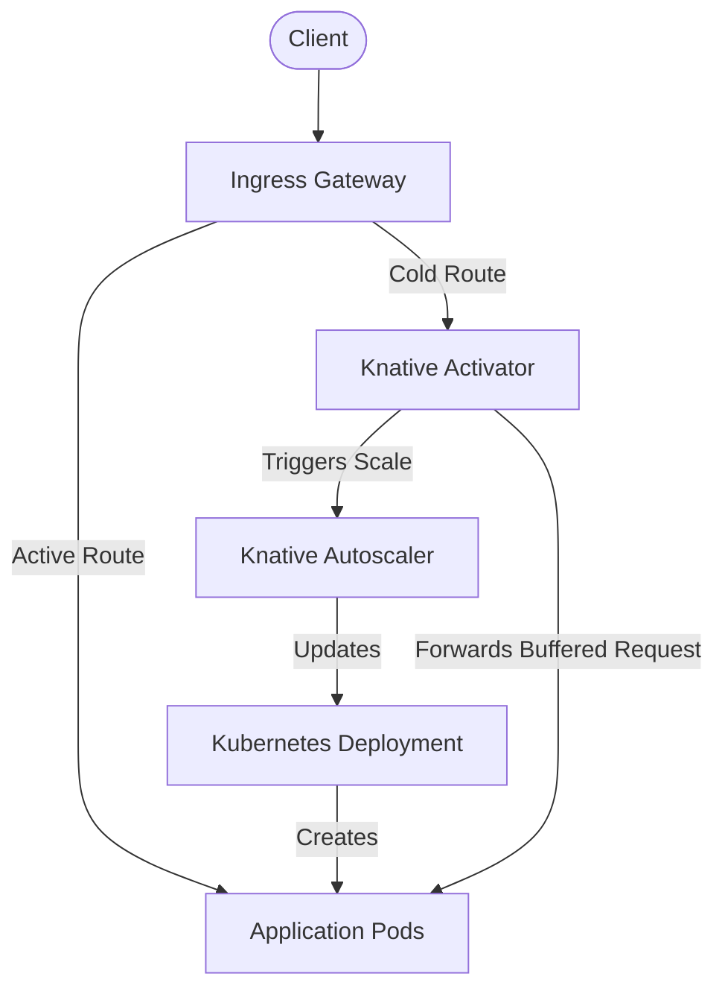
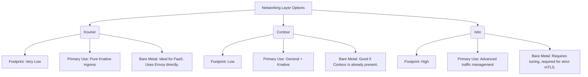
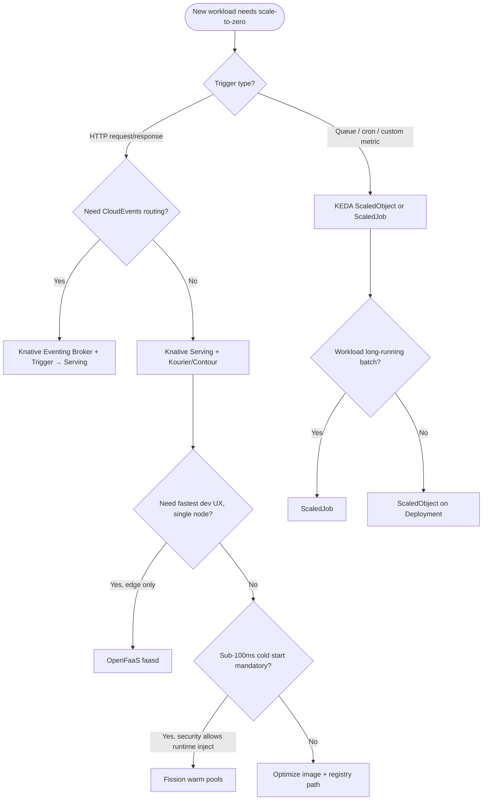

## What You'll Be Able to Do

*   **Design and evaluate** Knative Serving architectures alongside bare-metal compatible networking layers like Kourier and Contour.
*   **Implement** event-driven scale-to-zero workloads utilizing KEDA and external metric triggers.
*   **Compare and contrast** the architectural trade-offs between full serverless platforms and lightweight FaaS frameworks in on-premises environments.
*   **Diagnose** cold start latency issues and implement mitigation strategies for compiled and interpreted application runtimes.
*   **Configure** Knative Eventing brokers and triggers for decoupled message processing on premises.

## Why This Module Matters

**Hypothetical scenario:** A platform team migrates bursty internal APIs from always-on Deployments to scale-to-zero Knative Services on a bare-metal cluster. They skip MetalLB configuration, assume wildcard DNS will resolve automatically, and leave the default Horizontal Pod Autoscaler in place for queue workers. During an overnight batch window, hundreds of idle pods remain scheduled because HTTP-based HPA cannot scale to zero, while the one Knative Service they did deploy returns `503` errors on cold starts because the ingress proxy times out before the Activator finishes buffering. The team concludes that "serverless does not work on premises" and rolls back—without realizing they never built the load-balancing, DNS, and autoscaling substrate that cloud FaaS hides behind a console toggle.

Mastering serverless on bare metal is not about adopting a new deployment syntax; it is about accepting that **you are the cloud provider**. Managed FaaS bundles an ingress that buffers cold-start traffic, a metric pipeline that wakes sleeping pods, and a billing model that makes idle capacity someone else's problem. On owned hardware, every one of those mechanisms must exist in your cluster—and every watt of idle RAM still appears on your power bill. This module teaches how Knative Serving, Knative Eventing, KEDA, and alternative FaaS frameworks map onto bare-metal networking ([Module 3.3: Load Balancing Without Cloud](/on-premises/networking/module-3.3-load-balancing/)), local registries ([Module 7.7: Self-Hosted Registry](/on-premises/operations/module-7.7-self-hosted-registry/)), and the economic trade-offs of CapEx-heavy infrastructure.

> **The Serverless-on-Metal Analogy**
>
> Cloud FaaS is like staying in a hotel: you pay per night, housekeeping appears magically, and you never think about the boiler room. Bare-metal serverless is like owning an apartment building with smart thermostats in every unit—you can turn heat off in empty flats, but you still own the radiators, the plumbing, and the electrician's phone number. Scale-to-zero reclaims *compute* you already paid for; it does not eliminate *ownership*.

## Did You Know?

*   Knative was accepted to CNCF on March 2, 2022 (Incubating) and moved to Graduated on September 11, 2025.
*   KEDA is a CNCF Graduated project; it joined as Sandbox in 2020, moved to Incubating in 2021, and moved to Graduated on August 22, 2023.
*   KEDA's 2.20 documentation shows tested Kubernetes compatibility for versions 1.33–1.35 and states compatibility follows an N-2 policy with possible maintainer extensions.
*   OpenFaaS Community Edition is limited for commercial use and intended for personal/non-production scenarios with a 60-day commercial usage limit.

## The Bare Metal Serverless Paradigm

Serverless on owned hardware is best understood as **request-driven autoscaling with optional scale-to-zero**, not as magic that eliminates infrastructure. You still operate Kubernetes, CNI, CSI, ingress, DNS, TLS, registries, and observability; you add autoscalers that understand concurrency and queue depth, plus an Activator that hides cold-start latency from clients. The economic win is higher average utilization of machines you already purchased—not outsourcing the data center.

Running serverless architectures on bare metal shifts the operational burden entirely onto the platform engineering team. In public cloud environments, serverless abstracts infrastructure management away from the user: a `LoadBalancer` Service receives an IP within seconds, DNS integrates with the provider's edge, and per-invocation billing makes idle capacity economically invisible even when pods still exist somewhere in the provider's fleet. On bare metal, the goal is no longer avoiding infrastructure management, but rather optimizing resource utilization through aggressive bin-packing and accelerating developer velocity via simplified deployment abstractions while keeping TCO honest on your own balance sheet.

Cloud providers rely on proprietary load balancers, deeply integrated metric pipelines, and hidden control planes to route cold-start traffic and trigger rapid scaling. On bare metal, you must wire ingress controllers, MetalLB or BGP speakers, and metric adapters manually to achieve the same request-driven scaling mechanics. You are responsible for ensuring that the underlying network can route traffic to dynamically created endpoints, that external clients can resolve service hostnames, and that ingress timeouts exceed your slowest cold-start percentile. A Knative Service that scales correctly inside the cluster but remains unreachable from the corporate network has failed architecturally even if every pod event looks healthy in `kubectl`.

Knative serves as the premier CNCF solution for this challenge. [Knative](https://www.cncf.io/projects/knative/) is an open serverless and event-driven layer for Kubernetes with three components: Serving (HTTP-triggered autoscaling runtime), Eventing (CloudEvents routing), and Functions (a developer framework atop both). By leveraging these components, you can transform a static bare-metal cluster into a highly dynamic, request-driven compute engine without surrendering data gravity or regulatory control to a hyperscaler.

Crucially, Knative runs on any Kubernetes cluster, including on-premises environments. It does not rely on proprietary cloud hooks. Knative Serving and Eventing install independently, so security-conscious teams can adopt HTTP scale-to-zero without deploying message brokers they have not approved. This portability ensures that the serverless workloads you design for your bare-metal datacenter can be tested on kind or minikube locally and migrated later if business needs change—though this module assumes you are staying on owned hardware and optimizing for that economics model.

The mental model for stakeholders outside platform engineering should emphasize **capacity reclamation**: when overnight batch jobs and CI namespaces need nodes, scaled-down Knative Services free schedulable CPU and RAM on the same workers without powering down hardware. That differs from cloud FaaS where provider-level bin-packing is opaque. Document reclaimed capacity in monthly reports—e.g., "serverless scale-to-zero returned 18 vCPU and 96 GiB to the batch pool on average"—so finance sees tangible value from the Knative investment beyond developer convenience alone.

> **Pause and predict**: If you deploy a serverless function that scales to zero, what must happen to the very first network request that arrives before the container has even started? How does the system prevent the client from immediately receiving a "Connection Refused" error?

## Knative Serving: Revisions, Routes, and the Cold-Start Data Path

Knative Serving builds directly on Kubernetes to support deploying and serving serverless applications. It handles routing, immutable revision tracking, and autoscaling—including scale-to-zero controlled via `enable-scale-to-zero` in the autoscaler ConfigMap and per-service annotations. Understanding the object model is essential for debugging production incidents because `kubectl get pods` alone will not tell you which revision is live, which route receives traffic, or why the Activator still sits in the request path.

### The Knative Service Object Model

A **Knative Service** (`ksvc`) is the developer-facing API that owns three Kubernetes child resources wired together by the Serving controller:

*   **Configuration** — holds the "latest intent" template (container image, env vars, resource limits). Each time you change the template, Knative creates a new immutable **Revision**.
*   **Revision** — an immutable snapshot of a deployable unit. Revisions map to Kubernetes Deployments (or similar) plus the queue-proxy sidecar. You never patch a Revision; you create a new one and shift traffic.
*   **Route** — defines how traffic splits across Revisions. A `ksvc` named `hello` with 100% traffic to `hello-00003` means the Route object—not the Deployment name—is the source of truth for which pods should receive requests.

This separation enables canary releases and instant rollbacks: you adjust Route weights rather than re-running a CI pipeline. On bare metal, where you lack a managed "traffic manager" console, explicit Route objects are how you prove to auditors which code revision processed a given request.


```mermaid
graph TD
    User([Client]) --> Ingress[Ingress Gateway]
    Ingress -->|Active Route| Pods[Application Pods]
    Ingress -->|Cold Route| Activator[Knative Activator]
    Activator -->|Triggers Scale| Autoscaler[Knative Autoscaler]
    Autoscaler -->|Updates| Deployment[Kubernetes Deployment]
    Deployment -->|Creates| Pods
    Activator -->|Forwards Buffered Request| Pods
```

### Autoscaler, Activator, and Queue-Proxy

The **Knative Pod Autoscaler (KPA)** collects concurrency or requests-per-second metrics—primarily via the queue-proxy sidecar—and sets desired replica count on the Revision's underlying Deployment. When metrics drop to zero for the configured `scale-to-zero-grace-period`, KPA scales the Deployment to zero replicas. The standard **Horizontal Pod Autoscaler (HPA)** cannot perform this final step because it requires at least one pod to scrape CPU or memory; KPA is purpose-built for serverless concurrency signals.

The **Activator** is the cold-start buffer. When a Revision has zero ready pods, the Route sends traffic to Activator endpoints instead of application pods. Activator accepts TCP connections, holds requests in memory, signals the Autoscaler that load exists, and proxies buffered requests once pods pass readiness. If Activator memory or connection pools exhaust during a burst while still at zero replicas, clients see `503` errors even though Kubernetes is actively scheduling pods—this is an Activator capacity problem, not an application bug.

The **queue-proxy** sidecar enforces concurrency limits and reports occupancy to KPA. Every Knative Serving pod runs this sidecar; it is the metric source of truth for autoscaling decisions.

Trace a cold request end-to-end on paper before an outage forces you to. The client resolves DNS to the MetalLB VIP, connects to Kourier Envoy listeners, matches a Knative Route host header, discovers zero ready backends for the target Revision, and gets forwarded to Activator endpoints. Activator accepts the session, increments concurrency metrics visible to KPA, waits for the Deployment to create a pod, waits for queue-proxy readiness, then splices the buffered request to the application container. Any broken link—DNS, VIP, ingress timeout, image pull, readiness probe—surfaces as "serverless is broken" to the developer even when Kubernetes events look superficially healthy.

### Concurrency, KPA Targets, and Scale-to-Zero Grace

[Knative concurrency configuration](https://knative.dev/docs/serving/autoscaling/concurrency/) distinguishes soft targets (`autoscaling.knative.dev/target`, default 100 concurrent requests per pod) from hard limits (`containerConcurrency`, where `0` means unlimited). The **target utilization percentage** (`autoscaling.knative.dev/target-utilization-percentage`, default 70%) tells KPA to scale out early—for example, at 70 concurrent requests per pod when the soft target is 100—so new replicas warm before hard limits force queue-proxy buffering.

On bare metal, concurrency tuning interacts with physical CPU limits in ways cloud reference architectures rarely document. A soft target of 100 on a two-vCPU worker may be unrealistic if each request holds the CPU for hundreds of milliseconds; KPA will dutifully scale out, but every new replica pays a cold-start tax that shows up as tail latency at the MetalLB VIP. Start with conservative targets (20–50) for JVM and Python workloads, then increase only after measuring end-to-end latency through Kourier, not pod CPU alone. Hard limits (`containerConcurrency: 50`) enforce queuing inside queue-proxy; Knative documentation warns that low hard limits can harm throughput because surplus requests buffer rather than route to additional replicas.

KPA differs from CPU-based HPA in both metric source and floor behavior. HPA reads `metrics.k8s.io` CPU/memory and cannot scale Deployments to zero replicas because the metrics pipeline expects a running pod. KPA reads request concurrency from queue-proxy and can scale to zero once the `stable-window` of no traffic elapses (plus any `scale-to-zero-pod-retention-period`); the separate `scale-to-zero-grace-period` governs how long the autoscaler waits for networking to be reprogrammed through the Activator before deleting the final pod. You can still attach HPA to a Knative Revision indirectly, but the supported serverless path is KPA with `autoscaling.knative.dev/class: kpa.autoscaling.knative.dev` (the default). Mixing autoscaler classes without understanding which controller owns scale bounds is a common source of "stuck at one pod" incidents during on-call.

Scale-to-zero grace (`scale-to-zero-pod-retention-period` in the autoscaler ConfigMap plus per-revision `autoscaling.knative.dev/scale-to-zero-pod-retention-period`) defines how long KPA waits after the last request before terminating the final pod. Shorter grace saves RAM on idle nodes—directly lowering power draw in your datacenter—but increases cold-start frequency and Activator load during bursty reopenings. Longer grace behaves like a cheap keep-warm strategy without paying explicit `minScale` annotations. For internal tools with predictable business hours, aligning grace with office schedules (long grace overnight, short grace on weekends) can be cheaper than `minScale: 1` while still avoiding Monday-morning cold-start storms.

The annotation `autoscaling.knative.dev/min-scale` sets a minimum replica count per Revision, effectively purchasing always-on capacity. On bare metal you pay for those pods in RAM and electricity whether or not requests arrive; use `minScale: 1` only when SLA tables quantify Activator buffering risk. The companion `autoscaling.knative.dev/max-scale` cap prevents runaway scale-out when metric noise or retry storms fool KPA into believing concurrency is infinite—especially important on fixed-size bare-metal fleets where there is no cloud autoscaler to conjure additional nodes behind your functions.

## Bare-Metal Networking for Knative

Knative Serving requires an ingress networking layer to manage traffic routing, TLS termination, and revision splitting. While Istio remains common in enterprises, its control-plane footprint often exceeds the benefit for pure FaaS clusters. Lightweight alternatives integrate cleanly with bare-metal `LoadBalancer` Services—provided you have already solved external IP allocation.

| Networking Layer | Footprint | Primary Use Case | Bare Metal Considerations |
| :--- | :--- | :--- | :--- |
| **Kourier** | Very Low | Pure Knative ingress | Ideal for strict FaaS environments. Uses Envoy. Exposes `LoadBalancer` Services directly. |
| **Contour** | Low | General Ingress + Knative | Strong choice if Contour already terminates cluster ingress; [Contour's Knative guide](https://projectcontour.io/docs/main/guides/knative/) documents integration patterns. |
| **Istio** | High | Advanced traffic management | Required when mTLS, fine-grained traffic policies, or service-mesh observability are mandatory. |


```mermaid
flowchart TD
    A[Networking Layer Options] --> B(Kourier)
    A --> C(Contour)
    A --> D(Istio)
    
    B --> B1[Footprint: Very Low]
    B --> B2[Primary Use: Pure Knative ingress]
    B --> B3[Bare Metal: Ideal for FaaS. Uses Envoy directly.]
    
    C --> C1[Footprint: Low]
    C --> C2[Primary Use: General + Knative]
    C --> C3[Bare Metal: Good if Contour is already present.]
    
    D --> D1[Footprint: High]
    D --> D2[Primary Use: Advanced traffic management]
    D --> D3[Bare Metal: Requires tuning, required for strict mTLS.]
```

### MetalLB, kube-vip, and the Missing Cloud Load Balancer

[MetalLB](https://metallb.io/) exists because Kubernetes does not implement `Service type=LoadBalancer` on bare metal without an integration layer. Without MetalLB (or an equivalent BGP/L2 speaker such as kube-vip documented in [Module 3.3](/on-premises/networking/module-3.3-load-balancing/)), Kourier's front-door Service remains `Pending` indefinitely and external clients cannot reach your functions. MetalLB hands out addresses from an `IPAddressPool` via L2 ARP mode for simple topologies or BGP mode when your spine-leaf fabric expects route advertisement.

This is the fundamental on-prem difference: in AWS, creating a `LoadBalancer` Service triggers an ELB; in your datacenter, **you** must coordinate IP pools with the network team, ensure gratuitous ARP or BGP sessions are permitted, and document which VIP fronts production Knative routes. Skipping this step is the most common reason Knative "works in curl from the node" but fails from developer laptops.

### DNS: sslip.io for Labs, Wildcard Records for Production

Knative assigns each Service a hostname derived from its name, namespace, and ingress domain—commonly `hello.default.<ingress-ip>.sslip.io` when using the [magic-DNS pattern](https://knative.dev/docs/install/install-yaml/#deploying-knative-serving) for labs. The `sslip.io` service resolves hostnames embedding IPv4 addresses, which removes manual DNS during testing. Production bare-metal clusters should **not** rely on sslip.io; instead, configure a private wildcard (`*.knative.internal.example.com`) pointing at the MetalLB VIP and set `domainTemplate` in `config-network` or use `DomainMapping` resources for explicit hostnames.

Split-horizon DNS matters when workers run inside the cluster but callers sit on corporate laptops. The ingress VIP must resolve identically from both vantage points, or you will debug phantom "cold start" failures that are actually DNS NXDOMAIN errors. Cross-reference [Module 3.4: DNS & Certificate Infrastructure](/on-premises/networking/module-3.4-dns-certs/) when wiring cert-manager certificates for Knative routes.

MetalLB L2 mode announces a VIP from one node at a time using ARP/NDP, which is ideal for flat L2 lab pods and smaller two-rack deployments where BGP would be overkill. BGP mode (often paired with [FRR-K8s per MetalLB documentation](https://metallb.io/)) advertises `/32` or `/128` routes to your spine switches, distributing VIP ownership across nodes and surviving ToR failures—closer to how cloud load balancers hide backend churn. Knative does not care which mode you pick as long as the Kourier `Service` receives a stable address; what changes is how your network team documents the VIP during change windows.

TLS termination typically lands on Kourier or Contour ingress, not on individual function pods. On bare metal you are responsible for rotating certificates via cert-manager ClusterIssuers backed by your internal Vault PKI ([Module 3.4](/on-premises/networking/module-3.4-dns-certs/)). Wildcard certs matching your Knative domain template reduce issuance churn when developers create dozens of `ksvc` objects per namespace. Remember that cold starts extend the TLS handshake window: clients must use ingress timeouts that cover both TCP + TLS + Activator buffering + container boot, not just the steady-state RTT you measured during load tests.

> **Caution:** When using bare metal without MetalLB or Cilium BGP, Knative ingress gateways default to `NodePort` or remain `Pending` as `LoadBalancer`. Ensure your L2/L3 VIP configuration is functional before deploying Knative; otherwise external traffic drops before it ever reaches the Activator.

## Knative Eventing: Brokers, Triggers, and CloudEvents

While Knative Serving focuses on synchronous HTTP, [Knative Eventing](https://knative.dev/docs/eventing/) routes asynchronous events using the [CloudEvents](https://cloudevents.io/) specification—a vendor-neutral envelope with attributes like `type`, `source`, and `id` that make events interoperable across languages and brokers.

*   **Broker** — a routing hub. Producers send CloudEvents to the Broker ingress; they do not know which consumers exist.
*   **Trigger** — a filter plus subscriber. Triggers select events by attributes (for example `type: dev.knative.samples.helloworld`) and deliver matching events to a Knative Service, Kubernetes Service, or custom URL.
*   **Channel / Subscription** — lower-level publish/subscribe primitives when you need direct channels without the Broker abstraction.

On bare metal, **broker backing storage** determines durability. The in-memory channel installed by quickstart manifests is strictly for development; production requires Kafka, RabbitMQ, or NATS-based channel implementations so broker restarts do not evaporate queued events during rack maintenance.

### Configuring Brokers and Triggers

The following manifests create a default Broker and a Trigger forwarding filtered events to a Knative Service. Apply them as separate documents to keep parsing clean.

```yaml
apiVersion: eventing.knative.dev/v1
kind: Broker
metadata:
  name: default
  namespace: default
```

```yaml
apiVersion: eventing.knative.dev/v1
kind: Trigger
metadata:
  name: my-service-trigger
  namespace: default
spec:
  broker: default
  filter:
    attributes:
      type: dev.knative.samples.helloworld
  subscriber:
    ref:
      apiVersion: serving.knative.dev/v1
      kind: Service
      name: hello
```

Event sources—Kubernetes API events via SinkBinding, GitHub webhooks via GitHubSource, Kafka consumers via KafkaSource—connect to Brokers or Channels depending on integration maturity. Each source adapter translates external signals into CloudEvents with standardized attributes so Triggers can filter without knowing the upstream vendor. For on-prem Kafka already operated by your data platform team, the Kafka-backed channel implementation is usually the least surprising choice because retention policies, ACLs, and monitoring dashboards reuse existing runbooks instead of introducing another persistence layer operators must learn during an outage.

Channel implementations trade operational complexity for durability. In-memory channels are acceptable only on developer laptops. Kafka channels survive broker pod restarts when topics are replicated across racks you already maintain for other applications. RabbitMQ and NATS channels appear in smaller installations where those brokers already exist for legacy workloads. The wrong choice is not "Kafka vs NATS" in the abstract—it is whichever distributed log your organization already staffs on-call for at 3 a.m.

Dead-letter handling deserves explicit design on bare metal because you cannot buy a managed "replay button." When a Trigger subscriber fails repeatedly, events land in a dead-letter sink (another Service or Kafka topic) that platform teams must monitor with the same rigor as production ingress. Pair Eventing with the observability patterns from [Module 7.8: Observability at Scale](/on-premises/operations/module-7.8-observability-at-scale/) so broker lag, undelivered events, and subscriber error rates appear on dashboards before message backlogs exhaust disk on your Kafka brokers.

## KEDA: Event-Driven Autoscaling Beyond HTTP

Knative Serving excels at HTTP concurrency, but queue depth, cron schedules, Prometheus queries, and custom external signals require [KEDA](https://keda.sh/docs/) (Kubernetes Event-driven Autoscaling). KEDA is not a FaaS platform; it extends the HPA with an external metrics adapter and scales Deployments, StatefulSets, Jobs, or any custom resource exposing the `/scale` subresource.

### ScaledObject vs ScaledJob

*   **ScaledObject** — targets long-running workloads (Deployments). KEDA scales replicas between `minReplicaCount` and `maxReplicaCount` based on triggers. Setting `minReplicaCount: 0` enables scale-to-zero for queue workers that should idle without pods.
*   **ScaledJob** — targets Kubernetes Jobs. Each scaling event can spawn Job objects that run to completion—ideal for batch bursts where pods should exit after processing one message partition.

The standard HPA cannot scale to zero because it needs a pod to scrape. KEDA's operator watches external triggers directly: when a RabbitMQ queue transitions from empty to non-empty, KEDA scales from 0→1 before HPA participates; when the queue drains, KEDA forces the final scale-down after HPA reaches its minimum.

```yaml
apiVersion: keda.sh/v1alpha1
kind: ScaledObject
metadata:
  name: rabbitmq-worker-scaler
spec:
  scaleTargetRef:
    name: rabbitmq-worker
  minReplicaCount: 0
  maxReplicaCount: 50
  triggers:
  - type: rabbitmq
    metadata:
      protocol: amqp
      queueName: task_queue
      mode: QueueLength        # bare `queueLength` is deprecated — use mode + value
      value: "5"
      hostFromEnv: RABBITMQ_HOST   # AMQP URI from a Secret; or use authenticationRef → TriggerAuthentication
```

KEDA ships [dozens of scalers](https://keda.sh/docs/2.20/scalers/prometheus/) covering message queues, databases, cloud metrics endpoints, and Kubernetes resources themselves. Verify trigger metadata against the exact KEDA minor version you install because field names drift between releases; copying a three-year-old `ScaledObject` from a blog post is a reliable way to create a scaler that silently never fires, leaving queues backed up while `kubectl get hpa` shows `<unknown>` metrics.

Install KEDA into its own namespace with monitored webhook availability—the operator must admit `ScaledObject` resources before your application namespaces roll out. On bare-metal clusters with tight etcd latency budgets, watch KEDA's polling goroutines during load tests; they are tiny compared to application traffic but multiply when hundreds of `ScaledObject` resources poll the same Kafka cluster every thirty seconds. A Prometheus scaler, for example, requires `serverAddress`, a PromQL `query` returning a scalar, and `threshold` values:

```yaml
  triggers:
  - type: prometheus
    metadata:
      serverAddress: http://prometheus.monitoring.svc:9090
      query: sum(rate(http_requests_total{deployment="my-deployment"}[2m]))
      threshold: "100"
```

> **Tip:** KEDA polling intervals dictate how quickly scale-from-zero occurs. Aggressive polling (every 1 second) against massive Kafka clusters can starve the control plane; default polling is often 30 seconds—factor that into SLA math for overnight batch jobs.

### ScaledJob, Cron, and Prometheus Triggers

Beyond `ScaledObject`, KEDA's **ScaledJob** resource launches Kubernetes Jobs when external signals fire—useful for nightly ETL on bare metal where you want pods to exit after processing a partition rather than idle as Deployments. A cron scaler (`type: cron` in KEDA metadata) scales an existing Deployment up during a scheduled window and back to zero afterward — unlike a Kubernetes CronJob, which creates a fresh Job (and its pods) per scheduled run and is meant for discrete batch tasks, not for keeping a service warm. Combine cron triggers with `minReplicaCount: 0` so dev clusters stay quiet on weekends.

The Prometheus scaler queries your existing metrics tier ([Module 7.8](/on-premises/operations/module-7.8-observability-at-scale/)) with PromQL and scales when query results cross `threshold`. This bridges HTTP services you have not migrated to Knative: a Deployment behind a traditional Ingress can still scale from zero when `sum(rate(http_requests_total{service="legacy-api"}[2m]))` rises, provided the query returns a scalar and your Prometheus HA tier survives the polling load. Use `activationThreshold` to prevent flapping when metrics hover near noise floor.

### KEDA vs Knative Eventing: When to Use Which

Use **Knative Eventing** when you want CloudEvents routing, Broker/Trigger filtering, and tight integration with Knative Serving scale-to-zero HTTP targets—especially for event fan-out, content-based filtering, and decoupling producers from consumer URLs. Eventing shines when multiple subscribers must react to the same business event without the producer enumerating Service DNS names inside your datacenter.

Use **KEDA** when the scaling signal is a metric external to HTTP—queue depth, Kafka lag, cron schedule, Prometheus query, Redis list length—and the workload is a standard Deployment, StatefulSet, or Job you are not ready to wrap in Knative CRDs. KEDA is the faster on-ramp for brownfield bare-metal clusters already full of Deployments operated by teams who do not want to learn `ksvc` semantics.

Many on-prem platforms run both: Eventing ingests and routes events; KEDA scales the worker Deployments that drain backlogs. Avoid duplicating both on the same signal—pick one autoscaler owner per workload or you will fight conflicting scale directives during incidents.

## Alternative FaaS Frameworks

If Knative provides the infrastructure layer, alternative FaaS frameworks optimize developer experience. Knative expects container images; OpenFaaS and Fission add build pipelines and UX shortcuts—each with on-prem caveats.

### OpenFaaS

[OpenFaaS](https://www.openfaas.com/) emphasizes operational simplicity. It runs on any Kubernetes cluster, including self-managed on-prem, using an API Gateway, optional NATS for async execution, and Prometheus-driven scaling. Functions package as containers via `faas-cli`; an internal watchdog forwards HTTP to process stdin/stdout.

Organizations must respect licensing: OpenFaaS Community Edition limits commercial production use (60-day commercial trial). CE also expects continuous internet connectivity for validation—air-gapped datacenters should evaluate OpenFaaS Standard. For single-node edge sites without Kubernetes, `faasd` runs on containerd directly—useful for remote industrial gateways where a full control plane is impractical.

OpenFaaS functions remain containers under the hood; the UX difference is CLI-driven packaging and a centralized gateway Deployment that scales function replicas from Prometheus RPS metrics. That maps onto bare-metal observability stacks from [Module 7.8](/on-premises/operations/module-7.8-observability-at-scale/) but still requires MetalLB in front of the gateway Service and the same Harbor pull paths Knative needs. Teams choosing OpenFaaS for simplicity should not skip DNS, TLS, or registry design reviews—datacenter networking realities apply regardless of CRD flavor.

### Fission

[Fission](https://fission.io/docs/architecture/) optimizes cold-start latency with pools of pre-warmed "environment" containers. The Router injects function code at request time instead of pulling a unique image per function. Sub-100ms starts are achievable for interpreted runtimes, but runtime mutation breaks immutable-image security models—image hashes in CI no longer match running containers, which triggers compliance findings in regulated environments. Warm pools also consume baseline RAM even when idle, partially offsetting scale-to-zero savings that finance expected from the serverless initiative.

Choosing between Knative, OpenFaaS, and Fission is not a beauty contest; it is a staffing and compliance decision. Knative aligns with CNCF Graduated governance and integrates with existing ingress/DNS you already run for other workloads. OpenFaaS optimizes developer ergonomics when teams want `faas-cli` deploys without writing Dockerfiles, but licensing and air-gap constraints push serious on-prem estates toward Standard or away entirely. Fission targets latency-sensitive internal APIs where security accepts mutable runtime state. Document the choice in your platform decision log so auditors understand why some namespaces use `ksvc` while edge gateways still run `faasd`.

## Cold Start Optimization on Bare Metal

Cold starts are a sequential chain: schedule pod → pull image → start container → run application bootstrap → pass readiness probe. On bare metal, **image pull latency** across WAN links to public registries often dominates; JVM and heavy framework initialization rank second. Proxy inspection, NAT hairpins, and oversubscribed storage backplanes add variance that does not appear in cloud FaaS benchmarks, so always measure on the same MetalLB VIP path production clients use.

### Mitigation Strategies

1.  **Local registry mirrors** — Deploy Harbor or another registry on the same L2 network as workers ([Module 7.7](/on-premises/operations/module-7.7-self-hosted-registry/)). Pre-pull base images via DaemonSets so cold starts hit disk, not BGP transit.
2.  **Runtime selection** — Go, Rust, or GraalVM-native Java minimize bootstrap time compared to stock Spring Boot on a cold JVM. Interpreted Node.js sits in the middle; choose runtimes based on measured cold-start percentiles, not developer preference alone.
3.  **Eliminate init containers** — Init containers run sequentially and block the primary container from starting; they are anti-patterns for scale-to-zero HTTP handlers.
4.  **CPU bursting** — Startup is CPU-spiky; throttling during pull/extract extends cold-start time beyond ingress timeouts.
5.  **`minScale` keep-warm** — The `autoscaling.knative.dev/min-scale` annotation keeps N pods always running. This trades RAM for latency predictability—on bare metal you pay that RAM 24/7, so use `minScale: 1` only for latency-critical paths with measured traffic.
6.  **Checkpoint/restore (advanced)** — [Forensic container checkpointing](https://kubernetes.io/blog/2022/12/05/forensic-container-checkpointing-alpha/) using CRIU (the `ContainerCheckpoint` feature gate) graduated to Beta in Kubernetes 1.30 and remains Beta as of Kubernetes 1.35 per [KEP-2008](https://github.com/kubernetes/enhancements/issues/2008) — it has not promoted to GA, so treat checkpoint/restore as experimental. On Kubernetes 1.35 clusters with CRI-O or containerd CRIU support enabled, restoring from checkpoints can skip parts of JVM warmup, but operational complexity (checkpoint storage on kubelet disk, conversion to OCI images via `checkpointctl build`) keeps this niche—verify feature gates and runtime support before promising checkpoint-based cold-start SLAs to application teams.

Platform runbooks should list cold-start percentiles per runtime on actual bare-metal hardware, not laptop kind clusters. Publish a table internally: Go sample image p50/p99, Node p50/p99, Spring Boot p50/p99, each measured from curl through the MetalLB VIP after forced scale-to-zero. Developers choose runtimes with eyes open, and SREs set ingress timeouts with evidence instead of guessing.

## Cost Lens: Serverless Economics on Owned Hardware

Cloud FaaS charges per invocation and GB-second, which makes idle capacity look free even when it is not. Bare-metal serverless removes per-invocation billing but **never removes CapEx**: you already bought the servers, switches, rack space, power, cooling, and the engineers who operate MetalLB, Harbor, and the autoscalers.

| Cost Driver | On-Prem Impact | Serverless Interaction |
| :--- | :--- | :--- |
| **Server CapEx** | Depreciated over 3–5 years | Scale-to-zero reclaims CPU/RAM for other workloads (batch, CI) instead of sitting idle |
| **Power & cooling** | ~$1,200–1,900/yr per continuous kW (≈$0.14/kWh US commercial avg, EIA early-2026, ×PUE 1.3–1.6 — verify current) | Fewer running pods lowers draw, but Activator/ingress overhead remains |
| **Network gear** | ToR/spine ports are fixed cost | MetalLB VIPs and BGP sessions are "free" marginally but require skilled ops |
| **Registry & storage** | Harbor disks, backup tapes | Local pulls reduce WAN egress charges you would pay in cloud |
| **Ops headcount** | Platform team salary | Knative + KEDA + MetalLB stack needs ongoing upgrades and on-call |

**When scale-to-zero on bare metal wins:** bursty internal APIs (HR portals, reporting), dev/test namespace density, queue workers with long idle periods, and clusters where batch jobs can borrow nodes freed by scaled-down Services. **When always-on Deployments are cheaper/simpler:** steady high-QPS services where `minScale` would equal `maxScale` anyway, tiny clusters where Activator + ingress overhead exceeds savings, and teams without platform engineers to maintain Knative networking.

Calculate TCO with utilization histograms, not peak headlines. If your workload holds 40% baseline traffic 24/7, serverless complexity may cost more engineering hours than rightsized Deployments with HPA. Conversely, if histograms show 95% idle time for hundreds of microservices, scale-to-zero can defer the next rack purchase by months even after accounting for Activator overhead.

Depreciation matters for CapEx planning: servers you bought for "just in case" burst capacity sit on the balance sheet whether or not Knative scales them away. Serverless on bare metal optimizes **utilization of sunk cost**, not elimination of sunk cost. Finance teams still refresh hardware on schedule; platform teams use scale-to-zero to run batch, CI, and dev namespaces on the same nodes during off-peak windows. Track **reclaimed node-hours** monthly to justify the engineering investment in MetalLB, Harbor, and Knative upgrades to leadership.

Egress and data gravity often favor on-prem serverless for event pipelines that would otherwise ship terabytes to a cloud FaaS vendor. You still pay switch ports and backup tape, but you avoid per-GB egress invoices. Regulatory constraints (data residency, air-gap) may mandate on-prem regardless of TCO; in those environments, OpenFaaS Standard or Knative with local registries are the realistic options—not CE builds that phone home for license validation.

## Day-2 Operations: Upgrades, Quotas, and Multi-Tenancy

Serverless platforms fail in production more often during upgrades than during initial install. Knative, KEDA, and ingress controllers each ship on independent release trains; pinning everything to `knative-v1.22.1` for Serving and net-kourier together is deliberate version coupling—mixing a newer Kourier with an older Serving webhook can reject `Service` updates with validation errors that look like application bugs. Maintain a version matrix in git, test upgrades on a staging bare-metal rack, and roll production namespaces only after cold-start and Eventing delivery tests pass.

Resource quotas interact painfully with scale-to-zero if you cap `pods` per namespace too aggressively: the Activator may successfully schedule a cold-start pod only to hit `Forbidden: exceeded quota`, leaving clients hanging until timeout. Platform teams should either exempt `knative-serving` and `kourier-system` infrastructure namespaces from developer quotas or set quota limits high enough to absorb burst scale-out (remember max-scale annotations times concurrent Services). LimitRanges on CPU can silently lengthen cold starts by throttling image extraction; serverless namespaces often benefit from higher default CPU limits during the first minutes of pod life.

Multi-tenancy on bare metal usually means namespace isolation, not hypervisor isolation. Knative Services in namespace `team-a` still share Activator, Kourier, and MetalLB VIPs with `team-b`. Use NetworkPolicies ([Module 3.6: Service Mesh on Bare Metal](/on-premises/networking/module-3.6-service-mesh-bare-metal/)) to prevent a compromised function from scraping neighbor Services. Per-tenant subdomain templates (`{svc}.{ns}.serverless.example.com`) simplify ACL reviews because firewall rules can reference predictable DNS patterns instead of ephemeral NodePorts.

Backup and disaster recovery for Eventing brokers means backing the Kafka topics or RabbitMQ volumes—not just etcd. A restored Kubernetes control plane with empty broker storage is a platform that happily routes triggers to Services that never receive events. Document RPO/RTO for message backlogs the same way you document them for etcd snapshots.

Change management for serverless platforms differs from traditional Deployments because scale-to-zero hides broken revisions until Monday morning traffic arrives. Require staging environments that mirror production MetalLB pools and DNS templates, and run synthetic cold-start probes every hour so Activator regressions page the on-call engineer before executives open the internal portal.

## Patterns & Anti-Patterns

Successful on-prem serverless estates repeat a handful of integration patterns because they minimize moving parts while respecting datacenter realities: routable VIPs, internal DNS, local registries, and autoscalers that understand scale-to-zero. The patterns below are not theoretical—they are the combinations platform engineers rediscover when cloud reference architectures are pasted onto owned hardware without adaptation.

### Proven Patterns

| Pattern | When to Use | Why It Scales |
| :--- | :--- | :--- |
| **Kourier + MetalLB L2 pool** | Pure FaaS clusters without service mesh | Minimal moving parts; Envoy ingress gets a routable VIP without Istio control-plane RAM |
| **KEDA ScaledObject on queue depth** | Kafka/RabbitMQ workers with idle gaps | Decouples scaling signal from HTTP; reuses existing message infrastructure |
| **Harbor pull-through cache + pre-pull DaemonSets** | Large images on multi-rack bare metal | Removes WAN pull variance from cold-start SLAs |
| **Wildcard internal DNS + cert-manager** | Production Knative hostnames | Replaces sslip.io lab hacks with auditable DNS aligned to corporate PKI |

When rolling out these patterns, instrument three signals from day one: Activator request latency (cold-path health), KPA scale latency (time from zero to ready pod), and MetalLB ARP/BGP event logs (VIP movement during node drains). Without them, developers will attribute every timeout to "Knative being slow" while the real fault is a stale ARP entry on the upstream router.

### Anti-Patterns

| Anti-Pattern | What Goes Wrong | Better Alternative |
| :--- | :--- | :--- |
| **HPA-only "serverless"** | Pods never reach zero; idle RAM drains cluster | KPA via Knative Serving or KEDA `minReplicaCount: 0` |
| **Istio for every FaaS cluster** | Control-plane memory rivals function workloads | Kourier/Contour until mTLS policies mandate mesh |
| **sslip.io in production** | External dependency + non-corporate DNS | Private wildcard records on internal DNS |
| **OpenFaaS CE in revenue workloads** | Licensing violation after 60 days | CNCF-graduated Knative or OpenFaaS Standard |
| **Fission warm pools without budget** | Baseline RAM resembles always-on Deployments | Knative scale-to-zero with selective `minScale` |
| **Sub-second KEDA polling on huge Kafka** | API server/etcd load spikes | 30s polling or webhook triggers where supported |

Anti-patterns persist because they mirror cloud quickstarts: Istio everywhere, HPA as "autoscaling," public registries, sslip.io in production. Each shortcut saves an afternoon in the lab and costs weeks in production when bare-metal constraints surface during the first holiday traffic spike.

## Decision Framework

Platform architects rarely choose a single serverless product—they choose a **composition** of ingress, autoscaler, event router, and developer UX that matches their compliance, staffing, and traffic shape. The matrix and flowchart below condense weeks of architecture review into a repeatable questionnaire you can run with application teams before anyone pushes a `ksvc` to production.

Use the flowchart below when choosing components for a new on-prem serverless capability, starting from the workload's trigger type and working outward to ingress and registry dependencies:


```mermaid
flowchart TD
    Start([New workload needs scale-to-zero]) --> Q1{Trigger type?}
    Q1 -->|HTTP request/response| Q2{Need CloudEvents routing?}
    Q1 -->|Queue / cron / custom metric| KEDA[KEDA ScaledObject or ScaledJob]
    Q2 -->|Yes| KE[Knative Eventing Broker + Trigger → Serving]
    Q2 -->|No| KS[Knative Serving + Kourier/Contour]
    KS --> Q3{Need fastest dev UX, single node?}
    Q3 -->|Yes, edge only| OF[OpenFaaS faasd]
    Q3 -->|No| Q4{Sub-100ms cold start mandatory?}
    Q4 -->|Yes, security allows runtime inject| FI[Fission warm pools]
    Q4 -->|No| KS2[Optimize image + registry path]
    KEDA --> Q5{Workload long-running batch?}
    Q5 -->|Yes| SJ[ScaledJob]
    Q5 -->|No| SO[ScaledObject on Deployment]
```

| Decision | Choose Knative Serving | Choose KEDA | Choose OpenFaaS/Fission |
| :--- | :--- | :--- | :--- |
| HTTP API scale-to-zero | ✓ Primary | Add if metric is non-HTTP | OpenFaaS if team rejects CRDs |
| Kafka consumer workers | Use Eventing or direct consumer | ✓ Primary | Rarely |
| Edge single host | Overkill | Overkill | OpenFaaS faasd |
| Strict immutable images | ✓ | ✓ | Fission risky |

Walk through the flowchart with stakeholders and record the path in the ticket. If the answer is KEDA on a Deployment, you still need MetalLB and Harbor; if the answer is Knative Serving, you still need Eventing only when asynchronous fan-out is in scope. The decision framework prevents the common failure mode of installing every component "just in case" and then wondering why the cluster idles at 200 GB of control-plane RAM.

HTTP-triggered synchronous APIs with unpredictable burstiness and tolerance for cold starts → Knative Serving with Kourier, local registry, and measured ingress timeouts. Long-running queue consumers with minutes-long processing → KEDA `ScaledObject` on Deployments, not Knative Serving. Scheduled batch with exit-on-complete semantics → KEDA `ScaledJob` or cron scaler. Edge single-node without Kubernetes → OpenFaaS `faasd`. Latency-sensitive internal APIs with mutable-runtime acceptance → Fission with explicit security sign-off.

Revisit these decisions annually: registry latency improvements, Knative upgrades, and hardware refreshes change the answer. A workload that justified Fission warm pools at sub-100ms may become a Knative Service after GraalVM native images and Harbor pre-pull cut cold starts below your ingress timeout budget. Keep the decision log next to the version matrix so reviewers see both *what* you chose and *when* underlying infrastructure assumptions last changed.

## Common Mistakes

| Mistake | Why It Happens | How to Fix It |
| :--- | :--- | :--- |
| **Activator bottleneck under burst load** | Traffic routes to Activator at zero replicas; connection pools exhaust before pods become ready. | Scale Activator replicas and raise resource limits; consider `minScale: 1` for burst-prone Services. |
| **Missing DNS for bare-metal ingress** | Teams assume cloud DNS integrators; wildcard routes fail and Services look "ready" but are unreachable. | Configure `serving-default-domain` for labs or corporate wildcard DNS + DomainMapping for production. |
| **Istio without mTLS requirements** | Copy-paste cloud reference architectures onto lean bare-metal clusters. | Default to Kourier; adopt Istio only when mesh policies are mandatory. |
| **Aggressive KEDA polling or slow Prometheus scrapes** | Sub-second polling starves etcd; 30s Prometheus scrapes delay scale-out. | Use ≥30s polling defaults; dedicate low-latency metric paths for autoscaling, not generic monitoring. |
| **OpenFaaS CE in production or air-gap** | CE licensing and online validation checks are easy to overlook. | Use OpenFaaS Standard in restricted/commercial environments or migrate to Knative. |
| **Remote registry pulls during cold start** | Multi-GB images over WAN exceed ingress timeouts. | Local Harbor mirrors, pre-pull DaemonSets, eliminate init containers. |
| **Ingress timeout shorter than cold start** | Edge proxy returns `504` while Activator still buffers. | Set ingress/proxy timeouts to the p99 cold-start duration of your slowest runtime. |
| **Abrupt scale-down on queue workers** | SIGTERM without drain requeues messages and causes scale thrash. | Implement graceful shutdown handlers; keep `minReplicaCount: 1` if ack guarantees are impossible. |

## Quiz

<details>
<summary><b>Question 1: The Activator Bottleneck</b></summary>
<b>Scenario:</b> You deploy a Knative Service configured to scale to zero. During a load test, the service scales down to zero after the test ends. You then trigger a sudden spike of tens of thousands of requests. You observe memory usage spike dangerously, followed by cascading 503 errors before application pods become ready. Which component is most likely under-provisioned?
<br><br>
<b>Options:</b><br>
A) The Istio Ingress Gateway, because it cannot route traffic to zero pods.<br>
B) The Knative Autoscaler, because it fails to calculate metrics fast enough.<br>
C) The Knative Activator, because it exhausts its connection pool buffering the traffic spike.<br>
D) The queue-proxy sidecar, because it cannot enforce concurrency limits during boot.
<br><br>
<b>Correct Answer: C</b>
<br><br>
<b>Explanation:</b> At zero replicas, all traffic flows through the Activator, which buffers TCP connections while KPA scales the Deployment. Massive bursts can exhaust Activator memory and connection tables before pods pass readiness, producing 503 errors unrelated to application code. Scale Activator deployments and set realistic `minScale` annotations for burst-prone Services. Istio is not required for this data path when using Kourier.
</details>

<details>
<summary><b>Question 2: Legacy Subresource Scaling</b></summary>
<b>Scenario:</b> You implement event-driven architecture with a legacy application deployed via a proprietary Kubernetes operator. A developer proposes KEDA to scale this custom resource based on Kafka topic lag. What technical requirement must be met?
<br><br>
<b>Options:</b><br>
A) The custom resource must implement the Knative queue-proxy sidecar.<br>
B) The custom resource must expose the Kubernetes `/scale` subresource.<br>
C) The custom resource must run strictly as a StatefulSet.<br>
D) The custom resource must bypass the HPA entirely.
<br><br>
<b>Correct Answer: B</b>
<br><br>
<b>Explanation:</b> KEDA scales Deployments and StatefulSets natively and can scale custom resources only when they expose the standard `/scale` subresource. Without that API surface, KEDA cannot set desired replica counts. Extend the operator or front the workload with a Deployment ScaledObject instead of patching proprietary CRDs.
</details>

<details>
<summary><b>Question 3: Comparing Serverless Platforms on Premises</b></summary>
<b>Scenario:</b> A platform architect must compare architectural trade-offs between full serverless platforms (Knative) and lightweight FaaS frameworks (OpenFaaS CE) for an air-gapped bare-metal facility. OpenFaaS CE core services enter endless crash loops after install. What fundamental difference explains this failure mode?
<br><br>
<b>Options:</b><br>
A) OpenFaaS CE requires continuous internet access for validation and assets.<br>
B) OpenFaaS CE lacks support for strict mTLS encryption.<br>
C) OpenFaaS CE cannot run on bare-metal nodes, only cloud VMs.<br>
D) OpenFaaS CE requires a minimum of 50 compute nodes to initialize.
<br><br>
<b>Correct Answer: A</b>
<br><br>
<b>Explanation:</b> OpenFaaS CE expects internet connectivity for licensing validation and remote assets. Air-gapped environments should use OpenFaaS Standard or a fully offline CNCF stack like Knative with local registries. CE crash loops in disconnected datacenters are a documented deployment mismatch, not a Kubernetes bug.
</details>

<details>
<summary><b>Question 4: Asynchronous Processing Pipeline</b></summary>
<b>Scenario:</b> PDF uploads land on object storage and enqueue Kafka messages. Processing takes 4–5 minutes of heavy CPU. Workers should scale to zero when the topic is empty. Which approach fits bare-metal Kubernetes best?
<br><br>
<b>Options:</b><br>
A) Knative Serving with a Kafka ingress adapter.<br>
B) KEDA scaling a Deployment based on Kafka lag.<br>
C) OpenFaaS synchronous API gateway.<br>
D) Fission pre-warmed environment pods.
<br><br>
<b>Correct Answer: B</b>
<br><br>
<b>Explanation:</b> Long-running, queue-driven CPU work maps cleanly to a standard Deployment scaled by KEDA's Kafka scaler with `minReplicaCount: 0`. Knative Serving optimizes HTTP request lifetimes, not multi-minute batch jobs. HTTP gateways time out long before PDF rendering completes unless you add unnecessary complexity.
</details>

<details>
<summary><b>Question 5: Knative Component Isolation</b></summary>
<b>Scenario:</b> A financial institution wants Knative scale-to-zero HTTP but forbids unapproved message brokers inside the cluster. How should the platform team install Knative?
<br><br>
<b>Options:</b><br>
A) They cannot proceed; Knative requires all components simultaneously.<br>
B) Install Knative Serving independently of Knative Eventing.<br>
C) Install Eventing but disable the Broker via a custom admission controller.<br>
D) Use KEDA instead because Knative cannot function without Eventing.
<br><br>
<b>Correct Answer: B</b>
<br><br>
<b>Explanation:</b> Knative Serving and Eventing are independent install units. Teams may deploy Serving alone for HTTP autoscaling while omitting Eventing until messaging infrastructure is approved. KEDA addresses different scaling signals and does not replace Serving's Activator/KPA HTTP path.
</details>

<details>
<summary><b>Question 6: Fission Cold Start Optimization</b></summary>
<b>Scenario:</b> After deploying Fission for a Python API, security flags containers whose image hashes do not match CI-built images. What Fission mechanism explains the discrepancy?
<br><br>
<b>Options:</b><br>
A) Fission compiles Python into a statically linked binary at runtime.<br>
B) Fission bypasses the container runtime and runs functions on the host.<br>
C) Fission injects function code dynamically into pre-warmed environment containers.<br>
D) Fission downloads code from an external Git repository on every start.
<br><br>
<b>Correct Answer: C</b>
<br><br>
<b>Explanation:</b> Fission trades immutable images for speed by injecting source into warm environment containers at request time. Runtime disk and memory differ from the registry image hash, breaking supply-chain scanners. Regulated environments often prefer Knative with fully baked images despite slower cold starts.
</details>

<details>
<summary><b>Question 7: Initial Request Routing</b></summary>
<b>Scenario:</b> A developer curls the ClusterIP of a Knative Service scaled to zero and receives immediate "Connection Refused." Why did Knative not buffer the request?
<br><br>
<b>Options:</b><br>
A) They bypassed the Activator, which holds connections only on the ingress route at zero replicas.<br>
B) The Autoscaler only monitors queue-proxy metrics on running pods.<br>
C) Istio Ingress is strictly required to buffer cold-start traffic.<br>
D) Knative Services cannot be addressed via ClusterIP.
<br><br>
<b>Correct Answer: A</b>
<br><br>
<b>Explanation:</b> At zero replicas the Route targets Activator endpoints, not application pods. Direct ClusterIP curls skip Activator buffering and hit Services with no backends. Always test cold starts through the public ingress hostname that Knative assigns, not pod IPs.
</details>

<details>
<summary><b>Question 8: Runtime Cold Start Risks</b></summary>
<b>Scenario:</b> You migrate synchronous HTTP microservices to Knative Serving on bare metal with unpredictable traffic. Which runtime presents the highest cold-start operational risk?
<br><br>
<b>Options:</b><br>
A) Go (statically compiled).<br>
B) Rust (compiled).<br>
C) Node.js (Express).<br>
D) Java (Spring Boot, JVM warmup).
<br><br>
<b>Correct Answer: D</b>
<br><br>
<b>Explanation:</b> JVM + Spring Boot cold starts routinely reach tens of seconds on bare metal, forcing Activator buffering and ingress timeouts. Go and Rust often start in milliseconds; Node.js sits between. Measure p99 cold-start latency per runtime before promising scale-to-zero SLAs to application teams.
</details>

## Hands-on Lab

This lab deploys Knative Serving with Kourier ingress, creates a scale-to-zero Service, and validates cold-start behavior on bare metal. You need MetalLB or NodePort access per [Module 3.3](/on-premises/networking/module-3.3-load-balancing/). The exercise mirrors what platform teams run before handing a serverless namespace to application developers: prove ingress, DNS, autoscaling, and cold-start buffering work end-to-end on owned hardware rather than assuming cloud load balancers will appear automatically.

### Prerequisites

*   A running Kubernetes 1.35-compatible cluster.
*   `kubectl` configured with administrative access.
*   The cluster must allocate `LoadBalancer` IPs (MetalLB) or you must use `NodePort`.

### Step 1: Install Knative Serving CRDs and Core Components

Apply the Knative Serving CRDs and core control-plane manifests from the official v1.22.1 release artifacts; this creates the activator, autoscaler, controller, and webhook Deployments in `knative-serving`. After a short reconciliation window, confirm all four pods report `Running` with `kubectl get pods -n knative-serving` before proceeding, because later ingress steps will fail silently if the webhook is not ready to admit `Service` resources.

```bash
kubectl apply -f https://github.com/knative/serving/releases/download/knative-v1.22.1/serving-crds.yaml
kubectl apply -f https://github.com/knative/serving/releases/download/knative-v1.22.1/serving-core.yaml
kubectl get pods -n knative-serving
# Expected: activator, autoscaler, controller, webhook are Running.
```

### Step 2: Install Kourier Networking Layer

Install Kourier as the Knative ingress class and patch `config-network` so Serving routes through `kourier.ingress.networking.knative.dev` rather than a heavier mesh. On bare metal, watch the `kourier` Service in `kourier-system` until MetalLB assigns an `EXTERNAL-IP`; capture that address into `INGRESS_HOST` because every subsequent DNS hostname embeds it.

```bash
kubectl apply -f https://github.com/knative-extensions/net-kourier/releases/download/knative-v1.22.1/kourier.yaml
kubectl patch configmap/config-network \
  --namespace knative-serving \
  --type merge \
  --patch '{"data":{"ingress-class":"kourier.ingress.networking.knative.dev"}}'
kubectl get svc kourier -n kourier-system
export INGRESS_HOST=$(kubectl -n kourier-system get svc kourier -o jsonpath='{.status.loadBalancer.ingress[0].ip}')
```

### Step 3: Configure DNS Magic (sslip.io)

Enable Knative's default domain integration so each `ksvc` receives a resolvable `*.sslip.io` hostname for lab use; production clusters should replace this pattern with internal wildcard DNS, but sslip.io removes manual record creation while you validate MetalLB and Kourier.

```bash
kubectl apply -f https://github.com/knative/serving/releases/download/knative-v1.22.1/serving-default-domain.yaml
```

### Step 4: Deploy a Knative Service

Deploy the upstream `helloworld-go` sample as a Knative Service and confirm `kubectl get ksvc hello` shows `READY True` with a URL containing your ingress IP, which proves the full Revision → Route → Kourier → MetalLB chain is wired correctly.

```bash
cat <<EOF | kubectl apply -f -
apiVersion: serving.knative.dev/v1
kind: Service
metadata:
  name: hello
  namespace: default
spec:
  template:
    spec:
      containers:
        - image: gcr.io/knative-samples/helloworld-go
          env:
            - name: TARGET
              value: "Bare Metal"
EOF
kubectl get ksvc hello
# Expected URL like http://hello.default.<INGRESS_HOST>.sslip.io
```

### Step 5: Test Scale-to-Zero and Cold Start

After roughly sixty seconds of idle time, verify application pods disappear while the `ksvc` remains `Ready`, then curl the public ingress URL—not the ClusterIP—to observe the Activator buffering a cold start before a single pod returns.

```bash
kubectl get pods
curl http://hello.default.${INGRESS_HOST}.sslip.io
kubectl get pods
# Expected: no pods while idle; one pod after curl completes.
```

**Lab Success Checklist:**
- [ ] Knative Serving core components deployed successfully.
- [ ] Kourier networking layer configured and routing traffic.
- [ ] Magic DNS resolving to the LoadBalancer IP.
- [ ] Hello-world service reachable with expected payload.
- [ ] Service scales to zero after idle period and cold-starts on demand.

## Next Module

Ready to secure the serverless platform you built? The next module covers advanced traffic management, zero-trust networking between functions, and mutual TLS with service meshes so that scale-to-zero endpoints do not become unauthenticated lateral movement paths inside your bare-metal fabric.

[Continue with Zero-Trust Architecture ->](/on-premises/security/module-6.8-zero-trust-architecture/)

## Sources

- [Knative CNCF Project Page](https://www.cncf.io/projects/knative/) — Authoritative CNCF Graduated status (September 11, 2025) and component overview.
- [KEDA CNCF Project Page](https://www.cncf.io/projects/keda/) — Graduated status (August 22, 2023) and event-driven autoscaling role.
- [Knative Serving Documentation](https://knative.dev/docs/serving/) — Core Serving concepts, installation, and operations.
- [Knative Eventing Documentation](https://knative.dev/docs/eventing/) — Brokers, Triggers, and event sources.
- [Knative Concurrency and Autoscaling](https://knative.dev/docs/serving/autoscaling/concurrency/) — Soft/hard concurrency limits and target utilization.
- [Knative net-kourier Repository](https://github.com/knative/net-kourier) — Lightweight ingress implementation for bare-metal clusters.
- [Contour Knative Integration Guide](https://projectcontour.io/docs/main/guides/knative/) — Alternative ingress when Contour already exists.
- [KEDA Documentation](https://keda.sh/docs/) — ScaledObject, ScaledJob, and scaler catalog.
- [KEDA Prometheus Scaler](https://keda.sh/docs/2.20/scalers/prometheus/) — Verified PromQL trigger metadata for external metrics.
- [MetalLB Project Site](https://metallb.io/) — Bare-metal LoadBalancer implementation required for Knative VIPs.
- [CloudEvents Specification](https://github.com/cloudevents/spec/blob/main/cloudevents/spec.md) — Event envelope standard used by Knative Eventing.
- [OpenFaaS Documentation](https://www.openfaas.com/) — Licensing, deployment models, and faasd edge option.
- [Fission Architecture](https://fission.io/docs/architecture/) — Warm-pool design and component responsibilities.
- [Kubernetes Forensic Container Checkpointing](https://kubernetes.io/blog/2022/12/05/forensic-container-checkpointing-alpha/) — CRIU-based checkpoint/restore maturity through Kubernetes 1.35.
