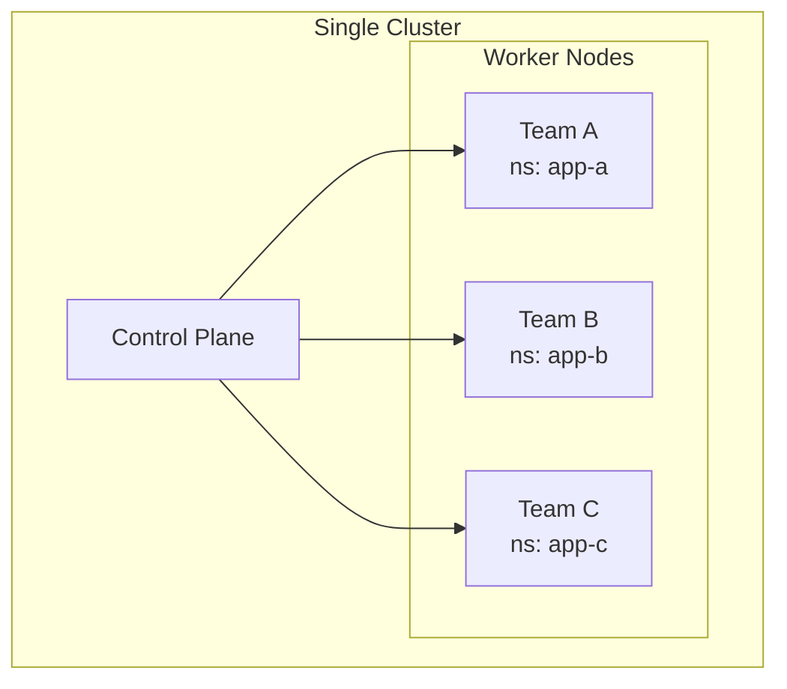
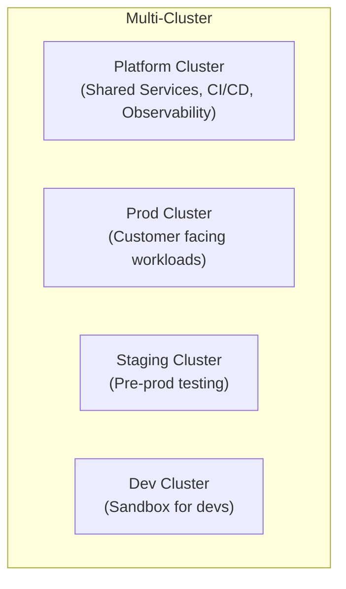
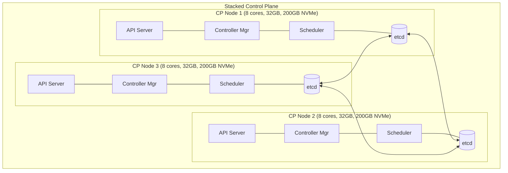
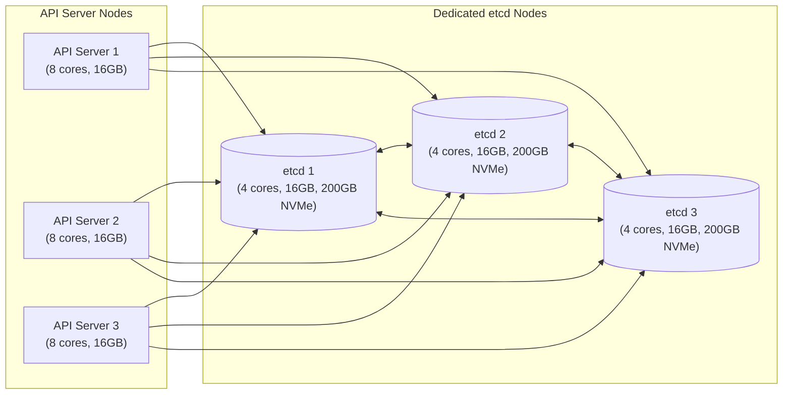
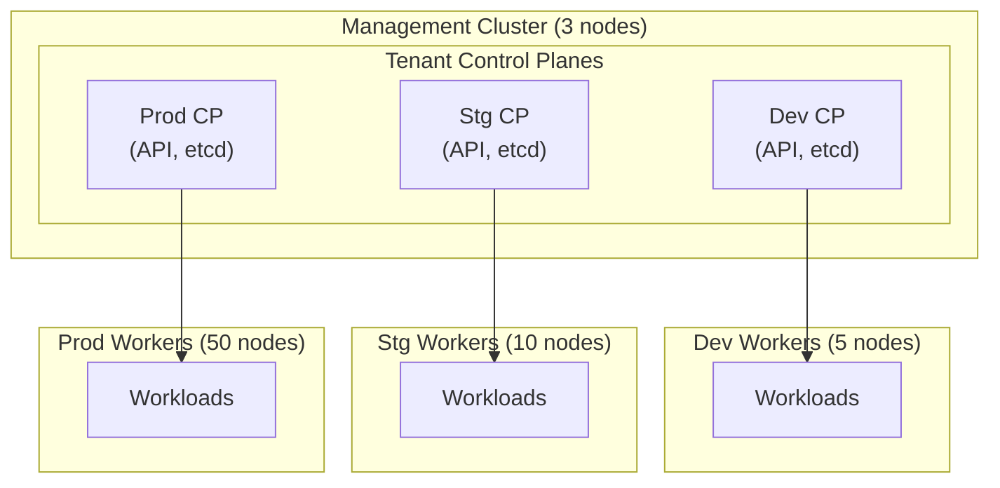
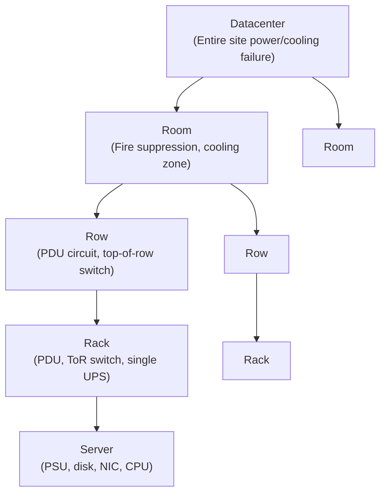

> **Complexity**: `[COMPLEX]` | Time: 60 minutes
>
> **Prerequisites**: [Module 1.2: Server Sizing](../module-1.2-server-sizing/), [CKA Part 1: Cluster Architecture](../../k8s/cka/part1-cluster-architecture/)

---

## What You'll Be Able to Do

After completing this module, you will be able to:

1. **Design** multi-cluster topologies that balance blast radius isolation against operational complexity and compliance needs.
2. **Evaluate** single-cluster versus multi-cluster architectures based on team structure, regulatory boundaries, and failure domain constraints.
3. **Plan** control plane placement across racks and availability zones to implement robust, highly available clusters.
4. **Implement** physical cluster segmentation strategies that strictly align with business domains and infrastructure resilience requirements.
5. **Diagnose** hardware and network bottlenecks in distributed consensus systems like etcd to guarantee baseline performance.

---

## Why This Module Matters

In a past deployment cycle, a large European insurance company ran a single 400-node Kubernetes cluster in their on-premises datacenter. Everything—the customer-facing portal, back-end claims processing, heavy actuarial calculations, and internal developer tooling—ran on this one monolithic cluster. When they performed a minor version upgrade from Kubernetes 1.34 to 1.35, an unforeseen major API deprecation caused 60% of their critical workloads to fail admission control simultaneously. Because there was no isolation, the entire company experienced a catastrophic outage that lasted for four grueling hours. 

Their subsequent postmortem identified the root cause as a "catastrophic blast radius." A single cluster meant a single failure domain for over two hundred applications spread across fifteen distinct business units. They spent the next six months executing a painful migration to split their infrastructure into seven distinct clusters, designating one per business domain alongside a shared management platform. This architectural pivot cost the organization over $800,000 in engineering time and lost productivity. The Chief Technology Officer's ultimate lesson was stark: the most expensive architecture decision is the one you make on day one and have to undo on day three hundred.

Determining how many clusters you should run, where the control planes should physically live, and whether those clusters should span multiple racks are decisions that carry immense weight. These topology choices are notoriously difficult to change later and have cascading, permanent implications for your networking layout, storage integrations, security posture, and daily operational overhead. The choices you make during the topology planning phase define the hard limits of your system's reliability.

> **The City Planning Analogy**
>
> Cluster topology is essentially digital city planning. One massive city (a monocluster) inevitably suffers from traffic congestion, catastrophic single points of failure, and a single mayor who controls all policies. Multiple smaller cities (a multi-cluster architecture) provide independent governance, neatly isolated failure domains, and clear boundaries. However, these smaller cities require robust highways (networking infrastructure) and complex trade agreements (service meshes) between them to function cohesively. The right answer depends heavily on your population size, geographic spread, and how much absolute autonomy each operational district requires.

---

## Single Cluster vs Multi-Cluster Architectures

The first major architectural decision you will make is defining your cluster boundaries. Kubernetes releases approximately three minor versions per year. According to the official release cycle, these minor versions receive about fourteen months of support: twelve months of standard support followed by roughly two months of maintenance mode dedicated strictly to critical and CVE fixes. As of our current state, the three actively supported branches are 1.35 (the latest stable, EOL 2027-02-28), 1.34, and 1.33. This aggressive release cadence strongly influences topology because upgrading a massive monolithic cluster is exponentially riskier than upgrading several smaller, isolated ones.

### When One Cluster Is Enough

A single-cluster design minimizes the sheer number of moving parts. It is highly efficient for smaller organizations that do not yet have the operational maturity to manage fleet-wide deployments.



**Pros:**
- Simple operations (only one cluster to manage and monitor).
- Easy service discovery (DNS resolves seamlessly within the cluster boundary).
- Shared resources lead to better overall hardware utilization.
- Single control plane cost minimizes infrastructure overhead.

**Cons:**
- The blast radius encompasses everything; a fatal control plane error takes down all teams.
- Noisy neighbors are a constant threat (one team's runaway load spike degrades performance for everyone).
- Upgrades are an all-or-nothing event.
- RBAC complexity scales non-linearly as more teams are added to the same API server.

**Best for:** Environments with fewer than 100 nodes, fewer than 5 teams, and homogeneous workloads.

### When You Need Multiple Clusters

When your organization scales, or when strict isolation is legally mandated, you must adopt a multi-cluster architecture. Kubernetes version skew policies dictate that the API server is the source of truth. While the `kubelet` and `kube-proxy` can be up to three minor versions older than the API server, and `kubectl` is supported within plus or minus one minor version, you cannot freeze a cluster forever. Multi-cluster environments allow you to upgrade a staging cluster to version 1.35 while keeping production safely on 1.34 until validation is complete.



**Best for:**
- Strict environment isolation (separating production from non-production workloads).
- Multi-tenant platforms where you need a dedicated cluster per tenant or business unit.
- Scenarios requiring different Kubernetes versions per environment.
- Strict regulatory boundaries (such as PCI or HIPAA scope isolation).
- Massive deployments exceeding 200 nodes, where splitting clusters preserves operational sanity.

> **Pause and predict**: Your company has 120 nodes, 6 teams, and a mix of PCI-scoped payment processing and general web applications. Before reading the decision matrix, would you recommend a single cluster or multiple clusters? What is the single biggest factor driving your decision?

### Topology Decision Matrix

| Factor | Single Cluster | Multi-Cluster |
|--------|---------------|---------------|
| Teams | < 5 | 5+ or strict isolation needed |
| Nodes | < 100-200 | 200+ or split by purpose |
| Environments | Namespace separation OK | Need hard isolation (prod/staging/dev) |
| Compliance | No PCI/HIPAA scope concerns | Need regulatory boundary isolation |
| K8s versions | All teams on same version | Teams need different versions |
| Blast radius tolerance | High (startup mentality) | Low (enterprise, regulated) |
| Operational team size | 2-3 engineers | 4+ engineers |

---

## Control Plane Placement and High Availability

In a managed cloud environment, the provider abstracts the control plane. In an on-premises datacenter, you are responsible for the physical placement and lifecycle of every control plane node. The minimum hardware requirements for a control plane node, per `kubeadm`, are 2 CPUs and 2 GB of RAM. However, production nodes require significantly more capacity. By default, `kubeadm` applies the `node-role.kubernetes.io/control-plane:NoSchedule` taint to these nodes, ensuring regular workloads do not compete for resources with critical cluster components.

The `kubeadm` utility supports two official high-availability (HA) cluster topology options: the stacked etcd topology and the external etcd topology.

### Pattern 1: Stacked Control Plane (Simple)

The stacked topology is `kubeadm`'s default configuration. A local etcd member is created automatically on each control plane node when you run `kubeadm init` and `kubeadm join --control-plane`.



**Pros:**
- Simpler infrastructure footprint with fewer physical servers to manage.
- It is the `kubeadm` default, making it straightforward to bootstrap.

**Cons:**
- The primary risk is "failed coupling." If a single node fails, you lose both an etcd member and a control plane instance simultaneously, significantly degrading redundancy.
- You cannot scale the API servers independently from the etcd data store.

**Best for:** Clusters with fewer than 200 nodes where extreme throughput is not the primary concern. A stacked etcd HA cluster requires a minimum of 3 control plane nodes.

### Pattern 2: External etcd (Production)

The external etcd topology decouples the control plane processes from the etcd state store. This means losing a control plane instance does not immediately degrade your data store quorum, but it requires twice the number of physical hosts compared to the stacked approach.



**Pros:**
- etcd runs on dedicated NVMe drives, completely eliminating resource contention.
- You can scale API servers independently from etcd.
- etcd hardware failures do not inherently take down the API server processes.

**Cons:**
- Requires a minimum of 3 control plane nodes AND 3 dedicated etcd nodes (6 total hosts minimum).
- The setup is significantly more complex. `kubeadm` bootstraps the etcd cluster statically, not dynamically, requiring careful certificate distribution.

**Best for:** Clusters over 200 nodes and high-throughput transactional workloads. For exceptionally large clusters, Kubernetes documentation recommends storing Event objects in a separate, completely dedicated etcd instance to prevent event spam from degrading control plane performance.

### Pattern 3: Shared Management Cluster

In enterprise environments operating fleets of clusters, the management cluster pattern centralizes the administrative overhead.



This pattern leverages technologies like Cluster API and vCluster to run tenant control planes as containerized workloads inside a dedicated management cluster. This yields massive hardware savings (e.g., 3 physical servers can host the control planes for dozens of tenant clusters).

---

## etcd Sizing and Version Context

etcd relies on the Raft consensus algorithm. It requires a strict quorum of `(n/2)+1` members to maintain consensus, where `n` is the total cluster size. This means a 3-member cluster requires 2 nodes for quorum (tolerating 1 failure), a 5-member cluster requires 3 nodes (tolerating 2 failures), and a 7-member cluster requires 4 nodes (tolerating 3 failures).

> **Pause and predict**: Your CTO wants to deploy 6 etcd members "for extra safety." Based on how Raft consensus works, would 6 members be more or less resilient than 5? What is the downside of even-numbered membership?

Deploying even-sized clusters provides absolutely zero additional fault tolerance over the next-smaller odd size. A 6-member cluster still only tolerates 2 failures (quorum is 4), but it increases the network overhead required to reach consensus. Official guidelines cap etcd clusters at no more than 7 members to prevent severe write latency degradation.

| etcd Members | Quorum | Tolerates Failures | Recommended For |
|-------------|--------|-------------------|-----------------|
| 1 | 1 | 0 | Dev/test only |
| 3 | 2 | 1 | Standard production |
| 5 | 3 | 2 | Mission-critical |
| 7 | 4 | 3 | Rarely needed (higher write latency) |

### Performance and Hardware

The minimum recommended etcd versions to run in Kubernetes production are 3.4.29+ and 3.5.11+. Kubernetes 1.35 relies heavily on the 3.6 release track (specifically bundling versions like 3.6.8-0 via kubeadm). The jump to etcd v3.6.0 (released in May 2025) was monumental: it completely removed the legacy v2store and reduced average memory consumption by approximately 50% by lowering the default `--snapshot-count` from 100,000 to 10,000. 

Despite these software efficiency gains, etcd is brutally sensitive to disk latency. It must be backed by SSD storage delivering a minimum of 50 sequential IOPS for standard workloads, scaling up to ~500 sequential IOPS for heavy deployments (thousands of watchers). Network requirements dictate 1 GbE for common deployments, but 10 GbE is highly recommended for massive clusters to reduce the mean time to recovery during node failures. 

*Authority Note on Paths:* While `/var/lib/etcd` is universally observed as the default data directory in kubeadm deployments, note that official upstream documentation does not explicitly codify this as an immutable standard, so always verify your specific environment's configurations.

---

## Rack-Aware Topology and Failure Domains

To survive a hardware outage, you must map Kubernetes to your datacenter's physical reality. 

### Failure Domain Hierarchy



The golden rule of on-premises topology is to always spread your control plane across your failure domains. The absolute minimum standard is placing one control plane node per rack to survive a top-of-rack (ToR) switch or PDU failure. For high availability, a TCP forwarding load balancer is explicitly required in front of the `kube-apiserver`, distributing traffic to all healthy control plane nodes by performing health checks against the apiserver's default TCP port 6443. Having an odd number of control plane nodes helps with leader election in the case of machine or zone failure.

> **Stop and think**: You have 3 racks, each with its own PDU and ToR switch. Your cluster has 3 control plane nodes. If you put all 3 CP nodes in rack A (to simplify cabling), what happens when rack A loses power? Now consider: what happens if you spread them one per rack and rack A loses power?

### Rack Layout Best Practices

When provisioning the hardware, ensure that every cluster node has a unique MAC address and a universally unique `product_uuid`. Duplicate UUIDs will cause catastrophic node identification failures during the `kubeadm` joining process. Furthermore, swap must be disabled on all Kubernetes nodes (`swapoff -a`), or the kubelet must be explicitly and carefully configured to tolerate it.

| U-Space | Component | Notes |
|---------|-----------|-------|
| U42 | Patch panel | Fiber/copper ingress |
| U41 | ToR Switch 1 | 25GbE primary |
| U40 | ToR Switch 2 | 25GbE redundant |
| U38 | Mgmt Switch | 1GbE out-of-band |
| U36-U35 | Control Plane Node | 2U chassis |
| U34-U23 | Worker Nodes 1-6 | 2U chassis blocks |
| U22-U21 | Storage Node | Ceph OSD |
| U00 | Primary PDU | 2x redundant, A+B feed |

**Rack Environmental Baselines:**
- **Power budget:** ~8-12 kW per rack (check PDU rating)
- **Cooling:** 1 ton per 3.5 kW of IT load (rule of thumb)
- **Weight:** ~1,200 lbs fully loaded (check floor rating)

### Enabling Zone Awareness

In multi-zone clusters, the `kubelet` automatically labels each node with `topology.kubernetes.io/zone`. Kubernetes also automatically adds corresponding zone labels to PersistentVolumes linked to a specific zone, relying on the `NoVolumeZoneConflict` scheduling predicate to ensure pods are placed in the same physical zone as their data. 

**Critical Warning:** Kubernetes does not provide any built-in cross-zone resilience for the API server endpoints themselves. You are entirely responsible for engineering external DNS or external load balancing solutions to route around catastrophic zone failures. 

For large clusters, Kubernetes best practices dictate running one or two control plane instances per failure zone. You should scale these instances vertically first (adding CPU/RAM), and only scale horizontally after reaching the hard performance limits of a single instance.

```bash
# Label nodes with physical topology
kubectl label node worker-01 \
  topology.kubernetes.io/zone=rack-a \
  topology.kubernetes.io/region=dc-east \
  node.kubernetes.io/room=server-room-1 \
  node.kubernetes.io/row=row-3
```

```yaml
apiVersion: apps/v1
kind: Deployment
metadata:
  name: payment-api
spec:
  replicas: 6
  template:
    metadata:
      labels:
        app: payment-api
    spec:
      topologySpreadConstraints:
        - maxSkew: 1
          topologyKey: topology.kubernetes.io/zone
          whenUnsatisfiable: DoNotSchedule
          labelSelector:
            matchLabels:
              app: payment-api
      # This ensures: max 1 pod difference between racks
      # With 6 replicas across 3 racks: 2-2-2 distribution
      # If rack-a fails: 0-2-2 (4 replicas survive immediately)
      #
      # WARNING: With DoNotSchedule, the 2 replacement pods will
      # stay Pending — placing them would create skew 0-3-3 (skew=3),
      # violating maxSkew:1. For HA, use ScheduleAnyway instead,
      # which treats the constraint as a preference rather than
      # a hard requirement during scheduling.
      containers:
        - name: payment-api
          image: payment-api:1.0
```

---

## Network Topology and Default Ports

A correct cluster topology strictly dictates firewall configurations. Ensure the following network paths are permanently open:

**Control Plane Inbound:**
- TCP 6443: Kubernetes API server (Used by all components).
- TCP 2379-2380: etcd server client API and peer communication.
- TCP 10259: kube-scheduler.
- TCP 10257: kube-controller-manager.

**Worker Node Inbound:**
- TCP 10250: Kubelet API (Required on all nodes, both control plane and worker).
- TCP 10256: kube-proxy (Used by self and load balancers).
- TCP/UDP 30000-32767: Default NodePort Services range.

### Verifying System Health

etcd members should be deployed within a single data center when possible to minimize latency and network partition risk. To validate your topology's health, use `etcdctl` to verify latency and disk performance.

```bash
# Check etcd member health and latency
ETCDCTL_API=3 etcdctl \
  --endpoints=https://etcd1.internal.example:2379,https://etcd2.internal.example:2379,https://etcd3.internal.example:2379 \
  --cert=/etc/kubernetes/pki/etcd/peer.crt \
  --key=/etc/kubernetes/pki/etcd/peer.key \
  --cacert=/etc/kubernetes/pki/etcd/ca.crt \
  endpoint health --write-out=table

# Check etcd performance limits
ETCDCTL_API=3 etcdctl check perf --endpoints=https://etcd1.internal.example:2379 \
  --cert=/etc/kubernetes/pki/etcd/peer.crt \
  --key=/etc/kubernetes/pki/etcd/peer.key \
  --cacert=/etc/kubernetes/pki/etcd/ca.crt
```

---

## Did You Know?

- **Kubernetes v1.35 supports massive scale:** The maximum supported limits for a single cluster are 5,000 nodes, 110 pods per node, 150,000 total pods, and 300,000 total containers. Beyond 5,000 nodes, the API server's watch cache, etcd's storage, and the scheduler's throughput become bottlenecks. Most production clusters stay under 500 nodes and split beyond that.
- **Google runs approximately 15,000 Kubernetes clusters internally** (Borg/GKE hybrid). They do not run one giant cluster — they use the multi-cluster pattern with automated lifecycle management. Even at Google's scale, the operational overhead of one massive cluster is worse than many smaller ones.
- **etcd 3.6 was a major architectural shift:** Released in May 2025, it achieved an incredible 50% average memory reduction primarily by dropping the default `--snapshot-count` limit.
- **The Kubernetes release cadence is relentless:** With approximately three minor versions per year, each offering only about 14 months of total support, update automation is not optional—it is a survival requirement.
- **Spotify operates over 150 independent Kubernetes clusters:** Rather than wrestling with the blast radius of a monocluster, they built a massive multi-cluster fleet mapped tightly to specific engineering domains.

---

## Common Mistakes

| Mistake | Why It Causes Outages | Fix |
|---------|---------|----------|
| One giant monolithic cluster | Blast radius equals the entire company; a single API server panic creates a total outage. | Split by environment, then by business domain. |
| Too many micro-clusters | Operational overhead rapidly exceeds your platform engineering team's capacity. | Ensure 1 engineer can manage ~5-10 clusters via heavy declarative automation. |
| CP nodes in the same rack | A single PDU or ToR switch failure takes down the cluster quorum immediately. | Spread CP nodes across physical racks or rows. |
| Stretching etcd across DCs | Latency absolutely kills Raft consensus performance, causing API server timeouts. | Keep etcd in one DC; use application federation for multi-DC needs. |
| No lifecycle automation | Manual cluster creation takes days and guarantees configuration drift over time. | Use Cluster API and GitOps for declarative lifecycle management. |
| Namespace isolation only | Namespaces do not provide hard security boundaries for sensitive workloads. | Use separate clusters for hard trust boundaries, namespaces for organization. |
| Not labeling nodes | The scheduler cannot utilize topology spread constraints without physical mapping data. | Label every node meticulously with rack, row, room, and DC metadata. |
| Even number of etcd members | Even numbers provide no extra fault tolerance but create severe split-brain risks without a tiebreaker. | Always use odd numbers: 3, 5, or 7. |

---

## Quiz

### Question 1
Your company has 300 nodes, 8 teams, and a regulatory requirement to isolate PCI-scoped workloads. How many clusters would you recommend?

<details>
<summary>Answer</summary>

**Minimum 3 clusters, recommended 4-5:**
We must segment by regulatory boundary and operational lifecycle. The PCI cluster is non-negotiable because regulatory scope isolation requires a hard boundary at the control plane and network levels. The production cluster handles the bulk of your workloads without imposing PCI audit constraints on general applications. The non-production cluster prevents staging incidents and developer experiments from affecting production stability. A platform cluster is recommended to isolate CI/CD tooling, observability stacks, and GitOps controllers. Finally, a management cluster is recommended to host Cluster API controllers and manage the lifecycle of other clusters. This modularity reduces the blast radius of any single control plane failure.
</details>

### Question 2
You have 3 racks in one datacenter. Where do you place your 3 control plane nodes?

<details>
<summary>Answer</summary>

**One control plane node per rack.**
```text
Rack A: CP-1 + Workers
Rack B: CP-2 + Workers
Rack C: CP-3 + Workers
```
This ensures that a severe rack failure—such as a blown PDU, a dead ToR switch, or localized cooling loss—takes down at most 1 of the 3 CP nodes. The remaining 2 nodes successfully maintain the required Raft quorum (a 2/3 majority). If you only have 2 racks, you are forced to place 2 CP nodes in one rack and 1 in the other; a failure in the 2-node rack will immediately break quorum. This proves that 3 racks are the fundamental minimum for proper HA control plane distribution.
</details>

### Question 3
A financial institution is designing a 400-node cluster for high-frequency trading APIs. The architecture review board mandates that any spikes in API server CPU usage (due to heavy webhook processing) must never impact data store latency. Which high-availability topology should they choose and why?

<details>
<summary>Answer</summary>

**They should use the external etcd topology.**
When a cluster scales rapidly (exceeding 200 nodes) and maximum API throughput is critical, etcd write throughput becomes the primary bottleneck. Placing it on dedicated servers with isolated NVMe drives guarantees zero CPU or I/O contention with the heavy API server processes. This pattern satisfies the board's mandate because it structurally decouples the API server processes from the etcd data store, allowing the API servers to horizontally scale independently to handle massive CRD or webhook loads without impacting etcd performance.

Use **stacked** when:
- Cluster < 200 nodes
- Simplicity is valued over maximum performance
- You have limited server count (3 servers = 3 stacked CP nodes)
</details>

### Question 4
A platform team proposes stretching a single etcd cluster across two standard datacenters with an average 25ms round-trip time to provide site-level fault tolerance. Why will this design fail during peak loads?

<details>
<summary>Answer</summary>

**The latency exceeds the ~10ms maximum threshold for stable Raft consensus.**
etcd relies on the Raft consensus protocol, which strictly requires the leader to replicate log entries to a majority of members before acknowledging every single write. The default heartbeat interval is just 100ms, and the election timeout is 1,000ms (10x heartbeat). If network latency exceeds ~10ms (and 25ms is far beyond this), the time required for a write to be committed approaches the heartbeat threshold, triggering severe leader election instability. Under load, this causes a catastrophic collapse in write throughput and slow API server responses. For multi-DC resilience, you must use separate clusters with federation or application-layer replication instead of stretching etcd.
</details>

### Question 5
An engineer notices that during a massive deployment, the control plane becomes unresponsive. The cluster is running a stacked HA topology with rotational HDDs. What is the likely root cause?

<details>
<summary>Answer</summary>

**Insufficient disk IOPS disrupting etcd consensus.**
etcd requires incredibly fast, low-latency disk writes to append Raft logs reliably. Rotational hard drives cannot meet the strict minimum requirement of 50 sequential IOPS required for basic stability, let alone the ~500 IOPS required during heavy deployment loads. When disk writes stall, the etcd leader fails to commit log entries in time, prompting constant, chaotic leader elections that block all cluster API operations.
</details>

### Question 6
You are preparing to upgrade your Kubernetes cluster from v1.34 to v1.35. Can you upgrade the control plane while leaving the worker nodes running kubelet v1.33?

<details>
<summary>Answer</summary>

**Yes, the version skew policy permits this.**
Kubernetes officially supports a version skew where the `kubelet` and `kube-proxy` can be up to three minor versions older than the `kube-apiserver`. Since the control plane is at v1.35, a `kubelet` running v1.33 is exactly two minor versions behind, which is fully supported and safe. This skew allowance is deliberately designed to let you upgrade the control plane first, verifying stability before incrementally rolling out updates to the massive fleet of worker nodes.
</details>

### Question 7
To achieve cross-zone fault tolerance, an engineer places three control plane nodes in three different availability zones and configures an external TCP load balancer. Will Kubernetes automatically fail over API requests if a zone goes dark?

<details>
<summary>Answer</summary>

**No, Kubernetes does not manage external cross-zone API resilience.**
While the cluster scheduler handles pod resilience using labels like `topology.kubernetes.io/zone`, the Kubernetes architecture explicitly does not provide built-in cross-zone resilience for the API server endpoints themselves. The external TCP forwarding load balancer is entirely responsible for executing health checks against TCP port 6443 and actively rerouting inbound `kubectl` and node traffic away from the dead zone.
</details>

---

## Hands-On Exercise: Design a Cluster Topology

**Task**: Given an organization's requirements, design a complete cluster topology with physical placement that satisfies strict regulatory and high-availability demands.

### Scenario

A manufacturing company is deploying Kubernetes on-premises:
- 2 datacenters (DC-East and DC-West, located 50km apart, maintaining 5ms RTT).
- 150 total nodes needed to support global operations.
- 4 distinct teams: Platform, Product, Data Science, and QA.
- A strict PCI compliance requirement for payment processing (20 nodes).
- Specialized GPU workloads for quality inspection ML models (10 nodes).
- The entire architecture must survive a full datacenter failure.

### Steps

**Step 1: Determine the cluster count.**
You must establish strict isolation boundaries.
- **PCI cluster** (dedicated, DC-East): 15 worker nodes + 3 CP = 18 nodes.
- **Production cluster** (DC-East primary): 50 worker nodes + 10 GPU nodes + 3 CP = 63 nodes.
- **DR/Standby cluster** (DC-West): 35 worker nodes + 3 CP = 38 nodes.
- **Non-prod cluster** (DC-West): 28 worker nodes + 3 CP = 31 nodes.
- **Total:** 18 + 63 + 38 + 31 = 150 nodes.

**Step 2: Place the control planes across failure domains.**
Ensure no single rack failure breaks quorum for any cluster.

```bash
# DC-East (3 racks) — 81 nodes total (PCI: 18, Prod: 63)
# Rack A: PCI CP-1, Prod CP-1, 5 PCI workers, 20 Prod workers  (27 nodes)
# Rack B: PCI CP-2, Prod CP-2, 5 PCI workers, 20 Prod workers  (27 nodes)
# Rack C: PCI CP-3, Prod CP-3, 5 PCI workers, 10 Prod workers + 10 GPU  (27 nodes)

# DC-West (3 racks) — 69 nodes total (DR: 38, NonProd: 31)
# Rack D: DR CP-1, NonProd CP-1, 12 DR workers, 9 NonProd workers  (23 nodes)
# Rack E: DR CP-2, NonProd CP-2, 12 DR workers, 9 NonProd workers  (23 nodes)
# Rack F: DR CP-3, NonProd CP-3, 11 DR workers, 10 NonProd workers (23 nodes)
```

**Step 3: Label and taint the physical nodes.**
Apply the proper topology labels so the scheduler understands the physical datacenter layout. Isolate the expensive GPU hardware.

```bash
# DC-East nodes
kubectl label node east-rack-a-01 \
  topology.kubernetes.io/region=dc-east \
  topology.kubernetes.io/zone=rack-a \
  node.kubernetes.io/purpose=worker

# GPU nodes — label and taint to isolate
kubectl label node east-rack-c-gpu-01 \
  topology.kubernetes.io/region=dc-east \
  topology.kubernetes.io/zone=rack-c \
  node.kubernetes.io/gpu=nvidia-a100 \
  node.kubernetes.io/purpose=gpu

kubectl taint nodes east-rack-c-gpu-01 \
  node.kubernetes.io/gpu=nvidia-a100:NoSchedule
```

**Checkpoint Verification:**
```bash
kubectl get nodes -l topology.kubernetes.io/zone=rack-c,node.kubernetes.io/purpose=gpu --show-labels
kubectl describe node east-rack-c-gpu-01 | grep Taints
```

**Step 4: Define the topology spread constraints.**
Configure the application workloads to gracefully distribute themselves across the racks.

```yaml
# Production deployment spread across racks
# Using ScheduleAnyway so replacements can schedule after a rack failure
topologySpreadConstraints:
  - maxSkew: 1
    topologyKey: topology.kubernetes.io/zone
    whenUnsatisfiable: ScheduleAnyway
```

### Success Criteria
- [ ] The cluster count is justified with sound architectural reasoning.
- [ ] High-risk PCI workloads are fully isolated in a dedicated cluster.
- [ ] Control planes are perfectly spread across physical failure domains (racks).
- [ ] etcd consensus is protected because clusters do not stretch across DCs.
- [ ] The DR strategy can seamlessly handle a full DC-East failure.
- [ ] Node labels are comprehensively defined for topology-aware scheduling.
- [ ] Expensive GPU nodes are structurally isolated with both labels and taints.

---

## Next Module

Continue to [Module 1.4: TCO & Budget Planning](../module-1.4-tco-budget/) to learn how to build a comprehensive, multi-year cost model for your newly designed on-premises Kubernetes platform.