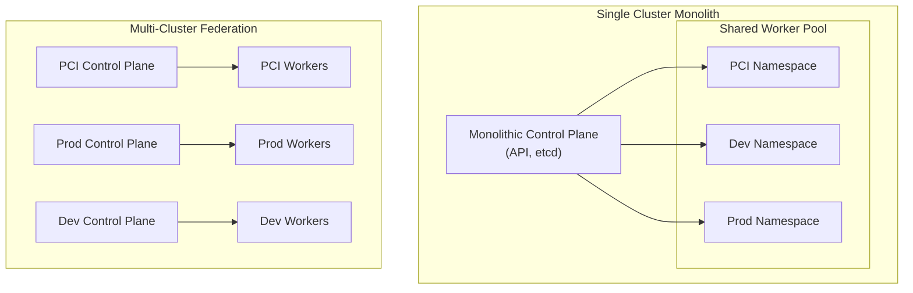

> **Complexity**: `[COMPLEX]`
>
> **Time to Complete**: 120 minutes
>
> **Prerequisites**: [Module 1.2: Server Sizing](../module-1.2-server-sizing/), [CKA Part 1: Cluster Architecture](/k8s/cka/part1-cluster-architecture/)

---

## What You'll Be Able to Do

After completing this module, you will be able to:

1. **Design** multi-cluster topologies that balance blast radius isolation against operational complexity, explicitly factoring in control plane infrastructure overhead costs.
2. **Evaluate** single-cluster versus multi-cluster architectures based on team structure, regulatory boundaries, and physical failure domain constraints within an on-premises datacenter.
3. **Plan** control plane placement and etcd quorum configurations across racks and availability zones to implement robust, highly available, and highly performant cluster backbones.
4. **Implement** hardware segmentation strategies using node taints, tolerations, and node selectors to strictly align cluster workloads with business domains and infrastructure resilience requirements.
5. **Diagnose** capacity bottlenecks and network boundaries in distributed topologies to prevent cross-AZ traffic spikes, maintain operational cost efficiency, and ensure stable Raft consensus.

---

## Why This Module Matters

Hypothetical scenario: Consider a large regional banking institution. This bank decided to run their entire on-premises Kubernetes infrastructure as a single, massive 600-node cluster. Their goal was to save on control plane administration costs. They placed their core transaction processing systems on this shared platform. They also added their customer-facing web portals and internal developer testing environments. Finally, they included their heavy batch-processing data analytics workloads. 

For the first year, this monolithic cluster appeared to be a triumph of efficiency. It boasted high hardware utilization and simplified monitoring. However, during a routine deployment window on a Friday evening, disaster struck. A junior developer deployed a misconfigured custom controller to an internal testing namespace. This controller contained a severe bug in its reconciliation loop. This runaway controller immediately began issuing thousands of mutating API requests per second against the Kubernetes API server. This rapidly exhausted the control plane's available CPU and memory resources.

Because all workloads shared the same control plane, the resulting latency spike did not just affect the development namespace. It caused the entire cluster to enter a cascading failure state. The API servers became completely unresponsive. This prevented the kubelets on the worker nodes from renewing their node leases. The control plane then marked hundreds of nodes as NotReady. This triggered a massive wave of pod evictions across the entire banking platform. It took down the customer web portals and the core transaction processors simultaneously. 

The outage lasted for six agonizing hours. Infrastructure engineers struggled to interact with the overloaded API server. They could not easily delete the offending deployment. The subsequent postmortem revealed a painful truth. Saving a few thousand dollars on additional control plane hardware cost the bank millions. They lost massive transaction revenue and suffered severe reputational damage. This single event completely changed their entire architectural philosophy regarding multi-tenant infrastructure. They realized that ignoring foundational failure domains creates unacceptable enterprise risk. They ultimately rewrote their entire platform strategy from the ground up to prioritize absolute physical isolation over minimal management overhead.

The choices you make regarding cluster topology are permanent. How many clusters you run defines your security posture. Where you place the control plane components dictates your availability. How you segment the underlying hardware sets the absolute limits of your system's reliability. Unlike stateless applications that can be easily refactored, the topology of an on-premises cluster is notoriously difficult to alter. You cannot easily change these designs once production workloads are running. 

Designing a robust topology requires careful analysis. You must rigorously evaluate the trade-offs between operational simplicity and blast radius isolation. You must also meticulously map your logical Kubernetes boundaries to the physical realities of your datacenter. You need to understand how rack layouts and top-of-rack switches dictate your true failure domains. You must also account for power distribution units. By mastering these architectural principles, you ensure platform stability. Your platform will withstand both malicious configurations and catastrophic physical hardware failures. It will protect critical business operations without compromise.

---

## Core Section 1: Single-Cluster vs Multi-Cluster Decision Framework

The foundational decision in any on-premises Kubernetes deployment is determining the precise boundary of a cluster. Kubernetes was originally designed to manage vast fleets of machines as a single logical entity. However, operational reality often dictates breaking that monolithic vision into smaller, manageable pieces. A single-cluster architecture minimizes the total number of moving parts. It provides a unified endpoint for service discovery. It serves as a centralized metrics aggregation point. It also offers the highest potential hardware utilization because all workloads share the same physical node pool. 

However, this unified approach inherently creates a singular, massive failure domain. Any catastrophic event will simultaneously impact every application hosted within the cluster boundary. This could be an etcd database corruption. It might be an API server panic. It could also be a fundamentally flawed cluster-wide RBAC configuration. When the control plane fails, the entire business halts. There is no isolation to contain the damage.

Conversely, a multi-cluster architecture actively partitions your workloads across several entirely independent Kubernetes clusters. This deliberately sacrifices some operational simplicity to gain rigid blast radius isolation. By deploying multiple clusters, you guarantee physical separation. A fatal error in the development environment's control plane has absolutely zero technical capability to disrupt the production environment. This physical separation is frequently mandated by strict regulatory frameworks. Frameworks like the Payment Card Industry Data Security Standard (PCI DSS) demand airtight boundaries around sensitive data. The Health Insurance Portability and Accountability Act (HIPAA) requires similar isolation for medical records.

Furthermore, multi-cluster architectures allow platform teams to upgrade clusters asynchronously. Upgrading Kubernetes is inherently risky. You can validate new minor versions of Kubernetes in staging environments for weeks. Only after proving stability do you apply those identical upgrades to mission-critical production clusters.


```mermaid
flowchart TD
    subgraph "Single Cluster Monolith"
        CP1["Monolithic Control Plane
(API, etcd)"]
        subgraph "Shared Worker Pool"
            PCI["PCI Namespace"]
            DEV["Dev Namespace"]
            PROD["Prod Namespace"]
        end
        CP1 --> PCI
        CP1 --> DEV
        CP1 --> PROD
    end
    
    subgraph "Multi-Cluster Federation"
        CP_PCI["PCI Control Plane"] --> W_PCI["PCI Workers"]
        CP_PROD["Prod Control Plane"] --> W_PROD["Prod Workers"]
        CP_DEV["Dev Control Plane"] --> W_DEV["Dev Workers"]
    end
```

To systematically evaluate whether a single cluster or multiple clusters are appropriate, you must analyze your organizational structure. You must assess your tolerance for risk. You must also measure the physical scale of your deployment. Suppose your engineering organization consists of fewer than twenty developers. Perhaps you operate fewer than fifty total physical nodes. In this case, the administrative burden of maintaining multiple control planes is massive. Managing distributed service meshes and federated identity management systems will likely outweigh the theoretical benefits of isolation. 

However, your platform may scale beyond two hundred nodes. You might onboard entirely distinct business units with competing regulatory requirements. When this happens, the necessity for multi-cluster isolation becomes absolute. You must establish clear criteria for when a new cluster is warranted. A new cluster might be needed when a team requires cluster-admin privileges. It might be necessary when a specific workload demands an incompatible, specialized network plugin. Setting these rules prevents uncontrolled cluster sprawl.

> **Pause and predict**: Imagine your security team mandates that developers must have full administrative access (cluster-admin) to their own environments. They need this to experiment with new Custom Resource Definitions (CRDs). Can you safely accommodate this requirement in a shared, single-cluster architecture using namespaces? Why or why not?

From a financial perspective, the cost implications of multi-cluster topologies are significant. They are inescapable, particularly in an on-premises environment. Here, you are purchasing the underlying physical hardware upfront. Every distinct Kubernetes cluster requires its own dedicated control plane. This typically consists of three dedicated, highly available master nodes. 

If you deploy ten separate clusters, you must provision thirty physical servers. You might use substantial virtual machine equivalents instead. This hardware is purely for cluster management overhead. You pay this cost before scheduling a single revenue-generating application pod. This control plane tax forces organizations to aggressively optimize their hardware utilization. You must ensure that the clusters you deploy are densely packed enough to justify the foundational management infrastructure costs. 

To combat this overhead, advanced on-premises platform teams often leverage control plane virtualization technologies. They use tools like vCluster (virtual Kubernetes clusters on shared hosts, using k3s, k0s, or native K8s control planes inside a pod). These tools dynamically pack multiple logical control planes onto a smaller set of high-performance physical management nodes. This saves massive capital expenditures while preserving logical isolation boundaries. The cost savings can easily reach hundreds of thousands of dollars for enterprise deployments.


## Core Section 2: Control-Plane Topology and etcd Placement Strategies

Once you have defined your cluster boundaries, you must carefully design the internal topology of the control plane. This design guarantees high availability and consistent performance under extreme load. The Kubernetes control plane is the centralized brain of the cluster. It consists of the API server, the controller manager, the scheduler, and the etcd key-value datastore. In a production-grade on-premises deployment, you must deploy these components redundantly. You must spread them across multiple physical machines to survive inevitable hardware failures. 

The most fundamental architectural choice in this domain is deciding your etcd topology. You must choose whether to utilize a stacked etcd topology or an external etcd topology. This decision fundamentally alters the physical footprint of your infrastructure. It also dictates the operational resilience of your management systems.

In a stacked high-availability topology, every control plane node runs a full suite of management processes. Each node runs an instance of the kube-apiserver, kube-scheduler, and kube-controller-manager. Crucially, each node also runs a local member of the etcd cluster. This approach is the default configuration for tools like kubeadm. It significantly simplifies the initial bootstrapping process. It minimizes the total number of physical servers required to establish a highly available control plane. 

A standard stacked topology requires exactly three control plane nodes. This allows the cluster to tolerate the catastrophic failure of any single node. It achieves this without losing the required Raft consensus quorum. However, this tightly coupled architecture has a severe drawback. It inherently binds the fate of the API server to the fate of the local etcd member. If a sudden spike in API requests exhausts the node's CPU, the local etcd process suffers. It may be starved of resources, leading to missed heartbeats. This triggers chaotic, cluster-destabilizing leader elections.

```text
+-------------------------------------------------------+
| Stacked Control Plane Topology                        |
|                                                       |
|  +----------------+ +----------------+ +-----------+  |
|  |    Node 1      | |    Node 2      | |  Node 3   |  |
|  | [API Server]   | | [API Server]   | | [API Svr] |  |
|  | [etcd member]  | | [etcd member]  | | [etcd m]  |  |
|  +----------------+ +----------------+ +-----------+  |
|          |                  |                |        |
|          +--------(Raft Consensus)-----------+        |
+-------------------------------------------------------+
```

Conversely, an external etcd topology completely decouples the control plane components from the stateful datastore. It places the etcd members on their own dedicated, isolated physical servers. This architecture requires a minimum of six distinct nodes. Three nodes host the API servers. Three separate nodes form the independent etcd cluster. This substantially increases the hardware footprint and the configuration complexity. 

However, it provides unparalleled resilience for massive, high-throughput clusters. By isolating etcd on dedicated hardware, you protect the core database. These dedicated servers must be equipped with extremely fast NVMe solid-state drives. This guarantees that heavy computational loads on the API server cannot starve the datastore. Complex webhook admission controllers or massive Deployment rollouts will consume API server CPU. But they will never impact the latency-sensitive Raft consensus algorithm. This algorithm will always have the CPU cycles and disk IOPS it requires to maintain strict cluster state.

> **Pause and predict**: If you deploy an external etcd topology, you might decide to provision four etcd nodes instead of three. You might do this to provide "extra redundancy." How many node failures can your four-node etcd cluster survive before it loses quorum and halts all operations?

The financial cost of control plane topology choices scales linearly with hardware requirements. It depends entirely on your need for dedicated hardware and high-performance storage solutions. An external etcd topology effectively doubles the base infrastructure cost of your control plane. It demands specialized servers optimized for sequential write performance rather than general-purpose compute. 

Furthermore, etcd is exceptionally sensitive to disk latency. Attempting to save money by deploying etcd onto spinning hard disk drives (HDDs) is a massive mistake. Using lower-tier, network-attached storage arrays will inevitably result in devastating API server timeouts. It will cause severe cluster instability. To optimize costs without sacrificing reliability, infrastructure teams must meticulously right-size their etcd nodes. You must invest heavily in low-latency, enterprise-grade NVMe drives. Conversely, you should scale back unnecessary CPU and RAM allocations on these specific datastore nodes. This ensures that the hardware investment is targeted exactly where the distributed consensus algorithm demands it most.

---

## Core Section 3: Worker Pool Design and Hardware Segregation

The control plane orchestrates the cluster, but the worker nodes execute the actual business logic. Therefore, worker pool design is the most critical factor in determining application performance. It also determines your overall hardware efficiency. In a heterogeneous on-premises environment, your physical servers are rarely identical. You may have racks of dense compute nodes. You might have chassis packed with high-capacity storage drives. You may also have specialized servers equipped with expensive GPU accelerators for machine learning workloads. 

A robust cluster topology must intelligently expose this underlying hardware diversity to the Kubernetes scheduler. It must do this without exposing the applications to unnecessary complexity. This is primarily achieved by structuring your worker nodes into distinct logical pools. You use node labels to advertise hardware capabilities to the cluster. You employ node taints to rigorously repel incompatible workloads from specialized hardware.

Creating dedicated worker pools using node taints and tolerations establishes firm boundaries. These are programmatic boundaries that guarantee resource isolation at the scheduler level. Consider a scenario where you purchase a multi-million-dollar rack of NVIDIA A100 GPUs. These are intended to support a critical data science initiative. You absolutely cannot afford to have a generic, memory-leaking web application schedule onto those nodes. It would consume the underlying host's RAM, starving the ML models. 

By applying a `NoSchedule` taint to the GPU nodes, you solve this problem. For example, you use `node.kubernetes.io/gpu=nvidia-a100:NoSchedule`. You instruct the Kubernetes scheduler to instantly reject any pod lacking a specific toleration. This guarantees that only specifically engineered ML workloads can execute there. These workloads must be configured to tolerate the taint. They must also explicitly request the GPU resource. They will be the only pods to ever execute on that expensive, specialized hardware pool.

```yaml
# Example: Tainting a node to protect specialized hardware
# Run this command during hardware provisioning
# kubectl taint nodes gpu-worker-01 node.kubernetes.io/gpu=nvidia-a100:NoSchedule

apiVersion: v1
kind: Pod
metadata:
  name: ML-model-training-job
spec:
  containers:
  - name: cuda-container
    image: nvidia/cuda:11.4.2-base-ubuntu20.04
    resources:
      limits:
        nvidia.com/gpu: 1
  # This toleration allows the pod to bypass the protective taint
  tolerations:
  - key: "node.kubernetes.io/gpu"
    operator: "Equal"
    value: "nvidia-a100"
    effect: "NoSchedule"
  # This node selector forces the pod onto the specific hardware pool
  nodeSelector:
    accelerator: "nvidia-a100"
```

Beyond protecting specialized hardware, node segregation is frequently employed for security. It creates dedicated infrastructure pools for highly regulated workloads. Suppose your organization processes credit card transactions. The PCI DSS compliance framework mandates strict isolation. Any server touching cardholder data must be isolated from general-purpose corporate networks. Network policies can restrict pod-to-pod communication logically. However, deploying a dedicated, tainted worker pool provides physical separation. 

This verifiable, physical separation drastically simplifies complex compliance audits. You can confidently demonstrate to external auditors that payment pods are isolated. They are fundamentally incapable of scheduling onto the same physical hardware as developer workloads. This completely eliminates the risk of container escape vulnerabilities compromising sensitive financial data.

The cost implications of worker pool design center entirely around hardware utilization. There is a constant tension between hardware utilization and hardware isolation. Every time you create a new, rigidly isolated worker pool, you increase stranded capacity. You inevitably increase the amount of idle compute capacity in your datacenter. Idle CPU cycles in the GPU pool cannot be dynamically reallocated. They cannot absorb a sudden traffic spike in the general-purpose web application pool. 

To mitigate these severe isolation costs, platform teams must act aggressively. They must closely monitor pool utilization metrics. They should heavily rely on tools like the Kubernetes Cluster Autoscaler. If integrated with an on-premises hypervisor like VMware or OpenStack, it can dynamically power down idle nodes. It returns the resources to the overarching infrastructure fabric. For bare-metal deployments where dynamic provisioning is impossible, you must manually intervene. You must accurately right-size the static worker pools continuously. You must ensure that the expensive, specialized hardware is consistently saturated with productive workloads. This saturation is required to justify the high initial capital expenditure.

### Storage Topology and Rack-Aware Replication

Storage topology is an integral extension of worker pool design, often the most complex and expensive component of an on-premises Kubernetes architecture, requiring meticulous planning to prevent data loss. Unlike stateless application tiers that can rapidly scale horizontally across any available compute node, stateful workloads demand persistent, highly durable storage backends that are deeply integrated with your physical datacenter layout. When you design a storage topology, you are fundamentally defining how data is replicated across racks, rows, and datacenters to survive catastrophic hardware failures without compromising critical transaction speeds.

In highly resilient environments, infrastructure teams leverage software-defined storage solutions like Ceph or OpenEBS to build distributed storage clusters that span the entire physical footprint. Ceph utilizes a highly sophisticated mechanism known as the CRUSH (Controlled Replication Under Scalable Hashing) map, which explicitly defines the physical failure domains of your hardware. By configuring the CRUSH map to understand your specific rack layouts and power distribution pathways, you can instruct the storage cluster to automatically replicate object data across completely independent power zones. This guarantees that if a localized power distribution unit (PDU) fails and instantly takes down an entire storage rack, the Ceph cluster will seamlessly serve the identical data from a surviving replica in an adjacent, unaffected rack.

```yaml
# Example: StorageClass defining rack-aware replication via Ceph RBD
apiVersion: storage.k8s.io/v1
kind: StorageClass
metadata:
  name: ceph-rbd-rack-aware
provisioner: rbd.csi.ceph.com
parameters:
  clusterID: "ceph-production-cluster-id"
  pool: "kubernetes-production-pool"
  # This specific parameter tells the CSI driver to utilize a CRUSH rule
  # that strictly mandates replication across distinct physical racks.
  topology.kubernetes.io/zone: "rack-level-replication-enforced"
reclaimPolicy: Retain
allowVolumeExpansion: true
```

> **Pause and predict**: If you configure a ZFS storage pool using a standard RAID-Z2 configuration on a single physical node, how many concurrent disk failures can you tolerate? Furthermore, what happens to your stateful Kubernetes pods if the motherboard of that specific storage node suddenly catches fire?

While rack-aware replication provides excellent localized durability, multi-datacenter topologies introduce the complex dilemma of choosing between synchronous and asynchronous storage replication. Synchronous replication guarantees zero data loss (RPO=0) by ensuring that every write operation is securely committed to both the primary datacenter and the secondary standby datacenter before acknowledging the transaction to the application. However, synchronous replication is severely constrained by the inescapable laws of physics; the physical distance between your datacenters dictates the latency floor. As a rule of thumb, round-trip time above approximately 5 milliseconds typically forces architects to adopt asynchronous replication; consult your storage vendor's documentation (Ceph, LINSTOR, DRBD, etc.) for the exact latency threshold of your specific backend, as synchronous replication demands vary by implementation. For datacenters separated by massive geographic distances, architects are forced to implement asynchronous replication zones, accepting a small window of potential data loss (typically measured in minutes) in exchange for maintaining high-performance application throughput in the primary site.

The financial cost of an enterprise-grade storage topology is consistently staggering, often consuming more than half of the total hardware budget for an on-premises deployment. Implementing rack-aware replication typically requires provisioning three times the raw storage capacity to maintain the necessary data replicas, transforming a theoretical 100-terabyte requirement into a 300-terabyte capital expenditure. Furthermore, building high-performance Ceph clusters demands specialized, expensive hardware configurations, including dedicated 25GbE or 100GbE storage networking backbones, massive arrays of NVMe caching drives, and exceptionally high-core-count CPUs to process the hashing algorithms. To control these spiraling storage costs, platform architects must implement aggressive storage tiering strategies, ruthlessly forcing non-critical workloads onto cheaper, slower rotational drives while reserving the ultra-expensive NVMe replication pools exclusively for mission-critical, latency-sensitive database deployments.

## Core Section 4: Failure Domains and Rack-Aware Scheduling

In an on-premises datacenter, the logical abstractions of Kubernetes are inextricably bound to physical realities. You must account for power distribution, cooling zones, and network cabling. A logical node failure is usually a mild inconvenience. However, a physical top-of-rack (ToR) switch failure is a massive event. A localized power distribution unit (PDU) blowout is equally destructive. These events can instantly sever connectivity to dozens of worker nodes simultaneously. 

To build a truly resilient cluster topology, you must explicitly map these physical failure domains. You map them into Kubernetes using node labels. Then, you forcefully instruct the scheduler to distribute application replicas across those domains. You achieve this using topology spread constraints. Failure to integrate this physical awareness into your scheduling logic guarantees future outages. Eventually, a single hardware incident will cause a catastrophic, customer-facing application outage.

The most critical failure domain in a standard datacenter is the server rack. A rack typically represents a single point of failure for both power and networking. If a PDU fails, the rack loses power. If the ToR switch fails, the rack loses network connectivity. During the cluster bootstrapping phase, infrastructure automation must label every node. It must meticulously label every single node with its exact physical location. 

Typically, you use standard topology labels for this mapping. You use `topology.kubernetes.io/zone` to represent the specific rack or server room. You use `topology.kubernetes.io/region` to represent the broader datacenter building. Once the nodes are physically mapped, developers must configure their high-availability deployments properly. They must use `topologySpreadConstraints` to ensure their application replicas are scheduled evenly. They must be spread across the available racks. This guarantees that the loss of any single rack will only impact a fraction of the total capacity.

```yaml
apiVersion: apps/v1
kind: Deployment
metadata:
  name: mission-critical-api
spec:
  replicas: 6
  selector:
    matchLabels:
      app: mission-critical-api
  template:
    metadata:
      labels:
        app: mission-critical-api
    spec:
      # This constraint forces the scheduler to distribute the 6 replicas
      # evenly across the physical racks defined by the zone label.
      topologySpreadConstraints:
      - maxSkew: 1
        topologyKey: topology.kubernetes.io/zone
        whenUnsatisfiable: DoNotSchedule
        labelSelector:
          matchLabels:
            app: mission-critical-api
      containers:
      - name: api-container
        image: internal-registry.example.com/api:v2.4
```

> **Pause and predict**: You configure a deployment with 3 replicas. You use a strict `maxSkew: 1` constraint across 3 racks. However, rack C is currently at 100% CPU capacity. What will happen to the third replica if `whenUnsatisfiable` is set to `DoNotSchedule`? Would changing it to `ScheduleAnyway` be safer for an urgent deployment?

Rack-level awareness protects against localized equipment failures efficiently. However, truly resilient topologies must also plan for total datacenter outages. You achieve this using availability zones (AZs) or distinct geographic regions. An organization might operate multiple datacenters within a metropolitan area. Stretching a single Kubernetes cluster across those active-active sites provides incredible resilience. 

However, this stretched design comes with a massive, non-negotiable caveat. The network latency between the sites must remain consistently below a strict threshold. It must stay below the 10-millisecond threshold demanded by the etcd Raft consensus algorithm. If the latency exceeds this threshold, the stretched cluster architecture will inevitably collapse. The etcd leader elections will constantly time out. This renders the entire control plane completely unresponsive. In high-latency geographic scenarios, you must abandon the stretched cluster pattern entirely. Instead, deploy independent, autonomous clusters in each region. Rely on global server load balancing (GSLB) to route traffic around regional failures safely.

From a cost perspective, multi-zone topologies introduce significant financial overhead. They create hidden costs in the form of cross-zone network egress charges. They also demand redundant hardware provisioning. Consider an application whose replicas are spread evenly across three datacenters. The internal service-to-service communication will frequently traverse expensive fiber links. A web frontend in datacenter A might query a backend database in datacenter B. 

To control these hidden networking costs, advanced topologies employ topology-aware routing features. You can configure this within Kubernetes natively or via a service mesh like Istio. This forces the kube-proxy to prioritize routing traffic to local endpoints. It prefers endpoints located within the exact same physical zone as the requesting pod. By aggressively keeping network traffic localized to the rack or the room, organizations save money. They drastically reduce their leased-line bandwidth requirements. This significantly lowers the overall total cost of ownership for highly available architectures.

---

## Core Section 5: Network Topology Binding and BGP Alignment

The network topology of your on-premises datacenter dictates your external connectivity. It controls how your Kubernetes clusters expose services to the internal corporate network. It also manages how services reach the external internet. Managed cloud providers seamlessly provision magical LoadBalancer objects for you. However, on-premises environments require you to do this heavy lifting manually. You must explicitly bind your Kubernetes networking stack to your physical routers. You must integrate directly with your core switches. 

This is almost universally achieved by deploying a bare-metal load balancing solution. Popular choices include MetalLB or Cilium's integrated BGP control plane. These tools advertise Kubernetes Service IP addresses to the surrounding datacenter infrastructure. Failing to properly align your logical network topology with your physical network architecture is dangerous. It will result in unroutable services. It causes massive asymmetric routing bottlenecks. It also creates a complete inability to integrate with legacy monolithic applications.

The Border Gateway Protocol (BGP) is the undisputed standard for this integration. It connects Kubernetes with enterprise on-premises routing hardware seamlessly. When you configure a service with `type: LoadBalancer`, the magic happens via BGP. Your chosen network plugin dynamically announces the allocated IP address to your top-of-rack switches. This establishes the worker nodes as the direct next-hop destinations for that specific traffic. 

This requires careful coordination with your core network engineering team. You must allocate dedicated, non-overlapping IP address pools for your cluster. You need distinct pools for Kubernetes services (the Service CIDR). You also need massive pools for your internal pod networks (the Pod CIDR). If you accidentally allocate a Pod CIDR that overlaps with your corporate VPN subnet, disaster strikes. You will create a catastrophic routing black hole. Developers will simply not be able to reach the cluster endpoints from their local workstations.

```yaml
# Example: MetalLB BGP Peer Configuration
# This binds the cluster's network topology to the physical ToR switches
apiVersion: metallb.io/v1beta2
kind: BGPPeer
metadata:
  name: tor-router-peer
  namespace: metallb-system
spec:
  # The IP address of the physical top-of-rack switch
  peerAddress: 10.0.0.1
  # The Autonomous System Number of the physical datacenter network
  peerASN: 65000
  # The Autonomous System Number assigned to the Kubernetes cluster
  myASN: 65001
---
apiVersion: metallb.io/v1beta1
kind: IPAddressPool
metadata:
  name: production-services
  namespace: metallb-system
spec:
  # The dedicated IP range allocated by the network engineers for K8s services
  addresses:
  - 192.168.100.0/24
```

> **Pause and predict**: You might configure MetalLB to use Layer 2 mode instead of BGP. In Layer 2 mode, all traffic for a specific service is funneled through a single "leader" node. What impact will this have on network throughput for a high-traffic application? How does this compare to a BGP setup that utilizes Equal-Cost Multi-Path (ECMP) routing?

Advanced network topologies frequently employ specialized Container Network Interfaces (CNIs). Tools like Calico or Cilium establish extremely granular, policy-driven network boundaries. They operate entirely within the cluster boundary. These advanced CNIs replace the basic, iptables-based `kube-proxy` implementation. They use high-performance eBPF (Extended Berkeley Packet Filter) programs instead. These eBPF programs are attached directly to the Linux kernel. 

This architectural shift drastically reduces network latency for inter-pod communication. It also enables profound visibility into real-time network flows. Furthermore, these tools allow infrastructure teams to define strict egress gateways. You can force all traffic bound for a legacy mainframe database to exit through a specific node. This node has a statically assigned, predictable IP address. This satisfies strict legacy firewall constraints instantly. It achieves this without compromising the dynamic scheduling nature of the container orchestration platform.

The cost of network topology design in an on-premises environment is heavily front-loaded. It is largely determined by the physical hardware required to support your chosen throughput. It also involves the administrative overhead of managing complex IP address allocations. High-performance BGP routing and ECMP load balancing require enterprise-grade equipment. Top-of-rack switches and robust core routers represent a massive capital expenditure. 

Furthermore, exhausting an IPv4 address space is a costly operational nightmare. Poorly planned Pod CIDR allocations force organizations to undertake agonizing network re-architecture projects. They might have to hastily implement complex, brittle IPv6 dual-stack migrations. To optimize networking costs, platform teams must accurately forecast pod density. They must strategically size their IP pools from day one. You should avoid massive, wasteful `/16` allocations when a `/24` would easily suffice. This careful planning preserves the expensive, finite IPv4 address space across your datacenter.

## Core Section 6: Multi-Cluster Federation and Cross-Cluster Communication

As an organization matures, its on-premises Kubernetes footprint inevitably expands. It grows from a single monolithic cluster into a sprawling, complex fleet. When this happens, the fundamental architectural challenge shifts entirely. The focus changes from managing individual clusters to orchestrating the entire ecosystem as a cohesive platform. Multi-cluster federation is the advanced practice of securely connecting these independent clusters. It enables seamless workload mobility across different datacenters. It allows centralized policy enforcement from a single management plane. It also provides resilient cross-cluster service discovery. 

Without a clearly defined federation strategy, managing ten independent clusters quickly degenerates. It becomes an operational nightmare of fragmented deployment pipelines. It creates wildly inconsistent security postures across environments. It also forces engineers into manual, error-prone configuration synchronization.

The simplest approach to multi-cluster orchestration relies heavily on GitOps methodologies. Teams utilize powerful declarative tools like ArgoCD or Flux. These tools ensure that declarative configurations are identically applied across all clusters. They pull these configurations directly from a centralized Git repository. However, this approach only synchronizes configuration state. 

When applications actually need to communicate with services hosted in different clusters, configuration sync is insufficient. You must implement a robust cross-cluster networking mesh. Technologies like Cilium ClusterMesh or Istio Multi-Cluster establish secure, encrypted tunnels. They bridge the isolated network environments seamlessly. This allows a web frontend in the `Prod-East` cluster to transparently query a database backend. That database can reside in the completely separate `Prod-West` cluster. The frontend simply uses standard Kubernetes DNS resolution to find it. This architecture provides unparalleled disaster recovery capabilities. It allows platform teams to seamlessly shift user traffic away from a failing datacenter. They can do this without requiring complex, external DNS failover scripts.

```text
+-------------------------------------------------------------+
| Multi-Cluster Federation with Cilium ClusterMesh            |
|                                                             |
|   +-------------------+             +-------------------+   |
|   | Cluster: DC-East  |             | Cluster: DC-West  |   |
|   |                   |             |                   |   |
|   |  [Web Frontend]   | <---------> |  [User Database]  |   |
|   |      (Pod A)      |  Encrypted  |      (Pod B)      |   |
|   |                   |  eBPF Link  |                   |   |
|   +-------------------+             +-------------------+   |
|                                                             |
|   * Both clusters share a synchronized global service       |
|     directory, enabling transparent cross-DC routing.       |
+-------------------------------------------------------------+
```

Some environments require centralized, active workload orchestration. An architect might want to submit a single Deployment manifest to a central endpoint. They want that workload intelligently distributed across multiple clusters based on real-time capacity. For these scenarios, advanced federation APIs like Karmada are employed. Karmada essentially provides a unified, "meta" Kubernetes API server. It aggregates the compute capacity of the entire underlying fleet. 

It allows operators to define powerful propagation policies. These policies automatically duplicate critical workloads across multiple geographic regions for high availability. They can also dynamically shift heavy batch processing jobs. The jobs are routed to whichever on-premises cluster currently has the most available CPU resources. This level of orchestration transforms a disjointed collection of clusters into a true private cloud. It maximizes overall hardware utilization and completely minimizes manual workload placement decisions.

The cost lens for multi-cluster federation is stark and often surprising. It is dominated by massive operational overhead and severe computational taxes. These taxes are primarily imposed by service mesh sidecars and global control planes. Consider running an expansive Istio mesh across ten massive clusters. This requires injecting an Envoy proxy sidecar into every single application pod. This sidecar continually consumes CPU and memory simply to route and encrypt traffic. 

For a massive enterprise deployment, this hidden sidecar tax is devastating. It can easily consume thousands of gigabytes of RAM across the fleet. This directly translates to the need for dozens of additional physical servers. To control these sprawling federation costs, platform architects must be ruthless. They must evaluate whether a specific workload truly requires encrypted cross-cluster communication. They should deliberately opt for simpler, cheaper ingress and egress gateway patterns for non-sensitive applications. They must reserve the expensive, heavy service mesh infrastructure strictly for mission-critical, zero-trust environments.

---
---

## Patterns & Anti-Patterns

| Pattern/Anti-Pattern | Description | Why It Happens / When to Use | The Impact / Better Alternative |
|----------------------|-------------|------------------------------|---------------------------------|
| **Pattern: Environment Segregation** | Deploying entirely distinct clusters for Production, Staging, and Development. | **When to use:** Mandated by compliance or when upgrading clusters requires high confidence. | Provides absolute blast radius isolation. Guarantees a staging configuration error cannot break production APIs. |
| **Pattern: Rack-Aware Scheduling** | Meticulously labeling nodes with physical datacenter topologies and using `topologySpreadConstraints`. | **When to use:** In any on-premises environment where ToR switch or PDU failures are inevitable. | Ensures applications survive localized hardware failures gracefully. Replicas are distributed across independent power zones. |
| **Pattern: External etcd for Scale** | Decoupling the etcd datastore onto dedicated NVMe-backed hardware, separating it from the API servers. | **When to use:** For clusters exceeding 200 nodes. Crucial for environments with extreme, constant CRD and webhook mutation rates. | Protects Raft consensus from API server CPU starvation. Ensures robust cluster stability during massive scaling events. |
| **Anti-Pattern: The Mega-Monocluster** | Cramming every single company workload into one massive, shared Kubernetes cluster to save hardware costs. | **Why it happens:** Teams severely underestimate the operational complexity. They ignore the blast radius of a shared control plane. | A single runaway controller takes down the entire company. The alternative is strategic multi-cluster isolation. |
| **Anti-Pattern: Stretched High-Latency Clusters** | Attempting to stretch a single etcd quorum across datacenters with >10ms network latency. | **Why it happens:** Architects desire "seamless" disaster recovery. They do not understand Raft protocol timing limitations. | Results in constant etcd leader election timeouts and total cluster collapse. Alternative is independent clusters with global load balancing. |
| **Anti-Pattern: Ignoring Network Topology** | Allocating overlapping Pod CIDRs. Failing to integrate LoadBalancer services with physical BGP routing. | **Why it happens:** Network engineering and Kubernetes platform teams operate in silos. They fail to communicate during the design phase. | Creates unroutable traffic black holes and isolates the cluster. Alternative is meticulous BGP and IP pool planning before bootstrapping. |

---

## Decision Framework: Single vs. Multi-Cluster Architecture

When determining your foundational cluster boundaries, you must balance competing priorities. You must weigh operational simplicity against the rigid isolation required by enterprise scale. Use this matrix to drive your architectural consensus logically.

| Decision Factor | Favor Single Cluster | Favor Multi-Cluster | Trade-Off / Cost Implication |
|-----------------|----------------------|---------------------|------------------------------|
| **Total Node Count** | Under 100 physical nodes. | Exceeding 200-300 physical nodes. | Single clusters maximize hardware density but drastically increase the impact of a control plane outage. |
| **Engineering Teams**| 1 to 3 teams with a unified culture. | 5+ independent business units. | Multi-cluster requires complex federation tooling (ArgoCD, meshes) but prevents noisy neighbor conflicts. |
| **Compliance Scope** | No strict regulatory data processing. | PCI DSS, HIPAA, or strict data sovereignty. | Multi-cluster physically isolates sensitive data, drastically reducing audit scope, but doubles control plane hardware costs. |
| **Upgrade Risk Tolerance** | High; organization tolerates occasional weekend downtime. | Low; mission-critical APIs must maintain five nines (99.999%) uptime. | Multi-cluster allows asynchronous upgrades (Staging first, then Prod), eliminating all-or-nothing upgrade anxiety. |
| **Hardware Diversity** | Homogeneous servers; uniform workloads. | Mix of specialized GPUs, heavy storage nodes, and edge locations. | Managing massively disparate hardware in one cluster requires exhaustive taint/toleration hygiene to prevent scheduling errors. |

---

## Did You Know?

- **etcd is brutally sensitive to latency:** The etcd Raft consensus algorithm fundamentally relies on a default heartbeat interval of just 100 milliseconds. If disk IOPS or network latency causes a leader to miss heartbeats, the cluster continuously triggers chaotic, destructive elections.
- **Kubernetes limits are staggering but finite:** A single officially supported Kubernetes v1.35 cluster can theoretically scale to 5,000 nodes, 150,000 total pods, and 300,000 containers. However, long before you hit these limits, your API server's watch cache and your etcd storage will become massive operational bottlenecks.
- **The sidecar tax is incredibly expensive:** Deploying a comprehensive service mesh like Istio across a multi-cluster fleet requires injecting an Envoy proxy into every pod. At scale, this can easily consume gigabytes of overhead RAM per node, drastically altering the financial viability of your hardware sizing.
- **Even numbers break quorum logic:** Deploying an even number of etcd members (like 4 or 6) provides absolutely zero additional fault tolerance over the next-smaller odd number (3 or 5). Instead, it actively increases the network overhead required to reach consensus, degrading overall cluster write performance.

---

## Common Mistakes

| Mistake | Why It Happens | How to Fix It |
|---------|----------------|---------------|
| **Deploying etcd on spinning hard drives (HDDs)** | Teams attempt to save money by utilizing cheap, high-capacity legacy storage arrays for the control plane. | Move the etcd `data-dir` exclusively to enterprise-grade NVMe SSDs capable of sustaining >500 sequential IOPS consistently. |
| **Failing to label physical rack topology** | Infrastructure automation deploys the operating system but forgets to inject physical location metadata into the kubelet configurations. | Mandate that all bootstrapping scripts inject `topology.kubernetes.io/zone` labels corresponding to the exact physical PDU and rack layout. |
| **Stretching clusters across high-latency WANs** | Architects attempt to build active-active datacenters without respecting the rigid timing constraints of distributed consensus. | Never stretch a cluster across a link exceeding 10ms RTT. Deploy independent clusters and federate traffic via external DNS or GSLB. |
| **Overlapping corporate IP subnets** | Platform engineers arbitrarily choose a `10.0.0.0/16` Pod CIDR without consulting the core network routing teams. | Execute exhaustive IP Address Management (IPAM) planning. Carve out dedicated, non-overlapping blocks for Pod and Service CIDRs. |
| **Relying solely on namespaces for compliance** | Security teams mistakenly believe that logical namespaces provide sufficient isolation for PCI-DSS payment environments. | Deploy physically separate, dedicated clusters for highly regulated workloads. Establish an impenetrable, verifiable hardware boundary. |
| **Ignoring control plane CPU starvation** | Teams utilize a stacked etcd topology but fail to apply heavy resource requests/limits to the API server components. | Migrate to an external etcd topology for massive clusters. Strictly isolate the datastore from the compute-heavy API processes. |
| **Over-provisioning isolated worker pools** | Infrastructure engineers aggressively taint multiple pools for every team. This results in massive amounts of idle, unusable hardware. | Consolidate workloads wherever possible. Use taints exclusively for strict compliance boundaries or specialized hardware (GPUs). |
| **Neglecting egress network architecture** | Clusters are deployed into corporate networks but cannot reach legacy mainframe databases. This is due to asymmetric routing or missing NAT rules. | Implement highly specific egress gateways using Cilium or Calico. Force legacy-bound traffic out through a predictable, static IP address. |

---

## Quiz

<details>
<summary>Question 1: Your organization consists of five distinct engineering teams. Your security department just mandated that the new payment processing system must be strictly isolated. It must be separated from the experimental developer sandbox environments to pass a PCI compliance audit. Based on the decision framework, how should you architect your cluster topology to satisfy this requirement?</summary>
You must immediately design a multi-cluster architecture. Logical namespaces provide excellent organization for standard workloads. However, they do not provide the impenetrable, physical hardware boundaries required for strict regulatory compliance. You must deploy an entirely independent, dedicated cluster specifically for the payment processing workloads. This physical separation guarantees that a compromised developer pod cannot affect financial systems. It ensures a fatal API server configuration in the sandbox environment has zero blast radius on production. This is the only verifiable way to limit compliance scope efficiently.
</details>

<details>
<summary>Question 2: You are designing a massive, 400-node cluster. This cluster will process thousands of webhook mutations per second. You are concerned that heavy API server CPU usage will destabilize the cluster state. How should you design your control plane topology to prevent this?</summary>
You must architect an external etcd topology. Do not use the default stacked configuration. You must physically decouple the etcd key-value datastore from the API servers. Place its members on their own dedicated, isolated servers equipped with fast NVMe drives. This completely eliminates resource contention. The `kube-apiserver` might consume massive CPU while processing webhooks or Deployment rollouts. Regardless, the latency-sensitive Raft consensus algorithm will always remain stable. It will always have the dedicated compute cycles and disk IOPS it requires.
</details>

<details>
<summary>Question 3: Your on-premises datacenter consists of three distinct physical racks. Each rack is powered by a completely independent Power Distribution Unit (PDU). You have exactly three control plane nodes to deploy. How must you physically distribute these nodes to guarantee maximum cluster resilience?</summary>
You must meticulously deploy exactly one control plane node into each of the three physical racks. This strategic physical distribution ensures maximum resilience. A catastrophic failure might occur, such as a blown PDU or a dead top-of-rack switch. This will only take down a single control plane node. The etcd cluster requires a strict majority to maintain operations. The remaining two nodes in the unaffected racks will successfully preserve the Raft consensus. This keeps the Kubernetes API completely responsive and the cluster fully operational.
</details>

<details>
<summary>Question 4: Your platform team recently purchased a highly expensive rack of NVIDIA GPUs. They are meant for machine learning workloads. During the first week of operation, you notice standard Java web applications randomly scheduling onto these nodes. These applications are starving the ML models. How do you implement a hardware segmentation strategy to fix this?</summary>
You must immediately apply a `NoSchedule` taint to all the physical GPU nodes. For example, use `node.kubernetes.io/gpu=true:NoSchedule`. This programmatic taint actively repels any standard workload from the hardware. To allow the machine learning models to access the hardware, you must update their specific pod manifests. Include a corresponding toleration for that exact taint in their configuration. You must also include a `nodeSelector` explicitly directing them to the GPU hardware pool. This guarantees that only authorized workloads can consume the specialized compute resources.
</details>

<details>
<summary>Question 5: You are managing a cluster utilizing a stacked control plane topology. Following a massive deployment of 10,000 new pods, the API server becomes completely unresponsive. The logs indicate that etcd is constantly dropping leader elections. The underlying physical servers are utilizing traditional spinning hard disk drives (HDDs). What is the critical bottleneck you must diagnose and fix?</summary>
The critical bottleneck is catastrophic disk latency. This is caused by the inadequate performance of the spinning HDDs. The etcd Raft consensus algorithm strictly requires fast, low-latency sequential writes. It needs these to append log entries and maintain cluster state securely. When the massive deployment triggered thousands of state changes, the HDDs failed. They could not provide the minimum required sequential IOPS. This caused the etcd leader to miss its strict heartbeat deadlines continuously. You must immediately migrate the etcd `data-dir` to enterprise-grade NVMe solid-state drives.
</details>

<details>
<summary>Question 6: An enterprise architect proposes stretching a single Kubernetes cluster across two datacenters. The datacenters are located 200 miles apart. He wants to achieve "active-active" disaster recovery. The leased fiber link between the sites has a consistent round-trip time (RTT) of 35 milliseconds. Why must you reject this multi-cluster topology design?</summary>
You must reject this design entirely. The 35ms network latency far exceeds the practical limits for stable etcd Raft consensus. The etcd system relies on an incredibly tight default heartbeat interval of just 100 milliseconds. A 35ms RTT consumes a massive portion of that critical window immediately. This guarantees that the cluster will suffer from severe, continuous leader election instability under load. To achieve multi-datacenter resilience across that distance safely, you must deploy fully independent clusters in each site. You must then utilize global server load balancing (GSLB) to route traffic securely.
</details>

<details>
<summary>Question 7: Your developers complain that they cannot access a newly deployed LoadBalancer service from their corporate workstations. Upon investigation, you discover a massive routing conflict. The Pod CIDR network block assigned to the cluster perfectly overlaps with the IP subnet utilized by the corporate VPN. What architectural error occurred, and what is the impact?</summary>
The architectural error was a failure to properly align the Kubernetes network topology with the physical corporate network. The teams bypassed rigorous IP Address Management (IPAM) planning. By allocating an overlapping IP subnet for the internal pods, you have created a severe asymmetric routing conflict. The corporate routers do not know whether to send traffic to the VPN clients or to the Kubernetes worker nodes. The immediate impact is a complete routing black hole. It requires a massive, highly disruptive reconfiguration of the cluster's foundational networking layer.
</details>

<details>
<summary>Question 8: You are configuring a highly critical web application Deployment. It must survive a localized datacenter power failure gracefully. You configure `topologySpreadConstraints` with `maxSkew: 1` keyed to the `topology.kubernetes.io/zone` label. You also set `whenUnsatisfiable: DoNotSchedule`. If one rack is completely full and cannot accept new pods, what is the operational risk to your deployment rollout?</summary>
The severe operational risk is that the deployment will permanently stall. It will remain stuck in a `Pending` state. You utilized the strict `DoNotSchedule` enforcement directive. Because of this, the Kubernetes scheduler is mathematically forbidden from placing the remaining application replicas onto the available racks. Doing so would violate the strict `maxSkew` balance rule you defined. To maintain high availability during urgent deployments or capacity crunches, you must adjust this. It is significantly safer to utilize the `ScheduleAnyway` directive. This treats the spread constraint as a strong preference rather than a hard, deployment-breaking requirement.
</details>

---

## Hands-On Exercise: Architecting an On-Premises Topology

**Task**: You are the lead infrastructure architect for a massive healthcare provider. You must design and systematically define the cluster topology. You must also plan the control plane placement and network boundaries. You are building a highly secure, resilient on-premises Kubernetes environment. It must survive a complete rack failure while completely isolating highly regulated patient data.

### Scenario

The healthcare provider operates a single, large datacenter. It consists of three highly dense server racks (Rack-Alpha, Rack-Beta, Rack-Gamma).
- You have 150 total bare-metal servers available for provisioning.
- You must support two distinct business units simultaneously. One is the highly regulated Patient Records team (HIPAA compliance mandatory). The other is the experimental Data Analytics team.
- The control plane must survive the complete loss of any single rack automatically.
- You must ensure that the heavy Data Analytics workloads cannot consume resources dedicated to the Patient Records team.

### Steps

**Step 1: Define the Cluster Boundaries (Blast Radius)**
First, explicitly determine how many clusters are required to satisfy the strict regulatory constraints.

<details>
<summary>Solution: Cluster Boundaries</summary>

You must deploy a multi-cluster architecture consisting of exactly **two distinct clusters**.
1. **Regulated-Cluster**: Dedicated entirely to the Patient Records team to satisfy strict HIPAA compliance and isolate sensitive healthcare data.
2. **Analytics-Cluster**: Dedicated to the experimental Data Analytics team. This ensures their heavy, resource-intensive batch jobs cannot destabilize the control plane of the highly regulated cluster.
</details>

**Step 2: Design the Control Plane Topology**
Determine the etcd architecture and the precise physical placement of the control plane nodes across the datacenter for the **Regulated-Cluster**.

<details>
<summary>Solution: Control Plane Topology</summary>

Given the critical nature of the patient data, you should select an **External etcd Topology**.
You must distribute the nodes perfectly across the three physical failure domains:
- **Rack-Alpha**: API-Server-1, etcd-member-1
- **Rack-Beta**: API-Server-2, etcd-member-2
- **Rack-Gamma**: API-Server-3, etcd-member-3

This precise distribution guarantees maximum resilience. If Rack-Beta loses power entirely, the cluster retains two API servers and a two-node etcd quorum. It survives the localized disaster without any downtime.
</details>

**Step 3: Implement Hardware Segregation via Taints**
Assume the Data Analytics team requires access to a specialized pool of 10 nodes. These are equipped with custom FPGA accelerators located in Rack-Gamma. Write the exact `kubectl` command to taint one of these nodes.

<details>
<summary>Solution: Tainting the Node</summary>

You must apply a strict `NoSchedule` taint referencing the custom hardware explicitly:
```bash
kubectl taint nodes rack-gamma-fpga-01 hardware-type=fpga-accelerator:NoSchedule
```
This physically repels all standard web applications automatically. It ensures the specialized hardware remains idle and available exclusively for the Analytics team's configured batch jobs.
</details>

**Step 4: Design the Network Binding (BGP)**
The datacenter engineers have assigned ASN `64512` to the top-of-rack switches. You are configuring MetalLB for the Regulated-Cluster. Write the core BGPPeer YAML configuration required to bind the cluster to the physical network.

<details>
<summary>Solution: MetalLB BGP Binding</summary>

```yaml
apiVersion: metallb.io/v1beta2
kind: BGPPeer
metadata:
  name: tor-rack-alpha
  namespace: metallb-system
spec:
  peerAddress: 10.100.0.1  # IP of the ToR switch
  peerASN: 64512           # Datacenter ASN
  myASN: 64513             # Dedicated ASN for the Kubernetes cluster
```
</details>

**Step 5: Enforce Rack-Aware Application Scheduling**
Write the specific `topologySpreadConstraints` YAML snippet for a critical Patient Records Deployment. Ensure its replicas are distributed evenly across the three racks, utilizing the standard zone label.

<details>
<summary>Solution: Topology Spread Constraint</summary>

```yaml
      topologySpreadConstraints:
      - maxSkew: 1
        topologyKey: topology.kubernetes.io/zone
        whenUnsatisfiable: ScheduleAnyway
        labelSelector:
          matchLabels:
            app: patient-records-api
```
Using `ScheduleAnyway` ensures stability. If a massive capacity crunch occurs on one rack, the deployment will not stall indefinitely.
</details>

### Success Criteria
- [ ] You have successfully justified the requirement for a multi-cluster architecture to enforce regulatory isolation.
- [ ] You have mapped the control plane nodes precisely across the three physical rack failure domains to maintain Raft consensus.
- [ ] You have utilized `kubectl taint` commands to successfully segregate specialized hardware from general-purpose workloads.
- [ ] You have correctly configured the BGP ASN settings to bind the cluster's logical networking to the physical datacenter switches.
- [ ] You have implemented robust `topologySpreadConstraints` to ensure high availability for application replicas.

---

## Sources

- https://kubernetes.io/docs/setup/production-environment/
- https://etcd.io/docs/v3.5/faq/
- https://cluster-api.sigs.k8s.io/
- https://karmada.io/docs/
- https://kubernetes.io/docs/concepts/scheduling-eviction/topology-spread-constraints/
- https://metallb.universe.tf/configuration/
- https://docs.cilium.io/en/stable/network/clustermesh/
- https://docs.ceph.com/en/latest/rados/operations/crush-map/
- https://kubernetes.io/docs/concepts/scheduling-eviction/taint-and-toleration/
- https://kubernetes.io/docs/concepts/architecture/nodes/

---

## Next Module

Continue to [Module 1.4: TCO & Budget Planning](../module-1.4-tco-budget/) to learn how to build a comprehensive, multi-year cost model for your newly designed on-premises Kubernetes platform.
