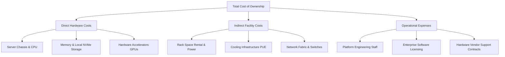
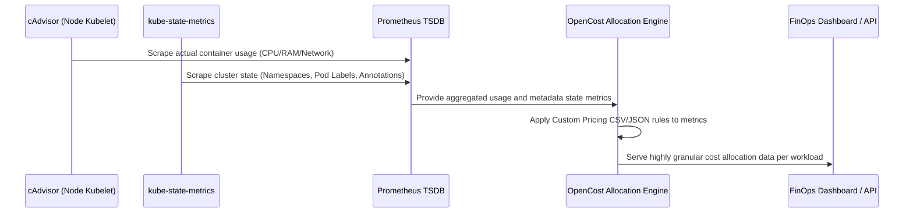
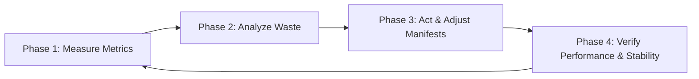

## Learning Outcomes

By the end of this module, you will be able to:
- Design a comprehensive hardware depreciation model to calculate accurate per-node and per-pod costs in an on-premises Kubernetes environment.
- Implement OpenCost and Kubecost on bare metal clusters using custom pricing configurations to reflect true internal infrastructure expenses.
- Evaluate the strategic tradeoffs between showback and chargeback models for internal platform teams, selecting the appropriate approach based on organizational maturity.
- Diagnose resource inefficiencies using capacity rightsizing workflows, identifying underutilized workloads and reclaiming stranded capacity.
- Compare on-premises Total Cost of Ownership (TCO) with cloud FinOps disciplines, leveraging metrics to justify hardware lifecycle decisions.
- Implement advanced PromQL-based alerting mechanisms to enforce financial governance and budget constraints at the namespace level.
- Design and deploy Kyverno admission control policies to mandate financial accountability labels on all deployed workloads.

## Why This Module Matters

In 2018, a major European financial institution decided to repatriate their primary trading workloads from the public cloud to an on-premises Kubernetes platform, aiming to reduce their massive annual public cloud spend. They successfully migrated the workloads, achieving the latency improvements they desired by locating the compute closer to their physical databases. However, within eighteen months, the internal platform team's hardware procurement budget had spiraled completely out of control, exceeding the original public cloud costs by over thirty percent. The root cause was not the initial hardware cost itself, but the complete absence of internal cost visibility, governance, and accountability.

Because the infrastructure was perceived as "free" once it was purchased and installed in the data center, application development teams began requesting massive, unoptimized resource requests and limits. Pods were consistently over-provisioned "just in case" of a traffic spike, development and staging environments were left running indefinitely over weekends and holidays, and the cluster suffered from severe resource stranding. When the platform team attempted to procure additional worker nodes to meet this artificial, inflated demand, the Chief Financial Officer halted all purchases, demanding a strict accounting of how the existing, multi-million dollar capacity was being consumed. The platform engineering team had absolutely no mechanism to attribute the millions of dollars in hardware and operational expenses back to the individual trading desks and cost centers. 

This catastrophic breakdown in financial governance forced the organization to freeze all new software deployments for three months while they scrambled to retrofit a showback model onto their clusters. This module matters because running Kubernetes on-premises fundamentally shifts the financial model from operational expenditure (OpEx) to capital expenditure (CapEx). Without rigorous FinOps practices, custom pricing models, and strict chargeback mechanisms, the perceived cost savings of an on-premises infrastructure migration will quickly evaporate under the weight of unconstrained developer resource consumption. You must treat your on-premises clusters with the exact same financial rigor as a public cloud provider treats their global data centers.

## Section 1: The Economics of On-Premises Kubernetes

Transitioning from the public cloud to an on-premises data center fundamentally alters the financial mechanics of running Kubernetes. In the public cloud, FinOps revolves around optimizing operational expenditure through complex discount instruments like Reserved Instances, Spot Virtual Machines, and Savings Plans. You pay precisely for what you provision, and you can instantly stop paying by de-provisioning the resource. On-premises FinOps requires a fundamentally different mindset focused on capital expenditure amortization, hardware lifecycle management, and maximizing the utilization of sunk costs.

### Total Cost of Ownership Components

To implement accurate chargeback on-premises, you must first calculate the true Total Cost of Ownership of a bare-metal Kubernetes node. This calculation is significantly more complex than reading a cloud provider's pricing page. It must include direct, indirect, and operational costs. 

Direct costs include the physical server chassis, the central processing units, the memory DIMMs, local NVMe storage drives, and any specialized hardware like Network Interface Cards or Graphics Processing Units. However, stopping at direct hardware costs is a critical error that leads to underfunded platform teams. 

Indirect costs involve the physical data center footprint. You must account for rack space rental, raw power consumption, cooling infrastructure (which requires calculating the Power Usage Effectiveness multiplier of your specific facility), and the amortization of top-of-rack network switches and core routers. 

Finally, operational costs must encompass the salaries of the data center technicians who replace failed drives, the platform engineering team managing the Kubernetes control plane, and the licensing costs for enterprise software like storage arrays, hypervisors, and security scanners.



### Amortization, Depreciation, and the "Platform Tax"

Once the true TCO is calculated, it must be amortized over the expected lifecycle of the hardware. In enterprise accounting, server hardware is typically depreciated using a straight-line model over 36 to 60 months. For example, if a fully loaded, high-density worker node costs exactly twelve thousand dollars and is expected to last thirty-six months, the baseline monthly cost is roughly three hundred and thirty-three dollars. However, this figure only covers the raw metal.

To account for the control plane nodes (which run the API server, etcd, and controllers but host no user workloads), the network infrastructure, and the massive human cost of the platform engineering team, organizations must apply a "Platform Tax." This is a percentage markup added directly to the raw compute and memory costs. If the platform tax is determined to be twenty-five percent, the effective monthly cost of that worker node becomes four hundred and sixteen dollars. This fully burdened cost is the critical figure that must be fed into your FinOps tooling to ensure that application teams are bearing the true, comprehensive cost of their workloads.

> **Pause and predict**: If a platform team sets the amortization schedule to 60 months to lower the monthly chargeback rate, but the physical hardware fails or becomes computationally obsolete after only 36 months, how will this discrepancy impact the organization's IT budget and the platform team's ability to procure replacement hardware?

## Section 2: Implementing OpenCost and Kubecost on Bare Metal

To translate the fully burdened, amortized node costs into actionable pod-level or namespace-level financial metrics, platform teams rely on sophisticated cost allocation engines. OpenCost, an open-source Cloud Native Computing Foundation sandbox project, and its commercial enterprise counterpart, Kubecost, are the prevailing industry standards for this complex task. 

In a public cloud environment, these tools integrate seamlessly and directly with the AWS Cost Explorer, GCP Billing, or Azure Rate Card APIs to fetch real-time instance pricing. On-premises, these APIs simply do not exist. You are the cloud provider. Therefore, you must configure OpenCost to use a custom pricing model that meticulously reflects your internal TCO calculations.

### The Metrics Pipeline Architecture

OpenCost does not interact with the Kubernetes API directly to determine usage; it relies on a robust Prometheus metrics pipeline. It requires `kube-state-metrics` to continuously monitor and understand the state of Kubernetes objects (namespaces, deployments, replica sets, pods) and `cAdvisor` (which runs embedded within the kubelet on every node) to measure the actual, real-time CPU and memory consumption of the running containers. 

These high-cardinality metrics are scraped at regular intervals by a central Prometheus instance. OpenCost then queries Prometheus, executing complex PromQL aggregations to correlate raw resource consumption and namespace metadata with your defined custom pricing data.



### Configuring Custom Pricing in OpenCost

To implement custom pricing in OpenCost, you must construct a configuration file, typically mounted as a Kubernetes ConfigMap or defined via Helm values, that explicitly states the granular hourly cost of various resources. You must break down your monthly, fully-burdened node cost into precise hourly rates for CPU cores, RAM gigabytes, and storage terabytes.

Consider the following example of a custom pricing configuration JSON designed for an on-premises, bare-metal deployment. Notice how granular the pricing must be to accurately reflect the infrastructure:

```json
{
  "description": "On-Premises Bare Metal Datacenter Alpha - High Density Pool",
  "CPU": "0.015",
  "spotCPU": "0.000",
  "RAM": "0.005",
  "spotRAM": "0.000",
  "GPU": "0.950",
  "storage": "0.0002",
  "zone": "dc-alpha-rack-12"
}
```

In this specific configuration, an application requesting four CPU cores and sixteen gigabytes of RAM will be billed at six cents per hour for compute capacity, plus eight cents per hour for memory capacity, totaling fourteen cents per hour. Over a standard month, this single, seemingly innocuous pod costs the organization roughly one hundred dollars. When developers can view these concrete financial numbers directly associated with their specific deployments in a dashboard, the abstract and detached concept of "cluster resources" rapidly transforms into concrete financial accountability.

To deploy OpenCost with this custom configuration via Helm, you would utilize a comprehensive values file that explicitly overrides the default cloud provider integrations and points the engine to your internal Prometheus instance:

```yaml
# opencost-bare-metal-values.yaml
opencost:
  exporter:
    defaultClusterId: "on-prem-prod-baremetal-01"
  customPricing:
    enabled: true
    configmapName: "custom-pricing-model-alpha"
    costModel:
      cpuHourlyCost: "0.015"
      ramHourlyCost: "0.005"
      storageHourlyCost: "0.0002"
      gpuHourlyCost: "0.950"
prometheus:
  external:
    # OpenCost must query your existing, highly-available Prometheus setup
    url: "http://prometheus-operated.monitoring.svc.cluster.local:9090"
  internal:
    enabled: false
```

## Section 3: Showback vs. Chargeback in Internal Platforms

Implementing the FinOps tooling and the metrics pipeline is only the first technical step; the true, monumental challenge of on-premises FinOps lies in organizational behavior and cultural transformation. Platform teams must strategically choose how to expose, communicate, and enforce the cost data, carefully navigating the complex spectrum between informational showback and strict, punitive chargeback.

### The Educational Showback Model

Showback involves systematically tracking the financial consumption of different engineering teams, departments, or specific applications and presenting this data back to them, usually via interactive dashboards or automated monthly email reports. Crucially, in a showback model, no actual corporate currency changes hands between internal cost centers. The goal is purely educational and behavioral: to build financial awareness, highlight gross inefficiencies, and encourage voluntary optimization by engineering leads.

Showback is the mandatory, non-negotiable first step for any organization adopting Kubernetes FinOps. It allows teams to understand the financial impact of their architectural decisions and resource requests without the immediate threat of budget depletion or blocked deployments. For example, a monthly showback report might clearly highlight that the data science team's abandoned, idle Jupyter notebook pods cost the company four thousand dollars last month. The exposure and peer visibility alone often drive responsible engineers to clean up their environments voluntarily.

### The Strict Chargeback Model

Chargeback is a significantly more aggressive, mature approach where internal teams are actually financially billed for the Kubernetes resources they consume. In this model, the platform engineering team operates essentially as an internal public cloud provider, and application teams must pay for their namespaces and compute cycles out of their own actual departmental budgets. 

Implementing chargeback requires a high degree of organizational maturity, strong executive sponsorship from the Chief Technology Officer and Chief Financial Officer, and absolute confidence in the technical accuracy of the cost allocation metrics. If the custom pricing model is flawed, or if the Prometheus metrics pipeline drops data during a network partition, internal financial disputes will paralyze the engineering organization and erode all trust in the platform team.

> **Stop and think**: If an organization implements a strict chargeback model based purely on resource *requests* rather than actual *usage*, how might an application team maliciously manipulate their pod specifications to save money, and what systemic availability risk does this introduce to the entire Kubernetes cluster?

### The Four-Phase Transition Strategy

A successful implementation from zero visibility to strict financial governance typically follows a carefully orchestrated phased approach:

1. **Phase One: Silent Auditing.** The platform team deploys OpenCost in the background and validates the custom pricing model against actual hardware procurement invoices and data center power bills for three consecutive months. The data is kept entirely within the platform team to identify systemic errors.
2. **Phase Two: Visibility Showback.** Cost dashboards are exposed to engineering managers and directors. Gamification is often introduced, such as "Top Optimizers of the Month" awards or leaderboards highlighting the most cost-efficient microservices.
3. **Phase Three: Soft Chargeback.** Departments are assigned nominal, virtual FinOps budgets. Automated alerts trigger when these virtual budgets are exceeded, generating tickets in the ticketing system, but active deployments and scaling events are not yet blocked.
4. **Phase Four: Hard Chargeback.** Kubernetes admission controllers and CI/CD pipelines are directly linked to FinOps APIs. If a namespace exhausts its allocated quarterly budget, new pods are strictly denied admission to the cluster until the department formally transfers additional funds to the platform team's ledger.

## Section 4: Capacity Rightsizing Lifecycle and Depreciation Modeling

Visibility and dashboards alone do not save a single dollar; concrete engineering action-does. The capacity rightsizing lifecycle is the operational, continuous process of identifying waste, analyzing risk, and reclaiming stranded resources. On-premises, this lifecycle is particularly critical because unused capacity cannot simply be returned to a vendor via an API call; it sits idle in a rack, consuming massive amounts of power and rapidly depreciating in value every single day.

### The Continuous Rightsizing Lifecycle

The rightsizing lifecycle consists of four continuous, iterative phases that must become part of the standard engineering workflow:

1. **Measure:** Collect deep historical data on CPU and memory utilization versus the requested amounts. This requires at least fourteen to thirty days of metric retention in Prometheus to accurately capture weekly usage patterns, weekend lulls, and end-of-month batch job spikes.
2. **Analyze:** Identify the exact delta between provisioned resources and actual consumption. OpenCost and Kubecost provide built-in, algorithmic rightsizing recommendations based on customizable target utilization percentages (e.g., aiming for seventy percent utilization to leave room for traffic bursts).
3. **Act:** Modify the Kubernetes manifests, Helm charts, or Kustomize overlays to physically reduce the `requests` and `limits`. This can be done manually by engineers during a sprint, or automatically using advanced tooling like the Vertical Pod Autoscaler in recommendation mode.
4. **Verify:** Rigorously monitor the application post-modification to ensure that the reduced resources have not introduced CPU throttling latency or Out Of Memory (OOM) kill events.



### Diagnosing and Reclaiming Stranded Capacity

A major architectural challenge unique to on-premises Kubernetes is the phenomenon of "stranded capacity." This occurs when a physical worker node is fully allocated in terms of CPU requests, but only half-allocated in terms of memory requests. The remaining fifty percent of the memory on that specific node is completely stranded; it cannot be used by any workload because the Kubernetes scheduler will rightfully refuse to place new pods there due to the complete lack of available CPU.

To effectively mitigate stranded capacity, platform teams must continuously analyze the overall resource ratio of their cluster workloads and adjust their future hardware purchasing strategy accordingly. If FinOps data reveals that workloads are consistently and heavily CPU-bound, future worker nodes must be procured with a significantly higher ratio of CPU cores to RAM, perhaps opting for high-frequency processors and fewer DIMMs. Conversely, if memory is the bottleneck, the next procurement cycle should focus on high-density RAM configurations.

### Hardware Depreciation and Cluster Decommissioning Strategies

As physical server hardware ages, its depreciated value steadily approaches zero on the accounting ledger. Savvy organizations choose to actively reduce the custom pricing of older Kubernetes clusters to financially incentivize teams to run lower-priority workloads on older hardware. For example, a five-year-old cluster might charge exactly zero cents for compute capacity, effectively making it "free" for asynchronous batch processing or massive data analytics jobs, while the newest, high-performance NVMe-backed cluster commands a steep premium price.

When hardware finally reaches the absolute end of its physical lifespan and vendor warranty support expires, the platform team must orchestrate a massive workload migration. By deeply analyzing the historical FinOps data, the platform team can accurately forecast exactly how much new hardware is required to support the migrating workloads. This data-driven approach prevents the incredibly common and expensive mistake of blindly over-purchasing replacement hardware based on old, bloated, unoptimized resource requests.

## Section 5: Budget Alerting and On-Prem TCO vs. Cloud FinOps

To prevent surprise budget overruns that infuriate finance departments, proactive alerting is absolutely essential. Instead of waiting for a lagging monthly report to discover that a bug caused massive resource consumption, engineering teams should be notified immediately when their spending trajectory violently exceeds their allocation.

### Advanced PromQL Budget Alerting

Because OpenCost brilliantly exposes its calculated cost data as standard Prometheus metrics, you can write highly sophisticated Alertmanager rules to trigger instant notifications when spending thresholds are breached. The core metric `node_total_hourly_cost` and the derived, aggregated namespace-level metrics allow for complex financial alerting algorithms.

Consider this advanced Prometheus alerting rule. It is designed to trigger a high-priority Slack notification if a specific namespace's projected monthly spend, based on the velocity of the last twenty-four hours, exceeds a strict limit of five hundred dollars:

```yaml
groups:
- name: FinOpsBudgetAlerts
  rules:
  - alert: NamespaceMonthlyBudgetExceededProjection
    expr: |
      sum by (namespace) (
        avg_over_time(kubecost_namespace_cost_rate[24h]) 
      ) * 730 > 500
    for: 12h
    labels:
      severity: warning
      routing_key: finops-alerts
      team: platform-governance
    annotations:
      summary: "CRITICAL: Namespace {{ $labels.namespace }} is exceeding its financial budget."
      description: "The projected monthly cost for the {{ $labels.namespace }} namespace, based on the aggressive usage patterns of the last 24 hours, has exceeded the strict $500 limit. Please immediately review your pod resource requests, scale down idle deployments, or contact the FinOps team for a budget increase."
      dashboard_url: "https://grafana.internal.company.com/d/finops-namespace/cost-breakdown?var-namespace={{ $labels.namespace }}"
```

This complex alert calculates the average hourly cost rate over the past twenty-four hours to smooth out brief spikes, multiplies that rate by the average number of hours in a standard month (seven hundred and thirty), and triggers a warning if the mathematical projection exceeds the established threshold. The inclusion of a direct dashboard link dramatically reduces the Mean Time To Resolution for financial anomalies.

### Comparing On-Premises and Cloud Disciplines

While the ultimate goal of FinOps is identical regardless of the hosting environment—maximizing business value and feature delivery per dollar spent—the operational disciplines and daily activities diverge significantly in execution.

In the public cloud, FinOps practitioners spend immense time and effort managing complex financial instruments. They analyze historical discount coverage, balance massive upfront capital payments for Savings Plans, and re-engineer stateful workloads to tolerate brutal Spot instance interruptions. The focus is highly commercial, heavily involving procurement and vendor negotiation.

On-premises FinOps is inherently architectural, deeply technical, and highly operational. Because the massive capital has already been spent to fill the data center, the primary objective is extreme, uncompromising utilization. The on-premises FinOps practitioner focuses on scheduler bin-packing density, identifying orphaned zombie workloads, tuning the kubelet, and ruthlessly crushing resource requests to delay the next multi-million dollar capital expenditure cycle for as long as humanly possible. A cloud FinOps engineer might save the company money by cleverly negotiating a multi-year Enterprise Discount Program; an on-premises FinOps engineer saves the company money by writing a custom Kubernetes scheduler plugin to pack twenty percent more pods onto the existing, aging hardware.

## Section 6: Advanced Policy Enforcement with Kyverno for FinOps

Visibility and alerting are passive mechanisms. To truly govern an on-premises cluster, you must implement active enforcement. If a pod is deployed without proper ownership labels, the FinOps tooling cannot attribute its cost to a specific department. These unallocated costs accumulate in an "untagged" bucket, destroying the integrity of the chargeback model.

To solve this, modern platform teams deploy policy engines like Kyverno or Open Policy Agent (OPA) Gatekeeper. These tools act as strict, uncompromising bouncers at the door of the Kubernetes API server.

### Mandating Financial Accountability Labels

You must write a Kyverno ClusterPolicy that intercepts every incoming Pod creation request. The policy inspects the metadata labels. If the mandatory FinOps labels—such as `cost-center` and `owner-team`—are missing, Kyverno immediately rejects the deployment, returning an error message directly to the developer's terminal or the CI/CD pipeline.

Consider this robust Kyverno policy designed to enforce financial accountability:

```yaml
apiVersion: kyverno.io/v1
kind: ClusterPolicy
metadata:
  name: require-finops-labels
  annotations:
    policies.kyverno.io/title: Require FinOps Cost Center Labels
    policies.kyverno.io/category: Financial Governance
    policies.kyverno.io/subject: Pod
    policies.kyverno.io/description: >-
      To ensure accurate showback and chargeback, all pods must be explicitly tagged 
      with a valid cost-center and owner-team label. Unlabeled resources will be rejected.
spec:
  validationFailureAction: Enforce
  background: true
  rules:
  - name: check-for-cost-center
    match:
      any:
      - resources:
          kinds:
          - Pod
    validate:
      message: "FinOps Violation: All Pods must contain the 'cost-center' and 'owner-team' labels. Example: 'cost-center: marketing'."
      pattern:
        metadata:
          labels:
            cost-center: "?*"
            owner-team: "?*"
```

When this policy is enforced, the chargeback model is guaranteed to have one hundred percent attribution accuracy. There are no mysterious, untagged workloads draining the platform budget.

## Section 7: Deep Dive: The Vertical Pod Autoscaler in FinOps

While manual rightsizing is effective, it does not scale across an enterprise with thousands of microservices. To automate the "Act" phase of the FinOps lifecycle, platform teams leverage the Kubernetes Vertical Pod Autoscaler (VPA).

Unlike the Horizontal Pod Autoscaler (HPA) which adds more pod replicas, the VPA analyzes historical Prometheus metrics and automatically adjusts the CPU and memory `requests` and `limits` of existing pods. For on-premises FinOps, the VPA is a critical weapon against resource hoarding.

### VPA Recommendation Mode vs. Auto Mode

Deploying the VPA in `Auto` mode can be dangerous for stateful applications, as it forcefully evicts and restarts pods to apply the new resource sizing. Therefore, in a FinOps context, the VPA is most often deployed in `Off` or `Initial` mode.

In `Off` mode, the VPA acts purely as an advisory engine. It continuously calculates the optimal resource requests based on actual historical usage and outputs these recommendations to a custom resource metric. FinOps dashboards can then scrape these VPA recommendations, compare them to the current bloated requests, and calculate the exact dollar amount of waste.

Here is an example of a VPA configuration designed purely for generating FinOps recommendations:

```yaml
apiVersion: autoscaling.k8s.io/v1
kind: VerticalPodAutoscaler
metadata:
  name: finops-recommendation-vpa
  namespace: payment-gateway
spec:
  targetRef:
    apiVersion: "apps/v1"
    kind: Deployment
    name: transaction-processor
  updatePolicy:
    updateMode: "Off" # Do not restart pods, only generate recommendations
  resourcePolicy:
    containerPolicies:
      - containerName: '*'
        minAllowed:
          cpu: 100m
          memory: 256Mi
        maxAllowed:
          cpu: 4000m
          memory: 8Gi
```

By querying the status of this VPA object, the FinOps team can confidently approach the `payment-gateway` engineering team and state: "The VPA algorithm has determined that you can safely reduce your memory requests by four gigabytes per pod without risking an OOM event, saving the company six hundred dollars a month." This data-driven approach removes emotion and guesswork from the rightsizing conversation.

## Did You Know?

- In 2021, the FinOps Foundation reported that over thirty percent of cloud and on-premises Kubernetes spending is entirely wasted due to over-provisioned, idle resources.
- A standard straight-line depreciation model for enterprise server hardware typically spans exactly 36 to 60 months, after which the hardware cost is considered fully amortized on the corporate ledger.
- The Cloud Native Computing Foundation formally accepted OpenCost as a sandbox project in June 2022, standardizing the methodology for allocating complex Kubernetes resource costs.
- Cooling infrastructure and raw electrical power can account for up to forty percent of the total operational cost of a bare-metal server over a standard three-year data center lifecycle.

## Common Mistakes

| Mistake | Why it happens | How to fix it |
| :--- | :--- | :--- |
| **Ignoring facility costs** | Organizations often calculate TCO using only the physical server invoice, completely forgetting the massive data center overhead. | Include Power Usage Effectiveness (PUE) multipliers and rack space rental directly in your custom pricing configuration. |
| **Relying on node-level metrics** | Legacy monitoring tools show node CPU usage, which provides absolutely no visibility into multi-tenant pod costs. | Deploy `cAdvisor` and `kube-state-metrics` to enable OpenCost to map usage to specific namespaces and organizational labels. |
| **Starting with strict chargeback** | Mandating invoices on day one causes massive engineering friction, denial, and total rejection of the FinOps program. | Implement a silent audit phase, followed by at least six months of informational showback before transitioning to strict billing. |
| **Forgetting storage costs** | Compute is highly visible, but enterprise SAN/NAS storage arrays are incredibly expensive and often completely overlooked. | Calculate the per-gigabyte cost of storage and aggressively apply it to PersistentVolume claims in the OpenCost configuration. |
| **Missing network egress costs** | Transit providers bill for bandwidth, but Kubernetes does not natively track external egress traffic per individual pod. | Instrument network traffic costs using eBPF-based networking tools, Cilium, or specialized OpenCost network modules. |
| **Using cloud pricing for on-prem** | Teams sometimes lazily use AWS pricing as a proxy for on-prem costs, leading to wildly inaccurate TCO comparisons. | Build a rigorous, custom hardware depreciation model based exclusively on actual internal corporate procurement data. |
| **Omitting management overhead** | The infrastructure is not self-managing; senior platform engineers and vendor support contracts cost significant money. | Add a substantial "Platform Tax" percentage to the base hardware costs to cover these critical operational and personnel expenses. |

## Hands-On Exercise

In this comprehensive scenario, you are the lead FinOps engineer for an on-premises Kubernetes cluster that is rapidly hemorrhaging money. You have been tasked with establishing a baseline pricing model, identifying a massive source of untagged waste, rightsizing the offending workload, and deploying a strict governance policy to ensure the incident never happens again.

<details>
<summary>Task 1: Establish the Baseline Pricing Model</summary>

**The Challenge:**
The cluster currently has no concept of what hardware costs. The finance department has determined that, after factoring in the Platform Tax and PUE, the amortized hourly rates are `$0.020` for CPU, `$0.008` for RAM, `$1.500` for GPU, and `$0.0005` for storage in the `on-prem-zone-alpha` zone.
You must construct the custom pricing JSON configuration and deploy it as a ConfigMap named `opencost-custom-pricing` in the `opencost` namespace to feed these rates into the FinOps engine.

**Solution:**
Create a file named `custom-pricing.json` reflecting the CFO's rates:
```json
{
  "description": "Simulated On-Prem Datacenter Pricing Model",
  "CPU": "0.020",
  "spotCPU": "0.000",
  "RAM": "0.008",
  "spotRAM": "0.000",
  "GPU": "1.500",
  "storage": "0.0005",
  "zone": "on-prem-zone-alpha"
}
```
Create the required namespace and ConfigMap from this file so OpenCost can mount it:
```bash
kubectl create namespace opencost
kubectl create configmap opencost-custom-pricing --from-file=default.json=custom-pricing.json -n opencost
```
</details>

<details>
<summary>Task 2: Investigate the Budget Drain</summary>

**The Challenge:**
A pod named `legacy-processor` in the `default` namespace is suspected of massive resource hoarding, but no one knows exactly how much it is costing the organization. You need to simulate this wasteful pod by deploying an `nginx:latest` container requesting 4 CPU cores and 16Gi of memory, tagged with the label `cost-center: global-marketing`. Once deployed, you must construct the exact API command to query the local OpenCost service (assuming it is running on port 9003) to aggregate current compute costs by the `cost-center` label.

**Solution:**
First, deploy the wasteful pod to simulate the resource hoarding:
```yaml
# wasteful-pod.yaml
apiVersion: v1
kind: Pod
metadata:
  name: legacy-processor
  namespace: default
  labels:
    cost-center: "global-marketing"
spec:
  containers:
  - name: idle-web-container
    image: nginx:latest
    resources:
      requests:
        cpu: "4"
        memory: "16Gi"
```
```bash
kubectl apply -f wasteful-pod.yaml
```
Next, establish a port-forward and query the OpenCost allocation API to reveal the financial damage:
```bash
kubectl port-forward svc/opencost 9003:9003 -n opencost &
curl -s "http://localhost:9003/allocation/compute?window=1h&aggregate=label:cost-center" | jq '.data[]'
```
</details>

<details>
<summary>Task 3: Execute the Rightsizing Lifecycle</summary>

**The Challenge:**
The OpenCost API reveals that the `legacy-processor` pod is utilizing almost zero CPU despite its massive requests. You must actively rightsize this workload. Modify the deployment so that it requests a far more reasonable `100m` of CPU and `128Mi` of memory, completely replacing the running instance.

**Solution:**
Because you cannot dynamically patch resource requests on an existing, unmanaged Pod, you must delete the original and recreate it with the optimized specs:
```bash
kubectl delete pod legacy-processor
```
Update the `wasteful-pod.yaml` file to drastically reduce the requests:
```yaml
# optimized-pod.yaml
apiVersion: v1
kind: Pod
metadata:
  name: legacy-processor
  namespace: default
  labels:
    cost-center: "global-marketing"
spec:
  containers:
  - name: idle-web-container
    image: nginx:latest
    resources:
      requests:
        cpu: "100m"
        memory: "128Mi"
```
```bash
kubectl apply -f optimized-pod.yaml
```
By performing this action, you have instantly halted the massive budget drain caused by stranded capacity on the node.
</details>

<details>
<summary>Task 4: Enforce Financial Governance</summary>

**The Challenge:**
Rightsizing one pod is merely a tactical fix; you need a strategic solution. To guarantee 100% accurate chargeback attribution moving forward, you must deploy a Kyverno `ClusterPolicy` named `enforce-cost-center`. This policy must strictly reject the creation of any new Pod that lacks the `cost-center` label entirely or has an empty value for it.

**Solution:**
Draft and apply the following Kyverno policy to act as a strict admission controller for financial accountability:
```yaml
# finops-policy.yaml
apiVersion: kyverno.io/v1
kind: ClusterPolicy
metadata:
  name: enforce-cost-center
spec:
  validationFailureAction: Enforce
  rules:
  - name: require-cost-center-label
    match:
      any:
      - resources:
          kinds:
          - Pod
    validate:
      message: "FinOps Violation: All Pods must contain the 'cost-center' label for strict chargeback attribution."
      pattern:
        metadata:
          labels:
            cost-center: "?*"
```
```bash
kubectl apply -f finops-policy.yaml
```
Once applied, the Kubernetes API will categorically deny any untagged deployments, forcing developers to declare their financial ownership before consuming cluster resources.
</details>

### Success Checklist
- [ ] Custom pricing ConfigMap successfully created, formatted properly, and mounted to the deployment.
- [ ] The wasteful `legacy-processor` pod was deployed and successfully aggregated by the OpenCost API.
- [ ] Pod resource requests were successfully reduced via the rightsizing lifecycle.
- [ ] Kyverno policy actively blocks deployments lacking mandatory financial accountability labels.

## Quiz

<details>
<summary>Question 1: You are transitioning an on-premises cluster to a strict chargeback model. An engineering team argues passionately that they should only be billed for the CPU their pods *actually consume*, not the CPU they explicitly *requested* in their manifests. Why is billing based on actual usage a dangerous anti-pattern for internal chargeback?</summary>

Billing strictly on usage rather than requests aggressively encourages teams to specify massive resource requests to guarantee their own application availability, knowing they will only pay for what they actually use. Because the Kubernetes scheduler reserves physical node capacity based purely on requests, this selfish behavior will immediately strand resources across the entire cluster. It forces the platform team to buy new hardware while the existing nodes sit idle but fully allocated. Teams must be billed on requests (or whichever is higher between requests and usage) to enforce accurate capacity signaling and prevent tragedy of the commons.
</details>

<details>
<summary>Question 2: Your FinOps dashboard reveals that a massive data science workload is running on a brand-new NVMe-backed node pool, while a fleet of five-year-old worker nodes sits completely idle. How can you strategically use the custom pricing model to influence the deployment behavior of the data science team without forcefully moving their workloads?</summary>

You can heavily and artificially discount the custom pricing configuration for the five-year-old nodes, perhaps making compute completely free on that specific hardware generation, while setting a steep premium price for the new NVMe node pool. By enforcing a chargeback model based on these prices, the data science team will be financially incentivized by their own budget constraints to use node selectors and tolerations to schedule their lower-priority batch jobs onto the older, cheaper hardware, maximizing the lifecycle of the depreciated assets.
</details>

<details>
<summary>Question 3: Your platform team recently procured a new rack of high-density worker nodes for $100,000 and configured OpenCost to amortize only this exact hardware invoice over 36 months. However, the finance department reports a massive budget shortfall for the data center at the end of the quarter. What specific cost component did your team fail to model in the FinOps pricing configuration?</summary>

The team failed to account for indirect facility costs, specifically the Power Usage Effectiveness (PUE) multiplier, cooling, and rack space rental. While the direct hardware invoice was amortized correctly, operating those nodes consumes significant raw electrical power and cooling infrastructure, which often constitutes a massive portion of the operational budget. By omitting these facility costs from the custom pricing model, the chargeback rates were artificially low, leaving the platform team to absorb the massive utility bills without recovering the funds from the application teams. You must always calculate the fully burdened TCO, including environmental overhead, to prevent these catastrophic shortfalls.
</details>

<details>
<summary>Question 4: An application team aggressively complains that their namespace budget alert triggered, showing a projected monthly spend of two thousand dollars. They point out that their pods only consume two CPU cores. Upon deeper investigation of their manifests, you discover their deployment mounts a three-terabyte PersistentVolume. What OpenCost configuration must be immediately verified?</summary>

You must verify that the custom pricing configuration accurately defines the `storageHourlyCost`. High-performance enterprise storage arrays (SAN/NAS) are extremely expensive to procure and maintain on-premises. The team is likely being correctly charged for the massive block storage reservation, demonstrating exactly why storage must be priced per gigabyte in FinOps calculations, not just compute and memory.
</details>

<details>
<summary>Question 5: An experienced public cloud FinOps engineer joins your on-premises platform team and immediately suggests purchasing "Reserved Instances" and writing scripts to aggressively terminate idle workloads to stop hourly billing. Why will this cloud-native FinOps strategy completely fail in your bare-metal data center?</summary>

This strategy fails because on-premises Kubernetes operates on a Capital Expenditure (CapEx) model rather than an Operational Expenditure (OpEx) model. In the public cloud, terminating an instance immediately stops the hourly billing, but on-premises, the hardware has already been purchased and sits in the rack regardless of whether it is running workloads or sitting idle. Furthermore, discount instruments like Reserved Instances do not exist internally; instead, the engineer must focus entirely on maximizing cluster utilization density to delay the next physical hardware procurement cycle. The goal shifts from reducing the monthly vendor invoice to aggressively squeezing every ounce of compute out of the sunk capital assets.
</details>

<details>
<summary>Question 6: You are defining the OpenCost custom pricing configuration for a new bare-metal cluster. You perfectly divide the cost of the worker node hardware by its 36-month lifespan, yet the Chief Financial Officer rejects your pricing model, stating that the platform engineering department will still operate at a massive net loss for the year. What critical markup must you add to the raw compute costs to satisfy the CFO?</summary>

You must implement a "Platform Tax" to account for the massive indirect and operational overhead of running the Kubernetes environment. While you accurately priced the raw worker node hardware, you failed to distribute the cost of the control plane nodes, the top-of-rack network switches, enterprise software licensing, and the salaries of the platform engineering team managing the cluster. By applying a percentage markup—the Platform Tax—on top of the raw compute and memory costs, you ensure that application teams are bearing the fully burdened cost of the entire platform ecosystem, not just the isolated metal their pods consume.
</details>

<details>
<summary>Question 7: During the "Analyze" phase of the capacity rightsizing lifecycle, you discover a specific node where CPU requests are at ninety-five percent, but memory requests are only at twenty percent. What severe architectural inefficiency does this indicate, and how does it directly impact the FinOps budget?</summary>

This indicates a severe case of stranded capacity caused by an imbalance between the hardware profile and the workload requirements. The remaining eighty percent of the memory on that node is stranded and effectively wasted, as the Kubernetes scheduler cannot place new pods there due to CPU exhaustion. This inefficiency forces premature and unnecessary hardware purchases, severely driving up the total TCO.
</details>

<details>
<summary>Question 8: Your company has just finished migrating to an on-premises cluster. The CTO immediately mandates a strict chargeback model starting on day one, deducting funds directly from departmental budgets based on OpenCost metrics. Within a week, the engineering leads are furious, deployments have halted, and teams are arguing that their bills are wildly inaccurate. What critical transitional phase did the CTO skip, and why is it mandatory?</summary>

The CTO skipped the mandatory "Showback" phase, plunging the organization directly into financial chaos. Showback provides a crucial, low-stakes educational period where cost data is visible but no actual currency changes hands. This phase is absolutely required to validate the technical accuracy of the custom pricing model, allow developers to understand the financial impact of their resource requests, and correct widespread labeling errors without the threat of budget depletion. By bypassing showback, the CTO weaponized an untested metrics pipeline, instantly eroding all trust between the platform team and the application developers while paralyzing the engineering organization with financial disputes.
</details>

## Next Module

Now that you intimately understand how to calculate, allocate, and enforce the financial costs of your on-premises Kubernetes cluster, you must secure the absolute boundary of that infrastructure. In the next module, [Module 1.6: Air-Gapped Image Registries and Security](#), you will learn how to design, deploy, and synchronize secure artifact repositories in environments completely disconnected from the public internet, defending against supply chain attacks at the physical edge.