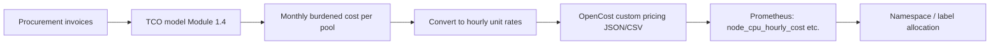
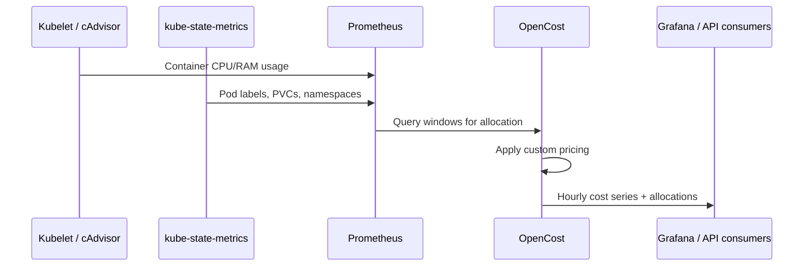
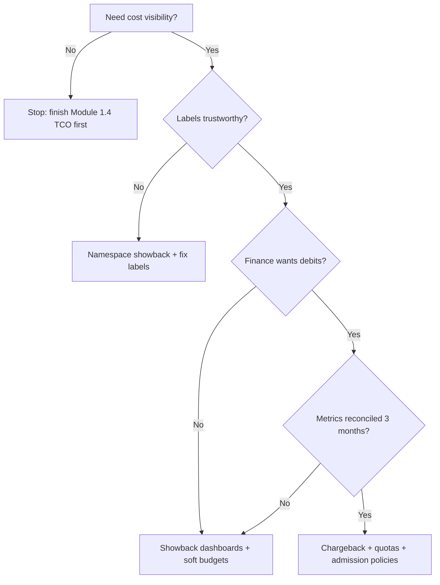

> **Complexity**: `[MEDIUM]` | Time: 60 minutes
>
> **Prerequisites**: [Module 1.4: TCO & Budget Planning](../module-1.4-tco-budget/), [FinOps Fundamentals](/k8s/finops/module-1.1-finops-fundamentals/)
>
> **Track**: On-Premises Planning

---

## What You'll Be Able to Do

After completing this module, you will be able to:

1. **Compare** on-premises FinOps disciplines to public-cloud FinOps and explain why sunk CapEx changes the optimization surface after [Module 1.4](../module-1.4-tco-budget/) establishes your TCO baseline.
2. **Design** a usage-based internal cost model that amortizes hardware, facility overhead, and platform tax into hourly rates suitable for OpenCost custom pricing.
3. **Evaluate** showback versus chargeback programs and select an allocation model (namespace, label, or hierarchy) matched to organizational maturity.
4. **Implement** cost visibility and governance with OpenCost, Prometheus-derived metrics, ResourceQuota, LimitRange, and admission policies for financial labels.
5. **Diagnose** stranded capacity, surge spillover economics, and enterprise-agreement discount pass-through before approving cloud-burst or reserved-capacity purchases.

---

## Why This Module Matters

**Hypothetical scenario:** In 2018, a European financial institution repatriated primary trading workloads from public cloud to on-premises Kubernetes to cut latency and vendor spend. Eighteen months later, the platform hardware budget exceeded the original cloud run rate by more than thirty percent. Application teams treated rack capacity as free after purchase: oversized requests, always-on staging clusters, and no attribution back to trading desks. When the CFO froze new node purchases, the platform team had no showback data, no chargeback policy, and no way to prove who consumed the multi-million-dollar fleet.

That failure is not a Kubernetes installation problem. [Module 1.4](../module-1.4-tco-budget/) teaches you how to **model** total cost of ownership: CapEx, OpEx, power, cooling, staffing, and cloud breakeven. This module teaches the **operating discipline** on top of that model: how to turn TCO into hourly internal prices, expose them to engineering teams, and change behavior without repeating the "free metal" trap. Cloud FinOps optimizes variable OpEx (rightsizing instances, commitments, spot). On-prem FinOps optimizes **utilization of sunk capital**—bin-packing density, idle reclamation, label-based accountability, and honest surge economics when you temporarily burst into cloud.

The repatriation story repeats because teams confuse **migration success** with **financial governance**. Moving etcd and the API server on-prem is a project; making every Deployment carry a cost-center label is a culture shift backed by tooling. Platform leaders who skip showback often discover, at the next budget cycle, that developers learned all the wrong lessons: request more headroom because nobody measures waste, leave staging up because nobody owns the bill, and treat GPUs as unlimited because finance only sees a single infrastructure GL code. FinOps is how you close that feedback loop without waiting for a CFO freeze on node purchases.

Your stakeholders already speak different languages. Finance thinks in GL codes, depreciation schedules, and variance explanations. Engineering thinks in millicores, PVC sizes, and p99 latency. Product thinks in features shipped per sprint. A working on-prem FinOps practice translates the same underlying utilization into all three dialects: hourly rates for engineers, monthly allocated totals for product owners, and quarterly reconciliation slides for finance. When those three views disagree, the bug is in the metric pipeline—not in the people reading the dashboard.

Executive sponsors often ask for a single FinOps KPI. Resist collapsing the program to one number; pair **allocated cost per core** with **utilization of requested cores** and **untagged spend percentage** so leaders see efficiency and discipline together. A falling cost-per-core with rising untagged spend is a warning sign that chargeback will fail the moment finance debits departments. Review all three metrics in the same staff meeting so tradeoffs stay visible instead of hiding behind a vanity downward trend, and archive the charts with the monthly bridge finance signs. That discipline keeps FinOps credible when someone asks why allocated dollars rose while node count stayed flat—usually because requests grew, storage expanded, GPU jobs landed, or idle share dropped while unit rates increased after a rate-card refresh. Track those four drivers explicitly in the monthly narrative finance receives each month going forward.

> **The Utility Bill Analogy**
>
> Public-cloud FinOps is like optimizing a monthly electric bill where every kilowatt-hour is metered and you can unplug appliances to stop charges immediately. On-prem FinOps is like owning the power plant: the turbines are already paid for, but you still pay fuel, maintenance, and operators every month whether anyone flips a switch. Your job is to run the plant near capacity without brownouts, attribute usage to departments, and decide when buying overflow power from a neighbor (cloud burst) is cheaper than building another turbine (another rack).

---

## On-Prem FinOps vs Cloud FinOps

FinOps is the practice of bringing financial accountability to variable technology spend so engineering, finance, and leadership share the same facts ([FinOps Foundation](https://www.finops.org/introduction/what-is-finops/)). In public cloud, the dominant levers are commitment discounts, instance family selection, storage tiering, egress control, and turning off resources that stop billing. Kubernetes on cloud still inherits those properties because underlying VMs and disks bill per hour.

On-premises Kubernetes inverts the incentive. Hardware is purchased up front; power and cooling recur; depreciation spreads CapEx across months on the ledger. You cannot "stop paying" for an idle worker node by deleting a Deployment—you only free **scheduler capacity** that might delay the next rack purchase. The optimization surface therefore emphasizes:

| Dimension | Public-cloud FinOps focus | On-prem FinOps focus |
|-----------|---------------------------|----------------------|
| Spend shape | Variable OpEx, invoice per hour | Sunk CapEx + recurring facility OpEx |
| Primary lever | Turn off, resize instance, buy RIs/CUDs | Increase utilization, delay procurement |
| Waste signal | Unattached volumes, idle VMs | Stranded CPU/RAM, orphaned namespaces |
| Accountability | Billing exports, CUR files | Custom pricing + labels + showback |
| Risk of wrong metric | Ignoring egress or support tax | Ignoring PUE, platform tax, or storage $/GB |

```text
┌─────────────────────────────────────────────────────────────────────┐
│           ON-PREM FINOPS CONTROL LOOP (after TCO is modeled)         │
├─────────────────────────────────────────────────────────────────────┤
│  1. Translate TCO → hourly unit rates (CPU/RAM/GPU/GB/storage)      │
│  2. Export rates via OpenCost → Prometheus cost metrics             │
│  3. Allocate by namespace / labels / hierarchy                      │
│  4. Showback → soft budgets → chargeback (maturity-gated)            │
│  5. Rightsize requests + reclaim idle + tune idle-cost policy       │
│  6. Reconcile monthly: invoices vs metrics vs departmental ledger   │
└─────────────────────────────────────────────────────────────────────┘
```

> **Pause and predict:** Your CFO already approved the five-year TCO from Module 1.4. A developer asks why FinOps still matters if the hardware is "already paid for." Write two sentences explaining sunk cost versus cash timing, then read the next paragraph and check whether you mentioned utilization and the next procurement gate.

The honest answer ties accounting to operations. Depreciation spreads past cash outflows across future months, but **the next rack** is still a capital approval event. FinOps metrics prove whether you can defer that purchase by six months through rightsizing or whether you must burst into cloud while building internal capacity. Without hourly attribution, every team argues they need more nodes and finance sees only a single platform budget line.

Rightsizing on-prem is not the same as stopping an instance. The continuous lifecycle still applies—measure utilization in Prometheus across at least fourteen to thirty days so weekend lulls and month-end batch spikes appear, analyze the delta between requests and actual usage, act on manifests or Vertical Pod Autoscaler recommendations, then verify that latency and OOM rates remain within SLO after changes. Stranded capacity deserves its own FinOps line item: when CPU requests saturate a node but half the RAM remains unschedulable, you are paying for DIMMs that no Pod can claim until procurement buys a CPU-skewed generation or teams rebalance workloads. FinOps dashboards that only chart node averages hide that pathology; allocation-aware metrics expose it per pool.

Cloud FinOps engineers negotiate Enterprise Discount Programs and Reserved Instances; on-prem FinOps engineers negotiate bin-packing and procurement timing. Both roles report to the same CFO question—how much business value each dollar bought—but the daily work looks different enough that hiring playbooks should not copy cloud job descriptions verbatim. When a former cloud FinOps lead joins your bare-metal program, onboard them with the responsibility-shift table above and pair them with a platform engineer who owns rack power limits so abstract rates connect to physical constraints.

---

## Building a Usage-Based Internal Cost Model

Module 1.4 gives you category-level dollars. Chargeback requires **unit economics**: dollars per CPU-core-hour, per gibibyte-hour of RAM, per GPU-hour, and per gibibyte-month of persistent storage, plus optional network or object-storage surcharges where you meter them.

### From invoice lines to hourly rates

Module 1.4 ends with a defensible TCO workbook; this section converts those totals into **prices** Kubernetes tooling can consume. Finance rarely approves chargeback until the rate card traces to signed invoices, so keep a workbook tab that links each OpenCost field (`CPU`, `RAM`, `GPU`, `storage`) to a TCO row. When auditors ask why RAM costs more than CPU, you answer with DIMM pricing and power draw, not with "the tool defaulted that way."

Start from fully burdened monthly cost per worker class, then divide by hours in month (730 is standard for FinOps tooling):

```
monthly_node_cost = (hardware_depreciation + maintenance + allocated_power + allocated_rack + platform_tax_share)
hourly_node_cost  = monthly_node_cost / 730
per_core_hour     = hourly_node_cost * (cpu_cores / total_cores_on_node) * allocation_weight
per_gb_ram_hour   = hourly_node_cost * (ram_gib / total_ram_gib) * allocation_weight
```

**Hardware depreciation** uses the same straight-line schedule finance approved (often 36–60 months for servers). **Facility allocation** applies measured PUE from your colocation contract to IT draw, not design PUE ([ISO/IEC 30134-2 PUE](https://www.iso.org/standard/30134-2)). **Platform tax** distributes control-plane nodes, spine switches, observability stack, backup infrastructure, and platform engineering FTE across all tenant-facing cores. A tax omitted here guarantees the platform team subsidizes every application forever.


```mermaid
graph LR
    A[Procurement invoices] --> B[TCO model Module 1.4]
    B --> C[Monthly burdened cost per pool]
    C --> D[Convert to hourly unit rates]
    D --> E[OpenCost custom pricing JSON/CSV]
    E --> F[Prometheus: node_cpu_hourly_cost etc.]
    F --> G[Namespace / label allocation]
```

### Enterprise agreements and reserved capacity pass-through

When you buy servers under an enterprise agreement (EA) or reserved capacity from a vendor, the **discount belongs in the rate card**, not in a one-time spreadsheet celebration. Document the EA unit price, term, and which hardware pools it covers. Pass through to internal customers as a lower `CPU`/`RAM` rate on tagged node pools (`hardware-generation=2026-ea`) so teams scheduling onto EA nodes see the benefit. For burst cloud capacity purchased with committed use discounts, mirror the same pattern: a separate pricing zone `cloud-burst-west` with hourly rates derived from amortized commitment plus expected spot overflow.

> **Stop and think:** A platform engineer amortizes only the server invoice over 60 months to minimize chargeback rates, but operations replaces that generation at 36 months. Who absorbs the early refresh cost, and how should the pricing model signal "expensive new pool" versus "discounted legacy pool"?

Storage and GPU pools need the same rigor as CPU/RAM. Enterprise SAN capacity often costs more per gibibyte over three years than the server hosting the Pod, yet chargeback programs launch with CPU-only rate cards because kube-state-metrics makes CPU visible first. Pull LUN or array quotes into a per-gibibyte-hour storage line, map StorageClasses to price tiers, and reconcile PVC growth monthly so stateful teams see the same behavioral nudge stateless teams get from CPU showback. GPU pools amortize accelerator hardware plus power-heavy cooling surcharges; a single mislabeled training job scheduled onto H100 nodes can dwarf a microservice namespace unless GPU hourly rates reflect EA or lease terms.

Finance will ask for a bridge schedule each quarter: sum of allocated dollars versus actual utility plus maintenance plus payroll. Treat discrepancies over five percent as metric bugs until proven otherwise—dropped Prometheus scrape intervals, nodes missing `node_exporter`, or namespaces without labels all deflate allocated totals while invoices stay real. Document the bridge in the same Confluence space as the Module 1.4 TCO workbook so approvers see one narrative from capital request through operating accountability.

**Worked example (hypothetical numbers):** Suppose finance signs a thirty-six month depreciation on a twelve-thousand-dollar worker with two hundred dollars monthly maintenance, three hundred dollars monthly allocated power after PUE, and a twenty-five percent platform tax on the subtotal. Monthly burdened cost is roughly `(12000/36) + 200 + 300 = 833`, plus tax `208`, totaling about `1041` per month or `1.43` dollars per hour for the whole node. A sixty-four-core, five-hundred-twelve-gibibyte machine might price CPU near `0.022` dollars per core-hour and RAM near `0.003` dollars per gibibyte-hour after splitting the hourly total—those become your OpenCost inputs. When a Pod requests four cores and sixteen gibibytes, allocated cost is roughly `0.09 + 0.05 = 0.14` dollars per hour, which finance can multiply by seven hundred thirty for a monthly run-rate near one hundred dollars. Teams react when they see that math beside their Deployment, not when they hear "please be frugal."

---

## Allocation Models: Namespace, Label, and Hierarchy

OpenCost and compatible tools allocate costs using Kubernetes metadata ([OpenCost specification](https://opencost.io/docs/)). Namespace-only allocation works for small clusters with strict namespace-per-team rules. Most enterprises require **labels** such as `cost-center`, `owner-team`, `product-line`, or `environment` because namespaces multiply faster than finance codes.

| Model | When it fits | Failure mode |
|-------|--------------|--------------|
| Namespace | One namespace per cost center, stable mapping | Shared namespaces, CI noise in `default` |
| Label | Many apps per team, shared platform namespaces | Missing labels → untagged cost bucket |
| Hierarchy | Business unit → product → service | Requires governance + automated label injection |
| Annotation | Chargeback to ephemeral experiments | Easy to typo; harder to enforce |

**Idle cost policy** is non-optional. Clusters always have unschedulable slack: cordoned nodes, DaemonSet overhead, system namespaces. OpenCost exposes `includeIdle` and `shareIdle` choices—if you hide idle cost, platform engineering silently subsidizes everyone. Mature programs either allocate idle to a `platform-overhead` cost center or distribute it proportionally to active tenants so utilization incentives stay honest.

### Chargeback vs showback (organizational layer)

**Showback** publishes consumption without moving internal money. It builds literacy: teams see that an idle Jupyter fleet cost four thousand dollars last month and clean up voluntarily. **Chargeback** debits departmental budgets. It requires CFO sponsorship, contractual clarity, and metric accuracy within a few percent—otherwise disputes halt releases.

Educational showback works best when leaders repeat the same three metrics every month: total allocated cost, cost per productive environment, and idle or untagged percentage. Changing the chart design weekly confuses audiences and lets teams dismiss spikes as dashboard churn. Chargeback works best when the GL mapping is boring—cost-center `4812` always maps to label `cost-center=4812`—so disputes focus on usage facts, not on whether finance and engineering share a vocabulary.

Typical maturity path:

1. **Silent audit** — platform validates rates against invoices for three months.
2. **Showback dashboards** — engineering managers see weekly trends; gamify top optimizers.
3. **Soft chargeback** — virtual budgets trigger tickets, not admission denial.
4. **Hard chargeback** — quotas, admission policies, or CI gates block spend over budget.

During silent audit, keep dashboards inside the platform team and compare OpenCost totals to Module 1.4 TCO line items. Discrepancies often trace to missing GPU rates, storage not priced, or nodes without `node_exporter`. Fix the pipeline before any executive sees a number. During showback, coach engineering managers on reading allocation tables: requested versus idle versus efficiency, not just the headline dollar. During soft chargeback, pair Alertmanager warnings with office hours so teams learn to fix labels and requests before hard blocks arrive. Hard chargeback should include an appeals process with a two-business-day SLA; otherwise every incident becomes political and teams route around the platform with shadow clusters.

> **Pause and predict:** If chargeback bills on **usage** but the scheduler reserves on **requests**, how might a team game manifests to lower bills while increasing outage risk? Write your prediction before reading the Patterns section.

Hierarchy allocation mirrors how enterprises already structure budgets: business unit owns a cost center, products map to GL codes, services map to namespaces or label selectors. Implement hierarchy in OpenCost by aggregating `label:cost-center` first, then drilling into `label:product` and `namespace` in Grafana dashboards. Finance exports CSV from the same API finance uses for cloud CUR ingestion so hybrid environments present one consolidated showback deck to the CFO. When a product line spans three clusters, federation or multi-cluster OpenCost installs must share a consistent rate card version; otherwise teams compare incompatible dollars.

Chargeback disputes destroy trust faster than outage postmortems. Publish the rate card methodology—formula links to Module 1.4 line items, PUE source, platform tax percentage, idle policy—in the same document controllers sign. When an application lead challenges a bill, your first artifact is the PromQL query reproducing the allocation, not a screenshot of a pie chart. Mature programs record dispute outcomes and feed them into rate card revisions quarterly rather than arguing ad hoc in Slack.

Multi-cluster estates should share one rate-card repository with environment-specific overlays (`zone=prod-dc-a`, `zone=dr-dc-b`) so finance compares dollars consistently. Dr clusters often run underutilized; showback should make DR overhead visible instead of hiding it in a blended average that discourages teams from testing failover. When DR is truly shared insurance, allocate a fixed percentage to every cost-center rather than pretending DR has no cost.

---

## Tooling: OpenCost, Prometheus, Quotas, and Governance

### OpenCost on bare metal

OpenCost is the vendor-neutral CNCF incubating project for Kubernetes cost allocation. On-premises, you configure **custom pricing** because there is no AWS CUR to ingest ([OpenCost on-prem configuration](https://opencost.io/docs/configuration/on-prem)). Prometheus must scrape `node-exporter` and `kube-state-metrics`; OpenCost queries usage and emits hourly metrics such as `node_cpu_hourly_cost`, `node_ram_hourly_cost`, and `pv_hourly_cost`.

Treat OpenCost as the allocation **engine**, not the entire **program**. Finance still owns GL codes; platform still owns cluster health; product still owns feature tradeoffs. OpenCost supplies the time series that make conversations specific: which label grew, which PVC appeared, which GPU namespace appeared after the ML launch. Without that engine, debates revert to anecdotes about who is "noisy" on the cluster—an argument no one wins and finance ignores.

Example custom pricing (hourly units—verify against your chart version):

```json
{
  "description": "On-Prem Bare Metal Pool Alpha — FY2026 rates",
  "CPU": "0.015",
  "spotCPU": "0.000",
  "RAM": "0.005",
  "spotRAM": "0.000",
  "GPU": "0.950",
  "storage": "0.0002",
  "zone": "dc-alpha-rack-12"
}
```

A Deployment requesting four cores and sixteen gibibytes at those rates might allocate on the order of fourteen cents per hour—small until multiplied by hundreds of always-on services and staging namespaces. Publishing that math beside the workload is what converts FinOps from finance jargon into engineering feedback. Version the JSON in git with an effective date whenever Module 1.4 inputs change, and run one reconciliation month where old and new rates both export to a spreadsheet so controllers can sign off before chargeback switches.

Helm remains the preferred install path for production ([OpenCost Helm chart](https://opencost.github.io/opencost-helm-chart/)):

```yaml
# opencost-bare-metal-values.yaml
opencost:
  prometheus:
    internal:
      namespaceName: monitoring
      serviceName: prometheus-operated
      port: 9090
  exporter:
    defaultClusterId: "on-prem-prod-baremetal-01"
  customPricing:
    enabled: true
    provider: default
    costModel:
      description: "On-Prem Bare Metal Pool Alpha — FY2026 rates"
      CPU: "0.015"
      RAM: "0.005"
      GPU: "0.950"
      storage: "0.0002"
```

IBM Kubecost 3.x is a separate product with enterprise CSV pricing and version-specific architecture; treat Prometheus requirements as **version-dependent** and read the deployment guide for your release before teaching a single pipeline diagram.


```mermaid
sequenceDiagram
    participant Kubelet as Kubelet / cAdvisor
    participant KSM as kube-state-metrics
    participant Prom as Prometheus
    participant OC as OpenCost
    participant Dash as Grafana / API consumers
    Kubelet->>Prom: Container CPU/RAM usage
    KSM->>Prom: Pod labels, PVCs, namespaces
    Prom->>OC: Query windows for allocation
    OC->>OC: Apply custom pricing
    OC->>Dash: Hourly cost series + allocations
```

Before installing OpenCost, validate Prometheus retention covers your showback window. If metrics roll off after fifteen days, monthly chargeback cannot reconstruct spike weeks. Many teams run thirty-day retention minimum for FinOps, with optional remote write to long-term storage for annual trending. The OpenCost allocation API (`/allocation`) aggregates by window and label; automate weekly curls into a data warehouse if finance forbids manual dashboard exports.

### Prometheus dashboards and PromQL budget alerts

Because OpenCost exports cost series into Prometheus, you can alert on **projected monthly spend** before finance closes the books ([PromQL basics](https://prometheus.io/docs/prometheus/latest/querying/basics/)):

```yaml
groups:
- name: FinOpsBudgetAlerts
  rules:
  - alert: NamespaceMonthlyBudgetExceededProjection
    expr: |
      (
        sum by (namespace) (
          avg by (namespace, node) (container_cpu_allocation)
            * on (node) group_left () avg by (node) (node_cpu_hourly_cost)
          +
          avg by (namespace, node) (container_memory_allocation_bytes)
            * on (node) group_left () avg by (node) (node_ram_hourly_cost) / (1024 * 1024 * 1024)
        )
      ) * 730 > 500
    for: 12h
    labels:
      severity: warning
    annotations:
      summary: "Namespace {{ $labels.namespace }} projected over $500/month"
      description: "Review requests, PVCs, and idle workloads. Dashboard: https://grafana.example.internal/d/finops?var-namespace={{ $labels.namespace }}"
```

Pair cost alerts with utilization alerts. High cost with low CPU usage signals rightsizing candidates; high cost with sustained saturation signals a real capacity purchase requirement.

Grafana dashboards should show allocation by `cost-center`, top namespaces by growth rate, PVC cost as its own series, and idle share of the cluster. Executives need a one-page monthly PDF; engineers need drill-downs to Pod labels. Avoid duplicating finance's GL spreadsheet inside Grafana—export CSV from OpenCost or Prometheus recording rules and let finance pivot in their tools of choice. The goal is a single source of metric truth with multiple views, not two diverging religions of "what we spent."

### ResourceQuota, LimitRange, and financial guardrails

Kubernetes native quotas translate FinOps policy into admission limits ([ResourceQuotas](https://kubernetes.io/docs/concepts/policy/resource-quotas/), [LimitRanges](https://kubernetes.io/docs/concepts/policy/limit-range/)). A `ResourceQuota` caps aggregate requests per namespace; a `LimitRange` defaults and bounds per-container requests so empty manifests cannot claim a whole node.

```yaml
apiVersion: v1
kind: ResourceQuota
metadata:
  name: finops-compute-quota
  namespace: payments-prod
spec:
  hard:
    requests.cpu: "200"
    requests.memory: 400Gi
    persistentvolumeclaims: "20"
---
apiVersion: v1
kind: LimitRange
metadata:
  name: finops-defaults
  namespace: payments-prod
spec:
  limits:
  - defaultRequest:
      cpu: 100m
      memory: 256Mi
    max:
      cpu: "8"
      memory: 32Gi
    type: Container
```

Quotas enforce **capacity**; they do not replace dollar showback unless you calibrate quota sizes to budget tiers. Platform teams often map "Bronze/Silver/Gold" namespace classes to quota templates tied to approved annual dollars.

LimitRanges deserve the same finance pairing. A namespace might have a generous quota but a LimitRange that prevents any single Deployment from requesting more than eight cores without a platform exception ticket. That pattern stops one rogue Helm chart from consuming an entire cost-center budget while still letting many small services share the namespace. Document exception workflows with SLA and postmortem requirements so FinOps governance does not become ad hoc favors.

### Admission policies for cost labels

Kyverno `ValidatingPolicy` objects deny Pods missing financial metadata, preserving chargeback integrity ([Kyverno validating policies](https://kyverno.io/docs/policy-types/validating-policy/)):

```yaml
apiVersion: policies.kyverno.io/v1
kind: ValidatingPolicy
metadata:
  name: require-finops-labels
spec:
  validationActions:
    - Deny
  evaluation:
    mode: Kubernetes
  matchConstraints:
    resourceRules:
      - apiGroups: [""]
        apiVersions: ["v1"]
        operations: ["CREATE", "UPDATE"]
        resources: ["pods"]
  validations:
    - message: "Pods require non-empty cost-center and owner-team labels."
      expression: >-
        has(object.metadata.labels) &&
        'cost-center' in object.metadata.labels &&
        string(object.metadata.labels['cost-center']) != '' &&
        'owner-team' in object.metadata.labels &&
        string(object.metadata.labels['owner-team']) != ''
```

### Vertical Pod Autoscaler in recommendation mode

For rightsizing at scale, deploy VPA with `updateMode: "Off"` so recommendations land in `.status.recommendation` without forced restarts ([Kubernetes VPA](https://github.com/kubernetes/autoscaler/tree/master/vertical-pod-autoscaler)). FinOps dashboards compare recommendation to requests and compute monthly savings. Never pair VPA auto-update with HPA on the same resource metric—the autoscaler project documents that conflict.

As hardware ages, lower custom pricing on depreciated node pools to steer batch and CI workloads away from premium silicon. A five-year-old pool might price CPU at zero for asynchronous jobs while the NVMe-backed pool stays expensive—economic steering without forced migrations if teams respond to showback. When warranties expire, FinOps data informs whether to extend support, refresh hardware, or retire the pool; each choice changes Module 1.4 CapEx and should trigger a rate card version bump.

Network egress on-prem is easy to forget because Kubernetes does not invoice pods for east-west traffic the way cloud bills cross-AZ bytes. If you pay transit providers or charge tenants for north-south bandwidth, instrument Cilium Hubble, service mesh metrics, or router flow logs and add a surcharge line to the rate card. Until instrumentation exists, document network as platform overhead rather than pretending it is zero. Controllers created by Operators often omit labels on spawned Pods; extend Kyverno policies to cover `ReplicaSet`-owned Pods or mutate labels at the Deployment template so chargeback does not stop at the first object in the chain.

---

## Showback Reporting and Engineering Behavior

Showback reports should answer three questions every engineering manager can act on: **who used what**, **who would pay what at current rates**, and **what changed since last month**. Publish:

- Top ten namespaces by allocated cost (not just node count)
- Week-over-week delta drivers (new PVCs, replica increases, GPU jobs)
- Untagged or `platform-overhead` spend called out explicitly
- Rightsizing candidates with estimated savings

Reports work best on a cadence: weekly Slack or email for managers, monthly CFO-ready roll-up with reconciliation to actual utility and maintenance invoices. When moving to chargeback, attach the same report format so teams recognize the numbers before money moves.

Design reports to separate **who used what** from **who pays what**. Usage sections list top consumers by CPU-hours, RAM-hours, GPU-hours, and storage-hours with links to namespaces and labels. Payment sections apply the rate card, show platform tax and idle share explicitly, and subtotal by cost-center. Engineers improve usage; finance validates payment math. Collapsing those sections causes engineers to argue about tax lines they cannot change, while finance never sees the oversized Deployment that drove the spike.

Behavioral design matters as much as tooling. Peer-visible leaderboards, executive praise for teams that cut waste without SLA regressions, and pairing FinOps office hours with cluster office hours reduce the shame reflex that strict chargeback triggers. The [CNCF FinOps for Kubernetes survey](https://www.cncf.io/wp-content/uploads/2021/06/FINOPS_Kubernetes_Report.pdf) found many organizations still estimate Kubernetes spend monthly—showback is the bridge from estimation to evidence.

Translate showback into engineering rituals: pull top-cost namespaces into sprint planning, require FinOps sign-off for GPU quota increases, and add a "cost delta" line to change requests the same way you document blast radius. When a team reduces allocated spend by twenty percent without error-rate regression, broadcast the win in the platform newsletter so optimization is career-positive rather than punitive. Executives care about unit economics—cost per customer, per transaction, per inference—so divide namespace totals by business metrics supplied by product owners; raw cluster dollars rarely persuade VPs the way unit metrics do.

Soft chargeback pairs virtual budgets with Alertmanager routes to team channels before hard blocks. Give each namespace a quarterly envelope derived from Module 1.4 headcount plans divided by expected tenant count, then escalate from warning at eighty percent consumed to ticket at one hundred percent to admission denial only after two consecutive overruns. That pacing teaches teams to treat budgets like SLOs: temporary spikes get waivers with postmortems; chronic overruns trigger architectural review.

---

## Surge Capacity, Cloud Burst, and Cost Recovery

Even disciplined on-prem fleets hit seasonal peaks: retail holidays, regulatory reporting windows, ML training bursts. **Cloud spillover** rents capacity instead of buying a rack used six weeks per year. The FinOps question is whether burst is cheaper than idle metal plus the operational cost of hybrid networking.

```
burst_monthly_cost = (burst_vcpu_hours * cloud_vcpu_rate)
                   + (burst_gb_hours * cloud_ram_rate)
                   + (egress_gb * egress_rate)
                   + (integration_fte_fraction)

on_prem_alternative = (new_nodes_capex / depreciation_months)
                    + (colo_kw * PUE * hours * $/kWh)
                    + (procurement_delay_risk_factor)
```

Run the inequality with **measured** burst duration distributions, not peak-day anecdotes. If burst happens twelve weeks per year at predictable scale, reserved cloud commitments ([AWS reserved instance amortization](https://docs.aws.amazon.com/AWSEC2/latest/UserGuide/ec2-reserved-instances.html)) may beat on-demand overflow. Internally, charge burst to the tenant that triggered it via a separate pricing zone so on-prem baseline rates stay honest.

Document assumptions in the burst business case: egress gigabytes per week, persistent data sync costs, dual observability stacks, and engineer hours operating two control planes. Platform teams often win the CapEx argument on hardware alone while losing the total cost when integration tax is omitted. FinOps supplies the missing OpEx lines so executives compare fully loaded burst versus fully loaded rack expansion, not cherry-picked capital quotes.

**Cost recovery** means finance sees the burst invoice reconciled to departmental codes the same month. Without that pass-through, platform teams eat overflow and on-prem chargeback rates look artificially low—repeating the Module 1.4 mistake of hiding OpEx categories.

Hybrid networking costs belong in the burst model: extra cross-connects, VPN appliances, egress from cloud back to on-prem databases, and duplicated observability stacks. Platform teams sometimes forget that burst saves CapEx while increasing integration labor; Module 1.4 already budgets engineers—allocate a recurring fraction of platform FTE to hybrid automation or the burst TCO lies. When burst ends, run a retrospective comparing projected versus actual burst spend; feed variances into next year's Module 1.4 refresh cycle so FinOps and TCO stay linked.

Depreciated on-prem nodes can still host overflow orchestration controllers while compute bursts outward, but watch data gravity: if burst workers need local SAN latency, cloud burst may be technically infeasible regardless of spreadsheet savings. FinOps here informs architecture decisions, not just invoices—your showback deck should flag workloads whose egress or data-residency constraints make burst a paper exercise.

---

## Operating Cadence and Finance Reconciliation

FinOps dies when it is a one-off dashboard project. Treat it like reliability engineering: defined rituals, owners, and artifacts finance can audit. A workable monthly cadence starts on the first business day with a metrics health check—Prometheus scrape success for `node_exporter`, OpenCost allocation jobs complete, no unexplained gaps in `node_cpu_hourly_cost` series. Mid-month, platform engineering publishes a draft showback ranked by cost-center with commentary on spikes. Before month close, finance receives a bridge file: sum of allocated dollars, actual utility and maintenance invoices, payroll allocation for platform FTE, and a written explanation for variance over five percent.

Quarterly rituals align with Module 1.4 refresh cycles. Revisit PUE assumptions when colocation contracts renew, rerun depreciation when new EA tranches arrive, and bump platform tax if you hired two more SREs or deployed a second observability cluster. Annual rituals include hardware generation sunset pricing—lower rates on five-year-old pools so batch teams voluntarily drain expensive silicon—and an executive readout tying deferred CapEx to FinOps initiatives. Without cadence, chargeback becomes a surprise invoice; with cadence, it becomes a forecastable operating expense line each product owner plans for.

Ownership must be named in writing. A FinOps product owner (often a staff platform engineer) maintains the rate card; finance owns GL mapping; cluster admins own metric pipelines. RACI confusion shows up quickly as duplicated spreadsheets and diverging CPU prices. Document escalation: metric pipeline down → freeze hard chargeback but continue showback estimates; rate card dispute → controller adjudicates using Module 1.4 source tabs; label noncompliance → security and platform joint ticket, not silent denial without explanation.

Finally, tie FinOps outcomes to procurement gates. When showback proves thirty percent idle CPU for two consecutive months, the next rack purchase requires a waiver signed by finance and platform leadership explaining why utilization work was exhausted. That single gate prevents the organization from buying its way out of a discipline problem—a pattern that destroyed trust in the hypothetical repatriation scenario at the top of this module.

Cross-functional office hours accelerate adoption. Platform brings live PromQL queries; finance brings the latest utility PDF; product owners bring customer-per-dollar denominators. Repeat the same agenda monthly so questions compound instead of restarting. Record decisions—rate card bumps, idle policy changes, burst approvals—in the same log as cluster upgrades so auditors see FinOps as operational infrastructure, not a one-time spreadsheet project.

---

## Patterns & Anti-Patterns

| Pattern | When to use | Why it works |
|---------|-------------|--------------|
| Fully burdened hourly rate card | Any showback/chargeback program | Aligns metrics with invoices finance recognizes |
| Phased showback before chargeback | First 6–12 months of FinOps | Builds trust; surfaces label gaps without budget warfare |
| Label-enforced attribution | >3 teams on shared clusters | Prevents mystery spend in `default` |
| VPA Off + FinOps review queue | >50 deployments | Surfaces savings without forced restarts |
| Separate pricing zones per hardware generation | Mixed-age fleets | Steers batch jobs to depreciated nodes |
| Monthly metric-to-invoice reconciliation | CFO oversight | Catches Prometheus gaps before they become disputes |

| Anti-pattern | Why teams do it | Better approach |
|--------------|-----------------|-----------------|
| Cloud list price as on-prem proxy | Fast to model | Use Module 1.4 TCO inputs only |

Patterns succeed when tied to observable metrics: idle percentage falling, untagged spend below two percent, bridge variance under five percent, and deferred rack purchases with written justification. Anti-patterns fail silently for quarters because capital is already spent—FinOps makes waste visible early enough to change procurement timelines instead of explaining variances after the fact.
| Bill on usage, schedule on requests | Feels "fair" | Bill on max(request, usage) for capacity signals |
| Hide idle cluster cost | Makes teams look efficient | Share idle explicitly |
| Day-one hard chargeback | Executive pressure | Minimum six months showback |
| Ignore PVC $/GB-hour | Focus on CPU charts | Price storage from array TCO |
| Skip platform tax | Keep app rates low | Mark up rates; publish transparent overhead line |

---

## Decision Framework: Choosing an Allocation Model

| Signal | Prefer namespace allocation | Prefer label/hierarchy allocation |
|--------|----------------------------|-----------------------------------|
| Org structure | Fixed platform team per namespace | Matrixed teams, many apps per namespace |
| Finance codes | 1:1 namespace mapping | Many codes per shared namespace |
| CI/CD | Dedicated CI namespaces per team | Shared `ci` namespace with label `team` |
| Maturity | Early showback | Chargeback with cost-center ledger |
| Enforcement | RBAC namespace boundaries | Kyverno + OPA + GitOps label mutations |

Start with namespace allocation when your organization is small and RBAC already maps teams to namespaces one-to-one. Move to labels when platform services, CI pipelines, and shared tooling namespaces break that mapping. Adopt hierarchy when finance requires rollups to business units and products—export the same metrics with different `aggregate=` parameters in the OpenCost API rather than maintaining parallel spreadsheets. Whatever model you pick, document the mapping table from Kubernetes metadata to GL codes and review it quarterly; reorganizations break chargeback faster than broken Prometheus.


```mermaid
flowchart TD
    A[Need cost visibility?] -->|No| B[Stop: finish Module 1.4 TCO first]
    A -->|Yes| C{Labels trustworthy?}
    C -->|No| D[Namespace showback + fix labels]
    C -->|Yes| E{Finance wants debits?}
    E -->|No| F[Showback dashboards + soft budgets]
    E -->|Yes| G{Metrics reconciled 3 months?}
    G -->|No| F
    G -->|Yes| H[Chargeback + quotas + admission policies]
```

When two models seem tied, default to label-based showback with namespace quotas until label compliance exceeds ninety-five percent for two months. Labels scale with matrixed organizations; namespaces alone rarely survive contact with platform-shared services. Revisit the matrix after major reorganizations or acquisitions—cost-center churn breaks mappings faster than Kubernetes upgrades.

---

## Key Takeaways

On-prem FinOps is the operating layer above Module 1.4 TCO: unit rates, attribution, behavior change, and procurement gates. Cloud FinOps optimizes invoices that stop when resources disappear; on-prem FinOps optimizes utilization of assets that remain in the rack either way. Chargeback without showback rehearsal destroys trust; showback without accurate labels creates fiction. Tooling stacks converge on Prometheus plus OpenCost for dollars at the Pod boundary, strengthened by quotas, LimitRanges, and admission policies that make metadata mandatory.

Success looks boring: monthly bridges within five percent, declining idle share, fewer emergency rack purchases, and engineering managers who can explain their namespace cost trend without blaming the platform team. Failure looks like the opening hypothetical—migration celebrated while spend accelerates because nobody owned accountability. Your job is to prevent that outcome with rates finance recognizes and dashboards engineers actually open.

If you inherit a cluster with years of technical debt, sequence work deliberately: fix observability scrapes, deploy OpenCost with a provisional rate card, run silent audit, publish showback, enforce labels, then discuss chargeback. Skipping steps is how programs die in politics even when the tooling works. Partner with the Module 1.4 owner so TCO assumption changes automatically trigger FinOps rate-card tickets—two spreadsheets drifting apart recreate the finance surprise you are trying to eliminate.

Teaching FinOps to application teams lands better when you connect dollars to reliability: oversized requests are not only expensive, they prevent the scheduler from packing workloads, which forces earlier hardware purchases and eventually causes noisy-neighbor throttling that feels like instability. Engineers who dislike finance slides still care about SLOs. Use both levers—unit economics and operational risk—when you present monthly showback, and you will spend less time arguing about whether FinOps is "just accounting."

---

## Did You Know?

- The [CNCF FinOps microsurvey (2023)](https://www.cncf.io/wp-content/uploads/2023/12/CNCF_Finops-Microsurvey-2023.pdf) reported that 49% of respondents saw Kubernetes drive cloud spend up, while 38% had no Kubernetes cost monitoring in place—visibility gaps are common even when clusters grow.
- OpenCost implements the FinOps Foundation's [FOCUS specification](https://focus.finops.org/) for normalized cost and usage data, helping teams align on-prem metrics with cloud billing exports when running hybrid fleets.
- [Uptime Institute's Tier classification](https://uptimeinstitute.com/tiers) ties facility redundancy levels to construction and operating cost—Tier IV availability can cost roughly double Tier II for the same IT load, which must flow into per-kW allocation math.
- The FinOps Foundation's 2021 Kubernetes report found only 14% of surveyed organizations had chargeback in place versus 44% using monthly estimates—most fleets still lack real-time pod-level accountability.

---

## Common Mistakes

| Mistake | Why it happens | How to fix it |
| :--- | :--- | :--- |
| **Skipping platform tax** | Teams price only worker silicon | Add overhead % for control plane, network, staff, tooling |
| **Using cloud list prices on-prem** | AWS/GCP calculators are easy | Derive rates only from internal TCO and invoices |
| **Namespace-only chargeback** | Simple RBAC mapping | Require `cost-center` / `owner-team` labels; deny untagged Pods |
| **Omitting storage from rate card** | CPU dashboards dominate | Set `storage` and `pv_hourly_cost` from array TCO |
| **Ignoring idle allocation** | Makes every team look efficient | Configure `shareIdle` or bill `platform-overhead` |
| **60-month amortization on 36-month life** | Lowers monthly chargeback | Match finance depreciation; discount legacy pools separately |
| **Hard chargeback on day one** | Executive impatience | Run showback until metrics reconcile with invoices |
| **Burst without cost recovery** | Platform absorbs overflow | Separate cloud-burst pricing zone and monthly true-up |

Each mistake in the table appeared in at least one real program postmortem summarized by CNCF FinOps surveys: estimates instead of metrics, missing storage lines, and chargeback before labels were trustworthy. Use the table as a retrospective checklist after your first showback month—if more than two rows apply, delay hard chargeback until the pipeline matures.

---

## Quiz

<details>
<summary>Question 1: After completing Module 1.4, your TCO spreadsheet is CFO-approved. An engineering director says FinOps is redundant because hardware is already purchased. What is the strongest on-prem-specific response?</summary>

TCO answers **what the fleet should cost**; FinOps answers **who consumed capacity and whether the next procurement can wait**. Sunk CapEx does not remove behavioral waste: oversized requests still strand schedulable capacity and trigger premature rack buys even when depreciation is already booked. Hourly showback connects manifest decisions to deferred capital and to burst-versus-build choices Module 1.4 cannot see at the namespace level, and it gives engineering managers a fair scoreboard before finance moves from education to chargeback.
</details>

<details>
<summary>Question 2: Your showback dashboard shows a namespace with low CPU usage but a $1,800/month allocation. Manifests reveal a 4 TiB PVC on enterprise SAN. Which configuration line should you verify first in OpenCost custom pricing?</summary>

Verify the **storage** rate (and persistent volume hourly metrics) reflects array TCO per gibibyte-hour because enterprise arrays dominate many stateful bills. Compute-heavy FinOps programs routinely underprice PVCs while executives stare at CPU graphs. The namespace is likely billed correctly for reserved capacity while engineers believe they are "idle" on CPU—exactly the blind spot Module 1.4 warns about when storage OpEx arrives on a separate invoice from the server vendor.
</details>

<details>
<summary>Question 3: A team wants chargeback based on actual CPU usage, not requests, to "save money." What scheduler behavior makes this dangerous?</summary>

The scheduler reserves node capacity from **requests**, not from live utilization, so billing only on usage invites teams to inflate requests for headroom while looking efficient on dashboards. That behavior strands cluster capacity, forces premature hardware purchases, and can increase outage risk when real traffic exceeds throttled limits. Bill on requests or on the greater of request and usage so financial signals match the capacity planning Kubernetes already performs.
</details>

<details>
<summary>Question 4: Node CPU requests are 92% allocated but memory requests are 25% on the same pool. What FinOps and procurement actions follow?</summary>

This pattern is **stranded memory**: CPUs are fully booked while gibibytes sit unused, so the scheduler refuses new Pods even though RAM charts look empty. FinOps should publish pool-level skew metrics monthly; procurement should buy CPU-heavy nodes or rebalance workloads with VPA recommendations. Without that feedback, finance approves another balanced rack and repeats the same imbalance at higher TCO.
</details>

<details>
<summary>Question 5: Leadership wants cloud burst for six peak weeks per year instead of twelve new nodes. Finance also asks how enterprise-agreement discounts pass through, and platform data shows stranded on-prem CPU. What must you diagnose first, and what belongs in the rate card?</summary>

Diagnose whether burst is cheaper than buying metal only after you quantify stranded on-prem capacity and expected burst duration distributions, because idle sockets you already own should absorb baseline growth before you rent cloud. Add a **cloud-burst pricing zone** with hourly CPU, RAM, GPU, storage, and egress from committed or on-demand quotes, and publish a lower zone for EA-labeled nodes so agreement discounts pass through to internal showback. Compare burst NPV to CapEx using Module 1.4 carrying costs, including integration labor, and reconcile burst invoices to cost centers the same month they land.
</details>

<details>
<summary>Question 6: OpenCost metrics show $400/month for `platform-overhead`, but finance expected $40,000/month in platform engineering salaries to be recovered. What did the model miss?</summary>

The **platform tax** was omitted or idle costs were hidden instead of allocated. Salaries, control-plane nodes, switches, licenses, and shared monitoring must flow into per-core rates or explicit overhead buckets that reconcile to payroll and vendor invoices. A tiny overhead line with a massive payroll expectation means application teams are subsidized and the platform organization will miss its recovery target every quarter.
</details>

<details>
<summary>Question 7: Kyverno denies Pods missing `cost-center`, but chargeback still shows 18% spend in `__unallocated__`. What technical gaps remain?</summary>

Admission only fixes forward-looking Pods: legacy workloads, DaemonSets, Operator-spawned Pods without inherited labels, PVCs lacking label propagation, and metrics gaps during scrape outages still land in `__unallocated__`. Add CI validation on Deployment templates, mutate labels via GitOps, extend policies to storage classes, and backfill OpenCost windows after fixes so historical charts do not mask ongoing leakage.
</details>

<details>
<summary>Question 8: Your EA provides 30% off servers delivered this quarter. How should internal customers see that benefit?</summary>

Publish a lower custom pricing zone tied to node labels such as `ea-2026=true` or reduce CPU and RAM rates for that pool in the OpenCost JSON. Teams that schedule onto EA nodes should see cheaper showback than teams on list-priced hardware, steering batch and dev workloads toward discounted silicon. Document the pass-through methodology beside Module 1.4 quotes so finance can audit it the same way cloud RI discounts are passed to internal product lines.
</details>

---

## Hands-On Exercise: Baseline Pricing, Investigation, Rightsizing, and Governance

You are the lead FinOps engineer for an on-premises cluster with no cost visibility. Establish rates from finance inputs, find a wasteful workload, rightsize it, and enforce labels going forward. Before starting, confirm Helm, `jq`, Prometheus in `monitoring`, and Kyverno `validatingpolicies` are available—adjust service names or install Kyverno if admission policies are missing.

```bash
helm version --short
jq --version
kubectl get svc prometheus-operated -n monitoring
kubectl api-resources | grep -E 'validatingpolicies|clusterpolicies'
```

### Task 1: Establish baseline pricing

Finance supplied amortized hourly rates for zone `on-prem-zone-alpha`: CPU `$0.020`, RAM `$0.008`, GPU `$1.500`, and storage `$0.0005` per hour. Your job is to load those values into OpenCost via Helm and mirror them in a ConfigMap auditors can inspect.

<details>
<summary>Solution</summary>

Task 1 establishes the finance-approved rate card in both a ConfigMap artifact for audit and the live OpenCost Helm values the exporter reads. Create `custom-pricing.json` with the CFO rates, apply the namespace and ConfigMap, then install or upgrade OpenCost pointing at your Prometheus service in the monitoring namespace.

```json
{
  "description": "Simulated On-Prem Datacenter Pricing Model",
  "CPU": "0.020",
  "spotCPU": "0.000",
  "RAM": "0.008",
  "spotRAM": "0.000",
  "GPU": "1.500",
  "storage": "0.0005",
  "zone": "on-prem-zone-alpha"
}
```

```bash
kubectl create namespace opencost --dry-run=client -o yaml | kubectl apply -f -
kubectl create configmap opencost-custom-pricing --from-file=default.json=custom-pricing.json -n opencost --dry-run=client -o yaml | kubectl apply -f -
helm upgrade --install opencost --repo https://opencost.github.io/opencost-helm-chart opencost \
  --namespace opencost --create-namespace \
  --set opencost.prometheus.internal.namespaceName=monitoring \
  --set opencost.prometheus.internal.serviceName=prometheus-operated \
  --set opencost.prometheus.internal.port=9090 \
  --set opencost.customPricing.enabled=true \
  --set opencost.customPricing.provider=default \
  --set-string opencost.customPricing.costModel.description="Simulated On-Prem Datacenter Pricing Model" \
  --set-string opencost.customPricing.costModel.CPU="0.020" \
  --set-string opencost.customPricing.costModel.RAM="0.008" \
  --set-string opencost.customPricing.costModel.GPU="1.500" \
  --set-string opencost.customPricing.costModel.storage="0.0005"
kubectl wait --for=condition=available deployment/opencost -n opencost --timeout=180s
kubectl get configmap opencost-custom-pricing -n opencost
```

</details>

### Task 2: Investigate budget drain

Deploy a deliberately wasteful Pod tagged `cost-center: global-marketing`, then query the OpenCost allocation API aggregated by that label to quantify how much oversized requests cost versus actual usage.

<details>
<summary>Solution</summary>

Task 2 simulates hoarding with a Pod whose requests dwarf actual usage, then proves OpenCost attributes spend to the `cost-center` label through the allocation API. Deploy the wasteful manifest, wait for Ready, port-forward the OpenCost service, and query `/allocation` until `global-marketing` appears in the JSON payload.

```yaml
# wasteful-pod.yaml
apiVersion: v1
kind: Pod
metadata:
  name: legacy-processor
  namespace: default
  labels:
    cost-center: "global-marketing"
    owner-team: "growth-analytics"
spec:
  containers:
  - name: idle-web-container
    image: nginx:1.27
    resources:
      requests:
        cpu: "4"
        memory: "16Gi"
```

```bash
kubectl apply -f wasteful-pod.yaml
kubectl wait --for=condition=Ready pod/legacy-processor -n default --timeout=120s
kubectl port-forward --namespace opencost service/opencost 9003:9003 >/tmp/opencost-port-forward.log 2>&1 &
success=0
for _ in $(seq 1 18); do
  if curl -sfG "http://127.0.0.1:9003/allocation" \
    --data-urlencode "window=1h" \
    --data-urlencode "aggregate=label:cost-center" \
    -o /tmp/opencost-allocation.json &&
    grep -q 'global-marketing' /tmp/opencost-allocation.json; then
    jq '.data' /tmp/opencost-allocation.json
    success=1
    break
  fi
  sleep 10
done
test "$success" -eq 1
```

</details>

### Task 3: Rightsize the workload

Delete and recreate the Pod with requests aligned to real utilization so allocated monthly cost drops while the workload stays Ready, demonstrating the FinOps act step of the rightsizing lifecycle.

<details>
<summary>Solution</summary>

Task 3 demonstrates the rightsizing loop: delete the over-provisioned Pod, reapply a manifest with realistic requests, and confirm the scheduler still places the workload while allocated cost drops in OpenCost on the next allocation window.

```bash
kubectl delete pod legacy-processor --wait=true
```

```yaml
# optimized-pod.yaml
apiVersion: v1
kind: Pod
metadata:
  name: legacy-processor
  namespace: default
  labels:
    cost-center: "global-marketing"
    owner-team: "growth-analytics"
spec:
  containers:
  - name: idle-web-container
    image: nginx:1.27
    resources:
      requests:
        cpu: "100m"
        memory: "128Mi"
```

```bash
kubectl apply -f optimized-pod.yaml
kubectl wait --for=condition=Ready pod/legacy-processor -n default --timeout=120s
kubectl get pod legacy-processor -n default -o jsonpath='{.spec.containers[0].resources.requests.cpu} {.spec.containers[0].resources.requests.memory}{"\n"}'
```

</details>

### Task 4: Enforce cost-center labels

Install a Kyverno `ValidatingPolicy` named `enforce-cost-center` that rejects Pod create and update operations when the `cost-center` label is missing or empty, then prove admission blocks an unlabeled test Pod.

<details>
<summary>Solution</summary>

Task 4 installs Kyverno validating admission so untagged Pods cannot enter the cluster, which is the governance capstone for label-based chargeback. Apply the policy, attempt an unlabeled `kubectl run`, and verify admission rejects the Pod before it consumes unallocated dollars.

```yaml
# finops-policy.yaml
apiVersion: policies.kyverno.io/v1
kind: ValidatingPolicy
metadata:
  name: enforce-cost-center
spec:
  validationActions:
    - Deny
  evaluation:
    mode: Kubernetes
  matchConstraints:
    resourceRules:
      - apiGroups: [""]
        apiVersions: ["v1"]
        operations: ["CREATE", "UPDATE"]
        resources: ["pods"]
  validations:
    - message: "FinOps Violation: Pods require a non-empty cost-center label."
      expression: >-
        has(object.metadata.labels) &&
        'cost-center' in object.metadata.labels &&
        string(object.metadata.labels['cost-center']) != ''
```

```bash
kubectl apply -f finops-policy.yaml
kubectl run unlabeled-test --image=nginx:1.27 --restart=Never -n default
kubectl get pod unlabeled-test -n default --ignore-not-found
```

Expect admission failure; no Pod should remain.

</details>

### Task 5: Tie quota to a budget tier

Create namespace `payments-prod` and apply a `ResourceQuota` that caps aggregate CPU requests at two hundred cores and memory at four hundred gibibytes, linking Kubernetes capacity limits to the financial envelope leadership approved in Module 1.4 planning.

<details>
<summary>Solution</summary>

Task 5 links financial envelopes to Kubernetes primitives by capping aggregate CPU and memory requests in `payments-prod`, showing how quotas complement dollar showback when leadership is not yet ready for hard chargeback.

```bash
kubectl create namespace payments-prod --dry-run=client -o yaml | kubectl apply -f -
kubectl apply -f - <<'EOF'
apiVersion: v1
kind: ResourceQuota
metadata:
  name: finops-compute-quota
  namespace: payments-prod
spec:
  hard:
    requests.cpu: "200"
    requests.memory: 400Gi
EOF
kubectl describe resourcequota finops-compute-quota -n payments-prod
```

</details>

### Success Checklist

- [ ] OpenCost runs in `opencost` with custom pricing matching finance rates
- [ ] `legacy-processor` appears in allocation aggregated by `cost-center`
- [ ] Rightsized Pod requests `100m` CPU and `128Mi` memory
- [ ] Kyverno rejects an unlabeled test Pod
- [ ] `payments-prod` ResourceQuota shows CPU and memory hard limits

---

## Next Module

Continue to [Module 2.1: Datacenter Fundamentals](/on-premises/provisioning/module-2.1-datacenter-fundamentals/) to learn the physical infrastructure—power, cooling, racks, and facility tiers—that underpins the cost models and chargeback rates you defined here.

## Sources

- [What is FinOps?](https://www.finops.org/introduction/what-is-finops/) — Defines inform/optimize/operate phases and shared accountability across engineering, finance, and business.
- [FinOps Framework Capabilities](https://www.finops.org/framework/capabilities/) — Capability map for allocation, reporting, and governance used to structure on-prem programs.
- [OpenCost Documentation](https://opencost.io/docs/) — Core allocation concepts, Prometheus integration, and custom metrics exported for chargeback.
- [OpenCost On-Prem Configuration](https://opencost.io/docs/configuration/on-prem) — Custom pricing provider setup when cloud billing APIs are unavailable.
- [OpenCost Helm Chart](https://opencost.github.io/opencost-helm-chart/) — Preferred installation path referenced in hands-on tasks.
- [CNCF and FinOps Foundation Collaboration](https://www.cncf.io/announcements/2020/11/17/cncf-and-finops-foundation-collaborate-to-advance-cloud-financial-management/) — Kubernetes-specific FinOps whitepaper context and SIG charter.
- [FinOps for Kubernetes Report (2021)](https://www.cncf.io/wp-content/uploads/2021/06/FINOPS_Kubernetes_Report.pdf) — Survey data on showback/chargeback adoption and monitoring maturity.
- [CNCF FinOps Microsurvey (2023)](https://www.cncf.io/wp-content/uploads/2023/12/CNCF_Finops-Microsurvey-2023.pdf) — Current-state statistics on Kubernetes cost visibility and tooling.
- [Kubernetes Resource Quotas](https://kubernetes.io/docs/concepts/policy/resource-quotas/) — Native capacity caps aligned to financial guardrails per namespace.
- [Kubernetes LimitRanges](https://kubernetes.io/docs/concepts/policy/limit-range/) — Default and maximum container requests preventing unbounded claims.
- [Prometheus Querying](https://prometheus.io/docs/prometheus/latest/querying/basics/) — PromQL foundation for budget projection alerts on exported cost metrics.
- [AWS Reserved Instance Billing](https://docs.aws.amazon.com/AWSEC2/latest/UserGuide/ec2-reserved-instances.html) — Analogous committed-discount mechanics for cloud-burst pass-through modeling.
- [ISO/IEC 30134-2 PUE](https://www.iso.org/standard/30134-2) — Standard definition of Power Usage Effectiveness for facility cost allocation.
- [Uptime Institute Tier Standard](https://uptimeinstitute.com/tiers) — Facility redundancy tiers that drive capital and operating cost differences in TCO inputs.
- [Kyverno Validating Policies](https://kyverno.io/docs/policy-types/validating-policy/) — Admission enforcement for mandatory FinOps labels on Pods.
- [Kubernetes Vertical Pod Autoscaler](https://github.com/kubernetes/autoscaler/tree/master/vertical-pod-autoscaler) — Recommendation-only mode for rightsizing without forced eviction.
