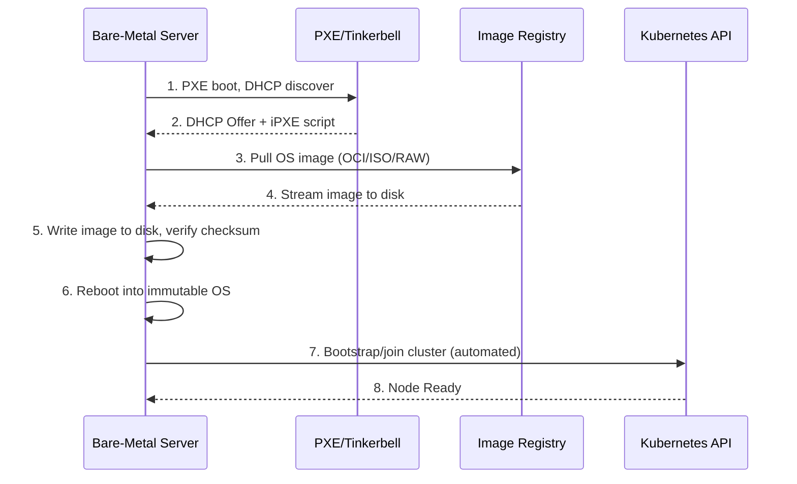
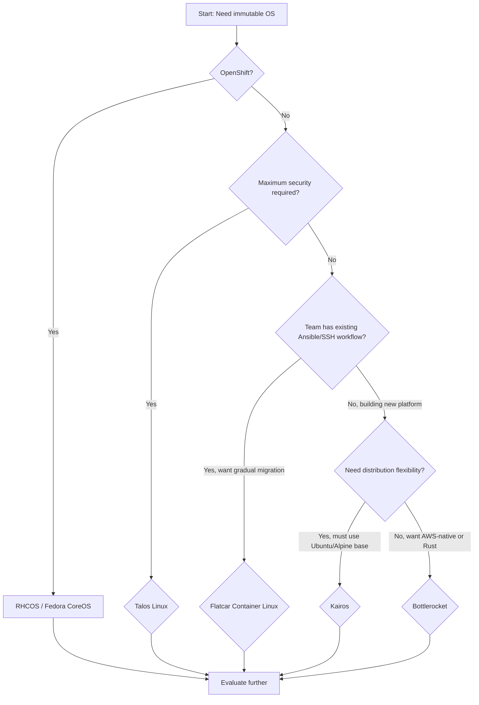

> **Complexity**: `[MEDIUM]` | Time: 60 minutes
>
> **Prerequisites**: [Module 2.2: OS Provisioning & PXE Boot](../module-2.2-pxe-provisioning/), [K8s Distributions](/platform/toolkits/infrastructure-networking/k8s-distributions/)
>
> **Why This Module Exists:** Module 2.2 taught you how to PXE-boot a server and install an OS. This module asks: *what OS should you boot, and what operating model does it enable?* Module 2.4 will declaratively manage the full lifecycle. This module sits in the middle: the image discipline itself.

---

## What You'll Be Able to Do

After completing this module, you will be able to:

1. **Evaluate** immutable Linux distributions (Talos, Bottlerocket, Flatcar, Kairos, Fedora CoreOS) against traditional mutable distributions for Kubernetes node hosting, using criteria of security surface, operational overhead, team familiarity, and update ergonomics.
2. **Design** an image-based OS provisioning strategy that separates what belongs in the OS image from what belongs in the Kubernetes layer, eliminating the configuration drift class of incidents at the architecture level.
3. **Implement** an atomic OS update pipeline with A/B partition rollback, canary rollout, and TUF-verified update channels for a fleet of bare-metal Kubernetes nodes.
4. **Diagnose** the failure modes specific to immutable operating systems — including boot-loop recovery, partition fallback failures, and extension-image compatibility — and apply the rebuild-vs-debug calculus that immutable infrastructure demands.
5. **Compare** the tradeoffs between an API-driven OS like Talos (zero SSH, gRPC-native management) and a systemd-based immutable OS like Flatcar (familiar Linux tooling with read-only rootfs) for teams with different operational maturity levels.

---

## Why This Module Matters

Hypothetical scenario: A platform team runs Kubernetes on Ubuntu 22.04 across 80 bare-metal nodes. Over 14 months, engineers SSH into nodes to debug issues and make "temporary" changes: installing `tcpdump` here, modifying a `sysctl` there, adding a cron job on another machine. Some nodes accumulate different kernel versions because an engineer ran `apt upgrade` on a subset during a late-night incident. Three nodes have leftover debugging containers consuming gigabytes of RAM each. Two nodes have modified iptables rules that break pod networking for specific CIDR ranges. When a production outage strikes, the team discovers they cannot reproduce the production state in staging because no two nodes are configured identically — and none match the original provisioning scripts.

The platform team spends three weeks auditing all 80 nodes, discovers dozens of undocumented changes, and rebuilds nearly a third of the fleet from scratch. The postmortem identifies the root cause not as individual engineer carelessness but as a system property: **mutable infrastructure guarantees drift at scale.** When any operator can SSH into a node and change anything, configuration drift is not a question of discipline — it is a statistical certainty. The longer the fleet runs, the more it diverges.

Immutable operating systems solve this by making the root filesystem read-only. You cannot SSH in and install a package. You cannot edit `/etc/sysctl.conf`. The entire OS is a single signed image that is deployed atomically and replaced atomically. If you need a change, you build a new image and roll it out through a controlled pipeline. Every node running the same image is byte-for-byte identical. This is the **image discipline**: the OS is not a starting point you customize — it is a sealed artifact you replace.

> **The Printer Cartridge Analogy**
>
> A mutable OS is like a refillable ink cartridge: you can add more ink, change the color, clean the nozzle, but eventually it gets messy and inconsistent. An immutable OS is like a sealed cartridge: when it runs out, you replace the entire unit. Every cartridge from the factory is identical. You never debug "why is this cartridge printing blue instead of black" because the answer is always "replace it."

On bare metal, the stakes are higher than in the cloud. In AWS, you can terminate a drifted EC2 instance and launch a fresh one in seconds. On bare metal, reprovisioning means PXE-booting, waiting for OS installation, and rejoining the cluster — 15 to 30 minutes per node, plus the network infrastructure dependency (DHCP, TFTP, or HTTP Boot). Bare-metal servers live three to five years, not minutes, giving drift far more time to accumulate. Immutable OS on bare metal is not a luxury — it is the only architecture that closes the drift window without requiring hyperscale-level automation maturity.

---

## 1. Why Immutable: Drift, Images, and the Software Supply Chain

The fundamental question an immutable OS answers is: **"What is the smallest artifact I must trust to run a Kubernetes node?"** The answer varies by distribution, but the reasoning is universal.

### Configuration Management vs. Image Discipline

Traditional infrastructure management uses configuration management tools — Ansible, Puppet, Chef, Salt — to converge a running OS toward a desired state. These tools operate on a **mutation model**: start with a base OS image, then layer packages, files, and settings on top until the system matches the specification. This model has served the industry for two decades and remains effective when:

- The fleet is small enough that convergence time is not a bottleneck.
- Operators have shell access and the target OS exposes a package manager.
- Drift can be tolerated or periodically remediated through re-convergence runs.

The mutation model's weakness is that it guarantees eventual consistency but never absolute identity. A node that converged successfully three months ago and hasn't been re-converged since may have drifted due to manual intervention, package auto-updates, or filesystem corruption. The configuration management tool declares what *should* be true; the OS itself offers no enforcement.

The **image discipline** takes the opposite approach. Instead of starting with a general-purpose OS and mutating it, you build a complete, sealed image that contains exactly what the node needs and nothing more. The image is the artifact — signed, versioned, and immutable at runtime. Deployment means replacing the running image, not modifying it in place. The table below captures the operational differences:

| Dimension | Configuration Management (Mutation) | Image Discipline (Immutable) |
|---|---|---|
| Artifact | Playbook/recipe + base OS | Complete, sealed disk image |
| Deployment | Converge running system in place | Replace entire OS atomically |
| Identity guarantee | Eventual consistency | Byte-for-byte identical |
| Rollback | Reverse the playbook (unreliable) | Boot previous A/B partition |
| Debugging | SSH in, install tools | API-driven or ephemeral debug containers |
| Security surface | Full OS + package manager + SSH | Minimal userspace, no package manager |
| Build reproducibility | Depends on package repo state | Deterministic image build pipeline |

### The Supply Chain Argument

Every package installed on a mutable OS represents a supply chain dependency. When you `apt install nginx`, you trust: the Debian package maintainer, the APT repository key, the TLS connection to the mirror, the mirror operator, the package build infrastructure, and every transitive dependency. On a general-purpose OS with hundreds of installed packages, your trust surface is vast.

An immutable OS reduces this dramatically. Talos Linux ships approximately 12 binaries in userspace total — `machined`, `apid`, `trustd`, `networkd`, `containerd`, `kubelet`, and a handful more — compared to the roughly 120 binaries in a minimal Debian installation. Fewer components mean fewer CVEs to track, fewer update vectors, and a smaller attack surface. Bottlerocket takes this further by writing most first-party components in Rust for memory safety, eliminating entire classes of vulnerabilities.

> **Pause and predict:** Your security team requires a software bill of materials (SBOM) for every node in the fleet. With Ubuntu Server, you must enumerate every `.deb` package, every pip/npm/gem, and every manually copied binary. With an immutable OS image built from a known hash, how does the SBOM problem change? What does the SBOM for a Talos node contain versus a Flatcar node?

### What Immutability Actually Means

Immutability in these operating systems is not a marketing term — it is enforced at the kernel and filesystem level. Each distribution uses a different mechanism, but the goal is identical: make the running system binary unable to be modified by any process, including root, without replacing the entire image. This is a stronger guarantee than filesystem permissions — `chmod` and `sudo` are userspace constructs that the kernel itself can override. SquashFS and dm-verity are enforced by the kernel's VFS and block layers, below the level where any user or process can intervene.

- **Talos Linux**: The root filesystem is SquashFS, a compressed read-only filesystem. There is no mechanism to remount it read-write. The `/var` partition is writable but ephemeral — it is wiped on upgrade. Only `/system/state` persists across upgrades.
- **Bottlerocket**: The root filesystem is a dm-verity device — a block-level integrity mechanism where every read is verified against a Merkle hash tree. Any unauthorized block modification triggers a kernel panic and reboot.
- **Flatcar Container Linux**: The root partition (`/usr`) is mounted read-only with dm-verity verification. Writable directories (`/etc`, `/var`) are separate partitions, and `/opt` is available for containerized workloads.
- **Fedora CoreOS**: Uses rpm-ostree, which treats the OS as a content-addressed object store (similar to Git for binaries). The running deployment is a checked-out tree that cannot be modified in place.
- **Kairos**: The OS image is a container — yes, the entire OS boots from an OCI container image pulled at install time. Immutability is inherent to the container model; you cannot modify a running container's image.

This filesystem-level enforcement has an important operational side effect: it converts accidental drift into an impossibility rather than a policy violation. In a mutable-OS environment, preventing drift requires that every operator follows the rules — never install a package manually, never edit a config file directly, never add a cron job. This is a behavioral control, and behavioral controls fail at scale. Immutable filesystems convert the behavioral control into a technical control. You cannot install a package because there is no package manager. You cannot edit a config file because the filesystem refuses writes. The system enforces the policy mechanically, and mechanical enforcement does not degrade with team size, fatigue, or time pressure.

---

## 2. The Immutable OS Landscape

Five major distributions dominate the immutable-Kubernetes space. Each makes fundamentally different architectural choices that determine operational fit — choices about the init system, the configuration format, the update mechanism, and crucially, whether interactive shell access exists at all. The differences between these distributions are not cosmetic; they reflect different philosophies about what a Kubernetes node operating system should be, ranging from "maximum security, zero shell" (Talos) to "familiar Linux with immutability guarantees" (Flatcar). Understanding these distinctions is essential because choosing an immutable OS is a long-term architectural commitment — migrating from one to another means reprovisioning every node in the fleet.

### Talos Linux: Kubernetes-Native, API-Driven

Talos is purpose-built for Kubernetes and nothing else. It has no SSH daemon, no shell binary (not even `/bin/sh`), no Python interpreter, no package manager, and no cron. The entire OS is managed through a gRPC API exposed by `apid`, authenticated with mutual TLS using certificates managed by `trustd`.

```ascii
┌──────────────────────────────────────────────────────────────────┐
│                        TALOS LINUX ARCHITECTURE                    │
│                                                                    │
│  ┌──────────────────────────────────────────────────────────────┐│
│  │  Linux Kernel (minimal config — only K8s + hardware drivers)  ││
│  └──────────────────────────────────────────────────────────────┘│
│  ┌──────────────────────────────────────────────────────────────┐│
│  │  machined (PID 1 — replaces systemd entirely)                 ││
│  │  ├── apid          gRPC management API (port 50000)          ││
│  │  ├── trustd        mTLS certificate management (port 50001)  ││
│  │  ├── networkd      network configuration engine              ││
│  │  ├── containerd    container runtime (CRI)                    ││
│  │  │   ├── kubelet                                              ││
│  │  │   ├── etcd          (control-plane nodes only)             ││
│  │  │   └── kube-apiserver (control-plane nodes only)            ││
│  │  └── dashboard     built-in TUI for node inspection           ││
│  └──────────────────────────────────────────────────────────────┘│
│                                                                    │
│  Filesystem layout:                                                │
│  /            SquashFS (read-only, compressed)                     │
│  /var         tmpfs (writable, wiped on upgrade)                   │
│  /etc         tmpfs (generated from machine config at boot)        │
│  /system/state Persistent partition (survives upgrades)            │
│                                                                    │
│  No SSH daemon. No /bin/sh binary. No Python. No cron. No apt.    │
│  Management surface: talosctl CLI + gRPC API only.                 │
└────────────────────────────────────────────────────────────────────┘
```

The Talos machine configuration is a single YAML document that defines everything: network interfaces, disk layout, kernel parameters, kubelet arguments, cluster certificates, and the container runtime. There is no separate cloud-init, no Ignition, no kickstart — one file is the entire node definition.

```yaml
# Minimal Talos MachineConfig showing immutable-OS configuration pattern
version: v1alpha1
machine:
  type: controlplane           # or worker
  token: "auto-generated"
  certSANs:
    - 10.0.0.1
    - k8s-api.example.com
  kubelet:
    image: ghcr.io/siderolabs/kubelet:v1.31.0
    extraArgs:
      node-ip: 0.0.0.0
  sysctls:
    vm.overcommit_memory: "1"
    kernel.panic: "10"
  install:
    disk: /dev/sda
    wipe: false
    bootloader: true
```

Talos is also the only immutable OS where Kubernetes components (kubelet, etcd, kube-apiserver) run as system services managed by the OS init process (`machined`), not as static pods or systemd units. This means Talos can manage the full lifecycle of Kubernetes components atomically: when you upgrade Talos, the bundled Kubernetes version upgrades in lockstep, and vice versa.

Operational implications of the no-SSH model:

- You cannot "just SSH in and check." Every diagnostic action must go through the API (`talosctl logs`, `talosctl pcap`, `talosctl dashboard`, `talosctl services`).
- Debugging containers: you use `kubectl debug node/worker-01 -it --image=nicolaka/netshoot` to launch an ephemeral privileged pod on the node if you need shell-based tools.
- Configuration management tools like Ansible are incompatible — there is no Python runtime, no SSH transport, and no writable filesystem for Ansible to manage.

### Bottlerocket: AWS-Born, Rust-Core, Variant Model

Bottlerocket is an open-source immutable Linux distribution built by Amazon. While heavily used in EKS, it runs on bare metal and supports both x86-64 and ARM64. Its most distinctive architectural features are:

- **Variant model**: A Bottlerocket variant is a pre-configured OS image built for a specific orchestrator. The `aws-k8s-1.35` variant includes the kubelet and EKS-optimized settings. The `vmware-k8s-1.35` variant targets vSphere. You do not install Kubernetes on Bottlerocket — the variant ships with the orchestrator integrated.
- **Rust components**: The Bottlerocket API server (`apiserver`), the update operator (`updog`), the host-containers subsystem, and other first-party components are written in Rust for memory safety. This is a deliberate security posture — eliminate buffer overflows, use-after-free, and data races at the language level.
- **TOML configuration**: All settings are defined in TOML files under `/etc/bottlerocket/`. The `apiserver` exposes these settings through a Unix socket API, and the `bottlerocket-admin` and `bottlerocket-control` host containers provide `apiclient` for querying and applying settings.
- **Host containers**: Bottlerocket runs two privileged system containers — the *admin container* (SSH access, disabled by default) and the *control container* (AWS Systems Manager or custom). These are the only mechanisms for interactive access. They are themselves containers and subject to the same lifecycle as any container workload.
- **A/B updates with deterministic rollback**: Bottlerocket maintains two partition sets (A and B) plus a separate data partition. Updates are written to the inactive partition set. The bootloader increments a boot counter; if the new partition fails to boot a configurable number of times, the system automatically falls back to the known-good partition.

Bottlerocket's tradeoff is that it is less "extreme" than Talos — SSH access exists as an opt-in host container, and the OS feels more like a conventional Linux than Talos's bespoke `machined` environment. But it is still deeply immutable: the root filesystem is dm-verity protected, there is no package manager, and configuration is API-driven rather than file-driven at the operator level.

### Flatcar Container Linux: The CoreOS Heir

Flatcar is the community-maintained successor to CoreOS Container Linux (which Red Hat acquired and discontinued in 2018). It is the most "familiar-feeling" immutable OS — it runs systemd, supports SSH, has a `/usr` read-only root with an overlay for `/etc`, and uses Ignition (JSON-based provisioning config) instead of cloud-init.

Flatcar's design philosophy is centered on reducing the conceptual distance between traditional Linux administration and immutable operations. The architecture preserves the tools and abstractions that Linux engineers already know — systemd, journalctl, SSH, bash — while enforcing immutability at the filesystem level through dm-verity and a read-only `/usr` partition. The key architectural characteristics that make this possible are:

- **systemd as PID 1**: Unlike Talos's custom `machined`, Flatcar uses systemd. Engineers who understand systemd units, `journalctl`, and `systemctl` can transfer that knowledge directly. This lowers the learning curve significantly.
- **Ignition provisioning**: A Flatcar node receives a JSON Ignition config at first boot (via PXE kernel command line, cloud metadata service, or USB). Ignition partitions disks, writes files, creates systemd units, and configures users — then the config is discarded. There is no second-pass configuration agent running.
- **Nebraska/Omaha updates**: Flatcar uses the Omaha protocol — the same update protocol used by ChromeOS and Chromium — to poll an update server for new releases. This is a *pull-based* model: nodes check in periodically rather than being pushed updates. Flatcar's Nebraska server manages canary rollouts, rate limiting, and per-group update policies.
- **Partial Ansible compatibility**: Flatcar supports SSH and has Python available through `toolbox` (a systemd-nspawn container that shares the host's filesystem namespace). Ansible can connect and gather facts, but cannot install packages or modify `/usr`. This provides a migration path for teams with existing Ansible investment.
- **dm-verity root**: Like Bottlerocket, Flatcar's `/usr` partition is verified through dm-verity. The kernel will refuse to read a block that fails its hash check.

Flatcar's primary design philosophy is *familiar but immutable*. It preserves the Linux tooling teams already know while enforcing the image discipline at the filesystem level. The SSH daemon is a choice point: you can include SSH keys in Ignition for debugging, or omit them entirely for production nodes — the OS supports both modes.

### Kairos: Container-Native, Distribution-Agnostic

Kairos takes the most unconventional approach: the OS itself is an OCI container image. You build a Kairos image by starting from a base (Ubuntu, Alpine, openSUSE) and layering your configuration into a container. The resulting image is then burned to disk as an immutable OS. This model inverts the traditional OS-to-container relationship: instead of running containers on an OS, Kairos runs the OS as a container. The implication is that every tool in the container ecosystem — image registries, vulnerability scanners, signing and attestation systems, OCI distribution specifications — applies directly to your OS image. You can `podman pull` your OS, scan it with Trivy or Grype, sign it with cosign, and push it to any OCI-compatible registry. No separate infrastructure for OS images is needed.

What makes Kairos distinctive:

- **Distribution-agnostic**: You can build a Kairos image on top of Ubuntu 22.04, Alpine 3.19, or openSUSE Leap — the immutability framework is layered on top of an existing distribution's userspace. This means teams can keep their familiar package ecosystem while gaining immutability.
- **A/B atomic upgrades**: Kairos writes updates to a passive partition and reboots. The bootloader (`GRUB` or `systemd-boot`) automatically falls back to the previous partition if the new one fails to boot. For embedded and IoT use cases where bootc or Kairos are not a fit, **RAUC** (Robust Auto-Update Controller) provides a lightweight, distribution-agnostic A/B update framework for embedded Linux — it handles partition management, boot selection, and fallback logic at the bootloader level with signed update bundles.
- **Kubernetes-native lifecycle**: Kairos has a native Cluster API provider, meaning you can manage Kairos nodes through the same declarative API as any other CAPI infrastructure.
- **Edge and air-gap focus**: Kairos emphasizes operation in disconnected, edge, and IoT environments. It supports QR-code-based pairing, local OCI registries, and manual USB-based updates — important for environments without always-on network connectivity.

Kairos fits teams that want immutability but cannot abandon their distribution ecosystem (Ubuntu packages, Alpine simplicity, openSUSE enterprise support). The tradeoff is that the attack surface remains larger than Talos or Bottlerocket because the base distribution's userspace is present, even if mounted read-only.

### Fedora CoreOS: rpm-ostree and Ignition

Fedora CoreOS (FCOS) is the community upstream for Red Hat CoreOS (RHCOS), which powers every OpenShift cluster. FCOS is the only immutable OS in this survey that is backed by a major enterprise Linux vendor's kernel engineering team — the same team that maintains the RHEL kernel. This matters for hardware compatibility: FCOS inherits RHEL's extensive hardware enablement work, which means it supports a wider range of server hardware out of the box than any other immutable OS. FCOS combines rpm-ostree (an atomic image/package hybrid system) with Ignition for first-boot provisioning, creating a model where the OS is deployed as a content-addressed commit and updates are applied atomically.

- **rpm-ostree** treats the OS as a Git-like commit tree. Each OS version is a content-addressed ostree commit. Installing a package does not modify the running system — it creates a new deployment (a new commit in the ostree history). The system boots the new deployment on the next restart. You can layer additional RPMs on top of the base image with `rpm-ostree install`, but the layered packages become part of the new deployment, not a persistent mutation.
- **Zincati** is the automatic update agent that polls Cincinnati (the FCOS update service) for new releases. It respects node-specific strategies (reboot windows, canary membership, finalization deadlines) and reboots into the new deployment when ready.
- **Ignition** (same as Flatcar) handles first-boot provisioning: disk partitioning, file creation, systemd units, user accounts.

FCOS is most relevant for teams considering OpenShift or those already in the Fedora/RHEL ecosystem who want immutable properties without adopting a completely foreign distribution.

> **Pause and predict:** A team migrating from Ubuntu with Ansible-managed configuration has two paths: (a) Flatcar with Ignition and partial Ansible compatibility, or (b) Talos with a complete tooling reset and API-driven management. What questions would you ask the team before recommending one over the other? Consider: team size, existing automation investment, security requirements, and the time budget for migration.

---

## 3. Node-as-Cattle: Operating Model and Configuration Boundaries

Immutable OS forces a rethinking of the node lifecycle. In a mutable environment, a node is a pet: you care for it, you debug it, you nurse it back to health. In an immutable environment, a node is cattle: when something goes wrong, you replace it. The "pets vs. cattle" analogy has been used in cloud infrastructure for over a decade, but immutable OS takes it to its logical conclusion — the node is not just treated as cattle culturally, it is cattle architecturally. The OS itself enforces that the node cannot be nursed. This shifts the operational investment from per-node care to the pipeline that produces nodes, and it changes the nature of every operational decision from "how do I fix this node?" to "how do I ensure no future node has this problem?"

### The Configuration Boundary

The single most important design decision in an immutable-OS deployment is the **configuration boundary**: what goes in the OS image versus what stays in the Kubernetes layer. Getting this wrong means rebuilding images for every application change, which is operationally painful. Getting it right means images change rarely (OS upgrades, kernel updates, security patches) while everything application-level stays dynamic.

```ascii
┌───────────────────────────────────────────────────────────────────┐
│               THE CONFIGURATION BOUNDARY                           │
│                                                                     │
│  ┌─────────────────────────────────────────────────────────────┐  │
│  │  KUBERNETES LAYER (dynamic, updated via kubectl/Helm/GitOps) │  │
│  │  ├── Pod specifications, Deployments, StatefulSets          │  │
│  │  ├── CNI plugin (installed via manifest, not in OS image)   │  │
│  │  ├── CSI drivers, device plugins                            │  │
│  │  ├── Admission webhooks, policy engines                     │  │
│  │  └── Application container images                            │  │
│  └─────────────────────────────────────────────────────────────┘  │
│                          ▲▲▲ INTERFACE ▲▲▲                         │
│  ┌─────────────────────────────────────────────────────────────┐  │
│  │  OS IMAGE LAYER (static, updated via A/B atomic upgrade)     │  │
│  │  ├── Linux kernel + kernel modules                           │  │
│  │  ├── Container runtime (containerd, CRI-O)                   │  │
│  │  ├── kubelet + its configuration                             │  │
│  │  ├── System-level sysctl parameters                          │  │
│  │  ├── cgroup driver (cgroupfs or systemd)                     │  │
│  │  ├── Storage stack (device mapper, filesystem drivers)       │  │
│  │  ├── Network configuration (interface naming, bonding)       │  │
│  │  └── Trusted CA certificates, container registry mirrors     │  │
│  └─────────────────────────────────────────────────────────────┘  │
│                                                                     │
│  Rule of thumb: If changing it requires a node reboot, it belongs   │
│  in the OS image. If changing it is a kubectl apply, it belongs     │
│  in the Kubernetes layer.                                            │
└───────────────────────────────────────────────────────────────────┘
```

### What Goes in the OS Image

These items are tightly coupled to the OS, require a reboot to change, or represent security-critical configuration that must be identical across the fleet:

- **Kernel version and kernel parameters**: `cgroup_memory=1`, `transparent_hugepage=never`, `nr_hugepages=512`. These cannot be changed at runtime. They must be baked into the bootloader configuration, which is part of the image.
- **Container runtime version**: containerd or CRI-O. The Kubernetes version must be compatible with the CRI version; mismatches cause node `NotReady` states. Baking the runtime into the image guarantees consistency.
- **Kubelet version**: Tighter coupling is better. Talos bundles kubelet with the OS and upgrades them atomically. In Flatcar or Bottlerocket, you can decouple them, but you then own the compatibility matrix.
- **Trusted CA certificates**: If your nodes need to pull images from a private registry with a corporate CA, that CA must be in the node's trust store — which is on the read-only rootfs.
- **Mandatory security controls**: SELinux policy (Bottlerocket enforces this by default), AppArmor profiles, seccomp filters, audit rules. These should be uniform across the fleet.
- **Node identity bootstrapping**: The mechanism by which a node proves its identity to join the cluster — bootstrap tokens, certificate signing requests, or platform-specific attestation.

### What Stays in the Kubernetes Layer

These items change with application deployments, scale events, or operational adjustments and should never trigger an OS image rebuild:

- **CNI plugin and its configuration**: Calico, Cilium, or Flannel should be deployed as Kubernetes manifests, not baked into the OS.
- **CSI drivers**: Storage provisioning is application-level infrastructure.
- **Device plugins**: GPU drivers, FPGA plugins, SR-IOV configuration plugins — deploy as DaemonSets.
- **Pod-level sysctls**: Kernel parameters scoped to pods (via `securityContext.sysctls`) belong in pod specs.
- **Admission controllers and policy**: OPA/Gatekeeper, Kyverno, Pod Security Admission.
- **Application container images**: This should be obvious, but in the mutable-OS world, it was common to pre-pull images onto nodes to speed up pod start. In immutable OS, pre-pulling is anti-pattern — it adds drift. Let the Kubelet pull images on demand.

The boundary is not always obvious in practice. Consider node monitoring agents: a Prometheus node_exporter or a Datadog agent. These run on every node, need host-level access to collect metrics, and are tightly coupled to the OS kernel version they query. The argument for putting them in the OS image is that they need the same kernel compatibility guarantee as the kubelet. The argument for putting them in the Kubernetes layer is that they change at the application release cadence, not the OS release cadence. Most teams land on the Kubernetes side — deploy monitoring agents as DaemonSets with host PID and network access — but the tradeoff is that the agent's kernel compatibility must be tested against every new OS image before rollout. This is exactly the kind of cross-layer dependency that a well-defined configuration boundary must make explicit, not implicit.

### kubeadm and Immutable OS: How They Interact

The `kubeadm join` command relies on a bootstrap token (or a certificate key) to authenticate a new node to the control plane. On a mutable OS, you would SSH into the node, run `kubeadm join`, and the node registers. On an immutable OS, there is no shell and no interactive session. The join must be automated.

Every immutable OS handles this differently:

- **Talos**: The machine config contains the control plane endpoint, the cluster CA certificate, and the bootstrap token. `trustd` handles the mTLS handshake with the existing cluster. `machined` registers the node. No `kubeadm` binary exists — Talos reimplements the node bootstrap protocol natively.
- **Bottlerocket**: The TOML configuration includes `settings.kubernetes.cluster-certificate`, `settings.kubernetes.api-server`, and `settings.kubernetes.bootstrap-token`. At boot, the kubelet reads these settings and joins the cluster. For EKS, Bottlerocket uses the AWS IAM authenticator instead of bootstrap tokens.
- **Flatcar**: You write a systemd unit in the Ignition config that runs `kubeadm join` at first boot. The bootstrap token is embedded in the Ignition config. After the join succeeds, the unit disables itself. This is the "traditional" approach adapted for immutability — `kubeadm` runs once, then never again.
- **Kairos**: The node joins the cluster using the same bootstrap token mechanism, driven by the Kairos agent at first boot. The token is provided through the cloud-config or the Kairos configuration file.

The important operational lesson: bootstrap tokens have a TTL (default 24 hours in kubeadm). If your OS image build pipeline generates tokens, the image must be deployed within that TTL. Alternatively, you can generate tokens on demand at provision time through a PXE/Tinkerbell pipeline (see Module 2.2) that injects a fresh token into the node's first-boot configuration.

This token management problem is a microcosm of the larger immutable-OS design challenge: every piece of dynamic, time-sensitive data that a mutable OS obtains through interactive shell access must be rethought as a statically provisioned or API-retrieved configuration artifact. The bootstrap token is just one example. Node labels, taints, and annotations that identify a node's role, hardware class, or failure domain are other examples. On a mutable OS, you label a node with `kubectl label node worker-01 node-type=gpu` after the node joins. On an immutable OS, the label must be applied at join time, either through the kubelet's `--node-labels` flag (baked into the OS image or injected at boot) or through a mutating admission webhook that applies labels based on the node's identity.

The rule of thumb: if a configuration value is needed for the node to be a functional cluster member, it must be available at boot time, not applied retroactively through `kubectl`. Every retroactive configuration step is a drift vector.

---

## 4. Atomic Update Pipelines: A/B Partitions, TUF, and Rollback Gates

Immutable OS without an update pipeline is just a frozen OS — secure at a moment in time, vulnerable forever after. The update pipeline is where immutability delivers its operational value. A properly designed pipeline answers five questions: (1) how does a new OS image reach the node, (2) how does the node verify the image is authentic and untampered, (3) how is the update applied without disrupting workloads, (4) what happens if the update fails, and (5) how do you know every node in the fleet is running the expected version. The dual-partition architecture, cryptographic signing framework, and coordinated rollout strategy covered in this section answer each of these questions with mechanisms that have been validated at the scale of hundreds of millions of devices.

### A/B Partition Architecture

All five distributions covered in this module use some form of A/B (dual-partition) update scheme. The principle is simple and, by now, battle-tested at planetary scale — ChromeOS has used A/B updates since 2012 across hundreds of millions of devices. The scheme works by maintaining two complete OS installations on separate disk partitions. At any moment, one partition is active (the running OS) and the other is passive (available to receive an update). The update is written to the passive partition while the active partition continues serving workloads, then the bootloader swaps roles on the next reboot. If the new OS fails to boot, the bootloader falls back to the previous partition automatically. The entire mechanism operates below the OS layer — it is a bootloader feature, not an OS feature — which is why it works identically across Talos, Bottlerocket, Flatcar, and Kairos despite their radically different userspace designs.

```ascii
┌─────────────────────────────────────────────────────────────────┐
│                    A/B UPDATE PARTITION SCHEME                     │
│                                                                   │
│  ┌─────────────────┐    ┌─────────────────┐    ┌──────────────┐ │
│  │   Partition A    │    │   Partition B    │    │  Data/State  │ │
│  │   (ACTIVE)       │    │   (PASSIVE)      │    │  (persistent)│ │
│  │                  │    │                  │    │              │ │
│  │  Talos v1.9.0   │    │  Empty / old     │    │ /system/state│ │
│  │  kernel 6.6     │    │  version         │    │ /var/lib/    │ │
│  │  kubelet 1.35   │    │                  │    │   kubelet    │ │
│  │                 │    │                  │    │   containerd │ │
│  └────────┬────────┘    └────────┬─────────┘    └──────────────┘ │
│           │                      │                                │
│  ┌────────▼──────────────────────▼─────────────────────────────┐ │
│  │                    BOOTLOADER (GRUB/systemd-boot)            │ │
│  │  boot_counter: 0 (success)                                   │ │
│  │  fallback_partition: B                                       │ │
│  │  max_boot_attempts: 3                                        │ │
│  └──────────────────────────────────────────────────────────────┘ │
│                                                                   │
│  1. Update writes Talos v1.10.0 to Partition B                    │
│  2. Bootloader tries Partition B, increments boot_counter         │
│  3. If kernel panics: boot_counter < max_attempts → retry B       │
│     If boot_counter >= max_attempts → fall back to Partition A    │
│  4. On successful boot: talosctl marks partition as good          │
│     → boot_counter reset to 0, B becomes new "known good"         │
│                                                                   │
└─────────────────────────────────────────────────────────────────┘
```

The critical safety mechanism is the **boot counter with automatic fallback**. When the bootloader attempts to boot a new partition:

1. It increments a boot counter stored in the bootloader environment.
2. If the kernel starts successfully and the userspace signals "healthy" (Talos does this via `talosctl health` equivalent in `machined`; systemd-based OSes use `systemd-boot`'s built-in counter), the counter is reset to zero and the partition is marked as the new "good" partition.
3. If the kernel panics, or userspace never signals healthy, the bootloader tries again — up to a configurable maximum (typically three attempts).
4. After exhausting attempts, the bootloader falls back to the previous known-good partition.

This fallback mechanism is the reason A/B updates are safe to apply automatically, even without human supervision. It converts a catastrophic failure mode ("bad update bricks the node") into a degraded but recoverable mode ("node reboots back to the old version automatically"). The key operational detail: this only covers *boot-time* failures. If the node boots successfully but the kubelet fails to register or pods fail to start, A/B fallback will not trigger — you need health monitoring at the cluster level (Node Problem Detector, MachineHealthCheck) to detect runtime failures.

### The Update Framework (TUF) and Signed Updates

A/B partitions protect against bad *software*; TUF protects against bad *actors*. The Update Framework is a CNCF-graduated specification for securing software update systems. It defines a set of roles (Root, Targets, Snapshot, Timestamp) with signed metadata that guarantees:

- **Freshness**: The update you receive is the latest, not a replay of an old (vulnerable) version.
- **Integrity**: The update has not been tampered with in transit.
- **Authenticity**: The update was signed by a key you trust.
- **Compromise resilience**: If a single signing key is compromised, the attacker cannot unilaterally push malicious updates (threshold signatures require multiple keys).

Flatcar's Nebraska update server uses the Omaha protocol for signed, channel-aware rollouts — it provides cryptographic signing and group-based rollout control but is not a TUF implementation. For full TUF compliance with Flatcar, organizations typically layer a TUF mirror (such as `python-tuf` or the TUF reference implementation) in front of Nebraska. Talos uses a simplified signing model (Ed25519 signatures on machine configs and installer images) but the TUF concepts of trusted metadata and threshold signatures apply. Bottlerocket is the only distribution covered here that implements full TUF natively: its `updog` agent validates TUF metadata, and its `tough` library implements the complete four-role TUF specification (Root, Targets, Snapshot, Timestamp).

The practical implication of TUF for a platform team is that you can run an update server inside your network boundary that nodes trust, and even if the upstream image registry is compromised, your nodes will reject any update that isn't signed by your keys. This is not theoretical — software supply chain attacks against update infrastructure have been documented since at least 2015. TUF was designed specifically to make these attacks detectable and recoverable. The four-role model means that even if an attacker compromises the timestamp key (the most exposed key, used frequently for short-lived metadata), they cannot serve malicious targets because only the targets role can list valid update files, and the targets key can be kept offline.

For on-premises deployments, you typically run your own update server (Nebraska for Flatcar, a container registry for Talos/Bottlerocket, Cincinnati for FCOS) and configure nodes to trust only your server's signing keys. This prevents nodes from pulling updates from the public internet — critical for air-gapped environments. The server itself can mirror upstream images while resigning them with your organization's keys, creating a chain of trust: upstream signs → you verify → you resign with your key → nodes verify your signature. Each node only needs to trust one key (yours), not every upstream project's key.

### Canary Rollouts and Reboot Coordination

Updating one node with A/B is straightforward. Updating 200 nodes without causing a cluster outage requires coordination. The standard pattern:

```
┌──────────────────────────────────────────────────────┐
│           UPDATE ROLLOUT STRATEGY                      │
│                                                        │
│  ┌──────────┐   ┌────────────┐   ┌──────────────────┐│
│  │  Canary   │   │  Batch 1   │   │  Fleet          ││
│  │  (2 nodes)│ → │  (25%)     │ → │  (remaining)    ││
│  │           │   │            │   │                 ││
│  │ Monitor:  │   │ Monitor:   │   │ Monitor:        ││
│  │ 1 hour    │   │ 4 hours    │   │ Continuous      ││
│  │           │   │            │   │                 ││
│  │ Gate:     │   │ Gate:      │   │ Gate:           ││
│  │ pod ready │   │ node ready │   │ node ready      ││
│  │ CPU/Mem   │   │ no alerts  │   │ per-group       ││
│  │ PLEG OK   │   │            │   │ drain rate      ││
│  └──────────┘   └────────────┘   └──────────────────┘│
│                                                        │
│  Each node: drain → update → reboot → uncordon → wait │
│  Concurrency: max 1 node per rack / failure domain    │
└──────────────────────────────────────────────────────┘
```

The coordination controller (Flatcar's Nebraska, Talos's update API, Bottlerocket's `updog` + external orchestrator, or a custom Kubernetes operator) is responsible for:

1. **Draining**: Cordoning and draining the node before reboot. This moves pods to other nodes according to PodDisruptionBudgets.
2. **Rate limiting**: Ensuring only N nodes are rebooting at once, with N chosen so that remaining capacity can absorb the workload.
3. **Failure-domain awareness**: Never draining two nodes in the same rack simultaneously. Lose a ToR switch during a rolling update? You want at most one node in that rack affected.
4. **Health gating**: After reboot, waiting for the node to report `Ready` and for all daemonset pods to be running before proceeding to the next node.
5. **Timeout+skip**: If a node does not become ready within a deadline, skip it, notify an operator, and continue the rollout. A stuck node should not block fleet-wide updates.

---

## 5. Bootstrap Integration: PXE, Tinkerbell, and Immutable OS

Module 2.2 covered PXE-booting and provisioning servers with an OS. This section connects that pipeline to immutable OS specifically — what changes when the OS being deployed is immutable.

### Provisioning Flow for Immutable OS

The provisioning pipeline for an immutable OS has fewer stages than for a mutable OS because there is no post-install configuration convergence step. The sequence diagram below traces the flow from bare metal to cluster member. Notice what is absent: no `apt-get`, no Ansible playbook run, no SSH-based verification loop. The OS image is complete at rest in the registry; provisioning is a copy operation plus a configuration injection, not a construction project:



The shift from mutable to immutable provisioning eliminates three stages that are universal in traditional infrastructure automation. Understanding these eliminated stages clarifies why immutable-OS provisioning is not just faster but structurally simpler and less error-prone:

- **No package installation phase**: The OS image is complete. There is no `apt-get install`, no `yum install`, no Ansible convergence step between OS boot and cluster join.
- **No post-install drift window**: With a mutable OS, the time between OS installation and configuration management convergence is a brief window where the node is in an unknown intermediate state. Immutable OS eliminates this — the node boots directly into its final state.
- **Configuration injection at provision time**: Instead of installing a base OS and then configuring it, immutable OS provisioning injects configuration (Talos machine config, Bottlerocket TOML, Flatcar Ignition, Kairos cloud-config) during the PXE process. The config is typically passed as a kernel command-line parameter or fetched from a metadata endpoint.
- **Image registry, not package mirror**: The source of truth is an OCI-compatible container registry (for Talos, Bottlerocket, Kairos) or an OSTree repository (for FCOS), not a package mirror. This means the same image-scanning and signing infrastructure you use for application containers applies to your OS images.

### Integrating with Tinkerbell

Tinkerbell (covered in Module 2.2 as a provisioning platform) provides a template-based workflow engine that pairs well with immutable OS because the workflow's responsibility ends when the node registers with Kubernetes — there is no ongoing configuration management phase. For a Talos deployment through Tinkerbell, the workflow has four distinct stages, each producing an auditable artifact:

1. **Hardware data**: The server's MAC address, BMC credentials, and hardware profile are registered in Tinkerbell. This is the source of truth and should be the only place where per-server physical identity lives — not in a spreadsheet, not in a wiki page, not in an engineer's notes.
2. **Template**: A Tinkerbell template defines the workflow: (a) boot the server via iPXE, (b) write the Talos disk image to `/dev/sda`, (c) write the machine configuration to a FAT partition that Talos reads on first boot.
3. **Dynamic configuration**: The template renders the machine configuration with server-specific values: hostname, static IP (from the hardware data), control-plane vs. worker role.
4. **One-shot execution**: The workflow runs once, the server boots Talos, and joins the cluster. There is no ongoing configuration management — Tinkerbell's role ends at the point the node registers with Kubernetes.

This is fundamentally different from using Tinkerbell to provision Ubuntu and then running Ansible. The immutable approach eliminates the second phase entirely. The OS image *is* the fully configured state.

---

## 6. Failure Recovery: The Rebuild-vs-Debug Calculus

Immutable OS changes the economics of failure recovery. On a mutable OS, when a node misbehaves, the first instinct is to debug it in place: SSH in, check logs, run diagnostic commands, maybe fix the issue manually, and keep the node running. On an immutable OS, debugging is constrained by the read-only rootfs and the absence of interactive tooling (especially on Talos). The rebuild-vs-debug calculus shifts decisively toward rebuild.

### When to Rebuild vs. When to Debug

| Situation | Action | Rationale |
|---|---|---|
| Node fails to boot after upgrade | Let A/B fallback trigger; rebuild image later | Fallback is automatic (under 60 seconds); investigate the bad image offline |
| kubelet crashing repeatedly | Rebuild node; capture logs via API first | Rebuild time (15-30 min via PXE) is shorter than debugging an opaque kubelet failure; logs give you the root cause offline |
| Intermittent network packet loss | Debug via API (`talosctl pcap`, `kubectl debug node`); rebuild only if hardware is suspected | Intermittent failures may follow the node if it's a NIC or cable issue; rebuild wastes time |
| Disk I/O errors in kernel log | Replace the disk; rebuild the node | I/O errors are hardware, not software; immutable OS does not fix failing disks |
| Node fails health checks after 6 months | Rebuild; compare post-rebuild behavior | Long-uptime failures are often hardware degradation; a clean rebuild on the same hardware that still fails confirms hardware root cause |
| Security CVE in container runtime | Rebuild all nodes with patched OS image | Immutable OS makes fleet-wide rebuild a controlled pipeline, not an emergency fire drill |

### Diagnostic Tools Available on Immutable OS

The absence of SSH does not mean the absence of diagnostics. Each OS provides API-driven alternatives that replace the traditional "SSH in, run commands, check files" workflow with structured, auditable, and automation-friendly tooling. The shift from interactive shell access to API-driven diagnostics is not merely a security improvement — it changes how incidents are investigated, how knowledge is shared across the team, and how recovery procedures are documented and reproduced. When every diagnostic action goes through a versioned CLI or a Kubernetes-native debug container, the investigation becomes repeatable. Another engineer can replay the exact same diagnostic sequence six months later and get the same result, because the tooling, not tribal knowledge, defines the investigation path.

**Talos** — `talosctl` provides a comprehensive set of diagnostic commands that cover the same ground as `ssh` + `journalctl` + `tcpdump` + `ps` + `df` on a traditional Linux host, but accessed through the gRPC API rather than a shell:
```bash
# View kernel messages and system service logs
talosctl logs kernel --nodes 10.0.5.10
talosctl logs kubelet --nodes 10.0.5.10

# Capture network traffic (replaces tcpdump)
talosctl pcap --nodes 10.0.5.10 --interface eth0 --output capture.pcap

# Inspect running processes and memory
talosctl processes --nodes 10.0.5.10
talosctl memory --nodes 10.0.5.10

# View all mounted filesystems and disk usage
talosctl mounts --nodes 10.0.5.10
talosctl usage --nodes 10.0.5.10

# Launch an ephemeral debug container on the node
kubectl debug node/worker-01 -it --image=nicolaka/netshoot

# Interactive dashboard (TUI)
talosctl dashboard --nodes 10.0.5.10
```

This API-native approach has a critical advantage over SSH: every diagnostic command is logged by the Talos API audit trail. If a team member runs `talosctl pcap` on a production node at 3 AM, that action is recorded and can be reviewed later. In a traditional SSH-based environment, there is no equivalent — an operator with `sudo` can run anything and leave no audit footprint beyond the shell history file, which is trivially erased. The API model converts diagnostics from an unobservable side channel into a managed, auditable operation — a property that matters deeply in regulated environments and incident postmortems.

**Bottlerocket** — diagnostics are performed through the admin host container, which is a privileged system container providing SSH access to a limited userspace that runs alongside the immutable host OS. The admin container can inspect the host's configuration through the `apiclient` utility and examine container runtime logs, but it cannot modify the read-only root filesystem:
```bash
# SSH into the admin container (if enabled)
ssh -i admin-key.pem ec2-user@10.0.5.10

# Query OS settings
apiclient get settings.kubernetes
apiclient get settings.network

# Check update status
apiclient get settings.updates

# View container runtime logs
journalctl -u containerd
```

The admin container model is Bottlerocket's answer to the diagnostic paradox: operators need interactive access for debugging, but interactive access creates drift risk. By confining SSH to a privileged container with a read-only view of the host, Bottlerocket provides the debugging surface engineers expect while enforcing that any change that survives a reboot must go through the image pipeline. The admin container itself is versioned as part of the Bottlerocket variant, so its tooling is consistent across the fleet — no more "I installed a newer version of tcpdump on node 7 and it works differently."

**Flatcar** — because Flatcar is systemd-based and supports SSH (enabled through Ignition configuration), it offers the most familiar diagnostic experience of any immutable OS. The tradeoff is that SSH access, once enabled, operates like traditional Linux SSH — with all the drift risk that implies. Teams using Flatcar should treat SSH as a transitional tool, to be progressively replaced by `kubectl debug node` as operational maturity grows:
```bash
# Traditional Linux diagnostics over SSH
ssh core@10.0.5.10
journalctl -u kubelet
crictl ps
crictl logs <container-id>

# Or via debug container without SSH
kubectl debug node/worker-01 -it --image=nicolaka/netshoot
```

### The True Cost of Manual Recovery

The operational trap with mutable OS is that manual recovery *feels* fast: "I'll just SSH in and restart the kubelet, it'll take two minutes." The hidden costs emerge over time:

- The fix is undocumented. When the same problem recurs six months later, a different engineer spends two hours reproducing the diagnosis.
- The fix creates drift. The first node now has a different kubelet configuration than the 79 other nodes. When you upgrade the fleet, this node behaves differently and causes a rollback.
- The fix masks a design flaw. If the kubelet needed a manual restart, the root cause (memory pressure, a kernel bug, a misconfigured systemd unit) remains unaddressed.

The rebuild approach inverts this: the first occurrence costs more (15-30 minutes for a full rebuild) but the fleet remains identical, the root cause investigation happens offline against a captured log snapshot, and the fix is applied to the image — preventing recurrence across the entire fleet. This is the core operational philosophy of immutable infrastructure: invest in the image pipeline, not in per-node heroics.

This philosophy demands organizational discipline. It means resisting the urge to "just fix it quickly" every time a node misbehaves. It means accepting that the rebuild takes 20 minutes when the manual restart would take 2, because the 20-minute rebuild prevents 200 minutes of drift-related debugging six months later. Teams that adopt immutable OS successfully treat every manual node interaction as a process failure to be eliminated, not a clever fix to be celebrated. The question after every incident is not "what did we do to fix the node?" but "what change to the image pipeline would make this class of incident impossible?"

---

## Patterns & Anti-Patterns

### Patterns

| Pattern | When to Use | Why It Works |
|---|---|---|
| **Image-First Provisioning** — Build a complete OS image (Talos machine config, Bottlerocket variant, Flatcar Ignition) and deploy it as a sealed artifact | Any fleet larger than 10 nodes | Eliminates the post-provision convergence step; every node is byte-identical from first boot |
| **Configuration Injection at Boot** — Pass node-specific config (hostname, IP, role) as kernel command-line parameters or metadata URL, not as post-boot mutations | Dynamic environments where nodes have unique identities | Keeps the image identical across nodes while allowing per-node differentiation through a well-defined injection interface |
| **Canary-Tier Updates** — Maintain a small canary group (2-3 nodes) that receives OS updates first, with a mandatory observation window before rolling to the rest of the fleet | Production clusters where OS regressions are unacceptable | Catches kernel panics, driver incompatibilities, and kubelet regressions before they affect the full fleet |
| **Ephemeral Debug Containers** — Use `kubectl debug node` with a diagnostic image (netshoot, alpine) instead of SSH for investigation | Any immutable OS deployment, especially Talos | Provides full shell access when needed without compromising the immutable security model; the debug container is ephemeral and leaves no trace |
| **Image Signature Verification** — Require cosign/sigstore signatures or TUF metadata validation before nodes accept an update image | Regulated environments; defense, finance, healthcare | Prevents supply chain attacks; a compromised image registry cannot distribute unsigned images |

### Anti-Patterns

| Anti-Pattern | Why It Happens | Better Alternative |
|---|---|---|
| **Pre-pulling Container Images on Nodes** — Running a cron job or daemon to pre-cache application images on the OS filesystem | Legacy practice from when image pull latency was high; feels like an optimization | Let the Kubelet pull on demand. Modern registries with layer caching and lazy pulling (eStargz, Nydus) eliminate the latency concern without creating OS-level drift |
| **SSH Bypass for "Quick Fixes"** — Enabling SSH on Flatcar or Bottlerocket and using it for ad-hoc repairs | Operators are comfortable with SSH; it feels productive in the moment | Reserve SSH for initial provisioning debugging only. Once the cluster is stable, disable SSH and use `kubectl debug node` for all interactive access. Ad-hoc repairs create exactly the drift immutable OS was designed to prevent |
| **Mixing Talos and Flatcar in One Cluster** — Using different immutable OSes for control-plane vs. worker nodes | "Each OS has strengths; use the best tool for each role" | The operational model divergence (API-driven vs. SSH/systemd) means your team must master two toolchains, two update mechanisms, and two debugging workflows. Pick one OS for the entire cluster |
| **Layering Dozens of RPMs on FCOS** — Using `rpm-ostree install` to add Python, debug tools, monitoring agents | "We need these tools; they're just one layer command away" | Each layered package increases the attack surface and makes image builds less reproducible. Run monitoring as DaemonSet containers. Use debug containers for interactive tooling. Keep the base image minimal |
| **Skipping the Canary Window in Low-Pressure Situations** — Rolling updates to the full fleet because "it's just a minor patch release" | Time pressure; the patch release notes say "bug fixes only" | A kernel regression in a "minor" update can panic nodes. Always canary first, even for patch releases. The cost of a fleet-wide rollback (drain, reboot, wait) is orders of magnitude higher than waiting 1-2 hours on a canary |
| **Using Static Bootstrap Tokens in Images** — Baking a bootstrap token with a long TTL into the OS image | Simplicity: the image "just works" when deployed | Bootstrap tokens expire. A baked token becomes invalid and nodes fail to join. Generate tokens at provision time through your PXE pipeline and inject them dynamically |

---

## Decision Framework

Choosing an immutable OS is a multi-dimensional decision. Use the framework below to narrow the options, then the comparison table to validate.



### Comparison Matrix

| Criterion | Talos Linux | Bottlerocket | Flatcar | Kairos | FCOS |
|---|---|---|---|---|---|
| SSH access | None (no daemon) | Opt-in admin container | Available (optional) | SSH service optional | Available (discouraged) |
| Init system | machined (custom) | systemd | systemd | systemd (base-dependent) | systemd |
| Configuration format | MachineConfig (YAML) | TOML via API | Ignition (JSON) | Cloud-config / YAML | Ignition (JSON) |
| K8s integration | Native (bundled in OS) | Variant-specific | External (kubeadm) | External or CAPI | External (OpenShift or standalone) |
| Root filesystem | SquashFS | dm-verity | dm-verity | Overlay-based | ostree commit |
| Update protocol | talosctl upgrade | updog (TUF-based) | Omaha (Nebraska) | Container registry pull | Zincati (Cincinnati) |
| Learning curve | High (new paradigm) | Medium (TOML + API) | Low (familiar Linux) | Low (familiar base distro) | Medium (rpm-ostree) |
| Air-gap support | Yes (image cache) | Yes (private registry) | Yes (Nebraska server) | Yes (designed for) | Yes (Cincinnati mirror) |
| CAPI provider | Sidero (native) | CAPB (community) | None (kubeadm-based) | Native CAPI | None (OpenShift MAPI) |

The decision typically comes down to two dimensions: **security posture vs. operational familiarity**, and **Kubernetes lifecycle coupling**. Talos maximizes security at the cost of tooling investment. Flatcar minimizes operational disruption at the cost of a larger attack surface (SSH, systemd). Bottlerocket and Kairos occupy the middle: Bottlerocket for AWS-centric teams wanting strong immutability without the full Talos toolswitch, Kairos for teams that need their existing distribution ecosystem.

---

## Did You Know?

- **Talos Linux has no `/bin/sh` binary anywhere on the filesystem.** Even if an attacker escapes a container to the host, there is literally no shell interpreter to execute commands. This is the most extreme form of attack-surface reduction in any Linux distribution designed for server workloads. For comparison, a minimal Debian installation ships approximately 120 binaries in `/bin` and `/usr/bin`; Talos ships roughly 12 userspace binaries total.

- **The A/B update scheme used by all immutable Kubernetes OSes was pioneered by ChromeOS in 2011.** ChromeOS devices use the same dual-partition layout with automatic fallback. Today, over 300 million ChromeOS devices use this mechanism. When Flatcar, Bottlerocket, and Talos adopted A/B updates, they were adopting a pattern validated at consumer-electronics scale over more than a decade.

- **Flatcar Container Linux was forked from CoreOS Container Linux in 2018** after Red Hat acquired CoreOS and discontinued the community edition. The fork was maintained by Kinvolk (later acquired by Microsoft) and now operates as a CNCF Sandbox project. Microsoft contributes engineers and infrastructure to Flatcar because it underpins Azure's container-optimized OS strategy. The fork is a rare case where a corporate acquisition spawned a community project that outlived the original product's independent existence.

- **Bootc (bootable containers) is an emerging model** that blurs the line between OS image and application container. With bootc, the entire OS is built as an OCI container image using a Containerfile, and the system boots directly from that image. This means the same `podman build` or `docker build` pipeline that produces your application containers can produce your OS images, with the same signing, scanning, and registry infrastructure. The model is being developed in the Fedora/CentOS ecosystem and represents the convergence of immutable OS and container-native operating models into a single toolchain.

---

## Common Mistakes

| Mistake | Why It Happens | How to Fix It |
|---|---|---|
| Choosing Talos without team readiness assessment | The "maximum security" argument is compelling; engineers underestimate how much they rely on SSH | Run a trial: deploy a 3-node Talos cluster for a non-critical workload for two weeks. Measure how often engineers hit the "I need SSH" friction point. If it exceeds the team's tolerance, start with Flatcar and plan a Talos migration for year two |
| Baking bootstrap tokens with long TTLs into the OS image | It simplifies the initial join; the image "just works" without a dynamic token injection pipeline | Generate bootstrap tokens at provision time (in the PXE workflow). Use TTLs of 1-2 hours — long enough for the provisioning window, short enough that a leaked token is worthless. Talos can use its own trustd-based join protocol instead of kubeadm tokens |
| Not testing A/B fallback before production deployment | Fallback is a safety net that is assumed to work but rarely verified | Deliberately deploy a "bad" OS image (wrong kernel parameter) to a canary node and confirm that the bootloader falls back automatically within the configured attempt count. Document the fallback time and the node's state after fallback |
| Configuring kernel parameters in both the OS image and kubelet arguments | Kernel parameters are set during OS build, then the kubelet is configured with `--system-reserved` and `--kube-reserved` that overlap or conflict | Define the configuration boundary explicitly (see Section 3). Kernel parameters go in the image. Resource reservations go in the kubelet config. Document the interface between them. Use a linter in CI that checks for conflicting settings |
| Using the same OS image for control-plane and worker nodes with identical configuration | Simplicity: one image to build and maintain | Control-plane nodes need different resource reservations (etcd requires low-latency disk, higher memory), different firewall rules (port 2379-2380 for etcd peer traffic), and different kubelet node labels. Build separate images or use configuration injection to differentiate roles at boot |
| Neglecting the node identity lifecycle when nodes are replaced frequently | The rebuild-vs-debug shift means nodes come and go faster than expected; certificates, CSRs, and node objects accumulate | Set up automatic CSR approval for kubelet serving certificates. Use `kubectl delete node` as part of the decommissioning workflow. Monitor for stale node objects that linger after hardware decommissioning |
| Running systemd services outside the image in Flatcar by writing units to `/etc/systemd/system` post-boot | It works — Flatcar's `/etc` is writable — so operators use it as an escape hatch from the image discipline | All systemd units that are not debugging tools belong in the Ignition config. If a unit is needed post-boot, it should trigger an image rebuild, not a manual workaround. For one-off debugging, use `systemd-run --unit=debug-foo --scope` to create transient units that don't survive reboot |
| Assuming immutability protects against all drift — including data on persistent volumes | "The OS is immutable, so my node state is fully reproducible" | Immutability protects the OS filesystem. Application data on persistent volumes (CSI volumes) and local ephemeral storage (`/var/lib/kubelet`) is separate. You still need backup, CSI snapshotting, and stateful workload lifecycle management for application data |

---

## Quiz

### Question 1

Your team deploys a 50-node Flatcar cluster. Three months later, a node reports `NotReady` with kubelet crash-looping. An engineer argues: "We should SSH in and restart the kubelet, then investigate why it crashed." Another engineer argues: "We should drain and rebuild the node from the existing image, then investigate the crash from the captured logs." Which approach aligns with immutable OS principles, and what are the operational consequences of each?

<details>
<summary>Answer</summary>

The rebuild approach aligns with immutable OS principles. Here is why:

The SSH-and-restart approach has three consequences: (a) it creates undocumented configuration drift — the kubelet restart may mask a root cause (memory pressure, kernel regression, or a corrupted binary) that affects other nodes later; (b) the node survives but is now different from the other 49 nodes, which introduces unpredictable behavior during the next fleet-wide update; (c) the original crash logs may be rotated away before anyone investigates the root cause.

The rebuild approach captures the logs via `journalctl` or `kubectl logs` (or in the Talos case, `talosctl logs kubelet`) before draining the node. The logs are stored for offline analysis. The node is drained and rebuilt from the known-good image in 15-30 minutes. If the same node crashes again after rebuild, the root cause is likely hardware (disk, memory, NIC) rather than software. If no other node exhibits the crash, the root cause is likely specific to that node's history or hardware. The investigation happens offline without affecting cluster capacity.

The operational philosophy is: **rebuild on first occurrence, investigate offline, fix in the image pipeline to prevent recurrence fleet-wide.**
</details>

### Question 2

Your security team mandates that every OS update must be cryptographically verified and that a single compromised signing key must not allow an attacker to push malicious updates. Which component of the update pipeline provides this guarantee, and how does it work?

<details>
<summary>Answer</summary>

**The Update Framework (TUF)** provides multi-signer compromise resilience. TUF defines four metadata roles: Root (establishes trust anchors), Targets (lists valid update files and their hashes), Snapshot (prevents replay attacks by versioning the Targets metadata), and Timestamp (ensures freshness by providing the latest Snapshot version number).

The key property is threshold signatures: the Root role requires a quorum of keys (e.g., 3 of 5) to sign new Targets metadata. If a single key is compromised, the attacker cannot sign valid Targets metadata because they lack the threshold. A client verifies that each piece of metadata is signed by the required number of trusted keys before accepting an update.

In practice: Bottlerocket's `updog` agent validates full TUF metadata (four-role model via the `tough` library) before applying an update — this is the native TUF implementation in the immutable-Kubernetes-OS space. Flatcar's Nebraska uses the Omaha protocol for signed, channel-aware rollouts, which provides signing and rollout control but does not implement the full TUF specification; for TUF compliance, organizations layer a TUF mirror in front of Nebraska. Talos uses a simpler Ed25519 signing model for installer images, but the same principle applies — a single key compromise does not grant unilateral push access if you configure multi-key verification.

TUF also prevents freeze attacks (serving an old, vulnerable version as if it were current) and mix-and-match attacks (serving an old kernel with a new kubelet that has a security hole in that combination) through the chained, versioned metadata model.
</details>

### Question 3

You are designing the on-premises provisioning pipeline. A teammate proposes baking the `kubeadm join` bootstrap token into the Flatcar Ignition config, which is embedded in the OS image at build time. The token has a TTL of 24 hours, and image builds run once per week. What is wrong with this approach, and how should the token be handled instead?

<details>
<summary>Answer</summary>

Two problems: token expiry and token leakage.

First, the token expires after 24 hours. An image built on Monday and deployed on Wednesday contains an expired token. The node attempts `kubeadm join`, the control plane rejects the expired token, and the node never joins the cluster. The node may boot-loop or sit in a NotReady state indefinitely.

Second, every image ever built contains a valid bootstrap token embedded in its Ignition config. If an attacker obtains a copy of the image (from a decommissioned disk, a leaked build artifact, or a compromised registry), they can extract the token and attempt to join a malicious node to the cluster. Even with a short TTL, the window exists.

The correct approach: generate the bootstrap token at provision time, in the PXE/Tinkerbell workflow. The provisioning server calls `kubeadm token create --ttl 2h` immediately before deploying a node, injects the fresh token into the Ignition config, and serves it to the node via the PXE metadata endpoint. The token never exists in the image artifact; it exists only in the provisioning pipeline's runtime memory and the node's first-boot memory, both of which are ephemeral.

For Talos, the equivalent is using the Talos trustd-based join protocol, which does not use kubeadm tokens at all. The node's machine config contains the cluster CA certificate, and trustd performs an mTLS handshake with the existing cluster to authenticate the join.
</details>

### Question 4

A production cluster running Flatcar experiences a kernel panic on 8 of 50 worker nodes after an OS update. The A/B fallback worked correctly on 6 of the 8 — they rebooted to the previous partition. Two nodes are stuck in a boot loop, repeatedly trying the new partition until the fallback attempt limit is reached, then cycling again. The nodes are in a remote datacenter with BMC access but no physical access until the next business day. What is your recovery sequence, and what does this failure pattern suggest about the root cause?

<details>
<summary>Answer</summary>

Recovery sequence (in priority order):

1. **Verify fallback configuration via BMC console.** The two stuck nodes may have a corrupted bootloader environment (e.g., the `boot_counter` or `fallback_partition` variable was not written correctly). If the BMC provides serial-over-LAN console access, you may be able to interrupt the bootloader (GRUB) and manually select the previous partition. This is a one-time fix to get the node back online.

2. **If bootloader manual intervention fails, trigger a full reprovision via PXE.** Since the node's BMC is reachable, you can use the PXE pipeline (Module 2.2) to netboot the node, write the known-good OS image, and rejoin the cluster. This takes 15-30 minutes per node. It is a rebuild, not a repair.

3. **If BMC console is not available and PXE reprovision also fails, the root cause may extend beyond the OS.** A hardware incompatibility with the new kernel (e.g., a NIC driver regression that panics on a specific PCI device ID) can prevent both the new AND old kernels from booting if the old kernel's initramfs was corrupted during the A/B write. In this case, the node needs physical attention: a USB-based reimage or a hardware replacement.

The failure pattern — 8 nodes affected, 6 recovered via fallback, 2 stuck in boot loops — suggests a dependent failure mode where the root cause (a kernel driver regression) is deterministic on specific hardware revisions, but the fallback mechanism's reliability depends on bootloader environment integrity, which varies across nodes. This is a reminder that A/B fallback is a mechanism, not a guarantee; it must be tested on representative hardware before trusting it in production.
</details>

### Question 5

A team deploys Flatcar with SSH enabled because "we need it for debugging." Six months later, an audit reveals that 12 of 50 nodes have different versions of diagnostic tools in `/opt/bin`, 3 nodes have modified sysctl values that were applied manually via SSH, and 1 node has an SSH authorized_keys file containing a key from a former employee whose access was revoked in the identity provider but not in the node configuration. How would an immutable OS deployment have prevented each of these issues?

<details>
<summary>Answer</summary>

This scenario illustrates why enabling SSH on an immutable OS without corresponding process discipline recreates the mutable-OS problem. Here is how a disciplined immutable deployment prevents each issue:

**Diagnostic tool drift (12 nodes):** On a properly managed immutable OS, diagnostic tools are either (a) part of the OS image (rebuilt and rolled out atomically), or (b) deployed as ephemeral debug containers via `kubectl debug node` that leave no trace. Tools should never be manually installed in `/opt/bin` because `/opt` should be mounted read-only or treated as ephemeral. If the team needs persistent diagnostic tooling, it belongs in a DaemonSet, not the OS filesystem.

**Modified sysctl values (3 nodes):** On an immutable OS, sysctl values are defined in the OS image (Talos machine config, Flatcar Ignition, Bottlerocket TOML) or in the kernel command line. They cannot be modified at runtime through the read-only rootfs. If a sysctl change is needed, the team builds a new image and rolls it out through the canary pipeline. Three nodes diverging means three nodes were never reconverged — a problem that image-based updates eliminate by making every node boot from the same artifact.

**Former employee SSH key:** On an immutable OS with proper lifecycle management, SSH is either disabled entirely (Talos, Bottlerocket by default) or its authorized_keys are provisioned through Ignition, which is generated at boot time from a centralized identity system (LDAP, OIDC, or a secrets manager). When an employee leaves and their access is revoked in the identity provider, the next OS image build or the next node reprovision automatically excludes their key. There is no persistent `/home/core/.ssh/authorized_keys` file that accumulates stale keys because the entire `/home` directory is ephemeral or regenerated at boot.

The root lesson: immutability is an architectural property, not a configuration checkbox. If you enable SSH without coupling it to a centralized identity lifecycle and without enforcing read-only rootfs discipline, you have a mutable OS that happens to use Flatcar's kernel.
</details>

### Question 6

You need to add a custom kernel module (a hardware RAID controller driver) to your Talos nodes. Talos does not include this driver in its default kernel. Your team proposes three approaches: (a) switch to Flatcar and load the module via Ignition, (b) use a Talos system extension to add the module, or (c) rebuild the Talos kernel with the module compiled in. Evaluate each approach in terms of operational overhead, security, and long-term maintainability.

<details>
<summary>Answer</summary>

**Approach (a) — Switch to Flatcar:** Lowest immediate effort (Flatcar's kernel includes most hardware drivers by default, and additional modules can be loaded via Ignition's `kernel_modules` directive). The cost is losing Talos's security properties — you regain SSH, systemd, and a larger attack surface. Long-term, you now maintain Flatcar's update pipeline, Ignition configs, and node lifecycle. This is reasonable if the team was not fully bought into Talos's no-SSH model and the hardware requirement is non-negotiable.

**Approach (b) — Talos system extension:** Talos supports *system extensions* — signed, immutable SquashFS images that overlay additional files onto the root filesystem at boot. A kernel module extension is the recommended approach. You build the module against the exact Talos kernel version, package it as a system extension, sign it with your key, and reference it in the machine config. The extension is loaded at boot before the kernel module is needed. Operational overhead: you must rebuilt the extension for each Talos version (kernel ABI changes). Security: extensions are signed and verified at boot, maintaining Talos's trust model. Maintainability: good — the extension lives alongside the base Talos image in your registry and is rolled out through the same update pipeline.

**Approach (c) — Rebuild the Talos kernel:** Highest operational overhead. You fork the Talos kernel configuration, add the module, and produce a custom `installer` image. Every Talos release requires a rebuild and re-test of your custom kernel. Security: you are now responsible for tracking kernel CVEs and backporting fixes independently of the Talos release cycle. Maintainability: poor — you have forked a core component and assumed indefinite maintenance burden.

**Recommendation:** Approach (b) — Talos system extensions — is the correct choice for most cases. It preserves Talos's security model, minimizes maintenance surface (only the extension, not the entire kernel), and integrates with the existing update pipeline. Approach (a) is a valid escape hatch if the team needs multiple kernel modules and the SSH-free model is causing more operational friction than security benefit. Approach (c) should be reserved for cases where the module *must* be compiled in (e.g., a storage driver needed before the root filesystem is mounted).
</details>

### Question 7

A node running Talos becomes unresponsive: it does not answer `talosctl` API calls, and `kubectl get node` shows `NotReady`. The BMC console shows the node is powered on but the kernel is not booting — the bootloader is stuck at the GRUB prompt. The node was running fine for 8 months before this incident. What is the most likely class of root cause, and what is the recovery sequence?

<details>
<summary>Answer</summary>

The most likely root cause is **boot disk failure** (degraded SSD, corrupted bootloader sector, or a filesystem error that prevents the bootloader from locating the kernel). The node ran fine for 8 months, so the OS image itself is stable. The sudden failure after a long uptime points to hardware degradation, not software regression.

Recovery sequence:

1. **Check the boot disk from the BMC.** If the BMC provides disk health monitoring (SMART data via Redfish), check for reallocated sectors, pending sectors, or uncorrectable errors. A SMART failure confirms hardware root cause.

2. **Attempt a PXE-based reprovision.** This bypasses the local disk bootloader entirely. If the node boots via PXE and the Talos installer successfully writes to the disk, the disk may still be functional (the bootloader corruption was a one-time event). If the installer reports write errors or the disk is not detected, the disk has failed and needs physical replacement.

3. **Replace the disk** (if applicable — many bare-metal servers have hot-swappable drives) and reprovision via PXE. The node rejoins the cluster automatically.

4. **If the BMC and PXE both fail**, the failure may be in the server's firmware or motherboard, not just the disk. This requires physical datacenter access.

The key operational lesson is that immutable OS does not prevent hardware failures, and the recovery timeline is bounded by your provisioning pipeline speed, not by the OS itself. A 15-minute PXE reprovision is fast enough that the rebuild-vs-debug decision becomes obvious: spend zero minutes debugging a hardware failure, rebuild the node, and debug the disk offline.
</details>

### Question 8

Your organization runs an air-gapped Kubernetes cluster in a defense environment. The cluster has no outbound internet access. You need to deploy security patches to the immutable OS across 60 nodes within a 72-hour compliance window. The OS updates are delivered as signed container images on a portable storage device that is physically transported into the air-gapped facility once per week. Design the update pipeline for this scenario, addressing: how nodes discover new updates, how you enforce the compliance window, and how you verify that all 60 nodes are patched.

<details>
<summary>Answer</summary>

**Architecture for air-gapped immutable OS updates:**

**1. Image delivery:** The portable storage device carries an OCI container registry mirror — a self-contained registry (such as Harbor or Zot) running on a laptop or ruggedized server inside the air-gapped facility. The registry is pre-loaded with the signed OS update images during the weekly physical transfer. This registry is the sole update source for all nodes.

**2. Update discovery (pull-based):** Nodes cannot reach the internet, so push-based update mechanisms are out. Each OS distribution handles this differently: (a) Talos nodes run `talosctl upgrade` triggered by a Kubernetes CronJob that points to the internal registry; (b) Flatcar nodes run Nebraska inside the air gap, polling the internal registry for new metadata; (c) Bottlerocket nodes run `updog` configured to poll the internal registry. All are pull-based — the node initiates the check.

**3. Compliance enforcement:** A Kubernetes operator (custom or off-the-shelf, such as a Kyverno policy combined with a metrics exporter) checks each node's OS version label against the desired version. If any node is not running the desired version 48 hours after the update image is available in the internal registry, the operator creates an alert (firing into the air-gapped monitoring stack — Prometheus + Alertmanager, no external paging). At 60 hours, the operator automatically cordons and drains non-compliant nodes to reduce the attack surface of unpatched nodes while waiting for human intervention.

**4. Verification:** After the rollout completes, the operator exports an attestation report: a signed document listing every node UUID, its current OS version, the update timestamp, and a SHA-256 hash of the booted image. This report is the audit artifact proving compliance.

**5. Physical transfer for audit:** On the next weekly storage transfer, the attestation report is exported to the portable device and physically carried out of the air-gapped facility to the compliance team.

The key design principle: the update pipeline functions entirely within the air-gap boundary. The only external dependency is the physical storage transfer cadence, and the compliance clock starts ticking from the moment the update image arrives in the internal registry, not from the upstream release date.
</details>

---

## Hands-On Exercise: Compare Immutable OS Bootstrap

In this exercise, you will deploy a Talos cluster in Docker containers, explore its API-driven management model, and compare it to the traditional SSH-based workflow that a mutable OS would require. You will need Docker Desktop or a Linux host with Docker, `kubectl`, and `curl` installed. The exercise is designed to make the conceptual differences between API-driven and SSH-driven node management tangible — by the end, you should be able to explain why "no SSH" is a feature, not a limitation.

### Task 1: Deploy a Talos Cluster in Docker

```bash
# Install talosctl
curl -sL https://talos.dev/install | sh

# Verify installation
talosctl version --short

# Create a local Talos cluster (1 control-plane + 2 workers in Docker)
# This command handles: image pull, cluster cert generation, node creation,
# bootstrap, and kubeconfig merge — all without SSH
talosctl cluster create \
  --name compare-lab \
  --controlplanes 1 \
  --workers 2 \
  --kubernetes-version 1.35.0

# Verify the cluster
kubectl get nodes -o wide

# Attempt SSH — this should fail because Talos has no SSH daemon
# (the cluster create output includes IPs; substitute one here)
CONTROLPLANE_IP=$(docker inspect -f \
  '{{range .NetworkSettings.Networks}}{{.IPAddress}}{{end}}' \
  compare-lab-controlplane-1)
ssh -o ConnectTimeout=5 -o StrictHostKeyChecking=no \
  root@$CONTROLPLANE_IP 2>&1 || echo "SSH correctly rejected by Talos"

# Use the Talos API instead
talosctl dashboard --nodes $CONTROLPLANE_IP
```

<details>
<summary>Solution: Task 1</summary>

The `talosctl cluster create` command provisions a complete Kubernetes cluster inside Docker containers, simulating bare-metal nodes. Each container runs a full Talos OS with its own kernel (via Docker's `--privileged` mode). The command generates cluster certificates, applies machine configurations, bootstraps the first control-plane node, and retrieves a kubeconfig — all through the Talos gRPC API. No SSH, no shell access, no `kubeadm init`.

The SSH attempt should fail with `Connection refused` because Talos has no SSH daemon running. This is a feature, not a bug: it confirms that the OS enforces API-only management.

`talosctl dashboard` opens an interactive TUI showing node metrics, service status, and logs — the Talos equivalent of SSH'ing in and running `htop` + `journalctl`.
</details>

### Task 2: Inspect Talos Node Internals via API

```bash
# View all system services running on the control-plane node
talosctl services --nodes $CONTROLPLANE_IP

# Check which services are running, which are healthy
# Expected: machined, apid, trustd, networkd, containerd, kubelet, etcd

# View the machine configuration that defines this node
talosctl read /system/state/config.yaml --nodes $CONTROLPLANE_IP

# List all processes (compare to 'ps aux' on a regular Linux box — notice how few there are)
talosctl processes --nodes $CONTROLPLANE_IP

# Check filesystem layout
talosctl mounts --nodes $CONTROLPLANE_IP
# Observe: / is squashfs (ro), /var is tmpfs (rw but ephemeral), /system is xfs (persistent)
```

<details>
<summary>Solution: Task 2</summary>

`talosctl services` shows that every system component runs as a service managed by `machined`. There is no systemd, no cron, no syslog daemon. The service count is notably small — typically 8-12 services on a control-plane node.

`talosctl processes` reveals approximately 20-30 processes total, compared to 100+ on a minimal Ubuntu server. This is the attack-surface reduction in practice. There is no shell (`/bin/sh`), no Python, no Perl, no text editors.

`talosctl mounts` confirms the immutable filesystem layout: the root is SquashFS (compressed read-only), `/var` is a tmpfs that is wiped on every reboot and upgrade, and `/system/state` is the only persistent writable partition. This physical layout is what enforces immutability — even a root-level compromise cannot modify the running OS binary.

You can also observe that `talosctl read` can read any file on the node through the API, replacing `cat` and `less` from traditional SSH workflows.
</details>

### Task 3: Simulate an Update and Verify A/B Partition Concept

While we cannot perform a full A/B update inside a Docker container (the container shares the host kernel), we can inspect how Talos prepares for it:

```bash
# Check the current OS version
talosctl version --nodes $CONTROLPLANE_IP

# Examine the disk layout via the API
talosctl disks --nodes $CONTROLPLANE_IP

# List available upgrades (Talos checks its image registry for newer versions)
# Note: In air-gapped mode, this would point to your internal registry
talosctl upgrade --dry-run --nodes $CONTROLPLANE_IP

# View the upgrade controller status
talosctl health --nodes $CONTROLPLANE_IP
```

<details>
<summary>Solution: Task 3</summary>

`talosctl version` reports the OS version and the Kubernetes version bundled with it. Because Talos bundles Kubernetes, the OS version and K8s version are coupled — upgrading Talos upgrades the Kubelet, and vice versa.

`talosctl disks` shows the partition layout. On a bare-metal install, you would see two OS partitions (A and B) plus the persistent state partition and an EFI system partition. Inside Docker, the partition layout is simplified, but the concept is the same.

`talosctl upgrade --dry-run` queries the configured image registry for newer Talos versions. In production, this registry is your internal mirror (for air-gap) or the public GitHub Container Registry. The `--dry-run` flag reports what version *would* be installed without making changes — this is the discovery phase of the update pipeline.

The health check confirms that all system services are running and that the cluster is in a state where an upgrade can safely proceed. If any service is unhealthy, Talos will refuse the upgrade — this prevents compounding an existing problem with an untested OS version.
</details>

### Task 4: Deploy a Debug Container and Compare to SSH

```bash
# List nodes
kubectl get nodes

# Pick a worker node and launch a debug container on it
# This is the immutable-OS equivalent of "SSH into the node to debug"
kubectl debug node/compare-lab-worker-1 -it \
  --image=nicolaka/netshoot -- bash

# Inside the debug container:
# Check what you can see about the host
hostname
cat /host/etc/os-release 2>/dev/null || echo "Host /etc not directly accessible"
ip addr show  # Network interfaces of the CONTAINER, not the host
ps aux         # Processes in the CONTAINER, not the host

# Exit the debug container
exit

# Now try the same with talosctl (Talos-specific API approach)
talosctl logs kubelet --nodes $CONTROLPLANE_IP --tail 20
talosctl logs kernel --nodes $CONTROLPLANE_IP --tail 10
```

<details>
<summary>Solution: Task 4</summary>

The `kubectl debug node` command creates an ephemeral container with host-level privileges (PID namespace, network namespace) attached to the target node. From inside this container, you can run traditional Linux diagnostic tools (`tcpdump`, `strace`, `ip`, `ss`, `dig`) without ever installing anything on the node OS.

Key limitation: the debug container shares the host's namespaces but runs its own filesystem. You cannot modify host files because the host rootfs is read-only (SquashFS or dm-verity). This is the correct behavior — diagnostics should be read-only. If a diagnostic requires a kernel change, that belongs in the OS image, not in a debug session.

`talosctl logs` provides direct access to system service logs through the Talos API, without needing a debug container at all. This is faster than `kubectl debug node` for simple log inspection and works even when the Kubelet is unhealthy (because it uses the OS API, not the Kubernetes API).

The combination of `kubectl debug node` (for interactive, tool-heavy debugging) and `talosctl logs/services/mounts` (for quick, targeted inspection) replaces the entire SSH workflow while maintaining the zero-trust, read-only node model.
</details>

### Task 5: Tear Down and Compare

```bash
# Destroy the Talos cluster
talosctl cluster destroy --name compare-lab

# Verify cleanup
docker ps --filter name=compare-lab
# Should return no containers
```

<details>
<summary>Solution: Task 5</summary>

A single command destroys the entire cluster. Compare this to tearing down a mutable-OS cluster: you would need to SSH into each node (or use an automation tool), run `kubeadm reset`, wipe the disk, and potentially deal with leftover configuration files. The immutable model makes teardown as deterministic as setup — the cluster is a single managed entity, not a collection of individually administered machines.

In production, the equivalent is: remove the Cluster API resource or run a decommissioning workflow in Tinkerbell, and all nodes PXE-boot into a wipe-and-decommission image that securely erases disks and powers off the hardware.
</details>

### Success Criteria

- [ ] Talos cluster created with 1 control-plane node and 2 workers
- [ ] kubectl can access the cluster and shows all three nodes Ready
- [ ] SSH connection attempt to a Talos node fails (no SSH daemon)
- [ ] `talosctl dashboard` displays node metrics without SSH
- [ ] `talosctl services` lists running system services
- [ ] `talosctl mounts` confirms SquashFS root (immutable) and tmpfs /var (ephemeral)
- [ ] `kubectl debug node` launches an ephemeral diagnostic container
- [ ] Cluster destroyed cleanly with one command

---

## Sources

- [Talos Linux — What is Talos?](https://www.talos.dev/v1.10/introduction/what-is-talos/)
- [Talos Linux — Configuration Guide](https://www.talos.dev/v1.10/talos-guides/configuration/)
- [Talos Linux — System Extensions](https://www.talos.dev/v1.10/talos-guides/configuration/system-extensions/)
- [Bottlerocket OS Documentation](https://bottlerocket.dev/en/os/1.36.x/)
- [Bottlerocket — GitHub Repository](https://github.com/bottlerocket-os/bottlerocket)
- [Flatcar Container Linux Documentation](https://www.flatcar.org/docs/latest/)
- [Flatcar Container Linux — GitHub Repository](https://github.com/flatcar/flatcar)
- [Kairos Documentation](https://kairos.io/docs/)
- [Kairos — GitHub Repository](https://github.com/kairos-io/kairos)
- [Fedora CoreOS Documentation](https://docs.fedoraproject.org/en-US/fedora-coreos/)
- [Ignition Specification](https://coreos.github.io/ignition/)
- [rpm-ostree — A True Hybrid Image/Package System](https://coreos.github.io/rpm-ostree/)
- [The Update Framework (TUF) Overview](https://theupdateframework.io/overview/)
- [Sigstore Documentation](https://docs.sigstore.dev/)
- [RAUC — Robust Auto-Update Controller](https://rauc.io/)
- [kubeadm join — Kubernetes Documentation](https://kubernetes.io/docs/reference/setup-tools/kubeadm/kubeadm-join/)
- [systemd-sysext — System Extension Images](https://www.freedesktop.org/software/systemd/man/latest/systemd-sysext.html)
- [systemd-confext — Configuration Extension Images](https://www.freedesktop.org/software/systemd/man/latest/systemd-confext.html)

---

## Next Module

Continue to [Module 2.4: Declarative Bare Metal](../module-2.4-declarative-bare-metal/) to learn how Cluster API, Metal3, and Sidero bring GitOps-driven lifecycle management to bare-metal Kubernetes, building on the immutable image discipline you have established here.
