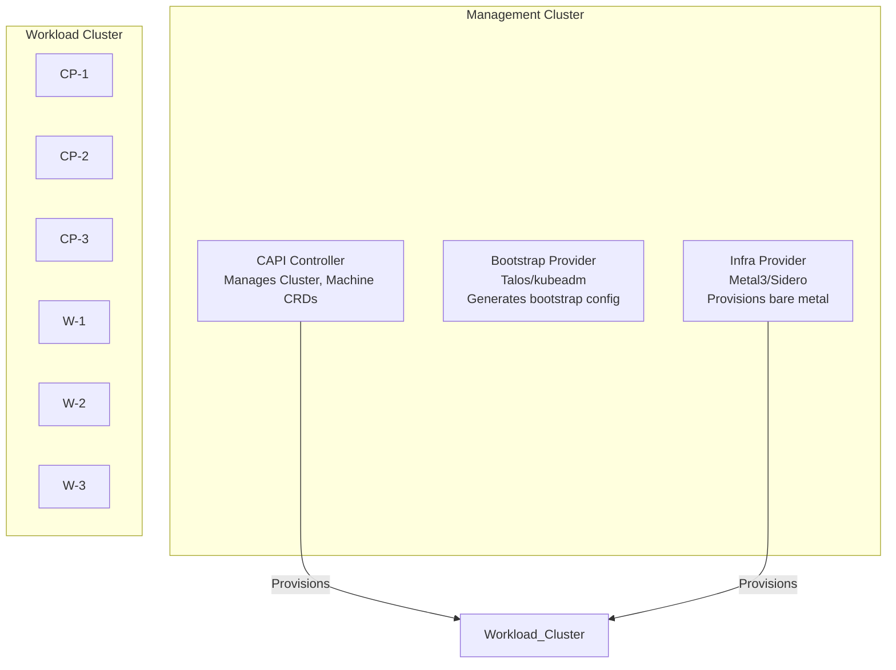
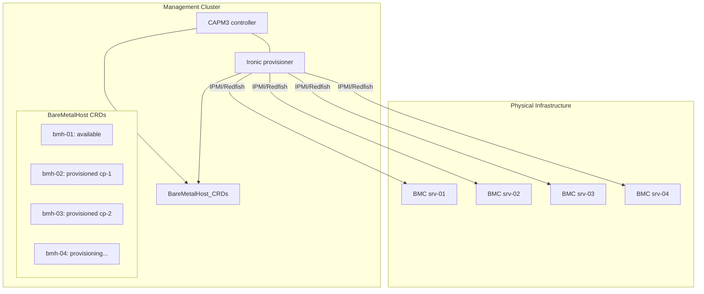
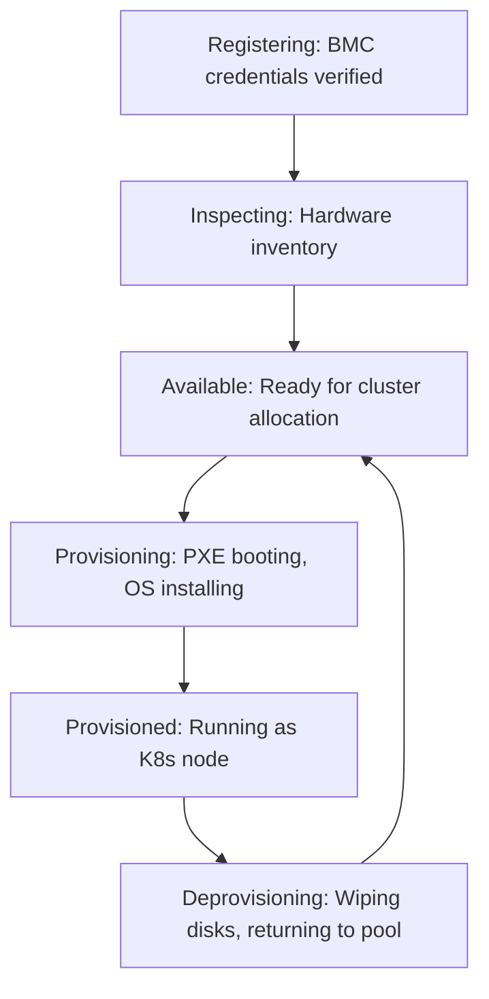
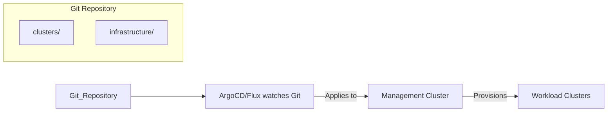

> **Complexity**: `[COMPLEX]` | Time: 60 minutes
>
> **Prerequisites**: [Module 2.3: Immutable OS](../module-2.3-immutable-os/), [Cluster API](/platform/toolkits/infrastructure-networking/platforms/module-3.5-cluster-api/)

## What You'll Be Able to Do

After completing this module, you will be able to:

1. **Implement** Cluster API with Metal3 or Sidero providers to declaratively provision bare-metal Kubernetes clusters from scratch.
2. **Design** a bare-metal host inventory with BMC credentials, hardware profiles, and network templates that integrates seamlessly with your GitOps pipelines.
3. **Evaluate** multi-cluster architectural designs and implement robust deployment patterns using `kubectl apply` with version-controlled YAML manifests.
4. **Diagnose** node provisioning failures in real time and establish automated remediation via MachineHealthChecks.
5. **Compare** and contrast the architectural tradeoffs between CAPM3 (Metal3) and alternative infrastructure providers in highly regulated bare-metal environments.

## Why This Module Matters

The *Infrastructure as Code* module’s Knight Capital 2012 <!-- incident-xref: knight-capital-2012 --> reference is the canonical illustration of why bare-metal and cluster onboarding must be declarative: a single node out of sync can still collapse the reliability of a broader estate.

Modern infrastructure relies on consistency. A financial services company managing multiple Kubernetes clusters across two datacenters using procedural configuration management and shell scripts faces similar risks. Traditionally, it took days to spin up a single cluster: time spent finding servers in an outdated spreadsheet, executing manual PXE boots, running installation binaries, and verifying networking. Decommissioning was equally dangerous, as engineers hesitated to wipe disks without absolute certainty about the server's state, leading to massive resource waste and security vulnerabilities. Every manual step in a provisioning pipeline introduces the potential for human error, turning what should be a deterministic process into a game of chance.

Cluster API fundamentally changes this narrative. By extending Kubernetes to manage its own infrastructure, you can define a physical server cluster in YAML, apply it, and the system provisions hardware, installs the OS, bootstraps Kubernetes, and joins nodes—all declaratively, auditable, and fully version-controlled in Git. No manual steps. No spreadsheets. No single point of failure during deployment. By shifting from imperative scripts to declarative state, you eliminate the configuration drift class of outages at scale.

> **The Vending Machine Analogy**
>
> Provisioning bare metal manually is like assembling a custom sandwich in a busy deli: you give step-by-step instructions to multiple people, and any miscommunication ruins the order. Cluster API makes bare-metal provisioning like a modern vending machine. You punch in your selection (YAML definition), insert your payment (BMC credentials), and the machine reliably dispenses exactly what you asked for, fully assembled and ready to consume.

## The Core Architecture of Cluster API

Cluster API is a Kubernetes sub-project that provides declarative APIs and tooling to simplify provisioning, upgrading, and operating Kubernetes clusters. Cluster API was started by Kubernetes SIG Cluster Lifecycle and remains a SIG Cluster Lifecycle project. It introduces a paradigm shift by utilizing Kubernetes itself to manage the infrastructure that runs Kubernetes.

At its heart, Cluster API utilizes a "management cluster" to oversee the lifecycle of one or more "workload clusters." The management cluster runs specific controllers—such as the core provider, the bootstrap provider, and the infrastructure provider—that read custom resources to enforce the desired state of downstream clusters. This separation of concerns ensures that the lifecycle of the infrastructure is strictly managed by dedicated operators, allowing workload clusters to remain lightweight and focused entirely on running application workloads.



### Key Custom Resource Definitions

To understand how the declarative model functions, you must understand the primary Custom Resource Definitions (CRDs) that represent the infrastructure. These objects are deeply integrated into the management cluster's etcd database and are continuously reconciled by the Cluster API controllers.

| CRD | Purpose |
|-----|---------|
| `Cluster` | Defines a K8s cluster (name, version, networking) |
| `Machine` | Represents a single node (control plane or worker) |
| `MachineDeployment` | Manages a set of worker machines (like a Deployment for pods) |
| `MachineHealthCheck` | Auto-remediation for unhealthy nodes |
| `BareMetalHost` (Metal3) | Represents a physical server |
| `ServerClass` (Sidero) | Groups servers by hardware capabilities |

The core provider establishes the fundamental abstractions (like Machine and Cluster) required by all other controllers. When initializing an environment using the `clusterctl init` command, Cluster API automatically installs the core provider, kubeadm bootstrap provider, and kubeadm control-plane provider unless those providers are explicitly controlled by flags. Furthermore, `clusterctl init` always installs the latest available provider versions for explicitly selected providers, and does not install pre-release provider versions unless requested by tag.

When bootstrapping an environment, operators sometimes wonder if they can bypass certain components to save resources or memory. Cluster API does not support skipping the core provider install from `clusterctl init`; skipping is only available for bootstrap/control-plane with `-` placeholders. The core controller is the absolute foundation of the ecosystem, as it is responsible for the top-level orchestration of the cluster lifecycle.

## Metal3 (CAPM3) Infrastructure and Ecosystem

CAPM3 is a Cluster API infrastructure provider that enables deploying Kubernetes clusters on bare-metal via Metal3. By leveraging out-of-band management protocols, CAPM3 bridges the gap between cloud-native declarative logic and physical, tangible hardware. It effectively acts as the translation layer between Kubernetes API requests and the physical signals required to boot, wipe, and configure actual datacenter hardware.

Metal3 requires physical machines with BMC access (e.g., Redfish/iDRAC/IPMI), an Ironic instance, and a Kubernetes management cluster (Kind is acceptable for development). A Metal3/Cluster API environment maps user-facing Kubernetes workload infrastructure to `Metal3Machine` and `BareMetalHost` objects, with BMO exposing Ironic capabilities via `BareMetalHost` CRDs.



> **Pause and predict**: In the traditional workflow described in the war story above, creating a cluster took 3 days and involved a shared spreadsheet. With Cluster API, you define a cluster in YAML and `kubectl apply` it. What are the prerequisites that must be in place before this "kubectl apply" can actually provision physical servers? List at least three infrastructure components.

### Decoupled Components and Installation Flow

Architectural shifts in the Metal3 project have refined how the components interact. Starting from CAPM3 release version 0.5.0, Baremetal Operator is decoupled from CAPM3 `clusterctl` deployment, so CAPM3 init must be accompanied by separate BMO/Ironic installation. 

To ensure a stable foundation, CAPM3 installation docs show example pinned versions and recommend a dependency flow: install clusterctl, kustomize, Ironic, Baremetal Operator, then core/bootstrap/control-plane providers before `clusterctl init --infrastructure metal3`. Establishing this exact order guarantees that the Ironic backend is actively listening before the controllers attempt to reconcile physical hosts. Failing to adhere to this order can result in reconciliation loops timing out or controllers entering a crash loop because their necessary physical backends are unreachable.

### BareMetalHost Definition

The `BareMetalHost` CRD is how Metal3 identifies physical servers. By abstracting the server's MAC addresses and Baseboard Management Controller specifications into a manifest, operators can track their physical inventory within etcd. This resource provides a centralized, universally accessible inventory of all available physical resources within the environment. Below are the separate manifests required to define a host and its secure BMC credentials.

```yaml
apiVersion: metal3.io/v1alpha1
kind: BareMetalHost
metadata:
  name: server-01
  namespace: metal3
spec:
  online: true
  bootMACAddress: "aa:bb:cc:dd:ee:01"
  bmc:
    address: ipmi://10.0.100.10
    credentialsName: server-01-bmc-credentials
  rootDeviceHints:
    deviceName: /dev/sda
  # Hardware profile auto-detected during inspection
```

To securely authenticate against the BMC, you must provide a Kubernetes Secret. This completely eliminates hardcoded plaintext passwords in configuration management scripts, allowing security teams to enforce strict rotation policies on physical hardware access.

```yaml
apiVersion: v1
kind: Secret
metadata:
  name: server-01-bmc-credentials
  namespace: metal3
type: Opaque
data:
  username: YWRtaW4=  # admin
  password: cGFzc3dvcmQ=  # password
```

### Machine Lifecycle States

The lifecycle of a bare-metal node is distinctly more complex than a cloud virtual machine. The provider must authenticate, boot the server using an ephemeral operating system in memory, inspect its hardware components, and properly format physical disks before finally provisioning the target operating system.



When a node enters the Deprovisioning state, Metal3 can securely erase the disks, ensuring that sensitive data is destroyed before the physical server is returned to the available pool for the next tenant. This stage is crucial in multi-tenant bare-metal environments to prevent cross-contamination of proprietary data.

## Sidero: Talos-Native Bare Metal

While Metal3 offers immense flexibility across different operating systems, Sidero is an alternative bare metal provider natively integrated with Talos Linux, optimizing for an immutable ecosystem. Because Talos is managed entirely via an API rather than an interactive shell, the provisioning process is highly streamlined.

### Sidero vs Metal3 Tradeoffs

| Feature | Metal3 (CAPM3) | Sidero |
|---------|---------------|--------|
| OS support | Any (Ubuntu, Flatcar, etc.) | Talos Linux only |
| Provisioner | Ironic (complex, OpenStack heritage) | Built-in (simpler) |
| BMC protocol | IPMI, Redfish, iDRAC, iLO | IPMI, Redfish |
| Server discovery | Manual BareMetalHost CRDs | Auto-discovery via DHCP |
| Image delivery | Ironic Python Agent (IPA) | Talos PXE image |
| Complexity | Higher (Ironic is a large system) | Lower (fewer moving parts) |
| Maturity | Older, more tested | Newer, less battle-tested |
| Best for | Multi-OS environments | Talos-only environments |

### Sidero Server Discovery

Unlike CAPM3, where nodes must be manually registered with explicit BMC credentials upfront, Sidero heavily utilizes DHCP-based automated discovery. When a physical server is connected to the network and PXE booted, Sidero identifies it and automatically registers it as a resource. This significantly accelerates the onboarding of large racks of new hardware.

```bash
# Sidero auto-discovers servers when they PXE boot
# Servers appear as Server CRDs automatically

# Check discovered servers
kubectl get servers -n sidero-system
# NAME                                   HOSTNAME      BMC              ACCEPTED
# 00000000-0000-0000-0000-aabbccddeef1   server-01     10.0.100.10     false
# 00000000-0000-0000-0000-aabbccddeef2   server-02     10.0.100.11     false

# Accept a server into the pool
kubectl patch server 00000000-0000-0000-0000-aabbccddeef1 \
  --type merge -p '{"spec":{"accepted": true}}'
```

Once accepted, operators can group hardware based on physical capabilities using the ServerClass resource. This allows the cluster API logic to dynamically select appropriately sized hardware for different node roles.

```yaml
# Group servers by capability
apiVersion: metal.sidero.dev/v1alpha2
kind: ServerClass
metadata:
  name: worker-large
spec:
  qualifiers:
    cpu:
      - manufacturer: "AMD"
        version: "EPYC.*"
    systemInformation:
      - manufacturer: "Dell Inc."
  selector:
    matchLabels:
      rack: "rack-a"
```

## Designing the Declarative Cluster

Cluster declarations consist of several interoperable resources linking the requested abstraction with the hardware templates. Due to their length and complexity, they are cleanly separated into dedicated functional definitions. The true power of this architecture lies in combining these atomic resources to fully describe the entire cluster lifecycle.

First, you define the core cluster networking and references to the control plane and infrastructure backends. This definition establishes the fundamental parameters of the environment, such as pod CIDR blocks and the names of the associated infrastructure providers.

```yaml
# Define the workload cluster
apiVersion: cluster.x-k8s.io/v1beta1
kind: Cluster
metadata:
  name: production
  namespace: default
spec:
  clusterNetwork:
    pods:
      cidrBlocks: ["10.244.0.0/16"]
    services:
      cidrBlocks: ["10.96.0.0/12"]
  controlPlaneRef:
    apiVersion: controlplane.cluster.x-k8s.io/v1alpha3
    kind: TalosControlPlane
    name: production-cp
  infrastructureRef:
    apiVersion: infrastructure.cluster.x-k8s.io/v1alpha3
    kind: MetalCluster
    name: production
```

Next, the control plane is defined. This dictates the number of replicas and the precise version of Kubernetes that will be deployed. By adjusting the replica count here, the controllers will automatically provision additional physical servers to host the new control plane instances.

```yaml
# Control plane (3 nodes from 'control-plane' server class)
apiVersion: controlplane.cluster.x-k8s.io/v1alpha3
kind: TalosControlPlane
metadata:
  name: production-cp
spec:
  replicas: 3
  version: v1.35.0
  infrastructureTemplate:
    apiVersion: infrastructure.cluster.x-k8s.io/v1alpha3
    kind: MetalMachineTemplate
    name: production-cp
  controlPlaneConfig:
    controlplane:
      generateType: controlplane
```

Worker nodes are defined via a `MachineDeployment`, which mirrors the behavior of a standard Kubernetes `Deployment` but operates on physical servers instead of Pods. This enables rolling updates of entire physical nodes simply by changing the version field.

```yaml
# Worker machines (5 nodes from 'worker-large' server class)
apiVersion: cluster.x-k8s.io/v1beta1
kind: MachineDeployment
metadata:
  name: production-workers
spec:
  replicas: 5
  clusterName: production
  selector:
    matchLabels:
      cluster.x-k8s.io/cluster-name: production
  template:
    metadata:
      labels:
        cluster.x-k8s.io/cluster-name: production
    spec:
      clusterName: production
      version: v1.35.0
      bootstrap:
        configRef:
          apiVersion: bootstrap.cluster.x-k8s.io/v1alpha3
          kind: TalosConfigTemplate
          name: production-workers
      infrastructureRef:
        apiVersion: infrastructure.cluster.x-k8s.io/v1alpha3
        kind: MetalMachineTemplate
        name: production-workers
```

Finally, the infrastructure templates link the logical machine requests to the specific server classes in your datacenter. This decouples the Kubernetes logic from the specific hardware layout, enabling highly reusable templates across multiple distinct datacenters.

```yaml
apiVersion: infrastructure.cluster.x-k8s.io/v1alpha3
kind: MetalMachineTemplate
metadata:
  name: production-workers
spec:
  template:
    spec:
      serverClassRef:
        apiVersion: metal.sidero.dev/v1alpha2
        kind: ServerClass
        name: worker-large
```

Deploying this architecture requires merely applying the manifests and monitoring the rollout. The controllers immediately begin authenticating with physical servers, initiating PXE boots, and securely provisioning the operating system.

```bash
# Apply the cluster definition
kubectl apply -f production-cluster.yaml

# Watch the provisioning
kubectl get machines -w
# NAME                          PHASE
# production-cp-abc12           Provisioning
# production-cp-def34           Pending
# production-cp-ghi56           Pending
# production-workers-jkl78      Pending
# ...

# After ~10-15 minutes:
# production-cp-abc12           Running
# production-cp-def34           Running
# production-cp-ghi56           Running
# production-workers-jkl78      Running
# production-workers-mno90      Running

# Get the workload cluster kubeconfig
kubectl get secret production-kubeconfig -o jsonpath='{.data.value}' | base64 -d > production.kubeconfig
kubectl --kubeconfig production.kubeconfig get nodes
```

> **Stop and think**: A worker node's NVMe drive fails at 3 AM. With the traditional approach, an on-call engineer gets paged, SSH's into the node, cordons it, drains pods, and files a hardware ticket. With MachineHealthCheck below, what happens instead? What is still a manual step even with full automation?

## Automated Remediation and Machine Health

One of the most powerful features of Cluster API is the ability to automatically remediate failed nodes by replacing them with fresh hardware from the pool. This drastically reduces the mean time to recovery (MTTR) during hardware failures. The `MachineHealthCheck` resource monitors the status of individual machines and aggressively evicts and replaces nodes that fall out of compliance.

```yaml
apiVersion: cluster.x-k8s.io/v1beta1
kind: MachineHealthCheck
metadata:
  name: production-worker-health
spec:
  clusterName: production
  selector:
    matchLabels:
      cluster.x-k8s.io/deployment-name: production-workers
  unhealthyConditions:
    - type: Ready
      status: "False"
      timeout: 5m
    - type: Ready
      status: Unknown
      timeout: 5m
  maxUnhealthy: "40%"  # Don't remediate if >40% are unhealthy (likely a systemic issue)
  nodeStartupTimeout: 10m
```

### Diagnosing Provisioning Failures

Before automated remediation kicks in, you may need to diagnose provisioning failures in real time. You can monitor the rollout by watching the `Machine` status phases (`kubectl get machines`). If a machine is stuck in the `Provisioning` phase for an extended period, inspect the underlying `BareMetalHost` conditions using `kubectl describe baremetalhost <name> -n <namespace>`. Common issues like invalid BMC credentials or PXE boot timeouts will surface as detailed error messages in the host's event log, allowing you to troubleshoot the out-of-band management network directly.

When a node is unhealthy for over 5 minutes, CAPI marks the Machine for deletion. The infrastructure provider deprovisions the bare metal host (securely wiping the disk if configured) and immediately requests a new Machine. The new node provisions on healthy, available hardware and joins the cluster automatically, restoring scale before the engineer even wakes up. The `maxUnhealthy` circuit breaker ensures that a network partition doesn't trigger a mass deprovisioning event. If a top-of-rack switch goes offline and 50% of your nodes appear unhealthy, the circuit breaker halts automated remediation to prevent accidentally destroying healthy nodes.

> **Pause and predict**: Your team manages 5 Kubernetes clusters across 2 datacenters. Currently, cluster changes are made by running `kubectl` commands manually. What specific risks does this create, and how does the GitOps approach below eliminate each one?

## Multi-Cluster GitOps and State Pivoting

By treating infrastructure as code, operators manage bare-metal deployments exactly like application deployments. The Git repository acts as the sole source of truth, establishing an auditable ledger of all bare-metal additions, modifications, and deletions. This approach is paramount for maintaining compliance in highly regulated industries.

```text
Git Repository
├── clusters/
│   ├── production/
│   │   ├── cluster.yaml        (Cluster definition)
│   │   ├── control-plane.yaml  (TalosControlPlane)
│   │   ├── workers.yaml        (MachineDeployment)
│   │   └── health-checks.yaml  (MachineHealthCheck)
│   ├── staging/
│   └── dev/
└── infrastructure/
    ├── servers.yaml            (BareMetalHost inventory)
    └── server-classes.yaml     (ServerClass definitions)
```



To create a cluster, simply author the declarative manifests and commit them. To upgrade the operating system, bump the version in Git. Flux or ArgoCD applies the change to the Management Cluster, and Cluster API safely cascades the upgrade across physical machines. All infrastructure changes are peer-reviewed as pull requests, completely eliminating rogue manual modifications.

### Pivoting Management State

A critical operational requirement is transferring the management of workload clusters from a temporary bootstrap cluster (like Kind) to a persistent management cluster, or migrating between datacenters. This is known as "pivoting." The pivot process requires carefully transferring the active CRDs from one cluster to another without disrupting the underlying workloads.

The `clusterctl move` command is for moving workload Cluster API objects between management clusters and requires source/target provider compatibility; status subresources are not restored. Because the status fields are ephemeral state maintained by active controllers, they are deliberately excluded and subsequently rebuilt by the newly activated target controllers once the move is complete.

In move operations, objects outside the default discovery graph move only when labeled for move (e.g., `clusterctl.cluster.x-k8s.io/move` or `.../move-hierarchy`) or otherwise linked by discovery rules. For CAPM3-specific pivoting, the CAPM3 docs state that moving non-standard CRDs/objects (e.g., `BareMetalHost`) requires explicit labeling so `clusterctl move` includes them. Failing to label your physical host definitions will result in orphaned hardware that the new management cluster cannot see or control, requiring manual recovery.

## Release Support and Version Matrices

Maintaining a fleet of bare-metal clusters requires rigorous adherence to version compatibility matrices. Cluster API documents a multi-provider release-support policy: support and lifecycle decisions are based on tracked releases rather than implicit long-term retention. Operators must continuously plan upgrades to avoid falling out of the supported window.

As documented, Cluster API maintained versions include a release timeline where N and N-1 are active, N-2 may be kept for emergency maintenance, with explicit EOL/maintenance dates per minor release. It applies Kubernetes-version compatibility rules with release-dependent matrices. For example, as of the version 1.13 pre-release documentation, Kubernetes support for management clusters is version 1.31.x–1.35.x and workload clusters are version 1.29.x–1.35.x.

CAPM3 versioning also enforces strict boundaries. CAPM3 release compatibility includes a release 1.12.X line: CAPM3 API `v1beta1`, Cluster API contract `v1beta2`, and CAPI release 1.12.X. API versions and deprecations are strictly staged across the ecosystem: v1alpha3 and v1alpha4 are not served, v1beta1 is deprecated, and will be unserved in the version 1.14 line. Attempting to deploy an unsupported CRD version against an upgraded controller will result in immediate rejection by the API server.

When performing upgrades, changing the version initiates a carefully orchestrated rollout. Cluster API version 1.12 introduced in-place updates and chained upgrades, including an update-extension model for in-place machine changes, drastically reducing the overhead of completely rebuilding bare-metal nodes for minor configuration tweaks. This innovation dramatically speeds up the delivery of minor configuration changes across massive hardware fleets.

```yaml
   # TalosControlPlane — version is at spec.version
   spec:
     version: v1.35.0  # was v1.34.0

   # MachineDeployment — version is at spec.template.spec.version
   spec:
     template:
       spec:
         version: v1.35.0  # was v1.34.0
   ```

## Did You Know?

1. See the Knight Capital 2012 <!-- incident-xref: knight-capital-2012 --> reference in *Infrastructure as Code* for the canonical bare-metal-level lesson on why fleet consistency has to be declarative.
2. The Metal3 project was officially accepted into the CNCF sandbox on 2020-09-08 and officially promoted to CNCF incubation status on 2025-08-14. Metal3 stands for "Metal Kubed" (Metal^3). It was created by Red Hat and is the bare metal infrastructure provider used by OpenShift's Assisted Installer for on-premises deployments.
3. Cluster API release 1.12.0 fundamentally changed node lifecycle management by officially introducing in-place updates and chained upgrades.
4. As of the version 1.13.0 pre-release, Cluster API officially supports Kubernetes workload clusters running versions 1.29.x through 1.35.x.
5. Cluster API was created by Kubernetes SIG Cluster Lifecycle specifically because every cloud provider had built their own incompatible cluster management tooling. CAPI provides a single API that works across AWS, Azure, GCP, vSphere, and bare metal.
6. Sidero was created by the same team that built Talos Linux (Sidero Labs). The name comes from the Greek word for "iron" — fitting for bare metal management.
7. The largest known Cluster API deployment manages over 4,000 clusters across multiple infrastructure providers. Organizations like Deutsche Telekom and SAP use CAPI to manage their multi-cluster Kubernetes platforms at enterprise scale.

## Common Mistakes

| Mistake | Problem | Solution |
|---------|---------|----------|
| No management cluster HA | Management cluster dies = cannot manage anything | Run 3-node HA management cluster with etcd backup |
| BMC credentials in plain text | Security risk | Use Kubernetes secrets + external secrets operator |
| No server pool buffer | MachineHealthCheck tries to replace but no servers available | Maintain 2-3 spare servers in the pool |
| Skipping hardware inspection | Deploying on servers with failed RAM or disks | Always let CAPI inspect hardware before marking available |
| No disk wipe on deprovision | Previous tenant's data visible to next | Enable secure erase in Metal3/Sidero deprovisioning |
| Single management cluster | Management cluster failure = total loss of control | Backup management cluster state; consider multi-site mgmt |
| Not using GitOps | Cluster definitions are imperative and unauditable | Store all CAPI YAMLs in Git; deploy via ArgoCD/Flux |

## Hands-On Exercise: Cluster API with Docker (Simulation)

**Task**: Use Cluster API with the Docker provider to simulate the bare metal workflow. The Docker provider is CAPI's testing/development provider. It creates "machines" as Docker containers. The workflow is identical to bare metal — only the infrastructure layer differs.

```bash
# Install clusterctl
curl -L https://github.com/kubernetes-sigs/cluster-api/releases/latest/download/clusterctl-linux-amd64 -o clusterctl
chmod +x clusterctl && sudo mv clusterctl /usr/local/bin/

# Create a kind cluster as the management cluster
kind create cluster --name capi-mgmt

# Initialize CAPI with Docker provider
clusterctl init --infrastructure docker

# Generate a workload cluster manifest
clusterctl generate cluster demo-cluster \
  --infrastructure docker \
  --kubernetes-version v1.35.0 \
  --control-plane-machine-count 1 \
  --worker-machine-count 2 \
  > demo-cluster.yaml

# Apply the cluster definition
kubectl apply -f demo-cluster.yaml

# Wait for control plane to be provisioned (this may take a few minutes)
kubectl wait --for=condition=ControlPlaneReady cluster/demo-cluster --timeout=10m
kubectl get machines

# Get the workload cluster kubeconfig
clusterctl get kubeconfig demo-cluster > demo.kubeconfig

# Verify the workload cluster
kubectl --kubeconfig demo.kubeconfig get nodes

# Scale workers
kubectl patch machinedeployment demo-cluster-md-0 \
  --type merge -p '{"spec":{"replicas": 4}}'

# Check the status of new machines
kubectl get machines

# Cleanup
kubectl delete cluster demo-cluster
kind delete cluster --name capi-mgmt
```

### Success Criteria
- [ ] Management cluster created (kind)
- [ ] CAPI initialized with Docker provider
- [ ] Workload cluster provisioned (1 CP + 2 workers)
- [ ] kubeconfig retrieved and connection established to workload cluster
- [ ] Workers scaled from 2 to 4
- [ ] Cluster deleted cleanly (all machines deprovisioned)

## Quiz

### Question 1
Your datacenter experiences a partial power failure that takes down the entire 3-node HA management cluster. However, the physical servers hosting your production workload clusters remain online. What happens to the applications running on the workload clusters, and what operational capabilities are lost while the management cluster is down?

<details>
<summary>Answer</summary>

**Yes, workload clusters continue to function normally.** The management cluster strictly oversees the declarative lifecycle (creation, scaling, upgrades, health checks) of the workload clusters, acting as an external orchestrator. Once a workload cluster is fully provisioned, its control plane, worker nodes, and workloads operate entirely independently of the management cluster. However, during the outage, you lose the ability to scale nodes, trigger Kubernetes upgrades, or rely on `MachineHealthCheck` auto-remediation, meaning any hardware failures in the workload clusters will require manual intervention until the management cluster is restored. For this reason, it is typically advised to run the management cluster in a highly available configuration with regular etcd backups.
</details>

### Question 2
A new security vulnerability requires you to urgently upgrade your 50-node bare-metal production cluster from Kubernetes v1.34.0 to v1.35.0. You are using Cluster API with a GitOps workflow. Describe the exact mechanism by which Cluster API rolls out this upgrade across the physical servers without causing application downtime.

<details>
<summary>Answer</summary>

**Rolling upgrade via CAPI is managed identically to a Pod Deployment rollout.** First, you update the `version` field (e.g., to `v1.35.0`) in your Git repository for the `TalosControlPlane` and `MachineDeployment` manifests, which ArgoCD or Flux applies to the management cluster. CAPI's controllers detect this version change and initiate a rolling update by provisioning a new physical machine with the updated version. Once the new machine joins the cluster and reports a `Ready` status, CAPI gracefully cordons and drains an old machine, deletes its `Machine` object, and allows the infrastructure provider to securely wipe and return the old server to the hardware pool. This process repeats—upgrading the control plane first, then the workers—ensuring that application workloads are seamlessly rescheduled without downtime, provided there is enough buffer capacity in your physical server pool.
</details>

### Question 3
Your organization is designing a new edge computing platform. Team A wants to use standard Ubuntu with various custom kernel modules, while Team B insists on a minimal, immutable OS like Talos Linux to reduce the attack surface. Based on these OS preferences, how would you decide between Metal3 and Sidero for your Cluster API infrastructure provider, and what are the architectural tradeoffs?

<details>
<summary>Answer</summary>

**Your choice between Metal3 and Sidero hinges entirely on your operating system strategy and desired operational complexity.** If Team A's requirement for standard Ubuntu and custom kernel modules prevails, you must choose Metal3. Metal3 utilizes Ironic under the hood, making it highly capable of PXE booting and provisioning a wide variety of traditional operating systems, though it introduces a more complex architectural footprint. Conversely, if Team B's vision for an immutable, minimal OS wins, Sidero is the optimal choice because it is purpose-built exclusively for Talos Linux. Sidero eliminates the heavy Ironic dependency, utilizing native DHCP-based auto-discovery to rapidly onboard hardware, resulting in a significantly simpler and more streamlined management stack tailored for immutable environments.
</details>

### Question 4
At 2:00 AM on a Sunday, a worker node in your bare-metal production cluster experiences a catastrophic NVMe drive failure, causing its kubelet to stop responding entirely. Walk through the automated sequence of events triggered by the MachineHealthCheck and explain what manual steps, if any, remain for the operations team on Monday morning.

<details>
<summary>Answer</summary>

**The remediation is fully automated by the MachineHealthCheck controller, dramatically reducing downtime.** When the NVMe drive fails, the node's kubelet stops reporting, causing its status to eventually become `NotReady` or `Unknown`. The `MachineHealthCheck` constantly monitors these conditions; once the timeout threshold (e.g., 5 minutes) is breached, CAPI automatically marks the broken `Machine` for deletion. The infrastructure provider then forcefully deprovisions the server, effectively quarantining it from the available pool, while CAPI simultaneously provisions a brand-new `Machine` on a healthy standby server. By Monday morning, the cluster has already healed itself and restored full capacity, leaving the operations team with only the manual tasks of physically replacing the failed drive, verifying the hardware, and registering the repaired server back into the available bare-metal pool.
</details>

### Question 5
Your team is building a custom management cluster and runs `clusterctl init` without any additional flags. During a subsequent audit, you discover that the kubeadm bootstrap and control-plane providers are actively running, even though your architectural design specified a custom bootstrap provider. Why did this happen, and what specific change to the initialization command would have prevented it?

<details>
<summary>Answer</summary>

**This occurred because `clusterctl init` provisions a default set of providers unless explicitly overridden.** By design, when you execute `clusterctl init` without any flags, the tool automatically fetches and installs the latest versions of the core provider, the kubeadm bootstrap provider, and the kubeadm control-plane provider to ensure a functional baseline. Because your architecture required a custom bootstrap mechanism, the initialization command should have included specific flags or `-` placeholders to bypass the default kubeadm components. To prevent this, you must explicitly declare your custom providers in the command (e.g., `--bootstrap custom-provider`) so that clusterctl bypasses its default selections and aligns with your intended architectural design.
</details>

### Question 6
Your team is migrating a bare-metal workload cluster to a new management cluster in a different datacenter. You execute `clusterctl move` to pivot the state. Afterward, the target management cluster successfully reports the status of `Cluster` and `Machine` objects, but it is completely unable to see or control the underlying physical servers (e.g., `BareMetalHost` objects). What critical step was missed during the pivot preparation, and why is it necessary?

<details>
<summary>Answer</summary>

**The physical hosts were not explicitly labeled for the move operation before the pivot was initiated.** When executing `clusterctl move`, the command safely transfers standard Cluster API resources by following a default discovery graph. However, objects that reside outside this default graph—such as CAPM3's specific `BareMetalHost` CRDs—are ignored unless they are explicitly tagged. You must apply the `clusterctl.cluster.x-k8s.io/move` label (or a similar hierarchy label) to these non-standard objects so that the move command recognizes their association with the cluster. Failing to do so leaves the physical infrastructure definitions behind on the source cluster, resulting in orphaned hardware that the target management cluster cannot see or manage.
</details>

### Question 7
You have just completed a `clusterctl move` operation to pivot management state to a newly built management cluster. A junior engineer panics and alerts you that all `Machine` and `Cluster` objects on the new management cluster show completely empty status fields, fearing that the physical nodes have lost their state and might be rebooted. How do you explain the architectural reason for this behavior to reassure them that the cluster state is not broken?

<details>
<summary>Answer</summary>

**You can reassure the engineer that this is the expected, safe behavior of a pivot operation and the cluster state is completely intact.** The `clusterctl move` command is specifically designed to transfer the declarative definitions (the `spec` fields) of your workload clusters to the new management cluster. However, the `status` subresources are intentionally not restored because they represent ephemeral, point-in-time state maintained exclusively by active controllers. Once the move is complete and the new management cluster's controllers begin their first reconciliation loop, they will independently observe the workload cluster, verify the physical infrastructure, and automatically rebuild the status fields. The physical nodes and their workloads remain entirely unaffected during this controller handoff.
</details>

### Question 8
To optimize resource utilization on a highly constrained edge management cluster, a platform engineer proposes modifying the `clusterctl init` command to skip the core provider installation, arguing that only the infrastructure and bootstrap providers are strictly necessary. Based on Cluster API's architecture, will this proposed optimization work? Explain the technical role of the core provider to justify your answer.

<details>
<summary>Answer</summary>

**No, this proposed optimization will completely break the management cluster because the core provider is mandatory.** Cluster API fundamentally relies on the core provider to establish and manage the foundational Custom Resource Definitions, such as `Cluster` and `Machine`, which all other providers depend upon. While it is possible to skip the installation of bootstrap and control-plane providers using `-` placeholders during `clusterctl init`, the tool does not support skipping the core provider. Without the core controller orchestrating the top-level lifecycle logic and reconciling these primary objects, the infrastructure and bootstrap providers would have no abstract state to act upon, rendering the entire Cluster API deployment non-functional.
</details>

## Next Module

Continue to [Module 3.1: Datacenter Network Architecture](/on-premises/networking/module-3.1-datacenter-networking/) to learn about spine-leaf topology, VLANs, and network design for on-premises Kubernetes.
