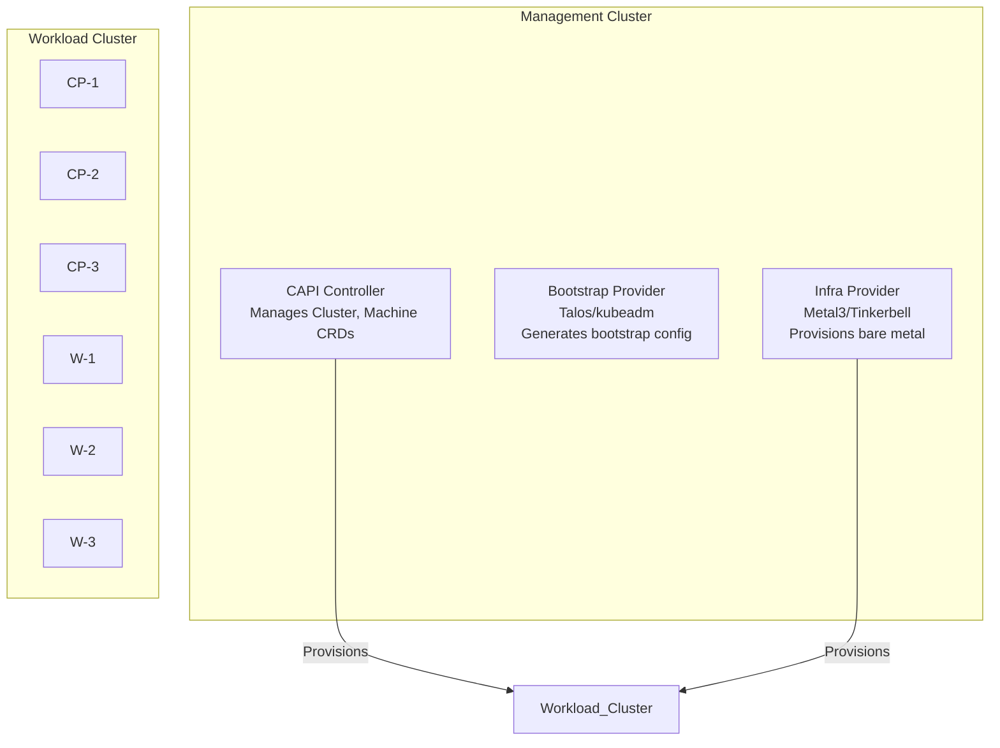
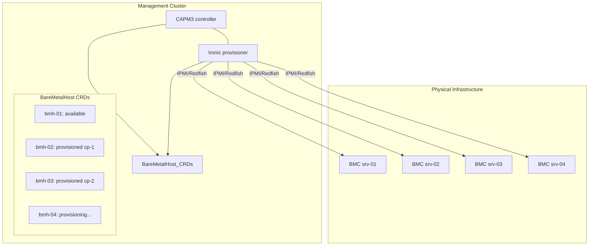
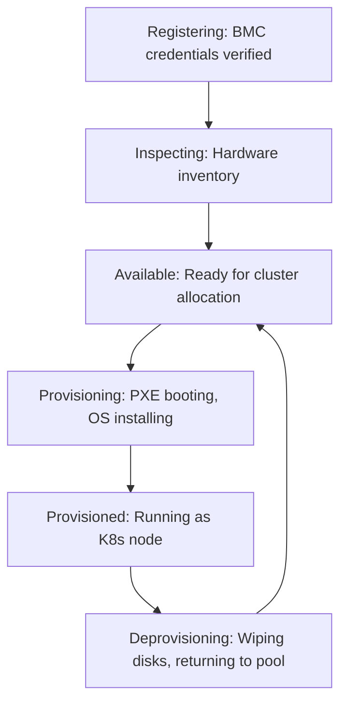
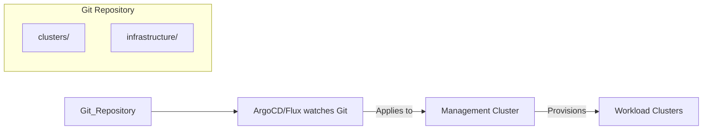
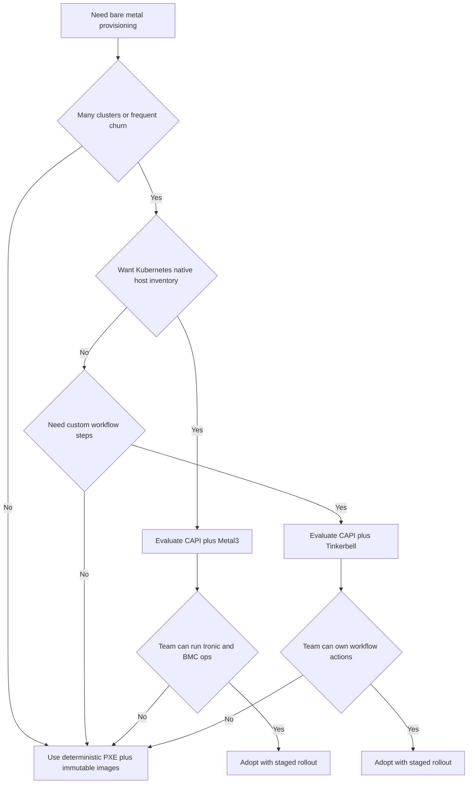

> **Complexity**: `[COMPLEX]` | Time: 60 minutes
>
> **Prerequisites**: [Module 2.3: Immutable OS](../module-2.3-immutable-os/), [Cluster API](/platform/toolkits/infrastructure-networking/platforms/module-3.5-cluster-api/)

## What You'll Be Able to Do

After completing this module, you will be able to:

1. **Implement** Cluster API with Metal3 or Tinkerbell providers to declaratively provision bare-metal Kubernetes clusters from scratch.
2. **Design** a bare-metal host inventory with BMC credentials, hardware profiles, and network templates that integrates seamlessly with your GitOps pipelines.
3. **Evaluate** multi-cluster architectural designs and implement robust deployment patterns using `kubectl apply` with version-controlled YAML manifests.
4. **Diagnose** node provisioning failures in real time and establish automated remediation via MachineHealthChecks.
5. **Compare** and contrast the architectural tradeoffs between CAPM3 (Metal3), Cluster API Provider Tinkerbell, and simpler PXE pipelines in highly regulated bare-metal environments.

## Why This Module Matters

The *Infrastructure as Code* module’s Knight Capital 2012 <!-- incident-xref: knight-capital-2012 --> reference is the canonical illustration of why bare-metal and cluster onboarding must be declarative: a single node out of sync can still collapse the reliability of a broader estate.

Modern infrastructure relies on consistency. A financial services company managing multiple Kubernetes clusters across two datacenters using procedural configuration management and shell scripts faces similar risks. Traditionally, it took days to spin up a single cluster: time spent finding servers in an outdated spreadsheet, executing manual PXE boots, running installation binaries, and verifying networking. Decommissioning was equally dangerous, as engineers hesitated to wipe disks without absolute certainty about the server's state, leading to massive resource waste and security vulnerabilities. Every manual step in a provisioning pipeline introduces the potential for human error, turning what should be a deterministic process into a game of chance.

Cluster API fundamentally changes this narrative. By extending Kubernetes to manage its own infrastructure, you can define a physical server cluster in YAML, apply it, and the system provisions hardware, installs the OS, bootstraps Kubernetes, and joins nodes—all declaratively, auditable, and fully version-controlled in Git. No manual steps. No spreadsheets. No single point of failure during deployment. By shifting from imperative scripts to declarative state, you eliminate the configuration drift class of outages at scale.

> **The Vending Machine Analogy**
>
> Provisioning bare metal manually is like assembling a custom sandwich in a busy deli: you give step-by-step instructions to multiple people, and any miscommunication ruins the order. Cluster API makes bare-metal provisioning like a modern vending machine. You punch in your selection (YAML definition), insert your payment (BMC credentials), and the machine reliably dispenses exactly what you asked for, fully assembled and ready to consume.

## The Core Architecture of Cluster API

[Cluster API is a Kubernetes sub-project that provides declarative APIs and tooling to simplify provisioning, upgrading, and operating Kubernetes clusters](https://cluster-api.sigs.k8s.io/). Cluster API was started by Kubernetes SIG Cluster Lifecycle and remains a SIG Cluster Lifecycle project. It introduces a paradigm shift by utilizing Kubernetes itself to manage the infrastructure that runs Kubernetes.

At its heart, [Cluster API utilizes a "management cluster" to oversee the lifecycle of one or more "workload clusters." The management cluster runs specific controllers—such as the core provider, the bootstrap provider, and the infrastructure provider—that read custom resources to enforce the desired state of downstream clusters](https://cluster-api.sigs.k8s.io/user/concepts.html). This separation of concerns ensures that the lifecycle of the infrastructure is strictly managed by dedicated operators, allowing workload clusters to remain lightweight and focused entirely on running application workloads.


```mermaid
graph TD
    subgraph Management Cluster
        CAPI[CAPI Controller<br/>Manages Cluster, Machine CRDs]
        BP[Bootstrap Provider<br/>Talos/kubeadm<br/>Generates bootstrap config]
        IP[Infra Provider<br/>Metal3/Tinkerbell<br/>Provisions bare metal]
    end
    
    subgraph Workload Cluster
        CP1[CP-1]
        CP2[CP-2]
        CP3[CP-3]
        W1[W-1]
        W2[W-2]
        W3[W-3]
    end
    
    CAPI -->|Provisions| Workload_Cluster
    IP -->|Provisions| Workload_Cluster
```

### Key Custom Resource Definitions

To understand how the declarative model functions, you must understand the primary Custom Resource Definitions (CRDs) that represent the infrastructure. These objects are deeply integrated into the management cluster's etcd database and are continuously reconciled by the Cluster API controllers.

| CRD | Purpose |
|-----|---------|
| `Cluster` | Defines a K8s cluster (name, version, networking) |
| `Machine` | Represents a single node (control plane or worker) |
| `MachineDeployment` | Manages a set of worker machines (like a Deployment for pods) |
| `MachineHealthCheck` | Auto-remediation for unhealthy nodes |
| `BareMetalHost` (Metal3) | Represents a physical server |
| `Hardware` / provider inventory (Tinkerbell) | Describes physical machines and workflow targets |

The core provider establishes the fundamental abstractions (like Machine and Cluster) required by all other controllers. When initializing an environment using the [`clusterctl init` command, Cluster API automatically installs the core provider, kubeadm bootstrap provider, and kubeadm control-plane provider unless those providers are explicitly controlled by flags](https://cluster-api.sigs.k8s.io/clusterctl/commands/init.html). Furthermore, `clusterctl init` always installs the latest available provider versions for explicitly selected providers, and does not install pre-release provider versions unless requested by tag.

When bootstrapping an environment, operators sometimes wonder if they can bypass certain components to save resources or memory. Cluster API does not support skipping the core provider install from `clusterctl init`; skipping is only available for bootstrap/control-plane with `-` placeholders. The core controller is the absolute foundation of the ecosystem, as it is responsible for the top-level orchestration of the cluster lifecycle.

The important mental shift is that Cluster API does not make physical servers behave like cloud instances by pretending the hardware is simple. Instead, it splits the problem into portable intent and provider-specific execution. The portable intent is expressed through `Cluster`, `Machine`, `MachineSet`, `MachineDeployment`, and `MachineHealthCheck` resources. The provider-specific execution is expressed through references such as `infrastructureRef` and `bootstrap.configRef`, where Metal3, Tinkerbell, kubeadm, Talos, Ignition, or another provider does the physical work that a cloud provider would normally hide.

That split is why Cluster API is a good fit for GitOps-driven bare metal. A `MachineDeployment` says "keep five worker machines at Kubernetes v1.35.0"; it does not say "send Redfish command X, chain-load iPXE script Y, stream image Z, then run kubeadm join." The infrastructure provider watches the abstract request, chooses a compatible host, performs the out-of-band and boot workflow, writes the operating system or hands off to a bootstrap provider, and reports readiness back to the management cluster. If the server never appears as a Kubernetes `Node`, the failure is visible as resource status and events rather than as a lost terminal transcript.

The chain looks like this:

```text
Git commit
  -> GitOps controller applies CAPI YAML
  -> CAPI reconciles Cluster and MachineDeployment
  -> MachineSet creates Machine objects
  -> infrastructure provider claims physical inventory
  -> BMC power / boot workflow starts
  -> OS image or installer writes the node
  -> bootstrap provider turns the host into a Kubernetes node
  -> Machine status points at the joined Node
```

This is also where Module 2.2 and Module 2.3 join the story. Module 2.2 taught the imperative PXE chain: DHCP, boot loader, installer, first boot, and node join. Module 2.3 taught the immutable operating-system discipline: Talos, Flatcar, RHCOS-style images, atomic updates, and rebuild-not-mutate thinking. This module puts a controller around both ideas. Instead of running a PXE script because a human decided the rack was ready, you let a reconciler compare Git-backed desired state with physical inventory and make the next safe move.

## Metal3 (CAPM3) Infrastructure and Ecosystem

[CAPM3 is a Cluster API infrastructure provider that enables deploying Kubernetes clusters on bare-metal via Metal3](https://github.com/metal3-io/cluster-api-provider-metal3). By leveraging out-of-band management protocols, CAPM3 bridges the gap between cloud-native declarative logic and physical, tangible hardware. It effectively acts as the translation layer between Kubernetes API requests and the physical signals required to boot, wipe, and configure actual datacenter hardware.

Metal3 requires physical machines with BMC access (e.g., Redfish/iDRAC/IPMI), an Ironic instance, and a Kubernetes management cluster (Kind is acceptable for development). A Metal3/Cluster API environment maps user-facing Kubernetes workload infrastructure to `Metal3Machine` and `BareMetalHost` objects, with BMO exposing Ironic capabilities via `BareMetalHost` CRDs.

Metal3 is the more Kubernetes-native face of a proven bare-metal provisioning stack. The Bare Metal Operator keeps a Kubernetes inventory of physical machines, while Ironic does the lower-level work of talking to BMCs, setting boot devices, booting deploy ramdisks, inspecting hardware, cleaning disks, and writing images. Metal3's current docs describe it as a Kubernetes application that uses Kubernetes resources and APIs as its interface, while pairing with standalone Ironic instead of requiring the rest of OpenStack. That matters operationally: your platform team gets a Kubernetes API for inventory and lifecycle, but it still inherits Ironic's broad hardware-driver experience.

The Metal3 project has also matured since early bare-metal experiments. The CNCF project page currently lists Metal3 as an incubating CNCF project, and the current CAPM3 repository shows active release work aligned with recent Cluster API lines. That does not mean "install it casually." It means Metal3 is no longer just a lab curiosity, but it still demands serious ownership of management-cluster availability, BMC network reachability, image hosting, Ironic logs, firmware variance, and version compatibility between Cluster API, CAPM3, Bare Metal Operator, and Ironic.


```mermaid
graph TD
    subgraph Management Cluster
        CAPM3[CAPM3 controller]
        Ironic[Ironic provisioner]
        CAPM3 --- Ironic
        
        subgraph BareMetalHost CRDs
            bmh1[bmh-01: available]
            bmh2[bmh-02: provisioned cp-1]
            bmh3[bmh-03: provisioned cp-2]
            bmh4[bmh-04: provisioning...]
        end
        CAPM3 --> BareMetalHost_CRDs
        Ironic --> BareMetalHost_CRDs
    end
    
    subgraph Physical Infrastructure
        BMC1[BMC srv-01]
        BMC2[BMC srv-02]
        BMC3[BMC srv-03]
        BMC4[BMC srv-04]
    end
    
    Ironic -- "IPMI/Redfish" --> BMC1
    Ironic -- "IPMI/Redfish" --> BMC2
    Ironic -- "IPMI/Redfish" --> BMC3
    Ironic -- "IPMI/Redfish" --> BMC4
```

> **Pause and predict**: In the traditional workflow described in the war story above, creating a cluster took 3 days and involved a shared spreadsheet. With Cluster API, you define a cluster in YAML and `kubectl apply` it. What are the prerequisites that must be in place before this "kubectl apply" can actually provision physical servers? List at least three infrastructure components.

### Decoupled Components and Installation Flow

Architectural shifts in the Metal3 project have refined how the components interact. [Starting from CAPM3 release version 0.5.0, Baremetal Operator is decoupled from CAPM3 `clusterctl` deployment, so CAPM3 init must be accompanied by separate BMO/Ironic installation](https://github.com/metal3-io/cluster-api-provider-metal3). 

To ensure a stable foundation, CAPM3 installation docs show example pinned versions and recommend a dependency flow: install clusterctl, kustomize, Ironic, Baremetal Operator, then core/bootstrap/control-plane providers before `clusterctl init --infrastructure metal3`. Establishing this exact order guarantees that the Ironic backend is actively listening before the controllers attempt to reconcile physical hosts. Failing to adhere to this order can result in reconciliation loops timing out or controllers entering a crash loop because their necessary physical backends are unreachable.

Version selection is part of the architecture, not a cosmetic install detail. The upstream Cluster API book currently documents the v1.13 line, and the v1.13 release notes show Kubernetes v1.35 compatibility for management and workload clusters. The same release notes warn that old API versions have been removed and that providers should implement the v1beta2 contract. CAPM3's current release material likewise shows active migration work around v1beta2 APIs, while the Bare Metal Operator repository shows a separate release stream. A production platform should pin every provider version, record the compatibility matrix in the repo, and test upgrades in a staging management cluster before upgrading the live one.

That compatibility discipline prevents a subtle failure mode: the manifests in Git can be syntactically valid YAML yet semantically invalid for the controllers you just upgraded. A `MachineDeployment` may still apply, but an old provider-specific template may be rejected by webhooks or ignored by a controller expecting a newer contract. When that happens on cloud infrastructure, you usually get a failed API call. On bare metal, you may also have half-claimed hosts, powered-on machines waiting in an installer, or BMC jobs still running from the old controller. Pinning and testing provider versions is how you keep "declarative" from becoming "surprisingly uncontrolled."

### BareMetalHost Definition

[The `BareMetalHost` CRD is how Metal3 identifies physical servers](https://github.com/metal3-io/baremetal-operator). By abstracting the server's MAC addresses and Baseboard Management Controller specifications into a manifest, operators can track their physical inventory within etcd. This resource provides a centralized, universally accessible inventory of all available physical resources within the environment. Below are the separate manifests required to define a host and its secure BMC credentials.

```yaml
apiVersion: metal3.io/v1alpha1
kind: BareMetalHost
metadata:
  name: server-01
  namespace: metal3
spec:
  online: true
  bootMACAddress: "aa:bb:cc:dd:ee:01"
  bmc:
    address: ipmi://10.0.100.10
    credentialsName: server-01-bmc-credentials
  rootDeviceHints:
    deviceName: /dev/sda
  # Hardware profile auto-detected during inspection
```

To securely authenticate against the BMC, you must provide a Kubernetes Secret. This completely eliminates hardcoded plaintext passwords in configuration management scripts, allowing security teams to enforce strict rotation policies on physical hardware access.

```yaml
apiVersion: v1
kind: Secret
metadata:
  name: server-01-bmc-credentials
  namespace: metal3
type: Opaque
data:
  username: YWRtaW4=  # admin
  password: cGFzc3dvcmQ=  # password
```

### Machine Lifecycle States

The lifecycle of a bare-metal node is distinctly more complex than a cloud virtual machine. The provider must authenticate, boot the server using an ephemeral operating system in memory, inspect its hardware components, and properly format physical disks before finally provisioning the target operating system.


```mermaid
flowchart TD
    Registering[Registering: BMC credentials verified] --> Inspecting[Inspecting: Hardware inventory]
    Inspecting --> Available[Available: Ready for cluster allocation]
    Available --> Provisioning[Provisioning: PXE booting, OS installing]
    Provisioning --> Provisioned[Provisioned: Running as K8s node]
    Provisioned --> Deprovisioning[Deprovisioning: Wiping disks, returning to pool]
    Deprovisioning --> Available
```

When a node enters the Deprovisioning state, Metal3 can securely erase the disks, ensuring that sensitive data is destroyed before the physical server is returned to the available pool for the next tenant. This stage is crucial in multi-tenant bare-metal environments to prevent cross-contamination of proprietary data.

The `BareMetalHost` state machine is the place where physical reality becomes visible. A newly created host moves through registration when the operator verifies the BMC endpoint and credentials. It moves into inspection when Ironic boots an inspection ramdisk and collects CPU, memory, disk, NIC, boot mode, and firmware facts. It becomes available only after the operator has enough inventory data to safely match it to a future request. It enters provisioning when an image or custom deploy workflow is attached, and it reaches provisioned when the target image has been written and the server is expected to boot its real operating system.

Those states are not merely labels for a dashboard. They are gates that protect the fleet. If inspection finds the wrong disk, missing RAM, or a boot MAC that does not match the inventory record, the host should not silently become a worker. If deprovisioning cannot clean the disk, the host should not return to the pool as if it were safe for a different workload. If registration cannot contact the BMC, the platform should fail before any team assumes the host can be remediated automatically at 3 AM. Good operators learn to read `status.provisioning.state`, `status.operationHistory`, `status.operationalStatus`, and events as the authoritative timeline of what happened to a server.

Out-of-band management is the control plane beneath the control plane. Redfish, IPMI, iDRAC, iLO, and similar BMC interfaces let a management cluster power a host on or off, select a one-time boot device, attach virtual media, inspect firmware state, and sometimes configure BIOS or RAID settings. Metal3 stores the credentials as Kubernetes Secrets referenced by the `BareMetalHost`, which is better than embedding passwords in PXE scripts but still requires serious secret handling. In production, these Secrets should come from a vault-backed external secret flow, be scoped to the management namespace, and be rotated on the same schedule as other privileged infrastructure credentials.

Ironic can drive both PXE/iPXE-style boot and Redfish virtual media boot, and the tradeoff matters. PXE and iPXE are widely understood and align directly with the boot chain from Module 2.2, but they depend on a correctly scoped DHCP or proxyDHCP path plus reachable boot artifacts. Redfish virtual media can avoid the unreliable TFTP stage by having the BMC present an ISO-like image to the server, but the exact quality of Redfish implementations varies by vendor and firmware generation. A mature platform tests both the happy path and recovery path for every server model it buys, because "supports Redfish" is not the same as "boots reliably through your exact virtual-media workflow."

Image-based provisioning is the cleanest fit for this model. Instead of installing Ubuntu and then running a long configuration-management playbook, the provider writes a complete OS image and lets first boot apply only the machine-specific bootstrap data. Talos, Flatcar, and RHCOS-style operating systems work especially well because the node's desired state is already expressed as an immutable artifact plus a small configuration document. That is the continuity with Module 2.3: Cluster API should not become a remote shell for mutating nodes; it should be the controller that replaces nodes when the desired OS, Kubernetes version, or bootstrap contract changes.

## Tinkerbell and CAPT: Workflow-Driven Bare Metal

Tinkerbell is the other major bare-metal path you should understand. Its CNCF project page currently describes it as a sandbox project, and the upstream Tinkerbell site describes it as a bare-metal provisioning engine with network boot, metadata, BMC interaction, and workflow components. The Cluster API Provider Tinkerbell repository, commonly called CAPT, provides the infrastructure-provider bridge so Cluster API can request machines while Tinkerbell performs the provisioning workflow.

Older Tinkerbell diagrams often talk about Boots, Hegel, and Tink. Current upstream docs present the stack slightly differently: Smee provides DHCP, iPXE, syslog, and network boot service; Tootles provides metadata service; HookOS is the in-memory operating-system installation environment; Tink provides the workflow server, controller, and worker; Rufio and PBnJ handle BMC interactions. The old names still appear in some repositories and team memory, but a current design review should map them to the current service names before writing runbooks or alert names.

```text
Cluster API Machine
  -> CAPT infrastructure provider
  -> Tinkerbell Hardware / workflow objects
  -> Smee network boot
  -> HookOS in-memory installer
  -> Tink workflow actions write the OS image
  -> Tootles/Hegel-style metadata feeds first boot
  -> Rufio/PBnJ performs BMC power and boot tasks when configured
```

Tinkerbell's design center is a workflow engine. A workflow combines hardware identity with a template of containerized actions: wipe a disk, stream an image, write a partition table, inject cloud-init or metadata, reboot, and report success. That model is attractive when the team wants explicit control over each provisioning step and already thinks in terms of repeatable pipelines. It is also attractive in edge environments where the network boot workflow must support unusual hardware, isolated sites, or a mixture of install targets that do not fit a single Ironic path.

The tradeoff is that Tinkerbell asks your team to own more of the workflow semantics. Metal3 plus Ironic gives you a large amount of provisioning behavior behind the `BareMetalHost` abstraction. Tinkerbell lets you see and customize the workflow more directly, but that flexibility means the team must test the action images, metadata contract, HookOS behavior, DHCP/iPXE reachability, and BMC task path. A broken workflow action can be as damaging as a broken Ansible playbook if it is allowed to run against the wrong hardware.

### Metal3 vs Tinkerbell Tradeoffs

| Dimension | Metal3 / CAPM3 | Tinkerbell / CAPT |
|---|---|---|
| Main abstraction | `BareMetalHost` plus CAPM3 infrastructure resources | Hardware, templates, workflows, and CAPT resources |
| Provisioning engine | Ironic, exposed through Bare Metal Operator | Tink workflows with Smee, HookOS, metadata, and optional BMC services |
| Best fit | Kubernetes-native host inventory, broad hardware management, strong BMH lifecycle visibility | Highly customized provisioning workflows, edge sites, explicit action pipelines |
| Operational burden | Ironic, BMO, CAPM3, image hosting, BMC network | Tinkerbell stack services, workflow action images, metadata, BMC services |
| Maturity signal | CNCF incubating project; active CAPM3 and BMO releases | CNCF sandbox project; active Tinkerbell and CAPT releases |
| Failure mode to watch | Hosts stuck in registration, inspection, provisioning, or deprovisioning states | Workflows stuck because boot, metadata, action image, or BMC task failed |

The most useful comparison is not "which one is better." It is "which control surface matches your team." A team that wants Kubernetes resources to represent physical hosts, wants Ironic's hardware-management depth, and can operate a somewhat heavier controller stack should usually evaluate Metal3 first. A team that wants workflow-level control, already has a strong PXE and image pipeline, and needs to customize the exact steps for each site should evaluate Tinkerbell. A team with one cluster and rare hardware churn may not need either yet; the simpler PXE path from Module 2.2 can be the right first milestone.

### Provider Maturity and API Expectations

Provider maturity changes faster than curriculum prose, so treat this section as a model for how to verify rather than as a license to skip release notes. As of the current upstream pages checked for this rewrite, Cluster API's book documents v1.13, the CAPM3 repository has v1.13-era examples and migration notes, Bare Metal Operator has an active v0.13 line, the Tinkerbell stack repository shows v0.23-era releases, and CAPT shows a v0.7-era release. Those numbers should not be copied blindly into production manifests; they should trigger a compatibility review in your own repo.

The safest pattern is to pin the provider versions in a single `management-cluster/providers/` directory and document why each version is present. Include the Cluster API core version, bootstrap provider, control-plane provider, infrastructure provider, BMO or Tinkerbell stack version, image builder version, and any OS image version. When a provider upgrade lands, update the pin in Git, run a management-cluster upgrade rehearsal, create and delete a disposable workload cluster, and verify that failed-host cleanup still works. Declarative infrastructure does not eliminate upgrades; it gives you a place to review and rehearse them.

## Designing the Declarative Cluster

Cluster declarations consist of several interoperable resources linking the requested abstraction with the hardware templates. Due to their length and complexity, they are cleanly separated into dedicated functional definitions. The true power of this architecture lies in combining these atomic resources to fully describe the entire cluster lifecycle.

First, you define the core cluster networking and references to the control plane and infrastructure backends. This definition establishes the fundamental parameters of the environment, such as pod CIDR blocks and the names of the associated infrastructure providers. Current Cluster API examples use the `v1beta2` core API shape, while some infrastructure-provider resources may still have their own version cadence, so production manifests should be generated and pinned from the provider release you actually install.

```yaml
# Define the workload cluster
apiVersion: cluster.x-k8s.io/v1beta2
kind: Cluster
metadata:
  name: production
  namespace: metal3
spec:
  clusterNetwork:
    pods:
      cidrBlocks: ["10.244.0.0/16"]
    services:
      cidrBlocks: ["10.96.0.0/12"]
  controlPlaneRef:
    apiGroup: controlplane.cluster.x-k8s.io
    kind: KubeadmControlPlane
    name: production-cp
  infrastructureRef:
    apiGroup: infrastructure.cluster.x-k8s.io
    kind: Metal3Cluster
    name: production
```

Next, the control plane is defined. This dictates the number of replicas and the precise version of Kubernetes that will be deployed. By adjusting the replica count here, the controllers will automatically provision additional physical servers to host the new control plane instances.

```yaml
# Control plane (3 nodes from hosts matching role=control-plane)
apiVersion: controlplane.cluster.x-k8s.io/v1beta2
kind: KubeadmControlPlane
metadata:
  name: production-cp
  namespace: metal3
spec:
  replicas: 3
  version: v1.35.0
  machineTemplate:
    spec:
      infrastructureRef:
        apiGroup: infrastructure.cluster.x-k8s.io
        kind: Metal3MachineTemplate
        name: production-cp
  kubeadmConfigSpec:
    initConfiguration:
      nodeRegistration:
        name: "{{ ds.meta_data.name }}"
    joinConfiguration:
      nodeRegistration:
        name: "{{ ds.meta_data.name }}"
```

[Worker nodes are defined via a `MachineDeployment`, which mirrors the behavior of a standard Kubernetes `Deployment` but operates on physical servers instead of Pods. This enables rolling updates of entire physical nodes simply by changing the version field](https://cluster-api.sigs.k8s.io/tasks/upgrading-clusters.html).

```yaml
# Worker machines (5 nodes from 'worker-large' server class)
apiVersion: cluster.x-k8s.io/v1beta2
kind: MachineDeployment
metadata:
  name: production-workers
  namespace: metal3
spec:
  replicas: 5
  clusterName: production
  selector:
    matchLabels:
      cluster.x-k8s.io/cluster-name: production
  template:
    metadata:
      labels:
        cluster.x-k8s.io/cluster-name: production
    spec:
      clusterName: production
      version: v1.35.0
      bootstrap:
        configRef:
          apiGroup: bootstrap.cluster.x-k8s.io
          kind: KubeadmConfigTemplate
          name: production-workers
      infrastructureRef:
        apiGroup: infrastructure.cluster.x-k8s.io
        kind: Metal3MachineTemplate
        name: production-workers
```

Finally, the infrastructure templates link the logical machine requests to the specific host labels in your datacenter. This decouples the Kubernetes logic from the specific hardware layout, enabling reusable templates across multiple distinct datacenters. In Metal3, `hostSelector` limits which `BareMetalHost` objects can satisfy a machine request, while the image fields define the OS artifact that Ironic writes to the chosen host.

```yaml
apiVersion: infrastructure.cluster.x-k8s.io/v1beta1
kind: Metal3MachineTemplate
metadata:
  name: production-workers
  namespace: metal3
spec:
  template:
    spec:
      image:
        url: http://images.example.internal/talos-worker-v1.35.0.raw
        checksum: http://images.example.internal/talos-worker-v1.35.0.raw.sha256
        checksumType: sha256
        format: raw
      hostSelector:
        matchLabels:
          role: worker-large
          site: dc-a
      dataTemplate:
        name: production-workers
```

Deploying this architecture requires merely applying the manifests and monitoring the rollout. The controllers immediately begin authenticating with physical servers, initiating PXE boots, and securely provisioning the operating system.

```bash
# Apply the cluster definition
kubectl apply -f production-cluster.yaml

# Watch the provisioning
kubectl get machines -w
# NAME                          PHASE
# production-cp-abc12           Provisioning
# production-cp-def34           Pending
# production-cp-ghi56           Pending
# production-workers-jkl78      Pending
# ...

# After ~10-15 minutes:
# production-cp-abc12           Running
# production-cp-def34           Running
# production-cp-ghi56           Running
# production-workers-jkl78      Running
# production-workers-mno90      Running

# Get the workload cluster kubeconfig
kubectl get secret production-kubeconfig -o jsonpath='{.data.value}' | base64 -d > production.kubeconfig
kubectl --kubeconfig production.kubeconfig get nodes
```

> **Stop and think**: A worker node's NVMe drive fails at 3 AM. With the traditional approach, an on-call engineer gets paged, SSH's into the node, cordons it, drains pods, and files a hardware ticket. With MachineHealthCheck below, what happens instead? What is still a manual step even with full automation?

## Automated Remediation and Machine Health

One of the most powerful features of Cluster API is the ability to automatically remediate failed nodes by replacing them with fresh hardware from the pool. This drastically reduces the mean time to recovery (MTTR) during hardware failures. [The `MachineHealthCheck` resource monitors the status of individual machines and aggressively evicts and replaces nodes that fall out of compliance](https://cluster-api.sigs.k8s.io/tasks/automated-machine-management/healthchecking.html).

```yaml
apiVersion: cluster.x-k8s.io/v1beta1
kind: MachineHealthCheck
metadata:
  name: production-worker-health
spec:
  clusterName: production
  selector:
    matchLabels:
      cluster.x-k8s.io/deployment-name: production-workers
  unhealthyConditions:
    - type: Ready
      status: "False"
      timeout: 5m
    - type: Ready
      status: Unknown
      timeout: 5m
  maxUnhealthy: "40%"  # Don't remediate if >40% are unhealthy (likely a systemic issue)
  nodeStartupTimeout: 10m
```

### Diagnosing Provisioning Failures

Before automated remediation kicks in, you may need to diagnose provisioning failures in real time. You can monitor the rollout by watching the `Machine` status phases (`kubectl get machines`). If a machine is stuck in the `Provisioning` phase for an extended period, inspect the underlying `BareMetalHost` conditions using `kubectl describe baremetalhost <name> -n <namespace>`. Common issues like invalid BMC credentials or PXE boot timeouts will surface as detailed error messages in the host's event log, allowing you to troubleshoot the out-of-band management network directly.

When a node is unhealthy for over 5 minutes, CAPI marks the Machine for deletion. The infrastructure provider deprovisions the bare metal host (securely wiping the disk if configured) and immediately requests a new Machine. The new node provisions on healthy, available hardware and joins the cluster automatically, restoring scale before the engineer even wakes up. The `maxUnhealthy` circuit breaker ensures that a network partition doesn't trigger a mass deprovisioning event. If a top-of-rack switch goes offline and 50% of your nodes appear unhealthy, the circuit breaker halts automated remediation to prevent accidentally destroying healthy nodes.

> **Pause and predict**: Your team manages 5 Kubernetes clusters across 2 datacenters. Currently, cluster changes are made by running `kubectl` commands manually. What specific risks does this create, and how does the GitOps approach below eliminate each one?

## Multi-Cluster GitOps and State Pivoting

By treating infrastructure as code, operators manage bare-metal deployments exactly like application deployments. The Git repository acts as the sole source of truth, establishing an auditable ledger of all bare-metal additions, modifications, and deletions. This approach is paramount for maintaining compliance in highly regulated industries.

```text
Git Repository
├── clusters/
│   ├── production/
│   │   ├── cluster.yaml        (Cluster definition)
│   │   ├── control-plane.yaml  (KubeadmControlPlane)
│   │   ├── workers.yaml        (MachineDeployment)
│   │   └── health-checks.yaml  (MachineHealthCheck)
│   ├── staging/
│   └── dev/
└── infrastructure/
    ├── hosts.yaml              (BareMetalHost or Hardware inventory)
    ├── templates.yaml          (provider-specific machine templates)
    └── images.yaml             (approved OS image references)
```


```mermaid
graph LR
    subgraph Git Repository
        clusters[clusters/]
        infra[infrastructure/]
    end
    
    ArgoCD[ArgoCD/Flux watches Git]
    MgmtCluster[Management Cluster]
    WLCluster[Workload Clusters]
    
    Git_Repository --> ArgoCD
    ArgoCD -->|Applies to| MgmtCluster
    MgmtCluster -->|Provisions| WLCluster
```

To create a cluster, simply author the declarative manifests and commit them. To upgrade the operating system, bump the version in Git. Flux or ArgoCD applies the change to the Management Cluster, and Cluster API safely cascades the upgrade across physical machines. All infrastructure changes are peer-reviewed as pull requests, which changes the social workflow as much as the technical workflow: server allocation, OS image choice, Kubernetes version, and remediation policy now receive the same review trail as application code.

The reconciliation boundary is important. GitOps should apply desired-state resources into the management cluster; it should not run provisioning shell scripts directly from CI. If CI is allowed to SSH to a provisioning host, call BMC APIs, or write disks, then your Git repository is only a trigger for imperative automation. In a declarative design, GitOps writes `Cluster`, `MachineDeployment`, `BareMetalHost`, `Metal3MachineTemplate`, or Tinkerbell workflow objects, and the controllers reconcile them. The controllers own retries, status, finalizers, deprovisioning, and cleanup.

That distinction gives you drift detection. If someone hand-edits a `BareMetalHost`, changes a `MachineDeployment` replica count with `kubectl edit`, or swaps an image URL in the management cluster, ArgoCD or Flux can show the object as out of sync and restore Git state. If someone SSHs into a provisioned node and installs packages, GitOps cannot see that drift because the node filesystem is outside the Kubernetes API. This is why declarative bare metal pairs so well with the immutable OS approach from Module 2.3: Git controls the desired machine objects, and the OS prevents hand-edited node state from becoming a hidden second source of truth.

Declarative scale-out becomes boring in the best possible way. To add three workers, you add or label three eligible physical hosts, increase a `MachineDeployment` replica count, and merge the pull request. The management cluster then decides which hosts are available, boots them, writes the approved image, passes bootstrap data, waits for nodes to join, and updates status. If the site does not have enough spare inventory, the request remains pending instead of silently inventing capacity. That visible pending state is more useful than a spreadsheet row that claims a server is free when it has a dead BMC, wrong boot mode, or unrecoverable disk.

Git also becomes the capacity ledger, but it should not be the only asset database. The repository should reference stable inventory identifiers, labels, racks, roles, and BMC endpoints, while the source-of-truth asset system still owns purchase date, warranty, depreciation, rack unit, power feed, serial number, and replacement history. When these systems disagree, block provisioning and quarantine the host. A reconciler that can wipe disks must be conservative about identity; guessing is how an automation platform turns into a data-loss incident.

### Pivoting Management State

A critical operational requirement is transferring the management of workload clusters from a temporary bootstrap cluster (like Kind) to a persistent management cluster, or migrating between datacenters. This is known as "pivoting." The pivot process requires carefully transferring the active CRDs from one cluster to another without disrupting the underlying workloads.

[The `clusterctl move` command is for moving workload Cluster API objects between management clusters and requires source/target provider compatibility; status subresources are not restored](https://cluster-api.sigs.k8s.io/clusterctl/commands/move). Because the status fields are ephemeral state maintained by active controllers, they are deliberately excluded and subsequently rebuilt by the newly activated target controllers once the move is complete.

In move operations, objects outside the default discovery graph move only when labeled for move (e.g., `clusterctl.cluster.x-k8s.io/move` or `.../move-hierarchy`) or otherwise linked by discovery rules. [For CAPM3-specific pivoting, the CAPM3 docs state that moving non-standard CRDs/objects (e.g., `BareMetalHost`) requires explicit labeling so `clusterctl move` includes them](https://github.com/metal3-io/cluster-api-provider-metal3). Failing to label your physical host definitions will result in orphaned hardware that the new management cluster cannot see or control, requiring manual recovery.

## Release Support and Version Matrices

Maintaining a fleet of bare-metal clusters requires rigorous adherence to version compatibility matrices. [Cluster API documents a multi-provider release-support policy: support and lifecycle decisions are based on tracked releases rather than implicit long-term retention](https://cluster-api.sigs.k8s.io/reference/versions.html). Operators must continuously plan upgrades to avoid falling out of the supported window.

As documented, Cluster API maintained versions include a release timeline where N and N-1 are active, N-2 may be kept for emergency maintenance, with explicit EOL/maintenance dates per minor release. It applies Kubernetes-version compatibility rules with release-dependent matrices. For example, the current upstream v1.13 release notes list management-cluster support for Kubernetes v1.32.x through v1.35.x and workload-cluster support for v1.30.x through v1.35.x.

CAPM3 versioning also enforces strict boundaries. [CAPM3 release compatibility and API documentation are maintained with the provider repository](https://github.com/metal3-io/cluster-api-provider-metal3), and the current docs show v1beta2 Cluster API examples while Metal3-specific resources continue to follow the provider's release contract. API versions and deprecations are staged across the ecosystem: the current Cluster API v1.13 notes state that v1alpha3 and v1alpha4 API versions have been removed and warn that v1beta1 is on track to stop being served in a future Cluster API line. Attempting to deploy an unsupported CRD version against an upgraded controller will result in immediate API-server rejection or webhook failures.

When performing upgrades, changing the version initiates a carefully orchestrated rollout. [Cluster API version 1.12 introduced in-place updates and chained upgrades, including an update-extension model for in-place machine changes](https://kubernetes.io/blog/2026/01/27/cluster-api-v1-12-release/), drastically reducing the overhead of completely rebuilding bare-metal nodes for minor configuration tweaks. This innovation dramatically speeds up the delivery of minor configuration changes across massive hardware fleets.

```yaml
   # TalosControlPlane — version is at spec.version
   spec:
     version: v1.35.0  # was v1.34.0

   # MachineDeployment — version is at spec.template.spec.version
   spec:
     template:
       spec:
         version: v1.35.0  # was v1.34.0
   ```

## Cost and Capacity Lens

Declarative bare-metal provisioning is not free automation. It replaces one category of cost with another. The old cost is slow human work: spreadsheets, ad hoc PXE runs, manual disk wipes, snowflake debugging, and delayed recovery when failed servers wait for an engineer. The new cost is platform ownership: a management cluster, provider controllers, BMC network design, image pipelines, GitOps operations, version testing, alerting, and people who understand the reconcile loop. For one small lab cluster, that exchange may not pay back immediately. For a fleet of production clusters, it usually becomes the difference between owned hardware being an asset and owned hardware being a maintenance trap.

The on-prem economics are shaped by CapEx and utilization. Servers, racks, switches, optics, PDUs, UPS capacity, cooling, support contracts, and spare parts are purchased before the first workload runs. Those assets depreciate over a refresh cycle, commonly planned around several years rather than cloud-instance minutes. If the workload is steady, predictable, data-heavy, or regulated, high utilization can make owned hardware financially attractive because the organization is not paying cloud premiums, cross-zone transfer, or persistent egress fees for every unit of work. If the workload is spiky, experimental, globally bursty, or small, the same hardware becomes stranded capital.

Provisioning automation changes that calculation because it raises usable utilization. A server sitting idle because no one trusts its state is already paid for but not productive. A failed worker that cannot be replaced until a person investigates at business hours reduces the effective capacity of the fleet. A returned host that was not wiped properly cannot be safely reused by another team. Declarative workflows shorten the time from "hardware exists" to "Kubernetes capacity is schedulable," and they shorten the time from "node failed" to "replacement node joined." That does not change the purchase price, but it changes how much value the organization extracts from the purchase.

The cost lens should also include operations headcount. Metal3, Tinkerbell, Ironic, Redfish, DHCP, image hosting, and GitOps are not a one-person side project once they run production clusters. A small team can operate them well if the scope is disciplined and the runbooks are honest. The danger is buying a large physical fleet to avoid cloud costs, then underfunding the platform work that makes the fleet safe. If manual provisioning consumes a senior engineer's week every time a rack arrives, the apparent savings disappear into labor, outage risk, and slow delivery.

The best economic fit is a steady, high-utilization environment where clusters are created and replaced often enough that manual work is measurable pain. Examples include regulated internal platforms, edge sites with data gravity, egress-heavy analytics, manufacturing systems close to equipment, and private AI or virtualization estates with known demand. The weakest fit is a small organization with one or two clusters, low hardware churn, no dedicated platform team, and workloads that scale down to nearly zero for long periods. In that case, a simpler PXE pipeline from Module 2.2 plus disciplined immutable images from Module 2.3 may be enough until cluster count and churn justify a full CAPI provider.

## Patterns & Anti-Patterns

The strongest pattern is a self-hosted management cluster that provisions workload clusters but is not casually coupled to them. Many teams start with a temporary kind bootstrap cluster because Cluster API needs an existing Kubernetes API to install providers. They then create a durable management cluster, move the Cluster API objects into it with `clusterctl move`, and use that management cluster to provision workload clusters. This pattern works because the management cluster is treated as control-plane infrastructure with backups, HA, network reachability to BMCs, and strict change control, not as a random utility cluster.

The second pattern is hardware-pool buffering. A declarative `MachineDeployment` can replace failed machines only if suitable inventory exists. Keep a small pool of inspected, available, unlabeled or appropriately labeled spare hosts per failure domain. The exact buffer depends on procurement lead time, failure rate, and maintenance windows, but the principle is simple: remediation should not consume the last healthy server in a rack unless a human intentionally accepts that risk. Without buffer capacity, automation can detect failures but cannot restore capacity.

The third pattern is image promotion rather than node mutation. Build the OS image once, scan it, sign it, publish it to an internal image endpoint, and reference that immutable artifact from provider templates. Promote the image from lab to staging to production by changing Git, not by SSHing into nodes after they boot. This mirrors application delivery: the artifact is promoted through environments, and the reconciler rolls machines to the new artifact. When something fails, you roll back the image reference or replace machines, instead of trying to reverse a sequence of live edits.

The fourth pattern is quarantine-first discovery. If a server appears on the provisioning VLAN but its BMC address, serial number, boot MAC, asset tag, or rack label does not match inventory, the system should place it in a discovered or unmanaged state and refuse to provision it. This is slower than blindly accepting every booting machine, but it prevents the worst class of automation failure: writing the wrong disk on the wrong server. The platform should make unknown hardware visible without making it dangerous.

| Pattern | Why It Works | Scaling Signal |
|---|---|---|
| Dedicated management cluster | Separates lifecycle controllers from workload failure domains | Multiple workload clusters or multiple datacenters |
| Spare inspected host pool | Lets remediation replace nodes without waiting for procurement | Any cluster with uptime objectives |
| Immutable image promotion | Keeps node state reproducible and reviewable | Frequent security patches or OS updates |
| Quarantine-first discovery | Prevents accidental wipes and identity confusion | Shared labs, edge sites, or mixed hardware |

The most damaging anti-pattern is hand-editing provisioned nodes. It feels practical during an incident because the node is right there and the shell is familiar. It breaks the entire model because the desired state in Git no longer describes the running state. The next machine replacement, OS rollout, or node rebuild will erase the manual fix, and the team may not remember that production depended on it. The better approach is to change the image, bootstrap config, Kubernetes DaemonSet, or provider template, then let reconciliation replace or reconfigure machines through the approved path.

Another anti-pattern is treating BMC credentials as ordinary deployment secrets. BMC access is more powerful than SSH access to one node: it can power machines off, change boot devices, attach media, and sometimes alter firmware. A leaked BMC password can become a fleet-wide outage or data-loss path. Keep BMC credentials in a dedicated secret management flow, audit who can read them, restrict the management cluster's network path to the BMC VLAN, and rotate credentials when hardware changes ownership.

A third anti-pattern is rebuilding the cloud inside the datacenter without the staffing to operate it. Teams sometimes adopt Cluster API, Metal3, Tinkerbell, GitOps, external secrets, image signing, custom OS builds, and multi-site management in one leap. Each component is defensible, but the combination creates a platform whose failure modes no one has rehearsed. The better approach is phased: make PXE deterministic, make OS images immutable, introduce declarative inventory, automate one noncritical workload cluster, prove deprovisioning and recovery, then scale to production.

A fourth anti-pattern is skipping deprovisioning tests. Provisioning demos are exciting because servers appear as nodes. Deprovisioning is where safety is proven. Can the platform drain the node, delete the `Machine`, clean or preserve disks according to policy, release or quarantine the host, and avoid reusing hardware that should stay out of rotation? A platform that can create clusters but cannot delete them cleanly will accumulate risky leftovers: stale credentials, orphaned BMH objects, disks containing tenant data, and inventory rows that no longer match reality.

| Anti-Pattern | What Goes Wrong | Better Approach |
|---|---|---|
| Hand-editing nodes | Git and the running fleet diverge | Change images, bootstrap data, or Kubernetes resources |
| Plaintext BMC handling | Fleet power control becomes a secret leak away | Vault-backed Secrets and restricted BMC network access |
| Big-bang platform rollout | Too many unrehearsed failure modes arrive together | Phase from PXE to immutable images to CAPI |
| Provision-only testing | Deletion, wipe, and cleanup bugs reach production | Test create, scale, upgrade, remediate, and delete paths |

## Decision Framework

Choose the simplest tool that satisfies the lifecycle problem you actually have. If the team only provisions a handful of long-lived clusters each year, a deterministic PXE pipeline with immutable OS images may be enough. If the team runs many clusters, frequently replaces hardware, needs Git-reviewed scaling, and wants Kubernetes-native host inventory, Cluster API plus Metal3 is a strong candidate. If the team has unusual provisioning workflows, edge locations, or needs workflow-level control over each installation action, Tinkerbell deserves evaluation. The decision is not permanent, but every step up adds controllers, versions, and operational responsibilities.


```mermaid
flowchart TD
    Start[Need bare metal provisioning] --> Churn{Many clusters or frequent churn}
    Churn -->|No| PXE[Use deterministic PXE plus immutable images]
    Churn -->|Yes| K8sAPI{Want Kubernetes native host inventory}
    K8sAPI -->|Yes| Metal3[Evaluate CAPI plus Metal3]
    K8sAPI -->|No| Workflow{Need custom workflow steps}
    Workflow -->|Yes| Tinkerbell[Evaluate CAPI plus Tinkerbell]
    Workflow -->|No| PXE
    Metal3 --> Skills{Team can run Ironic and BMC ops}
    Skills -->|Yes| AdoptM3[Adopt with staged rollout]
    Skills -->|No| PXE
    Tinkerbell --> FlowSkills{Team can own workflow actions}
    FlowSkills -->|Yes| AdoptTB[Adopt with staged rollout]
    FlowSkills -->|No| PXE
```

| Situation | Prefer | Reason |
|---|---|---|
| One or two stable clusters, rare hardware changes | PXE pipeline from Module 2.2 | Lower operational overhead than a management-cluster platform |
| Many workload clusters, shared hardware pool, Kubernetes-native inventory required | CAPI plus Metal3 | BMH lifecycle, Ironic integration, and Cluster API reconciliation align well |
| Edge sites with custom install steps or unusual network boot constraints | CAPI plus Tinkerbell | Workflow engine exposes each provisioning action explicitly |
| Immutable Talos or Flatcar fleet with strong image discipline | CAPI with image-based provisioning | The platform replaces nodes instead of mutating them in place |
| No dedicated platform ownership | Simpler PXE first | Complex controllers without ownership create hidden reliability risk |
| Regulated environment needing reviewable infrastructure changes | GitOps with CAPI provider | Pull requests create an audit trail for host allocation and lifecycle |

Run the decision backward before committing. Ask what happens when the management cluster is unavailable, when the BMC network is partitioned, when a host is halfway through provisioning, when a bad OS image is promoted, when an engineer deletes a `Machine`, and when an entire rack loses power. If the answer is "someone will look at the console," the design is not yet declarative enough for production. If the answer is "the controller reports a bounded state, stops before data loss, and the runbook tells us which object to inspect," you are close.

For many organizations, the pragmatic path is staged adoption. Keep the Module 2.2 PXE lane as a rescue and break-glass mechanism. Use Module 2.3 immutable images so every provisioning tool writes a reproducible artifact. Introduce Cluster API with the Docker provider in a lab so the team learns `Cluster`, `MachineDeployment`, `MachineHealthCheck`, and `clusterctl move` without touching real hardware. Then add Metal3 or Tinkerbell against a small nonproduction host pool, prove create-scale-upgrade-remediate-delete, and only then point production clusters at it. Declarative bare metal is powerful because it makes physical infrastructure boring, and boring is earned through rehearsal.

## Did You Know?

1. See the Knight Capital 2012 <!-- incident-xref: knight-capital-2012 --> reference in *Infrastructure as Code* for the canonical bare-metal-level lesson on why fleet consistency has to be declarative.
2. [The Metal3 project was accepted into the CNCF on September 8, 2020 and moved to the Incubating maturity level on August 14, 2025](https://www.cncf.io/projects/metal3-io/), which is why it should be treated differently from one-off bare-metal scripts.
3. [Tinkerbell is currently listed by CNCF as a Sandbox project](https://www.cncf.io/projects/tinkerbell/), so teams should evaluate CAPT with a stronger focus on release notes, workflow ownership, and local proof than they would for a more mature platform component.
4. [Cluster API v1.13 release notes list Kubernetes v1.35 support for both management and workload clusters](https://github.com/kubernetes-sigs/cluster-api/releases), while also warning that old API versions are being removed across the provider ecosystem.

## Common Mistakes

| Mistake | Problem | Solution |
|---------|---------|----------|
| No management cluster HA | Management cluster dies = cannot manage anything | Run 3-node HA management cluster with etcd backup |
| BMC credentials in plain text | Security risk | Use Kubernetes secrets + external secrets operator |
| No server pool buffer | MachineHealthCheck tries to replace but no servers available | Maintain 2-3 spare servers in the pool |
| Skipping hardware inspection | Deploying on servers with failed RAM or disks | Always let CAPI inspect hardware before marking available |
| No disk wipe on deprovision | Previous tenant's data visible to next | Enable cleaning or quarantine on provider deprovisioning |
| Single management cluster | Management cluster failure = total loss of control | Backup management cluster state; consider multi-site mgmt |
| Not using GitOps | Cluster definitions are imperative and unauditable | Store all CAPI YAMLs in Git; deploy via ArgoCD/Flux |

## Quiz

### Question 1
Your datacenter experiences a partial power failure that takes down the entire 3-node HA management cluster. However, the physical servers hosting your production workload clusters remain online. What happens to the applications running on the workload clusters, and what operational capabilities are lost while the management cluster is down?

<details>
<summary>Answer</summary>

**Yes, workload clusters continue to function normally.** The management cluster strictly oversees the declarative lifecycle (creation, scaling, upgrades, health checks) of the workload clusters, acting as an external orchestrator. Once a workload cluster is fully provisioned, its control plane, worker nodes, and workloads operate entirely independently of the management cluster. However, during the outage, you lose the ability to scale nodes, trigger Kubernetes upgrades, or rely on `MachineHealthCheck` auto-remediation, meaning any hardware failures in the workload clusters will require manual intervention until the management cluster is restored. For this reason, it is typically advised to run the management cluster in a highly available configuration with regular etcd backups.
</details>

### Question 2
A new security vulnerability requires you to urgently upgrade your 50-node bare-metal production cluster from Kubernetes v1.34.0 to v1.35.0. You are using Cluster API with a GitOps workflow. Describe the exact mechanism by which Cluster API rolls out this upgrade across the physical servers without causing application downtime.

<details>
<summary>Answer</summary>

**Rolling upgrade via CAPI is managed similarly to a Pod Deployment rollout, but the units are physical machines.** First, you update the `version` field in your Git repository for the control-plane resource and `MachineDeployment` manifests, which ArgoCD or Flux applies to the management cluster. CAPI's controllers detect this version change and initiate a rolling update by provisioning a new physical machine with the updated version. Once the new machine joins the cluster and reports a `Ready` status, CAPI gracefully cordons and drains an old machine, deletes its `Machine` object, and allows the infrastructure provider to securely wipe and return the old server to the hardware pool. This process repeats across control plane and worker pools, ensuring that application workloads are rescheduled without downtime when enough spare capacity and disruption budgets exist.
</details>

### Question 3
Your organization is designing a new edge computing platform. Team A wants provider-managed host inventory, Ironic-backed inspection, and broad hardware lifecycle support. Team B wants highly customized provisioning workflows with explicit image-writing actions at each site. How would you decide between Metal3 and Tinkerbell for the Cluster API infrastructure provider, and what are the architectural tradeoffs?

<details>
<summary>Answer</summary>

**Your choice hinges on which control surface the team is prepared to operate.** If Team A needs Kubernetes-native host inventory, BareMetalHost state visibility, Ironic-backed inspection, and broad hardware management, Metal3 is the better first evaluation target even though it introduces Ironic, BMO, and CAPM3 as moving parts. If Team B needs workflow-level control over each provisioning step, custom action images, and site-specific image-writing logic, Tinkerbell is the better fit because its workflow engine makes those steps explicit. Neither choice removes the need for immutable image discipline, BMC network ownership, and staged testing. If the organization has only a few stable clusters and little hardware churn, a simpler PXE pipeline may still be the more responsible near-term choice.
</details>

### Question 4
At 2:00 AM on a Sunday, a worker node in your bare-metal production cluster experiences a catastrophic NVMe drive failure, causing its kubelet to stop responding entirely. Walk through the automated sequence of events triggered by the MachineHealthCheck and explain what manual steps, if any, remain for the operations team on Monday morning.

<details>
<summary>Answer</summary>

**The remediation is fully automated by the MachineHealthCheck controller, dramatically reducing downtime.** When the NVMe drive fails, the node's kubelet stops reporting, causing its status to eventually become `NotReady` or `Unknown`. The `MachineHealthCheck` constantly monitors these conditions; once the timeout threshold (e.g., 5 minutes) is breached, CAPI automatically marks the broken `Machine` for deletion. The infrastructure provider then forcefully deprovisions the server, effectively quarantining it from the available pool, while CAPI simultaneously provisions a brand-new `Machine` on a healthy standby server. By Monday morning, the cluster has already healed itself and restored full capacity, leaving the operations team with only the manual tasks of physically replacing the failed drive, verifying the hardware, and registering the repaired server back into the available bare-metal pool.
</details>

### Question 5
Your team is building a custom management cluster and runs `clusterctl init` without any additional flags. During a subsequent audit, you discover that the kubeadm bootstrap and control-plane providers are actively running, even though your architectural design specified a custom bootstrap provider. Why did this happen, and what specific change to the initialization command would have prevented it?

<details>
<summary>Answer</summary>

**This occurred because `clusterctl init` provisions a default set of providers unless explicitly overridden.** By design, when you execute `clusterctl init` without any flags, the tool automatically fetches and installs the latest versions of the core provider, the kubeadm bootstrap provider, and the kubeadm control-plane provider to ensure a functional baseline. Because your architecture required a custom bootstrap mechanism, the initialization command should have included specific flags or `-` placeholders to bypass the default kubeadm components. To prevent this, you must explicitly declare your custom providers in the command (e.g., `--bootstrap custom-provider`) so that clusterctl bypasses its default selections and aligns with your intended architectural design.
</details>

### Question 6
Your team is migrating a bare-metal workload cluster to a new management cluster in a different datacenter. You execute `clusterctl move` to pivot the state. Afterward, the target management cluster successfully reports the status of `Cluster` and `Machine` objects, but it is completely unable to see or control the underlying physical servers (e.g., `BareMetalHost` objects). What critical step was missed during the pivot preparation, and why is it necessary?

<details>
<summary>Answer</summary>

**The physical hosts were not explicitly labeled for the move operation before the pivot was initiated.** When executing `clusterctl move`, the command safely transfers standard Cluster API resources by following a default discovery graph. However, objects that reside outside this default graph—such as CAPM3's specific `BareMetalHost` CRDs—are ignored unless they are explicitly tagged. You must apply the `clusterctl.cluster.x-k8s.io/move` label (or a similar hierarchy label) to these non-standard objects so that the move command recognizes their association with the cluster. Failing to do so leaves the physical infrastructure definitions behind on the source cluster, resulting in orphaned hardware that the target management cluster cannot see or manage.
</details>

### Question 7
You have just completed a `clusterctl move` operation to pivot management state to a newly built management cluster. A junior engineer panics and alerts you that all `Machine` and `Cluster` objects on the new management cluster show completely empty status fields, fearing that the physical nodes have lost their state and might be rebooted. How do you explain the architectural reason for this behavior to reassure them that the cluster state is not broken?

<details>
<summary>Answer</summary>

**You can reassure the engineer that this is the expected, safe behavior of a pivot operation and the cluster state is completely intact.** The `clusterctl move` command is specifically designed to transfer the declarative definitions (the `spec` fields) of your workload clusters to the new management cluster. However, the `status` subresources are intentionally not restored because they represent ephemeral, point-in-time state maintained exclusively by active controllers. Once the move is complete and the new management cluster's controllers begin their first reconciliation loop, they will independently observe the workload cluster, verify the physical infrastructure, and automatically rebuild the status fields. The physical nodes and their workloads remain entirely unaffected during this controller handoff.
</details>

### Question 8
To optimize resource utilization on a highly constrained edge management cluster, a platform engineer proposes modifying the `clusterctl init` command to skip the core provider installation, arguing that only the infrastructure and bootstrap providers are strictly necessary. Based on Cluster API's architecture, will this proposed optimization work? Explain the technical role of the core provider to justify your answer.

<details>
<summary>Answer</summary>

**No, this proposed optimization will completely break the management cluster because the core provider is mandatory.** Cluster API fundamentally relies on the core provider to establish and manage the foundational Custom Resource Definitions, such as `Cluster` and `Machine`, which all other providers depend upon. While it is possible to skip the installation of bootstrap and control-plane providers using `-` placeholders during `clusterctl init`, the tool does not support skipping the core provider. Without the core controller orchestrating the top-level lifecycle logic and reconciling these primary objects, the infrastructure and bootstrap providers would have no abstract state to act upon, rendering the entire Cluster API deployment non-functional.
</details>

## Hands-On Exercise: Cluster API with Docker (Simulation)

**Task**: Use Cluster API with the Docker provider to simulate the bare metal workflow. [The Docker provider is CAPI's testing/development provider. It creates "machines" as Docker containers](https://cluster-api.sigs.k8s.io/user/quick-start.html). The workflow is identical to bare metal — only the infrastructure layer differs.

```bash
# Install clusterctl
curl -L https://github.com/kubernetes-sigs/cluster-api/releases/latest/download/clusterctl-linux-amd64 -o clusterctl
chmod +x clusterctl && sudo mv clusterctl /usr/local/bin/

# Create a kind cluster as the management cluster
kind create cluster --name capi-mgmt

# Initialize CAPI with Docker provider
clusterctl init --infrastructure docker

# Generate a workload cluster manifest
clusterctl generate cluster demo-cluster \
  --infrastructure docker \
  --kubernetes-version v1.35.0 \
  --control-plane-machine-count 1 \
  --worker-machine-count 2 \
  > demo-cluster.yaml

# Apply the cluster definition
kubectl apply -f demo-cluster.yaml

# Wait for control plane to be provisioned (this may take a few minutes)
kubectl wait --for=condition=ControlPlaneReady cluster/demo-cluster --timeout=10m
kubectl get machines

# Get the workload cluster kubeconfig
clusterctl get kubeconfig demo-cluster > demo.kubeconfig

# Verify the workload cluster
kubectl --kubeconfig demo.kubeconfig get nodes

# Scale workers
kubectl patch machinedeployment demo-cluster-md-0 \
  --type merge -p '{"spec":{"replicas": 4}}'

# Check the status of new machines
kubectl get machines

# Cleanup
kubectl delete cluster demo-cluster
kind delete cluster --name capi-mgmt
```

### Success Criteria
- [ ] Management cluster created (kind)
- [ ] CAPI initialized with Docker provider
- [ ] Workload cluster provisioned (1 CP + 2 workers)
- [ ] kubeconfig retrieved and connection established to workload cluster
- [ ] Workers scaled from 2 to 4
- [ ] Cluster deleted cleanly (all machines deprovisioned)

## Next Module

Continue to [Module 3.1: Datacenter Network Architecture](/on-premises/networking/module-3.1-datacenter-networking/) to learn about spine-leaf topology, VLANs, and network design for on-premises Kubernetes.

## Sources

- [Cluster API Book](https://cluster-api.sigs.k8s.io/) — Current Cluster API documentation, project scope, and versioned book entry point.
- [Cluster API Concepts](https://cluster-api.sigs.k8s.io/user/concepts.html) — Management clusters, workload clusters, Machines, MachineDeployments, providers, and MachineHealthCheck behavior.
- [clusterctl init](https://cluster-api.sigs.k8s.io/clusterctl/commands/init.html) — Default provider installation behavior, provider selection, and skip semantics.
- [Cluster API Quick Start](https://cluster-api.sigs.k8s.io/user/quick-start.html) — Docker provider simulation path used by the hands-on exercise.
- [Cluster API Releases](https://github.com/kubernetes-sigs/cluster-api/releases) — Current release notes, Kubernetes version support, and API deprecation warnings.
- [Cluster API Version Support](https://cluster-api.sigs.k8s.io/reference/versions.html) — Release support and Kubernetes compatibility policy.
- [Cluster API Provider Metal3](https://github.com/metal3-io/cluster-api-provider-metal3) — CAPM3 installation, BMO decoupling, pivoting notes, and active release context.
- [CAPM3 API Documentation](https://github.com/metal3-io/cluster-api-provider-metal3/blob/main/docs/api.md) — Current CAPI and CAPM3 object examples, including `Cluster`, `MachineDeployment`, and `Metal3MachineTemplate`.
- [Metal3 User Guide](https://book.metal3.io/) — Metal3 architecture, Kubernetes-native bare-metal management, and Ironic relationship.
- [Metal3 Provisioning](https://book.metal3.io/bmo/provisioning.html) — BareMetalHost image provisioning and deprovisioning behavior.
- [Metal3 Host State Machine](https://book.metal3.io/bmo/state_machine.html) — BareMetalHost registration, inspection, provisioning, deprovisioning, and status fields.
- [Bare Metal Operator](https://github.com/metal3-io/baremetal-operator) — BMO inventory, inspection, image provisioning, and disk-cleaning capabilities.
- [Ironic Redfish Driver](https://docs.openstack.org/ironic/latest/admin/drivers/redfish.html) — Redfish boot-mode handling and virtual-media boot behavior.
- [Ironic Ramdisk and ISO Boot](https://docs.openstack.org/ironic/latest/admin/ramdisk-boot.html) — PXE, iPXE, and Redfish virtual-media ramdisk or ISO boot support.
- [Tinkerbell Homepage](https://tinkerbell.org/) — Current Tinkerbell component overview and declarative bare-metal positioning.
- [Tinkerbell Services](https://tinkerbell.org/docs/v0.22/services/) — Smee, Tootles, Tink, Rufio, PBnJ, and CAPT service documentation.
- [Cluster API Provider Tinkerbell Docs](https://tinkerbell.org/docs/v0.22/services/cluster-api-provider-tinkerbell/) — Official Tinkerbell documentation for CAPT's role as a CAPI infrastructure provider.
- [Cluster API Provider Tinkerbell Repository](https://github.com/tinkerbell/cluster-api-provider-tinkerbell) — CAPT release and compatibility context.
- [Tinkerbell CNCF Project Page](https://www.cncf.io/projects/tinkerbell/) — Current CNCF maturity status and project description.
- [Metal3 CNCF Project Page](https://www.cncf.io/projects/metal3-io/) — Current CNCF maturity status and project dates.
