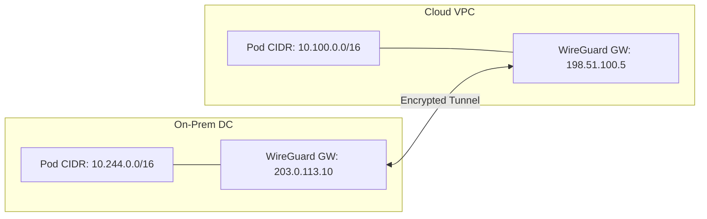
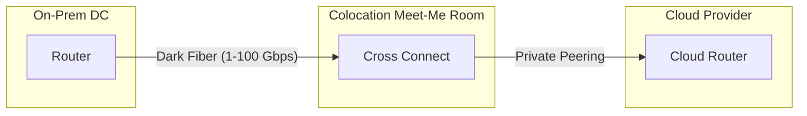
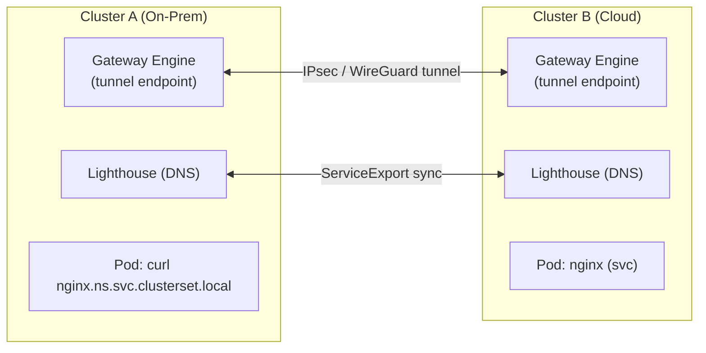
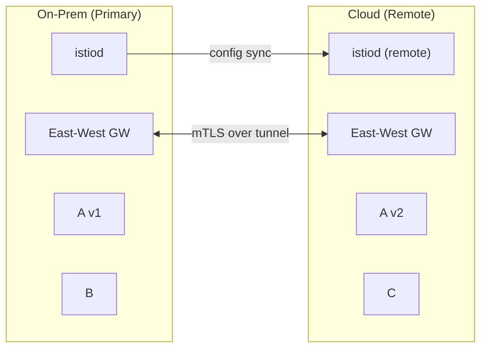
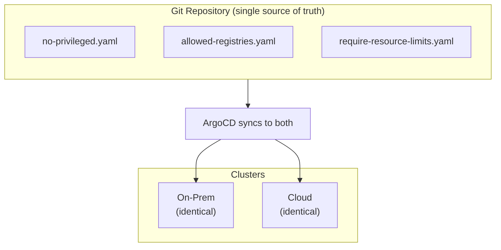

> **Complexity**: `[ADVANCED]` | Time: 60 minutes
>
> **Prerequisites**: [Datacenter Networking](/on-premises/networking/module-3.1-datacenter-networking/), [Module 8.1: Multi-Site & Disaster Recovery](/on-premises/resilience/module-8.1-multi-site-dr/)

---

## What You'll Be Able to Do

After completing this module, you will be able to:

1. **Implement** hybrid connectivity between on-premises and cloud Kubernetes clusters using dedicated interconnects and encrypted tunnels.
2. **Configure** Submariner or Cilium ClusterMesh for cross-cluster service discovery and pod-to-pod communication.
3. **Design** network architectures that provide consistent latency between on-premises and cloud workloads with proper failover mechanisms.
4. **Troubleshoot** hybrid connectivity issues including BGP route leaks, tunnel MTU problems, and cross-cluster DNS resolution failures.
5. **Evaluate** diverse service mesh topologies to securely route traffic across multicloud boundaries.

---

## Why This Module Matters

Hypothetical scenario: a global retail company runs customer-facing applications on AWS EKS but keeps inventory management on-premises because warehouse scanners need sub-5ms response times to a local API. For two years, the cloud and on-prem clusters operate as isolated islands. They maintain separate CI/CD pipelines, monitoring stacks, service discovery, and network policies. When a product launch requires real-time inventory checks from the cloud storefront to the on-prem API, the team patches together public internet endpoints and manual firewall rules. Cross-cluster latency varies wildly. During peak traffic a BGP route leak by an upstream ISP makes the endpoint unreachable. The storefront shows "out of stock" for items sitting in warehouses.

The company then invests in proper hybrid connectivity. They add a dedicated interconnect for predictable latency and encrypted tunnels as a failover path. Submariner provides cross-cluster service discovery, and Istio unifies east-west traffic management. Inventory API latency stabilizes. Failover paths exist when the primary link degrades. Operators can reason about one logical fleet instead of two disconnected environments. This architectural transformation underscores why robust hybrid connectivity design is a core requirement rather than an operational afterthought you bolt on after the first cross-environment feature request.

> **The Bridge Analogy**
>
> Hybrid connectivity is the bridge between two cities that grew independently. Without it, goods (packets) must take a long detour through a public highway (the internet) with unpredictable tolls and traffic jams. A dedicated bridge (interconnect) plus a backup tunnel (VPN) lets traffic flow predictably in both directions, with toll booths (firewalls and policy) that enforce the same rules on both sides.

---

## What You'll Learn

- VPN tunnel options for on-prem to cloud (WireGuard and IPsec), including throughput limits and MTU constraints.
- Dedicated interconnect services (Direct Connect, ExpressRoute, Cloud Interconnect) and when their cost is justified.
- Submariner for multi-cluster Kubernetes networking, including Lighthouse DNS and the `clusterset.local` domain.
- Cilium ClusterMesh and Linkerd multi-cluster as alternative approaches to cross-cluster connectivity.
- Istio service mesh spanning cloud and on-prem clusters, including east-west gateways and shared trust domains.
- Consistent policy enforcement with OPA/Gatekeeper across environments.
- Systematic troubleshooting for BGP route leaks, tunnel MTU black holes, and cross-cluster DNS failures.

---

## Foundation: VPN Tunnels and Capabilities

When you connect on-premises Kubernetes clusters to cloud clusters, the first network layer is almost always an encrypted tunnel over the public internet or a private WAN. Site-to-site VPN tunnels bridge disparate routing domains. Your datacenter pod CIDR, cloud VPC CIDR, and sometimes a transit hub CIDR must all become reachable without exposing workloads to unencrypted transit. Tunnels are not a complete hybrid architecture by themselves. They are the transport layer that higher-level tools like Submariner, Istio east-west gateways, or Cilium ClusterMesh rely on. You cannot skip understanding them because MTU mistakes, asymmetric routing, and single-gateway designs fail in production long before you deploy any multi-cluster controller.

Planning hybrid connectivity starts with an IPAM worksheet: list every cluster's pod CIDR, service CIDR, node CIDR, and any managed service ranges (RDS, Cloud SQL, internal LBs). Highlight overlaps before provisioning. Reserve a dedicated /16 (or larger) per cluster even if current node counts are small—autoscaling and secondary CNI interfaces consume address space faster than spreadsheet estimates predict. Document which team owns BGP advertisements on each side (network team vs. cloud landing zone team) so a Kubernetes upgrade never accidentally becomes a route leak incident.



Choosing between WireGuard and IPsec is not purely a performance decision; it is a tradeoff between operational simplicity, cloud-native integration, and how your security team expects to rotate keys and audit configuration. WireGuard ships as a small, auditable codebase and typically delivers lower CPU overhead per gigabit on modern hardware, while IPsec remains the default protocol for managed cloud VPN gateways and integrates with hardware appliances your network team may already operate.

| Factor | WireGuard | IPsec (IKEv2) |
|--------|-----------|---------------|
| **Code complexity** | ~4,000 lines | ~400,000 lines |
| **Performance** | 1.0-3.0 Gbps per core (hardware dependent) | 0.5-1.60 Gbps per core (hardware dependent) |
| **Latency overhead** | ~0.5ms typical | ~1-2ms typical |
| **Configuration** | Simple (key pair, endpoint, allowed IPs) | Complex (certs, proposals, policies) |
| **Cloud native support** | Manual setup on VMs or gateways | Native (AWS/Azure/GCP managed VPN) |
| **Key rotation** | Built-in rekey (short intervals) | Manual or via IKE rekey timers |

> **Pause and predict**: WireGuard uses ~4,000 lines of code while IPsec uses ~400,000. Both encrypt traffic. Why would the smaller codebase matter for a security-critical component like a VPN tunnel?

The smaller codebase reduces the attack surface auditors must review and makes misconfiguration less likely because there are fewer knobs. WireGuard also [merged into the Linux kernel in version 5.6](https://github.com/torvalds/linux/releases/tag/v5.6) (March 2020), which means modern Linux gateway nodes can run it without out-of-tree kernel modules—a meaningful operational win when you patch kernels monthly. IPsec remains the right choice when you need a managed cloud VPN gateway with SLA-backed availability, hardware acceleration on an existing firewall, or compliance frameworks that explicitly reference IKEv2.

Beyond software choices, cloud providers apply hard bandwidth caps on managed VPN instances, and those caps define whether VPN is viable for your workload or merely a DR fallback:

- **AWS Site-to-Site VPN** [supports a maximum tunnel bandwidth of 5 Gbps](https://docs.aws.amazon.com/vpn/latest/s2svpn/vpn-limits.html) (upgraded from the previous 1.25 Gbps limit) for workloads requiring high throughput. Each connection consists of two IPsec tunnels for high availability. [Check current AWS VPN quotas](https://docs.aws.amazon.com/vpn/latest/s2svpn/vpn-limits.html) for Transit Gateway attachments: standard tunnels up to 1.25 Gbps, large-bandwidth tunnels up to 5 Gbps, with ECMP on Transit Gateway for higher aggregate throughput across multiple tunnels.
- **Azure Virtual WAN** [Site-to-Site VPN gateway aggregate throughput is 20 Gbps, delivering 2 Gbps per VPN connection (with 1 Gbps per tunnel)](https://learn.microsoft.com/en-us/azure/azure-resource-manager/management/azure-subscription-service-limits). Be mindful that [single TCP flows exceeding 1.50 Gbps may degrade](https://learn.microsoft.com/en-us/azure/virtual-wan/hub-settings) on virtual hub routers—design for multiple flows or upgrade to ExpressRoute when one fat TCP stream dominates.
- **GCP HA VPN** [tunnels support a maximum throughput of approximately 3 Gbps (250,000 packets per second) per tunnel](https://cloud.google.com/network-connectivity/docs/vpn/quotas). HA VPN pairs two gateways with four tunnels for redundancy; verify current SLA terms against official Google documentation before production commitments.

Throughput numbers are per-tunnel ceilings, not guarantees. Internet path quality, encryption CPU on your gateway, and TCP window sizing all reduce real-world goodput. For hybrid Kubernetes, also plan headroom for etcd replication, Velero backups, container image pulls, and observability traffic. Operators often underestimate how much east-west metadata sync consumes once Submariner or a service mesh is enabled. Budget at least thirty percent above measured steady-state throughput before declaring VPN sufficient for production hybrid workloads. Revisit the estimate quarterly as observability and service mesh sidecars add overhead.

### Implementing Encrypted Tunnels

This configuration creates an encrypted WireGuard tunnel between the on-premises gateway and a cloud-side gateway. The `AllowedIPs` field acts as both an access control list and a routing table—only traffic destined for the specified CIDRs enters the tunnel, which prevents your gateway from becoming an open relay for arbitrary internet destinations. `PersistentKeepalive` keeps NAT mappings alive when the on-prem gateway sits behind carrier-grade NAT, a common pattern in branch offices that still host Kubernetes worker nodes.

```bash
# On the on-prem gateway node
apt-get install -y wireguard
wg genkey | tee /etc/wireguard/private.key | wg pubkey > /etc/wireguard/public.key

cat > /etc/wireguard/wg0.conf <<EOF
[Interface]
Address = 10.200.0.1/24
ListenPort = 51820
PrivateKey = $(cat /etc/wireguard/private.key)
PostUp = iptables -A FORWARD -i wg0 -j ACCEPT; iptables -A FORWARD -o wg0 -j ACCEPT
PostDown = iptables -D FORWARD -i wg0 -j ACCEPT; iptables -D FORWARD -o wg0 -j ACCEPT

[Peer]
PublicKey = <CLOUD_GATEWAY_PUBLIC_KEY>
Endpoint = 198.51.100.5:51820
AllowedIPs = 10.100.0.0/16, 172.20.0.0/16
PersistentKeepalive = 25
EOF

systemctl enable --now wg-quick@wg0

# Add routes for cross-cluster communication
ip route add 10.100.0.0/16 via 10.200.0.1 dev wg0
ip route add 172.20.0.0/16 via 10.200.0.1 dev wg0
```

Network constraints dominate tunnel performance in ways that raw bandwidth charts hide. Encapsulation adds 50–70 bytes per packet depending on protocol (WireGuard vs IPsec/GRE), which shrinks the effective MSS and can trigger silent TCP black holes when Path MTU Discovery is blocked. [AWS Site-to-Site VPN MTU is restricted to 1446 bytes (MSS 1406 bytes)](https://docs.aws.amazon.com/vpn/latest/s2svpn/cgw-best-practice.html), while internal AWS Transit Gateway MTU for inter-VPC and Direct Connect traffic can be much larger at 8500 bytes. If your pod network MTU remains at 1500 but the tunnel path only supports 1400, large responses may never arrive and `curl` will hang after the TCP handshake succeeds.

Operational checklist for tunnel gateways: deploy active-passive or active-active pairs from day one, log tunnel up/down events to your on-call channel, document which CIDRs are advertised in each direction, and test failover quarterly by withdrawing routes rather than assuming the standby gateway works untested.

When your network team standardizes on IPsec instead of self-managed WireGuard, the cloud side is usually a managed VPN gateway (AWS Virtual Private Gateway or Transit Gateway attachment, Azure VPN Gateway, GCP Cloud VPN) and the on-prem side is a firewall or router speaking IKEv2. Phase 1 negotiates the IKE SA with authentication (pre-shared key or certificate) and encryption proposals; Phase 2 builds the child SA that actually carries pod CIDR traffic. Misaligned Phase 2 selectors—advertising 0.0.0.0/0 when you only need two /16 pod networks—expand blast radius if the tunnel is compromised. Dead peer detection and IKE keepalives matter on unstable internet paths: without them, one side may believe the tunnel is up while the other has torn down the SA, producing asymmetric black holes until manual intervention.

For Kubernetes specifically, remember that pod IPs are ephemeral while service ClusterIPs are stable within a cluster. VPN routes must include every CIDR the CNI uses—pod network, service network, and sometimes node network if you run hostNetwork diagnostics—plus any SNAT range your egress controller uses. If the cloud cluster pulls images through a NAT gateway in a separate subnet, that subnet also needs a return path through the tunnel or health checks from on-prem will succeed while image pulls from on-prem-hosted registries fail silently.

---

## Dedicated Interconnects

VPN tunnels run over the public internet and inherit its jitter, congestion, and BGP instability. Dedicated interconnects provide private, low-latency connections between your router (or colocation cross-connect) and a cloud provider edge router, typically over single-mode fiber in a meet-me room. You still encrypt sensitive traffic at higher layers—MACsec on the fiber, IPsec or mTLS inside Kubernetes—but you remove the unpredictable middle mile that causes replication lag spikes and broken TCP sessions during peak hours.



| Feature | AWS Direct Connect | Azure ExpressRoute | GCP Cloud Interconnect |
|---------|-------------------|-------------------|----------------------|
| **Bandwidth** | 1, 10, 100 Gbps (verify 400 Gbps availability) | 50 Mbps - 100 Gbps | 10, 100 Gbps dedicated; Partner up to 50 Gbps |
| **Latency** | Low single-digit ms typical within metro | Low single-digit ms typical within metro | Low single-digit ms typical within metro |
| **Setup time** | Weeks (physical provisioning) | Weeks (physical provisioning) | Weeks (physical provisioning) |
| **Monthly cost (10G)** | Order-of-magnitude ~$1,000–$3,000/port (verify current pricing) | Order-of-magnitude ~$3,000–$6,000/port (verify current pricing) | Order-of-magnitude ~$1,500–$2,500/port (verify current pricing) |

Pricing in the table is intentionally approximate because interconnect tariffs change by region, provider, and commitment term. Always verify against [AWS Direct Connect pricing](https://aws.amazon.com/directconnect/pricing/), Microsoft cost planning docs, and Google Cloud Interconnect pricing before budgeting. The architectural question is not "which vendor is cheapest per gigabit." The question is whether sustained cross-environment traffic and latency SLOs justify weeks of lead time and a physical port you cannot spin up in an afternoon. Factor in cross-connect fees at the colocation facility, redundant ports for HA, and engineering time to maintain BGP sessions—the port monthly rate is rarely the total cost of ownership.

**Use an interconnect** when you need more than roughly 1 Gbps sustained throughput, sub-5ms latency for synchronous replication or real-time APIs, or compliance mandates that forbid carrying production metadata over the public internet. **Use VPN** when bandwidth is modest (under ~100 Mbps sustained), the link is DR-only or batch-oriented, or you need connectivity today while the interconnect provisions. Many mature hybrid designs run both: interconnect as primary, VPN as automated failover with BGP preference metrics that prefer the private path.

**AWS Direct Connect Architecture**

AWS Direct Connect [dedicated connections are available at 1 Gbps, 10 Gbps, 100 Gbps, and 400 Gbps port speeds over single-mode fiber, while hosted connections (via APN partners) range from 50 Mbps to 25 Gbps](https://docs.aws.amazon.com/directconnect/latest/UserGuide/connection_options.html). [Data transfer inbound into AWS is charged at $0.00/GB in all locations](https://aws.amazon.com/directconnect/pricing/) as of published AWS pricing—egress and cross-region charges still apply, so model bidirectional traffic. AWS Direct Connect [supports MACsec encryption on 10 Gbps, 100 Gbps, and 400 Gbps dedicated connections at select PoPs](https://docs.aws.amazon.com/directconnect/latest/UserGuide/MACsec.html). For 100 Gbps and 400 Gbps connections, the supported MACsec cipher suite is GCM-AES-XPN-256 with Extended Packet Numbering (XPN), not the shorter packet-number space used at lower speeds.

AWS Direct Connect SiteLink enables private connectivity between any two Direct Connect PoPs, [routing traffic over the AWS backbone without transiting an AWS Region](https://docs.aws.amazon.com/prescriptive-guidance/latest/designing-control-tower-landing-zone/sitelink.html)—useful when your on-prem sites peer into different metros but need low-latency paths between themselves. AWS Transit Gateway supports burst bandwidth limits per attachment; design aggregate throughput with headroom rather than summing theoretical port speeds.

**Azure ExpressRoute Characteristics**

Azure ExpressRoute standard circuits offer bandwidths from 50 Mbps up to 10 Gbps; [ExpressRoute Direct offers 10, 100, and potentially 400 Gbps port speeds](https://learn.microsoft.com/en-us/azure/expressroute/expressroute-erdirect-about) depending on subscription enrollment and regional availability. [Circuits come in three SKUs: Local (same-region VNETs), Standard (same geopolitical region), and Premium (global VNET access)](https://learn.microsoft.com/en-us/azure/expressroute/plan-manage-cost). ExpressRoute Global Reach links two ExpressRoute circuits to create a private network between on-premises sites; [Global Reach data transfer is billed separately and is not covered by the Unlimited Data plan](https://learn.microsoft.com/en-us/azure/expressroute/plan-manage-cost)—a frequent budget surprise when architects assume "unlimited" applies to every byte crossing the mesh.

[Azure Virtual WAN virtual hub router supports an aggregate throughput of up to 50 Gbps](https://learn.microsoft.com/en-us/azure/virtual-wan/virtual-wan-about); [the default 2 routing infrastructure units support 3 Gbps aggregate throughput and 2,000 connected VMs](https://learn.microsoft.com/en-us/azure/virtual-wan/hub-settings). Scale hub SKUs before you migrate entire Kubernetes node pools behind the hub.

**Google Cloud Interconnect Topologies**

GCP Dedicated Interconnect links are available at 10 Gbps or 100 Gbps; up to 8 links can be bundled in a Link Aggregation Group (LAG) for up to 800 Gbps aggregate. [GCP Partner Interconnect VLAN attachments support capacities from 50 Mbps up to 50 Gbps](https://cloud.google.com/network-connectivity/docs/interconnect/concepts/overview). The GCP Network Connectivity Center (NCC) provides a hub-and-spoke architecture for connecting on-premises and cloud networks with BGP route exchange—think of it as the control plane for which prefixes each spoke advertises, similar in role to AWS Transit Gateway or Azure Virtual WAN.

### Multi-Cloud Interconnectivity

Direct backbone-to-backbone multicloud connectivity eliminates some colocation complexity when you need AWS and GCP to talk privately without hair-pinning through your datacenter. AWS Interconnect – multicloud (in partnership with Google Cloud) entered preview in November 2025, offering 1 Gbps connections during preview at no cost across select AWS–GCP region pairs, with higher speeds targeted at general availability—verify current status and region pairs in vendor documentation. Azure integration timelines remain less concrete in public docs as of early 2026; treat multicloud private paths as preview-capable where documented, not as a universal production default.

**Design pattern: hub-and-spoke with a transit hub.** Most enterprises avoid full mesh VPNs between every site and every cloud VPC. Instead, on-prem datacenters and cloud landing zones attach to a transit hub—AWS Transit Gateway, Azure Virtual WAN hub, or GCP Network Connectivity Center—and exchange routes via BGP. Kubernetes pod CIDRs are static enough to advertise as summarized prefixes (/16 or larger) if your IPAM plan allows aggregation; flapping /24 advertisements from autoscaling node pools can overwhelm small edge routers. Place the hub in the region closest to your primary on-prem facility to minimize RTT for control-plane traffic (istiod, Argo CD, observability backends) even when worker workloads span regions.

**Design pattern: primary + backup path.** Configure BGP so the interconnect path has a lower local preference than VPN backup, and automate failover with BFD where supported. Document asymmetric routing scenarios: if return traffic takes VPN while forward traffic uses Direct Connect, stateful firewalls may drop flows. Test by failing the primary link during a maintenance window and verifying that Submariner gateways or Istio east-west gateways reconverge within your RTO target—not merely that `ping` succeeds from a bastion host outside the cluster.

---

## Submariner: Multi-Cluster Networking

Submariner connects Kubernetes clusters so pods and services in one cluster can reach those in another, handling cross-cluster DNS, encrypted tunnels between gateway nodes, and service discovery metadata exchange. [It is a CNCF Sandbox project that enables Layer 3 cross-cluster pod and service connectivity for Kubernetes](https://www.cncf.io/projects/submariner/); it is CNI-agnostic, which matters when your on-prem cluster runs Calico and your cloud cluster uses the cloud provider's CNI—you do not need to standardize on one CNI vendor to gain cross-cluster routing.



Architecturally, Submariner splits into three concerns you should keep mentally separate: **gateway engines** terminate encrypted tunnels and forward pod CIDR routes; **Lighthouse** synchronizes `ServiceExport` / `ServiceImport` objects and teaches CoreDNS to resolve the `clusterset.local` domain; and the **broker** cluster holds CRDs that other clusters join against. If DNS works but TCP fails, suspect tunnels or CIDR overlap. If TCP works by IP but names fail, suspect Lighthouse or missing `ServiceExport`.

> **Stop and think**: Submariner requires non-overlapping pod and service CIDRs between clusters. Both your on-prem and EKS clusters use the default 10.244.0.0/16 pod CIDR. What are your options, and which one avoids rebuilding either cluster?

Your options are: rebuild one cluster with a unique pod CIDR (cleanest long term), enable Submariner Globalnet to NAT into a dedicated global CIDR (adds complexity but avoids rebuild), or perform manual NAT at gateways (fragile, breaks network policy semantics). Document chosen CIDRs in a central IPAM registry before any cluster exists—retrofits are expensive.

**Requirements**: non-overlapping pod/service CIDRs, gateway nodes with routable public or routable-on-WAN IPs, UDP ports 500 and 4500 open for IPsec (or WireGuard's UDP port if using the WireGuard cable driver), and supported CNIs (Calico, Flannel, Canal, OVN-Kubernetes). Gateway nodes should be labeled and tainted so application pods do not land on them; tunnel encryption and NAT are CPU-sensitive.

### Install Submariner

The latest stable Submariner release is v0.23.1 as of March 2026—verify the current release on the Submariner project site before pinning versions in production GitOps repos.

Submariner uses a broker (deployed on one cluster) for service discovery metadata exchange. Each cluster joins the broker, establishes encrypted tunnels for pod-to-pod traffic, and runs Lighthouse for cross-cluster name resolution. The DNS name `nginx.production.svc.clusterset.local` resolves to the cluster-local ClusterIP on the exporting cluster's side of the tunnel; clients do not need to know which cluster hosts the workload.

```bash
# Install subctl
curl -Ls https://raw.githubusercontent.com/submariner-io/submariner/master/scripts/get-submariner.sh | VERSION=v0.23.1 bash

# Deploy broker and join clusters
kubectl config use-context on-prem-cluster
subctl deploy-broker
subctl join broker-info.subm --clusterid on-prem --natt=false --cable-driver libreswan

kubectl config use-context cloud-cluster
subctl join broker-info.subm --clusterid cloud --natt=true --cable-driver libreswan

# Export a service for cross-cluster access
subctl export service nginx-service -n production

# From the other cluster, reach it via:
#   nginx-service.production.svc.clusterset.local
subctl show all
```

Set `--natt=true` on clusters whose gateway nodes sit behind NAT (typical for cloud VPCs with elastic IPs) and `--natt=false` when the gateway has a stable public IP reachable from peers. Mixing these incorrectly produces perpetual "connecting" states in `subctl show connections` even when UDP 500/4500 appears open in security groups.

**Lighthouse and the `clusterset.local` zone** deserve explicit attention because DNS is where most first-time Submariner deployments fail. When you `subctl export service nginx -n web`, Submariner creates a `ServiceExport` CR on the source cluster. Lighthouse agents on every cluster watch the broker and create matching `ServiceImport` objects locally. CoreDNS loads a Lighthouse plugin that answers queries for `<service>.<namespace>.svc.clusterset.local` by returning the ClusterIP on the cluster that exported the service; packets then flow through the gateway engine tunnel to the remote pod network. If you query `nginx.web.svc.cluster.local` from a remote cluster, you get the local cluster's DNS view—which is empty—not the exported service. Train developers on the `clusterset.local` suffix the same way you train them on internal ingress hostnames.

Cable driver choice matters for compliance and performance: Libreswan IPsec integrates with FIPS-validated modules on some platforms; WireGuard cable driver reduces CPU at high throughput on modern kernels but may require separate security review. You can run `--cable-driver wireguard` on both clusters when UDP 51820 (or your chosen port) is permitted end-to-end. Monitor gateway node CPU: encryption at 10 Gbps can saturate a small instance long before the tunnel bandwidth chart says you hit the cap.

---

## Alternative CNIs and Meshes: Cilium and Linkerd

If a standalone tunnel manager does not align with your architectural goals, CNI-native multi-cluster features embed connectivity into the data plane you already run. This reduces moving parts when your platform standard is already Cilium or Linkerd, but it also couples upgrade cycles— a ClusterMesh bug becomes a Cilium bug, and you lose the vendor-neutral isolation Submariner provides.

**Cilium ClusterMesh** is included in Cilium stable releases and provides pod-to-pod and service connectivity across clusters using a combination of tunneling or native routing plus BGP where configured. Clusters exchange identity and service information through etcd-backed clustermesh-apiserver components; each cluster must expose reachable NodePort or LoadBalancer endpoints for the remote apiservers. ClusterMesh assumes non-overlapping pod CIDRs and consistent IPAM planning, similar to Submariner. It shines when you already rely on Cilium network policies and Hubble observability and want cross-cluster policy enforcement with a unified identity model rather than bolting on a second connectivity stack.

**Linkerd multi-cluster** connectivity has been available since Linkerd 2.8 (June 2020), supporting hierarchical (gateway-based), flat (pod-to-pod), and federated service models. Gateways terminate mTLS and mirror services into remote clusters via the `ServiceMirror` controller. As of February 2024, the Linkerd open-source project no longer publishes stable release artifacts on the community release page; Buoyant provides stable release artifacts through Buoyant Enterprise for Linkerd. If your procurement policy requires pulling only from open-source release pages, validate artifact availability before committing to Linkerd for hybrid production—edge channels may be the only community option, which security teams often reject.

Choose Submariner when you need CNI-agnostic Layer 3 connectivity quickly across heterogeneous clusters. Choose Cilium ClusterMesh when Cilium is already your standard and you want unified policy and observability. Choose Linkerd multi-cluster when you already run Linkerd for mTLS and want mirrored services without adopting a separate tunnel project—provided your artifact supply chain is resolved.

**Cilium ClusterMesh setup sketch:** enable clustermesh on each cluster with `cilium clustermesh enable`, expose the clustermesh-apiserver via LoadBalancer or NodePort reachable from remote cluster nodes, then `cilium clustermesh connect` pairwise. Services gain global visibility in Hubble; network policies can reference global identities when `--cluster-name` labels are consistent. Failure modes include apiserver reachability blocked by cloud security groups—fix by allowing TCP 2379/4240 (verify current Cilium docs for port list) from remote node CIDRs only, not 0.0.0.0/0.

**Linkerd federated services** expose a `Link` resource pointing at the gateway address of a remote cluster; the service mirror controller creates a shadow service locally that sends traffic through mTLS to the remote gateway. Flat mode avoids gateways but requires routable pod IPs end-to-end—the same non-overlapping CIDR discipline as Submariner. For hybrid on-prem plus cloud, gateway mode is the realistic default because cloud pod IPs are not routable from the datacenter without the tunnel layer underneath.

---

## Unified Service Mesh with Istio

Istio adds traffic management, observability, and mTLS security across clusters on top of whatever L3 connectivity you built with VPN, interconnect, Submariner, or ClusterMesh. [Istio supports two primary multi-cluster deployment models: multi-primary (each cluster runs its own istiod) and primary-remote (remote clusters receive configuration from a primary istiod)](https://istio.io/latest/docs/setup/install/multicluster/). When on-prem and cloud networks are not flat—different VPCs, different ASNs, NAT in the path—you adopt a **multi-network** topology and route east-west traffic through **east-west gateways** that terminate mTLS and forward to remote gateways over the existing VPN or interconnect.



*svc-A traffic: 80% on-prem (v1), 20% cloud (v2)*

A **trust domain** in Istio defines which SPIFFE identities are considered local versus foreign. Cross-cluster mTLS succeeds only when sidecars trust the issuer of the peer certificate. A shared root CA is required for cross-cluster mTLS: without it, sidecars in different clusters cannot verify each other's certificates and cross-cluster HTTP calls fail with 503 errors even though raw `ping` or `curl` over Submariner works. Istio Ambient mesh multi-cluster support for multi-network topologies reached beta status in March 2026; sidecar-based multi-primary remains the most documented production path—verify current Istio release notes for Ambient limitations before choosing it for hybrid.

> **Pause and predict**: Istio uses mTLS between sidecars in different clusters. Why does each cluster need a certificate derived from the same root CA? What symptom would you see if the root CAs were different?

Each cluster's istiod signs workload certificates with its local intermediate CA. The peer sidecar must chain back to a root the local trust bundle knows. Different roots produce TLS handshake failures that Istio surfaces as 503 with `upstream connect error` in access logs while plain TCP probes still succeed—exactly the confusing split-brain symptom operators report after installing Istio before planning PKI.

### Setting Up Multi-Cluster Istio

The shared root CA is the foundation of cross-cluster mTLS. Each cluster gets its own intermediate CA derived from the shared root, so certificates can be validated across cluster boundaries while compromise of one intermediate does not require rotating the entire fleet's root on day one.

```bash
# 1. Generate a shared root CA
mkdir -p certs
openssl req -new -x509 -nodes -days 3650 \
  -keyout certs/root-key.pem -out certs/root-cert.pem \
  -subj "/O=KubeDojo/CN=Root CA"

# 2. Create per-cluster intermediate CAs from the shared root
for CLUSTER in on-prem cloud; do
  openssl genrsa -out certs/${CLUSTER}-ca-key.pem 4096
  openssl req -new -key certs/${CLUSTER}-ca-key.pem \
    -out certs/${CLUSTER}-ca-csr.pem -subj "/O=KubeDojo/CN=${CLUSTER} CA"
  openssl x509 -req -days 3650 -CA certs/root-cert.pem -CAkey certs/root-key.pem \
    -set_serial "0x$(openssl rand -hex 8)" \
    -in certs/${CLUSTER}-ca-csr.pem -out certs/${CLUSTER}-ca-cert.pem
done

# 3. Install Istio on the primary cluster with the shared CA
kubectl create namespace istio-system
kubectl create secret generic cacerts -n istio-system \
  --from-file=ca-cert.pem=certs/on-prem-ca-cert.pem \
  --from-file=ca-key.pem=certs/on-prem-ca-key.pem \
  --from-file=root-cert.pem=certs/root-cert.pem \
  --from-file=cert-chain.pem=certs/on-prem-ca-cert.pem

istioctl install -y -f - <<EOF
apiVersion: install.istio.io/v1alpha1
kind: IstioOperator
spec:
  values:
    global:
      meshID: kubedojo-mesh
      multiCluster:
        clusterName: on-prem
      network: on-prem-network
EOF
```

Deploy east-west gateways on both networks, label them with `topology.istio.io/network`, and configure `MeshNetworks` so istiod knows which gateway reaches which remote network. Remote clusters need `istiod` reachable (often through the same private interconnect) for configuration propagation in primary-remote mode.

### Cross-Cluster Traffic Routing

Once mTLS trust is established, `VirtualService` and `DestinationRule` objects express the same traffic splitting semantics you use inside a single cluster—canary releases, locality-aware priorities, and circuit breaking—extended across network boundaries.

```yaml
# VirtualService for weighted routing between on-prem and cloud
apiVersion: networking.istio.io/v1
kind: VirtualService
metadata:
  name: svc-a
  namespace: production
spec:
  hosts:
  - svc-a.production.svc.cluster.local
  http:
  - route:
    - destination:
        host: svc-a.production.svc.cluster.local
        subset: on-prem
      weight: 80
    - destination:
        host: svc-a.production.svc.cluster.local
        subset: cloud
      weight: 20
```

Pair this with `DestinationRule` subsets labeled by cluster and enable locality-aware load balancing when you want istiod to prefer endpoints in the same region before spilling to remote clusters—reducing cross-environment bandwidth charges and latency tail risk.

**East-west gateway deployment** is the piece most Istio hybrid guides gloss over. On each network, install a dedicated `istio-eastwestgateway` deployment (via `gen-eastwest-gateway.sh` in Istio multicluster docs) and expose it through your cloud load balancer or on-prem metal LB with ports 15443 for mTLS and 15012 for istiod discovery if needed. Label the gateway namespace with `topology.istio.io/network=on-prem-network` (or your network name) and create a `Gateway` resource that accepts traffic for `.local` hosts from remote networks. Remote `ServiceEntry` objects point at the east-west gateway IP for services that live on the other network. Without this hop, istiod may distribute endpoint addresses that are literally unroutable from the remote pod—the classic "works in primary cluster only" failure.

Trust domain configuration extends beyond the root CA file: set `trustDomain` consistently or use `trustDomainAliases` when migrating legacy clusters. SPIFFE IDs embed the trust domain; a mismatch blocks authorization policies that match on `source.principal`. After PKI changes, roll sidecars or restart ambient ztunnel pods so new certs propagate—old connections cache stale trust bundles for minutes.

---

## Consistent Policy with OPA/Gatekeeper

When workloads span on-prem and cloud, policy drift is inevitable without centralized enforcement. A cloud cluster might allow `latest` tags during a hackathon while on-prem still enforces registry allowlists; a manual `kubectl edit` on one side bypasses the Git-tracked standard. [OPA/Gatekeeper](https://github.com/open-policy-agent/gatekeeper) provides Kubernetes admission control using Rego policies packaged as `ConstraintTemplate` and `Constraint` CRDs, evaluating requests before objects persist in etcd.

The hybrid pattern that scales beyond two clusters is GitOps with identical policy bundles synced to every API server: one repository holds templates, constraints, and exemption workflows; Argo CD or Flux applies the same commit SHA everywhere; Gatekeeper's audit mode runs continuously on each cluster and surfaces violations to your compliance dashboard even when admission is temporarily set to `dryrun` during rollout.



```yaml
# ConstraintTemplate: enforce allowed image registries
apiVersion: templates.gatekeeper.sh/v1
kind: ConstraintTemplate
metadata:
  name: k8sallowedregistries
spec:
  crd:
    spec:
      names:
        kind: K8sAllowedRegistries
      validation:
        openAPIV3Schema:
          type: object
          properties:
            registries:
              type: array
              items:
                type: string
  targets:
  - target: admission.k8s.gatekeeper.sh
    rego: |
      package k8sallowedregistries
      violation[{"msg": msg}] {
        container := input.review.object.spec.containers[_]
        not startswith(container.image, input.parameters.registries[_])
        msg := sprintf("Container '%v' uses image '%v' from unauthorized registry",
          [container.name, container.image])
      }
```

```yaml
apiVersion: constraints.gatekeeper.sh/v1beta1
kind: K8sAllowedRegistries
metadata:
  name: allowed-registries
spec:
  enforcementAction: deny
  match:
    kinds:
    - apiGroups: [""]
      kinds: ["Pod"]
  parameters:
    registries:
    - "registry.internal.example.com/"
    - "gcr.io/distroless/"
    - "registry.k8s.io/"
```

Extend the same pattern to require labels, block privileged pods, mandate resource limits, and enforce Pod Security Standards equivalents before any hybrid workload ships. Run `gator verify` in CI on the policy repo so a malformed Rego template cannot break admission on every cluster simultaneously during sync.

Hybrid environments amplify policy exceptions: a cloud cluster might need a temporary registry mirror during an air-gap drill while on-prem stays strict. Model exceptions as scoped `Constraint` objects with `match` namespaces or labels—not as disabled Gatekeeper on entire clusters. Audit mode (`enforcementAction: dryrun`) on a new constraint for one release cycle surfaces violations in Gatekeeper export metrics before you flip to `deny`. Pair with OPA's `conftest` for Terraform and Helm pre-commit checks so networking and policy changes receive the same review bar as application manifests.

Synchronization lag between clusters is itself a risk: if Argo CD on the cloud cluster syncs five minutes ahead of on-prem during a partial outage, you temporarily have two security postures. Use ApplicationSet generators or a single Argo CD control plane with cluster credentials rather than independent auto-sync schedules when compliance requires lockstep policy versions.

---

## Troubleshooting Hybrid Connectivity

Hybrid failures often present as application errors three layers away from the root cause. A disciplined triage order saves hours. Confirm L3 reachability first, then DNS, then TLS/mTLS, then the application protocol. Keep a laminated decision tree in the runbook wiki: if `ping` to remote pod IP fails, stop debugging Istio VirtualServices until the tunnel or Submariner gateway is healthy. If `ping` succeeds but DNS fails, skip certificate debugging until Lighthouse or CoreDNS integration is verified. This sequencing prevents the common outage pattern where three engineers debug three different layers simultaneously without sharing findings.

**BGP route leaks and prefix hijacks** manifest as traffic suddenly taking the wrong path or disappearing entirely. When your on-prem router advertises a cloud pod CIDR toward the internet by mistake, upstream providers may accept and propagate the prefix. Cloud workloads can become unreachable globally until the leak is withdrawn. Mitigations include strict route filters on both cloud routers and on-prem BGP speakers. Use RPKI validation where your providers support it, and enforce prefix limits on peering sessions. Symptom: traceroute to cloud pod IPs routes through an unexpected ASN. Fix: withdraw the leaked advertisement and audit export policies during post-incident review.

**Tunnel MTU black holes** produce partial connectivity. Small HTTP headers succeed but large JSON payloads hang. `kubectl logs` may work while `kubectl cp` fails. Reproduce with `ping -M do -s 1372 <remote-pod-ip>` stepping down until packets pass. Then set interface MTU on tunnel endpoints and enable TCP MSS clamping on gateways. For Kubernetes CNI, some CNIs expose per-node MTU settings. Align them with the lowest MTU on the path end-to-end.

**Cross-cluster DNS failures** split into "name does not resolve" versus "name resolves but connects to wrong backend." For Submariner, verify `ServiceExport` on the source cluster, `ServiceImport` on the consumer, Lighthouse pods healthy, and CoreDNS configmap contains the lighthouse plugin stanza. For Istio multi-cluster, verify `ServiceEntry` and east-west gateway `Service` hostnames match the remote mesh network. Test with `nslookup` from a debug pod before blaming application code.

Document a runbook that links each symptom to three commands—your on-call should not re-derive the entire Submariner architecture during an outage.

**Worked example: MTU black hole after enabling IPsec.** Symptom: `curl https://inventory-api.internal/health` returns HTTP 200 from a cloud jump host but hangs from an on-prem pod. `traceroute` shows the path ends at the VPN gateway. `ping -s 1400` fails but `ping -s 1200` succeeds. Fix: lower the WireGuard/interface MTU to 1400, add `iptables -t mangle -A FORWARD -p tcp --tcp-flags SYN,RST SYN -j TCPMSS --clamp-mss-to-pmtu` on gateways, and set CNI MTU via your CNI config (Calico `vethMTU`, Cilium `--mtu`). Re-test with `curl` payloads larger than 8 KB.

**Worked example: Submariner DNS NXDOMAIN.** Symptom: `nslookup nginx.web.svc.clusterset.local` returns NXDOMAIN on cluster-a but the service exists on cluster-b. `subctl show connections` is connected. Root cause: service never exported—missing `subctl export` or `ServiceExport` deleted by GitOps prune. Fix: re-export, confirm `kubectl get serviceexports.multicluster.x-k8s.io -A` on cluster-b and `serviceimports` on cluster-a. If exports exist but DNS still fails, restart CoreDNS pods after verifying the lighthouse plugin stanza—stale ConfigMaps occasionally survive partial Lighthouse upgrades.

---

## Did You Know?

1. **[WireGuard merged into the Linux kernel in version 5.6](https://github.com/torvalds/linux/releases/tag/v5.6)** (March 2020). At ~4,000 lines of code versus IPsec's much larger implementations, its reduced attack surface is a deliberate design goal—not merely a performance optimization.
2. **AWS Direct Connect locations are not AWS datacenters.** They are colocation facilities (Equinix, CoreSite, and similar providers). Your router connects to an AWS router via a physical fiber patch cable in a shared meet-me room.
3. **AWS Interconnect – multicloud entered preview in November 2025**, offering native multicloud tunnels directly over cloud backbones between select AWS and GCP region pairs—verify current preview scope and pricing in vendor documentation before planning production dependencies.
4. **Submariner's name references submarine cables** connecting continents. Created by Rancher Labs (now SUSE), it is a [CNCF Sandbox project](https://www.cncf.io/projects/submariner/) supporting both IPsec (Libreswan) and WireGuard cable drivers; it was accepted into the CNCF on April 28, 2021.

---

## Common Mistakes

| Mistake | Why It Happens | What To Do Instead |
|---------|---------------|-------------------|
| Overlapping pod CIDRs | Default CNIs use 10.244.0.0/16 | Plan unique CIDRs per cluster before deployment |
| Single VPN gateway | "We'll add HA later" | Deploy gateways in active-passive pairs from day one |
| Ignoring MTU in tunnels | Encapsulation adds 50-70 bytes | Set MTU to 1400 on tunnel interfaces; clamp TCP MSS |
| No encryption between clusters | "Private network" | Always encrypt; [even private networks can be compromised](https://www.nist.gov/publications/zero-trust-architecture) |
| No shared root CA for Istio | Each cluster auto-generates its own | Create shared root CA before installing Istio |
| Manual per-cluster policies | "Only two clusters" | Use GitOps; drift begins with the first manual change |

---

## Quiz

### Question 1
Your on-premises Kubernetes cluster uses pod CIDR 10.244.0.0/16. Your EKS cluster also uses the default 10.244.0.0/16. You connect them via WireGuard and developers report that cross-cluster service calls randomly fail. What is happening and how do you fix it?

<details>
<summary>Answer</summary>

**The CIDR overlap causes routing ambiguity.** When a pod on the on-prem cluster sends traffic to 10.244.50.3 (intending to reach a pod on the EKS cluster), the local routing table matches it to the local pod CIDR and routes it locally -- it never enters the WireGuard tunnel. The same happens in reverse. Cross-cluster traffic is essentially impossible because both clusters claim ownership of the same IP range.

**Fix options (in order of preference):**

1. **Rebuild one cluster with a different CIDR** (e.g., 10.100.0.0/16 for EKS). This is the cleanest solution but requires recreating the cluster and migrating workloads. For EKS, this means creating a new cluster with `--kubernetes-network-config serviceIpv4Cidr` and a custom VPC CNI configuration.

2. **Use Submariner with Globalnet**, which assigns virtual global IPs from a non-overlapping range (e.g., 242.0.0.0/8). Submariner handles the NAT transparently, and cross-cluster DNS resolves to global IPs. This avoids rebuilding either cluster but adds complexity.

3. **NAT at the gateway** (fragile, last resort). Configure SNAT/DNAT rules on the WireGuard gateways to translate pod IPs. This breaks source IP visibility, complicates network policy enforcement, and is operationally painful to maintain.

**Prevention**: Always plan unique pod and service CIDRs across all clusters before deployment. Document them in a central IPAM registry.
</details>

### Question 2
Your on-premises to cloud VPN tunnel has 50ms RTT and 200 Mbps bandwidth. The database team wants to set up PostgreSQL streaming replication from the on-premises primary to a cloud replica for disaster recovery. What concerns should you raise, and what would you recommend instead?

<details>
<summary>Answer</summary>

**Three critical concerns:**

1. **Bandwidth saturation**: A write-heavy PostgreSQL database generating 50-100 MB/s of WAL (Write-Ahead Log) data would consume 400-800 Mbps -- far exceeding the 200 Mbps tunnel capacity. Replication lag would grow unbounded until the tunnel is upgraded or write volume decreases. This means the DR replica is perpetually behind, defeating the purpose.

2. **Latency impact on synchronous replication**: Synchronous replication adds the full 50ms RTT to every transaction commit. For a workload doing 1,000 transactions/second, this adds 50 seconds of cumulative latency per second -- transactions would queue up, causing application timeouts. Synchronous replication at 50ms RTT is impractical for any write-intensive workload.

3. **VPN reliability**: VPN tunnels over the public internet have variable latency (50ms average but 200ms+ during congestion). Reconnections after tunnel drops cause replication lag spikes and potentially require WAL replay to catch up.

**Recommendations**: Upgrade to a Direct Connect or ExpressRoute (1-10 Gbps, <5ms latency) if synchronous replication is needed. If budget does not allow a dedicated interconnect, use asynchronous replication (accepting RPO of seconds to minutes) or consider logical replication (lower bandwidth, replicates only specific tables).
</details>

### Question 3
Submariner is deployed between your on-premises and cloud clusters. A developer runs `curl nginx.production.svc.clusterset.local` from a pod on the on-premises cluster and gets a DNS resolution error. The nginx service is running fine on the cloud cluster. Walk through your debugging process.

<details>
<summary>Answer</summary>

**Systematic debugging from network layer up to DNS:**

1. **Check Submariner components are Running**: `kubectl get pods -n submariner-operator`. If the gateway engine or Lighthouse pods are in CrashLoopBackOff, the tunnel or DNS integration is broken.

2. **Verify ServiceExport and ServiceImport**: On the cloud cluster, check `kubectl get serviceexport nginx -n production`. On the on-premises cluster, check `kubectl get serviceimport -n submariner-operator`. If the ServiceImport does not exist, Submariner has not synced the service metadata across clusters.

3. **Check Lighthouse DNS integration**: Verify the CoreDNS configmap includes the Lighthouse plugin: `kubectl get cm coredns -n kube-system -o yaml | grep lighthouse`. If missing, Lighthouse did not inject itself into CoreDNS configuration.

4. **Check tunnel connectivity**: Run `subctl show connections` -- the status should show "connected" for the remote cluster. If "connecting" or "error," check firewall rules for UDP ports 500 and 4500 (IPsec) or the WireGuard port.

5. **Test DNS directly**: `kubectl exec -it test-pod -- nslookup nginx.production.svc.clusterset.local`. If this returns NXDOMAIN, the issue is DNS. If it resolves but curl fails, the issue is network connectivity through the tunnel.

6. **Check for CIDR overlap**: If Globalnet is not enabled and pod CIDRs overlap, traffic cannot be routed correctly even if the tunnel is up.
</details>

### Question 4
Your multi-cluster Istio mesh has perfect network connectivity (pods can ping each other across clusters), but all Istio-managed HTTP cross-cluster requests fail with 503 errors. What architectural misconfiguration causes this symptom, and how must the control plane be rebuilt to fix it?

<details>
<summary>Answer</summary>

Istio uses mTLS between all sidecars. Cross-cluster, sidecar A presents a cert signed by Cluster A's CA. Sidecar B must verify that cert. Without a shared root CA, Cluster B does not trust Cluster A's CA, so the TLS handshake fails. Symptoms: `ping` works but Istio services return 503. Fix: generate one root CA, derive per-cluster intermediate CAs, distribute root-cert.pem to all clusters before installing Istio.
</details>

### Question 5
You are deploying AWS Direct Connect for a workload requiring 100 Gbps. The security team approved MACsec with the standard GCM-AES-256 cipher suite. However, the AWS API rejects this configuration. What limitation of standard MACsec did the security team miss, and how must you adjust the connection parameters?

<details>
<summary>Answer</summary>

**You must configure GCM-AES-XPN-256 with Extended Packet Numbering (XPN).** For 100 Gbps and 400 Gbps dedicated connections, standard MACsec packet numbering spaces exhaust too quickly due to the massive throughput. XPN expands the packet numbering space to prevent rapid exhaustion, ensuring the encryption remains secure and performant at extreme speeds.
</details>

### Question 6
An architect proposes using Azure ExpressRoute Global Reach to route data between a datacenter in London and a datacenter in Tokyo. The company has the "Unlimited Data plan" for ExpressRoute. Why might the CFO be surprised by the next Azure bill?

<details>
<summary>Answer</summary>

**Global Reach data transfer is billed separately and is explicitly excluded from the Unlimited Data plan.** Zone 1 data transfer costs $0.02/GB inbound and $0.02/GB outbound. The architect successfully created a functional private network, but the high volume of cross-datacenter replication traffic will generate significant unbudgeted per-GB charges entirely outside the unlimited tier.
</details>

### Question 7
Your team wants to deploy a multi-cluster Istio mesh spanning an on-premises datacenter and a public cloud region, but they lack a direct dedicated interconnect and cannot ensure a single flat network. Which Istio deployment model should they adopt?

<details>
<summary>Answer</summary>

**They should adopt a multi-network primary-remote or multi-primary deployment model utilizing East-West Gateways.** Because they lack a flat network, pods cannot route directly to pods across the boundary. East-West Gateways bridge the gap by securely tunneling mTLS traffic over the public internet or VPN, allowing services to communicate seamlessly despite existing on completely separate underlying networks.
</details>

### Question 8
You are evaluating Linkerd for your hybrid cluster topology. You want to utilize the latest stable features, but your security team insists on pulling artifacts directly from the open-source project's release page. Why will this create a deployment blocker?

<details>
<summary>Answer</summary>

**As of February 2024, the open-source Linkerd project no longer publishes stable release artifacts.** To get stable releases (like 2.19.x), you must obtain them through Buoyant (Buoyant Enterprise for Linkerd). Relying strictly on the open-source release page means you can only access weekly edge releases, which most security and operations teams automatically reject for production environments due to stability risks.
</details>

---

## Hands-On Exercise: Cross-Cluster Service Discovery

**Objective**: Connect two kind clusters with Submariner and access a service across clusters.

```bash
# 1. Create clusters with unique CIDRs
cat <<EOF | kind create cluster --name cluster-a --config -
kind: Cluster
apiVersion: kind.x-k8s.io/v1alpha4
networking:
  podSubnet: "10.10.0.0/16"
  serviceSubnet: "10.110.0.0/16"
nodes:
- role: control-plane
- role: worker
EOF

cat <<EOF | kind create cluster --name cluster-b --config -
kind: Cluster
apiVersion: kind.x-k8s.io/v1alpha4
networking:
  podSubnet: "10.20.0.0/16"
  serviceSubnet: "10.120.0.0/16"
nodes:
- role: control-plane
- role: worker
EOF

# 2. Deploy Submariner
curl -Ls https://raw.githubusercontent.com/submariner-io/submariner/master/scripts/get-submariner.sh | VERSION=v0.23.1 bash
kubectl config use-context kind-cluster-a
subctl deploy-broker
subctl join broker-info.subm --clusterid cluster-a --natt=false
kubectl config use-context kind-cluster-b
subctl join broker-info.subm --clusterid cluster-b --natt=false

# Verify Submariner connectivity before proceeding
kubectl config use-context kind-cluster-a
subctl show connections

# 3. Deploy and export a service on cluster-b
kubectl create namespace web
kubectl create deployment nginx --image=nginx:1.27 -n web --replicas=2
kubectl expose deployment nginx -n web --port=80
subctl export service nginx -n web

# 4. Test from cluster-a
kubectl config use-context kind-cluster-a
kubectl run test --rm -it --image=curlimages/curl --restart=Never -- \
  curl -s http://nginx.web.svc.clusterset.local
```

### Success Criteria
- [ ] Two kind clusters with non-overlapping CIDRs
- [ ] Submariner broker deployed and both clusters joined
- [ ] nginx service exported from cluster-b
- [ ] curl from cluster-a reaches nginx on cluster-b
- [ ] `subctl show connections` shows "connected"

---

## Next Module

Continue to [Module 8.3: Cloud Repatriation & Migration](/on-premises/resilience/module-8.3-cloud-repatriation/) to learn how to move workloads from cloud to on-premises, translating cloud services to their on-prem equivalents.

## Sources

- [docs.aws.amazon.com: vpn limits.html](https://docs.aws.amazon.com/vpn/latest/s2svpn/vpn-limits.html) — AWS VPN quotas document standard and large-bandwidth tunnel limits and related tunnel quotas.
- [learn.microsoft.com: azure subscription service limits](https://learn.microsoft.com/en-us/azure/azure-resource-manager/management/azure-subscription-service-limits) — Azure service limits list Virtual WAN VPN aggregate and per-connection throughput limits.
- [cloud.google.com: quotas](https://cloud.google.com/network-connectivity/docs/vpn/quotas) — Google Cloud VPN quotas document the 250,000 packets-per-second per-tunnel bandwidth limit.
- [docs.aws.amazon.com: cgw best practice.html](https://docs.aws.amazon.com/vpn/latest/s2svpn/cgw-best-practice.html) — AWS customer gateway best practices document the VPN MTU/MSS values; Transit Gateway MTU is documented in AWS Transit Gateway concepts.
- [aws.amazon.com: pricing](https://aws.amazon.com/directconnect/pricing/) — AWS Direct Connect pricing documents port and data transfer charges.
- [docs.aws.amazon.com: connection options.html](https://docs.aws.amazon.com/directconnect/latest/UserGuide/connection_options.html) — AWS Direct Connect connection options list the dedicated and hosted connection speed ranges.
- [docs.aws.amazon.com: MACsec.html](https://docs.aws.amazon.com/directconnect/latest/UserGuide/MACsec.html) — AWS Direct Connect MACsec documentation lists supported speeds and cipher suite requirements.
- [docs.aws.amazon.com: sitelink.html](https://docs.aws.amazon.com/prescriptive-guidance/latest/designing-control-tower-landing-zone/sitelink.html) — AWS Prescriptive Guidance describes SiteLink routing between Direct Connect locations without entering AWS Regions.
- [learn.microsoft.com: expressroute erdirect about](https://learn.microsoft.com/en-us/azure/expressroute/expressroute-erdirect-about) — Microsoft ExpressRoute Direct documentation lists direct port speeds and circuit SKU ranges.
- [learn.microsoft.com: plan manage cost](https://learn.microsoft.com/en-us/azure/expressroute/plan-manage-cost) — Microsoft cost planning documentation states Global Reach data transfer is charged per GB separately.
- [learn.microsoft.com: virtual wan about](https://learn.microsoft.com/en-us/azure/virtual-wan/virtual-wan-about) — Azure Virtual WAN overview documents virtual hub router aggregate throughput up to 50 Gbps.
- [learn.microsoft.com: hub settings](https://learn.microsoft.com/en-us/azure/virtual-wan/hub-settings) — Azure Virtual WAN hub settings document default routing infrastructure units, per-flow TCP limits, and VM capacity.
- [cloud.google.com: overview](https://cloud.google.com/network-connectivity/docs/interconnect/concepts/overview) — Google Cloud Interconnect and Network Connectivity Center documentation cover Partner Interconnect capacities and NCC route exchange.
- [cncf.io: submariner](https://www.cncf.io/projects/submariner/) — The CNCF project page states Submariner's function, Sandbox maturity, and acceptance date.
- [istio.io: multicluster](https://istio.io/latest/docs/setup/install/multicluster/) — Istio's multicluster installation docs list multi-primary and primary-remote topologies.
- [github.com: gatekeeper](https://github.com/open-policy-agent/gatekeeper) — The Gatekeeper repository describes it as a Kubernetes policy controller using OPA.
- [github.com: v5.6](https://github.com/torvalds/linux/releases/tag/v5.6) — The Linux v5.6 release tag documents WireGuard's inclusion in the kernel.
- [nist.gov: zero trust architecture](https://www.nist.gov/publications/zero-trust-architecture) — NIST SP 800-207 states that no implicit trust should be granted based solely on physical or network location.
