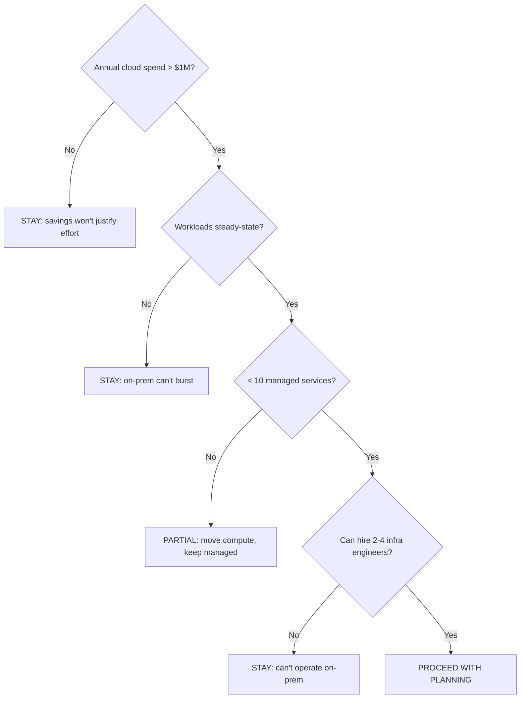
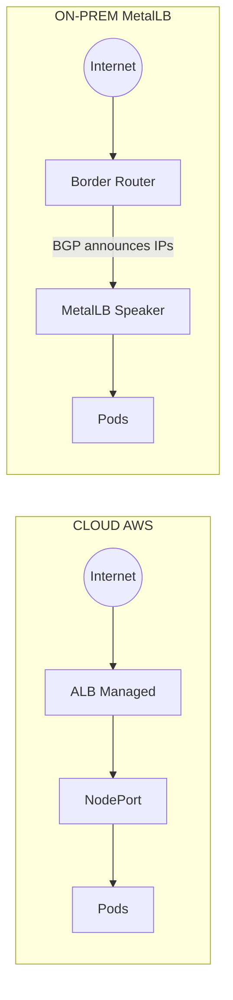
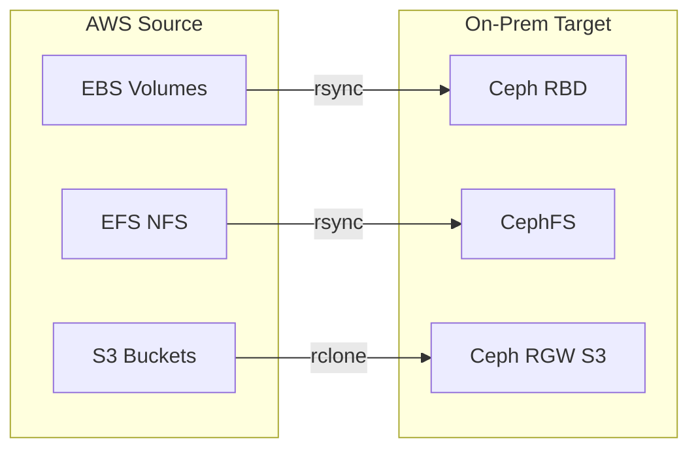
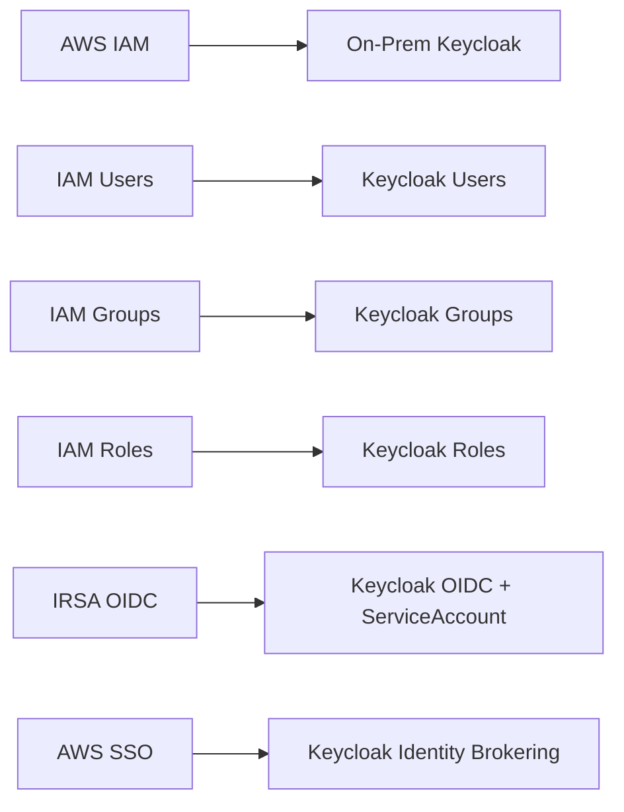
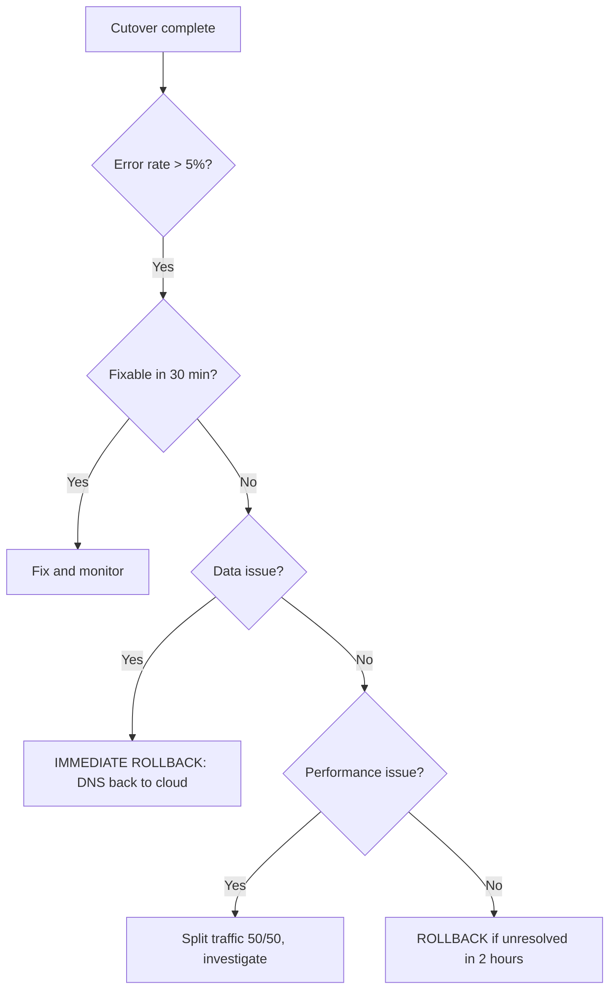

> **Complexity**: `[ADVANCED]` | Time: 90 minutes
>
> **Prerequisites**: [Module 8.1: Multi-Site & Disaster Recovery](/on-premises/resilience/module-8.1-multi-site-dr/), [Module 8.2: Hybrid Cloud Connectivity](/on-premises/resilience/module-8.2-hybrid-connectivity/)

---

## What You'll Be Able to Do

After completing this exhaustive and deeply technical module, you will be capable of executing the following architectural and engineering tasks:

1. **Evaluate** cloud repatriation economics using comprehensive five-year total cost of ownership (TCO) models that incorporate hidden staffing limitations, prohibitive network egress fees, and the sheer engineering effort required for large-scale migration.
2. **Design** complex, highly phased migration architectures that methodically replace proprietary cloud-provider managed services (such as RDS, ElastiCache, and ALB) with robust, self-managed on-premises equivalents built on open-source primitives.
3. **Implement** low-downtime data and persistent state migration strategies utilizing robust CLI utilities like `rclone`, advanced backup controllers like Velero, and robust storage backends like Ceph to maintain uninterrupted continuity across geographic and infrastructure boundaries.
4. **Diagnose** complicated authentication and networking translation failures by manually mapping proprietary cloud constructs (like AWS IAM, IRSA, and LoadBalancer configurations) to standardized Kubernetes RBAC, OIDC integrations, and BGP peering configurations.
5. **Compare** the strategic advantages and operational burdens of full bare-metal repatriation against modern hybrid managed offerings (such as AWS Outposts or Google Distributed Cloud) to determine the absolute optimal infrastructure footprint for your organization's specific latency, compliance, and budget requirements.

---

## Why This Module Matters

In late 2022, the software company 37signals (creators of Basecamp and HEY) initiated a massive, highly publicized cloud exit that sent immediate shockwaves through the technology industry. Prior to the migration, they were spending a staggering $3.2 million annually on Amazon Web Services. While secondary sources frequently cite $3.2 million as the annual *savings*, this is a conflicting claim. According to their official `basecamp.com/cloud-exit` portal, $3.2 million was their actual cloud baseline spend. By strategically repatriating their workloads to owned bare-metal hardware, their claimed savings are approximately $1.5 million per year in compute alone, culminating in a revised estimated total savings of roughly $10 million over a five-year horizon.

This migration took eight intensive months of dedicated engineering time. It was absolutely not a simple lift-and-shift of stateless containerized workloads. Every single AWS-managed service had to be systematically ripped out and replaced with a self-managed, robust equivalent. Managed relational databases (Amazon RDS) were replaced by highly available, self-managed PostgreSQL clusters. In-memory data stores (Amazon ElastiCache) were swapped for manually operated Redis Sentinel deployments. Managed routing (Application Load Balancers) was migrated to HAProxy and NGINX instances. Furthermore, proprietary observability (CloudWatch) had to be replaced with full Prometheus and Grafana stacks. The stateless compute portion of the migration was trivial; the truly punishing engineering work was untangling the complex web of managed services, proprietary load balancing algorithms, stateful block storage, dynamic secrets management, and dozens of cloud APIs quietly adopted by their developer teams over half a decade.

By early 2023, 37signals successfully completed the bulk of the migration, achieving the massive infrastructure cost reductions they hypothesized. However, achieving this required them to hire additional specialized systems engineers and spend months stabilizing their new self-managed database infrastructure. Cloud repatriation is a highly viable, economically compelling path at specific scales, but the execution requires deep, uncompromising systems engineering expertise and an organizational willingness to assume absolute responsibility for hardware failure.

> **The Moving House Analogy**
>
> Moving your infrastructure from a public cloud provider to an on-premises datacenter is fundamentally like moving from a fully furnished, serviced luxury rental apartment to a large house you purchase outright. The rental included all the appliances, the furniture (managed services), and a 24/7 responsive maintenance crew (cloud operations teams). Your newly purchased house is vastly cheaper over a ten-year horizon, but you have to buy all your own furniture, learn how to fix your own plumbing, manage your own security, and take absolute, unwavering ownership of the roof over your head when it begins to leak.

---

## What You'll Learn

- When cloud repatriation makes economic sense
- Translating cloud load balancers (ALB/NLB) to MetalLB
- Storage migration from EBS/EFS to Ceph
- IAM translation from AWS IAM to Keycloak
- Data gravity and migration sequencing
- Phased migration with rollback plans

---

## Section 1: The Economics of Cloud Repatriation

Before you touch a single Kubernetes manifest, modify a DNS record, or open a terminal window, you must rigorously evaluate the underlying economics of the proposed move. Repatriation is fundamentally an exercise in shifting from operating expenditure (OpEx) to capital expenditure (CapEx) while dramatically increasing your operational burden. 

Here is the baseline, industry-standard decision matrix for evaluating a repatriation effort. If you fail to meet the required thresholds at any node, the migration is mathematically likely to fail or cost more than it saves.



The financial breakdown typically looks like the following table when amortizing high-density datacenter hardware over a standard four-year lifecycle. Note the introduction of specialized personnel costs that are entirely absent from the cloud column.

| Factor | Cloud (Annual) | On-Prem (Annual) |
|--------|---------------|-----------------|
| Compute (200 nodes) | $1,200,000 | $180,000 (amortized 4yr) |
| Storage (100TB) | $240,000 | $40,000 (Ceph, amortized) |
| Network egress | $180,000 (20TB/mo) | $12,000 (colo bandwidth) |
| Managed services | $360,000 | $0 (self-managed) |
| Additional staff | $0 | $400,000 (2 SREs) |
| Colocation | $0 | $144,000 |
| **Total** | **$1,980,000** | **$776,000 (61% savings)** |

> **Warning**: At 20 nodes, cloud is almost always cheaper when you factor in staff time. Breakeven is typically 50-100 nodes depending on workload density and cloud discounts (Reserved Instances, Committed Use Discounts).

There is a massive psychological trap in evaluating this matrix. Organizations frequently look only at the compute and storage line items and fail to account for the human cost of managing hardware. When a power supply unit fails at 3:00 AM in a colocation facility, Amazon is not going to replace it for you. You must have on-call staff or an expensive "smart hands" contract with the datacenter facility to physically swap the hardware.

Furthermore, cloud environments are heavily optimized for bursty workloads—applications that sit idle for hours and suddenly demand massive compute resources during a specific event (like a Black Friday sale or a sudden viral traffic spike). Public clouds handle this through dynamic auto-scaling. On-premises, you are physically constrained by the exact number of servers bolted into your racks. If your peak traffic requires 300 nodes, but your steady-state traffic only requires 50 nodes, you must purchase, power, and cool all 300 nodes 24/7/365, utterly destroying the economic benefits of repatriation.

> **Pause and predict**: 37signals spent $3.2M/year on AWS and estimated on-prem would cost $776K/year. But they also hired 2 additional engineers. At what cloud spend level does the engineering cost make repatriation not worthwhile?

---

## Section 2: Hybrid Cloud and Partial Repatriation Alternatives

Full bare-metal repatriation—where you purchase servers, configure top-of-rack switches, and manage hardware warranties—is not the only viable architectural path. If your primary organizational concerns dictate mitigating data gravity, satisfying strict geographic regulatory compliance, or achieving ultra-low latency to local industrial equipment, rather than prioritizing pure operational cost savings, you can seamlessly utilize managed on-premises footprints.

Major cloud providers have acknowledged the desire for hybrid infrastructure and developed robust, generally available product lines:

- **AWS Outposts Family**: This hardware suite is generally available in [two primary form factors: massive 42U Outposts Racks for large deployments, and smaller 1U/2U Outposts Servers for edge locations](https://docs.aws.amazon.com/outposts/latest/userguide/what-is-outposts.html). Second-generation Outposts racks expanded to over 20 additional countries in January 2026. These physical devices run directly in your datacenter, but the control plane remains entirely managed by AWS.
- **Google Distributed Cloud (GDC)**: Formerly known by the brand name Anthos (which has been officially retired across all Google documentation and partner programs), [GDC provides comprehensive hardware and software solutions to execute Google Cloud services securely at the edge or deep within your private datacenter infrastructure](https://cloud.google.com/distributed-cloud/docs).
- **Azure Arc**: Microsoft's management plane is generally available across multiple critical components, including Arc-enabled Servers, Arc-enabled Kubernetes, Arc-enabled SQL, and the highly anticipated [Arc Gateway (which reached GA for Arc-enabled Kubernetes in early 2026)](https://learn.microsoft.com/en-us/azure/azure-arc/kubernetes/release-notes). [Azure Arc allows you to project on-premises resources into the centralized Azure control plane for unified management, observability, and policy enforcement](https://learn.microsoft.com/en-us/azure/azure-arc/overview).

### Virtualization in the Container Era

If your organizational goal involves migrating legacy monolithic virtual machines directly into your new, pristine containerized environment alongside your microservices, the CNCF ecosystem offers robust, production-ready solutions. 

For managing on-premises infrastructure using declarative infrastructure-as-code paradigms, **Crossplane** is highly recommended. [It is a mature CNCF Graduated project](https://www.cncf.io/projects/crossplane/), with its current stable version v2.2.0 released on February 17, 2025. 

To execute full virtual machines natively inside Kubernetes pods—sharing the exact same network overlay and RBAC controls as your containers—**KubeVirt** is the industry standard. It is a CNCF Incubating project that is rapidly approaching graduation. [KubeVirt v1.8.0 was released on March 25, 2026, aligning seamlessly with the Kubernetes v1.35 release cycle](https://www.cncf.io/blog/2026/03/25/announcing-the-release-of-kubevirt-v1-8/).

Alternatively, if you require a commercial, heavily supported enterprise platform, **Red Hat OpenShift Virtualization** (formerly Container Native Virtualization) is generally available and offers a polished experience. The latest stable release is [OpenShift Virtualization 4.21, providing profound VM-centric features integrated natively into the OpenShift dashboard](https://www.redhat.com/en/blog/whats-new-red-hat-openshift-virtualization-421).

*An important distinction must be made regarding vendor claims in the virtualization space: Sources frequently conflate Harvester being 'built on CNCF projects' with it being a CNCF project itself. According to the official CNCF project landscape, SUSE/Rancher's Harvester HCI (current stable v1.7.1, released February 10, 2025) does not appear as a named project and does not have an official CNCF maturity level, despite utilizing CNCF projects like KubeVirt and Longhorn under the hood.*

---

## Section 3: Translating Cloud Networking to Bare Metal

When shifting workloads out of the public cloud, you abruptly lose the invisible, highly available magic of native cloud load balancers. In AWS, exposing a high-traffic microservice to the public internet is as fundamentally simple as creating an Application Load Balancer (ALB) via an ingress object. AWS silently provisions a fleet of underlying EC2 instances, manages the high-availability failover, and scales the fleet up and down based on your ingress bandwidth.

On bare metal, you possess none of this automated luxury. You must manually announce your IP routes to your physical networking gear using established routing protocols.



To achieve this critical routing capability on-premises, engineers typically deploy **MetalLB** operating in BGP (Border Gateway Protocol) mode. MetalLB effectively transforms your standard Kubernetes worker nodes into sophisticated software routers that peer directly with your Top-of-Rack (ToR) or Border routing switches.

The configuration requires establishing a strict peering relationship. This manifest defines the ASN (Autonomous System Number) of your cluster and the target router.

```yaml
# MetalLB with BGP mode - Peer Configuration
apiVersion: metallb.io/v1beta2
kind: BGPPeer
metadata:
  name: datacenter-router
  namespace: metallb-system
spec:
  myASN: 64500
  peerASN: 64501
  peerAddress: 10.0.0.1
```

Next, you must allocate a dedicated pool of routable IP addresses that MetalLB is authorized to assign to newly created `LoadBalancer` services within your cluster.

```yaml
# MetalLB with BGP mode - IP Pool Configuration
apiVersion: metallb.io/v1beta1
kind: IPAddressPool
metadata:
  name: production-pool
  namespace: metallb-system
spec:
  addresses:
  - 192.168.1.240/28    # 14 usable IPs for LoadBalancer services
```

Finally, you instruct MetalLB to actively advertise these IP pools to the BGP peers established earlier, ensuring that external traffic knows exactly which cluster nodes can accept packets for the given IP address.

```yaml
# MetalLB with BGP mode - Advertisement Configuration
apiVersion: metallb.io/v1beta1
kind: BGPAdvertisement
metadata:
  name: production-advertisement
  namespace: metallb-system
spec:
  ipAddressPools:
  - production-pool
```

### AWS ALB Annotation Translation

Cloud load balancers simplify operations by bundling multiple distinct network functions—such as Transport Layer Security (TLS) termination, Web Application Firewall (WAF) execution, and complex path-based routing—into [a few declarative annotations](https://github.com/kubernetes-sigs/aws-load-balancer-controller/blob/main/docs/guide/ingress/annotations.md). On-premises, these monolithic responsibilities are fractured and split across multiple independent, self-managed open-source tools.

| AWS Annotation | On-Prem Equivalent |
|---------------|-------------------|
| `scheme: internet-facing` | MetalLB IPAddressPool with routable IPs |
| `certificate-arn` | cert-manager with Let's Encrypt or internal CA |
| `wafv2-acl-arn` | ModSecurity in NGINX Ingress |
| `target-type: ip` | Default kube-proxy behavior |
| `healthcheck-path` | NGINX Ingress `health-check-path` annotation |
| `ssl-redirect: "443"` | `nginx.ingress.kubernetes.io/force-ssl-redirect: "true"` |

Migrating an application relies heavily on translating these annotations flawlessly; [missing a WAF annotation could expose your migrated application to severe security vulnerabilities](https://owasp.org/www-community/Web_Application_Firewall) on day one of your on-premises deployment.

---

## Section 4: Data Gravity and Storage Migration

"Data gravity" is an inescapable principle of systems engineering. It dictates that massive datasets inevitably attract the applications that process them, much like physical mass attracts matter. Moving 100 terabytes of stateful database volumes across a network takes many continuous days or even weeks due to strict bandwidth limitations. Conversely, moving the stateless containerized application that reads that data takes mere minutes via a simple `kubectl apply` command. 

Therefore, your migration sequence must stringently follow the data: you must migrate the storage first, keep it continuously synchronized with the source, and then rapidly cut over the applications to minimize downtime.



> **Stop and think**: You need to migrate 50TB of data from AWS S3 to on-premises Ceph RGW over a 1 Gbps Direct Connect. At best, that is ~7 days of continuous transfer. During that time, the application is still writing new data to S3. How do you handle the gap between the initial sync and the final cutover?

### EBS to Ceph RBD

The most reliable migration pattern for raw block storage (such as AWS Elastic Block Store to Ceph RADOS Block Device) requires constructing a temporary transfer bridge. You must snapshot the cloud volume to freeze its state, mount that snapshot to an intermediate temporary EC2 instance, and then aggressively `rsync` the raw data down through your network circuit to a dedicated migration pod residing on the bare-metal cluster. This migration pod writes the incoming data directly into a pre-provisioned Ceph RBD PersistentVolumeClaim.

```bash
# On AWS: snapshot and mount to a transfer instance
aws ec2 create-snapshot --volume-id vol-0123456789abcdef

# On on-prem: create StorageClass and PVC
kubectl apply -f - <<EOF
apiVersion: storage.k8s.io/v1
kind: StorageClass
metadata:
  name: ceph-block
provisioner: rook-ceph.rbd.csi.ceph.com
parameters:
  clusterID: rook-ceph
  pool: replicapool
  imageFormat: "2"
reclaimPolicy: Retain
allowVolumeExpansion: true
EOF

# Transfer via a migration pod
kubectl apply -f - <<EOF
apiVersion: v1
kind: Pod
metadata:
  name: data-migration
  namespace: production
spec:
  containers:
  - name: rsync
    image: instrumentisto/rsync-ssh:latest
    command: ["rsync", "-avz", "--progress",
      "-e", "ssh -i /keys/transfer-key",
      "ubuntu@aws-transfer.internal.corp:/mnt/ebs-data/",
      "/target-data/"]
    volumeMounts:
    - name: target-vol
      mountPath: /target-data
  volumes:
  - name: target-vol
    persistentVolumeClaim:
      claimName: app-data
  restartPolicy: Never
EOF
```

### S3 to Ceph RGW

For highly concurrent object storage migration, traditional tools like `rsync` fall short due to their reliance on file system tree walking. Instead, `rclone` is the industry standard. [It provides an idempotent synchronization operation utilizing the S3 API directly](https://github.com/rclone/rclone). It can gracefully resume after network interruptions and run rapid, incremental nightly syncs to quickly catch up with new data written by the live application during the extended migration window.

```bash
# Configure rclone for both endpoints
rclone config  # Set up aws-s3 and ceph-rgw remotes

# Sync
rclone sync aws-s3:app-assets ceph-rgw:app-assets --progress --transfers 16

# Verify
rclone check aws-s3:app-assets ceph-rgw:app-assets
```

For [comprehensive state migration of native Kubernetes resources (such as CustomResourceDefinitions, Secrets, and ConfigMaps) alongside persistent volumes](https://github.com/vmware-tanzu/velero), **Velero** is the undisputed industry standard tool. As of its v1.18.0 release in March 2025, [Velero introduced highly anticipated concurrent backup processing and sophisticated cache volume support](https://github.com/vmware-tanzu/velero/releases/tag/v1.18.0), drastically reducing recovery time objectives (RTO). Recognizing its critical role in the ecosystem, [Broadcom officially donated Velero to the CNCF Sandbox in April 2026](https://www.cncf.io/news/2026/04/02/the-new-stack-why-broadcom-gave-velero-to-the-cncf-sandbox-and-what-it-means-for-kubernetes-data-protection/).

If your organization prefers managed enterprise tooling over composing bash scripts, options include **[AWS Application Migration Service (MGN)** (recently updated with agentless vCenter support)](https://docs.aws.amazon.com/mgn/latest/ug/installing-vcenter-appliance-mgn.html), **[Azure Migrate** (which deprecated its classic project version in Feb 2024)](https://learn.microsoft.com/en-us/azure/migrate/create-manage-projects), or Google's **Migrate to Containers**. The latter released v1.15.0 in May 2024, notably deprecating the console UI and `migctl` tooling in favor of a strictly local CLI workflow.

---

## Section 5: Identity and Authentication Translation

Proprietary cloud Identity and Access Management (IAM) systems invisibly embed themselves deep into your application architecture. This is especially prevalent when development teams utilize modern features like IRSA (IAM Roles for Service Accounts) in AWS, which injects temporary AWS STS tokens directly into running pods, allowing the application to authenticate to other AWS services like RDS or S3 natively.



### Kubernetes OIDC with Keycloak

When you leave the public cloud, you completely lose the IAM control plane. To replace this functionality for cluster authentication, you must stand up an OpenID Connect (OIDC) Identity Provider (IdP) like Keycloak. You then [configure the core Kubernetes API server to implicitly trust Keycloak's cryptographic signatures via OIDC](https://kubernetes.io/docs/reference/access-authn-authz/authentication/).

```yaml
# kube-apiserver flags
- --oidc-issuer-url=https://auth.internal.corp/realms/kubernetes
- --oidc-client-id=kubernetes-apiserver
- --oidc-username-claim=preferred_username
- --oidc-groups-claim=groups
- --oidc-ca-file=/etc/kubernetes/pki/keycloak-ca.crt
```

Once OIDC is strictly configured and the API server can validate JSON Web Tokens (JWTs) issued by Keycloak, you must painstakingly map Keycloak user groups directly to Kubernetes RBAC (Role-Based Access Control) constructs. This is achieved via `RoleBinding` or `ClusterRoleBinding` manifests.

```yaml
# RBAC binding for Keycloak groups - Platform Admins
apiVersion: rbac.authorization.k8s.io/v1
kind: ClusterRoleBinding
metadata:
  name: keycloak-platform-admins
subjects:
- kind: Group
  name: platform-admins     # Matches Keycloak group
  apiGroup: rbac.authorization.k8s.io
roleRef:
  kind: ClusterRole
  name: cluster-admin
  apiGroup: rbac.authorization.k8s.io
```

```yaml
# RBAC binding for Keycloak groups - Developers
apiVersion: rbac.authorization.k8s.io/v1
kind: RoleBinding
metadata:
  name: keycloak-developers
  namespace: development
subjects:
- kind: Group
  name: developers
  apiGroup: rbac.authorization.k8s.io
roleRef:
  kind: ClusterRole
  name: edit
  apiGroup: rbac.authorization.k8s.io
```

> **Warning**: The utilization of IRSA is deeply, fundamentally AWS-specific. [Any application pod utilizing IRSA relies on an AWS mutating admission webhook to function](https://docs.aws.amazon.com/eks/latest/eksctl/iamserviceaccounts.html). Therefore, any pod carrying the `eks.amazonaws.com/role-arn` annotation requires significant fundamental configuration changes to authenticate securely on-premises against self-managed databases. You must exhaustively audit your clusters for these annotations prior to executing any migration effort.

---

## Section 6: Network Connectivity for Migration

For massive stateful data transfers, attempting to route traffic over the unpredictable public internet is an exercise in futility. As of 2026, the primary, enterprise-grade dedicated connectivity options for cloud-to-on-prem migration networking remain strictly dedicated circuits: **Site-to-Site VPN** (only suitable for low-bandwidth environments), **AWS Direct Connect**, and **Azure ExpressRoute** (with **Google Cloud Interconnect** serving the exact equivalent role for GCP workloads).

Microsoft's own architectural documentation explicitly ranks [ExpressRoute as the preferred networking choice for achieving the absolute highest bandwidth and lowest latency during migration](https://learn.microsoft.com/en-us/azure/storage-mover/cloud-to-cloud-private-network-configs), explicitly relegating traditional IPsec VPNs to a secondary backup or failover role due to their inherent protocol overhead and susceptibility to internet routing fluctuations. Establishing these dedicated circuits early in your preparation phase is non-negotiable for a successful data transfer timeline.

---

## Section 7: Phased Migration and Cutover Strategy

A successful infrastructure repatriation takes multiple months of careful, deliberate sequencing. Attempting a "big bang" cutover—where you shut down the cloud and simultaneously power on the on-premises datacenter—is a guaranteed recipe for catastrophic, resume-generating downtime.


### Rollback Plan

In systems engineering, hope is not a strategy. You must possess a clearly defined, thoroughly rehearsed rollback protocol. If the cutover initiates cascading failures, the decision to revert must be binary and pre-authorized.



Executing a successful rollback requires technical precision to ensure continuous data integrity is flawlessly maintained during the pivot back to the cloud:

```bash
# Pre-cutover validation
rclone check aws-s3:production-data ceph-rgw:production-data
kubectl --context on-prem get pods -n production | grep -v Running  # Should be empty

# Rollback: redirect DNS back to cloud
kubectl --context cloud annotate service api-gateway \
  external-dns.alpha.kubernetes.io/hostname=api.internal.corp

# Sync any data written to on-prem back to cloud
rclone sync ceph-rgw:production-data aws-s3:production-data --progress
```

Ensure your target on-premises infrastructure is actively running a modern, supported standard—such as Kubernetes v1.35.3 (the latest stable patch released on March 19, 2026)—to absolutely guarantee maximum API compatibility with modern cloud-native migration tooling.

---

## Did You Know?

1. **Dropbox executed a legendary migration, moving 90% of their storage from AWS S3** to custom-built infrastructure (dubbed "Magic Pocket") in 2016, realizing estimated savings of ~$75 million over two years. Crucially, they intelligently retained unpredictable workloads (like ML training models and isolated experiments) on AWS.
2. **Cloud data egress pricing is heavily asymmetric by intentional design.** AWS charges roughly $0.09/GB to extract your data out of their network, but $0.00/GB to ingest it. Therefore, migrating a 100TB dataset incurs a baseline fee of ~$9,200 just to download the bytes—embodying the classic "Hotel California" pricing model where leaving is intentionally expensive.
3. **Deploying MetalLB in BGP mode fundamentally transforms your entire cluster into a distributed router.** Each allocated LoadBalancer IP acts as an independent BGP route. If a designated speaker node suffers a catastrophic hardware failure, another node assumes control in merely 1 to 3 seconds (dictated by the BGP hold timer)—vastly faster than standard DNS failover mechanisms.
4. **A self-hosted Keycloak instance routinely handles 2,500+ authentication requests per second** on a single, well-resourced instance. In stark contrast, AWS Cognito enforces a strict soft limit of 120 requests per second per user pool. A properly deployed three-replica Keycloak cluster can smoothly support upwards of 500,000 active users.

---

## Common Mistakes

| Mistake | Why It Happens | What To Do Instead |
|---------|---------------|-------------------|
| Big-bang migration | Impatience | Migrate in phases: non-critical first, production last |
| Ignoring data egress costs | Focus on destination | Budget $0.09/GB for AWS egress upfront |
| Forgetting managed service deps | Developers use services silently | [Audit all AWS API calls via CloudTrail](https://docs.aws.amazon.com/awscloudtrail/latest/userguide/cloudtrail-user-guide.html) |
| No parallel running period | "We tested in staging" | Run both environments 2-4 weeks with shadow traffic |
| Hardcoded cloud endpoints | SDK defaults (s3.amazonaws.com) | Use env vars for all endpoints; grep for cloud URLs |
| No rollback plan | Optimism bias | Document and rehearse rollback; keep cloud running 30 days |

---

## Hands-On Exercise: Simulate Cloud-to-On-Prem Migration

**Objective**: Safely migrate a mock workload between two isolated `kind` clusters, successfully translating proprietary cloud endpoints to functional on-premises equivalents.

1. **Bootstrap Clusters**: Execute the commands to create two completely isolated `kind` clusters. These will artificially simulate your public cloud and target on-premises environments.
2. **Deploy Cloud Configs**: Provision a mock stateless application inside the simulated cloud cluster, carefully utilizing standard AWS service endpoints within the configuration.
3. **Translate Configs**: Provision the exact identical application inside the on-premises cluster, updating the environmental endpoints to accurately point to internal Kubernetes services (such as Ceph RGW or a self-hosted Redis instance).
4. **Checkpoint Verification**: Verify explicitly that the application pods are fully running, initialized, and ready in both environments before performing your configuration analysis.
   ```bash
   # Verify pod readiness on both clusters before proceeding
   kubectl --context kind-cloud-sim wait --for=condition=ready pod -l app=webapp -n webapp --timeout=90s
   kubectl --context kind-onprem-sim wait --for=condition=ready pod -l app=webapp -n webapp --timeout=90s
   ```
5. **Validate**: Execute `kubectl get configmap -o yaml` against both distinct clusters. Compare the running configurations directly to clearly understand how the application views its specific environment.
6. **Clean Up**: Systematically tear down the simulation environments to reclaim local compute resources.

<details>
<summary>View Solution</summary>

```bash
# 1. Create clusters
kind create cluster --name cloud-sim
kind create cluster --name onprem-sim

# 2. Deploy "cloud" app with cloud-specific config
kubectl config use-context kind-cloud-sim
kubectl create namespace webapp
kubectl create configmap app-settings -n webapp \
  --from-literal=DB_HOST=rds.aws.internal \
  --from-literal=CACHE_HOST=elasticache.aws.internal \
  --from-literal=S3_ENDPOINT=https://s3.amazonaws.com
kubectl create deployment webapp --image=nginx:1.27-alpine -n webapp --replicas=3

# 3. Deploy on on-prem with translated config
kubectl config use-context kind-onprem-sim
kubectl create namespace webapp
kubectl create configmap app-settings -n webapp \
  --from-literal=DB_HOST=postgres.database.svc.cluster.local \
  --from-literal=CACHE_HOST=redis.cache.svc.cluster.local \
  --from-literal=S3_ENDPOINT=http://rgw.onprem.internal
kubectl create deployment webapp --image=nginx:1.27-alpine -n webapp --replicas=3

# 4. Checkpoint Verification
kubectl --context kind-cloud-sim wait --for=condition=ready pod -l app=webapp -n webapp --timeout=90s
kubectl --context kind-onprem-sim wait --for=condition=ready pod -l app=webapp -n webapp --timeout=90s

# 5. Compare configurations
echo "=== Cloud ==="
kubectl --context kind-cloud-sim get configmap app-settings -n webapp -o yaml
echo "=== On-Prem ==="
kubectl --context kind-onprem-sim get configmap app-settings -n webapp -o yaml

# 6. Clean up
kind delete cluster --name cloud-sim
kind delete cluster --name onprem-sim
```
</details>

### Success Criteria
- [ ] Application deployed on both distinctly named clusters successfully.
- [ ] ConfigMap successfully and accurately translated from cloud constructs to on-prem endpoints.
- [ ] Both environments strictly verified with actively running, ready pods.
- [ ] Differences between the operational configurations thoroughly documented and fundamentally understood.

---

## Quiz

### Question 1
Your company presently spends roughly $800K/year on AWS running a steady 50-node Kubernetes cluster. The newly hired CFO reads an article detailing 37signals saving millions through cloud repatriation and immediately asks you to plan a full move to on-premises bare metal. Your initial architectural estimate projects a $600K/year operating cost, plus the necessity of 2 additional dedicated SRE hires at an estimated $200K each. Based on these projections, should you recommend proceeding with the migration?

<details>
<summary>Answer</summary>

No. At 50 nodes, the economics simply do not justify the massive operational burden of repatriation. While on-premises operating costs and amortized hardware might seem cheaper on paper, adding the necessary specialized engineering staff drastically changes the equation. In this specific scenario, the total ongoing yearly cost (including the $400K staff requirement) reaches $1M/year, which is significantly more expensive than the current $800K cloud bill. Instead of a risky migration, you should optimize the existing cloud spend using Reserved Instances, right-sizing, and spot instances, which can aggressively reduce the AWS bill with minimal engineering effort. Repatriation only becomes economically viable when infrastructure scale reaches a critical mass (typically well beyond 100 nodes) where the fixed costs of specialized staff are easily absorbed by the sheer volume of compute savings.
</details>

### Question 2
Your heavily utilized AWS-hosted application currently leverages a managed ALB heavily configured with three distinct annotations: `certificate-arn` (responsible for automatic TLS termination), `wafv2-acl-arn` (responsible for web application firewall integration), and `ssl-redirect: "443"` (responsible for forcing HTTPS traffic). You are actively migrating this exact service to an on-premises Kubernetes cluster equipped with standard NGINX Ingress. How do you accurately replicate each distinct capability?

<details>
<summary>Answer</summary>

To accurately replicate these capabilities, you must deploy and configure three distinct open-source systems, as on-premises environments fundamentally lack a monolithic managed load balancer. First, you must deploy cert-manager with a Let's Encrypt ClusterIssuer and reference it via an annotation on your Ingress to replace the automated TLS termination of the `certificate-arn`. Second, to replace the `wafv2-acl-arn`, you must enable ModSecurity (or a modern equivalent like Coraza) within your NGINX Ingress controller configuration to provide application firewall protections. Finally, you can reliably replicate the `ssl-redirect: "443"` behavior by adding the `nginx.ingress.kubernetes.io/force-ssl-redirect: "true"` annotation directly to your Ingress resource. This highlights the hidden operational burden of repatriation: you are trading a single cloud configuration for the ongoing maintenance and lifecycle management of multiple independent security systems.
</details>

### Question 3
You are deploying `rclone` to meticulously migrate 50TB of mission-critical data from AWS S3 to an on-premises Ceph RGW cluster. The transit path utilizes a stable 1 Gbps AWS Direct Connect circuit. Based on this technical constraint, how long will the fundamental transfer take, what specific risks must you monitor, and precisely how do you handle new data that continually changes during the lengthy migration window?

<details>
<summary>Answer</summary>

At a practical network throughput of roughly 100 MB/s, transferring 50TB over a 1 Gbps circuit will take approximately six to seven days of continuous, uninterrupted network saturation. Because the production application continues writing new data to S3 during this lengthy window, attempting a single bulk copy right before cutover will inevitably cause unacceptable business downtime. Instead, you must begin the initial bulk synchronization several weeks in advance using `rclone sync`, which is naturally idempotent and highly resilient to sudden network interruptions. Once the initial bulk transfer completes, you must run rapid, incremental nightly syncs to transfer only the newly modified storage objects. Finally, during the actual scheduled cutover window, a final incremental sync will only take minutes, safely bridging the data gap and ensuring absolute consistency before redirecting production traffic.
</details>

### Question 4
Immediately after executing your migration from AWS to your self-hosted on-premises environment, your core application pods violently crash, completely unable to authenticate to the newly self-managed PostgreSQL database instance. On AWS, the application had exclusively utilized IRSA (IAM Roles for Service Accounts) to effortlessly obtain temporary STS credentials for RDS IAM database authentication. Structurally, what exactly broke in the new environment, and how do you architecturally fix it?

<details>
<summary>Answer</summary>

The catastrophic failure occurs because the entire IRSA authentication chain is strictly proprietary to AWS and fundamentally does not exist in an on-premises environment. On AWS, a mutating admission webhook automatically injects temporary STS tokens into pods, which the application then uses to authenticate against RDS via native IAM protocols. On bare metal, there is no STS endpoint, no webhook, and the self-managed database does not natively understand AWS IAM credentials. To fix this architecturally, you must transition to standard password-based database authentication, ideally utilizing a system like Vault combined with the External Secrets Operator to dynamically generate and rotate credentials. These credentials must then be securely injected into the pods as standard Kubernetes Secrets, requiring a configuration update to the application's connection string to rely on standard authentication.
</details>

### Question 5
Your large-scale organization has officially decided to aggressively migrate a dense, 200TB analytical data lake from the AWS ecosystem directly to an on-premises high-density Ceph cluster. The incumbent Chief Data Officer forcefully suggests establishing a standard Site-to-Site VPN over the public internet to aggressively save on transit and infrastructure costs. As the lead systems architect, technically evaluate the viability of this proposal.

<details>
<summary>Answer</summary>

This proposal is highly risky and mathematically likely to fail due to the inherent unreliability and packet volatility of public internet routing. Transferring 200TB of analytical data over a standard Site-to-Site VPN is impractical because IPsec protocol overhead, unpredictable latency spikes, and constant bandwidth contention will extend the transfer window to several months, risking frequent connection drops and catastrophic data corruption. For massive stateful data transfers of this exact magnitude, dedicated physical connectivity is absolutely mandatory to ensure a predictable and stable migration timeframe. You must provision a dedicated circuit like AWS Direct Connect, which provides a private, high-bandwidth connection with consistent latency, thereby mitigating the severe risk of a resume-generating data migration failure.
</details>

---

## Next Module

This formally concludes the final, culminating module in the comprehensive Resilience & Migration section. Your extensive technical journey—from establishing core fault tolerance patterns to architecting massive, multi-petabyte full cloud exits—is fundamentally complete. 

Return directly to the [Resilience & Migration overview](/on-premises/resilience/) to review the full section architecture, or continue your deep technical dive by stepping forward into the extraordinarily complex routing challenges presented in the upcoming bare-metal networking track.

## Sources

- [docs.aws.amazon.com: welcome.html](https://docs.aws.amazon.com/wellarchitected/latest/cost-optimization-pillar/welcome.html) — General lesson point for an illustrative rewrite.
- [docs.aws.amazon.com: what is outposts.html](https://docs.aws.amazon.com/outposts/latest/userguide/what-is-outposts.html) — The AWS Outposts user guide documents 42U racks, 1U/2U servers, AWS-managed hardware, and the service link to an AWS Region.
- [cloud.google.com: docs](https://cloud.google.com/distributed-cloud/docs) — The Google Distributed Cloud documentation describes connected, air-gapped, and software-only components for edge and data-center use.
- [learn.microsoft.com: overview](https://learn.microsoft.com/en-us/azure/azure-arc/overview) — Microsoft's Azure Arc overview directly lists servers, Kubernetes clusters, Azure data services, and SQL Server as supported resource types.
- [learn.microsoft.com: release notes](https://learn.microsoft.com/en-us/azure/azure-arc/kubernetes/release-notes) — The Azure Arc-enabled Kubernetes release notes list the general availability of Azure Arc gateway for Kubernetes.
- [cncf.io: crossplane](https://www.cncf.io/projects/crossplane/) — The CNCF project page lists Crossplane as Graduated and describes its control-plane role.
- [cncf.io: announcing the release of kubevirt v1 8](https://www.cncf.io/blog/2026/03/25/announcing-the-release-of-kubevirt-v1-8/) — The CNCF KubeVirt v1.8 announcement states the March 25, 2026 release and alignment with Kubernetes v1.35.
- [redhat.com: whats new red hat openshift virtualization 421](https://www.redhat.com/en/blog/whats-new-red-hat-openshift-virtualization-421) — Red Hat's release post states that OpenShift Virtualization 4.21 is generally available and summarizes new VM management capabilities.
- [github.com: annotations.md](https://github.com/kubernetes-sigs/aws-load-balancer-controller/blob/main/docs/guide/ingress/annotations.md) — The AWS Load Balancer Controller annotation reference documents the ALB annotations named in the module.
- [owasp.org: Web Application Firewall](https://owasp.org/www-community/Web_Application_Firewall) — OWASP describes WAFs as application-layer controls that filter, monitor, and block HTTP traffic.
- [github.com: rclone](https://github.com/rclone/rclone) — The upstream rclone repository describes rclone as a tool for syncing files with cloud storage and includes S3-compatible backend support.
- [github.com: velero](https://github.com/vmware-tanzu/velero) — The upstream Velero repository describes backup, restore, disaster recovery, and Kubernetes cluster resource migration use cases.
- [github.com: v1.18.0](https://github.com/vmware-tanzu/velero/releases/tag/v1.18.0) — The upstream v1.18 release notes list concurrent backup processing and cache-volume/data-movement changes.
- [cncf.io: the new stack why broadcom gave velero to the cncf sandbox and what it means for kubernetes data protection](https://www.cncf.io/news/2026/04/02/the-new-stack-why-broadcom-gave-velero-to-the-cncf-sandbox-and-what-it-means-for-kubernetes-data-protection/) — The CNCF news item discusses Broadcom donating Velero to CNCF Sandbox.
- [docs.aws.amazon.com: installing vcenter appliance mgn.html](https://docs.aws.amazon.com/mgn/latest/ug/installing-vcenter-appliance-mgn.html) — The AWS MGN documentation describes installing the MGN vCenter Client for agentless migration.
- [learn.microsoft.com: create manage projects](https://learn.microsoft.com/en-us/azure/migrate/create-manage-projects) — Microsoft's Azure Migrate project documentation states that classic Azure Migrate retired in February 2024 and classic metadata would be deleted.
- [kubernetes.io: authentication](https://kubernetes.io/docs/reference/access-authn-authz/authentication/) — The Kubernetes authentication reference documents OIDC issuer, client ID, username claim, groups claim, and CA options.
- [docs.aws.amazon.com: iamserviceaccounts.html](https://docs.aws.amazon.com/eks/latest/eksctl/iamserviceaccounts.html) — The EKS IRSA documentation describes the role annotation, OIDC provider, admission controller, and injected AWS credential environment.
- [learn.microsoft.com: cloud to cloud private network configs](https://learn.microsoft.com/en-us/azure/storage-mover/cloud-to-cloud-private-network-configs) — Microsoft's private connectivity documentation states that ExpressRoute is generally preferred for highest bandwidth and lowest latency.
- [docs.aws.amazon.com: cloudtrail user guide.html](https://docs.aws.amazon.com/awscloudtrail/latest/userguide/cloudtrail-user-guide.html) — The AWS CloudTrail user guide describes CloudTrail as recording AWS API calls and account activity.
- [Azure ExpressRoute hybrid networking reference architecture](https://learn.microsoft.com/en-us/azure/architecture/reference-architectures/hybrid-networking/expressroute) — Explains dedicated private connectivity patterns and VPN failover considerations for migration networks.
