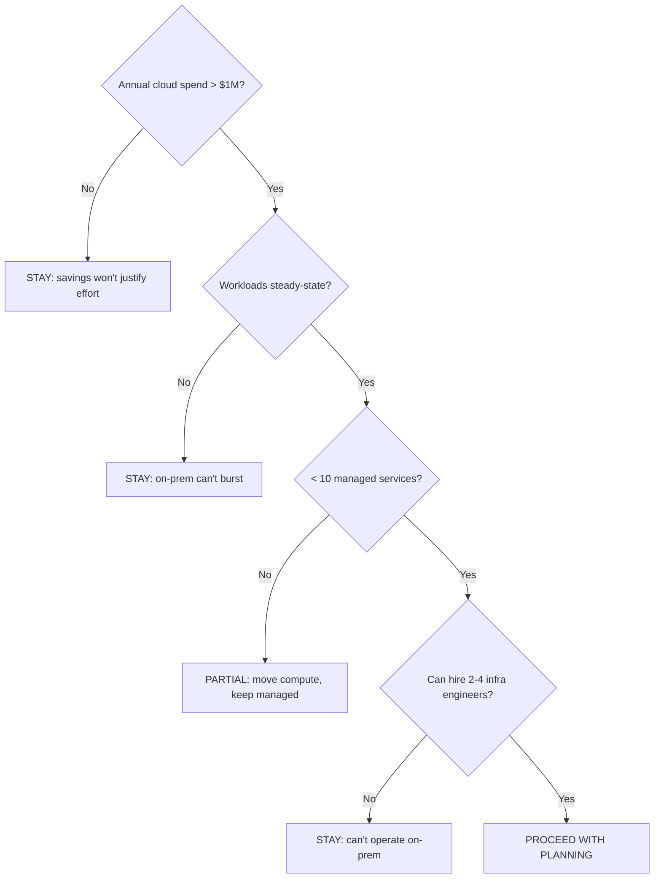
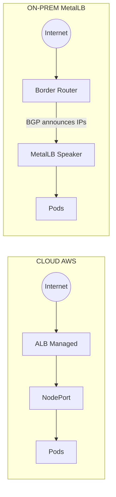
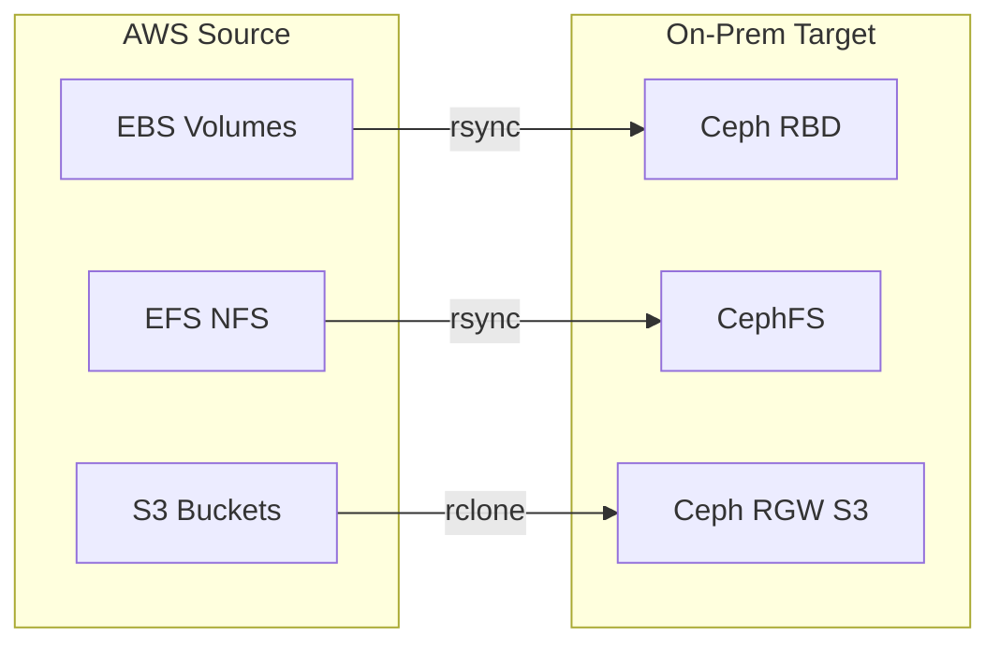
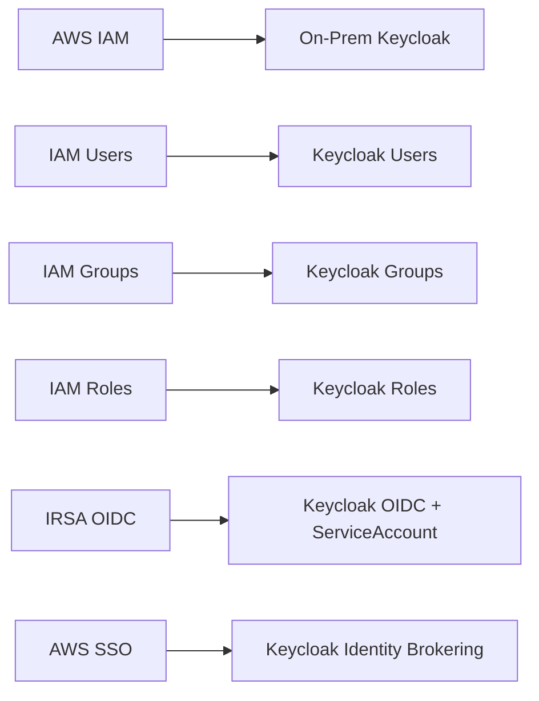
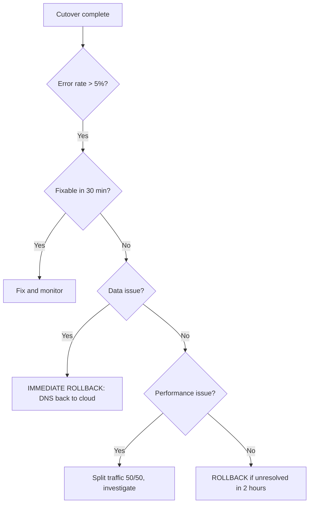

> **Complexity**: `[ADVANCED]` | Time: 90 minutes
>
> **Prerequisites**: [Module 8.1: Multi-Site & Disaster Recovery](/on-premises/resilience/module-8.1-multi-site-dr/), [Module 8.2: Hybrid Cloud Connectivity](/on-premises/resilience/module-8.2-hybrid-connectivity/)

---

## What You'll Be Able to Do

By the end of this module, you will be able to:

1. **Evaluate** five-year cloud repatriation TCO.
2. **Choose** full, partial, or hybrid migration paths.
3. **Translate** cloud networking, storage, and identity primitives.
4. **Plan** data synchronization, cutover, and rollback.
5. **Run** a phased migration with readiness gates.

---

## Why This Module Matters

Cloud repatriation is not a slogan about clouds being expensive or servers being cheap. It is a deliberate change in operating model. You trade elastic managed capacity for owned capacity, direct control, and direct responsibility. The move can be rational when workloads are steady, data volumes are large, and platform teams already have the operational depth to run storage, networking, identity, observability, and hardware lifecycle management. It can be destructive when the organization treats repatriation as a procurement shortcut instead of a multi-quarter engineering program.

Hypothetical scenario: a SaaS platform has grown around managed load balancers, managed databases, object storage, cloud IAM, managed certificate issuance, hosted logging, and a dozen small provider APIs that nobody mentions in architecture diagrams anymore. Finance sees a large monthly bill and asks whether buying servers would be cheaper. The application team believes the workload is "just Kubernetes" because most services run in containers. The platform team then discovers that the containers are the easy part; the hard part is replacing every invisible cloud control plane the application learned to depend on.

That is why repatriation planning belongs in the resilience track rather than in a purchasing checklist. A migration that leaves the cloud but loses backup semantics, audit trails, managed credential rotation, route failover, or rollback discipline is not a resilience improvement. It is merely a location change. A good plan starts with economics, but it earns approval only after it proves that the destination platform can operate the same failure modes, compliance controls, and recovery objectives as the source environment.

> **The Moving House Analogy**
>
> Moving infrastructure from a public cloud provider to an on-premises datacenter is like moving from a serviced apartment to a house you own. The apartment included furniture, repairs, front-desk security, utilities, and a maintenance crew you rarely saw. The house may be cheaper over a long horizon, but only if you are ready to own the furniture, the roof, the wiring, the alarms, the insurance, and the emergency call when a pipe bursts at night.

---

## What You'll Learn

- When cloud repatriation makes economic sense
- Translating cloud load balancers (ALB/NLB) to MetalLB
- Storage migration from EBS/EFS to Ceph
- IAM translation from AWS IAM to Keycloak
- Data gravity and migration sequencing
- Phased migration with rollback plans

---

## Section 1: The Economics of Cloud Repatriation

Before you touch a single Kubernetes manifest, modify a DNS record, or open a terminal window, you must evaluate the economics of the move over a realistic planning horizon. Repatriation usually shifts part of the cost base from operating expenditure to capital expenditure, but that description is incomplete. You are also moving risk from a provider contract into your own engineering organization. Servers, storage arrays, network optics, support agreements, spare parts, power draw, rack space, backup media, and staffing all become part of the same TCO model.

A useful five-year model separates four classes of cost. The first class is the current cloud run rate: compute, storage, managed database, managed cache, load balancing, logging, observability, support, data transfer, and committed-use discounts. The second class is the destination platform: servers, storage, switches, firewalls, colocation or owned facility costs, out-of-band management, backup targets, hardware support, replacement capacity, and licenses. The third class is the migration itself: dual-running environments, dedicated circuits, temporary transfer hosts, extra backup retention, consulting, engineering time, load testing, security review, and rollback infrastructure. The fourth class is the people cost: on-call SREs, storage administrators, network engineers, platform engineers, and the opportunity cost of delaying product work while the team migrates.

Here is the baseline, industry-standard decision matrix for evaluating a repatriation effort. If you fail to meet the required thresholds at any node, the migration is mathematically likely to fail or cost more than it saves.



Hypothetical scenario: the following table is an illustrative planning model, not a benchmark and not a claim about any named organization. Replace every number with your own quotes, discounts, support contracts, staffing assumptions, and current provider pricing. Data transfer prices are especially volatile; as of June 2026, treat egress assumptions as a dated range and verify them against the current vendor pricing page before using them in a decision record.

| Factor | Cloud (Annual) | On-Prem (Annual) |
|--------|---------------|-----------------|
| Compute (200 nodes) | $1,200,000 | $180,000 (amortized 4yr) |
| Storage (100TB) | $240,000 | $40,000 (Ceph, amortized) |
| Network egress | $120,000-$220,000 (provider/tier dependent) | $12,000-$40,000 (contract dependent) |
| Managed services | $360,000 | $0 (self-managed) |
| Additional staff | $0 | $400,000 (2 SREs) |
| Colocation | $0 | $144,000 |
| Migration and dual-run reserve | $0 | $150,000-$300,000 (first year only) |
| **Total** | **$1,920,000-$2,020,000** | **$926,000-$1,064,000 first year** |

This model is intentionally conservative because a misleading first-year spreadsheet is worse than no spreadsheet. A team that ignores the dual-run period will understate cost exactly when the project consumes the most labor. A team that ignores spares will discover that one failed storage node can turn a planned maintenance window into a capacity emergency. A team that treats staff as "already paid for" hides the fact that every migration hour comes from somewhere: reliability improvements, security work, product enablement, incident response, or technical debt reduction.

Repatriation tends to pay off when most of the workload is steady-state, capacity can be forecast months ahead, and the platform uses only a small number of cloud-native managed services. Dense compute clusters, storage-heavy internal platforms, predictable batch processing, private regulated workloads, and latency-sensitive edge systems are the usual candidates. The economics improve when teams already run strong Kubernetes operations, already know BGP and storage, and already have a culture of rehearsed disaster recovery rather than heroic recovery.

Repatriation usually does not pay off when workloads are bursty, seasonal, or experimental. Public clouds are extremely good at absorbing temporary demand because capacity is rented for the moment it is needed. On-premises capacity is purchased before demand arrives, and unused capacity still consumes space, power, support, depreciation, and operational attention. If your steady state needs 50 nodes but your peak needs 300 nodes for a few short events, the on-premises platform either overbuys capacity or fails at the moment the business cares most.

Managed-service dependency is the other major breaker. A Kubernetes deployment can look portable while the application still depends on RDS failover, ElastiCache patching, ALB health checks, IAM tokens, CloudWatch retention policies, KMS key policies, S3 lifecycle rules, and hosted DNS. Each dependency has to be retained, replaced, or removed. A partial migration that moves stateless compute while keeping managed databases in the cloud may be economically better than a full exit because it captures some savings without rebuilding every mature control plane at once.

> **Pause and predict**: Hypothetical scenario: your current cloud bill is lower than the cost of two additional senior infrastructure engineers plus a conservative dual-run reserve. Which optimization path should come first: repatriation, committed-use discounts, rightsizing, or managed-service cleanup?

---

## Section 2: Hybrid Cloud and Partial Repatriation Alternatives

Full bare-metal repatriation, where you purchase servers, configure top-of-rack switches, and manage hardware warranties, is only one end of the design space. Many organizations are not actually trying to leave every provider service. They are trying to solve a smaller problem: keeping data in a jurisdiction, reducing latency to local equipment, improving audit control, reducing the most painful line items, or avoiding uncontrolled growth in one expensive managed service. When the problem is narrower, a hybrid design can be cheaper, safer, and faster than a full datacenter rebuild.

Major cloud providers have acknowledged that demand and built managed on-premises footprints. The important architectural question is not whether these offerings are "cloud" or "on-prem"; it is which control planes remain external and which failure modes you now own. As of June 2026, verify current regional availability, hardware profiles, support boundaries, and price sheets against vendor documentation before making a commitment, because these product lines change faster than the underlying design principles.

- **AWS Outposts Family**: This hardware suite is generally available in [large Outposts Rack deployments and smaller Outposts Server form factors](https://docs.aws.amazon.com/outposts/latest/userguide/what-is-outposts.html). The hardware runs in your facility, but the service link and management model keep you tied to AWS operations and service boundaries.
- **Google Distributed Cloud (GDC)**: [GDC provides connected, air-gapped, and software-oriented options for running Google Cloud capabilities at the edge or in private datacenters](https://cloud.google.com/distributed-cloud/docs). This can be attractive when the target is locality, regulated isolation, or edge execution rather than the lowest possible hardware cost.
- **Azure Arc**: [Azure Arc projects servers, Kubernetes clusters, SQL Server, and Azure data services into the Azure management plane](https://learn.microsoft.com/en-us/azure/azure-arc/overview). The [Arc-enabled Kubernetes release notes](https://learn.microsoft.com/en-us/azure/azure-arc/kubernetes/release-notes) are the right place to verify current gateway and agent behavior because management-plane capabilities evolve regularly.

The tradeoff is straightforward. Hybrid managed footprints reduce migration risk by preserving a familiar provider control plane, support path, identity model, policy engine, and observability surface. They also preserve vendor dependency and may not deliver the same long-term savings as commodity bare metal. Full bare metal gives you maximum control over hardware density, storage design, network topology, and lifecycle timing, but it also makes every outage your outage. Partial repatriation sits between those extremes: move steady stateless compute, internal batch workers, or object-heavy archives to owned infrastructure while leaving spiky front doors, global databases, or provider-native analytics in the cloud.

The best partial plans draw explicit boundaries. A common first boundary is "move Kubernetes workers, keep managed databases." Another is "move object storage for archival reads, keep hot transactional storage in the cloud." A third is "move build and test workloads, keep customer-facing production on the provider until the destination platform proves itself." These boundaries keep the migration reversible and expose hidden dependencies before the highest-risk workloads move.

### Virtualization in the Container Era

If your organizational goal involves migrating legacy virtual machines into a container-oriented platform, do not assume that containers magically eliminate the VM estate. Many repatriation programs discover that the hardest systems are not stateless services but long-lived appliances, vendor-supported images, licensed middleware, or stateful monoliths that cannot be containerized on the migration timeline. Virtualization inside Kubernetes can be a pragmatic bridge, but it should be treated as a bridge with operational requirements, not as a free compatibility layer.

For managing infrastructure using declarative control-plane patterns, **Crossplane** remains relevant because [the CNCF project page lists it as a Graduated project focused on building control planes](https://www.cncf.io/projects/crossplane/). In a repatriation context, Crossplane is most useful when you want platform teams to expose higher-level claims, such as "give this namespace a database and a bucket," while hiding whether the backing service is cloud-managed, self-managed, or hybrid.

To execute virtual machines under Kubernetes-native scheduling and API workflows, **KubeVirt** is the common open ecosystem answer. [KubeVirt v1.8.0 was announced by CNCF on March 25, 2026 with Kubernetes v1.35 alignment](https://www.cncf.io/blog/2026/03/25/announcing-the-release-of-kubevirt-v1-8/). Treat that as a dated source snapshot and verify current compatibility before pairing a KubeVirt release with your destination Kubernetes version.

Alternatively, if you require a commercial support model, **Red Hat OpenShift Virtualization** packages VM operations into the OpenShift platform. The cited Red Hat release post describes [OpenShift Virtualization 4.21 and its VM management capabilities](https://www.redhat.com/en/blog/whats-new-red-hat-openshift-virtualization-421); verify the current supported release and upgrade policy against Red Hat documentation before building a migration plan around it.

The operational lesson is that virtualization does not remove infrastructure work; it relocates it. VM live migration needs compatible CPU features, storage that can handle the write pattern, reliable node evacuation, and careful maintenance windows. VM networking often carries assumptions about static addresses, layer-2 adjacency, licensing servers, and appliance clustering. VM backup expectations may also differ from container backup expectations. A KubeVirt or OpenShift Virtualization cluster that hosts critical VMs therefore needs the same seriousness you would apply to a traditional virtualization platform: capacity reservations, maintenance runbooks, guest OS patching, storage performance testing, and clear ownership for the boundary between platform and application teams.

---

## Section 3: Translating Cloud Networking to Bare Metal

When shifting workloads out of the public cloud, you abruptly lose the invisible, highly available magic of native cloud load balancers. In AWS, exposing a high-traffic microservice to the public internet is as fundamentally simple as creating an Application Load Balancer (ALB) via an ingress object. AWS silently provisions a fleet of underlying EC2 instances, manages the high-availability failover, and scales the fleet up and down based on your ingress bandwidth.

On bare metal, you possess none of this automated luxury. You must manually announce your IP routes to your physical networking gear using established routing protocols.



To achieve this critical routing capability on-premises, engineers typically deploy **MetalLB** operating in BGP (Border Gateway Protocol) mode. MetalLB effectively transforms your standard Kubernetes worker nodes into sophisticated software routers that peer directly with your Top-of-Rack (ToR) or Border routing switches.

The configuration requires establishing a strict peering relationship. This manifest defines the ASN (Autonomous System Number) of your cluster and the target router.

```yaml
# MetalLB with BGP mode - Peer Configuration
apiVersion: metallb.io/v1beta2
kind: BGPPeer
metadata:
  name: datacenter-router
  namespace: metallb-system
spec:
  myASN: 64500
  peerASN: 64501
  peerAddress: 10.0.0.1
```

Next, you must allocate a dedicated pool of routable IP addresses that MetalLB is authorized to assign to newly created `LoadBalancer` services within your cluster.

```yaml
# MetalLB with BGP mode - IP Pool Configuration
apiVersion: metallb.io/v1beta1
kind: IPAddressPool
metadata:
  name: production-pool
  namespace: metallb-system
spec:
  addresses:
  - 192.168.1.240/28    # 14 usable IPs for LoadBalancer services
```

Finally, you instruct MetalLB to actively advertise these IP pools to the BGP peers established earlier, ensuring that external traffic knows exactly which cluster nodes can accept packets for the given IP address.

```yaml
# MetalLB with BGP mode - Advertisement Configuration
apiVersion: metallb.io/v1beta1
kind: BGPAdvertisement
metadata:
  name: production-advertisement
  namespace: metallb-system
spec:
  ipAddressPools:
  - production-pool
```

### AWS ALB Annotation Translation

Cloud load balancers simplify operations by bundling multiple distinct network functions—such as Transport Layer Security (TLS) termination, Web Application Firewall (WAF) execution, and complex path-based routing—into [a few declarative annotations](https://github.com/kubernetes-sigs/aws-load-balancer-controller/blob/main/docs/guide/ingress/annotations.md). On-premises, these monolithic responsibilities are fractured and split across multiple independent, self-managed open-source tools.

| AWS Annotation | On-Prem Equivalent |
|---------------|-------------------|
| `scheme: internet-facing` | MetalLB IPAddressPool with routable IPs |
| `certificate-arn` | cert-manager with Let's Encrypt or internal CA |
| `wafv2-acl-arn` | ModSecurity in NGINX Ingress |
| `target-type: ip` | Default kube-proxy behavior |
| `healthcheck-path` | NGINX Ingress `health-check-path` annotation |
| `ssl-redirect: "443"` | `nginx.ingress.kubernetes.io/force-ssl-redirect: "true"` |

Migrating an application relies heavily on translating these annotations flawlessly; [missing a WAF annotation could expose your migrated application to severe security vulnerabilities](https://owasp.org/www-community/Web_Application_Firewall) on day one of your on-premises deployment. The translation should happen in a tracked worksheet rather than in somebody's memory. For every cloud ingress, record the listener ports, certificates, health check paths, timeout settings, redirect rules, WAF policy, source CIDR restrictions, target group behavior, and observability hooks. Then map each item to a concrete on-prem component and owner.

Security group translation deserves the same care. Cloud security groups are stateful, attached to instances or load balancer targets, and often maintained by application teams through provider APIs. On bare metal, the equivalent control may be split across Kubernetes `NetworkPolicy`, node firewalls, router ACLs, BGP route filters, and ingress-controller configuration. If you translate only the happy-path allow rules, you can accidentally remove implicit denies, broaden east-west traffic, or bypass an audit expectation that used to be enforced by the provider.

| Cloud Construct | On-Prem Translation | Design Question |
|-----------------|---------------------|-----------------|
| Security group ingress rule | Kubernetes `NetworkPolicy`, firewall rule, or router ACL | Is the rule pod-level, node-level, or subnet-level? |
| Security group egress rule | Egress `NetworkPolicy`, proxy policy, or firewall rule | Which workloads are allowed to reach cloud APIs during migration? |
| Private hosted zone | CoreDNS, external DNS, or internal authoritative DNS | Which names must resolve differently before and after cutover? |
| VPC route table | Router configuration, BGP policy, and MetalLB advertisements | Which prefixes are advertised, filtered, and withdrawn during rollback? |
| Cloud NAT gateway | Edge firewall, NAT pair, or egress gateway | Which source IPs do partners and allowlists expect? |

Bare-metal networking also changes the blast radius of mistakes. In a cloud, a bad load balancer annotation usually affects one service. In a BGP-backed on-prem cluster, a bad advertisement can attract traffic for an address range the cluster should never own. Use route filters, limited address pools, peer authentication where supported, and a pre-cutover route validation checklist. The right question is not "does MetalLB work"; the right question is "can MetalLB announce only the addresses this cluster is authorized to serve, and can we withdraw them quickly during rollback?"

Migration windows often fail because DNS and routing are treated as separate plans. They are not. A cutover changes name resolution, route advertisement, TLS certificate presentation, source IP allowlists, and monitoring expectations at the same time. Lower DNS TTLs well before the cutover, pre-stage certificates on the destination ingress, test partner allowlists against the new egress IPs, and verify that synthetic monitoring observes both the cloud path and the on-prem path before traffic moves. These tasks look mundane, but they are the difference between a reversible migration and a frantic outage bridge.

---

## Section 4: Data Gravity and Storage Migration

"Data gravity" is an inescapable principle of systems engineering. Massive datasets attract the applications, indexes, caches, batch jobs, compliance controls, and backup workflows that process them. Moving a container image is easy because the image is usually measured in hundreds of megabytes. Moving a database volume, object bucket, or analytics lake is hard because the useful unit is often measured in terabytes or petabytes, and the transfer must preserve consistency while the business continues writing new data.

Therefore, your migration sequence must follow the data. Migrate storage first, keep it continuously synchronized with the source, and then cut applications over only after the target has passed integrity checks. This feels backwards to application teams that want to deploy code first, but the dependency graph is strict. An application can point at old storage for a while. A database cannot magically catch up after weeks of missed writes unless you designed the synchronization path before the first byte moved.



> **Stop and think**: You need to migrate 50TB of data from AWS S3 to on-premises Ceph RGW over a 1 Gbps Direct Connect. At best, that is ~7 days of continuous transfer. During that time, the application is still writing new data to S3. How do you handle the gap between the initial sync and the final cutover?

Start by classifying every data source by access pattern and consistency requirement. Block volumes need file-system awareness, database quiescing, or application-level replication because copying a mounted volume while writes continue can produce a corrupted target. File shares need permissions, ownership, symbolic links, and timestamp behavior tested across source and destination. Object buckets need versioning, tags, metadata, lifecycle policy, ACL behavior, encryption expectations, and application assumptions about endpoint semantics. Databases usually need native replication or logical dump strategies rather than blind file copies.

Your migration runbook should distinguish initial copy, incremental copy, freeze window, final verification, cutover, and reverse synchronization. The initial copy is slow and forgiving. Incremental copies should run repeatedly until the delta is small and predictable. The freeze window pauses or drains writers long enough to capture a final consistent delta. Final verification proves object counts, checksums, sample application reads, and backup restore behavior. Reverse synchronization protects rollback by ensuring writes made on-prem during a failed cutover can be copied back to the cloud before traffic returns there.

### EBS to Ceph RBD

The most reliable migration pattern for raw block storage (such as AWS Elastic Block Store to Ceph RADOS Block Device) requires constructing a temporary transfer bridge. You must snapshot the cloud volume to freeze its state, mount that snapshot to an intermediate temporary EC2 instance, and then aggressively `rsync` the raw data down through your network circuit to a dedicated migration pod residing on the bare-metal cluster. This migration pod writes the incoming data directly into a pre-provisioned Ceph RBD PersistentVolumeClaim.

```bash
# On AWS: snapshot and mount to a transfer instance
aws ec2 create-snapshot --volume-id vol-0123456789abcdef

# On on-prem: create StorageClass and PVC
kubectl apply -f - <<EOF
apiVersion: storage.k8s.io/v1
kind: StorageClass
metadata:
  name: ceph-block
provisioner: rook-ceph.rbd.csi.ceph.com
parameters:
  clusterID: rook-ceph
  pool: replicapool
  imageFormat: "2"
reclaimPolicy: Retain
allowVolumeExpansion: true
EOF

# Transfer via a migration pod
kubectl apply -f - <<EOF
apiVersion: v1
kind: Pod
metadata:
  name: data-migration
  namespace: production
spec:
  containers:
  - name: rsync
    image: instrumentisto/rsync-ssh:latest
    command: ["rsync", "-avz", "--progress",
      "-e", "ssh -i /keys/transfer-key",
      "ubuntu@aws-transfer.internal.corp:/mnt/ebs-data/",
      "/target-data/"]
    volumeMounts:
    - name: target-vol
      mountPath: /target-data
  volumes:
  - name: target-vol
    persistentVolumeClaim:
      claimName: app-data
  restartPolicy: Never
EOF
```

The snapshot step matters because block storage does not understand your application by itself. If the source volume belongs to a database, a clean snapshot usually requires a database checkpoint, a short write pause, or a native backup tool. If the source volume contains a file system, you need to preserve ownership, modes, extended attributes, and sparse files where relevant. A successful `rsync` exit code proves that bytes moved; it does not prove that the application can start safely on the destination. Always pair the copy with an application-level restore test before declaring the volume migrated.

Ceph RBD also changes operational responsibilities. In the cloud, the provider hides replication, replacement, expansion, and degraded-disk handling behind a block volume API. On-premises, your Ceph cluster must be sized for failure domains, recovery traffic, placement groups, monitor quorum, and maintenance windows. A repatriation plan that simply says "EBS becomes Ceph RBD" is not complete until it explains who responds to `HEALTH_WARN`, how much recovery bandwidth is allowed during business hours, and how the team verifies that the RBD CSI driver behaves correctly during node drains.

### S3 to Ceph RGW

For highly concurrent object storage migration, traditional tools like `rsync` fall short due to their reliance on file system tree walking. Instead, `rclone` is the industry standard. [It provides an idempotent synchronization operation utilizing the S3 API directly](https://github.com/rclone/rclone). It can gracefully resume after network interruptions and run rapid, incremental nightly syncs to quickly catch up with new data written by the live application during the extended migration window.

```bash
# Configure rclone for both endpoints
rclone config  # Set up aws-s3 and ceph-rgw remotes

# Sync
rclone sync aws-s3:app-assets ceph-rgw:app-assets --progress --transfers 16

# Verify
rclone check aws-s3:app-assets ceph-rgw:app-assets
```

Object migration is not just object copying. S3-compatible APIs cover the common read/write path, but applications may rely on provider-specific details such as bucket policies, object lock, event notifications, replication rules, multipart upload behavior, presigned URL lifetimes, KMS integration, inventory reports, or lifecycle transitions. Before cutover, run application-level tests that upload, download, list, delete, generate presigned URLs, and exercise the largest objects you expect in production. Also test failure behavior: interrupted multipart uploads, retry storms, expired credentials, and the latency difference between cloud object storage and your Ceph RGW placement.

During a long object migration, keep a reconciliation ledger. At minimum, track source object count, destination object count, transferred bytes, skipped bytes, failures, retry counts, and checksum mismatches for each run. Store the `rclone` command line, version, config profile names, and logs in the migration record so a later audit can explain how data moved. If the provider charges for egress, use current pricing pages when budgeting; the exact per-gigabyte rate varies by region, tier, transfer path, and date, so this module intentionally avoids treating any single price as universal.

For [comprehensive state migration of native Kubernetes resources (such as CustomResourceDefinitions, Secrets, and ConfigMaps) alongside persistent volumes](https://github.com/velero-io/velero), **Velero** is a widely-used, CNCF-hosted backup and migration tool. As of its v1.18.0 release in March 2026, [Velero introduced concurrent backup processing and cache-volume support](https://github.com/velero-io/velero/releases/tag/v1.18.0), reducing recovery time objectives (RTO) for large clusters. Recognizing its critical role in the ecosystem, [Broadcom officially donated Velero to the CNCF Sandbox in April 2026](https://www.cncf.io/news/2026/04/02/the-new-stack-why-broadcom-gave-velero-to-the-cncf-sandbox-and-what-it-means-for-kubernetes-data-protection/).

Velero is powerful, but it is not a substitute for understanding application state. It can capture Kubernetes resources and integrate with volume snapshots, yet it cannot automatically make every database transactionally consistent at the moment you want. Treat Velero as one layer in the plan: use it for cluster resource migration, namespace restore testing, and rollback scaffolding, while using database-native replication, backup, or dump mechanisms for the data systems that require transactional guarantees.

If your organization prefers managed enterprise tooling over composing bash scripts, options include **[AWS Application Migration Service (MGN)](https://docs.aws.amazon.com/mgn/latest/ug/installing-vcenter-appliance-mgn.html)**, **[Azure Migrate](https://learn.microsoft.com/en-us/azure/migrate/create-manage-projects)**, or provider-specific container migration tooling. These tools can reduce migration labor, especially for VM estates, but they do not remove the need for destination readiness, identity translation, network reachability, application testing, and a rollback plan.

---

## Section 5: Identity and Authentication Translation

Proprietary cloud Identity and Access Management (IAM) systems invisibly embed themselves deep into your application architecture. This is especially prevalent when development teams utilize modern features like IRSA (IAM Roles for Service Accounts) in AWS, which injects temporary AWS STS tokens directly into running pods, allowing the application to authenticate to other AWS services like RDS or S3 natively.

Identity migration has two separate layers. Human access controls who can authenticate to clusters, dashboards, CI systems, GitOps controllers, observability tools, and break-glass workflows. Workload identity controls how pods authenticate to databases, object storage, message queues, secret stores, and external APIs. Cloud IAM often blends these layers behind a provider API. On-premises Kubernetes forces you to make the boundary explicit, which is good for auditability but unforgiving during migration.



### Kubernetes OIDC with Keycloak

When you leave the public cloud, you completely lose the IAM control plane. To replace this functionality for cluster authentication, you must stand up an OpenID Connect (OIDC) Identity Provider (IdP) like Keycloak. You then [configure the core Kubernetes API server to implicitly trust Keycloak's cryptographic signatures via OIDC](https://kubernetes.io/docs/reference/access-authn-authz/authentication/).

```yaml
# kube-apiserver flags
- --oidc-issuer-url=https://auth.internal.corp/realms/kubernetes
- --oidc-client-id=kubernetes-apiserver
- --oidc-username-claim=preferred_username
- --oidc-groups-claim=groups
- --oidc-ca-file=/etc/kubernetes/pki/keycloak-ca.crt
```

Once OIDC is strictly configured and the API server can validate JSON Web Tokens (JWTs) issued by Keycloak, you must painstakingly map Keycloak user groups directly to Kubernetes RBAC (Role-Based Access Control) constructs. This is achieved via `RoleBinding` or `ClusterRoleBinding` manifests.

```yaml
# RBAC binding for Keycloak groups - Platform Admins
apiVersion: rbac.authorization.k8s.io/v1
kind: ClusterRoleBinding
metadata:
  name: keycloak-platform-admins
subjects:
- kind: Group
  name: platform-admins     # Matches Keycloak group
  apiGroup: rbac.authorization.k8s.io
roleRef:
  kind: ClusterRole
  name: cluster-admin
  apiGroup: rbac.authorization.k8s.io
```

```yaml
# RBAC binding for Keycloak groups - Developers
apiVersion: rbac.authorization.k8s.io/v1
kind: RoleBinding
metadata:
  name: keycloak-developers
  namespace: development
subjects:
- kind: Group
  name: developers
  apiGroup: rbac.authorization.k8s.io
roleRef:
  kind: ClusterRole
  name: edit
  apiGroup: rbac.authorization.k8s.io
```

> **Warning**: The utilization of IRSA is deeply, fundamentally AWS-specific. [Any application pod utilizing IRSA relies on an AWS mutating admission webhook to function](https://docs.aws.amazon.com/eks/latest/eksctl/iamserviceaccounts.html). Therefore, any pod carrying the `eks.amazonaws.com/role-arn` annotation requires significant fundamental configuration changes to authenticate securely on-premises against self-managed databases. You must exhaustively audit your clusters for these annotations prior to executing any migration effort.

The practical audit is simple but revealing. Search manifests, Helm values, Terraform modules, and admission-controller output for `eks.amazonaws.com/role-arn`, cloud-provider SDK defaults, metadata-service calls, and environment variables that imply provider-native identity. Then decide whether each dependency becomes a Kubernetes Secret, a Vault-issued dynamic credential, a Keycloak client credential, a service mesh identity, or an application refactor. The decision should be written down because identity shortcuts become incident material later.

For human access, keep group names stable and boring. If Keycloak emits a `platform-admins` group claim, bind that group to Kubernetes RBAC exactly once and manage membership in the identity provider. Avoid binding individual users to cluster-admin during migration just because it is faster. Those temporary exceptions survive longer than anyone expects, and they are hard to defend in an audit. Create a documented break-glass path instead, with short-lived credentials, approval, and logging.

For workload access, prefer short-lived and rotated credentials over static secrets copied from the cloud. A common destination pattern is Keycloak or Vault for identity, External Secrets Operator for syncing secrets into namespaces, and Kubernetes RBAC for limiting which service accounts can read those secrets. If an application previously authenticated to S3 through IRSA, the on-prem version might authenticate to Ceph RGW through an access key stored in Vault and projected through External Secrets. That is not as transparent as IRSA, but it is portable and auditable when designed deliberately.

Identity cutover also affects incident response. Cloud audit logs, Kubernetes audit logs, Keycloak event logs, Vault audit devices, and application logs need a shared correlation story before production moves. If a service starts receiving authorization failures after cutover, responders should be able to trace the request from ingress identity, through service account, through secret lookup, through backend authentication, without guessing which control plane made the decision.

---

## Section 6: Network Connectivity for Migration

For massive stateful data transfers, attempting to route traffic over the unpredictable public internet is an exercise in unnecessary risk. The migration network is not simply "connect cloud to datacenter." It is a temporary production dependency that must carry bulk copy traffic, incremental synchronization, health checks, administrative access, observability, and rollback traffic without starving the application still serving users. Design it as deliberately as any other production network.

As of 2026, the primary enterprise-grade connectivity options for cloud-to-on-prem migration networking are still dedicated circuits such as AWS Direct Connect, [Azure ExpressRoute](https://learn.microsoft.com/en-us/azure/architecture/reference-architectures/hybrid-networking/expressroute), and Google Cloud Interconnect, with Site-to-Site VPN used for smaller environments, management paths, or backup connectivity. Microsoft's migration networking guidance describes [private connectivity such as ExpressRoute as preferred for the highest bandwidth and lowest latency](https://learn.microsoft.com/en-us/azure/storage-mover/cloud-to-cloud-private-network-configs), while VPNs remain useful as secondary or lower-bandwidth paths.

Provision the circuit early because lead time is often longer than the first application migration sprint. Then test it under the kind of traffic the migration will actually generate. A quick ping proves almost nothing. Run sustained throughput tests, verify MTU behavior, test packet loss under load, and confirm that firewall sessions do not expire during long transfers. Measure transfer rates from the actual source and target hosts, not only between network appliances, because storage performance, TLS termination, CPU limits, and object-store throttling can all become bottlenecks before the circuit itself saturates.

Separate migration traffic from normal production traffic where possible. Use dedicated subnets, route tables, firewall policy, DNS names, service accounts, and monitoring labels for transfer workers. This gives you two operational advantages. First, you can throttle or pause migration traffic without touching user-facing services. Second, you can investigate performance and security events without guessing whether a large outbound flow is legitimate migration work or an unexpected exfiltration path.

Connectivity planning must also include directionality. Initial copies usually flow from cloud to on-prem. Rollback copies may flow from on-prem back to cloud. Administrative access might originate from a bastion, a CI runner, or a GitOps controller. Observability may need to send logs in both directions during the dual-run period. Put every required flow in a table with source, destination, port, protocol, authentication method, owner, and rollback behavior. If a flow is not in the table, it should not be allowed by default.

Finally, test name resolution before testing applications. Many migration failures are DNS failures disguised as application failures. The cloud environment may resolve private names through provider DNS, while the on-prem environment relies on CoreDNS, conditional forwarding, or an internal DNS platform. During dual-run, the same name may need to resolve differently depending on the client location. Document those differences explicitly and include DNS checks in pre-cutover validation.

---

## Section 7: Phased Migration and Cutover Strategy

A successful infrastructure repatriation takes multiple months of careful, deliberate sequencing. Attempting a "big bang" cutover—where you shut down the cloud and simultaneously power on the on-premises datacenter—is a guaranteed recipe for catastrophic, resume-generating downtime.

```mermaid
gantt
    title Phased Migration Timeline
    dateFormat  M
    axisFormat  Month %m
    section Preparation
    Provision hardware       :a1, 1, 30d
    Install K8s              :a2, after a1, 30d
    Set up network           :a3, after a1, 30d
    Deploy platform          :a4, after a2, 30d
    section Data Migration
    rclone/rsync ongoing sync:b1, 3, 60d
    IAM migration            :b2, 3, 60d
    section App Migration
    Deploy apps              :c1, 5, 30d
    Run both in parallel     :c2, 5, 60d
    Shadow traffic           :c3, 6, 30d
    section Cutover
    DNS swap to on-prem      :d1, 7, 10d
    Monitor                  :d2, 7, 30d
    Decommission cloud       :d3, 8, 30d
```



The first phase is inventory, not installation. Build a dependency map that includes applications, databases, buckets, queues, DNS zones, certificates, IAM roles, secrets, scheduled jobs, observability sinks, backup policies, and partner allowlists. Then classify each workload by migration difficulty and business risk. A low-risk internal dashboard with stateless pods is a good early candidate. A customer-facing payment path with stateful dependencies, strict audit controls, and partner IP allowlists belongs near the end.

The second phase is destination platform readiness. Install Kubernetes, storage, ingress, identity, observability, backup, policy, and GitOps before moving real workloads. Then run failure drills: kill a worker node, fill a test volume, rotate a certificate, revoke a user, restore a namespace, withdraw a BGP advertisement, and simulate a DNS rollback. These exercises expose whether the platform is merely deployed or actually operable. A migration should not advance because the calendar says so; it should advance because the destination passed readiness gates.

The third phase is dual-running. Deploy applications to the destination while production still runs in the cloud. Send shadow traffic where safe, mirror read-only requests, compare response codes, compare latency percentiles, and validate logs and traces from both environments. For stateful systems, avoid casual dual writes unless the application was designed for conflict resolution. It is usually safer to keep one writer of record, replicate data in one direction, and make the final writer switch during a controlled cutover window.

The fourth phase is cutover. Lower DNS TTLs in advance, freeze risky configuration changes, confirm data deltas are small, run final sync, verify health checks, and move a small percentage of traffic if your routing layer supports weighted rollout. Decide in advance who has authority to continue, pause, or roll back. During the window, do not debate the rollback criteria for the first time. The runbook should already say which error budget burn, latency regression, data mismatch, or authentication failure triggers reversal.

The final phase is controlled decommissioning. Do not destroy the cloud environment the day after cutover. Keep it available long enough to support rollback, forensic comparison, and missed dependency discovery. Then retire cloud resources in a tracked order: external traffic, scheduled jobs, write paths, read replicas, backups, logs, IAM roles, keys, DNS records, and finally unused network links. Decommissioning is part of the migration, not cleanup someone does later when memory has faded.

### Rollback Plan

In systems engineering, hope is not a strategy. You must possess a clearly defined, thoroughly rehearsed rollback protocol. If the cutover initiates cascading failures, the decision to revert must be binary and pre-authorized.



Executing a successful rollback requires technical precision to ensure continuous data integrity is flawlessly maintained during the pivot back to the cloud:

```bash
# Pre-cutover validation
rclone check aws-s3:production-data ceph-rgw:production-data
kubectl --context on-prem get pods -n production --field-selector=status.phase!=Running  # Should be empty

# Rollback: redirect DNS back to cloud
kubectl --context cloud annotate service api-gateway -n production \
  external-dns.alpha.kubernetes.io/hostname=api.internal.corp

# Sync any data written to on-prem back to cloud
rclone sync ceph-rgw:production-data aws-s3:production-data --progress
```

Rollback is hardest when the new environment has accepted writes. If the application writes only to object storage, reverse synchronization may be enough. If it writes to a relational database, rollback may require logical replication back to the cloud, a write freeze, or a decision that rollback is no longer safe after a specific point. This is why every workload needs a rollback expiration rule. Before the expiration point, traffic can move back to the cloud. After it, the team must fix forward because data divergence has made reversal more dangerous than recovery in place.

Use the repository's current Kubernetes target, Kubernetes 1.35, as the compatibility baseline for this module, and verify the exact supported patch versions for your chosen Kubernetes distribution, CSI drivers, ingress controller, KubeVirt release, and backup tooling before migration. API compatibility matters less as an abstract version number and more as a tested matrix: can the target cluster run the manifests, CRDs, admission policies, and restore tools that the source environment depends on?

---

## Did You Know?

1. **Cloud data transfer costs are intentionally asymmetric.** Ingress is commonly cheap or free, while egress varies by provider, region, tier, and date. As of June 2026, always verify the current pricing page before presenting a repatriation budget.
2. **BGP mode turns Kubernetes service exposure into routing policy.** MetalLB can make bare-metal `LoadBalancer` services practical, but the network team must still control which prefixes are announced, filtered, and withdrawn during rollback.
3. **Velero migrates Kubernetes state, not every application guarantee.** It is excellent for cluster resources and restore workflows, but databases still need transaction-aware backup, replication, or dump strategies.
4. **Hybrid platforms reduce migration risk but preserve vendor dependency.** Outposts, GDC, and Azure Arc can solve locality and management problems without giving you the same operating model as fully owned bare metal.

---

## Common Mistakes

| Mistake | Why It Happens | What To Do Instead |
|---------|---------------|-------------------|
| Big-bang migration | Impatience | Migrate in phases: non-critical first, production last |
| Ignoring data egress costs | Focus on destination | Use dated vendor pricing and include a contingency range |
| Forgetting managed service deps | Developers use services silently | [Audit all AWS API calls via CloudTrail](https://docs.aws.amazon.com/awscloudtrail/latest/userguide/cloudtrail-user-guide.html) |
| No parallel running period | "We tested in staging" | Run both environments 2-4 weeks with shadow traffic |
| Hardcoded cloud endpoints | SDK defaults (s3.amazonaws.com) | Use env vars for all endpoints; grep for cloud URLs |
| No rollback plan | Optimism bias | Document and rehearse rollback; keep cloud running 30 days |

---

## Quiz

### Question 1
Hypothetical scenario: your company spends roughly $800K/year on a steady 50-node cloud Kubernetes estate. A first-pass on-prem estimate shows $600K/year in hardware, colocation, support, and bandwidth, plus two additional dedicated SRE hires at $200K each. Based on these projections, should you recommend proceeding with full bare-metal repatriation?

<details>
<summary>Answer</summary>

No. The apparent infrastructure reduction disappears once staffing is included, because $600K plus $400K in added SRE cost becomes $1M/year before migration labor, dual-run cost, and risk reserve. The better first step is cloud optimization: committed-use discounts, rightsizing, storage lifecycle cleanup, managed-service audit, and workload consolidation. Full repatriation becomes plausible only when the fixed costs of people, facilities, and operational ownership are absorbed by a large and steady workload.
</details>

### Question 2
Hypothetical scenario: leadership wants to keep cloud provider management while moving latency-sensitive workloads into a private facility. What questions help you choose between a hybrid managed footprint such as Outposts, GDC, or Azure Arc and a full bare-metal repatriation project?

<details>
<summary>Answer</summary>

Ask which problem the migration is actually solving. If the target is locality, regulated placement, existing cloud operations, or a familiar management plane, a hybrid managed footprint may be the better first step. If the target is deep cost control, hardware density, custom storage, and independence from provider control planes, full bare metal may be appropriate. The key tradeoff is ownership: hybrid offerings reduce operational change but preserve vendor dependency, while bare metal maximizes control and makes hardware, routing, storage, and lifecycle failures your responsibility.
</details>

### Question 3
Hypothetical scenario: your AWS-hosted application uses an ALB with `certificate-arn`, `wafv2-acl-arn`, and `ssl-redirect: "443"` annotations. You are migrating to an on-premises cluster with NGINX Ingress and MetalLB. How do you replicate each capability without silently dropping security controls?

<details>
<summary>Answer</summary>

Use cert-manager and an appropriate issuer to replace managed certificate attachment. Enable and tune a WAF layer such as ModSecurity or another supported ingress-integrated control to replace the cloud WAF association. Add the NGINX ingress redirect annotation to force HTTPS, and expose the ingress through a MetalLB address that is advertised through approved BGP policy. The important point is that one managed ALB object becomes several owned components, each with a lifecycle, owner, monitoring path, and rollback behavior.
</details>

### Question 4
Hypothetical scenario: you are using `rclone` to migrate 50TB from cloud object storage to Ceph RGW over a stable 1 Gbps dedicated circuit. What is the transfer-time implication, what risks must you monitor, and how should you handle writes that continue during migration?

<details>
<summary>Answer</summary>

At practical throughput, the initial transfer takes roughly six to seven days if the path stays saturated. During that period you must watch retries, checksum mismatches, object count drift, throttling, credential expiry, and destination RGW performance. The correct pattern is initial bulk sync, repeated incremental syncs, a controlled write freeze or drain, final incremental sync, verification, and then cutover. If rollback is possible after writes land on-prem, define reverse synchronization before the cutover begins.
</details>

### Question 5
Hypothetical scenario: immediately after migration, application pods cannot authenticate to the new self-managed PostgreSQL instance. In the cloud, the application used IRSA to obtain temporary credentials for managed database access. Structurally, what broke, and how should you fix it?

<details>
<summary>Answer</summary>

The IRSA chain was AWS-specific. On AWS, OIDC federation, admission mutation, STS, IAM policy, and managed database authentication worked together. On bare metal, those services do not exist unless you explicitly replace them, and PostgreSQL will not automatically understand AWS IAM credentials. Fix the design by moving to portable workload credentials: for example, Vault-issued database credentials synced through External Secrets into Kubernetes Secrets, combined with service account RBAC and application configuration changes. Also audit every pod annotation and SDK default that assumed provider-native identity.
</details>

### Question 6
Hypothetical scenario: a migrated service was protected by cloud security groups that allowed ingress only from a partner CIDR and egress only to a small set of provider APIs. The on-prem team exposes the service through MetalLB but does not translate those rules. What failure mode have they created, and what should the replacement controls be?

<details>
<summary>Answer</summary>

They have probably widened the network exposure while believing they only changed the load-balancer implementation. Cloud security groups were enforcing stateful ingress and egress constraints; MetalLB only advertises service addresses and does not replace those controls. The replacement should combine ingress-controller restrictions, Kubernetes `NetworkPolicy`, firewall or router ACLs, route filters, and explicit egress policy. Partner allowlists and source IP expectations should be tested before cutover, and rollback should include withdrawing the advertised route or returning DNS to the cloud path.
</details>

### Question 7
Hypothetical scenario: production traffic has moved to the on-prem cluster and the first hour looks healthy, but a later reconciliation check shows a small number of writes landed only on the new Ceph RGW bucket. The application team wants to roll back immediately by pointing DNS back to the cloud. What must you decide before doing that?

<details>
<summary>Answer</summary>

You must decide whether rollback is still data-safe. If writes landed only on-prem, sending users back to the cloud without reverse synchronization can lose or hide data. The runbook should define a rollback expiration point and a reverse-sync procedure before cutover. If the data delta can be copied back safely, freeze writes, run the reverse sync, verify object counts and checksums, and then move traffic. If divergence is no longer safely reversible, the better path may be to fix forward on-prem while protecting the cloud environment for forensic comparison.
</details>

### Question 8
Hypothetical scenario: a project manager wants to cut over the first production workload because the destination cluster is installed and the manifests apply cleanly. Which phased migration readiness gates should you require before approving that cutover?

<details>
<summary>Answer</summary>

Require gates that prove operability, not just installation. The destination should pass node failure, storage restore, ingress failover, DNS, identity, backup restore, observability, and rollback drills. The workload should run in parallel, pass health checks, produce comparable logs and traces, complete data synchronization, and have a documented rollback expiration point. A phased migration advances when measured gates pass; it should not advance simply because the cluster exists or the schedule is under pressure.
</details>

---

## Hands-On Exercise: Simulate Cloud-to-On-Prem Migration

**Objective**: Safely migrate a mock workload between two isolated `kind` clusters, successfully translating proprietary cloud endpoints to functional on-premises equivalents.

1. **Bootstrap Clusters**: Execute the commands to create two completely isolated `kind` clusters. These will artificially simulate your public cloud and target on-premises environments.
2. **Deploy Cloud Configs**: Provision a mock stateless application inside the simulated cloud cluster, carefully utilizing standard AWS service endpoints within the configuration.
3. **Translate Configs**: Provision the exact identical application inside the on-premises cluster, updating the environmental endpoints to accurately point to internal Kubernetes services (such as Ceph RGW or a self-hosted Redis instance).
4. **Checkpoint Verification**: Verify explicitly that the application pods are fully running, initialized, and ready in both environments before performing your configuration analysis.
   ```bash
   # Verify pod readiness on both clusters before proceeding
   kubectl --context kind-cloud-sim wait --for=condition=ready pod -l app=webapp -n webapp --timeout=90s
   kubectl --context kind-onprem-sim wait --for=condition=ready pod -l app=webapp -n webapp --timeout=90s
   ```
5. **Validate**: Execute `kubectl get configmap -o yaml` against both distinct clusters. Compare the running configurations directly to clearly understand how the application views its specific environment.
6. **Clean Up**: Systematically tear down the simulation environments to reclaim local compute resources.

<details>
<summary>View Solution</summary>

```bash
# 1. Create clusters
kind create cluster --name cloud-sim
kind create cluster --name onprem-sim

# 2. Deploy "cloud" app with cloud-specific config
kubectl config use-context kind-cloud-sim
kubectl create namespace webapp
kubectl create configmap app-settings -n webapp \
  --from-literal=DB_HOST=rds.aws.internal \
  --from-literal=CACHE_HOST=elasticache.aws.internal \
  --from-literal=S3_ENDPOINT=https://s3.amazonaws.com
kubectl create deployment webapp --image=nginx:1.27-alpine -n webapp --replicas=3

# 3. Deploy on on-prem with translated config
kubectl config use-context kind-onprem-sim
kubectl create namespace webapp
kubectl create configmap app-settings -n webapp \
  --from-literal=DB_HOST=postgres.database.svc.cluster.local \
  --from-literal=CACHE_HOST=redis.cache.svc.cluster.local \
  --from-literal=S3_ENDPOINT=http://rgw.onprem.internal
kubectl create deployment webapp --image=nginx:1.27-alpine -n webapp --replicas=3

# 4. Checkpoint Verification
kubectl --context kind-cloud-sim wait --for=condition=ready pod -l app=webapp -n webapp --timeout=90s
kubectl --context kind-onprem-sim wait --for=condition=ready pod -l app=webapp -n webapp --timeout=90s

# 5. Compare configurations
echo "=== Cloud ==="
kubectl --context kind-cloud-sim get configmap app-settings -n webapp -o yaml
echo "=== On-Prem ==="
kubectl --context kind-onprem-sim get configmap app-settings -n webapp -o yaml

# 6. Clean up
kind delete cluster --name cloud-sim
kind delete cluster --name onprem-sim
```
</details>

### Success Criteria
- [ ] Application deployed on both distinctly named clusters successfully.
- [ ] ConfigMap successfully and accurately translated from cloud constructs to on-prem endpoints.
- [ ] Both environments strictly verified with actively running, ready pods.
- [ ] Differences between the operational configurations thoroughly documented and fundamentally understood.

---

## Next Module

This formally concludes the final, culminating module in the comprehensive Resilience & Migration section. Your extensive technical journey—from establishing core fault tolerance patterns to architecting massive, multi-petabyte full cloud exits—is fundamentally complete. 

Return directly to the [Resilience & Migration overview](/on-premises/resilience/) to review the full section architecture, or continue your deep technical dive by stepping forward into the extraordinarily complex routing challenges presented in the upcoming bare-metal networking track.

## Sources

- [docs.aws.amazon.com: welcome.html](https://docs.aws.amazon.com/wellarchitected/latest/cost-optimization-pillar/welcome.html) — General lesson point for an illustrative rewrite.
- [docs.aws.amazon.com: what is outposts.html](https://docs.aws.amazon.com/outposts/latest/userguide/what-is-outposts.html) — The AWS Outposts user guide documents 42U racks, 1U/2U servers, AWS-managed hardware, and the service link to an AWS Region.
- [cloud.google.com: docs](https://cloud.google.com/distributed-cloud/docs) — The Google Distributed Cloud documentation describes connected, air-gapped, and software-only components for edge and data-center use.
- [learn.microsoft.com: overview](https://learn.microsoft.com/en-us/azure/azure-arc/overview) — Microsoft's Azure Arc overview directly lists servers, Kubernetes clusters, Azure data services, and SQL Server as supported resource types.
- [learn.microsoft.com: release notes](https://learn.microsoft.com/en-us/azure/azure-arc/kubernetes/release-notes) — The Azure Arc-enabled Kubernetes release notes list the general availability of Azure Arc gateway for Kubernetes.
- [cncf.io: crossplane](https://www.cncf.io/projects/crossplane/) — The CNCF project page lists Crossplane as Graduated and describes its control-plane role.
- [cncf.io: announcing the release of kubevirt v1 8](https://www.cncf.io/blog/2026/03/25/announcing-the-release-of-kubevirt-v1-8/) — The CNCF KubeVirt v1.8 announcement states the March 25, 2026 release and alignment with Kubernetes v1.35.
- [redhat.com: whats new red hat openshift virtualization 421](https://www.redhat.com/en/blog/whats-new-red-hat-openshift-virtualization-421) — Red Hat's release post states that OpenShift Virtualization 4.21 is generally available and summarizes new VM management capabilities.
- [github.com: annotations.md](https://github.com/kubernetes-sigs/aws-load-balancer-controller/blob/main/docs/guide/ingress/annotations.md) — The AWS Load Balancer Controller annotation reference documents the ALB annotations named in the module.
- [owasp.org: Web Application Firewall](https://owasp.org/www-community/Web_Application_Firewall) — OWASP describes WAFs as application-layer controls that filter, monitor, and block HTTP traffic.
- [github.com: rclone](https://github.com/rclone/rclone) — The upstream rclone repository describes rclone as a tool for syncing files with cloud storage and includes S3-compatible backend support.
- [github.com: velero](https://github.com/velero-io/velero) — The upstream Velero repository describes backup, restore, disaster recovery, and Kubernetes cluster resource migration use cases.
- [github.com: v1.18.0](https://github.com/velero-io/velero/releases/tag/v1.18.0) — The upstream v1.18 release notes list concurrent backup processing and cache-volume/data-movement changes.
- [cncf.io: the new stack why broadcom gave velero to the cncf sandbox and what it means for kubernetes data protection](https://www.cncf.io/news/2026/04/02/the-new-stack-why-broadcom-gave-velero-to-the-cncf-sandbox-and-what-it-means-for-kubernetes-data-protection/) — The CNCF news item discusses Broadcom donating Velero to CNCF Sandbox.
- [docs.aws.amazon.com: installing vcenter appliance mgn.html](https://docs.aws.amazon.com/mgn/latest/ug/installing-vcenter-appliance-mgn.html) — The AWS MGN documentation describes installing the MGN vCenter Client for agentless migration.
- [learn.microsoft.com: create manage projects](https://learn.microsoft.com/en-us/azure/migrate/create-manage-projects) — Microsoft's Azure Migrate project documentation states that classic Azure Migrate retired in February 2024 and classic metadata would be deleted.
- [kubernetes.io: authentication](https://kubernetes.io/docs/reference/access-authn-authz/authentication/) — The Kubernetes authentication reference documents OIDC issuer, client ID, username claim, groups claim, and CA options.
- [docs.aws.amazon.com: iamserviceaccounts.html](https://docs.aws.amazon.com/eks/latest/eksctl/iamserviceaccounts.html) — The EKS IRSA documentation describes the role annotation, OIDC provider, admission controller, and injected AWS credential environment.
- [learn.microsoft.com: cloud to cloud private network configs](https://learn.microsoft.com/en-us/azure/storage-mover/cloud-to-cloud-private-network-configs) — Microsoft's private connectivity documentation states that ExpressRoute is generally preferred for highest bandwidth and lowest latency.
- [docs.aws.amazon.com: cloudtrail user guide.html](https://docs.aws.amazon.com/awscloudtrail/latest/userguide/cloudtrail-user-guide.html) — The AWS CloudTrail user guide describes CloudTrail as recording AWS API calls and account activity.
- [Azure ExpressRoute hybrid networking reference architecture](https://learn.microsoft.com/en-us/azure/architecture/reference-architectures/hybrid-networking/expressroute) — Explains dedicated private connectivity patterns and VPN failover considerations for migration networks.
