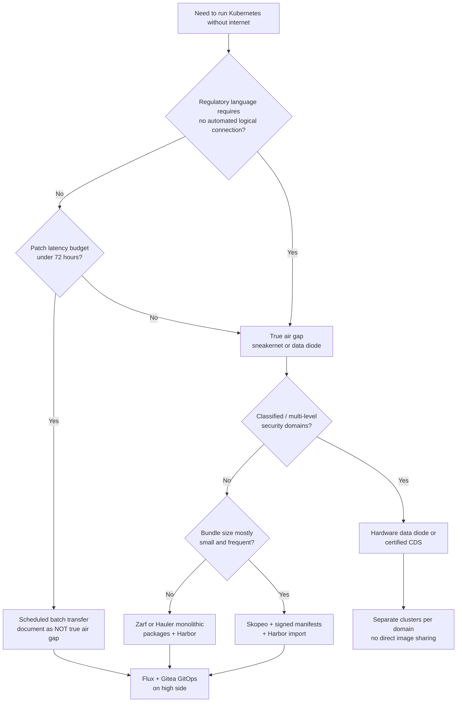

> **Complexity**: `[ADVANCED]` | Time: 60 minutes
>
> **Prerequisites**: [Planning & Economics](/on-premises/planning/), [Bare Metal Provisioning](/on-premises/provisioning/), [CKS](/k8s/cks/)

---

## What You'll Be Able to Do

After completing this module, you will be able to:

1. **Design** an air-gapped Kubernetes deployment with a secure image transfer pipeline, private registry, and offline package mirrors
2. **Implement** physical security controls including USB port lockdown, network segmentation, and access logging for classified environments
3. **Deploy** Harbor as an offline, air-gapped container registry with image signing, vulnerability scanning, and approval workflows
4. **Secure** the supply chain for disconnected clusters by validating image provenance and maintaining offline CVE databases

---

## Why This Module Matters

Hypothetical scenario: a regulated organization runs Kubernetes on owned hardware in a facility with no outbound internet path. During a quarterly audit, investigators discover that an engineer attached a personal USB drive to a worker node to "pull one missing image quickly." No malware entered the cluster, but the isolation boundary was broken, the change was undocumented, and the entire accreditation package must be revalidated — a process that consumes weeks of staff time and delays production deployments.

Teams operating high-assurance Kubernetes environments have repeatedly learned that an "air gap" fails the moment engineers improvise an unapproved network path for convenience. Even when no breach occurs, the resulting audit, revalidation, and hardware review can be expensive and disruptive. On-premises operators cannot lean on a cloud provider's managed registry, managed scanning feeds, or IAM-backed break-glass — you own the root of trust, the transfer process, and the operational tax of moving every byte across the gap by hand.

The accreditation boundary for air-gapped platforms typically spans facilities, media handling, and software supply chain — not just Kubernetes RBAC. Assessors map your architecture to control catalogs like [NIST SP 800-53](https://csrc.nist.gov/Pubs/sp/800/53/r5/upd1/Final) PE, MP, and SI families. If your narrative says "no external connectivity" but your mirror station browses the web on the same laptop that writes production bundles, the story collapses before anyone asks about PodSecurity standards.

The larger lesson is organizational: if there is no documented process for getting images and updates into a disconnected environment, engineers will improvise under pressure. Designing the transfer workstation, approval flow, and registry process up front is far cheaper than rebuilding it after an isolation failure. The submarine analogy below captures the engineering reality: resupply happens through a single controlled hatch, or not at all.

> **The Submarine Analogy**
>
> An air-gapped cluster is like a submarine. It must carry everything it needs before diving. Resupply requires surfacing at a controlled point, transferring cargo through a single hatch, and inspecting every crate. If someone drills a hole in the hull "just for a quick connection," the entire vessel is compromised. Your image pipeline is that supply hatch -- design it before you dive.

---

## What You'll Learn

- Physical security controls for datacenters housing Kubernetes infrastructure
- How to design and operate truly disconnected (air-gapped) Kubernetes clusters
- Setting up Harbor as a local container registry with image mirroring
- Sneakernet workflows for transferring images and updates
- Air-gapped GitOps with Flux using local Git servers
- Common failures in air-gapped environments and how to prevent them

---

## Air-Gap Threat Model and Taxonomy

Before you disable a network cable, classify what kind of "gap" you actually need, because the controls, cost, and failure modes differ sharply across isolation levels. A **true air gap** means no physical or automated logical connection between the high-side (production) environment and any untrusted network — [NIST defines this as no physical connection and no automated logical connection](https://csrc.nist.gov/glossary/term/air_gap). A **low-side/high-side split** keeps a connected staging enclave that mirrors artifacts inward through a one-way transfer, while production remains disconnected. **Intermittently connected (DDIL — disconnected, degraded, intermittent, or limited)** environments schedule batch transfers through a controlled window rather than maintaining permanent isolation; financial and healthcare operators sometimes choose this model when patch latency must stay below weeks, accepting weaker assurance than a physics-enforced gap.

What an air gap buys you is structural: there is no inbound exploit path over the network and no outbound exfiltration channel over the same wire, because the wire does not exist. What it does **not** buy is immunity from insiders, compromised transfer bundles, or malware embedded in vendor media that crossed the gap through your own approved process. Supply-chain attacks do not require internet access on the target cluster — they require only that you trust the wrong tarball. USB-born malware, malicious insiders with rack access, and tampered optical media remain in scope regardless of network topology.

Transfer guards fall into two families. **Data diodes** and certified cross-domain solutions enforce one-way flow in hardware — [NIST's data diode definition](https://csrc.nist.gov/glossary/term/data_diode) emphasizes that data travels in only one direction, which simplifies audit evidence compared to firewall rule reviews. **Sneakernet** (encrypted removable media with chain-of-custody logging and two-person integrity) trades bandwidth for operational flexibility; it is slower and human-intensive but does not require specialized hardware. Many defense programs combine both: diode for high-frequency telemetry ingestion, sneakernet for bulky container image bundles.

Threat modeling for air gaps should explicitly list **insider paths**: administrators with Harbor admin credentials can push malicious images even without internet; couriers can swap USB sticks if chain-of-custody is weak; vendors can ship compromised offline installers if you skip signature verification on Harbor's own tarball. Network elimination removes an entire attack surface class but shifts attacker economics toward supply-chain and physical channels — your controls must follow that shift, not pretend the gap alone equals "secure."

Document your isolation level in the System Security Plan using precise language. Assessors distinguish "no inbound connection from untrusted networks" from marketing phrases like "virtually air-gapped." Mislabeling a firewall-segmented VLAN as a physical air gap creates compliance debt that surfaces during penetration tests or incident response, when someone discovers the maintenance VPN was left up after a vendor session.

---

## Datacenter Physical Controls

Physical security is the foundation. If someone can touch the hardware, every software control is moot — and on bare-metal Kubernetes nodes, "touching the hardware" includes BMC consoles, USB ports, and rack-level KVM switches that bypass your Kubernetes RBAC entirely. [NIST SP 800-53 Rev. 5](https://csrc.nist.gov/Pubs/sp/800/53/r5/upd1/Final) maps these expectations to control families such as Physical and Environmental Protection (PE), Media Protection (MP), and Access Control (AC); your accreditation package should trace each layer below to specific control statements rather than treating "locked door" as sufficient.

### The Seven Layers of Physical Security

```
┌──────────────────────────────────────────────────────────────┐
│                    PHYSICAL SECURITY LAYERS                  │
│                                                              │
│  Layer 7: Port-level control (USB disable, IPMI isolation)   │
│  Layer 6: Rack-level locks (keyed, electronic, biometric)    │
│  Layer 5: Cage/zone (locked cage, separate HVAC zone)        │
│  Layer 4: Server room (mantrap, badge + biometric)           │
│  Layer 3: Building (security desk, visitor log)              │
│  Layer 2: Perimeter (fence, bollards, cameras)               │
│  Layer 1: Site selection (flood zone, flight path, distance) │
│                                                              │
│  An attacker must defeat ALL layers to reach hardware.       │
│  Most organizations stop at Layer 4 and skip Layers 6-7.    │
└──────────────────────────────────────────────────────────────┘
```

Layers 1–4 are familiar datacenter hygiene: site selection, perimeter cameras, badge access, and caged colocation space. Layers 6–7 are where Kubernetes on bare metal diverges from cloud assumptions — an attacker with rack access and a USB Rubber Ducky does not need your API server credentials. SCIF and classified-tier facilities add tamper-evident seals on media, escorted maintenance, and separate HVAC zones so exhaust-side attacks remain out of scope; even non-classified high-assurance labs benefit from media control logs that record who wrote bundle N, who transported it, and who verified checksums on arrival.

Visitor and contractor access deserves the same rigor as employee badges: escorted at all times in the server room, tool inventories checked in and out, and photography bans enforced where policy requires. Kubernetes nodes look like generic servers to facilities staff — label racks clearly with data classification so a well-meaning hardware swap does not introduce a non-hardened replacement into a high-side cage. Camera retention policies should align with your incident response window; discovering tampering six months after the fact helps lawyers more than operators.

### Port Control on Bare Metal Nodes

Disable unused physical ports at the BIOS and OS level. The following commands prevent USB storage devices from being used to exfiltrate data or introduce malware, and isolate BMC interfaces on a management-only VLAN. Defense in depth means BIOS disables USB boot **and** the kernel refuses to bind the storage driver **and** optional userspace tools like USBGuard enforce policy for remaining USB classes (keyboards with embedded hubs are a recurring bypass vector if you only block mass storage).

> **Stop and think**: Why does the script use `install usb-storage /bin/false` instead of `blacklist usb-storage`? What is the security difference between these two approaches?

```bash
# Disable USB storage at the kernel level (Linux)
# Use 'install' directive instead of 'blacklist' — blacklist only prevents
# auto-loading but the module can still be loaded manually with modprobe.
echo "install usb-storage /bin/false" > /etc/modprobe.d/disable-usb-storage.conf
echo "install uas /bin/false" >> /etc/modprobe.d/disable-usb-storage.conf
update-initramfs -u

# Verify USB storage is blocked (modprobe should return an error)
modprobe usb-storage 2>&1  # Should fail with "install /bin/false"

# Disable Thunderbolt/DMA attack vectors
echo "blacklist thunderbolt" > /etc/modprobe.d/disable-thunderbolt.conf

# Lock down IPMI/BMC to management VLAN only
# (Done at network switch level -- restrict BMC ports to mgmt VLAN)
ipmitool lan set 1 ipsrc static
ipmitool lan set 1 ipaddr 10.99.0.11    # Management VLAN
ipmitool lan set 1 netmask 255.255.255.0
```

BMC and IPMI interfaces are a soft underbelly: they provide power cycle, virtual media mount, and serial console even when the host OS is hardened. Restrict BMC NICs to a dedicated management VLAN with no route to production workloads, rotate default credentials before rack-and-stack, disable unused Redfish users, and log every remote session. Hypothetical scenario: an attacker on the corporate LAN discovers a BMC still using the vendor default password; they mount an ISO over virtual media and reboot the node into a live environment that reads etcd data from disk — no Kubernetes vulnerability required.

### BIOS/UEFI Hardening

```
BIOS Settings for Air-Gapped Kubernetes Nodes:
─────────────────────────────────────────────
1. Set BIOS admin password           -- prevent boot order changes
2. Disable USB boot                  -- prevent booting from removable media
3. Disable PXE boot (after install)  -- prevent network reimaging
4. Enable Secure Boot                -- only signed bootloaders
5. Disable serial/COM ports          -- no console access from outside
6. Set boot order: disk only         -- no fallback to network/USB
7. Enable TPM 2.0                    -- measured boot (see Module 6.2)
8. Disable AMT/Intel ME if possible  -- reduce remote management surface
```

Secure Boot and TPM measured boot (covered in [Module 6.2](../module-6.2-hardware-security/)) close the loop between firmware trust and disk encryption: if an attacker replaces the bootloader, PCR values change and sealed LUKS keys refuse to unlock. Pair UEFI Secure Boot with an internal certificate authority whose keys never leave your HSM boundary — cloud providers publish their PKI roots for you; on-premises, you publish your own.

---

## Air-Gapped Kubernetes Architecture

[A truly air-gapped cluster has zero network connectivity to the internet or any untrusted network.](https://csrc.nist.gov/glossary/term/air_gap) All software enters through a controlled transfer process. Architecturally, think in three zones: a **connected mirror station** that can reach upstream registries and CVE feeds; a **transfer enclave** where humans or hardware diodes move approved artifacts; and the **high-side cluster** where Harbor, Gitea, Flux, and workloads run with no default route to the outside world.

```
┌─────────────────────────────────────────────────────────────────┐
│                   AIR-GAPPED ARCHITECTURE                       │
│                                                                 │
│  CONNECTED SIDE              GAP              DISCONNECTED SIDE │
│  ─────────────              ─────             ──────────────── │
│                                                                 │
│  ┌──────────────┐   ┌──────────────┐   ┌──────────────────┐   │
│  │ Internet     │   │ Transfer     │   │ Air-Gapped       │   │
│  │ Mirror       │──>│ Workstation  │──>│ K8s Cluster      │   │
│  │ Station      │   │ (diode/USB)  │   │                  │   │
│  └──────────────┘   └──────────────┘   │ ┌──────────────┐ │   │
│                                         │ │ Harbor       │ │   │
│  Pull images        Scan, approve,     │ │ (registry)   │ │   │
│  from Docker Hub,   burn to media      │ └──────────────┘ │   │
│  Quay, GitHub        or push via       │ ┌──────────────┐ │   │
│                      data diode        │ │ Gitea/GitLab │ │   │
│  ┌──────────────┐                      │ │ (local Git)  │ │   │
│  │ Vendor       │                      │ └──────────────┘ │   │
│  │ Packages     │                      │ ┌──────────────┐ │   │
│  │ (RPM/DEB)    │                      │ │ Flux         │ │   │
│  └──────────────┘                      │ │ (GitOps)     │ │   │
│                                         │ └──────────────┘ │   │
│                                         └──────────────────┘   │
└─────────────────────────────────────────────────────────────────┘
```

DNS deserves explicit design on the high side: CoreDNS must resolve internal service names (`registry.internal.corp`, `gitea.gitea.svc`) without forwarding to public resolvers. Pre-create records for every upstream hostname you mirror into Harbor so application manifests can keep familiar image paths while containerd redirects pulls to your local registry via mirror configuration. Forwarding stubs that leak queries outward — even "just for debugging" — violate isolation; use split-horizon DNS with internal-only zones and logging on every non-recursive query so anomalies surface during SIEM review.

Network segmentation inside the high side still matters: Harbor, Gitea, etcd, and worker nodes should not share flat L2 if you can avoid it. Micro-segmentation with network policies (and physical VLANs for BMC) limits lateral movement when a workload is compromised. The air gap stops inbound internet paths; it does not stop east-west propagation after a bad image runs.

### Transfer Methods

| Method | Bandwidth | Security | Use Case |
|--------|-----------|----------|----------|
| USB/removable media (sneakernet) | Low (hours) | High (physical control) | Classified environments, < 50 images |
| Data diode (hardware) | Medium | Very high (physics-enforced one-way) | Defense, nuclear, critical infrastructure |
| Cross-domain solution (CDS) | Medium-High | High (certified product) | Government, multi-level security |
| Scheduled batch transfer | High | Medium (network-based, time-limited) | Financial, healthcare (not true air-gap) |

Scheduled batch transfer is **not** a true air gap — it is a disconnected **cadence** with a latent bidirectional path. Document the distinction in your System Security Plan so assessors do not inherit false assurance. When regulatory language requires "no automated logical connection," batch VPN windows fail the test even if firewalls are strict.

When evaluating **cross-domain solutions**, verify the product's certification matches your accreditation tier — a CDS approved for one classification level may not satisfy another. Installation cost includes not only hardware but ongoing validator labor: diodes and CDS appliances still need firmware updates, and those updates arrive through the same sneakernet you built for Kubernetes images. Budget maintenance transfers for security appliances themselves, or they become the oldest software on site.

---

## The Disconnected Supply Chain

Running Kubernetes disconnected means you own the entire supply chain: container images, Helm charts, OS packages, vulnerability databases, SBOMs, and signature verification keys must all arrive as a coherent bundle with provenance you can defend in an audit. Nothing "just downloads" on the high side — if it does, you have a policy violation or a backdoor.

### Artifact classes and transfer tooling

| Artifact | Connected-side source | Bundle format | High-side verification |
|----------|----------------------|---------------|------------------------|
| Container images | Upstream registries | OCI archive tar via `skopeo copy` | SHA256 + cosign/Notation signature |
| Kubernetes core images | `kubeadm config images list` | Same OCI archives | Match digest list in signed manifest |
| Helm charts | Chart repos | `.tgz` + provenance | `helm verify` if publisher signs |
| OS packages | Vendor mirrors | RPM/DEB + repodata | GPG repo signing keys transferred once |
| Trivy DB | `oras pull ghcr.io/aquasecurity/trivy-db:2` | OCI artifact | metadata.json freshness timestamp |
| GitOps manifests | GitHub/GitLab | Git bundle or tarball | Signed commits / tag signatures |

**Skopeo** and **crane** copy images without a local Docker daemon — essential on mirror stations that should not run arbitrary containers. **`kubeadm config images pull --kubernetes-version v1.35.0`** (verify exact patch with your kubeadm package) pre-stages control-plane images into the local container runtime store before you export them. Bundle tools like **[Zarf](https://docs.zarf.dev/)** and **Hauler** (verify current release notes at install time) package images, charts, and manifests into a single compressed artifact with optional cosign signatures — valuable when operators need repeatable "drop one file, deploy a platform" workflows rather than ad-hoc shell loops.

On the high side, verification order matters: **integrity first** (SHA256 against signed manifest), **authenticity second** (cosign/Notation signature against your org trust root), **policy third** (Trivy/Grype scan against offline DB). Reversing scan-before-checksum wastes time on tampered inputs. Generate SBOMs on the connected side with **[Syft](https://github.com/anchore/syft)** and store them alongside each bundle; when a CVE bulletin arrives weeks later, you can grep SBOMs offline to see exposure without rescanning every layer from scratch.

Offline Trivy and Grype databases age like milk, not wine. Establish a **weekly transfer cadence** for DB refreshes even when no application images change — otherwise Harbor reports green scans while missing newly published CVEs. Include Java-specific DB artifacts if you scan JVM images: Harbor 2.11+ exposes `skip_java_db_update` alongside `skip_update` and `offline_scan` ([Harbor Trivy offline configuration](https://goharbor.io/docs/2.11.0/administration/vulnerability-scanning/import-vulnerability-data/)); forgetting the Java DB produces confusing scan failures on Spring-based workloads.

Every bundle needs a **provenance record**: bundle ID, author, connected-side scan timestamp, signing key ID, manifest hash, and approval ticket. When an auditor asks "what is the provenance of bundle 2026-W23?", you produce a signed manifest chain, not a Slack thread.

**Offline OS repositories** deserve the same rigor as container images. Mirror RHEL, Ubuntu, or SUSE content on the connected side with repo metadata signed by vendor keys you transfer once through an out-of-band key ceremony. On the high side, point `dnf`/`apt` at internal mirrors — never at cached `.rpm` folders without repodata, or dependency resolution will diverge silently across nodes. Node OS patching and Kubernetes patch versions must stay coupled in change records so you can answer "which kernel CVEs were open on worker-17 during incident X?"

**Helm chart provenance** varies by publisher: some charts ship `.prov` files for `helm verify`; many do not. For unsigned charts, treat the tarball hash in your signed manifest as the trust anchor and store a copy of the exact `.tgz` in WORM storage. Flux `HelmRepository` and `OCIRepository` sources should reference internal Harbor OCI chart locations after you re-push charts inward — do not configure high-side Flux to poll chart museums that require internet.

When bundling **CNI, ingress, and CSI** operators, remember their CRDs and webhook certificates are part of the transfer, not just container images. A complete platform bundle includes admission webhooks, monitoring stack CRDs, and the CA that signs them — missing any piece produces a cluster that "installs" but fails silently on first Pod with unmet dependencies.

---

## Setting Up Harbor as a Local Registry

Harbor is a common choice for air-gapped container registries because it combines registry management with security and access-control workflows — project quotas, robot accounts, vulnerability scanning, and Notary/cosign-compatible signing workflows depending on your configuration. Treat Harbor as mandatory infrastructure **before** any worker joins the cluster: nodes that pull directly from embedded tarballs bypass centralized policy gates.

A local **OS package mirror** (apt/yum) on the high side is equally mandatory. Kubernetes nodes still need kernel updates, container runtime patches, and firmware tools; air-gapping only the container registry while leaving OS updates to sneakernet RPM folders without a managed repo produces inconsistent patch levels across the fleet.

### Install Harbor (Air-Gapped Side)

```bash
# On the connected side: download Harbor installer
curl -LO https://github.com/goharbor/harbor/releases/download/v2.11.0/harbor-offline-installer-v2.11.0.tgz
curl -LO https://github.com/goharbor/harbor/releases/download/v2.11.0/harbor-offline-installer-v2.11.0.tgz.asc

# Verify signature
gpg --verify harbor-offline-installer-v2.11.0.tgz.asc

# Transfer to air-gapped side via approved method
# ... (sneakernet, data diode, etc.)

# On the air-gapped side: install Harbor
tar xzf harbor-offline-installer-v2.11.0.tgz
cd harbor

# Configure harbor.yml
cat > harbor.yml <<'HARBOREOF'
hostname: registry.internal.corp
http:
  port: 80
https:
  port: 443
  certificate: /etc/harbor/certs/registry.crt
  private_key: /etc/harbor/certs/registry.key
harbor_admin_password: <change-me>
database:
  password: <change-me>
  max_idle_conns: 50
  max_open_conns: 1000
data_volume: /data/harbor
trivy:
  ignore_unfixed: false
  skip_update: true          # Critical: no internet for DB updates
  skip_java_db_update: true  # Prevent Java DB download attempts
  offline_scan: true         # Use bundled vulnerability DB
HARBOREOF

# Install with Trivy (offline mode)
./install.sh --with-trivy
```

Harbor **robot accounts** automate high-side imports with scoped credentials and expiration dates — prefer robots over shared admin passwords for CI and Flux image automation. **Proxy-cache projects** pull-through from upstream on the connected side only; on the high side, use **full mirror** projects populated by your transfer pipeline so Harbor never attempts outbound registry calls. Configure **retention policies** and per-project quotas so a runaway CI job cannot fill `/data/harbor` and halt all cluster pulls.

### Mirror Images for Transfer

On the connected side, use `skopeo` or `crane` to create portable image bundles. The workflow creates a list of every image needed, exports each to a portable OCI archive format, and generates checksums for integrity verification on the air-gapped side. Pin tags with digests in your manifest where possible — tags move; digests do not.

> **Pause and predict**: Why does the transfer process use SHA256 checksums AND GPG signatures? What attack does each one protect against?

```bash
# Create a manifest of required images
# Verify exact tags with: kubeadm config images list --kubernetes-version v1.35.0
cat > image-list.txt <<'EOF'
registry.k8s.io/kube-apiserver:v1.35.0
registry.k8s.io/kube-controller-manager:v1.35.0
registry.k8s.io/kube-scheduler:v1.35.0
registry.k8s.io/kube-proxy:v1.35.0
registry.k8s.io/etcd:3.6.6-0
registry.k8s.io/coredns/coredns:v1.13.1
registry.k8s.io/pause:3.10.1
quay.io/cilium/cilium:v1.16.5
ghcr.io/fluxcd/flux-cli:v2.4.0
ghcr.io/fluxcd/source-controller:v1.4.1
ghcr.io/fluxcd/kustomize-controller:v1.4.0
goharbor/harbor-core:v2.11.0
EOF

# Mirror all images to a local directory
mkdir -p /transfer/images
while IFS= read -r image; do
  # Create directory-safe name
  dir_name=$(echo "$image" | tr '/:' '_')
  skopeo copy \
    "docker://${image}" \
    "oci-archive:/transfer/images/${dir_name}.tar"
done < image-list.txt

# Calculate checksums for integrity verification
cd /transfer/images
sha256sum *.tar > SHA256SUMS

# Write to approved media
# (Encrypted USB, write-once optical media, etc.)
```

### Import Images on the Air-Gapped Side

After physical transfer, the first step is usually integrity verification. Only after confirming checksums should you push images to the internal Harbor registry, retagging them to match the internal registry naming convention.

```bash
# Verify checksums after transfer
cd /transfer/images
sha256sum -c SHA256SUMS || { echo "INTEGRITY CHECK FAILED"; exit 1; }

# Push each image to Harbor
while IFS= read -r image; do
  dir_name=$(echo "$image" | tr '/:' '_')
  # Retag for local registry
  local_image="registry.internal.corp/${image#*/}"
  skopeo copy \
    "oci-archive:/transfer/images/${dir_name}.tar" \
    "docker://${local_image}" \
    --dest-tls-verify=true \
    --dest-creds admin:<harbor-password>
done < image-list.txt

echo "Import complete. Verify in Harbor UI: https://registry.internal.corp"
```

Configure **containerd mirror rules** on every node so `registry.k8s.io` and other upstream names transparently resolve to Harbor — operators keep upstream-style references in manifests while pulls never leave the high side. Document the mirror table in Git alongside Flux manifests so rebuilds stay reproducible.

### Image Signing on Import

Checksums prove a file was not corrupted in transit; **signatures** prove it was published by your organization and not swapped by an insider on the connected mirror station. **[cosign](https://docs.sigstore.dev/cosign/signing/overview/)** (Sigstore) and **[Notation](https://notaryproject.dev/docs/)** (CNCF Notary v2) both attach signatures to OCI artifacts — choose one trust root and enforce it consistently. On the connected side, sign each archive or manifest list with your org key; on the high side, configure Harbor's **content trust** or admission policies (Kyverno verifyImages, Gatekeeper, or native policy in later releases — verify against your 1.35 cluster capabilities) to reject unsigned images before pods schedule.

Store signing keys in an HSM or offline ceremony machine — not on the same mirror laptop that pulls from the public internet. Rotate keys on a documented schedule and cross-sign during rotation so bundles signed under the old key remain valid until expiry.

Harbor **vulnerability scanning policies** can block pulls of images exceeding a severity threshold — valuable on the high side where you cannot rely on external CI gates. Configure project-level policies after validating Trivy offline DB freshness; a policy backed by stale data creates false confidence. **Replication** features matter when you operate multiple high-side clusters in different bunkers: replicate approved images between Harbor instances over dedicated links rather than re-running sneakernet for each site — but never replicate from low-side directly; each replication path should stay within the same trust zone.

For **admission-time enforcement**, combine Harbor scan results with Kubernetes admission policy: Kyverno `verifyImages` rules, Gatekeeper constraints, or ValidatingAdmissionPolicy with CEL expressions (verify GA status on your 1.35 cluster before committing). The registry is your last centralized gate before containerd pulls; admission is the last software gate before pods run — use both so a pushed-but-never-scanned image cannot schedule because someone bypassed the UI workflow.

---

## Sneakernet Update Workflow

Updates to an air-gapped cluster require a disciplined process. This is the most failure-prone part of air-gapped operations — not because the technology is exotic, but because humans skip steps under outage pressure.

```
┌─────────────────────────────────────────────────────────────────┐
│               SNEAKERNET UPDATE WORKFLOW                         │
│                                                                 │
│   1. PREPARE (connected side)                                   │
│      ├── Pull new container images                              │
│      ├── Download OS packages (RPM/DEB)                         │
│      ├── Pull Helm charts / Flux manifests                      │
│      ├── Update Trivy vulnerability DB                          │
│      └── Generate SHA256 checksums                              │
│                                                                 │
│   2. REVIEW (approval gate)                                     │
│      ├── Security team reviews image list                       │
│      ├── Change advisory board approves transfer                │
│      └── Two-person integrity rule for media handling           │
│                                                                 │
│   3. TRANSFER (physical movement)                               │
│      ├── Write to encrypted removable media                     │
│      ├── Transport via approved courier/method                  │
│      └── Log chain of custody                                   │
│                                                                 │
│   4. IMPORT (air-gapped side)                                   │
│      ├── Verify checksums on arrival                            │
│      ├── Scan all images with Trivy (offline DB)                │
│      ├── Push to Harbor                                         │
│      └── Update local Git repo with new manifests               │
│                                                                 │
│   5. DEPLOY (via air-gapped GitOps)                             │
│      ├── Flux detects changes in local Gitea                    │
│      ├── Reconciles cluster to desired state                    │
│      └── Verify rollout, run smoke tests                        │
└─────────────────────────────────────────────────────────────────┘
```

The two-person integrity rule is not bureaucracy — it reduces single-insider tampering risk and catches honest mistakes (wrong bundle, wrong USB stick) before they reach production. Chain-of-custody logs should include media serial numbers, cryptographic hashes of the manifest, escort names, and tamper-evident bag seals where policy requires them. Reconcile manifest line counts on arrival: if the connected side exported forty-two OCI archives, the high side should import forty-two — not forty-one, not forty-three. Discrepancies trigger investigation before any `skopeo copy` pushes to Harbor.

Version your bundle format in Git: when `weekly-mirror.sh` changes directory layout, old runbooks must still parse historical bundles for forensic reconstruction. Teams that overwrite scripts without semver tags discover during audits that nobody can re-verify a six-month-old transfer.

### Automating the Connected Side

```bash
#!/bin/bash
# weekly-mirror.sh -- Run on connected mirror station
set -euo pipefail
TRANSFER_DIR="/transfer/weekly-$(date +%Y%m%d)"
mkdir -p "${TRANSFER_DIR}"/{images,charts,os-packages,trivy-db}

# 1. Mirror container images from image-list.txt
while IFS= read -r image; do
  dir_name=$(echo "$image" | tr '/:' '_')
  skopeo copy "docker://${image}" \
    "oci-archive:${TRANSFER_DIR}/images/${dir_name}.tar" --retry-times 3
done < /etc/mirror/image-list.txt

# 2. Mirror Helm charts
helm pull cilium/cilium --version 1.16.5 -d "${TRANSFER_DIR}/charts/"

# 3. Download OS packages
dnf download --resolve --destdir="${TRANSFER_DIR}/os-packages/" \
  kernel container-selinux cri-o kubernetes-cni

# 4. Download Trivy offline DB
oras pull ghcr.io/aquasecurity/trivy-db:2 -o "${TRANSFER_DIR}/trivy-db/"

# 5. Generate checksums and sign
find "${TRANSFER_DIR}" -type f \( -name '*.tar' -o -name '*.tgz' -o -name '*.rpm' \) \
  | sort > "${TRANSFER_DIR}/MANIFEST.txt"
cd "${TRANSFER_DIR}" && sha256sum $(cat MANIFEST.txt) > SHA256SUMS
gpg --detach-sign --armor SHA256SUMS
```

---

## Air-Gapped GitOps with Flux

GitOps in an air-gapped environment requires a local Git server (Gitea or GitLab) instead of GitHub — Flux controllers poll internal Git and OCI sources on intervals you define, with no outbound hooks to SaaS. The Git server itself is just another artifact in your transfer bundle: initialize it from a pinned image in Harbor, restore repositories from signed git bundles, and only then bootstrap Flux.

### Set Up Gitea (Local Git Server)

Deploy Gitea as a single-replica Deployment in the `gitea` namespace. Use the image from Harbor (`registry.internal.corp/gitea/gitea:1.22.4`), expose ports 3000 (HTTP) and 22 (SSH), and mount a PVC for persistent storage. Create a ClusterIP Service for internal access.

```bash
kubectl create namespace gitea
# Deploy Gitea (Deployment + Service + PVC)
# Image: registry.internal.corp/gitea/gitea:1.22.4
# Ports: 3000 (HTTP), 22 (SSH)
# Storage: PVC mounted at /data
```

### Configure Flux for Air-Gapped Operation

```bash
# Bootstrap Flux pointing to local Gitea
# (Flux images must already be in Harbor)
flux bootstrap git \
  --url=http://gitea.gitea.svc:3000/platform/cluster-config.git \
  --branch=main \
  --path=clusters/production \
  --components-extra=image-reflector-controller,image-automation-controller \
  --registry=registry.internal.corp/fluxcd

# Configure Flux to use Harbor for all image pulls
cat > clusters/production/registry-mirror.yaml <<'EOF'
apiVersion: source.toolkit.fluxcd.io/v1
kind: OCIRepository
metadata:
  name: cilium-chart
  namespace: flux-system
spec:
  interval: 10m
  url: oci://registry.internal.corp/charts/cilium
  ref:
    tag: "1.16.5"
EOF
```

Flux's **image-automation** components can still tag and commit manifest updates on the high side, but they cannot reach external registries — image reflector scans Harbor only. Disable or remove ImageUpdateAutomation paths that assume Docker Hub metadata APIs exist. [Flux documentation](https://fluxcd.io/flux/installation/bootstrap/) describes bootstrap flags; adapt registry URLs to your internal Harbor hostname.

Treat **Git history on Gitea** as part of your evidence chain: signed commits, protected branches, and mandatory review before merges to `main`. Sneakernet-delivered manifest updates should land via pull request on the high side even when only two operators exist — self-merge without review recreates the insider risk the air gap was supposed to reduce. Flux reconciles whatever is on `main`; if `main` is writable without oversight, your GitOps pipeline is only as trustworthy as the least careful engineer with push access.

### Update Workflow

When new manifests arrive via sneakernet:

```bash
# On the transfer workstation, push updated manifests to Gitea
cd /transfer/manifests/cluster-config
git remote add local http://gitea.internal.corp:3000/platform/cluster-config.git
git push local main

# Flux will detect the change and reconcile automatically
# Monitor the reconciliation
flux get kustomizations --watch
```

---

## Updating Trivy's Vulnerability Database Offline

Trivy cannot fetch vulnerability data in an air-gapped environment. Include the Trivy DB in every weekly transfer bundle: download it on the connected side with `oras pull ghcr.io/aquasecurity/trivy-db:2`, transfer it, then copy to Harbor's Trivy data directory and restart the Trivy container. Verify the DB freshness via Harbor's system info API or by checking `metadata.json` timestamps inside the scanner cache path documented for your Harbor version.

Harbor's offline scanning model expects you to refresh both the primary vulnerability database and, when scanning Java applications, the Java-specific database — configure `skip_java_db_update: true` only **after** you have a process to transfer that database artifact as well. Scan failures that mention `java-db` download timeouts in air-gapped sites are a common Day-2 surprise; treat Java DB transfer as part of the standard bundle checklist, not an optional appendix.

Document the **expected scan latency** after DB import: large Harbor projects with thousands of tags may take hours to rescan. Schedule imports during maintenance windows and communicate to application teams that "green in Harbor" means green against the DB timestamp stamped on the bundle, not against the public internet's live CVE feed at this exact minute.

---

## Day-2 Operations in the Dark

Air-gapped clusters do not stop needing care after bootstrap — they need **more** operational discipline because you cannot `kubectl apply` your way out of a missing image at 2 a.m. by pulling from the internet. Patch latency becomes a first-class risk metric: every day between public CVE disclosure and your next approved transfer window is exposure time you consciously accept.

**Knowing a CVE matters without a live feed** requires preparatory work: maintain SBOMs for every deployed image, subscribe to vendor bulletins on the connected side, and ship summarized exposure reports inward with each bundle. Security analysts on the high side should not need Twitter to learn about critical Kubernetes CVEs — your low-side team filters noise and transfers actionable intelligence as signed markdown advisories.

**Break-glass** procedures must exist before emergencies: pre-approved emergency transfer roles, after-hours escorts for media, and documented rollback paths when a bad patch enters Harbor. Break-glass without logging destroys accreditation; break-glass with immutable [Kubernetes audit logs](https://kubernetes.io/docs/tasks/debug/debug-cluster/audit/) preserves accountability.

**Offline GitOps drift** still happens when operators `kubectl edit` during incidents. Flux will fight manual changes on the next reconcile — train teams to patch Git on the high side (via sneakernet-delivered commits) rather than mutating production directly. For incidents requiring immediate mutation, use a time-bounded suspension of Flux kustomizations with ticket IDs and automatic re-enable timers.

Hypothetical scenario: a zero-day in a ingress controller image is disclosed on Monday; your transfer window is Friday. Leadership must decide whether to accept four days of known exposure, spend courier overtime for an emergency bundle, or temporarily scale affected workloads to zero — there is no managed-cloud "click to patch" escape hatch on owned hardware.

**Capacity planning in the dark** also differs from connected operations: you cannot autoscale node pools from a cloud API during traffic spikes if you never pre-staged excess hardware and images on the high side. Maintain a buffer of spare nodes, pre-pulled pause images, and empty PV capacity in your quarterly bundles so burst traffic does not force an unplanned transfer. **Observability** stacks (Prometheus, Loki, tracing collectors) must be installed from the same Harbor/Gitea pipeline — otherwise on-call engineers fly blind during the exact incidents where improvisation breaks isolation.

**Access logging** for classified environments extends beyond Kubernetes audit logs: physical entry logs, BMC session recordings, Harbor pull audit trails, and Git push history on Gitea should correlate to a single ticket ID for each change window. When investigators reconstruct timelines, gaps in any layer look like concealment even when the gap is innocent oversight. Export logs to WORM storage on the high side; do not assume you can "pull logs from SaaS" later.

Training matters as much as tooling: engineers accustomed to `docker pull` during incidents will revert under stress unless drills rehearse sneakernet imports quarterly. Tabletop exercises that walk through "CVE published → bundle approved → media escorted → import verified → Flux reconcile" expose missing runbook steps before auditors or attackers do.

---

## Patterns & Anti-Patterns

### Proven Patterns

**Dedicated transfer workstation with no route to production.** The mirror station lives on a connected VLAN, writes bundles to staging media, and never mounts production clusters. Compromise of the mirror laptop does not instantly become compromise of etcd — you still have checksum and signature gates on the high side, but network separation limits lateral movement during bundle preparation.

**Signed manifest of expected artifacts per bundle ID.** Every transfer publishes a human-readable manifest (image names, digests, chart versions, DB timestamps) signed with your org GPG or cosign key. Importers reject any file not listed in the manifest, preventing "extra" images from slipping in alongside approved updates.

**Harbor project per trust zone with robot importers.** Separate Harbor projects for `platform-core`, `tenant-apps`, and `lab-experimental` with different retention, scanning strictness, and RBAC. Robot accounts scoped to a single project limit blast radius when automation credentials leak.

**Weekly DB refresh even when images unchanged.** Vulnerability intelligence updates faster than application releases. Transfer Trivy and Grype databases on schedule independent of application churn so Harbor scans remain meaningful.

**Pre-staged break-glass media.** Maintain sealed emergency bundles for critical platform components (CoreDNS, CNI, ingress) approved quarterly but not deployed until needed — reduces emergency courier scrambles when leadership accepts patch delay risk for applications but not for platform survival.

### Anti-Patterns

| Anti-Pattern | Why Teams Fall Into It | What Goes Wrong | Better Approach |
|--------------|------------------------|-----------------|-----------------|
| Firewall-only "air gap" | Faster setup, familiar ops | Residual bidirectional path; rule misconfigurations | True physical/logical disconnect per NIST definition |
| Shared admin password on Harbor | Simplicity | Credential sprawl; no scoped revocation | Robot accounts + per-operator SSO where available |
| Scan-after-deploy | Pressure to ship | Vulnerable images run before anyone reads Trivy output | Scan on import; admission policy blocks critical CVEs |
| Skipping chain-of-custody for "small" bundles | Perceived low risk | Undetected swap/tamper; audit failure | Two-person integrity for all media, regardless of size |
| Pulling directly to nodes bypassing Harbor | "Just this once" | No central scan/signing gate; inconsistent tags | Mandatory containerd mirrors to Harbor |
| Stale Trivy DB + green scans | DB transfer is tedious | False negative assurance | Weekly DB bundle + metadata freshness alerts |
| Emergency USB without runbook | Outage panic | Isolation broken; untracked artifacts | Pre-approved break-glass with logging and revalidation |

---

## Decision Framework

Choosing isolation level, transfer mechanism, and bundle tooling should be deliberate — not a default copied from a vendor reference architecture. Use the flowchart below, then the matrix for tooling tradeoffs.



### Transfer and Registry Decision Matrix

| Factor | Sneakernet + skopeo | Data diode | Zarf/Hauler bundle | Scheduled VPN batch |
|--------|---------------------|------------|--------------------|---------------------|
| Assurance | High (physical control) | Very high (one-way physics) | High (if signed) | Medium |
| Bandwidth | Low–medium | Medium | High (compressed) | High |
| OpEx (people) | High courier/escort cost | Lower after install | Medium | Lower |
| CapEx | Low media cost | High hardware | Low | Medium firewall/CDN |
| True air gap? | Yes | Yes | Yes | No |
| Best fit | Classified, small sites | Defense, nuclear | Platform bootstrap | Finance with DR window |

---

## Cost Lens: On-Premises Economics of Air-Gapped Operations

Air-gapping saves cloud egress and SaaS subscription costs but introduces **human-courier operational tax** and **duplicated infrastructure** that cloud-native teams often underestimate during the business case.

### CapEx and duplicated infrastructure

Expect at least two parallel footprints: a connected **build/mirror enclave** (servers, switches, signing HSM, scanner workstations) and the **high-side production cluster** (Harbor, Gitea, Kubernetes nodes, storage). You cannot share the same Harbor instance across the gap — you mirror artifacts inward. CapEx includes encrypted removable media inventories, optical drives for write-once policies, optional data-diode hardware (specialized appliances can exceed generic server budgets by an order of magnitude — verify vendor quotes for your throughput requirement), and spare transfer workstations so a failed mirror laptop does not halt all inbound software.

### OpEx drivers

OpEx dominates over time: security analysts reviewing manifests, couriers and escorts for classified sites, change-advisory meetings for each bundle, and senior engineers spending hours on manual import verification instead of feature work. A weekly transfer cadence with two-person integrity can consume **multiple FTE-days per month** even when zero application releases occur — because vulnerability databases and OS patches still move. Budget headcount explicitly; hiding the cost inside "platform team overhead" leads to skipped transfers and stale scans.

Power, cooling, and rack space apply to **both** sides of the gap. Depreciation cycles (~4–5 years for servers) hit twice if mirror and production hardware refresh on different schedules. Support contracts for Harbor, RHEL/Ubuntu, and hardware BMC firmware must be maintained on both enclaves.

### The slower-patch risk premium

When a critical CVE lands, cloud tenants patch in hours; air-gapped tenants patch on the next approved bundle — days to weeks later. That latency is a **risk premium** you accept in exchange for isolation. Quantify it in your risk register: expected cost of exposure window × probability, compared to cloud patch SLAs. For some regulated data (classified workloads, critical infrastructure control planes, strict data-sovereignty mandates), the premium is acceptable. For spiky startup workloads with no compliance driver, air-gapping is often **security theater** — expensive isolation without proportional threat reduction.

### When on-prem air-gap wins vs loses

**Wins** when steady high utilization, data gravity, regulatory mandates, or egress-heavy architectures make cloud OpEx painful and isolation is genuinely required — not merely preferred. **Loses** when scale is small, utilization is spiky, or patch velocity matters more than inbound network elimination — a well-segmented connected cluster with strict egress controls may deliver better security per dollar than a porous "air gap" with weekly USB shortcuts.

Compare TCO against cloud using **date-stamped** numbers from your procurement team, not blog posts: include courier contracts, diode maintenance, duplicate Harbor clusters, signing HSM leases, and the fully loaded cost of security reviewers per bundle. Cloud egress fees and managed registry pricing change frequently; on-prem power and colocation rates vary by region. The honest business case states assumptions explicitly ("we assume 52 transfers/year, 4 hours security review each") so leadership can sensitivity-test whether air-gapping still wins if patch frequency doubles.

Depreciation schedules interact with **hardware refresh**: transfer workstations and diode appliances age on different cycles than Kubernetes worker nodes. Budget refresh for mirror infrastructure before laptops fail mid-bundle — a mirror station with failing SSDs corrupts tar archives that pass checksums only if you get lucky. Spares inventory (encrypted USB drives, optical media, HSM tokens) is CapEx that cloud teams never line-item; on-prem FinOps must.

---

## Did You Know?

- **High-assurance environments often use hardware-enforced one-way links** when they need stronger assurance than a software firewall can provide. A data diode is designed to permit data flow in only one direction.

- [**Kubernetes v1.24 removed dockershim**](https://kubernetes.io/docs/setup/production-environment/container-runtimes/), which forced teams that depended on Docker-specific runtime workflows to revisit their tooling during migration.

- **Harbor robot accounts** are useful for automated image imports because they provide non-user-scoped credentials with scoped permissions, and administrators can set an expiration policy that fits the workflow.

- Large defense and government platforms often solve air-gapped operations by running separate clusters for separate security domains rather than sharing images directly across trust boundaries.

---

## Common Mistakes

| Mistake | Problem | Solution |
|---------|---------|----------|
| USB ports left enabled | DMA attacks, unauthorized data transfer | Disable USB storage in kernel modules and BIOS |
| No image signature verification | Tampered images could enter the cluster | Use Cosign with a local key server, verify on import |
| Stale vulnerability database | Trivy reports no CVEs (false sense of security) | Transfer Trivy DB weekly alongside images |
| Single-person transfer process | No accountability, higher insider threat risk | Two-person integrity rule for all media handling |
| No manifest of expected images | Cannot detect if images were added or removed | Generate and sign image manifests on connected side |
| IPMI/BMC on production network | Remote management bypass of air gap | Isolate BMC on dedicated management VLAN |
| Forgetting DNS in air-gapped cluster | CoreDNS cannot resolve external names | Configure internal DNS with all needed records |
| No process for emergency patches | Critical CVE with no fast path to deploy fix | Pre-approve emergency transfer process in runbook |

---

## Quiz

### Question 1
Your air-gapped cluster runs Harbor for container images. A critical CVE is published affecting your base OS image. Walk through the steps to patch all affected workloads.

<details>
<summary>Answer</summary>

**Step-by-step patching workflow for air-gapped clusters:**

1. **Connected side**: Pull the patched base image from the upstream registry. Verify the CVE fix by checking the image's changelog or scanning with Trivy.

2. **Rebuild**: If you maintain custom images built on this base, rebuild them with the patched base. Tag with a new version (never overwrite existing tags).

3. **Bundle**: Use `skopeo copy` to export the patched images to OCI archives. Generate SHA256 checksums and sign with GPG.

4. **Approve**: Submit the transfer request to the change advisory board. For critical CVEs, use the pre-approved emergency process.

5. **Transfer**: Write to encrypted removable media with two-person integrity. Transport to the air-gapped side.

6. **Import**: Verify checksums, scan with Trivy (offline DB), push to Harbor.

7. **Update manifests**: Update image tags in the Git repository hosted on Gitea. Push to the local Git server.

8. **Deploy**: Flux detects the manifest change and rolls out updated deployments. Monitor with `kubectl rollout status`.

9. **Verify**: Confirm all pods are running the patched image: `kubectl get pods -o jsonpath='{.items[*].spec.containers[*].image}'`.

The entire process is slow enough that teams should define an emergency patch path before they need it.
</details>

### Question 2
What is the difference between a data diode and a firewall, and why do classified environments require diodes?

<details>
<summary>Answer</summary>

**A firewall is a software/hardware device that filters traffic based on rules.** It can be misconfigured, bypassed by exploits, or disabled by an administrator. A firewall allows bidirectional communication and relies on correct rule configuration to block unwanted traffic.

**A data diode is a hardware device that physically enforces one-way data flow.** Typically implemented with fiber optics where the receive fiber on one side is physically absent or cut. Data can flow from the low-security side to the high-security side (or vice versa, depending on architecture) but never in the reverse direction. No software exploit can overcome a missing physical fiber.

**Why classified environments require diodes:**

1. **Assurance level**: A firewall rule can be changed by anyone with admin access. A data diode requires physical hardware modification to reverse.

2. **Certification**: Classified and safety-critical environments often prefer hardware-enforced one-way controls when they need higher assurance than a configurable firewall can provide.

3. **Insider threat**: A compromised admin can reconfigure a firewall. They cannot make data flow backward through a physically one-way connection.

4. **Audit simplicity**: Proving "no data can flow out" is trivial with a diode (physics) but complex with a firewall (rule review, log analysis, penetration testing).
</details>

### Question 3
You need to add a new application to your air-gapped cluster that requires 15 container images not currently in Harbor. Describe your process.

<details>
<summary>Answer</summary>

**Process for introducing new images to an air-gapped cluster:**

1. **Document**: Create an image manifest listing all 15 images with exact tags. Include a justification for each image (what component needs it).

2. **Security review**: Submit the image list to the security team. They review each image for:
   - Known vulnerabilities (scan with Trivy on connected side)
   - Base image provenance (is it from a trusted publisher?)
   - License compliance (some images have restrictive licenses)

3. **Pull and scan**: On the connected mirror station, pull all 15 images. Run Trivy scans. If critical CVEs are found, work with the application team to find patched versions.

4. **Export**: Use `skopeo copy` to create OCI archives for each image. Generate SHA256 checksums and sign the checksum file with GPG.

5. **Approve transfer**: Submit to the change advisory board with scan results and signed manifest.

6. **Transfer and import**: Write to encrypted media (two-person integrity). On the air-gapped side, verify checksums, scan with Trivy, push to Harbor. Create a Harbor project if needed.

7. **Update configs**: Ensure containerd mirror configuration redirects upstream registries to `registry.internal.corp`. Add images to `/etc/mirror/image-list.txt` for future weekly transfers.
</details>

### Question 4
Why is it insufficient to "just block outbound traffic with a firewall" instead of a true air gap?

<details>
<summary>Answer</summary>

**A firewall-based "air gap" has several failure modes that a true air gap does not:**

1. **Misconfiguration risk**: A single incorrect rule (e.g., `allow any any` added during troubleshooting and not removed) can break the intended isolation. Firewall-only isolation depends heavily on configuration quality, so a single troubleshooting rule change can break the intended boundary.

2. **Bidirectional path exists**: Even if outbound is blocked, the physical network connection still exists. An attacker inside the network could potentially exploit the firewall itself (firmware vulnerabilities, management interface exploits) to open a path.

3. **Residual communication paths**: If the network connection still exists, teams must still reason about allowed protocols, unintended channels, and device behavior in a way that a true air gap avoids.

4. **Software updates**: Firewalls need patches. A vulnerability in the firewall software (e.g., CVE-2023-27997 in FortiGate) could allow an attacker to bypass all rules.

5. **Administrative access**: Anyone with firewall admin credentials can change the rules. In a true air gap, there are no rules to change because there is no connection.

6. **Regulatory fit**: Whether a firewall-only design is acceptable depends on the specific accreditation or regulatory framework being applied; teams should verify that requirement explicitly.

A true air gap provides defense through physics (no wire, no fiber). A firewall provides defense through configuration (which can be wrong).
</details>

### Question 5
**Scenario:** An auditor asks how you prove that bundle `2026-W24-platform` contains exactly the images listed in your change ticket — no extras. What evidence do you produce?

<details>
<summary>Answer</summary>

You produce the **signed manifest** generated on the connected mirror station: a file listing every artifact name, digest, and size, with a GPG detached signature or cosign attestation from an org-controlled key. You match that manifest to the change ticket ID, then show high-side import logs demonstrating `sha256sum -c` succeeded against the same hash file, Harbor push records for only those repositories, and Kubernetes audit entries showing no pulls from unlisted digests during the import window. Chain-of-custody paperwork ties the USB serial number to the manifest hash. Extra images could only enter if someone bypassed all three gates — which is exactly what the auditor is testing your ability to detect.
</details>

### Question 6
**Scenario:** Harbor Trivy scans report zero critical CVEs on a Java Spring Boot image, but your low-side team confirmed a critical Log4j-class issue exists in that tag on the public internet. The image imported yesterday. What is the most likely root cause?

<details>
<summary>Answer</summary>

The most likely cause is a **stale or incomplete offline vulnerability database** on the high side — especially missing the Java-specific DB if `skip_java_db_update` is true without transferring `trivy-java.db`. Secondary causes include scanning only OS packages while JVM JAR layers are ignored due to misconfiguration, or importing an image tag that was patched upstream but your connected-side pull used an older digest. Fix by refreshing both Trivy DB artifacts on the next bundle, verifying `metadata.json` timestamps, rescanning after DB import, and pinning images by digest in manifests so tag confusion cannot recur.
</details>

### Question 7
**Scenario:** A platform engineer proposes mounting the connected mirror station on the same Layer-2 network as production "to speed up testing." Leadership asks for your risk assessment in one paragraph. What do you say?

<details>
<summary>Answer</summary>

Collapsing mirror and production onto one broadcast domain destroys the isolation boundary the air gap is built on: compromise of the internet-facing mirror station — via supply-chain malware in an upstream image, a phishing attack, or a vulnerable browser on the same laptop — gains direct network paths to etcd, Harbor, and BMC interfaces that were previously unreachable without crossing a controlled transfer gate. Speed belongs in **process automation on the mirror side**, not in shortening the network distance between untrusted inputs and production. If they need faster testing, stand up a **high-side lab cluster** fed by the same sneakernet pipeline, not a VLAN shortcut.
</details>

### Question 8
**Scenario:** Your organization debates Zarf monolithic packages versus weekly skopeo loops for a 40-node fleet. Operations headcount is fixed — no new hires. Which approach reduces long-term toil and why?

<details>
<summary>Answer</summary>

For a **fixed headcount**, Zarf (or Hauler) reduces toil when bootstrap and upgrade paths are repeatable: one signed artifact, one deploy command, embedded SBOM and signature verification — fewer bespoke shell scripts drifting across engineers. Skopeo loops win when you need **granular, frequent partial updates** (single image hotfixes) without repackaging an entire platform tarball. Many teams hybridize: Zarf for initial platform install, skopeo+Harbor for weekly CVE patches. The wrong choice is optimizing for Day-0 convenience and ignoring Day-2 patch frequency — document expected update cadence before picking tooling.
</details>

---

## Hands-On Exercise: Build an Air-Gapped Image Pipeline

**Task**: Simulate an air-gapped image transfer using two directories as "connected" and "disconnected" environments.

### Scenario
You manage an air-gapped Kubernetes cluster. A new version of CoreDNS needs to be deployed. Simulate the full pipeline.

### Steps

1. **Set up the "connected side"**:
   ```bash
   mkdir -p /tmp/connected-side/images
   cd /tmp/connected-side

   # Pull the image
   skopeo copy \
     docker://registry.k8s.io/coredns/coredns:v1.13.1 \
     oci-archive:images/coredns_v1.13.1.tar

   # Generate checksums
   cd images && sha256sum *.tar > SHA256SUMS
   ```

2. **Simulate the transfer** (copy to "air-gapped side"):
   ```bash
   mkdir -p /tmp/airgapped-side/incoming
   cp -r /tmp/connected-side/images/* /tmp/airgapped-side/incoming/
   ```

3. **Verify and import on the "air-gapped side"**:
   ```bash
   cd /tmp/airgapped-side/incoming
   sha256sum -c SHA256SUMS

   # If you have a local registry (kind with registry):
   skopeo copy \
     oci-archive:coredns_v1.13.1.tar \
     docker://localhost:5000/coredns/coredns:v1.13.1 \
     --dest-tls-verify=false
   ```

4. **Verify the image is available**:
   ```bash
   skopeo inspect docker://localhost:5000/coredns/coredns:v1.13.1 \
     --tls-verify=false | jq '.Digest'
   ```

### Success Criteria
- [ ] Image exported with `skopeo` to OCI archive
- [ ] SHA256 checksums generated and verified after transfer
- [ ] Image pushed to local registry
- [ ] Image digest matches between source and destination
- [ ] Process documented in a repeatable script

---

## Key Takeaways

1. **Physical security is non-negotiable** -- disable unused ports, lock racks, control IPMI access
2. **Air-gapped means air-gapped** -- [firewalls are not air gaps; there must be no physical connection](https://csrc.nist.gov/glossary/term/air_gap)
3. **Harbor is a common choice** for air-gapped registries with offline vulnerability scanning
4. **The transfer process is the hardest part** -- design it before you need it, with checksums and two-person integrity
5. **GitOps works air-gapped** -- use Gitea/GitLab locally with Flux pointing to internal Git
6. **Supply-chain trust moves inward** -- checksums, signatures, SBOMs, and offline CVE databases are part of the platform, not optional extras you add after go-live

Successful air-gapped Kubernetes is less about exotic tooling than about **boring repetition**: the same manifest, checksum, signature, scan, import, Git push, and Flux reconcile steps every week until muscle memory prevents the shortcut that breaks isolation. Measure success by **transfer discipline metrics** — missed windows, unsigned bundles, emergency USB events — not by cluster uptime alone. A highly available cluster with undocumented imports is a liability waiting for an assessor or attacker to notice. Review those metrics in the same leadership forum where you review patch SLAs so isolation debt visible to operators becomes visible to budget holders too. Small gaps in process become large gaps in accreditation.

---

## Next Module

Continue to [Module 6.2: Hardware Security (HSM/TPM)](../module-6.2-hardware-security/) to learn how hardware security modules and TPM protect your on-premises cluster's cryptographic keys and boot integrity.

## Sources

- [csrc.nist.gov: air gap](https://csrc.nist.gov/glossary/term/air_gap) — NIST's glossary cites the CNSSI/RFC definition of an air gap as no physical connection and no automated logical connection.
- [kubernetes.io: container runtimes](https://kubernetes.io/docs/setup/production-environment/container-runtimes/) — Current Kubernetes docs explicitly state that dockershim was removed as of release 1.24.
- [csrc.nist.gov: data diode](https://csrc.nist.gov/glossary/term/data_diode) — NIST's glossary defines a data diode as a device that allows data to travel only in one direction.
- [nvd.nist.gov: CVE 2023 27997](https://nvd.nist.gov/vuln/detail/CVE-2023-27997) — The NVD entry directly documents CVE-2023-27997 as a FortiOS/FortiProxy SSL-VPN remote-code-execution vulnerability.
- [NIST SP 800-53 Rev. 5](https://csrc.nist.gov/Pubs/sp/800/53/r5/upd1/Final) — Useful for grounding physical security, media handling, access control, and audit-control language in a primary control catalog.
- [Kubernetes Auditing](https://kubernetes.io/docs/tasks/debug/debug-cluster/audit/) — Relevant for the module's access-logging and evidence expectations in high-assurance or regulated environments.
- [Harbor: import vulnerability data offline](https://goharbor.io/docs/2.11.0/administration/vulnerability-scanning/import-vulnerability-data/) — Documents offline Trivy database expectations for disconnected Harbor instances.
- [Sigstore cosign signing overview](https://docs.sigstore.dev/cosign/signing/overview/) — Official cosign documentation for signing and verifying OCI artifacts in supply-chain workflows.
- [Notary Project documentation](https://notaryproject.dev/docs/) — CNCF Notary v2 (Notation) reference for OCI artifact signing alternative to cosign.
- [Zarf documentation](https://docs.zarf.dev/) — Official guide to packaging Kubernetes workloads for air-gapped deployment.
- [Flux bootstrap installation](https://fluxcd.io/flux/installation/bootstrap/) — Upstream Flux docs for GitOps bootstrap parameters adapted to internal Git/registries.
- [Aquasecurity Trivy documentation](https://aquasecurity.github.io/trivy/latest/) — Scanner behavior, offline DB usage, and air-gapped scanning considerations.
- [NIST SP 800-207 Zero Trust](https://csrc.nist.gov/publications/detail/sp/800-207/final) — Zero Trust architecture principles applicable to high-side/low-side segmentation design.
