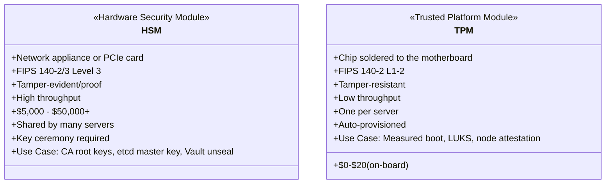
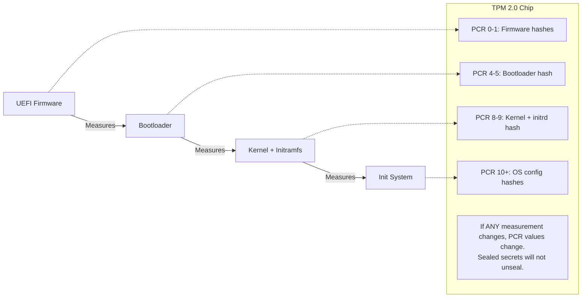
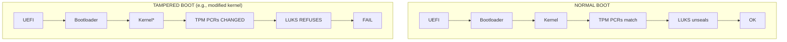
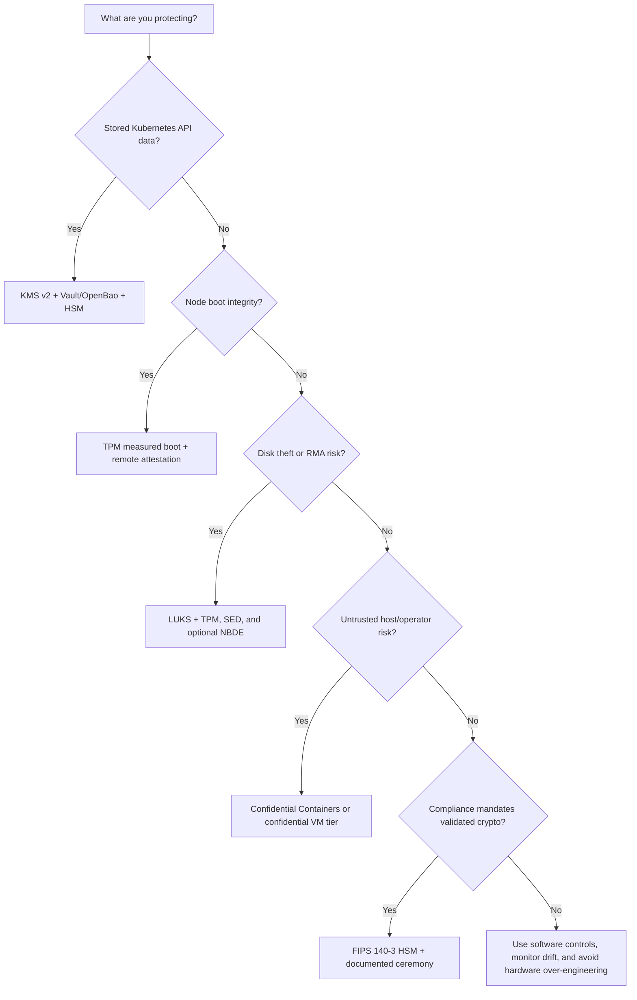

> **Complexity**: `[ADVANCED]` | Time: 60 minutes
>
> **Prerequisites**: [Physical Security & Air-Gapped Environments](../module-6.1-air-gapped/), [CKS](/k8s/cks/)

---

## What You'll Be Able to Do

After completing this module, you will be able to:

1. **Implement** HSM-backed encryption for etcd secrets using PKCS#11 integration
2. **Configure** TPM-based measured boot with LUKS auto-unlock, and **design** remote node attestation to verify bare-metal server integrity
3. **Design** a key management architecture where master encryption keys never exist outside hardware security boundaries
4. **Evaluate** HSM deployment models (network HSM, PCIe HSM, cloud HSM, and lab-only software HSMs) based on performance, compliance, and cost requirements

---

## Why This Module Matters

A common failure mode in self-managed Kubernetes is storing the etcd encryption key alongside the data it protects or in broadly accessible backup systems; if an attacker obtains both, etcd backups can expose every Secret in the cluster.

The root cause was not a Kubernetes vulnerability. It was a key management failure. The encryption key that protected everything was itself unprotected. On AWS, you would use KMS -- a [hardware-backed key service where the master key is generally kept within the HSM boundary](https://docs.aws.amazon.com/kms/latest/developerguide/data-protection.html). On-premises, you need the same capability, but you must build it yourself using Hardware Security Modules (HSMs) and Trusted Platform Modules (TPMs). These are not optional luxuries for regulated environments -- they are the foundation that makes all other encryption meaningful.

> **The Vault Door Analogy**
>
> Encrypting etcd without an HSM is like putting a combination lock on a bank vault but writing the combination on a Post-it note stuck to the door. The lock is real, the vault is real, but the security is theater. An HSM is a second vault -- one that holds the combination. The combination never leaves the vault; the vault performs the unlock operation internally. Even the vault manufacturer cannot extract the key once it is generated inside the HSM.

---

## What You'll Learn

- What HSMs and TPMs are and how they differ
- How TPM enables measured boot and secure boot for Kubernetes nodes
- Configuring HashiCorp Vault with an HSM backend via PKCS#11
- Replacing cloud KMS for Kubernetes encryption at rest
- Disk encryption with LUKS + TPM auto-unlock
- Key lifecycle management in on-premises environments

---

## HSM vs TPM: Understanding the Hardware



### HSM Form Factors

| Form Factor | Example | Throughput | Cost | Use Case |
|-------------|---------|------------|------|----------|
| Network appliance | Enterprise HSM appliances | High throughput | High cost | Enterprise PKI, payment processing |
| PCIe card | PCIe HSMs | Moderate to high throughput | Lower cost than network appliances | Single server, Vault backend |
| USB token | USB HSMs | Lower throughput | Much lower cost | Small deployments, dev/test |
| Cloud HSM | AWS CloudHSM, Azure Cloud HSM, Google Cloud HSM | Varies | Varies | Hybrid environments |

For hybrid deployments using cloud providers as a trust anchor, verify current validation limits: [AWS CloudHSM `hsm2m.medium` is FIPS 140-3 Level 3 certified (the legacy `hsm1.medium` was archived to historical status January 4, 2026)](https://docs.aws.amazon.com/cloudhsm/latest/userguide/fips-validation.html). Note that while AWS CloudHSM charges per HSM per hour, third-party sources conflict on the exact rate, so verify directly at aws.amazon.com/cloudhsm/pricing/. Azure's modern offering is Azure Cloud HSM, utilizing [Marvell LiquidSecurity HSMs validated to FIPS 140-3 Level 3](https://learn.microsoft.com/en-us/azure/cloud-hsm/service-limits), [which succeeds the legacy Azure Dedicated HSM](https://learn.microsoft.com/en-us/azure/dedicated-hsm/overview). [Google Cloud HSM is backed by FIPS 140-2 Level 3 validated hardware](https://docs.cloud.google.com/kms/docs/hsm).

## The Hardware Root-of-Trust Spine

Hardware security starts with a simple but uncomfortable question: what do you trust before Kubernetes exists? A cloud provider hides much of that answer behind managed boot images, managed identity, managed key services, and hardware-backed fleet controls. In an owned datacenter, the trust chain starts with your firmware settings, your rack access controls, your provisioning pipeline, your TPM endorsement material, your HSM key ceremony, and your process for deciding whether a physical server is allowed to join a cluster. If the first trusted component is only a file on the node disk, an attacker who can replace the disk contents can replace the thing that is supposed to decide whether the disk contents are trustworthy.

That is why a software-only root of trust is circular. A node-local agent can verify hashes only after the operating system has already booted. A Kubernetes admission policy can reject a node only after kubelet identity has already been presented. A secrets manager can require strong authentication only after its own unseal key has been loaded somewhere. Hardware roots of trust break that loop by anchoring at least one critical decision outside the mutable operating system: a TPM can measure boot state and hold sealed secrets, an HSM can keep master keys inside a validated cryptographic boundary, and confidential-computing hardware can produce attestation evidence that a workload is running in an expected isolated environment.

The first distinction to internalize is measured boot versus secure boot. Measured boot records what happened; secure boot tries to prevent untrusted code from running. A TPM does not automatically stop a modified bootloader or kernel from executing. It extends measurements into Platform Configuration Registers, and later software or a remote verifier decides whether those measurements match policy. UEFI Secure Boot, by contrast, checks signatures during the boot path and blocks unsigned or untrusted components when enforcement is enabled. On Linux servers that use shim, Machine Owner Key enrollment lets the platform owner add local signing keys for kernels, modules, or boot components without replacing the whole vendor key hierarchy; Ubuntu and Red Hat both document MOK-based key enrollment for Secure Boot operations.

The strongest on-premises design uses both controls because they answer different questions. Secure Boot reduces the chance that an unsigned bootkit runs before Linux. Measured boot gives you evidence about what actually ran, including firmware, bootloader, kernel, initramfs, and sometimes operating-system policy. If Secure Boot is disabled during a maintenance window and later re-enabled, measured boot can still show that the boot history changed. If Secure Boot allows a signed but unintended kernel, measured boot can still produce a different PCR state. This matters in a bare-metal Kubernetes fleet because rescue consoles, PXE environments, BMC virtual media, and out-of-band maintenance workflows create more pre-boot attack surface than most managed-cloud users ever see.

Sealing a secret to PCR state turns those measurements into an access decision. The TPM stores or protects key material so it is released only when selected PCRs match the expected values. That is useful for LUKS auto-unlock, node bootstrap credentials, or a short-lived token used to contact an attestation service. It is also operationally sharp. If you seal to PCRs that change on every firmware update, every planned BIOS rollout becomes an outage unless the re-enrollment process is designed first. If you seal only to a weak or overly broad PCR set, the node may unlock after changes that your security model meant to reject. The right PCR policy is therefore an operations contract, not just a cryptographic setting.

Hypothetical scenario: a platform team replaces a control-plane node motherboard after a hardware failure, reinstalls the same operating-system image, and expects the node to rejoin automatically. The kubelet certificate, disk, and machine config are all present, but the TPM endorsement identity and sealed LUKS state are different because the motherboard changed. A mature runbook treats that as expected behavior: quarantine the node identity, re-run attestation enrollment, re-seal local disk keys to the new TPM, and require a human approval path before the node can host sensitive workloads again. An immature runbook disables TPM enforcement to "get the cluster back," quietly removing the root of trust for every future boot.

### Choosing the Right Hardware Boundary

TPMs, HSMs, self-encrypting drives, and secure enclaves are often discussed as if they were interchangeable. They are not. A TPM is a per-node identity and measurement device. It is slow for bulk cryptography, but excellent at answering "is this the same machine in the same boot state?" An HSM is centralized high-assurance key custody. It is built to generate, store, wrap, unwrap, sign, and audit key operations while keeping key material inside a hardware boundary that may be validated under FIPS 140-3. A self-encrypting drive protects data at rest inside one storage device, but it does not prove that the node booted trusted software. A secure enclave or confidential VM protects selected data while it is in use, but it does not replace fleet key management or node admission.

| Boundary | Primary Job | Kubernetes Use | Main Limitation |
|----------|-------------|----------------|-----------------|
| TPM 2.0 | Per-node measurement, sealing, identity, and attestation | LUKS auto-unlock, measured boot evidence, node admission, SPIRE/Keylime attestation | Not designed for high-throughput shared key custody |
| HSM | Centralized key generation, wrapping, signing, audit, and compliance boundary | Vault/OpenBao auto-unseal, CA root keys, Kubernetes KMS provider KEK protection | Adds appliance cost, HA design, vendor library, and operational ceremony |
| SED | Drive-local at-rest encryption | Protects a removed disk or retired drive when lifecycle is controlled | Does not validate boot state and may be invisible to Kubernetes operators |
| Confidential compute | Data-in-use protection and remote attestation for workloads or VMs | Sensitive tenant workloads, regulated compute, untrusted-host threat models | Requires hardware support, runtime integration, attestation plumbing, and capacity planning |

PKCS#11 is the common interface you will see when HSM-backed software needs to talk to hardware tokens. It does not make a software token secure by itself. SoftHSM is useful because it implements the API shape for development and CI validation, but the security boundary is the host filesystem and process memory. A real HSM changes the trust model because key generation, private-key use, and wrapping operations occur inside hardware designed for physical tamper resistance, role separation, and auditable administration. That difference is why the same Vault or OpenBao configuration can be a harmless lab exercise with SoftHSM and a compliance control with a validated production HSM.

On-premises teams should also separate hardware security from "buying secure hardware." A rack full of TPM-capable servers does not create attested Kubernetes nodes unless firmware settings are locked, measured boot is enabled, event logs are collected, node identities are enrolled, and bootstrap flows reject unknown measurements. A network HSM does not protect etcd if the HSM PIN is stored in a broadly readable Kubernetes Secret, if every control-plane node can call every key operation, or if there is no backup and replacement procedure. Hardware gives you primitives; platform engineering turns those primitives into controls.

---

## TPM for Measured Boot

Measured boot uses the TPM to create a chain of trust from firmware to the running OS. Each stage measures (hashes) the next stage before executing it, storing the measurement in TPM Platform Configuration Registers (PCRs). [TPM 2.0 is standardized as ISO/IEC 11889:2015](https://www.iso.org/standard/66510.html), with the TCG PC Client Platform Profile mandating SHA-1 and SHA-256 PCR banks, each containing 24 registers (PCR 0–23).



> **Pause and predict**: If an attacker replaces the kernel on a Kubernetes node, which PCR values will change? How does the TPM detect this without any network connectivity or external verification service?

### Verifying TPM and Measured Boot on Kubernetes Nodes

These commands check whether TPM 2.0 hardware is present and read the Platform Configuration Registers that store the hash chain from boot. Modern Linux distributions commonly expose TPM device nodes such as `/dev/tpm0` and often `/dev/tpmrm0`; verify exact kernel and user-space package details against your distribution documentation and upstream release notes.

```bash
# Check if TPM 2.0 is available
ls -la /dev/tpm0 /dev/tpmrm0

# Read PCR values to verify measured boot is active
# Note: tpm2-tools latest stable release is version 5.7 (April 2024)
tpm2_pcrread sha256:0,1,4,7,8,9

# Expected output (values will differ per system):
#   sha256:
#     0 : 0x3DCB05B32D60C4...   (firmware)
#     1 : 0xA4B7C3E9F1D2...     (firmware config)
#     4 : 0x7B1C8E2F5A9D...     (bootloader)
#     7 : 0xE5F6A7B8C9D0...     (Secure Boot policy)
#     8 : 0x1A2B3C4D5E6F...     (kernel)
#     9 : 0x9F8E7D6C5B4A...     (initramfs)

# If PCR[0] is all zeros, measured boot is not active
# Common cause: TPM not enabled in BIOS

# Verify Secure Boot status
mokutil --sb-state
# Expected: SecureBoot enabled
```

Reading PCRs once is only a snapshot. For a production cluster, capture known-good measurements during a controlled enrollment process, store the expected values or event-log policy in an attestation system, and tie changes to a change-management record. Firmware updates, bootloader updates, kernel updates, initramfs regeneration, and Secure Boot key changes can all alter measured state. That is not a failure of the TPM; it is the point of measured boot. The operational question is whether the change was expected, approved, and rolled through a process that re-seals keys or updates attestation policy before nodes are returned to service.

PCR selection is a tradeoff between sensitivity and maintainability. Sealing to firmware, bootloader, Secure Boot policy, and kernel measurements gives strong tamper detection, but it can also require re-enrollment after normal updates. Sealing to fewer PCRs reduces maintenance friction, but it may let a node unlock after a meaningful boot-path change. Many teams begin by enforcing a stricter policy on control-plane nodes, HSM-adjacent Vault/OpenBao nodes, and storage nodes that hold raw Ceph or local PV data, while collecting but not yet enforcing measurements for lower-risk worker pools. That phased approach lets operators learn their hardware's real PCR behavior before a security control becomes an availability incident.

The TPM event log is as important as the register value. A PCR hash tells you that something changed, but the event log explains which component extended the measurement. If a node fails to unlock after a planned kernel update, the event log helps distinguish expected kernel drift from an unexpected firmware variable, a different bootloader path, or a Secure Boot policy change. In an on-premises cluster, ship these logs to the same evidence system that receives BMC logs, firmware inventory, and node provisioning events. Otherwise, the first response to a boot failure will be guesswork at a crash cart or remote console.

### Enabling TPM in a Talos Linux Cluster

Talos Linux (used for immutable Kubernetes nodes) has built-in TPM support:

```yaml
# talos-machine-config.yaml
machine:
  install:
    disk: /dev/sda
    bootloader: true
    wipe: false
  systemDiskEncryption:
    ephemeral:
      provider: luks2
      keys:
        - tpm: {}          # Seal LUKS key to TPM PCRs
          slot: 0
    state:
      provider: luks2
      keys:
        - tpm: {}
          slot: 0
```

---

## HashiCorp Vault with HSM Backend (PKCS#11)

Vault remains a common secrets manager for Kubernetes, but on-premises teams need to treat product and license choices as part of the architecture. [HashiCorp announced a move to the Business Source License in August 2023](https://discuss.hashicorp.com/t/hashicorp-projects-changing-license-to-business-source-license-v1-1/57106), so organizations that require a community-governed open-source Vault lineage should evaluate [OpenBao, the Linux Foundation OpenSSF-managed fork](https://openbao.org/) alongside commercial Vault. In cloud environments, Vault commonly uses cloud KMS for auto-unseal. On-premises, you replace that managed KMS dependency with an HSM via the PKCS#11 interface. [PKCS#11 Specification v3.1 is the current OASIS Standard, with v3.2 published as a Committee Specification in November 2025](https://docs.oasis-open.org/pkcs11/pkcs11-spec/v3.1/os/pkcs11-spec-v3.1-os.html). Note that [HashiCorp Vault PKCS#11 HSM auto-unseal requires Vault Enterprise](https://developer.hashicorp.com/vault/docs/configuration/seal/pkcs11), while [OpenBao documents PKCS#11 seal support for HSM-backed auto-unseal](https://openbao.org/docs/configuration/seal/pkcs11/).

This choice is not only about price. Vault Enterprise, OpenBao, and any external operator you use to project secrets into Kubernetes create different support, licensing, upgrade, and compliance paths. [Vault Secrets Operator is HashiCorp's supported Kubernetes operator for Vault-backed Kubernetes Secrets](https://developer.hashicorp.com/vault/docs/deploy/kubernetes/vso). [External Secrets Operator is a CNCF Sandbox project](https://www.cncf.io/projects/external-secrets/) that integrates with multiple backends, including Vault, and can reduce provider lock-in when a platform team has more than one secrets system. Neither operator removes the need for hardware key custody. They synchronize or project secret values; the HSM still protects the root keys and unseal path that make the secrets manager trustworthy.

### Architecture

```mermaid
flowchart LR
    subgraph Kubernetes Cluster
        V[Vault Pod<br/>PKCS#11 lib client]
        E[etcd<br/>Vault storage]
        V --> E
    end
    
    subgraph HSM Appliance
        M[Master Key<br/>Never leaves the HSM]
        API[PKCS#11 API]
        API --- M
    end
    
    V <-->|mTLS| API
    
    note[Auto-unseal: HSM unwraps the Vault master key at startup.<br/>No Shamir shares needed.]
    HSM Appliance -.-> note
```

> **Stop and think**: Without HSM auto-unseal, Vault requires multiple keyholders to perform a "key ceremony" every time Vault restarts. In a Kubernetes environment where pods can be rescheduled at any time, why is this operationally untenable?

### Configure Vault with HSM Auto-Unseal

The following Vault configuration uses PKCS#11 to communicate with an HSM for automatic unsealing. The `seal "pkcs11"` stanza replaces cloud KMS -- the master key is protected by the HSM instead of being stored in plaintext outside the hardware boundary.

```hcl
# vault-config.hcl
storage "raft" {
  path = "/vault/data"
  node_id = "vault-0"
}

listener "tcp" {
  address     = "0.0.0.0:8200"
  tls_cert_file = "/vault/tls/tls.crt"
  tls_key_file  = "/vault/tls/tls.key"
}

# HSM seal configuration (replaces cloud KMS)
seal "pkcs11" {
  lib            = "/usr/lib/softhsm/libsofthsm2.so"  # Path to PKCS#11 library
  slot           = "0"                                   # HSM slot number
  pin            = "env://VAULT_HSM_PIN"                # PIN from environment
  key_label      = "vault-master-key"                   # Label of the key in HSM
  hmac_key_label = "vault-hmac-key"                     # Label for HMAC key
  mechanism      = "0x0001"                             # CKM_RSA_PKCS
  generate_key   = "true"                               # Generate key if not exists
}

api_addr = "https://vault.vault.svc:8200"
cluster_addr = "https://vault-0.vault-internal.vault.svc:8201"
```

### Deploy Vault with HSM on Kubernetes

Deploy Vault as a 3-replica StatefulSet using the Vault Helm chart. Key configuration points:

- Use `hashicorp/vault-enterprise` image (PKCS#11 seal requires Enterprise)
- Mount the HSM client library from the host (`/usr/lib/softhsm` or vendor path) as a read-only volume
- Inject the HSM PIN from a Kubernetes Secret via environment variable
- Mount TLS certificates for the Vault API endpoint
- Use Raft storage with a PVC per replica (10Gi recommended)

### Using YubiHSM 2 for Smaller Deployments

For smaller deployments, a USB HSM such as YubiHSM 2 can provide hardware-backed key storage at far lower cost than a network appliance, but you should verify current certifications and pricing directly with the vendor. Install the YubiHSM connector on the Vault node, generate an RSA key via `yubihsm-shell`, and configure Vault's seal stanza to use the YubiHSM PKCS#11 library (`yubihsm_pkcs11.so`). The configuration is identical to the network HSM case -- only the `lib` path changes.

---

## Replacing Cloud KMS for Kubernetes Encryption at Rest

In cloud environments, you configure Kubernetes to use cloud KMS for encrypting Secrets in etcd. On-premises, you use Vault with HSM as the KMS provider.

### Kubernetes KMS v2 Provider with Vault

```yaml
# kms-vault-plugin-config.yaml
# This runs on every control plane node
apiVersion: apiserver.config.k8s.io/v1
kind: EncryptionConfiguration
resources:
  - resources:
      - secrets
      - configmaps
    providers:
      - kms:
          apiVersion: v2
          name: vault-kms
          endpoint: unix:///var/run/kms-vault/kms.sock
          timeout: 10s
      - identity: {}    # Fallback: unencrypted (for migration)
```

```bash
# Install the KMS plugin on control plane nodes
# The plugin translates Kubernetes KMS gRPC calls to Vault API calls

# Start the KMS plugin
kms-vault-provider \
  --listen unix:///var/run/kms-vault/kms.sock \
  --vault-addr https://vault.vault.svc:8200 \
  --vault-token-path /var/run/secrets/vault/token \
  --transit-key kubernetes-secrets \
  --transit-mount transit/

# Configure kube-apiserver to use the plugin
# Add to kube-apiserver flags:
#   --encryption-provider-config=/etc/kubernetes/encryption-config.yaml
```

Kubernetes envelope encryption is easier to reason about if you separate the data encryption key from the key encryption key. The API server encrypts each Secret payload with a data encryption key, then asks the KMS provider to wrap or transform that DEK using a key controlled by the external service. The resulting encrypted DEK and encrypted payload are persisted in etcd. In this model, etcd never needs plaintext key material, and an attacker who steals an etcd snapshot still needs access to the external KMS path to decrypt useful data. [Kubernetes KMS v2 became stable in Kubernetes 1.29](https://kubernetes.io/blog/2023/12/13/kubernetes-v1-29-release/) and is the version to design around for new on-premises clusters because the Kubernetes project documents KMS v1 as deprecated and recommends KMS v2 where feasible.

The on-premises version of cloud KMS is not "put Vault somewhere and call it done." The API server talks to a local KMS plugin endpoint, the plugin talks to Vault or OpenBao, the secrets manager uses a transit key or equivalent wrapping key, and the secrets manager's own master key is protected by the HSM. Each boundary needs its own availability and access-control design. If the plugin socket disappears, Secret writes fail. If Vault is sealed, key unwraps fail. If the HSM is unreachable and Vault restarts, Vault cannot unseal. If the HSM is reachable from every workload subnet, a compromised workload has a shorter path to abuse the key service. Hardware key custody improves the blast radius only when the network, RBAC, authentication, audit, and failure modes are designed with the same care.

Key rotation is also layered. Rotating the HSM wrapping key, rotating the Vault or OpenBao transit key, rotating the Kubernetes encryption configuration, and rewriting existing Secrets are related but distinct operations. A safe runbook identifies which layer is changing, whether old ciphertext remains decryptable, how rollback works, and how you prove that old data has been re-encrypted. For Kubernetes Secrets, operators usually stage a new provider configuration, restart or roll the API servers according to the cluster's control-plane model, then rewrite Secret objects so newly encrypted data uses the desired provider and key version. The exact mechanics depend on the distribution, but the principle is constant: key rotation is not complete until stored data and backup data are covered.

Backups need the same discipline as the live cluster. An etcd snapshot without the KMS backend is not a complete recovery artifact. An HSM backup without quorum controls can become a second copy of the root of trust with weaker physical protection than the appliance in the rack. A Vault or OpenBao raft snapshot without the matching HSM material may be unrecoverable after a site loss. For regulated on-premises environments, recovery design should include HSM backup tokens, quorum or dual-control requirements, documented replacement hardware procedures, and periodic restore drills in an isolated environment. A key that is perfectly protected but unrecoverable after a failed appliance is an availability risk, not a security success.

---

## Disk Encryption with LUKS + TPM

Every Kubernetes node should have encrypted disks. LUKS (Linux Unified Key Setup) provides disk encryption, and TPM can automatically unseal the disk at boot -- but only if the boot chain is unmodified.

> **Pause and predict**: LUKS encryption with TPM auto-unlock means the disk decrypts automatically at boot. If someone steals the entire server (disk + TPM together), does the encryption still protect the data? Why or why not?

### Setting Up LUKS with TPM Auto-Unlock

The `systemd-cryptenroll` command seals the LUKS decryption key to specific TPM PCR values. The key is only released when the boot chain matches the expected measurements -- a modified kernel or bootloader will cause the unlock to fail.

```bash
# Create a temporary keyfile for non-interactive execution
echo "TempSecurePass123" > /tmp/luks-key

# Encrypt a data partition with LUKS2
cryptsetup luksFormat --batch-mode --type luks2 /dev/sdb /tmp/luks-key

# Add a TPM-sealed key (systemd-cryptenroll)
systemd-cryptenroll /dev/sdb \
  --unlock-key-file=/tmp/luks-key \
  --tpm2-device=auto \
  --tpm2-pcrs=0+1+4+7+8    # Seal to firmware + bootloader + Secure Boot + kernel

# Clean up
rm -f /tmp/luks-key

# Configure auto-unlock at boot via /etc/crypttab
echo "k8s-data /dev/sdb - tpm2-device=auto" >> /etc/crypttab

# Test: reboot and verify automatic unlock
systemctl daemon-reload
systemctl restart systemd-cryptsetup@k8s-data

# Verify the volume is unlocked
lsblk -f
# Expected: k8s-data (crypt) mounted and active
```

### What Happens on Tamper



*A modified kernel produces a different PCR value than the one the key was sealed to, so the TPM does not release the key, the disk stays encrypted, and the node fails to boot until an operator intervenes.*

TPM-only auto-unlock is convenient, but it is not the only pattern for unattended disk decryption. Network-Bound Disk Encryption uses Clevis on the client and Tang on the network to release enough material for LUKS unlock only when the node can reach an approved Tang service. Red Hat documents NBDE as a way to automate LUKS unlock using Clevis and Tang, including OpenShift/RHCOS scenarios where root or non-root volumes must unlock during boot. The on-premises security value is environmental: a stolen disk cannot unlock without the TPM, and a stolen whole server may fail to unlock if it cannot reach the datacenter-bound Tang service on the right network. That does not make NBDE a magic anti-theft control, but it adds a location and network dependency that pure TPM sealing lacks.

For Kubernetes nodes, NBDE needs the same HA thinking as DNS, NTP, and control-plane VIPs. If the Tang service is single-homed in one rack, a top-of-rack switch failure can turn a routine node reboot into a storage outage. If every node depends on a Tang endpoint that is reachable from general workload networks, the service becomes easier to probe and abuse. A practical design uses multiple Tang endpoints, restricts access to provisioning and node networks, monitors unlock failures, and keeps a documented break-glass method for planned maintenance. The recovery method should not be "paste the disk passphrase into an IPMI console from someone's password manager," because that simply moves key custody back into human handling.

Self-encrypting drives can still be useful, especially for lifecycle controls such as disk retirement, warranty replacement, and rapid wipe. They are not a substitute for measured boot or Kubernetes secrets encryption. If an SED unlocks whenever the controller powers on, Kubernetes has learned nothing about whether the host firmware, bootloader, kernel, or kubelet identity is trustworthy. Treat SEDs as one layer in the data-at-rest stack, not as the hardware root of trust for the node. In high-security environments, align drive encryption policy with asset disposal, spare-disk handling, and RMA procedures, because the weak point is often the drive that leaves the cage after a failure.

### Remote Node Attestation

While LUKS auto-unlock protects data at rest, it does not prevent a booted (but later compromised) node from joining the Kubernetes cluster. To verify bare-metal server integrity before or during cluster admission, you must implement remote node attestation using the TPM:

- **Keylime**: [A CNCF project providing scalable remote boot attestation and runtime integrity measurement using TPM hardware. (Note: Keylime entered CNCF as a Sandbox project in September 2020; its current 2026 maturity level should be verified directly on the CNCF project page)](https://www.cncf.io/projects/keylime/).
- **SPIRE (SPIFFE)**: [Includes a built-in `tpm_devid` node attestor for TPM 2.0 + DevID certificate-based node attestation](https://github.com/spiffe/spire/blob/main/doc/spire_agent.md). [The community `bloomberg/spire-tpm-plugin` also provides agent and server plugins enabling TPM 2.0 node attestation via TPM credential activation](https://github.com/bloomberg/spire-tpm-plugin).
- **Cloud integration**: For hybrid clusters using managed control planes like AKS, [Trusted Launch integrates a vTPM (TPM 2.0 compliant) for remote attestation of AKS node VMs](https://learn.microsoft.com/en-us/azure/aks/use-trusted-launch), ensuring secure boot across environments.

At fleet scale, attestation is a workflow, not a single yes/no check. During bootstrap, a new bare-metal server should prove possession of expected TPM identity material, report measured-boot evidence, and receive only the minimum credentials required to continue enrollment. After bootstrap, the attestation service should keep watching for drift. [Keylime describes itself as TPM-based remote boot attestation and runtime integrity measurement](https://keylime.dev/blog/2024/02/07/remote-attestation-blog-part1.html), and its CNCF project page currently lists it at Sandbox maturity. That maturity detail matters: Keylime can be a serious building block, but a platform team must still own packaging, upgrades, policy authoring, integration testing, and support boundaries.

The most useful admission pattern is to treat attestation as an input to node identity, not as a dashboard someone checks after the fact. A provisioning system can enroll a server, Keylime or another verifier can validate PCR/event-log policy, SPIRE can issue a node identity only after the attestation policy passes, and kubelet bootstrap can be constrained so only attested identities receive credentials. That creates an on-premises analogue of a managed "trusted launch" control, but it is assembled from your hardware inventory, TPM enrollment, certificate authority, bootstrap tokens, and admission logic. If any of those pieces are manual, the design should say so honestly.

Continuous attestation must also define what happens on failure. Revoking a node identity immediately may be correct for a control-plane node that reports an unexpected boot path, but it may be too disruptive for a worker that just received a planned firmware update and has not yet had policy refreshed. A mature design has severity levels: quarantine new scheduling, drain sensitive workloads, alert hardware operations, preserve forensic evidence, and only then decide whether to revoke identities or re-enroll the node. The outcome should be deterministic enough for a 3 AM operator to follow without inventing policy under pressure.

SPIFFE and SPIRE help because they give workloads and nodes a portable identity model. [SPIFFE and SPIRE are CNCF Graduated projects](https://www.cncf.io/projects/spire/), and SPIRE's attestor model lets identity issuance depend on evidence from the environment. In this module, the important mental model is that a workload identity such as an SVID should not mean "some pod asked nicely." In a hardware-rooted design, it should mean the workload is running on a node whose hardware identity, boot state, and admission path met the policy for that trust domain. That is the difference between zero trust as a slogan and zero trust as an evidence pipeline.

---

## Confidential Computing for Kubernetes Workloads

TPM and HSM controls protect boot integrity and key custody, but they do not automatically protect data while a workload is using it. Confidential computing targets that data-in-use gap. AMD SEV-SNP, Intel TDX, and Intel SGX all belong in the broader confidential-computing family, but they protect different boundaries. [AMD's SEV-SNP overview describes VM isolation with integrity protection](https://docs.amd.com/v/u/en-US/SEV-SNP-strengthening-vm-isolation-with-integrity-protection-and-more). [Intel TDX creates hardware-isolated trust domains for virtual machines](https://www.intel.com/content/www/us/en/developer/tools/trust-domain-extensions/overview.html), while [Intel SGX protects data in enclaves](https://www.intel.com/content/www/us/en/products/docs/accelerator-engines/software-guard-extensions.html). The common pattern is isolation plus remote attestation: a verifier checks hardware evidence before releasing secrets or accepting results.

For Kubernetes, the practical abstraction is usually a confidential VM or confidential pod runtime rather than application code directly calling CPU instructions. [Confidential Containers is a CNCF Sandbox project](https://www.cncf.io/projects/confidential-containers/) that aims to bring confidential-computing protections to cloud-native workloads by using Trusted Execution Environments. Its architecture is closely tied to Kata Containers, which runs pods inside lightweight virtual machines; the Confidential Containers design explains why Kata's VM boundary is a natural base but not sufficient by itself. The additional pieces include attestation, trusted image and policy measurement, guest components, and a key broker that releases secrets only after evidence matches policy.

The threat model is narrower and stronger than ordinary container isolation. Confidential containers are meant for cases where the workload does not fully trust the host kernel, hypervisor, or infrastructure operator. That can be relevant on-premises when a central platform team runs shared hardware for multiple regulated business units, when administrators with hardware access should not be able to inspect tenant memory, or when sensitive AI or payment workloads need proof that secrets are released only into an expected runtime. It is not a replacement for RBAC, network policy, node patching, or HSM-backed key custody. It is an additional boundary for specific workloads whose data-in-use risk justifies the cost.

That cost is real. Confidential-computing pools reduce scheduling flexibility because only compatible CPUs, firmware, kernels, hypervisors, runtime classes, and attestation components can host the workload. They can introduce performance overhead, larger images, extra guest-VM startup time, and more complicated debugging because the host intentionally sees less. They also create supply-chain responsibilities: the guest image, init data, runtime policy, attestation service, and key broker all need versioning and rollback plans. For many ordinary stateless services, the tax is not justified. For a smaller set of high-value workloads, the ability to prove "this secret was released only into this measured environment" can be the core requirement.

On-premises capacity planning should treat confidential compute as a dedicated tier. Do not assume every worker node can become a confidential-computing node after a YAML change. Verify CPU generation, BIOS and firmware settings, kernel support, runtime support, and vendor security advisories before procurement. Keep a non-production cluster or node pool that mirrors the confidential-compute stack, because failures often happen at the intersection of firmware, hypervisor, container runtime, and attestation service. The deeper lesson is the same as TPM and HSM work: hardware capability is only a primitive until the platform team turns it into an observable, tested, and supportable service.

---

## Turning Hardware Evidence into Kubernetes Policy

Hardware evidence becomes useful only when Kubernetes decisions consume it. A TPM quote, a Keylime attestation result, or a confidential-compute attestation token should eventually influence whether a node receives credentials, whether a workload is scheduled there, whether a secret is released, or whether an object is admitted to the API. This is where policy engines enter the hardware security spine. [ValidatingAdmissionPolicy reached GA in Kubernetes 1.30](https://kubernetes.io/blog/2024/04/24/validating-admission-policy-ga/) and gives cluster administrators a CEL-based in-process validation option for many guardrails. For richer policy libraries and audit workflows, [OPA is a CNCF Graduated general-purpose policy engine](https://www.cncf.io/projects/open-policy-agent-opa/), Gatekeeper brings OPA-style admission policy into Kubernetes, and [Kyverno graduated in CNCF in March 2026](https://www.cncf.io/projects/kyverno/) as a Kubernetes-native policy engine.

Admission policy should not be asked to perform hardware attestation directly. The API server path must stay fast, reliable, and understandable. A better pattern is to put attestation results into trusted labels, taints, Node conditions, SPIFFE identities, or a small custom resource controlled by the attestation system, then let admission and scheduling policy consume those signals. For example, a confidential workload can require a runtime class, a node selector for an attested confidential-compute pool, and a policy that rejects the Pod if the namespace lacks approval for that class. The evidence pipeline remains outside admission, while admission enforces that users cannot bypass the evidence requirement with a convenient YAML edit.

Kubernetes 1.35 also has MutatingAdmissionPolicy as a beta feature in the v1.35 documentation, with CEL-based mutation behind the `MutatingAdmissionPolicy` feature gate and `v1beta1` runtime configuration. That status matters for security-critical designs. Validation policies are a better default for hard security invariants because they fail closed by rejecting unsafe objects. Mutation can be helpful for defaults, labels, or sidecars, but a beta mutating control should not be the only thing standing between a sensitive workload and an unattested node. If you use mutation to improve ergonomics, pair it with validation that proves the final object still satisfies the hardware security policy.

This policy layer should also reflect NIST-style zero trust thinking. [NIST SP 800-207 frames zero trust around continuous evaluation of users, assets, and resources](https://csrc.nist.gov/pubs/sp/800/207/final), not around trusting a network segment because it is "inside." For an on-premises Kubernetes cluster, the asset is not just a Pod or a user account. The server, TPM, firmware state, HSM path, workload identity, and secret-release decision are all assets or evidence points. A hardware-rooted platform is strongest when those evidence points are checked repeatedly and close to the action being protected.

---

## Cost Lens: When Hardware Security Pays for Itself

Hardware security has a visible CapEx profile, so it is often challenged harder than cloud security spend. A network HSM pair, support contract, smart-card or quorum accessories, rack ports, redundant power, and vendor integration time can look expensive next to a monthly cloud KMS line item. TPMs may be effectively bundled into modern servers, but the labor to enable firmware settings, manage measured boot, collect event logs, and respond to attestation drift is not free. Confidential-compute capacity can require newer CPU generations, firmware validation, dedicated node pools, and lower scheduling density. The honest TCO includes hardware, rack space, power and cooling, network gear, support contracts, implementation labor, operational headcount, training, audit evidence, and refresh-cycle planning.

The CapEx-versus-OpEx comparison changes when utilization is steady and requirements are durable. On-premises hardware security can beat cloud economics when clusters run at high utilization for years, data gravity keeps large datasets in the datacenter, egress-heavy workflows would pay cloud transfer costs repeatedly, or regulatory requirements demand key-material sovereignty under your physical and legal control. In those cases, the HSM and attestation platform are part of the cost of owning the control plane. The depreciation schedule can align with the server refresh cycle, and the platform team can standardize one hardware security spine across many clusters rather than paying per-service premiums in multiple cloud accounts.

It does not pay for itself at every scale. If the Kubernetes estate is small, workloads are spiky, the compliance requirement is advisory rather than mandatory, or the team lacks 24/7 operational coverage, a production HSM and confidential-compute platform may be over-engineering. A lab SoftHSM, TPM measurement collection, and clear key-handling policy may be enough while the organization proves the need. Likewise, if a workload runs only a few hours per month or must burst unpredictably, cloud KMS and managed confidential-compute instances may be cheaper and safer operationally, even if the long-term steady-state unit cost is higher. The on-premises answer wins when ownership of the trust boundary is required and the organization can operate that boundary competently.

Depreciation and refresh cycles deserve explicit design attention. HSMs, servers, TPM firmware, and confidential-compute CPU generations do not age at the same rate. A five-year server refresh may collide with a three-year support renewal or a new FIPS validation requirement. A procurement decision that saves money by buying older CPUs can block confidential-compute adoption for the life of the cluster. A proprietary HSM library tied to a narrow operating-system matrix can slow Kubernetes control-plane upgrades. Before buying hardware, ask how keys move to replacement devices, how attestations remain valid through firmware updates, how many years of security updates the vendor commits to, and whether the integration can be tested without touching production keys.

There is also an opportunity cost to doing nothing. Without HSM-backed key custody, a stolen backup plus a leaked encryption configuration can become a full cluster secret compromise. Without TPM or attestation, a reinstalled bare-metal node may look identical to automation even when its boot path changed. Without confidential-compute pools, a regulated workload may be forced into a separate physical cluster or a different platform entirely. Hardware security is expensive when treated as a decorative compliance purchase. It becomes economical when it prevents duplicate clusters, narrows audit scope, reduces manual key ceremonies, and allows sensitive workloads to share a common platform without sharing trust blindly.

---

## Patterns & Anti-Patterns

### Proven Pattern: Hardware-Backed Key Custody for Shared Secrets Infrastructure

Use an HSM-backed Vault or OpenBao deployment when one secrets platform protects many clusters, tenants, or regulated applications. The pattern scales because the HSM holds the most sensitive wrapping material while the secrets manager handles authentication, policy, audit, and secret lifecycle. It is strongest when the HSM is deployed in an HA pair or supported cluster, the PKCS#11 library path is standardized across nodes, HSM access is isolated on a management network, and unseal behavior is tested during controlled restarts. The reason to choose this pattern is not that every Secret becomes magically safe; it is that root key extraction becomes much harder than copying a file from a control-plane node.

### Proven Pattern: Attested Node Pools Before Sensitive Scheduling

Create explicit node pools for hardware-trusted workloads, then require attestation before a node can receive the labels, taints, SPIFFE identity, or bootstrap credentials associated with that pool. This pattern scales better than trying to make every node equally trusted on day one. Control-plane nodes, storage nodes, HSM-adjacent secrets nodes, and confidential-compute nodes can enforce stricter PCR and firmware policies first. General worker pools can begin in observe-only mode while the team learns how normal firmware, kernel, and bootloader updates affect measurements. Over time, the trusted pool grows as runbooks, alerting, and re-enrollment processes mature.

### Proven Pattern: Envelope Encryption with Tested Restore Drills

Use Kubernetes KMS v2 with a local plugin and an HSM-backed secrets manager for clusters where etcd backups contain sensitive data. The pattern works because the encrypted data and the key hierarchy are separated, but it only scales safely when recovery is rehearsed. A quarterly restore drill should prove that an etcd snapshot, Vault or OpenBao data, HSM backup material, plugin configuration, certificates, and API server flags can be assembled in an isolated environment. The drill should include rotation and rollback, because many organizations discover too late that their encrypted backup is intact but the key path needed to read it was never included in disaster recovery.

### Proven Pattern: Confidential Compute as a Specialized Runtime Tier

Offer confidential containers or confidential VMs as a named platform tier for workloads that truly need data-in-use protection from host operators or a compromised hypervisor. This pattern scales when the platform team owns the runtime class, node image, attestation service, key broker, performance profile, and admission policy as one product. It fails when every application team is expected to assemble its own confidential-compute stack. The right abstraction for application teams is a small set of documented workload classes with known constraints, not a hardware whitepaper and a request to figure out attestation alone.

### Anti-Pattern: SoftHSM in Production Because the Tests Pass

Teams fall into this trap because SoftHSM is easy to install, supports the PKCS#11 interface, and makes integration tests green. The failure is confusing API compatibility with a hardware security boundary. SoftHSM stores key material in software and depends on the host's filesystem, process isolation, and operating-system hardening. That is useful for development and CI, but it does not satisfy the reason you bought or specified an HSM in the first place. The better alternative is to use SoftHSM only for local tests, then validate production behavior against the actual vendor library, HA topology, access-control model, audit logs, and backup procedure.

### Anti-Pattern: TPM Auto-Unlock Without Attestation or Location Control

TPM-sealed LUKS can make unattended reboots safe against a stolen-disk attack, but teams sometimes treat it as complete physical security. If an attacker steals the whole server and the boot path still matches, the TPM may release the disk key exactly as designed. If a malicious insider boots the approved kernel and then abuses credentials after startup, LUKS has already done its job and cannot help. The better alternative is layered: TPM sealing for disk-at-rest protection, NBDE or a boot PIN for location or human-control requirements, remote attestation for cluster admission, and workload identity policy that can quarantine nodes after evidence changes.

### Anti-Pattern: One HSM, One Datacenter, No Replacement Drill

The single-HSM deployment is attractive because it gets the compliance diagram approved with the smallest purchase order. It is also a direct availability dependency for Vault/OpenBao auto-unseal, CA signing, or KMS unwrap operations. When the device fails, a firmware update breaks the client library, or a site outage isolates it, the cluster may keep running only until the next restart, reschedule, or secret rotation. The better alternative is an HA design with documented failover, wrapped backup material, quorum controls, spare capacity, vendor support contacts, and a restore drill that proves a replacement device can actually recover keys.

### Anti-Pattern: Policy Labels That Users Can Set Themselves

Hardware evidence often reaches Kubernetes through labels or annotations, and that can be dangerous if the wrong actor controls them. A user who can label a node `hardware-trusted=true` or set a workload annotation that bypasses a confidential runtime has converted an attestation architecture into a convention. Teams fall into this when they want simple scheduling selectors before the identity and policy model is ready. The better alternative is to reserve trusted labels for a controller backed by the attestation system, use NodeRestriction-style controls where applicable, enforce workload requirements with admission policy, and audit every path that can modify the evidence signal.

---

## Decision Framework

Hardware security decisions should start with the asset and threat model, not with the product catalog. If the asset is an etcd backup, you need envelope encryption and external key custody. If the asset is a physical node's boot integrity, you need TPM measurements and attestation. If the asset is a disk leaving the datacenter, you need LUKS, SED lifecycle controls, or both. If the asset is memory contents during computation, you need confidential computing. Most real clusters need more than one answer, but choosing the primary control first keeps the architecture understandable.

| Decision Point | Choose This | When It Fits | Tradeoff |
|----------------|-------------|--------------|----------|
| Protect Kubernetes Secrets in etcd | KMS v2 + Vault/OpenBao + HSM | Secrets are sensitive, backups leave the cluster, or compliance requires hardware key custody | Adds KMS plugin, secrets-manager HA, HSM support, and restore complexity |
| Protect node disks at rest | LUKS + TPM, optionally NBDE | Bare-metal nodes can be stolen, retired, or serviced outside the cage | TPM-only unlock does not stop whole-server theft; NBDE adds network dependency |
| Prove node boot integrity | TPM measured boot + Keylime/SPIRE-style attestation | Sensitive workloads should run only on known firmware and boot state | Requires enrollment, event-log policy, drift handling, and bootstrap integration |
| Protect data while running | Confidential Containers/Kata with SEV-SNP, TDX, SGX, or supported TEE | Operators, host kernels, or hypervisors are in the threat model | Higher operational complexity, narrower hardware pool, possible performance tax |
| Meet federal or regulated cryptographic requirements | FIPS 140-3 validated HSM and documented key ceremonies | Procurement or audit explicitly requires validated modules and dual control | Higher CapEx, vendor dependency, renewal and evidence workload |
| Build a lab or CI integration | SoftHSM and disposable test keys | You need API compatibility without production key custody | No physical boundary; must not be represented as production-equivalent |



Apply this framework in procurement as well as design review. A security architect may ask for "HSM-backed Kubernetes" when the real requirement is hardware custody for root keys, recoverable audit evidence, and proof that backups cannot be decrypted by storage administrators. A platform engineer may ask for "confidential containers" when the real requirement is tenant isolation from infrastructure operators for one regulated workload class. A finance reviewer may ask why a network HSM pair costs more than a cloud KMS bill without seeing that the on-premises design avoids egress, keeps data under local jurisdiction, and supports multiple clusters for the same depreciation cycle. Good decisions translate between those languages.

The final test is failure behavior. If the HSM is offline, do running workloads continue, do new Pods fail, or does the API server stop writing Secrets? If attestation fails, is the node drained, quarantined, or only alerted? If a Tang endpoint is unavailable, do nodes fail safely or fail unpredictably? If a confidential-compute node pool is full, are sensitive workloads queued or silently scheduled onto ordinary nodes? A decision framework is complete only when every branch has an operating model for normal updates, partial failures, site loss, and emergency recovery.

---

## Did You Know?

- **FIPS 140-3 is the active standard to plan around**: [NIST CMVP states that FIPS 140-3 became effective September 22, 2019](https://csrc.nist.gov/projects/cryptographic-module-validation-program/fips-140-3-standards), while procurement teams should verify the current active, historical, or revoked state of a specific module before citing it in an audit package.
- **TPM 2.0 has a stable standards anchor**: [ISO identifies ISO/IEC 11889-1:2015 as the TPM 2.0 architecture standard](https://www.iso.org/standard/66510.html), while server-specific behavior still needs to be checked against the vendor firmware, TPM profile, and distribution documentation for the hardware you actually buy.
- **KMS v2 is the Kubernetes encryption-at-rest target for new designs**: [Kubernetes announced KMS v2 stable in v1.29](https://kubernetes.io/blog/2023/12/13/kubernetes-v1-29-release/), and current upstream documentation recommends KMS v2 where feasible because KMS v1 is deprecated.
- **TPM 2.0 became a mainstream hardware baseline partly through client requirements**: [Microsoft lists TPM 2.0 as a Windows 11 minimum hardware requirement](https://learn.microsoft.com/en-us/windows/whats-new/windows-11-requirements), which helped normalize TPM presence in commodity hardware, but servers still need firmware settings and attestation enrollment verified explicitly.

---

## Common Mistakes

| Mistake | Problem | Solution |
|---------|---------|----------|
| Storing HSM PIN in a ConfigMap | PIN exposed to anyone with RBAC read | Use a Kubernetes Secret with strict RBAC, or inject via init container |
| Single HSM with no HA | HSM failure = Vault cannot unseal = cluster-wide secret outage | Deploy HSM in HA pair (active/standby) or use multiple USB HSMs |
| Sealing LUKS to PCR[7] only | Only measures Secure Boot policy, not actual kernel | Seal to PCRs 0+1+4+7+8 (firmware, config, bootloader, SB, kernel) |
| Not rotating HSM keys | Compromised key has unlimited lifetime | Define key rotation policy (annually or per compliance requirement) |
| Running Vault without HSM seal | Vault unseal keys are Shamir shares stored by humans | Use HSM auto-unseal; eliminate human key management |
| Ignoring TPM event log | Cannot detect what changed when PCR mismatch occurs | Ship TPM event logs to SIEM; review on boot failures |
| HSM on same network as workloads | Compromised pod could attempt HSM operations | Isolate HSM on dedicated management VLAN |
| No HSM backup strategy | HSM hardware failure = permanent key loss | Use HSM key export (wrapped) to backup HSM or secure offline storage |

---

## Quiz

### Question 1
Scenario: Your production Vault cluster uses HSM auto-unseal. The HSM appliance suffers a total hardware failure at 2 AM. What happens to running workloads, and what is your immediate recovery plan?

<details>
<summary>Answer</summary>

**Immediate impact on running workloads: None.**
Running pods that already have their secrets (injected via Vault Agent or CSI driver) will continue operating normally because Kubernetes does not continuously re-fetch secrets. Secrets are cached in pod memory or tmpfs volumes, meaning existing workloads remain stable despite the HSM failure. However, new pods requiring Vault secrets will fail to start due to init container timeouts, and automated secret rotation policies will halt. Most critically, if a Vault pod restarts, it will be unable to unseal since it cannot communicate with the HSM to unwrap its master key. To recover, if an HA HSM pair is not available, you must rely on HSM backups to provision a replacement, as the Vault recovery keys generated during initialization cannot unseal the cluster.
</details>

### Question 2
Scenario: A rogue datacenter technician steals a physical node (disk, motherboard, and TPM chip together) from your on-premises cluster. Explain why TPM-sealed LUKS encryption prevents a "stolen disk" attack but fails to protect the data in this "stolen server" attack.

<details>
<summary>Answer</summary>

**Stolen disk vs Stolen server:**
When an attacker steals only the disk and connects it to a different machine, the new machine has a different TPM (or no TPM) with different PCR values. Because the LUKS key was sealed specifically to the original server's TPM PCRs, the new TPM will refuse to unseal the key, leaving the disk fully encrypted and protecting your data. Conversely, if an attacker steals the entire server (disk, motherboard, and TPM chip together), the exact same firmware, bootloader, and kernel will load upon power-on. This causes the PCR values to perfectly match what the TPM expects, prompting the TPM to automatically release the LUKS key and grant the attacker full access. To mitigate the stolen server scenario, you must implement a boot-time PIN, Network-Bound Disk Encryption (NBDE) via Tang, or remote attestation via Keylime to halt the boot process if the node leaves your physical datacenter.
</details>

### Question 3
Scenario: Your organization is migrating from AWS to on-premises. The security team mandates that the etcd master encryption key must be protected by hardware and must never be exposed directly to the Kubernetes control plane. How do you configure Kubernetes to satisfy this requirement while maintaining automatic encryption of Secrets?

<details>
<summary>Answer</summary>

**Architecture: Kubernetes KMS v2 Provider with Vault + HSM.**
To satisfy this requirement, you must configure the Kubernetes API server to use the KMS v2 provider pointing to a Vault instance backed by an HSM. When a Secret is created, the API server sends the data encryption key (DEK) to Vault's Transit secrets engine via the KMS plugin. Vault encrypts this DEK using its internal key encryption key (KEK), which is itself securely wrapped by the HSM via the PKCS#11 interface. Because the master key is hardware-protected by the HSM and is not exposed directly to the Kubernetes control plane, this architecture fulfills the strict security mandate while maintaining automatic encryption of etcd Secrets. This setup effectively mirrors cloud-native KMS behavior while retaining complete on-premises data sovereignty.
</details>

### Question 4
Scenario: A junior engineer proposes deploying SoftHSM to production to save the $50,000 cost of a hardware appliance, arguing that it implements the identical PKCS#11 API and passes all functional integration tests. Based on physical security and compliance guarantees, what are the primary reasons you must reject this proposal?

<details>
<summary>Answer</summary>

**Why SoftHSM is unacceptable for production:**
SoftHSM is purely a software implementation of the PKCS#11 interface that stores keys in standard filesystem files, making them vulnerable to native extraction by anyone with root access or a disk image. While it perfectly mimics the API of a real HSM for integration testing, it fundamentally lacks the tamper-proof hardware boundaries required to protect keys from physical or memory-level attacks. Furthermore, SoftHSM keys reside in process memory, leaving them exposed to memory dumps and cold boot attacks, whereas real HSMs process keys entirely within isolated security co-processors. Finally, regulated industries require FIPS 140-2 or 140-3 certification, which SoftHSM cannot achieve without a physical hardware boundary, and it cannot provide the immutable, tamper-evident audit logs of cryptographic operations that enterprise compliance demands.
</details>

### Question 5
Scenario: You must evaluate HSM deployment models for an on-premises Kubernetes platform that will serve five clusters, two regulated applications, and one small development environment. Which model belongs in production, which belongs in the lab, and what cost factors should appear in the TCO review?

<details>
<summary>Answer</summary>

Production should use a supported network HSM pair or equivalent enterprise HSM deployment when multiple clusters depend on the same key-custody service. The lab can use SoftHSM or a small USB token to validate PKCS#11 integration, but that setup must be labeled development-only because it does not provide the same hardware boundary, HA model, or compliance evidence. The TCO review should include appliance or token cost, support contracts, rack space, power, cooling, management-network ports, vendor library maintenance, implementation labor, audit evidence, backup media, and operator training. If utilization is steady and key sovereignty is mandatory, those costs may be justified across the depreciation cycle; if only a small dev cluster needs secrets, they are likely overkill.
</details>

### Question 6
Scenario: After a planned firmware update, Keylime marks a storage node as failing measured-boot policy. The node is still running workloads, and the storage team says the update was expected. What should the platform team do before returning the node to normal scheduling?

<details>
<summary>Answer</summary>

The team should treat the attestation failure as real evidence until it is reconciled, not immediately override it because the maintenance was planned. First, compare the TPM event log and PCR changes against the approved change record, firmware version, bootloader path, and kernel/initramfs state. If the measurements match the planned update, update the attestation policy through the normal review path, re-enroll or re-seal any affected keys, and only then remove quarantine or scheduling restrictions. If the event log shows an unexpected component, preserve evidence, keep the node isolated, and investigate before trusting it with sensitive workloads.
</details>

### Question 7
Scenario: A payments team asks to run a high-throughput service on Confidential Containers because "hardware encryption is always better." What questions should you ask before approving a confidential-compute runtime tier for that workload?

<details>
<summary>Answer</summary>

Start with the threat model: ask whether the workload must protect data-in-use from the host kernel, hypervisor, infrastructure operators, or another tenant on shared hardware. Then check whether the hardware, firmware, kernel, Kata/CoCo runtime, attestation service, key broker, and admission policy are supported as a platform product rather than a one-off experiment. Review performance, startup latency, debugging impact, capacity fragmentation, and fallback behavior when the confidential node pool is full. If the workload only needs ordinary pod isolation and encrypted storage, HSM-backed key custody and standard Kubernetes hardening may solve the requirement with less operational tax.
</details>

---

## Hands-On Exercise: Set Up Vault with SoftHSM Auto-Unseal

**Task**: Configure a development Vault instance using SoftHSM to simulate HSM auto-unseal.

### Prerequisites
- A Linux machine or VM (Ubuntu 22.04 recommended)
- Vault binary installed

### Steps

1. **Install SoftHSM**:
   ```bash
   apt-get install -y softhsm2

   # Initialize a token
   softhsm2-util --init-token --slot 0 \
     --label "vault-hsm" \
     --pin 1234 --so-pin 0000

   # Verify
   softhsm2-util --show-slots
   ```

2. **Start Vault with PKCS#11 seal**:
   ```bash
   cat > /tmp/vault-config.hcl <<'EOF'
   storage "file" {
     path = "/tmp/vault-data"
   }
   listener "tcp" {
     address     = "127.0.0.1:8200"
     tls_disable = true
   }
   seal "pkcs11" {
     lib            = "/usr/lib/softhsm/libsofthsm2.so"
     slot           = "0"
     pin            = "1234"
     key_label      = "vault-key"
     hmac_key_label = "vault-hmac"
     generate_key   = "true"
   }
   EOF

   mkdir -p /tmp/vault-data
   vault server -config=/tmp/vault-config.hcl &

   # Verify Vault started (checkpoint)
   sleep 2
   VAULT_ADDR="http://127.0.0.1:8200" vault status || true
   ```

3. **Initialize and verify auto-unseal**:
   ```bash
   export VAULT_ADDR="http://127.0.0.1:8200"
   vault operator init -recovery-shares=1 -recovery-threshold=1

   # Note: with HSM seal, Vault uses "recovery keys" instead of "unseal keys"
   # The HSM handles unsealing automatically

   vault status
   # Sealed: false  (auto-unsealed via SoftHSM)
   ```

4. **Test auto-unseal by restarting Vault**:
   ```bash
   kill %1        # Stop Vault
   vault server -config=/tmp/vault-config.hcl &

   sleep 2
   vault status
   # Sealed: false  (auto-unsealed again without manual intervention)
   ```

### Success Criteria
- [ ] SoftHSM token initialized with a PIN
- [ ] Vault starts with PKCS#11 seal configuration
- [ ] `vault operator init` uses recovery keys (not unseal keys)
- [ ] Vault auto-unseals on restart without manual intervention
- [ ] Understand why this setup is for development only

---

## Key Takeaways

1. **HSMs protect the keys that protect everything else** -- without them, encryption at rest is security theater
2. **TPM provides measured boot** -- a tampered kernel or bootloader changes PCR values, preventing disk unlock
3. **Vault + HSM replaces cloud KMS** -- PKCS#11 is the standard interface
4. **LUKS + TPM encrypts node disks** but protect against stolen servers with PIN or NBDE (Tang)
5. **SoftHSM for dev, real HSM for production** -- the API is the same, the security guarantees are not

---

## Next Module

Continue to [Module 6.3: Enterprise Identity (AD/LDAP/OIDC)](../module-6.3-enterprise-identity/) to learn how to integrate Kubernetes authentication with your organization's existing identity systems.

## Sources

- [docs.aws.amazon.com: data protection.html](https://docs.aws.amazon.com/kms/latest/developerguide/data-protection.html) — AWS KMS documentation directly states that KMS key material is protected by HSMs and plaintext key material never leaves the HSM boundary.
- [docs.aws.amazon.com: fips validation.html](https://docs.aws.amazon.com/cloudhsm/latest/userguide/fips-validation.html) — AWS CloudHSM compliance documentation directly covers the hsm1.medium historical date and the current FIPS validation state.
- [learn.microsoft.com: overview](https://learn.microsoft.com/en-us/azure/dedicated-hsm/overview) — Microsoft Learn explicitly describes Azure Cloud HSM as the successor to Azure Dedicated HSM.
- [learn.microsoft.com: service limits](https://learn.microsoft.com/en-us/azure/cloud-hsm/service-limits) — Microsoft Learn service-limits documentation directly names the Marvell LiquidSecurity hardware and its FIPS validation level.
- [docs.cloud.google.com: hsm](https://docs.cloud.google.com/kms/docs/hsm) — Google Cloud documentation directly states that Cloud HSM uses FIPS 140-2 Level 3 certified HSMs.
- [iso.org: 66510.html](https://www.iso.org/standard/66510.html) — The ISO page directly identifies ISO/IEC 11889-1:2015 as the TPM architecture standard.
- [PKCS #11 Specification Version 3.1](https://docs.oasis-open.org/pkcs11/pkcs11-spec/v3.1/os/pkcs11-spec-v3.1-os.html) — Normative API specification for HSM/token interaction; supports terminology and integration claims around PKCS#11-backed key storage and cryptographic operations.
- [developer.hashicorp.com: pkcs11](https://developer.hashicorp.com/vault/docs/configuration/seal/pkcs11) — HashiCorp's PKCS#11 seal configuration page explicitly states that auto-unseal and seal wrapping for PKCS#11 require Vault Enterprise.
- [cncf.io: keylime](https://www.cncf.io/projects/keylime/) — The CNCF project page directly states Keylime's Sandbox acceptance date and describes its TPM-based attestation purpose.
- [github.com: spire agent.md](https://github.com/spiffe/spire/blob/main/doc/spire_agent.md) — SPIRE's official GitHub configuration reference lists `tpm_devid` as a built-in node attestor.
- [github.com: spire tpm plugin](https://github.com/bloomberg/spire-tpm-plugin) — The repository README directly describes TPM credential activation as the attestation mechanism.
- [learn.microsoft.com: use trusted launch](https://learn.microsoft.com/en-us/azure/aks/use-trusted-launch) — Microsoft Learn directly states that Trusted Launch provides a TPM 2.0-compliant vTPM and measured-boot-based attestation.
- [csrc.nist.gov: FAQs](https://csrc.nist.gov/Projects/cryptographic-module-validation-program/FAQs) — The CMVP FAQ directly gives the active-list deadline and the switch to FIPS 140-3-only active validations.
- [spectrum.ieee.org: the future of cybersecurity is the quantum random number generator 2650277204](https://spectrum.ieee.org/amp/the-future-of-cybersecurity-is-the-quantum-random-number-generator-2650277204) — The IEEE Spectrum article explicitly identifies RSA as named for Rivest, Shamir, and Adleman.
- [learn.microsoft.com: windows 11 requirements](https://learn.microsoft.com/en-us/windows/whats-new/windows-11-requirements) — Microsoft's Windows 11 requirements page directly lists TPM version 2.0 as a minimum hardware requirement.
- [Encrypting Confidential Data at Rest](https://kubernetes.io/docs/tasks/administer-cluster/encrypt-data/) — Authoritative Kubernetes guidance for etcd encryption at rest and KMS provider integration points.
- [Using a KMS provider for data encryption](https://kubernetes.io/docs/tasks/administer-cluster/kms-provider/) — Upstream Kubernetes documentation for KMS provider versions, deprecation guidance, and KMS v2 configuration expectations.
- [Kubernetes v1.29 release notes](https://kubernetes.io/blog/2023/12/13/kubernetes-v1-29-release/) — Upstream release announcement that describes KMS v2 becoming stable in Kubernetes v1.29.
- [HashiCorp projects changing license to Business Source License v1.1](https://discuss.hashicorp.com/t/hashicorp-projects-changing-license-to-business-source-license-v1-1/57106) — Official HashiCorp Discuss announcement of the August 2023 license change relevant to Vault product selection.
- [OpenBao](https://openbao.org/) — Official OpenBao project page identifying OpenBao as a Linux Foundation OpenSSF-managed fork of Vault.
- [OpenBao PKCS#11 seal](https://openbao.org/docs/configuration/seal/pkcs11/) — Official OpenBao documentation for HSM-backed PKCS#11 auto-unseal configuration.
- [Vault Secrets Operator](https://developer.hashicorp.com/vault/docs/deploy/kubernetes/vso) — HashiCorp documentation for the supported Kubernetes operator that syncs Vault secrets into Kubernetes.
- [external-secrets CNCF project](https://www.cncf.io/projects/external-secrets/) — CNCF project page for External Secrets Operator and its maturity status.
- [systemd-cryptenroll manual](https://man7.org/linux/man-pages/man1/systemd-cryptenroll.1.html) — Linux manual page for enrolling TPM2, PKCS#11, and other hardware-backed tokens into LUKS2 volumes.
- [Red Hat Network-Bound Disk Encryption](https://docs.redhat.com/en/documentation/openshift_container_platform/4.14/html/security_and_compliance/network-bound-disk-encryption-nbde) — Red Hat documentation for Clevis/Tang NBDE with LUKS in OpenShift/RHCOS environments.
- [NIST FIPS 140-3 standards](https://csrc.nist.gov/projects/cryptographic-module-validation-program/fips-140-3-standards) — NIST CMVP page describing the FIPS 140-3 transition and validation program context.
- [NIST SP 800-207 Zero Trust Architecture](https://csrc.nist.gov/pubs/sp/800/207/final) — NIST reference for zero trust framing around continuous evaluation of users, assets, and resources.
- [Keylime remote attestation introduction](https://keylime.dev/blog/2024/02/07/remote-attestation-blog-part1.html) — Keylime project explanation of TPM-based remote boot attestation and runtime integrity measurement.
- [SPIRE CNCF project](https://www.cncf.io/projects/spire/) — CNCF project page showing SPIRE's graduated maturity status and project purpose.
- [Confidential Containers CNCF project](https://www.cncf.io/projects/confidential-containers/) — CNCF project page for Confidential Containers and its Sandbox maturity status.
- [Confidential Containers design overview](https://confidentialcontainers.org/docs/architecture/design-overview/) — Project architecture documentation explaining the relationship between Confidential Containers and Kata Containers.
- [Kata Containers](https://katacontainers.io/) — Official Kata Containers page describing the lightweight-VM isolation model.
- [AMD SEV-SNP: Strengthening VM Isolation with Integrity Protection and More](https://docs.amd.com/v/u/en-US/SEV-SNP-strengthening-vm-isolation-with-integrity-protection-and-more) — AMD documentation describing SEV-SNP isolation and integrity protection.
- [Intel TDX](https://www.intel.com/content/www/us/en/developer/tools/trust-domain-extensions/overview.html) — Intel documentation for Trust Domain Extensions and hardware-isolated VMs.
- [Intel SGX](https://www.intel.com/content/www/us/en/products/docs/accelerator-engines/software-guard-extensions.html) — Intel documentation for Software Guard Extensions and enclave-based protection.
- [ValidatingAdmissionPolicy GA](https://kubernetes.io/blog/2024/04/24/validating-admission-policy-ga/) — Kubernetes project announcement that ValidatingAdmissionPolicy reached GA in v1.30.
- [MutatingAdmissionPolicy in Kubernetes v1.35](https://v1-35.docs.kubernetes.io/docs/reference/access-authn-authz/mutating-admission-policy/) — Kubernetes v1.35 documentation showing MutatingAdmissionPolicy as a beta feature.
- [Open Policy Agent CNCF project](https://www.cncf.io/projects/open-policy-agent-opa/) — CNCF project page for OPA and its graduated maturity status.
- [Kyverno CNCF project](https://www.cncf.io/projects/kyverno/) — CNCF project page for Kyverno and its graduated maturity status.
