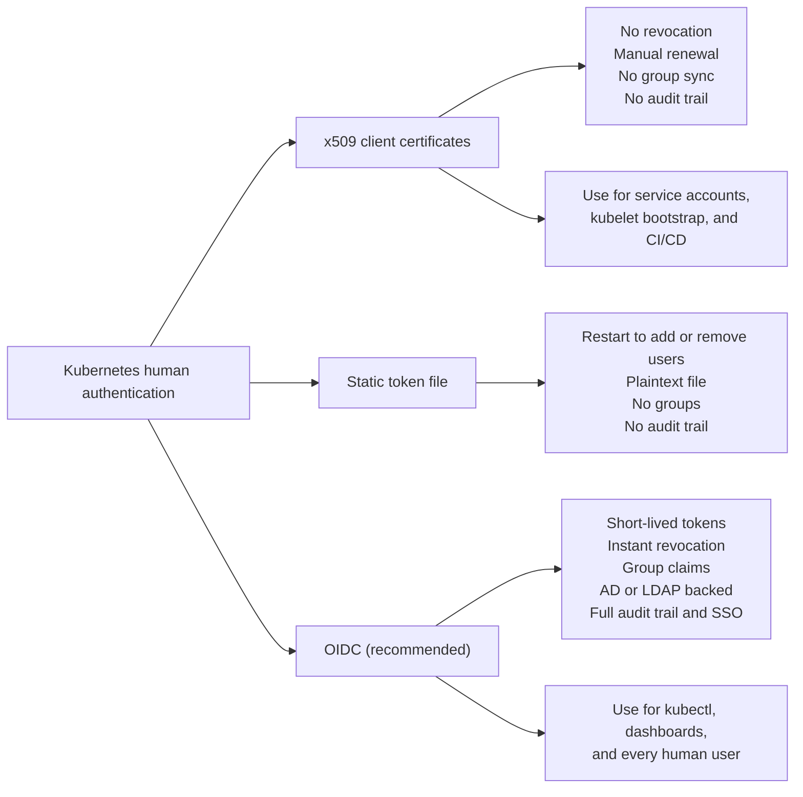
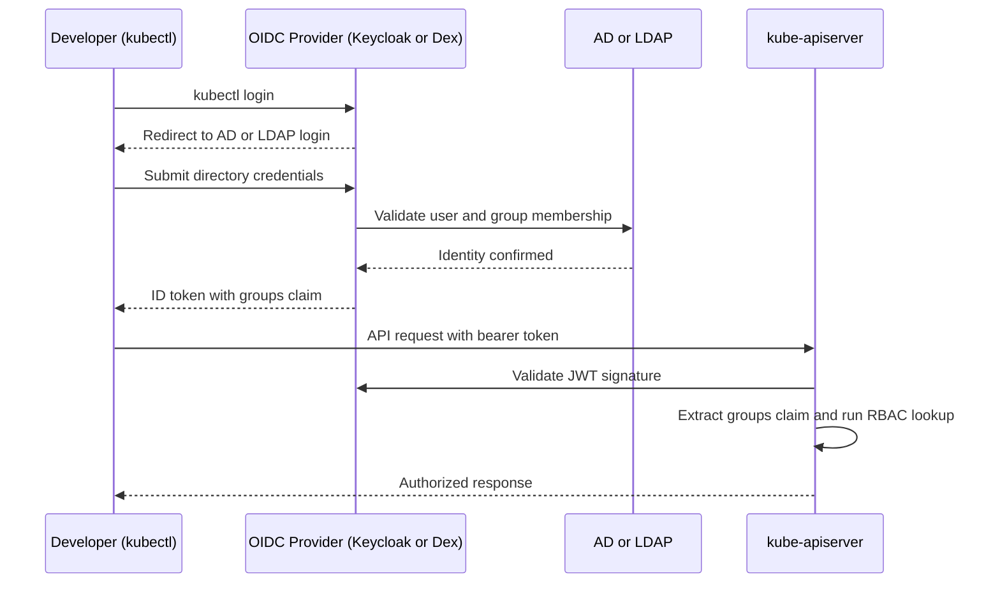
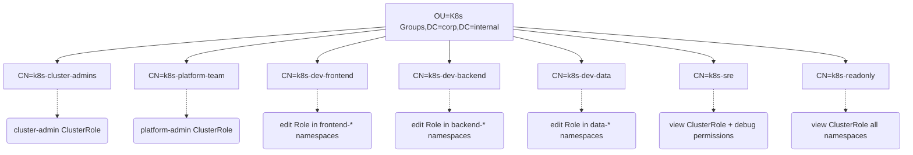

> **Complexity**: `[MEDIUM]` | Time: 60 minutes
>
> **Prerequisites**: [Kubernetes Basics](/prerequisites/kubernetes-basics/), [CKA](/k8s/cka/), [CKS](/k8s/cks/)

---

## What You'll Be Able to Do

After completing this module, you will be able to:

1. **Implement** OIDC-based authentication for Kubernetes v1.35 using AuthenticationConfiguration, integrating with enterprise identity providers.
2. **Compare** Keycloak and Dex for enterprise integration scenarios based on footprint, features, and federated identity support.
3. **Design** a zero-touch access lifecycle where employee onboarding, role changes, and offboarding propagate automatically to cluster access.
4. **Evaluate** authentication strategies (x509 certificates vs. OIDC tokens vs. webhook tokens) for security, revocability, and operational overhead.
5. **Diagnose** role-binding and JWT claim mapping issues in complex AD/LDAP federated environments.

---

## Why This Module Matters

In 2024, a major logistics company with 2,400 employees experienced a severe security breach that halted their automated shipping pipelines. The platform team had initially deployed Kubernetes on-premises and, to save time, created individual kubeconfig files for each of their 180 developers using x509 client certificates signed by the cluster CA. Because Kubernetes has no native certificate revocation list (CRL) mechanism for these client certificates, the team relied on manual, ad-hoc offboarding procedures.

When a senior developer abruptly left the company, their Active Directory account was disabled immediately by HR. However, their x509 client certificate for the Kubernetes cluster remained completely valid. Two weeks later, the former employee used that unrevoked certificate to access the cluster from outside the corporate network (via an exposed API server endpoint) and deleted several critical production namespaces. The resulting downtime cost the company over $2.5 million in delayed shipments, system recovery efforts, and strict SLA penalties.

This disaster could have been prevented entirely. The company's Active Directory already contained every employee, team, and role. HR maintained it meticulously. If the platform team had integrated Kubernetes with AD via OpenID Connect (OIDC), the access would have been revoked within minutes of HR disabling the account—automatically, with zero platform team involvement. OIDC bridges the gap between enterprise identity and Kubernetes RBAC, transforming a fragile, manual process into a robust, zero-touch lifecycle.

> **The Hotel Key Card Analogy**
>
> Client certificates are like physical keys -- once cut, you cannot un-cut them. If someone leaves, you must change all the locks. OIDC tokens are like hotel key cards -- the front desk (your identity provider) can deactivate any card instantly. Expired cards stop working automatically. You never need to change a lock. Every enterprise already has a "front desk" (Active Directory). The question is whether your Kubernetes cluster uses it.

---

## What You'll Learn

- Why x509 client certificates are a bad fit for enterprise Kubernetes authentication.
- Core concepts distinguishing Directory Services (LDAP) from Identity Providers (OIDC).
- The transition from legacy kube-apiserver flags to Structured Authentication in modern Kubernetes.
- Deploying Keycloak as a comprehensive on-premises OIDC provider.
- Configuring Dex as a lightweight OIDC connector for Kubernetes.
- Mapping corporate AD/LDAP groups to Kubernetes RBAC effectively.
- Setting up SSO for the Kubernetes dashboard and other ecosystem tools.

---

## Core Concepts: Directory Services vs. Identity Providers

Before integrating systems, it is vital to understand the protocols at play.

### Lightweight Directory Access Protocol (LDAP)
LDAP is the foundation of traditional corporate identity, such as Microsoft Active Directory. The LDAPv3 protocol is defined in RFC 4511, published June 2006, titled 'Lightweight Directory Access Protocol (LDAP): The Protocol'. 

When interfacing with LDAP, network connectivity is paramount:
- Standard LDAP uses port 389 (unencrypted or with StartTLS upgrade).
- LDAPS (LDAP over SSL/TLS from connection start) uses port 636.
- In Active Directory, the Global Catalog is accessible on port 3268 (LDAP) and port 3269 (LDAPS).

It is strongly recommended to use LDAPS on port 636 rather than StartTLS. While LDAP StartTLS upgrades a plaintext TCP/389 connection to TLS in-band and is defined in RFC 4513, LDAPS uses TLS from the moment the TCP connection is established on port 636, preventing misconfigured clients from accidentally transmitting plaintext credentials.

### OpenID Connect (OIDC)
Kubernetes does not speak LDAP natively. It relies on OIDC. OpenID Connect Core 1.0 is a Final specification published by the OpenID Foundation, not an IETF RFC. It builds upon OAuth 2.0 and was officially published as an ISO standard (ISO/IEC 26131:2024) in 2024.

OIDC operates around a discovery mechanism. The OIDC Discovery endpoint is served at `/.well-known/openid-configuration` on the issuer domain, per OpenID Connect Discovery 1.0. For example, if you use Microsoft Entra ID (note: Microsoft Azure Active Directory (Azure AD) was officially renamed to Microsoft Entra ID on July 11, 2023), the Microsoft Entra ID OIDC discovery document URL format for tenant-specific apps is: `https://login.microsoftonline.com/{tenant}/v2.0/.well-known/openid-configuration`.

---

## Authentication Options for On-Premises Kubernetes



---

## The OIDC Authentication Flow



---

## Modern vs. Legacy Kubernetes OIDC Configuration

As of Kubernetes v1.35 ('Timbernetes'), released December 17, 2025 (with Kubernetes v1.36 scheduled for release on April 22, 2026), the way we configure OIDC has shifted dramatically.

Historically, Kubernetes kube-apiserver legacy OIDC flags are: `--oidc-issuer-url` (HTTPS only), `--oidc-client-id`, `--oidc-username-claim` (default: `sub`), `--oidc-groups-claim`, `--oidc-ca-file`, `--oidc-username-prefix`, and `--oidc-groups-prefix`. 

The new paradigm is the **Structured Authentication Configuration** (`AuthenticationConfiguration`). 
- It reached Alpha in v1.29.
- It reached Beta in v1.30.
- It reached Stable in v1.34 (though some third-party blogs highlight it as a GA feature in v1.35).

This new configuration model provides immense benefits:
- **Multiple Issuers:** AuthenticationConfiguration supports configuring multiple simultaneous JWT/OIDC issuers, unlike the legacy `--oidc-*` flags which support only a single issuer.
- **Dynamic Updates:** AuthenticationConfiguration supports hot-reload: changes to the config file are applied without restarting the kube-apiserver.
- **Advanced Validation:** AuthenticationConfiguration supports CEL (Common Expression Language) for claim validation rules and claim mapping expressions.
- **Custom Endpoints:** Kubernetes Structured Authentication Configuration supports non-standard discovery endpoints via the `issuer.discoveryURL` field (for IdPs not hosting discovery at the standard OIDC path).

**CRITICAL WARNING:** The `--authentication-config` flag (AuthenticationConfiguration) is mutually exclusive with the legacy `--oidc-*` kube-apiserver flags; using both causes an immediate startup failure. Furthermore, while widely reported in community blogs that legacy `--oidc-*` kube-apiserver flags were deprecated in Kubernetes v1.30 when AuthenticationConfiguration reached Beta, official strict removal has not been completely enforced across all distributions, making migration a high priority.

In all configurations, Kubernetes OIDC only accepts HTTPS scheme for the `--oidc-issuer-url` (or equivalent AuthenticationConfiguration `issuer.url`). The default Kubernetes OIDC username claim (`--oidc-username-claim` default) is 'sub', which is intended to be a unique and stable identifier for the end user.

---

## Option 1: Keycloak as OIDC Provider

Keycloak is the most full-featured open-source identity provider. Its latest stable release is 26.6.0, released April 8, 2026. Keycloak supports LDAP and Active Directory user federation, including password validation via LDAP/AD protocols and LDAP password policy enforcement. Additionally, Keycloak supports federated client authentication where Kubernetes Service Account tokens (via TokenRequest API or Token Volume Projection) can be used as client credentials.

### Deploy Keycloak on Kubernetes

Deploy Keycloak as a 2-replica Deployment in the `identity` namespace using `quay.io/keycloak/keycloak:26.6.0`. Key configuration:

```bash
# Keycloak start arguments:
keycloak start \
  --hostname=keycloak.internal.corp \
  --https-certificate-file=/tls/tls.crt \
  --https-certificate-key-file=/tls/tls.key \
  --db=postgres \
  --db-url=jdbc:postgresql://postgres.identity.svc:5432/keycloak \
  --health-enabled=true
```

Store the database password and admin password in Kubernetes Secrets. Expose via a ClusterIP Service on port 443. Add a readiness probe on `/health/ready`.

### Configure Active Directory Federation in Keycloak

After Keycloak is running, configure AD federation through the Admin Console or CLI:

1. **Create a realm** named `kubernetes`
2. **Add User Federation** > LDAP provider with these settings:

| Setting | Value |
|---------|-------|
| Vendor | Active Directory |
| Connection URL | `ldaps://dc01.corp.internal:636` |
| Bind DN | `CN=svc-keycloak,OU=Service Accounts,DC=corp,DC=internal` |
| Users DN | `OU=Users,DC=corp,DC=internal` |
| Username attribute | `sAMAccountName` |
| Edit mode | READ_ONLY |
| Full sync period | 3600 seconds |
| Changed sync period | 60 seconds |

*(Note: It is widely cited that the Active Directory `sAMAccountName` attribute is limited to 20 characters, so ensure your naming conventions reflect this legacy schema limit).*

3. **Add a group mapper** pointing to `OU=K8s Groups,DC=corp,DC=internal`
4. **Create an OIDC client** named `kubernetes` (public client, redirect to `http://localhost:8000/*` via your ingress)
5. **Add a "groups" protocol mapper** to include group memberships in the ID token `groups` claim

---

> **Pause and predict**: Keycloak requires PostgreSQL, 512MB-2GB RAM, and Java expertise to operate. Under what circumstances would this overhead be justified over the simpler Dex alternative?

## Option 2: Dex as a Lightweight Alternative

Dex (dexidp/dex) is an OpenID Connect identity and OAuth 2.0 provider with pluggable connectors, commonly used to federate Kubernetes authentication to upstream identity providers (LDAP, AD, GitHub, etc.). Dex's latest stable release is v2.45.1, released March 3, 2026. It is a single Go binary with YAML configuration.

```yaml
# dex-config.yaml (key sections)
issuer: https://dex.internal.corp
storage:
  type: kubernetes
  config:
    inCluster: true
connectors:
- type: ldap
  id: active-directory
  name: "Corporate AD"
  config:
    host: dc01.corp.internal:636
    rootCA: /certs/ad-ca.crt
    bindDN: CN=svc-dex,OU=Service Accounts,DC=corp,DC=internal
    bindPW: $DEX_LDAP_BIND_PW
    userSearch:
      baseDN: OU=Users,DC=corp,DC=internal
      filter: "(objectClass=person)"
      username: sAMAccountName
    groupSearch:
      baseDN: OU=K8s Groups,DC=corp,DC=internal
      filter: "(objectClass=group)"
      userMatchers:
      - userAttr: DN
        groupAttr: member
      nameAttr: cn
staticClients:
- id: kubernetes
  redirectURIs: ["http://localhost:8000/callback"]
  name: Kubernetes
  secret: $DEX_CLIENT_SECRET
```

### Dex vs Keycloak Decision Matrix

| Criteria | Keycloak | Dex |
|----------|----------|-----|
| Complexity | High (Java, needs PostgreSQL) | Low (single Go binary) |
| Features | MFA, user mgmt, admin UI, fine-grained authz | OIDC proxy only |
| AD/LDAP | Full federation with sync | LDAP connector (query-on-login) |
| Resource usage | 512MB-2GB RAM | 50-100MB RAM |
| Admin interface | Full web UI | None (YAML config only) |
| Best for | Large enterprises, multiple apps needing SSO | Kubernetes-only OIDC |
| SAML support | Yes (SP and IdP) | No |

---

## Option 3: Pinniped for Multi-Cluster Management

For environments managing dozens of clusters, Pinniped offers another architectural pattern. Pinniped's latest stable release is v0.45.0, released March 30, 2026. The Pinniped architecture consists of two components: the Supervisor (acts as an OIDC server / identity hub) and the Concierge (runs per-cluster, handles credential exchange). 

*(Note: Pinniped is a popular VMware-backed project; however, its official CNCF maturity level (sandbox, incubating, or graduated) as of April 2026 remains unverified on standard CNCF project lists, so it operates outside standard CNCF governance).*

---

> **Stop and think**: The API server validates OIDC tokens locally using cached JWKS public keys. What happens to existing kubectl sessions if Keycloak goes down for 30 minutes? How does this differ from webhook-based authentication?

## Configuring kube-apiserver for OIDC

Regardless of whether you use Keycloak or Dex, the API server configuration is the same. These flags tell the API server where to find the OIDC provider's signing keys and which JWT claims to extract for username and group information. 

*(Note: If utilizing a modern v1.35 cluster with `AuthenticationConfiguration`, these concepts translate directly into the `jwt[]` array block within the YAML config).*

```bash
# Add these flags to kube-apiserver (in /etc/kubernetes/manifests/kube-apiserver.yaml)
spec:
  containers:
  - command:
    - kube-apiserver
    # ... existing flags ...
    - --oidc-issuer-url=https://keycloak.internal.corp/realms/kubernetes
    - --oidc-client-id=kubernetes
    - --oidc-username-claim=preferred_username
    - --oidc-username-prefix="oidc:"
    - --oidc-groups-claim=groups
    - --oidc-groups-prefix="oidc:"
    - --oidc-ca-file=/etc/kubernetes/pki/oidc-ca.crt
```

### Important Parameters Explained

```text
--oidc-issuer-url      The OIDC provider's issuer URL. The API server
                       fetches /.well-known/openid-configuration from here
                       to discover the JWKS endpoint for token validation.

--oidc-client-id       Must match the client ID configured in Keycloak/Dex.

--oidc-username-claim  Which JWT claim to use as the Kubernetes username.
                       "preferred_username" maps to the AD sAMAccountName.

--oidc-username-prefix  Prefix added to all OIDC usernames to avoid
                       collisions with other auth methods. "oidc:" means
                       AD user "jsmith" becomes "oidc:jsmith" in RBAC.

--oidc-groups-claim    Which JWT claim contains group memberships.
                       Must match the claim name configured in Keycloak/Dex.

--oidc-groups-prefix   Prefix for OIDC groups. "oidc:" means AD group
                       "k8s-admins" becomes "oidc:k8s-admins" in RBAC.
```

OIDC groups from an IdP are mapped to Kubernetes RBAC group subjects; the `--oidc-groups-prefix` (e.g., 'oidc:') is prepended to all group names in RoleBindings/ClusterRoleBindings.

---

## RBAC Mapping to Corporate Groups

The real power of OIDC is mapping existing AD groups directly to Kubernetes RBAC.

### Active Directory Group Structure

Below is the logical structure, visualized as a Mermaid flowchart:



The underlying directory path definitions:
```text
OU=K8s Groups,DC=corp,DC=internal
├── CN=k8s-cluster-admins       --> cluster-admin ClusterRole
├── CN=k8s-platform-team        --> platform-admin ClusterRole (custom)
├── CN=k8s-dev-frontend          --> edit Role in frontend-* namespaces
├── CN=k8s-dev-backend           --> edit Role in backend-* namespaces
├── CN=k8s-dev-data              --> edit Role in data-* namespaces
├── CN=k8s-sre                   --> view ClusterRole + debug permissions
└── CN=k8s-readonly              --> view ClusterRole (all namespaces)
```

### RBAC Bindings

These bindings map AD groups (with the `oidc:` prefix) to Kubernetes ClusterRoles and Roles. When a user authenticates via OIDC, the API server extracts their group memberships from the JWT token and matches them against these bindings.

> **Pause and predict**: What would happen if you forgot to set `--oidc-groups-prefix` and someone in your organization created an AD group named `system:masters`?

```text
# cluster-admins -- full cluster access
apiVersion: rbac.authorization.k8s.io/v1
kind: ClusterRoleBinding
metadata:
  name: oidc-cluster-admins
roleRef:
  apiGroup: rbac.authorization.k8s.io
  kind: ClusterRole
  name: cluster-admin
subjects:
- kind: Group
  name: "oidc:k8s-cluster-admins"
  apiGroup: rbac.authorization.k8s.io

---
# Frontend developers -- edit access to frontend namespaces only
apiVersion: rbac.authorization.k8s.io/v1
kind: RoleBinding
metadata:
  name: oidc-frontend-devs
  namespace: frontend-app
roleRef:
  apiGroup: rbac.authorization.k8s.io
  kind: ClusterRole
  name: edit
subjects:
- kind: Group
  name: "oidc:k8s-dev-frontend"
  apiGroup: rbac.authorization.k8s.io

---
# Read-only access for all authenticated users (optional)
apiVersion: rbac.authorization.k8s.io/v1
kind: ClusterRoleBinding
metadata:
  name: oidc-readonly
roleRef:
  apiGroup: rbac.authorization.k8s.io
  kind: ClusterRole
  name: view
subjects:
- kind: Group
  name: "oidc:k8s-readonly"
  apiGroup: rbac.authorization.k8s.io

---
# SRE team -- custom ClusterRole with view + debug permissions
# (pods/exec, pods/log, pods/portforward, nodes, events)
# Bound to group "oidc:k8s-sre" via ClusterRoleBinding
```

---

## Configuring kubectl for OIDC Login

Developers need a way to authenticate via OIDC from the command line. The `kubelogin` plugin handles this gracefully:

```bash
# Install kubelogin (kubectl oidc-login plugin)
kubectl krew install oidc-login

# Configure kubeconfig for OIDC authentication
kubectl config set-credentials oidc-user \
  --exec-api-version=client.authentication.k8s.io/v1beta1 \
  --exec-command=kubectl \
  --exec-arg=oidc-login \
  --exec-arg=get-token \
  --exec-arg=--oidc-issuer-url=https://keycloak.internal.corp/realms/kubernetes \
  --exec-arg=--oidc-client-id=kubernetes \
  --exec-arg=--oidc-extra-scope=groups

# Set context to use OIDC user
kubectl config set-context oidc-context \
  --cluster=on-prem-cluster \
  --user=oidc-user
kubectl config use-context oidc-context

# First kubectl command triggers browser login
kubectl get pods -n frontend-app
# Browser opens -> AD login page -> redirect back -> token cached
```
*(Note: While the script above utilizes `v1beta1` for legacy compatibility examples, production v1.35 clusters should utilize `client.authentication.k8s.io/v1` in modern manifests).*

---

## SSO for Kubernetes Dashboard and Tools

Once OIDC is configured, extend SSO to other Kubernetes tools:

### OAuth2 Proxy for Web UIs

For tools without native OIDC support, deploy `oauth2-proxy` as a reverse proxy that handles authentication. Note that `oauth2-proxy` was accepted into the CNCF at the Sandbox maturity level on October 2, 2025, and its latest stable release is v7.15.1, released March 23, 2026. 

Deploy it in the same namespace as the target tool, configure it with the OIDC issuer URL and client credentials, and point it upstream to the tool's service. It intercepts unauthenticated requests, redirects to Keycloak for login, and passes the validated token through to the backend.

```bash
# Key oauth2-proxy flags for Kubernetes Dashboard:
# --provider=oidc
# --oidc-issuer-url=https://keycloak.internal.corp/realms/kubernetes
# --upstream=http://kubernetes-dashboard.kubernetes-dashboard.svc:443
# --pass-access-token=true  (forward token to backend)
# --scope=openid profile email groups
```

### Tools That Support OIDC Natively

| Tool | OIDC Support | Configuration |
|------|-------------|---------------|
| Kubernetes Dashboard | Via oauth2-proxy | See above |
| Grafana | Native OIDC | `auth.generic_oauth` in grafana.ini |
| ArgoCD | Native OIDC/Dex | Built-in Dex or external OIDC |
| Harbor | Native OIDC | Admin > Configuration > Authentication |
| Vault | Native OIDC | `vault auth enable oidc` |
| Gitea | Native OAuth2 | Admin > Authentication Sources |

---

## Did You Know?

- **Kubernetes v1.35 ('Timbernetes') was released December 17, 2025**, containing 60 enhancements and pushing forward robust security standards, cementing the transition to Structured Authentication.
- **The `oidc-groups-prefix` flag was added in Kubernetes 1.11** to prevent privilege escalation. Without it, an AD group named "system:masters" would grant cluster-admin access. The prefix ensures OIDC groups cannot collide with Kubernetes system groups.
- **Microsoft Azure Active Directory (Azure AD) was officially renamed to Microsoft Entra ID on July 11, 2023**, leading to updated OIDC discovery document URL formats like `https://login.microsoftonline.com/{tenant}/v2.0/.well-known/openid-configuration`.
- **OpenID Connect Core 1.0 was published as an ISO standard (ISO/IEC 26131:2024) in 2024**, moving it beyond its OpenID Foundation origins into formal international standard recognition.

---

## Common Mistakes

| Mistake | Problem | Solution |
|---------|---------|----------|
| No OIDC username prefix | OIDC user "admin" collides with built-in admin | Always set `--oidc-username-prefix` (e.g., "oidc:") |
| No OIDC groups prefix | AD group could match "system:masters" | Always set `--oidc-groups-prefix` |
| Long-lived OIDC tokens | Terminated employee retains access until token expires | Set token lifetime to 15-60 minutes in Keycloak |
| LDAP bind account with write access | Compromised Keycloak/Dex could modify AD | Use a read-only service account for LDAP bind |
| Not testing group sync | Users authenticate but have no permissions | Verify group claims in JWT: `kubectl oidc-login get-token --oidc-issuer-url=... --oidc-client-id=kubernetes \| jq -r '.status.token' \| cut -d. -f2 \| base64 -d \| jq .groups` |
| Skipping MFA for cluster-admin | Single factor for highest privilege access | Require MFA in Keycloak for k8s-cluster-admins group |
| Hardcoded service account tokens for CI/CD | CI/CD uses human auth flow | Use Kubernetes service accounts with bound tokens for CI/CD |
| Single OIDC provider, no failover | Keycloak outage = nobody can authenticate | Deploy Keycloak HA (2+ replicas) with shared PostgreSQL |

---

## Quiz

### Question 1
A developer reports that `kubectl get pods` returns "Forbidden" even though they are in the correct AD group. How do you troubleshoot?

<details>
<summary>Answer</summary>

**Systematic troubleshooting steps:**

1. **Verify the JWT token contains the expected groups claim:**
   ```bash
   kubectl oidc-login get-token \
     --oidc-issuer-url=https://keycloak.internal.corp/realms/kubernetes \
     --oidc-client-id=kubernetes \
     | jq -r '.status.token' | cut -d. -f2 | base64 -d | jq .
   ```
   The output of `oidc-login get-token` is an ExecCredential JSON object; extract the token from `.status.token` first, then decode the JWT payload. Check that the `groups` field contains the expected group name.

2. **Check the group name matches exactly (including prefix).** If `--oidc-groups-prefix=oidc:` is set, the RoleBinding must reference `oidc:k8s-dev-frontend`, not `k8s-dev-frontend`.

3. **Verify the RoleBinding exists in the correct namespace:**
   ```bash
   kubectl get rolebindings -n frontend-app -o yaml
   ```

4. **Check if Keycloak group sync has run.** If the user was just added to the AD group, Keycloak may not have synced yet (default: every 60 seconds for changed sync).

5. **Verify the API server OIDC flags** are correct -- especially `--oidc-groups-claim` must match the claim name in the JWT (e.g., "groups").

6. **Use `kubectl auth can-i` with impersonation to test:**
   ```bash
   kubectl auth can-i get pods -n frontend-app \
     --as=oidc:jsmith --as-group=oidc:k8s-dev-frontend
   ```

Most common cause: the group name in the RoleBinding does not match the claim value (case sensitivity, missing prefix, or wrong claim name).
</details>

### Question 2
Why should you use Keycloak or Dex instead of configuring the API server to query LDAP directly?

<details>
<summary>Answer</summary>

**Kubernetes does not support LDAP authentication natively.** The API server only supports these authentication methods: x509 certificates, bearer tokens, OIDC, and webhook token authentication. There is no `--ldap-url` flag.

**Keycloak/Dex serve as the translation layer** between LDAP/AD and OIDC:

1. **Protocol translation**: AD speaks LDAP. Kubernetes speaks OIDC. Keycloak/Dex bridge the gap.

2. **Token management**: LDAP has no concept of short-lived tokens. OIDC provides JWTs with expiry, refresh tokens, and scopes. Keycloak creates and manages these tokens.

3. **Group claims**: LDAP group membership must be queried with a separate LDAP search. OIDC embeds group memberships directly in the JWT, so the API server does not need to query anything at authentication time.

4. **MFA**: LDAP provides only username/password. Keycloak adds MFA (TOTP, WebAuthn, SMS) on top of LDAP authentication.

5. **Centralization**: Multiple clusters can share a single Keycloak/Dex instance. Each cluster only needs the OIDC issuer URL -- no LDAP connection details on every API server.

6. **Security**: LDAP credentials would need to be stored on every control plane node. With OIDC, only the public signing key (JWKS) is needed on the API server -- no secrets.
</details>

### Question 3
You have 5 Kubernetes clusters. How do you manage RBAC consistently across all of them using AD groups?

<details>
<summary>Answer</summary>

**Use a single OIDC provider (Keycloak) with GitOps-managed RBAC:**

1. **Single Keycloak instance** (HA) serves all 5 clusters. Each cluster's API server points to the same `--oidc-issuer-url`.

2. **Consistent AD group naming** convention: `k8s-{cluster}-{role}` for cluster-specific access (e.g., `k8s-prod-admin`), `k8s-all-{role}` for cross-cluster access (e.g., `k8s-all-readonly`).

3. **RBAC manifests in Git** managed by Flux/ArgoCD with Kustomize overlays: a `base/` directory for cross-cluster bindings and per-cluster overlays for cluster-specific admin/dev roles.

4. **Automate group creation** in AD using a script that reads the cluster inventory. When a new cluster is added, create `k8s-{newcluster}-admin`, `k8s-{newcluster}-dev`, etc.

5. **Audit**: Periodically compare AD group memberships against RBAC bindings to detect drift.
</details>

### Question 4
What happens to existing kubectl sessions when an employee is terminated and their AD account is disabled?

<details>
<summary>Answer</summary>

**The answer depends on the OIDC token lifetime:**

1. **Active sessions with valid tokens continue working** until the token expires. If the token lifetime is 60 minutes, the terminated employee could have up to 60 minutes of continued access.

2. **When the token expires**, kubectl attempts to refresh it. The refresh token is sent to Keycloak, which queries AD. AD returns "account disabled." Keycloak refuses to issue a new token. kubectl shows an authentication error.

3. **Mitigation strategies:**

   - **Short token lifetime (15 min)**: Reduces the window of exposure but increases authentication frequency for all users.

   - **Revocation endpoint**: Keycloak supports token revocation, but the Kubernetes API server does not check revocation lists (it validates tokens locally using JWKS). This means Keycloak revocation only affects token refresh, not already-issued tokens.

   - **Webhook token authentication**: For immediate revocation, use a webhook authenticator instead of or alongside OIDC. The webhook checks token validity with the IdP on every request. This adds latency but enables instant revocation.

   - **Network-level**: Revoke the employee's VPN access. If they cannot reach the API server, the token is useless.

**Practical recommendation**: 15-30 minute token lifetime combined with VPN revocation as part of the HR offboarding process.
</details>

### Question 5
You upgrade your cluster to Kubernetes v1.35 and decide to implement the new AuthenticationConfiguration file to support multiple OIDC issuers. However, the `kube-apiserver` crashes immediately on startup. What is the most likely cause?

<details>
<summary>Answer</summary>

**You likely left the legacy `--oidc-*` flags in your manifest.**
The `--authentication-config` flag is mutually exclusive with the legacy `--oidc-issuer-url` and related legacy flags. Using both causes an immediate startup failure. To fix this, you must fully migrate your OIDC configuration into the `AuthenticationConfiguration` YAML file and remove all legacy `--oidc-*` arguments from the `kube-apiserver` command line argument list.
</details>

### Question 6
A developer can successfully authenticate with Keycloak, but their Kubernetes API requests are rejected with a "401 Unauthorized: token is invalid" error. You verify the token signature is valid and the issuer matches perfectly. What is the next logical component to investigate?

<details>
<summary>Answer</summary>

**Investigate the `aud` (audience) claim in the JWT.**
When the API server validates a token, it strictly checks that the token was intended for it. The token's audience claim must match the API server's configured client ID. In Keycloak, if the client is not configured to add its client ID to the `aud` claim (often requiring a dedicated protocol mapper), the API server will reject the token despite it having a valid signature and issuer.
</details>

### Question 7
Your Dex instance fails to connect to the corporate Active Directory. The network team confirms port 389 is open, and you have configured Dex to use StartTLS. However, connections are dropping intermittently. How should you adjust your configuration?

<details>
<summary>Answer</summary>

**Switch to LDAPS on port 636 instead of StartTLS on port 389.**
While StartTLS (RFC 4513) upgrades a plaintext TCP/389 connection to TLS in-band, it is prone to misconfiguration where a brief unencrypted phase occurs. Active Directory heavily prefers, and many strict security policies mandate, LDAPS (LDAP over SSL/TLS from connection start) on port 636. Reconfigure the Dex LDAP connector host to target port 636 and ensure your CA certificates are properly mounted.
</details>

---

## Hands-On Exercise: Configure OIDC Authentication with Dex

**Task**: Set up Dex as an OIDC provider for a local Kubernetes cluster using a static user (simulating AD), and verify RBAC group propagation.

### Task 1: Bootstrap a Local Cluster
Create a new Kind cluster configuring `kube-apiserver` with `--oidc-issuer-url`, `--oidc-client-id=kubernetes`, `--oidc-username-claim=email`, `--oidc-groups-claim=groups`, and both prefix flags set to `oidc:`.

<details>
<summary>Solution</summary>

Use a Kind configuration file that injects the required legacy flags into the control plane components.
```yaml
kind: Cluster
apiVersion: kind.x-k8s.io/v1alpha4
nodes:
- role: control-plane
  kubeadmConfigPatches:
  - |
    kind: ClusterConfiguration
    apiServer:
      extraArgs:
        oidc-issuer-url: https://dex.identity.svc:5556
        oidc-client-id: kubernetes
        oidc-username-claim: email
        oidc-groups-claim: groups
        oidc-username-prefix: "oidc:"
        oidc-groups-prefix: "oidc:"
```
</details>

### Task 2: Deploy the Dex Identity Provider
Deploy Dex into the cluster. Configure a `staticPasswords` entry for `jane@corp.internal` and a `staticClients` entry for the `kubernetes` client ID.

<details>
<summary>Solution</summary>

Create a ConfigMap containing the `dex-config.yaml` that specifies `jane@corp.internal` inside the `staticPasswords` block. Deploy the Dex container using this configuration.
</details>

### Task 3: Configure Role-Based Access Control
Create an RBAC binding that grants the `view` ClusterRole to Jane's federated identity.

<details>
<summary>Solution</summary>

```bash
kubectl create clusterrolebinding oidc-jane-admin \
  --clusterrole=view \
  --user="oidc:jane@corp.internal"
```
</details>

### Task 4: Authenticate with Kubelogin
Execute the command to retrieve a token via your local browser.

<details>
<summary>Solution</summary>

```bash
kubectl oidc-login get-token \
  --oidc-issuer-url=https://dex.identity.svc:5556 \
  --oidc-client-id=kubernetes
```
</details>

### Task 5: Verify Permissions
Ensure that Jane has the correct cluster permissions according to the RBAC definitions.

<details>
<summary>Solution</summary>

Execute an impersonation check:
```bash
kubectl auth can-i get pods --all-namespaces --as="oidc:jane@corp.internal"
```
The output should be `yes`.
</details>

### Task 6: Inspect the JWT Payload
Extract the JWT and read the underlying claims.

<details>
<summary>Solution</summary>

Extract the base64 encoded token from the previous `get-token` command and decode it. You will see the `email` claim matching `jane@corp.internal` and the respective group bindings mapped directly into the payload.
</details>

### Success Criteria
- [ ] Kind cluster created with OIDC API server flags
- [ ] Dex deployed and accessible
- [ ] Static user can obtain a JWT token
- [ ] RBAC binding grants correct permissions to the OIDC user
- [ ] `kubectl auth can-i` confirms permissions match expectations

---

## Key Takeaways

1. **OIDC is the only viable authentication for enterprise Kubernetes** -- x509 certificates cannot be revoked and static tokens are a security anti-pattern.
2. **Keycloak for full enterprise SSO**, Dex for lightweight Kubernetes-only OIDC.
3. **Map AD groups to RBAC** and let HR manage Kubernetes access through existing processes via federated identity.
4. **Always use username and group prefixes** to prevent privilege escalation via name collision against native service accounts.
5. **Short token lifetimes** (15-30 min) limit the window when a terminated employee retains access prior to the next required refresh token exchange.

---

## Next Module

Continue to [Module 6.4: Compliance for Regulated Industries](../module-6.4-compliance/) to learn how to map regulatory frameworks like HIPAA, SOC 2, and PCI DSS to your on-premises Kubernetes infrastructure.