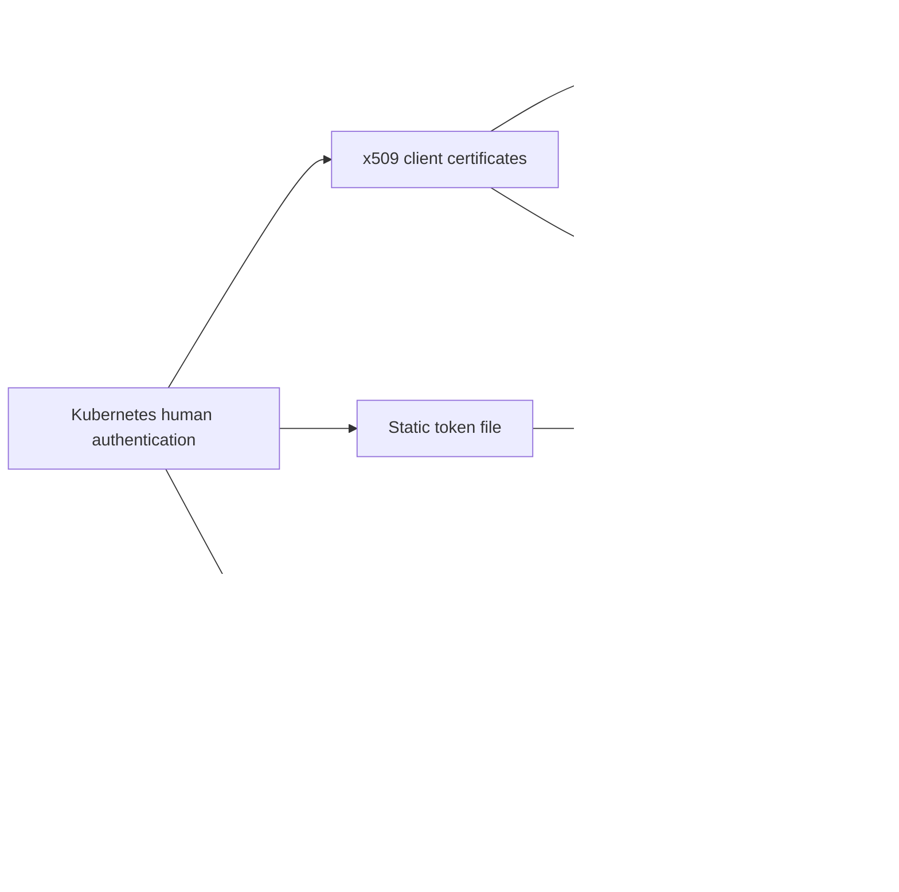
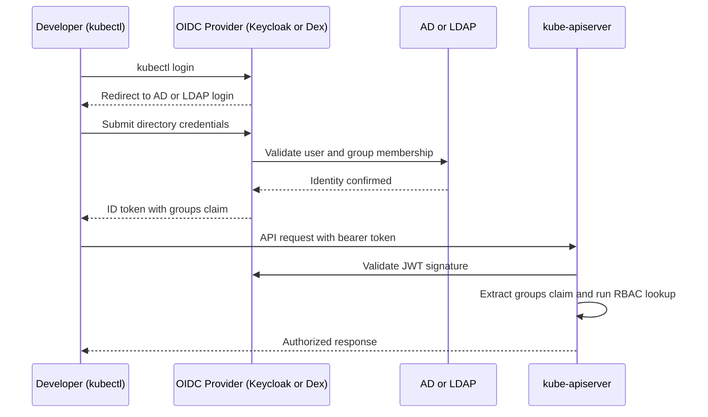
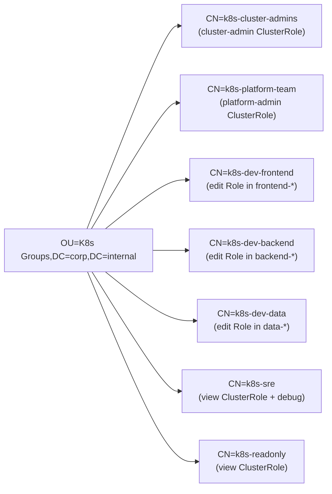
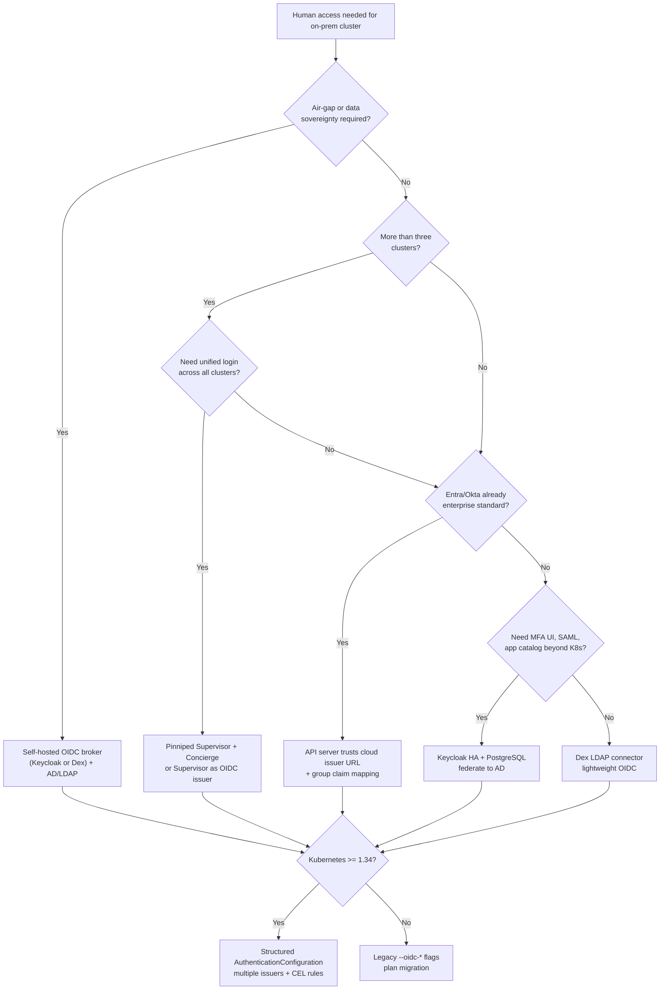

> **Complexity**: `[MEDIUM]` | Time: 60 minutes
>
> **Prerequisites**: [Kubernetes Basics](/prerequisites/kubernetes-basics/), [CKA](/k8s/cka/), [CKS](/k8s/cks/)

## What You'll Be Able to Do

After completing this module, you will be able to:

1. **Implement** OIDC-based authentication for Kubernetes (targeting v1.35 and newer) by integrating with Active Directory, LDAP, or enterprise identity providers.
2. **Configure** Keycloak or Dex as an OIDC broker that maps AD/LDAP groups to Kubernetes RBAC roles.
3. **Design** a zero-touch access lifecycle where employee onboarding, role changes, and offboarding propagate automatically to cluster access.
4. **Evaluate** authentication strategies (x509 certificates vs. OIDC tokens vs. webhook tokens) for security, revocability, and operational overhead.
5. **Diagnose** identity federation issues using advanced logging, token inspection, and API server structured authentication configurations.

## Why This Module Matters

In many on-premises environments, managing human access with individually issued client certificates becomes cumbersome: offboarding is harder, group changes require credential reissuance, and the operational overhead grows quickly.

Many organizations already have a corporate directory that serves as the source of truth for employees, teams, and roles, and the sustainable fix is to federate Kubernetes authentication through an OIDC provider such as Keycloak or Dex while mapping directory groups to Kubernetes RBAC. With OIDC-based human authentication, disabling a user's directory account prevents new token issuance, short-lived tokens limit lingering access, and the platform team no longer needs to manage large inventories of long-lived client certificates by hand.

> **The Hotel Key Card Analogy**
>
> Client certificates are like physical keys — once cut, you cannot un-cut them. If someone leaves, you must change all the locks. OIDC tokens are like hotel key cards — the front desk (your identity provider) can deactivate any card instantly. Expired cards stop working automatically. You usually do not need to change a lock. Every enterprise already has a "front desk" (Active Directory). The question is whether your Kubernetes cluster uses it.

## What You'll Learn

- Why x509 client certificates are a fundamentally flawed fit for enterprise Kubernetes human authentication.
- The deep mechanics of integrating LDAP and Active Directory with Kubernetes.
- Deploying and configuring Keycloak as a highly available, on-premises OIDC provider.
- Configuring Dex and Pinniped as lightweight OIDC connectors for multi-cluster environments.
- Mapping corporate AD/LDAP groups to Kubernetes RBAC seamlessly.
- Transitioning to the new Structured Authentication Configuration in modern Kubernetes releases.
- Setting up Single Sign-On (SSO) for the Kubernetes dashboard, Grafana, and other operational tools using OAuth2 Proxy.

## The Identity Spine: Authentication vs Authorization

Before choosing Keycloak, Dex, or Entra ID, you need a clear mental model of what Kubernetes actually does with identity. **Authentication** answers the question "who are you?" — the API server validates a presented credential (x509 certificate, bearer token, OIDC JWT) and extracts a username and zero or more group names. **Authorization** answers "what may you do?" — after authentication succeeds, the RBAC engine matches those username and group strings against RoleBindings and ClusterRoleBindings to decide whether a specific API request is allowed. Kubernetes never stores employee records in etcd; it only stores RBAC policy objects that reference external identity strings.

This separation is deliberate and durable. [The Kubernetes authentication documentation states that normal users cannot be added to a cluster through an API call](https://kubernetes.io/docs/reference/access-authn-authz/authentication/) — there is no `User` API resource for humans. When HR onboards a developer, you do not `kubectl create user`; you add them to an Active Directory group, wait for the OIDC broker to reflect that membership in JWT group claims, and ensure a RoleBinding already maps that group to the correct ClusterRole or Role. Offboarding is the mirror image: disable the directory account, and new tokens stop being issued; existing short-lived tokens expire on their own schedule.

On-premises clusters amplify this design because you own every hop. Cloud-managed Kubernetes often bundles a cloud IAM layer (AWS IAM Roles for Service Accounts, GKE Workload Identity) that humans never touch directly. In your datacenter, the API server delegates human authentication to external mechanisms you operate: OIDC issuers configured via legacy `--oidc-*` flags or the GA Structured Authentication Configuration file, webhook token authenticators for proprietary token formats, or x509 client certificates for break-glass administrators. Service account tokens follow a parallel path — projected tokens bound to a Pod via the TokenRequest API — but those are workload credentials, not substitutes for human OIDC login.

The OIDC bridge pattern works because JWTs carry signed claims the API server can verify locally. After startup, the API server fetches the issuer's JWKS (JSON Web Key Set) from the discovery document at `/.well-known/openid-configuration` and caches public keys. Each incoming request with a bearer token is validated for signature, issuer, audience, and expiration without a synchronous round trip to Keycloak on every `kubectl get pods`. That local validation is fast and resilient, but it also means **revocation is not instantaneous** — a disabled directory account continues to work until the current JWT expires unless you operate additional controls (very short lifetimes, webhook revocation, or network-level blocks).

Structured Authentication Configuration, [stable in Kubernetes v1.34 and enabled by default](https://kubernetes.io/docs/reference/access-authn-authz/authentication/), replaces the single-issuer limitation of legacy flags. You define one or more `jwt` authenticators in a YAML file, map claims to username and groups with static claim names or CEL expressions, attach CEL validation rules (for example, rejecting tokens whose `exp - iat` exceeds 3600 seconds), and reload configuration without restarting the API server. For multi-tenant on-prem fleets where internal staff use Keycloak-backed AD groups while acquired teams authenticate through their own Okta tenant, this is the native answer — no extra reverse proxy required.

## Authentication Options for On-Premises Kubernetes

Before diving into implementations, it is essential to understand the landscape of Kubernetes human authentication. Kubernetes provides several mechanisms for authenticating users, but not all of them are suitable for enterprise environments.


```mermaid
flowchart LR
    Access["Kubernetes human authentication"]
    Access --> X509["x509 client certificates"]
    Access --> Static["Static token file"]
    Access --> OIDC["OIDC (recommended)"]

    X509 --> X509Limits["No revocation<br/>Manual renewal<br/>No group sync<br/>No audit trail"]
    Static --> StaticLimits["Restart to add or remove users<br/>Plaintext file<br/>No groups<br/>No audit trail"]
    OIDC --> OIDCBenefits["Short-lived tokens<br/>Instant revocation<br/>Group claims<br/>AD or LDAP backed<br/>Full audit trail and SSO"]

    X509 --> X509Use["Use for service accounts,<br/>kubelet bootstrap, and CI/CD"]
    OIDC --> OIDCUse["Use for kubectl, dashboards,<br/>and every human user"]
```

[Kubernetes v1.35 ('Timbernetes'), released December 17, 2025](https://kubernetes.io/blog/2025/12/17/kubernetes-v1-35-release/), continued the long-standing architectural philosophy of not including a built-in user database. With Kubernetes v1.36 scheduled for release on April 22, 2026, the API server trusts external identity providers entirely. [There is no `kubectl create user` command. Users exist only in the identity provider (AD, LDAP, OIDC) and are referenced in RBAC bindings by name or group.](https://kubernetes.io/docs/reference/access-authn-authz/authentication/)

### x509, Static Tokens, Webhooks, and OIDC Compared

**x509 client certificates** remain appropriate for control-plane components, kubelet bootstrap, and break-glass administrators — not for every developer laptop. Certificates embed identity in the TLS handshake; revocation requires CRL or OCSP infrastructure many on-prem teams never fully operate, which is why client cert auth is a poor enterprise human-access default.

**Static token files** (`--token-auth-file`) are legacy: plaintext CSV on disk, API server restart to add users, no groups, no SSO. Treat them as technical debt if still present on aging clusters.

**Webhook token authentication** delegates validation to an HTTP service implementing the `TokenReview` API shape. The API server POSTs the bearer token on each request (or according to cache settings); the webhook returns username and groups. This enables real-time revocation databases and custom MFA gates, but introduces availability coupling — if the webhook is down, humans cannot authenticate unless fallback authenticators are configured. Webhooks complement OIDC rather than replacing directory federation; you still need a broker or token issuer upstream.

**OIDC JWT authentication** (legacy flags or Structured Authentication Configuration) is the default recommendation for human kubectl and dashboard access because verification is local after JWKS fetch, directory integration happens once at the broker, and group claims map cleanly to RBAC. The tradeoff is delayed revocation bounded by token TTL — design around that with short lifetimes rather than pretending JWTs are session cookies.

## Understanding LDAP and Active Directory Protocols

To connect Kubernetes to an enterprise directory, you must understand the underlying protocols.

Active Directory communicates using the Lightweight Directory Access Protocol (LDAP). [The LDAPv3 protocol is defined in RFC 4511, published June 2006](https://www.rfc-editor.org/info/rfc4511), titled 'Lightweight Directory Access Protocol (LDAP): The Protocol'. 

Standard LDAP uses port 389. This connection can be unencrypted, or it can be upgraded to an encrypted state using StartTLS. [LDAP StartTLS upgrades a plaintext TCP/389 connection to TLS in-band and is defined in RFC 4513. Conversely, LDAPS (LDAP over SSL/TLS from connection start) uses port 636](https://www.rfc-editor.org/info/rfc4513) and wraps the entire session in TLS before any LDAP traffic is transmitted.

For large Active Directory forests, the Active Directory Global Catalog is highly relevant and is accessible on [port 3268 (LDAP) and port 3269 (LDAPS)](https://learn.microsoft.com/en-us/troubleshoot/windows-server/active-directory/specify-server-port-active-directory-powershell-cmdlet). Active Directory also imposes specific schema constraints — for example, the `sAMAccountName` attribute is documented as 20 characters or fewer, which matters when designing Kubernetes username claims that mirror short login names rather than email addresses.

## The OpenID Connect (OIDC) Bridge

Because [Kubernetes does not natively speak LDAP](https://kubernetes.io/docs/reference/access-authn-authz/authentication/), an intermediary must translate between LDAP/AD and the Kubernetes API server. This intermediary uses OpenID Connect (OIDC).

OpenID Connect Core 1.0 is a Final specification published by the OpenID Foundation, not an IETF RFC. It was officially [published as an ISO standard (ISO/IEC 26131:2024) in 2024](https://www.iso.org/standard/89056.html). 

The OIDC Discovery endpoint is critically important. [It is served at `/.well-known/openid-configuration` on the issuer domain, per OpenID Connect Discovery 1.0. Client libraries (including the Kubernetes API server) use this endpoint to discover authorization, token, userinfo, and JWKS (JSON Web Key Set) endpoints. For identity providers not hosting discovery at the standard path, Kubernetes Structured Authentication Configuration supports non-standard discovery endpoints via the `issuer.discoveryURL` field.](https://kubernetes.io/docs/reference/access-authn-authz/authentication/)

For security reasons, Kubernetes OIDC [only accepts the HTTPS scheme for the `--oidc-issuer-url`](https://kubernetes.io/docs/reference/access-authn-authz/authentication/) (or equivalent AuthenticationConfiguration `issuer.url`).

The standard flow involves the developer, the OIDC provider, the directory, and the API server:


```mermaid
sequenceDiagram
    participant Dev as Developer (kubectl)
    participant OIDC as OIDC Provider (Keycloak or Dex)
    participant AD as AD or LDAP
    participant API as kube-apiserver

    Dev->>OIDC: kubectl login
    OIDC-->>Dev: Redirect to AD or LDAP login
    Dev->>OIDC: Submit directory credentials
    OIDC->>AD: Validate user and group membership
    AD-->>OIDC: Identity confirmed
    OIDC-->>Dev: ID token with groups claim
    Dev->>API: API request with bearer token
    API->>OIDC: Validate JWT signature
    API->>API: Extract groups claim and run RBAC lookup
    API-->>Dev: Authorized response
```

## Option 1: Keycloak as an Enterprise Identity Broker

Keycloak is a powerful, full-featured open-source identity provider. The Keycloak latest stable release is [26.6.0, released April 8, 2026](https://github.com/keycloak/keycloak/releases/tag/26.6.0). 

Keycloak supports LDAP and Active Directory user federation deeply, including password validation via LDAP/AD protocols and LDAP password policy enforcement. Furthermore, Keycloak [supports federated client authentication where Kubernetes Service Account tokens (via TokenRequest API or Token Volume Projection) can be used as client credentials](https://github.com/keycloak/keycloak/releases/tag/26.6.0).

### Deploy Keycloak on Kubernetes

Deploy Keycloak as a highly-available Deployment. Below is a foundational configuration snippet for Keycloak:

```bash
# Keycloak start arguments:
keycloak start \
  --hostname=keycloak.example.com \
  --https-certificate-file=/tls/tls.crt \
  --https-certificate-key-file=/tls/tls.key \
  --db=postgres \
  --db-url=jdbc:postgresql://postgres.identity.svc.cluster.local:5432/keycloak \
  --health-enabled=true
```

After Keycloak is running, configure AD federation through the Admin Console or CLI:

1. **Create a realm** named `kubernetes`
2. **Add User Federation** > LDAP provider with these settings:

| Setting | Value |
|---------|-------|
| Vendor | Active Directory |
| Connection URL | `ldaps://dc01.example.com:636` |
| Bind DN | `CN=svc-keycloak,OU=Service Accounts,DC=corp,DC=internal` |
| Users DN | `OU=Users,DC=corp,DC=internal` |
| Username attribute | `sAMAccountName` |
| Edit mode | READ_ONLY |
| Full sync period | 3600 seconds |
| Changed sync period | 60 seconds |

3. **Add a group mapper** pointing to `OU=K8s Groups,DC=corp,DC=internal`
4. **Create an OIDC client** named `kubernetes` (public client, redirect to `http://127.0.0.1:8000/*`)
5. **Add a "groups" protocol mapper** to include group memberships in the ID token `groups` claim

> **Pause and predict**: Keycloak requires PostgreSQL, 512MB-2GB RAM, and Java expertise to operate. Under what circumstances would this overhead be justified over the simpler Dex alternative?

### Keycloak High Availability on Owned Hardware

Production Keycloak on-premises is rarely a single Pod. The reference shape is three Keycloak replicas behind an internal load balancer (metalLB BGP VIP, hardware ADC, or kube-vip), all pointing at a PostgreSQL cluster that holds realm configuration, user federation settings, and client definitions. Session affinity is less critical for kubectl flows (tokens are JWTs validated at the API server) but still matters for admin console changes and browser SSO to Grafana — configure health checks on Keycloak's `--health-enabled` endpoints and fail out unhealthy replicas before engineers hit timeout loops during login.

Certificate rotation for `keycloak.example.com` must be automated: internal CA or cert-manager DNS-01/HTTP-01 against a corporate DNS zone. When issuer TLS expires, every API server JWKS fetch and every kubelogin browser redirect fails simultaneously — treat IdP TLS like control-plane etcd certificates with calendar reminders. Backup PostgreSQL with point-in-time recovery; realm JSON export before major upgrades is cheap insurance when LDAP mapper experiments go wrong.

Keycloak's admin API and realm import/export enable GitOps-style realm promotion: develop mappers in a staging realm, export JSON, review in pull request, import to production. This mirrors how you already promote RoleBindings — identity configuration is infrastructure, not a one-time wizard click. For AD federation specifically, schedule full LDAP sync during maintenance windows when changing group mapper filters; incremental sync every 60 seconds is fine for steady state but full sync rebuilds membership caches when OU structure changes.

## Option 2: Dex and Pinniped for Lightweight Identity

If you do not need a full identity suite with its own user interfaces and MFA management, lighter alternatives exist.

[Dex (dexidp/dex) is an OpenID Connect identity and OAuth 2.0 provider with pluggable connectors, commonly used to federate Kubernetes authentication to upstream identity providers (LDAP, AD, GitHub, etc.). The Dex latest stable release is v2.45.1, released March 3, 2026.](https://github.com/dexidp/dex/releases/tag/v2.45.1)

Here is how Dex is typically configured for AD federation:

```yaml
# dex-config.yaml (key sections)
issuer: https://dex.example.com
storage:
  type: kubernetes
  config:
    inCluster: true
connectors:
- type: ldap
  id: active-directory
  name: "Corporate AD"
  config:
    host: dc01.example.com:636
    rootCA: /certs/ad-ca.crt
    bindDN: CN=svc-dex,OU=Service Accounts,DC=corp,DC=internal
    bindPW: $DEX_LDAP_BIND_PW
    userSearch:
      baseDN: OU=Users,DC=corp,DC=internal
      filter: "(objectClass=person)"
      username: sAMAccountName
    groupSearch:
      baseDN: OU=K8s Groups,DC=corp,DC=internal
      filter: "(objectClass=group)"
      userMatchers:
      - userAttr: DN
        groupAttr: member
      nameAttr: cn
staticClients:
- id: kubernetes
  redirectURIs: ["http://127.0.0.1:8000/callback"]
  name: Kubernetes
  secret: $DEX_CLIENT_SECRET
```

### Pinniped for Multi-Cluster Federation

[Pinniped](https://pinniped.dev/docs/) is a VMware-originated open-source authentication service designed for fleets where many Kubernetes clusters must share one login experience without copying OIDC configuration into every API server manifest. Its architecture splits responsibilities across two deployable components plus a CLI. The **Supervisor** is an OIDC issuer that authenticates users against upstream identity providers — OIDC, LDAP, Active Directory, or GitHub — via Kubernetes custom resources such as `OIDCIdentityProvider`, `LDAPIdentityProvider`, and `ActiveDirectoryIdentityProvider`. After upstream login succeeds, the Supervisor issues its own federation ID tokens scoped to specific clusters or audiences.

The **Concierge** runs inside each workload cluster. It accepts credentials from the Supervisor (or other sources), validates them through `JWTAuthenticator` or webhook authenticator custom resources, and exchanges them for cluster-native credentials the local API server understands — typically short-lived user impersonation tokens or certificates. Users run the `pinniped` CLI as a kubeconfig exec plugin (`pinniped login oidc` with Concierge flags) so one browser login can fan out across dozens of regional clusters without maintaining separate kubelogin profiles per cluster.

Pinniped fits on-prem when Dex alone feels too thin but Keycloak feels too heavy for Kubernetes-only use, especially if you already operate a central Supervisor tier and want GitOps-managed `FederationDomain` resources instead of editing static Dex YAML on every cluster. You can also configure clusters to trust the Supervisor's FederationDomain issuer directly via API server OIDC settings, skipping the Concierge credential exchange when a simpler topology suffices. [The Pinniped architecture documentation](https://pinniped.dev/docs/background/architecture/) describes three login paths: Supervisor plus Concierge exchange, direct upstream OIDC to Concierge, and Supervisor tokens presented directly to an OIDC-configured API server.

Operationally, Pinniped adds another HA surface: Supervisor TLS certificates, FederationDomain DNS, and per-cluster Concierge authenticator CRDs must stay aligned. The payoff is consistent RBAC subject names (`username` and `groups` claim mappings are declared once upstream) and a single place to wire MFA policy before tokens ever reach cluster RBAC. For air-gapped environments, the Supervisor can authenticate against on-prem LDAP/AD without cloud IdP dependencies — the same reason Keycloak and Dex remain popular, but with multi-cluster ergonomics Dex does not provide natively.

### Dex vs Keycloak Decision Matrix

| Criteria | Keycloak | Dex |
|----------|----------|-----|
| Complexity | High (Java, needs PostgreSQL) | Low (single Go binary) |
| Features | MFA, user mgmt, admin UI, fine-grained authz | OIDC proxy only |
| AD/LDAP | Full federation with sync | LDAP connector (query-on-login) |
| Resource usage | 512MB-2GB RAM | 50-100MB RAM |
| Admin interface | Full web UI | None (YAML config only) |
| Best for | Large enterprises, multiple apps needing SSO | Kubernetes-only OIDC |
| SAML support | Yes (SP and IdP) | No |

> **Stop and think**: [The API server validates OIDC tokens locally using cached JWKS public keys.](https://kubernetes.io/docs/reference/access-authn-authz/authentication/) What happens to existing kubectl sessions if Keycloak goes down for 30 minutes? How does this differ from webhook-based authentication?

## Microsoft Entra ID (Formerly Azure AD) Integration

Many enterprises have moved their directories to the cloud. Microsoft Azure Active Directory (Azure AD) was officially renamed to Microsoft Entra ID on July 11, 2023.

If you integrate Kubernetes with Entra ID, the Microsoft Entra ID OIDC discovery document URL format for tenant-specific apps is: [`https://login.microsoftonline.com/{tenant}/v2.0/.well-known/openid-configuration`](https://learn.microsoft.com/en-us/azure/active-directory/develop/v2-protocols-oidc). You would supply the issuer URL `https://login.microsoftonline.com/{tenant}/v2.0/` to the cluster — the API server appends the discovery path automatically per OpenID Connect Discovery 1.0.

Hybrid on-prem operations often keep authoritative HR identity in cloud Entra ID while Kubernetes runs on owned hardware. That is still an on-prem *cluster* problem: you are not using EKS/GKE managed IAM; you are configuring your self-hosted API server to trust Microsoft's issuer, storing JWKS caches on control-plane nodes, and mapping Entra groups into Kubernetes RBAC with the same `oidc:` prefix discipline as AD-backed Keycloak. Register a tenant-specific application in Entra, enable ID tokens, configure redirect URIs for kubelogin (`http://127.0.0.1:8000` or device-code flows), and grant API permissions only for what the cluster needs — typically `openid`, `profile`, and group claims via optional claims configuration. Conditional Access policies in Entra become your MFA and device-compliance gate before any JWT reaches the cluster.

For regulated environments that forbid cloud directory dependency, Entra ID is the wrong anchor — but when the enterprise has already standardized on Microsoft 365 identity, wiring Kubernetes to Entra avoids duplicating user lifecycle in a second on-prem IdP. The operational tradeoff is egress dependency: API server startup and periodic JWKS refresh require HTTPS reachability to `login.microsoftonline.com`, unlike a Keycloak instance on the same datacenter VLAN.

## Configuring the Kubernetes API Server

Historically, configuring OIDC required adding specific flags to the `kube-apiserver`, and regardless of whether you use Keycloak or Dex, the legacy flag shape is the same — they tell the API server where to find the OIDC provider's signing keys and which JWT claims to extract for username and group information.

Kubernetes kube-apiserver legacy OIDC flags are: [`--oidc-issuer-url` (HTTPS only), `--oidc-client-id`, `--oidc-username-claim` (default: sub), `--oidc-groups-claim`, `--oidc-ca-file`, `--oidc-username-prefix`, and `--oidc-groups-prefix`](https://kubernetes.io/docs/reference/access-authn-authz/authentication/). 

The default Kubernetes OIDC username claim (`--oidc-username-claim` default) is `sub`, which is intended to be a unique and stable identifier for the end user. OIDC groups from an IdP are mapped to Kubernetes RBAC group subjects; the `--oidc-groups-prefix` (e.g., 'oidc:') is prepended to all group names in RoleBindings/ClusterRoleBindings.

```yaml
# Add these flags to kube-apiserver (in /etc/kubernetes/manifests/kube-apiserver.yaml)
spec:
  containers:
  - command:
    - kube-apiserver
    # ... existing flags ...
    - --oidc-issuer-url=https://keycloak.example.com/realms/kubernetes
    - --oidc-client-id=kubernetes
    - --oidc-username-claim=preferred_username
    - --oidc-username-prefix="oidc:"
    - --oidc-groups-claim=groups
    - --oidc-groups-prefix="oidc:"
    - --oidc-ca-file=/etc/kubernetes/pki/oidc-ca.crt
```

### Important Parameters Explained

```text
--oidc-issuer-url      The OIDC provider's issuer URL. The API server
                       fetches /.well-known/openid-configuration from here
                       to discover the JWKS endpoint for token validation.

--oidc-client-id       Must match the client ID configured in Keycloak/Dex.

--oidc-username-claim  Which JWT claim to use as the Kubernetes username.
                       "preferred_username" maps to the AD sAMAccountName.

--oidc-username-prefix  Prefix added to all OIDC usernames to avoid
                       collisions with other auth methods. "oidc:" means
                       AD user "jsmith" becomes "oidc:jsmith" in RBAC.

--oidc-groups-claim    Which JWT claim contains group memberships.
                       Must match the claim name configured in Keycloak/Dex.

--oidc-groups-prefix   Prefix for OIDC groups. "oidc:" means AD group
                       "k8s-admins" becomes "oidc:k8s-admins" in RBAC.
```

### The Transition to Structured Authentication Configuration

Modern clusters running Kubernetes v1.35 have Structured Authentication Configuration available as the GA path — the feature graduated to stable in v1.34 per [the v1.34 release notes](https://kubernetes.io/blog/2025/08/27/kubernetes-v1-34-release/) and [upstream authentication documentation](https://kubernetes.io/docs/reference/access-authn-authz/authentication/), so plan migrations from legacy `--oidc-*` flags rather than investing in new single-issuer flag setups.

This new method uses a YAML configuration file rather than command-line flags. [The `--authentication-config` flag is mutually exclusive with the legacy `--oidc-*` kube-apiserver flags; using both causes an immediate startup failure.](https://kubernetes.io/docs/reference/access-authn-authz/authentication/)

Key advantages of the new configuration:
- [AuthenticationConfiguration supports configuring multiple simultaneous JWT/OIDC issuers, unlike the legacy `--oidc-*` flags which support only a single issuer.](https://kubernetes.io/docs/reference/access-authn-authz/authentication/)
- AuthenticationConfiguration supports hot-reload: changes to the config file are applied without restarting the kube-apiserver.
- AuthenticationConfiguration supports CEL (Common Expression Language) for claim validation rules and claim mapping expressions.

Here is a representative `AuthenticationConfiguration` fragment for an on-prem cluster that trusts a Keycloak realm backed by Active Directory, with explicit group prefixing and a maximum token lifetime enforced via CEL:

```yaml
# /etc/kubernetes/authn/authentication-config.yaml
apiVersion: apiserver.config.k8s.io/v1
kind: AuthenticationConfiguration
jwt:
- issuer:
    url: https://keycloak.example.com/realms/kubernetes
    audiences:
    - kubernetes
    audienceMatchPolicy: MatchAny
  claimValidationRules:
  - claim: exp
    requiredValue: ""
    message: "exp claim is required"
  - expression: 'claims.exp - claims.iat <= 3600'
    message: "token lifetime cannot exceed 3600 seconds"
  claimMappings:
    username:
      claim: preferred_username
      prefix: "oidc:"
    groups:
      claim: groups
      prefix: "oidc:"
  userValidationRules:
  - expression: '!strings.hasPrefix(claims.preferred_username, "system:")'
    message: "username cannot use reserved system: prefix"
```

Mount this file on control-plane nodes and pass `--authentication-config=/etc/kubernetes/authn/authentication-config.yaml` to `kube-apiserver`. Remove every legacy `--oidc-*` flag — [mutual exclusivity is enforced at startup](https://kubernetes.io/docs/reference/access-authn-authz/authentication/). For non-standard discovery URLs (some brokers host JWKS off the default path), set `issuer.discoveryURL` explicitly in the structured file rather than guessing flag equivalents.

## RBAC Mapping to Corporate Groups

The real power of OIDC is mapping existing AD groups directly to Kubernetes RBAC:

### Active Directory Group Structure


```mermaid
flowchart LR
    OU["OU=K8s Groups,DC=corp,DC=internal"]
    OU --> Admins["CN=k8s-cluster-admins<br/>(cluster-admin ClusterRole)"]
    OU --> Platform["CN=k8s-platform-team<br/>(platform-admin ClusterRole)"]
    OU --> Frontend["CN=k8s-dev-frontend<br/>(edit Role in frontend-*)"]
    OU --> Backend["CN=k8s-dev-backend<br/>(edit Role in backend-*)"]
    OU --> Data["CN=k8s-dev-data<br/>(edit Role in data-*)"]
    OU --> SRE["CN=k8s-sre<br/>(view ClusterRole + debug)"]
    OU --> Readonly["CN=k8s-readonly<br/>(view ClusterRole)"]
```

> **Pause and predict**: What would happen if you forgot to set `--oidc-groups-prefix` and someone in your organization created an AD group named `system:masters`?

### RBAC Bindings

These bindings map AD groups (with the `oidc:` prefix) to Kubernetes ClusterRoles and Roles. When a user authenticates via OIDC, the API server extracts their group memberships from the JWT token and matches them against these bindings.

```yaml
# cluster-admins -- full cluster access
apiVersion: rbac.authorization.k8s.io/v1
kind: ClusterRoleBinding
metadata:
  name: oidc-cluster-admins
roleRef:
  apiGroup: rbac.authorization.k8s.io
  kind: ClusterRole
  name: cluster-admin
subjects:
- kind: Group
  name: "oidc:k8s-cluster-admins"
  apiGroup: rbac.authorization.k8s.io
```

```yaml
# Frontend developers -- edit access to frontend namespaces only
apiVersion: rbac.authorization.k8s.io/v1
kind: RoleBinding
metadata:
  name: oidc-frontend-devs
  namespace: frontend-app
roleRef:
  apiGroup: rbac.authorization.k8s.io
  kind: ClusterRole
  name: edit
subjects:
- kind: Group
  name: "oidc:k8s-dev-frontend"
  apiGroup: rbac.authorization.k8s.io
```

```yaml
# Read-only access for all authenticated users (optional)
apiVersion: rbac.authorization.k8s.io/v1
kind: ClusterRoleBinding
metadata:
  name: oidc-readonly
roleRef:
  apiGroup: rbac.authorization.k8s.io
  kind: ClusterRole
  name: view
subjects:
- kind: Group
  name: "oidc:k8s-readonly"
  apiGroup: rbac.authorization.k8s.io
```

### Group→RBAC Mapping at Scale

Enterprise directories rarely stop at a handful of groups. Platform teams eventually manage dozens of `k8s-*` security groups nested under organizational units, plus dynamic membership from HR systems. The sustainable pattern is **group-as-role**: every Kubernetes permission tier maps to exactly one AD group with a predictable name (`k8s-dev-frontend`, `k8s-sre`, `k8s-cluster-admins`), and RBAC bindings reference those groups — never individual users in ClusterRoleBindings except for temporary break-glass accounts.

Nested AD groups introduce a subtle failure mode. Keycloak LDAP federation and Dex LDAP connectors must be configured to expand nested membership into flat group lists in the JWT `groups` claim. If a user sits in `k8s-dev-frontend` only through nesting inside `All-Engineering`, but the mapper emits parent groups only, RBAC bindings on the leaf group never match. Test with a real nested account during design, decoding tokens before you declare the integration complete.

The **header-size problem** appears when brokers place every AD group into the token. Large enterprises sometimes attach hundreds of group memberships to each employee; JWTs grow until HTTP headers exceed proxy limits (common nginx defaults around 8 KB). Mitigations include: (1) dedicated Kubernetes groups with minimal membership, separate from all-purpose mailing lists; (2) Keycloak group mappers that filter to `OU=K8s Groups` only; (3) Dex `groupSearch` base DN scoped narrowly; (4) CEL group mapping expressions that intersect token groups with an allow-list. Never bind `cluster-admin` to a group that HR also uses for company-wide distribution.

Naming conventions should encode scope: `k8s-global-*` for ClusterRoleBindings, `k8s-<namespace>-*` for namespace Roles, and `k8s-<region>-*` when one AD forest backs multiple independent clusters. Document the convention in your internal runbook so auditors can trace `oidc:k8s-eu-platform` from Entra or AD through Keycloak to a RoleBinding in Git. Least privilege means defaulting new hires to a read-only group (`k8s-readonly`) and requiring ticket-driven addition to edit groups — the OIDC path makes that HR workflow sufficient because group membership changes propagate on the next token refresh without reissuing certificates.

GitOps amplifies consistency: store RoleBindings in the same repository ArgoCD or Flux applies to cluster configuration. When a new namespace `payments` launches, add `k8s-dev-payments` in AD and a matching RoleBinding manifest in Git; CI validates that every `oidc:` group string matches an existing AD group naming pattern. This is how five regional clusters stay aligned — one directory, one broker, one RBAC repo — rather than five divergent static token files nobody remembers to edit.

## Configuring kubectl for OIDC Login

Developers need a way to authenticate via OIDC from the command line. The `kubelogin` plugin handles this beautifully:

```bash
# Install kubelogin (kubectl oidc-login plugin)
kubectl krew install oidc-login

# Configure kubeconfig for OIDC authentication
kubectl config set-credentials oidc-user \
  --exec-api-version=client.authentication.k8s.io/v1beta1 \
  --exec-command=kubectl \
  --exec-arg=oidc-login \
  --exec-arg=get-token \
  --exec-arg=--oidc-issuer-url=https://keycloak.example.com/realms/kubernetes \
  --exec-arg=--oidc-client-id=kubernetes \
  --exec-arg=--oidc-extra-scope=groups

# Set context to use OIDC user
kubectl config set-context oidc-context \
  --cluster=on-prem-cluster \
  --user=oidc-user
kubectl config use-context oidc-context

# First kubectl command triggers browser login
kubectl get pods -n frontend-app
# Browser opens -> AD login page -> redirect back -> token cached
```

The [kubelogin plugin](https://github.com/int128/kubelogin) (installed via Krew as `oidc-login`) implements the Kubernetes exec credential plugin protocol. On each `kubectl` invocation it checks cached tokens in `~/.kube/cache/oidc-login/`; if the access token is still valid, it returns it silently. If expired, it uses a refresh token (when the IdP issued one with the `offline_access` scope) to obtain a new access token without opening a browser. Only when refresh fails — password changed, account disabled, MFA policy updated — does kubelogin launch the authorization-code or device-code flow again.

Device-code flow matters in air-gapped jump hosts without a local browser: `kubectl oidc-login get-token --grant-type=device-code` displays a one-time code the user completes on a trusted workstation. Auth-code flow with `http://127.0.0.1:8000` redirect URIs is simpler for developer laptops but requires loopback reachability from the browser back to the machine running kubectl. Configure Keycloak or Dex redirect URIs to match exactly — trailing slashes and port numbers must align or login fails with opaque `redirect_uri mismatch` errors.

**Long-lived service account tokens for human users are an anti-pattern.** Before Kubernetes 1.24, auto-generated Secret-based SA tokens never expired; teams reused them in kubeconfig files for people. Bound tokens via TokenRequest or projected volumes are correct for CI/CD workloads with scoped audiences and TTL, but humans should always flow through OIDC with refresh and directory-backed revocation. If your security audit finds `token: <static>` entries in engineers' kubeconfig files, migrate them to exec plugins and delete the Secrets.

Token refresh intervals interact directly with offboarding SLAs. A 60-minute access token with a 24-hour refresh token means a terminated employee might silently reauthenticate for up to a day if refresh tokens remain valid. Tighten access token TTL (15–60 minutes is common), shorten refresh token lifetime in Keycloak realm settings, and require re-login daily for highly privileged groups via Conditional Access or Keycloak authentication flows attached to `k8s-cluster-admins` mappers.

## SSO for Kubernetes Dashboard and Tools

Once OIDC is configured centrally, you can extend Single Sign-On (SSO) to other web-based Kubernetes operational tools so engineers authenticate once against the same Keycloak realm or Dex issuer they already use for kubectl.

### OAuth2 Proxy for Web UIs

For tools without native OIDC support, deploy `oauth2-proxy` as a secure reverse proxy that handles authentication on behalf of the application. [The oauth2-proxy was accepted into the CNCF at the Sandbox maturity level on October 2, 2025. Its latest stable release is v7.15.1, released March 23, 2026.](https://www.cncf.io/projects/oauth2-proxy/) Deploy it in the same namespace as the target tool, configure it with the OIDC issuer URL and client credentials, and point it upstream to the tool's internal service.

```bash
# Key oauth2-proxy flags for Kubernetes Dashboard:
# --provider=oidc
# --oidc-issuer-url=https://keycloak.example.com/realms/kubernetes
# --upstream=http://kubernetes-dashboard.kubernetes-dashboard.svc.cluster.local:8080
# --pass-access-token=true  (forward token to backend)
# --scope=openid profile email groups
```

### Tools That Support OIDC Natively

Many modern tools natively integrate with your OIDC provider, allowing you to standardize on one centralized authentication authority instead of maintaining separate local admin passwords per tool. Grafana uses the `auth.generic_oauth` directive in `grafana.ini` with `auth_url`, `token_url`, and `api_url` pointing at your Keycloak realm endpoints discovered from `/.well-known/openid-configuration`. ArgoCD can embed Dex or delegate to external OIDC — on-prem GitOps clusters often share the same `kubernetes` client ID and group mappers so deployment privileges track the same AD groups as kubectl access.

Harbor registry OIDC integration maps group claims to Harbor roles (admin, developer, guest) and eliminates robot-account sharing for human pushes. Vault's `vault auth enable oidc` path is relevant when secrets management shares the corporate directory — note that [HashiCorp Vault licensing moved to BUSL](https://www.hashicorp.com/license-faq) in August 2023; organizations needing a fully open-source secrets plane may standardize on [OpenBao](https://openbao.org/) while keeping the same OIDC integration pattern. The unifying principle: one issuer URL, one set of group mappers, many downstream clients — you pay federation complexity once at the broker instead of per application.

| Tool | OIDC Support | Configuration |
|------|-------------|---------------|
| Kubernetes Dashboard | Via oauth2-proxy | See above |
| Grafana | Native OIDC | `auth.generic_oauth` in grafana.ini |
| ArgoCD | Native OIDC/Dex | Built-in Dex or external OIDC |
| Harbor | Native OIDC | Admin > Configuration > Authentication |
| Vault | Native OIDC | `vault auth enable oidc` |
| Gitea | Native OAuth2 | Admin > Authentication Sources |

## Failure Modes, Break-Glass, and Hardening

OIDC federation shifts availability risk from Kubernetes to your identity tier. **IdP outage equals cluster lockout** for every human who lacks an alternate credential — not because the API server stops running, but because kubelogin cannot obtain fresh tokens and existing tokens eventually expire. On-prem teams should document and annually test break-glass access: one or two `cluster-admin` bindings tied to x509 client certificates stored in hardware-backed safes, not in engineers' daily kubeconfig files. Break-glass certs should use short planned lifetimes with calendar-driven rotation, separate from the corporate OIDC path, and every use should generate an auditable API log entry with the certificate's subject CN.

Clock skew breaks JWT validation silently. API servers compare `exp` and `nbf` claims against node time; if NTP drifts on control-plane nodes or IdP VMs exceed typical skew tolerance (often ~60 seconds), valid users see `Unauthorized` with unhelpful messages. Monitor `clock_sync` on every host that participates in authentication — API servers, Keycloak nodes, Dex pods, and domain controllers — and alert before skew crosses seconds, not minutes.

mTLS between brokers and directory servers is non-optional for production. LDAP bind passwords traverse the wire on every federation sync; use LDAPS (636) or LDAP+StartTLS on 389 with verified CA chains (`rootCA` in Dex config, Java truststores in Keycloak). Pin corporate CA certificates in API server `oidc-ca-file` or `AuthenticationConfiguration` `certificateAuthority` PEM blocks rather than relying on public internet CAs for internal issuer hostnames.

Audit trails depend on consistent username claims. Choose `preferred_username` or `email` deliberately — `sub` is stable but opaque in log review. Kubernetes audit logs record the authenticated user string after prefixing; SIEM correlation maps that to HR records only if you aligned claims with directory `sAMAccountName` or corporate email. Enable API server audit logging at `RequestResponse` level for `SubjectAccessReview` and mutating verbs on sensitive namespaces when compliance requires who-did-what reconstruction.

Webhook token authenticators remain relevant when OIDC alone cannot meet policy — for example, a central session service that tracks revocation in real time. The tradeoff is latency and availability: every request may call the webhook, unlike JWKS-cached OIDC. Some regulated on-prem shops run OIDC for developers and a TokenReview webhook for contractors with instant kill switches. Evaluate operational cost before adding webhooks; OIDC with five-minute tokens plus directory disable is often sufficient.

Hypothetical scenario: a datacenter network partition isolates worker nodes from the identity VLAN but leaves the API server reachable from engineer laptops. OIDC-authenticated kubectl continues working until tokens expire because validation is local; only refresh and new logins fail. Runbooks should state whether operators should extend partition tolerance by temporarily issuing break-glass certs or fail closed — there is no cloud provider support ticket to escalate.

## Cost Lens: Self-Hosting Identity On Premises

Running identity on owned hardware trades cloud IdP subscription fees for CapEx, rack space, and headcount. A highly available Keycloak deployment typically spans two or more application replicas plus a managed PostgreSQL cluster (three nodes for quorum), load balancers, and TLS certificates — often 4–8 vCPU and several gigabytes of RAM dedicated to identity before counting directory infrastructure you already operate. Dex is lighter (single-replica Go binaries, optional Kubernetes storage backend) but still needs HA load balancing and backup of its Kubernetes `Secret` storage if you use in-cluster state.

**TCO drivers** beyond software licenses include: domain controller capacity for LDAP bind and group lookup load during morning login storms; dedicated service accounts per broker with password rotation ceremonies; HSM or enterprise CA integration for issuer TLS; monitoring and on-call for the identity namespace; and security review cycles whenever realm mappers change. Depreciation cycles for identity VMs align with general server refresh (often three to five years) — budget Keycloak major-version upgrades and PostgreSQL minor upgrades in the same window.

**When self-hosted on-prem IdP wins** over cloud Entra/Okta: air-gapped or sovereign-cloud requirements where egress to `login.microsoftonline.com` is forbidden; existing AD forest with decades of group policy investment; egress-sensitive token validation that must stay on LAN; and steady high utilization where per-user SaaS pricing exceeds amortized hardware. **When it does not win**: small clusters with fewer than twenty humans where a cloud IdP's MFA and Conditional Access are effectively free at low seat counts; spiky contractor populations needing instant federation without operating LDAP sync; and organizations without platform engineers to patch Keycloak on CVE release days.

Labor is the hidden majority cost. Cloud managed Kubernetes bundles human IAM elsewhere; on-prem you staff integration runbooks — nested group expansion, token header limits, Structured Authentication migrations, quarterly access reviews mapping AD groups to RBAC manifests. Factor 0.25–0.5 FTE platform engineering ongoing, not just the initial LDAP mapper ticket. Buying a support contract for Keycloak (or Red Hat build) may be cheaper than emergency weekend LDAP debugging when HR reorganizations rename every security group simultaneously.

## Patterns and Anti-Patterns

### Proven Patterns

| Pattern | When to Use | Why It Scales |
|---------|-------------|---------------|
| **Group-as-role with `oidc:` prefixes** | Any AD/LDAP-backed fleet | HR changes group membership; RBAC stays static in Git. Prefixes prevent collision with `system:masters` and other reserved identities. |
| **Single OIDC broker per organization** | Multi-cluster on-prem | One Keycloak realm or Pinniped Supervisor fans out to many API servers; directory bind credentials live in one hardened tier. |
| **Structured Authentication Configuration** | Kubernetes v1.34+ | Multiple issuers, CEL lifetime caps, hot-reload — avoids API server restart for every new contractor IdP. |
| **Short-lived access tokens + exec plugins** | All human kubectl access | Limits blast radius of stolen tokens; pairs with directory disable for offboarding. |
| **Scoped LDAP service accounts** | Keycloak/Dex federation | Read-only bind DN in a dedicated OU; compromise of broker does not grant AD write paths. |

### Anti-Patterns

| Anti-Pattern | What Goes Wrong | Better Alternative |
|--------------|-----------------|-------------------|
| **Per-user ClusterRoleBindings** | Offboarding requires editing Kubernetes objects; audits cannot rely on HR workflows. | Bind ClusterRoles to `oidc:` groups only; keep users out of RBAC manifests. |
| **Omitting username/group prefixes** | AD group `system:masters` or user `admin` grants unintended superuser access. | Always set prefix flags or CEL `prefix` fields — treat as mandatory, not optional. |
| **Dumping all AD groups into JWTs** | Proxies reject oversized Authorization headers; login fails unpredictably for senior staff with many memberships. | Filter mappers to `OU=K8s Groups`; intersect claims with allow-lists in CEL. |
| **Static SA tokens in human kubeconfig** | Non-expiring credentials bypass directory revocation entirely. | `kubelogin` exec plugin with OIDC; bound tokens only for CI workloads. |
| **Single-node Keycloak without DB backup** | Identity outage blocks all cluster access; restore from empty PVC loses realm config. | HA replicas + external PostgreSQL with tested restore + break-glass x509 documented. |
| **Skipping break-glass testing** | Real IdP outage during change window leaves team locked out for hours. | Quarterly test x509 `cluster-admin` login from sealed credentials; log and rotate. |

## Decision Framework: Choosing Your Identity Architecture

Use this flowchart when scoping a new on-prem cluster's human authentication design:


```mermaid
flowchart TD
    Start["Human access needed for on-prem cluster"]
    Start --> Airgap{"Air-gap or data<br/>sovereignty required?"}
    Airgap -->|Yes| OnPremIdP["Self-hosted OIDC broker<br/>(Keycloak or Dex) + AD/LDAP"]
    Airgap -->|No| MultiCluster{"More than three<br/>clusters?"}
    MultiCluster -->|Yes| PinnipedQ{"Need unified login<br/>across all clusters?"}
    PinnipedQ -->|Yes| Pinniped["Pinniped Supervisor + Concierge<br/>or Supervisor as OIDC issuer"]
    PinnipedQ -->|No| CloudOk{"Entra/Okta already<br/>enterprise standard?"}
    MultiCluster -->|No| CloudOk
    CloudOk -->|Yes| CloudIdP["API server trusts cloud issuer URL<br/>+ group claim mapping"]
    CloudOk -->|No| Features{"Need MFA UI, SAML,<br/>app catalog beyond K8s?"}
    Features -->|Yes| Keycloak["Keycloak HA + PostgreSQL<br/>federate to AD"]
    Features -->|No| Dex["Dex LDAP connector<br/>lightweight OIDC"]
    OnPremIdP --> K8sVersion{"Kubernetes >= 1.34?"}
    Keycloak --> K8sVersion
    Dex --> K8sVersion
    Pinniped --> K8sVersion
    CloudIdP --> K8sVersion
    K8sVersion -->|Yes| AuthConfig["Structured AuthenticationConfiguration<br/>multiple issuers + CEL rules"]
    K8sVersion -->|No| LegacyFlags["Legacy --oidc-* flags<br/>plan migration"]
```

| Decision | Choose Keycloak | Choose Dex | Choose Pinniped | Choose Cloud IdP Direct |
|----------|-----------------|------------|-------------------|-------------------------|
| Primary constraint | MFA, SAML, many apps need SSO | K8s-only, minimal ops | Many clusters, one login | M365/Entra already standard |
| Team skill | Java ops, DB HA comfort | Go YAML, small teams | CRD/GitOps fluency | Cloud IAM admins available |
| Availability model | HA app + PostgreSQL | HA load balancer + Dex replicas | Supervisor HA + per-cluster Concierge | Microsoft/Okta SLA |
| Typical RAM | 512 MB–2 GB per replica | 50–100 MB per replica | Supervisor + Concierge pods | None on-prem |
| Directory sync | Full federation + mappers | Query-on-login LDAP | Upstream via Supervisor CRDs | Cloud directory only |

## Did You Know?

- **Kubernetes v1.35 ('Timbernetes') was released December 17, 2025.** Even as the project grows massively, it maintains the architectural decision not to include an internal user database, instead deferring identity to external providers.
- **OpenID Connect Core 1.0 was published as an ISO standard (ISO/IEC 26131:2024) in 2024.** This formally cements OIDC as a globally recognized protocol for identity federation beyond internet engineering circles.
- **Microsoft Azure Active Directory (Azure AD) was officially renamed to Microsoft Entra ID on July 11, 2023.** This caused a major terminology shift across enterprise identity integrations.
- **The `--oidc-groups-prefix` flag was added in earlier Kubernetes releases to prevent privilege escalation.** Without it, an AD group named "system:masters" would inadvertently grant true cluster-admin access. The prefix ensures OIDC groups cannot collide with Kubernetes system groups.

## Common Mistakes

| Mistake | Problem | Solution |
|---------|---------|----------|
| No OIDC username prefix | OIDC user "admin" collides with built-in admin | Set `--oidc-username-prefix` (e.g., "oidc:") to avoid collisions |
| No OIDC groups prefix | AD group could match "system:masters" | Always set `--oidc-groups-prefix` |
| Long-lived OIDC tokens | Terminated employee retains access until token expires | Set token lifetime to 15-60 minutes in Keycloak |
| LDAP bind account with write access | Compromised Keycloak/Dex could modify AD | Use a read-only service account for LDAP bind |
| Not testing group sync | Users authenticate but have no permissions | Verify group claims in JWT: `kubectl oidc-login get-token --oidc-issuer-url=... --oidc-client-id=kubernetes | jq -r '.status.token' | cut -d. -f2 | base64 -d | jq .groups` |
| Skipping MFA for cluster-admin | Single factor for highest privilege access | Require MFA in Keycloak for k8s-cluster-admins group |
| Hardcoded service account tokens for CI/CD | CI/CD uses human auth flow | Use Kubernetes service accounts with bound tokens for CI/CD |
| Single OIDC provider, no failover | Keycloak outage = nobody can authenticate | Deploy Keycloak HA (2+ replicas) with shared PostgreSQL |

## Quiz

### Question 1
**Scenario**: A newly hired developer on the frontend team reports that running `kubectl get pods -n frontend-app` returns a "Forbidden" error, even though HR has confirmed they were added to the correct Active Directory group yesterday. The platform uses Keycloak for OIDC federation. How do you systematically troubleshoot and identify the root cause of this access failure?

<details>
<summary>Answer</summary>
When troubleshooting OIDC RBAC issues, you must first verify that the identity provider is actually sending the correct group claims in the JWT token. You can accomplish this by running a token retrieval command like `kubectl oidc-login get-token` and decoding the base64 payload to inspect the `groups` array. If the group is missing from the token, the issue lies with the Keycloak LDAP synchronization interval or a misconfigured group mapper in Keycloak. If the group is present in the token, the issue exists within Kubernetes; you must ensure the RoleBinding in the `frontend-app` namespace exactly matches the group name string, including any `--oidc-groups-prefix` like `oidc:` that the API server is configured to prepend. Finally, verify that the `--oidc-groups-claim` flag on the API server matches the exact JSON key used in the token payload.
</details>

### Question 2
**Scenario**: A junior platform engineer proposes directly connecting the Kubernetes API server to your corporate LDAP directory to save infrastructure costs by skipping Keycloak and Dex. Why is this approach architecturally impossible natively, and what specific security capabilities would be lost if a direct integration were somehow forced?

<details>
<summary>Answer</summary>
This proposed architecture is natively impossible because the Kubernetes API server does not speak the LDAP protocol; it only supports authentication via x509 certificates, bearer tokens, OIDC, or external webhook configurations. An intermediary broker like Keycloak or Dex is strictly required to translate the directory's LDAP responses into the short-lived OIDC JSON Web Tokens (JWTs) that Kubernetes expects. By bypassing a dedicated identity broker, you also lose the place where enterprise login policy, token issuance, and federation controls are typically enforced. Furthermore, relying on an OIDC broker ensures the API server only needs to cache public JWKS signing keys, eliminating the dangerous need to store sensitive LDAP bind credentials directly on the Kubernetes control plane nodes.
</details>

### Question 3
**Scenario**: Your enterprise operates five distinct Kubernetes clusters across different global regions, and a security auditor wants to know how you can manage RBAC consistently across all of them using a single set of Active Directory groups. How do you architect this centralized access solution?

<details>
<summary>Answer</summary>
To achieve consistent centralized access, you should deploy a highly available OIDC provider like Keycloak that acts as a single identity hub connected to your corporate Active Directory. All five regional Kubernetes API servers are then configured to point to this single OIDC issuer URL for authentication. You can enforce consistency by establishing a standardized Active Directory group naming convention, such as `k8s-global-admins` for cross-cluster roles and `k8s-eu-devs` for region-specific access. Finally, by managing your Kubernetes RBAC manifests centrally in a Git repository and deploying them via GitOps tools like ArgoCD, you guarantee that the mapping between the AD groups and Kubernetes roles remains perfectly synchronized across the entire global fleet.
</details>

### Question 4
**Scenario**: An SRE is terminated on a Friday afternoon, and HR immediately disables their Active Directory account. The SRE was currently authenticated to the production cluster via OIDC using kubelogin. What happens to their existing session, and what must the platform team configure to minimize the risk of continued access?

<details>
<summary>Answer</summary>
Because the Kubernetes API server validates OIDC JWTs locally using cached public keys, it does not actively reach out to the identity provider on every request to check for revocation. Consequently, the terminated SRE's existing authenticated session will continue to work perfectly until the specific expiration time encoded within their current short-lived token is reached. Once the token expires, the `kubelogin` plugin will attempt to use a refresh token to seamlessly acquire a new JWT, at which point Keycloak will query Active Directory, see the disabled account status, and forcefully reject the refresh attempt. To minimize this window of vulnerability, configure the OIDC provider to use short-lived tokens so disabled accounts lose access soon after the current token expires.
</details>

### Question 5
**Scenario**: During a weekend maintenance window, you upgrade your cluster to Kubernetes v1.35 and decide to migrate to the new `AuthenticationConfiguration` YAML file for OIDC. However, you accidentally leave the legacy `--oidc-issuer-url` flag in the `kube-apiserver` manifest alongside the new configuration flag. What will be the immediate result when the API server pod attempts to start, and why does Kubernetes enforce this behavior?

<details>
<summary>Answer</summary>
The `kube-apiserver` pod will immediately fail to start and will enter a crash loop due to a fatal misconfiguration error. Kubernetes strictly enforces mutual exclusivity between the new `--authentication-config` flag and any of the legacy `--oidc-*` command-line flags to prevent ambiguous or conflicting authentication states. This explicit crash behavior is a safety mechanism designed to ensure administrators fully migrate all their OIDC settings into the structured YAML file rather than leaving behind a split-brain configuration. By failing instantly, the system prevents a scenario where the cluster appears healthy but silently ignores critical security parameters defined in one of the competing configuration methods.
</details>

### Question 6
**Scenario**: Your corporate security team mandates that all internal traffic to the legacy Active Directory servers must be fully encrypted from the absolute moment a network connection is established. Which specific protocol and port should your OIDC broker (like Dex or Keycloak) be configured to use to satisfy this strict compliance rule?

<details>
<summary>Answer</summary>
To satisfy the requirement for immediate and total encryption, you must configure the OIDC broker to use the LDAPS protocol on port 636. While standard LDAP on port 389 supports upgrading to an encrypted state using the StartTLS extension, this process inherently requires the initial protocol negotiation to occur in plaintext before the secure tunnel is established. In contrast, LDAPS wraps the entire communication session in a TLS tunnel from the very first byte transmitted after the TCP handshake. By selecting LDAPS on port 636, you eliminate any potential unencrypted phases, fully complying with the security team's mandate.
</details>

### Question 7
**Scenario**: Your organization recently migrated from on-premises Active Directory to Microsoft Entra ID. You need to configure a new Kubernetes v1.35 cluster to discover the Entra ID authorization endpoints automatically for a tenant-specific application. What specific issuer URL format must you provide to the API server, and how does the API server utilize it?

<details>
<summary>Answer</summary>
You must configure the API server with the tenant-specific issuer URL format, which is `https://login.microsoftonline.com/{tenant}/v2.0/`, where `{tenant}` is your organizational GUID or domain name. The Kubernetes API server relies on the OpenID Connect Discovery 1.0 specification, meaning it will automatically append `/.well-known/openid-configuration` to this base URL during startup. By fetching this standard discovery document, the API server dynamically locates critical information, such as the JSON Web Key Set (JWKS) endpoint required to cryptographically validate the signatures of incoming user tokens. Providing this specific issuer URL ensures the cluster securely roots its trust in your specific Entra ID tenant rather than a generic endpoint.
</details>

### Question 8
**Scenario**: Your company has recently acquired a partner organization and you are tasked with integrating their engineering teams. Your cluster runs Kubernetes v1.35. You need to natively authenticate your internal developers using your existing Keycloak server, while simultaneously authenticating the newly acquired contractors using their Okta instance. How do you architect this natively without deploying additional reverse proxy layers?

<details>
<summary>Answer</summary>
You can natively support both identity providers simultaneously by leveraging the Kubernetes Structured Authentication Configuration feature introduced in recent releases. Instead of relying on the legacy command-line flags, which only support a single OIDC issuer, you create an `AuthenticationConfiguration` YAML file that defines a list of multiple `jwt` authenticators. You configure one entry in the list to trust the Keycloak issuer URL and a second distinct entry to trust the Okta issuer URL. When a request arrives, the API server will independently evaluate the token against both configured providers, allowing users from both organizations to securely authenticate to the same cluster without requiring complex external federation proxies.
</details>

## Hands-On Exercise: Configure OIDC Authentication with Dex

**Task**: Set up Dex as an OIDC provider for a local Kubernetes cluster using a static user (simulating AD), and explore the AuthenticationConfiguration.

### Steps

1. **Create a kind cluster with OIDC flags** -- configure `kube-apiserver` with `--oidc-issuer-url`, `--oidc-client-id=kubernetes`, `--oidc-username-claim=email`, `--oidc-groups-claim=groups`, and both prefix flags set to `oidc:`. Alternatively, use an `AuthenticationConfiguration` file mapped to the API server container.

2. **Deploy Dex with a static user** (simulates AD) -- configure a `staticPasswords` entry for `jane@corp.internal` and a `staticClients` entry for the `kubernetes` client ID.

3. **Create RBAC binding for the static user**:
   ```bash
   kubectl create clusterrolebinding oidc-jane-admin \
     --clusterrole=view \
     --user="oidc:jane@corp.internal"
   ```

4. **Test with kubelogin**:
   ```bash
   kubectl oidc-login get-token \
     --oidc-issuer-url=https://dex.identity.svc.cluster.local:5556 \
     --oidc-client-id=kubernetes
   ```

5. **Examine the Token**: Decode the resulting JWT to confirm that the `groups` and `email` claims map correctly to the attributes defined in your Dex static user configuration.

6. **Implement an OAuth2 Proxy**: Deploy a sample web service (e.g., an Nginx welcome page) alongside `oauth2-proxy`. Configure `oauth2-proxy` to use the Dex issuer and verify that accessing the web service redirects you to the Dex login page.

7. **Optional Structured Authentication path**: On a lab cluster running v1.34+, replace `--oidc-*` flags with an `AuthenticationConfiguration` file referencing the Dex issuer. Confirm hot-reload by adding a CEL `claimValidationRules` entry and observing the API server pick up changes without Pod restart (watch API server logs for authentication config reload messages).

8. **Document token claims**: Save a decoded JWT sample (header and payload only — never commit live tokens) in your team runbook showing `preferred_username`, `groups`, `iss`, `aud`, and `exp` fields. This becomes the reference when debugging Forbidden errors months later.

### Success Criteria
- [ ] Kind cluster created with OIDC API server flags or Structured Authentication config.
- [ ] Dex deployed and accessible.
- [ ] Static user can obtain a JWT token.
- [ ] RBAC binding grants correct permissions to the OIDC user.
- [ ] `kubectl auth can-i` confirms permissions match expectations.
- [ ] OAuth2-proxy successfully intercepts traffic and routes to Dex for authorization.

## Key Takeaways

1. **OIDC is usually the most practical pattern for enterprise Kubernetes human access** -- x509 client certificates are hard to revoke and static token files are not recommended for production use.
2. **Keycloak for full enterprise SSO**, Dex for lightweight Kubernetes-only OIDC, and tools like Pinniped for advanced multi-cluster federation.
3. **Map AD groups to RBAC** and let HR manage Kubernetes access through existing processes to establish a zero-touch lifecycle.
4. **Use username and group prefixes** to prevent privilege escalation via name collision.
5. **Short token lifetimes** limit the window during which a disabled account may still have access through an unexpired token.
6. **Modernise with Structured Authentication**: Transition to `AuthenticationConfiguration` in Kubernetes v1.35 to support multiple IdPs, hot-reloading, and CEL-based validation.
7. **Budget identity as infrastructure**: HA brokers, directory integration labor, and break-glass ceremonies are recurring on-prem costs — not a one-time LDAP ticket.

Treat enterprise identity as control-plane infrastructure with the same change management, monitoring, and disaster-recovery rigor you apply to etcd backups. A cluster without working authentication is effectively down for humans even when every Pod is healthy.

## Next Module

Continue to [Module 6.4: Compliance for Regulated Industries](../module-6.4-compliance/) to learn how to map regulatory frameworks like HIPAA, SOC 2, and PCI DSS to your on-premises Kubernetes infrastructure.

## Sources

- [kubernetes.io: kubernetes v1 35 release](https://kubernetes.io/blog/2025/12/17/kubernetes-v1-35-release/) — Both release dates are directly stated in official Kubernetes release posts.
- [Kubernetes Authentication](https://kubernetes.io/docs/reference/access-authn-authz/authentication/) — Authoritative source for Kubernetes human authentication models, lack of native normal-user objects, x509 vs token-based auth, OIDC integration, and structured authenticator configuration concepts.
- [rfc-editor.org: rfc4511](https://www.rfc-editor.org/info/rfc4511) — RFC Editor directly lists RFC 4511 and its June 2006 publication date.
- [rfc-editor.org: rfc4513](https://www.rfc-editor.org/info/rfc4513) — RFC 4513 covers StartTLS for LDAP, and Microsoft documents the standard AD service ports.
- [learn.microsoft.com: specify server port active directory powershell cmdlet](https://learn.microsoft.com/en-us/troubleshoot/windows-server/active-directory/specify-server-port-active-directory-powershell-cmdlet) — Microsoft Learn explicitly documents the GC ports 3268 and 3269.
- [iso.org: 89056.html](https://www.iso.org/standard/89056.html) — ISO directly lists ISO/IEC 26131:2024 and its 2024 publication.
- [github.com: 26.6.0](https://github.com/keycloak/keycloak/releases/tag/26.6.0) — The upstream GitHub release page lists the release date.
- [github.com: v2.45.1](https://github.com/dexidp/dex/releases/tag/v2.45.1) — The upstream repository README covers Dex's role and the upstream release page covers the version date.
- [learn.microsoft.com: v2 protocols oidc](https://learn.microsoft.com/en-us/azure/active-directory/develop/v2-protocols-oidc) — Microsoft Learn documents both the authority URL shape and the well-known discovery path.
- [cncf.io: oauth2 proxy](https://www.cncf.io/projects/oauth2-proxy/) — The CNCF project page gives the Sandbox acceptance date and the upstream GitHub release page gives the version date.
- [pinniped.dev: documentation](https://pinniped.dev/docs/) — Official Pinniped docs for Supervisor, Concierge, and architecture paths.
- [pinniped.dev: architecture](https://pinniped.dev/docs/background/architecture/) — Supervisor and Concierge credential exchange model.
- [github.com: kubelogin](https://github.com/int128/kubelogin) — kubectl oidc-login plugin for exec-based OIDC authentication.
- [kubernetes.io: v1.34 release](https://kubernetes.io/blog/2025/08/27/kubernetes-v1-34-release/) — Structured Authentication Configuration graduation to stable.
- [openbao.org: docs](https://openbao.org/docs/) — OpenBao documentation; open-source secrets management fork with OIDC auth paths (alternative when Vault BUSL licensing applies).
