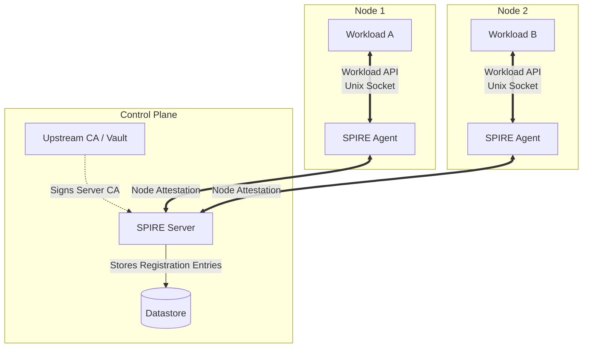

# Workload Identity with SPIFFE/SPIRE

Cloud provider environments solve the "how does workload A authenticate to database B" problem using metadata APIs and managed IAM roles (e.g., AWS IRSA, GCP Workload Identity). On bare metal, these mechanisms do not exist. Traditional on-premises solutions rely on network boundaries (IP allowlists) or static, long-lived shared secrets (passwords, tokens). Both approaches violate zero-trust principles and create significant operational overhead for secret rotation.

Secure Production Identity Framework for Everyone (SPIFFE) provides a standard for identifying and securing communications between web services. SPIRE (the SPIFFE Runtime Environment) is the production-grade implementation of this standard. Together, they issue short-lived, automatically rotated cryptographic identities (X.509 certificates or JWTs) to workloads based on runtime attestation, rather than static configuration.

## Learning Outcomes

- Architect a highly available SPIRE deployment on bare-metal Kubernetes.
- Configure SPIRE workload and node attestation plugins for Kubernetes environments.
- Issue and validate both X.509 and JWT SPIFFE Verifiable Identity Documents (SVIDs).
- Implement trust domain federation across multiple Kubernetes clusters.
- Integrate SPIFFE identities with service meshes and secrets management systems.
- Diagnose common SPIRE agent attestation failures and certificate rotation issues.

## Understanding SPIFFE and SPIRE

SPIFFE defines three core concepts:
1. **SPIFFE ID**: A structured URI identifying a workload (e.g., `spiffe://example.org/ns/backend/sa/api-server`).
2. **SVID (SPIFFE Verifiable Identity Document)**: The cryptographic document proving the workload holds the SPIFFE ID. SVIDs come in two formats: X.509 SVIDs (for mTLS) and JWT SVIDs (for bearer token authentication).
3. **Workload API**: A local API (typically a Unix domain socket) that workloads call to retrieve their identity, trust bundles, and related secrets without requiring authentication.

SPIRE is the software that implements these concepts. It consists of a **SPIRE Server** and **SPIRE Agents**.

### SPIRE Architecture



### The Attestation Process

Identity in SPIRE is not assigned; it is attested. Attestation occurs in two phases:

#### 1. Node Attestation
The SPIRE Agent must prove its identity to the SPIRE Server. On Kubernetes, this is typically done using the `k8s_psat` (Projected Service Account Token) plugin. 
1. The Agent generates a private key and a CSR.
2. The Agent presents a projected SAT to the Server.
3. The Server validates the SAT against the Kubernetes API Server (using TokenReview).
4. If valid, the Server signs the Agent's CSR and returns an agent SVID.

#### 2. Workload Attestation
The workload must prove its identity to the local SPIRE Agent. On Kubernetes, this utilizes the `k8s` workload attestation plugin.
1. The Workload connects to the Agent's Workload API (Unix Domain Socket).
2. The Agent inspects the connection to determine the workload's PID.
3. The Agent uses the PID to discover the cgroup and container ID.
4. The Agent queries the local Kubelet to find the Pod metadata (namespace, ServiceAccount, labels, annotations) associated with that container.
5. The Agent matches this metadata against **Registration Entries** synced from the Server.
6. If a match is found, the Agent mints an SVID and returns it to the Workload.

:::caution
Workload attestation relies on the OS-level properties of the connection (PID) mapping to Kubernetes primitives (Pod, Container). Host PID namespaces (`hostPID: true`) can break this mapping and allow workload spoofing. Restrict `hostPID` via Pod Security Standards.
:::

## SVID Formats: X.509 vs JWT

SPIRE can issue both X.509 certificates and JSON Web Tokens. Choosing the right format is critical for architectural security.

| Feature | X.509 SVID | JWT SVID |
| :--- | :--- | :--- |
| **Primary Use Case** | Mutual TLS (mTLS) for transport security. | Application-level authentication (Bearer tokens). |
| **Replay Protection** | High. Tied to the TLS session. | Low. Bearer tokens can be intercepted and replayed if not sent over TLS. |
| **Audience Scoping** | No. Valid for any verifier in the trust domain. | Yes. Must be scoped to a specific `aud` (audience) to limit blast radius. |
| **Validation** | Standard TLS libraries. | Requires fetching the OIDC discovery document or OIDC federation keys. |
| **Recommendation** | **Default choice**. Use wherever possible. | Use only when L7 proxies/gateways require it, or legacy apps cannot do mTLS. |

:::tip
Never transmit a JWT SVID over an unencrypted channel. Because JWT SVIDs are bearer tokens, an intercepted JWT can be used by an attacker to impersonate the workload until the token expires.
:::

## Configuring Attestation on Kubernetes

A robust SPIRE deployment on Kubernetes requires configuring specific plugins for the Server and Agent.

### Server Configuration (k8s_psat)

The Server must validate the Agent's projected ServiceAccount token.

```hcl
NodeAttestor "k8s_psat" {
  plugin_data {
    clusters = {
      "on-prem-cluster-01" = {
        # The service account that the SPIRE Server runs as
        # needs permissions to perform TokenReviews.
        service_account_allow_list = ["spire:spire-agent"]
      }
    }
  }
}
```

### Agent Configuration (k8s)

The Agent needs to talk to the local Kubelet to identify workloads. This requires mounting the Kubelet's read-only port or using the secure Kubelet API.

```hcl
WorkloadAttestor "k8s" {
  plugin_data {
    # Node name must match the Kubernetes node name
    node_name_env = "MY_NODE_NAME"
    
    # How the agent verifies the kubelet identity
    kubelet_ca_path = "/var/run/secrets/kubernetes.io/serviceaccount/ca.crt"
    skip_kubelet_verification = false
  }
}
```

## Registration Entries and Selectors

Registration entries map attested properties (selectors) to a SPIFFE ID. On Kubernetes, selectors take the form of `k8s:<property>:<value>`.

To grant a SPIFFE ID to a workload, you create a registration entry on the SPIRE Server. 

Example: Assign `spiffe://example.org/ns/backend/sa/payments` to any Pod in the `backend` namespace using the `payments` ServiceAccount.

```bash
spire-server entry create \
    -spiffeID spiffe://example.org/ns/backend/sa/payments \
    -parentID spiffe://example.org/spire/agent/k8s_psat/on-prem-cluster-01/$(NODE_NAME) \
    -selector k8s:ns:backend \
    -selector k8s:sa:payments
```

### Kubernetes Controller Integration

Manually creating entries via the CLI is an anti-pattern. The **SPIRE Kubernetes Workload Registrar** (often deployed as a sidecar to the SPIRE Server or as a standalone operator) automates this. It watches Pods or custom resources and automatically generates registration entries based on CRDs (e.g., `SpiffeID` custom resources) or namespace/SA conventions.

## Trust Domain Federation

Large organizations often operate multiple Kubernetes clusters, each acting as its own failure domain. Using a single SPIRE Server across all clusters creates a massive blast radius and introduces unacceptable latency for attestation.

The solution is **Federation**. Each cluster runs its own SPIRE Server and defines its own Trust Domain (e.g., `cluster01.spiffe.local` and `cluster02.spiffe.local`). 

Federation allows SPIRE Servers to securely exchange public key material (trust bundles) over an authenticated endpoint. Once federated, a workload in Cluster A can validate an X.509 SVID presented by a workload in Cluster B.

### Configuring Federation

1. **Expose the Federation Endpoint**: Both SPIRE Servers must expose a Federation API (SPIFFE Federation endpoint) using an external load balancer or Ingress.
2. **Define FederatesWith**: Configure the Server to pull trust bundles from the remote domain.

```hcl
# Server Configuration Snippet
federation {
  bundle_endpoint {
    address = "0.0.0.0"
    port = 8443
  }
  federates_with "cluster02.spiffe.local" {
    bundle_endpoint_url = "https://spire.cluster02.internal:8443"
    bundle_endpoint_profile "https_spiffe" {
      endpoint_spiffe_id = "spiffe://cluster02.spiffe.local/spire/server"
    }
  }
}
```

## Integration Patterns

SPIFFE is useless unless workloads actually consume the identities. There are three primary integration patterns.

### 1. Native Integration
The application code directly imports a SPIFFE library (e.g., `go-spiffe`, `java-spiffe`). The app connects to the Workload API, retrieves the SVID and trust bundle, and uses them to configure its own TLS listeners and clients.
- **Pros**: Zero overhead, end-to-end encryption deep into the app space.
- **Cons**: Requires modifying application code. Unfeasible for legacy apps or third-party COTS software.

### 2. Sidecar Proxy (Service Mesh)
A proxy (like Envoy) runs as a sidecar. The proxy connects to the Workload API via the Secret Discovery Service (SDS) protocol, fetches the SVID, and handles all mTLS termination and initiation on behalf of the application.
- **Pros**: Transparent to the application. Standardized observability and policy enforcement.
- **Cons**: Latency overhead of the proxy. Resource consumption (CPU/RAM per Pod).

### 3. Init Container / Helper
For applications that just need a configuration file on disk (like a database expecting a `cert.pem` and `key.pem`), tools like `spiffe-helper` run alongside the application. They connect to the Workload API, write the SVIDs to a shared memory volume (`emptyDir`), and send a signal (SIGHUP) to the application to reload the files when rotation occurs.
- **Pros**: Works with legacy apps that support TLS but not dynamic rotation via an API.
- **Cons**: The application must support hot-reloading certificates from disk without dropping connections.

:::note
When using sidecars or helpers, ensure the Workload API Unix socket is mounted into the container. This is typically done via a CSI driver (`spiffe-csi-driver`) which handles mounting the socket dynamically without requiring hostPath mounts (which are a security risk).
:::

## Hands-on Lab

In this lab, we will deploy SPIRE Server and Agent, use the CSI driver to expose the Workload API, and test workload attestation using an Envoy proxy sidecar.

### Prerequisites
- A running Kubernetes cluster (e.g., `kind create cluster`).
- `kubectl` and `helm` installed.
- Ensure the cluster is running Kubernetes 1.32+.

### Step 1: Deploy the SPIRE Helm Chart

We will use the official SPIRE Helm charts to deploy the Server, Agent, and CSI driver.

```bash
# Add the SPIRE helm repository
helm repo add spiffe https://spiffe.github.io/helm-charts-hardened/
helm repo update

# Create a namespace for SPIRE
kubectl create namespace spire

# Install SPIRE CRDs
helm upgrade --install spire-crds spiffe/spire-crds -n spire --wait

# Install SPIRE with the CSI driver enabled
helm upgrade --install spire spiffe/spire -n spire \
  --set global.spire.trustDomain="dojo.local" \
  --set spiffe-csi-driver.enabled=true \
  --set spire-agent.socketPath="/spire-agent-socket/spire-agent.sock" \
  --wait
```

### Step 2: Verify SPIRE Infrastructure

Ensure the Server and Agents are running.

```bash
kubectl get pods -n spire
# Expected output:
# NAME                             READY   STATUS    RESTARTS   AGE
# spire-server-0                   2/2     Running   0          2m
# spire-spire-agent-xyz            3/3     Running   0          2m
# spire-spiffe-csi-driver-xyz      2/2     Running   0          2m
```

Check the Server logs to verify the Agent successfully attested.

```bash
kubectl logs statefulset/spire-server -n spire -c spire-server | grep "Node attestation request completed"
# You should see logs indicating a successful 'k8s_psat' attestation.
```

### Step 3: Create a Registration Entry

We will create a ControllerRegistration to automatically register a workload based on a custom `ClusterSPIFFEID` CRD. The Helm chart installed the SPIRE Controller Manager which handles this.

Create a `ClusterSPIFFEID` that assigns an identity to any Pod in the `default` namespace using the `backend-sa` ServiceAccount.

```yaml
# workload-identity.yaml
apiVersion: spire.spiffe.io/v1alpha1
kind: ClusterSPIFFEID
metadata:
  name: backend-identity
spec:
  spiffeIDTemplate: "spiffe://dojo.local/ns/{{ .PodMeta.Namespace }}/sa/{{ .PodMeta.ServiceAccountName }}"
  podSelector:
    matchLabels:
      app: backend
---
apiVersion: v1
kind: ServiceAccount
metadata:
  name: backend-sa
  namespace: default
```

Apply the resources:

```bash
kubectl apply -f workload-identity.yaml
```

### Step 4: Deploy the Workload

We will deploy a simple workload and use the SPIFFE CSI driver to mount the Workload API socket. We'll run a diagnostic tool (`spire-agent api fetch`) within the pod to verify it can retrieve its identity.

```yaml
# backend-pod.yaml
apiVersion: v1
kind: Pod
metadata:
  name: backend
  namespace: default
  labels:
    app: backend
spec:
  serviceAccountName: backend-sa
  containers:
  - name: workload
    image: ghcr.io/spiffe/spire-agent:1.9.0
    command: ["/bin/sh", "-c", "sleep 3600"]
    volumeMounts:
    - name: spiffe-workload-api
      mountPath: /spiffe-workload-api
      readOnly: true
    env:
    - name: SPIFFE_ENDPOINT_SOCKET
      value: unix:///spiffe-workload-api/spire-agent.sock
  volumes:
  - name: spiffe-workload-api
    csi:
      driver: "csi.spiffe.io"
      readOnly: true
```

Apply the Pod:

```bash
kubectl apply -f backend-pod.yaml
kubectl wait --for=condition=Ready pod/backend --timeout=60s
```

### Step 5: Verify Attestation

Exec into the Pod and query the Workload API for the SVID.

```bash
kubectl exec -it backend -- /opt/spire/bin/spire-agent api fetch x509 -socketPath /spiffe-workload-api/spire-agent.sock
```

**Expected Output:**
```text
Received 1 svid after 12.5ms

SPIFFE ID:              spiffe://dojo.local/ns/default/sa/backend-sa
SVID Valid After:       2026-04-12 10:00:00 +0000 UTC
SVID Valid Until:       2026-04-12 11:00:00 +0000 UTC
Intermediate Chained:   false
CA #1 Valid After:      2026-04-10 00:00:00 +0000 UTC
CA #1 Valid Until:      2026-04-17 00:00:00 +0000 UTC
```

If the Workload API returns `no identity issued`, the attestation failed. Check the `spire-agent` logs on the node where the Pod is running. Common causes are missing labels, incorrect ServiceAccount names, or delays in the Controller Manager syncing the registration entry.

## Practitioner Gotchas

### 1. The "HostPID" Bypass
**Context**: Workload attestation relies on the kernel PID to map a socket connection to a specific container and its associated metadata.
**The Fix**: If a pod runs with `hostPID: true`, it can masquerade as other processes on the node. A malicious workload could connect to the Workload API, claim the PID of a highly privileged workload, and steal its SVID. You **must** block `hostPID` using admission controllers (Kyverno, OPA Gatekeeper, or Kubernetes Pod Security Admission) across all namespaces.

### 2. Upstream CA Rotation Failures
**Context**: SPIRE Server acts as an intermediate CA, but it often relies on an upstream CA (like HashiCorp Vault or AWS ACM Private CA) to sign its own certificate. 
**The Fix**: If the plugin configuration connecting SPIRE to the Upstream CA is fragile (e.g., Vault token expires without a renewal sidecar), SPIRE Server will silently fail to rotate its own CA certificate. When the CA expires, all agent attestation drops, and the entire mesh collapses. Always configure alerting on the SPIRE Server metric `spire_server_ca_cert_expiry_seconds`.

### 3. Agent Sync Latency at Scale
**Context**: At massive scale (thousands of nodes, tens of thousands of pods), the time it takes for a new registration entry to propagate from the SPIRE Server to the specific SPIRE Agent can lag.
**The Fix**: If a pod starts up and immediately requests its SVID before the Agent has received the entry from the Server, it will fail. Workloads must implement retry logic when querying the Workload API. Alternatively, use Init Containers to block the main application startup until the SVID is successfully fetched.

### 4. CSI Driver Socket Exists but Unresponsive
**Context**: You delete and recreate the SPIRE Agent DaemonSet. Existing pods suddenly start failing SVID rotation.
**The Fix**: The CSI driver mounts a Unix domain socket into the workload. If the agent restarts and recreates that socket on the host, the inode changes. The workload's mount still points to the old, dead inode. Use the official `spiffe-csi-driver` which handles socket lifecycle correctly, rather than relying on raw `hostPath` volume mounts which suffer from this inode detachment problem.

## Quiz

**1. You are deploying a legacy COTS (Commercial Off-The-Shelf) application that supports mTLS but cannot make API calls to fetch certificates dynamically. It only reads `cert.pem` and `key.pem` from disk on startup. How should you integrate this application with SPIRE?**
- A) Deploy Envoy as a sidecar to handle mTLS transparently so the application doesn't need certificates.
- B) Modify the application's startup script to curl the SPIRE Server API and write the certs to disk.
- C) Use the `spiffe-helper` utility as a sidecar to fetch the SVIDs, write them to a shared `emptyDir`, and signal the application to reload.
- D) Expose the SPIRE Server via a NodePort and configure the application to mount the server's data volume directly.

<details>
<summary>Answer</summary>
**C**. `spiffe-helper` is explicitly designed for this use case. It acts as a bridge between the dynamic Workload API and static file-based configuration expected by legacy apps. Envoy (A) is an option but introduces a full proxy overhead which might be overkill if the app already supports mTLS.
</details>

**2. A security audit flags that your SPIRE deployment is vulnerable to workload spoofing because a compromised container could request the SVID of a different container on the same node. Which Kubernetes configuration is the root cause of this vulnerability?**
- A) The SPIRE Agent is running with `hostNetwork: true`.
- B) Workload pods are allowed to run with `hostPID: true`.
- C) The CSI Driver is not using read-only mounts.
- D) The `k8s_psat` node attestation plugin is using a weak JWT signature algorithm.

<details>
<summary>Answer</summary>
**B**. Workload attestation maps the socket connection's PID to the container's metadata. If `hostPID: true` is allowed, a container shares the host's PID namespace and can spoof the PID of other processes, tricking the agent into issuing the wrong SVID.
</details>

**3. You are designing a multi-cluster architecture spanning three bare-metal datacenters. You want workloads in Datacenter A to securely authenticate workloads in Datacenter B. Which architecture is most resilient and adheres to SPIFFE best practices?**
- A) Deploy a single, centralized SPIRE Server in Datacenter A and run SPIRE Agents in all three datacenters connected over a VPN.
- B) Deploy separate SPIRE Servers in each datacenter, define unique Trust Domains, and configure SPIFFE Federation between the servers.
- C) Use identical Upstream Root CAs in all three datacenters and hardcode the SPIFFE IDs without federation.
- D) Replicate the SPIRE Server SQL database across all three datacenters to ensure agents always have the same registration entries.

<details>
<summary>Answer</summary>
**B**. Federation is the correct approach for multi-cluster environments. It limits the blast radius (each cluster is its own failure domain) and reduces latency by keeping attestation local, while still allowing cross-cluster trust via trust bundle exchange.
</details>

**4. When writing a registration entry for a new microservice, which selector combination provides the strongest, most deterministic identity binding in a Kubernetes environment?**
- A) `k8s:ns:production` and `k8s:pod-name:payment-service-abcde`
- B) `k8s:container-image:nginx:latest`
- C) `k8s:ns:production` and `k8s:sa:payment-service`
- D) `k8s:node-name:worker-01`

<details>
<summary>Answer</summary>
**C**. Binding to Namespace and ServiceAccount is the Kubernetes best practice. Pod names (A) are ephemeral and change on every deployment. Images (B) are too broad and can be reused. Node names (D) tie identity to infrastructure, breaking workload mobility. ServiceAccounts provide stable, workload-specific identity primitives.
</details>

**5. Why is it critically dangerous to transmit a SPIFFE JWT SVID over an unencrypted HTTP connection?**
- A) JWT SVIDs contain the private key material embedded in the payload.
- B) JWT SVIDs are bearer tokens; if intercepted, the attacker can replay them to impersonate the workload.
- C) The SPIRE Agent will revoke the JWT if it detects unencrypted transit.
- D) The JWT signature cannot be validated unless the connection uses TLS.

<details>
<summary>Answer</summary>
**B**. Unlike X.509 SVIDs which are cryptographically bound to the TLS session's private key, JWTs are bearer tokens. Anyone holding the token can use it until it expires.
</details>

## Further Reading

- [SPIFFE Concepts (Official Documentation)](https://spiffe.io/docs/latest/spiffe-about/spiffe-concepts/)
- [SPIRE Architecture and Design](https://spiffe.io/docs/latest/architecture/)
- [SPIFFE Federation Deep Dive](https://spiffe.io/docs/latest/architecture/federation/readme/)
- [SPIRE Kubernetes Workload Registrar](https://github.com/spiffe/spire-controller-manager)
- [Zero Trust with SPIFFE and Envoy](https://blog.envoyproxy.io/securing-a-service-mesh-with-spire-8e3b08e24430) (Envoy Official Blog)