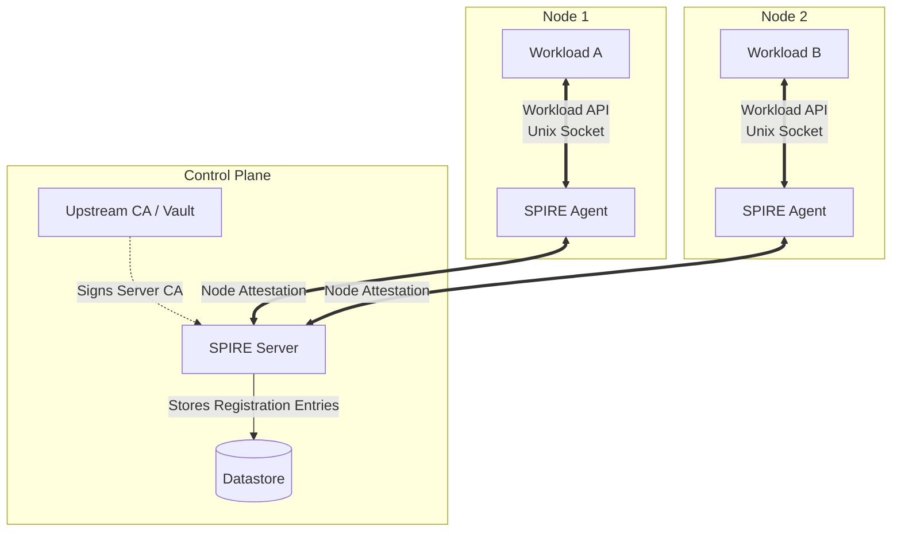
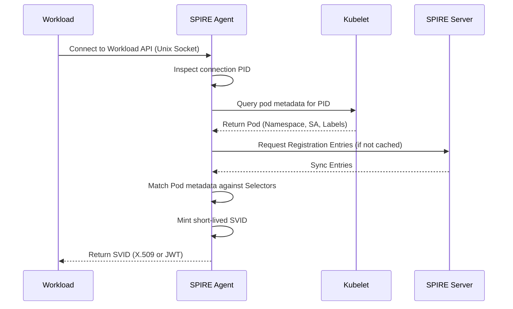

# Workload Identity with SPIFFE/SPIRE

## Why This Module Matters

In 2019, a massive data breach hit Capital One, exposing the personal information of over 100 million customers and resulting in a $190 million settlement. While the initial vector was a Server-Side Request Forgery (SSRF) vulnerability in a Web Application Firewall, the true catastrophe occurred because of how workload identity was handled in the cloud environment. The WAF was assigned a static, over-permissive Identity and Access Management (IAM) role. Once the attacker compromised the WAF, they simply queried the local cloud metadata service (the notorious `169.254.169.254` endpoint) to extract the static credentials associated with that role. They then used those credentials to drain thousands of S3 buckets. This pattern—relying on static, long-lived credentials bound to infrastructure rather than dynamically verifying the workload itself—is the root cause of countless catastrophic breaches in modern infrastructure.

On bare metal and on-premises environments, the situation is historically even worse. Without a cloud metadata service to provide even a baseline level of identity, organizations resort to distributing static tokens, long-lived API keys, or embedded database passwords directly to workloads. These secrets are often stored in configuration files, committed to version control, or passed as environment variables. Not only does this violate zero-trust principles, but it also creates an operational nightmare for secret rotation. When a credential is compromised, operators must manually identify every workload using it, update the secret, and restart the applications—a process so risky and slow that many organizations simply never rotate their secrets at all.

When you scale this problem to thousands of microservices across multiple bare-metal datacenters, the web of static secrets becomes impossible to manage safely. Attackers know this, which is why lateral movement on bare metal is typically accomplished by scraping configuration files for database passwords and API tokens. If an attacker breaches a frontend container, they will immediately look for environment variables containing backend credentials. SPIFFE and SPIRE fundamentally alter this paradigm by shifting from static, assigned secrets to dynamic, cryptographically attested identities. By implementing the standards taught in this module, you will eliminate the need for application-level secrets for authentication. Workloads will automatically prove their identity at runtime, receive short-lived certificates that rotate seamlessly, and establish mutually authenticated, encrypted connections. This ensures that even if a network boundary is breached or a container is compromised, the blast radius is cryptographically contained.

## Learning Outcomes

- **Design** a highly available SPIRE architecture across bare-metal environments, evaluating datastore backends and upstream certificate authorities.
- **Implement** workload and node attestation workflows using the Kubernetes Projected Service Account Token (PSAT) and core workload plugins.
- **Compare and evaluate** X.509 and JWT SPIFFE Verifiable Identity Document (SVID) profiles to select the optimal identity mechanism for transport versus application-layer security.
- **Diagnose** complex attestation failures, addressing race conditions, node selector misconfigurations, and kernel PID namespace bypasses.
- **Evaluate** federation strategies to implement trust domains across multiple isolated Kubernetes clusters, facilitating secure cross-boundary communication.

## Understanding SPIFFE and SPIRE

SPIFFE (Secure Production Identity Framework for Everyone) is an open-source standard for securely identifying software systems in dynamic and heterogeneous environments. It provides a universal identity control plane, standardizing how identities are issued, requested, and consumed. SPIFFE is a CNCF project that moved to Incubating on 2020-06-22 and to Graduated on 2022-08-23. The framework itself does not issue identities; rather, it provides the specifications that any compliant provider must implement. This decoupling of the specification from the implementation allows for a vast ecosystem of tools to integrate securely without being locked into a single vendor's proprietary identity service.

SPIRE (the SPIFFE Runtime Environment) is the most widely adopted implementation of the SPIFFE standard. SPIRE is described as a production-ready implementation of the SPIFFE APIs that performs node and workload attestation to issue and verify SVIDs. Like the standard it implements, SPIRE is a CNCF project that moved to Incubating on 2020-06-22 and to Graduated on 2022-08-22.

*Note on historical records: The exact SPIRE graduation date in August 2022 is inconsistent across official CNCF sources. There is no single agreed day; the SPIRE project page lists 2022-08-22, while the SPIFFE project page lists 2022-08-23. The industry universally recognizes its graduated, production-ready status regardless of the single-day discrepancy.*

To ensure production security, operators must stay aligned with the latest releases and security patches. The current SPIRE release tracked in SPIRE docs and GitHub releases is version 1.14.5. 

Security is a moving target, and identity control planes are high-value targets for attackers. SPIRE version 1.14.5 was released on 2026-04-08 and upgrades Go to 1.26.2 to address CVE-2026-32282, CVE-2026-32289, CVE-2026-33810, CVE-2026-27144, CVE-2026-27143, CVE-2026-32288, CVE-2026-32283, and CVE-2026-27140. This upgrade effectively mitigates critical supply-chain vulnerabilities within the underlying Go runtime. Furthermore, SPIRE version 1.14.5 publishes Linux amd64-musl, Linux arm64-musl, and Windows amd64 distribution assets, ensuring broad compatibility across heterogeneous environments and enabling operators to deploy SPIRE consistently across mixed architectures.

### SPIFFE IDs and SVIDs

A core concept of the standard is the SPIFFE ID. A SPIFFE ID is an RFC 3986 URI using the `spiffe` scheme, with a trust domain and path, and must follow host/path constraints. An example SPIFFE ID might look like `spiffe://dojo.local/ns/backend/sa/payments`. This URI forms the canonical name of the workload throughout the entire mesh. It removes the ambiguity of IP addresses and DNS names, which are ephemeral and easily spoofed. A trust domain (such as `dojo.local`) represents the cryptographic boundary of the environment, while the path represents the specific entity within that boundary.

When a workload successfully proves its identity, it receives a SPIFFE Verifiable Identity Document (SVID). SPIFFE interoperability requires supporting X.509-SVID and JWT-SVID document forms. The SPIFFE Workload API defines two profiles—X.509-SVID and JWT-SVID—and both profiles are mandatory for SPIFFE implementations. A compliant agent must be capable of issuing both formats depending on the workload's specific request.

The SPIFFE Workload Endpoint is expected to be local (preferably Unix domain socket, optionally TCP with stronger local-auth assumptions), and is exposed via local clients over gRPC. SPIFFE clients discover the Workload Endpoint via explicit socket configuration or `SPIFFE_ENDPOINT_SOCKET`, with URI forms for `unix://` and `tcp://`. The locality of the endpoint is a critical security feature: by requiring the workload to communicate with a local agent over a Unix domain socket, SPIRE ensures that network-based interception or remote spoofing of the attestation handshake is fundamentally impossible.

## SPIRE Architecture

A SPIRE deployment is composed of a SPIRE Server and one or more SPIRE Agents. This distributed architecture ensures that identity issuance is robust, highly available, and logically segregated from the workloads that consume those identities. 

SPIRE Server is responsible for registration entries, signing keys, node attestation, and issuing SVIDs, while SPIRE Agent runs on nodes with workloads, requests/caches SVIDs, exposes the Workload API, and attests calling workloads. The Server acts as the centralized brain of the identity plane, holding the master catalog of all authorized identities, while the Agents act as the distributed enforcers at the edge, performing the actual interrogations of the running processes.

To adapt to different environments, SPIRE utilizes a deeply pluggable architecture. SPIRE Server plugin support includes node attestors, datastore, key manager, and upstream authority plugins, with a built-in datastore supporting MySQL, SQLite 3, or PostgresSQL and defaulting to SQLite 3. While SQLite 3 is sufficient for quickstarts and small test clusters, enterprise deployments must utilize PostgresSQL or MySQL for high availability and to handle concurrent attestation requests at massive scale. Upstream authority plugins allow the SPIRE Server to chain its own Root CA to an external enterprise Public Key Infrastructure (PKI), such as HashiCorp Vault or AWS Certificate Manager, ensuring that SPIFFE identities are cryptographically trusted by legacy systems outside the immediate mesh.



> **Pause and predict**: If the upstream CA becomes completely unreachable, what will happen to the SPIRE Server's ability to issue SVIDs over the next 24 hours? Consider the lifecycle of intermediate certificates and how frequently they are rotated.

## The Attestation Process

Identity in SPIRE is not statically assigned; it is dynamically attested at runtime based on verifiable properties. This is a massive departure from legacy systems where an administrator simply hands a password to an application. Attestation occurs in two distinct, sequential phases: Node Attestation and Workload Attestation.

### 1. Node Attestation

Before an Agent can issue identities to local applications, it must prove its own identity to the Server. The Agent needs to cryptographically verify the physical or virtual hardware it resides on. SPIRE supports node attestors for AWS (EC2 Identity Document), Azure managed service identities, GCE instance tokens, Kubernetes Service Account tokens, and join-token fallback where tokens expire immediately after use. On Kubernetes environments, the Server must validate the Agent's projected ServiceAccount token using the `k8s_psat` plugin.

```hcl
NodeAttestor "k8s_psat" {
  plugin_data {
    clusters = {
      "on-prem-cluster-01" = {
        # The service account that the SPIRE Server runs as
        # needs permissions to perform TokenReviews.
        service_account_allow_list = ["spire:spire-agent"]
      }
    }
  }
}
```

The node attestation flow typically involves the following steps:
1. The Agent generates a private key and a Certificate Signing Request (CSR).
2. The Agent presents a projected SAT to the Server over a mutually authenticated connection.
3. The Server validates the SAT against the Kubernetes API Server (using TokenReview).
4. If the Kubernetes API Server confirms the token is valid, the Server signs the Agent's CSR and returns an agent SVID, which the Agent uses to authenticate all future communications with the Server.

### 2. Workload Attestation

Once the node is verified and the Agent has its own SVID, workloads running on that node can request identities. Workload attestation is performed by the SPIRE Agent on the node and can use process attributes such as Kubernetes namespace/service account selectors.

```hcl
WorkloadAttestor "k8s" {
  plugin_data {
    # Node name must match the Kubernetes node name
    node_name_env = "MY_NODE_NAME"
    
    # How the agent verifies the kubelet identity
    kubelet_ca_path = "/var/run/secrets/kubernetes.io/serviceaccount/ca.crt"
    skip_kubelet_verification = false
  }
}
```

The workload attestation flow typically involves a meticulous process of interrogating the operating system kernel and the container runtime to verify the caller:
1. The Workload connects to the Agent's Workload API (Unix Domain Socket).
2. The Agent inspects the connection to determine the workload's OS-level PID.
3. The Agent uses the PID to discover the cgroup and container ID from the kernel.
4. The Agent queries the Kubelet to find the Pod metadata (namespace, ServiceAccount, labels) corresponding to that container ID.
5. The Agent matches this metadata against **Registration Entries** synced from the Server.
6. If a match is found, the Agent mints a short-lived SVID and returns it to the Workload.



## SVID Formats: X.509 vs JWT

Choosing the correct SVID format is critical for architectural security. While X.509 certificates are generally preferred due to their cryptographic binding to the TLS session, JWTs are sometimes necessary for L7 routing and legacy API gateways.

| Feature | X.509 SVID | JWT SVID |
| :--- | :--- | :--- |
| **Primary Use Case** | Mutual TLS (mTLS) for transport security. | Application-level authentication (Bearer tokens). |
| **Replay Protection** | High. Tied to the TLS session. | Low. Bearer tokens can be intercepted and replayed if not sent over TLS. |
| **Audience Scoping** | No. Valid for any verifier in the trust domain. | Yes. Must be scoped to a specific `aud` (audience) to limit blast radius. |
| **Validation** | Standard TLS libraries. | Requires fetching the OIDC discovery document or OIDC federation keys. |
| **Recommendation** | **Default choice**. Use wherever possible. | Use only when L7 proxies/gateways require it, or legacy apps cannot do mTLS. |

> **Stop and think**: Why must a JWT SVID always be accompanied by strict audience (`aud`) scoping, whereas an X.509 SVID typically does not require it? Think about bearer semantics versus proof-of-possession. An intercepted bearer token can be replayed anywhere, whereas an intercepted X.509 certificate cannot be used without the corresponding private key.

## Registration Entries and Selectors

A registration entry forms the core authorization rule in SPIRE. A registration entry consists of a SPIFFE ID, selectors, and a parent ID. These entries define exactly what verifiable attributes a process must possess to be granted a specific identity. 

A registration entry may use either node selectors or workload selectors, but not both. This strict separation prevents logical errors where an administrator accidentally ties a workload identity to a specific piece of infrastructure, breaking workload mobility. You must explicitly separate the node authorization layer from the application authorization layer.

On Kubernetes, selectors take the form of `k8s:<property>:<value>`. When defining workload selectors, always bind identities to Namespaces and ServiceAccounts (`k8s:ns` and `k8s:sa`). Avoid binding to Pod names (which are ephemeral and change on every deployment) or container images (which are too broad and reusable across entirely different services). ServiceAccounts are stable, immutable (unless explicitly deleted), and scoped to a specific workload's operational purpose.

```bash
spire-server entry create \
    -spiffeID spiffe://example.org/ns/backend/sa/payments \
    -parentID spiffe://example.org/spire/agent/k8s_psat/on-prem-cluster-01/$(NODE_NAME) \
    -selector k8s:ns:backend \
    -selector k8s:sa:payments
```

### Kubernetes Controller Integration

Manually creating entries via the CLI is an anti-pattern. The **SPIRE Kubernetes Workload Registrar** (often deployed as a sidecar to the SPIRE Server or as a standalone operator) automates this process. It watches Pods or custom resources and automatically generates registration entries based on CRDs (like `ClusterSPIFFEID`) or organizational namespace/SA conventions.

## Trust Domain Federation

Large organizations often operate multiple Kubernetes clusters, each acting as its own failure domain. Using a single SPIRE Server across all clusters creates a massive blast radius, introduces unacceptable latency for attestation, and effectively couples disparate infrastructure into a single point of operational failure. 

The solution is Federation. Each cluster runs its own SPIRE Server and defines its own Trust Domain (e.g., `cluster01.spiffe.local` and `cluster02.spiffe.local`). Federation allows SPIRE Servers to securely exchange public key material (trust bundles) over an authenticated endpoint. Once federated, a workload in Cluster A can cryptographically validate an X.509 SVID presented by a workload in Cluster B without the two servers sharing any private signing keys.

### Configuring Federation

To establish a federation relationship, both SPIRE Servers must expose a Federation API (SPIFFE Federation endpoint) using an external load balancer, NodePort, or Ingress. You then configure the Server to actively pull trust bundles from the remote domain using the `federates_with` configuration block.

```hcl
# Server Configuration Snippet
federation {
  bundle_endpoint {
    address = "0.0.0.0"
    port = 8443
  }
  federates_with "cluster02.spiffe.local" {
    bundle_endpoint_url = "https://spire.cluster02.example.com:8443"
    bundle_endpoint_profile "https_spiffe" {
      endpoint_spiffe_id = "spiffe://cluster02.spiffe.local/spire/server"
    }
  }
}
```

## Integration Patterns

SPIFFE identity issuance is only half the battle. The identities are useless unless workloads actually consume them effectively to encrypt transit and authorize access. There are three primary integration patterns in modern infrastructure.

### 1. Native Integration
The application code directly imports a SPIFFE library (e.g., `go-spiffe`, `java-spiffe`). The app connects to the Workload API, retrieves the SVID and trust bundle directly into memory, and uses them to configure its own TLS listeners and HTTP clients.
- **Pros**: Zero proxy overhead, end-to-end encryption extending deep into the application memory space.
- **Cons**: Requires modifying application code. Unfeasible for legacy apps or third-party COTS software.

### 2. Sidecar Proxy (Service Mesh)
A proxy (like Envoy) runs as a sidecar alongside the application container. The proxy connects to the Workload API via the Secret Discovery Service (SDS) protocol, fetches the SVID, and handles all mTLS termination and initiation transparently on behalf of the application.
- **Pros**: Transparent to the application. Standardized observability and unified policy enforcement.
- **Cons**: Latency overhead of the proxy hop. Significant resource consumption (CPU/RAM per Pod) when deployed at massive scale.

### 3. Init Container / Helper Utility
For applications that just need static configuration files on disk (like an on-prem database expecting to find `cert.pem` and `key.pem` on startup), tools like `spiffe-helper` run alongside the application. They connect to the Workload API, write the SVIDs to a shared memory volume, and send a signal (like SIGHUP) to the application to trigger a reload.
- **Pros**: Works with legacy apps that support TLS but not dynamic rotation via an API.
- **Cons**: The application must actively support hot-reloading certificates from disk without dropping active client connections.

## Did You Know?

1. SPIFFE is a CNCF project that moved to Incubating on 2020-06-22 and to Graduated on 2022-08-23.
2. The SPIFFE Workload API mandates support for both X.509 and JWT profiles to ensure absolute interoperability across diverse ecosystems.
3. The default SPIRE datastore is SQLite 3, which is sufficient for simple deployments but should be upgraded to PostgreSQL for production environments to handle high concurrency.
4. SPIRE version 1.14.5 addresses 8 critical CVEs by updating its underlying Go runtime to version 1.26.2, protecting against severe supply-chain attacks.

## Common Mistakes

| Mistake | Why it happens | Fix |
| :--- | :--- | :--- |
| **Running pods with `hostPID: true`** | The pod shares the host's PID namespace, allowing it to inspect other processes' metadata. A malicious workload can connect to the Workload API and spoof another process's PID to claim its SVID. | Block `hostPID` via Pod Security Standards cluster-wide. |
| **Mixing selector types** | A registration entry may use either node selectors or workload selectors, but not both. Combining them violates the specification. | Create distinct registration entries linked via a parent ID. |
| **Ignoring Upstream CA rotation** | If the upstream CA connection fails, SPIRE Server silently stops rotating its own CA certificate, leading to a catastrophic mesh failure. | Monitor and alert on the `spire_server_ca_cert_expiry_seconds` metric. |
| **Transmitting JWT SVIDs unencrypted** | JWT SVIDs are bearer tokens. Interception on the network allows full, unmitigated impersonation by an attacker. | Always encapsulate JWT SVIDs within a mutually authenticated TLS tunnel. |
| **Hardcoding API socket paths** | CSI drivers may mount sockets to unexpected paths across updates, breaking workloads that hardcode `/tmp/agent.sock`. | Use the `SPIFFE_ENDPOINT_SOCKET` environment variable dynamically within application containers. |
| **Using `hostPath` for the Workload API** | Restarting the DaemonSet changes the socket inode on the host, silently detaching running workloads from the new API endpoint. | Utilize the official `spiffe-csi-driver` for proper socket lifecycle management and mount propagation. |

## Practitioner Gotchas

**Context**: At massive scale (thousands of nodes, tens of thousands of pods), the time it takes for a new registration entry to propagate from the SPIRE Server to the local agent can cause early pod startup failures. The SPIRE architecture prioritizes eventual consistency over immediate synchronous blocking.

**The Fix**: If a pod starts up and immediately requests its SVID before the Agent has received the corresponding entry from the Server, it will fail to attest. Workloads must implement robust retry logic when querying the Workload API. Alternatively, operators should use Init Containers to block the main application startup until the SVID is successfully fetched, ensuring the application never boots into a degraded state.

## Hands-on Exercise

Ensure the cluster is running a compatible Kubernetes version. Note that the SPIRE Kubernetes quickstart has been tested with Kubernetes versions 1.29 through 1.34, but it is fully functional on Kubernetes version 1.35. In this lab, we will manually deploy SPIRE Server and Agent, use the CSI driver to safely expose the Workload API, and test workload attestation. We assume your cluster is running Kubernetes `v1.35`.

### Task 1: Deploy SPIRE Infrastructure
Deploy the official SPIRE Helm charts to provision the Server, Agent, and CSI driver. That quickstart deploys SPIRE Server as a StatefulSet and SPIRE Agent as a DaemonSet in Kubernetes.

<details>
<summary>Solution: Task 1</summary>

```bash
# Add the SPIRE helm repository
helm repo add spiffe https://spiffe.github.io/helm-charts-hardened/
helm repo update

# Create a namespace for SPIRE
kubectl create namespace spire

# Install SPIRE CRDs
helm upgrade --install spire-crds spiffe/spire-crds -n spire --wait

# Install SPIRE with the CSI driver enabled
helm upgrade --install spire spiffe/spire -n spire \
  --set global.spire.trustDomain="dojo.local" \
  --set spiffe-csi-driver.enabled=true \
  --set spire-agent.socketPath="/spire-agent-socket/spire-agent.sock" \
  --wait
```

Verify the infrastructure is running:
```bash
kubectl get pods -n spire
# Expected output:
# NAME                             READY   STATUS    RESTARTS   AGE
# spire-server-0                   2/2     Running   0          2m
# spire-spire-agent-xyz            3/3     Running   0          2m
# spire-spiffe-csi-driver-xyz      2/2     Running   0          2m
```

Check the Server logs to ensure the Agent completed node attestation:
```bash
kubectl logs statefulset/spire-server -n spire -c spire-server | grep "Node attestation request completed"
# You should see logs indicating a successful 'k8s_psat' attestation.
```
</details>

### Task 2: Create a Registration Entry
Define the registration entry using the `ClusterSPIFFEID` custom resource, so that any pod in the default namespace labeled `app: backend` running under the `backend-sa` ServiceAccount receives an identity.

<details>
<summary>Solution: Task 2</summary>

Apply the following `ClusterSPIFFEID` definition:
```yaml
# workload-identity.yaml
apiVersion: spire.spiffe.io/v1alpha1
kind: ClusterSPIFFEID
metadata:
  name: backend-identity
spec:
  spiffeIDTemplate: "spiffe://dojo.local/ns/{{ .PodMeta.Namespace }}/sa/{{ .PodMeta.ServiceAccountName }}"
  podSelector:
    matchLabels:
      app: backend
```

And also apply the required `ServiceAccount`:
```yaml
# service-account.yaml
apiVersion: v1
kind: ServiceAccount
metadata:
  name: backend-sa
  namespace: default
```

```bash
kubectl apply -f workload-identity.yaml
kubectl apply -f service-account.yaml
```
</details>

### Task 3: Deploy the Workload
Deploy a pod that acts as the backend service. Mount the Workload API socket via the CSI driver so the pod can communicate with the local SPIRE Agent.

<details>
<summary>Solution: Task 3</summary>

Apply the following Pod definition:
```yaml
# backend-pod.yaml
apiVersion: v1
kind: Pod
metadata:
  name: backend
  namespace: default
  labels:
    app: backend
spec:
  serviceAccountName: backend-sa
  containers:
  - name: workload
    image: ghcr.io/spiffe/spire-agent:1.14.5
    command: ["/bin/sh", "-c", "sleep 3600"]
    volumeMounts:
    - name: spiffe-workload-api
      mountPath: /spiffe-workload-api
      readOnly: true
    env:
    - name: SPIFFE_ENDPOINT_SOCKET
      value: unix:///spiffe-workload-api/spire-agent.sock
  volumes:
  - name: spiffe-workload-api
    csi:
      driver: "csi.spiffe.io"
      readOnly: true
```

Wait for the pod to boot:
```bash
kubectl apply -f backend-pod.yaml
kubectl wait --for=condition=Ready pod/backend --timeout=60s
```
</details>

### Task 4: Verify Attestation
Exec into the workload pod and verify that it can successfully fetch an X.509 SVID from the SPIRE Agent. The Kubernetes quickstart verifies workload identity access through the Workload API socket path `/run/spire/sockets/agent.sock` and `spire-agent api fetch`, but here we adjust for the CSI driver's mount path.

<details>
<summary>Solution: Task 4</summary>

Execute the fetch command:
```bash
kubectl exec backend -- /opt/spire/bin/spire-agent api fetch x509 -socketPath /spiffe-workload-api/spire-agent.sock
```

**Expected Output:**
```text
Received 1 svid after 12.5ms

SPIFFE ID:              spiffe://dojo.local/ns/default/sa/backend-sa
SVID Valid After:       2026-04-12 10:00:00 +0000 UTC
SVID Valid Until:       2026-04-12 11:00:00 +0000 UTC
Intermediate Chained:   false
CA #1 Valid After:      2026-04-10 00:00:00 +0000 UTC
CA #1 Valid Until:      2026-04-17 00:00:00 +0000 UTC
```

If the Workload API returns `no identity issued`, the attestation failed. Check the `spire-agent` logs on the node where the Pod is running. Common causes are missing labels or delays in the Controller Manager syncing the registration entry.
</details>

## Quiz

<details>
<summary>Question 1</summary>

**1. You are deploying a legacy COTS (Commercial Off-The-Shelf) application that supports mTLS but cannot make API calls to fetch certificates dynamically. It only reads `cert.pem` and `key.pem` from disk on startup. How should you integrate this application with SPIRE?**
- A) Deploy Envoy as a sidecar to handle mTLS transparently so the application doesn't need certificates.
- B) Modify the application's startup script to curl the SPIRE Server API and write the certs to disk.
- C) Use the `spiffe-helper` utility as a sidecar to fetch the SVIDs, write them to a shared `emptyDir`, and signal the application to reload.
- D) Expose the SPIRE Server via a NodePort and configure the application to mount the server's data volume directly.

**Answer:**
**C**. `spiffe-helper` is explicitly designed for this use case: it acts as a bridge between the dynamic Workload API and static file-based configuration expected by legacy apps. It connects to the Workload API, retrieves the SVID certificate and private key, writes them to a shared volume as static files, and sends a configurable signal (typically SIGHUP) to trigger a graceful reload in the application process. Option A (Envoy sidecar) handles mTLS at the proxy layer but does not provide certificate files on disk—the legacy application would still fail to find the key material it expects to read at startup. Option B is incorrect because the SPIRE Server does not expose a REST API for certificate fetching; the SPIFFE Workload API is a gRPC interface and requires the proper attestation handshake, not a simple curl. Option D bypasses the Workload API and the attestation model entirely, exposes raw datastore internals to the network, and is both insecure and operationally unsupported by any SPIRE component.
</details>

<details>
<summary>Question 2</summary>

**2. A security audit flags that your SPIRE deployment is vulnerable to workload spoofing because a compromised container could request the SVID of a different container on the same node. Which Kubernetes configuration is the root cause of this vulnerability?**
- A) The SPIRE Agent is running with `hostNetwork: true`.
- B) Workload pods are allowed to run with `hostPID: true`.
- C) The CSI Driver is not using read-only mounts.
- D) The `k8s_psat` node attestation plugin is using a weak JWT signature algorithm.

**Answer:**
**B**. Workload attestation maps the Workload API socket connection's PID to the container's metadata via the kernel's process table. If `hostPID: true` is allowed, a container shares the host's PID namespace and can see—and effectively spoof—the PID of any other process on the node, tricking the agent into issuing the wrong SVID to the attacker. This is a fundamental break in the workload attestation model because the agent's entire ability to verify identity depends on the PID-to-container mapping being trustworthy. Option A (hostNetwork) affects network namespace isolation but does not undermine PID-based attestation, since a workload connecting to the Unix socket is still identified by its OS PID. Option C (non-read-only CSI mounts) is a hardening gap that could allow a workload to tamper with its own socket mount, but does not enable direct impersonation of another workload's PID. Option D relates to the Server's signing strength for node attestation tokens, not the local PID-based workload attestation logic performed by the agent.
</details>

<details>
<summary>Question 3</summary>

**3. You are designing a multi-cluster architecture spanning three bare-metal datacenters. You want workloads in Datacenter A to securely authenticate workloads in Datacenter B. Which architecture is most resilient and adheres to SPIFFE best practices?**
- A) Deploy a single, centralized SPIRE Server in Datacenter A and run SPIRE Agents in all three datacenters connected over a VPN.
- B) Deploy separate SPIRE Servers in each datacenter, define unique Trust Domains, and configure SPIFFE Federation between the servers.
- C) Use identical Upstream Root CAs in all three datacenters and hardcode the SPIFFE IDs without federation.
- D) Replicate the SPIRE Server SQL database across all three datacenters to ensure agents always have the same registration entries.

**Answer:**
**B**. Federation is the correct SPIFFE approach for multi-cluster environments: it limits the blast radius so that a compromise of one cluster's trust domain does not automatically compromise the others, and it keeps attestation local to reduce latency. Trust bundle exchange is performed over authenticated federation endpoints, so each Server can cryptographically validate SVIDs issued by remote trust domains without ever sharing its private signing keys across cluster boundaries. Option A (single centralized Server) creates a single point of failure and a massive blast radius—if the central Server is breached or loses connectivity, all three datacenters simultaneously lose the ability to issue identities. Option C (shared Upstream CAs without federation) creates implicit, undifferentiated trust across all clusters; a workload in any datacenter can fabricate a SVID that another datacenter will accept without the selective, auditable bundle exchange that federation enforces. Option D (replicating the SQL datastore) couples all clusters operationally and replicates registration entries, but provides no cross-domain identity verification mechanism—workloads in different datacenters still cannot validate each other's SVIDs.
</details>

<details>
<summary>Question 4</summary>

**4. You are reviewing registration entries for a new payments microservice that deploys as a Kubernetes Deployment with rolling updates. The ops team has proposed four different selector combinations. Which combination provides the strongest, most deterministic identity binding that will survive pod restarts and version rollouts?**
- A) `k8s:ns:production` and `k8s:pod-name:payment-service-abcde`
- B) `k8s:container-image:nginx:latest`
- C) `k8s:ns:production` and `k8s:sa:payment-service`
- D) `k8s:node-name:worker-01`

**Answer:**
**C**. Binding to Namespace and ServiceAccount is the Kubernetes best practice for workload identity. Pod names (A) are ephemeral and change on every deployment; a rolling update would immediately break attestation for every newly created pod because the SVID entry would reference a name that no longer exists. Container images (B) are too broad and can be reused across entirely different services, allowing any pod running that image to claim the same identity regardless of its operational purpose. Node names (D) tie identity to infrastructure, breaking workload mobility and violating the principle that identity should follow the workload rather than the hardware it happens to run on. ServiceAccounts are stable, immutable (unless explicitly deleted), and scoped to a specific workload's operational purpose, making them the most reliable and portable identity anchor available in the Kubernetes API.
</details>

<details>
<summary>Question 5</summary>

**5. Your team is evaluating SVID types for a new API gateway integration. The gateway cannot perform mTLS termination, so one architect proposes passing JWT SVIDs as HTTP Authorization headers between services. A security reviewer objects. What is the primary risk that makes this approach dangerous without additional protection?**
- A) JWT SVIDs contain the private key material embedded in the payload, which would be exposed in transit.
- B) JWT SVIDs are bearer tokens; if intercepted, the attacker can replay them to impersonate the workload until the token expires.
- C) The SPIRE Agent will automatically revoke the JWT if it detects unencrypted transit.
- D) The JWT signature cannot be validated unless the connection uses TLS.

**Answer:**
**B**. Unlike X.509 SVIDs, which are cryptographically bound to the TLS session's private key (so possession of the certificate alone is useless without the key), JWTs are bearer tokens—possession of the token string is sufficient proof of identity. Any attacker who intercepts the token on the wire can replay it against any service in the trust domain until it expires, fully impersonating the legitimate workload with no further cryptographic challenge. This is exactly why audience (`aud`) scoping is mandatory for JWT SVIDs: it limits the blast radius to a single intended recipient service, so a stolen token cannot be replayed against unintended targets elsewhere in the mesh. Option A is incorrect; JWT SVIDs contain only the public claims and the Server's signature—private keys are never embedded in any SVID document. Option C is incorrect; the SPIRE Agent issues the JWT and has no visibility into how the downstream application transmits it after issuance—there is no out-of-band revocation channel. Option D is also incorrect; JWT signature validation only requires the trust bundle's public keys, which can be fetched via the OIDC discovery endpoint over any transport, independently of whether TLS is in use.
</details>

<details>
<summary>Question 6</summary>

**6. A developer attempts to create a single registration entry that asserts a workload must run on a specific node and possess a specific Kubernetes label. The entry includes both `k8s:node-name` and `k8s:pod-label` selectors. What happens during creation?**
- A) The entry is accepted and enforces both conditions simultaneously.
- B) The entry is rejected because a registration entry may use either node selectors or workload selectors, but not both.
- C) The entry falls back to generating a join-token.
- D) The SPIRE Agent crashes upon parsing the invalid entry.

**Answer:**
**B**. The SPIRE specification strictly forbids combining node and workload selectors in a single registration entry. This design enforces a hierarchical separation between the infrastructure identity (node) and the application identity (workload). You must create a parent entry for the node and a child entry for the workload, where the workload entry references the node entry via its parent ID—this structure explicitly models the trust chain rather than collapsing it into a single ambiguous rule. If SPIRE allowed combining them, an operator might accidentally tie a microservice to a specific physical server, permanently breaking its ability to be rescheduled by Kubernetes during a node failure.
</details>

<details>
<summary>Question 7</summary>

**7. An on-premises PostgreSQL database supports TLS client certificates for authentication but is a compiled binary you cannot modify. The DBA wants it to join the SPIFFE mesh so its certificate rotates automatically every hour. Which integration pattern is appropriate?**
- A) Native integration using `go-spiffe`.
- B) Sidecar proxy using Envoy.
- C) Init container or helper utility like `spiffe-helper`.
- D) Modify the application to implement the Secret Discovery Service (SDS) protocol.

**Answer:**
**C**. `spiffe-helper` is explicitly designed for this use case: it acts as a bridge between the dynamic Workload API and static file-based configuration expected by legacy apps. It runs as a companion process alongside the database, retrieves the SVID from the Workload API, writes the certificate and private key to a shared volume as static files, and sends a configurable signal (typically SIGHUP) to trigger a graceful TLS reload—all without any modification to the database binary. Option A (native `go-spiffe` integration) requires modifying the application source code to call the Workload API directly, which is impossible for a compiled binary you do not own. Option B (Envoy sidecar) would handle mTLS at the proxy layer but would not provide the certificate files on disk that the database expects to read at its TLS configuration path. Option D is even more invasive than native integration, requiring the application to implement a gRPC server conforming to the SDS protocol specification, which is wholly impractical for a third-party binary.
</details>

## Further Reading

- [SPIFFE Concepts (Official Documentation)](https://spiffe.io/docs/latest/spiffe-about/spiffe-concepts/)
- [SPIRE Architecture and Design](https://spiffe.io/docs/latest/architecture/)
- [SPIFFE Federation Deep Dive](https://spiffe.io/docs/latest/architecture/federation/readme/)
- [SPIRE Kubernetes Workload Registrar](https://github.com/spiffe/spire-controller-manager)
- [Zero Trust with SPIFFE and Envoy](https://blog.envoyproxy.io/securing-a-service-mesh-with-spire-8e3b08e24430) (Envoy Official Blog)

## Next Module

Ready to dive deeper into identity-aware networking? Head over to [Module 6.6: Advanced Service Mesh Authorization](/on-premises/security/module-6.6-advanced-service-mesh-authorization/), where we will use our newly minted SPIFFE identities to enforce strict Layer 7 access controls using Envoy and Open Policy Agent.