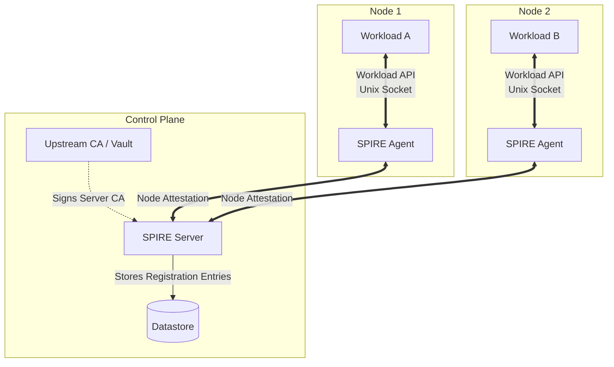
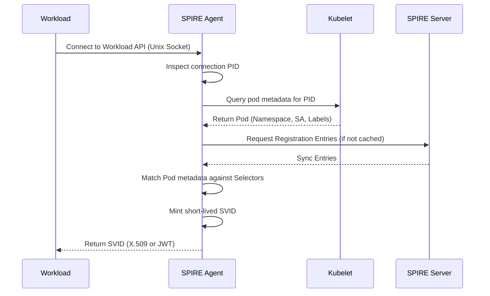
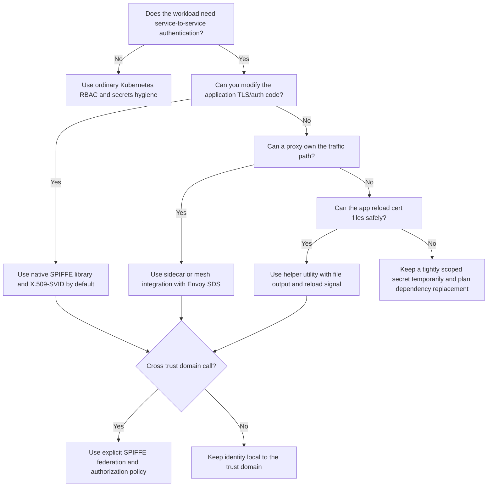

## What You'll Be Able to Do

- **Design** a highly available SPIRE architecture across bare-metal environments, evaluating datastore backends and upstream certificate authorities.
- **Implement** workload and node attestation workflows using the Kubernetes Projected Service Account Token (PSAT) and core workload plugins.
- **Compare and evaluate** X.509 and JWT SPIFFE Verifiable Identity Document (SVID) profiles to select the optimal identity mechanism for transport versus application-layer security.
- **Diagnose** complex attestation failures, addressing race conditions, node selector misconfigurations, and kernel PID namespace bypasses.
- **Evaluate** federation strategies to implement trust domains across multiple isolated Kubernetes clusters, facilitating secure cross-boundary communication.

## Why This Module Matters

Hypothetical scenario: your team runs a regulated payments platform in two owned datacenters. A frontend workload needs to call a settlement API, a fraud model, and a PostgreSQL cluster, but there is no cloud IAM role, no managed certificate authority, and no provider metadata service to hand the workload a fresh identity. The quick workaround is tempting: put a database password in a Kubernetes Secret, mount a shared API token into several Deployments, and rely on network segmentation to keep the wrong pods away from the wrong backends. That works until the first compromised pod, overly broad ServiceAccount, stale secret, or forgotten test namespace turns a local bug into lateral movement.

The 2019 Capital One metadata-service incident (see *Node Metadata Security*) <!-- incident-xref: capital-one-2019 --> shows why static, infrastructure-bound credentials are dangerous: one compromised interface can become a pathway to broad compromise when workload identity is not dynamically validated at runtime.

On bare metal and on-premises environments, the situation is historically even worse. Without a cloud metadata service to provide even a baseline level of identity, organizations resort to distributing static tokens, long-lived API keys, or embedded database passwords directly to workloads. These secrets are often stored in configuration files, committed to version control, or passed as environment variables. Not only does this violate zero-trust principles, but it also creates an operational nightmare for secret rotation. When a credential is compromised, operators must manually identify every workload using it, update the secret, and restart the applications - a process so risky and slow that many organizations simply never rotate their secrets at all.

When you scale this problem to thousands of microservices across multiple bare-metal datacenters, the web of static secrets becomes extremely difficult to manage safely. Attackers know this, which is why lateral movement on bare metal is typically accomplished by scraping configuration files for database passwords and API tokens. If an attacker breaches a frontend container, they will typically look for environment variables containing backend credentials. SPIFFE and SPIRE fundamentally alter this paradigm by shifting from static, assigned secrets to dynamic, cryptographically attested identities. By implementing the standards taught in this module, you will eliminate the need for application-level secrets for authentication. Workloads will automatically prove their identity at runtime, receive short-lived certificates that rotate seamlessly, and establish mutually authenticated, encrypted connections. This ensures that even if a network boundary is breached or a container is compromised, the blast radius is cryptographically contained.

The on-premises twist is that you own the entire root of trust. In a managed cloud, workload identity usually hides a large control plane behind a product name: cloud IAM, managed key storage, managed CA rotation, provider metadata servers, and integrated audit trails. In a datacenter or colocation rack, those pieces still have to exist, but your platform team has to run them. SPIRE becomes the workload identity control plane, your Kubernetes API and node-attestation method become part of the bootstrap chain, your SQL datastore becomes identity-plane state, and your CA or HSM strategy becomes a production dependency rather than an optional security enhancement.

> **The Badge Office Analogy**
>
> Think of long-lived shared secrets as photocopied employee badges. They open the door, but they do not prove who is holding them, when they were issued, or whether the person still works there. SPIFFE is closer to a badge office that checks the employee, the building, the department, and the current shift before issuing a short-lived badge that expires quickly and can be verified cryptographically by every door.

Zero trust is sometimes explained as "never trust, always verify," but in a Kubernetes cluster the hard part is deciding what can perform the verification. IP addresses are weak evidence because pods move, nodes are replaced, and service IPs are shared abstractions. DNS names are useful routing handles, but they do not prove that the process behind the name was scheduled by the right namespace and ServiceAccount. A Kubernetes Secret proves only that the workload could read a value at some moment in time. Workload identity asks for stronger evidence: this process is running on an attested node, under a known orchestrator identity, and it is entitled to receive exactly this cryptographic identity for a short period.

## Did You Know?

1. SPIFFE and SPIRE are CNCF Graduated projects; CNCF records list SPIFFE graduation on 2022-08-23 and SPIRE graduation on 2022-08-22.
2. The SPIFFE Workload Endpoint is intentionally local and normally exposed as a Unix domain socket, because the first identity request often happens before the workload has any secret to authenticate itself.
3. JWT-SVID validation requires an `aud` claim, and broad audiences such as an entire production environment are discouraged because they increase replay blast radius.
4. SPIRE release listings in June 2026 show an active v1.15 line alongside maintained v1.14 patch releases, so production operators should pin and review release notes instead of copying old tutorial image tags blindly.

## Understanding SPIFFE and SPIRE

SPIFFE (Secure Production Identity Framework for Everyone) is an open-source standard for securely identifying software systems in dynamic and heterogeneous environments. It provides a common identity control plane, standardizing how identities are issued, requested, and consumed. SPIFFE is a CNCF project that moved to Incubating on 2020-06-22 and to Graduated on 2022-08-23. The framework itself does not issue identities; rather, it provides the specifications that any compliant provider must implement. This decoupling of the specification from the implementation allows for a vast ecosystem of tools to integrate securely without being locked into a single vendor's proprietary identity service.

SPIRE (the SPIFFE Runtime Environment) is the most widely adopted implementation of the SPIFFE standard. SPIRE is described as a production-ready implementation of the SPIFFE APIs that performs node and workload attestation to issue and verify SVIDs. Like the standard it implements, SPIRE is a CNCF project that moved to Incubating on 2020-06-22 and to Graduated on 2022-08-22.

*Note on historical records: The exact SPIRE graduation date in August 2022 is inconsistent across official CNCF sources. There is no single agreed day; the SPIRE project page lists 2022-08-22, while the SPIFFE project page lists 2022-08-23. The industry broadly recognizes its graduated, production-ready status regardless of the single-day discrepancy.*

To ensure production security, operators must stay aligned with the latest releases and security patches. The SPIRE release stream moved beyond the older 1.14.5 examples: the official release listing shows v1.15.1 on 2026-05-28, with v1.14.7 also released that day for operators still on the 1.14 line. The lesson is not that every cluster must jump to a new minor release on day one; the lesson is that identity infrastructure needs the same release-management discipline as etcd, the API server, and your ingress stack.

Security is a moving target, and identity control planes are high-value targets for attackers. SPIRE v1.14.5, released on 2026-04-08, specifically upgraded Go to address multiple 2026 CVEs; later releases continued the patch stream. On-premises operators should treat those notes as operational input: mirror signed artifacts internally, test the new release in a staging cluster with real selectors, verify the Helm chart app version, and schedule upgrades before certificate-rotation or datastore-maintenance windows make the identity plane harder to reason about.

The deeper idea is simple but powerful: SPIFFE gives every workload a name that is independent of the machine, IP address, or Kubernetes Service that happens to route to it today. SPIRE decides whether a process is entitled to that name by checking evidence from the node and the workload runtime. That makes the identity portable across rolling updates, node replacements, and datacenter migrations, while still making the proof local and cryptographic. For an on-premises platform, that portability is the bridge between Kubernetes scheduling and security policy.

### Why Workload Identity Changes the Trust Boundary

The first hard problem is secret zero. A workload often needs a credential in order to fetch another credential, but giving it that initial credential recreates the same bootstrap problem in a different place. Cloud products often hide this behind metadata services and managed IAM, but a bare-metal cluster has no provider-run authority waiting underneath the node. If you solve the problem by baking a token into an image, mounting a shared Secret, or distributing a file during provisioning, you have created a reusable credential that an attacker can copy.

SPIFFE avoids that shape by not asking the workload to prove identity with a prior secret. The Workload Endpoint is local, and the SPIFFE specification says the endpoint does not require direct client authentication from the workload. Instead, the implementation performs out-of-band checks, such as inspecting the caller through operating-system state or orchestrator metadata. In SPIRE on Kubernetes, that means the local agent can map the process to a pod, namespace, ServiceAccount, labels, and other selectors that the cluster control plane already knows.

This distinction matters during incident response. If a password is leaked, you have to know where it was used, whether it was copied, whether any copies are still valid, and which applications can survive rotation. If an SVID is exposed, the validity window is intentionally short, the identity is bound to a trust domain, and X.509-SVID usage usually requires possession of the private key as well as the certificate. You still investigate the compromised workload, but you are no longer rotating a human-designed web of manually distributed credentials.

On-premises teams also gain a cleaner audit model. A database connection that presents `spiffe://dojo.local/ns/payments/sa/settlement-api` is easier to reason about than a shared username such as `appuser` or `svc_prod`. A firewall or mesh policy can say "payments settlement may call ledger write" without encoding pod IP ranges. A platform team can rebuild a node, reschedule a Deployment, and keep the same workload identity because the identity follows the Kubernetes workload evidence, not the server that happened to host it last week.

There is still a tradeoff. You are replacing secret distribution work with identity-plane operations work. SPIRE Server, SPIRE Agent, the datastore, the upstream certificate authority, controller-manager reconciliation, metrics, backups, and release management all become day-2 responsibilities. That is usually the right trade for regulated, multi-team, or multi-cluster environments, but it is not free.

Hypothetical scenario: a manufacturing company runs a single small cluster for an internal dashboard and a nightly batch job. The team has two engineers, no cross-cluster traffic, and a short list of low-risk internal APIs. Deploying a full HA SPIRE environment, custom federation, and service-mesh integration may be more operational risk than the workload deserves. The same company might make the opposite decision for a plant-floor control system where dozens of workloads talk to databases, message brokers, and edge gateways across several sites.

### SPIFFE IDs and SVIDs

A core concept of the standard is the SPIFFE ID. A SPIFFE ID is an RFC 3986 URI using the `spiffe` scheme, with a trust domain and path, and must follow host/path constraints. An example SPIFFE ID might look like `spiffe://dojo.local/ns/backend/sa/payments`. This URI forms the canonical name of the workload throughout the entire mesh. It removes the ambiguity of IP addresses and DNS names, which are ephemeral and easily spoofed. A trust domain (such as `dojo.local`) represents the cryptographic boundary of the environment, while the path represents the specific entity within that boundary.

When a workload successfully proves its identity, it receives a SPIFFE Verifiable Identity Document (SVID). SPIFFE interoperability requires supporting X.509-SVID and JWT-SVID document forms. The SPIFFE Workload API defines two profiles—X.509-SVID and JWT-SVID—and both profiles are mandatory for SPIFFE implementations. A compliant agent must be capable of issuing both formats depending on the workload's specific request.

The SPIFFE Workload Endpoint is expected to be local (preferably Unix domain socket, optionally TCP with stronger local-auth assumptions), and is exposed via local clients over gRPC. SPIFFE clients discover the Workload Endpoint via explicit socket configuration or `SPIFFE_ENDPOINT_SOCKET`, with URI forms for `unix://` and `tcp://`. The locality of the endpoint is a critical security feature: by requiring the workload to communicate with a local agent over a Unix domain socket, SPIRE makes network-based interception or remote spoofing of the attestation handshake far more difficult.

A good SPIFFE ID namespace is boring, stable, and meaningful to both humans and policy engines. In Kubernetes, the common shape `spiffe://dojo.local/ns/<namespace>/sa/<serviceaccount>` works because namespace and ServiceAccount are durable scheduling intent rather than deployment noise. You can add path segments for environment, tenant, or application family, but every extra segment becomes part of an authorization contract. Avoid putting pod names, ReplicaSet hashes, image tags, or node names into the path unless you deliberately want identities to change during routine rollout events.

The trust domain deserves special care in on-premises environments. A trust domain is not just a DNS-looking string; it is the name of a root of trust and the boundary for validating SVIDs. A single enterprise-wide trust domain may be convenient, but it can make blast radius too large if one cluster or SPIRE Server is compromised. A trust domain per cluster is safer but forces you to manage federation for cross-cluster calls. A trust domain per datacenter often matches physical ownership and network failure domains, but may be too coarse for acquisitions, regulated tenants, or high-separation business units.

X.509-SVIDs are the default answer for service-to-service mTLS because the SPIFFE ID is encoded into the certificate and the private key proves possession during the TLS handshake. The Workload API streams SVID and bundle updates, which lets capable clients react to rotation without restarting the process. A native client can keep a TLS listener alive while replacing certificates under the hood, and a proxy such as Envoy can consume updated secrets through SDS. This is why X.509-SVIDs are usually the right fit for APIs, databases, queues, and mesh data planes.

JWT-SVIDs solve a different problem. They are useful when a caller must present identity to an HTTP gateway, API server, or legacy verifier that expects a signed token rather than a client certificate. The tradeoff is bearer-token semantics: whoever has the token can present it until it expires, so the SPIFFE specification requires an `aud` claim and validators must reject tokens without the intended audience. In practice, that means a JWT-SVID should be scoped to the receiving service, short lived, and transported only over a channel that already has strong confidentiality.

SVID TTLs are a design knob, not a magic number. Shorter lifetimes reduce the usefulness of stolen credentials and force broken rotation logic to surface quickly in staging. Longer lifetimes tolerate network partitions and overloaded identity control planes better, but they lengthen the window in which a compromised identity remains usable. On-premises teams should decide TTLs alongside datastore capacity, agent cache behavior, maintenance windows, and the recovery-time objective for SPIRE Server. The right setting for a single-rack lab is not the right setting for a three-site production platform.

## SPIRE Architecture

A SPIRE deployment is composed of a SPIRE Server and one or more SPIRE Agents. This distributed architecture ensures that identity issuance is robust, highly available, and logically segregated from the workloads that consume those identities. 

SPIRE Server is responsible for registration entries, signing keys, node attestation, and issuing SVIDs, while SPIRE Agent runs on nodes with workloads, requests/caches SVIDs, exposes the Workload API, and attests calling workloads. The Server acts as the centralized brain of the identity plane, holding the master catalog of all authorized identities, while the Agents act as the distributed enforcers at the edge, performing the actual interrogations of the running processes.

To adapt to different environments, SPIRE utilizes a deeply pluggable architecture. SPIRE Server plugin support includes node attestors, datastore, key manager, and upstream authority plugins, with a built-in datastore supporting MySQL, SQLite 3, or PostgreSQL and defaulting to SQLite 3. While SQLite 3 is sufficient for quickstarts and small test clusters, enterprise deployments must utilize PostgreSQL or MySQL for high availability and to handle concurrent attestation requests at massive scale. Upstream authority plugins allow the SPIRE Server to chain its own Root CA to an enterprise Public Key Infrastructure (PKI), such as HashiCorp Vault, OpenBao, or an internal certificate authority, ensuring that SPIFFE identities are cryptographically trusted by legacy systems outside the immediate mesh.

On premises, read "external enterprise PKI" as a design decision you own. Some organizations use HashiCorp Vault as an upstream authority; after HashiCorp's 2023 license change, teams that require community-governed open source should also evaluate OpenBao, the Linux Foundation OpenSSF fork of Vault, before standardizing on a secrets and PKI backend. Other organizations use an internal Microsoft CA, an HSM-backed PKCS#11 workflow, or a dedicated certificate-management stack. SPIRE does not remove the need for a CA strategy; it gives Kubernetes workloads a consistent way to consume identities derived from that strategy.

The server-side datastore is the other production hinge. Registration entries, node state, and bundle material have to survive restarts and upgrades, which makes a single local SQLite file inappropriate for HA production clusters. A PostgreSQL or MySQL backend introduces its own costs: backups, monitoring, schema migrations, replication, credentials, encryption-at-rest, and failover tests. Treat that datastore as security infrastructure. If it is unavailable, agents can use cached material for a while, but new registrations, re-attestation, and rotation eventually depend on the server and its persistent state.

The agent tier is deliberately node-local. Every node that runs identified workloads needs a SPIRE Agent, usually as a DaemonSet in Kubernetes. That means agent resource requests, host access, CSI driver behavior, kubelet access, and node upgrade sequencing all affect identity availability. A node drain that removes the agent before dependent pods finish shutdown can cause noisy application errors, while a misconfigured agent DaemonSet can make an entire rack unable to receive workload identities. This is why workload identity belongs in the platform baseline, not as an application team side project.


```mermaid
graph TD
    subgraph Control Plane
        Server[SPIRE Server]
        DB[(Datastore)]
        Server -->|Stores Registration Entries| DB
        UpstreamCA[Upstream CA / Vault] -.->|Signs Server CA| Server
    end

    subgraph Node 1
        Agent1[SPIRE Agent]
        Workload1[Workload A]
        Agent1 <==>|Node Attestation| Server
        Workload1 <==>|Workload API<br>Unix Socket| Agent1
    end

    subgraph Node 2
        Agent2[SPIRE Agent]
        Workload2[Workload B]
        Agent2 <==>|Node Attestation| Server
        Workload2 <==>|Workload API<br>Unix Socket| Agent2
    end
```

> **Pause and predict**: If the upstream CA becomes completely unreachable, what will happen to the SPIRE Server's ability to issue SVIDs over the next 24 hours? Consider the lifecycle of intermediate certificates and how frequently they are rotated.

The answer depends on what is already cached and how long the relevant CA and SVID material remains valid. Existing workloads may continue using unexpired SVIDs and trust bundles, but the server cannot rely forever on an upstream authority it cannot reach. A mature on-premises design monitors intermediate CA expiry, upstream authority health, datastore health, and agent-server synchronization separately, because "pods are still running" can mask a countdown to widespread identity failure. The control plane may look quiet until certificates approach expiration, at which point the incident becomes much harder to contain.

High availability for SPIRE is therefore a layered design, not a single replica count. Run multiple SPIRE Server replicas behind a stable service endpoint, use a highly available SQL datastore, back up signing and bundle state according to your key-management model, and place servers across failure domains that match the cluster's control-plane topology. If your Kubernetes control plane spans three rooms or racks, the identity plane should not live on one worker node in one room. If your cluster crosses datacenters, think carefully before stretching one trust domain across unreliable WAN links.

The operational audit surface also changes. You should be able to answer which registration entry issued a given identity, which selectors matched, which agent served the request, which node the workload ran on, and which upstream CA chain signed the certificate. That evidence is useful for security reviews, but it also helps during ordinary debugging. When a service cannot call a database, the problem might be network policy, TLS validation, missing registration, delayed controller reconciliation, expired bundle material, or a wrong trust domain. SPIRE gives you cleaner primitives, but you still need observability around them.

## The Attestation Process

Identity in SPIRE is not statically assigned; it is dynamically attested at runtime based on verifiable properties. This is a massive departure from legacy systems where an administrator simply hands a password to an application. Attestation occurs in two distinct, sequential phases: Node Attestation and Workload Attestation.

### 1. Node Attestation

Before an Agent can issue identities to local applications, it must prove its own identity to the Server. The Agent needs to cryptographically verify the physical or virtual hardware it resides on. SPIRE supports node attestors for AWS (EC2 Identity Document), Azure managed service identities, GCE instance tokens, Kubernetes Service Account tokens, and join-token fallback where tokens expire immediately after use. On Kubernetes environments, the Server must validate the Agent's projected ServiceAccount token using the `k8s_psat` plugin.

On bare metal, `k8s_psat` is usually the most practical first step because it uses a Kubernetes Projected ServiceAccount Token and the API server's TokenReview path to prove that the agent pod belongs to the cluster and ServiceAccount you allowed. This is not the same as proving that a physical motherboard has a specific TPM measurement; it is proof anchored in the Kubernetes control plane. For many clusters, that is enough because the kubelet, node enrollment, and cluster bootstrap process already define which machines are allowed to join. For stricter environments, combine `k8s_psat` with node admission controls, secure boot, TPM-backed provisioning evidence, or SPIRE's TPM DevID attestor where the hardware lifecycle supports it.

Join tokens are useful during early experiments and some non-Kubernetes bootstrap flows, but they are a weak long-term answer if they become reusable operational shortcuts. A join token answers "who possessed this bootstrap token?" more than "which durable node identity is this?" In an owned datacenter, token handling often spreads through ticket comments, provisioning scripts, and console sessions unless you design guardrails. Use join tokens as a narrow bootstrap mechanism, expire them quickly, and graduate to a node-attestation method that matches your provisioning system.

```hcl
NodeAttestor "k8s_psat" {
  plugin_data {
    clusters = {
      "on-prem-cluster-01" = {
        # The service account that the SPIRE Server runs as
        # needs permissions to perform TokenReviews.
        service_account_allow_list = ["spire:spire-agent"]
      }
    }
  }
}
```

The node attestation flow typically involves the following steps:
1. The Agent generates a private key and a Certificate Signing Request (CSR).
2. The Agent presents a projected SAT to the Server over a mutually authenticated connection.
3. The Server validates the SAT against the Kubernetes API Server (using TokenReview).
4. If the Kubernetes API Server confirms the token is valid, the Server signs the Agent's CSR and returns an agent SVID, which the Agent uses to authenticate all future communications with the Server.

The chain of trust is worth spelling out. The SPIRE Server trusts the Kubernetes API server to validate the projected token. The API server trusts the cluster's ServiceAccount signing keys and the pod binding for that token. The agent's future workload-attestation decisions then depend on the agent SVID it received during node attestation. If your cluster bootstrap process lets unknown machines become Kubernetes nodes, SPIRE cannot magically compensate. Workload identity is only as strong as the platform evidence underneath it.

### 2. Workload Attestation

Once the node is verified and the Agent has its own SVID, workloads running on that node can request identities. Workload attestation is performed by the SPIRE Agent on the node and can use process attributes such as Kubernetes namespace/service account selectors.

```hcl
WorkloadAttestor "k8s" {
  plugin_data {
    # Node name must match the Kubernetes node name
    node_name_env = "MY_NODE_NAME"
    
    # How the agent verifies the kubelet identity
    kubelet_ca_path = "/var/run/secrets/kubernetes.io/serviceaccount/ca.crt"
    skip_kubelet_verification = false
  }
}
```

The workload attestation flow typically involves a meticulous process of interrogating the operating system kernel and the container runtime to verify the caller:
1. The Workload connects to the Agent's Workload API (Unix Domain Socket).
2. The Agent inspects the connection to determine the workload's OS-level PID.
3. The Agent uses the PID to discover the cgroup and container ID from the kernel.
4. The Agent queries the Kubelet to find the Pod metadata (namespace, ServiceAccount, labels) corresponding to that container ID.
5. The Agent matches this metadata against **Registration Entries** synced from the Server.
6. If a match is found, the Agent mints a short-lived SVID and returns it to the Workload.


```mermaid
sequenceDiagram
    participant W as Workload
    participant A as SPIRE Agent
    participant K as Kubelet
    participant S as SPIRE Server

    W->>A: Connect to Workload API (Unix Socket)
    A->>A: Inspect connection PID
    A->>K: Query pod metadata for PID
    K-->>A: Return Pod (Namespace, SA, Labels)
    A->>S: Request Registration Entries (if not cached)
    S-->>A: Sync Entries
    A->>A: Match Pod metadata against Selectors
    A->>A: Mint short-lived SVID
    A-->>W: Return SVID (X.509 or JWT)
```

This flow explains why seemingly unrelated Kubernetes hardening decisions matter. If a pod can run with `hostPID: true`, the boundary between its process namespace and the host process namespace changes, which can undermine PID-based workload identification assumptions. If workloads can mount arbitrary host paths, they may reach sockets or files that were meant to stay node-local and controlled. If admission policy allows application teams to choose any ServiceAccount in any namespace, selectors based on ServiceAccount lose their meaning. SPIRE is a workload identity system, but it depends on Pod Security Standards, RBAC, admission policy, and node isolation to preserve the evidence it evaluates.

Selector choice is the most common design mistake. Stable selectors such as namespace and ServiceAccount express intent: this workload belongs to this operational identity. Labels can be useful when they are controlled by platform-owned conventions, but application teams can accidentally or deliberately reuse labels across services. Pod UIDs are precise but not stable across restarts. Container image selectors are tempting, yet image reuse makes them dangerous because the same base image may run in unrelated namespaces. A strong registration entry uses selectors that are hard for the workload owner to spoof and stable enough to survive normal Kubernetes reconciliation.

There is also a timing model. The server maintains registration entries, the agent caches and synchronizes entries, and workloads may start before the local agent has seen the identity they expect. The SPIFFE Workload Endpoint specification explicitly allows retry behavior for eventual consistency cases. Production clients should retry with backoff when the endpoint is temporarily unavailable or when the identity is not yet ready, and operators should avoid application startup designs where a single early SVID fetch failure permanently disables the process.

## SVID Formats: X.509 vs JWT

Choosing the correct SVID format is critical for architectural security. While X.509 certificates are generally preferred due to their cryptographic binding to the TLS session, JWTs are sometimes necessary for L7 routing and legacy API gateways.

| Feature | X.509 SVID | JWT SVID |
| :--- | :--- | :--- |
| **Primary Use Case** | Mutual TLS (mTLS) for transport security. | Application-level authentication (Bearer tokens). |
| **Replay Protection** | High. Tied to the TLS session. | Low. Bearer tokens can be intercepted and replayed if not sent over TLS. |
| **Audience Scoping** | No. Valid for any verifier in the trust domain. | Yes. Must be scoped to a specific `aud` (audience) to limit blast radius. |
| **Validation** | Standard TLS libraries. | Requires fetching the OIDC discovery document or OIDC federation keys. |
| **Recommendation** | **Default choice**. Use wherever possible. | Use only when L7 proxies/gateways require it, or legacy apps cannot do mTLS. |

> **Stop and think**: Why must a JWT SVID always be accompanied by strict audience (`aud`) scoping, whereas an X.509 SVID typically does not require it? Think about bearer semantics versus proof-of-possession. An intercepted bearer token can be replayed anywhere, whereas an intercepted X.509 certificate cannot be used without the corresponding private key.

In a datacenter, this difference often maps to different network layers. X.509-SVIDs are a natural fit for east-west service calls, database client certificates, message broker client authentication, and service meshes because the proof happens during the transport handshake. JWT-SVIDs are more likely at HTTP API gateways, policy decision points, or older application frameworks that already know how to validate signed JWTs. A platform should support both, but it should make X.509 the default and require a concrete reason before allowing JWT bearer tokens to become the main service-to-service authentication path.

Rotation behavior is another practical difference. A proxy or native SPIFFE library can update X.509 material in memory as the Workload API streams changes, keeping connections healthy while new handshakes use fresh certificates. JWT-SVIDs are usually fetched per request, per session, or per short-lived cache window, and verifiers must retrieve or cache the signing keys needed to validate them. Heavy JWT-SVID use can increase signing load on SPIRE because JWTs are often minted as needed rather than pre-stashed like X.509 material, which is one of the official scaling considerations for SPIRE deployments.

## Registration Entries and Selectors

A registration entry forms the core authorization rule in SPIRE. A registration entry consists of a SPIFFE ID, selectors, and a parent ID. These entries define exactly what verifiable attributes a process must possess to be granted a specific identity. 

A registration entry may use either node selectors or workload selectors, but not both. This strict separation prevents logical errors where an administrator accidentally ties a workload identity to a specific piece of infrastructure, breaking workload mobility. You must explicitly separate the node authorization layer from the application authorization layer.

On Kubernetes, selectors take the form of `k8s:<property>:<value>`. When defining workload selectors, always bind identities to Namespaces and ServiceAccounts (`k8s:ns` and `k8s:sa`). Avoid binding to Pod names (which are ephemeral and change on every deployment) or container images (which are too broad and reusable across entirely different services). ServiceAccounts are stable, immutable (unless explicitly deleted), and scoped to a specific workload's operational purpose.

```bash
spire-server entry create \
    -spiffeID spiffe://example.org/ns/backend/sa/payments \
    -parentID spiffe://example.org/spire/agent/k8s_psat/on-prem-cluster-01/$(NODE_NAME) \
    -selector k8s:ns:backend \
    -selector k8s:sa:payments
```

### Kubernetes Controller Integration

Manually creating entries via the CLI is an anti-pattern. The older SPIRE Kubernetes Workload Registrar pattern has been superseded in current Kubernetes deployments by the **SPIRE Controller Manager**, which reconciles workload registration and federation relationships through Kubernetes custom resources. It can manage resources such as `ClusterSPIFFEID`, `ClusterFederatedTrustDomain`, and `ClusterStaticEntry`, allowing identity intent to live in GitOps workflows instead of one-off CLI sessions on an administrator laptop.

This matters for change control. A hand-created entry may fix a production outage quickly, but it becomes invisible to code review, drift detection, and environment promotion. A `ClusterSPIFFEID` in a repository can be reviewed by the platform and application teams, validated in staging, promoted through the same pipeline as the Deployment, and rolled back if it grants too much. In an on-premises environment where identity is replacing static secrets, this audit trail is part of the value proposition.

Controller automation does not remove the need for selector discipline. If a template gives every pod in a namespace the same SPIFFE ID, then all those workloads share authorization at downstream services. That may be acceptable for a tightly controlled system namespace, but it is too broad for a tenant namespace where multiple teams deploy independent applications. A safer default is namespace plus ServiceAccount, with labels used only when label ownership and admission policy are clear.

## Trust Domain Federation

Large organizations often operate multiple Kubernetes clusters, each acting as its own failure domain. Using a single SPIRE Server across all clusters creates a massive blast radius, introduces unacceptable latency for attestation, and effectively couples disparate infrastructure into a single point of operational failure. 

The solution is Federation. Each cluster runs its own SPIRE Server and defines its own Trust Domain (e.g., `cluster01.spiffe.local` and `cluster02.spiffe.local`). Federation allows SPIRE Servers to securely exchange public key material (trust bundles) over an authenticated endpoint. Once federated, a workload in Cluster A can cryptographically validate an X.509 SVID presented by a workload in Cluster B without the two servers sharing any private signing keys.

### Configuring Federation

To establish a federation relationship, both SPIRE Servers must expose a Federation API (SPIFFE Federation endpoint) using an external load balancer, NodePort, or Ingress. You then configure the Server to actively pull trust bundles from the remote domain using the `federates_with` configuration block.

```hcl
# Server Configuration Snippet
federation {
  bundle_endpoint {
    address = "0.0.0.0"
    port = 8443
  }
  federates_with "cluster02.spiffe.local" {
    bundle_endpoint_url = "https://spire.cluster02.example.com:8443"
    bundle_endpoint_profile "https_spiffe" {
      endpoint_spiffe_id = "spiffe://cluster02.spiffe.local/spire/server"
    }
  }
}
```

Federation is bundle exchange, not database sharing. Each trust domain keeps its own private signing keys and publishes the public trust bundle that other domains need to validate SVIDs. When Cluster A trusts Cluster B through federation, Cluster A can validate that a presented certificate chains to Cluster B's bundle and contains a SPIFFE ID from Cluster B's trust domain. Cluster A does not need Cluster B's datastore, private keys, or registration entries. This is exactly the separation you want between datacenters with different failure domains.

In a multi-cluster on-premises platform, federation should follow organizational and network reality. A pair of clusters in the same datacenter with shared operations may federate directly. A disaster-recovery cluster may federate only with a subset of production identities. A regulated tenant cluster may require a separate trust domain and a small allowlist of cross-domain callers. The design question is not "can the certificates validate?" but "which remote identities should local services authorize after validation succeeds?"

The bundle endpoint itself becomes production infrastructure. It needs a stable network path, TLS configuration, monitoring, and a rotation story. If your datacenter fabric has strict east-west firewalling, plan the federation ports and DNS names before the security team sees unexplained traffic from every cluster. If you use the `https_spiffe` endpoint profile, the endpoint identity is also a SPIFFE identity, which keeps identity anchored in the trust-domain model instead of relying only on web PKI names.

## Integration Patterns

SPIFFE identity issuance is only half the battle. The identities are useless unless workloads actually consume them effectively to encrypt transit and authorize access. There are three primary integration patterns in modern infrastructure.

### 1. Native Integration
The application code directly imports a SPIFFE library, such as `go-spiffe` or another language implementation. The app connects to the Workload API, retrieves the SVID and trust bundle directly into memory, and uses them to configure its own TLS listeners and HTTP clients. This gives the cleanest security model because the application knows the peer identity it expects, can make authorization decisions close to business logic, and avoids a proxy hop for every request.

The cost is engineering time. Native integration requires code changes, certificate reload handling, test coverage, and operational maturity from application teams. It works best for platform-owned services, high-value internal APIs, and new services where the team already controls the network client and server code. It is usually unrealistic for third-party COTS software, old binaries that only read files at startup, or teams that cannot safely modify their TLS stack.

### 2. Sidecar Proxy (Service Mesh)
A proxy like Envoy runs as a sidecar alongside the application container. The proxy connects to the Workload API through mechanisms such as the Secret Discovery Service (SDS), fetches the SVID, and handles mTLS termination and initiation transparently on behalf of the application. Istio documents SPIRE integration paths, including Envoy SDS behavior and federation-bundle handling for cross-trust-domain verification.

The sidecar pattern is powerful when you need broad adoption across many teams without changing every application. It gives the platform a common place for mTLS, telemetry, retries, and authorization policy. The cost is resource overhead, operational complexity, and another data-plane component in every pod. On dense bare-metal clusters, the sidecar CPU and memory tax is a real capacity-planning input, not a rounding error hidden inside a cloud bill.

### 3. Init Container / Helper Utility
For applications that just need static configuration files on disk, such as an on-premises database expecting to find `cert.pem` and `key.pem` on startup, helper utilities can run alongside the application. They connect to the Workload API, write the SVIDs to a shared memory volume, and send a signal such as SIGHUP to the application to trigger a reload. This bridges modern workload identity into older software without pretending the older software has a dynamic identity API.

The helper pattern is a compromise. It can be the fastest path for databases, appliances, and vendor software that already supports TLS client certificates but not the SPIFFE Workload API. It also creates file-handling and reload questions: where does the private key live, what permissions protect it, how does the application reload without dropping connections, and what happens if rotation succeeds but reload fails? Treat helper-based integration as a migration tool or legacy adapter, not the gold standard for new services.

## Patterns & Anti-Patterns

The most reliable production pattern is **identity follows intent, not placement**. Bind workload identities to Kubernetes namespaces and ServiceAccounts, then enforce who may create or use those ServiceAccounts through RBAC and admission policy. This pattern scales because rolling updates, node replacements, and scheduler decisions do not change the identity. It also gives downstream authorization policies stable subjects that match how platform and application teams already organize ownership.

A second proven pattern is **SPIRE as a platform service with application-facing abstractions**. The platform team runs the server, datastore, agents, CSI driver, controller manager, metrics, and release process; application teams request identities through reviewed Kubernetes resources or namespace conventions. This keeps the security-critical root of trust centralized while still making identity self-service. It scales when the interface is declarative and boring: a ServiceAccount, a `ClusterSPIFFEID`, a documented trust-domain policy, and a standard way to mount the Workload API.

A third proven pattern is **federate failure domains, not every cluster by default**. Federation should exist where real cross-domain communication exists. Start with specific caller and callee use cases, decide which remote SPIFFE IDs will be authorized, then expose and monitor federation endpoints. This pattern scales better than a universal mesh of every cluster trusting every other cluster, because every new trust relationship has operational and audit cost.

The most dangerous anti-pattern is **static secret nostalgia**. Teams sometimes deploy SPIRE but keep database passwords, shared API tokens, and long-lived TLS keys as the real authorization mechanism underneath. They do this because static secrets feel familiar and because not every dependency accepts SPIFFE identity on day one. The better alternative is to pick high-value flows, make SVID-based authentication the enforcing control, and use Vault, OpenBao, or another secrets platform only where a dependency still requires a secret.

Another anti-pattern is **identity by mutable label**. Labels are useful metadata, but many clusters let application teams set them freely. If a registration entry grants a privileged SVID to any pod with `app: payments`, a compromised or careless team can copy that label and receive the wrong identity. The better alternative is to anchor identity in namespace and ServiceAccount, then use admission policy to protect any labels that carry security meaning.

A final anti-pattern is **one stretched trust domain for every datacenter**. A single global SPIRE Server looks simple on a diagram, but it couples identity issuance to WAN availability and turns one compromise or operational mistake into an enterprise-wide blast radius. The better alternative is a trust domain per meaningful failure boundary, with explicit federation for the cross-boundary calls that actually need it. That design requires more setup, but it preserves local autonomy and keeps outages smaller.

| Pattern or anti-pattern | When teams choose it | What happens at scale | Better operating model |
| :--- | :--- | :--- | :--- |
| **Pattern: Namespace plus ServiceAccount identity** | Teams need stable identities that survive rollouts and node movement. | Authorization remains understandable because identities match Kubernetes ownership. | Protect ServiceAccount use with RBAC and admission policy. |
| **Pattern: Declarative identity registration** | Teams want GitOps review instead of hand-created entries. | Drift falls because entries are reconciled from reviewed resources. | Use SPIRE Controller Manager and document namespace conventions. |
| **Pattern: Federation by failure domain** | Multiple clusters or datacenters need selective communication. | Trust remains explicit and auditable instead of becoming universal. | Federate only the domains with real traffic and monitor bundle endpoints. |
| **Anti-pattern: Shared static fallback secrets** | Legacy dependencies are easier to integrate with passwords. | SPIFFE becomes decorative while leaked secrets still drive compromise. | Migrate critical flows to SVID authentication and isolate remaining secrets. |
| **Anti-pattern: Mutable labels as identity anchors** | Labels are already present and easy to match. | Any workload that can copy the label may receive the wrong identity. | Use namespace and ServiceAccount as the primary selectors. |
| **Anti-pattern: One global trust domain** | A single domain looks simpler for initial rollout. | WAN latency, outage scope, and compromise blast radius all grow. | Use local trust domains with explicit federation. |

## Decision Framework

Choose the identity pattern by starting with what must consume the identity, not with the tool you prefer. A new Go service that you control can usually use native SPIFFE libraries. A fleet of mixed Java, Python, and vendor binaries may need a mesh or helper pattern. A database that reads certificates from disk may need a helper first and a native/proxy migration later. A multi-cluster platform should decide trust-domain boundaries before deciding whether every team gets cross-domain access.


```mermaid
flowchart TD
    A[Does the workload need service-to-service authentication?] -->|No| B[Use ordinary Kubernetes RBAC and secrets hygiene]
    A -->|Yes| C[Can you modify the application TLS/auth code?]
    C -->|Yes| D[Use native SPIFFE library and X.509-SVID by default]
    C -->|No| E[Can a proxy own the traffic path?]
    E -->|Yes| F[Use sidecar or mesh integration with Envoy SDS]
    E -->|No| G[Can the app reload cert files safely?]
    G -->|Yes| H[Use helper utility with file output and reload signal]
    G -->|No| I[Keep a tightly scoped secret temporarily and plan dependency replacement]
    D --> J{Cross trust domain call?}
    F --> J
    H --> J
    J -->|Yes| K[Use explicit SPIFFE federation and authorization policy]
    J -->|No| L[Keep identity local to the trust domain]
```

| Decision | Prefer this option | Tradeoff to accept |
| :--- | :--- | :--- |
| New service you own | Native SPIFFE library with X.509-SVID | Requires application code and reload tests. |
| Broad brownfield adoption | Envoy or service mesh integration | Adds per-pod resource cost and mesh operations. |
| Legacy TLS binary | Helper utility writing cert/key files | Requires secure file permissions and reload behavior. |
| Token-only verifier | JWT-SVID with narrow audience | Bearer-token replay risk remains until expiry. |
| Multi-cluster communication | Federation between trust domains | Bundle endpoints and cross-domain policy become operational dependencies. |
| Small single cluster | Start with secrets platform and limited SPIFFE pilot | Full HA SPIRE may be overkill until identity sprawl appears. |

## Cost Lens: On-Premises Economics

SPIFFE can reduce secret-management toil, but the control plane is not free. A production on-premises deployment needs SPIRE Server replicas, a durable SQL datastore, SPIRE Agent on every node, a CSI driver or other socket distribution path, controller-manager reconciliation, metrics, dashboards, backups, and release automation. It may also need an upstream CA, Vault or OpenBao, HSM-backed keys, or TPM-enabled node-attestation processes. In cloud billing terms, you are moving from provider-managed identity OpEx to your own CapEx and operations headcount.

The CapEx side includes server capacity for SPIRE and its datastore, storage for backups and audit logs, network gear that supports the required east-west and federation paths, and possibly HSMs or TPM-enabled hardware standards if the trust root must be hardware-backed. The OpEx side includes rack power, cooling, support contracts, certificate-policy maintenance, vulnerability response, release testing, and the human time to debug identity-plane failures. A cluster with thousands of nodes will also pay the DaemonSet tax in CPU and memory across every node, even if each agent is individually small.

Depreciation and refresh cycles matter because trust decisions often outlive a single hardware generation. If your servers refresh every four or five years, decide how new nodes enter the identity system before the refresh begins. Secure boot settings, TPM ownership, baseboard management access, Kubernetes node enrollment, and SPIRE node-attestation methods should be part of the provisioning standard. Otherwise the platform team discovers during the refresh that half the fleet can support stronger hardware evidence and half cannot.

On-premises workload identity tends to beat cloud-managed identity when utilization is steady, the platform is large enough to amortize the control plane, data gravity keeps services near local storage, egress-heavy applications would be expensive in cloud, or regulatory rules require local control over keys and audit trails. It is also compelling when many internal services need to authenticate each other and manual secret rotation has become a measurable risk. In those cases, the operational cost of SPIRE replaces a larger and more dangerous cost: unmanaged credential sprawl.

It may not be worth the full rollout for small, low-risk, or highly spiky environments. A three-node lab, a single internal dashboard, or an application that scales down for most of the day may not justify HA SPIRE, federation, HSM integration, and mesh sidecars. For those environments, start with Kubernetes Secret hygiene, a real secrets manager, narrow RBAC, and a SPIFFE pilot around the most sensitive flow. The right on-premises answer is not "always run everything yourself"; it is "run the identity control plane when the security and operational payoff exceeds the cost of owning it."

## Operational Runbook: What to Monitor

Monitor SPIRE as an identity control plane, not as a background add-on. The server needs health checks, datastore connection metrics, SVID issuance rates, CA expiry alerts, bundle rotation visibility, and error rates for node-attestation and workload-attestation requests. Agents need readiness, Workload API socket availability, synchronization lag, and node-specific attestation failures. The controller manager needs reconciliation errors, CRD validation failures, and drift between desired identities and registration entries.

For incident response, preserve enough evidence to reconstruct identity issuance without logging private keys or raw bearer tokens. You want timestamps, SPIFFE IDs, parent IDs, selector matches, agent identities, node names, namespace and ServiceAccount, and error messages around failed attestation. You do not want SVID private keys or JWT-SVID token strings in logs. This distinction should be documented because teams under pressure often enable verbose logging and accidentally create a new secret-exposure problem while investigating the first one.

Backups are also security controls. If the SPIRE datastore is lost and no restore path exists, you may have to recreate registration entries and trust-domain state during an outage. If signing material or upstream CA integration is mishandled, restored services may issue identities that existing clients reject. Test restoration in a non-production cluster with real trust bundles, federation settings, and application clients. A backup that has never been used to reestablish identity issuance is only an assumption.

## Common Mistakes

| Mistake | Why it happens | Fix |
| :--- | :--- | :--- |
| **Running pods with `hostPID: true`** | The pod shares the host's PID namespace, allowing it to inspect other processes' metadata. A malicious workload can connect to the Workload API and spoof another process's PID to claim its SVID. | Block `hostPID` via Pod Security Standards cluster-wide. |
| **Mixing selector types** | A registration entry may use either node selectors or workload selectors, but not both. Combining them violates the specification and confuses the trust hierarchy. | Create distinct registration entries linked via a parent ID. |
| **Ignoring Upstream CA rotation** | If the upstream CA connection fails, SPIRE Server can lose the ability to renew its own CA chain before existing material expires. | Monitor CA expiry, upstream authority health, and rotation failures as production alerts. |
| **Transmitting JWT SVIDs unencrypted** | JWT SVIDs are bearer tokens. Interception on the network allows impersonation until the token expires, especially when audiences are broad. | Always protect JWT-SVID transport and scope `aud` to the receiving service. |
| **Hardcoding API socket paths** | CSI drivers and charts may mount sockets to different paths across versions or environments, breaking workloads that assume one location. | Use `SPIFFE_ENDPOINT_SOCKET` and standardize mount paths through platform templates. |
| **Using `hostPath` casually for the Workload API** | Host-mounted sockets are easy to overexpose or leave behind across DaemonSet changes, especially when teams copy old examples. | Prefer the SPIFFE CSI driver or a platform-owned socket distribution pattern. |
| **No retry logic at startup** | Agents sync entries eventually, and a pod may request its SVID before the local agent has the matching registration entry. | Implement Workload API retry with backoff or gate startup with a helper that waits for identity. |
| **Treating SPIRE as an app-team install** | A team deploys its own server, trust domain, and selectors without shared governance because it only needs one service today. | Run SPIRE as a platform service with reviewed trust-domain, CA, and registration conventions. |

## Quiz

<details>
<summary>Question 1</summary>

**1. You are deploying a legacy COTS (Commercial Off-The-Shelf) application that supports mTLS but cannot make API calls to fetch certificates dynamically. It only reads `cert.pem` and `key.pem` from disk on startup. How should you integrate this application with SPIRE?**
- A) Deploy Envoy as a sidecar to handle mTLS transparently so the application doesn't need certificates.
- B) Modify the application's startup script to curl the SPIRE Server API and write the certs to disk.
- C) Use the `spiffe-helper` utility as a sidecar to fetch the SVIDs, write them to a shared `emptyDir`, and signal the application to reload.
- D) Expose the SPIRE Server via a NodePort and configure the application to mount the server's data volume directly.

**Answer:**
**C**. `spiffe-helper` is explicitly designed for this use case: it acts as a bridge between the dynamic Workload API and static file-based configuration expected by legacy apps. It connects to the Workload API, retrieves the SVID certificate and private key, writes them to a shared volume as static files, and sends a configurable signal to trigger a graceful reload in the application process. Option A handles mTLS at the proxy layer but does not provide certificate files on disk, so the legacy application would still fail to find the key material it expects. Options B and D bypass the Workload API and attestation model, which would turn the identity plane into an insecure certificate vending shortcut.
</details>

<details>
<summary>Question 2</summary>

**2. A security audit flags that your SPIRE deployment is vulnerable to workload spoofing because a compromised container could request the SVID of a different container on the same node. Which Kubernetes configuration is the root cause of this vulnerability?**
- A) The SPIRE Agent is running with `hostNetwork: true`.
- B) Workload pods are allowed to run with `hostPID: true`.
- C) The CSI Driver is not using read-only mounts.
- D) The `k8s_psat` node attestation plugin is using a weak JWT signature algorithm.

**Answer:**
**B**. Workload attestation maps the Workload API socket connection's PID to the container's metadata through local node evidence. If `hostPID: true` is allowed, a container shares the host's PID namespace and can undermine the process boundary that the agent depends on. `hostNetwork` affects network namespace isolation, and read-only CSI mounts are still important hardening, but neither is the direct root cause in this scenario. The `k8s_psat` plugin validates the agent's projected ServiceAccount token; it is part of node attestation rather than local workload PID mapping.
</details>

<details>
<summary>Question 3</summary>

**3. You are designing a multi-cluster architecture spanning three bare-metal datacenters. You want workloads in Datacenter A to securely authenticate workloads in Datacenter B. Which architecture is most resilient and adheres to SPIFFE best practices?**
- A) Deploy a single, centralized SPIRE Server in Datacenter A and run SPIRE Agents in all three datacenters connected over a VPN.
- B) Deploy separate SPIRE Servers in each datacenter, define unique Trust Domains, and configure SPIFFE Federation between the servers.
- C) Use identical Upstream Root CAs in all three datacenters and hardcode the SPIFFE IDs without federation.
- D) Replicate the SPIRE Server SQL database across all three datacenters to help agents in each datacenter share the same registration entries.

**Answer:**
**B**. Federation is the correct SPIFFE approach for multi-cluster environments because it keeps attestation local while allowing remote trust bundles to be validated explicitly. A single centralized server creates a large blast radius and makes identity issuance depend on WAN availability. Shared CAs without federation blur trust boundaries and make authorization harder to audit. Replicating the SQL datastore couples clusters operationally while still failing to model cross-domain identity as an explicit trust relationship.
</details>

<details>
<summary>Question 4</summary>

**4. You are reviewing registration entries for a new payments microservice that deploys as a Kubernetes Deployment with rolling updates. The ops team has proposed four different selector combinations. Which combination provides the strongest, most deterministic identity binding that will survive pod restarts and version rollouts?**
- A) `k8s:ns:production` and `k8s:pod-name:payment-service-abcde`
- B) `k8s:container-image:nginx:latest`
- C) `k8s:ns:production` and `k8s:sa:payment-service`
- D) `k8s:node-name:worker-01`

**Answer:**
**C**. Binding to Namespace and ServiceAccount is the Kubernetes best practice because it follows workload intent rather than runtime placement. Pod names change during rollouts, image references are often reused across unrelated services, and node names tie identity to hardware that Kubernetes may replace. A stable ServiceAccount gives downstream services a durable identity subject for authorization policy. Admission policy and RBAC should then protect who can use that ServiceAccount.
</details>

<details>
<summary>Question 5</summary>

**5. Your team is evaluating SVID types for a new API gateway integration. The gateway cannot perform mTLS termination, so one architect proposes passing JWT SVIDs as HTTP Authorization headers between services. A security reviewer objects. What is the primary risk that makes this approach dangerous without additional protection?**
- A) JWT SVIDs contain the private key material embedded in the payload, which would be exposed in transit.
- B) JWT SVIDs are bearer tokens; if intercepted, the attacker can replay them to impersonate the workload until the token expires.
- C) The SPIRE Agent will automatically revoke the JWT if it detects unencrypted transit.
- D) The JWT signature cannot be validated unless the connection uses TLS.

**Answer:**
**B**. A JWT-SVID is a bearer token, so possession of the token string is enough to present it until expiration. That is why JWT-SVIDs require audience scoping and should be transported only over confidential channels. X.509-SVIDs have a stronger proof-of-possession story because the TLS handshake requires the private key, not only the certificate contents. The agent cannot police how an application forwards a JWT after issuance.
</details>

<details>
<summary>Question 6</summary>

**6. A developer attempts to create a single registration entry that asserts a workload must run on a specific node and possess a specific Kubernetes label. The entry includes both `k8s:node-name` and `k8s:pod-label` selectors. What happens during creation?**
- A) The entry is accepted and enforces both conditions simultaneously.
- B) The entry is rejected because a registration entry may use either node selectors or workload selectors, but not both.
- C) The entry falls back to generating a join-token.
- D) The SPIRE Agent crashes upon parsing the invalid entry.

**Answer:**
**B**. SPIRE separates node identity from workload identity, and a registration entry may contain either node selectors or workload selectors. Combining them collapses two different layers of the trust chain into one ambiguous rule. The correct design is to identify the agent or node at the parent layer, then create workload entries that reference that parent identity. This keeps workload mobility intact while preserving the evidence chain.
</details>

<details>
<summary>Question 7</summary>

**7. An on-premises PostgreSQL database supports TLS client certificates for authentication but is a compiled binary you cannot modify. The DBA wants it to join the SPIFFE mesh so its certificate rotates automatically every hour. Which integration pattern is appropriate?**
- A) Native integration using `go-spiffe`.
- B) Sidecar proxy using Envoy.
- C) Init container or helper utility like `spiffe-helper`.
- D) Modify the application to implement the Secret Discovery Service (SDS) protocol.

**Answer:**
**C**. A helper utility can fetch the SVID from the Workload API, write certificate material to a controlled shared volume, and signal the database to reload. Native integration requires modifying source code, which is not available for a compiled third-party binary. A sidecar proxy may secure traffic around the database, but it does not give the database the certificate files it expects for its own TLS configuration. Implementing SDS inside the database would be even more invasive than native SPIFFE library support.
</details>

## Hands-On Exercise

Ensure the cluster is running a compatible Kubernetes version. Note that the SPIRE Kubernetes quickstart has been tested with Kubernetes versions 1.29 through 1.34, while this curriculum assumes Kubernetes version 1.35 as the current target. In this lab, we will manually deploy SPIRE Server and Agent, use the CSI driver to safely expose the Workload API, and test workload attestation. Validate chart and image versions against the current SPIRE release notes before using this in production.

**Success Criteria**

- [ ] The SPIRE Server StatefulSet and SPIRE Agent DaemonSet are Ready in the `spire` namespace.
- [ ] The SPIRE Server logs show that at least one agent completed node attestation with `k8s_psat`.
- [ ] The backend workload receives an X.509-SVID with the expected `spiffe://dojo.local/ns/default/sa/backend-sa` identity.
- [ ] `kubectl get clusterspiffeid -A` shows the registration resource that grants the backend identity.

### Task 1: Deploy SPIRE Infrastructure
Deploy the official SPIRE Helm charts to provision the Server, Agent, and CSI driver. That quickstart deploys SPIRE Server as a StatefulSet and SPIRE Agent as a DaemonSet in Kubernetes.

<details>
<summary>Solution: Task 1</summary>

```bash
# Add the SPIRE helm repository
helm repo add spiffe https://spiffe.github.io/helm-charts-hardened/
helm repo update

# Create a namespace for SPIRE
kubectl create namespace spire

# Install SPIRE CRDs
helm upgrade --install spire-crds spiffe/spire-crds -n spire --wait

# Install SPIRE with the CSI driver enabled
helm upgrade --install spire spiffe/spire -n spire \
  --set global.spire.trustDomain="dojo.local" \
  --set spiffe-csi-driver.enabled=true \
  --set spire-agent.socketPath="/spire-agent-socket/spire-agent.sock" \
  --wait
```

Verify the infrastructure is running:
```bash
kubectl get pods -n spire
# Expected output:
# NAME                             READY   STATUS    RESTARTS   AGE
# spire-server-0                   2/2     Running   0          2m
# spire-spire-agent-xyz            3/3     Running   0          2m
# spire-spiffe-csi-driver-xyz      2/2     Running   0          2m
```

Check the Server logs to ensure the Agent completed node attestation:
```bash
kubectl logs statefulset/spire-server -n spire -c spire-server | grep "Node attestation request completed"
# You should see logs indicating a successful 'k8s_psat' attestation.
```
</details>

### Task 2: Create a Registration Entry
Define the registration entry using the `ClusterSPIFFEID` custom resource, so that any pod in the default namespace labeled `app: backend` running under the `backend-sa` ServiceAccount receives an identity.

<details>
<summary>Solution: Task 2</summary>

Apply the following `ClusterSPIFFEID` definition:
```yaml
# workload-identity.yaml
apiVersion: spire.spiffe.io/v1alpha1
kind: ClusterSPIFFEID
metadata:
  name: backend-identity
spec:
  spiffeIDTemplate: "spiffe://dojo.local/ns/{{ .PodMeta.Namespace }}/sa/{{ .PodMeta.ServiceAccountName }}"
  podSelector:
    matchLabels:
      app: backend
```

And also apply the required `ServiceAccount`:
```yaml
# service-account.yaml
apiVersion: v1
kind: ServiceAccount
metadata:
  name: backend-sa
  namespace: default
```

```bash
kubectl apply -f workload-identity.yaml
kubectl apply -f service-account.yaml
```
</details>

### Task 3: Deploy the Workload
Deploy a pod that acts as the backend service. Mount the Workload API socket via the CSI driver so the pod can communicate with the local SPIRE Agent.

<details>
<summary>Solution: Task 3</summary>

Apply the following Pod definition:
```yaml
# backend-pod.yaml
apiVersion: v1
kind: Pod
metadata:
  name: backend
  namespace: default
  labels:
    app: backend
spec:
  serviceAccountName: backend-sa
  containers:
  - name: workload
    image: ghcr.io/spiffe/spire-agent:1.15.1
    command: ["/bin/sh", "-c", "sleep 3600"]
    volumeMounts:
    - name: spiffe-workload-api
      mountPath: /spiffe-workload-api
      readOnly: true
    env:
    - name: SPIFFE_ENDPOINT_SOCKET
      value: unix:///spiffe-workload-api/spire-agent.sock
  volumes:
  - name: spiffe-workload-api
    csi:
      driver: "csi.spiffe.io"
      readOnly: true
```

Wait for the pod to boot:
```bash
kubectl apply -f backend-pod.yaml
kubectl wait --for=condition=Ready pod/backend --timeout=60s
```
</details>

### Task 4: Verify Attestation
Exec into the workload pod and verify that it can successfully fetch an X.509 SVID from the SPIRE Agent. The Kubernetes quickstart verifies workload identity access through the Workload API socket path `/run/spire/sockets/agent.sock` and `spire-agent api fetch`, but here we adjust for the CSI driver's mount path.

<details>
<summary>Solution: Task 4</summary>

Execute the fetch command:
```bash
kubectl exec backend -- /opt/spire/bin/spire-agent api fetch x509 -socketPath /spiffe-workload-api/spire-agent.sock
```

**Expected Output:**
```text
Received 1 svid after 12.5ms

SPIFFE ID:              spiffe://dojo.local/ns/default/sa/backend-sa
SVID Valid After:       2026-04-12 10:00:00 +0000 UTC
SVID Valid Until:       2026-04-12 11:00:00 +0000 UTC
Intermediate Chained:   false
CA #1 Valid After:      2026-04-10 00:00:00 +0000 UTC
CA #1 Valid Until:      2026-04-17 00:00:00 +0000 UTC
```

If the Workload API returns `no identity issued`, the attestation failed. Check the `spire-agent` logs on the node where the Pod is running. Common causes are missing labels or delays in the Controller Manager syncing the registration entry.
</details>

## Next Module

Ready to operationalize secrets at scale? Head over to [Module 6.6: Secrets Management with Vault](/on-premises/security/module-6.6-secrets-management-vault/), where we compare HashiCorp Vault, OpenBao, Vault Secrets Operator, External Secrets Operator, and encryption-at-rest patterns for bare-metal clusters.

## Sources

- [SPIFFE project status at CNCF](https://www.cncf.io/projects/spiffe/) — CNCF maturity and graduation date for SPIFFE.
- [SPIRE project status at CNCF](https://www.cncf.io/projects/spire/) — CNCF maturity and graduation date for SPIRE.
- [SPIFFE standard overview](https://spiffe.io/docs/latest/spiffe-specs/spiffe/) — SPIFFE ID, SVID, and Workload API concepts.
- [SPIFFE Workload Endpoint](https://spiffe.io/docs/latest/spiffe-specs/spiffe_workload_endpoint/) — Local endpoint, Unix socket preference, `SPIFFE_ENDPOINT_SOCKET`, and retry semantics.
- [SPIFFE Workload API](https://spiffe.io/docs/latest/spiffe-specs/spiffe_workload_api/) — X.509-SVID and JWT-SVID API profiles.
- [X.509-SVID specification](https://spiffe.io/docs/latest/spiffe-specs/x509-svid/) — X.509 encoding and validation rules for SPIFFE IDs.
- [JWT-SVID specification](https://spiffe.io/docs/latest/spiffe-specs/jwt-svid/) — JWT `sub`, `aud`, expiration, and validation rules.
- [SPIRE concepts](https://spiffe.io/docs/latest/spire-about/spire-concepts/) — Server, Agent, node attestation, and workload attestation model.
- [SPIRE Server Configuration Reference](https://spiffe.io/docs/latest/deploying/spire_server/) — Datastore, key manager, upstream authority, federation, and server plugins.
- [SPIRE Agent Configuration Reference](https://spiffe.io/docs/latest/deploying/spire_agent/) — Agent socket path, node attestors, workload attestors, and SDS configuration.
- [Registering workloads](https://spiffe.io/docs/latest/deploying/registering/) — Registration entries, parent IDs, and selector constraints.
- [Scaling SPIRE](https://spiffe.io/docs/latest/planning/scaling_spire/) — SVID TTLs, workload distribution, JWT-SVID load, and sizing considerations.
- [Deploying a Federated SPIRE Architecture](https://spiffe.io/docs/latest/architecture/federation/readme/) — Federation tutorial and bundle exchange model.
- [SPIFFE Federation specification](https://spiffe.io/docs/latest/spiffe-specs/spiffe_federation/) — Bundle endpoints and federation endpoint profiles.
- [SPIRE releases](https://github.com/spiffe/spire/releases) — Current release stream and release-note history.
- [SPIRE Controller Manager](https://github.com/spiffe/spire-controller-manager) — `ClusterSPIFFEID`, `ClusterFederatedTrustDomain`, and reconciliation resources.
- [Istio SPIRE integration](https://istio.io/latest/docs/ops/integrations/spire/) — Envoy SDS and SPIFFE federation integration guidance.
- [Kubernetes ServiceAccount token projection](https://kubernetes.io/docs/tasks/configure-pod-container/configure-service-account/) — Projected ServiceAccount token behavior.
- [NIST SP 800-207 Zero Trust Architecture](https://csrc.nist.gov/pubs/sp/800/207/final) — Identity-centric zero-trust framing.
- [HashiCorp Vault license](https://github.com/hashicorp/vault/blob/main/LICENSE) — Official Vault repository license file showing the Business Source License.
- [Vault Secrets Operator](https://github.com/hashicorp/vault-secrets-operator) — Official HashiCorp Kubernetes operator repository for Vault secret synchronization.
- [OpenBao](https://openbao.org/) — Linux Foundation OpenSSF fork of Vault for secrets management.
- [External Secrets Operator at CNCF](https://www.cncf.io/projects/external-secrets/) — CNCF project status and purpose for External Secrets Operator.
