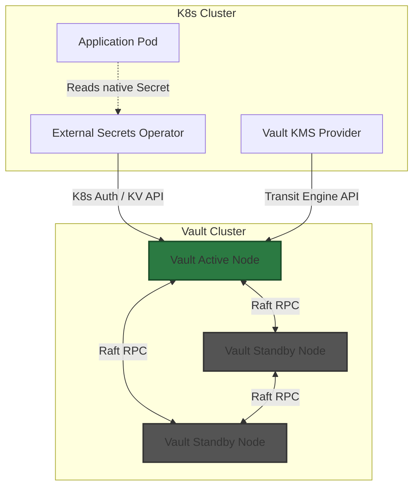

# Secrets Management on Bare Metal

## Learning Outcomes

*   Architect a highly available HashiCorp Vault cluster using Integrated Storage (Raft) on bare metal.
*   Resolve the circular dependency problem when configuring Kubernetes Encryption at Rest (KMS v2) with an in-cluster secret store.
*   Implement the External Secrets Operator (ESO) to synchronize Vault secrets into native Kubernetes `Secret` objects.
*   Configure Vault's Kubernetes Authentication method using Service Account Token Volume Projection.
*   Design a dynamic secrets pipeline for database credentials with automatic rotation and TTL enforcement.

## The Bare Metal Root of Trust Problem

In managed cloud environments, secrets management relies heavily on the provider's Key Management Service (AWS KMS, GCP KMS, Azure Key Vault). The cloud provider secures the root of trust, handles hardware security modules (HSMs), and manages the unseal process. 

On bare metal, you are responsible for the entire chain of trust. This introduces specific operational hurdles:
1.  **The Bootstrap Problem**: How do you store the secret that decrypts the secret store? 
2.  **Stateful Storage**: A highly available secret store requires consensus and replicated storage independent of the workloads it serves.
3.  **Etcd Encryption**: Kubernetes stores secrets in base64 format in etcd by default. Anyone with file-system access to the etcd nodes, or etcd client certificates, has full plaintext access to all cluster secrets.

To build a production-grade bare metal secrets architecture, you must deploy an independent secret management system (typically HashiCorp Vault), secure the delivery of those secrets to application Pods, and encrypt the underlying Kubernetes etcd datastore.

## HashiCorp Vault on Bare Metal Architecture

HashiCorp Vault is the industry standard for bare metal secret management. Historically, Vault required a separate Consul cluster for highly available storage backend. Current architectures use **Integrated Storage (Raft)**, removing the Consul dependency and reducing operational overhead.

### Integrated Storage (Raft) Consensus

Vault uses the Raft consensus algorithm. A Raft cluster requires a quorum of `(N/2) + 1` nodes to operate. For a production deployment, use either 3 or 5 nodes. 



### The Unseal Process

When a Vault node starts, it is *sealed*. It knows where the encrypted data is, but it does not have the Master Key to decrypt it. 

On bare metal, you have three options for unsealing:
1.  **Shamir's Secret Sharing (Manual)**: The Master Key is split into multiple shards (e.g., 5). A threshold of shards (e.g., 3) must be provided manually by operators via the Vault API or CLI to unseal the node. *Operationally expensive during node evictions or restarts.*
2.  **Transit Auto-unseal**: Vault automatically unseals itself by calling the Transit Secrets Engine of a *different*, centralized Vault cluster. This requires a hub-and-spoke Vault architecture.
3.  **TPM / KMIP Auto-unseal**: Vault integrates with the bare metal host's Trusted Platform Module (TPM) or a hardware KMIP server to retrieve the unseal key.

:::caution[Pod Eviction and Shamir's Secret Sharing]
If you run Vault inside Kubernetes using Shamir's Secret Sharing, any Pod eviction, node drain, or OOMKill will result in a newly scheduled Vault Pod that is **sealed**. This degrades cluster capacity until a human operator intervenes. Prefer Transit Auto-unseal for in-cluster Vault deployments.
:::

## Secret Delivery Mechanisms

Once secrets are in Vault, you must deliver them to the application. There are three primary patterns, each with distinct trade-offs regarding security posture and application compatibility.

| Mechanism | Storage Location | Application UX | Ideal Use Case |
| :--- | :--- | :--- | :--- |
| **External Secrets Operator (ESO)** | K8s `Secret` (etcd) | Native K8s (`envFrom`, volumes) | Legacy apps, standard K8s deployments. Requires etcd encryption. |
| **Vault Agent Injector** | Pod memory (`tmpfs`) | File-based (`/vault/secrets/`) | Strict compliance environments where secrets must never touch etcd. |
| **Secrets Store CSI Driver** | Pod memory (`tmpfs`) | File-based, optionally syncs to K8s `Secret` | High-volume file-based secrets, multi-provider environments. |

### External Secrets Operator (ESO)

ESO reconciles external secret management APIs with native Kubernetes `Secret` objects. It allows developers to consume secrets using standard Kubernetes paradigms while keeping the source of truth in Vault.

ESO utilizes two primary Custom Resource Definitions (CRDs):
1.  **SecretStore / ClusterSecretStore**: Defines how ESO authenticates to the external provider (e.g., Vault URL, Kubernetes Auth role).
2.  **ExternalSecret**: Defines the mapping between the external secret (e.g., Vault KV path `secret/data/db-creds`) and the resulting Kubernetes `Secret`.

## Kubernetes Authentication Method

To avoid hardcoding tokens, Vault must cryptographically verify the identity of the Pod requesting the secret. Vault achieves this using the **Kubernetes Authentication Method** via Service Account Token Volume Projection.

1.  A Pod is created with a specific Kubernetes Service Account.
2.  Kubernetes injects a short-lived, signed JSON Web Token (JWT) into the Pod.
3.  The Pod (or ESO/Vault Agent on its behalf) sends this JWT to Vault's login endpoint.
4.  Vault calls the Kubernetes API Server's `TokenReview` API to validate the JWT's signature and retrieve the Service Account name and namespace.
5.  If the Service Account matches a configured Vault Role, Vault issues a Vault Token with specific policy permissions.

## Encryption at Rest (KMS v2)

If you use ESO or sealed-secrets, secrets end up in etcd. You must configure Kubernetes Encryption at Rest.

Kubernetes 1.27+ introduced KMS v2 (stable in 1.29+). Instead of using a local AES key in a file on the master nodes, the API server sends encryption and decryption requests via a local Unix domain socket to a KMS plugin.

On bare metal, you deploy a Vault KMS Provider as a static pod on your control plane nodes. This provider translates KMS v2 gRPC calls into Vault Transit Engine API calls.

:::tip[The Circular Dependency]
**Do not run the Vault cluster that provides etcd encryption inside the same Kubernetes cluster it is encrypting.**
If the Kubernetes cluster cold-boots, the API server cannot read etcd until Vault responds. Vault cannot schedule or route traffic until the API server is functional. For KMS integration, Vault must run externally (e.g., via Nomad, systemd, or a dedicated management K8s cluster).
:::

## Dynamic Secrets and PKI

Vault's true value on bare metal extends beyond static Key-Value storage.

### Database Secrets Engine
Vault can dynamically generate unique, ephemeral credentials for databases (PostgreSQL, MySQL, Redis). 
1.  The application requests credentials.
2.  Vault connects to the database, executes a `CREATE ROLE` statement with a generated password, and returns it to the app.
3.  Vault tracks the lease. When the lease expires (or the app terminates), Vault executes a `DROP ROLE`, instantly revoking access.

### PKI Secrets Engine
Operating a bare metal cluster requires extensive internal TLS (etcd, webhook servers, ingress backends). Vault's PKI engine acts as a private Certificate Authority. When paired with `cert-manager` (via the `ClusterIssuer` Vault integration), Pods can automatically request and rotate x509 certificates without human intervention.

---

## Hands-on Lab

In this lab, you will deploy a 3-node HA Vault cluster with Raft storage, configure Kubernetes authentication, and deploy the External Secrets Operator to sync a KV secret into a native Kubernetes Secret.

### Prerequisites
*   A running Kubernetes cluster (e.g., `kind`, `k3s`, or a bare metal lab).
*   `kubectl` configured to access the cluster.
*   `helm` installed locally.

### Step 1: Deploy Vault in HA Mode

Add the HashiCorp Helm repository and create a customized `values.yaml` for a Raft-backed HA deployment.

```bash
helm repo add hashicorp https://helm.releases.hashicorp.com
helm repo update
```

Create `vault-values.yaml`:

```yaml
server:
  affinity: "" # Disable anti-affinity for local testing, remove in production
  ha:
    enabled: true
    replicas: 3
    raft:
      enabled: true
      setNodeId: true
      config: |
        ui = true
        listener "tcp" {
          tls_disable = 1
          address = "[::]:8200"
          cluster_address = "[::]:8201"
        }
        storage "raft" {
          path = "/vault/data"
        }
```

Install the Helm chart in a dedicated namespace:

```bash
kubectl create namespace vault
helm install vault hashicorp/vault -n vault -f vault-values.yaml
```

Wait for the pods to spawn. They will not be ready until initialized and unsealed.
```bash
kubectl get pods -n vault -l app.kubernetes.io/name=vault
```

### Step 2: Initialize and Unseal Vault

Initialize the first node. This outputs the Unseal Keys and the Initial Root Token. **Save this output.**

```bash
kubectl exec -n vault vault-0 -- vault operator init -key-shares=1 -key-threshold=1 -format=json > cluster-keys.json
```
*Note: We are using 1 key share for lab simplicity. Production requires 5 shares and a threshold of 3.*

Extract the unseal key and root token:
```bash
VAULT_UNSEAL_KEY=$(jq -r ".unseal_keys_b64[]" cluster-keys.json)
VAULT_ROOT_TOKEN=$(jq -r ".root_token" cluster-keys.json)
```

Unseal all three nodes:
```bash
for i in 0 1 2; do
  kubectl exec -n vault vault-${i} -- vault operator unseal $VAULT_UNSEAL_KEY
done
```

Verify Raft cluster status:
```bash
kubectl exec -n vault vault-0 -- sh -c "VAULT_TOKEN=$VAULT_ROOT_TOKEN vault operator raft list-peers"
```
*Output should show vault-0, vault-1, and vault-2, with one elected as the leader.*

### Step 3: Enable KV and Create a Secret

Log into the active node and enable the Key-Value v2 engine:

```bash
kubectl exec -it -n vault vault-0 -- sh
# Inside the pod:
export VAULT_TOKEN=<your-root-token>
vault secrets enable -path=secret kv-v2
vault kv put secret/myapp/config database_password="super-secure-bare-metal-password" api_key="12345ABC"
exit
```

### Step 4: Configure Kubernetes Authentication

Vault needs to verify Kubernetes Service Accounts. We configure the `kubernetes` auth method.

```bash
kubectl exec -it -n vault vault-0 -- sh
# Inside the pod:
export VAULT_TOKEN=<your-root-token>

# Enable the K8s auth method
vault auth enable kubernetes

# Configure Vault to talk to the K8s API server
vault write auth/kubernetes/config \
    kubernetes_host="https://$KUBERNETES_SERVICE_HOST:$KUBERNETES_SERVICE_PORT"

# Create a policy allowing read access to our secret
vault policy write app-read-policy - <<EOF
path "secret/data/myapp/config" {
  capabilities = ["read"]
}
EOF

# Bind the policy to a Kubernetes Service Account named 'eso-service-account' in the 'default' namespace
vault write auth/kubernetes/role/eso-role \
    bound_service_account_names=eso-service-account \
    bound_service_account_namespaces=default \
    policies=app-read-policy \
    ttl=1h
exit
```

### Step 5: Deploy External Secrets Operator

Install ESO via Helm:

```bash
helm repo add external-secrets https://charts.external-secrets.io
helm install external-secrets external-secrets/external-secrets \
    -n external-secrets \
    --create-namespace \
    --set installCRDs=true
```

### Step 6: Create the SecretStore and ExternalSecret

Create the Service Account in the `default` namespace that Vault expects:
```bash
kubectl create serviceaccount eso-service-account -n default
```

Apply the `SecretStore` to instruct ESO how to authenticate to Vault:

```yaml
# secret-store.yaml
apiVersion: external-secrets.io/v1beta1
kind: SecretStore
metadata:
  name: vault-backend
  namespace: default
spec:
  provider:
    vault:
      server: "http://vault.vault.svc.cluster.local:8200"
      path: "secret"
      version: "v2"
      auth:
        kubernetes:
          mountPath: "kubernetes"
          role: "eso-role"
          serviceAccountRef:
            name: "eso-service-account"
```
```bash
kubectl apply -f secret-store.yaml
```

Apply the `ExternalSecret` to fetch the data and create a native K8s Secret:

```yaml
# external-secret.yaml
apiVersion: external-secrets.io/v1beta1
kind: ExternalSecret
metadata:
  name: myapp-secret
  namespace: default
spec:
  refreshInterval: "15s"
  secretStoreRef:
    name: vault-backend
    kind: SecretStore
  target:
    name: myapp-k8s-secret # The name of the resulting K8s Secret
  data:
  - secretKey: DB_PASS
    remoteRef:
      key: myapp/config
      property: database_password
  - secretKey: API_KEY
    remoteRef:
      key: myapp/config
      property: api_key
```
```bash
kubectl apply -f external-secret.yaml
```

### Step 7: Verify Validation

Check the status of the ExternalSecret. It should report `SecretSynced`.
```bash
kubectl get externalsecret myapp-secret
```

View the dynamically created native Kubernetes Secret:
```bash
kubectl get secret myapp-k8s-secret -o jsonpath='{.data.DB_PASS}' | base64 --decode
# Output: super-secure-bare-metal-password
```

---

## Practitioner Gotchas

### 1. Raft Quorum Loss During Upgrades
**The Problem:** Operators perform a rolling restart or Helm upgrade of a 3-node Vault cluster too quickly. If node A is restarting and node B is cordoned, quorum is lost, and the cluster immediately drops read/write traffic.
**The Fix:** Always verify `vault operator raft list-peers` confirms node A has fully rejoined and caught up on the Raft index before restarting node B. Use PodDisruptionBudgets (PDB) with `maxUnavailable: 1` to enforce this at the Kubernetes scheduler level.

### 2. JWT Audience Mismatches
**The Problem:** Vault Kubernetes auth fails with `claim "aud" is invalid`.
**The Fix:** By default, Vault expects the JWT audience to be the Vault URL or a specific string. Kubernetes 1.21+ issues Bound Service Account Tokens with an audience typically tied to the cluster (e.g., `https://kubernetes.default.svc.cluster.local`). You must configure `issuer` and `disable_iss_validation=true` (or configure the exact matching issuer) in `vault write auth/kubernetes/config`.

### 3. API Rate Limiting from ESO
**The Problem:** An aggressive `refreshInterval` (e.g., `1s`) on hundreds of `ExternalSecret` objects causes Vault to exhaust its max connections, or CPU spikes heavily on the active Raft node validating Kubernetes JWTs.
**The Fix:** Increase `refreshInterval` to `15m` or `1h` for static secrets. For immediate updates, utilize ESO's webhook event driven architecture rather than polling, or use Vault Agent's templating which maintains a persistent watch connection.

### 4. KMS Provider Socket Death
**The Problem:** The Vault KMS static pod on the control plane dies or cannot route to the Vault cluster. The Kubernetes API server becomes completely unresponsive because it cannot decrypt the Service Account tokens required for authentication.
**The Fix:** The KMS provider must be treated as a Tier 0 dependency. Run the KMS provider in highly available mode on all control plane nodes, and ensure the Vault cluster it points to is *external* to the Kubernetes cluster to avoid the circular boot-up dependency.

---

## Quiz

**1. A bare metal Kubernetes cluster utilizes a 3-node HashiCorp Vault cluster (Raft storage) deployed via Helm inside the same cluster. Shamir's Secret Sharing is used for unsealing. Due to a memory leak, the Kubernetes OOMKiller terminates the Vault leader Pod. What is the immediate state of the cluster when the Pod is rescheduled?**
A) The Pod automatically pulls the unseal keys from etcd and resumes leadership.
B) The Raft cluster elects a new leader from the remaining two nodes, but the rescheduled Pod remains sealed and cannot serve traffic until manually unsealed.
C) The entire Vault cluster seals itself to protect data integrity and requires manual intervention for all nodes.
D) The External Secrets Operator caches the Master Key and automatically injects it into the rescheduled Pod.

*Correct Answer: B* (The Raft quorum is maintained by the remaining two nodes, allowing them to elect a leader and serve traffic, but the newly spawned pod comes up sealed and requires human intervention.)

**2. You need to provide database credentials to a legacy application running in Kubernetes. The application strictly requires credentials to be mounted as native Kubernetes Environment Variables (`envFrom: secretRef`). Which secret delivery mechanism MUST you use?**
A) Vault Agent Injector
B) Secrets Store CSI Driver with `syncSecret` disabled
C) External Secrets Operator (ESO)
D) Vault Transit Engine

*Correct Answer: C* (ESO creates native Kubernetes `Secret` objects, which is the only way to support `envFrom: secretRef`. Agent Injector and CSI driver primarily mount files.)

**3. You are implementing Kubernetes Encryption at Rest (KMS v2) using Vault. Where is the most architecturally sound location to run the Vault cluster acting as the KMS provider?**
A) Inside the target Kubernetes cluster in the `kube-system` namespace.
B) Outside the target Kubernetes cluster, on dedicated infrastructure or a separate management cluster.
C) As a DaemonSet on the target Kubernetes cluster's worker nodes.
D) As a sidecar container attached to the `kube-apiserver` static pod.

*Correct Answer: B* (Running it inside the cluster creates a circular dependency: K8s needs Vault to read etcd to boot, but Vault needs K8s to schedule its pods and route its traffic.)

**4. When configuring Vault's Kubernetes Authentication method, Vault receives a JWT from an application Pod. How does Vault verify that the token is valid and belongs to the claimed Service Account?**
A) Vault uses the Kubernetes `TokenReview` API, sending the token to the Kubernetes API Server for validation.
B) Vault decrypts the token locally using the Kubernetes cluster's public TLS certificate.
C) Vault queries etcd directly to check the Service Account object state.
D) Vault compares the token against a static list of tokens injected during the Helm installation.

*Correct Answer: A* (Vault delegates the validation back to the Kubernetes API server via the `TokenReview` API endpoint.)

**5. An engineering team wants to eliminate long-lived database passwords. They configure Vault's Database Secrets Engine to generate dynamic credentials for PostgreSQL. What occurs when a Pod requesting these credentials terminates?**
A) The database credentials remain valid until a manual rotation script is executed.
B) ESO intercepts the SIGTERM signal and sends a `DELETE` request to PostgreSQL.
C) Vault observes the lease expiration or explicit revocation and automatically executes a `DROP ROLE` command in PostgreSQL.
D) The credentials remain active, but Vault blacklists the Pod's IP address in the PostgreSQL `pg_hba.conf` file.

*Correct Answer: C* (Vault manages the lifecycle via leases. When the lease expires or is revoked, Vault actively drops the role in the target database.)

---

## Further Reading

*   [HashiCorp Vault: Kubernetes Auth Method](https://developer.hashicorp.com/vault/docs/auth/kubernetes)
*   [External Secrets Operator Documentation](https://external-secrets.io/)
*   [Kubernetes Documentation: Encrypting Secret Data at Rest (KMS v2)](https://kubernetes.io/docs/tasks/administer-cluster/encrypt-data/)
*   [Vault Integrated Storage (Raft) Reference](https://developer.hashicorp.com/vault/docs/internals/integrated-storage)