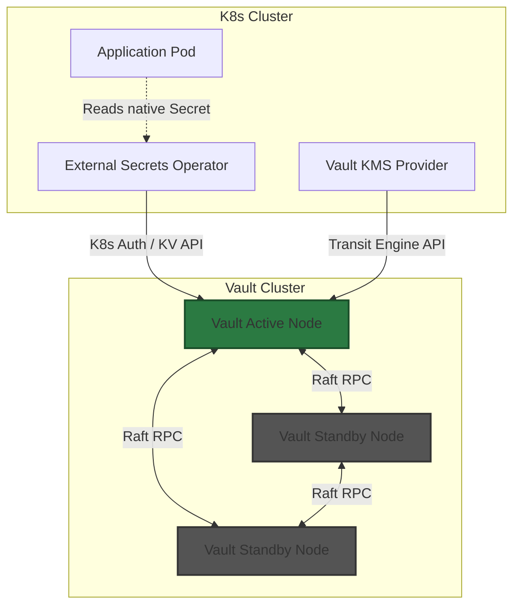

## Learning Outcomes

*   Architect a highly available HashiCorp Vault cluster using Integrated Storage (Raft) on bare metal.
*   Resolve the circular dependency problem when configuring Kubernetes Encryption at Rest (KMS v2) with an in-cluster secret store.
*   Implement the External Secrets Operator (ESO) to synchronize Vault secrets into native Kubernetes `Secret` objects.
*   Configure Vault's Kubernetes Authentication method using Service Account Token Volume Projection.
*   Design a dynamic secrets pipeline for database credentials with automatic rotation and TTL enforcement.

## The Bare Metal Root of Trust Problem

In managed cloud environments, secrets management relies heavily on the provider's Key Management Service (AWS KMS, GCP KMS, Azure Key Vault). The cloud provider secures the root of trust, handles hardware security modules (HSMs), and manages the unseal process. 

On bare metal, you are responsible for the entire chain of trust. This introduces specific operational hurdles:
1.  **The Bootstrap Problem**: How do you store the secret that decrypts the secret store? 
2.  **Stateful Storage**: A highly available secret store requires consensus and replicated storage independent of the workloads it serves.
3.  **Etcd Encryption**: Kubernetes stores secrets in base64 format in etcd by default (which is merely obfuscation, not true confidentiality). Anyone with file-system access to the etcd nodes, etcd client certificates, or sufficient Kubernetes API access can retrieve and read the plaintext contents of all cluster secrets.

To build a production-grade bare metal secrets architecture, you must deploy an independent secret management system (typically HashiCorp Vault), secure the delivery of those secrets to application Pods, and encrypt the underlying Kubernetes etcd datastore.

## HashiCorp Vault on Bare Metal Architecture

HashiCorp Vault is the industry standard for bare metal secret management. Historically, Vault required a separate Consul cluster for highly available storage backend. Current architectures use **Integrated Storage (Raft)**, removing the Consul dependency and reducing operational overhead.

### Integrated Storage (Raft) Consensus

Vault uses the Raft consensus algorithm. A Raft cluster requires a quorum of `(N/2) + 1` nodes to operate. For a production deployment, use either 3 or 5 nodes. 


```mermaid
graph TD
    subgraph K8s Cluster
        PodA[Application Pod]
        ESO[External Secrets Operator]
        KMS[Vault KMS Provider]
    end

    subgraph Vault Cluster 
        V1[Vault Active Node]
        V2[Vault Standby Node]
        V3[Vault Standby Node]
        
        V1 <-->|Raft RPC| V2
        V1 <-->|Raft RPC| V3
        V2 <-->|Raft RPC| V3
    end

    PodA -.->|Reads native Secret| ESO
    ESO -->|K8s Auth / KV API| V1
    KMS -->|Transit Engine API| V1
    
    classDef active fill:#2b7a42,stroke:#1a4d29,stroke-width:2px;
    classDef standby fill:#545454,stroke:#333,stroke-width:2px;
    class V1 active;
    class V2,V3 standby;
```

### The Unseal Process

When a Vault node starts, it is *sealed*. It knows where the encrypted data is, but it does not have the Master Key to decrypt it. 

On bare metal, you have three options for unsealing:
1.  **Shamir's Secret Sharing (Manual)**: The Master Key is split into multiple shards (e.g., 5). A threshold of shards (e.g., 3) must be provided manually by operators via the Vault API or CLI to unseal the node. *Operationally expensive during node evictions or restarts.*
2.  **Transit Auto-unseal**: Vault automatically unseals itself by calling the Transit Secrets Engine of a *different*, centralized Vault cluster. This requires a hub-and-spoke Vault architecture.
3.  **TPM / KMIP Auto-unseal**: Vault integrates with the bare metal host's Trusted Platform Module (TPM) or a hardware KMIP server to retrieve the unseal key.

> **Stop and think**: If a node crashes and a new pod replaces it, what state will the Vault instance be in upon startup? It will be sealed, which is why Shamir's Secret Sharing is risky for highly dynamic Kubernetes environments without human operators on standby.

:::caution[Pod Eviction and Shamir's Secret Sharing]
If you run Vault inside Kubernetes using Shamir's Secret Sharing, any Pod eviction, node drain, or OOMKill will result in a newly scheduled Vault Pod that is **sealed**. This degrades cluster capacity until a human operator intervenes. Prefer Transit Auto-unseal for in-cluster Vault deployments.
:::

## Secret Delivery Mechanisms

Once secrets are in Vault, you must deliver them to the application. There are three primary patterns, each with distinct trade-offs regarding security posture and application compatibility.

> **Stop and think**: If a developer has permissions to create Pods in a namespace, could they indirectly read Secret values in that namespace even if they lack direct `get secret` RBAC permissions? Yes, by creating a Pod that mounts the Secret and reading the output.

| Mechanism | Storage Location | Application UX | Ideal Use Case |
| :--- | :--- | :--- | :--- |
| **External Secrets Operator (ESO)** | K8s `Secret` (etcd) | Native K8s (`envFrom`, volumes) | Legacy apps, standard K8s deployments. Requires etcd encryption. |
| **Vault Agent Injector** | Pod memory (`tmpfs`) | File-based (`/vault/secrets/`) | Strict compliance environments where secrets must never touch etcd. |
| **Secrets Store CSI Driver** | Pod memory (`tmpfs`) | File-based, optionally syncs to K8s `Secret` | High-volume file-based secrets, multi-provider environments. |

When consuming native Kubernetes Secrets, Kubelet keeps the Secret bytes in non-durable memory (tmpfs) on the node and removes them when the consuming Pod is deleted. Kubernetes supports consuming Secrets as files and as environment variables; required Secrets must exist before containers start. Keep in mind that individual Secret objects are limited to 1MiB. Updates to Secret-backed volumes are propagated to Pods with eventual delay depending on kubelet secret change-detection strategy, but note that `subPath` volume mounts do not receive automatic updates. Only Secret keys with valid environment-variable names can be projected into env vars; invalid names are skipped.

For secrets that do not require rotation, Kubernetes v1.21 introduced Immutable Secrets. Once marked immutable, a Secret cannot revert immutability and cannot have its data field mutated, which improves kube-apiserver performance and protects against accidental overwrites.

### External Secrets Operator (ESO)

External Secrets Operator 2.0 (ESO)—which officially supports Kubernetes v1.34–v1.35—is designed to synchronize secrets from external APIs (like Vault) and reconcile them with native Kubernetes `Secret` objects. It allows developers to consume secrets using standard Kubernetes paradigms while keeping the source of truth in Vault.

> **Pause and predict**: If you use ESO, your secrets end up in etcd. How will you secure the etcd datastore at rest?

ESO utilizes two primary Custom Resource Definitions (CRDs):
1.  **SecretStore / ClusterSecretStore**: Defines how ESO authenticates to the external provider (e.g., Vault URL, Kubernetes Auth role).
2.  **ExternalSecret**: Defines the mapping between the external secret (e.g., Vault KV path `secret/data/db-creds`) and the resulting Kubernetes `Secret`.

## Kubernetes Authentication Method

To avoid hardcoding tokens, Vault must cryptographically verify the identity of the Pod requesting the secret. Vault achieves this using the **Kubernetes Authentication Method** via Service Account Token Volume Projection. 

Since Kubernetes v1.22, short-lived, bound Service Account Tokens are projected by default. Furthermore, as of Kubernetes v1.30 (stable), cleanup controls for legacy auto-generated tokens are active, meaning unused legacy tokens are tracked and potentially invalidated, reinforcing the use of short-lived tokens.

1.  A Pod is created with a specific Kubernetes Service Account.
2.  Kubernetes injects a short-lived, signed JSON Web Token (JWT) into the Pod. These tokens are pod-bound and time-bound.
3.  The Pod (or ESO/Vault Agent on its behalf) sends this JWT to Vault's login endpoint.
4.  Vault calls the Kubernetes API Server's `TokenReview` API to validate the JWT's signature and retrieve the Service Account name and namespace.
5.  If the Service Account matches a configured Vault Role, Vault issues a Vault Token with specific policy permissions.

## Encryption at Rest (KMS v2)

If you use ESO, secrets end up in etcd. Because API data is written unencrypted to etcd by default, encryption at rest is not automatically enabled. You must configure Kubernetes Encryption at Rest.

Kubernetes 1.27+ introduced KMS v2 (stable in 1.29+). Instead of using a local AES key in a file on the master nodes, the API server sends encryption and decryption requests via a local Unix domain socket to a KMS plugin. At-rest encryption is configured with kube-apiserver's `--encryption-provider-config` and controlled by an `EncryptionConfiguration` object.

On bare metal, you deploy a Vault KMS Provider as a static pod on your control plane nodes. This provider translates KMS v2 gRPC calls into Vault Transit Engine API calls. Kubernetes requires etcd v3.x for control planes using the encryption guide.

> **Pause and predict**: If Vault provides the decryption key for etcd, and Vault runs inside Kubernetes (which stores its state in etcd), what happens during a complete cluster cold start? The cluster will permanently hang due to a circular dependency.

:::tip[The Circular Dependency]
**Do not run the Vault cluster that provides etcd encryption inside the same Kubernetes cluster it is encrypting.**
If the Kubernetes cluster cold-boots, the API server cannot read etcd until Vault responds. Vault cannot schedule or route traffic until the API server is functional. For KMS integration, Vault must run externally (e.g., via Nomad, systemd, or a dedicated management K8s cluster).
:::

## Dynamic Secrets and PKI

Vault's true value on bare metal extends beyond static Key-Value storage.

### Database Secrets Engine
Vault can dynamically generate unique, ephemeral credentials for databases (PostgreSQL, MySQL, Redis). 
1.  The application requests credentials.
2.  Vault connects to the database, executes a `CREATE ROLE` statement with a generated password, and returns it to the app.
3.  Vault tracks the lease. When the lease expires (or the app terminates), Vault executes a `DROP ROLE`, instantly revoking access.

### PKI Secrets Engine
Operating a bare metal cluster requires extensive internal TLS (etcd, webhook servers, ingress backends). Vault's PKI engine acts as a private Certificate Authority. When paired with `cert-manager` (via the `ClusterIssuer` Vault integration), Pods can automatically request and rotate x509 certificates without human intervention.

---

## Hands-on Lab

In this lab, you will deploy a 3-node HA Vault cluster with Raft storage, configure Kubernetes authentication, and deploy the External Secrets Operator to sync a KV secret into a native Kubernetes Secret.

### Prerequisites
*   A running Kubernetes cluster (e.g., `kind`, `k3s`, or a bare metal lab) running v1.35.
*   `kubectl` configured to access the cluster.
*   `helm` installed locally.

### Step 1: Deploy Vault in HA Mode

Add the HashiCorp Helm repository and create a customized `values.yaml` for a Raft-backed HA deployment.

```bash
helm repo add hashicorp https://helm.releases.hashicorp.com
helm repo update
```

Create `vault-values.yaml`:

```yaml
server:
  affinity: "" # Disable anti-affinity for local testing, remove in production
  ha:
    enabled: true
    replicas: 3
    raft:
      enabled: true
      setNodeId: true
      config: |
        ui = true
        listener "tcp" {
          tls_disable = 1
          address = "[::]:8200"
          cluster_address = "[::]:8201"
        }
        storage "raft" {
          path = "/vault/data"
        }
```

Install the Helm chart in a dedicated namespace:

```bash
kubectl create namespace vault
helm install vault hashicorp/vault -n vault -f vault-values.yaml
```

Wait for the pods to spawn. They will not be ready until initialized and unsealed.
```bash
kubectl get pods -n vault -l app.kubernetes.io/name=vault
```

### Step 2: Initialize and Unseal Vault

Initialize the first node. This outputs the Unseal Keys and the Initial Root Token. **Save this output.**

```bash
kubectl exec -n vault vault-0 -- vault operator init -key-shares=1 -key-threshold=1 -format=json > cluster-keys.json
```
*Note: We are using 1 key share for lab simplicity. Production requires 5 shares and a threshold of 3.*

Extract the unseal key and root token:
```bash
VAULT_UNSEAL_KEY=$(jq -r ".unseal_keys_b64[]" cluster-keys.json)
VAULT_ROOT_TOKEN=$(jq -r ".root_token" cluster-keys.json)
```

Unseal all three nodes:
```bash
for i in 0 1 2; do
  kubectl exec -n vault vault-${i} -- vault operator unseal $VAULT_UNSEAL_KEY
done
```

Verify Raft cluster status:
```bash
kubectl exec -n vault vault-0 -- sh -c "VAULT_TOKEN=$VAULT_ROOT_TOKEN vault operator raft list-peers"
```
*Output should show vault-0, vault-1, and vault-2, with one elected as the leader.*

### Step 3: Enable KV and Create a Secret

Log into the active node and enable the Key-Value v2 engine:

```bash
kubectl exec -it -n vault vault-0 -- sh
# Inside the pod:
export VAULT_TOKEN=<your-root-token>
vault secrets enable -path=secret kv-v2
vault kv put secret/myapp/config database_password="super-secure-bare-metal-password" api_key="12345ABC"
exit
```

### Step 4: Configure Kubernetes Authentication

Vault needs to verify Kubernetes Service Accounts. We configure the `kubernetes` auth method.

```bash
kubectl exec -it -n vault vault-0 -- sh
# Inside the pod:
export VAULT_TOKEN=<your-root-token>

# Enable the K8s auth method
vault auth enable kubernetes

# Configure Vault to talk to the K8s API server
vault write auth/kubernetes/config \
    kubernetes_host="https://$KUBERNETES_SERVICE_HOST:$KUBERNETES_SERVICE_PORT"

# Create a policy allowing read access to our secret
vault policy write app-read-policy - <<EOF
path "secret/data/myapp/config" {
  capabilities = ["read"]
}
EOF

# Bind the policy to a Kubernetes Service Account named 'eso-service-account' in the 'default' namespace
vault write auth/kubernetes/role/eso-role \
    bound_service_account_names=eso-service-account \
    bound_service_account_namespaces=default \
    policies=app-read-policy \
    ttl=1h
exit
```

### Step 5: Deploy External Secrets Operator

Install ESO via Helm:

```bash
helm repo add external-secrets https://charts.external-secrets.io
helm install external-secrets external-secrets/external-secrets \
    -n external-secrets \
    --create-namespace \
    --set installCRDs=true
```

### Step 6: Create the SecretStore and ExternalSecret

Create the Service Account in the `default` namespace that Vault expects:
```bash
kubectl create serviceaccount eso-service-account -n default
```

Apply the `SecretStore` to instruct ESO how to authenticate to Vault:

```yaml
# secret-store.yaml
apiVersion: external-secrets.io/v1beta1
kind: SecretStore
metadata:
  name: vault-backend
  namespace: default
spec:
  provider:
    vault:
      server: "http://vault.vault.svc.cluster.local:8200"
      path: "secret"
      version: "v2"
      auth:
        kubernetes:
          mountPath: "kubernetes"
          role: "eso-role"
          serviceAccountRef:
            name: "eso-service-account"
```
```bash
kubectl apply -f secret-store.yaml
```

Apply the `ExternalSecret` to fetch the data and create a native K8s Secret:

```yaml
# external-secret.yaml
apiVersion: external-secrets.io/v1beta1
kind: ExternalSecret
metadata:
  name: myapp-secret
  namespace: default
spec:
  refreshInterval: "15s"
  secretStoreRef:
    name: vault-backend
    kind: SecretStore
  target:
    name: myapp-k8s-secret # The name of the resulting K8s Secret
  data:
  - secretKey: DB_PASS
    remoteRef:
      key: myapp/config
      property: database_password
  - secretKey: API_KEY
    remoteRef:
      key: myapp/config
      property: api_key
```
```bash
kubectl apply -f external-secret.yaml
```

### Step 7: Verify Validation

Check the status of the ExternalSecret. It should report `SecretSynced`.
```bash
kubectl get externalsecret myapp-secret
```

View the dynamically created native Kubernetes Secret:
```bash
kubectl get secret myapp-k8s-secret -o jsonpath='{.data.DB_PASS}' | base64 --decode
# Output: super-secure-bare-metal-password
```

---

## Practitioner Gotchas

### 1. Raft Quorum Loss During Upgrades
**The Problem:** Operators perform a rolling restart or Helm upgrade of a 3-node Vault cluster too quickly. If node A is restarting and node B is cordoned, quorum is lost, and the cluster stops serving read/write traffic until quorum is restored.
**The Fix:** Always verify `vault operator raft list-peers` confirms node A has fully rejoined and caught up on the Raft index before restarting node B. Use PodDisruptionBudgets (PDB) with `maxUnavailable: 1` to enforce this at the Kubernetes scheduler level.

### 2. JWT Audience Mismatches
**The Problem:** Vault Kubernetes auth fails with `claim "aud" is invalid`.
**The Fix:** By default, Vault expects the JWT audience to be the Vault URL or a specific string. Kubernetes 1.21+ issues Bound Service Account Tokens with an audience typically tied to the cluster (e.g., `https://kubernetes.default.svc.cluster.local`). You must configure `issuer` and `disable_iss_validation=true` (or configure the exact matching issuer) in `vault write auth/kubernetes/config`.

### 3. API Rate Limiting from ESO
**The Problem:** An aggressive `refreshInterval` (e.g., `1s`) on hundreds of `ExternalSecret` objects causes Vault to exhaust its max connections, or CPU spikes heavily on the active Raft node validating Kubernetes JWTs.
**The Fix:** Increase `refreshInterval` to `15m` or `1h` for static secrets. For immediate updates, utilize ESO's webhook event driven architecture rather than polling, or use Vault Agent's templating which maintains a persistent watch connection.

### 4. KMS Provider Socket Death
**The Problem:** The Vault KMS static pod on the control plane dies or cannot route to the Vault cluster. The Kubernetes API server becomes completely unresponsive because it cannot decrypt the Service Account tokens required for authentication.
**The Fix:** The KMS provider must be treated as a Tier 0 dependency. Run the KMS provider in highly available mode on all control plane nodes, and ensure the Vault cluster it points to is *external* to the Kubernetes cluster to avoid the circular boot-up dependency.

---

## Quiz

**1. You are managing a bare metal Kubernetes cluster that utilizes a 3-node HashiCorp Vault cluster (Raft storage) deployed via Helm inside the same cluster. Shamir's Secret Sharing is used for unsealing. Over the weekend, a memory leak causes the Kubernetes OOMKiller to terminate the Vault leader Pod. When you log in on Monday morning, what is the immediate state of the Vault cluster?**
A) The Pod automatically pulls the unseal keys from etcd and resumes leadership.
B) The Raft cluster elects a new leader from the remaining two nodes, but the rescheduled Pod remains sealed and cannot serve traffic until manually unsealed.
C) The entire Vault cluster seals itself to protect data integrity and requires manual intervention for all nodes.
D) The External Secrets Operator caches the Master Key and automatically injects it into the rescheduled Pod.

*Correct Answer: B*
Why? The Raft quorum requires only a simple majority ((N/2)+1) to maintain consensus, meaning the two surviving nodes will successfully elect a new leader and continue serving read/write traffic. However, the newly scheduled Vault Pod boots in a sealed state because Shamir's Secret Sharing requires a human operator to provide the unseal keys manually. Until the threshold of unseal keys is provided to this specific new Pod, it cannot participate fully in the cluster or serve cryptographic requests, operating in a degraded capacity. This situation highlights why Transit Auto-unseal is preferred for Kubernetes-based Vault deployments, as it avoids manual intervention during automated pod rescheduling.

**2. A development team is migrating a legacy monolithic application to your bare metal Kubernetes environment. The application code cannot be modified and strictly requires its database credentials to be loaded natively as environment variables from a Kubernetes Secret. Given your organizational mandate to keep the master copy of all credentials in HashiCorp Vault, which secret delivery mechanism MUST you implement for this specific application?**
A) Vault Agent Injector
B) Secrets Store CSI Driver with `syncSecret` disabled
C) External Secrets Operator (ESO)
D) Vault Transit Engine

*Correct Answer: C*
Why? The legacy application strictly requires native Kubernetes Environment Variables, which means a native Kubernetes `Secret` object must exist in the cluster to map to the Pod's `envFrom` declaration. The External Secrets Operator (ESO) is specifically designed to synchronize secrets from external APIs (like Vault) and create these native Kubernetes `Secret` objects. The Vault Agent Injector and the Secrets Store CSI Driver (without `syncSecret` enabled) primarily project secrets into Pods as file-based tmpfs volumes, which does not satisfy the application's requirement for native environment variables. Furthermore, only Secret keys with valid environment-variable names can be projected into env vars.

**3. Your infrastructure team is tasked with implementing Kubernetes Encryption at Rest using KMS v2 to protect secrets stored in etcd. You plan to use your existing HashiCorp Vault deployment as the KMS provider. During the architectural review, a senior engineer flags a potential circular dependency risk. Which deployment topology avoids this circular dependency?**
A) Deploying the Vault cluster as a DaemonSet inside the target Kubernetes cluster's `kube-system` namespace.
B) Hosting the Vault cluster completely outside the target Kubernetes cluster, on dedicated infrastructure or a separate management cluster.
C) Running the Vault KMS provider as a sidecar container attached to the `kube-apiserver` static pod.
D) Using the Secrets Store CSI driver to mount the KMS encryption key directly into etcd.

*Correct Answer: B*
Why? A critical circular dependency occurs if the Vault cluster providing the KMS encryption is hosted inside the very Kubernetes cluster it is trying to encrypt. If the Kubernetes cluster cold-boots, the API server cannot read etcd until it contacts Vault to decrypt the data. However, Vault cannot schedule its Pods or route its network traffic until the API server is functional and etcd is readable. Hosting Vault on external infrastructure ensures that it is already running and accessible when the Kubernetes API server initializes, breaking the dependency loop.

**4. You have configured Vault's Kubernetes Authentication method to allow an application Pod to retrieve secrets. The Pod initiates the login process by sending its Service Account token to Vault. How does Vault definitively verify that this token is authentic and actually belongs to the claimed Service Account before issuing a Vault token?**
A) Vault delegates the validation by sending the token to the Kubernetes API Server via the `TokenReview` API.
B) Vault decrypts the token locally using a cached copy of the Kubernetes cluster's public TLS certificate.
C) Vault directly queries the underlying etcd datastore to check the Service Account object's active state.
D) Vault compares the token against a static list of approved JWTs injected during the initial Helm installation.

*Correct Answer: A*
Why? Vault does not attempt to parse and cryptographically verify the Service Account JWT locally as its primary validation mechanism. Instead, it relies on the authoritative source by submitting the provided token to the Kubernetes API Server's `TokenReview` endpoint. The Kubernetes API server then validates the token's signature, checks if it has expired, and confirms the token has not been revoked. The API server replies to Vault with the validated Service Account name and namespace, which Vault then matches against its configured roles to determine access permissions.

**5. An engineering team wants to eliminate the risk of long-lived, static database passwords leaking. They configure Vault's Database Secrets Engine to generate dynamic, ephemeral credentials for a PostgreSQL backend. What exactly happens at the infrastructure level when an application Pod using these dynamic credentials terminates normally?**
A) The database credentials remain valid in PostgreSQL until a scheduled cronjob executes a rotation script.
B) The External Secrets Operator intercepts the Pod's SIGTERM signal and sends a `DELETE` request to PostgreSQL.
C) Vault observes that the secret's lease has expired (or was explicitly revoked) and automatically executes a `DROP ROLE` command directly in PostgreSQL.
D) The credentials remain active in the database, but Vault dynamically blacklists the terminated Pod's IP address in the `pg_hba.conf` file.

*Correct Answer: C*
Why? Vault's dynamic secrets engine does not just issue passwords; it actively manages the lifecycle of the credentials in the target system using leases. When the application requests credentials, Vault connects to PostgreSQL and issues a `CREATE ROLE` command. Vault then tracks the time-to-live (TTL) of that lease. When the lease expires naturally, or if the client/orchestrator explicitly revokes the lease upon Pod termination, Vault automatically connects back to PostgreSQL and executes a `DROP ROLE` command. This ensures the credentials no longer exist once Vault revokes the lease, effectively closing the access window without requiring manual cleanup scripts.

---

## Further Reading

*   [HashiCorp Vault: Kubernetes Auth Method](https://developer.hashicorp.com/vault/docs/auth/kubernetes)
*   [External Secrets Operator Documentation](https://external-secrets.io/)
*   [Kubernetes Documentation: Encrypting Secret Data at Rest (KMS v2)](https://kubernetes.io/docs/tasks/administer-cluster/encrypt-data/)
*   [Vault Integrated Storage (Raft) Reference](https://developer.hashicorp.com/vault/docs/internals/integrated-storage)

## Sources

- [Kubernetes: Encrypting Confidential Data at Rest](https://kubernetes.io/docs/tasks/administer-cluster/encrypt-data/) — Primary reference for etcd encryption, provider choices, and when KMS v2 is appropriate.
- [Vault Kubernetes Auth Method](https://developer.hashicorp.com/vault/docs/auth/kubernetes) — Primary guide for TokenReview-based auth, short-lived ServiceAccount tokens, and audience/issuer considerations.
- [Vault Integrated Storage (Raft)](https://developer.hashicorp.com/vault/docs/concepts/integrated-storage) — Primary reference for Raft quorum, failure tolerance, node catch-up, and operational HA behavior.
