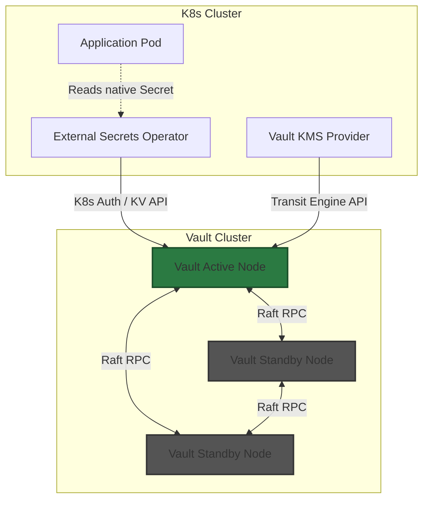
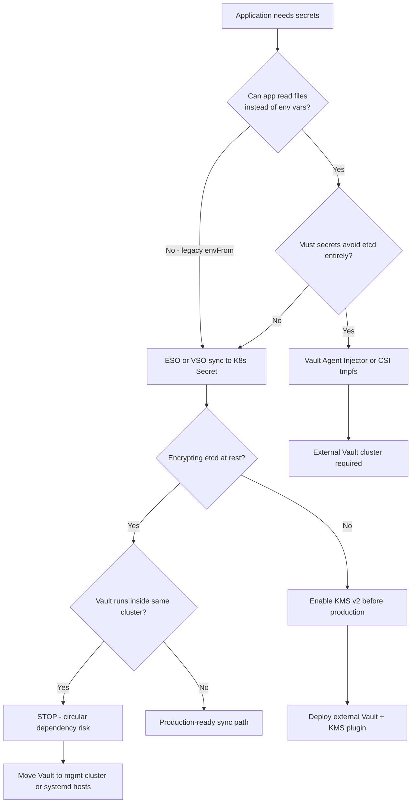

## What You'll Be Able to Do

By the end of this module you will be able to:

- **Architect** a highly available HashiCorp Vault cluster using Integrated Storage (Raft) on bare metal, including quorum sizing, auto-unseal tradeoffs, and PodDisruptionBudget guardrails for in-cluster deployments.
- **Resolve** the circular dependency problem when configuring Kubernetes Encryption at Rest with KMS v2 and an external secret store, choosing a topology where Vault is reachable before the API server needs to decrypt etcd.
- **Implement** the External Secrets Operator (ESO) to synchronize Vault KV secrets into native Kubernetes `Secret` objects, including Kubernetes auth roles, refresh intervals, and etcd encryption prerequisites.
- **Configure** Vault's Kubernetes Authentication method using Service Account Token Volume Projection, including audience (`aud`) and issuer alignment for bound tokens on Kubernetes 1.35.
- **Design** a dynamic secrets pipeline for database credentials with automatic rotation, lease TTL enforcement, and revocation on workload termination.

## Why This Module Matters

**Hypothetical scenario:** Your platform team deploys a three-node Vault Raft cluster inside the same bare-metal Kubernetes cluster that stores every application secret. Over a holiday weekend, a control-plane node fails during a rack power event. When operators return, the API server cannot decrypt etcd because the Vault KMS plugin socket on the failed node is gone, while the replacement Vault pods are sealed and waiting for manual Shamir shards that only two people can produce. Application rollouts stall, External Secrets Operator objects report sync errors, and incident bridges discover that nobody documented which Vault cluster was supposed to be external versus in-cluster. The outage lasts hours—not because Vault is unreliable, but because the root-of-trust topology was never designed for cold-start independence on owned hardware.

On managed cloud platforms, you inherit a partial answer to that nightmare. AWS KMS, GCP Cloud KMS, and Azure Key Vault provide a vendor-operated root of trust with HSM-backed keys, audited access paths, and integration hooks that the control plane expects. On bare metal and colocation estates, you own the entire chain: the HSM or transit seal, the Raft quorum, the backup media, the operators who unseal after maintenance, and the licensing posture of the software you run. Kubernetes still stores `Secret` objects in etcd using base64 encoding by default—which is obfuscation, not confidentiality—so anyone with etcd filesystem access, etcd client certificates, or broad API read permissions can recover credential material unless you add encryption at rest and tighten delivery paths.

This module teaches the durable on-premises secrets spine: deploy Vault (or the MPL-licensed **OpenBao** fork) as your control-plane-adjacent secret store, deliver credentials to workloads without baking them into images, and encrypt etcd with KMS v2 when secrets must exist as native Kubernetes objects. You will also learn how to avoid the circular dependencies and licensing traps that turn a secrets migration into a multi-day outage. The operational cost is real—CapEx for HA nodes and HSMs, headcount for seal ceremonies, and runbooks for quorum-preserving upgrades—but for steady high-utilization estates with data gravity, egress-heavy traffic, or regulatory custody requirements, self-hosted secrets management often beats recurring cloud KMS and Secrets Manager fees. The goal is not to replicate AWS; it is to build a defensible root of trust on hardware you control.

## The Bare Metal Root of Trust Problem

In managed cloud environments, secrets management relies heavily on the provider's Key Management Service (AWS KMS, GCP Cloud KMS, Azure Key Vault). The cloud provider secures the root of trust, handles hardware security modules (HSMs), and manages much of the unseal lifecycle through APIs you do not operate. On bare metal, you are responsible for the entire chain of trust from the first power-on of a rack through the last revocation of a database password. That ownership is the defining tradeoff of the on-premises track: stronger custody and predictable long-run economics when utilization is high, in exchange for engineering labor that cloud customers outsource.

Three operational hurdles appear in almost every bare-metal secrets program. First is the **bootstrap problem**: the system that decrypts secrets needs its own master key material, and storing that key in the same datastore you are trying to protect recreates the problem you started with. Second is **stateful storage**: a highly available secret store requires consensus and replicated storage independent of the stateless workloads it serves, which is why Vault's Integrated Storage (Raft) replaced the older pattern of operating a separate Consul cluster for many deployments. Third is **etcd confidentiality**: Kubernetes persists secrets in etcd; without encryption at rest, possession of backup tapes or node disks becomes possession of credential material. Building production-grade bare-metal secrets architecture therefore means deploying an independent secret management system, securing delivery into Pods, and encrypting the Kubernetes datastore when native `Secret` objects are part of your design.

Auto-unseal closes part of the bootstrap gap. Instead of splitting the master key with Shamir's Secret Sharing and requiring human operators after every pod reschedule, Vault can delegate unseal to a **seal** mechanism: another Vault's Transit engine, a PKCS#11 HSM, a KMIP appliance, or cloud KMS in hybrid estates. Each approach shifts risk. Transit auto-unseal creates a hub-and-spoke dependency—lose the hub Vault and spokes remain sealed. HSM auto-unseal adds CapEx and firmware maintenance but keeps keys off general-purpose disks. Shamir remains appropriate for air-gapped labs and break-glass scenarios where network calls to an auto-unseal endpoint are forbidden. Recovery keys (formerly "recovery mode" operations in Vault terminology) let operators perform certain administrative actions when the primary seal is unavailable; document who holds recovery shards with the same rigor as root token custody.

Licensing is part of the on-premises calculus. HashiCorp changed Vault to the Business Source License (BSL) 1.1 in August 2023; Vault 1.14.x was the last Community Edition release under MPL 2.0 before that change. **OpenBao** is the Linux Foundation / OpenSSF community fork that continues MPL 2.0 development with API compatibility aimed at in-place migration from Vault CE. Vault Enterprise and HCP Vault remain HashiCorp/IBM product paths with replication, namespaces, and support contracts. Platform teams choosing OSS on bare metal should decide explicitly among Vault CE (BSL), OpenBao (MPL), and Enterprise based on governance requirements—not assume "HashiCorp Vault" is still OSI-open-source in the sense regulators sometimes require. Run legal and procurement review before you bake a BUSL-dependent binary into a multi-year hardware refresh, because switching horses later still costs migration time even when OpenBao API compatibility is strong.

## HashiCorp Vault on Bare Metal Architecture

HashiCorp Vault is the industry standard for bare-metal secret management, with OpenBao as the MPL-licensed alternative for teams that need OSI-approved licensing. Historically, Vault required a separate Consul cluster for highly available storage; current architectures use **Integrated Storage (Raft)**, removing the Consul dependency and reducing operational overhead while keeping consensus semantics explicit.

### Integrated Storage (Raft) Consensus

Vault uses the Raft consensus algorithm for Integrated Storage. A Raft cluster requires a quorum of `(N/2) + 1` nodes to accept writes. Production deployments typically run three or five server nodes across failure domains—racks, PDUs, or datacenter segments—not merely three pods on one worker. Standby nodes forward requests to the active leader; if the leader disappears, Raft holds an election once quorum remains. Losing two of five nodes still permits writes; losing two of three does not. That arithmetic should drive your upgrade runbooks: never take down more than one Vault node at a time in a three-node cluster unless you have confirmed quorum health.


```mermaid
graph TD
    subgraph K8s Cluster
        PodA[Application Pod]
        ESO[External Secrets Operator]
        KMS[Vault KMS Provider]
    end

    subgraph Vault Cluster 
        V1[Vault Active Node]
        V2[Vault Standby Node]
        V3[Vault Standby Node]
        
        V1 <-->|Raft RPC| V2
        V1 <-->|Raft RPC| V3
        V2 <-->|Raft RPC| V3
    end

    PodA -.->|Reads native Secret| ESO
    ESO -->|K8s Auth / KV API| V1
    KMS -->|Transit Engine API| V1
    
    classDef active fill:#2b7a42,stroke:#1a4d29,stroke-width:2px;
    classDef standby fill:#545454,stroke:#333,stroke-width:2px;
    class V1 active;
    class V2,V3 standby;
```

Namespaces (Enterprise feature; conceptually useful when comparing to OpenBao capabilities) partition administrative boundaries inside one Vault cluster—separate policy trees, auth mounts, and secrets engines per business unit. On bare metal without Enterprise, teams often deploy cluster-per-environment (production, staging, security) instead of namespaces, accepting more Raft clusters in exchange for blast-radius isolation. Policies are HCL documents that grant path-centric capabilities (`read`, `create`, `update`, `delete`, `sudo`) on secrets engines and auth methods. Tokens are leases on policy bundles; they expire, renew within `max_ttl`, and revoke cleanly when Pods terminate if you bind TTL to workload lifetime.

### The Unseal Process and Seal Wrap

When a Vault node starts, it is *sealed*: it knows where encrypted data lives on disk but cannot derive the master key without the configured seal operation. On bare metal you commonly choose among three patterns:

1. **Shamir's Secret Sharing (manual)**: The master key splits into `n` shards with threshold `t`. Operators submit `t` shards via CLI/API after restarts. Operationally expensive during node drains, OOM kills, and automated rescheduling—yet valuable as a break-glass path when auto-unseal endpoints are unreachable.
2. **Transit auto-unseal**: A centralized Vault Transit engine wraps the master key. Spoke clusters unseal automatically if the hub is healthy. Requires hub HA and strict network policy; popular for multi-cluster estates that already operate a management Vault.
3. **PKCS#11 / KMIP / TPM auto-unseal**: Keys never leave HSM or TPM hardware. Aligns with FIPS 140-3 programs and regulated industries; adds hardware refresh cycles and vendor support contracts to your TCO model.

Before choosing Shamir for production Kubernetes, pause and trace the reschedule path: if a node crashes and kubelet schedules a replacement Vault pod, that instance boots **sealed** until operators supply key shards. Without on-call coverage, your secrets plane becomes a single-human bottleneck every time the scheduler moves a pod. That is why highly dynamic bare-metal clusters favor auto-unseal for steady state while keeping Shamir shards in a physical safe for disaster recovery only.

:::caution[Pod Eviction and Shamir's Secret Sharing]
If you run Vault inside Kubernetes using Shamir's Secret Sharing, any Pod eviction, node drain, or OOMKill will result in a newly scheduled Vault Pod that is **sealed**. This degrades cluster capacity until a human operator intervenes. Prefer Transit or HSM auto-unseal for in-cluster Vault deployments, and always pair rolling upgrades with PodDisruptionBudgets `maxUnavailable: 1`.
:::

Audit devices deserve the same tier-zero treatment as seal configuration. Every authentication, policy denial, and secrets engine operation should emit to append-only storage—local files rotated to object storage, or a dedicated logging pipeline forwarded to the SIEM your SOC already monitors. On bare metal, auditors will ask who read which path when; without audit logs, Vault becomes a black box that fails SOC 2 and PCI evidence requests. Enable `log_raw` only when counsel approves—raw logs may contain secret metadata you are obligated to redact in retention systems.

## Secrets Engines: KV, Database, PKI, and Transit

Vault's value on bare metal extends beyond static Key-Value storage. Secrets engines are pluggable backends; understanding four of them covers most platform designs.

**KV version 2** adds versioning, soft-delete, and check-and-set semantics on `secret/data/` paths. Static credentials still belong here when rotation is infrequent, but every static secret is a long-lived bearer credential—prefer dynamic engines when the downstream system supports it. **Database secrets engine** connects to PostgreSQL, MySQL, Oracle, and others, executing `CREATE ROLE` with generated passwords per lease, then `DROP ROLE` on revocation. The blast radius of a leaked credential shrinks to the lease TTL instead of the application's lifetime. **PKI secrets engine** acts as an internal CA for etcd peer certs, webhook servers, ingress backends, and service mesh intermediates—pair with cert-manager's Vault issuer for hands-free rotation. **Transit engine** provides encryption-as-a-service: callers send plaintext (or hashes) to `encrypt`/`decrypt` endpoints without Vault revealing the key material—this is the backbone of the Vault KMS provider for Kubernetes etcd encryption.

Dynamic secrets beat static secrets because rotation becomes an API contract instead of a calendar process. Static database passwords in KV force credential rotation projects that collide with application restarts. Dynamic leases tie credential lifetime to workload lifetime; when the Pod dies, Vault revokes the lease and the database role disappears. The operational cost is connection pooling discipline—applications must handle mid-life credential rotation or use sidecars that reload files on SIGHUP.

Configuring the database secrets engine on bare metal requires network paths from Vault to database listeners that are often firewalled differently than application traffic. Create a dedicated Vault database user with `CREATEROLE` privileges, define connection URLs with TLS verification appropriate to your PKI program, and tune `default_ttl`/`max_ttl` to the shortest window applications can tolerate. PostgreSQL roles created by Vault should use predictable naming prefixes so DBAs can audit `pg_roles` and distinguish automation-managed identities from human break-glass accounts. When applications pool connections aggressively, set `revoke` statements to run on lease expiry even if the client disconnects uncleanly—otherwise orphaned roles accumulate until a scheduled cleanup job fails during peak traffic.

## Secret Delivery Mechanisms

Once secrets live in Vault, you must deliver them to applications without copying them into Git, container images, or unencrypted ConfigMaps. Three primary patterns dominate Kubernetes estates, each with distinct security posture and application compatibility.

RBAC on `secrets` resources is necessary but not sufficient for defense in depth. Any principal with `create pods` in a namespace can mount an existing `Secret` into a debug container and read files or environment variables even when `get secrets` is denied. Delivery mechanism choice therefore pairs with namespace-scoped RBAC reviews: ESO-synced secrets inherit whatever Pod-creation powers exist in the target namespace, which is one reason compliance-focused teams pick Agent or CSI tmpfs paths that never materialize etcd objects.

| Mechanism | Storage Location | Application UX | Ideal Use Case |
| :--- | :--- | :--- | :--- |
| **External Secrets Operator (ESO)** | K8s `Secret` (etcd) | Native K8s (`envFrom`, volumes) | Legacy apps, standard K8s deployments. Requires etcd encryption. |
| **Vault Secrets Operator (VSO)** | K8s `Secret` or custom resources | Native K8s + Vault-specific CRDs | HashiCorp-native shops wanting first-party operator support. |
| **Vault Agent Injector** | Pod memory (`tmpfs`) | File-based (`/vault/secrets/`) | Strict compliance where secrets must never touch etcd. |
| **Secrets Store CSI Driver** | Pod memory (`tmpfs`) | File-based, optionally syncs to K8s `Secret` | High-volume file secrets, multi-provider environments. |

When consuming native Kubernetes Secrets, Kubelet keeps Secret bytes in non-durable memory (tmpfs) on the node and removes them when the consuming Pod is deleted. Kubernetes supports consuming Secrets as files and as environment variables; required Secrets must exist before containers start. Individual Secret objects are limited to 1 MiB. Updates to Secret-backed volumes propagate to Pods with eventual delay depending on kubelet secret change-detection strategy; `subPath` volume mounts do not receive automatic updates. Only Secret keys with valid environment-variable names can be projected into env vars; invalid names are skipped.

For secrets that do not require rotation, Kubernetes v1.21+ supports Immutable Secrets. Once marked immutable, a Secret cannot revert immutability and cannot have its data field mutated, which improves kube-apiserver performance and protects against accidental overwrites.

### External Secrets Operator (ESO)

[External Secrets Operator](https://external-secrets.io/) is a CNCF **Sandbox** project (accepted July 26, 2022) that synchronizes secrets from external APIs into native Kubernetes `Secret` objects. ESO 2.x supports current Kubernetes releases including v1.35, allowing developers to consume secrets with standard `envFrom` and volume mounts while Vault remains the source of truth. ESO uses **SecretStore** / **ClusterSecretStore** CRDs for provider authentication and **ExternalSecret** CRDs for path mapping (for example Vault KV v2 path `secret/data/db-creds` → Kubernetes Secret key `DB_PASS`).

Choosing ESO implicitly accepts that synchronized values will be written to etcd as Kubernetes `Secret` objects. That is acceptable when KMS v2 encryption protects etcd at rest and RBAC limits who can read secrets, but it is a deliberate trade—predict the datastore path before you enable the first `ExternalSecret`, not during an auditor walkthrough.

**Vault Secrets Operator (VSO)** is HashiCorp's first-party Kubernetes operator for Vault-specific CRDs and auth flows. Choose ESO when you want a provider-neutral operator across Vault, cloud APIs, and other backends; choose VSO when standardizing on HashiCorp-supported manifests and release cadence. Both sync to Kubernetes `Secret` by default unless you configure file-only patterns—audit your etcd encryption either way.

### Vault Agent Injector and CSI

The Vault Agent Injector mutates Pod specs to add an init/sidecar Agent that authenticates, renders templates, and writes files under `/vault/secrets/` on tmpfs. Secrets never appear in etcd objects—only in Pod memory—at the cost of sidecar CPU and template complexity. The Secrets Store CSI Driver mounts secrets as volumes from multiple providers; optional `syncSecret` can duplicate material into Kubernetes `Secret`, which reintroduces etcd exposure unless encryption at rest is enabled.

Choosing among these patterns is as much an application-architecture decision as a security decision. Java Spring apps with native Kubernetes property sources often want ESO or VSO because they already read `Secret` volumes. Go services using Viper or Rust binaries with file-based config paths gravitate toward Agent templates that render `config.toml` on startup. Batch jobs that exit quickly may prefer the CSI driver's mount-only model to avoid long-lived sidecars. When the same deployment needs both environment variables and files, resist duplicating secrets into two mechanisms—pick one source of truth and one delivery path so rotation events do not race.

Operational observability differs per mechanism. ESO exposes `Ready` status conditions on `ExternalSecret` objects; Agent Injector failures appear as init container crash loops; CSI mount failures surface as `FailedMount` events on Pods. Standardize dashboards so on-call engineers can distinguish Vault policy denial from Kubernetes auth misconfiguration from etcd encryption errors—each presents as "secret missing" to application teams but requires different remediation owners.

## Kubernetes Authentication Method

To avoid long-lived Vault tokens in manifests, Vault cryptographically verifies the identity of the Pod requesting secrets using the **Kubernetes Authentication Method** and Service Account Token Volume Projection. Since Kubernetes v1.22, bound Service Account tokens are projected by default. Kubernetes v1.30+ tightened cleanup of legacy auto-generated tokens, reinforcing short-lived, audience-scoped JWTs.

The login flow proceeds as follows: a Pod runs with a dedicated ServiceAccount; Kubernetes injects a short-lived signed JWT; the client (application, ESO, or Agent) calls Vault's `auth/kubernetes/login` with that JWT; Vault invokes the API server's `TokenReview` API to validate signature, expiration, and service account identity; if the ServiceAccount matches a configured Vault role (`bound_service_account_names`, `bound_service_account_namespaces`), Vault issues a token with attached policies. Misconfigured `issuer` or `audience` values produce the infamous `claim "aud" is invalid` error—align `kubernetes_host`, `issuer`, and token audience with your cluster's OIDC discovery document or documented API server issuer string.

Troubleshooting Kubernetes auth on bare metal usually traces to three configuration gaps. First, `kubernetes_host` must be reachable from Vault pods—use the in-cluster service address for co-located Vault, or the external API server URL with proper CA trust when Vault runs outside the cluster. Second, TokenReview requires Vault to present credentials trusted by the API server; Helm charts typically mount a dedicated ServiceAccount for Vault with `system:auth-delegator` binding. Third, projected tokens must include the audience Vault expects—when using bound tokens, set `audience` in the projected volume spec to match `token_audience` in `auth/kubernetes/config`. Legacy clusters migrating from long-lived ServiceAccount secrets should delete unused secret-based tokens so operators are not surprised when Vault accepts only projected JWTs after upgrade.

For multi-cluster estates, avoid copying the same `auth/kubernetes/config` block everywhere. Each Vault cluster should trust only the API server that issues tokens for that environment, with roles namespaced per cluster (`payments-prod-k8s`, `payments-staging-k8s`). Federation of Vault itself (performance replication in Enterprise, or operational replication patterns in OpenBao roadmaps) is separate from Kubernetes auth—do not confuse replication DR with letting one Vault trust multiple unrelated API servers without explicit role boundaries.

## Encryption at Rest (KMS v2)

If you use ESO or VSO with native `Secret` sync, secrets rest in etcd. API data is written unencrypted by default; encryption at rest is not automatic. Configure it with kube-apiserver's `--encryption-provider-config` and an `EncryptionConfiguration` object.

Kubernetes **KMS v2** reached stable (GA) in v1.29 and is the recommended provider interface on v1.35 clusters. KMS v1 is deprecated and disabled by default on modern releases. KMS v2 uses envelope encryption with a data encryption key (DEK) per API server, wrapped by a key encryption key (KEK) inside your KMS plugin. The API server communicates with the plugin over a local Unix domain socket; on bare metal you deploy a Vault KMS provider (or cloud KMS plugin in hybrid estates) on control-plane nodes, translating gRPC `Encrypt`/`Decrypt` calls into Vault Transit `encrypt`/`decrypt` operations.

```yaml
apiVersion: apiserver.config.k8s.io/v1
kind: EncryptionConfiguration
resources:
  - resources:
      - secrets
    providers:
      - kms:
          apiVersion: v2
          name: vault-kms-provider
          endpoint: unix:///var/run/kms/vault.sock
          timeout: 3s
      - identity: {}
```

Kubernetes requires etcd v3.x for encryption configurations. After enabling encryption, run a rewrite pass so existing secrets are encrypted at rest—new writes alone do not retroactively protect historical objects. The rewrite is intentionally disruptive: you touch every resource type listed in `EncryptionConfiguration`, so plan a maintenance window and take an etcd snapshot first. Operators often encrypt `secrets` first, then expand to `configmaps` and `serviceaccounts` once KMS plugin latency and socket reliability are proven on control-plane nodes.

The Vault KMS provider implements the Kubernetes KMS v2 gRPC service by forwarding encrypt and decrypt operations to a Transit key (commonly named `vault-kms-provider`). Install the provider as a static pod or systemd-managed process on **each** control-plane node so API server failover does not depend on a single socket path. Health checks should include both plugin process uptime and Vault Transit availability—an unsealed external Vault with a misconfigured Transit policy looks healthy from systemd but returns permission denied to the API server, which manifests as cryptic `InternalError` responses on secret reads.

Key rotation with KMS v2 differs from static `aescbc` files. When you rotate Transit keys, follow a documented sequence: generate new key version in Vault, update provider configuration if needed, restart API servers one at a time, and verify decrypt success before proceeding to the next node. Document who can invoke `vault write -f transit/keys/<name>/rotate`—that permission is equivalent to controlling etcd confidentiality. On hybrid estates, some teams encrypt only production etcd while leaving lab clusters on identity provider for speed; mark those lab clusters explicitly in asset inventories so penetration testers do not treat them as production-grade custody.

Walk through a cold-boot timeline before you pin the KMS provider Helm chart: the API server starts, attempts to list existing `Secret` objects from etcd, and immediately calls the KMS plugin to decrypt DEKs. If that plugin dials a Vault cluster whose pods cannot schedule until the API server is healthy, the control plane never reaches ready—an outage that no amount of application-level retries will fix.

:::tip[The Circular Dependency]
**Do not run the Vault cluster that provides etcd encryption inside the same Kubernetes cluster it is encrypting.**
If the Kubernetes cluster cold-boots, the API server cannot read etcd until Vault responds. Vault cannot schedule or route traffic until the API server is functional. For KMS integration, run Vault externally—dedicated management cluster, systemd on bare-metal hosts, or Nomad—so it is already unsealed when control-plane nodes start.
:::

## Dynamic Secrets and PKI

### Database Secrets Engine

Vault dynamically generates unique, ephemeral credentials for PostgreSQL, MySQL, Redis, and other supported databases. The application requests credentials through Vault's API or via Agent templates; Vault connects to the database, executes `CREATE ROLE` with a generated password, and returns credentials with a lease TTL. Vault tracks the lease; when it expires or the client revokes on shutdown, Vault executes `DROP ROLE`, instantly revoking access. Connection limits and role naming conventions should be standardized—`vault_` prefixed roles make audit queries simpler.

### PKI Secrets Engine

Bare-metal clusters require extensive internal TLS: etcd peers, admission webhooks, ingress backends, and service mesh intermediates. Vault's PKI engine issues on-demand certificates with configurable TTL and role constraints. Integrated with cert-manager via a Vault `ClusterIssuer`, Pods request certificates without human operators in the loop. Cross-reference [Module 6.3: Enterprise Identity](/on-premises/security/module-6.3-enterprise-identity/) when tying PKI roles to OIDC-authenticated operators who approve CA configuration changes.

## Policy Design and Least-Privilege Tokens

Vault policies are the authorization backbone every other integration inherits. A policy is a set of path rules with capabilities; auth methods map identities to policies; tokens are time-bounded leases on those policies. On bare metal, resist the temptation to attach `default` policies with broad `secret/*` read access—instead, scope each Kubernetes auth role to explicit KV paths, database roles, or PKI roles required by one workload class. The HCL shape is straightforward but the operational discipline is not:

```hcl
# Policy fragment: read one KV path, issue one PKI role, nothing else
path "secret/data/production/payments/*" {
  capabilities = ["read"]
}
path "pki/issue/internal-services" {
  capabilities = ["create", "update"]
}
path "database/creds/readonly-payments" {
  capabilities = ["read"]
}
```

Tokens inherit TTL and `max_ttl` from roles and auth method configuration. For ESO, keep Vault token TTL aligned with projected ServiceAccount lifetime so sync loops renew before expiry without holding month-long god tokens. For Vault Agent, enable `agent-inject-template` renewals and revoke on pod termination hooks where your orchestrator supports preStop handlers. Periodic tokens suit long-running controllers; batch tokens suit CI jobs that should not renew. Explicitly disable root-token workflows in automation—bootstrap with root, enable OIDC or LDAP for humans, then revoke root except break-glass envelopes stored offline.

Entity and alias modeling becomes important at scale. A Kubernetes ServiceAccount in namespace `payments` might map to a Vault entity with metadata labels your SIEM understands (`cost-center`, `data-class`). When auditors ask which human or robot accessed a path, audit log `entity_id` fields must resolve cleanly. On OpenBao and Vault alike, invest early in consistent mount paths (`secret/`, `database/`, `pki/`) so policy reviews do not chase ad-hoc mount sprawl across teams.

## Day-2 Operations: Backup, Restore, and Monitoring

Operating Vault on owned hardware means you own backup integrity, restore drills, and monitoring—not a cloud console that hides Raft details. Integrated Storage snapshots capture consistent cluster state when taken from the active leader with `vault operator raft snapshot save`. Store snapshots on write-once media or object storage with versioning, encrypted at rest, geographically separated from the primary datacenter when regulatory guidance requires it. Snapshot frequency should reflect how much secret churn you tolerate losing: hourly for high-change estates, daily for slower platforms, always paired with change tickets when restoring.

Restore drills are non-negotiable. Quarterly, rebuild a lab cluster from a production snapshot, rejoin peers, and verify unseal paths—including auto-unseal HSM connectivity and Transit hub reachability. Teams that only test backups with `ls` on tarball filenames discover Raft index mismatches during real incidents. A restore runbook should list: stop traffic, seal or isolate cluster, restore snapshot to new peers, unseal, `raft list-peers`, validate auth methods, replay a canary ExternalSecret sync, and only then repoint production DNS or service endpoints.

Monitoring centers on Raft health, not just HTTP 200 on `/v1/sys/health`. Alert on leader loss lasting more than election timeout, snapshot age exceeding policy, seal status `true` on any peer, audit device failures, and certificate expiry on TLS listeners. Prometheus metrics from Vault telemetry expose `vault.core.active`, `vault.raft.leader`, and lease counts—wire these to the same paging tier as etcd and kube-apiserver latency. On bare metal without managed observability, export metrics to the cluster you already operate (often the management Kubernetes estate) rather than inventing a third monitoring stack.

Upgrade sequencing mirrors etcd discipline: one Vault server at a time, verify `raft list-peers` and application canary reads between nodes, maintain `maxUnavailable: 1` PodDisruptionBudgets when Vault runs in Kubernetes. Version skew tolerance matters when mixing OpenBao and Vault during migrations—follow vendor matrices for maximum supported jump versions. Document rollback: keep previous container image digests and a pre-upgrade snapshot name in the change record so operators are not guessing during a failed Helm upgrade at 02:00.

Finally, coordinate secret rotation with platform windows. Dynamic database credentials rotate automatically, but static KV values synced by ESO still require upstream rotation in Vault plus ESO refresh intervals or forced reconciliation annotations. PKI roles need TTL shorter than your incident response time so a stolen cert expires before attackers finish lateral movement. Transit keys used for KMS v2 should rotate on a calendar with a documented API server restart order—control-plane maintenance is the cost of envelope encryption you chose when cloud KMS was not available.

## Patterns and Anti-Patterns

### Proven Patterns

| Pattern | When to Use | Why It Scales |
| :--- | :--- | :--- |
| **External Vault for KMS** | Production clusters using ESO/VSO sync | Breaks etcd encryption circular dependency; KMS plugin always reaches an already-unsealed Vault endpoint. |
| **Dynamic database credentials** | Microservices with pooled DB access | Shrinks blast radius to lease TTL; eliminates quarterly rotation projects that require coordinated app restarts. |
| **Kubernetes auth with dedicated SAs** | Every namespace consuming secrets | Binds Vault policies to ServiceAccount identity instead of long-lived tokens in CI variables. |
| **Raft across failure domains** | Any HA Vault deployment | Survives single-rack PDU loss when five-node quorum spans three racks; pair with automated snapshots to object storage. |
| **Transit auto-unseal hub** | Many spoke clusters on bare metal | Removes human unseal toil during pod rescheduling; centralizes seal operations auditable in one hub cluster. |

### Anti-Patterns

| Anti-Pattern | What Goes Wrong | Better Approach |
| :--- | :--- | :--- |
| **In-cluster Vault as KMS backend for same cluster** | Cold-start deadlock; API server cannot decrypt etcd | Run KMS-providing Vault outside the encrypted cluster. |
| **Shamir-only unseal on Kubernetes** | Every eviction seals a pod; weekend outages wait for operators | HSM or Transit auto-unseal with documented break-glass Shamir. |
| **ESO `refreshInterval: 1s` at scale** | Vault JWT validation storms; Raft leader CPU spikes | Use 15m–1h for static secrets; event-driven refresh where supported. |
| **Root token in unencrypted K8s Secret** | Anyone with namespace read inherits god-mode Vault access | Use break-glass safe storage; prefer entity aliases and limited admin policies. |
| **Skipping etcd encryption with ESO** | Secrets readable from etcd backups and node disks | Enable KMS v2 with external Vault Transit before syncing sensitive material. |
| **Ignoring BSL license for commercial resale** | Legal exposure when offering managed secrets platform | Evaluate OpenBao (MPL) or Vault Enterprise agreement explicitly. |

## Decision Framework

Use this flowchart when choosing secret delivery and Vault topology on bare metal. Start from application constraints (env vars vs files), then decide whether secrets may touch etcd, then place Vault relative to the consuming cluster.


```mermaid
flowchart TD
    A[Application needs secrets] --> B{Can app read files<br>instead of env vars?}
    B -->|No - legacy envFrom| C[ESO or VSO sync to K8s Secret]
    B -->|Yes| D{Must secrets avoid etcd entirely?}
    D -->|Yes| E[Vault Agent Injector or CSI tmpfs]
    D -->|No| C
    C --> F{Encrypting etcd at rest?}
    F -->|No| G[Enable KMS v2 before production]
    F -->|Yes| H{Vault runs inside same cluster?}
    H -->|Yes| I[STOP - circular dependency risk]
    H -->|No| J[Production-ready sync path]
    E --> K[External Vault cluster required]
    G --> L[Deploy external Vault + KMS plugin]
    I --> M[Move Vault to mgmt cluster or systemd hosts]
```

| Decision | Favor ESO / native Secret sync | Favor Agent / CSI tmpfs | Favor OpenBao over Vault CE |
| :--- | :--- | :--- | :--- |
| Application needs `envFrom` | ✓ | ✗ | When MPL license required |
| Compliance forbids etcd secret bytes | ✗ | ✓ | Same architecture; different binary |
| Multi-provider (Vault + cloud APIs) | ✓ (ESO) | CSI multi-provider | Neutral |
| HashiCorp enterprise support contract | VSO option | Agent Injector | OpenBao community support |
| Dynamic DB credentials | Either path via app SDK or Agent | ✓ with template reload | Same engines (API compatible) |

## Cost Lens: On-Premises Vault Economics

Self-hosted secrets management shifts spend from cloud OpEx lines to CapEx and staff time. A minimal production HA footprint is three to five Vault server nodes (physical or VM), plus optional HSM appliances for auto-unseal in regulated environments. Budget rack space, power, and cooling for quorum nodes the same way you budget etcd members—secrets infrastructure is tier zero, not an afterthought squeezed onto leftover workers.

| TCO Driver | On-Prem Impact | Cloud Comparison |
| :--- | :--- | :--- |
| **Server CapEx** | 3–5 Vault nodes + HSM slots | $0 instance cost; per-API KMS/Secrets Manager fees |
| **Operations headcount** | Unseal runbooks, Raft upgrades, snapshot restores | Vendor operates control plane |
| **Support contracts** | Vault Enterprise or third-party OpenBao support | Included in cloud KMS pricing tier |
| **Depreciation / refresh** | 3–5 year server and HSM refresh cycles | N/A |
| **Backup media** | Encrypted Raft snapshots to on-prem object storage | Vendor-managed replication |

On-prem tends to win economically at **steady high utilization** across many clusters, **data gravity** (egress charges to cloud KMS), **regulatory custody** requiring keys remain in-country hardware, and **air-gapped** environments where cloud APIs are unavailable. Cloud KMS tends to win at **small scale**, **spiky/dev** estates, and when teams lack dedicated security engineering headcount. Hybrid patterns—OpenBao or Vault on-prem for production, cloud KMS for development—are common, but document trust boundaries so auditors do not conflate environments.

Capacity planning for Vault RAFT nodes mirrors small etcd clusters: prioritize low-latency SSD/NVMe for `raft` storage paths, reserve CPU for TLS and audit I/O, and network-plan east-west traffic on 8201 separately from client 8200 traffic. A rule of thumb for mid-size platforms is to start with three `c6i.xlarge`-class machines (or bare-metal equivalents with NVMe) and scale vertically before adding Raft peers beyond five—Raft does not shard secrets engines, so more nodes buy availability, not horizontal throughput. Watch lease creation rate when enabling dynamic database credentials for hundreds of microservices; connection storms hit databases before Vault CPU saturates.

Licensing line items belong in the business case too. Vault Enterprise per-node pricing plus support can exceed amortized hardware when cluster counts are small; OpenBao avoids license fees but shifts support burden to internal staff or contracted partners. BUSL Vault CE remains viable for internal platforms that do not resell secrets management, yet legal review should confirm your use case against the competitive offering clause. Whatever you choose, budget quarterly for seal-ceremony training, snapshot restore drills, and HSM firmware maintenance—these are recurring operational costs cloud KMS bundles into per-call pricing.

Finally, align secrets infrastructure with the broader hardware security modules you may already operate for disk encryption or measured boot (see Module 6.2). When an HSM also serves Vault auto-unseal, PKCS#11 sessions become shared critical infrastructure—change windows must coordinate across LUKS unlock, Vault seal, and backup encryption teams so one firmware upgrade does not simultaneously break disk, secret store, and etcd KMS paths. Document which keys live in software versus hardware, which are escrowed offline, and which are intentionally non-exportable so incident responders do not waste hours attempting impossible key recovery during partial datacenter failures.

## Did You Know?

- **BSL licensing shift**: HashiCorp relicensed Vault to BUSL 1.1 in August 2023; Vault 1.14.x was the last widely used MPL 2.0 Community Edition line before the change. OpenBao continues MPL 2.0 development under OpenSSF governance with migration guides from Vault CE, which matters when legal teams require OSI-approved licenses for platform software.
- **KMS v2 GA**: Kubernetes promoted KMS v2 to stable in v1.29; on v1.35 clusters it is the recommended encryption interface, with KMS v1 deprecated and disabled by default on modern control planes.
- **ESO CNCF status**: External Secrets Operator joined the CNCF Sandbox on July 26, 2022. It remains Sandbox (not Graduated) as of 2026—still widely deployed, but maturity assessments should cite Sandbox explicitly.
- **Base64 is not encryption**: Kubernetes Secret objects are stored base64-encoded in etcd by default. Without encryption at rest, anyone with etcd access reads plaintext equivalents—base64 provides encoding, not confidentiality.

## Common Mistakes

| Mistake | Why It Happens | Better Approach |
| :--- | :--- | :--- |
| **Raft quorum loss during upgrades** | Rolling Helm upgrades restart multiple Vault pods simultaneously | Verify `vault operator raft list-peers` after each node; use PDB `maxUnavailable: 1`. |
| **JWT audience mismatch on K8s auth** | Vault `issuer`/`audience` defaults do not match bound SA token audiences | Configure `auth/kubernetes/config` with correct `issuer` and audience matching cluster TokenReview behavior. |
| **ESO aggressive `refreshInterval`** | Operators want instant rotation and set `1s` on hundreds of ExternalSecrets | Use 15m–1h for static secrets; prefer event-driven refresh or Agent watches for hot paths. |
| **KMS provider socket death** | Static KMS pod on control plane fails; API server cannot decrypt | Run KMS plugin on every control-plane node; monitor socket health as tier-zero; external Vault backend. |
| **Circular KMS dependency** | Vault for etcd encryption deployed inside encrypted cluster | Host KMS-providing Vault on management cluster or systemd hosts outside workload cluster. |
| **Root token stored in Git or K8s Secret** | Quick lab shortcuts become production folklore | Generate root only for bootstrap; revoke after enabling OIDC/LDAP auth; store break-glass offline. |
| **Static KV for database passwords** | Teams copy cloud Secrets Manager patterns literally | Enable database secrets engine with short TTL leases and revocation on Pod termination. |
| **Skipping snapshot restore drills** | Raft snapshots exist but nobody has tested rebuild | Quarterly restore to isolated lab; verify unseal and peer rejoin procedures under change control. |

## Quiz

<details>
<summary>Question 1: Vault leader OOMKill with Shamir unseal</summary>

You manage a bare-metal Kubernetes cluster running a 3-node HashiCorp Vault Raft cluster (Helm, same cluster) with Shamir unseal. Over the weekend, the Vault leader pod is OOMKilled. Monday morning, what is the immediate cluster state?

- A) The pod automatically pulls unseal keys from etcd and resumes leadership.
- B) Raft elects a new leader from the two survivors, but the rescheduled pod stays sealed until manually unsealed.
- C) The entire Vault cluster seals all nodes to protect integrity.
- D) External Secrets Operator injects the master key into the new pod automatically.

**Answer:** **B** is correct. Raft maintains quorum with two of three nodes, so the surviving peers elect a leader and continue serving traffic. The replacement pod, however, starts sealed because Shamir unseal requires human-supplied key shards—nothing in Kubernetes auto-unseals it. This is why Transit or HSM auto-unseal is preferred for Vault-on-Kubernetes, and why PodDisruptionBudgets should limit concurrent Vault restarts during upgrades.
</details>

<details>
<summary>Question 2: Legacy app requires envFrom secrets</summary>

A legacy monolith migrating to bare-metal Kubernetes cannot be modified. It requires database credentials as environment variables via native Kubernetes `Secret` and `envFrom`. Your mandate keeps Vault as the source of truth. Which delivery mechanism must you implement?

- A) Vault Agent Injector only
- B) Secrets Store CSI Driver with sync disabled
- C) External Secrets Operator (ESO)
- D) Vault Transit engine alone

**Answer:** **C** is correct. ESO synchronizes Vault KV (or other engines via templates) into native Kubernetes `Secret` objects that `envFrom` can reference. Agent Injector and CSI without `syncSecret` project files to tmpfs volumes, which legacy `envFrom` cannot consume. Transit provides encryption-as-a-service, not Kubernetes Secret objects. Pair ESO with etcd KMS v2 encryption because synced secrets rest in etcd.
</details>

<details>
<summary>Question 3: KMS v2 circular dependency topology</summary>

Your team implements Kubernetes encryption at rest with KMS v2 using HashiCorp Vault Transit. A senior engineer flags circular dependency risk. Which topology avoids the deadlock?

- A) Vault DaemonSet in `kube-system` of the target cluster
- B) Vault hosted outside the target cluster on dedicated infrastructure or a management cluster
- C) Vault KMS provider as a sidecar on kube-apiserver only
- D) Mount encryption keys into etcd with CSI

**Answer:** **B** is correct. If Vault providing KMS decryption runs inside the cluster it encrypts, cold boot fails: the API server cannot read etcd until Vault unseals, but Vault cannot schedule until the API server works. External Vault—already running and unsealed before workload cluster nodes boot—breaks the cycle. KMS provider pods on control planes may still run locally, but they must reach that external Vault endpoint.
</details>

<details>
<summary>Question 4: Kubernetes auth token verification</summary>

A Pod authenticates to Vault using the Kubernetes auth method. How does Vault verify the Service Account JWT before issuing a Vault token?

- A) Vault calls the Kubernetes API `TokenReview` endpoint
- B) Vault decrypts JWT locally with a cached apiserver TLS cert only
- C) Vault reads ServiceAccount objects directly from etcd
- D) Vault compares JWT to a static Helm-generated allowlist

**Answer:** **A** is correct. Vault submits the presented JWT to the Kubernetes API server's `TokenReview` API. The API server validates signature, expiration, and service account identity, returning authenticated user info Vault matches against configured roles. Local parsing without TokenReview would bypass Kubernetes revocation and audience semantics.
</details>

<details>
<summary>Question 5: Dynamic database credential revocation</summary>

A team configures Vault's database secrets engine for PostgreSQL. A Pod using dynamic credentials terminates normally. What happens at the infrastructure layer?

- A) Credentials remain until a cronjob rotates them
- B) ESO sends SIGTERM to PostgreSQL to drop the role
- C) Vault revokes the lease and executes `DROP ROLE` in PostgreSQL
- D) Vault blacklists the Pod IP in `pg_hba.conf`

**Answer:** **C** is correct. Vault tracks leases for dynamic credentials. On lease expiry or explicit revocation (often triggered when Agent sidecars detect shutdown), Vault connects to PostgreSQL and drops the role it created. This ties credential lifetime to workload lifetime without manual DBA scripts.
</details>

<details>
<summary>Question 6: OpenBao vs Vault CE licensing on bare metal</summary>

Your legal team requires an OSI-approved open-source license for secrets management software you might embed in a commercial platform product. HashiCorp Vault Community Edition 1.15+ ships under BUSL 1.1. What is the most appropriate direction?

- A) Use Vault CE 1.15+ anyway; BSL is identical to MIT for internal use
- B) Evaluate OpenBao (MPL 2.0) or procure Vault Enterprise with counsel review
- C) Store secrets only in Kubernetes Secrets without Vault
- D) Disable audit logs to reduce compliance scope

**Answer:** **B** is correct. BUSL is source-available but not OSI-approved and restricts certain competitive offerings. OpenBao continues MPL 2.0 under OpenSSF governance with API compatibility aimed at Vault CE migrations. Vault Enterprise may be appropriate with commercial agreements. Kubernetes Secrets alone lack dynamic rotation, policy engines, and centralized audit— they do not replace a secrets manager.
</details>

<details>
<summary>Question 7: ESO refreshInterval storm</summary>

An operator deploys 400 ExternalSecret objects with `refreshInterval: 1s` against a 3-node Vault Raft cluster using Kubernetes auth. Symptom: Vault active node CPU pegged, sync errors rise. What is the best remediation?

- A) Scale Vault to one node to reduce Raft chatter
- B) Increase refreshInterval to 15m–1h for static secrets and use events or Agent for urgent rotation
- C) Disable Kubernetes auth and use root tokens in ESO
- D) Turn off etcd encryption to reduce API server load

**Answer:** **B** is correct. Sub-second polling multiplies TokenReview and KV read load unnecessarily for static credentials. Longer intervals dramatically reduce JWT validation storms. For immediate rotation requirements, use event-driven patterns or Vault Agent watches instead of global polling. Root tokens in ESO recreate god-mode credential theft risk.
</details>

<details>
<summary>Question 8: Transit auto-unseal hub failure</summary>

Five workload clusters use Transit auto-unseal from a central hub Vault. The hub cluster suffers complete quorum loss during a storage outage. What happens to spoke clusters after their next rolling restart?

- A) Spokes unseal using Shamir shards stored in each spoke automatically
- B) Spokes remain sealed until the hub Vault is restored and can answer Transit decrypt requests
- C) Spokes promote themselves to hub automatically via Raft merge
- D) Kubernetes injects unseal keys from sealed secrets in `kube-system`

**Answer:** **B** is correct. Transit auto-unseal delegates master key unwrapping to the hub's Transit engine. If the hub is unavailable, spokes cannot complete unseal after restart—precisely the hub-and-spoke dependency you accept for operational convenience. Run hub Vault with five-node quorum, offline snapshots, and documented break-glass Shamir for disaster recovery.
</details>

## Hands-On Exercise

This exercise walks through the full bare-metal secrets path on a lab cluster: deploy a three-node Raft-backed Vault cluster with the official Helm chart, initialize and unseal it (using a simplified single-share configuration appropriate only for local testing), enable KV v2 and Kubernetes authentication, then install External Secrets Operator so a Vault path becomes a native Kubernetes `Secret` consumable via `envFrom` or volumes. You need a running Kubernetes v1.35 cluster (`kind`, `k3s`, or bare-metal lab), `kubectl` access, and `helm` locally. Production estates would add TLS on listeners, auto-unseal, PodDisruptionBudgets, and etcd KMS encryption before trusting the pattern with regulated data—the lab isolates the integration mechanics first.

### Step 1: Deploy Vault in HA Mode

Begin by adding the HashiCorp Helm repository and preparing a `vault-values.yaml` that enables HA Raft storage with three replicas. The sample values below disable anti-affinity so `kind` labs can schedule all pods on one node; remove that override when you spread Vault across failure domains in production.

```bash
helm repo add hashicorp https://helm.releases.hashicorp.com
helm repo update
```

Create `vault-values.yaml`:

```yaml
server:
  affinity: "" # Disable anti-affinity for local testing, remove in production
  ha:
    enabled: true
    replicas: 3
    raft:
      enabled: true
      setNodeId: true
      config: |
        ui = true
        listener "tcp" {
          tls_disable = 1
          address = "[::]:8200"
          cluster_address = "[::]:8201"
        }
        storage "raft" {
          path = "/vault/data"
        }
```

Create the `vault` namespace, install the chart, and confirm pods exist—they will show `Running` but not `Ready` until you initialize and unseal in the next step.

```bash
kubectl create namespace vault
helm install vault hashicorp/vault -n vault -f vault-values.yaml
kubectl get pods -n vault -l app.kubernetes.io/name=vault
```

### Step 2: Initialize and Unseal Vault

Run `vault operator init` against `vault-0`, capturing unseal keys and the initial root token to `cluster-keys.json`. **Treat that file like production key material** even in a lab. We use one key share and threshold one for simplicity only; production clusters should use five shares with threshold three and distribute shards to separate operators. Extract the unseal key and root token, then unseal each pod in the StatefulSet before expecting Raft to elect a leader.

```bash
kubectl exec -n vault vault-0 -- vault operator init -key-shares=1 -key-threshold=1 -format=json > cluster-keys.json
VAULT_UNSEAL_KEY=$(jq -r ".unseal_keys_b64[]" cluster-keys.json)
VAULT_ROOT_TOKEN=$(jq -r ".root_token" cluster-keys.json)
```

Unseal all three nodes:

```bash
for i in 0 1 2; do
  kubectl exec -n vault vault-${i} -- vault operator unseal $VAULT_UNSEAL_KEY
done
```

After unseal, list Raft peers with the root token to confirm three members and a single leader—if a peer is missing, check network policies and cluster addresses on port 8201 before continuing to secrets engines.

```bash
kubectl exec -n vault vault-0 -- sh -c "VAULT_TOKEN=$VAULT_ROOT_TOKEN vault operator raft list-peers"
```

### Step 3: Enable KV and Create a Secret

Shell into `vault-0`, export `VAULT_TOKEN`, enable KV v2 at `secret/`, and write a sample application config path that ESO will mirror later.

```bash
kubectl exec -it -n vault vault-0 -- sh
# Inside the pod:
export VAULT_TOKEN=<your-root-token>
vault secrets enable -path=secret kv-v2
vault kv put secret/myapp/config database_password="super-secure-bare-metal-password" api_key="12345ABC"
exit
```

### Step 4: Configure Kubernetes Authentication

Enable the `kubernetes` auth method, point Vault at the in-cluster API server endpoint, write a least-privilege policy for the demo path, and bind it to a role expecting ServiceAccount `eso-service-account` in namespace `default`.

```bash
kubectl exec -it -n vault vault-0 -- sh
# Inside the pod:
export VAULT_TOKEN=<your-root-token>

vault auth enable kubernetes

vault write auth/kubernetes/config \
    kubernetes_host="https://$KUBERNETES_SERVICE_HOST:$KUBERNETES_SERVICE_PORT"

vault policy write app-read-policy - <<EOF
path "secret/data/myapp/config" {
  capabilities = ["read"]
}
EOF

vault write auth/kubernetes/role/eso-role \
    bound_service_account_names=eso-service-account \
    bound_service_account_namespaces=default \
    policies=app-read-policy \
    ttl=1h
exit
```

### Step 5: Deploy External Secrets Operator

Add the External Secrets Helm repository and install the operator with CRDs into its own namespace so it can reconcile `SecretStore` and `ExternalSecret` objects cluster-wide.

```bash
helm repo add external-secrets https://charts.external-secrets.io
helm install external-secrets external-secrets/external-secrets \
    -n external-secrets \
    --create-namespace \
    --set installCRDs=true
```

### Step 6: Create the SecretStore and ExternalSecret

Create the ServiceAccount Vault will authenticate, apply a namespace-scoped `SecretStore` targeting the in-cluster Vault service DNS name, then apply an `ExternalSecret` that maps remote KV fields to keys in the generated Kubernetes `Secret`.

```bash
kubectl create serviceaccount eso-service-account -n default
```

Apply the `SecretStore` to instruct ESO how to authenticate to Vault:

```yaml
# secret-store.yaml
apiVersion: external-secrets.io/v1beta1
kind: SecretStore
metadata:
  name: vault-backend
  namespace: default
spec:
  provider:
    vault:
      server: "http://vault.vault.svc.cluster.local:8200"
      path: "secret"
      version: "v2"
      auth:
        kubernetes:
          mountPath: "kubernetes"
          role: "eso-role"
          serviceAccountRef:
            name: "eso-service-account"
```

```bash
kubectl apply -f secret-store.yaml
```

Apply the `ExternalSecret` to fetch the data and create a native K8s Secret:

```yaml
# external-secret.yaml
apiVersion: external-secrets.io/v1beta1
kind: ExternalSecret
metadata:
  name: myapp-secret
  namespace: default
spec:
  refreshInterval: "15s"
  secretStoreRef:
    name: vault-backend
    kind: SecretStore
  target:
    name: myapp-k8s-secret
  data:
  - secretKey: DB_PASS
    remoteRef:
      key: myapp/config
      property: database_password
  - secretKey: API_KEY
    remoteRef:
      key: myapp/config
      property: api_key
```

```bash
kubectl apply -f external-secret.yaml
```

### Step 7: Verify Synchronization

Confirm the `ExternalSecret` reports `SecretSynced`, then decode the resulting native `Secret` to verify Vault KV values flowed through Kubernetes auth and ESO reconciliation end to end.

```bash
kubectl get externalsecret myapp-secret
kubectl get secret myapp-k8s-secret -o jsonpath='{.data.DB_PASS}' | base64 --decode
```

### Success Criteria

- [ ] `vault operator raft list-peers` shows three nodes with exactly one leader
- [ ] `kubectl get externalsecret myapp-secret` reports `SecretSynced` status
- [ ] Decoded `DB_PASS` from `myapp-k8s-secret` matches the value written to Vault KV

## Next Module

Secrets management establishes *what* credentials exist and *how* they reach workloads. The next control layer decides *which manifests may run at all*. Continue to [Module 6.7: Policy as Code & Governance](/on-premises/security/module-6.7-policy-as-code/) to implement OPA Gatekeeper, Kyverno, and admission policies that enforce guardrails before Pods touch your freshly encrypted secrets.

## Sources

- [Kubernetes: Encrypting Confidential Data at Rest](https://kubernetes.io/docs/tasks/administer-cluster/encrypt-data/) — Provider comparison table, KMS v2 envelope encryption semantics, and etcd version requirements.
- [Kubernetes: Using a KMS Provider for Data Encryption](https://kubernetes.io/docs/tasks/administer-cluster/kms-provider/) — KMS v2 stable feature state (v1.29+), plugin socket configuration, and KMS v1 deprecation notes.
- [Kubernetes: Secrets Good Practices](https://kubernetes.io/docs/concepts/security/secrets-good-practices/) — Consumption modes, immutability, size limits, and why secrets require defense in depth.
- [HashiCorp Vault: Kubernetes Auth Method](https://developer.hashicorp.com/vault/docs/auth/kubernetes) — TokenReview flow, ServiceAccount binding, and issuer configuration.
- [HashiCorp Vault: Integrated Storage (Raft)](https://developer.hashicorp.com/vault/docs/concepts/integrated-storage) — Quorum sizing, failure tolerance, and peer recovery operations.
- [HashiCorp Vault: Seal/Unseal](https://developer.hashicorp.com/vault/docs/concepts/seal) — Shamir, auto-unseal mechanisms, and recovery operations.
- [HashiCorp Vault: KV Secrets Engine v2](https://developer.hashicorp.com/vault/docs/secrets/kv/kv-v2) — Versioning, check-and-set, and soft-delete semantics.
- [HashiCorp Vault: Database Secrets Engine](https://developer.hashicorp.com/vault/docs/secrets/databases) — Dynamic credential issuance and lease revocation.
- [HashiCorp Vault: PKI Secrets Engine](https://developer.hashicorp.com/vault/docs/secrets/pki) — On-demand certificate issuance for internal TLS.
- [HashiCorp Vault: Transit Secrets Engine](https://developer.hashicorp.com/vault/docs/secrets/transit) — Encryption-as-a-service used by Vault KMS provider integrations.
- [HashiCorp Vault Secrets Operator](https://developer.hashicorp.com/vault/docs/platform/k8s/vso) — HashiCorp-native Kubernetes operator compared to ESO.
- [External Secrets Operator Documentation](https://external-secrets.io/latest/) — SecretStore/ExternalSecret CRDs and provider configuration.
- [CNCF: External Secrets Operator Project Page](https://www.cncf.io/projects/external-secrets/) — Sandbox acceptance date and project maturity status.
- [OpenBao Documentation](https://openbao.org/docs/) — MPL 2.0 fork overview and Vault CE migration guidance.
- [NIST SP 800-57 Part 1 Rev. 5](https://csrc.nist.gov/publications/detail/sp/800-57-part-1/rev-5/final) — Key management lifecycle recommendations applicable to on-prem HSM and seal design.
