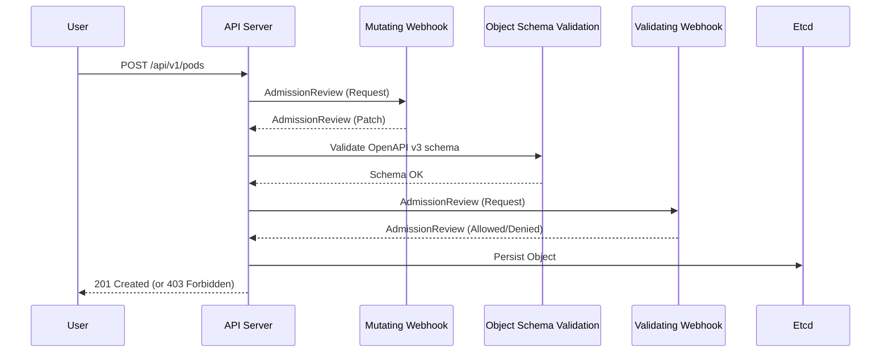

# Policy as Code & Governance

## Why This Module Matters

In December 2023, a multinational financial services firm running a 600-node bare-metal Kubernetes platform suffered a six-hour outage that began with a routine policy push. A developer added a single OPA Gatekeeper constraint requiring every pod to declare resource limits and the team rolled it out cluster-wide on a Friday afternoon. Within minutes, the cluster began rejecting CoreDNS pod restarts, Cilium agent updates, and even the Gatekeeper webhook's own self-managed deployment. Service-to-service DNS lookups began failing as old CoreDNS pods rotated off cordoned nodes, and the control plane self-quarantined as health probes timed out. By the time the on-call engineer realised the problem, half the cluster's payment authorisation services were returning 503s, and the postmortem would later trace the cascade to a single missing namespace exemption in the constraint manifest.

That pattern, a policy intended to harden the platform instead taking it offline, is not unique to that firm. It is the canonical bare-metal Kubernetes failure mode, and it explains why senior platform engineers treat policy as code as a higher-risk surface than the workloads it governs. On managed platforms like EKS or GKE the cloud provider runs the control plane, isolates it from your workloads, and gives you a fast revert button when an admission policy goes wrong. On bare-metal, when the policy engine deadlocks the API server, you are SSH'd into a node at 02:00 editing webhook configurations by hand to restore quorum. The blast radius of a bad policy is the same as the blast radius of a bad kernel patch, because in both cases the control loop you depend on to recover is the very thing that is broken.

That is the world this module prepares you for. You will learn to design admission and runtime policies that scale from a five-node test cluster to a thousand-node bare-metal estate without becoming a single point of failure. You will learn the trade-offs between OPA Gatekeeper, Kyverno, and the new native ValidatingAdmissionPolicy expressed in the Common Expression Language, and when each is the right answer. You will understand why runtime tools such as Falco and Tetragon are non-negotiable on bare-metal, where you cannot lean on cloud provider security hubs to detect a compromised node. By the end you will be able to make architecture decisions that a security review board can defend, and to debug the failure modes that crater clusters in the middle of the night.

## Learning Outcomes

By the end of this module you will be able to:

- **Compare** the trade-offs between OPA Gatekeeper, Kyverno, and native ValidatingAdmissionPolicy with CEL across language ergonomics, mutation support, performance ceiling, and operational risk, and recommend the right engine for a given platform team's maturity profile.
- **Design** an admission webhook configuration that survives control plane upgrades, node loss, and policy engine outages without deadlocking the cluster, including correct use of `failurePolicy`, `namespaceSelector`, `MatchConditions`, PodDisruptionBudgets, and anti-affinity rules.
- **Implement** a tested policy pipeline that lints, unit-tests, and integration-tests Gatekeeper or Kyverno policies in CI before they ever reach a live cluster, using `gator test` and `kyverno test` against a representative corpus of valid and invalid manifests.
- **Debug** a runtime security incident by tracing a syscall-level alert from Falco or a kernel-level enforcement action from Tetragon back to the originating workload, identifying whether the eBPF probe failed open, was rate-limited by ring buffer drops, or detected a true positive.
- **Evaluate** whether to adopt asynchronous detection (Falco) or synchronous enforcement (Tetragon) for a given workload class, accounting for kernel version constraints, eBPF support, dropped event cost, and the operational complexity of running in-kernel kill actions in production.

## The Governance Architecture

Kubernetes RBAC controls *who* can perform an action, but it cannot inspect the *payload* of that action. If a developer has permission to create a Deployment, RBAC cannot prevent them from running the container as `root`, using the `latest` image tag, or mounting the host filesystem. That gap is the entire reason admission control exists, and it is where policy as code does its work. Every API request that survives authentication and authorisation passes through a sequenced pipeline of admission controllers before the object is persisted to etcd, and the controllers in that pipeline have full visibility into the object's spec. They can reject it, mutate it, or simply log it for later review.

On bare-metal the lack of cloud provider guardrails turns admission control from a nice-to-have into a load-bearing security primitive. There is no AWS IAM role for service accounts to fall back on, no managed security hub watching API calls, no built-in defence against a rogue manifest that mounts `/var/lib/kubelet` from the host. Your admission webhooks are the last line of defence between a misconfigured workload and a compromised node. That makes correctness, performance, and availability of the policy engine itself a tier-zero platform concern.

Before reaching for an external engine you should know what Kubernetes already gives you out of the box. Pod Security Admission (PSA) replaced the legacy PodSecurityPolicy, which was deprecated in Kubernetes v1.21 and removed in v1.25. PSA reached stable feature state in v1.25 and defines exactly three pod-security levels: `privileged`, `baseline`, and `restricted`. Namespace policy is configured with labels and modes such as `enforce`, `audit`, and `warn` (for example `pod-security.kubernetes.io/enforce: restricted`), while cluster-wide configuration via `pod-security.admission.config.k8s.io/v1` also requires v1.25 or later. PSA is opinionated, fast, and zero-overhead because it runs in-process inside the API server, but it intentionally covers only a narrow slice of pod hardening. The moment you need to enforce labels, image registries, network policies, or anything that is not already encoded as a pod-security profile, you are reaching for an external engine or for the newer native CEL policies.

For requests that do leave the API server, the path through external webhooks is sequenced and matters operationally. The diagram below traces the lifecycle of a Pod creation request and shows the two webhook phases the API server invokes before persisting the object. Understanding the order is critical: a mutating webhook runs first and can change the object, then schema validation runs, and only then does the validating webhook see the final post-mutation shape.



> **Pause and predict:** if a mutating webhook injects a sidecar that violates a constraint enforced by your validating webhook, which webhook wins, and why does the order of phases matter? Try to reason it out before reading on, because the answer determines how you order policies that interact (for example, an Istio sidecar injector and a "no privileged containers" rule).

The two phases serve genuinely different purposes. **Mutating admission** modifies the incoming object: injecting sidecars, appending default labels, rewriting image references to use a private registry mirror. The mutating phase is a chance to make the request acceptable before anyone judges it. **Validating admission** inspects the post-mutation object and strictly allows or denies the request, with no opportunity to fix it. That ordering is what allows the canonical pattern of "mutate to add the missing label, then validate that the label is present" to work as a single coherent policy.

:::caution[War Story: The Webhook Deadlock]
A platform team deployed a validating webhook with `failurePolicy: Fail` covering all namespaces, including `kube-system`. When the nodes hosting the policy engine crashed, the policy engine pods could not be rescheduled because the API server could not reach the webhook to validate the new pods. The cluster deadlocked. The same class of failure took down a Kubernetes 1.23 cluster at a major retailer in 2022 during a routine kernel patch rollout, where a CNI restart simultaneously evicted the only surviving Kyverno replica. Always use `failurePolicy: Ignore` for the namespace hosting your policy engine, or explicitly exempt it using a `namespaceSelector` or a `MatchConditions` expression. This is not a "best practice" in the soft sense; it is the difference between a cluster that recovers itself and one that has to be reset by hand.
:::

## Native Validating Admission Policy with CEL

Before choosing an external engine you should understand the most important shift in Kubernetes admission control of the last three releases. Starting in Kubernetes v1.30, **ValidatingAdmissionPolicy** is a stable feature. It natively integrates the Common Expression Language (CEL) into the API server, eliminating the network round-trip to an external webhook and removing the entire class of webhook-deadlock outages described above. Policies are written as CRDs that contain CEL expressions evaluated in-process; the API server reads the policy on every request and applies it without ever leaving its own process boundary. It supports `validationActions` values of `Deny`, `Warn`, and `Audit`, with the constraint that `Deny` and `Warn` cannot be applied to the same policy together. **MutatingAdmissionPolicy** entered beta in Kubernetes v1.34 (requiring a feature gate and runtime-config flag), giving the same in-process treatment to mutation.

The practical implication is significant. For simple structural checks ("disallow `:latest`", "require labels", "block hostPath"), CEL policies are now the cheapest, lowest-latency, and most operationally safe option available. Both Gatekeeper and Kyverno have responded by adding CEL-based policy types of their own that compile down to native ValidatingAdmissionPolicy resources, so the engines orchestrate native CEL where it suffices and fall back to webhooks only for logic that genuinely exceeds CEL's expressiveness. The decision tree for new policies is therefore: try CEL first; fall back to a webhook engine when you need cross-resource lookups, generated resources, complex string manipulation, or external data calls.

> **Stop and think:** if both Gatekeeper and Kyverno are installed in the same cluster and both evaluate the same Pod creation, how does the API server reconcile contradictory decisions? The answer matters because many platforms inherit Gatekeeper from a security team and Kyverno from an application team and end up running both, often without realising it. *Answer: when multiple admission controllers return decisions on the same request, a single `Deny` from any controller is sufficient to reject the request entirely. There is no precedence or override; deny wins by construction.*

## OPA Gatekeeper

Gatekeeper is the Kubernetes-specific implementation of the Open Policy Agent, a CNCF graduated project since 2021. Plain OPA is a general-purpose policy engine for any JSON-shaped input; Gatekeeper layers Kubernetes-native CRDs (Constraints and ConstraintTemplates), a controller-runtime audit loop, and the webhook plumbing on top. Gatekeeper expresses policy in **Rego**, a purpose-built declarative query language with formal semantics and a mature toolchain. Rego has a real learning curve, especially for teams without a logic-programming background, but it pays back that investment with extreme performance, deterministic evaluation, and a body of well-tested community policies that cover the majority of the CIS Kubernetes Benchmark.

The architectural insight that makes Gatekeeper genuinely good engineering is the separation between policy logic and policy instantiation. A `ConstraintTemplate` is a CRD that contains the Rego code and the OpenAPI v3 schema for its parameters; it defines a class of policies but does not enforce anything by itself. A `Constraint` is the CRD that instantiates the template by binding it to specific Kubernetes resource kinds and supplying parameter values. This two-tier model lets a security team author a single, well-tested template (for example `K8sRequiredLabels`) and let many application teams instantiate it with their own parameters (`labels: ["team", "cost-center"]`), without copying logic across constraints or fragmenting the policy library.

Gatekeeper also supports mutation, a feature stable since v3.10. When a cluster runs a recent enough Gatekeeper (CEL validation became stable in v3.18, and ValidatingAdmissionPolicy management is beta in v3.20, requiring at least v3.17 paired with Kubernetes v1.30), Gatekeeper can compile its constraints down to native CEL policies and let the API server enforce them in-process. The enforcement-action mapping is straightforward: Gatekeeper's `deny` becomes CEL's `Deny`, `warn` becomes `Warn`, and `dryrun` becomes `Audit`. Operationally this is the path most large platforms are migrating onto, because it preserves the Gatekeeper authoring experience while removing the webhook from the hot path for the policies that can be expressed in CEL.

```yaml
apiVersion: templates.gatekeeper.sh/v1
kind: ConstraintTemplate
metadata:
  name: k8srequiredlabels
spec:
  crd:
    spec:
      names:
        kind: K8sRequiredLabels
      validation:
        openAPIV3Schema:
          type: object
          properties:
            labels:
              type: array
              items:
                type: string
  targets:
    - target: admission.k8s.gatekeeper.sh
      rego: |
        package k8srequiredlabels
        violation[{"msg": msg, "details": {"missing_labels": missing}}] {
          provided := {label | input.review.object.metadata.labels[label]}
          required := {label | label := input.parameters.labels[_]}
          missing := required - provided
          count(missing) > 0
          msg := sprintf("you must provide labels: %v", [missing])
        }
```

Read that template carefully, because it is the canonical shape of every Gatekeeper policy you will ever write. The `crd.spec.names.kind` declares the type that operators will use when they create constraints (`K8sRequiredLabels`). The `validation.openAPIV3Schema` declares the shape of the parameters those operators must supply, and Kubernetes itself enforces that schema, so a typo in a constraint manifest is rejected by `kubectl apply` rather than silently producing an inert policy. The Rego body uses set comprehension to compute the difference between required labels and provided labels, and emits a violation only when that set is non-empty. The pattern of "compute violations, emit only on non-empty result" generalises to almost every Gatekeeper policy you will write, and learning to read it fluently is most of the Rego learning curve.

## Kyverno

Kyverno took a different design bet. Instead of asking Kubernetes engineers to learn a new declarative language, it expresses policies as native Kubernetes YAML using overlays, JSON patches, variables, and wildcards. The cost is that complex logic in Kyverno can become awkward (deeply nested conditions, string manipulation, and cross-resource lookups all require Kyverno-specific extensions), but the benefit is enormous accessibility: any Kubernetes engineer can read a Kyverno policy and predict what it does within a minute. Kyverno achieved CNCF graduated status on March 16, 2026, putting it on equal footing with Gatekeeper from a maturity perspective.

Kyverno's standout differentiators over Gatekeeper are mutation and generation. Mutation in Kyverno is first-class and uses standard JSONPatch overlays directly within the policy YAML, so injecting a sidecar or appending a label is a few lines rather than a separate CRD. Generation is unique to Kyverno among the major engines: a single Kyverno policy can react to namespace creation by automatically generating a default NetworkPolicy, ResourceQuota, and ServiceAccount, eliminating an entire category of "platform team must manually configure each new namespace" toil. For teams running multi-tenant clusters that frequently provision new namespaces, generation alone is often the deciding feature.

The Kyverno policy ecosystem is also undergoing a generational transition. Kyverno introduced CEL-based policy types (such as `ValidatingPolicy`) in v1.14, which became stable in v1.17. Consequently, the older `ClusterPolicy` and `CleanupPolicy` types were deprecated in v1.17, entered a critical-fixes-only phase in v1.18 and v1.19, and are planned for complete removal in v1.20. Production teams still running on `ClusterPolicy` should plan a migration window now rather than discovering the removal during an upgrade. The example below uses the legacy format because the bulk of public Kyverno examples and the official `kyverno-policies` Helm chart still teach it, but new policies should target the CEL-based types where possible.

```yaml
apiVersion: kyverno.io/v1
kind: ClusterPolicy
metadata:
  name: require-labels
spec:
  validationFailureAction: Enforce
  rules:
  - name: check-for-labels
    match:
      any:
      - resources:
          kinds:
          - Pod
    validate:
      message: "The label `app.kubernetes.io/name` is required."
      pattern:
        metadata:
          labels:
            app.kubernetes.io/name: "?*"
```

Notice how much shorter this is than the equivalent Gatekeeper template, and how every line is recognisably Kubernetes YAML. The `match` block uses the same selector grammar as a NetworkPolicy or a Deployment, the `pattern` block uses Kyverno's overlay syntax where `?*` means "any non-empty string", and the `validationFailureAction: Enforce` flag toggles between block-mode and audit-mode. This readability advantage compounds in policy reviews: a security engineer reviewing a pull request can grasp the intent in seconds, whereas an equivalent Rego template demands a careful read of the violation set comprehension.

## Comparison: Gatekeeper vs Kyverno

The choice between Gatekeeper and Kyverno is not binary, and many large platforms run both for different policy classes. The matrix below is the decision input you should bring to that conversation, and it captures the operational trade-offs that matter on bare-metal estates.

| Feature | OPA Gatekeeper | Kyverno |
| :--- | :--- | :--- |
| **Language** | Rego (declarative query language) | Native YAML overlays and patches |
| **Learning curve** | Steep; demands logic-programming intuition | Shallow; readable by any Kubernetes engineer |
| **Mutation** | Supported via separate Mutation CRDs (stable v3.10+) | First-class, JSONPatches inline in policy |
| **Generation** | Not supported natively | First-class (RoleBindings, NetworkPolicies, etc.) |
| **External data** | `external_data` provider framework | API calls via `context` natively in YAML |
| **Performance ceiling** | Very high; Rego is heavily optimised | Moderate; heavy regex or context calls slow it |
| **Policy testing** | `gator test`, mature CI integration | `kyverno test`, mature CI integration |
| **CEL native bridge** | VAP management beta in v3.20 | ValidatingPolicy stable in v1.17 |

The architectural recommendation that flows from this matrix is straightforward. For complex validation that operates over multiple resources and benefits from the formal-logic guarantees of Rego, choose Gatekeeper. For the common case of "express a policy that any Kubernetes engineer can read and audit," and especially when you need mutation or generation, choose Kyverno. For a green-field bare-metal platform on Kubernetes 1.30 or later, prefer native ValidatingAdmissionPolicy in CEL for any policy that fits the language and reach for an engine only when CEL falls short. This stratified approach minimises both webhook latency and operational complexity while keeping a clear escape hatch for the genuinely complex policies.

:::note[Production Gotcha: Background Scans]
Both Gatekeeper and Kyverno perform periodic background scans to catch objects that were valid at creation but violate newly applied policies. In clusters with 10,000+ ConfigMaps or Secrets, these scans can cause severe CPU and memory spikes that masquerade as a noisy neighbour problem. The on-call engineer sees a Kyverno or Gatekeeper pod sitting at high CPU, restarts it to "clear" the spike, and the cycle repeats on the next audit interval. The fix is to tune the `backgroundScan` interval (or disable it entirely for resource kinds that are high-churn and low-risk) and to set realistic memory limits with anti-affinity rules so that a scan-induced OOMKill does not take down the only replica.
:::

## Policy Libraries and Exemption Workflows

Do not write policies from scratch. Both projects maintain exhaustive libraries that cover the Pod Security Standards (Restricted and Baseline), the CIS Kubernetes Benchmark, and dozens of opinionated best-practice rules contributed by the community. The Gatekeeper Library lives at `open-policy-agent/gatekeeper-library` on GitHub and ships ready-to-apply ConstraintTemplates organised by category; the Kyverno equivalent is the `kyverno-policies` Helm chart, which packages over a hundred validated policies into one install. Starting from a curated library and customising is faster than greenfield authoring, less likely to ship a bug, and crucially makes your policy posture comparable to other organisations using the same baseline, which matters for audits.

In production you will encounter vendor Helm charts that violate strict policies (Datadog agent needs `hostPath`, Cilium needs `privileged`, an old Java payments service needs `runAsUser: 0`), and the vendor will not change their chart on your timeline. You must design deterministic, auditable exemptions rather than modifying core policy logic. The wrong way to do this is to add an `if namespace == "datadog"` clause inside the Rego or Kyverno rule body, because that mixes business exceptions with policy logic, makes the policy harder to test, and creates an audit trail problem (the exception is buried in code rather than declared as a first-class resource).

The right way, and the modern best practice, is `MatchConditions` on the webhook configuration itself. Starting in Kubernetes v1.28, `MatchConditions` natively filter requests at the API server level *before* they are sent to the webhook, which means an exempted request never even leaves the API server. That simultaneously reduces webhook latency, eliminates failure-open risk for exempted workloads, and keeps the exemption visible as a declarative resource that your audit tooling can inventory.

```yaml
apiVersion: admissionregistration.k8s.io/v1
kind: ValidatingWebhookConfiguration
metadata:
  name: gatekeeper-validating-webhook-configuration
webhooks:
  - name: validation.gatekeeper.sh
    matchConditions:
    - name: exclude-exempt-namespaces
      expression: "request.namespace != 'kube-system' && request.namespace != 'monitoring'"
```

For older clusters that predate `MatchConditions`, fall back to `namespaceSelector` on the webhook configuration, or to engine-specific exclusion blocks (Gatekeeper has `match.excludedNamespaces`, Kyverno has `exclude` blocks with the same selector grammar as `match`). Whichever mechanism you use, the cardinal rule is to abstract exemptions out of the policy body and into a separately-versioned resource (a ConfigMap, a custom resource, or the webhook configuration itself) that your auditors can review independently of the policy logic. An exemption you cannot find in a `kubectl get` is an exemption that will eventually surprise you.

## Policy CI/CD and Testing

A broken policy can bring down a cluster, which means policies must be treated as application code: versioned, peer-reviewed, linted, and tested against a suite of valid and invalid Kubernetes manifests in CI. The discipline is identical to testing Terraform modules or Go packages, and the tooling is now mature enough that there is no excuse for shipping untested policy. The general pattern is a Git repository per policy library, with policies in one directory and a parallel `tests/` directory containing fixtures (Kubernetes manifests known to be valid) and counter-fixtures (manifests known to be invalid), wired into a CI job that fails the pull request if any expected verdict changes.

For Gatekeeper, the CLI tool is `gator`, which evaluates ConstraintTemplates and Constraints against local Kubernetes manifests without ever touching a cluster. `gator test` accepts a directory and a suite definition, applies each constraint to each manifest, and reports pass/fail against expected outcomes. This means a developer can iterate on a Rego policy locally in seconds, and a CI pipeline can run hundreds of test cases in a few seconds of compute. The local-first feedback loop is essential: testing policy by deploying it to a cluster and watching what breaks is unaffordable at scale.

```bash
gator test --image-pull-policy=Always ./policies/
```

For Kyverno, the equivalent is the `kyverno` CLI, which provides a `test` subcommand that consumes a YAML test definition naming policies, target resources, and expected outcomes. The test format is itself YAML, which means policy tests can be reviewed in the same way as the policies themselves, and any team that already operates a GitOps pipeline can wire `kyverno test` into the same CI job that lints their manifests. The example below shows a test case that asserts a `require-labels` policy fails on a `bad-pod` manifest and passes on a `good-pod` manifest.

```yaml
name: require-labels-test
policies:
  - require-labels.yaml
resources:
  - bad-pod.yaml
  - good-pod.yaml
results:
  - policy: require-labels
    rule: check-for-labels
    resource: bad-pod
    kind: Pod
    result: fail
  - policy: require-labels
    rule: check-for-labels
    resource: good-pod
    kind: Pod
    result: pass
```

Wire this into CI with a single command and a non-zero exit code on any mismatch. The investment is small and the return is huge: every regression in policy behaviour is caught before merge, and reviewers can read the test changes alongside the policy changes to confirm intent.

```bash
kyverno test .
```

A final discipline that often gets skipped: load-test your policies before they reach a production cluster. Spin up a kind cluster, install the policy engine, and apply a few thousand manifests representative of your largest namespace (use `kubectl apply -f generated-manifests/` with a directory full of dummy Deployments and Pods). Watch the webhook latency with `kubectl get --raw /metrics` on the API server. Any policy whose evaluation pushes the p99 webhook latency above 100ms is a production risk and should be optimised or split before rollout. This load test takes an hour to set up once and saves you from the class of incidents where a policy is correct but too slow to live with.

## Runtime Security: Falco vs Tetragon

Admission controllers only evaluate resources at *creation* or *update*; they cannot detect an attacker who exploits a vulnerability in a running application to gain a shell, nor malware that executes unauthorised system calls inside a container that was admitted yesterday and is still running today. The boundary they enforce is the API surface, not the runtime surface. That is fine for misconfiguration (the dominant risk class for most platforms), but it is insufficient for any threat model that includes post-exploitation activity. Runtime security tools fill that gap by monitoring the Linux kernel directly to detect and, in some cases, prevent anomalous behaviour in real time.

On bare-metal deployments runtime security is doubly critical. Cloud providers offer their own runtime detection layers (GuardDuty on AWS, Security Command Center on GCP, Defender for Cloud on Azure) that sit underneath the cluster and watch the host for suspicious activity even when your in-cluster tools are blind. On bare-metal you have no such safety net. Node compromise grants direct access to physical hardware networks, often inside the trust perimeter of databases, payment systems, and identity providers that have no perimeter beyond the network. A runtime detection tool inside the cluster is the only thing standing between a compromised pod and a lateral-movement campaign across your data centre.

The two CNCF projects worth knowing in this space are Falco and Tetragon, and they make different bets about the right point on the detection-versus-enforcement curve. Falco optimises for detection and alerting with a mature ruleset and a broad ecosystem; Tetragon optimises for in-kernel synchronous enforcement and is the closest thing to "block the syscall before it happens" that exists for Kubernetes today.

### Falco

Falco, a CNCF graduated project, hooks into the Linux kernel via a kernel module or an eBPF probe to parse system calls. It evaluates those syscalls against a rules engine that consumes `falco_rules.yaml` and emits alerts to stdout, file, gRPC, or downstream tools (Slack, PagerDuty, the new Falco Talon project for response automation). The Falco rule language is well-documented, the default ruleset covers the majority of MITRE ATT&CK techniques applicable to containers, and the project has years of production hardening across thousands of clusters. It is the safe default choice for runtime detection on Kubernetes.

The Falco architecture has three logical components and you should understand all three. The **event source** captures syscalls (the eBPF probe is the modern default; the kernel module is the fallback for older kernels). The **rules engine** is a userspace process that compares each event against the loaded ruleset. The **outputs** subsystem formats matched events and ships them to your alert pipeline. The split between in-kernel capture and userspace evaluation is what makes Falco asynchronous: by the time the rules engine decides an event is malicious, the syscall it represents has already executed. Falco is therefore strictly a detect-and-alert tool, not a block-and-prevent tool.

```yaml
- rule: Terminal shell in container
  desc: A shell was used as the entrypoint/exec point into a container with an attached terminal.
  condition: >
    spawned_process and container
    and shell_procs and proc.tty != 0
    and container_entrypoint
  output: >
    A shell was spawned in a container with an attached terminal (user=%user.name user_loginuid=%user.loginuid %container.info
    shell=%proc.name parent=%proc.pname cmdline=%proc.cmdline terminal=%proc.tty container_id=%container.id image=%container.image.repository)
  priority: NOTICE
  tags: [container, shell, mitre_execution]
```

Read the rule carefully and you can see the detection model. The `condition` is a boolean expression over event fields (`spawned_process`, `container`, `shell_procs`) and the macros that combine them. The `output` formats the alert with field interpolation. The `priority` and `tags` feed downstream routing logic ("page on EMERGENCY, log everything else"). Most production Falco deployments customise the default ruleset to suppress benign alerts (cron jobs that spawn shells, monitoring agents that read sensitive files) and to add organisation-specific rules (block shells in payment containers, alert on connections to non-allowlisted external IPs).

### Tetragon

Tetragon, part of the Cilium family, is a pure eBPF-based runtime security enforcement and observability tool. Where Falco relies on asynchronous ring buffers to ferry events from kernel to userspace for evaluation, Tetragon hooks deep into kernel functions and can evaluate matching expressions *inside* the kernel, which means it can synchronously block a syscall before it completes. The practical difference is the difference between "the database was opened then I got an alert" and "the database was never opened because the kernel killed the process attempting it." For workloads with a strong threat model that includes credential theft or data exfiltration, that difference is the entire point.

The trade-off is operational complexity and kernel version dependency. Tetragon requires modern kernels with BTF (BPF Type Format) enabled, currently 5.10 or later as a hard floor and 6.x preferred. Its enforcement actions execute in kernel context where mistakes are unforgiving (a too-broad TracingPolicy can SIGKILL processes you did not intend to kill, including system daemons). Its ecosystem of community rules is smaller than Falco's, which means you will write more rules from scratch. For these reasons Tetragon is the right answer for security-critical workloads on a modern Linux estate, while Falco remains the safer default for general-purpose detection across a heterogeneous fleet.

```yaml
apiVersion: cilium.io/v1alpha1
kind: TracingPolicy
metadata:
  name: block-shell-in-pod
spec:
  kprobes:
  - call: "sys_execve"
    syscall: true
    args:
    - index: 0
      type: "string"
    selectors:
    - matchArgs:
      - index: 0
        operator: "Equal"
        values:
        - "/bin/bash"
        - "/bin/sh"
      matchActions:
      - action: Sigkill
```

Trace through the Tetragon TracingPolicy above. The `kprobes.call: "sys_execve"` attaches the policy to the `execve` syscall, which is invoked any time a process is launched. The `selectors.matchArgs` block constrains the policy to fire only when the first argument (the executable path) is `/bin/bash` or `/bin/sh`. The `matchActions.action: Sigkill` instructs the kernel to send a `SIGKILL` to the process attempting the execve before the syscall returns. The result is that any attempt to spawn an interactive shell inside any pod on the cluster is killed in-kernel. This is genuinely powerful and genuinely dangerous; review such policies as carefully as you would review a kernel patch, because their failure modes are similar.

| Capability | Falco | Tetragon |
| :--- | :--- | :--- |
| **Primary paradigm** | Audit and alert | Enforce and block |
| **Instrumentation** | Kernel module or eBPF | eBPF only |
| **Enforcement timing** | Asynchronous (event after the fact) | Synchronous (block in-kernel) |
| **Ecosystem maturity** | Very high; standardised rulesets | Growing fast; tied to Cilium ecosystem |
| **Kernel floor** | Works on 3.10+ via legacy module | 5.10+ required for stable BTF |
| **Overhead** | Moderate; data crosses kernel/user boundary | Low; filtering and blocking stay in kernel |
| **Operational risk** | Low; alerts only | Higher; misfires can SIGKILL real workloads |

:::tip[Bare-Metal Reality]
eBPF tools require modern kernels with BTF enabled. If you operate bare-metal nodes on legacy OS versions (RHEL 7 or CentOS 7 with kernel 3.10), Tetragon will not work, and Falco must fall back to the legacy kernel module, which historically has caused node panics during driver loading. Ensure your bare-metal OS strategy includes modern kernels (5.10 minimum, 6.x preferred) with `CONFIG_DEBUG_INFO_BTF=y` and treat the kernel floor as a hard gating requirement for any runtime security tool you adopt. Negotiating an OS upgrade with the infrastructure team is part of the runtime security project, not a prerequisite that someone else handles.
:::

## Did You Know?

1. **Pod Security Policy was deprecated three full minor releases before its removal**, an unusually long deprecation window driven by the realisation that PSP had no clean migration path. The Kubernetes community treated the PSP-to-PSA migration as a forcing function for the entire admission-control ecosystem and used the experience to design the much shorter deprecation cycles for ValidatingAdmissionPolicy graduation.
2. **Rego's name comes from "regere," the Latin verb "to rule"**, reflecting OPA's design intent as a general-purpose rules engine rather than a Kubernetes-specific tool. OPA is used outside Kubernetes for API authorisation in service meshes, Terraform plan validation, and SQL row-level security; Gatekeeper is just the most visible application of the underlying engine.
3. **eBPF programs are formally verified before they load.** The Linux kernel's eBPF verifier statically analyses every eBPF program for safety before it runs, rejecting anything with unbounded loops, out-of-bounds memory access, or unprivileged kernel pointer dereferences. This verification is what makes it safe to load runtime security tools like Tetragon into the same kernel that handles your production traffic; a buggy eBPF probe simply fails to load rather than crashing the node.
4. **Kyverno's generation feature was originally added to solve a multi-tenancy onboarding problem at Nirmata**, the company that founded the project. Their platform team was manually creating a NetworkPolicy, ResourceQuota, and default ServiceAccount for every new tenant namespace, and the toil eventually justified building generation as a first-class policy primitive. The feature now ships in dozens of platform engineering reference architectures.

## Common Mistakes

| Mistake | Why It Bites | Correct Approach |
| :--- | :--- | :--- |
| Setting `failurePolicy: Fail` on a webhook that covers `kube-system` | Policy engine outage deadlocks the cluster: control-plane pods cannot be rescheduled because the webhook needed to validate them is offline | Exempt `kube-system` and the policy engine's own namespace via `namespaceSelector` or `MatchConditions`; use `Fail` only on namespaces whose pods can tolerate temporary admission failures |
| Hardcoding namespace exemptions inside Rego or Kyverno rule bodies | Mixes business exceptions with policy logic, hides exemptions from audit tooling, makes policies harder to test in isolation | Move exemptions to the webhook configuration via `MatchConditions` or to a dedicated exclusion CRD that auditors can inventory with `kubectl get` |
| Running a single replica of Gatekeeper or Kyverno in production | Routine node drains evict the only policy engine pod; webhook becomes unreachable until reschedule completes, and any `Fail` policy blocks workloads in the meantime | Run at least three replicas with topology-spread constraints, anti-affinity, and a PodDisruptionBudget that prevents full eviction during voluntary disruptions |
| Skipping `gator test` or `kyverno test` in CI | Bad policies reach production unvalidated; first signal of a regression is a paged on-call engineer at 02:00 | Wire policy tests into CI as a required check on every pull request; include both positive and negative fixtures and treat policy as application code |
| Enabling Falco custom rules on `read`/`write` syscalls without tight pre-filters | High-throughput pods (databases, message brokers) overwhelm the eBPF ring buffer, causing dropped events and CPU spikes that look like noisy neighbours | Always pre-filter by container image, namespace, or process name in the rule's `condition`; monitor `falco_drop_count` and treat sustained drops as a tuning bug rather than acceptable noise |
| Using regex in Rego without bounding input length | A 50KB ConfigMap value evaluated against a poorly-written regex triggers ReDoS, locks the evaluation thread, and times out the webhook | Bound regex inputs explicitly (`count(input.review.object.data.x) < 1024`), benchmark policies with `opa bench`, and prefer string operations over regex when the check allows it |
| Deploying a Tetragon `Sigkill` action without a soak period in audit mode | A too-broad selector kills legitimate processes in production; engineers cannot diagnose the failure because the killed process emits no exit reason | Start every Tetragon enforcement policy as `matchActions: [{action: Override, argError: -1}]` or in a non-blocking observation mode; promote to `Sigkill` only after a multi-week soak with zero unintended matches |
| Letting policy libraries drift from upstream without review | Security patches and CVE-driven rule updates accumulate in upstream `gatekeeper-library` or `kyverno-policies`, and a year-old fork misses critical detections | Pin to a tagged release, schedule a quarterly upgrade review, and run upstream tests against your fork's deviations to surface conflicts early |

## Quiz

**1. Scenario: You are the lead platform engineer. During a minor Kubernetes cluster upgrade, the control plane stalls. New `kube-system` pods such as CoreDNS are stuck in a `Pending` state, and the API server logs reveal timeouts when attempting to reach the Gatekeeper validating webhook. What is the most robust architectural fix to restore scheduling and prevent recurrence?**

A) Scale Gatekeeper to five replicas.
B) Modify the Gatekeeper `ValidatingWebhookConfiguration` to include a `namespaceSelector` (or `MatchConditions`) that excludes the `kube-system` namespace.
C) Change the Kubernetes API server configuration to bypass webhooks during upgrades.
D) Convert all Gatekeeper policies to Kyverno policies.

<details><summary>Answer</summary>
**B**

Webhooks configured with `failurePolicy: Fail` permanently block object creation if the webhook endpoint is unreachable. When the nodes hosting the policy engine go down, their replacements cannot be scheduled because the webhook required to validate them is offline, creating a circular dependency and cluster deadlock. By using a `namespaceSelector` or `MatchConditions` to exempt critical namespaces such as `kube-system`, you ensure that fundamental control plane components can always be scheduled regardless of the policy engine's health, allowing the cluster to self-heal the policy engine pods and restoring full governance without manual intervention. Scaling Gatekeeper helps availability but does not break the deadlock. Bypassing webhooks at the API server is not a configurable option, and switching engines does not address the architectural pattern.
</details>

**2. Scenario: Your security team has written a Rego ConstraintTemplate restricting `hostPath` mounts and defined the parameter schema, but the policy is not affecting newly created Deployments. In Gatekeeper's architecture, what mechanism is required to actually apply this logic to the `apps/v1/Deployment` resources in your cluster?**

A) The Constraint contains the Rego code, and the ConstraintTemplate defines the parameters.
B) The ConstraintTemplate contains the Rego code and parameter schema, while the Constraint instantiates the policy against specific Kubernetes resources.
C) The ConstraintTemplate generates Kyverno YAML, which is executed by the Constraint.
D) The ConstraintTemplate dictates Mutating policies, while the Constraint dictates Validating policies.

<details><summary>Answer</summary>
**B**

OPA Gatekeeper strictly separates policy definition from policy instantiation to maximise reusability. The `ConstraintTemplate` CRD acts as the blueprint, containing the Rego evaluation code and the OpenAPI schema for parameters, but the template alone is inert until instantiated. You must create a `Constraint` (a custom resource of the kind defined by the template) that targets specific Kubernetes resources such as Deployments and provides the actual parameter values, thereby binding the logic to live cluster state. Without the Constraint resource, the cluster has the policy class but no instance of it.
</details>

**3. Scenario: Your development teams frequently forget to add required tracing annotations to their pods. You need an admission controller that automatically injects `sidecar.io/inject: "true"` into any Pod created in the `frontend` namespace. You want the most native, straightforward configuration without writing external code or managing complex supplementary CRDs. Which tool and mechanism should you choose?**

A) OPA Gatekeeper with Rego mutation CRDs.
B) Falco rules.
C) Kyverno mutation rules with JSONPatch overlays.
D) Tetragon TracingPolicy.

<details><summary>Answer</summary>
**C**

Kyverno is designed specifically for Kubernetes and uses native YAML constructs that administrators already recognise from their existing manifests. Kyverno mutation policies define JSONPatch overlays directly within the policy YAML, making sidecar or label injection a few lines of declarative configuration. Gatekeeper also supports mutation (stable since v3.10), but it requires authoring separate Mutation CRDs and learning Rego, which is significantly more friction for a straightforward annotation injection use case. Falco and Tetragon operate at runtime on syscalls and have no role in admission-time mutation.
</details>

**4. Scenario: A critical zero-day vulnerability in bash is being actively exploited. You need to instantly block the execution of `/bin/bash` inside all currently running containers in your bare-metal cluster without restarting them. Admission controllers cannot help because the pods are already deployed. Which technology provides the deep kernel hooks necessary to synchronously block this action?**

A) Validating admission webhooks.
B) Kyverno enforce policies.
C) Falco alerting rules.
D) Tetragon TracingPolicies with a `Sigkill` action.

<details><summary>Answer</summary>
**D**

Admission controllers only evaluate resources at creation or modification; they cannot interact with running processes, so options A and B are excluded by problem framing. Falco monitors runtime events via eBPF but operates asynchronously: events flow from a kernel ring buffer to a userspace rules engine, which means Falco can alert that a shell was executed but cannot reliably prevent execution. Tetragon hooks directly into kernel functions via eBPF and evaluates selectors in kernel context, which means a `TracingPolicy` with a `Sigkill` action terminates the process before the syscall returns. This is the only option in the list that delivers in-kernel synchronous enforcement.
</details>

**5. Scenario: You have deployed a strict "no root containers" policy cluster-wide using Kyverno. A vendor provides a legacy Helm chart that requires running as root, and they refuse to update it on your timeline. You must deploy this application into the `legacy-apps` namespace without triggering policy violations while maintaining strict enforcement everywhere else. According to modern Kubernetes best practices, how should you implement this exemption to minimise webhook latency and risk?**

A) Hardcode the pod name into the Rego or YAML policy logic.
B) Use `MatchConditions` in the webhook configuration or a dedicated `exclude` block to bypass the namespace before evaluation.
C) Disable the "no root" policy cluster-wide until the application is fixed.
D) Assign the application Deployment to the `kube-system` namespace.

<details><summary>Answer</summary>
**B**

Hardcoding exemptions inside policy logic creates brittle, hard-to-audit configurations that blend business decisions with governance code. Starting in Kubernetes v1.28, `MatchConditions` natively filter requests directly at the API server before they are sent over the network to the validating or mutating webhook, which cleanly abstracts the exemption from the policy definition itself. The approach reduces webhook latency, eliminates failure-open risk for exempted workloads (because the API server never invokes the webhook for them), and keeps the exemption visible to auditors as a first-class declarative resource. Disabling the policy cluster-wide is overscoped, and abusing `kube-system` as a security carve-out is precisely the anti-pattern that creates production incidents.
</details>

**6. Scenario: Your team is writing a Gatekeeper policy that validates a label is one of a set of approved cost-centre codes. The list of approved codes is maintained in a separate ConfigMap by the FinOps team and updated weekly. The policy needs to read that ConfigMap at evaluation time. You also have a parallel team running Kyverno on the same cluster. Which engine is better suited to this requirement, and what is the architectural reason?**

A) Gatekeeper, because Rego natively reads ConfigMaps without configuration.
B) Kyverno, because the `context` block can fetch ConfigMaps via the Kubernetes API directly within the policy YAML.
C) Either engine works identically for this use case.
D) Neither; you must hardcode the list into the policy and redeploy weekly.

<details><summary>Answer</summary>
**B**

Kyverno's `context` block is designed exactly for this case: it fetches Kubernetes resources (ConfigMaps, custom resources) at policy evaluation time and exposes them as variables for use in `validate`, `mutate`, or `generate` rules. The wiring stays in YAML and requires no external infrastructure. Gatekeeper supports external data through its `external_data` provider framework, which is more powerful (it can call arbitrary HTTP endpoints) but also significantly more complex (it requires running a provider service alongside Gatekeeper). For the specific case of "read a ConfigMap in the same cluster," Kyverno is the lower-friction choice. Hardcoding plus a weekly redeploy is operationally hostile and the wrong answer in any case where dynamic data is genuinely required.
</details>

**7. Scenario: Your platform team rolls out a new Falco rule across the fleet that monitors every `read` syscall on `/etc/passwd`. Within an hour, on-call is paged about elevated CPU on database nodes and dropped Falco events in metrics. The rule fires correctly when you `cat /etc/passwd` from a shell, so it is technically working. What is the root cause of the operational incident, and what is the appropriate fix?**

A) The rule is too narrow and misses the actual attack pattern; broaden it.
B) The rule lacks pre-filtering, so heavy I/O on database pods overwhelms the eBPF ring buffer; add container-image or process pre-filters and monitor `falco_drop_count`.
C) Falco itself is incompatible with database workloads; switch to Tetragon.
D) The kernel is too old; upgrade to 6.x.

<details><summary>Answer</summary>
**B**

Falco evaluates rules in userspace after events cross the eBPF ring buffer from the kernel. When a rule matches a high-frequency syscall like `read` on a path that legitimate workloads access (databases reading their own files, glibc resolving names via NSS), the buffer fills faster than the userspace rules engine can drain it, and events get dropped. The dropped events show up in `falco_drop_count` and the userspace overhead shows up as elevated CPU. The fix is always to push pre-filtering into the rule's `condition` (restrict by container image, namespace, or parent process) so that fewer events ever cross into userspace evaluation. Switching to Tetragon would shift the work into the kernel but is overkill when Falco can be made performant with proper pre-filters; an OS upgrade does not address the workload pattern.
</details>

**8. Scenario: Your green-field bare-metal cluster runs Kubernetes v1.31 and you are designing the policy architecture from scratch. You need to enforce three rules: (1) all images must come from your private registry, (2) every Pod must declare resource limits, and (3) namespaces tagged `tenant-isolated: true` must auto-receive a default-deny NetworkPolicy. You want minimum operational complexity and maximum survivability. Which split is most appropriate?**

A) Kyverno for all three rules because it can express all of them.
B) Native ValidatingAdmissionPolicy in CEL for rules (1) and (2); Kyverno for rule (3) because generation is required.
C) Gatekeeper for all three because Rego is the most flexible.
D) Native ValidatingAdmissionPolicy for all three because CEL supports generation.

<details><summary>Answer</summary>
**B**

Rules (1) and (2) are simple structural validation that CEL can express cleanly, so native ValidatingAdmissionPolicy is the lowest-latency, lowest-risk choice (it eliminates external webhooks entirely for those checks). Rule (3) requires *generating* a NetworkPolicy in response to a namespace label, which is a feature that neither native CEL policies nor Gatekeeper support; only Kyverno's `generate` rules handle this case natively. The correct architecture mixes the two engines, using each where it excels rather than forcing one engine to cover the full scope. Choosing one engine for everything either leaves performance on the table (option A) or forces you into more complex code than the rule requires (option C). Option D misstates CEL's capabilities, since native policies do not generate resources.
</details>

## Hands-On Exercise

In this exercise you will deploy Kyverno onto a kind cluster, implement a strict policy, demonstrate an audited exemption, deploy Falco for runtime detection, and trigger a real alert. The goal is not to memorise the commands but to feel the operational shape of a policy and runtime stack end-to-end, including the moments where things go wrong and need adjustment.

### Prerequisites

- `kind` v0.20+
- `kubectl` v1.35+
- `helm` v3.14+
- A Linux host or Docker Desktop with at least 8GB RAM allocated

### Step 1: Bootstrap the Cluster

```bash
kind create cluster --name policy-lab
kubectl cluster-info
```

- [ ] Success criterion: `kubectl cluster-info` reports both the control plane and CoreDNS as running.

### Step 2: Install Kyverno

```bash
helm repo add kyverno https://kyverno.github.io/kyverno/
helm repo update
helm install kyverno kyverno/kyverno \
  -n kyverno --create-namespace \
  --set admissionController.replicas=1 \
  --set backgroundController.replicas=1 \
  --set cleanupController.replicas=1 \
  --set reportsController.replicas=1
kubectl wait --for=condition=ready pod -l app.kubernetes.io/component=admission-controller -n kyverno --timeout=90s
```

- [ ] Success criterion: the Kyverno admission controller pod reports `Ready 1/1` within 90 seconds.

### Step 3: Apply the "Disallow Latest Tag" Policy

```bash
cat <<EOF | kubectl apply -f -
apiVersion: kyverno.io/v1
kind: ClusterPolicy
metadata:
  name: disallow-latest-tag
spec:
  validationFailureAction: Enforce
  background: false
  rules:
  - name: require-image-tag
    match:
      any:
      - resources:
          kinds:
          - Pod
    validate:
      message: "Using 'latest' image tag is prohibited."
      pattern:
        spec:
          containers:
          - image: "!*:latest"
EOF
```

- [ ] Success criterion: `kubectl get clusterpolicy disallow-latest-tag` shows `READY: True`.

### Step 4: Verify Enforcement

```bash
kubectl run test-nginx --image=nginx:latest
```

Expected response (truncated for readability):

```text
Error from server: admission webhook "validate.kyverno.svc-fail" denied the request:
disallow-latest-tag:
  require-image-tag: validation error: Using 'latest' image tag is prohibited. ...
```

```bash
kubectl run test-nginx-good --image=nginx:1.25
```

- [ ] Success criterion: the first command returns an admission webhook denial; the second returns `pod/test-nginx-good created`.

### Step 5: Test the Exemption Workflow

Update the policy to exempt the `legacy-apps` namespace, then validate the exemption works.

```bash
cat <<EOF | kubectl apply -f -
apiVersion: kyverno.io/v1
kind: ClusterPolicy
metadata:
  name: disallow-latest-tag
spec:
  validationFailureAction: Enforce
  background: false
  rules:
  - name: require-image-tag
    match:
      any:
      - resources:
          kinds:
          - Pod
    exclude:
      any:
      - resources:
          namespaces:
          - legacy-apps
    validate:
      message: "Using 'latest' image tag is prohibited."
      pattern:
        spec:
          containers:
          - image: "!*:latest"
EOF
kubectl create namespace legacy-apps
kubectl run legacy-nginx --image=nginx:latest -n legacy-apps
```

- [ ] Success criterion: the pod creation in `legacy-apps` succeeds; an attempt in `default` (re-run from Step 4) still fails.

### Step 6: Install Falco

```bash
helm repo add falcosecurity https://falcosecurity.github.io/charts
helm repo update
helm install falco falcosecurity/falco \
  -n falco --create-namespace \
  --set driver.kind=ebpf \
  --set tty=true
kubectl wait --for=condition=ready pod -l app.kubernetes.io/name=falco -n falco --timeout=120s
```

- [ ] Success criterion: the Falco pod reaches `Ready` within 120 seconds.

### Step 7: Trigger and Observe a Runtime Alert

Exec into the `test-nginx-good` pod and attempt to read a sensitive file. The container's user will be denied at the OS level, but the syscall is still made and Falco's "Sensitive file opened for reading by non-trusted program" rule fires.

```bash
kubectl exec -it test-nginx-good -- cat /etc/shadow
kubectl logs -l app.kubernetes.io/name=falco -n falco | grep "shadow"
```

Expected log line (truncated):

```text
{"output":"Warning Sensitive file opened for reading by non-trusted program (file=/etc/shadow ...)"}
```

- [ ] Success criterion: the Falco logs include a `Warning Sensitive file opened for reading by non-trusted program` line referencing `/etc/shadow`.

### Step 8: Cleanup

```bash
kind delete cluster --name policy-lab
```

- [ ] Success criterion: `kind get clusters` no longer lists `policy-lab`.

### Troubleshooting

If the Kyverno admission controller does not become ready within 90 seconds, check `kubectl logs -n kyverno -l app.kubernetes.io/component=admission-controller` for OOMKill events; the chart's default memory request is conservative for large clusters and may need adjustment via `--set admissionController.container.resources.limits.memory=256Mi`. If the Falco pod is in `CrashLoopBackOff` with driver errors, your host kernel may be incompatible with the modern eBPF probe; switch the install to `--set driver.kind=modern_ebpf` or fall back to the legacy kernel module on a full Linux VM. If the `latest`-tag policy fails to deny pods after Step 3, confirm the policy's `READY` status and check the validating webhook configuration with `kubectl get validatingwebhookconfiguration kyverno-resource-validating-webhook-cfg -o yaml` to ensure the webhook is registered and pointing at the running Kyverno service.

## Further Reading

- [OPA Gatekeeper Official Documentation](https://open-policy-agent.github.io/gatekeeper/website/docs/)
- [Kyverno Documentation](https://kyverno.io/docs/)
- [Falco Project Documentation](https://falco.org/docs/)
- [Tetragon GitHub Repository](https://github.com/cilium/tetragon)
- [Kubernetes Reference: Admission Controllers](https://kubernetes.io/docs/reference/access-authn-authz/admission-controllers/)
- [Pod Security Standards (Kubernetes Docs)](https://kubernetes.io/docs/concepts/security/pod-security-standards/)
- [ValidatingAdmissionPolicy and CEL](https://kubernetes.io/docs/reference/access-authn-authz/validating-admission-policy/)

## Next Module

Continue to [Module 6.8: Compliance & Audit](/on-premises/security/module-6.8-compliance-and-audit/) to learn how to demonstrate the policies you have built to auditors using CIS benchmarks, audit logs, and tamper-evident evidence pipelines.
