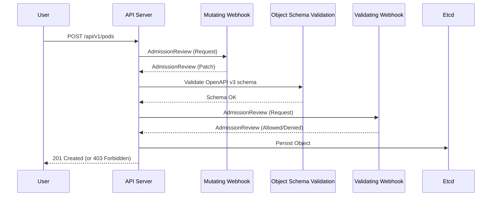

# Policy as Code & Governance

Kubernetes RBAC controls *who* can perform an action, but it cannot inspect the *payload* of that action. If a developer has permission to create a Deployment, RBAC cannot prevent them from running the container as `root`, using the `latest` image tag, or mounting the host filesystem. 

Policy as Code fills this gap by intercepting API requests and evaluating them against predefined rules. On bare-metal environments, where you lack cloud provider guardrails (like AWS IAM roles for service accounts or managed security hubs), robust cluster governance and runtime enforcement are mandatory to prevent node compromise and lateral movement.

## The Governance Architecture

Kubernetes implements policy primarily through Admission Controllers. Before exploring external policy engines, it is important to understand built-in mechanisms. Pod Security Admission (PSA) replaced the legacy PodSecurityPolicy (which was deprecated in Kubernetes v1.21 and removed in v1.25). PSA, which reached stable feature state in Kubernetes v1.25, defines exactly three Pod Security levels: `privileged`, `baseline`, and `restricted`. Namespace policy is configured with labels using modes `enforce`, `audit`, and `warn` (e.g., `pod-security.kubernetes.io/enforce: restricted`), while cluster-level configuration using `pod-security.admission.config.k8s.io/v1` also requires Kubernetes v1.25+.

For more advanced logic beyond pod security, requests pass through external webhooks. When an authenticated and authorized API request reaches the API server, it passes through two sequential webhook phases before persisting to etcd.



> **Pause and predict**: If a mutating webhook modifies an object, does the API server re-validate the schema?

1.  **Mutating Admission**: Modifies the incoming object (e.g., injecting sidecars, appending default labels).
2.  **Validating Admission**: Inspects the final state of the object and strictly allows or denies the request.

:::caution[War Story: The Webhook Deadlock]
A platform team deployed a validating webhook with `failurePolicy: Fail` covering all namespaces, including `kube-system`. When the nodes hosting the policy engine crashed, the policy engine pods could not be rescheduled because the API server couldn't reach the webhook to validate the new pods. The cluster deadlocked. Always use `failurePolicy: Ignore` for the namespace hosting your policy engine, or explicitly exempt it using `namespaceSelector`.
:::

## Admission Control: OPA Gatekeeper vs Kyverno

The ecosystem has converged on two primary engines for Kubernetes admission control: OPA Gatekeeper (a CNCF graduated project since 2021) and Kyverno (which achieved CNCF graduated status on March 16, 2026). 

### Native Validating Admission Policy (CEL)
Before choosing an engine, it is critical to understand the shift toward native policies. Starting in Kubernetes v1.30, **ValidatingAdmissionPolicy** is a stable feature. It natively integrates the Common Expression Language (CEL) into the API server, eliminating external webhook latency. It supports `validationActions` values of `Deny`, `Warn`, and `Audit` (note that `Deny` and `Warn` cannot be allowed together). Additionally, **MutatingAdmissionPolicy** entered beta in Kubernetes v1.34 (requiring a feature gate and runtime-config). 

Both Gatekeeper and Kyverno now orchestrate these native CEL policies alongside their traditional webhooks.

> **Stop and think**: If both Gatekeeper and Kyverno are installed and evaluate the same request, how does the API server handle conflicting decisions?
> *Answer: When multiple admission controllers return decisions, a "deny" result is overriding; any single deny from either controller will block the request entirely.*

### OPA Gatekeeper

Gatekeeper is a Kubernetes-specific implementation of the Open Policy Agent (OPA). While OPA is a general-purpose policy engine capable of validating and mutating resources for create, update, and delete flows, Gatekeeper adds Kubernetes-native CRDs (Constraints and ConstraintTemplates) and audit functionality on top of plain OPA. It uses **Rego**, a purpose-built query language, to evaluate policies.

Gatekeeper separates policy logic from policy instantiation:
*   **ConstraintTemplate**: The CRD defining the Rego logic and the schema for parameters.
*   **Constraint**: The CRD that instantiates the template, binding it to specific Kubernetes resources and supplying parameters.

Gatekeeper also supports mutations, a feature stable since v3.10+. When mapping native VAP CEL policies (CEL validation is stable by Gatekeeper v3.18, and VAP management is beta in v3.20, requiring at least Gatekeeper v3.17 with K8s v1.30), Gatekeeper maps its enforcement actions cleanly: `deny` maps to `Deny`, `warn` maps to `Warn`, and `dryrun` maps to `Audit`.

**Example ConstraintTemplate (Rego)**:
```yaml
apiVersion: templates.gatekeeper.sh/v1
kind: ConstraintTemplate
metadata:
  name: k8srequiredlabels
spec:
  crd:
    spec:
      names:
        kind: K8sRequiredLabels
      validation:
        openAPIV3Schema:
          type: object
          properties:
            labels:
              type: array
              items:
                type: string
  targets:
    - target: admission.k8s.gatekeeper.sh
      rego: |
        package k8srequiredlabels
        violation[{"msg": msg, "details": {"missing_labels": missing}}] {
          provided := {label | input.review.object.metadata.labels[label]}
          required := {label | label := input.parameters.labels[_]}
          missing := required - provided
          count(missing) > 0
          msg := sprintf("you must provide labels: %v", [missing])
        }
```

### Kyverno

Kyverno is designed specifically for Kubernetes. Instead of a bespoke language like Rego, policies are written as native Kubernetes YAML using overlays, variables, and wildcards.

*Note: The example below uses the legacy `ClusterPolicy` format for familiarity. However, Kyverno introduced CEL-based policy types (like `ValidatingPolicy`) in v1.14 which became stable in v1.17. Consequently, `ClusterPolicy` and `CleanupPolicy` were deprecated in v1.17, entering a critical-fixes-only phase in v1.18/v1.19, and are planned for complete removal in v1.20.*

**Example Kyverno Policy (YAML)**:
```yaml
apiVersion: kyverno.io/v1
kind: ClusterPolicy
metadata:
  name: require-labels
spec:
  validationFailureAction: Enforce
  rules:
  - name: check-for-labels
    match:
      any:
      - resources:
          kinds:
          - Pod
    validate:
      message: "The label `app.kubernetes.io/name` is required."
      pattern:
        metadata:
          labels:
            app.kubernetes.io/name: "?*"
```

### Comparison Matrix

| Feature | OPA Gatekeeper | Kyverno |
| :--- | :--- | :--- |
| **Language** | Rego (Declarative Query Language) | Native YAML |
| **Learning Curve** | High (Requires learning Rego) | Low (Familiar to K8s engineers) |
| **Mutation** | Supported (via distinct Mutation CRDs, stable v3.10+) | Native, highly capable (JSONPatches) |
| **External Data** | `external_data` provider framework | API calls via `context` natively in YAML |
| **Generation** | Not supported natively | Native (can generate RoleBindings, ConfigMaps) |
| **Performance** | Extremely high (Rego is optimized) | Moderate (Heavy regex/API calls can slow it) |

**Architectural Recommendation**: For pure validation with complex logical conditions across multiple data structures, Gatekeeper's Rego is mathematically safer and heavily tested. For teams prioritizing speed of policy authoring, mutation, and resource generation, Kyverno is preferred.

:::note[Production Gotcha: Background Scans]
Both tools perform periodic background scans to catch objects that were valid at creation but violate newly applied policies. In clusters with 10,000+ ConfigMaps or Secrets, these scans can cause severe CPU/Memory spikes. Tune the `backgroundScan` intervals or disable them for high-churn resources.
:::

## Policy Libraries and Violation Dashboards

Do not write policies from scratch. Both projects maintain exhaustive libraries covering the Pod Security Standards (Restricted/Baseline).

*   **Gatekeeper Library**: Deploy the `library/pod-security-policy` directory.
*   **Kyverno Policies**: Install via Helm chart `kyverno-policies`.

### Exemption Workflows

In production, you will encounter vendor helm charts that violate strict policies (e.g., running as root). You must design deterministic exemptions rather than modifying the core policy logic.

**Best Practice: Label-based exemptions via `MatchConditions`**
Starting in Kubernetes v1.28, `MatchConditions` natively filter requests at the API server level before sending them to the webhook, significantly reducing webhook latency and failure-open risks.

```yaml
apiVersion: admissionregistration.k8s.io/v1
kind: ValidatingWebhookConfiguration
metadata:
  name: gatekeeper-validating-webhook-configuration
webhooks:
  - name: validation.gatekeeper.sh
    matchConditions:
    - name: exclude-exempt-namespaces
      expression: "request.namespace != 'kube-system' && request.namespace != 'monitoring'"
```

If using older clusters or tool-specific exclusions, use `namespaceSelector` or specific `exempt` CRDs. Never hardcode exemptions inside Rego or Kyverno rule blocks; abstract them to a ConfigMap or custom resource that can be audited independently.

## Policy CI/CD and Testing

A broken policy can bring down a cluster. Policies must be treated as application code: versioned, linted, and tested against a suite of valid and invalid Kubernetes manifests in CI.

### Testing Gatekeeper Policies

Use `gator`, the CLI tool for Gatekeeper. You define a suite of tests providing the `ConstraintTemplate`, the `Constraint`, and dummy Kubernetes manifests.

```bash
# Verify a policy suite locally
gator test --image-pull-policy=Always ./policies/
```

### Testing Kyverno Policies

Kyverno provides a standalone CLI to run policies against local manifests without a cluster.

```yaml
# test.yaml
name: require-labels-test
policies:
  - require-labels.yaml
resources:
  - bad-pod.yaml
  - good-pod.yaml
results:
  - policy: require-labels
    rule: check-for-labels
    resource: bad-pod
    kind: Pod
    result: fail
  - policy: require-labels
    rule: check-for-labels
    resource: good-pod
    kind: Pod
    result: pass
```

Execute in CI:
```bash
kyverno test .
```

## Runtime Security: Falco vs Tetragon

Admission controllers only evaluate resources at *creation* or *update*. They cannot detect an attacker who exploits a vulnerability in a running application to gain a shell, or malware that executes unauthorized system calls.

Runtime security monitors the underlying Linux kernel to detect and prevent anomalous behavior in real-time. On bare-metal deployments, this is critical, as node compromise grants direct access to physical hardware networks.

### Falco

Falco (a CNCF graduated project) hooks into the Linux kernel (via kernel module or eBPF probe) to parse system calls. It evaluates these syscalls against a rules engine to detect threats.

**Falco Architecture:**
1.  **Event Source**: eBPF probe captures syscalls (`execve`, `open`, `socket`).
2.  **Rules Engine**: Compares events against `falco_rules.yaml`.
3.  **Outputs**: Sends alerts to stdout, file, gRPC, or external tools (Slack, PagerDuty, Falco Talon for response).

**Example Falco Rule**:
```yaml
- rule: Terminal shell in container
  desc: A shell was used as the entrypoint/exec point into a container with an attached terminal.
  condition: >
    spawned_process and container
    and shell_procs and proc.tty != 0
    and container_entrypoint
  output: >
    A shell was spawned in a container with an attached terminal (user=%user.name user_loginuid=%user.loginuid %container.info
    shell=%proc.name parent=%proc.pname cmdline=%proc.cmdline terminal=%proc.tty container_id=%container.id image=%container.image.repository)
  priority: NOTICE
  tags: [container, shell, mitre_execution]
```

### Tetragon (Cilium)

Tetragon (part of the Cilium family) is a pure eBPF-based runtime security enforcement and observability tool. 

Unlike Falco, which relies on asynchronous ring buffers to analyze syscalls (meaning the malicious action often completes *before* the alert fires), Tetragon hooks deep into kernel functions and can **block** the system call synchronously.

**Example Tetragon TracingPolicy (Enforcement)**:
```yaml
apiVersion: cilium.io/v1alpha1
kind: TracingPolicy
metadata:
  name: block-shell-in-pod
spec:
  kprobes:
  - call: "sys_execve"
    syscall: true
    args:
    - index: 0
      type: "string"
    selectors:
    - matchArgs:
      - index: 0
        operator: "Equal"
        values:
        - "/bin/bash"
        - "/bin/sh"
      matchActions:
      - action: Sigkill
```

### Comparison: Runtime Engines

| Capability | Falco | Tetragon |
| :--- | :--- | :--- |
| **Primary Paradigm** | Audit and Alert | Enforce and Block |
| **Instrumentation** | Kernel Module or eBPF | eBPF only |
| **Ecosystem Maturity** | Very High (Standardized rulesets) | Growing rapidly (Tied to Cilium ecosystem) |
| **Overhead** | Moderate (Moves data to userspace) | Low (Filters/blocks in kernel space) |

:::tip[Bare-Metal Reality]
eBPF tools require modern kernels with BTF (BPF Type Format) enabled. If you are operating bare-metal nodes on legacy OS versions (e.g., RHEL 7 / CentOS 7 with kernel 3.10), Tetragon will not work, and Falco must fall back to a legacy kernel module, which risks node stability. Ensure your bare-metal OS strategy includes modern kernels (5.10+ minimum, 6.x preferred) with `CONFIG_DEBUG_INFO_BTF=y`.
:::

## Hands-on Lab

In this lab, we will deploy Kyverno, implement a strict policy, test an exemption, and deploy Falco to monitor a runtime violation.

**Prerequisites**:
*   `kind` (Kubernetes IN Docker) v0.20+
*   `kubectl` v1.35+
*   `helm` v3.14+

### Step 1: Bootstrap the Cluster
```bash
kind create cluster --name policy-lab
kubectl cluster-info
```

### Step 2: Install Kyverno
Deploy Kyverno using the official Helm chart. We configure it with high availability disabled for the lab environment.

```bash
helm repo add kyverno https://kyverno.github.io/kyverno/
helm repo update
helm install kyverno kyverno/kyverno \
  -n kyverno --create-namespace \
  --set admissionController.replicas=1 \
  --set backgroundController.replicas=1 \
  --set cleanupController.replicas=1 \
  --set reportsController.replicas=1
```

Wait for the webhooks to become active:
```bash
kubectl wait --for=condition=ready pod -l app.kubernetes.io/component=admission-controller -n kyverno --timeout=90s
```

### Step 3: Apply the "Disallow Latest Tag" Policy
Create a policy that prevents any pod from using the `:latest` image tag.

```bash
cat <<EOF | kubectl apply -f -
apiVersion: kyverno.io/v1
kind: ClusterPolicy
metadata:
  name: disallow-latest-tag
spec:
  validationFailureAction: Enforce
  background: false
  rules:
  - name: require-image-tag
    match:
      any:
      - resources:
          kinds:
          - Pod
    validate:
      message: "Using 'latest' image tag is prohibited."
      pattern:
        spec:
          containers:
          - image: "!*:latest"
EOF
```

### Step 4: Verify Enforcement
Attempt to run an NGINX pod with the `latest` tag.

```bash
kubectl run test-nginx --image=nginx:latest
```
**Expected Output**:
```text
Error from server: admission webhook "validate.kyverno.svc-fail" denied the request: 

resource Pod/default/test-nginx was blocked due to the following policies 

disallow-latest-tag:
  require-image-tag: "validation error: Using 'latest' image tag is prohibited. rule require-image-tag failed at path /spec/containers/0/image/"
```

Now try with a specific tag:
```bash
kubectl run test-nginx-good --image=nginx:1.25
```
**Expected Output**: `pod/test-nginx-good created`

### Step 5: Test Exemption Workflow
We will exempt a specific namespace `legacy-apps` from this policy. Update the policy:

```bash
cat <<EOF | kubectl apply -f -
apiVersion: kyverno.io/v1
kind: ClusterPolicy
metadata:
  name: disallow-latest-tag
spec:
  validationFailureAction: Enforce
  background: false
  rules:
  - name: require-image-tag
    match:
      any:
      - resources:
          kinds:
          - Pod
    exclude:
      any:
      - resources:
          namespaces:
          - legacy-apps
    validate:
      message: "Using 'latest' image tag is prohibited."
      pattern:
        spec:
          containers:
          - image: "!*:latest"
EOF
```

Test the exemption:
```bash
kubectl create namespace legacy-apps
kubectl run legacy-nginx --image=nginx:latest -n legacy-apps
```
**Expected Output**: `pod/legacy-nginx created`

### Step 6: Install Falco
Install Falco via Helm. We use the eBPF probe configuration. Note: `kind` shares the host kernel, so Falco will monitor events across the Docker daemon running the kind nodes.

```bash
helm repo add falcosecurity https://falcosecurity.github.io/charts
helm repo update
helm install falco falcosecurity/falco \
  -n falco --create-namespace \
  --set driver.kind=ebpf \
  --set tty=true
```

Wait for Falco to deploy:
```bash
kubectl wait --for=condition=ready pod -l app.kubernetes.io/name=falco -n falco --timeout=120s
```

### Step 7: Trigger and View a Runtime Alert
Exec into our running `test-nginx-good` pod and read a sensitive file. This violates the default "Read sensitive file untrusted" Falco rule.

```bash
kubectl exec -it test-nginx-good -- cat /etc/shadow
```
*Output will likely be a permission denied error from the container OS itself, but the syscall `openat` was still attempted.*

Check the Falco logs to see the detection:
```bash
kubectl logs -l app.kubernetes.io/name=falco -n falco | grep "shadow"
```
**Expected Output**:
```text
{"output":"Warning Sensitive file opened for reading by non-trusted program (file=/etc/shadow gparent=<NA> ggparent=<NA> gggparent=<NA> fd.name=/etc/shadow...
```

### Lab Cleanup
```bash
kind delete cluster --name policy-lab
```

### Troubleshooting the Lab
*   **Webhook Timeout creating Pods**: If Kyverno is installed but pods hang during creation, the Kyverno admission controller pods might be crashing or OOMing. Check `kubectl get pods -n kyverno`.
*   **Falco eBPF Driver Fails to Load**: If the Falco pod is in `CrashLoopBackOff` with driver errors, your host OS (Mac/Windows running Docker Desktop) might have an incompatible kernel for eBPF mapping. Switch `--set driver.kind=modern_ebpf` or fallback to the generic module if testing on a full Linux VM.

## Practitioner Gotchas

1.  **Failing Open vs Failing Closed**: Setting a validating webhook's `failurePolicy` to `Fail` ensures absolute security but guarantees cluster outages if the policy engine becomes unavailable (e.g., node rotation, CNI failure). Best practice: Use `Ignore` but alert heavily on webhook reachability metrics. If compliance mandates `Fail`, ensure the policy engine runs with high availability, PodDisruptionBudgets, and strict anti-affinity rules.
2.  **Resource Exhaustion from Audit Scans**: Both Gatekeeper and Kyverno periodically fetch all objects matching a policy to check for violations. On clusters with large object counts (e.g., heavily sharded databases generating thousands of Secrets), this causes memory spikes and OOMKills. Tune the `auditInterval` and restrict memory limits.
3.  **Regex ReDoS in Rego**: OPA Rego regex parsing can fall victim to Regular Expression Denial of Service (ReDoS). A poorly written regex evaluating a 50KB ConfigMap string will lock the single evaluation thread, causing webhook timeouts and API server backpressure. Always bound regex logic and benchmark Rego policies locally using `opa bench`.
4.  **eBPF Overhead on Heavy Workloads**: Tools like Falco attach to system calls. If you write a custom rule monitoring `read` or `write` syscalls without extremely tight pre-filtering, a database pod doing heavy I/O will overwhelm the eBPF ring buffer, leading to dropped events and measurable node CPU spikes. Monitor `falco_drop_count` metrics closely.

## Quiz

**1. Scenario: You are the lead platform engineer. During a minor Kubernetes cluster upgrade, the control plane stalls. New `kube-system` pods, such as CoreDNS, are stuck in a `Pending` state. The API server logs reveal timeouts when attempting to reach the Gatekeeper validating webhook. What is the most robust architectural fix to restore scheduling and prevent this in the future?**
A) Scale Gatekeeper to 5 replicas.
B) Modify the Gatekeeper `ValidatingWebhookConfiguration` to include a `namespaceSelector` that ignores the `kube-system` namespace.
C) Change the Kubernetes API server configuration to bypass webhooks during upgrades.
D) Convert all Gatekeeper policies to Kyverno policies.
<details><summary>Answer</summary>
**B**

**Explanation**: Webhooks configured with a `failurePolicy: Fail` will permanently block object creation if the webhook endpoint is unreachable. When the nodes hosting the policy engine go down, their replacements cannot be scheduled because the webhook required to validate them is offline, creating a circular dependency and cluster deadlock. By using a `namespaceSelector` or `MatchConditions` to exempt critical namespaces like `kube-system`, you ensure that fundamental control plane components can always be scheduled regardless of the policy engine's health. This allows the cluster to self-heal the policy engine pods and restores full governance without manual intervention.
</details>

**2. Scenario: Your security team wants to implement a new policy using OPA Gatekeeper that restricts hostPath mounts across the fleet. They have written the Rego logic and defined the schema for the policy parameters, but the policy is not affecting any newly created pods. In the Gatekeeper architecture, what is the exact mechanism required to apply this logic to the `apps/v1/Deployment` resources in your cluster?**
A) The Constraint contains the Rego code, and the ConstraintTemplate defines the parameters.
B) The ConstraintTemplate contains the Rego code and parameter schema, while the Constraint instantiates the policy against specific Kubernetes resources.
C) The ConstraintTemplate generates Kyverno YAML, which is executed by the Constraint.
D) The ConstraintTemplate dictates Mutating policies, while the Constraint dictates Validating policies.
<details><summary>Answer</summary>
**B**

**Explanation**: OPA Gatekeeper strictly separates the policy definition from its application to maximize reusability. The `ConstraintTemplate` Custom Resource Definition (CRD) acts as the blueprint, containing the Rego evaluation code and the OpenAPI schema for any required parameters. However, the template alone is inert until it is instantiated. You must create a `Constraint` (a custom resource matching the template's kind) that targets specific Kubernetes resources, such as Deployments, and provides the actual parameter values, thereby binding the logic to the cluster state.
</details>

**3. Scenario: Your development teams frequently forget to add required tracing annotations to their pods. You need an admission controller that automatically injects `sidecar.io/inject: "true"` into any Pod created in the `frontend` namespace. You want the most native, straightforward configuration without writing external code or managing complex supplementary CRDs. Which tool and mechanism should you choose?**
A) OPA Gatekeeper (using Rego)
B) Falco
C) Kyverno (using JSONPatch overlays)
D) Tetragon
<details><summary>Answer</summary>
**C**

**Explanation**: While both OPA Gatekeeper and Kyverno support mutation, Kyverno is designed specifically for Kubernetes and uses native YAML constructs that administrators are already familiar with. Kyverno allows you to define mutation policies using simple JSONPatch overlays directly within the policy definition, making it highly accessible. Gatekeeper also supports mutation (a feature marked stable since v3.10+), but it requires authoring separate Mutation CRDs and managing a steeper learning curve. Therefore, Kyverno offers a significantly lower barrier to entry for straightforward sidecar or label injection scenarios.
</details>

**4. Scenario: A critical zero-day vulnerability in bash is actively being exploited across the industry. You need to instantly block the execution of `/bin/bash` inside all currently running containers in your bare-metal cluster without restarting them. Admission controllers cannot help because the pods are already deployed. Which technology provides the deep kernel hooks necessary to synchronously block this action?**
A) Validating Admission Webhooks
B) Kyverno Enforce Policies
C) Falco alerting rules
D) Tetragon TracingPolicies with `Sigkill` actions
<details><summary>Answer</summary>
**D**

**Explanation**: Admission controllers like Gatekeeper and Kyverno only evaluate resources at the time of creation or modification; they cannot interact with or govern running processes. Falco monitors runtime events via eBPF but operates asynchronously, meaning it can alert you that the shell was executed but cannot reliably prevent the execution itself. Tetragon hooks deeply into the Linux kernel using eBPF and can evaluate system calls synchronously. By using a Tetragon `TracingPolicy` with a `Sigkill` action, the kernel will forcefully terminate the process attempting to execute `/bin/bash` before the system call even completes.
</details>

**5. Scenario: You have deployed a strict "No Root" policy cluster-wide using Kyverno. A vendor provides a legacy Helm chart that requires running as root, and they refuse to update it. You must deploy this application into the `legacy-apps` namespace without triggering policy violations, while maintaining strict enforcement for all other namespaces. According to modern Kubernetes best practices, how should you implement this exemption to minimize webhook latency and risk?**
A) Hardcode the pod name into the Rego/YAML policy logic.
B) Use `MatchConditions` in the webhook configuration or native `exclude` blocks to bypass the namespace/labels before evaluation.
C) Disable the "No Root" policy cluster-wide until the application is fixed.
D) Assign the application deployment to the `kube-system` namespace.
<details><summary>Answer</summary>
**B**

**Explanation**: Hardcoding exemptions directly into policy logic (like Rego or Kyverno rule blocks) creates brittle, hard-to-audit configurations that blend business logic with governance. Starting in Kubernetes v1.28, `MatchConditions` natively filter requests directly at the API server before they are ever sent over the network to the validating or mutating webhook. This cleanly abstracts the exemption from the policy definition itself. Furthermore, it significantly reduces webhook latency and eliminates the risk of failure-open scenarios for exempted workloads, as the API server avoids the webhook call entirely.
</details>

## Further Reading

*   [OPA Gatekeeper Official Documentation](https://open-policy-agent.github.io/gatekeeper/website/docs/)
*   [Kyverno Documentation](https://kyverno.io/docs/)
*   [Falco Project Documentation](https://falco.org/docs/)
*   [Tetragon GitHub Repository](https://github.com/cilium/tetragon)
*   [Kubernetes Reference: Admission Controllers](https://kubernetes.io/docs/reference/access-authn-authz/admission-controllers/)
*   [Pod Security Standards (Kubernetes Docs)](https://kubernetes.io/docs/concepts/security/pod-security-standards/)