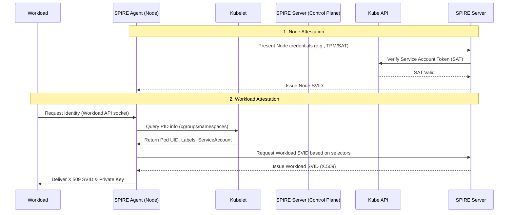

# Zero Trust Architecture

## Learning Outcomes

* Architect a zero-trust network topology using default-deny network policies at both L4 and L7.
* Implement cryptographic workload identity issuance using SPIFFE and SPIRE.
* Enforce strict mutual TLS (mTLS) across all inter-service communication using a service mesh or eBPF data plane.
* Diagnose identity verification, certificate rotation, and probe failures in highly segmented environments.
* Compare Kubernetes standard NetworkPolicies, eBPF-based CiliumNetworkPolicies, and Service Mesh AuthorizationPolicies.
* Configure continuous runtime verification and admission control to maintain an assume-breach posture.

## Theory: The Assume-Breach Posture on Bare Metal

Traditional bare-metal environments often rely on perimeter security—hardware firewalls, VLAN segregation, and DMZs. Once an attacker breaches the perimeter, lateral movement is trivial because the internal network is highly trusted. Zero Trust Architecture (ZTA) inverts this model: **trust nothing, verify everything, assume the network is already hostile.**

On bare-metal Kubernetes, you control the underlying network infrastructure, but you must treat the node network (and the pod overlay) as untrusted. ZTA in Kubernetes requires identity-based authentication for workloads, microsegmentation of network traffic, and end-to-end encryption. IP addresses are ephemeral and easily spoofed; cryptographic identity is the only valid mechanism for authorization.

### Core Pillars of Kubernetes Zero Trust

1. **Workload Identity:** Every process receives a short-lived, cryptographically verifiable identity (e.g., SPIFFE).
2. **Microsegmentation:** Network traffic is explicitly permitted via default-deny policies, bound to workload identities, not IPs.
3. **Encryption in Transit:** All traffic is encrypted and authenticated via mTLS.
4. **Continuous Verification:** Every request is authenticated and authorized at the application layer (L7), and cluster state is continuously audited.

## Theory: Workload Identity (SPIFFE/SPIRE)

The Secure Production Identity Framework for Everyone (SPIFFE) defines a standard for identifying software systems. SPIRE (the SPIFFE Runtime Environment) is the reference implementation consisting of a Server and an Agent.

In Kubernetes, you cannot rely on IP addresses or even standard ServiceAccounts (which only authenticate the pod to the Kubernetes API server) for workload-to-workload trust. SPIRE issues SVIDs (SPIFFE Verifiable Identity Documents)—typically X.509 certificates—directly to workloads based on rigorous attestation.

### Attestation Flow

SPIRE issues identities through a two-step attestation process: Node Attestation and Workload Attestation.



### Production Implementation Details

* **Trust Domain:** The logical boundary of your SPIFFE identities (e.g., `spiffe://cluster-main.prod.internal`).
* **SPIFFE ID:** A URI identifying the workload (e.g., `spiffe://cluster-main.prod.internal/ns/backend/sa/api-server`).
* **Workload API:** A local Unix Domain Socket mounted into the pod. The workload (or its proxy, like Envoy) connects to this socket to retrieve its SVID. No secrets are stored in the Kubernetes API or etcd.

:::caution
**Clock Skew Failure:** SVIDs have deliberately short TTLs (often 1-4 hours). If the system clocks on your bare-metal nodes drift by more than a few minutes, SVID validation will fail, breaking mTLS instantly across the cluster. NTP/Chrony configuration is a critical dependency for Zero Trust.
:::

## Theory: Network Microsegmentation

Standard Kubernetes `NetworkPolicy` operates at OSI Layers 3 and 4. It filters traffic based on Pod selectors, Namespaces, and IP blocks. In a ZT architecture, L3/L4 filtering is necessary but insufficient. Advanced CNIs (like Cilium) and Service Meshes (like Istio or Linkerd) provide L7 filtering and identity-based enforcement.

### Policy Engine Comparison

| Feature | Standard K8s `NetworkPolicy` | Cilium `CiliumNetworkPolicy` (eBPF) | Istio `AuthorizationPolicy` (Sidecar/Ambient) |
| :--- | :--- | :--- | :--- |
| **Enforcement Point** | iptables / CNI dataplane | eBPF in kernel | Envoy Proxy (Userspace) / zTunnel |
| **Identity Basis** | IP Addresses (via labels) | IP Addresses & eBPF identity | Cryptographic (SPIFFE/mTLS) |
| **OSI Layers** | L3 / L4 | L3 / L4 / L7 (DNS, HTTP) | L7 (HTTP, gRPC) |
| **Egress FQDN Filtering**| No | Yes (via DNS proxy) | Yes (via sidecar) |
| **Performance Overhead**| Moderate (iptables rules scale poorly) | Very Low (O(1) hash maps in kernel) | Moderate (Userspace context switching) |

### Implementing Default Deny

A true Zero Trust posture starts with a default deny configuration at the namespace level. 

```yaml
apiVersion: networking.k8s.io/v1
kind: NetworkPolicy
metadata:
  name: default-deny-all
  namespace: secure-workloads
spec:
  podSelector: {}
  policyTypes:
  - Ingress
  - Egress
```

:::caution
**Egress Deny Breaks DNS:** The policy above drops all outbound traffic, including UDP port 53 to `kube-dns`. Pods will instantly fail to resolve cluster services. You must explicitly allow egress to the `kube-system` namespace on port 53 for UDP/TCP.
:::

## Theory: mTLS Everywhere and Service Mesh

Microsegmentation restricts *where* traffic can go. mTLS ensures that traffic is encrypted and that the *identity* of the sender and receiver is cryptographically verified.

In bare-metal environments, deploying a service mesh (Istio, Linkerd) or an eBPF-based mesh (Cilium) is the standard approach to enforcing mTLS without modifying application code. 

When strict mTLS is enforced, the proxy intercepts the inbound connection, performs the TLS handshake using its SVID, verifies the client's SVID against the trust bundle, and only forwards the traffic to the application container over localhost if authorization policies pass.

### Istio PeerAuthentication (Strict mTLS)

Enforcing mTLS requires migrating from `PERMISSIVE` mode (accepts both plaintext and mTLS) to `STRICT` mode.

```yaml
apiVersion: security.istio.io/v1
kind: PeerAuthentication
metadata:
  name: default-strict-mtls
  namespace: istio-system
spec:
  mtls:
    mode: STRICT
```

### Practitioner Gotcha: The Kubelet Health Check Problem

When `STRICT` mTLS is enabled, the API server/kubelet cannot perform TCP or HTTP readiness/liveness probes directly against the pod's IP. The kubelet does not possess a mesh-issued client certificate, so the proxy rejects the plaintext health check probe.

**The Fix:** Modern meshes handle this via probe rewriting. The mutating admission webhook changes the pod specification so the probe points to the sidecar proxy's specific probe port (e.g., 15020 in Istio). The sidecar receives the plaintext probe, performs the actual health check against the application container via localhost, and returns the result to the kubelet. Ensure `sidecar.istio.io/rewriteAppHTTPProbers: "true"` is active (default in recent Istio versions).

## Theory: Continuous Verification and Admission Control

Zero Trust assumes the network is compromised, but it also assumes the API server orchestration can be manipulated. Continuous verification requires policies that block insecure configurations from ever entering etcd.

Using OPA Gatekeeper or Kyverno, you enforce the ZTA baseline:
1. **Require Service Accounts:** No pod may use the `default` service account.
2. **Require Network Policies:** No namespace may be created without a default-deny NetworkPolicy.
3. **Restrict Capabilities:** Drop `ALL` Linux capabilities; explicitly allow only necessary ones (e.g., `NET_ADMIN` for specific CNI agents).
4. **Enforce Image Signatures:** Verify container image signatures (e.g., Sigstore/Cosign) to ensure only CI/CD-approved binaries run on the metal.

---

## Hands-on Lab

In this lab, you will deploy a microservices application, enforce a default-deny network posture, enable strict mTLS, and write cryptographic authorization policies using Istio. 

### Prerequisites
* `kind` cluster running Kubernetes 1.32+.
* `istioctl` CLI installed (v1.24+).
* `kubectl` configured.

### Step 1: Initialize Cluster and Service Mesh

Create a bare-metal equivalent local cluster and install Istio with the minimal profile.

```bash
# Create cluster
kind create cluster --name zt-lab

# Install Istio (Minimal profile installs only istiod and CRDs)
istioctl install --set profile=minimal -y

# Label the default namespace for proxy injection
kubectl label namespace default istio-injection=enabled
```

*Verification:*
```bash
kubectl get pods -n istio-system
# Expected output: istiod-<hash>  1/1  Running
```

### Step 2: Deploy Workloads

Deploy a `sleep` pod (client) and an `httpbin` pod (server). We assign them distinct ServiceAccounts. Identity in the mesh is bound strictly to the ServiceAccount.

```yaml
# lab-workloads.yaml
apiVersion: v1
kind: ServiceAccount
metadata:
  name: sleep
---
apiVersion: apps/v1
kind: Deployment
metadata:
  name: sleep
spec:
  replicas: 1
  selector:
    matchLabels:
      app: sleep
  template:
    metadata:
      labels:
        app: sleep
    spec:
      serviceAccountName: sleep
      containers:
      - name: sleep
        image: curlimages/curl
        command: ["/bin/sleep", "3650d"]
---
apiVersion: v1
kind: ServiceAccount
metadata:
  name: httpbin
---
apiVersion: v1
kind: Service
metadata:
  name: httpbin
  labels:
    app: httpbin
spec:
  ports:
  - name: http
    port: 8000
    targetPort: 80
  selector:
    app: httpbin
---
apiVersion: apps/v1
kind: Deployment
metadata:
  name: httpbin
spec:
  replicas: 1
  selector:
    matchLabels:
      app: httpbin
  template:
    metadata:
      labels:
        app: httpbin
    spec:
      serviceAccountName: httpbin
      containers:
      - image: docker.io/kennethreitz/httpbin
        name: httpbin
        ports:
        - containerPort: 80
```

```bash
kubectl apply -f lab-workloads.yaml
kubectl wait --for=condition=ready pod -l app=httpbin --timeout=60s
kubectl wait --for=condition=ready pod -l app=sleep --timeout=60s
```

Verify baseline connectivity (this will succeed because Istio defaults to PERMISSIVE mTLS and no AuthorizationPolicies exist).

```bash
kubectl exec deploy/sleep -- curl -s -o /dev/null -w "%{http_code}" http://httpbin:8000/headers
# Expected output: 200
```

### Step 3: Enforce Strict mTLS

Lock down the namespace to strictly require mutual TLS.

```yaml
# mtls-strict.yaml
apiVersion: security.istio.io/v1
kind: PeerAuthentication
metadata:
  name: default-strict
  namespace: default
spec:
  mtls:
    mode: STRICT
```

```bash
kubectl apply -f mtls-strict.yaml
```

If you attempt to call `httpbin` from a pod *outside* the mesh (no sidecar, no client cert), it will fail. Connections between `sleep` and `httpbin` succeed because Envoy proxies handle the mTLS transparently.

### Step 4: Implement Default Deny (L7 Authorization)

Create an `AuthorizationPolicy` that denies all access by default.

```yaml
# default-deny.yaml
apiVersion: security.istio.io/v1
kind: AuthorizationPolicy
metadata:
  name: allow-nothing
  namespace: default
spec:
  {} # Empty spec means deny all
```

```bash
kubectl apply -f default-deny.yaml
```

Verify failure. The request is now blocked by the sidecar proxy at the receiving end because no policy allows it.

```bash
kubectl exec deploy/sleep -- curl -s -o /dev/null -w "%{http_code}" http://httpbin:8000/headers
# Expected output: 403
```

### Step 5: Implement Cryptographic Microsegmentation

Create a policy that explicitly allows the `sleep` ServiceAccount to execute HTTP GET requests against `httpbin`.

```yaml
# allow-sleep-to-httpbin.yaml
apiVersion: security.istio.io/v1
kind: AuthorizationPolicy
metadata:
  name: allow-sleep-to-httpbin
  namespace: default
spec:
  selector:
    matchLabels:
      app: httpbin
  action: ALLOW
  rules:
  - from:
    - source:
        principals: ["cluster.local/ns/default/sa/sleep"]
    to:
    - operation:
        methods: ["GET"]
```

```bash
kubectl apply -f allow-sleep-to-httpbin.yaml
```

Verify successful access and verify that other HTTP methods are blocked.

```bash
kubectl exec deploy/sleep -- curl -s -o /dev/null -w "%{http_code}" http://httpbin:8000/headers
# Expected output: 200

kubectl exec deploy/sleep -- curl -X POST -s -o /dev/null -w "%{http_code}" http://httpbin:8000/post
# Expected output: 403
```

### Troubleshooting the Lab

* **`curl: (56) Recv failure: Connection reset by peer`**: Occurs if `STRICT` mTLS is applied but the calling pod does not have a sidecar proxy injected. Ensure `istio-injection=enabled` is on the namespace.
* **`RBAC: access denied` / 403**: The `AuthorizationPolicy` did not match. Verify that the `principals` string exactly matches the source ServiceAccount SPIFFE ID format (`cluster.local/ns/<namespace>/sa/<sa-name>`).

---

## Practitioner Gotchas

### 1. SPIFFE Clock Skew Outages
**Context:** SVID X.509 certificates generated by SPIRE or a Service Mesh control plane have very short validity windows (often 1 to 12 hours) to minimize the blast radius of a compromised private key. 
**The Fix:** If the system clock on a worker node drifts ahead or behind the control plane node by more than the tolerance window, TLS handshakes will fail instantly with `certificate has expired` or `certificate is not yet valid`. On bare metal, reliable `chronyd` or `ntpd` daemons configured to local, highly available Stratum 2/3 servers are a strict prerequisite for ZTA.

### 2. Egress Deny Blocking Cloud Metadata and DNS
**Context:** When applying a strict L3/L4 egress deny `NetworkPolicy` to a namespace, all outbound packets drop. Teams often remember to whitelist their database IPs but forget fundamental infrastructure protocols.
**The Fix:** Always explicitly allow UDP/TCP port 53 egress to the `kube-system` namespace. Furthermore, if you are migrating bare-metal workloads that expect cloud metadata APIs (e.g., 169.254.169.254) for on-prem IAM emulation (like Kiam/kiam-server), you must explicitly allow routing to those metadata addresses.

### 3. StatefulSet Pod Identity Collisions
**Context:** Service Meshes assign cryptographic identity based on the Kubernetes ServiceAccount. For a Deployment, this is fine. For legacy distributed databases running as a StatefulSet (e.g., Zookeeper, Cassandra), peer nodes may require distinct identities to form a quorum securely. 
**The Fix:** If every pod in the StatefulSet shares the same ServiceAccount, they share the same SPIFFE ID. If application-level RBAC requires distinct identities per replica (e.g., `zk-0` vs `zk-1`), you cannot rely solely on the ServiceAccount identity. You must either map identities via exact Pod IP (anti-pattern in ZT) or use custom SPIRE workload attestors that issue unique SVIDs based on the pod's specific hostname/label.

### 4. Headless Services Bypassing Mesh Routing
**Context:** Headless services (ClusterIP: None) return pod IPs directly via DNS instead of a virtual IP. Sidecar proxies rely on Virtual IP capture (iptables) to determine the logical destination service. 
**The Fix:** When sending traffic to a headless service in a strictly mTLS-enforced mesh environment, the proxy might forward the traffic as raw TCP rather than L7 HTTP, bypassing L7 `AuthorizationPolicies`. Ensure clients use the FQDN of the specific pod (e.g., `pod-0.service.namespace.svc.cluster.local`) and configure the mesh explicitly to recognize the headless service ports as HTTP/gRPC (e.g., naming ports `http-db` instead of just `db` in the Service spec).

---

## Quiz

**1. You apply a strict `NetworkPolicy` to the `payments` namespace that drops all Ingress and Egress traffic. You then add an Egress rule allowing traffic to the `database` namespace on port 5432. The application begins logging "Temporary failure in name resolution." What is the cause?**
A) The application does not have a valid SPIFFE ID.
B) The policy blocked UDP port 53 traffic to the `kube-system` namespace, breaking DNS resolution.
C) The database is enforcing mTLS but the pod is sending plaintext traffic.
D) The NetworkPolicy must be applied to the `default` namespace to take effect.

<details><summary>Answer</summary>B is correct. Egress default-deny policies block all outbound traffic, including the essential DNS queries to CoreDNS.</details>

**2. A bare-metal node running a SPIRE Agent experiences a hardware clock failure, causing its local time to drift 45 minutes into the future. SVID TTLs are set to 1 hour. What is the immediate operational impact?**
A) The Kubernetes API server will evict all pods on the node.
B) The SPIRE Agent will request a certificate revocation from the SPIRE Server.
C) New mTLS connections initiated by workloads on this node will fail because peers will reject the future-dated SVIDs.
D) NetworkPolicies will drop traffic from this node at layer 4.

<details><summary>Answer</summary>C is correct. Cryptographic identity relies entirely on valid temporal boundaries. Time drift breaks certificate validation.</details>

**3. In a Zero Trust architecture utilizing a service mesh, why is standard Kubernetes `NetworkPolicy` still considered a necessary layer of defense alongside mesh `AuthorizationPolicy`?**
A) AuthorizationPolicy cannot filter traffic between different namespaces.
B) NetworkPolicy enforces rules in the kernel (iptables/eBPF), stopping malicious traffic before it reaches the userspace sidecar proxy.
C) AuthorizationPolicy only works on external ingress traffic, not pod-to-pod traffic.
D) NetworkPolicy replaces the need for mutual TLS.

<details><summary>Answer</summary>B is correct. Defense in depth. NetworkPolicies operate at L3/L4 and drop unwanted packets at the host level before they consume compute resources in the userspace proxy.</details>

**4. A developer configures an Istio `AuthorizationPolicy` for the `frontend` app that allows GET requests from the identity `cluster.local/ns/backend/sa/api-worker`. However, the requests are rejected with a HTTP 403 Forbidden. Which of the following is the most likely cause?**
A) The `api-worker` deployment is running without an injected sidecar proxy, so it cannot present the required cryptographic identity.
B) The `frontend` pod's readiness probe is failing.
C) The `AuthorizationPolicy` was applied in the `istio-system` namespace instead of the `backend` namespace.
D) eBPF must be enabled in the kernel to parse the SPIFFE ID.

<details><summary>Answer</summary>A is correct. If the calling pod lacks a sidecar, it cannot perform an mTLS handshake and present the `api-worker` SPIFFE identity required by the receiving sidecar.</details>

**5. How does a workload uniquely prove its identity to the SPIRE Agent running on the same node to retrieve its SVID?**
A) The workload presents a static API key mounted via Kubernetes Secrets.
B) The SPIRE Agent queries the kubelet via the pod's cgroup and PID to cryptographically verify the calling process's properties.
C) The workload performs a reverse DNS lookup to match its IP to the ServiceAccount.
D) The workload contacts the central SPIRE Server directly over HTTPS.

<details><summary>Answer</summary>B is correct. This is Workload Attestation. The Agent intercepts the request on the local unix socket and asks the kernel and kubelet for the caller's PID/cgroup to securely identify the pod.</details>

---

## Further Reading

* [SPIFFE Concept Documentation](https://spiffe.io/docs/latest/spiffe-about/spiffe-concepts/)
* [Istio Security Architecture: Identity and Authorization](https://istio.io/latest/docs/concepts/security/)
* [Cilium eBPF Datapath and Network Policies](https://docs.cilium.io/en/stable/security/policy/)
* [NIST Special Publication 800-207: Zero Trust Architecture](https://csrc.nist.gov/publications/detail/sp/800-207/final)