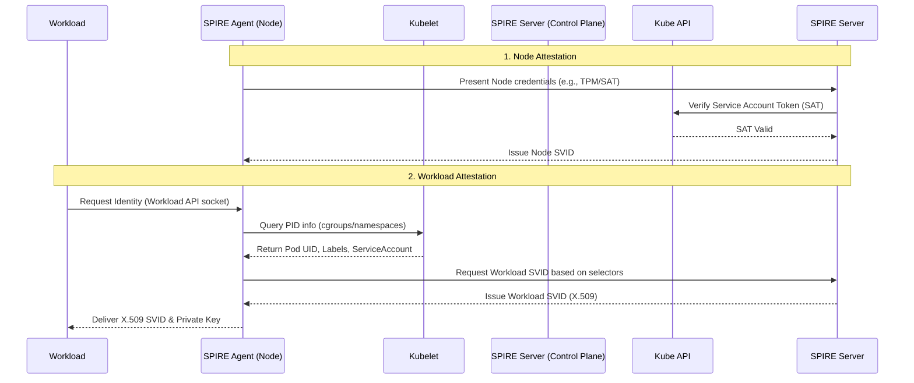
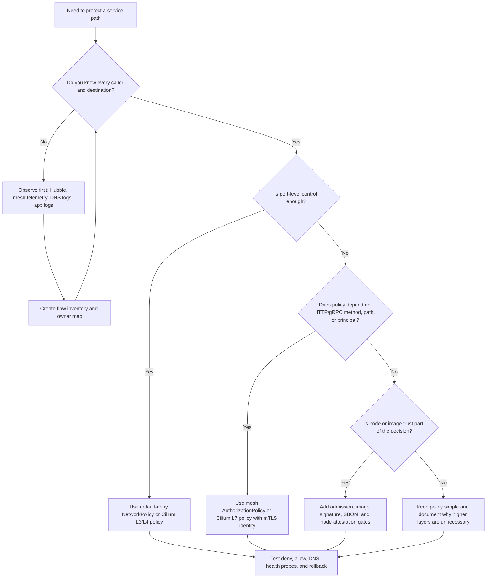

## What You'll Be Able to Do

* **Map** NIST zero-trust tenets to concrete bare-metal Kubernetes controls, including PDP/PEP placement, least privilege, and continuous verification.
* **Design** workload identity and strict mTLS boundaries with SPIFFE/SPIRE, service mesh policy, and explicit exceptions for probes and platform traffic.
* **Choose** the right microsegmentation layer across Kubernetes NetworkPolicy, Cilium policy, and service-mesh authorization for on-prem workloads.
* **Enforce** continuous verification with admission policy, runtime posture checks, node trust signals, and image provenance controls.
* **Evaluate** the operational cost and adoption path for zero trust when you own the hardware, network, certificates, and response process.

## Why This Module Matters

In early 2024, the healthcare sector witnessed one of the most devastating cyberattacks in history: the UnitedHealth Group (Change Healthcare) breach. The intrusion began simply enough—attackers from the ALPHV/BlackCat ransomware gang compromised credentials on a remote access portal that lacked multi-factor authentication. However, the catastrophic damage was not caused by the initial entry, but by the network architecture that awaited the attackers once inside. Because the internal infrastructure operated on a legacy, perimeter-based implicit trust model, the attackers were able to move laterally with absolute impunity.

Once past the perimeter, the attackers freely navigated the internal network, discovering data stores, compromising domain controllers, and mapping service-to-service communications that blindly trusted any request originating from an internal IP address. They exfiltrated the highly sensitive health data of millions of patients and systematically deployed ransomware across thousands of mission-critical systems. The financial impact was staggering: UnitedHealth Group's SEC filings reported roughly $872 million in total cyberattack impacts for the first quarter of 2024 alone (direct response plus business disruption), with full-year costs estimated far higher and excluding the ensuing regulatory fines, class-action lawsuits, and long-term reputational damage.

Had a Zero Trust Architecture (ZTA) been enforced internally—with strict cryptographic microsegmentation, mandatory mutual TLS (mTLS), and continuous identity-based access controls for every workload—lateral movement of this kind would have been far harder to sustain. In principle, the blast radius could have been contained much closer to the single compromised entry point, because an attacker without a valid workload identity (a SPIFFE SVID or an equivalent mesh-issued mTLS credential) cannot authenticate to adjacent internal services. Zero Trust transforms the internal network from a soft, vulnerable underbelly into a far more hostile, cryptographically enforced environment, making it much less likely that a single breach results in total systemic collapse.

For an on-premises Kubernetes platform, the lesson is sharper than it is in a managed cloud. There is no cloud security group, provider IAM condition key, managed certificate authority, or hosted KMS quietly narrowing the blast radius for you; the platform team owns the policy decision points, the enforcement points, the key hierarchy, the logging plane, and the failure modes. Zero trust is therefore not a product SKU in this track. It is the durable security spine you build from workload identity, encrypted service-to-service traffic, admission controls, node trust, and operational discipline.

## Did You Know?

* **NIST defines the architecture, not a product list:** SP 800-207 describes logical components such as policy engines and enforcement points, which you must map to Kubernetes admission, mesh, CNI, and identity controls.
* **SPIFFE and SPIRE are graduated CNCF projects:** SPIFFE defines the workload identity standard, while SPIRE is the reference implementation that can run entirely on owned hardware.
* **Kubernetes has native admission policy now:** ValidatingAdmissionPolicy is stable in Kubernetes 1.30, while MutatingAdmissionPolicy is still beta in the v1.35 documentation snapshot.
* **Policy engines keep moving:** Kyverno graduated from CNCF in 2026, joining OPA as a mature policy-as-code option, but each engine still has different strengths for validation, mutation, and image verification.

## Theory: The Assume-Breach Posture on Bare Metal

Traditional bare-metal environments often rely on perimeter security—hardware firewalls, VLAN segregation, and DMZs. Once an attacker breaches the perimeter, lateral movement is trivial because the internal network is highly trusted. Zero Trust Architecture (ZTA) inverts this model: **trust nothing, verify everything, assume the network is already hostile.**

The foundational principles of this approach were pioneered long before Kubernetes existed. Google's BeyondCorp initiative (enterprise Zero Trust for user and device access) began as an internal project around 2011 and was documented in a series of research papers published between 2014 and 2018 in USENIX ;login:. Building upon this success for human access, Google later published a 'BeyondProd' whitepaper extending Zero Trust principles from user/device access (BeyondCorp) to cloud-native workload and service identity.

In a Kubernetes environment, you control the underlying compute nodes, but you must treat the internal pod overlay network as untrusted. By default, in the absence of any NetworkPolicy, all pods in a Kubernetes cluster can communicate with each other on any port. This implicit-trust posture directly contradicts Zero Trust. Furthermore, Kubernetes NetworkPolicy resources operate only at Layer 3 and Layer 4 (IP addresses and ports); they cannot enforce Layer 7 policies such as HTTP method, URL path, or request headers.

To achieve a true assume-breach posture, you must implement identity-based authentication, cryptographic microsegmentation, encryption in transit, and continuous verification. IP addresses are ephemeral, easily spoofed, and entirely inadequate for authorization.

NIST SP 800-207 is useful because it gives you a model that survives tool churn. The policy engine decides whether access should be allowed, the policy administrator turns that decision into configuration or a connection setup action, and the policy enforcement point sits close enough to the resource to block the request if the decision is negative. In Kubernetes, those roles are split across the API server admission chain, the service mesh or CNI dataplane, the identity issuer, and the workload proxy. A bare-metal design becomes fragile when these pieces are installed independently without a single control story, because a request can be denied by admission, allowed by the CNI, downgraded by a mesh exception, and then silently accepted by the application.

The important shift is per-request authorization rather than network-location authorization. A perimeter model says, "this packet came from the internal VLAN, therefore it is probably safe." A zero-trust model asks whether the caller has a current identity, whether the node and workload posture are acceptable, whether the requested method is allowed, whether the destination is the intended resource, and whether the recent telemetry changes the decision. That does not mean every packet triggers a human-readable policy lookup; caches, certificate lifetimes, and proxy policy compilation exist for performance. It does mean the architecture is designed so that trust expires, identity is re-proven, and authorization can be revoked without waiting for a quarterly firewall cleanup.

Flat Layer 2 datacenter networks are especially dangerous because they hide trust assumptions behind convenience. A new rack can be patched into the same broadcast domain, a legacy database can keep listening on a familiar port, and a compromised build worker can suddenly scan workloads that were never part of its business function. Zero trust forces the team to draw boundaries around resources instead of around buildings or VLAN names. The pod network, the node management network, the out-of-band management network, and the storage network may all need different enforcement points, but none of them should grant access simply because a packet originated "inside."

> **Pause and predict**: If standard Kubernetes networking allows all pod-to-pod communication by default, what happens to existing network flows the moment you apply an empty `podSelector: {}` ingress NetworkPolicy to a namespace?

## Theory: Government Standards and Maturity Models

Zero Trust is not merely an industry buzzword; it is a strictly defined architectural paradigm backed by rigorous federal standards. The term 'Zero Trust' was coined by John Kindervag at Forrester Research in 2010 in a report titled 'No More Chewy Centers: Introducing the Zero Trust Model of Information Security', introducing the phrase 'never trust, always verify'. Today, this concept is legally mandated for US federal systems.

US Executive Order 14028 'Improving the Nation's Cybersecurity' was signed by President Biden on May 12, 2021, directing federal agencies to adopt Zero Trust Architecture. This was followed by OMB Memorandum M-22-09 'Moving the U.S. Government Towards Zero Trust Cybersecurity Principles', issued January 26, 2022, requiring federal agencies to meet specific ZT objectives by the end of FY2024 (September 30, 2024).

### NIST SP 800-207

NIST Special Publication 800-207 'Zero Trust Architecture' was finalized on August 11, 2020 and is the primary NIST ZTA standard. It defines three core ZTA logical components: Policy Engine (PE), Policy Administrator (PA), and Policy Enforcement Point (PEP).

NIST SP 800-207 defines exactly seven tenets of Zero Trust Architecture:
1. All data sources and computing services are resources.
2. All communication is secured regardless of network location.
3. Access is granted on a per-session basis with least privilege.
4. Access is determined by dynamic policy including observable state of client identity/application and requesting asset.
5. The enterprise monitors and measures the integrity and security posture of all owned and associated assets.
6. All resource authentication and authorization are dynamic and strictly enforced before access is allowed.
7. The enterprise collects as much information as possible about the current state of assets, network infrastructure and communications and uses it to improve its security posture.

NIST SP 800-207A 'A Zero Trust Architecture Model for Access Control in Cloud-Native Applications in Multi-Location Environments' was subsequently published September 13, 2023 to address Kubernetes and service meshes directly. For this module, 800-207A is the bridge between the abstract model and the practical Kubernetes controls: it makes application-level policy, service identity, and distributed enforcement first-class design concerns instead of treating them as optional hardening. That matters on bare metal because the control plane, the mesh control plane, and the CNI are all operated by the same organization, so weak ownership boundaries can create gaps between the standard and the actual platform.

### CISA and DoD Maturity Models

CISA Zero Trust Maturity Model Version 2.0 was published April 11, 2023. CISA ZTMM v2.0 is organized around five pillars: Identity, Devices, Networks, Applications and Workloads, and Data. It includes three cross-cutting capabilities that span all pillars: Visibility and Analytics, Automation and Orchestration, and Governance. Furthermore, CISA ZTMM v2.0 defines four maturity stages: Traditional, Initial, Advanced, and Optimal.

Similarly, the DoD Zero Trust Reference Architecture Version 2.0 and the DoD Zero Trust Strategy remain useful because they break zero trust into pillars, capabilities, and staged outcomes rather than pretending a single deployment creates compliance. The DoD roadmap distinguishes target-level and advanced-level activities; the practical lesson for a private Kubernetes platform is to phase controls in a measurable order. Identity and visibility normally come before strict enforcement, because a team cannot safely deny traffic it cannot attribute, observe, or roll back during an incident.

You can treat these standards as a maturity lens for owned infrastructure. At a traditional stage, the datacenter may rely on VLANs, firewall zones, shared service accounts, and long-lived certificates. At an initial stage, namespaces gain default-deny policies, workloads get unique service accounts, and the platform starts rejecting insecure manifests before scheduling. At an advanced stage, SPIFFE identities, mTLS, L7 authorization, signed images, node attestation, and centralized policy evidence are connected into a feedback loop. At an optimal stage, the platform can continuously adapt policy based on workload, node, and runtime signals without turning every application deployment into a manual security exception.

## Theory: Workload Identity (SPIFFE/SPIRE)

The Secure Production Identity Framework for Everyone (SPIFFE) defines a standard for securely identifying software systems. SPIRE (the SPIFFE Runtime Environment) is the CNCF reference implementation consisting of a central Server and an Agent running on every node. SPIRE achieved CNCF Graduated project status on August 22, 2022, and SPIFFE achieved CNCF Graduated project status on August 23, 2022. As of June 2026, the upstream SPIRE release stream has moved beyond the older v1.14 line, so production teams should verify the current supported patch release before pinning manifests.

SPIRE issues an SVID (SPIFFE Verifiable Identity Document), which serves as the workload's passport. A SPIFFE Verifiable Identity Document (SVID) can be encoded as either an X.509 certificate (X.509-SVID) or a JWT token (JWT-SVID).

The reason SPIFFE matters is that Kubernetes ServiceAccounts alone are not enough to secure service-to-service traffic. A ServiceAccount token proves something to the Kubernetes API, but it is not automatically a short-lived, mutually authenticated identity for every application connection. SPIRE turns Kubernetes metadata, node attestation, and workload selectors into cryptographic identities that proxies and applications can verify without sharing long-lived secrets. On premises, that also means you choose the signing root, the rotation process, the backup process, and the disaster-recovery story for the identity plane.

Trust-domain design is the first hard decision. A single trust domain across all clusters makes policy simpler because the same SPIFFE ID format can authorize traffic between sites, but it also expands the blast radius if the root or registration workflow is compromised. One trust domain per cluster limits blast radius and gives cleaner revocation boundaries, but federation must be designed before cross-cluster service calls become common. For a regulated or multi-tenant datacenter, the safer default is often one trust domain per administrative boundary, with explicit federation for approved service paths rather than a single global identity namespace.

### Attestation Flow

SPIRE issues identities through a highly secure, two-step attestation process that does not rely on easily spoofed API tokens.


```mermaid
sequenceDiagram
    participant Workload
    participant SPIRE Agent (Node)
    participant Kubelet
    participant SPIRE Server (Control Plane)
    participant Kube API

    Note over SPIRE Server, SPIRE Agent (Node): 1. Node Attestation
    SPIRE Agent (Node)->>SPIRE Server: Present Node credentials (e.g., TPM/SAT)
    SPIRE Server->>Kube API: Verify Service Account Token (SAT)
    Kube API-->>SPIRE Server: SAT Valid
    SPIRE Server-->>SPIRE Agent (Node): Issue Node SVID

    Note over Workload, SPIRE Server: 2. Workload Attestation
    Workload->>SPIRE Agent (Node): Request Identity (Workload API socket)
    SPIRE Agent (Node)->>Kubelet: Query PID info (cgroups/namespaces)
    Kubelet-->>SPIRE Agent (Node): Return Pod UID, Labels, ServiceAccount
    SPIRE Agent (Node)->>SPIRE Server: Request Workload SVID based on selectors
    SPIRE Server-->>SPIRE Agent (Node): Issue Workload SVID (X.509)
    SPIRE Agent (Node)-->>Workload: Deliver X.509 SVID & Private Key
```

### Production Implementation Details

* **Trust Domain:** The logical boundary of your SPIFFE identities (e.g., `spiffe://cluster-main.prod.internal`).
* **SPIFFE ID:** A URI identifying the workload (e.g., `spiffe://cluster-main.prod.internal/ns/backend/sa/api-server`).
* **Workload API:** A local Unix Domain Socket mounted into the pod. The workload (or its proxy, such as Envoy) connects to this socket to retrieve its SVID, meaning no sensitive private keys are ever stored in the Kubernetes API or etcd.

This design gives you an on-prem equivalent to managed workload identity, but it is not free. SPIRE Server must be backed up, upgraded, monitored, and protected like a certificate authority. SPIRE Agents must run on every node, clocks must remain synchronized, and registration entries must be managed as carefully as RBAC. If the identity plane fails closed, new connections can fail across the platform; if it fails open, zero trust becomes theater. Treat the SPIRE control plane as a Tier 0 service alongside etcd, the API server, DNS, and the container registry.

## Theory: Network Microsegmentation

Standard Kubernetes `NetworkPolicy` operates purely at OSI Layers 3 and 4, acting as a basic firewall. In a ZT architecture, L3/L4 filtering is necessary to drop bulk malicious traffic early, but it is deeply insufficient. Advanced CNIs (like Cilium) and Service Meshes (like Istio or Linkerd) provide the necessary L7 filtering and identity-based enforcement.

Cilium achieved CNCF Graduated project status on October 11, 2023. The current Cilium stable documentation stream is in the 1.19 patch line, and Cilium's release notes and documentation should be checked before choosing a patch for Kubernetes 1.35. Cilium enforces identity-based network security policies using eBPF in the Linux kernel; identities are derived from Kubernetes labels and remain meaningful across pod restarts. Cilium's strict encryption options can require encrypted node-to-node or pod-to-pod traffic instead of allowing best-effort fallback, which is a much closer match to zero-trust assumptions.

Microsegmentation should begin with the cheapest enforcement point that can express the rule correctly. If the rule is "only pods with this label may connect to PostgreSQL on port 5432," Kubernetes NetworkPolicy or a CNI policy can stop the packet before it reaches a userspace proxy. If the rule is "only the checkout service account may call `POST /authorize` on the payments API," a service mesh AuthorizationPolicy or an L7-aware CNI rule is needed because the port alone is too coarse. If the rule depends on a signed workload identity, the policy must see the mTLS principal, not merely the source IP.

On bare metal, IP-based policy ages poorly because the fleet churns in ways that cloud abstractions often hide. A failed server is reimaged, a node joins from a different rack, a local PV pins a workload to a replacement host, or a maintenance window moves pods across top-of-rack boundaries. Labels, ServiceAccounts, SPIFFE IDs, and namespace ownership survive those moves better than IP allowlists. The practical pattern is to use L3/L4 policy for broad containment, then layer L7 identity policy where business risk justifies the extra control-plane and dataplane complexity.

### Policy Engine Comparison

| Feature | Standard K8s `NetworkPolicy` | Cilium `CiliumNetworkPolicy` (eBPF) | Istio `AuthorizationPolicy` (Sidecar/Ambient) |
| :--- | :--- | :--- | :--- |
| **Enforcement Point** | iptables / CNI dataplane | eBPF in kernel | Envoy Proxy (Userspace) / zTunnel |
| **Identity Basis** | IP Addresses (via labels) | IP Addresses & eBPF identity | Cryptographic (SPIFFE/mTLS) |
| **OSI Layers** | L3 / L4 | L3 / L4 / L7 (DNS, HTTP) | L7 (HTTP, gRPC) |
| **Egress FQDN Filtering**| No | Yes (via DNS proxy) | Yes (via sidecar) |
| **Performance Overhead**| Moderate (iptables rules scale poorly) | Very Low (O(1) hash maps in kernel) | Moderate (Userspace context switching) |


```mermaid
flowchart TD
    subgraph K8s["Standard K8s NetworkPolicy"]
        direction TB
        K1["Enforcement: iptables / CNI dataplane"]
        K2["Identity Basis: IP Addresses (via labels)"]
        K3["OSI Layers: L3 / L4"]
        K4["Egress FQDN Filtering: No"]
        K5["Performance Overhead: Moderate (iptables rules scale poorly)"]
    end
    subgraph Cilium["Cilium CiliumNetworkPolicy (eBPF)"]
        direction TB
        C1["Enforcement: eBPF in kernel"]
        C2["Identity Basis: IP Addresses & eBPF identity"]
        C3["OSI Layers: L3 / L4 / L7 (DNS, HTTP)"]
        C4["Egress FQDN Filtering: Yes (via DNS proxy)"]
        C5["Performance Overhead: Very Low (O(1) hash maps in kernel)"]
    end
    subgraph Istio["Istio AuthorizationPolicy (Sidecar/Ambient)"]
        direction TB
        I1["Enforcement: Envoy Proxy (Userspace) / zTunnel"]
        I2["Identity Basis: Cryptographic (SPIFFE/mTLS)"]
        I3["OSI Layers: L7 (HTTP, gRPC)"]
        I4["Egress FQDN Filtering: Yes (via sidecar)"]
        I5["Performance Overhead: Moderate (Userspace context switching)"]
    end
```

### Implementing Default Deny

A true Zero Trust posture must start with a default deny configuration at the namespace level. This means that any pod created without an explicit allow rule is isolated by default.

```yaml
apiVersion: networking.k8s.io/v1
kind: NetworkPolicy
metadata:
  name: default-deny-all
  namespace: secure-workloads
spec:
  podSelector: {}
  policyTypes:
  - Ingress
  - Egress
```

> **Stop and think**: Why is an IP address considered completely inadequate for identity in a Zero Trust, cloud-native architecture? Consider the lifecycle of a Kubernetes pod when answering.

## Theory: mTLS Everywhere and Service Mesh

Microsegmentation restricts *where* traffic can go, but mTLS ensures that traffic is encrypted and that the *identity* of both the sender and receiver is cryptographically verified before a single byte of application data is exchanged.

Linkerd was the first service mesh to achieve CNCF Graduated status, graduating on July 28, 2021. Linkerd 2.18 was announced in April 2025 and remains the latest stable series documented by the project at the time of this module update. Istio achieved CNCF Graduated project status on July 12, 2023. Istio's supported-release table currently lists 1.30 as a supported release and 1.29 as still supported for Kubernetes 1.31 through 1.35, while Istio's ambient data plane mode reached General Availability with the v1.24 release in November 2024.

When strict mTLS is enforced, the proxy intercepts the inbound connection, performs the TLS handshake using its SVID, verifies the client's SVID against the trust bundle, and only forwards the traffic to the application container over localhost if authorization policies pass.

The important design question is not "sidecar or ambient?" but "where is the PEP and what identity does it enforce?" A sidecar mesh puts an Envoy or Linkerd proxy next to the workload, which gives strong per-pod policy boundaries but consumes memory and CPU on every pod. Istio ambient mode moves baseline secure transport into node-level ztunnel components and adds waypoint proxies where L7 policy is needed, which can reduce sidecar sprawl but changes how troubleshooting, bypass, and policy ownership work. In both models, strict mTLS is only a zero-trust control if plaintext fallback is removed and if authorization decisions use authenticated principals rather than informal service names.

Health checks and platform traffic are where clean diagrams meet operational reality. The kubelet, node-local DNS cache, metrics scrapers, storage sidecars, and backup agents may need to talk to workloads or proxies in ways that ordinary application clients do not. If every exception is handled by disabling mTLS for a namespace, the team recreates a trusted island. If every exception is handled by a one-off annotation, the team loses auditability. The durable pattern is to document platform identities, name probe ports correctly, keep exceptions narrow, and verify them with automated tests after every mesh upgrade.

### Istio PeerAuthentication (Strict mTLS)

Enforcing mTLS requires migrating the mesh from `PERMISSIVE` mode (which accepts both plaintext and mTLS to allow legacy migrations) to `STRICT` mode.

```yaml
apiVersion: security.istio.io/v1
kind: PeerAuthentication
metadata:
  name: default-strict-mtls
  namespace: istio-system
spec:
  mtls:
    mode: STRICT
```

### The Kubelet Health Check Problem

When `STRICT` mTLS is enabled, the kubelet cannot perform TCP or HTTP readiness/liveness probes directly against the pod's IP. The kubelet does not possess a mesh-issued client certificate, so the proxy rejects the plaintext health check probe.

**The Fix:** Modern meshes handle this via probe rewriting. The mutating admission webhook changes the pod specification so the probe points to the sidecar proxy's specific probe port (e.g., 15020 in Istio). The sidecar receives the plaintext probe, performs the actual health check against the application container via localhost, and returns the result to the kubelet. Ensure `sidecar.istio.io/rewriteAppHTTPProbers: "true"` is active (default in recent Istio versions).

Probe rewriting is a controlled exception, not a reason to leave the mesh in permissive mode. In production, verify that the rewritten probe is visible in the rendered pod spec, that readiness still fails when the application is actually unhealthy, and that a non-mesh client cannot reach the application port directly. This is especially important on owned hardware because the same team usually operates kubelet configuration, CNI rules, mesh webhooks, and monitoring. A bad probe exception can therefore become an invisible cross-layer bypass unless it is tested from both inside and outside the mesh.

## Theory: Continuous Verification and Admission Control

Zero Trust assumes the network is compromised, but it also assumes the API server orchestration can be manipulated. Continuous verification requires policies that block insecure configurations from ever entering etcd.

Open Policy Agent (OPA) achieved CNCF Graduated project status on January 29, 2021. OPA Gatekeeper remains a common Kubernetes admission controller for Rego-based constraints and has added integration with Kubernetes ValidatingAdmissionPolicy. Kyverno graduated from CNCF in March 2026 and is often easier for platform teams that want Kubernetes-native policy resources, mutation, generation, and image verification without teaching every contributor Rego. Kubernetes itself now provides ValidatingAdmissionPolicy as a stable, CEL-based in-process validation mechanism in v1.30, while the v1.35 documentation snapshot still marks MutatingAdmissionPolicy as beta and disabled by default.

Using OPA Gatekeeper or Kyverno, you enforce the ZTA baseline:
1. **Require Service Accounts:** No pod may use the `default` service account.
2. **Require Network Policies:** No namespace may be created without a default-deny NetworkPolicy.
3. **Restrict Capabilities:** Drop `ALL` Linux capabilities; explicitly allow only necessary ones (e.g., `NET_ADMIN` for specific CNI agents).
4. **Enforce Image Signatures:** Verify container image signatures (e.g., Sigstore/Cosign) to ensure only CI/CD-approved binaries run on the metal.

Admission control is a policy enforcement point because it sits before the object becomes desired state. A ValidatingAdmissionPolicy can reject a deployment that uses the `default` ServiceAccount, a Gatekeeper constraint can require namespace labels and default-deny policies, and a Kyverno policy can verify image signatures or generate missing guardrail resources where mutation is appropriate. These controls do not replace mesh or CNI enforcement because they only see API requests. They prevent bad desired state from being stored, while the dataplane prevents bad traffic from succeeding when runtime conditions change.

Runtime verification closes the gap between "approved at deploy time" and "still trustworthy now." A pod may start from a signed image and later load an unexpected library, a node may boot from a known-good image and later drift after emergency maintenance, or a privileged DaemonSet may be approved for the CNI but accidentally scheduled onto an unsupported node class. On bare metal, this is where Module 6.2's hardware trust topics connect to zero trust: TPM measured boot, UEFI Secure Boot, NBDE with Tang and Clevis, and remote attestation tools such as Keylime can give the policy engine stronger evidence about node integrity. Confidential Containers and Kata-based isolation can add protection for selected high-value workloads, but CoCo remains a more specialized control, not the default answer for every service.

Image provenance is another continuous-verification input. Signing with Sigstore cosign or CNCF Notary Project/Notation can prove that the artifact admitted to the cluster matches a build pipeline or key policy, while SBOM tools such as Syft and scanners such as Trivy help the team understand what is inside the artifact. In an air-gapped or restricted datacenter, scanner databases and signing trust roots must be mirrored, refreshed, and audited through the same release process as images. Otherwise, an admission policy may look strict while silently accepting stale vulnerability intelligence or signatures from keys that should have been rotated.

The practical choice between VAP, Gatekeeper, Kyverno, and custom webhooks depends on the policy shape. Use ValidatingAdmissionPolicy for compact CEL validations that should run inside the API server with low operational overhead. Use Gatekeeper when your organization already standardizes on Rego, needs audit-style constraint reporting, or wants portable policy across more than Kubernetes. Use Kyverno when Kubernetes-native resources, mutation, generation, image verification, and approachable YAML policies matter more than a general-purpose policy language. Use a custom webhook only when the policy needs external state or behavior these engines cannot express, because every webhook becomes another highly available service that can block the API server if it fails closed.

## Theory: Patterns & Anti-Patterns

Zero trust on bare metal works best when controls are layered from broad, cheap, and reliable toward narrow, expensive, and context-rich. The wrong instinct is to start with the most advanced tool because it sounds most secure. A mesh, CNI, admission engine, and SPIRE deployment all add value, but each one also adds certificates, controllers, metrics, upgrades, and failure modes. The proven pattern is to install observability and identity first, enforce low-risk boundaries next, then move critical service paths into strict L7 authorization after the team can explain every allowed flow.

| Pattern | When to Use | Why It Scales |
|---|---|---|
| **Default-deny namespaces with named allow rules** | Use for every production namespace before onboarding high-value workloads. | It gives teams a predictable starting point, keeps unknown services isolated, and makes network intent reviewable in Git. |
| **SPIFFE identity per administrative boundary** | Use when multiple clusters, sites, or tenants need service-to-service authentication. | Trust domains create clean revocation and federation boundaries, which matters when a datacenter or team boundary becomes part of incident containment. |
| **Layered L3/L4 plus L7 policy** | Use when basic port containment is necessary but business rules depend on methods, paths, or authenticated principals. | Kernel or CNI policy drops broad unwanted traffic cheaply, while mesh or L7 policy protects the expensive application surface. |
| **Admission policy before enforcement rollout** | Use before enabling strict mesh or CNI controls in production. | Admission rejects obviously unsafe manifests early, reducing the number of runtime exceptions the operations team must debug during rollout. |

| Anti-Pattern | What Goes Wrong | Better Alternative |
|---|---|---|
| **Mesh-first rollout without flow inventory** | Strict mTLS or deny-by-default authorization can turn one missing exception into a platform-wide outage. | Run telemetry in permissive or observe mode first, inventory real flows, and enforce namespace by namespace with rollback criteria. |
| **IP allowlists as workload identity** | Pod IPs, node replacements, and rack migrations make static rules stale, brittle, and hard to audit. | Authorize by ServiceAccount, SPIFFE ID, namespace ownership, labels, and signed workload provenance where possible. |
| **Global trust domain for every cluster** | A single compromised root or registration workflow can affect all sites and tenants. | Use smaller trust domains with explicit federation where cross-cluster traffic is required. |
| **Permanent exceptions for platform traffic** | DNS, health probes, metrics, and backup paths become invisible bypass channels. | Model platform components as named identities with narrow policies, and test exceptions after every CNI or mesh upgrade. |

The scaling lesson is that zero trust must become a platform workflow, not a heroic security project. A namespace template should include default-deny policy, ServiceAccount conventions, ownership labels, admission bindings, and dashboard links. A service onboarding checklist should ask which callers exist, which methods they need, which egress destinations are required, which identity signs the image, and how the service behaves during certificate rotation. When those questions are answered in code review, the platform can scale; when they are answered during an outage bridge, zero trust becomes a tax everyone resents.

## Theory: Decision Framework

Use this flow to choose the first enforcement layer for a service path. It deliberately starts with what you know about the flow, because the safest policy is not the strictest policy you can imagine; it is the strictest policy you can explain, observe, test, and recover.


```mermaid
flowchart TD
    A["Need to protect a service path"] --> B{"Do you know every caller and destination?"}
    B -- "No" --> C["Observe first: Hubble, mesh telemetry, DNS logs, app logs"]
    C --> D["Create flow inventory and owner map"]
    D --> B
    B -- "Yes" --> E{"Is port-level control enough?"}
    E -- "Yes" --> F["Use default-deny NetworkPolicy or Cilium L3/L4 policy"]
    E -- "No" --> G{"Does policy depend on HTTP/gRPC method, path, or principal?"}
    G -- "Yes" --> H["Use mesh AuthorizationPolicy or Cilium L7 policy with mTLS identity"]
    G -- "No" --> I{"Is node or image trust part of the decision?"}
    I -- "Yes" --> J["Add admission, image signature, SBOM, and node attestation gates"]
    I -- "No" --> K["Keep policy simple and document why higher layers are unnecessary"]
    F --> L["Test deny, allow, DNS, health probes, and rollback"]
    H --> L
    J --> L
    K --> L
```

| Decision Point | Favor Simpler Control | Favor Stronger Control |
|---|---|---|
| **Traffic shape** | Few ports, stable service ownership, no method-level distinction. | Multiple methods on one port, sensitive APIs, cross-tenant callers, or partner integrations. |
| **Identity confidence** | ServiceAccount ownership is clean and namespaces are trustworthy. | Workloads span clusters, teams share namespaces, or policy must survive node and pod churn. |
| **Operational maturity** | The team lacks flow telemetry, certificate rotation drills, or admission audit dashboards. | The team can observe denied traffic, rotate roots, test rollback, and staff mesh/CNI incidents. |
| **Failure tolerance** | A deny mistake would stop revenue, patient care, trading, manufacturing, or control-plane operations. | The service is already isolated, has staged rollout, and has clear break-glass procedures. |

The matrix is intentionally conservative because on-premises platforms do not have infinite elastic headroom or managed-provider rollback buttons. If an mTLS outage consumes every application team, the cost is not just extra CPU; it is operations headcount, delayed maintenance, and lost trust in the platform. Start with a demonstrable business boundary, make it observable, enforce it at the cheapest correct layer, and then move the highest-risk paths to cryptographic identity and L7 policy.

## Theory: Cost Lens for On-Prem Zero Trust

Zero trust has a direct financial shape in a private datacenter. The CapEx side includes additional control-plane nodes for SPIRE, mesh, policy engines, observability, and private registry services; possible HSMs or TPM-capable server refreshes; network gear capacity for encrypted east-west traffic; and storage for logs, traces, audit events, SBOMs, signatures, and evidence retention. The OpEx side includes certificate rotation, policy review, incident response drills, vulnerability database mirroring, mesh upgrades, CNI upgrades, compliance evidence collection, and the people who keep these systems from failing closed at the worst moment.

The TCO drivers are not evenly distributed. Per-request cryptography adds CPU overhead and latency, but the larger cost often comes from the operational envelope around that crypto: dashboards, alerts, SLOs, runbooks, staging clusters, canary namespaces, and on-call training. A service mesh may require more memory per pod or more node-level proxy capacity; an L7 CNI policy may require Envoy proxying for selected flows; a policy engine may require highly available webhook replicas and careful API-server failure policies. These costs are legitimate security investments when the protected workloads are regulated, multi-tenant, high-value, or difficult to segment by physical network.

Staffing is the cost line that teams most often hide from themselves. Someone must own trust-domain design, root rotation, emergency policy changes, evidence retention, failed admission rollouts, and denied-flow triage at 03:00. If those duties are spread informally across platform, security, and network teams, every incident becomes a debate about ownership before it becomes a repair. Budget for named service ownership, training, and recurring game days, because a zero-trust stack without practiced operators is just a more complicated outage surface.

On-premises zero trust tends to beat cloud-native default controls when utilization is steady, data gravity is high, egress would be expensive, regulatory requirements demand local control, or the organization already owns skilled datacenter and platform teams. It tends not to pay off at small scale, for spiky workloads, or when the organization cannot staff identity, networking, observability, and security operations as a shared product. A small team running a few internal services may get more risk reduction from namespace isolation, image signing, and admission policy than from a full mesh-and-SPIRE rollout on day one. A bank, hospital network, defense contractor, research lab, or multi-tenant private platform has a different risk profile and can justify the stronger spine.

Depreciation and refresh cycles matter because zero-trust requirements outlive individual servers. If the next three-year hardware refresh adds TPM 2.0, Secure Boot support, enough cores for encryption overhead, and NIC offload capacity, the security architecture gets cheaper over time. If procurement optimizes only for raw compute density, the platform may later discover that node attestation, encrypted east-west traffic, and observability retention all require emergency spending. Treat zero trust as an input to capacity planning, not a security feature bolted on after the racks are full.

## Theory: Rollout and Operations Model

The safest rollout is staged around evidence, not around tool installation. Phase one is inventory: enable flow telemetry, collect DNS queries, identify ServiceAccounts, map namespace owners, and record which jobs, probes, backup agents, and storage controllers talk to each workload. Phase two is baseline identity: remove shared ServiceAccounts, standardize labels, decide trust-domain boundaries, and make admission report violations without blocking. Phase three is containment: apply namespace default-deny policies, allow DNS and platform dependencies, and test one business path at a time. Phase four is cryptographic enforcement: move selected service paths into strict mTLS and L7 authorization. Phase five is continuous verification: connect image signatures, SBOMs, node trust, runtime alerts, and audit evidence to the same policy review process.

Hypothetical scenario: a private hospital platform team enables strict mTLS across every namespace during a weekend maintenance window after a successful staging test. The staging cluster did not include the legacy claims batch job, the production monitoring scraper, or the backup agent that still reached a headless database by pod DNS name. On Monday morning, the applications look healthy because probes were rewritten, but reports fail, backups stall, and metrics disappear. The root cause is not that mTLS is bad. The root cause is that the team enforced a cryptographic boundary before it had a complete flow inventory and before platform identities were represented as first-class callers.

Break-glass must be designed before enforcement. A practical break-glass process is not "turn off the mesh" because that removes the security boundary exactly when operators are stressed. Better options include a pre-approved emergency namespace label that relaxes only selected authorization policies, a short-lived GitOps change with an incident ticket, and dashboards that show which identity and rule denied the request. The break-glass path should expire automatically and leave evidence. If the only way to recover is editing live cluster objects by hand, the zero-trust system will drift and auditors will not be able to reconstruct what happened.

Observability is part of the control, not a separate nice-to-have. The platform needs denied-flow metrics, certificate expiration dashboards, identity issuance rates, admission rejection counts, policy audit results, and per-namespace exception inventories. Hubble, mesh telemetry, API audit logs, policy-engine reports, registry logs, and SIEM pipelines all tell different parts of the story. On premises, these data sources also consume storage, network bandwidth, and retention planning. A regulated environment may need months or years of evidence, so the logging architecture must be sized like production infrastructure rather than a best-effort developer convenience.

Upgrade sequencing is another operational trap. CNI upgrades can change policy behavior, mesh upgrades can alter probe rewriting or principal formatting, SPIRE upgrades can change registration workflows, and policy-engine upgrades can change validation defaults. Treat each control-plane upgrade as a security migration with canaries, policy conformance tests, and a rollback plan. A useful preflight test suite exercises DNS egress, service-to-service GET and POST paths, a denied plaintext caller, image-signature rejection, default ServiceAccount rejection, and a simulated certificate-expiration alert. If those tests are not automated, every upgrade becomes a manual rediscovery of the zero-trust design.

Multi-site on-premises environments add one more layer: federation should follow business relationships, not network adjacency. A disaster-recovery site may need to accept traffic from a production trust domain during failover, while a lab cluster in the same building should not automatically be trusted. Federation bundles, CA rotation, and cross-site policy should be rehearsed before an outage because emergency federation changes are high-risk. The operational goal is boring: each service knows who can call it, each cluster knows which trust domains it accepts, and each site can revoke or rotate trust without breaking unrelated workloads.

Finally, zero trust must include retirement of old trust paths. Legacy firewall rules, shared database passwords, node-local admin scripts, wildcard service accounts, and unowned namespaces often survive because they predate the new architecture. If those paths remain active, attackers will use them because they are simpler than defeating mTLS or SPIFFE attestation. Add old-path removal to the rollout plan, assign owners, and measure progress. A zero-trust program that only adds new controls but never removes implicit trust keeps paying the cost without receiving the full risk reduction.

## Common Mistakes

| Mistake | Why | Fix |
|---|---|---|
| **Forgetting DNS and infrastructure egress** | A default-deny egress policy blocks CoreDNS, NTP, registry mirrors, and any on-prem metadata or identity endpoints. | Explicitly allow DNS, time sync, registry, and required platform endpoints before enforcing workload egress deny. |
| **Relying purely on NetworkPolicy** | NetworkPolicy only filters L3/L4 traffic, so a caller allowed to reach port 8000 may still use a dangerous HTTP method. | Use NetworkPolicy for broad containment and mesh or Cilium L7 policy for method, path, and principal-aware control. |
| **Ignoring SPIFFE clock skew** | SVID X.509 certificates have bounded validity windows and can fail validation when bare-metal node clocks drift. | Run reliable `chronyd` or `ntpd` against local, redundant time sources and alert on drift before certificate rotation fails. |
| **Using the `default` ServiceAccount** | Identity is derived from ServiceAccount and namespace context, so shared accounts create shared blast radius and weak audit trails. | Assign a unique, least-privilege ServiceAccount to each workload and reject default-account pods at admission. |
| **Running mesh in PERMISSIVE mode forever** | PERMISSIVE mode accepts plaintext fallback, which weakens the mTLS boundary attackers are supposed to hit after compromise. | Use permissive mode only for migration, then set PeerAuthentication to `STRICT` with tested exceptions. |
| **Colliding StatefulSet identities** | Legacy databases may need per-replica identity, while a normal StatefulSet often gives every replica the same ServiceAccount identity. | Use explicit SPIRE selectors or application-level identity mapping when quorum members must be distinguished. |
| **Leaving headless services out of mesh thinking** | Headless services return pod IPs directly, which can bypass virtual-IP routing assumptions and downgrade L7 policy visibility. | Name ports correctly, test headless flows, and configure mesh behavior for the exact DNS names clients use. |
| **Treating probe rewriting as magic** | Kubelet probes do not hold mesh client certificates, so strict mTLS can break readiness or hide plaintext exceptions. | Verify rewritten probes in rendered pod specs and test that non-mesh clients still fail against protected application ports. |

## Quiz

<details>
<summary>1. Scenario: Map NIST zero-trust tenets to a bare-metal Kubernetes cluster that currently trusts all traffic on the internal VLAN. Which design change best represents the NIST shift from perimeter trust to resource-centric control?</summary>

A) Add a larger firewall between the datacenter and the internet, but keep pod-to-pod traffic open inside the cluster.
B) Put every namespace behind default-deny policy, require authenticated workload identity, and enforce authorization near each service.
C) Rename VLANs so production and staging have clearer network labels.
D) Increase node CPU capacity so encryption overhead is less visible.

**Answer:** B is correct. NIST zero trust narrows trust from broad network locations to specific resources and per-request decisions. A perimeter firewall is still useful, but it does not solve lateral movement after an internal compromise. Default-deny policy, workload identity, and enforcement near the service map directly to the PDP/PEP model taught in the module.
</details>

<details>
<summary>2. Scenario: Design workload identity and strict mTLS for two on-prem clusters that occasionally call each other. What is the safest default trust-domain approach?</summary>

A) Use one global trust domain for every cluster, namespace, tenant, and site because it makes identities shorter.
B) Use one trust domain per administrative boundary and add explicit federation for approved cross-cluster service paths.
C) Skip SPIFFE federation and authorize cross-cluster traffic by pod IP ranges.
D) Put both clusters on the same Layer 2 network and let the mesh discover remote services automatically.

**Answer:** B is correct. Smaller trust domains reduce blast radius when a registration workflow, root, or site is compromised. Federation preserves cross-cluster use cases while keeping trust relationships explicit and reviewable. A global domain can be operationally convenient, but it shifts too much risk into one identity boundary.
</details>

<details>
<summary>3. Scenario: Choose a microsegmentation layer for a payments API where only the checkout ServiceAccount may call `POST /authorize`, while ordinary metrics scraping must still work. Which control is most appropriate?</summary>

A) A Kubernetes NetworkPolicy that allows all pods in the namespace to reach port 8000.
B) A static firewall rule allowing the worker-node subnet to reach the payments pods.
C) A mesh AuthorizationPolicy or L7-aware Cilium policy using authenticated principal and HTTP method.
D) A DNS record that points checkout clients to a different service name.

**Answer:** C is correct. The requirement depends on caller identity and HTTP method, which ordinary L3/L4 policy cannot fully express. NetworkPolicy can still provide a broad deny-by-default boundary around the service, but it should not be the only control. Metrics scraping should be represented as a separate, named platform identity with a narrow allow rule.
</details>

<details>
<summary>4. Scenario: Enforce continuous verification before workloads are scheduled. A team wants to reject pods using the `default` ServiceAccount and block unsigned images in Kubernetes 1.35. What should they combine?</summary>

A) ValidatingAdmissionPolicy for simple CEL checks plus Gatekeeper or Kyverno for policy cases that need richer audit, mutation, or image verification.
B) A CiliumNetworkPolicy, because all security decisions should happen in the dataplane.
C) A Linkerd ServiceProfile, because admission policy is not part of zero trust.
D) A manual spreadsheet reviewed after every deployment window.

**Answer:** A is correct. Admission is a policy enforcement point because it blocks bad desired state before it reaches etcd and the scheduler. ValidatingAdmissionPolicy is stable for CEL validation in Kubernetes 1.35, while Gatekeeper and Kyverno cover richer policy workflows. Dataplane policy is still needed at runtime, but it cannot replace admission checks for manifest quality and provenance.
</details>

<details>
<summary>5. Scenario: Evaluate the operational cost of full zero trust for a private platform with five low-risk internal apps and no regulated data. What is the most pragmatic adoption path?</summary>

A) Deploy SPIRE, Istio strict mTLS, Cilium L7 policy, CoCo, and HSM-backed signing for every namespace immediately.
B) Start with unique ServiceAccounts, default-deny namespaces, image signing, admission guardrails, and telemetry before deciding whether a full mesh is justified.
C) Avoid all zero-trust controls until the platform reaches hundreds of nodes.
D) Buy faster servers and treat the extra capacity as a substitute for policy design.

**Answer:** B is correct. Zero trust must be scaled to risk, team maturity, and operational capacity. Small, low-risk platforms often get meaningful improvement from identity hygiene, default-deny policy, provenance, and admission before they pay the mesh-and-SPIRE operating cost. Full cryptographic service identity may still be warranted later, but it should follow observed service flows and staffing reality.
</details>

<details>
<summary>6. Scenario: A strict egress NetworkPolicy is applied to the `payments` namespace, and the application starts logging "Temporary failure in name resolution." What did the team most likely forget?</summary>

A) The application does not have a valid SPIFFE ID.
B) The policy blocked UDP/TCP port 53 traffic to the cluster DNS service.
C) The database requires mTLS and the pod is sending plaintext.
D) The NetworkPolicy must be applied to the `default` namespace instead.

**Answer:** B is correct. Egress default-deny policies block all outbound traffic unless an allow rule exists, including the DNS queries applications need before opening database connections. This is one of the most common on-prem rollout failures because teams remember application destinations before platform dependencies. DNS, NTP, registry mirrors, and identity endpoints should be part of the baseline egress template.
</details>

<details>
<summary>7. Scenario: A bare-metal node running a SPIRE Agent drifts 45 minutes into the future while SVID TTLs are short. What immediate failure should operators expect?</summary>

A) The Kubernetes API server automatically evicts every pod on the node.
B) The SPIRE Server revokes every certificate in the trust domain.
C) New mTLS connections can fail because peers reject certificates that appear not yet valid or outside their validity window.
D) NetworkPolicy starts dropping packets at layer 4 because time is part of label selection.

**Answer:** C is correct. Certificate validation depends on time, so clock drift can break identity even when the workload, policy, and network are otherwise correct. Bare-metal clusters need reliable local time sources because internet NTP may not be reachable or permitted in regulated environments. Alerting on drift is therefore part of the zero-trust control plane, not just general Linux hygiene.
</details>

<details>
<summary>8. Scenario: A team enables Cilium strict encryption mode and several legacy pods lose connectivity because they cannot negotiate encrypted traffic. Why is this aligned with zero trust, even though it caused an outage?</summary>

A) Cilium revoked their SPIFFE certificates after detecting an old image.
B) Strict encryption changes unencrypted inter-node traffic from best-effort fallback to a hard failure.
C) Istio ambient mode disables all Cilium policy by default.
D) iptables cannot scale past a single namespace under Kubernetes 1.35.

**Answer:** B is correct. A zero-trust design should not silently fall back to plaintext when the policy says traffic must be encrypted. The outage indicates the rollout was not staged or inventoried well enough, but the enforcement behavior matches the security intent. The fix is to use observe mode, canaries, and rollback criteria before strict enforcement reaches critical workloads.
</details>

## Hands-On Exercise

In this lab, you will progressively deploy a microservices application, enforce a default-deny network posture, enable strict mTLS, and write cryptographic authorization policies using Istio.

### Prerequisites
* `kind` cluster (Kubernetes 1.29+; this lab uses no 1.35-specific features, so any recent `kind` node image works).
* `istioctl` CLI installed (v1.29+).
* `kubectl` configured and ready.

### Success Criteria

- [ ] Strict mTLS is enforced for mesh workloads, and a plaintext caller without a sidecar cannot reach `httpbin`.
- [ ] Default-deny authorization blocks `sleep` until an explicit `AuthorizationPolicy` allows the correct ServiceAccount.
- [ ] The allow policy permits HTTP GET from `sleep` but rejects HTTP POST to the same service.
- [ ] DNS and mesh control-plane pods remain healthy after the deny policy is applied.

### Step 1: Initialize Cluster and Service Mesh

Create a bare-metal equivalent local cluster and install Istio with the minimal profile.

<details><summary>Solution: Initialize Cluster</summary>

```bash
# Create cluster
kind create cluster --name zt-lab

# Install Istio (Minimal profile installs only istiod and CRDs)
istioctl install --set profile=minimal -y

# Label the default namespace for proxy injection
kubectl label namespace default istio-injection=enabled
```

*Verification:*
```bash
kubectl get pods -n istio-system
# Expected output: istiod-<hash>  1/1  Running
```

</details>

### Step 2: Deploy Workloads

Deploy a `sleep` pod (client) and an `httpbin` pod (server). We assign them distinct ServiceAccounts. Identity in the mesh is bound strictly to the ServiceAccount. Create the workloads manifest and apply it.

<details><summary>Solution: Deploy Workloads</summary>

```bash
cat << 'EOF' > lab-workloads.yaml
apiVersion: v1
kind: ServiceAccount
metadata:
  name: sleep
---
apiVersion: apps/v1
kind: Deployment
metadata:
  name: sleep
spec:
  replicas: 1
  selector:
    matchLabels:
      app: sleep
  template:
    metadata:
      labels:
        app: sleep
    spec:
      serviceAccountName: sleep
      containers:
      - name: sleep
        image: curlimages/curl
        command: ["/bin/sleep", "3650d"]
---
apiVersion: v1
kind: ServiceAccount
metadata:
  name: httpbin
---
apiVersion: v1
kind: Service
metadata:
  name: httpbin
  labels:
    app: httpbin
spec:
  ports:
  - name: http
    port: 8000
    targetPort: 80
  selector:
    app: httpbin
---
apiVersion: apps/v1
kind: Deployment
metadata:
  name: httpbin
spec:
  replicas: 1
  selector:
    matchLabels:
      app: httpbin
  template:
    metadata:
      labels:
        app: httpbin
    spec:
      serviceAccountName: httpbin
      containers:
      - image: docker.io/kennethreitz/httpbin
        name: httpbin
        ports:
        - containerPort: 80
EOF

kubectl apply -f lab-workloads.yaml
kubectl wait --for=condition=ready pod -l app=httpbin --timeout=60s
kubectl wait --for=condition=ready pod -l app=sleep --timeout=60s
```

Verify baseline connectivity. This will succeed because Istio defaults to PERMISSIVE mTLS and no AuthorizationPolicies exist yet.
```bash
kubectl exec deploy/sleep -- curl -s -o /dev/null -w "%{http_code}" httpbin.default.svc.cluster.local:8000/headers
# Expected output: 200
```

</details>

### Step 3: Enforce Strict mTLS

Lock down the namespace so every inbound workload connection must negotiate mutual TLS before the application receives traffic.

<details><summary>Solution: Strict mTLS</summary>

```bash
cat << 'EOF' > mtls-strict.yaml
apiVersion: security.istio.io/v1
kind: PeerAuthentication
metadata:
  name: default-strict
  namespace: default
spec:
  mtls:
    mode: STRICT
EOF

kubectl apply -f mtls-strict.yaml
```

Now prove that mesh and non-mesh callers are treated differently. The injected `sleep` pod still succeeds (its sidecar negotiates mTLS transparently), but a caller **without** a sidecar is refused:

```bash
# In-mesh caller still works (sidecar handles mTLS) -> 200
kubectl exec deploy/sleep -- curl -s -o /dev/null -w "%{http_code}\n" httpbin.default.svc.cluster.local:8000/headers

# Out-of-mesh caller: a pod in a namespace WITHOUT sidecar injection
kubectl create namespace no-mesh --dry-run=client -o yaml | kubectl apply -f -
kubectl label namespace no-mesh istio-injection=disabled --overwrite
kubectl run plain-caller -n no-mesh --image=curlimages/curl --restart=Never -- \
  sh -c 'curl -s -o /dev/null -w "%{http_code}\n" --max-time 5 httpbin.default.svc.cluster.local:8000/headers || echo "connection rejected"'
kubectl logs -n no-mesh plain-caller
# Expected: a connection reset / "connection rejected" — the plaintext caller cannot satisfy STRICT mTLS
kubectl delete pod plain-caller -n no-mesh
```

Connections between `sleep` and `httpbin` succeed because the sidecar Envoy proxies handle the mTLS transparently; the out-of-mesh `plain-caller` is refused because it cannot present a mesh-issued client certificate. This is the proof behind success criterion #1.

</details>

### Step 4: Implement Default Deny (L7 Authorization)

Create an `AuthorizationPolicy` that denies all application access by default across the namespace before any specific caller is allowed.

<details><summary>Solution: Default Deny</summary>

```bash
cat << 'EOF' > default-deny.yaml
apiVersion: security.istio.io/v1
kind: AuthorizationPolicy
metadata:
  name: allow-nothing
  namespace: default
spec: {} # Empty spec means deny all
EOF

kubectl apply -f default-deny.yaml
```

Verify failure. The request is now blocked by the sidecar proxy at the receiving end because no policy allows it.

```bash
kubectl exec deploy/sleep -- curl -s -o /dev/null -w "%{http_code}" httpbin.default.svc.cluster.local:8000/headers
# Expected output: 403
```

</details>

### Step 5: Implement Cryptographic Microsegmentation

Create a policy that explicitly allows the `sleep` ServiceAccount to execute HTTP GET requests against `httpbin` while leaving other methods denied.

<details><summary>Solution: Allow Policy</summary>

```bash
cat << 'EOF' > allow-sleep-to-httpbin.yaml
apiVersion: security.istio.io/v1
kind: AuthorizationPolicy
metadata:
  name: allow-sleep-to-httpbin
  namespace: default
spec:
  selector:
    matchLabels:
      app: httpbin
  action: ALLOW
  rules:
  - from:
    - source:
        principals: ["cluster.local/ns/default/sa/sleep"]
    to:
    - operation:
        methods: ["GET"]
EOF

kubectl apply -f allow-sleep-to-httpbin.yaml
```

Verify successful access and verify that other HTTP methods are strictly blocked.

```bash
kubectl exec deploy/sleep -- curl -s -o /dev/null -w "%{http_code}" httpbin.default.svc.cluster.local:8000/headers
# Expected output: 200

kubectl exec deploy/sleep -- curl -X POST -s -o /dev/null -w "%{http_code}" httpbin.default.svc.cluster.local:8000/post
# Expected output: 403
```

</details>

### Troubleshooting the Lab

* **`curl: (56) Recv failure: Connection reset by peer`**: Occurs if `STRICT` mTLS is applied but the calling pod does not have a sidecar proxy injected. Ensure `istio-injection=enabled` is on the namespace.
* **`RBAC: access denied` / 403**: The `AuthorizationPolicy` did not match. Verify that the `principals` string exactly matches the source ServiceAccount SPIFFE ID format (`cluster.local/ns/<namespace>/sa/<sa-name>`).

## Sources

- [UnitedHealth Group Q1 2024 Results filed with SEC](https://www.sec.gov/Archives/edgar/data/731766/000073176624000146/a2024q1exhibit991.htm) — Official filing support for the Change Healthcare financial impact referenced in the opener.
- [House Energy & Commerce: What We Learned from the Change Healthcare Cyber Attack](https://energycommerce.house.gov/posts/what-we-learned-change-healthcare-cyber-attack) — Official congressional summary supporting the no-MFA access-path discussion.
- [NIST SP 800-207: Zero Trust Architecture](https://csrc.nist.gov/pubs/sp/800/207/final) — Foundational zero-trust architecture standard and PDP/PEP framing.
- [NIST SP 800-207A: Cloud-Native Access Control Model](https://csrc.nist.gov/pubs/sp/800/207/a/final) — NIST follow-on publication for cloud-native and service-mesh access control.
- [CISA Zero Trust Maturity Model](https://www.cisa.gov/resources-tools/resources/zero-trust-maturity-model) — Official maturity model used for pillar and maturity-stage discussion.
- [GSA DoD Zero Trust Strategy Buyer’s Guide](https://buy.gsa.gov/api/system/files/documents/dod-zero-trust-strategy-buyer-s-guide-version-1.4-may-2025-508-reviewed_0.pdf) — Official GSA guide aligning procurement language with the DoD zero-trust strategy and outcomes.
- [Kubernetes v1.35 ValidatingAdmissionPolicy](https://v1-35.docs.kubernetes.io/docs/reference/access-authn-authz/validating-admission-policy/) — Versioned Kubernetes documentation showing VAP as stable in v1.30.
- [Kubernetes v1.35 MutatingAdmissionPolicy](https://v1-35.docs.kubernetes.io/docs/reference/access-authn-authz/mutating-admission-policy/) — Versioned Kubernetes documentation showing MutatingAdmissionPolicy as beta in v1.35.
- [SPIFFE Concepts](https://spiffe.io/docs/latest/spiffe-about/spiffe-concepts/) — Upstream SPIFFE identity, trust-domain, and SVID concepts.
- [SPIRE CNCF Project Page](https://www.cncf.io/projects/spire/) — CNCF maturity status for SPIRE.
- [SPIFFE CNCF Project Page](https://www.cncf.io/projects/spiffe/) — CNCF maturity status for SPIFFE.
- [Istio Supported Releases](https://istio.io/latest/docs/releases/supported-releases/) — Current Istio support matrix and Kubernetes version compatibility.
- [Istio Security Concepts](https://istio.io/latest/docs/concepts/security/) — Upstream source for Istio identity, authentication, and authorization behavior.
- [Istio PeerAuthentication Reference](https://istio.io/latest/docs/reference/config/security/peer_authentication/) — Upstream reference for strict mTLS policy.
- [Istio AuthorizationPolicy Reference](https://istio.io/latest/docs/reference/config/security/authorization-policy/) — Upstream reference for principal, ALLOW, DENY, and AUDIT policy behavior.
- [Cilium Network Policy Overview](https://docs.cilium.io/en/stable/security/policy/) — Upstream Cilium policy model and enforcement documentation.
- [Cilium Transparent Encryption](https://docs.cilium.io/en/stable/security/network/encryption/) — Upstream source for strict encryption behavior and limitations.
- [Kyverno Releases](https://kyverno.io/docs/installation/releases/) — Upstream Kyverno release and Kubernetes compatibility information.
- [Gatekeeper ValidatingAdmissionPolicy Integration](https://open-policy-agent.github.io/gatekeeper/website/docs/validating-admission-policy/) — Upstream Gatekeeper documentation for VAP integration.
- [Keylime](https://keylime.dev/) — Upstream source for TPM-based remote boot attestation and runtime integrity measurement.
- [Confidential Containers CNCF Project Page](https://www.cncf.io/projects/confidential-containers/) — CNCF maturity and project scope for CoCo.
- [Sigstore Cosign Container Signing](https://docs.sigstore.dev/cosign/signing/signing_with_containers/) — Upstream documentation for container image signing.
- [Notary Project CNCF Page](https://www.cncf.io/projects/notary-project/) — CNCF source for Notary Project and Notation artifact signing.
- [Trivy Air-Gap Configuration](https://trivy.dev/docs/latest/advanced/air-gap/) — Upstream documentation for vulnerability scanning in restricted networks.

## Next Module

Continue with [Module 7.1: Upgrades and Lifecycle Management](../operations/module-7.1-upgrades/) to connect this security architecture to upgrade sequencing, rollback planning, and long-running operations on owned hardware.
