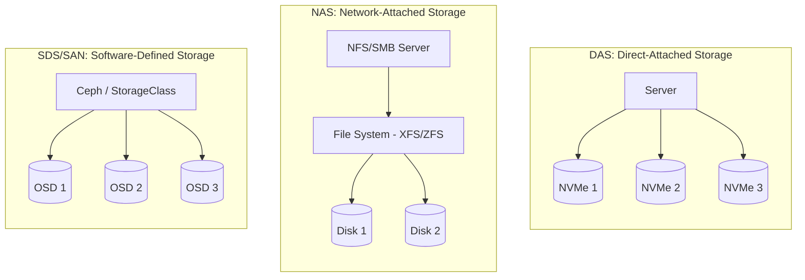
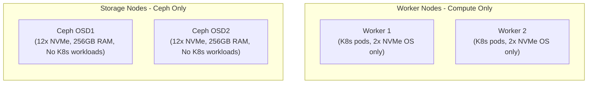
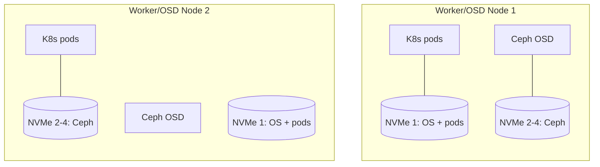
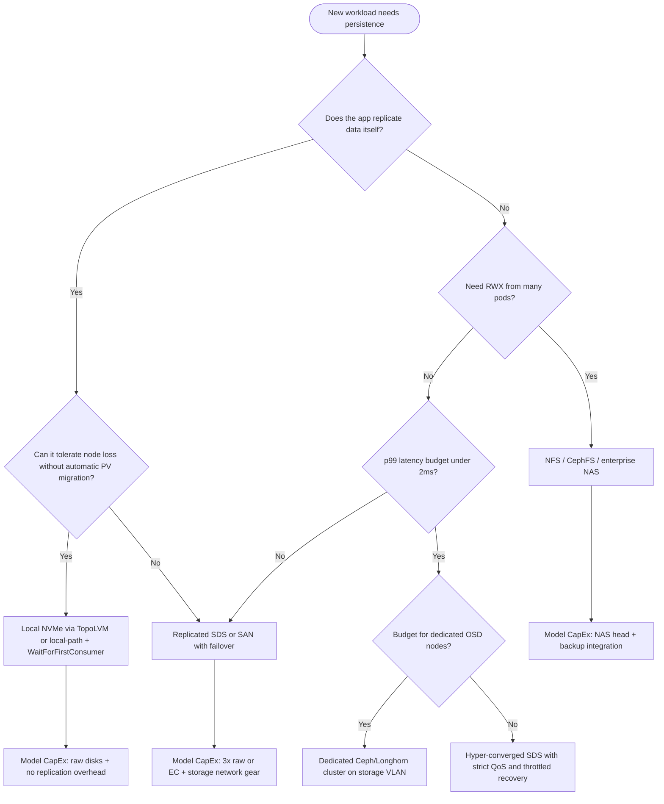

> **Complexity**: `[MEDIUM]` | Time: 45 minutes
>
> **Prerequisites**: [Module 1.2: Server Sizing](/on-premises/planning/module-1.2-server-sizing/), [CKA: Storage](/k8s/cka/part4-storage/)

---

## What You'll Be Able to Do

After completing this module, you will be able to:

1. **Classify** workloads by storage type (block, file, object) and Kubernetes access mode (RWO, ROX, RWX, RWOP), then map each to an appropriate on-premises backend
2. **Design** storage architectures that separate compute and storage tiers with dedicated networks, failure domains, and hardware matched to workload latency requirements
3. **Evaluate** distributed storage (Ceph/Rook, Longhorn, OpenEBS Mayastor) versus node-local storage (local-path, TopoLVM) versus external SAN/NAS for specific durability and performance contracts
4. **Plan** storage hardware procurement including drive tiers (NVMe, SSD, HDD), replication overhead, RAID boundaries, and capacity projections with a defensible TCO model
5. **Diagnose** storage performance bottlenecks caused by I/O contention, replication amplification on the datacenter fabric, and topology mismatches between pods and volumes

---

## Why This Module Matters

Hypothetical scenario: a data analytics company deploys a Kubernetes cluster on bare metal with local SATA SSDs in each server. For the first few months everything works. Then they deploy Apache Kafka, which needs persistent storage that survives node rescheduling. When a worker node fails, the Kafka brokers are rescheduled onto healthy nodes — but their data was on the dead node's local SSDs. They lose the most recent event data and spend days manually rebalancing partitions to recover.

They then deploy Ceph via Rook on the same SSDs, and write performance falls sharply. A default three-replica pool (`osd_pool_default_size = 3`) adds significant write amplification on drives already serving application I/O — behavior documented in the [default pool size](https://docs.ceph.com/en/latest/rados/configuration/pool-pg-config-ref/) reference. The OSD processes compete with the Kubernetes workloads for CPU and memory, and Ceph rebalancing after a node failure consumes a large share of cluster I/O bandwidth, leaving every application sluggish until recovery completes.

The fix is to dedicate a set of servers as Ceph OSD nodes with NVMe drives, separated from the Kubernetes worker nodes, with storage traffic carried on a dedicated VLAN with jumbo frames. The lesson: **storage architecture decisions must be made before you buy hardware, not after you deploy workloads.** On bare metal you own every tradeoff — latency, replication, rack power, depreciation, and the network tax when writes fan out across the fabric — and Kubernetes exposes those tradeoffs through CSI, StorageClasses, and scheduling rather than hiding them behind a cloud control plane.

---

## What You'll Learn

- Block, file, and object storage taxonomy and how Kubernetes access modes constrain backend choice
- The CSI driver model (controller, node, attacher) and the PV/PVC/StorageClass lifecycle on Kubernetes 1.35
- Node-local versus distributed storage on owned hardware, including TopoLVM, local-path-provisioner, Rook-Ceph, Longhorn, and OpenEBS
- Failure domains, data gravity, and the StatefulSet + headless Service + volumeClaimTemplates pattern
- Performance dimensions (IOPS, throughput, latency) and the network-storage tax from replication
- CapEx versus OpEx, replication overhead, erasure coding, and when on-premises storage beats cloud block/file/object services

---

## The Storage Taxonomy: Block, File, and Object

Before you pick a vendor or a CSI driver, you need a vocabulary that survives tool churn. Enterprise storage has always been organized around three access models. Kubernetes inherits that split through volume modes, access modes, and the capabilities each CSI driver advertises.

Block storage presents raw LUNs or logical volumes that a filesystem or database engine formats directly. File storage exposes a shared namespace through NFS, SMB, or a clustered filesystem. Object storage stores opaque blobs behind an HTTP API with rich metadata and virtually unlimited horizontal scale. None of these is universally "best." Each optimizes for a different consistency, sharing, and latency contract. On-premises clusters often run all three simultaneously on different hardware tiers.

Block volumes map cleanly to Kubernetes `volumeMode: Block` or the default `Filesystem` mode backed by a block device formatted inside the node. Databases that manage their own page cache and WAL — PostgreSQL, MySQL InnoDB, etcd, Kafka log segments — typically want block because they control fsync semantics and avoid double caching through the page cache plus database buffer pool. Block backends on bare metal include local NVMe via TopoLVM or OpenEBS LocalPV-LVM, Ceph RBD via [Rook](https://github.com/rook/rook) (a [CNCF Graduated](https://www.cncf.io/projects/rook/) project), Longhorn replicated volumes ([CNCF Incubating](https://www.cncf.io/projects/longhorn/)), enterprise SAN LUNs presented through a vendor CSI, and iSCSI targets. The dominant access mode is **ReadWriteOnce (RWO)**: one node mounts the volume read/write at a time, which matches a single database pod pinned to fast local or networked block.

File storage serves **ReadWriteMany (RWX)** and **ReadOnlyMany (ROX)** workloads where many pods must see the same directory tree concurrently. Training pipelines that mount a shared dataset, CI artifact caches, content management static assets, and legacy applications expecting POSIX semantics fit here. On-premises file options include NFS servers (often fronted by the [NFS CSI driver](https://github.com/kubernetes-csi/csi-driver-nfs)), CephFS through Rook, enterprise NAS appliances with CSI integration, and GlusterFS-style clustered filesystems (less common on new builds). File protocols add metadata overhead and usually higher latency than local block, but they eliminate the "copy dataset to every node" problem that makes RWX impossible on pure local block without an application-level replication layer.

Object storage targets backup targets, container image layers in registries, log archives, ML feature stores, and any workload that speaks S3-compatible APIs rather than POSIX. On bare metal you typically deploy [MinIO](https://min.io/docs/minio/kubernetes/upstream/index.html), Ceph RADOS Gateway, or a commercial appliance, then integrate through the [AWS S3 CSI driver](https://github.com/awslabs/mountpoint-s3-csi-driver) or application-native SDKs. Object stores optimize for throughput and durability per dollar at the cost of higher latency and no partial in-place rewrite semantics — a poor fit for database primary storage but excellent for off-cluster backup and immutable audit logs where **data gravity** (the cost of moving terabytes off-site) favors keeping cold data on owned disks rather than paying cloud egress every month.

### Access Modes and What Backends Can Deliver

| Access mode | Meaning | Typical backends on bare metal | Workload examples |
|-------------|---------|-------------------------------|-------------------|
| **RWO** | One node read/write | Local PV, Ceph RBD, Longhorn, SAN LUN | Databases, etcd, single-writer queues |
| **ROX** | Many nodes read-only | NFS, CephFS, object + FUSE (discouraged for prod) | Config bundles, ML model weights |
| **RWX** | Many nodes read/write | NFS, CephFS, enterprise NAS | Shared datasets, legacy POSIX apps |
| **RWOP** | Single pod cluster-wide ([GA v1.29](https://kubernetes.io/docs/concepts/storage/persistent-volumes/)) | CSI drivers that advertise RWOP | Safety-critical singleton writers |

**ReadWriteOncePod (RWOP)** closes a subtle hole in RWO: with plain RWO, two pods on the *same* node could theoretically attach the same volume if the scheduler co-locates them. RWOP guarantees exactly one pod in the entire cluster may mount the volume, which matters for split-brain prevention when your HA logic assumes exclusive block access. Not every CSI driver implements RWOP yet; verify in the driver's capability matrix before standardizing on it for regulated workloads.

> **Pause and predict**: You need storage for three workloads: (1) PostgreSQL with streaming replication, (2) a shared ML training dataset read by eight pods simultaneously, and (3) etcd. Assign each to block, file, or object storage and pick an access mode before reading the decision matrix later in this module.

---

## The CSI Model on Kubernetes 1.35

On-premises Kubernetes removed its in-tree **Ceph** volume plugins — [CephFS and RBD were removed in v1.31](https://kubernetes.io/docs/concepts/storage/persistent-volumes/) (deprecated back in v1.28). The in-tree `nfs` and `iscsi` PersistentVolume plugins still exist, but they are legacy: every production storage integration should route through the [Container Storage Interface (CSI)](https://github.com/container-storage-interface/spec/releases/tag/v1.12.0), which is where dynamic provisioning, snapshots, and volume expansion actually live. CSI has been [GA since v1.13](https://kubernetes.io/blog/2019/01/15/container-storage-interface-ga/). Understanding CSI is the durable spine of storage architecture. The vendor ships a containerized plugin. Kubernetes orchestrates it. Your StorageClass names the provisioner. Workloads stay ignorant of whether bits live on local NVMe or a three-datacenter Ceph cluster.

A typical CSI deployment splits into three cooperating binaries. The **controller plugin** (often deployed as a Deployment) implements `CreateVolume`, `DeleteVolume`, `ControllerPublishVolume`, snapshots, and expansion — operations that do not require code running on the worker where the pod will land. The **node plugin** (DaemonSet on every worker) implements `NodeStageVolume`, `NodePublishVolume`, and mount operations against the host's device namespace. Some drivers add a separate **CSI attacher** sidecar that watches `VolumeAttachment` objects and calls `ControllerPublishVolume` so the block device is exported to the correct node before kubelet mounts it. The sidecar containers (`external-provisioner`, `external-attacher`, `external-resizer`, `snapshot-controller`) are maintained by the Kubernetes SIG Storage community and ship as standard patterns in Helm charts for Rook, Longhorn, TopoLVM, and others.

The workload-facing lifecycle begins with a **PersistentVolumeClaim (PVC)** that names a **StorageClass**. When dynamic provisioning is enabled, the external-provisioner watches unbound PVCs, calls `CreateVolume` on the CSI driver, and creates a **PersistentVolume (PV)** object that binds to the claim. For bare metal, set [`volumeBindingMode: WaitForFirstConsumer`](https://kubernetes.io/docs/concepts/storage/storage-classes/) on every StorageClass where topology matters: the scheduler picks a node first, then provisioning happens in that failure domain. The default `Immediate` mode creates a PV before scheduling, which routinely strands volumes in the wrong rack or on a node pool that your pod cannot use — a classic source of Pending pods that look like "scheduler bugs" but are storage topology mismatches.

**Static provisioning** still appears in regulated environments: storage admins pre-create PVs pointing at known LUNs or NFS exports, and developers claim them with PVCs. Static PVs trade agility for auditability. **Reclaim policies** matter on owned hardware: `Delete` returns capacity to the pool when the PVC disappears; `Retain` leaves the backing volume intact for forensic recovery or manual reattachment — common with SAN LUNs where deleting the wrong LUN is irreversible. The deprecated `Recycle` policy is unsupported under CSI.

Advanced lifecycle features you should plan for at architecture time — not bolt on after production traffic — include [volume expansion (GA v1.24)](https://kubernetes.io/docs/concepts/storage/persistent-volumes/), [VolumeSnapshots and VolumeSnapshotClass (GA v1.20)](https://kubernetes.io/blog/2020/12/10/kubernetes-1.20-volume-snapshot-moves-to-ga/), [CSI storage capacity tracking (GA v1.24)](https://kubernetes.io/docs/concepts/storage/storage-capacity/) so the scheduler sees free space per topology domain, [generic ephemeral volumes (GA v1.23)](https://kubernetes.io/docs/concepts/storage/ephemeral-volumes/) for scratch space tied to pod lifetime, [VolumeAttributesClass (GA v1.34)](https://kubernetes.io/blog/2025/09/08/kubernetes-v1-34-volume-attributes-class/) for mutating performance tiers without recreating claims, and [Volume Populators (GA v1.33)](https://kubernetes.io/blog/2025/05/08/kubernetes-v1-33-volume-populators-ga/) to hydrate PVCs from snapshots or backups. [Volume group snapshots](https://kubernetes.io/blog/2026/05/08/kubernetes-v1-36-volume-group-snapshot-ga/) reached GA in v1.36 for crash-consistent multi-volume capture; [CSI volume health monitoring](https://kubernetes.io/docs/concepts/storage/volume-health-monitoring/) remains alpha — useful on bare metal where you cannot rely on a cloud provider to preemptively migrate off failing disks.

```yaml
# StorageClass shape most on-prem clusters should standardize on
apiVersion: storage.k8s.io/v1
kind: StorageClass
metadata:
  name: topolvm-nvme
provisioner: topolvm.io
parameters:
  topolvm.io/device-class: "nvme"
volumeBindingMode: WaitForFirstConsumer
allowVolumeExpansion: true
reclaimPolicy: Delete
```

---

## Modern Kubernetes Storage Architecture (v1.35+)

As of Kubernetes v1.35, the storage landscape for on-premises clusters relies heavily on CSI. When architecting storage, keep these native capabilities in mind alongside whatever vendor or open-source backend you deploy:

- **CSI is mandatory** for new integrations; legacy FlexVolume and in-tree cloud plugins are removed or deprecated.
- **Access modes** include RWOP for strict single-pod attachment cluster-wide.
- **Volume binding** should default to `WaitForFirstConsumer` for topology-aware bare-metal pools.
- **Volume modes** support raw block in addition to filesystem ([GA since v1.18](https://kubernetes.io/docs/concepts/storage/persistent-volumes/)).
- **Storage Object in Use Protection** prevents deleting PVCs/PVs actively bound to running pods.
- **In-tree to CSI migration** reached [GA in v1.25](https://kubernetes.io/blog/2022/09/26/storage-in-tree-to-csi-migration-status-update-1.25/) for clusters still transitioning legacy manifests.

The list above is not a shopping checklist — it is the contract your platform team must map to concrete StorageClasses, backup runbooks, and monitoring dashboards before stateful applications land on the cluster.

---

## The Three Storage Models (DAS, NAS, SDS)



**DAS (Direct-Attached Storage)** keeps bits on drives inside or directly cabled to the worker. **Pros:** lowest latency (no network hop), highest IOPS (PCIe/NVMe path), predictable performance without replication tax. **Cons:** data is lost or stranded when the node dies unless the application or an external system replicates it; PVs do not float to another node. **Best for:** etcd, databases with built-in replication (PostgreSQL streaming replicas, CockroachDB, Kafka with [broker-level replication](https://kafka.apache.org/documentation/#replication)), and any workload where you deliberately accept node affinity in exchange for microseconds of latency.

**NAS (Network-Attached Storage)** centralizes files behind NFS, SMB, or a clustered POSIX layer. **Pros:** natural RWX, familiar ops model, easy capacity expansion independent of worker count. **Cons:** higher latency, metadata bottlenecks on small files, single-server NFS is a failure domain unless you engineer HA pairs and floating IPs. **Best for:** shared ML datasets, CI artifacts, static content, and legacy apps that require POSIX over the network.

**SDS/SAN (Software-Defined Storage)** — Ceph via Rook, Longhorn, OpenEBS Mayastor, Gluster, vendor SDS — presents block or file volumes replicated across failure domains. **Pros:** survives node loss transparently to the pod, enables live migration of stateful pods between workers (when combined with shared block/file semantics), self-healing background rebuild. **Cons:** every write may cross the network multiple times; recovery after disk loss consumes fabric bandwidth; operational complexity and RAM/CPU overhead for monitors and OSDs. **Best for:** general-purpose PVCs where the application does *not* already replicate, and platforms that need a single StorageClass for dozens of microservices without per-team storage silos.

---

## Bare-Metal Storage Options and Tradeoffs

On owned hardware you choose where durability lives: in the application, on the node, or in a distributed system beneath Kubernetes. The table below summarizes the backends this track covers in depth across Modules 4.2–4.4; here we focus on architectural fit rather than install commands.

| Backend | Durability model | Performance profile | Ops complexity | CNCF / maturity notes |
|---------|------------------|---------------------|----------------|----------------------|
| **local-path-provisioner** | Node-local directory; node loss = data loss | Excellent (local disk); no quota enforcement | Minimal | Rancher project; widely used on edge/k3s |
| **TopoLVM** | LVM LV on node; snapshots; enforced size | Excellent; scheduler-aware free space | Moderate (VG prep per node) | [CNCF-unhosted](https://github.com/topolvm/topolvm); production-grade local CSI |
| **OpenEBS LocalPV-LVM/ZFS** | Node-local with LVM or ZFS features | Excellent; snapshots on ZFS pools | Moderate | [CNCF Sandbox](https://www.cncf.io/projects/openebs/) (accepted October 10, 2024) |
| **Rook-Ceph** | Replication or erasure coding across OSDs | Good; network + replication tax | High | CNCF Graduated; widely used for large-scale SDS |
| **Longhorn** | Cross-node replicated volumes | Good for small/medium clusters | Low–moderate | CNCF Incubating; fewer moving parts than Ceph |
| **OpenEBS Mayastor** | Replicated NVMe-oriented engine | Low latency target | Moderate | Active engine within OpenEBS project |
| **Enterprise SAN/NAS** | Vendor RAID + replication | Variable; often mature dual-controller | Contract-driven | CSI from vendor; CapEx heavy |
| **NFS server** | Single server or HA pair | Moderate latency; RWX | Low if simple | NFS CSI; watch single-point failures |

**Local PV** (local-path, TopoLVM, OpenEBS local engines) wins when the workload already implements HA — etcd members, Kafka brokers, Patroni-managed PostgreSQL — or when data is disposable (CI scratch, caches). The pod is pinned to a node through `volumeBindingMode` and node affinity; rescheduling after node failure requires restore from backup or application-level re-sync, not automatic PV migration.

**Distributed storage** wins when a single-instance app must survive node loss without custom operators — internal tools running one PostgreSQL pod, legacy Java apps expecting "just mount a disk" semantics, or platforms standardizing on one replicated StorageClass for cost allocation simplicity. You pay with raw capacity (three replicas ≈ 3× usable overhead before erasure coding savings), network bandwidth during steady state and recovery, and operational headcount to keep Ceph health green.

**External SAN/NAS** remains valid on bare metal when storage arrays already exist in the datacenter, finance has depreciation schedules on them, or compliance mandates dual-controller arrays with synchronous replication to a secondary site. Kubernetes consumes them through vendor CSI drivers; the architecture question is whether LUN masking, zoning, and array replication align with your pod topology and backup strategy — not whether SAN is "legacy."

> **Stop and think**: A team proposes running Ceph OSD processes on the same servers as Kubernetes worker pods to save rack space. Their cluster runs web services and a latency-sensitive PostgreSQL database. What happens to PostgreSQL p99 latency when an OSD fails and Ceph begins backfill? Would your answer change at 200 nodes versus 12 nodes?

---

## Data Gravity, Failure Domains, and StatefulSets

**Data gravity** is the observation that compute tends to move toward data, not the reverse, because moving terabytes is slower and more expensive than moving vCPU. On cloud you feel this as egress charges; on-premises you feel it as migration windows, forklift upgrades, and the political cost of asking application teams to rehydrate multi-petabyte datasets. Architecture decisions — local versus replicated, rack layout, backup target location — should assume datasets grow in place for years.

**Failure domains** are the blast-radius boundaries your replication strategy must span: disk, node, rack, row, datacenter. Kubernetes exposes topology through labels (`topology.kubernetes.io/zone`, custom rack labels) and CSI topology keys. Ceph CRUSH rules map OSDs to domains; Longhorn replica counts and anti-affinity spread copies across nodes. A replication factor of three tolerates one domain loss only if replicas actually land in three independent domains — three replicas on three disks in the same server is not HA.

When a **node with local PV** fails, pods using node-local volumes enter `Failed` or `Unknown` states; PVCs remain Bound to PVs on the dead node until an admin intervenes. Data is not automatically available elsewhere. StatefulSets mitigate *identity* loss (stable network IDs via headless Services) but do not magically replicate block data unless you chose a replicated StorageClass or the application replicates.

The **StatefulSet + headless Service + volumeClaimTemplates** pattern is the Kubernetes-native way to run clustered stateful systems:

```yaml
apiVersion: apps/v1
kind: StatefulSet
metadata:
  name: db
spec:
  serviceName: db-headless
  replicas: 3
  volumeClaimTemplates:
    - metadata:
        name: data
      spec:
        accessModes: ["ReadWriteOnce"]
        storageClassName: topolvm-nvme
        resources:
          requests:
            storage: 100Gi
  template:
    spec:
      containers:
        - name: postgres
          image: postgres:16
          volumeMounts:
            - name: data
              mountPath: /var/lib/postgresql/data
```

Each pod `db-0`, `db-1`, `db-2` receives its own PVC from the template; ordinal identity pairs with DNS names like `db-1.db-headless.default.svc.cluster.local`. For PostgreSQL streaming replication you typically combine this with an operator or Patroni — the architecture supplies stable disks and network identity; the operator supplies failover logic. Choosing local NVMe StorageClasses here is intentional: replication happens in SQL, not in Ceph, avoiding double replication tax.

When a **node with replicated SDS** fails, pods reschedule elsewhere; CSI reattaches the same logical volume from surviving replicas. Recovery time depends on how much data must rebuild and whether your storage network is saturated — the analytics company story in the opener is the canonical failure mode when rebuild shares a flat network with production traffic.

---

## Performance: IOPS, Throughput, Latency, and the Network Tax

Storage performance has three independent dimensions that procurement spreadsheets often collapse into one misleading "IOPS" number. **IOPS** (input/output operations per second) matters for random small reads and writes — OLTP databases, etcd fsyncs. **Throughput** (MB/s or GB/s) matters for sequential scans, log ingestion, backup streams, and video processing. **Latency** (microseconds to milliseconds, often tracked as p99) determines tail behavior under load: a median 1 ms write means little if p99 spikes to 40 ms during RAID rebuild or Ceph recovery.

| Tier | Tech | IOPS (indicative) | Latency | CapEx $/TB (order of magnitude) | Use |
|---|---|---|---|---|---|
| **0** | NVMe Gen4/Gen5 | 500K–1M+ random read | sub-ms | ~$150–300 | etcd, hot databases |
| **1** | NVMe / fast enterprise SSD | 100K–500K | ~1 ms | ~$80–150 | App data, Ceph OSD WAL/DB |
| **2** | SATA SSD | 50–100K | 1–5 ms | ~$50–80 | Logs, moderate workloads |
| **3** | HDD SAS/NLSAS | 100–200 | 5–15 ms | ~$15–25 | Backup, cold archives |

Verify tier numbers with `fio` on *your* hardware — vendor datasheets assume empty drives and ideal queue depths. **CRITICAL RULES:** etcd belongs on Tier 0 or 1 only ([Kubernetes etcd guidance](https://kubernetes.io/docs/tasks/administer-cluster/configure-upgrade-etcd/) emphasizes disk latency sensitivity). Ceph OSD data disks want Tier 1 minimum; place separate WAL/DB devices on Tier 0 when possible. Backup targets can live on Tier 3 where capacity dominates.

The **network-storage tax** appears whenever a write must replicate over Ethernet or InfiniBand before the application receives acknowledgment. A single logical write to a three-replica Ceph pool can generate three network transfers plus journal writes on each OSD — amplification that does not show up in a local `fio` test on one empty disk. This is why [Module 3 networking](/on-premises/networking/) dedicates fabric bandwidth to storage VLANs: a 25 GbE storage plane saturated by rebuild makes every RBD volume feel slow simultaneously, even if individual NVMe OSDs are healthy.

**NVMe versus SSD versus HDD** is not snobbery — it is matching device endurance and queue depth to write patterns. Enterprise NVMe drives publish **DWPD** (drive writes per day) endurance ratings; consumer NVMe under Ceph OSD load can burn through flash in months. HDDs excel at sequential terabytes per dollar but destroy random write latency for etcd and OLTP. Hybrid tiers — hot NVMe for active data, warm SSD for logs, cold HDD for backups — mirror how cloud providers expose gp3/io2/throughput tiers, except you own depreciation and must physically install the drives.

---

## Storage Tiers, RAID, and Capacity Planning

When planning storage procurement on owned hardware:

- **RAID configurations**: Do **not** use hardware RAID for distributed storage like Ceph or for TopoLVM/LVM pools that expect raw devices. These systems expect HBAs in IT mode and manage redundancy themselves. For standalone databases on DAS without distributed replication, software RAID 1 or 10 on the OS mirror set is appropriate — you are protecting against single-disk failure, not node failure.
- **Capacity projections**: Account for replication overhead. A 100 TB raw Ceph cluster with [`size = 3`](https://docs.ceph.com/en/latest/rados/configuration/pool-pg-config-ref/) yields roughly 33 TB usable before filesystem overhead. Plan maximum fill around 70–75% so recovery has headroom to rebalance without immediately hitting full pools.
- **Erasure coding** (e.g., k=8, m=3 in Ceph) reduces overhead versus triple replication for cold/analytics pools at the cost of higher rebuild CPU and latency on partial failures — a CapEx win when you accept slower recovery SLAs.

---

## Dedicated Storage Nodes vs Hyper-Converged

### Dedicated Storage Nodes



**Dedicated storage nodes** run OSDs or array controllers without general-purpose pods. **Pros:** no CPU/RAM contention between Ceph recovery and application latency; independent scaling of IOPS versus vCPU; cleaner failure isolation when an OSD host needs maintenance. **Cons:** additional servers (CapEx, power, rack units); all application I/O crosses the network; you must size spine bandwidth for worst-case rebuild. **Best for:** clusters above ~100 workers, high I/O mixed workloads, regulated environments requiring change windows on compute separate from storage.

### Hyper-Converged (Storage on Worker Nodes)



**Hyper-converged** colocates OSDs or Longhorn replicas with application pods. **Pros:** fewer physical servers; potential data locality when CRUSH or Longhorn places replicas on the same node as consumers (with careful tuning). **Cons:** resource contention; node failure removes compute *and* storage capacity simultaneously; harder capacity planning. **Best for:** smaller clusters (roughly under 50 nodes), budget-constrained pilots, moderate I/O where rebuild storms are rare.

---

## Patterns and Anti-Patterns

### Proven Patterns

| Pattern | When to use | Why it scales | On-prem note |
|---------|-------------|---------------|--------------|
| **Tiered StorageClasses** | Mixed workload clusters | Hot/cold separation prevents backup scans from starving OLTP | Map `topolvm-nvme`, `ceph-ssd`, `ceph-hdd-ec` to finance chargeback lines |
| **Dedicated storage VLAN** | Any SDS with replication | Isolates rebuild traffic from tenant-facing NICs | Jumbo frames (MTU 9000) reduce CPU per GB — verify end-to-end |
| **WaitForFirstConsumer everywhere** | Bare-metal dynamic provisioning | Eliminates cross-rack binding mistakes | Pair with CSI topology labels on racks |
| **App-level replication on local NVMe** | Kafka, Cockroach, Patroni PG | Avoids double replication; best latency | Accept node replacement workflows |
| **Separate etcd hardware** | Every production cluster | Control plane stability decoupled from app storage | etcd on Tier 0; never on Ceph RBD |

### Anti-Patterns

| Anti-pattern | What goes wrong | Why teams fall into it | Better alternative |
|--------------|-----------------|------------------------|-------------------|
| **One StorageClass for everything** | Databases share rebuild storms with CI caches | Simplicity mandate from platform team | Tiered classes + documented workload mapping |
| **Hyper-converged Ceph on latency-sensitive DBs** | p99 latency spikes during backfill | CapEx savings on small clusters | Dedicated OSD nodes or local NVMe + app replication |
| **Immediate volume binding** | PVs provisioned in wrong rack | Copy-paste cloud examples | WaitForFirstConsumer + topology labels |
| **SATA SSD etcd** | Frequent leader elections | "Enterprise SSD" sounds fast enough | Dedicated NVMe for control plane |
| **Ignoring replication factor in CapEx** | Finance approves 100 TB usable; you need 300 TB raw | Cloud hides overhead | Model 3× replication or EC explicitly in procurement |
| **NFS without HA for critical RWX** | Single server outage stalls dozens of pods | Quick lab setup becomes prod | HA NFS pair, or CephFS, or object + immutable artifacts |

---

## Decision Framework

Use this flowchart when onboarding a new stateful workload to an on-premises cluster — it encodes the tradeoffs this module emphasizes without defaulting to "install Ceph because everyone does."



### Workload Decision Matrix

| Workload | Storage type | Why |
|----------|-------------|-----|
| **etcd** | DAS (NVMe) | Requires low p99 fsync; network storage too slow |
| **PostgreSQL** (streaming replication) | DAS (NVMe) | App handles replication; local NVMe gives best latency |
| **PostgreSQL** (single instance) | Ceph RBD or Longhorn | Survives node failure without app-level HA |
| **Kafka** | DAS or Ceph | [Kafka replicates partitions](https://kafka.apache.org/documentation/#replication); DAS faster, Ceph safer for ops-light teams |
| **Prometheus TSDB** | DAS (NVMe) | Write-heavy; Thanos/Cortex handle long-term storage |
| **ML training data** | NFS / CephFS | Large datasets, RWX read-heavy |
| **CI/CD workspace** | DAS (SSD) or ephemeral | Disposable; high burst IOPS |
| **Container registry** | Ceph RBD or object | Moderate IOPS; Harbor backend choice |
| **Backup targets** | NFS / HDD tier | Capacity-optimized; low IOPS acceptable |

---

## Cost Lens: CapEx, OpEx, TCO, and Cloud Comparison

On-premises storage economics invert the cloud model: you pay upfront for drives, enclosures, HBAs, switch ports, rack power, and cooling, then amortize over a three- to five-year depreciation schedule. **CapEx** includes NVMe/U.2 drives, JBOD shelves, dual-controller SANs if purchased, spare drives for N+1, and the storage-dedicated network (TOR switches, optics, cabling). **OpEx** includes power (~verify current $/kWh for your datacenter), facility maintenance, support contracts for arrays, and — most underbudgeted — **ops headcount** to run Ceph or Longhorn health checks, replace failed disks, and execute backup/restore drills.

**Replication overhead** is a CapEx multiplier: three-way replication means you buy roughly three times the raw capacity for the same usable terabytes unless erasure coding reduces overhead at the cost of rebuild complexity. Finance often approves "100 TB for the data lake" without realizing that 100 TB *usable* at `size=3` is ~300 TB raw plus hot spares. Model both numbers in the procurement deck.

**When on-premises storage beats cloud block/file/object:**

- **Steady high utilization** — arrays or Ceph clusters running above ~60% average utilization for years beat paying for provisioned IOPS you would actually use.
- **Data gravity and egress** — multi-petabyte datasets moved monthly to cloud analytics cost more in egress than owning disks; backups to tape or object on owned hardware stay inside the facility.
- **Regulatory residency** — data sovereignty requirements that prohibit public cloud storage regardless of price.
- **Predictable growth** — forklift upgrades are painful but bounded; cloud bills compound with every retained snapshot tier.

**When cloud (or colo burst) wins:**

- **Spiky or unknown utilization** — labs, seasonal retail, burst ML training that idles hardware nine months a year.
- **Small scale** — three nodes rarely justify a dedicated storage team; managed disks plus ops simplicity win TCO below roughly 20–30 TB usable unless staff is already sunk cost.
- **Rapid technology refresh** — when you must adopt new disk classes every 18 months without capital committees.

Depreciation cycles (typically 36–60 months for servers, 60+ for arrays) should align with your **refresh plan**: running Ceph on five-year-old SATA SSDs through year seven saves CapEx but increases rebuild time and failure rates — a conscious risk trade, not free savings.

---

## Benchmarking Storage

Always benchmark before deploying workloads. The three tests below cover sequential writes (logs, WAL), random reads (database queries), and fsync-heavy writes (etcd). Running all three on each tier tells you where hardware actually lands, regardless of vendor datasheets:

```bash
# Install fio
apt-get install -y fio
fio --version  # Verify installation

# Test sequential write throughput (simulates log writes)
fio --name=seq-write \
    --rw=write --bs=128k --direct=1 \
    --size=4g --numjobs=4 --runtime=60 \
    --group_reporting --filename=/data/fio-test

# Test random read IOPS (simulates database reads)
fio --name=rand-read \
    --rw=randread --bs=4k --direct=1 \
    --size=4g --numjobs=8 --runtime=60 \
    --group_reporting --filename=/data/fio-test

# Test etcd-like workload (sequential write with fdatasync)
fio --name=etcd-wal \
    --rw=write --bs=2300 --fdatasync=1 \
    --size=22m --runtime=60 --time_based \
    --filename=/data/etcd-test

# Expected results by storage type (verify on your hardware):
# NVMe Gen4: seq write ~3 GB/s, rand read ~500K IOPS, fsync ~0.1ms
# SATA SSD:  seq write ~500 MB/s, rand read ~80K IOPS, fsync ~2-5ms
# HDD SAS:   seq write ~200 MB/s, rand read ~200 IOPS, fsync ~5-15ms
```

> **Pause and predict**: Your vendor claims their enterprise SATA SSD delivers "100K IOPS." Based on the storage tier guide above, would this drive be suitable for etcd? What specific `fio` metric would you benchmark to verify, and what threshold would you treat as pass versus fail for a production control plane?

---

## Backup, Snapshots, and Restore Planning

Architecture diagrams show where live data sits. Backup design shows how you recover when a rack disappears. On bare metal you cannot rely on a cloud provider's hidden snapshot layer. You must decide what is crash-consistent versus application-consistent, how often you copy bits off-node, and whether restores are tested quarterly or assumed to work.

[VolumeSnapshot and VolumeSnapshotClass](https://kubernetes.io/blog/2020/12/10/kubernetes-1.20-volume-snapshot-moves-to-ga/) objects integrate with CSI drivers that implement `CreateSnapshot`. Snapshots are not backups by themselves. They usually live on the same failure domain as the source volume. A Ceph snapshot still depends on the Ceph cluster. A TopoLVM snapshot still dies with the node. Treat snapshots as fast rewind for operator mistakes. Pair them with off-site copies to object storage, tape, or a secondary cluster.

[Volume populators (GA v1.33)](https://kubernetes.io/blog/2025/05/08/kubernetes-v1-33-volume-populators-ga/) let you create a new PVC pre-filled from a snapshot or backup source. That closes the loop between backup storage and workload rehydration. Platform teams should document RPO and RTO per StorageClass tier. Tier-0 databases might require 15-minute RPO with automated restore drills. Dev namespaces might tolerate 24-hour RPO with manual tickets.

Hypothetical scenario: a platform team snapshots every PVC nightly but never restores. During a ransomware event they discover snapshots were on the same NFS export as primary data. The architecture lesson is geographic and logical separation of backup targets from production mounts. Object stores with immutability policies (S3 Object Lock semantics on [MinIO](https://min.io/docs/minio/kubernetes/upstream/index.html)) address that class of failure when configured deliberately.

---

## Monitoring Storage Health and Capacity

Cloud disks hide SMART errors behind a hypervisor API. Bare-metal operators see disks directly. Plan monitoring at three layers: device, storage platform, and Kubernetes API.

At the **device layer**, run `smartctl` or vendor tools on a schedule. Export metrics to Prometheus. Alert on reallocated sectors, predictive failure flags, and rising latency on `/dev/nvme*`. [CSI volume health monitoring](https://kubernetes.io/docs/concepts/storage/volume-health-monitoring/) remains alpha in Kubernetes 1.35. Many teams still depend on node agents plus ticketing until the API matures.

At the **platform layer**, Ceph exposes `ceph health`, PG states, and recovery progress. Longhorn surfaces replica degradation in its UI and CRDs. NFS servers need export-level latency and RPC error counters. A green Kubernetes node list hides a storage cluster in `HEALTH_WARN` until every PVC stalls.

At the **Kubernetes layer**, watch Pending PVCs, `VolumeAttachment` failures, and [CSI storage capacity](https://kubernetes.io/docs/concepts/storage/storage-capacity/) metrics so the scheduler does not place pods on nodes that cannot satisfy claims. Alert when free capacity in a topology domain drops below your rebuild headroom threshold. Ceph recovery at 95% full turns a single disk loss into a multi-day incident.

Dashboards should tie storage signals to application SLOs. A rising Ceph recovery byte rate plus rising PostgreSQL p99 latency is a correlated story. Throttle recovery before customers notice. That operational loop is part of storage architecture, not an afterthought.

---

## Integrating Enterprise SAN and Existing Arrays

Many on-premises Kubernetes adoptions start with a datacenter that already owns dual-controller SANs or Fibre Channel fabrics. Throwing that investment away for ideological purity wastes depreciation schedules. The architecture question is how cleanly LUNs map to CSI without breaking zoning, masking, or array replication you already pay for.

Vendor CSI drivers (Pure, NetApp Trident, Dell PowerFlex, HPE, and others) present array LUNs as Kubernetes PVs. Static provisioning remains common: storage admins create LUNs and PV objects. Dynamic provisioning appears when the driver supports templates tied to array APIs. Align **RWO** expectations with array behavior. Active/active LUNs misconfigured for simultaneous mount from two nodes cause corruption faster than any application bug.

Treat the SAN as its own failure domain. Synchronous array replication to a secondary site gives metro DR. It does not replace backups. Kubernetes-level snapshots through CSI may still be needed for consistent application cutover. Document which teams own LUN creation versus PVC creation. Gray boundaries produce Orphan PVs and security holes where every namespace receives unlimited array capacity.

Network path matters as much as in SDS designs. Dedicated FC or iSCSI VLANs protect against congestion. Jumbo frames apply here too when end-to-end MTU is verified. CapEx for SAN ports and optics belongs in the same TCO slide as worker NICs. Egress is zero. Port licensing is not.

---

## From Architecture to Procurement Checklist

Before purchase orders ship, walk this checklist with finance and application owners. It translates the modules above into gate criteria that survive leadership turnover.

First, classify every planned workload using the decision matrix and flowchart in this module. No StorageClass without a named owner and expected growth curve. Second, size raw capacity with replication or erasure coding explicit. Show finance both usable and raw terabytes plus hot spares. Third, specify network bandwidth for worst-case rebuild, not steady-state application traffic. A 25 GbE storage VLAN saturated for four hours was the hidden cost in the opener story.

Fourth, assign tiers to hardware SKUs in the quote. etcd and control planes on NVMe Tier 0 or 1. Bulk backup on Tier 3. Fifth, require benchmark acceptance with `fio` on received hardware before cluster cutover. Reject drives that miss fsync latency targets for etcd candidates. Sixth, define backup and restore drills with measured RTO before any stateful app reaches production traffic.

Seventh, document anti-patterns your organization already hit. Hyper-converged Ceph on mixed workloads without throttling is a recurring one. Finally, link forward to [Module 4.2](../module-4.2-ceph-rook/) when SDS is chosen. Link to [Module 4.3](../module-4.3-local-storage/) when local or lightweight replicated storage wins. Architecture without a migration path becomes religion. Your runbook should name the module that implements each chosen layer.

---

## Scheduling, Topology, and the PVC Lifecycle in Practice

Storage architecture fails in the gap between YAML and physics. A PVC looks like a capacity request. Under the hood it is a chain of scheduling decisions, CSI RPCs, and kernel mounts that must align on the same rack, the same node, and often the same PCIe root complex.

When a pod with an unbound PVC is created, the scheduler evaluates nodes that satisfy CPU, memory, affinity, and taints. With `WaitForFirstConsumer`, the CSI provisioner does not run until that first scheduling pass completes. The external-provisioner passes topology requirements from the selected node to `CreateVolume`. The resulting PV carries node or zone labels that constrain future rescheduling. This is why a PostgreSQL pod pinned to rack B must not receive a volume provisioned on rack A. The pod will never start, and the error message will blame volume node affinity instead of the real mistake: Immediate binding on a multi-rack cluster.

The **attacher** path matters for block volumes. After provisioning, Kubernetes creates a `VolumeAttachment` object. The attacher sidecar calls `ControllerPublishVolume` so the LUN or RBD image is exported to the target node. The kubelet then calls `NodePublishVolume` to mount the filesystem into the pod namespace. A failure at any step leaves the pod in `ContainerCreating` with events that mention mount timeouts or attachment failures. Platform runbooks should map each event string to layer one (CSI controller), layer two (node plugin), or layer three (fabric/zoning). Guessing wastes hours.

**Expansion** follows a similar chain. With `allowVolumeExpansion: true` on the StorageClass, the external-resizer increases backend size when the PVC spec changes. File systems may still require online grow inside the pod. Block volumes may need node-level rescan on some SAN protocols. Test expansion on each StorageClass before advertising it to developers. An expanded PVC that never grows inside the guest filesystem produces support tickets, not capacity.

**Static PVs** still appear when integrating legacy arrays. An admin creates a PV with `claimRef` or leaves it Available for a matching PVC. The workflow trades self-service speed for change control. Regulated teams sometimes require ticket IDs in PV annotations. That is valid architecture when documented. It becomes an anti-pattern when developers cannot tell static from dynamic classes and open incidents for Pending PVCs that were never pre-provisioned.

For **StatefulSets**, each ordinal receives an independent PVC from `volumeClaimTemplates`. Deleting the StatefulSet does not delete those PVCs by default. That protects data from accidental `kubectl delete`. It also orphan’s capacity when someone deletes the controller but forgets claims. Architecture reviews should state whether retained PVCs are desired and who reclaims them. Local StorageClasses make orphaned claims especially painful because they hold directories on specific nodes until manually cleaned.

Topology labels extend beyond cloud availability zones. Bare-metal teams define custom domains: rack, row, power feed, or storage cluster name. CSI drivers publish `AllowedTopologies` on StorageClasses. Pod placement must intersect those domains. Spread constraints for HA apps should align with storage replication domains. Placing three app replicas across three racks while storage replicas all sit in one rack preserves compute HA but not data HA.

Hypothetical scenario: a team labels workers by `site=a` and `site=b` for disaster diversity but provisions a single Ceph cluster whose CRUSH rules ignore site labels. Application pods spread correctly while all three replicas of a volume remain in site A. Document topology end-to-end from CRUSH rule or Longhorn replica policy through StorageClass to pod anti-affinity. A diagram in the design doc beats discovering the mismatch during the first site maintenance window.

**Ephemeral versus durable** boundaries deserve explicit policy. Generic ephemeral volumes and emptyDir satisfy scratch space without polluting backup scope. Anything that must survive pod restart belongs on a PVC with a named StorageClass, retention policy, and backup tier. Developers often use emptyDir for "temporary" data that grows into production dependency. Architecture reviews should catch that drift early.

**Encryption at rest** on bare metal is your responsibility, not a cloud control plane toggle. LUKS on node-local volumes, Ceph encryption modules, array-level encryption, and key management via Vault or KMS integrations each shift the trust boundary. Pick one model per tier and document key rotation. Mixed models confuse auditors and on-call engineers during incident stress.

When you present storage architecture to leadership, lead with failure stories prevented, not IOPS hero numbers. Finance understands avoided downtime and depreciated assets. Application owners understand RPO. Operators understand rebuild windows. A single slide that aligns those three views closes more budget requests than a benchmark screenshot alone.

Treat this module as the contract your platform team signs before Module 4.2 or 4.3 implementation work begins. Every StorageClass name should trace back to a row in the decision matrix, a tier in the procurement checklist, and an owner who accepts rebuild and backup responsibilities. That traceability is what separates deliberate bare-metal storage design from a long sequence of costly operational surprises that finance, operations, and application owners remember for years.

---

## Did You Know?

- **Ceph began at UC Santa Cruz** in Sage Weil's 2007 PhD work and became the default OpenStack storage layer before [Rook](https://github.com/rook/rook) made it a common Kubernetes SDS path — now a [CNCF Graduated](https://www.cncf.io/projects/rook/) project since October 2020.
- **NVMe endurance (DWPD) matters more than peak IOPS** when OSDs or log-heavy databases saturate write queues 24/7; consumer drives rated for 0.3 DWPD can wear out in months under Ceph defaults while enterprise drives rated 1–3 DWPD survive years.
- **A single modern NVMe device can exceed the random IOPS of a decade-old mid-range SAN** built from hundreds of spinning disks — which is why greenfield bare-metal clusters often outperform legacy arrays on latency-sensitive workloads at a fraction of per-IOPS CapEx, provided networking and replication are architected deliberately.
- **Dynamic provisioning via StorageClass is not automatic** — without a default StorageClass and a working CSI provisioner, every PVC stays Pending and teams revert to manual PV tickets, recreating the pre-cloud ticket queue you built Kubernetes to eliminate.

---

## Common Mistakes

| Mistake | Problem | Solution |
|---------|---------|----------|
| SATA SSD for etcd | Leader elections under load | NVMe only for etcd (Tier 0 or 1) per [etcd ops guidance](https://kubernetes.io/docs/tasks/administer-cluster/configure-upgrade-etcd/) |
| Hyper-converged without resource limits | Ceph OSD steals CPU/RAM from pods | cgroup limits: ~2 cores + 4 GiB RAM per OSD; throttle recovery |
| No separate storage network | Ceph replication competes with pod traffic | Dedicated VLAN with jumbo frames for storage |
| Single replication factor | Data loss on node failure | [Ceph pool size 3](https://docs.ceph.com/en/latest/rados/configuration/pool-pg-config-ref/) minimum for production |
| Ceph on worker nodes at scale | Rebalancing kills application performance | Dedicated storage nodes above ~100 workers |
| Not benchmarking before deploy | Performance surprises in production | `fio` on every tier before workload cutover |
| Mixing drive types in one pool | Inconsistent PV performance | Separate StorageClasses per tier |
| Ignoring WaitForFirstConsumer | PVs bound to wrong topology | Set on all topology-sensitive StorageClasses |

---

## Quiz

### Question 1
You are designing the storage backend for a PostgreSQL cluster with streaming replication across three pods. Operations wants a single Ceph RBD StorageClass for "consistency." What do you recommend and why?

<details>
<summary>Answer</summary>

Recommend **local NVMe via TopoLVM or equivalent** with `WaitForFirstConsumer`, not Ceph RBD. PostgreSQL already replicates writes across instances; adding Ceph triple-replication multiplies network traffic and capacity consumption without improving RPO beyond what streaming replication provides. Local NVMe minimizes commit latency — the metric that drives p99 query time — while Patroni or your operator handles failover when a node disappears. Reserve Ceph for single-instance databases that lack application-level HA.
</details>

### Question 2
A hyper-converged Ceph cluster shares 25 GbE with application traffic. After an OSD disk failure, every team's dashboards show elevated latency for four hours. What architectural changes address root cause?

<details>
<summary>Answer</summary>

Separate **storage replication onto a dedicated VLAN** (ideally jumbo frames end-to-end) so backfill cannot saturate the tenant data plane. Add **recovery throttling** (`osd_recovery_max_active`, `osd_recovery_sleep`) so rebuild yields to client I/O. Longer term, move OSDs to **dedicated storage nodes** or add spine bandwidth so rebuild completes faster without monopolizing a shared link. Monitoring should alert on storage-network utilization before application SLOs breach.
</details>

### Question 3
Finance approved two dedicated Ceph OSD servers for a `size=3` pool because "two is cheaper than three." What is wrong with this plan?

<details>
<summary>Answer</summary>

Ceph cannot place three replicas in three failure domains when only two OSD nodes exist — CRUSH either violates the rule set or co-locates replicas, defeating HA. Production minimum is **three independent OSD nodes** for `size=3`; five or more is preferred so one node can fail during maintenance while rebuild still has domain diversity. The CapEx "savings" buy a cluster that cannot survive a single node loss safely.
</details>

### Question 4
etcd on enterprise SATA SSDs shows frequent leader elections under load. Logs show slow fsync warnings. What is the permanent fix?

<details>
<summary>Answer</summary>

Move etcd data to **Tier 0/1 NVMe** with verified low p99 fsync latency using `fio` (`--fdatasync=1`) and `etcdctl check perf`. etcd's Raft leader must persist each entry before acknowledging; SATA tail latency under mixed I/O exceeds heartbeat windows, triggering elections and API instability. Control plane storage should never share disks with application workloads or Ceph OSD journals.
</details>

### Question 5
A StatefulSet uses `volumeClaimTemplates` with a `local-path` StorageClass. Pod `app-2` runs on `worker-05`. Worker-05 dies permanently. What happens to `app-2`'s data and what should have been architected differently?

<details>
<summary>Answer</summary>

The PVC remains Bound to a PV on the dead node; data is **not** automatically available on another worker. The StatefulSet may recreate `app-2` Pending forever unless an admin recovers disks or restores from backup. For workloads needing automatic reschedule, use **replicated SDS** (Longhorn, Ceph) or application replication with a documented restore procedure. Local-path fits self-replicating systems (Kafka, Patroni) where ops accepts manual node recovery.
</details>

### Question 6
Your platform team must choose between NFS RWX and CephFS RWX for a 50 TiB ML dataset read by 20 training pods. NFS is already deployed on a single server. What risks do you flag?

<details>
<summary>Answer</summary>

Single-server NFS is a **single failure domain** — one outage stalls all 20 pods and may corrupt partial writes depending on client mount options. NFS metadata performance degrades with millions of small files common in dataset shards. CephFS (via Rook) adds complexity but spreads metadata and data across OSDs with configurable replication. Minimum mitigation for NFS: **HA pair + floating IP**, dedicated 25 GbE+, snapshot backups, and load testing metadata ops before cutover.
</details>

### Question 7
A developer creates a PVC with your default StorageClass (`volumeBindingMode: Immediate`) on a three-rack cluster. The pod specifies `nodeAffinity` requiring rack C. The PV provisions on rack A. What symptom appears and what StorageClass change prevents recurrence?

<details>
<summary>Answer</summary>

The pod stays **Pending** with volume node affinity conflict events — the PV's topology does not match the pod's required rack. Set **`volumeBindingMode: WaitForFirstConsumer`** so provisioning waits until the scheduler selects a node in rack C, then creates the volume in that topology domain. Pair with CSI topology labels on nodes/racks so the provisioner enforces domain boundaries.
</details>

### Question 8
CapEx planning asks why a 60 TiB usable Ceph requirement quotes ~200 TiB raw drive purchase. How do you explain the multiplier to non-storage stakeholders?

<details>
<summary>Answer</summary>

Triple replication (`size=3`) stores **three copies** of every object for single-node failure tolerance — 60 TiB usable requires ~180 TiB raw before filesystem overhead and spare drives for rebuild. Erasure coding lowers multiplier but increases rebuild CPU/time. Add **hot spares and 70% max fill** so recovery never starts at 100% full. Compare to cloud: you pay monthly for provisioned TB instead of upfront drives, but egress and snapshot fees accrue OpEx — the slide should show five-year TCO, not sticker price alone.
</details>

---

## Hands-On Exercise: Benchmark Storage Tiers

**Task**: Benchmark different storage types on a bare-metal or lab node and map results to the tier guide.

```bash
# Create a test directory on the TARGET mount — not /tmp (often tmpfs)
mkdir -p /mnt/storage-benchmark

# Test 1: Sequential write throughput
echo "=== Sequential Write ==="
fio --name=seq-write --rw=write --bs=128k --direct=1 \
    --size=1g --numjobs=1 --runtime=30 --time_based \
    --group_reporting --filename=/mnt/storage-benchmark/seq-test

# Test 2: Random read IOPS
echo "=== Random Read IOPS ==="
fio --name=rand-read --rw=randread --bs=4k --direct=1 \
    --size=1g --numjobs=4 --runtime=30 --time_based \
    --group_reporting --filename=/mnt/storage-benchmark/iops-test

# Test 3: etcd WAL simulation
echo "=== etcd WAL (fdatasync) ==="
fio --name=etcd-wal --rw=write --bs=2300 --fdatasync=1 \
    --size=22m --runtime=30 --time_based \
    --filename=/mnt/storage-benchmark/etcd-test

# Cleanup
rm -rf /mnt/storage-benchmark
```

### Success Criteria

- [ ] Sequential write throughput recorded in MB/s or GB/s for the tested mount
- [ ] Random 4 KiB read IOPS recorded with `fio` group reporting output saved
- [ ] etcd-style fdatasync latency captured (focus on p99, not average)
- [ ] Results mapped to Tier 0–3 from this module with a one-paragraph justification
- [ ] One workload from the decision matrix assigned to the tested tier with rationale

---

## Next Module

Continue to [Module 4.2: Software-Defined Storage (Ceph/Rook)](../module-4.2-ceph-rook/) to learn how to deploy and operate Ceph as distributed storage for Kubernetes.

## Sources

- [docs.ceph.com: pool pg config ref](https://docs.ceph.com/en/latest/rados/configuration/pool-pg-config-ref/) — Documents default replica pool sizing and capacity implications for Ceph RADOS pools.
- [github.com/container-storage-interface/spec v1.12.0](https://github.com/container-storage-interface/spec/releases/tag/v1.12.0) — Current CSI spec release referenced for driver capability discussions.
- [kubernetes.io: Container Storage Interface GA](https://kubernetes.io/blog/2019/01/15/container-storage-interface-ga/) — Kubernetes blog announcing CSI GA in v1.13.
- [kubernetes.io: PersistentVolumes](https://kubernetes.io/docs/concepts/storage/persistent-volumes/) — Access modes, RWOP, in-tree plugin removal, volume modes, and protection finalizers.
- [kubernetes.io: StorageClasses](https://kubernetes.io/docs/concepts/storage/storage-classes/) — `volumeBindingMode`, reclaim policies, and default class behavior.
- [kubernetes.io: Storage capacity tracking](https://kubernetes.io/docs/concepts/storage/storage-capacity/) — Scheduler-aware free capacity for CSI (GA v1.24).
- [kubernetes.io: Ephemeral volumes](https://kubernetes.io/docs/concepts/storage/ephemeral-volumes/) — Generic ephemeral volumes GA in v1.23.
- [kubernetes.io: Volume snapshots GA](https://kubernetes.io/blog/2020/12/10/kubernetes-1.20-volume-snapshot-moves-to-ga/) — VolumeSnapshot API GA announcement.
- [kubernetes.io: Volume populators GA](https://kubernetes.io/blog/2025/05/08/kubernetes-v1-33-volume-populators-ga/) — Hydrating PVCs from snapshots or backups (v1.33).
- [kubernetes.io: VolumeAttributesClass GA](https://kubernetes.io/blog/2025/09/08/kubernetes-v1-34-volume-attributes-class/) — Mutating volume attributes without recreation (v1.34).
- [kubernetes.io: Volume group snapshots GA](https://kubernetes.io/blog/2026/05/08/kubernetes-v1-36-volume-group-snapshot-ga/) — Multi-volume crash-consistent snapshots timeline through v1.36 GA.
- [kubernetes.io: Volume health monitoring](https://kubernetes.io/docs/concepts/storage/volume-health-monitoring/) — Alpha CSI health signals documentation.
- [kubernetes.io: in-tree to CSI migration GA](https://kubernetes.io/blog/2022/09/26/storage-in-tree-to-csi-migration-status-update-1.25/) — Migration framework status at v1.25.
- [kafka.apache.org: replication](https://kafka.apache.org/documentation/#replication) — Kafka broker replication model for architecture decisions.
- [github.com/rook/rook](https://github.com/rook/rook) — Rook storage orchestration for Kubernetes.
- [cncf.io: Rook Graduated](https://www.cncf.io/projects/rook/) — CNCF graduation status and project metadata.
- [cncf.io: Longhorn Incubating](https://www.cncf.io/projects/longhorn/) — Longhorn CNCF incubating status.
- [cncf.io: OpenEBS Sandbox](https://www.cncf.io/projects/openebs/) — OpenEBS CNCF Sandbox project page.
- [github.com/topolvm/topolvm](https://github.com/topolvm/topolvm) — TopoLVM CSI driver for LVM-backed local volumes.
- [github.com/rancher/local-path-provisioner](https://github.com/rancher/local-path-provisioner) — local-path dynamic provisioning behavior and limits.
- [github.com/kubernetes-csi/csi-driver-nfs](https://github.com/kubernetes-csi/csi-driver-nfs) — Kubernetes NFS CSI driver for on-prem file storage.
- [kubernetes.io: Configure and upgrade etcd](https://kubernetes.io/docs/tasks/administer-cluster/configure-upgrade-etcd/) — etcd disk and latency requirements for control planes.
- [min.io: MinIO on Kubernetes](https://min.io/docs/minio/kubernetes/upstream/index.html) — Object storage deployment reference for bare-metal clusters.
