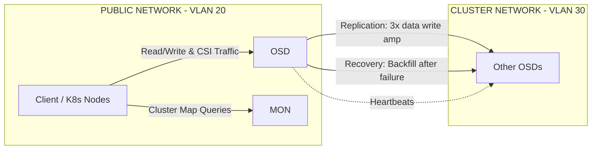
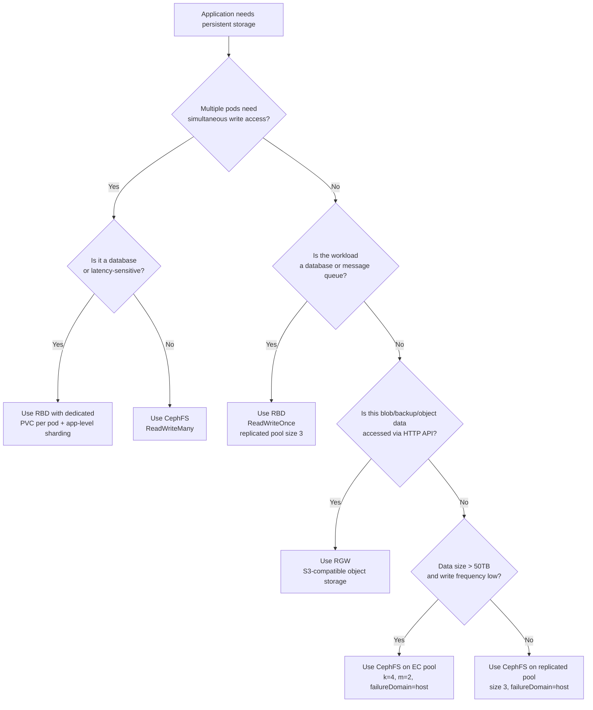

> **Complexity**: `[COMPLEX]` | Time: 60 minutes
>
> **Prerequisites**: [Module 4.1: Storage Architecture](../module-4.1-storage-architecture/), [Rook/Ceph Toolkit](/platform/toolkits/infrastructure-networking/storage/module-16.1-rook-ceph/)

---

## What You'll Be Able to Do

After completing this module, you will be able to:

1. **Design** a production-grade Ceph cluster architecture incorporating dedicated public and cluster networks, correct MON quorum sizing, and host-level failure domain configurations that survive node-level outages without data loss.
2. **Implement** Rook-Ceph operators and CephCluster Custom Resource Definitions (CRDs), with explicit device selection, resource limits, and node affinity that prevent accidental OS-drive destruction during deployment.
3. **Compare** and select appropriate Ceph CSI drivers — RBD, CephFS, and RGW — based on application access modes, performance requirements, and data-sharing patterns.
4. **Diagnose** Ceph cluster health issues including Placement Group (PG) degradation, slow OSD recovery, and near-full conditions, using the Rook toolbox and Prometheus metrics exported by the MGR module.
5. **Evaluate** storage-node topologies, upgrade paths, and the replicated-vs-erasure-coded tradeoff to prevent quorum loss, avoid version incompatibility, and optimize raw-to-usable capacity ratios for your workload profile.

---

## Why This Module Matters

<!-- incident-xref: gitlab-2017-db1 -->
In 2017, GitLab suffered a catastrophic outage when an engineer accidentally removed data from the primary database server during a replication recovery attempt. GitLab's incident update reported [six hours of database data loss](https://about.gitlab.com/blog/gitlab-dot-com-database-incident/) for GitLab.com, and the postmortem narrowed the unrecovered window to database modifications between 17:20 and 00:00 UTC on January 31, affecting roughly 5,000 projects, 5,000 comments, and 700 new user accounts while repositories and wikis were not lost. The storage lesson is not that Ceph would have made recovery instant; the lesson is that backup, replication, snapshot, and restore paths must be tested as a system, because multiple silent failures can turn a single mistaken command into a public data-loss incident.

Software-defined storage (SDS) is the backbone of resilient on-premises infrastructure, and Ceph is one of the most widely used distributed storage systems for bare-metal Kubernetes environments. It transforms a scattered collection of local disks across multiple servers into [a unified, highly replicated, self-healing storage pool](https://raw.githubusercontent.com/ceph/ceph/main/doc/architecture.rst) that Kubernetes can dynamically consume via the Container Storage Interface (CSI). When a physical disk fails and the CRUSH rule still has valid targets, Ceph can redistribute data automatically. When an entire node goes offline, Ceph can continue serving requests from replicas on surviving nodes if enough copies remain to satisfy the pool's `min_size`. When you add new servers to the rack, Ceph rebalances the cluster transparently, spreading I/O load across all available hardware.

But Ceph is not a simple black box — it operates its own daemons, uses a distributed consensus protocol for cluster state, demands strict networking topologies, and exhibits unique failure modes that can cascade if misunderstood. Running Ceph poorly is often worse than not running it at all: a misconfigured cluster can amplify failures, saturate your network fabric, and bring down your entire Kubernetes environment. [Rook is the graduated CNCF operator that manages Ceph](https://github.com/rook/rook) on Kubernetes, turning a complex multi-day manual deployment into declarative YAML. Understanding what Rook does under the hood — and how Ceph manages data placement, replication, and recovery — is essential for engineering resilient, production-grade on-premises storage architectures that your applications can actually depend on.

Hypothetical scenario: a three-node Ceph cluster with replication factor 3 and `failureDomain: host`. Node 2 loses power at 3 AM. The 4 OSDs on that node go dark simultaneously, but because every data object still has copies on Nodes 1 and 3, the replicated pool can remain available if its `min_size` is still satisfied. Ceph cannot rebuild the missing third host-separated replica onto the two surviving hosts, because the CRUSH rule requires three distinct host failure domains; affected placement groups stay degraded or undersized until Node 2 returns or you add another storage host. This is the real promise and the real constraint of distributed storage: no data loss during the first host failure, but reduced redundancy until the topology has enough failure domains again.

---

## Ceph Architecture: The RADOS Foundation

Ceph is built on RADOS — the Reliable Autonomic Distributed Object Store. RADOS provides the foundational object-storage layer that every Ceph interface (block, file, object) consumes. Understanding its daemons and algorithms is the prerequisite to operating Ceph safely in production.

### The Monitor Cluster (MON)

Ceph monitors maintain the cluster map — a master record of which OSDs exist, which are up or down, and how data placement is configured. Every client and OSD queries the monitors to discover the current cluster topology before performing any I/O operation. Without a functioning monitor quorum, the cluster becomes completely inaccessible even if every OSD is healthy and data is intact.

Monitors use the Paxos consensus algorithm to agree on cluster state. This requires an odd number of monitors — typically three for production clusters, or five for very large deployments with hundreds of OSDs. An odd count ensures the cluster can always form a majority quorum: a three-monitor cluster survives one failure, a five-monitor cluster survives two. Using an even number (say, two monitors) is dangerous because neither can achieve quorum independently if the other fails — both will block, and the cluster stalls. Never deploy an even number of monitors.

Each monitor is lightweight relative to OSDs — a few gigabytes of RAM and modest CPU — but they must be placed on independent failure domains. The CephCluster CRD's `allowMultiplePerNode: false` setting is critical: if two monitors land on the same physical host and that host fails, the cluster loses quorum even if the third monitor survives. Similarly, monitors should not share hardware with OSDs whose recovery storms can saturate CPU and memory, starving the monitor process and causing it to be marked down by its peers.

The monitors also enforce a safety timer: when an OSD stops responding, the monitors wait for `mon_osd_down_out_interval` (default 600 seconds) before marking it `out` and triggering data redistribution. This delay prevents the cluster from initiating a costly full rebalance for a transient network blip or a routine node reboot — the OSD simply rejoins and catches up on any writes it missed.

### Object Storage Daemons (OSD)

Object Storage Daemons are the workhorses of Ceph. There is exactly one OSD process per physical storage device — one per NVMe drive, one per SSD, one per HDD. Each OSD stores data as objects in a flat namespace and participates in replication, recovery, and backfill operations coordinated by the monitors and the CRUSH algorithm.

Modern Ceph uses BlueStore as its OSD backend, which writes directly to raw block devices without an intervening filesystem layer. This eliminates the double-write penalty that plagued the older FileStore backend — FileStore first wrote data to a POSIX filesystem (usually XFS), which then wrote it to disk, effectively halving write throughput for small I/O. BlueStore manages its own metadata in an embedded RocksDB key-value store, with the write-ahead log optionally placed on a faster device (a small NVMe partition paired with a larger HDD data device). The result is near-native block-device performance with full checksumming, compression, and transparent data integrity verification on every read.

Each OSD consumes CPU and RAM proportional to its capacity — approximately 1 GB of RAM per terabyte of raw storage during normal operation, and substantially more during recovery when the OSD must scan its entire object store to identify which objects need replicating. Resource limits in the CephCluster CRD prevent an OSD from exhausting node memory during backfill, which would trigger the kernel OOM killer and cascade into additional OSD failures.

### Manager Daemon (MGR)

The Ceph Manager provides cluster metrics, dashboards, and a pluggable module system. At least one MGR must be running (typically two, in active/standby configuration) for the cluster to be considered healthy. The MGR collects performance counters from every OSD and monitor, aggregates them, and exposes them through modules — most importantly the Prometheus module, which emits metrics in a format Prometheus can scrape. Without a running MGR, the `ceph status` command will report `HEALTH_WARN` and you lose visibility into per-OSD latency, pool IOPS, recovery progress, and capacity forecasting.

The MGR dashboard (enabled via `dashboard: enabled: true` in the CephCluster CRD) provides a graphical overview of cluster health, OSD status, pool utilization, and PG state. In production clusters, the dashboard should be exposed through an ingress with TLS termination rather than directly via a NodePort, and access should be restricted to operations personnel.

### The CRUSH Algorithm

CRUSH — Controlled Replication Under Scalable Hashing — is Ceph's data placement algorithm and the reason Ceph can scale to thousands of OSDs without a central metadata lookup. Unlike traditional storage systems that maintain a mapping table tracking the location of every block, CRUSH uses a deterministic pseudo-random function: given an object name, a placement group, and the current cluster map, any client can independently calculate exactly which OSDs should store the object's replicas. There is no central lookup, no metadata server bottleneck, and no single point of contention when hundreds of pods simultaneously request block allocations.

The algorithm operates through CRUSH maps, which define a hierarchy of failure domains — typically `root → rack → host → osd`. Placement rules within the CRUSH map specify how replicas are distributed across this hierarchy. For example, a rule with `failureDomain: host` and `replicated.size: 3` ensures that CRUSH selects three OSDs on three different hosts for every object placement, even if those hosts are in the same rack. A stricter rule with `failureDomain: rack` would ensure replicas land in three different racks, protecting against top-of-rack switch failure but requiring at least three racks of hardware.

The CRUSH map is not static — when OSDs are added or removed, the map is updated and the algorithm recalculates placement. Because the function is deterministic, only the objects whose placement changes need to be moved; the rest remain untouched. This makes Ceph rebalancing efficient even at petabyte scale, though the recovery I/O can still saturate networks if not throttled.

### Ceph Networking

A proper Ceph deployment relies heavily on network segregation. Because data replication multiplies the amount of traffic flowing across the network, [failing to separate client traffic from replication traffic](https://raw.githubusercontent.com/rook/rook/release-1.20/Documentation/CRDs/Cluster/network-providers.md) can cause storage operations to saturate your interfaces and impact your application pods.

#### Legacy ASCII Network Design

```text
┌─────────────────────────────────────────────────────────────┐
│           CEPH NETWORK DESIGN                                │
│                                                               │
│  PUBLIC NETWORK (VLAN 20 or 30):                            │
│  ├── Client → OSD communication (read/write data)           │
│  ├── MON communication (cluster map queries)                │
│  └── K8s nodes → Ceph (CSI driver traffic)                  │
│                                                               │
│  CLUSTER NETWORK (VLAN 30, separate from public):           │
│  ├── OSD → OSD replication (write amplification: 3x data)   │
│  ├── OSD → OSD recovery (backfill after failure)            │
│  └── Heartbeat between OSDs                                  │
│                                                               │
│  WHY SEPARATE:                                               │
│  Replication traffic = 2x the client write traffic           │
│  Recovery traffic = can saturate the network for hours       │
│  Separating prevents storage operations from impacting pods │
│                                                               │
│  RECOMMENDED:                                                │
│  Public: 25GbE (shared with K8s node network)               │
│  Cluster: 25GbE (dedicated, same bond, different VLAN)      │
│  MTU: 9000 (jumbo frames) on both networks                  │
│                                                               │
└─────────────────────────────────────────────────────────────┘
```

#### Modern Mermaid Network Design



---

## The Three Storage Interfaces

Ceph exposes a single RADOS cluster through three distinct protocols, each serving different application access patterns. All three operate on the same underlying OSDs and benefit from the same replication and self-healing — you do not need separate clusters for block, file, and object storage.

### RBD: Block Storage (ReadWriteOnce)

RADOS Block Device (RBD) presents Ceph storage as a virtual block device, striped across multiple OSDs for parallelism. Kubernetes consumes RBD through the `rook-ceph.rbd.csi.ceph.com` CSI provisioner, creating PersistentVolumes with `ReadWriteOnce` access mode. Each RBD image is exclusively attached to a single node at a time — the CSI driver handles the attach/detach lifecycle when pods are rescheduled.

RBD is the right choice for databases (PostgreSQL, MySQL, MongoDB, etcd), message queues with persistent storage, and any stateful workload that expects raw block I/O with consistent latency. Because the Linux kernel maps the RBD image as a block device (`/dev/rbdX`), the filesystem (typically ext4 or XFS) runs directly on top without an intermediate network filesystem layer. This yields near-local-NVMe performance on a properly configured 25GbE cluster network.

RBD also supports snapshotting, cloning, and online resizing. A snapshot creates a point-in-time, space-efficient copy of the RBD image using copy-on-write, consuming additional capacity only when blocks are overwritten. The CSI driver surfaces snapshots through the Kubernetes VolumeSnapshot API, enabling backup workflows without application downtime.

### CephFS: Shared Filesystem (ReadWriteMany)

CephFS provides a POSIX-compliant distributed filesystem backed by RADOS, supporting `ReadWriteMany` access — multiple pods on different nodes can mount the same filesystem simultaneously and read or write shared files. This is impossible with RBD, whose block-device semantics require exclusive attachment.

CephFS introduces an additional daemon: the Metadata Server (MDS). The MDS manages the filesystem namespace — directory structure, file names, permissions, and timestamps — while file data is stored directly in RADOS objects. This separation means that metadata operations (listing directories, stating files) are handled by the MDS cache, while data reads and writes hit the OSDs directly, with no MDS in the data path. The MDS cluster operates in active/standby pairs: one MDS serves client requests while a standby holds a warm cache, ready to take over within seconds if the active MDS fails.

Use CephFS for shared ML training datasets (multiple training pods reading the same data), web-server content directories (multiple NGINX pods serving the same static files), CI/CD artifact caches, and log aggregation directories. Do not use CephFS for databases — the POSIX filesystem layer adds metadata latency, and the shared-access model does not provide the exclusive-write consistency guarantees that database engines expect from block devices.

### RGW: S3-Compatible Object Storage

The RADOS Gateway (RGW) exposes Ceph as an S3-compatible and Swift-compatible object storage endpoint — HTTP-based, suitable for applications that store blobs, backups, container images, and data-lake objects. Unlike RBD and CephFS, which are consumed through CSI PVs inside Kubernetes, RGW is typically accessed via an external endpoint (NodePort, LoadBalancer, or Ingress) by applications both inside and outside the cluster.

RGW stores each object as one or more RADOS objects, with metadata indexed in separate pools for fast listing. It supports bucket policies, versioning, lifecycle rules, multi-part uploads, and server-side encryption. For on-premises environments that need an S3-compatible object store without egress charges or cloud-vendor lock-in, RGW provides a drop-in replacement that applications using the AWS SDK can target by changing only the endpoint URL.

### Pools and Placement Groups

Every storage interface operates on pools — logical groupings of RADOS objects that share replication settings, CRUSH rules, and PG counts. A CephBlockPool CRD, a CephFilesystem's data pool, and an RGW bucket's index pool are all pools with independently tunable parameters.

Within each pool, objects are grouped into Placement Groups (PGs) — shards that distribute data across OSDs. The PG count is one of the most important tuning decisions in Ceph. Too few PGs and data distribution becomes uneven, with some OSDs filling up while others remain half-empty, creating hotspots. Too many PGs and the OSDs waste memory and CPU tracking an excessive number of shards, slowing recovery and increasing per-OSD overhead.

The old rule of thumb — total PGs = (OSDs × 100) / replication factor, rounded to the nearest power of two — is useful only as a rough single-pool baseline. For a 12-OSD cluster with one dominant 3× replicated pool, that math lands near 400 total PGs, often rounded to 512; it does not mean every pool in a multi-pool cluster should get 512 PGs. Modern Ceph expects you to use the [PG autoscaler, pool target sizes, and target size ratios](https://docs.ceph.com/en/reef/rados/operations/placement-groups/) so the largest pools receive proportionally more PGs while small metadata or test pools do not waste per-OSD memory.

---

## Data Protection: Replication and Erasure Coding

Ceph offers two fundamentally different strategies for protecting data against hardware failure. The choice between them is one of the most consequential design decisions you will make for an on-premises Ceph deployment.

### Replicated Pools

In a replicated pool, every object is stored in full on `size` number of OSDs, with `min_size` copies required for the pool to accept writes. The most common configuration — `size: 3, min_size: 2` — means three full copies exist during normal operation, and the pool remains writable as long as at least two copies are available. If a single OSD or host fails, the pool is degraded (only two copies) but still writable; if a second failure occurs before recovery completes and only one copy remains, the pool becomes read-only to prevent data divergence.

Replication is simple, performant, and predictable. Every write costs exactly `size` times the client write bandwidth on the cluster network, and every read is served from the primary OSD with no reconstruction overhead. The downside is raw-capacity efficiency: with 3× replication, 100 TB of raw disk yields only ~33 TB of usable space. For high-performance workloads — databases, message queues, VM images — the simplicity and low read latency of replication justify the capacity overhead.

### Erasure-Coded Pools

Erasure coding (EC) trades CPU and latency for dramatically improved storage efficiency. Instead of storing full copies, an EC pool splits each object into `k` data chunks, computes `m` coding (parity) chunks, and distributes all `k+m` chunks across different OSDs. The object can be reconstructed from any `k` of the `k+m` chunks — meaning the pool tolerates the loss of up to `m` OSDs simultaneously.

A common EC profile for cold data is `k=4, m=2` (often written as 4+2). This yields 4/(4+2) = 67% raw-to-usable efficiency — double the efficiency of 3× replication — while tolerating the loss of any two chunks. A more aggressive `k=8, m=3` (8+3) profile yields 73% efficiency and tolerates three chunk losses, but requires at least 11 OSDs across 11 failure domains.

The cost is write performance: every write must read the existing data chunks, compute parity, and write all chunks — a read-modify-write cycle that adds latency. EC pools also recover more slowly from failures because rebuilding a lost chunk requires reading data from `k` surviving chunks, computing the missing chunk, and writing it. For these reasons, EC is best suited for cold or warm data with large objects and infrequent writes: object storage (RGW), backup targets, data-lake tiers, and CephFS data pools where the working set is read-heavy.

The Rook CephBlockPool CRD supports EC pools through the `erasureCoded` field with `dataChunks` and `codingChunks`, and Ceph Tentacle (v20) adds EC optimizations enabled via `allow_ec_optimizations: "true"` in the pool parameters.

### Failure Domains and CRUSH Rules

The `failureDomain` setting in pool CRDs — `osd`, `host`, `rack`, or a custom CRUSH bucket type — tells CRUSH how to distribute chunks or replicas. For replicated pools in production, `failureDomain: host` is the minimum safe setting: it ensures no two replicas share a physical server, protecting against power-supply failure, kernel panic, or a failed NIC that takes down all OSDs on that node simultaneously.

`failureDomain: rack` provides an additional layer of protection against top-of-rack switch failure or rack-level power loss, but requires at least three racks of hardware. For EC pools, `failureDomain: host` means the `k+m` chunks are distributed across `k+m` distinct hosts — a 4+2 EC pool with `failureDomain: host` thus requires at least 6 storage nodes.

---

## The Rook Operator Model

Rook is a Kubernetes operator that embeds deep Ceph domain knowledge into a reconciliation loop, automating the lifecycle of Ceph daemons that would otherwise require manual intervention.

### CRDs and the Reconcile Loop

Rook watches Custom Resources — `CephCluster`, `CephBlockPool`, `CephFilesystem`, `CephObjectStore`, and others — and continuously reconciles the desired state described in those CRDs with the actual state of the Ceph daemons running in the cluster. When you create a CephCluster CRD, the Rook operator provisions MON pods (ensuring an odd count, distributing them across failure domains), starts MGR pods, and begins preparing OSDs on the specified devices. When you modify a CephBlockPool CRD's `replicated.size`, Rook updates the Ceph pool configuration through the Ceph mgr module API.

This reconciliation model handles failure recovery automatically: if a MON pod is evicted or its node fails, Rook detects the deviation from the desired `mon.count` and schedules a replacement on a surviving node, updating the MON quorum to include the new member securely. If an OSD process crashes repeatedly, Rook marks it as flapping and stops restarting it after five failures in ten minutes — a safety mechanism that prevents a defective drive from triggering an infinite restart loop that would amplify cluster instability.

### OSD Provisioning Strategies

Rook supports two distinct approaches to provisioning OSDs, and choosing between them has significant operational implications.

**OSD-on-raw-device** — the traditional approach — requires Rook to have direct access to unformatted block devices on the host (`/dev/nvme0n1`, `/dev/sdb`, etc.). The CephCluster CRD's `storage.nodes[].devices[]` field lists them explicitly. This mode delivers the best performance because the OSD writes directly to the block device via BlueStore with no intermediate abstraction. However, it tightly couples Ceph to specific physical hardware: replacing a failed drive requires physically swapping it and manually updating the device list, and the device names must be stable across reboots (use `/dev/disk/by-id/` symlinks, not `/dev/sdX` names, which the kernel may reassign).

**OSD-on-PVC** — where each OSD is backed by a Kubernetes PersistentVolumeClaim — decouples Ceph from physical device topology. Rook provisions PVCs from any StorageClass (typically `local-path` for test clusters or a dedicated StorageClass for production), and Ceph deploys OSDs inside those PVCs. This approach works in any Kubernetes cluster regardless of the underlying storage, enables OSD resizing by expanding the PVC, and simplifies hardware replacement — a new node can claim the PVC and the OSD resumes. The tradeoff is a small performance overhead from the additional storage abstraction layer, and the risk of creating a circular dependency if Ceph itself provides the StorageClass backing its own OSDs.

The CephCluster CRD supports both modes simultaneously — you can use raw devices for performance-critical NVMe OSDs on storage nodes while using PVC-backed OSDs for capacity-tier HDD OSDs provisioned from a separate storage system.

### Version Compatibility and Upgrades

Rook and Ceph follow independent release cadences, and version compatibility must be verified before upgrades. Rook v1.20 supports Ceph Squid (v19) and Ceph Tentacle (v20). The CephCluster CRD's `cephVersion.image` field pins a specific Ceph container image (`quay.io/ceph/ceph:v20.2.1`), and Rook orchestrates the rolling update of all Ceph daemons when you change it.

Rook upgrades are strictly sequential: the v1.20 upgrade documentation supports upgrading from v1.19.x to v1.20.x only. Skipping major Rook versions during an upgrade is not supported and can leave the cluster in an inconsistent state. Furthermore, Rook v1.20 introduces a significant architectural change: the CSI driver management has been moved from the Rook operator into a separate `ceph-csi-operator`, and the minimum supported Kubernetes version is now v1.31. Always read the upgrade guide for breaking changes before initiating a version bump — the v1.20 upgrade path requires explicit migration of CSI settings that were previously configured through the `rook-ceph-operator-config` ConfigMap.

Ceph itself follows a stricter lifecycle: only active releases receive bug fixes and security backports. As of mid-2026, Tentacle (v20, EOL 2027-11-18) and Squid (v19, EOL 2026-09-19) are the active releases. Reef (v18) reached EOL on 2026-03-31 and no longer receives backports — clusters still running Reef should be upgraded to Squid or Tentacle. Running an EOL Ceph release in production means you are exposed to known vulnerabilities and unfixed data-corruption bugs that upstream has already patched in supported releases.

---

## Prerequisites and Integration

Before deploying Rook and Ceph, you must ensure your environment meets strict prerequisites.

### Hardware and OS Requirements
- **CPU:** Rook currently supports only amd64/x86_64 and arm64 CPU architectures.
- **Kernel Versions:** Rook requires kernel/RBD support. It recommends [kernel minimums of 5.4+ for expanded RBD image features, and 4.17+ for CephFS RWX PVC size enforcement](https://raw.githubusercontent.com/rook/rook/release-1.20/Documentation/Getting-Started/Prerequisites/prerequisites.md). Running older kernels can lead to reduced features or failed quota enforcement.
- **Local Storage:** Rook requires at least one local storage source such as raw devices/partitions, LVM logical volumes without filesystem, or block PVCs for Ceph OSD use. You cannot use a formatted filesystem partition for an OSD. Use `lsblk -f` to verify that the `FSTYPE` field is empty for candidate devices.
- **LVM Package:** The `lvm2` package is required on all storage nodes if you use encryption, metadata devices, or `osdsPerDevice` greater than 1. Without it, OSD pods will fail to start after a node reboot.

### Kubernetes Compatibility
Rook v1.20 supports Kubernetes versions v1.31 through v1.36. The minimum supported Kubernetes version is v1.31 — clusters running older control planes must be upgraded before installing Rook v1.20. Always verify your control plane version against the [Rook prerequisites documentation](https://raw.githubusercontent.com/rook/rook/release-1.20/Documentation/Getting-Started/Prerequisites/prerequisites.md) before initiating a Rook upgrade or fresh installation.

### CSI Drivers
Rook integrates CSI drivers that Kubernetes uses to provision, attach, and mount storage volumes. In Rook v1.20, [the CSI driver lifecycle is managed by a separate ceph-csi-operator](https://raw.githubusercontent.com/rook/rook/release-1.20/Documentation/Storage-Configuration/Ceph-CSI/ceph-csi-drivers.md) rather than directly by the Rook operator. The RBD and CephFS CSI drivers remain the primary provisioners for block and filesystem storage respectively, and they require their own operator deployment as part of the Rook installation. The NFS CSI driver is available experimentally and is disabled by default. When planning upgrades from Rook v1.19 to v1.20, you must migrate CSI settings from the `rook-ceph-operator-config` ConfigMap to the ceph-csi-operator resources per the upgrade guide.

---

## Deploying Ceph with Rook

### Step 1: Install Rook Operator

To begin, install the Rook operator and the Ceph-CSI driver chart. In the [Rook v1.20 Helm flow](https://rook.io/docs/rook/v1.20/Helm-Charts/operator-chart/), the operator chart installs the Rook and ceph-csi-operator control planes, the Ceph-CSI driver chart creates the RBD and CephFS `Driver` resources that allow CSI to provision and mount volumes, and the `rook-ceph-cluster` chart is the Helm alternative for creating CephCluster and storage resources. This module applies the CephCluster CR by hand in Step 2 so you can inspect the storage settings directly, but the CSI chart is still required before any PVC lab can work.

```bash
# Add Rook Helm repo
helm repo add rook-release https://charts.rook.io/release
helm repo add ceph-csi-operator https://ceph.github.io/ceph-csi-operator
helm repo update

# Install Rook operator
helm install rook-ceph rook-release/rook-ceph \
  --namespace rook-ceph --create-namespace

# Wait for the Rook and ceph-csi operator control planes
kubectl -n rook-ceph wait --for=condition=Available \
  deployment/rook-ceph-operator --timeout=300s
kubectl -n rook-ceph wait --for=condition=Available \
  deployment/ceph-csi-controller-manager --timeout=300s

# Install Ceph-CSI drivers so RBD/CephFS PVCs can be provisioned and mounted
helm install ceph-csi-drivers ceph-csi-operator/ceph-csi-drivers \
  --namespace rook-ceph \
  -f https://raw.githubusercontent.com/rook/rook/release-1.20/deploy/charts/ceph-csi-drivers/values.yaml

# Confirm the RBD and CephFS driver CRs exist before creating storage classes
kubectl -n rook-ceph wait \
  --for=jsonpath='{.metadata.name}'=rook-ceph.rbd.csi.ceph.com \
  driver.csi.ceph.io/rook-ceph.rbd.csi.ceph.com --timeout=300s
kubectl -n rook-ceph wait \
  --for=jsonpath='{.metadata.name}'=rook-ceph.cephfs.csi.ceph.com \
  driver.csi.ceph.io/rook-ceph.cephfs.csi.ceph.com --timeout=300s
```

> **Pause and predict**: The CephCluster definition below explicitly lists which devices on which nodes to use as OSDs, rather than setting `useAllDevices: true`. Why is explicit device listing safer? What could go wrong with `useAllDevices: true` on a server that has both OS drives and data drives?

### Step 2: Create CephCluster

The CephCluster CRD below configures a production-grade Ceph deployment. Notice three critical design decisions: (1) `allowMultiplePerNode: false` for MONs ensures that a single node failure cannot lose quorum, (2) [`provider: host` for networking bypasses container networking overhead for storage I/O](https://raw.githubusercontent.com/rook/rook/release-1.20/Documentation/CRDs/Cluster/network-providers.md), and (3) resource limits on OSDs prevent them from consuming all CPU and memory during recovery operations.

```yaml
apiVersion: ceph.rook.io/v1
kind: CephCluster
metadata:
  name: rook-ceph
  namespace: rook-ceph
spec:
  cephVersion:
    image: quay.io/ceph/ceph:v20.2.1-20260402
  dataDirHostPath: /var/lib/rook

  mon:
    count: 3
    allowMultiplePerNode: false  # 1 MON per node (HA)

  mgr:
    count: 2
    allowMultiplePerNode: false

  dashboard:
    enabled: true
    ssl: true

  network:
    provider: host  # Use host networking for best performance
    # Or specify Multus for dedicated storage network:
    # provider: multus
    # selectors:
    #   public: rook-ceph/public-net
    #   cluster: rook-ceph/cluster-net

  storage:
    useAllNodes: false
    useAllDevices: false
    nodes:
      - name: "storage-01"
        devices:
          - name: "nvme0n1"
          - name: "nvme1n1"
          - name: "nvme2n1"
          - name: "nvme3n1"
      - name: "storage-02"
        devices:
          - name: "nvme0n1"
          - name: "nvme1n1"
          - name: "nvme2n1"
          - name: "nvme3n1"
      - name: "storage-03"
        devices:
          - name: "nvme0n1"
          - name: "nvme1n1"
          - name: "nvme2n1"
          - name: "nvme3n1"

  resources:
    osd:
      limits:
        cpu: "2"
        memory: "4Gi"
      requests:
        cpu: "1"
        memory: "2Gi"

  placement:
    mon:
      nodeAffinity:
        requiredDuringSchedulingIgnoredDuringExecution:
          nodeSelectorTerms:
            - matchExpressions:
                - key: role
                  operator: In
                  values: ["storage"]
```

> **Stop and think**: The CephBlockPool below sets `failureDomain: host` with `replicated.size: 3`. This means [each block is copied to 3 different servers](https://raw.githubusercontent.com/rook/rook/release-1.20/Documentation/CRDs/Block-Storage/ceph-block-pool-crd.md). If you accidentally set `failureDomain: osd` instead of `host`, two replicas could land on different drives of the same server. What happens when that server loses power?

### Step 3: Create StorageClasses

To expose the storage to Kubernetes, you must define StorageClasses for Block and Filesystem storage. These have been separated into distinct YAML blocks to ensure clean validation when applying to your cluster.

```yaml
# Block storage (RBD) — most common for databases, stateful apps
apiVersion: ceph.rook.io/v1
kind: CephBlockPool
metadata:
  name: replicated-pool
  namespace: rook-ceph
spec:
  failureDomain: host  # Replicate across hosts, not just OSDs
  replicated:
    size: 3             # 3 copies of every block
    requireSafeReplicaSize: true
```

```yaml
apiVersion: storage.k8s.io/v1
kind: StorageClass
metadata:
  name: ceph-block
provisioner: rook-ceph.rbd.csi.ceph.com
parameters:
  clusterID: rook-ceph
  pool: replicated-pool
  imageFormat: "2"
  imageFeatures: layering,fast-diff,object-map,deep-flatten,exclusive-lock
  csi.storage.k8s.io/provisioner-secret-name: rook-csi-rbd-provisioner
  csi.storage.k8s.io/provisioner-secret-namespace: rook-ceph
  csi.storage.k8s.io/node-stage-secret-name: rook-csi-rbd-node
  csi.storage.k8s.io/node-stage-secret-namespace: rook-ceph
  csi.storage.k8s.io/fstype: ext4
reclaimPolicy: Delete
allowVolumeExpansion: true
```

```yaml
# Filesystem storage (CephFS) — for shared access (ReadWriteMany)
apiVersion: ceph.rook.io/v1
kind: CephFilesystem
metadata:
  name: shared-fs
  namespace: rook-ceph
spec:
  metadataPool:
    replicated:
      size: 3
  dataPools:
    - name: data0
      replicated:
        size: 3
  metadataServer:
    activeCount: 1
    activeStandby: true
```

```yaml
apiVersion: storage.k8s.io/v1
kind: StorageClass
metadata:
  name: ceph-filesystem
provisioner: rook-ceph.cephfs.csi.ceph.com
parameters:
  clusterID: rook-ceph
  fsName: shared-fs
  pool: shared-fs-data0
  csi.storage.k8s.io/provisioner-secret-name: rook-csi-cephfs-provisioner
  csi.storage.k8s.io/provisioner-secret-namespace: rook-ceph
  csi.storage.k8s.io/node-stage-secret-name: rook-csi-cephfs-node
  csi.storage.k8s.io/node-stage-secret-namespace: rook-ceph
reclaimPolicy: Delete
allowVolumeExpansion: true
```

### Step 4: Verify Ceph Health

```bash
# Deploy the Rook toolbox
kubectl apply -f https://raw.githubusercontent.com/rook/rook/release-1.20/deploy/examples/toolbox.yaml
kubectl -n rook-ceph wait --for=condition=Ready pod -l app=rook-ceph-tools --timeout=300s

# Check Ceph cluster status
kubectl -n rook-ceph exec deploy/rook-ceph-tools -- ceph status
#   cluster:
#     id:     a1b2c3d4-...
#     health: HEALTH_OK
#
#   services:
#     mon: 3 daemons, quorum a,b,c
#     mgr: a(active), standbys: b
#     osd: 12 osds: 12 up, 12 in
#
#   data:
#     pools:   2 pools, 128 pgs
#     objects: 1.23k objects, 4.5 GiB
#     usage:   15 GiB used, 45 TiB / 45 TiB avail

# Check OSD status
kubectl -n rook-ceph exec deploy/rook-ceph-tools -- ceph osd tree
# ID  CLASS  WEIGHT   TYPE NAME           STATUS  REWEIGHT
# -1         45.00000 root default
# -3         15.00000     host storage-01
#  0    ssd   3.75000         osd.0           up   1.00000
#  1    ssd   3.75000         osd.1           up   1.00000
#  2    ssd   3.75000         osd.2           up   1.00000
#  3    ssd   3.75000         osd.3           up   1.00000
# ...

# Check pool IOPS
kubectl -n rook-ceph exec deploy/rook-ceph-tools -- ceph osd pool stats
```

---

## Day-2 Operations

Deploying Ceph is only the beginning. Operating it safely over months and years requires understanding health states, capacity management, and recovery behavior.

### Health States

Ceph reports cluster health through a three-tier system: `HEALTH_OK` (all daemons operational, all PGs clean), `HEALTH_WARN` (something requires attention but data is safe and accessible), and `HEALTH_ERR` (data availability is at risk or the cluster has stopped serving I/O). A `HEALTH_WARN` with one OSD down is a routine condition — the cluster remains fully functional at reduced redundancy. A `HEALTH_ERR` requires immediate investigation; it typically means multiple OSD failures have pushed PGs below `min_size`, or the monitors have lost quorum.

The `ceph health detail` command provides a human-readable explanation of every active warning or error, including which PGs are degraded, which OSDs are down, and whether any pools have reached their near-full or full thresholds. Configure alerting on `HEALTH_WARN` and paging on `HEALTH_ERR` through the MGR Prometheus module and your existing Alertmanager infrastructure.

### Adding and Removing OSDs

When you add a new storage node, update the CephCluster CRD's `storage.nodes[]` list to include the new host and its devices. Rook detects the change, prepares the new OSDs, and adds them to the CRUSH map. Ceph then begins rebalancing data onto the new OSDs — this process is automatic but can take hours or days depending on data volume and network bandwidth. Use `ceph -w` to monitor backfill progress.

Removing an OSD safely requires explicit steps. You cannot simply delete the OSD pod or remove the device from the CRD, because Ceph would treat it as a failure and begin emergency recovery. Instead, mark the OSD as `out` (`ceph osd out <id>`), wait for data to rebalance away from it (the OSD's PG count drops to zero), then remove it from the CRUSH map and purge it (`ceph osd purge <id> --yes-i-really-mean-it`). Rook will then decommission the OSD pod. Skipping the `out` step — removing a live OSD that still holds data — causes immediate PG degradation and potentially data loss if other replicas are also unhealthy.

### Full Cluster Behavior

Ceph enforces hard capacity thresholds to protect data integrity. When any OSD reaches the `nearfull` ratio (default 0.85, or 85% full), Ceph emits `HEALTH_WARN` and the cluster continues operating. When any OSD reaches the `full` ratio (default 0.95, or 95% full), Ceph stops accepting writes to pools that have data on that OSD — the cluster becomes effectively read-only. This is a safety mechanism: if an OSD fills completely to 100%, it cannot participate in recovery or backfill, and data loss becomes possible if another OSD fails before space is freed.

The solution to a near-full cluster is to add capacity (new OSDs or new nodes) before reaching the full threshold. Temporarily increasing `mon_osd_full_ratio` above 0.95 can buy hours of writability, but this is a stopgap — every write moves the cluster closer to an unrecoverable state. Monitor OSD utilization via the Prometheus metrics `ceph_osd_utilization` and set alerts at 75% and 85% to give yourself runway for capacity planning.

### Recovery Throttling

When an OSD fails, Ceph begins rebuilding lost replicas onto surviving OSDs if the relevant CRUSH rule still has enough valid placement targets. This recovery traffic competes with client I/O for disk bandwidth and network throughput, and without throttling it can consume enough resources to impact production workloads. Ceph provides several tunables to balance recovery speed against application performance:

- `osd_max_backfills` — maximum concurrent backfill operations per OSD (default 1). Increasing this speeds recovery at the cost of client latency.
- `osd_recovery_max_active` — maximum concurrent recovery operations per OSD (default 3). Lower values protect client I/O; higher values speed recovery.
- `osd_recovery_sleep` — a sleep interval (in seconds) inserted between recovery operations to reduce I/O pressure.

For production clusters hosting latency-sensitive databases, set conservative values (`osd_recovery_max_active: 1, osd_recovery_sleep: 0.1`). For cold-storage or backup clusters where recovery speed matters more than latency, increase both limits. The `ceph config set osd` commands in the performance tuning section demonstrate both profiles.

### Scrubbing and Deep-Scrub

Ceph periodically scrubs every PG to detect bit-rot and inconsistencies between replicas. Light scrubs compare object metadata (size, checksum) across replicas and are relatively cheap. Deep scrubs read every byte of every replica, compute full checksums, and compare them — catching silent data corruption that the drive's own error correction did not detect. Deep scrubs are I/O-intensive and should be scheduled during off-peak hours using `osd_scrub_begin_hour` and `osd_scrub_end_hour`, typically 2 AM to 6 AM local time. If a scrub detects an inconsistency, Ceph marks the affected PG inconsistent and you must investigate with `ceph health detail`, `rados list-inconsistent-pg`, and often `ceph pg repair <pgid>`; automatic repair is not the default and requires `osd_scrub_auto_repair=true` with error counts below the configured threshold.

### Monitoring with Prometheus

Enable the MGR Prometheus module in the CephCluster CRD (`monitoring: enabled: true`) and configure a Prometheus ServiceMonitor to scrape the metrics endpoint. Key metrics to track include per-OSD utilization (`ceph_osd_utilization`), per-pool IOPS and latency (`ceph_pool_rd`, `ceph_pool_wr`), PG state counts (`ceph_pg_active`, `ceph_pg_degraded`), and cluster capacity (`ceph_cluster_total_bytes`, `ceph_cluster_total_used_bytes`). Pair these with node-level metrics from the Prometheus Node Exporter — disk SMART data, network throughput on cluster VLAN interfaces, and memory pressure — to correlate Ceph health with the underlying hardware state.

---

## Performance Tuning

### Key Tuning Parameters

The tuning parameters below control the tension between recovery speed and client I/O performance. Setting `osd_recovery_max_active` to 1 means only one recovery operation per OSD runs at a time — slower recovery, but application latency stays predictable. Setting it to 3 recovers faster but can also produce visible latency spikes during the recovery window, especially on clusters where client I/O and recovery traffic share disks or network links:

```bash
# Inside rook-ceph-tools pod:

# Increase OSD recovery speed (at cost of client I/O)
ceph config set osd osd_recovery_max_active 3
ceph config set osd osd_recovery_sleep 0

# Or throttle recovery to protect client I/O
ceph config set osd osd_recovery_max_active 1
ceph config set osd osd_recovery_sleep 0.5

# Enable RBD caching for read-heavy workloads
ceph config set client rbd_cache true
ceph config set client rbd_cache_size 134217728  # 128MB

# Set scrub schedule (background data integrity check)
ceph config set osd osd_scrub_begin_hour 2   # Start at 2 AM
ceph config set osd osd_scrub_end_hour 6     # End at 6 AM

# Monitor PGs — critical for distribution and OSD overhead
# Single dominant replicated pool baseline:
#   total PGs ~= (OSDs * 100) / replication_factor
# Multi-pool clusters: use pg_autoscale_mode plus target_size_ratio/bytes
```

---

## Cost Lens: On-Premises Economics of Ceph

Running Ceph on owned hardware fundamentally changes the cost model compared to cloud-managed storage services. Understanding the total cost of ownership (TCO) is essential because Ceph's operational complexity can easily consume any savings from avoiding cloud storage bills if the cluster is under-resourced or over-provisioned.

### Capital Expenditure Drivers

A production Ceph cluster's CapEx is dominated by raw disk capacity multiplied by the replication factor — with 3× replication, every terabyte of usable storage requires approximately three terabytes of raw disk, plus overhead for the operating system, BlueStore metadata, and a safety buffer to avoid hitting the near-full threshold. A cluster targeting 100 TB usable thus needs at least 300 TB of raw disk at a minimum, and closer to 350 TB when accounting for overhead and the 85% practical ceiling.

The cost per raw terabyte varies dramatically by media type, endurance rating, warranty tier, and vendor supply cycle. Enterprise NVMe drives are appropriate for database-backed RBD pools where latency directly impacts application performance; enterprise SATA SSDs suit CephFS workloads with moderate I/O requirements; and high-capacity HDDs work for RGW object storage and backup targets where capacity density matters more than IOPS. Treat any pricing spreadsheet as a date-stamped procurement artifact, not durable curriculum content, and verify current quotes before making a build-versus-buy decision.

Additional CapEx includes the storage server hardware itself — dense drive bays, CPUs, RAM sized for OSDs and recovery, and redundant boot devices — plus 25GbE or 100GbE network switches, transceivers, and cables for the dedicated cluster network. Rack space, power distribution, and cooling complete the physical infrastructure bill. A minimal three-node cluster with NVMe media and dedicated storage networking can become expensive quickly, so budget from a real bill of materials rather than a generic per-node estimate.

### Operational Expenditure

OpEx for an on-premises Ceph cluster includes the operations headcount — someone must monitor cluster health, replace failed drives, perform version upgrades, rehearse recovery, and handle capacity planning. Media failure rates vary by model, workload, temperature, firmware, and age, so use vendor advisories, SMART telemetry, burn-in data, and your own fleet history instead of assuming a universal annual failure percentage. For a small cluster serving a single team, Ceph may be a part-time operational duty; for a multi-petabyte cluster serving the entire organization, Ceph operations can justify a dedicated storage engineering role.

Power and cooling are recurring costs that scale with cluster size, drive count, CPU selection, fan curves, rack density, and local electricity rates. Measure representative nodes under recovery and scrub load, then apply your facility's power usage effectiveness and tariff instead of assuming a generic watts-per-node figure. Colocation or datacenter space has the same problem: density, contract terms, cooling envelope, and remote-hands support can dominate the apparent cost of the disks themselves.

Hardware refresh cycles introduce periodic CapEx spikes. Servers typically run for 4-5 years before replacement, and drives for 3-5 years depending on wear. Ceph's ability to seamlessly evacuate data from an aging node (mark all OSDs out, wait for rebalance, decommission) makes hardware refreshes straightforward — new nodes are added to the CRUSH map, data rebalances onto them, and old nodes are removed — but the capital outlay for replacement hardware must be budgeted years in advance.

### When On-Premises Ceph Wins

Ceph's TCO advantage over cloud block storage (AWS EBS, Azure Managed Disks, GCE Persistent Disk) becomes compelling in scenarios with steady, high utilization. The comparison must be date-stamped and provider-specific: cloud storage pricing, provisioned performance pricing, snapshot charges, support tiers, reserved commitments, and regional discounts all change. If your workload consistently uses most of the provisioned capacity rather than being bursty or seasonal, on-premises Ceph may win, but the breakeven point should come from your current cloud bill, hardware quotes, staffing model, and depreciation schedule.

Data gravity — the tendency of large datasets to attract applications and processing — amplifies Ceph's advantage. Moving large datasets out of a cloud provider can incur egress charges and long transfer windows, but the exact cost depends on region, provider, transfer path, committed-use discounts, and whether the data exits to the public internet or another connected service. On-premises Ceph can eliminate cloud egress for local compute and keeps data adjacent to bare-metal workloads. Regulatory requirements — GDPR data residency, financial services audit trails, healthcare data sovereignty — may mandate on-premises storage regardless of cost.

### When On-Premises Ceph Loses

For very small clusters, the operational overhead of Ceph (learning curve, maintenance, monitoring) often outweighs the savings. Longhorn or local-path PVs (covered in Modules 4.1 and 4.3) provide simpler alternatives with lower operational burden at small scale. For spiky or unpredictable workloads — a cluster that needs a large temporary dataset for a short batch-processing window but sits mostly idle the rest of the year — cloud storage's elasticity eliminates the need to provision for peak capacity that sits unused. For teams without storage engineering expertise, the risk of a misconfigured Ceph cluster causing data loss or downtime may exceed the cost of managed services.

---

## Patterns & Anti-Patterns

### Proven Patterns

**Dedicated cluster network on separate VLAN.** Isolate OSD-to-OSD replication and recovery traffic from client-facing public traffic using a second physical interface or a VLAN-tagged subinterface. Jumbo frames can reduce per-packet overhead on bulk data transfers when every hop in the path is configured consistently, but the improvement is workload- and fabric-dependent; verify with your own recovery and client-I/O benchmarks rather than assuming a fixed percentage gain.

**Explicit device selection with `/dev/disk/by-id/` paths.** Never rely on `/dev/sda`, `/dev/nvme0n1`, or kernel-assigned names that can change across reboots. Use persistent device symlinks (`/dev/disk/by-id/ata-Samsung_SSD_S4DBN0W123456` or `/dev/disk/by-id/nvme-Samsung_S4DBN0W123456`) in the CephCluster CRD's storage node device lists. A kernel device-name reassignment after a firmware update that swaps NVMe enumeration order can cause Rook to prepare the wrong drive as an OSD — if that drive happens to contain the operating system, the node is bricked.

**MON placement on non-storage nodes.** Place at least two of your three monitors on nodes that do not run OSDs — typically the Kubernetes control plane nodes, which already run `etcd` and the API server and are unlikely to experience the memory pressure that OSD recovery storms can cause on storage nodes. If all three MONs share hardware with OSDs and a recovery event consumes all available RAM on those nodes, the MONs get OOM-killed, the cluster loses quorum, and all I/O stops — a cascade that turns a routine drive failure into a full outage.

### Anti-Patterns

| Anti-Pattern | Why It's Bad | Better Approach |
|--------------|--------------|-----------------|
| `failureDomain: osd` on production replicated pools | Two replicas can land on the same host. A node failure loses 2 of 3 copies, potentially dropping below `min_size` and making the pool read-only. | Always use `failureDomain: host` or higher for pools holding data you cannot afford to lose. |
| Even number of monitors | No majority quorum can form after a single failure. Both remaining MONs block, and the cluster becomes completely inaccessible. | Always deploy an odd number: 3 for most clusters, 5 for very large deployments. |
| No resource limits on OSD pods | During recovery or deep-scrub, an OSD can consume all available node memory and get OOM-killed. The killed OSD triggers another recovery, creating a death spiral. | Set `resources.osd.limits.memory` to a value that leaves headroom for the OS and other daemons (at minimum, reserve 4-8 GB for the kernel). |
| Using EC pools for RBD-backed databases | The read-modify-write cycle on small random writes (database page flushes) adds ~2-5x latency compared to replication. PostgreSQL and MySQL on EC pools will feel sluggish even with NVMe backing. | Use replicated pools (size 3) for databases. Reserve EC for object storage (RGW) and CephFS data pools with read-heavy workloads. |
| `useAllDevices: true` in CephCluster CRD | Rook will attempt to prepare every unformatted block device on every node as an OSD, including OS drives if they appear unformatted or if a partition table is misread. This can destroy the operating system. | Set `useAllDevices: false` and explicitly list devices per node. |
| Running an EOL Ceph release in production | No security patches, no bug fixes, no backports for data-corruption issues. Ceph Reef (v18) reached EOL on 2026-03-31 and is unsafe for production use. | Stay on an active release (Squid or Tentacle as of mid-2026) and budget for one major upgrade per year. |
| Skipping MON `allowMultiplePerNode: false` | If a node running two MONs fails, the cluster loses two MONs simultaneously. In a three-MON cluster, that is quorum lost and all I/O stops. | Always set `allowMultiplePerNode: false` for MONs in production CephCluster CRDs. |
| No Prometheus alerting on near-full OSDs | The cluster silently approaches the 85% near-full threshold and eventually hits 95% full, at which point all writes are blocked. Recovery from full requires adding capacity — which takes hours or days. | Alert at 75% (`HEALTH_WARN` pre-warning), page at 85%. Budget for capacity expansion when utilization crosses 70%. |

---

## Decision Framework

Choosing between Ceph's storage interfaces, data protection strategies, and deployment topologies is not a single decision but a set of interrelated choices. Use the flowchart below to navigate the primary fork — which storage interface to use — then apply the decision matrix for pool configuration.



### Pool Configuration Decision Matrix

| Workload | Interface | Data Protection | failureDomain | PG Planning Note | Notes |
|----------|-----------|-----------------|---------------|------------------|-------|
| PostgreSQL / MySQL | RBD | Replicated, size 3 | host | Give a large target ratio only if this is a dominant data pool | Block device latency critical; EC adds unacceptable write amplification. |
| MongoDB / etcd | RBD | Replicated, size 3 | host | Keep autoscaler on, but cap churn during sensitive maintenance windows | Consensus systems are sensitive to fsync latency spikes during recovery. |
| ML training datasets | CephFS | Replicated, size 3 | host | Set `target_size_bytes` or `target_size_ratio` from expected dataset size | Multiple pods read same data; CephFS provides shared access without copying. |
| CI/CD build cache | CephFS | EC 4+2 | host | Use autoscaler and monitor PG replicas per OSD after cache growth | Write-once, read-many; EC improves capacity efficiency versus replication. |
| Log aggregation | CephFS | EC 4+2 | host | Start conservative; increase only if distribution or hot PGs demand it | High write throughput but no random read; EC overhead may be acceptable. |
| S3 backups / data lake | RGW | EC 8+3 | host | This may be the dominant pool; declare target size early | Large sequential writes; EC maximizes capacity efficiency. |
| VM boot images | RBD | Replicated, size 3 | host | Autoscaler plus a modest minimum often beats a large static PG count | Random read patterns; replication keeps read latency low. |
| Container image registry | RGW | EC 4+2 | host | Size from expected blob footprint, not from a per-pool default | Blob storage with infrequent writes; EC efficiency matters at scale. |

---

## Did You Know?

- **Ceph's CRUSH algorithm** [determines where data is stored without a central lookup table](https://raw.githubusercontent.com/ceph/ceph/main/doc/architecture.rst). Any client can independently calculate the location of any object using only the object name and the cluster map, which is why Ceph scales to thousands of OSDs without a metadata bottleneck — there is simply no central server to become one.

- **[BlueStore replaced FileStore as the default OSD backend](https://raw.githubusercontent.com/ceph/ceph/main/doc/releases/luminous.rst)** in Ceph Luminous (2017). By [writing directly to raw block devices and managing its own metadata in RocksDB](https://raw.githubusercontent.com/ceph/ceph/main/doc/rados/configuration/bluestore-config-ref.rst), BlueStore eliminates the double-write penalty of the old filesystem-based approach and enables native compression and checksumming on every object.

- **[Ceph is designed for very large clusters](https://raw.githubusercontent.com/ceph/ceph/main/doc/architecture.rst).** The important takeaway for an enterprise learner is not a specific public deployment number; it is the architecture choice: CRUSH lets clients calculate placement locally, so scaling pressure moves to OSD count, network design, failure-domain layout, and operational automation rather than a central metadata lookup service.

- **Rook is a CNCF Graduated project,** accepted on 2018-01-29, moved to incubation on 2018-09-25, and [achieving Graduated maturity on 2020-10-07](https://www.cncf.io/projects/rook/). Graduated status means Rook has demonstrated widespread adoption, a formal governance process, and a commitment to security and interoperability standards expected of the highest-tier CNCF projects.

---

## Common Mistakes

| Mistake | Problem | Solution |
|---------|---------|----------|
| Too few PGs | Uneven data distribution, hotspots | Use the PG autoscaler with pool target sizes; treat the old formula only as a rough single-pool sanity check |
| No cluster network | Replication competes with client I/O | Separate public and cluster networks on different VLANs with jumbo frames |
| MONs on OSD nodes | MON fails when OSD saturates CPU/RAM during recovery | Dedicated MON nodes (or on K8s control plane nodes) with `allowMultiplePerNode: false` |
| No resource limits on OSDs | OSD consumes all node RAM during recovery, gets OOM-killed | Set CPU/memory limits in CephCluster spec; leave ≥4 GB for kernel |
| Replication factor 2 | Single failure = data at risk during rebuild window | Always use replication factor 3 for production pools |
| Not monitoring disk health | Drive fails silently, OSD goes down without warning | smartmontools + Prometheus SMART exporter with alerts on reallocated sectors |
| Scrubbing during peak hours | Background scrub competes with workload I/O | Schedule scrubs for off-peak hours (2-6 AM) via `osd_scrub_begin_hour`/`osd_scrub_end_hour` |
| Using `useAllDevices: true` | Accidentally formats OS drives as OSDs, bricking the node | Explicitly list devices per node using `/dev/disk/by-id/` paths |

---

## Quiz

### Question 1
You have 12 NVMe drives across 3 storage nodes (4 per node). What replication factor and failure domain should you use?

<details>
<summary>Answer</summary>

**Replication factor 3, failure domain `host`.**

Each object is replicated to 3 different OSDs on 3 different hosts. If an entire host fails (all 4 OSDs), 2 copies remain on the other 2 hosts and all data is still accessible as long as the pool's `min_size` is satisfied. However, Ceph cannot rebuild a third host-separated copy while only two host failure domains remain; affected PGs stay degraded or undersized until the failed node returns or a new storage host is added. Failure domain `host` ensures no two replicas of the same object are on the same server — a host-level power failure or kernel panic cannot compromise multiple copies simultaneously.

Do not use failure domain `osd` (the default if not specified) — this allows 2 replicas to land on the same host, meaning a single server failure could lose 2 of your 3 copies and potentially push affected PGs below `min_size`, making the pool read-only until recovery completes.
</details>

### Question 2
Your Ceph cluster shows `HEALTH_WARN: 1 osds down`. What is the immediate impact and what should you do?

<details>
<summary>Answer</summary>

**Immediate impact**: Minimal. With replication factor 3, every object has 2 remaining copies on surviving OSDs. No data is lost and all volumes remain accessible. However, the placement groups that had replicas on the failed OSD are now degraded — operating at reduced redundancy — meaning a second failure before recovery completes could drop some PGs below `min_size`.

What happens automatically: Ceph marks the OSD as `down`, starts the `mon_osd_down_out_interval` timer (default 600 seconds), then marks it `out` and attempts recovery or backfill where the CRUSH rule has valid target OSDs. Recovery time depends on how much data must move, OSD media, client load, throttling settings, network capacity, and whether enough failure domains remain; estimate it from measured backfill throughput in your own cluster, not from a generic GB-per-minute number.

What you should do: (1) Check which OSD and which node with `ceph osd tree`. (2) Determine root cause — is this a disk failure (SMART errors) or a node failure (kernel panic, power loss)? (3) For disk failure, replace the drive, then `ceph osd purge <id> --yes-i-really-mean-it` and let Rook redeploy. (4) For transient node failure, fix the node; when it rejoins, the OSD will come back up and catch up on missed writes instead of triggering a full backfill. (5) Monitor progress with `ceph -w`.
</details>

### Question 3
When should you use CephFS (ReadWriteMany) instead of RBD (ReadWriteOnce)?

<details>
<summary>Answer</summary>

Use RBD (block) for databases (PostgreSQL, MySQL, MongoDB, etcd) that need consistent low-latency block I/O and exclusive write access — the kernel maps the RBD image directly as a block device with no filesystem intermediary. Use RBD for any single-pod workload that needs persistent storage and does not require concurrent access from multiple pods.

Use CephFS (filesystem) for shared data that multiple pods must read and write simultaneously — ML training datasets read by dozens of training workers, web-server content directories served by multiple NGINX replicas, CI/CD artifact caches, and log aggregation directories. CephFS provides true POSIX semantics with the Metadata Server (MDS) handling namespace operations while data reads and writes go directly to OSDs.

Do not use CephFS for databases — the POSIX filesystem layer adds metadata latency on every file operation, and the shared-access model does not provide the exclusive-write consistency guarantees that database storage engines expect from a block device. A PostgreSQL `fsync` on CephFS may not mean what PostgreSQL thinks it means.
</details>

### Question 4
Hypothetical scenario: Your 10-node Ceph cluster has 3 MONs, all co-located on storage nodes with OSDs. A recovery storm after a node failure causes memory pressure, and the kernel OOM-kills one MON. What happens next, and how should you have configured this differently?

<details>
<summary>Answer</summary>

When one MON is killed, the remaining two MONs still form a quorum (2 out of 3) and the cluster continues operating. However, the cluster is now in a fragile state — if a second MON fails before the first recovers, the single remaining MON cannot form a quorum alone, and the entire cluster becomes inaccessible even though every OSD is healthy and all data is intact.

But the real danger is cascading: the OOM-killed MON was on a storage node. When the MON pod restarts, it rejoins the quorum, but the underlying memory pressure from the recovery storm persists. The MON may be OOM-killed again, creating a flapping MON that destabilizes the quorum and causes repeated leader elections — each election briefly pauses all I/O while the new leader establishes authority.

The correct configuration is to place at least two MONs on dedicated non-storage nodes (typically Kubernetes control plane nodes) that do not experience the memory pressure of OSD recovery storms. With `allowMultiplePerNode: false` and MONs distributed across independent failure domains, no single event can compromise quorum. This is a one-line YAML change that prevents a multi-hour outage.
</details>

### Question 5
Hypothetical scenario: You have a 6-node Ceph storage cluster and need to store 80 TB of nightly database backups. The backups are written once per night (large sequential writes) and read only during monthly restore drills. Should you use a replicated pool (size 3) or an erasure-coded pool (4+2), and why?

<details>
<summary>Answer</summary>

Use an erasure-coded pool with 4+2 profile. When evaluating the replicated-vs-erasure-coded tradeoff for a given storage-node topology, the workload characteristics are decisive: writes are large, sequential, and infrequent (nightly batch), and reads are extremely rare (monthly drills). The EC profile tolerates the loss of any 2 chunks — equivalent to losing 2 OSDs or 2 hosts simultaneously — which provides adequate durability for backup data. This tradeoff always depends on your specific storage-node topology and upgrade path because adding EC pools later requires OSDs to be available across enough failure domains to satisfy the erasure coding profile.

The capacity savings are substantial. With replication factor 3, 80 TB usable requires 240 TB raw. With EC 4+2, 80 TB usable requires only 80 × (6/4) = 120 TB raw — a 50% reduction in raw capacity. Over the 4-5 year hardware lifecycle, that difference can represent tens of thousands of dollars in disk and server CapEx.

The latency penalty of EC's read-modify-write cycle is irrelevant for nightly batch writes that complete in minutes, and the monthly restore drill reads are sequential and can tolerate the reconstruction overhead. A replicated pool would be simpler but wastes capacity on a workload that does not benefit from replication's low-latency random-read performance.
</details>

### Question 6
Hypothetical scenario: You are planning a Rook-Ceph upgrade from v1.19 to v1.20, and your cluster uses custom CSI settings configured through the `rook-ceph-operator-config` ConfigMap. What is the critical breaking change in Rook v1.20 that you must address before the upgrade, and what is the minimum Kubernetes version required?

<details>
<summary>Answer</summary>

The critical breaking change in Rook v1.20 is that CSI driver management has been extracted from the Rook operator into a separate `ceph-csi-operator`. Rook no longer manages CSI settings through the `rook-ceph-operator-config` ConfigMap. Before upgrading from v1.19, you must migrate all custom CSI settings (driver configurations, resource limits, priority classes, tolerations) from the ConfigMap into the ceph-csi-operator's CRD resources. The Rook v1.20 upgrade documentation provides the specific migration steps — failing to perform this migration means your CSI drivers will revert to default settings, which could break volume provisioning if you relied on custom configurations.

The minimum Kubernetes version for Rook v1.20 is v1.31. If your cluster runs an older control plane, you must upgrade Kubernetes before upgrading Rook. Additionally, Rook upgrades are strictly sequential — you must upgrade from v1.19.x to v1.20.x; skipping v1.19 entirely (e.g., going from v1.18 directly to v1.20) is unsupported and can leave the cluster in an inconsistent state where MONs or OSDs fail to start because their on-disk configuration does not match the operator's expectations.
</details>

### Question 7
Hypothetical scenario: Your Ceph cluster's `ceph status` reports `HEALTH_WARN: 1 nearfull osd(s)`. One OSD is at 87% utilization while others are at 55-65%. What caused this imbalance, and what steps should you take?

<details>
<summary>Answer</summary>

The imbalance is most likely caused by an insufficient PG count. With too few PGs, the CRUSH algorithm cannot distribute data evenly because there are fewer placement "buckets" than ideal. Some OSDs receive disproportionately more PGs than others, filling up faster. A secondary cause could be an improperly weighted CRUSH map — if one OSD's weight differs from its peers (perhaps because an older smaller drive was replaced with a larger one without updating the weight), CRUSH will place data according to the stale weight.

Immediate steps: (1) Verify PG state with `ceph osd pool ls detail` and `ceph df` — look at PG replicas per OSD, pool size, and whether one pool dominates capacity. (2) If a pool's PG count is too low, increase it gradually, one pool at a time, because PG splitting generates significant I/O as data is redistributed across the new PGs. (3) Check OSD weights with `ceph osd tree` — any OSD with a weight that does not match its actual capacity will cause uneven placement. (4) Enable autoscaling per existing pool with `ceph osd pool set <pool-name> pg_autoscale_mode on`, or set `ceph config set global osd_pool_default_pg_autoscale_mode on` for future pools; for large pools, also configure `target_size_bytes` or `target_size_ratio` so the autoscaler understands intended data share. (5) If the near-full OSD is already above 85%, add capacity or increase `mon_osd_nearfull_ratio` temporarily while the rebalance runs.
</details>

### Question 8
Hypothetical scenario: You are designing a Ceph cluster for a manufacturing company that runs production databases (PostgreSQL, 5 TB, high IOPS), a shared ML training pipeline (CephFS, 20 TB, read-heavy), and S3-compatible object storage for sensor data archives (RGW, 200 TB, write-once-read-rarely). The company has a budget for 10 storage nodes, each with 4 NVMe and 8 HDD bays. How would you structure the pools?

<details>
<summary>Answer</summary>

Use device classes to separate NVMe and HDD into distinct CRUSH roots, then create pools targeting the appropriate device class:

**NVMe tier** (4 drives × 10 nodes = 40 OSDs): Create a replicated RBD pool (`size: 3, failureDomain: host, deviceClass: nvme`) for the PostgreSQL databases. At 3× replication, this provides ~5 TB usable × 3 = 15 TB raw consumed out of the NVMe capacity, leaving headroom for growth. The low latency of NVMe combined with replication's fast random-read performance is ideal for database page fetches and WAL writes.

**NVMe tier, second pool**: Create a replicated CephFS pool (`size: 3, failureDomain: host, deviceClass: nvme`) for the ML training pipeline's working set — the data that training pods actively read. If the full 20 TB ML dataset exceeds NVMe capacity, place the hot working set on NVMe-backed CephFS and archive cold data to HDD.

**HDD tier** (8 drives × 10 nodes = 80 OSDs): Create an erasure-coded RGW pool (`4+2, failureDomain: host, deviceClass: hdd`) for the 200 TB sensor data archive. At 4+2, the 200 TB usable requires ~300 TB raw — check against available HDD raw capacity and add nodes if needed. EC on HDD is appropriate for write-once-read-rarely archives where capacity density matters more than latency.

This design separates latency-sensitive database I/O (NVMe, replicated) from capacity-driven archive I/O (HDD, EC) without requiring separate clusters. The `deviceClass` field in pool CRDs ensures CRUSH never places an NVMe-requesting PG on an HDD OSD. A single Ceph dashboard and Prometheus endpoint monitors both tiers.
</details>

---

## Hands-On Exercise: Deploy Rook-Ceph in Kind

This exercise walks you through creating a local test environment and deploying Rook-Ceph using a PVC-backed storage mechanism.

> **Note**: Rook no longer supports directory-backed OSDs. This exercise
> uses PVC-based OSDs with Kind's default `standard` StorageClass (local-path
> provisioner), which is the recommended approach for test clusters.

### Step-by-Step Progressive Tasks

Work through each task in sequence, typing the commands into your terminal. Explanations follow each code block to help you understand what each command accomplishes and why it is necessary for the deployment.

**Task 1: Bootstrap the Kind Cluster.** Create a local Kubernetes cluster using Kind with one control-plane node and three worker nodes. The three workers simulate the multi-node topology that a production Ceph deployment requires for host-level failure domain separation, even though this test cluster runs on a single machine.

```bash
cat <<EOF | kind create cluster --config=-
kind: Cluster
apiVersion: kind.x-k8s.io/v1alpha4
nodes:
  - role: control-plane
  - role: worker
  - role: worker
  - role: worker
EOF
```

**Task 2: Install the Rook Operator and Ceph-CSI Drivers.** Add the Rook and ceph-csi-operator Helm repositories, install the Rook operator into the `rook-ceph` namespace, wait for both the Rook operator and ceph-csi operator controller to become available, then install the Ceph-CSI driver chart. The Rook Helm docs also provide the `rook-ceph-cluster` chart for managing the CephCluster and storage classes through Helm; this exercise keeps the CephCluster manifest explicit so you can see exactly which test-only settings are being used.

```bash
helm repo add rook-release https://charts.rook.io/release
helm repo add ceph-csi-operator https://ceph.github.io/ceph-csi-operator
helm repo update
helm install rook-ceph rook-release/rook-ceph \
  --namespace rook-ceph --create-namespace
kubectl -n rook-ceph wait --for=condition=Available \
  deployment/rook-ceph-operator --timeout=300s
kubectl -n rook-ceph wait --for=condition=Available \
  deployment/ceph-csi-controller-manager --timeout=300s
helm install ceph-csi-drivers ceph-csi-operator/ceph-csi-drivers \
  --namespace rook-ceph \
  -f https://raw.githubusercontent.com/rook/rook/release-1.20/deploy/charts/ceph-csi-drivers/values.yaml
kubectl -n rook-ceph wait \
  --for=jsonpath='{.metadata.name}'=rook-ceph.rbd.csi.ceph.com \
  driver.csi.ceph.io/rook-ceph.rbd.csi.ceph.com --timeout=300s
```

**Task 3: Deploy the CephCluster Custom Resource.** Apply a CephCluster manifest configured for a minimal test environment. This uses PVC-backed OSDs (`storageClassDeviceSets`) rather than raw devices because Kind nodes do not provide unformatted block devices for Rook to consume. Rook v1.20 supports Ceph Tentacle v20.2.1, so `allowUnsupported` stays false; set it true only for intentional testing of a future unsupported Ceph major version.

```bash
kubectl apply -f - <<EOF
apiVersion: ceph.rook.io/v1
kind: CephCluster
metadata:
  name: rook-ceph
  namespace: rook-ceph
spec:
  cephVersion:
    image: quay.io/ceph/ceph:v20.2.1
    allowUnsupported: false
  dataDirHostPath: /var/lib/rook
  mon:
    count: 1
    allowMultiplePerNode: true
  mgr:
    count: 1
    allowMultiplePerNode: true
  dashboard:
    enabled: false
  crashCollector:
    disable: true
  storage:
    storageClassDeviceSets:
      - name: set1
        count: 3
        portable: false
        volumeClaimTemplates:
          - metadata:
              name: data
            spec:
              resources:
                requests:
                  storage: 5Gi
              storageClassName: standard
              volumeMode: Block
              accessModes:
                - ReadWriteOnce
  resources:
    mon:
      limits:
        memory: "512Mi"
      requests:
        memory: "256Mi"
    osd:
      limits:
        memory: "1Gi"
      requests:
        memory: "512Mi"
EOF
```

**Task 4: Monitor and Validate Cluster Health.** Wait for the CephCluster resource to report Ready, deploy the Rook toolbox pod, and use `ceph status` to confirm that the cluster is healthy with all daemons operational. The toolbox pod provides a `ceph` CLI environment that can run administrative commands against the cluster without requiring direct access to the MON nodes.

```bash
kubectl -n rook-ceph wait --for=condition=Ready cephcluster/rook-ceph --timeout=600s
kubectl apply -f https://raw.githubusercontent.com/rook/rook/release-1.20/deploy/examples/toolbox.yaml
kubectl -n rook-ceph wait --for=condition=Ready pod -l app=rook-ceph-tools --timeout=300s
kubectl -n rook-ceph exec deploy/rook-ceph-tools -- ceph status
```

**Task 5: Create a PVC and Verify Binding.** Wait for the RBD CSI provisioner and node plugin to be rolled out, then apply the test StorageClass and create a PersistentVolumeClaim that requests 1 GiB of block storage from the Ceph cluster. Verify that the PVC transitions to Bound status, which confirms that the CSI provisioner successfully allocated an RBD image and made it available to Kubernetes.

```bash
kubectl -n rook-ceph rollout status deployment/csi-rbdplugin-provisioner --timeout=300s
kubectl -n rook-ceph rollout status daemonset/csi-rbdplugin --timeout=300s
kubectl apply -f https://raw.githubusercontent.com/rook/rook/release-1.20/deploy/examples/csi/rbd/storageclass-test.yaml
kubectl apply -f - <<EOF
apiVersion: v1
kind: PersistentVolumeClaim
metadata:
  name: test-pvc
spec:
  accessModes: ["ReadWriteOnce"]
  storageClassName: rook-ceph-block
  resources:
    requests:
      storage: 1Gi
EOF
kubectl get pvc test-pvc
```

### Complete Script Reference

If you prefer to run the entire sequence non-interactively, here is the complete reference script:

```bash
# Create a kind cluster with 3 worker nodes
cat <<EOF | kind create cluster --config=-
kind: Cluster
apiVersion: kind.x-k8s.io/v1alpha4
nodes:
  - role: control-plane
  - role: worker
  - role: worker
  - role: worker
EOF

# Install Rook operator
helm repo add rook-release https://charts.rook.io/release
helm repo add ceph-csi-operator https://ceph.github.io/ceph-csi-operator
helm repo update
helm install rook-ceph rook-release/rook-ceph \
  --namespace rook-ceph --create-namespace

# Wait for operator control planes
kubectl -n rook-ceph wait --for=condition=Available \
  deployment/rook-ceph-operator --timeout=300s
kubectl -n rook-ceph wait --for=condition=Available \
  deployment/ceph-csi-controller-manager --timeout=300s

# Install Ceph-CSI driver resources for RBD/CephFS PVC provisioning
helm install ceph-csi-drivers ceph-csi-operator/ceph-csi-drivers \
  --namespace rook-ceph \
  -f https://raw.githubusercontent.com/rook/rook/release-1.20/deploy/charts/ceph-csi-drivers/values.yaml
kubectl -n rook-ceph wait \
  --for=jsonpath='{.metadata.name}'=rook-ceph.rbd.csi.ceph.com \
  driver.csi.ceph.io/rook-ceph.rbd.csi.ceph.com --timeout=300s

# Deploy a test CephCluster using PVC-based OSDs
# This uses Kind's default StorageClass to back each OSD with a PVC
kubectl apply -f - <<EOF
apiVersion: ceph.rook.io/v1
kind: CephCluster
metadata:
  name: rook-ceph
  namespace: rook-ceph
spec:
  cephVersion:
    image: quay.io/ceph/ceph:v20.2.1
    allowUnsupported: false
  dataDirHostPath: /var/lib/rook
  mon:
    count: 1
    allowMultiplePerNode: true
  mgr:
    count: 1
    allowMultiplePerNode: true
  dashboard:
    enabled: false
  crashCollector:
    disable: true
  storage:
    storageClassDeviceSets:
      - name: set1
        count: 3
        portable: false
        volumeClaimTemplates:
          - metadata:
              name: data
            spec:
              resources:
                requests:
                  storage: 5Gi
              storageClassName: standard
              volumeMode: Block
              accessModes:
                - ReadWriteOnce
  resources:
    mon:
      limits:
        memory: "512Mi"
      requests:
        memory: "256Mi"
    osd:
      limits:
        memory: "1Gi"
      requests:
        memory: "512Mi"
EOF

# Wait for Ceph to be healthy (takes 3-5 minutes)
kubectl -n rook-ceph wait --for=condition=Ready cephcluster/rook-ceph --timeout=600s

# Deploy toolbox for ceph commands
kubectl apply -f https://raw.githubusercontent.com/rook/rook/release-1.20/deploy/examples/toolbox.yaml
kubectl -n rook-ceph wait --for=condition=Ready pod -l app=rook-ceph-tools --timeout=300s

# Check Ceph health
kubectl -n rook-ceph exec deploy/rook-ceph-tools -- ceph status

# Wait for the RBD CSI driver pods before provisioning a PVC
kubectl -n rook-ceph rollout status deployment/csi-rbdplugin-provisioner --timeout=300s
kubectl -n rook-ceph rollout status daemonset/csi-rbdplugin --timeout=300s

# Create a block pool and storage class
kubectl apply -f https://raw.githubusercontent.com/rook/rook/release-1.20/deploy/examples/csi/rbd/storageclass-test.yaml

# Create a test PVC
kubectl apply -f - <<EOF
apiVersion: v1
kind: PersistentVolumeClaim
metadata:
  name: test-pvc
spec:
  accessModes: ["ReadWriteOnce"]
  storageClassName: rook-ceph-block
  resources:
    requests:
      storage: 1Gi
EOF

# Verify PVC is bound
kubectl get pvc test-pvc
# NAME       STATUS   VOLUME   CAPACITY   ACCESS MODES   STORAGECLASS
# test-pvc   Bound    pvc-...  1Gi        RWO            rook-ceph-block

# Cleanup
kubectl delete pvc test-pvc
kind delete cluster
```

### Success Criteria
- [ ] Rook operator deployed and running
- [ ] CephCluster healthy (HEALTH_OK)
- [ ] Block pool and StorageClass created
- [ ] PVC bound successfully
- [ ] `ceph status` shows healthy cluster
- [ ] Able to explain why `failureDomain: host` is used in production but omitted in this test deployment
- [ ] Able to identify which OSD provisioning strategy (raw-device vs PVC-backed) this exercise uses and why

---

## Next Module

Continue to [Module 4.3: Local Storage & Alternatives](../module-4.3-local-storage/) to learn about lightweight storage options that do not require a distributed storage system, perfect for ephemeral edge caches or simple bare-metal database nodes where the operational complexity of Ceph is not justified.

## Sources

- [about.gitlab.com: postmortem of database outage of january 31](https://about.gitlab.com/blog/postmortem-of-database-outage-of-january-31/) — GitLab's official postmortem directly describes the accidental primary database data removal, service outage duration, and unrecovered production data.
- [about.gitlab.com: gitlab dot com database incident](https://about.gitlab.com/blog/gitlab-dot-com-database-incident/) — GitLab's incident update reports that only about 4.5GB remained from around 300GB and describes the lost database time window.
- [raw.githubusercontent.com: architecture.rst](https://raw.githubusercontent.com/ceph/ceph/main/doc/architecture.rst) — The upstream Ceph architecture documentation directly describes unified object/block/file storage, core daemons, CRUSH placement, replication, self-healing, and dynamic rebalancing.
- [github.com: rook](https://github.com/rook/rook) — The Rook project description states that the operator builds on Kubernetes resources to deploy, configure, provision, scale, upgrade, and monitor Ceph.
- [cncf.io: rook](https://www.cncf.io/projects/rook/) — The CNCF Rook project page directly lists the accepted, incubating, and graduated dates.
- [raw.githubusercontent.com: releases.yml](https://raw.githubusercontent.com/ceph/ceph/main/doc/releases/releases.yml) — The Ceph releases YAML lists Tentacle 20.2.1, Squid 19.2.4, Reef 18.2.8 EOL, and their respective target EOL dates.
- [raw.githubusercontent.com: index.rst](https://raw.githubusercontent.com/ceph/ceph/main/doc/releases/index.rst) — The upstream Ceph releases index states the maintenance behavior for active and archived releases.
- [raw.githubusercontent.com: rook upgrade.md](https://raw.githubusercontent.com/rook/rook/release-1.20/Documentation/Upgrade/rook-upgrade.md) — The Rook v1.20 upgrade guide directly states the supported upgrade path from v1.19, official-release-only support, master-build warning, and the CSI operator migration requirement.
- [rook.io: ceph operator helm chart](https://rook.io/docs/rook/v1.20/Helm-Charts/operator-chart/) — The Rook v1.20 Helm documentation lists the release repository URL, the operator chart install command, and the required sequence that includes installing the Ceph-CSI drivers chart.
- [rook.io: ceph-csi driver helm chart](https://rook.io/docs/rook/v1.20/Helm-Charts/csi-drivers-chart/) — The Ceph-CSI driver chart documentation states that the chart is required so CSI can provision and mount Ceph volumes, and gives the ceph-csi-operator Helm repository and install command.
- [rook.io: ceph cluster helm chart](https://rook.io/docs/rook/v1.20/Helm-Charts/ceph-cluster-chart/) — The Rook cluster chart documentation covers the `rook-ceph-cluster` Helm release, default block pool and StorageClass creation, and default `cephImage.allowUnsupported: false`.
- [rook.io: ceph upgrades](https://rook.io/docs/rook/v1.20/Upgrade/ceph-upgrade/) — The Rook Ceph upgrade guide lists supported Squid/Tentacle versions and recommends full Ceph version-and-build image tags such as `v20.2.1-20260402` for production consistency.
- [raw.githubusercontent.com: network providers.md](https://raw.githubusercontent.com/rook/rook/release-1.20/Documentation/CRDs/Cluster/network-providers.md) — The Rook network providers documentation defines Ceph public and cluster networks and explains their use for client, replication, and recovery traffic.
- [raw.githubusercontent.com: prerequisites.md](https://raw.githubusercontent.com/rook/rook/release-1.20/Documentation/Getting-Started/Prerequisites/prerequisites.md) — Rook's v1.20 prerequisites document lists supported CPU architectures, Kubernetes version range (v1.31-v1.36), RBD/CephFS kernel requirements, and accepted OSD storage sources.
- [raw.githubusercontent.com: ceph-csi-drivers.md](https://raw.githubusercontent.com/rook/rook/release-1.20/Documentation/Storage-Configuration/Ceph-CSI/ceph-csi-drivers.md) — The Rook Ceph CSI drivers documentation describes the ceph-csi-operator-managed CSI driver lifecycle in Rook v1.20 and the supported ceph-csi version policy.
- [rook.io: csi common issues](https://rook.io/docs/rook/v1.20/Troubleshooting/ceph-csi-common-issues/) — The Rook CSI troubleshooting documentation identifies the RBD provisioner deployment and RBD node-plugin pod names used for PVC provisioning and mounting checks.
- [raw.githubusercontent.com: ceph-block-pool-crd.md](https://raw.githubusercontent.com/rook/rook/release-1.20/Documentation/CRDs/Block-Storage/ceph-block-pool-crd.md) — The Rook CephBlockPool CRD documentation explains failureDomain, replicated.size, and erasureCoded pool configuration with dataChunks/codingChunks parameters.
- [raw.githubusercontent.com: ceph-cluster-crd.md](https://raw.githubusercontent.com/rook/rook/release-1.20/Documentation/CRDs/Cluster/ceph-cluster-crd.md) — The Rook CephCluster CRD documentation covers cluster-level settings including MON count, MGR configuration, `allowUnsupported`, storage selection, `portable` PVC OSD behavior, resource limits, and network provider options.
- [raw.githubusercontent.com: luminous.rst](https://raw.githubusercontent.com/ceph/ceph/main/doc/releases/luminous.rst) — The Luminous release notes document BlueStore as the stable default backend for newly created OSDs.
- [raw.githubusercontent.com: bluestore-config-ref.rst](https://raw.githubusercontent.com/ceph/ceph/main/doc/rados/configuration/bluestore-config-ref.rst) — The BlueStore configuration reference directly states that BlueStore reads and writes devices directly without a conventional mounted filesystem.
- [raw.githubusercontent.com: osd-config-ref.rst](https://raw.githubusercontent.com/ceph/ceph/main/doc/rados/configuration/osd-config-ref.rst) — The upstream Ceph OSD configuration reference documents recovery throttling parameters, scrub scheduling, and PG-related tunables.
<!-- incident-xref: github-2021-mysql --> - [docs.ceph.com: health checks](https://docs.ceph.com/en/reef/rados/operations/health-checks/) — The Ceph health-check documentation defines `PG_DEGRADED`, degraded and undersized placement groups, and OSD-down health behavior.
- [docs.ceph.com: placement groups](https://docs.ceph.com/en/reef/rados/operations/placement-groups/) — The Ceph placement-group documentation describes PG autoscaler commands, target size settings, `pg_autoscale_mode`, and the PG-replicas-per-OSD guidance used in the corrected PG planning text.
- [docs.ceph.com: repairing pg inconsistencies](https://docs.ceph.com/en/pacific/rados/operations/pg-repair/) — The Ceph PG repair documentation explains how scrub inconsistencies are diagnosed and repaired, including the `osd_scrub_auto_repair` default behavior.
