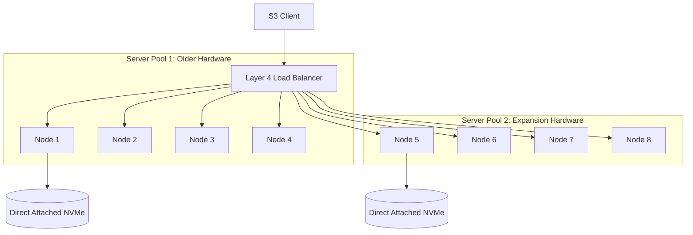
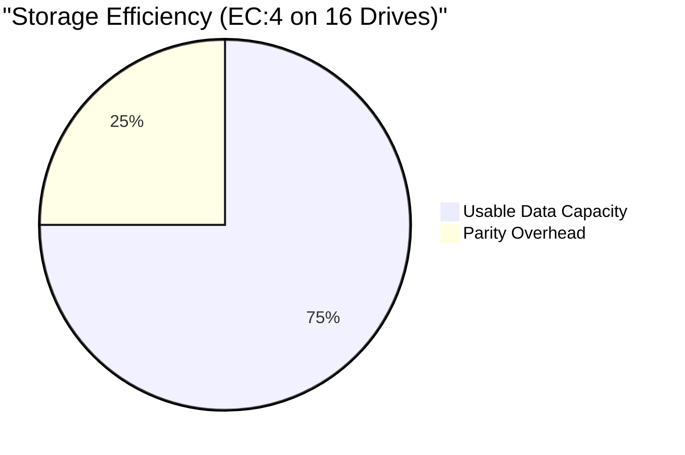

# Object Storage on Bare Metal

## Learning Outcomes
* Architect distributed MinIO topologies using Server Pools for horizontal scalability on bare metal hardware.
* Configure erasure coding profiles to balance storage efficiency against strict fault tolerance requirements.
* Implement multi-tenant S3-compatible access using STS (Security Token Service) and IAM policies.
* Configure bucket-level lifecycle policies, object versioning, and legal holds for compliance and automated tiering.
* Diagnose replication lag and quorum failures in multi-site active-active object storage architectures.

## Architecture and Deployment Modes

On bare metal, providing S3-compatible object storage requires deploying a distributed storage system directly on top of physical drives. MinIO is the standard for this pattern due to its strict Amazon S3 API compatibility, high performance, and bare-metal-native design. 

Unlike managed cloud object storage, running MinIO on bare metal shifts the responsibility of hardware topology, drive failure management, and network planning directly to the platform engineering team.

### Server Pools and Topology

MinIO scales horizontally through **Server Pools**. A Server Pool is an independent set of nodes and drives that act as a single logical storage entity. When an object is written, MinIO calculates a hash to determine which Server Pool receives the data, and then distributes the object across the drives in that specific pool.

:::caution
**Production Gotcha:** You cannot arbitrarily add single nodes or drives to an existing distributed MinIO deployment. You expand capacity by provisioning a completely new Server Pool. The new Server Pool must meet the minimum requirements (typically 4 nodes) and ideally matches the drive geometry of the existing pools to maintain predictable performance.
:::



### Storage Layer: DirectPV vs. CSI

Performance in object storage is bottlenecked by the underlying storage subsystem. MinIO expects **JBOD (Just a Bunch of Disks)** without hardware RAID. Hardware RAID introduces controller bottlenecks and conflicts with MinIO's software-level erasure coding.

For Kubernetes deployments, use **DirectPV** (a CSI driver built by MinIO) or local PersistentVolumes. DirectPV discovers, formats, and mounts local drives directly to Pods, bypassing the network overhead of generic distributed block storage (like Ceph RBD or Portworx).

**Filesystem Requirements:** Always format drives as XFS. MinIO optimizes heavily for XFS features (like concurrent allocation). Ext4 is supported but introduces severe inode bottlenecks under high object counts.

### Erasure Coding (EC) Parity and Quorum

MinIO protects data against drive and node failures using Erasure Coding. It divides objects into Data (D) blocks and Parity (P) blocks. The configuration is expressed as `EC:N`, where `N` is the number of parity blocks per erasure set.

*   **Standard Parity (EC:4):** In a 16-drive set, an object is split into 12 Data blocks and 4 Parity blocks. You can lose any 4 drives and still read and write data. Storage efficiency is 75% (12/16).
*   **High Parity (EC:8):** In a 16-drive set, an object is split into 8 Data and 8 Parity blocks. You can lose any 8 drives and still read the data (though you need $N/2 + 1$ drives to write). Storage efficiency is 50%.



:::tip
Always configure topologies so that a complete node failure does not violate the read/write quorum. If you have 4 nodes with 4 drives each (16 drives total) and use EC:4, a single node going offline removes 4 drives. The cluster remains fully operational. If you use EC:3 in the same setup, a node failure brings down the entire Server Pool because 4 drives are lost, exceeding the 3-drive parity budget.
:::

## Multi-Tenancy and Access Control

Operating a platform requires isolating workloads. Sharing root credentials across applications is an anti-pattern that leads to compromised data and auditing nightmares.

### MinIO Tenants

The MinIO Kubernetes Operator provisions isolated instances called **Tenants**. Each Tenant operates its own Server Pools, its own IAM database, and its own endpoints. Use a single large Kubernetes cluster to host multiple isolated MinIO Tenants rather than creating one giant monolithic Tenant for the whole company.

### Identity and STS (Security Token Service)

Applications must authenticate using temporary, scoped credentials via STS, specifically using `AssumeRoleWithWebIdentity`. This integrates directly with Kubernetes ServiceAccounts.

1.  The K8s Pod mounts a projected ServiceAccount token.
2.  The application uses this JWT to call the MinIO STS endpoint.
3.  MinIO validates the JWT against the Kubernetes API OIDC discovery endpoint.
4.  MinIO returns temporary S3 credentials bound to an IAM policy that maps to that specific ServiceAccount.

## Data Management

### Versioning and Object Lock

**Versioning** maintains historical copies of an object when it is overwritten or deleted. This protects against accidental application logic errors. 

**Object Lock (WORM - Write Once Read Many)** prevents any modification or deletion of an object for a specified duration, or indefinitely until a Legal Hold is removed. Object Lock requires Versioning to be enabled on the bucket.

### Lifecycle Management (ILM)

Bare-metal NVMe storage is expensive. ILM policies automate data lifecycle:
*   **Expiration:** Delete objects (or specific non-current versions) after $X$ days.
*   **Transition:** Move colder objects to a slower, cheaper storage tier (e.g., transitioning objects from an NVMe-backed MinIO Tenant to an HDD-backed MinIO Tenant, or out to public cloud S3).

Without strict Expiration policies, an application continuously overwriting a versioned object will silently fill the physical disks, causing a hard outage requiring manual drive expansion.

## Day 2 Operations

### Prometheus Metrics

MinIO exposes metrics natively. Do not use the legacy `/minio/prometheus/metrics` endpoint, which calculates bucket sizes dynamically and causes extreme CPU spikes and cluster timeouts in large deployments. 

Use the `/minio/v2/metrics/cluster` endpoint. The v2 endpoint relies on MinIO's internal background scanner to report bucket sizes, requiring virtually zero compute overhead during the scrape.

### Active-Active Replication

For multi-datacenter bare-metal deployments, MinIO supports site-to-site Active-Active replication. This operates asynchronously. Ensure clock synchronization (NTP/Chrony) across all bare-metal nodes is strictly enforced; object replication relies entirely on timestamps to resolve conflicts. Clock drift exceeding 1 second will result in inconsistent state and silent data corruption across sites.

---

## Hands-on Lab

In this lab, you will deploy the MinIO Operator, provision a single-node multi-drive Tenant (simulating a distributed setup on a local cluster), configure the S3 CLI, enable versioning, and apply a strict quota.

### Prerequisites
*   A running Kubernetes cluster (`kind` or `k3s`).
*   `kubectl` and `helm` installed.
*   MinIO Client (`mc`) installed locally.

### Step 1: Install the MinIO Operator

Deploy the operator using the official Helm chart.

```bash
helm repo add minio https://operator.min.io/
helm repo update

helm install minio-operator minio/operator \
  --namespace minio-operator \
  --create-namespace \
  --wait
```

*Verification:*
```bash
kubectl get pods -n minio-operator
```
*Expected Output:*
```text
NAME                              READY   STATUS    RESTARTS   AGE
minio-operator-6b7d59b4f7-8j2x2   1/1     Running   0          45s
```

### Step 2: Provision a Tenant

Create a minimal Tenant. We specify `servers: 1` and `volumesPerServer: 4` to allow Erasure Coding to function within a single `kind` node. The operator will automatically provision PVCs.

Create a file named `tenant.yaml`:

```yaml
apiVersion: minio.min.io/v2
kind: Tenant
metadata:
  name: dojo-storage
  namespace: minio-tenant
spec:
  pools:
    - servers: 1
      volumesPerServer: 4
      size: 4Gi
      storageClassName: standard
  requestAutoCert: false
```

Apply the manifest:

```bash
kubectl create namespace minio-tenant
kubectl apply -f tenant.yaml
```

*Verification:* Wait for the statefulset to reach readiness.
```bash
kubectl get pods -n minio-tenant -w
```
*Expected Output:*
```text
NAME                 READY   STATUS    RESTARTS   AGE
dojo-storage-pool-0-0   2/2     Running   0          2m
```

### Step 3: Retrieve Credentials and Configure CLI

The Operator automatically generates root credentials and stores them in a Secret.

```bash
# Extract Root User
ROOT_USER=$(kubectl get secret dojo-storage-env-configuration -n minio-tenant -o jsonpath='{.data.config\.env}' | base64 -d | grep MINIO_ROOT_USER | cut -d '=' -f2)

# Extract Root Password
ROOT_PASS=$(kubectl get secret dojo-storage-env-configuration -n minio-tenant -o jsonpath='{.data.config\.env}' | base64 -d | grep MINIO_ROOT_PASSWORD | cut -d '=' -f2)

echo "User: $ROOT_USER | Pass: $ROOT_PASS"
```

Port-forward the Tenant S3 API to your local machine:

```bash
kubectl port-forward svc/minio -n minio-tenant 9000:80 &
```

Configure the `mc` CLI:

```bash
mc alias set myminio http://localhost:9000 $ROOT_USER $ROOT_PASS
```

### Step 4: Configure Bucket, Quota, and Versioning

Create a bucket named `app-data`:

```bash
mc mb myminio/app-data
```

Enable object versioning:

```bash
mc version enable myminio/app-data
```

Apply a hard quota of 1GB to prevent runaway storage consumption:

```bash
mc quota set myminio/app-data --size 1G
```

*Verification:* Check bucket properties.
```bash
mc ls myminio/
mc quota info myminio/app-data
```
*Expected Output:*
```text
Capacity: 1 GiB
Used: 0 B
```

### Step 5: Test Erasure Coding Resilience (Simulated Failure)

Write a test file:

```bash
echo "Important production data" > test.txt
mc cp test.txt myminio/app-data/
```

Simulate drive corruption by deleting data from one of the backing PVC directories inside the pod (bypassing MinIO):

```bash
kubectl exec -n minio-tenant dojo-storage-pool-0-0 -c minio -- rm -rf /export/0/app-data
```

Attempt to read the file:

```bash
mc cat myminio/app-data/test.txt
```
*Expected Output:*
```text
Important production data
```
*Explanation:* MinIO transparently reconstructed the missing data block from the remaining parity blocks in real-time.

### Troubleshooting the Lab
*   **Pods stuck in Pending:** Your cluster lacks a default StorageClass or insufficient host capacity. Ensure `local-path-provisioner` is running if using `kind`.
*   **mc connection refused:** Ensure the `kubectl port-forward` command is still running in the background.

---

## Practitioner Gotchas

### 1. The NFS Backing Store Catastrophe
**Context:** Storage administrators often provision MinIO on top of existing enterprise SAN/NAS appliances via NFS to "save time" or simplify backups.
**The Fix:** Never do this. MinIO maintains its own strict POSIX locking and erasure coding algorithms. Layering this on top of a network filesystem causes massive latency spikes, locking conflicts resulting in 503 Slow Down errors, and complete loss of MinIO's performance advantages. Demand physical JBOD via DirectPV or local hostPath provisioning.

### 2. Symmetrical Topology Expansion Failures
**Context:** A bare-metal cluster runs out of storage. An engineer adds two new large NVMe drives to one of the nodes and restarts the MinIO service, expecting the capacity to increase. The cluster state becomes inconsistent or ignores the drives.
**The Fix:** MinIO is strictly deterministic based on its initialization command. You cannot change the geometry of an existing Server Pool. To add capacity, you must provision a *new* Server Pool (e.g., 4 new nodes) and update the Tenant configuration to append the new pool. MinIO will automatically route new objects to the pool with the most free space.

### 3. Layer 7 Load Balancer Signature Corruption
**Context:** S3 clients suddenly receive `SignatureDoesNotMatch` HTTP 403 errors after moving the MinIO deployment behind an ingress controller or enterprise load balancer.
**The Fix:** S3 client SDKs calculate a cryptographic hash of the HTTP request headers. If an intermediate proxy modifies, drops, or normalizes these headers (e.g., stripping `X-Amz-*` headers, or altering the `Host` header without passing `X-Forwarded-Host`), the signature calculated by the MinIO server will not match the client's signature. Configure the ingress proxy for strict Layer 4 (TCP) pass-through, or ensure all required AWS headers are preserved intact.

### 4. Versioning Disk Exhaustion
**Context:** An application rapidly updates a small 1MB JSON configuration file in an S3 bucket 10,000 times a day. Two months later, the physical hard drives are completely full, bringing the storage cluster down.
**The Fix:** Versioning without a Lifecycle Management (ILM) policy is a ticking time bomb. Every update writes a net-new 1MB object, consuming 600GB of storage for a 1MB logical file. Always mandate a global ILM Expiration policy for non-current versions (e.g., delete non-current versions after 7 days) on any bucket where versioning is enabled.

---

## Quiz

**1. A bare-metal MinIO Server Pool consists of 4 nodes, each with 4 physical NVMe drives (16 drives total). The erasure coding profile is set to standard EC:4. What is the maximum number of simultaneous drive failures this pool can sustain without losing read availability?**
- A) 2 drives
- B) 3 drives
- C) 4 drives
- D) 8 drives
<br>_Correct Answer: C_

**2. You operate a MinIO Tenant that has reached 90% capacity. Your hardware team delivers a new rack with 4 additional bare-metal servers. What is the correct method to expand the cluster's capacity?**
- A) Add the new servers to the existing Server Pool via the `mc admin cluster add` command to rebalance the cluster.
- B) Modify the existing Server Pool specification in the Tenant manifest to include the new nodes and increase the `servers` count from 4 to 8.
- C) Provision the 4 new servers as a new, distinct Server Pool and append this new pool to the Tenant manifest.
- D) Deploy a second, separate Tenant and configure an ILM Transition policy to move data between them.
<br>_Correct Answer: C_

**3. A security audit mandates that audit logs stored in MinIO must be retained for 7 years and cannot be deleted or modified by anyone, including the root user. What combination of features must be configured?**
- A) Bucket Versioning and Object Lock with Compliance Mode.
- B) Object Lock with Governance Mode and a strict IAM policy.
- C) Server-Side Encryption (SSE-C) and an ILM Transition policy.
- D) Bucket Quotas and a Legal Hold applied to the user account.
<br>_Correct Answer: A_

**4. Applications running in Kubernetes need to access specific MinIO buckets. Currently, they are using hardcoded AWS Access Keys mounted via K8s Secrets. You need to migrate to a secure, dynamic, and credential-less architecture. Which mechanism should you implement?**
- A) Configure MinIO to scrape the Kubernetes Secret API every 5 minutes and rotate keys automatically.
- B) Implement the `AssumeRoleWithWebIdentity` STS flow utilizing Kubernetes ServiceAccount tokens.
- C) Use an NGINX reverse proxy to inject hardcoded credentials into HTTP requests originating from internal cluster IPs.
- D) Enable Active Directory / LDAP synchronization and bind the applications to specific Active Directory user objects.
<br>_Correct Answer: B_

**5. After migrating MinIO metrics collection to Prometheus, the Prometheus server begins timing out during scrapes, and the MinIO cluster experiences severe CPU spikes every 30 seconds. What is the architectural root cause and solution?**
- A) The prometheus scrape interval is too short. Increase the scrape interval to 5 minutes to allow disk I/O to recover.
- B) Prometheus is scraping the v1 authenticated metrics endpoint, which forces a live calculation of bucket sizes. Switch to the unauthenticated `/minio/v2/metrics/cluster` endpoint.
- C) The ServiceMonitor is missing TLS certificates, causing MinIO to reject the connection via CPU-intensive cryptographic handshakes. Provide the correct CA bundle.
- D) Erasure coding overhead is interfering with metrics generation. Reduce the EC parity level to free up CPU cycles for the metrics API.
<br>_Correct Answer: B_

---

## Further Reading
*   [MinIO Erasure Coding Math and Quorum](https://min.io/docs/minio/kubernetes/upstream/operations/concepts/erasure-coding.html)
*   [DirectPV Storage CSI Driver Architecture](https://min.io/directpv)
*   [MinIO Kubernetes Operator: Tenant Configuration](https://min.io/docs/minio/kubernetes/upstream/administration/minio-kubernetes-operator.html)
*   [Amazon S3 Compatibility API Reference](https://docs.aws.amazon.com/AmazonS3/latest/API/Welcome.html)
*   [STS AssumeRoleWithWebIdentity specification](https://docs.aws.amazon.com/STS/latest/APIReference/API_AssumeRoleWithWebIdentity.html)