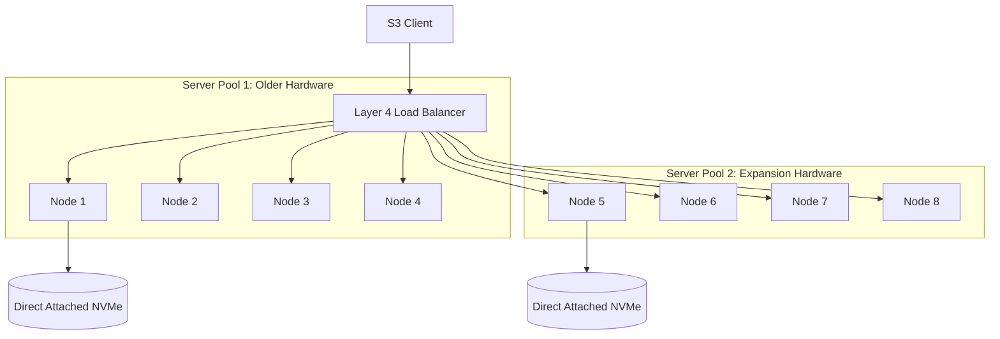
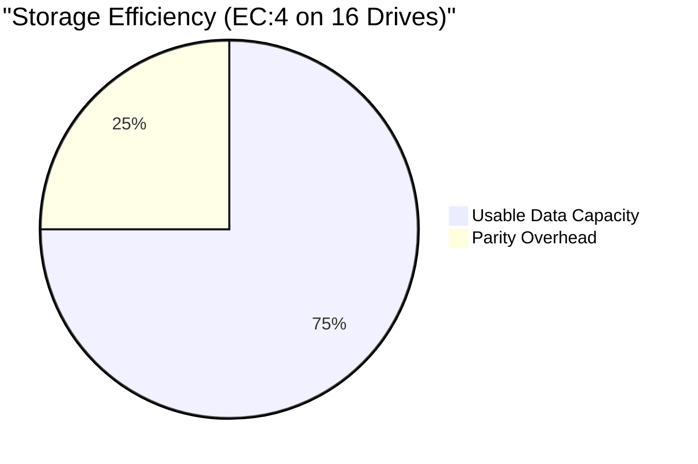

# Object Storage on Bare Metal

## Learning Outcomes
* Architect distributed topologies using Server Pools for horizontal scalability on bare metal hardware.
* Configure erasure coding profiles to balance storage efficiency against strict fault tolerance requirements.
* Implement multi-tenant S3-compatible access using STS (Security Token Service) and IAM policies.
* Configure bucket-level lifecycle policies, object versioning, and legal holds for compliance and automated tiering.
* Diagnose replication lag and quorum failures in multi-site active-active object storage architectures.

## Architecture and Deployment Modes

On bare metal, providing S3-compatible object storage requires deploying a distributed storage system directly on top of physical drives. Historically, MinIO was the standard for this pattern due to its strict Amazon S3 API compatibility, high performance, and bare-metal-native design.

:::caution
**Industry Shift:** As of February 13, 2026, the MinIO open-source community edition repository was fully archived and made read-only. MinIO had ceased publishing pre-compiled binaries and Docker images to public registries in October 2025. Furthermore, it is licensed under AGPLv3, meaning organizations offering it as a SaaS must either release their combined source code under AGPLv3 or purchase a commercial license for its closed-source successor, AIStor.
:::

### The Open-Source Landscape

For modern, production-grade open-source deployments, platform teams typically evaluate CNCF-backed alternatives:
*   **Ceph (via Rook):** Rook (a CNCF Graduated project, currently v1.19 supporting K8s v1.30–v1.35) orchestrates Ceph. The latest Ceph release (v20.2.1 Tentacle, April 2026) offers robust S3 compatibility via RADOS Gateway (RGW) and features zero-downtime background bucket resharding. It also adds support for the S3 `GetObjectAttributes` API, exact AWS S3 timestamp truncation, and first-class IAM API policy support. A single Ceph cluster can simultaneously serve object (RGW), block (RBD), and file (CephFS) storage.
*   **SeaweedFS:** Licensed under Apache 2.0 (currently v4.18), SeaweedFS is a highly efficient distributed system that achieves O(1) disk seeks for blob retrieval by storing file-to-volume-offset mappings entirely in memory.
*   **RustFS:** An open-source, S3-compatible object storage system written in Rust and licensed under Apache 2.0. It aims to provide a high-performance alternative to MinIO without the AGPLv3 restrictions. While the project's documentation claims it is 2.3x faster than MinIO for 4 KB object payloads, these figures originate from self-reported benchmarks and have not been independently verified.
*   **Kubernetes COSI (Container Object Storage Interface):** Note that while COSI aims to standardize object storage provisioning in Kubernetes, it remains in pre-alpha status (v1alpha2) as of April 2026. Therefore, direct provisioning via operators and CSI drivers like DirectPV remains the current standard.

Despite these industry shifts, MinIO's architectural primitives (Server Pools, direct-attached drives, and strict Erasure Coding) remain the clearest educational model for understanding distributed object storage mechanics. The following sections use MinIO as the reference architecture.

Unlike managed cloud object storage, running distributed storage on bare metal shifts the responsibility of hardware topology, drive failure management, and network planning directly to the platform engineering team.

### Server Pools and Topology

Distributed object storage scales horizontally through **Server Pools**. A Server Pool is an independent set of nodes and drives that act as a single logical storage entity. When an object is written, the system calculates a hash to determine which Server Pool receives the data, and then distributes the object across the drives in that specific pool.

:::caution
**Production Gotcha:** You cannot arbitrarily add single nodes or drives to an existing distributed deployment. You expand capacity by provisioning a completely new Server Pool. The new Server Pool must meet the minimum requirements (typically 4 nodes) and ideally matches the drive geometry of the existing pools to maintain predictable performance.
:::



### Storage Layer: DirectPV vs. CSI

Performance in object storage is bottlenecked by the underlying storage subsystem. Bare-metal systems expect **JBOD (Just a Bunch of Disks)** without hardware RAID. Hardware RAID introduces controller bottlenecks and conflicts with software-level erasure coding.

For Kubernetes deployments, use **DirectPV** (a CSI driver built for local drives) or local PersistentVolumes. DirectPV discovers, formats, and mounts local drives directly to Pods, bypassing the network overhead of generic distributed block storage (like Portworx).

> **Pause and predict**: If you format the physical NVMe drives with `ext4` instead of `XFS` for a distributed object storage workload, what hidden bottleneck are you likely to hit as millions of small objects are ingested?

**Filesystem Requirements:** Always format drives as XFS. Distributed storage engines heavily optimize for XFS features (like concurrent allocation). Ext4 is supported but introduces severe inode bottlenecks under high object counts.

### Erasure Coding (EC) Parity and Quorum

Data is protected against drive and node failures using Erasure Coding. It divides objects into Data (D) blocks and Parity (P) blocks within an erasure set. For example, MinIO erasure coding sets contain a minimum of 2 drives and a maximum of 16 drives per set. The configuration is expressed as `EC:N`, where `N` is the number of parity blocks per erasure set.

*   **Standard Parity (EC:4):** In a 16-drive set, an object is split into 12 Data blocks and 4 Parity blocks. You can lose any 4 drives and still read and write data. Storage efficiency is 75% (12/16).
*   **High Parity (EC:8):** In a 16-drive set, an object is split into 8 Data and 8 Parity blocks. You can lose any 8 drives and still read the data (though you need $N/2 + 1$ drives to write). Storage efficiency is 50%.



:::tip
Always configure topologies so that a complete node failure does not violate the read/write quorum. If you have 4 nodes with 4 drives each (16 drives total) and use EC:4, a single node going offline removes 4 drives. The cluster remains fully operational. If you use EC:3 in the same setup, a node failure brings down the entire Server Pool because 4 drives are lost, exceeding the 3-drive parity budget.
:::

## Multi-Tenancy and Access Control

Operating a platform requires isolating workloads. Sharing root credentials across applications is an anti-pattern that leads to compromised data and auditing nightmares.

> **Stop and think**: Why is creating one massive, multi-tenant Tenant for an entire enterprise considered an operational anti-pattern compared to provisioning multiple smaller Tenants per business unit?

### Tenants and Isolation

Modern operators provision isolated instances called **Tenants**. Each Tenant operates its own Server Pools, its own IAM database, and its own endpoints. Use a single large Kubernetes cluster to host multiple isolated Tenants rather than creating one giant monolithic Tenant for the whole company.

### Identity and STS (Security Token Service)

Applications must authenticate using temporary, scoped credentials via STS, specifically using `AssumeRoleWithWebIdentity`. This integrates directly with Kubernetes ServiceAccounts.

1.  The K8s Pod mounts a projected ServiceAccount token.
2.  The application uses this JWT to call the STS endpoint.
3.  The storage system validates the JWT against the Kubernetes API OIDC discovery endpoint.
4.  The system returns temporary S3 credentials bound to an IAM policy that maps to that specific ServiceAccount.

## Data Management

### Storage Thresholds

When designing applications against bare-metal object storage, understand the hard physical limits of the system. For instance, MinIO supports a maximum single-PUT object size of 5 TiB. If applications need to upload larger datasets, they must implement multipart uploads, which support up to 10,000 parts (each up to 5 TiB), allowing for a maximum theoretical object size of approximately 48 PiB.

### Versioning and Object Lock

**Versioning** maintains historical copies of an object when it is overwritten or deleted. This protects against accidental application logic errors. 

**Object Lock (WORM - Write Once Read Many)** prevents any modification or deletion of an object for a specified duration, or indefinitely until a Legal Hold is removed. Object Lock requires Versioning to be enabled on the bucket.

### Lifecycle Management (ILM)

Bare-metal NVMe storage is expensive. ILM policies automate data lifecycle:
*   **Expiration:** Delete objects (or specific non-current versions) after $X$ days.
*   **Transition:** Move colder objects to a slower, cheaper storage tier (e.g., transitioning objects from an NVMe-backed Tenant to an HDD-backed Tenant, or out to public cloud S3).

Without strict Expiration policies, an application continuously overwriting a versioned object will silently fill the physical disks, causing a hard outage requiring manual drive expansion.

## Day 2 Operations

### Prometheus Metrics

Storage platforms expose metrics natively. Do not use legacy v1 metrics endpoints (like `/minio/prometheus/metrics`), which calculate bucket sizes dynamically and cause extreme CPU spikes and cluster timeouts in large deployments. 

Use the v2 cluster endpoints (e.g., `/minio/v2/metrics/cluster`). The v2 endpoint relies on internal background scanners to report bucket sizes, requiring virtually zero compute overhead during the scrape.

### Active-Active Replication

For multi-datacenter bare-metal deployments, site-to-site Active-Active replication is supported. This operates asynchronously. Ensure clock synchronization (NTP/Chrony) across all bare-metal nodes is strictly enforced; object replication relies entirely on timestamps to resolve conflicts. Clock drift exceeding 1 second will result in inconsistent state and silent data corruption across sites.

---

## Hands-on Lab

In this lab, you will deploy the MinIO Operator, provision a single-node multi-drive Tenant (simulating a distributed setup on a local cluster), configure the S3 CLI, enable versioning, and apply a strict quota.

:::note
**Lab Environment Constraint:** Because MinIO ceased publishing public Docker images for its community edition in October 2025, this lab relies on historically cached images or local builds pulled by the Helm chart. In a modern production environment, you would either build the archived community source code internally, purchase AIStor, or deploy a CNCF alternative like Rook/Ceph.
:::

### Prerequisites
*   A running Kubernetes cluster (v1.35+ recommended, via `kind` or `k3s`).
*   `kubectl` and `helm` installed.
*   MinIO Client (`mc`) installed locally.

### Step 1: Install the Operator

Deploy the operator using the official Helm chart.

```bash
helm repo add minio https://operator.min.io/
helm repo update

helm install minio-operator minio/operator \
  --namespace minio-operator \
  --create-namespace \
  --wait
```

*Verification:*
```bash
kubectl get pods -n minio-operator
```
*Expected Output:*
```text
NAME                              READY   STATUS    RESTARTS   AGE
minio-operator-6b7d59b4f7-8j2x2   1/1     Running   0          45s
```

### Step 2: Provision a Tenant

Create a minimal Tenant. We specify `servers: 1` and `volumesPerServer: 4` to allow Erasure Coding to function within a single `kind` node. The operator will automatically provision PVCs.

Create a file named `tenant.yaml`:

```yaml
apiVersion: minio.min.io/v2
kind: Tenant
metadata:
  name: dojo-storage
  namespace: minio-tenant
spec:
  pools:
    - servers: 1
      volumesPerServer: 4
      size: 4Gi
      storageClassName: standard
  requestAutoCert: false
```

Apply the manifest:

```bash
kubectl create namespace minio-tenant
kubectl apply -f tenant.yaml
```

*Verification:* Wait for the statefulset to reach readiness.
```bash
kubectl get pods -n minio-tenant -w
```
*Expected Output:*
```text
NAME                 READY   STATUS    RESTARTS   AGE
dojo-storage-pool-0-0   2/2     Running   0          2m
```

### Step 3: Retrieve Credentials and Configure CLI

The Operator automatically generates root credentials and stores them in a Secret.

```bash
# Extract Root User
ROOT_USER=$(kubectl get secret dojo-storage-env-configuration -n minio-tenant -o jsonpath='{.data.config\.env}' | base64 -d | grep MINIO_ROOT_USER | cut -d '=' -f2)

# Extract Root Password
ROOT_PASS=$(kubectl get secret dojo-storage-env-configuration -n minio-tenant -o jsonpath='{.data.config\.env}' | base64 -d | grep MINIO_ROOT_PASSWORD | cut -d '=' -f2)

echo "User: $ROOT_USER | Pass: $ROOT_PASS"
```

Port-forward the Tenant S3 API to your local machine:

```bash
kubectl port-forward svc/minio -n minio-tenant 9000:80 &
```

Configure the `mc` CLI:

```bash
mc alias set myminio http://localhost:9000 $ROOT_USER $ROOT_PASS
```

### Step 4: Configure Bucket, Quota, and Versioning

Create a bucket named `app-data`:

```bash
mc mb myminio/app-data
```

Enable object versioning:

```bash
mc version enable myminio/app-data
```

Apply a hard quota of 1GB to prevent runaway storage consumption:

```bash
mc quota set myminio/app-data --size 1G
```

*Verification:* Check bucket properties.
```bash
mc ls myminio/
mc quota info myminio/app-data
```
*Expected Output:*
```text
Capacity: 1 GiB
Used: 0 B
```

### Step 5: Test Erasure Coding Resilience (Simulated Failure)

Write a test file:

```bash
echo "Important production data" > test.txt
mc cp test.txt myminio/app-data/
```

Simulate drive corruption by deleting data from one of the backing PVC directories inside the pod:

```bash
kubectl exec -n minio-tenant dojo-storage-pool-0-0 -c minio -- rm -rf /export/0/app-data
```

Attempt to read the file:

```bash
mc cat myminio/app-data/test.txt
```
*Expected Output:*
```text
Important production data
```
*Explanation:* The storage engine transparently reconstructed the missing data block from the remaining parity blocks in real-time.

### Troubleshooting the Lab
*   **Pods stuck in Pending:** Your cluster lacks a default StorageClass or insufficient host capacity. Ensure `local-path-provisioner` is running if using `kind`.
*   **mc connection refused:** Ensure the `kubectl port-forward` command is still running in the background.

---

## Practitioner Gotchas

### 1. The NFS Backing Store Catastrophe
**Context:** Storage administrators often provision bare-metal object storage on top of existing enterprise SAN/NAS appliances via NFS to "save time" or simplify backups.
**The Fix:** Never do this. These systems maintain their own strict POSIX locking and erasure coding algorithms. Layering this on top of a network filesystem causes massive latency spikes, locking conflicts resulting in 503 Slow Down errors, and complete loss of performance advantages. Demand physical JBOD via DirectPV or local hostPath provisioning.

### 2. Symmetrical Topology Expansion Failures
**Context:** A bare-metal cluster runs out of storage. An engineer adds two new large NVMe drives to one of the nodes and restarts the service, expecting the capacity to increase. The cluster state becomes inconsistent or ignores the drives.
**The Fix:** Distributed object topologies are strictly deterministic based on their initialization commands. You cannot change the geometry of an existing Server Pool. To add capacity, you must provision a *new* Server Pool (e.g., 4 new nodes) and update the Tenant configuration to append the new pool. The cluster will automatically route new objects to the pool with the most free space.

### 3. Layer 7 Load Balancer Signature Corruption
**Context:** S3 clients suddenly receive `SignatureDoesNotMatch` HTTP 403 errors after moving the deployment behind an ingress controller or enterprise load balancer.
**The Fix:** S3 client SDKs calculate a cryptographic hash of the HTTP request headers. If an intermediate proxy modifies, drops, or normalizes these headers (e.g., stripping `X-Amz-*` headers, or altering the `Host` header without passing `X-Forwarded-Host`), the signature calculated by the server will not match the client's signature. Configure the ingress proxy for strict Layer 4 (TCP) pass-through, or ensure all required AWS headers are preserved intact.

### 4. Versioning Disk Exhaustion
**Context:** An application rapidly updates a small 1MB JSON configuration file in an S3 bucket 10,000 times a day. Two months later, the physical hard drives are completely full, bringing the storage cluster down.
**The Fix:** Versioning without a Lifecycle Management (ILM) policy is a ticking time bomb. Every update writes a net-new 1MB object, consuming 600GB of storage for a 1MB logical file. Always mandate a global ILM Expiration policy for non-current versions (e.g., delete non-current versions after 7 days) on any bucket where versioning is enabled.

---

## Quiz

**1. You are the storage administrator for a financial data platform running a bare-metal MinIO Server Pool. The pool consists of 4 nodes, each equipped with 4 physical NVMe drives (16 drives total). To balance redundancy and usable capacity, you have configured the erasure coding profile to standard EC:4. During a massive power surge, multiple drives fail simultaneously across the cluster. What is the maximum number of simultaneous drive failures this specific Server Pool can sustain without losing read availability for your applications?**
- A) 2 drives
- B) 3 drives
- C) 4 drives
- D) 8 drives
<br>_Correct Answer: C_
<br>_Explanation: Erasure Coding (EC) splits objects into Data and Parity blocks across the drives in a set. In an EC:4 configuration with 16 total drives, an object is divided into 12 Data blocks and 4 Parity blocks. Read availability requires access to any 12 blocks (data or parity) from the set. Therefore, you can lose up to 4 blocks—which translates directly to 4 physical drives in this geometry—and still possess the necessary 12 blocks to reconstruct and serve the data._

**2. Your team operates a multi-tenant object storage environment that has rapidly reached 90% of its total storage capacity. The hardware procurement team has just racked and cabled 4 brand-new bare-metal servers, each with identical drive geometries to your existing infrastructure. To prevent a storage outage, you need to seamlessly integrate this new hardware. What is the correct, supported operational method to expand the cluster's storage capacity?**
- A) Add the new servers to the existing Server Pool via an admin command to rebalance the cluster.
- B) Modify the existing Server Pool specification in the Tenant manifest to include the new nodes and increase the `servers` count from 4 to 8.
- C) Provision the 4 new servers as a new, distinct Server Pool and append this new pool to the Tenant manifest.
- D) Deploy a second, separate Tenant and configure an ILM Transition policy to move data between them.
<br>_Correct Answer: C_
<br>_Explanation: Distributed object architectures rely on a deterministic hashing algorithm that is established at the time a Server Pool is initialized, meaning you cannot alter the geometry (number of nodes or drives) of an existing pool without corrupting the hash ring. Instead, capacity expansion is achieved horizontally by adding entirely new Server Pools to the deployment. When you append a new Server Pool to the Tenant configuration, the system automatically begins routing new object writes to the pool with the most available free space, effectively expanding the cluster without rebalancing legacy data. This ensures predictable performance and maintains the integrity of the data distribution algorithm across the entire cluster._

**3. A healthcare organization uses your bare-metal object storage to archive patient records and compliance audit logs. A new regulatory mandate dictates that these specific audit logs must be retained for exactly 7 years and absolutely cannot be deleted, modified, or tampered with by any entity—including administrators possessing root credentials. What combination of storage features must you configure to enforce this mandate?**
- A) Bucket Versioning and Object Lock with Compliance Mode.
- B) Object Lock with Governance Mode and a strict IAM policy.
- C) Server-Side Encryption (SSE-C) and an ILM Transition policy.
- D) Bucket Quotas and a Legal Hold applied to the user account.
<br>_Correct Answer: A_
<br>_Explanation: To satisfy strict Write-Once-Read-Many (WORM) regulatory requirements, you must use Object Lock. Object Lock fundamentally requires Bucket Versioning to be enabled first, as it operates by locking specific object versions rather than the bucket as a whole. Crucially, it must be deployed in Compliance Mode rather than Governance Mode; Compliance Mode ensures that the retention period is immutable and cannot be bypassed or shortened by any user, including the root administrator, fulfilling the strict anti-tampering mandate. This guarantees that the audit logs remain intact for the full 7-year period, protecting the organization from both accidental deletion and malicious tampering._

**4. Several internal microservices running in your Kubernetes cluster require read/write access to specific internal storage buckets. Currently, developers are hardcoding long-lived AWS-style Access Keys and storing them in standard Kubernetes Secrets, which recently failed a security audit due to credential sprawl and lack of rotation. You are tasked with migrating these microservices to a secure, dynamic, and credential-less authentication architecture. Which mechanism should you implement?**
- A) Configure the storage system to scrape the Kubernetes Secret API every 5 minutes and rotate keys automatically.
- B) Implement the `AssumeRoleWithWebIdentity` STS flow utilizing Kubernetes ServiceAccount tokens.
- C) Use an NGINX reverse proxy to inject hardcoded credentials into HTTP requests originating from internal cluster IPs.
- D) Enable Active Directory / LDAP synchronization and bind the applications to specific Active Directory user objects.
<br>_Correct Answer: B_
<br>_Explanation: Hardcoding long-lived access keys is a critical security anti-pattern that leads to unmanageable credential sprawl and heightened risk of exposure. The modern, cloud-native approach is to use the Security Token Service (STS) `AssumeRoleWithWebIdentity` flow. This mechanism leverages the native Kubernetes ServiceAccount tokens (JWTs) already mounted inside the application Pods to authenticate with the object storage provider. The storage system validates the JWT against the Kubernetes API and dynamically issues short-lived, strictly scoped S3 credentials, completely eliminating the need to manually manage or rotate static secrets._

**5. Your platform engineering team recently migrated the scraping of object storage metrics from a legacy monitoring stack to a centralized Prometheus instance. Shortly after the migration, the Prometheus server begins experiencing frequent timeouts during scrape intervals, and you observe severe, cluster-wide CPU spikes on the storage nodes every 30 seconds that correlate perfectly with the scrape schedule. What is the architectural root cause of this degradation, and how do you resolve it?**
- A) The prometheus scrape interval is too short. Increase the scrape interval to 5 minutes to allow disk I/O to recover.
- B) Prometheus is scraping the v1 authenticated metrics endpoint, which forces a live calculation of bucket sizes. Switch to the unauthenticated `/minio/v2/metrics/cluster` endpoint.
- C) The ServiceMonitor is missing TLS certificates, causing the system to reject the connection via CPU-intensive cryptographic handshakes. Provide the correct CA bundle.
- D) Erasure coding overhead is interfering with metrics generation. Reduce the EC parity level to free up CPU cycles for the metrics API.
<br>_Correct Answer: B_
<br>_Explanation: Legacy v1 Prometheus metrics endpoints often calculate metrics like total bucket size and object counts dynamically upon every HTTP request. In deployments with millions of objects, this live calculation requires recursively scanning the namespace, causing massive disk I/O and CPU spikes that can bring the cluster down. The v2 cluster metrics endpoint resolves this by relying on continuous internal background scanners to cache and report these statistics. Scraping the v2 endpoint retrieves this cached data almost instantly, imposing virtually zero compute or I/O overhead on the storage nodes._

---

## Further Reading
*   [Ceph Object Gateway (RGW)](https://docs.ceph.com/en/latest/radosgw/)
*   [Rook v1.19 Documentation](https://rook.io/docs/rook/latest/)
*   [DirectPV Storage CSI Driver Architecture](https://min.io/directpv)
*   [STS AssumeRoleWithWebIdentity specification](https://docs.aws.amazon.com/STS/latest/APIReference/API_AssumeRoleWithWebIdentity.html)