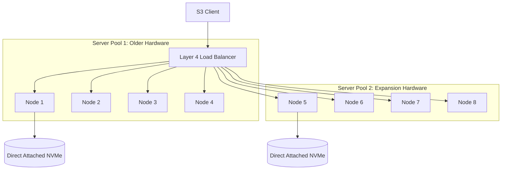
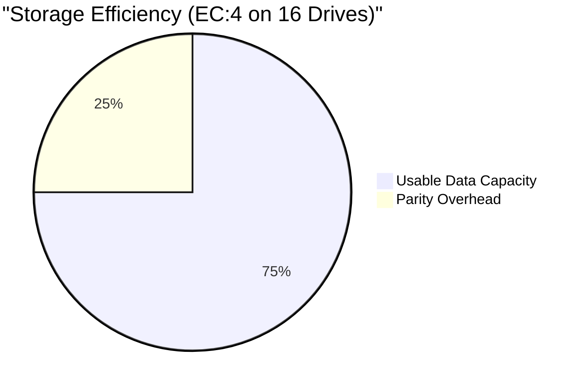
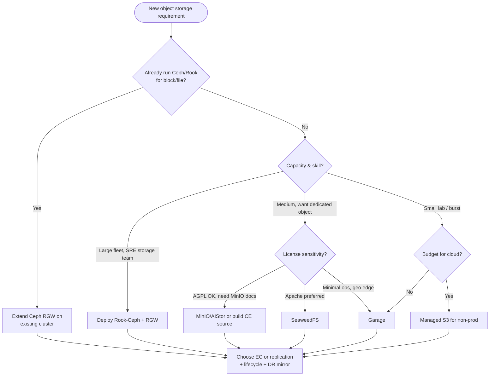

> **Complexity**: `[COMPLEX]`
>
> **Time to Complete**: 60 minutes
>
> **Prerequisites**: [Module 4.1: Storage Architecture Decisions](module-4.1-storage-architecture/), [Module 4.2: Software-Defined Storage with Ceph & Rook](module-4.2-ceph-rook/), [Module 4.3: Local Storage & Alternatives](module-4.3-local-storage/)

---

## What You'll Be Able to Do

1. **Architect** distributed object-storage topologies using Server Pools, erasure sets, and direct-attached JBOD on bare-metal Kubernetes.
2. **Configure** erasure coding profiles that balance usable capacity against drive and node failure tolerance for on-premises workloads.
3. **Implement** multi-tenant S3 access with IAM policies, bucket policies, and STS `AssumeRoleWithWebIdentity` for Kubernetes workloads.
4. **Compare** MinIO (distributed mode), Ceph RADOS Gateway, SeaweedFS, and Garage for self-hosted S3-compatible storage tradeoffs.
5. **Operate** capacity planning, healing, replication, lifecycle rules, and Prometheus monitoring for day-2 object storage on owned hardware.

---

## Why This Module Matters

Hypothetical scenario: a platform team standardizes PostgreSQL backups, CI artifact archives, and container-registry layer storage on a shared NFS filer because “we already own it.” During a quarterly release, three services spike write traffic simultaneously—database operators stream WAL segments, Harbor pushes multi-gigabyte image layers, and a data pipeline ingests millions of small JSON objects. Latency climbs, POSIX locks contend, and the filer returns `503 Slow Down` errors. Kubernetes pods restart, backup chains break, and registry pushes fail mid-upload. The outage is not a Kubernetes bug; it is a storage-class mismatch. Object workloads need a flat, key-addressed, HTTP API with horizontal scale—not a POSIX filesystem pretending to be a data lake.

On bare metal, S3-compatible object storage becomes the shared “bulk tier” for everything that is not a database block device or a shared filesystem mount. [Module 4.5: Database Operators](module-4.5-database-operators/) assumes an internal endpoint for WAL archiving and base backups. [Module 7.7: Self-Hosted Container Registry](module-7.7-self-hosted-registry/) assumes durable blob storage for image layers. Log pipelines, ML feature stores, and compliance archives all converge on the same pattern: PUT an opaque blob, GET it later by key, replicate it for durability, and expire it by policy. Cloud teams buy this as Amazon S3; on-premises teams must engineer it on racks they depreciate over three to five years.

The economic stakes differ from cloud object storage in subtle ways. Managed S3 charges per gigabyte-month, per request, and—most painfully—for egress. A steady 500 TiB archive with nightly cross-site replication can look cheaper on owned JBOD once utilization stays high, but only if you account for erasure-coding overhead, spare drives, power, and the engineer who pages when a pool enters healing state. Self-hosted object storage wins when capacity is large and predictable, egress is heavy, data must stay in-country, or air-gap requirements forbid a public API. Cloud object storage often wins when volume is small, spiky, or when operational headcount to run healing, upgrades, and certificate rotation exceeds storage savings.

Downstream modules assume you can articulate endpoint URLs, credential flows, and durability expectations for this tier before they deploy stateful services. Database operators will halt if WAL archives cannot reach the bucket you specify; registries will fail pushes if blob storage lacks quota headroom during a large CI event. Treat object storage as shared infrastructure with SLOs, not as a sidecar experiment.

Integration testing should include the exact SDKs your tenants use—Java AWS SDK v2, boto3, MinIO mc, restic, and Helm chart init containers—because S3 compatibility is a spectrum. Document maximum object size, multipart thresholds, and whether path-style versus virtual-host-style URLs are required behind your DNS layout. Publish those constraints in an internal service catalog entry alongside backup retention classes so application teams select the correct bucket prefix and lifecycle policy at design time rather than during a storage emergency.

Change management for object storage should mirror other tier-zero services: staged upgrades on a non-production Tenant, documented rollback via pinned container digests, and communication to database and registry owners before maintenance windows that restart gateways. A fifteen-minute RGW outage during poorly coordinated patching can cascade into failed backups and blocked deploys far outside the storage namespace, which is why object endpoints belong on the same change-advisory calendar as Kubernetes control plane upgrades in production environments.

> **The Warehouse Analogy**
>
> Block storage (RBD, EBS) is a single pallet you mount exclusively—one forklift at a time. File storage (CephFS, NFS) is a shared stockroom with aisles and locks—great for collaboration, fragile under concurrent writers. Object storage is a warehouse with infinite numbered bins: you drop a sealed box (object) into bin `s3://backups/postgres/2026-06-11/base.tar` and fetch it by that address later. No inode table on the client, no SCSI reservation, no directory lock—just HTTP verbs and cryptographic keys.

---

## The Object Model: Buckets, Keys, and the S3 API

Object storage organizes data differently from block or file systems, and that difference drives every downstream design choice on bare metal. A **bucket** is a top-level namespace container—think of it as a tenant-scoped prefix with its own policy, quota, and lifecycle rules. An **object** is an immutable blob of bytes plus metadata (content type, user-defined tags, checksum). A **key** is the unique identifier of that object within a bucket, often looking like a path (`logs/app/2026/06/11/part-00042.json`) even though the namespace is **flat**: there are no true directories, only key prefixes that list operations simulate.

The [Amazon S3 API](https://docs.aws.amazon.com/AmazonS3/latest/API/Welcome.html) became the de-facto standard because every backup tool (`restic`, `velero`), every database operator (CloudNativePG WAL archive), and every registry (Harbor, Distribution) already speaks it. On-premises gateways implement a large subset: `PutObject`, `GetObject`, multipart upload for large files, bucket policies, and server-side encryption headers. Compatibility gaps appear on edge features—bucket analytics, selective inventory exports, or exotic IAM condition keys—so always test your exact client SDK against the gateway you deploy.

**Why object—not block or file—for these workloads?** Backups and artifacts are write-once, read-rarely streams with huge sequential PUTs and occasional ranged GETs. They do not need POSIX rename semantics or `fsync` on every 4 KiB write. Data lakes store parquet and ORC files that analytics engines read in parallel via HTTP range requests. Media pipelines ingest multi-gigabyte mezzanine files where rewriting a whole file is cheaper than random I/O on a SAN LUN. Block storage would force you to size LUNs upfront; NFS would centralize metadata and locking; object storage spreads metadata across the cluster and scales out by adding pools or nodes.

**Versioning** [maintains historical copies of an object when it is overwritten or deleted](https://docs.aws.amazon.com/AmazonS3/latest/userguide/versioning-workflows.html), turning a logical “update” into a new version ID while preserving the prior bytes. **Object Lock (WORM)** [prevents modification or deletion for a retention period](https://docs.aws.amazon.com/AmazonS3/latest/userguide/object-lock.html) and requires versioning on the bucket. **Lifecycle rules** automate expiration and transition—critical on bare metal where NVMe is expensive and nobody notices a config file being overwritten 10,000 times until the disks are full.

Pause and predict: if two applications write to the same object key without versioning enabled, what happens to the first writer’s bytes? They are replaced atomically at the key—the second PUT wins, and the first payload is gone unless something else copied it. Versioning changes that story by retaining a non-current version chain you can expire with ILM.

Multipart upload matters for bare-metal networks because a single long-lived TCP connection across a 10 GbE link may still fail on a multi-hundred-gigabyte artifact when intermediate proxies time out. Clients split the payload into parts, upload each part independently, and commit an aggregate manifest at the end. Failed parts retry without restarting the entire transfer—a pattern registry layers and database base backups rely on when pushing multi-gigabyte tarballs across the cluster network. Always confirm your SDK enables multipart thresholds automatically; many default to single PUT until you configure them explicitly.

Strong checksums travel with the object. S3-compatible clients send `Content-MD5` or use SigV4 payload hashing; the gateway persists ETags clients use for conditional writes (`If-Match`) and for deduplication logic in backup tools. When you mirror buckets to a second site, ETag semantics become part of your conflict story: two writers racing on the same key with versioning disabled produce last-writer-wins behavior, while versioning preserves both with distinct version IDs you must garbage-collect deliberately.

---

## Architecture and Deployment Modes

On bare metal, providing S3-compatible object storage requires deploying a distributed storage system directly on top of physical drives. Historically, MinIO was the standard for this pattern due to its strict Amazon S3 API compatibility, high performance, and bare-metal-native design.

:::caution
**Industry Shift:** As of 2026-06, verify this paragraph before procurement decisions because MinIO packaging and subscription terms have changed quickly. The MinIO open-source community edition [repository was archived and made read-only](https://github.com/minio/minio) on April 25, 2026; the community edition is now a [source-only distribution](https://github.com/minio/minio/blob/master/README.md#source-only-distribution) that no longer provides new pre-compiled binary releases. Current AIStor packaging is not simply “build CE source or buy commercial”: MinIO announced AIStor Free for full-featured single-node standalone deployments, plus paid Enterprise Lite and Enterprise tiers for horizontally scalable multi-node deployments. For durable architecture guidance, separate the mechanics you learn here from the volatile edition and licensing decision.
:::

### The Open-Source Landscape

For modern, production-grade open-source deployments, platform teams evaluate several gateways that differ in license, operational surface, and S3 fidelity. [Rook](https://github.com/rook/rook/tree/v1.19.5/Documentation) orchestrates Ceph as a CNCF Graduated project and [currently supports Kubernetes v1.30 through v1.35 in release v1.19](https://raw.githubusercontent.com/rook/rook/v1.19.5/Documentation/Getting-Started/quickstart.md). The [Ceph Tentacle release (v20.2.1, April 2026)](https://raw.githubusercontent.com/ceph/ceph/main/doc/releases/tentacle.rst) strengthens RADOS Gateway with background bucket resharding, S3 `GetObjectAttributes`, and IAM API policies—features that matter when Harbor and backup operators send diverse S3 calls against the same endpoint you already run for RBD volumes in [Module 4.2](module-4.2-ceph-rook/).

[SeaweedFS](https://github.com/seaweedfs/seaweedfs) ships under Apache 2.0 and optimizes small-file retrieval with in-memory volume maps, which can reduce seek amplification compared with naive file-backed layouts when millions of tiny JSON objects arrive from telemetry pipelines. [Garage](https://garagehq.deuxfleurs.fr/) targets geo-distributed, modest-footprint clusters with a single static binary and AGPLv3 licensing—attractive when you need three small sites without standing up full MON/OSD hierarchies. [RustFS](https://github.com/rustfs/rustfs) advertises Apache-2.0 licensing and Rust implementation for teams avoiding AGPL obligations, though you should treat performance claims as hypotheses until your workload validates them.

Kubernetes [Container Object Storage Interface (COSI)](https://github.com/kubernetes-sigs/container-object-storage-interface) remains [pre-alpha at v1alpha2 as of 2026](https://github.com/kubernetes-sigs/container-object-storage-interface), meaning dynamic bucket provisioning through a standardized CSI-like API is not yet the default path. Until COSI matures, operators continue to deploy Tenants, RGW instances, or Helm releases declaratively, then expose endpoints and credentials to application namespaces through your existing secrets-management patterns.

Despite industry shifts away from MinIO community binaries, MinIO’s architectural primitives—Server Pools, direct-attached drives, and erasure sets—remain the clearest educational model for understanding distributed object storage mechanics. The following sections use MinIO as the reference architecture while noting where Ceph RGW, SeaweedFS, and Garage diverge.

Unlike managed cloud object storage, running distributed storage on bare metal shifts the responsibility of hardware topology, drive failure management, and network planning directly to the platform engineering team.

### Server Pools and Topology

Distributed object storage scales horizontally through **Server Pools**. A Server Pool is an independent set of nodes and drives that act as a single logical storage entity. When an object is written, the [system calculates a hash to determine which Server Pool receives the data](https://raw.githubusercontent.com/minio/minio/master/docs/distributed/README.md), and then distributes the object across the drives in that specific pool.

:::caution
**Production Gotcha:** You [cannot arbitrarily add single nodes or drives to an existing distributed deployment](https://github.com/minio/minio/discussions/19280). You expand capacity by provisioning a completely new Server Pool. The new Server Pool must meet the minimum requirements (typically 4 nodes) and ideally matches the drive geometry of the existing pools to maintain predictable performance.
:::


```mermaid
graph TD
    Client[S3 Client] --> LB[Layer 4 Load Balancer]
    
    subgraph Pool 1 [Server Pool 1: Older Hardware]
        LB --> N1[Node 1]
        LB --> N2[Node 2]
        LB --> N3[Node 3]
        LB --> N4[Node 4]
    end
    
    subgraph Pool 2 [Server Pool 2: Expansion Hardware]
        LB --> N5[Node 5]
        LB --> N6[Node 6]
        LB --> N7[Node 7]
        LB --> N8[Node 8]
    end

    N1 --> D1[(Direct Attached NVMe)]
    N5 --> D5[(Direct Attached NVMe)]
```

When you operate multiple pools on heterogeneous hardware—older 12 TB HDD shelves beside new NVMe nodes—the hash router sends **new** writes toward pools with more free space. Existing objects stay on their original pool until you explicitly migrate them. That behavior matters for TCO: you can defer a full data rebalance while still accepting new capacity, but you must monitor per-pool utilization so one pool does not silently fill while others sit idle.

Load balancing in front of Server Pools typically uses Layer-4 pass-through so SigV4 signatures remain valid. An enterprise ingress controller that terminates TLS and rewrites `Host` headers without forwarding `X-Forwarded-Host` will manifest as intermittent `SignatureDoesNotMatch` errors that correlate with which replica answered the connection, not with application bugs. Health checks should exercise authenticated HEAD requests against a dedicated health bucket rather than unauthenticated TCP probes alone, because a node can accept TCP while S3 subsystems are degraded during drive healing.

Direct-attached topology also influences rack design: spreading four drives per node across four nodes gives you node-level fault domains for erasure sets, whereas stacking sixteen drives on four nodes but using EC:2 would survive fewer simultaneous node losses. Document the intended failure domain in your data-center standard—future-you should not have to reverse-engineer intent from a Helm values file during a 3 a.m. page.

### Storage Layer: DirectPV vs. CSI

Performance in object storage is bottlenecked by the underlying storage subsystem. Bare-metal systems expect **JBOD (Just a Bunch of Disks)** without hardware RAID. Hardware RAID introduces controller bottlenecks and conflicts with software-level erasure coding.

For Kubernetes deployments, use **DirectPV** (a CSI driver built for local drives) or local PersistentVolumes. [DirectPV discovers, formats, and mounts local drives directly to Pods](https://github.com/minio/directpv), bypassing the network overhead of generic distributed block storage (like Portworx).

> **Pause and predict**: If you format the physical NVMe drives with `ext4` instead of `XFS` for a distributed object storage workload, what hidden bottleneck are you likely to hit as millions of small objects are ingested?

**Filesystem Requirements:** Always format drives as XFS. Distributed storage engines heavily optimize for XFS features (like concurrent allocation). Ext4 is supported but introduces severe inode bottlenecks under high object counts.

### Erasure Coding (EC) Parity and Quorum

Data is protected against drive and node failures using Erasure Coding. Unlike three-way replication—which stores three full copies of every object and consumes 200% overhead—EC splits each object into **data shards** and **parity shards** striped across drives and nodes. A read quorum needs any `D` shards; a write quorum typically needs a majority of `D + P` shards available. When a drive fails, the cluster **heals** by recomputing missing shards from survivors, much like RAID-6 at the object level but distributed across the fleet.

For example, CE/default MinIO erasure sets historically use 2 to 16 drives per set, while current AIStor documentation says that, as of 2026-06, AIStor Server `RELEASE.2026-02-02T23-40-11Z` or later can be configured up to 32 drives per erasure set with `MINIO_ERASURE_SET_DRIVE_COUNT`. Treat that 32-drive capability as volatile product documentation: verify it before standardizing hardware geometry. The configuration is expressed as `EC:N`, where `N` is the number of parity blocks per erasure set.

*   **Standard Parity (EC:4):** In a 16-drive set, an [object is split into 12 Data blocks and 4 Parity blocks](https://raw.githubusercontent.com/minio/minio/master/docs/erasure/storage-class/README.md). You can lose any 4 drives and still read and write data. Storage efficiency is 75% (12/16).
*   **High Parity (EC:8):** In a 16-drive set, an object is split into 8 Data and 8 Parity blocks. You can lose any 8 drives and still read the data (though you need $N/2 + 1$ drives to write). Storage efficiency is 50%.


```mermaid
pie title "Storage Efficiency (EC:4 on 16 Drives)"
    "Usable Data Capacity" : 75
    "Parity Overhead" : 25
```

Ceph RGW stores objects in RADOS pools that use their own erasure-code or replication policies at the placement-group layer—conceptually similar tradeoff, different implementation. SeaweedFS and Garage use replication factors tuned for geo-distribution rather than large EC sets inside each volume. None of these choices eliminates the physics: parity bits cost disk, CPU, and network during writes and healing.

:::tip
Always configure topologies so that a complete node failure does not violate the read/write quorum. If you have 4 nodes with 4 drives each (16 drives total) and use EC:4, a single node going offline removes 4 drives. The cluster remains fully operational. If you use EC:3 in the same setup, a node failure brings down the entire Server Pool because 4 drives are lost, exceeding the 3-drive parity budget.
:::

**Healing and rebalance** consume back-end bandwidth. After you replace a failed 18 TB drive, the cluster reads surviving shards from many peers and writes reconstructed data for hours or days. Schedule maintenance windows, throttle healing concurrency, and keep cluster networks separate from client-facing NICs—patterns you already practice with Ceph recovery in Module 4.2. Healing is not free on any platform: erasure-coded systems trade space for CPU during reconstruction, and replication-based systems trade space for simpler read paths but heavier WAN traffic during re-replication.

When you **configure erasure coding profiles**, treat parity as an insurance premium against simultaneous failures, not as a knob to maximize usable terabytes without analysis. EC:4 on sixteen drives tolerates any four shard losses—often interpreted as one full node in a four-by-four layout—while retaining seventy-five percent usable capacity. EC:8 halves usable space but survives eight shard losses, which matters in wide erasure sets spanning eight nodes where you fear double failures during a rack maintenance window. Write quorums can be stricter than read quorums: after extreme failures you may temporarily enter read-only mode until operators replace hardware, which is preferable to silently accepting writes that cannot be durably protected.

Read path latency grows with parity because clients or gateways may contact multiple drives to satisfy a GET unless caching and read routing optimize for local shards. Write path latency includes encoding work on the gateway node plus fan-out to many drives. Benchmark with the object sizes your tenants actually store—4 KiB telemetry events behave differently from 512 MiB backup chunks. Document the chosen profile in your runbook alongside expected rebuild times at observed rebuild bandwidth so on-call engineers know whether a twelve-hour heal is normal or indicates a misconfigured throttle.

---

## Bare-Metal Platform Options Compared

Choosing a self-hosted S3 gateway is not a beauty contest; it is a fit-for-purpose decision against staff skills, existing storage, and compliance constraints. Teams already operating Tentacle clusters for RBD volumes often extend RGW because backup and registry endpoints reuse MON quorum and monitoring investment. Teams without Ceph skills may prefer SeaweedFS or Garage when Apache licensing or minimal RAM footprints dominate the requirements document, accepting that some S3 APIs will return `501 Not Implemented` until you verify client compatibility.

When you **compare MinIO distributed mode, Ceph RGW, SeaweedFS, and Garage**, document test results rather than vendor adjectives: run the same `restic` backup, Harbor push, and CloudNativePG WAL archive against each candidate in a staging VLAN and record latency, CPU, and compatibility errors. MinIO’s archived community edition still teaches erasure-set mechanics clearly but may push you toward AIStor or source builds for supported binaries. Ceph RGW adds IAM richness and unified operations at the cost of daemon complexity. SeaweedFS optimizes certain small-file paths. Garage optimizes geo-replication on modest hardware. Your comparison matrix should include license obligations, minimum node counts, and whether your organization already employs storage SREs.

| Platform | Strengths on Bare Metal | Tradeoffs | Typical Fit |
|----------|-------------------------|-----------|-------------|
| **MinIO distributed** (archived CE / AIStor) | Strict S3 compatibility, mature K8s Operator, DirectPV integration, well-documented erasure sets | CE archived April 2026—source-only; as of 2026-06 AIStor Free is single-node standalone while paid AIStor tiers cover distributed deployments; verify licensing before production | Greenfield labs teaching EC mechanics; teams that can build CE images or choose an AIStor tier deliberately |
| **Ceph RGW + Rook** | Unified block/file/object on one cluster; enterprise IAM features in Tentacle; CNCF Graduated operator | Higher operational complexity; RGW latency vs dedicated object store; needs MON/OSD expertise | Shops already running Ceph for RBD/CephFS who want one storage team |
| **SeaweedFS** | Apache 2.0; efficient small-file access; simpler topology than Ceph | Different architecture (volume servers + masters); S3 compatibility subset | Media, image hosting, many small objects |
| **Garage** | Minimal RAM; geo-replication; single binary | Smaller S3 API surface; fewer enterprise compliance features (verify current docs) | Edge sites, home-lab multi-datacenter, modest capacity |

None of these rankings is universal. A hospital with an existing Tentacle cluster and a mandate to minimize new daemons will extend RGW. A greenfield factory with air-gapped CI may deploy Garage or SeaweedFS on three modest nodes. Document **your** decision matrix with measured compatibility tests from the actual backup and registry clients you run.

---

## Multi-Tenancy and Access Control

Operating a platform requires isolating workloads. Sharing root credentials across applications is an anti-pattern that leads to compromised data and auditing nightmares.

> **Stop and think**: Why is creating one massive, multi-tenant Tenant for an entire enterprise considered an operational anti-pattern compared to provisioning multiple smaller Tenants per business unit?

### Tenants and Isolation

Modern operators provision isolated instances called **Tenants**. Each Tenant operates its own Server Pools, its own IAM database, and its own endpoints. Use a single large Kubernetes cluster to host multiple isolated Tenants rather than creating one giant monolithic Tenant for the whole company.

### Identity: Access Keys, IAM Policies, and STS

S3 security on bare metal mirrors cloud IAM layering even when no AWS account exists. Long-lived access keys remain convenient for legacy batch jobs but violate least privilege when embedded in Helm values or ConfigMaps that sync to Git. Bucket policies express resource-centric rules—TLS-only access, prefix restrictions, denial of delete for audit prefixes—while IAM policies attach to users, groups, or roles inside the gateway identity store. Object ACLs still appear in compatibility shims but bucket-owner-enforced settings increasingly make bucket policies the authoritative control plane, matching AWS direction.

Applications on Kubernetes should prefer **STS temporary credentials** via [`AssumeRoleWithWebIdentity`](https://docs.aws.amazon.com/STS/latest/APIReference/API_AssumeRoleWithWebIdentity.html). The Pod mounts a [projected ServiceAccount token](https://kubernetes.io/docs/concepts/storage/projected-volumes); the application exchanges that JWT at the STS endpoint; the gateway validates issuer and audience against OIDC discovery; scoped keys return with session duration bounded by policy. Rotate by shortening session lifetime rather than editing Secrets cluster-wide. Map each namespace prefix to a role that can only `PutObject` under `s3://tenant-ns/` and cannot list unrelated buckets—containment that saved many teams when a compromised CI job attempted lateral movement across backup prefixes.

**Encryption** belongs in both planes: TLS on the wire between clients and ingress, and server-side encryption at rest on drives. Gateways implement SSE-S3 or KMS-integrated variants depending on edition; on bare metal you may integrate with Vault or a hardware security module for key custody. Combine encryption with **Object Lock** compliance mode when regulators require WORM semantics independent of filesystem permissions. Remember that encryption protects confidentiality, not accidental deletion—versioning plus ILM still matter for operational mistakes.

---

## Data Management

### Storage Thresholds

When designing applications against bare-metal object storage, understand the hard physical limits of the system. As of 2026-06, current AIStor threshold documentation lists a maximum non-multipart `PUT` object size of 5 TiB. If applications need to upload larger datasets, they must implement multipart uploads, which support up to 10,000 parts and a practical maximum object size of approximately 48 PiB. Verify these thresholds against the current gateway documentation before committing application-side upload limits.

### Versioning and Object Lock

**Versioning** [maintains historical copies of an object when it is overwritten or deleted](https://docs.aws.amazon.com/AmazonS3/latest/userguide/versioning-workflows.html). This protects against accidental application logic errors. 

**Object Lock (WORM - Write Once Read Many)** [prevents any modification or deletion of an object for a specified duration](https://docs.aws.amazon.com/AmazonS3/latest/userguide/object-lock.html), or indefinitely until a Legal Hold is removed. Object Lock requires Versioning to be enabled on the bucket.

### Lifecycle Management (ILM)

Bare-metal NVMe storage is expensive relative to archival HDD tiers, which makes lifecycle automation a capacity discipline rather than a convenience feature. ILM rules evaluate object age, prefix, tags, and current-version status on a schedule, then expire objects or transition them to colder pools you operate on spinning disks—or occasionally to public cloud tiers when compliance allows egress. **Expiration** deletes current or non-current versions after N days; **transition** moves bytes to a different storage class while preserving the key for applications that address objects by stable paths.

Without strict expiration on versioned buckets, an application that overwrites a one-megabyte JSON configuration ten thousand times per day can consume hundreds of gigabytes per month of physical space for logically “one file.” Platform teams should publish mandatory baseline policies— for example, delete non-current versions after seven days unless a ticketed exception exists—and enforce them with periodic audits comparing bucket inventory reports to tenant quotas. Transition rules help when you operate dual pools on one gateway: hot NVMe pools accept ingestion, nightly ILM moves objects older than thirty days to HDD pools with higher latency but lower dollars per terabyte.

---

## Day 2 Operations

Operating object storage on owned hardware means you own failure modes cloud vendors abstract away: SMART errors, NIC flaps, firmware bugs, and the quarterly question of whether to refresh drives or expand by another pool. Day-2 runbooks should name who replaces a failed drive, how long rebuild is allowed to run before escalating, and which dashboards prove client impact during healing.

### Capacity Planning and the Cost of Parity

Raw JBOD capacity is never usable capacity. With EC:4 on sixteen drives, plan for roughly seventy-five percent logical data before filesystem overhead. Add hot spares, metadata reservations, and an operational buffer—many teams target **≤70% steady utilization** before procurement opens a new pool requisition. Model growth from versioned buckets explicitly in spreadsheets shared with finance: show parity overhead, expected annual drive price decline, and power draw per shelf so CapEx committees compare apples-to-apples against a cloud storage quote that hides egress.

Forecast request rates separately from bytes. Small-object heavy workloads stress metadata and LIST operations; large sequential workloads stress network and disk bandwidth during healing. If [Module 7.7’s registry](module-7.7-self-hosted-registry/) and [Module 4.5’s database backups](module-4.5-database-operators/) share one cluster, simulate concurrent multipart uploads plus steady WAL PUT rates before signing the architecture diagram.

### Prometheus Metrics

Storage platforms expose metrics natively. Do not use legacy v1 metrics endpoints (like `/minio/prometheus/metrics`), which calculate bucket sizes dynamically and cause extreme CPU spikes and cluster timeouts in large deployments. 

Use the v2 cluster endpoints (e.g., `/minio/v2/metrics/cluster`). The v2 endpoint relies on internal background scanners to report bucket sizes, requiring virtually zero compute overhead during the scrape.

Alert on healing queue depth, drives offline count, pool utilization percentage, S3 5xx rate, replication lag seconds, and STS authentication failures. Tie alerts to runbook steps: a rising offline drive count with flat healing progress may indicate a stuck daemon or a network partition on the backend VLAN rather than a single bad disk.

### Active-Active Replication and DR

For multi-datacenter bare-metal deployments, site-to-site Active-Active replication is supported asynchronously in many gateways. Ensure clock synchronization (NTP/Chrony) across all bare-metal nodes is strictly enforced; object replication relies on timestamps to resolve conflicts, and clock drift exceeding one second can produce divergent metadata that is painful to reconcile without manual inspection.

The **backup-of-the-backup** question still applies: replication is not backup. A deleted bucket replicated to a second site deletes both copies unless versioning and Object Lock retain recoverable history. Mirror critical prefixes to an immutable target, or rely on application-level PITR that can rebuild state from versioned WAL archives even when a malicious actor issues `DeleteBucket`. Test restores quarterly—object storage outages discovered during a real ransomware event are expensive learning experiences.

---

## On-Premises Cost Lens

Object storage TCO on owned hardware combines **CapEx** (JBOD servers, drives, NICs, racks), **facility** costs (power, cooling, floor space amortized per kilowatt), **software and support** (commercial AIStor subscriptions or Ceph vendor contracts if you purchase them), and **OpEx labor** (drive swaps, healing watches, certificate rotation, upgrade testing, and pager compensation). Finance teams often see only the drive purchase order; platform engineering must attach parity overhead, spare-node requirements, and network upgrades to the same business case.

Self-hosting tends to win at **large steady utilization**, **heavy internal egress** to analytics and CI consumers, **data sovereignty** mandates, and **air-gap** environments where public APIs are unavailable. A factory running twenty-four-seven vision-model training that reads the same multi-petabyte corpus nightly may saturate a 100 GbE link cheaply inside the building while equivalent cloud egress pricing dominates the spreadsheet. Conversely, cloud object storage often wins for **spiky small buckets**, **teams without storage specialists**, and **early-stage workloads** where idle spindles and on-call rotation cost more than pay-as-you-go gigabytes.

Depreciation schedules matter for refresh planning: if you depreciate servers over thirty-six months but drives warrant for five years, your pool expansion math should show when adding a new pool on current-generation disks beats replacing entire nodes. Include electricity: dense HDD shelves draw continuous watts whether or not objects are accessed, while cloud bills implicitly bundle facility costs into the per-GB rate. Neither model is universally cheaper—your utilization curve and staffing model decide.

Hypothetical scenario for capacity planning: finance asks whether to renew a three-year cloud archive contract at two petabytes or buy two more JBOD shelves. You model cloud at roughly $0.023 per GB-month for storage plus estimated egress when analytics clusters re-read the corpus monthly, versus owned hardware at upfront drive cost, thirty percent EC overhead, six percent annual maintenance labor, and zero marginal egress inside the building. At eighty-five percent average utilization over twenty-four months, owned storage often crosses below cloud total cost; at forty percent utilization with a small team, cloud may remain cheaper even before counting on-call burden. Present both curves with explicit assumptions rather than a single headline number.

---

## Patterns & Anti-Patterns

| Pattern | When to Use | Why It Works | Scaling Note |
|---------|-------------|--------------|--------------|
| Dedicated object tier on JBOD + DirectPV | Backup targets, registry blobs, log archives | Avoids POSIX/NFS metadata storms; EC spreads I/O | Expand by adding Server Pools, not single drives |
| Per-team Tenants with STS | Multi-tenant Kubernetes platforms | Short-lived creds per ServiceAccount; blast-radius isolation | More endpoints to certificate-manage |
| ILM on versioned buckets | Config maps, ML checkpoints, audit logs | Prevents silent fill from churn | Test non-current version expiry in staging |
| Layer-4 load balancing to S3 API | High-throughput PUT/GET | Preserves SigV4 headers | Avoid header-mangling L7 proxies |
| Async geo-replication + WORM on compliance prefix | Finance/health retention | Survives site loss and admin mistakes | Monitor NTP and replication lag |

| Anti-Pattern | What Goes Wrong | Better Alternative |
|--------------|-----------------|-------------------|
| NFS/SAN backing for object gateway | Lock contention, 503 Slow Down, lost EC benefits | Direct-attached JBOD via DirectPV |
| One giant Tenant for all business units | Shared fate on upgrades and quota exhaustion | Multiple Tenants or namespaces with quotas |
| Long-lived root keys in Secrets | Credential sprawl; failed audits | STS `AssumeRoleWithWebIdentity` |
| Versioning without ILM | Disks full from tiny object churn | Mandatory non-current version expiration |
| Adding drives to existing pool geometry | Cluster ignore or inconsistent state | New Server Pool with matched erasure layout |
| Scraping legacy v1 metrics | CPU spikes every scrape interval | v2 cluster metrics with background scanner |

---

## Decision Framework

Use this flow when selecting and sizing bare-metal object storage. The goal is not to pick a logo but to match failure tolerance, staffing, and economic assumptions to a gateway you can operate for years without surprise license or binary-supply changes.


```mermaid
flowchart TD
    Start([New object storage requirement]) --> Q1{Already run Ceph/Rook<br/>for block/file?}
    Q1 -->|Yes| RGW[Extend Ceph RGW on<br/>existing cluster]
    Q1 -->|No| Q2{Capacity & skill?}
    Q2 -->|Large fleet, SRE storage team| Ceph[Deploy Rook-Ceph + RGW]
    Q2 -->|Medium, want dedicated object| Q3{License sensitivity?}
    Q3 -->|AGPL OK, need MinIO docs| MinIO[MinIO/AIStor or build CE source]
    Q3 -->|Apache preferred| SW[SeaweedFS]
    Q3 -->|Minimal ops, geo edge| G[Garage]
    Q2 -->|Small lab / burst| Q4{Budget for cloud?}
    Q4 -->|Yes| Cloud[Managed S3 for non-prod]
    Q4 -->|No| G
    RGW --> EC[Choose EC or replication<br/>+ lifecycle + DR mirror]
    Ceph --> EC
    MinIO --> EC
    SW --> EC
    G --> EC
    Cloud --> EC
```

| Decision | Choose | When | Avoid When |
|----------|--------|------|------------|
| Storage backend | Ceph RGW | Unified SDS already operational | You only need object and fear Ceph ops |
| Storage backend | MinIO distributed | Need reference EC model + Operator | Cannot build/maintain images post-CE archive |
| Storage backend | SeaweedFS / Garage | Lightweight, license-friendly | You require full AWS S3 feature parity |
| Durability mode | EC:4 on 16 drives | Balance capacity and 4-drive fault tolerance | Nodes have uneven drive counts |
| Durability mode | EC:8 | Maximum drive fault tolerance | Usable capacity below 50% is unacceptable |
| Access pattern | STS web identity | Kubernetes-native apps | Legacy apps that cannot OIDC |
| DR | Async replication + locked bucket | RPO in minutes acceptable | You need point-in-time without versioning |
| Monitoring | Prometheus v2 metrics | Production scale | Legacy v1 endpoints still configured |

---

## Did You Know?

- **S3’s flat namespace** means “folders” in the console are purely prefix conventions—listing `logs/2026/` scans keys lexicographically, which is why hot partitions from poorly chosen key prefixes can create hotspots on some gateways.

- **[Ceph Tentacle RGW added first-class IAM API policy support](https://raw.githubusercontent.com/ceph/ceph/main/doc/releases/tentacle.rst)**, narrowing the gap with AWS for enterprises that already run RADOS Gateway on the same cluster as RBD volumes.

- **Erasure coding at the object layer** typically uses Reed-Solomon-style math: you can reconstruct missing shards from any sufficient subset, which is why read quorums differ from write quorums under partial failures.

- **[Garage targets geo-distributed deployments on consumer hardware](https://garagehq.deuxfleurs.fr/)** with a single dependency-free binary—useful when your “datacenter” spans two office closets linked by VPN rather than a single raised floor.

---

## Common Mistakes

| Mistake | Problem | Solution |
|---------|---------|----------|
| NFS backing store for object gateway | Latency spikes, locking conflicts, 503 errors | JBOD + DirectPV or local PV only |
| Asymmetric pool expansion (two drives on one node) | Ignored capacity or inconsistent cluster state | Add a full new Server Pool with matched geometry |
| Layer 7 proxy mangling SigV4 headers | `SignatureDoesNotMatch` 403 for all clients | TCP pass-through or preserve `Host` / `X-Amz-*` headers |
| Versioning without ILM expiration | Physical disks fill from tiny object churn | Non-current version expiry (e.g., 7 days) |
| Shared root credentials across apps | Audit failure and credential leak blast radius | STS with scoped IAM policies per ServiceAccount |
| Scraping v1 Prometheus metrics | Periodic CPU/disk storms on storage nodes | `/minio/v2/metrics/cluster` or gateway equivalent |
| Ignoring EC overhead in procurement | Run out of usable TiB at 90% “raw” capacity | Plan at 70–75% usable after parity and buffer |
| Geo-replication without NTP discipline | Silent conflict resolution errors | Chrony on all nodes; alert on clock skew |

---

## Quiz

### Question 1

You administer a bare-metal MinIO Server Pool: 4 nodes × 4 NVMe drives (16 total). When you **configure erasure coding** to EC:4, how many simultaneous drive failures can the pool tolerate while applications still read objects?

<details>
<summary>Answer</summary>

EC:4 on sixteen drives stripes each object into twelve data and four parity shards. Losing four drives—one entire node—still leaves twelve surviving shards, which meets the read quorum. Writes may also continue if the write quorum threshold is satisfied. This is why parity level must be matched to **worst-case node loss**, not just single-drive MTBF, when balancing usable capacity against fault tolerance.
</details>

### Question 2

Procurement delivers four new bare-metal servers identical to your existing pool, but the cluster is at 88% utilization. What is the supported expansion path?

<details>
<summary>Answer</summary>

Provision the four servers as a **new Server Pool** and append it to the Tenant or distributed command line. Existing pools keep their deterministic hash layout; new objects route toward pools with more free space. You cannot change `servers: 4` to `servers: 8` on the original pool without re-initialization. Plan DNS/load-balancer health checks for the enlarged endpoint set.
</details>

### Question 3

A regulator requires seven-year immutable audit logs that even root cannot delete early. Which features do you enable?

<details>
<summary>Answer</summary>

Enable **bucket versioning**, then **Object Lock in Compliance Mode** with a seven-year default retention period. Compliance mode prevents administrators—including root—from shortening retention. Governance mode would **not** satisfy the mandate because privileged users could override retention. Pair with bucket policies denying delete actions except from automated writers.
</details>

### Question 4

Microservices currently store static S3 access keys in Kubernetes Secrets. Security mandates rotation and scoped access per namespace. What mechanism replaces the keys?

<details>
<summary>Answer</summary>

Implement **STS `AssumeRoleWithWebIdentity`**: Pods present projected ServiceAccount JWTs to the gateway STS endpoint, receive short-lived session credentials, and assume IAM roles scoped to their namespace prefix. No long-lived secrets are mounted; rotation becomes automatic with token lifetime. Verify OIDC discovery URL and audience claims match gateway configuration.
</details>

### Question 5

After migrating Prometheus scraping to your object store, storage nodes show CPU spikes every thirty seconds and scrapes time out. Which **day-2 operations** change fixes the root cause?

<details>
<summary>Answer</summary>

Prometheus is likely scraping a **legacy v1 metrics endpoint** that computes bucket statistics synchronously on each request. On large buckets this walks metadata and melts CPU during **capacity planning** windows when operators also run LIST-heavy inventory jobs. Switch to **v2 cluster metrics** that read pre-scanned statistics from background jobs, then tune scrape interval. This restores headroom for healing and replication traffic without masking underlying disk failures.
</details>

### Question 6

Your team must **compare MinIO, Ceph RGW, SeaweedFS, and Garage** for Harbor registry blobs and PostgreSQL WAL archives. Which evaluation approach is most defensible on bare metal?

<details>
<summary>Answer</summary>

Run identical client workloads—multipart registry pushes, continuous WAL PUTs, and restore LIST operations—against each gateway in a staging VLAN and record latency, error codes, and CPU/disk utilization. If Ceph already operates production RBD with trained staff, RGW leverages existing monitoring and **healing** playbooks. If licensing or binary supply favors Apache-2.0 stacks, SeaweedFS or Garage may win despite smaller S3 surface areas. Document minimum node counts, erasure or replication overhead, and license obligations beside raw throughput numbers.
</details>

### Question 7

An application uploads a 6 TiB VM image. The MinIO-compatible gateway rejects a single PUT. What S3 mechanism should the client use?

<details>
<summary>Answer</summary>

Use **multipart upload**: split the object into parts, upload parts in parallel, then complete the multipart session with an aggregated ETag. Current AIStor threshold documentation lists a 5 TiB maximum object size for a non-multipart `PUT`, so a 6 TiB object must use multipart. Verify your client SDK defaults to multipart for large files and that your gateway's current limits match the documentation you design against.
</details>

### Question 8

Hypothetical scenario: async replication shows lag under five minutes, but objects deleted in site A disappear from site B weeks later. Is replication broken?

<details>
<summary>Answer</summary>

Not necessarily—**replication propagates deletes** unless you use versioning with delete markers and bucket policies that retain non-current versions. Replication is not backup; it mirrors mutations including deletion. For ransomware resilience, combine versioning, Object Lock on a prefix, and a **second immutable copy** (tape, WORM bucket, or offline vault) outside the replication path.
</details>

---

## Hands-On Exercise: MinIO Operator Lab

In this exercise, you deploy the MinIO Operator, provision a single-node multi-drive Tenant that simulates erasure coding on a local cluster, configure the S3 CLI, enable versioning, apply a quota, and validate that erasure coding reconstructs data after simulated shard loss.

:::note
**Lab Environment Constraint:** Because the MinIO community edition is now a [source-only distribution](https://github.com/minio/minio/blob/master/README.md#source-only-distribution) with no new pre-compiled binary releases, this lab pins an official `quay.io/minio/minio:RELEASE.2025-04-08T15-41-24Z` image and uses the Operator chart's default `quay.io/minio/operator:v7.1.1` image. In a modern production environment, you would either build the archived community source code internally, choose an appropriate AIStor tier, or deploy a CNCF alternative like Rook/Ceph.
:::

**Success Criteria:**

- [ ] MinIO Operator pod reaches `Running` in `minio-operator` namespace with one replica
- [ ] Tenant `dojo-storage` shows `2/2` ready with four backing volumes
- [ ] `mc` can create bucket `app-data`, enable versioning, and set 1 GiB quota
- [ ] After simulated drive data loss inside the pod, `mc cat` still returns the test object

### Prerequisites

You need a running Kubernetes cluster at v1.35 or later with a default StorageClass (single-node kind or k3s works for this lab), the kubectl and helm CLIs installed locally, and the MinIO Client (`mc`) binary available on your workstation for S3 operations against the port-forwarded endpoint. The lab deliberately installs a one-replica Operator because the current chart defaults under `operator.replicaCount` to two replicas with required pod anti-affinity, which can leave a single-node cluster pending.

### Step 1: Install the Operator

Add the official MinIO Operator Helm repository, update local chart indexes, and install the release into a dedicated `minio-operator` namespace with the wait flag so the command returns only after pods become ready. The `operator.replicaCount=1` and `operator.affinity=null` overrides make the chart schedule on a single-node training cluster; production deployments should use multiple worker nodes and the chart's default anti-affinity. After installation completes, list pods in that namespace and confirm one operator pod reports `Running` with `1/1` ready within about a minute, which indicates the controller can reconcile Tenant custom resources.

```bash
helm repo add minio https://operator.min.io/
helm repo update

helm install minio-operator minio/operator \
  --namespace minio-operator \
  --create-namespace \
  --set operator.replicaCount=1 \
  --set operator.affinity=null \
  --wait

kubectl get pods -n minio-operator
```

### Step 2: Provision a Tenant

Create a manifest named `tenant.yaml` that declares a Tenant with one server and four volumes per server so erasure coding can form a set even on a single kind or k3s node. This is raw `Tenant` CRD YAML, not the tenant Helm chart values shape: the pool needs `name: pool-0` and `volumeClaimTemplate`, and omitting `storageClassName` lets Kubernetes use the cluster's default StorageClass. Apply the manifest into a new `minio-tenant` namespace, then watch pods until the StatefulSet member reports `2/2` ready, which indicates both the MinIO container and the sidecar are healthy.

```yaml
apiVersion: minio.min.io/v2
kind: Tenant
metadata:
  name: dojo-storage
  namespace: minio-tenant
spec:
  image: quay.io/minio/minio:RELEASE.2025-04-08T15-41-24Z
  pools:
    - name: pool-0
      servers: 1
      volumesPerServer: 4
      volumeClaimTemplate:
        metadata:
          name: data
        spec:
          accessModes:
            - ReadWriteOnce
          resources:
            requests:
              storage: 4Gi
  requestAutoCert: false
```

```bash
kubectl create namespace minio-tenant
kubectl apply -f tenant.yaml
kubectl get pods -n minio-tenant -w
```

### Step 3: Retrieve Credentials and Configure CLI

The operator generates root credentials in a Secret named after your Tenant configuration. Extract `MINIO_ROOT_USER` and `MINIO_ROOT_PASSWORD` from the encoded environment blob, start a background port-forward from the Tenant Service port 80 to local port 9000, and configure an `mc` alias pointing at `http://localhost:9000` with those credentials so subsequent bucket operations use the S3 API path you will expose to applications.

```bash
ROOT_USER=$(kubectl get secret dojo-storage-env-configuration -n minio-tenant -o jsonpath='{.data.config\.env}' | base64 -d | grep MINIO_ROOT_USER | cut -d '=' -f2)
ROOT_PASS=$(kubectl get secret dojo-storage-env-configuration -n minio-tenant -o jsonpath='{.data.config\.env}' | base64 -d | grep MINIO_ROOT_PASSWORD | cut -d '=' -f2)
echo "User: $ROOT_USER | Pass: $ROOT_PASS"
kubectl port-forward svc/minio -n minio-tenant 9000:80 &
mc alias set myminio http://localhost:9000 $ROOT_USER $ROOT_PASS
```

### Step 4: Configure Bucket, Quota, and Versioning

Create bucket `app-data`, enable versioning so overwrites retain history, and apply a one-gigabyte hard quota to simulate tenant guardrails platform teams use to prevent a single namespace from exhausting shared pools. List buckets and print quota info to verify the limit registered server-side before you upload test payloads that exercise erasure striping across the four PVC-backed paths.

```bash
mc mb myminio/app-data
mc version enable myminio/app-data
mc admin bucket quota myminio/app-data --hard 1gb
mc ls myminio/
mc admin bucket quota myminio/app-data
```

### Step 5: Test Erasure Coding Resilience (Simulated Failure)

Upload a small test object, delete one shard’s on-disk directory inside the MinIO pod to simulate localized corruption, and read the object back through `mc cat`. A successful read proves the gateway reconstructed missing data from parity shards—behavior you should expect in production when SMART reports a failing NVMe but applications continue serving GET requests during healing.

```bash
echo "Important production data" > test.txt
mc cp test.txt myminio/app-data/
kubectl exec -n minio-tenant dojo-storage-pool-0-0 -c minio -- rm -rf /export/0/app-data
mc cat myminio/app-data/test.txt
```

### Troubleshooting the Lab

If Tenant pods remain Pending, verify your cluster exposes a default StorageClass with enough allocatable capacity—kind clusters often require `local-path-provisioner`. If `mc` reports connection refused, confirm the port-forward process is still running in the background and that no local process already binds port 9000.

---

## Next Module

Continue to [Module 4.5: Database Operators](module-4.5-database-operators/) to learn how PostgreSQL, Redis, and other data services consume the S3-compatible endpoints you provisioned here for backups and disaster recovery.

---

## Sources

- [github.com/minio/minio](https://github.com/minio/minio) — Community edition archive status, AGPLv3 license, and source-only distribution policy.
- [min.io blog: Introducing New Subscription Tiers for MinIO AIStor](https://www.min.io/blog/introducing-new-subscription-tiers-for-minio-aistor-free-enterprise-lite-and-enterprise) — AIStor Free, Enterprise Lite, and Enterprise tier snapshot; verify before procurement because it is volatile product packaging.
- [raw.githubusercontent.com/minio/minio/master/docs/distributed/README.md](https://raw.githubusercontent.com/minio/minio/master/docs/distributed/README.md) — Server Pools, deterministic hashing, and free-space routing for new objects.
- [github.com/minio/minio/discussions/19280](https://github.com/minio/minio/discussions/19280) — Why single-drive additions to an existing pool are unsupported.
- [raw.githubusercontent.com/minio/minio/master/docs/erasure/README.md](https://raw.githubusercontent.com/minio/minio/master/docs/erasure/README.md) — Erasure set sizing (2–16 drives) and shard layout.
- [docs.min.io: AIStor Erasure Coding](https://docs.min.io/aistor/operations/core-concepts/erasure-coding/) — Current AIStor erasure-set defaults and configurable 32-drive limit for newer releases.
- [raw.githubusercontent.com/minio/minio/master/docs/erasure/storage-class/README.md](https://raw.githubusercontent.com/minio/minio/master/docs/erasure/storage-class/README.md) — EC:4 and EC:8 data/parity ratios on sixteen-drive sets.
- [docs.min.io: AIStor Thresholds and Limits](https://docs.min.io/aistor/reference/aistor-server/thresholds/) — Current non-multipart PUT and multipart upload limits.
- [raw.githubusercontent.com/minio/operator/master/helm/operator/values.yaml](https://raw.githubusercontent.com/minio/operator/master/helm/operator/values.yaml) — Operator chart default replica count, anti-affinity, and official image repository.
- [raw.githubusercontent.com/minio/operator/master/docs/tenant_crd.adoc](https://raw.githubusercontent.com/minio/operator/master/docs/tenant_crd.adoc) — Raw Tenant CRD `pools[].volumeClaimTemplate` requirement.
- [raw.githubusercontent.com/minio/operator/master/examples/kustomization/tenant-tiny/tenant.yaml](https://raw.githubusercontent.com/minio/operator/master/examples/kustomization/tenant-tiny/tenant.yaml) — Minimal single-server Tenant example with `name: pool-0` and `volumeClaimTemplate`.
- [docs.min.io: AIStor Bucket Quotas](https://docs.min.io/aistor/administration/bucket-quotas/) — Current `mc admin bucket quota` commands and best-effort enforcement warning.
- [github.com/minio/directpv](https://github.com/minio/directpv) — DirectPV CSI driver for local JBOD on Kubernetes.
- [github.com/rook/rook/tree/v1.19.5/Documentation](https://github.com/rook/rook/tree/v1.19.5/Documentation) — Rook as CNCF Graduated Ceph orchestrator.
- [raw.githubusercontent.com/rook/rook/v1.19.5/Documentation/Getting-Started/quickstart.md](https://raw.githubusercontent.com/rook/rook/v1.19.5/Documentation/Getting-Started/quickstart.md) — Rook v1.19 Kubernetes v1.30–v1.35 support matrix.
- [raw.githubusercontent.com/ceph/ceph/main/doc/releases/tentacle.rst](https://raw.githubusercontent.com/ceph/ceph/main/doc/releases/tentacle.rst) — Ceph Tentacle v20.2.1 RGW feature notes.
- [docs.ceph.com: RADOS Gateway](https://docs.ceph.com/en/latest/radosgw/) — Ceph RGW S3-compatible object gateway documentation.
- [github.com/ceph/ceph](https://github.com/ceph/ceph) — Unified object, block, and file storage platform.
- [github.com/seaweedfs/seaweedfs](https://github.com/seaweedfs/seaweedfs) — Apache-2.0 SeaweedFS design and releases.
- [garagehq.deuxfleurs.fr](https://garagehq.deuxfleurs.fr/) — Garage lightweight geo-distributed object store.
- [github.com/kubernetes-sigs/container-object-storage-interface](https://github.com/kubernetes-sigs/container-object-storage-interface) — COSI pre-alpha v1alpha2 status.
- [kubernetes.io: projected volumes](https://kubernetes.io/docs/concepts/storage/projected-volumes) — ServiceAccount token projection for Pods.
- [docs.aws.amazon.com: AssumeRoleWithWebIdentity](https://docs.aws.amazon.com/STS/latest/APIReference/API_AssumeRoleWithWebIdentity.html) — STS web identity credential flow used by S3-compatible STS endpoints.
- [docs.aws.amazon.com: S3 versioning](https://docs.aws.amazon.com/AmazonS3/latest/userguide/versioning-workflows.html) — Versioning semantics for overwrite and delete.
- [docs.aws.amazon.com: S3 Object Lock](https://docs.aws.amazon.com/AmazonS3/latest/userguide/object-lock.html) — WORM retention and compliance mode behavior.
- [docs.aws.amazon.com: S3 lifecycle](https://docs.aws.amazon.com/AmazonS3/latest/userguide/intro-lifecycle-rules.html) — Expiration and transition actions.
- [docs.aws.amazon.com: SigV4 authentication](https://docs.aws.amazon.com/AmazonS3/latest/API/sig-v4-authenticating-requests.html) — Request signing requirements behind load balancers.
