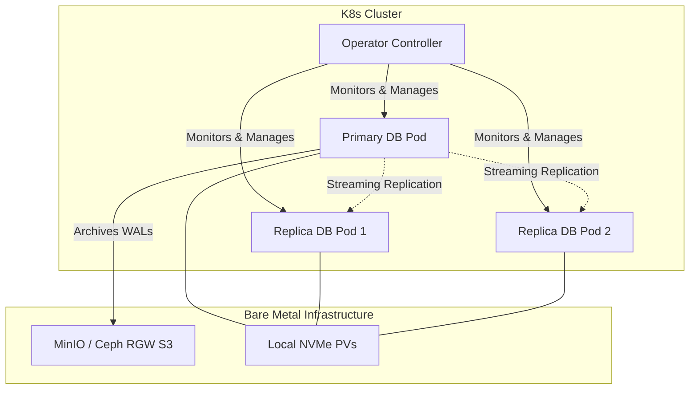
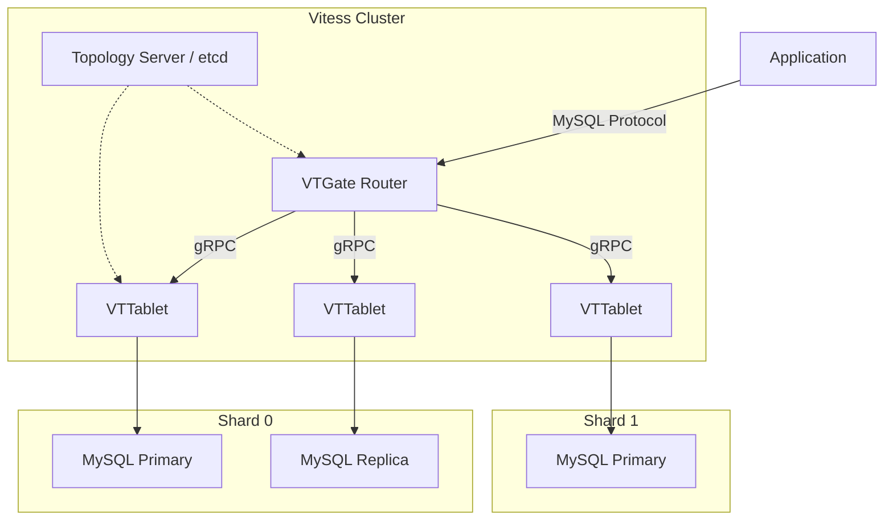

# Database Operators

Operating stateful databases on bare-metal Kubernetes requires replacing cloud-provider managed services (like RDS or ElastiCache) with in-cluster orchestration. Standard `StatefulSet` primitives handle identity and stable storage, but lack application-specific knowledge required for safe failover, replication scaling, Point-in-Time Recovery (PITR), and zero-downtime upgrades. 

Database operators encode DBA operational routines into custom controllers. Following the standard Kubernetes Operator pattern, they combine a Custom Resource Definition (CRD) with a custom controller that implements a continuous reconciliation loop, constantly driving the observed state of the database cluster toward the desired state.

## The Bare-Metal Database Architecture

On managed cloud providers, database operators often rely on underlying infrastructure APIs (e.g., EBS snapshots) for backups. On bare metal, you must provide the complete stack:

1. **Fast Local Storage:** Databases require low latency. You must use Local Persistent Volumes (via TopoLVM, OpenEBS LocalPV) or highly optimized network block storage (Ceph RBD).
2. **Object Storage:** For continuous backup and PITR, operators stream Write-Ahead Logs (WALs) and base backups to an S3-compatible endpoint. On bare metal, this is typically an internal MinIO cluster or Ceph RadosGW.
3. **Fencing Mechanisms:** To prevent split-brain scenarios during network partitions, operators must reliably "fence" (isolate or kill) the old primary before promoting a replica.

> **Stop and think**: If a bare-metal node fails entirely, how does the operator know whether it's a temporary network partition or a permanent hardware failure? Without cloud APIs to query, operators rely heavily on distributed Kubernetes API leases and robust fencing mechanisms to safely isolate the node before promoting a replica.



## PostgreSQL: CloudNativePG (CNPG)

CloudNativePG (a CNCF Sandbox project accepted in January 2025) is the current standard for running PostgreSQL on Kubernetes. The latest 1.29 series supports PostgreSQL versions 14 through 18, utilizing PostgreSQL 18.3 in its default container image. Unlike older operators that wrap external high-availability tools (like Patroni or Stolon), CNPG interacts directly with the Kubernetes API server for leader election and state management.

### Architecture and Replication

CNPG deploys instances as a single `Cluster` Custom Resource. It uses Kubernetes endpoints and leases for leader election. 

* **Primary:** Receives read/write traffic.
* **Replicas:** Maintain state via asynchronous or synchronous streaming replication.
* **Services:** The operator automatically generates three services:
  * `<cluster>-rw`: Routes exclusively to the Primary.
  * `<cluster>-ro`: Routes to Replicas for read scaling.
  * `<cluster>-r`: Routes to any available node (rarely used).

### Connection Pooling (pgBouncer)

> **Pause and predict**: What happens if an autoscaling microservice suddenly creates 500 new connections directly to the PostgreSQL primary pod? Because PostgreSQL forks an OS process for every connection, the node will likely exhaust its memory and trigger an OOMKill before the queries even execute.

In Kubernetes, hundreds of microservice pods continuously connecting and disconnecting will exhaust PostgreSQL's connection limits and crash the node due to OOM (Out of Memory). CNPG integrates pgBouncer natively via the `Pooler` CRD. It maintains a persistent connection pool to the database while multiplexing incoming client connections.

### Storage and WAL Archiving

A production CNPG cluster **must** have an S3-compatible backup destination configured. Without it, PostgreSQL will retain WAL files locally until they are successfully archived. If the archiver fails (e.g., MinIO is down), the local persistent volume will fill up with WAL files, causing the primary database to crash and refuse to restart.

:::caution
Always set separate volume claims for data (`/var/lib/postgresql/data`) and WALs (`/var/lib/postgresql/data/pg_wal`). If the WAL volume fills up, the database halts, but the data volume remains uncorrupted, simplifying recovery.
:::

:::warning
In CloudNativePG 1.29, the native Barman Cloud support for backup orchestration received a deprecation notice, with full removal planned for version 1.30.0. Future deployments will migrate to alternative backup implementations, but the `barmanObjectStore` configuration remains functional for current 1.29 deployments.
:::

## MySQL at Scale: Vitess

When a single MySQL primary cannot handle the write throughput or dataset size, vertical scaling on bare metal eventually hits a hardware ceiling. Vitess (a CNCF Graduated project) is a database clustering system for horizontal scaling of MySQL, originally built at YouTube. As of the v23.0 stable release series (GA in November 2025), Vitess sets MySQL 8.4 as the default engine to future-proof deployments.

### Vitess Topology

Vitess hides the complexity of database sharding from the application. The application connects to Vitess as if it were a standard single-node MySQL database.



* **VTGate:** A stateless proxy that parses SQL queries, reads the VSchema (Vitess Schema), and routes the query to the correct underlying shard.
* **VTTablet:** A sidecar process deployed alongside every `mysqld` process. It intercepts queries, implements connection pooling, and protects MySQL from bad queries (e.g., queries returning too many rows).
* **Topology Server:** A highly available datastore (typically etcd) that stores cluster metadata, routing rules, and shard configurations.

:::note
Vitess does not support 100% of standard MySQL syntax. Cross-shard joins are heavily restricted or perform poorly. Applications migrating to Vitess must be audited for compatibility with distributed SQL limitations.
:::

## In-Memory Datastores: Redis, Valkey, and Memcached

In-memory data grids are essential for caching, session management, and rate limiting.

### The Shift to Valkey

Following Redis Ltd's transition to the Server Side Public License (SSPL), the Linux Foundation forked the project into **Valkey**. For new bare-metal deployments, Valkey operators (or community Redis operators migrating to Valkey) are the standard to avoid restrictive licensing issues in enterprise environments.

### Deployment Topologies

| Datastore | Architecture | K8s Operator / Pattern | Best For |
| :--- | :--- | :--- | :--- |
| **Memcached** | Shared-nothing, consistent hashing handled by client. | Deployment + Headless Service. Operator rarely needed. | Simple, transient key/value caching. High throughput, low complexity. |
| **Valkey / Redis (Sentinel)** | Primary-Replica with Sentinel nodes for election. | KubeDB, Spotahome Redis Operator. | General caching, pub/sub, single-threaded high performance. |
| **Valkey / Redis (Cluster)** | Sharded architecture. Multiple Primaries. | KubeDB, OT-Container-Kit Redis Operator. | Datasets exceeding the memory capacity of a single bare-metal node. |

## The Broader Operator Ecosystem

While CloudNativePG and Vitess are standard for relational workloads, the Kubernetes ecosystem provides specialized operators for almost every datastore:

* **MongoDB**: The MongoDB Community Operator has reached end-of-life. The unified successor is MongoDB Controllers for Kubernetes (MCK), with v1.7.0 being the latest stable release.
* **Kafka**: Strimzi (a CNCF Incubating project) is the standard for Apache Kafka on Kubernetes. The 0.51.0 release targets Kubernetes 1.30+ and supports Kafka 4.2.0.
* **Percona**: Offers robust operators for MySQL (based on Percona XtraDB Cluster 8.4) and PostgreSQL.
* **Multi-Database Operators**: Projects like KubeDB (which provides tooling for migrating from CNPG/Zalando to its ecosystem) and KubeBlocks (an open-source AGPL-3.0 operator) aim to manage multiple distinct database engines under a single unified API.

Additionally, when managing these extensions across large fleets, cluster administrators typically use the Operator Lifecycle Manager (OLM). Note that OLM v0 is currently in maintenance mode, with OLM v1 (operator-controller) serving as the active successor, though automated migration paths are still evolving.

## Hands-on Lab

This lab deploys a highly available PostgreSQL cluster using CloudNativePG, configures an internal MinIO instance as the S3 backup target for WAL archiving, and validates failover.

### Prerequisites
* A running K8s cluster (e.g., `kind` with 3 worker nodes, running v1.35+).
* `kubectl` and `helm` installed.
* Default StorageClass configured (standard `kind` provisioner is sufficient for this lab).

### Step 1: Install CloudNativePG Operator

Deploy the CNPG controller using the official manifests.

```bash
kubectl apply --server-side -f \
  https://raw.githubusercontent.com/cloudnative-pg/cloudnative-pg/release-1.29/releases/cnpg-1.29.0.yaml

# Verify the controller is running
kubectl get pods -n cnpg-system
```

### Step 2: Deploy an Internal MinIO for Backups

On bare metal, you need local object storage. We will deploy a minimal MinIO instance.

```bash
helm repo add bitnami https://charts.bitnami.com/bitnami
helm install minio bitnami/minio \
  --set auth.rootUser=admin \
  --set auth.rootPassword=supersecret \
  --set defaultBuckets="cnpg-backups" \
  --namespace minio-system --create-namespace
```

Wait for MinIO to become ready:

```bash
kubectl rollout status deployment/minio -n minio-system
```

### Step 3: Configure Backup Credentials

Create a K8s Secret in the default namespace holding the MinIO credentials so CNPG can authenticate.

```bash
kubectl create secret generic minio-creds \
  --from-literal=ACCESS_KEY_ID=admin \
  --from-literal=ACCESS_SECRET_KEY=supersecret
```

### Step 4: Deploy the PostgreSQL Cluster

Apply the following manifest. It provisions a 3-node PostgreSQL cluster and configures continuous WAL archiving to MinIO.

```yaml
# pg-cluster.yaml
apiVersion: postgresql.cnpg.io/v1
kind: Cluster
metadata:
  name: dojo-db
spec:
  instances: 3
  
  # Anti-affinity ensures pods run on different bare-metal nodes
  affinity:
    enablePodAntiAffinity: true
    topologyKey: kubernetes.io/hostname

  storage:
    size: 1Gi

  backup:
    barmanObjectStore:
      destinationPath: s3://cnpg-backups/
      endpointURL: http://minio.minio-system.svc.cluster.local:9000
      s3Credentials:
        accessKeyId:
          name: minio-creds
          key: ACCESS_KEY_ID
        secretAccessKey:
          name: minio-creds
          key: ACCESS_SECRET_KEY
      wal:
        compression: gzip
```

```bash
kubectl apply -f pg-cluster.yaml
```

### Step 5: Verify Cluster Health and Replication

CloudNativePG provides a standard `kubectl` plugin, but you can inspect the CRD directly:

```bash
# Watch the pods initialize (takes ~2 minutes)
kubectl get pods -l cnpg.io/cluster=dojo-db -w

# Check the cluster status
kubectl get cluster dojo-db -o yaml | grep phase
# Expected output: phase: Cluster in healthy state
```

Verify WAL archiving is succeeding by checking the MinIO pod logs, or check the CNPG operator logs for backup events.

### Step 6: Simulate Node Failure and Observe Failover

Identify the current primary database pod.

```bash
kubectl get pods -l cnpg.io/cluster=dojo-db,cnpg.io/instanceRole=primary
```

Delete the primary pod forcefully to simulate a node crash:

```bash
# Replace pod name with your actual primary pod name
kubectl delete pod dojo-db-1 --force --grace-period=0
```

Immediately watch the pods and the `Cluster` resource. CNPG will detect the failure via API leases, fence the old primary, select the replica with the most advanced LSN (Log Sequence Number), and promote it.

```bash
# Watch the roles change
kubectl get pods -l cnpg.io/cluster=dojo-db -L cnpg.io/instanceRole
```

Traffic sent to the `dojo-db-rw` service will automatically route to the newly promoted primary with minimal disruption.

## Practitioner Gotchas

### 1. The Local Disk WAL Trap
If your S3 backup target (MinIO/Ceph) goes down, CNPG will fail to archive WALs. By design, PostgreSQL will not delete unarchived WALs. Over hours or days, the local PV will fill to 100%. The database will crash and enter a `CrashLoopBackOff`. **Fix:** Monitor the `cnpg_wal_archive_status` metric. Have a runbook for temporarily disabling archiving or expanding the PVC via volume expansion.

### 2. Connection Starvation During Pod Restarts
A deployment scaling from 10 to 50 pods might instantly open 500 new connections to PostgreSQL. If `max_connections` is hit, the application crashes. Increasing `max_connections` excessively causes PostgreSQL to consume all available RAM and OOMKill. **Fix:** Always deploy the CNPG `Pooler` (pgBouncer) in transaction mode and point applications to the Pooler service, not the direct DB service.

### 3. CPU Limits Throttling Latency
Setting strict CPU `limits` on database pods in Kubernetes utilizes the CFS (Completely Fair Scheduler) quota system. Sudden spikes in query complexity can result in severe CPU throttling, adding hundreds of milliseconds to query latency even if the physical node has idle cores. **Fix:** For databases on bare metal, set CPU `requests` accurately for scheduling, but frequently omit CPU `limits` (or set them very high) to allow burst capacity, relying instead on dedicated node pools or vertical scaling.

### 4. OOMKills During Index Creation
A `CREATE INDEX` or `VACUUM` operation requires significant working memory (`maintenance_work_mem`). If K8s memory limits are configured too tightly around normal operational metrics, these maintenance tasks will trigger an immediate OOMKill from the Kubelet. **Fix:** Leave a minimum 20-30% buffer between PostgreSQL's configured shared buffers/work memory and the container's hard memory limit.

## Quiz

**1. A bare-metal Kubernetes v1.35 cluster running CloudNativePG 1.29 experiences a catastrophic failure in its local MinIO object storage cluster that lasts for 48 hours. The PostgreSQL cluster handles 5,000 transactions per second. What is the most likely consequence for the database cluster if no intervention occurs?**
- A) The database switches to synchronous replication mode automatically to prevent data loss.
- B) The database purges the oldest WAL files to make room for new transactions.
- C) The primary node's storage volume fills up with Write-Ahead Logs (WALs), eventually causing the database to crash and refuse restarts.
- D) The operator stops accepting write queries and gracefully enters read-only mode.
> **Correct Answer: C**
> By design, PostgreSQL maintains strict data integrity and will not delete Write-Ahead Log (WAL) files until they have been successfully archived to the configured backup destination. Because the MinIO cluster is offline, the archiving process fails repeatedly, causing WAL files to accumulate on the local Persistent Volume. Once the local disk reaches 100% capacity, PostgreSQL can no longer write new transactions and will crash. Without manual intervention to expand the volume or disable archiving, the database will remain in a `CrashLoopBackOff` state.

**2. Your e-commerce platform's monolithic MySQL database has reached the physical limits of your largest bare-metal server. You migrate to Vitess v23.0 (using MySQL 8.4) to shard the user data. An application developer complains that a new microservice is failing when trying to execute a complex `JOIN` query across the `users` and `orders` tables. Which Vitess component is responsible for receiving this query and why is it failing?**
- A) VTTablet; it strictly forbids any `JOIN` operations to protect MySQL from OOM kills.
- B) VTGate; it struggles to efficiently execute certain cross-shard `JOIN` operations that require gathering data from multiple disparate MySQL nodes.
- C) Topology Server; the etcd cluster has lost consensus on the VSchema routing rules.
- D) VReplication; the asynchronous replication lag has caused the `JOIN` to time out.
> **Correct Answer: B**
> VTGate is the stateless routing proxy that applications connect to, acting as a standard MySQL server to the client. When a query is received, VTGate parses it against the VSchema to determine which underlying shards contain the required data. While Vitess excels at single-shard queries and simple scatter-gather operations, complex cross-shard `JOIN` operations are notoriously difficult to coordinate across distributed nodes and are often restricted or perform poorly by design. Developers must typically rewrite these queries or denormalize the data when migrating to a sharded architecture.

**3. Following a successful marketing campaign, your Kubernetes cluster aggressively scales a Go microservice from 10 to 150 pods in response to traffic. Immediately, the backend PostgreSQL database nodes begin logging "Out of Memory" errors and the Kubelet kills the database pods. CPU and I/O metrics were well within normal limits prior to the crash. What architectural flaw in your database deployment caused this?**
- A) The StorageClass was not configured with `WaitForFirstConsumer`, causing the PVs to detach during the traffic spike.
- B) The application was connecting directly to the PostgreSQL service, exhausting memory because PostgreSQL forks a new OS process for every concurrent connection.
- C) The CloudNativePG operator failed to elect a new leader fast enough during the scaling event.
- D) The microservice pods exceeded the network bandwidth of the bare-metal nodes, causing the database to drop packets.
> **Correct Answer: B**
> PostgreSQL uses a process-per-connection architecture, meaning each open connection consumes a base amount of RAM on the database server regardless of whether it is actively executing a query. When 150 pods rapidly open multiple connections each, the sheer number of backend processes quickly consumes all available memory, triggering an OOMKill. Implementing a connection pooler like pgBouncer (via the CNPG `Pooler` resource) multiplexes these thousands of client connections into a small, fixed pool of persistent database connections. This shields the primary database from connection storms and prevents memory exhaustion.

**4. Your organization's legal and compliance team mandates that no software deployed on internal bare-metal infrastructure can utilize the Server Side Public License (SSPL). You need to deploy a highly available, sharded in-memory caching cluster for session management. Which technology stack aligns with both the architectural needs and the licensing constraints?**
- A) Redis Enterprise deployed via the Spotahome Redis Operator.
- B) Memcached deployed as a StatefulSet with a Headless Service.
- C) A Valkey cluster managed by a compatible Kubernetes operator.
- D) A standard Redis cluster pulled directly from Docker Hub.
> **Correct Answer: C**
> Redis Ltd transitioned Redis to the Server Side Public License (SSPL), which many enterprise compliance teams reject due to its restrictive clauses regarding managed services. Valkey is the Linux Foundation's open-source fork of Redis, created explicitly to provide a drop-in replacement that remains under a permissive license. Deploying a Valkey cluster provides the required sharded, highly available in-memory performance while fully satisfying the strict open-source licensing mandate. Operators migrating to Valkey ensure that future updates do not suddenly introduce compliance violations into the bare-metal environment.

**5. You are provisioning local NVMe storage for a new CloudNativePG database cluster. The cluster will deploy three database pods across three different bare-metal worker nodes. Why is it critical that your Kubernetes StorageClass is configured with `volumeBindingMode: WaitForFirstConsumer`?**
- A) It ensures that the database controller has fully reconciled the CRD before formatting the drive.
- B) It delays the binding of the Persistent Volume Claim (PVC) until the pod is scheduled to a specific node, ensuring the local storage is provisioned on the exact physical hardware where the pod will run.
- C) It prevents the operator from initiating a backup before the application has written its first transaction.
- D) It synchronizes the NVMe hardware clocks across the three nodes to prevent split-brain scenarios.
> **Correct Answer: B**
> Local persistent volumes are fundamentally tied to the physical hardware of a specific bare-metal node. If the storage provisioner binds the PVC immediately upon creation, it might select a volume on Node A, but the Kubernetes scheduler might later place the pod on Node B due to CPU constraints, resulting in a scheduling failure. `WaitForFirstConsumer` forces the storage provisioner to wait until the pod is assigned to a node. This guarantees that the local volume is created exactly where the pod needs it, preventing unresolvable node affinity conflicts.

## Further Reading

* [CloudNativePG Architecture Documentation](https://cloudnative-pg.io/documentation/current/architecture/)
* [Vitess Kubernetes Deployment Guide](https://vitess.io/docs/get-started/kubernetes/)
* [Valkey GitHub Repository and Documentation](https://github.com/valkey-io/valkey)
* [Kubernetes Storage: Local Persistent Volumes](https://kubernetes.io/docs/concepts/storage/volumes/#local)
* [Operator Lifecycle Manager (OLM)](https://olm.operatorframework.io/docs/)