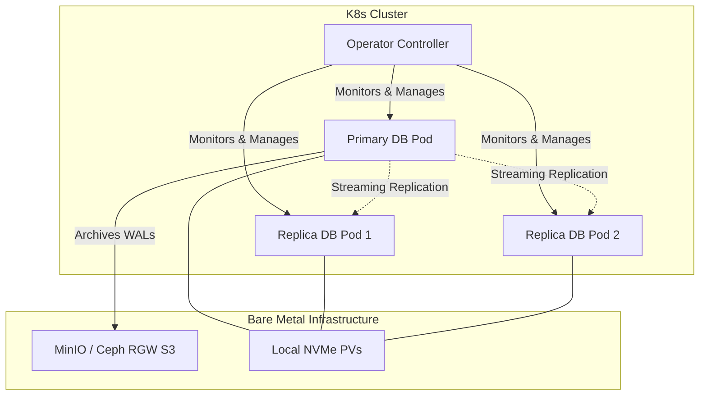
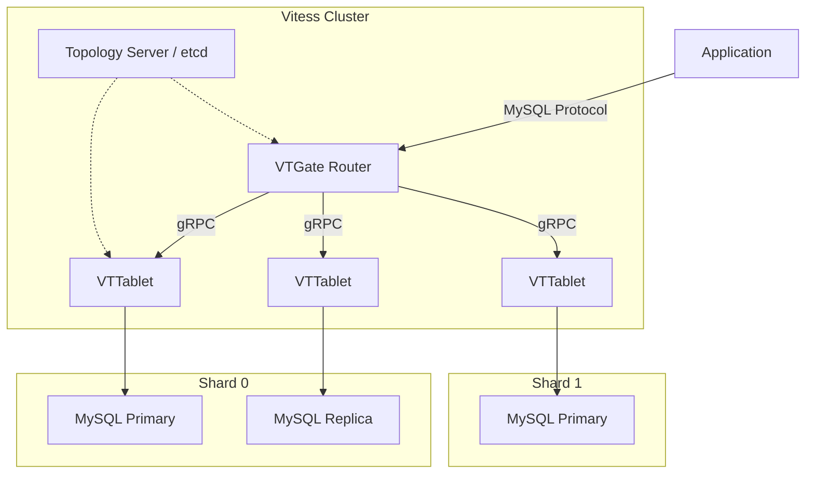

# Database Operators

Operating stateful databases on bare-metal Kubernetes requires replacing cloud-provider managed services (like RDS or ElastiCache) with in-cluster orchestration. Standard `StatefulSet` primitives handle identity and stable storage, but lack application-specific knowledge required for safe failover, replication scaling, Point-in-Time Recovery (PITR), and zero-downtime upgrades. 

Database operators encode DBA operational routines into custom controllers.

## Learning Outcomes

* Evaluate and deploy appropriate database operators for PostgreSQL, MySQL, and caching layers on bare metal.
* Configure CloudNativePG for high availability, streaming replication, and Point-In-Time Recovery (PITR) against S3-compatible local object storage.
* Implement database connection pooling using pgBouncer to prevent connection starvation under high microservice pod churn.
* Design MySQL sharding topologies using Vitess for horizontally scalable relational data.
* Diagnose split-brain scenarios, fencing failures, and WAL (Write-Ahead Log) exhaustion in clustered database deployments.

## The Bare-Metal Database Architecture

On managed cloud providers, database operators often rely on underlying infrastructure APIs (e.g., EBS snapshots) for backups. On bare metal, you must provide the complete stack:

1. **Fast Local Storage:** Databases require low latency. You must use Local Persistent Volumes (via TopoLVM, OpenEBS LocalPV) or highly optimized network block storage (Ceph RBD).
2. **Object Storage:** For continuous backup and PITR, operators stream Write-Ahead Logs (WALs) and base backups to an S3-compatible endpoint. On bare metal, this is typically an internal MinIO cluster or Ceph RadosGW.
3. **Fencing Mechanisms:** To prevent split-brain scenarios during network partitions, operators must reliably "fence" (isolate or kill) the old primary before promoting a replica.



## PostgreSQL: CloudNativePG (CNPG)

CloudNativePG is the current standard for running PostgreSQL on Kubernetes. Unlike older operators that wrap external high-availability tools (like Patroni or Stolon), CNPG interacts directly with the Kubernetes API server for leader election and state management.

### Architecture and Replication

CNPG deploys instances as a single `Cluster` Custom Resource. It uses Kubernetes endpoints and leases for leader election. 

* **Primary:** Receives read/write traffic.
* **Replicas:** Maintain state via asynchronous or synchronous streaming replication.
* **Services:** The operator automatically generates three services:
  * `<cluster>-rw`: Routes exclusively to the Primary.
  * `<cluster>-ro`: Routes to Replicas for read scaling.
  * `<cluster>-r`: Routes to any available node (rarely used).

### Connection Pooling (pgBouncer)

PostgreSQL spawns a separate OS process for every connection. In Kubernetes, hundreds of microservice pods continuously connecting and disconnecting will exhaust PostgreSQL's connection limits and crash the node due to OOM (Out of Memory).

CNPG integrates pgBouncer natively via the `Pooler` CRD. It maintains a persistent connection pool to the database while multiplexing incoming client connections.

### Storage and WAL Archiving

A production CNPG cluster **must** have an S3-compatible backup destination configured. Without it, PostgreSQL will retain WAL files locally until they are successfully archived. If the archiver fails (e.g., MinIO is down), the local persistent volume will fill up with WAL files, causing the primary database to crash and refuse to restart.

:::caution
Always set separate volume claims for data (`/var/lib/postgresql/data`) and WALs (`/var/lib/postgresql/data/pg_wal`). If the WAL volume fills up, the database halts, but the data volume remains uncorrupted, simplifying recovery.
:::

## MySQL at Scale: Vitess

When a single MySQL primary cannot handle the write throughput or dataset size, vertical scaling on bare metal eventually hits a hardware ceiling. Vitess is a database clustering system for horizontal scaling of MySQL, originally built at YouTube.

### Vitess Topology

Vitess hides the complexity of database sharding from the application. The application connects to Vitess as if it were a standard single-node MySQL database.



* **VTGate:** A stateless proxy that parses SQL queries, reads the VSchema (Vitess Schema), and routes the query to the correct underlying shard.
* **VTTablet:** A sidecar process deployed alongside every `mysqld` process. It intercepts queries, implements connection pooling, and protects MySQL from bad queries (e.g., queries returning too many rows).
* **Topology Server:** A highly available datastore (typically etcd) that stores cluster metadata, routing rules, and shard configurations.

:::note
Vitess does not support 100% of standard MySQL syntax. Cross-shard joins are heavily restricted or perform poorly. Applications migrating to Vitess must be audited for compatibility with distributed SQL limitations.
:::

## In-Memory Datastores: Redis, Valkey, and Memcached

In-memory data grids are essential for caching, session management, and rate limiting.

### The Shift to Valkey

Following Redis Ltd's transition to the Server Side Public License (SSPL), the Linux Foundation forked the project into **Valkey**. For new bare-metal deployments, Valkey operators (or community Redis operators migrating to Valkey) are the standard to avoid restrictive licensing issues in enterprise environments.

### Deployment Topologies

| Datastore | Architecture | K8s Operator / Pattern | Best For |
| :--- | :--- | :--- | :--- |
| **Memcached** | Shared-nothing, consistent hashing handled by client. | Deployment + Headless Service. Operator rarely needed. | Simple, transient key/value caching. High throughput, low complexity. |
| **Valkey / Redis (Sentinel)** | Primary-Replica with Sentinel nodes for election. | KubeDB, Spotahome Redis Operator. | General caching, pub/sub, single-threaded high performance. |
| **Valkey / Redis (Cluster)** | Sharded architecture. Multiple Primaries. | KubeDB, OT-Container-Kit Redis Operator. | Datasets exceeding the memory capacity of a single bare-metal node. |

## Hands-on Lab

This lab deploys a highly available PostgreSQL cluster using CloudNativePG, configures an internal MinIO instance as the S3 backup target for WAL archiving, and validates failover.

### Prerequisites
* A running K8s cluster (e.g., `kind` with 3 worker nodes).
* `kubectl` and `helm` installed.
* Default StorageClass configured (standard `kind` provisioner is sufficient for this lab).

### Step 1: Install CloudNativePG Operator

Deploy the CNPG controller using the official manifests.

```bash
kubectl apply --server-side -f \
  https://raw.githubusercontent.com/cloudnative-pg/cloudnative-pg/release-1.22/releases/cnpg-1.22.1.yaml

# Verify the controller is running
kubectl get pods -n cnpg-system
```

### Step 2: Deploy an Internal MinIO for Backups

On bare metal, you need local object storage. We will deploy a minimal MinIO instance.

```bash
helm repo add bitnami https://charts.bitnami.com/bitnami
helm install minio bitnami/minio \
  --set auth.rootUser=admin \
  --set auth.rootPassword=supersecret \
  --set defaultBuckets="cnpg-backups" \
  --namespace minio-system --create-namespace
```

Wait for MinIO to become ready:

```bash
kubectl rollout status deployment/minio -n minio-system
```

### Step 3: Configure Backup Credentials

Create a K8s Secret in the default namespace holding the MinIO credentials so CNPG can authenticate.

```bash
kubectl create secret generic minio-creds \
  --from-literal=ACCESS_KEY_ID=admin \
  --from-literal=ACCESS_SECRET_KEY=supersecret
```

### Step 4: Deploy the PostgreSQL Cluster

Apply the following manifest. It provisions a 3-node PostgreSQL cluster and configures continuous WAL archiving to MinIO.

```yaml
# pg-cluster.yaml
apiVersion: postgresql.cnpg.io/v1
kind: Cluster
metadata:
  name: dojo-db
spec:
  instances: 3
  
  # Anti-affinity ensures pods run on different bare-metal nodes
  affinity:
    enablePodAntiAffinity: true
    topologyKey: kubernetes.io/hostname

  storage:
    size: 1Gi

  backup:
    barmanObjectStore:
      destinationPath: s3://cnpg-backups/
      endpointURL: http://minio.minio-system.svc.cluster.local:9000
      s3Credentials:
        accessKeyId:
          name: minio-creds
          key: ACCESS_KEY_ID
        secretAccessKey:
          name: minio-creds
          key: ACCESS_SECRET_KEY
      wal:
        compression: gzip
```

```bash
kubectl apply -f pg-cluster.yaml
```

### Step 5: Verify Cluster Health and Replication

CloudNativePG provides a standard `kubectl` plugin, but you can inspect the CRD directly:

```bash
# Watch the pods initialize (takes ~2 minutes)
kubectl get pods -l cnpg.io/cluster=dojo-db -w

# Check the cluster status
kubectl get cluster dojo-db -o yaml | grep phase
# Expected output: phase: Cluster in healthy state
```

Verify WAL archiving is succeeding by checking the MinIO pod logs, or check the CNPG operator logs for backup events.

### Step 6: Simulate Node Failure and Observe Failover

Identify the current primary database pod.

```bash
kubectl get pods -l cnpg.io/cluster=dojo-db,cnpg.io/instanceRole=primary
```

Delete the primary pod forcefully to simulate a node crash:

```bash
# Replace pod name with your actual primary pod name
kubectl delete pod dojo-db-1 --force --grace-period=0
```

Immediately watch the pods and the `Cluster` resource. CNPG will detect the failure via API leases, fence the old primary, select the replica with the most advanced LSN (Log Sequence Number), and promote it.

```bash
# Watch the roles change
kubectl get pods -l cnpg.io/cluster=dojo-db -L cnpg.io/instanceRole
```

Traffic sent to the `dojo-db-rw` service will automatically route to the newly promoted primary with minimal disruption.

## Practitioner Gotchas

### 1. The Local Disk WAL Trap
If your S3 backup target (MinIO/Ceph) goes down, CNPG will fail to archive WALs. By design, PostgreSQL will not delete unarchived WALs. Over hours or days, the local PV will fill to 100%. The database will crash and enter a `CrashLoopBackOff`. **Fix:** Monitor the `cnpg_wal_archive_status` metric. Have a runbook for temporarily disabling archiving or expanding the PVC via volume expansion.

### 2. Connection Starvation During Pod Restarts
A deployment scaling from 10 to 50 pods might instantly open 500 new connections to PostgreSQL. If `max_connections` is hit, the application crashes. Increasing `max_connections` excessively causes PostgreSQL to consume all available RAM and OOMKill. **Fix:** Always deploy the CNPG `Pooler` (pgBouncer) in transaction mode and point applications to the Pooler service, not the direct DB service.

### 3. CPU Limits Throttling Latency
Setting strict CPU `limits` on database pods in Kubernetes utilizes the CFS (Completely Fair Scheduler) quota system. Sudden spikes in query complexity can result in severe CPU throttling, adding hundreds of milliseconds to query latency even if the physical node has idle cores. **Fix:** For databases on bare metal, set CPU `requests` accurately for scheduling, but frequently omit CPU `limits` (or set them very high) to allow burst capacity, relying instead on dedicated node pools or vertical scaling.

### 4. OOMKills During Index Creation
A `CREATE INDEX` or `VACUUM` operation requires significant working memory (`maintenance_work_mem`). If K8s memory limits are configured too tightly around normal operational metrics, these maintenance tasks will trigger an immediate OOMKill from the Kubelet. **Fix:** Leave a minimum 20-30% buffer between PostgreSQL's configured shared buffers/work memory and the container's hard memory limit.

## Quiz

**1. A bare-metal Kubernetes cluster running CloudNativePG experiences a failure in its MinIO object storage cluster that lasts for 48 hours. What is the most likely consequence for the PostgreSQL cluster?**
- A) The database switches to synchronous replication mode automatically.
- B) The database purges the oldest data to make room for new transactions.
- C) The primary node's storage volume fills up with Write-Ahead Logs (WALs), eventually causing the database to crash.
- D) The operator stops accepting read queries and enters read-only mode.
> **Correct Answer: C** (Postgres retains WALs until they are successfully archived. If the archiver fails, the disk fills up).

**2. In a Vitess architecture deployed on Kubernetes, which component is responsible for parsing SQL queries and routing them to the correct underlying MySQL shard?**
- A) VTTablet
- B) VTGate
- C) Topology Server
- D) VReplication
> **Correct Answer: B** (VTGate is the stateless proxy router that handles query routing based on the VSchema).

**3. Why is connection pooling (e.g., pgBouncer) considered mandatory for PostgreSQL running in a microservice-heavy Kubernetes environment?**
- A) Because Kubernetes networking limits the number of TCP ports available on a Service.
- B) Because PostgreSQL forks a new OS process for every connection, leading to rapid memory exhaustion when microservices rapidly scale up.
- C) Because pgBouncer encrypts traffic between pods automatically.
- D) Because PostgreSQL cannot perform Point-In-Time Recovery without a pooling layer.
> **Correct Answer: B** (Process-per-connection architecture makes Postgres highly sensitive to connection churn and volume).

**4. You need to deploy a highly available, in-memory caching cluster for a new enterprise application. To avoid strict Server Side Public License (SSPL) restrictions, which technology should you implement?**
- A) Redis Enterprise
- B) Memcached
- C) Valkey
- D) Cassandra
> **Correct Answer: C** (Valkey is the Linux Foundation fork of Redis created specifically to maintain an open-source alternative to SSPL Redis).

**5. When provisioning storage for a database operator on bare metal, why is it critical that the StorageClass supports `WaitForFirstConsumer`?**
- A) It prevents the volume from being encrypted before the pod mounts it.
- B) It delays volume binding until the pod is scheduled, ensuring the local Persistent Volume is created on the exact physical node where the pod will run.
- C) It guarantees that the database application has started before the storage is attached.
- D) It formats the disk with the XFS filesystem automatically.
> **Correct Answer: B** (Volume binding mode must be delayed for local storage so the PV and Pod land on the same physical host).

## Further Reading

* [CloudNativePG Architecture Documentation](https://cloudnative-pg.io/documentation/current/architecture/)
* [Vitess Kubernetes Deployment Guide](https://vitess.io/docs/get-started/kubernetes/)
* [Valkey GitHub Repository and Documentation](https://github.com/valkey-io/valkey)
* [Kubernetes Storage: Local Persistent Volumes](https://kubernetes.io/docs/concepts/storage/volumes/#local)