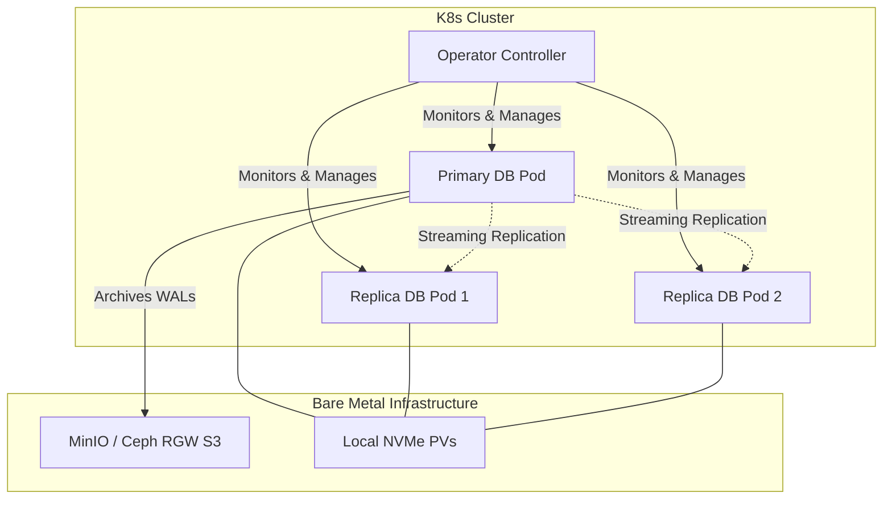
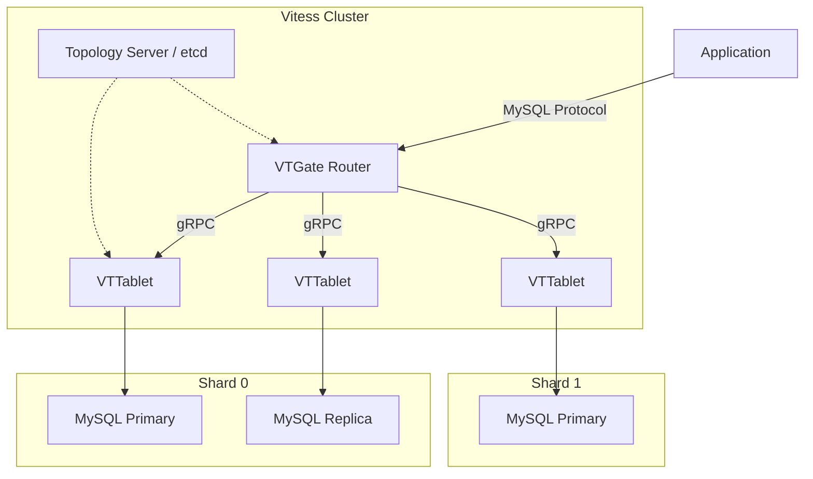
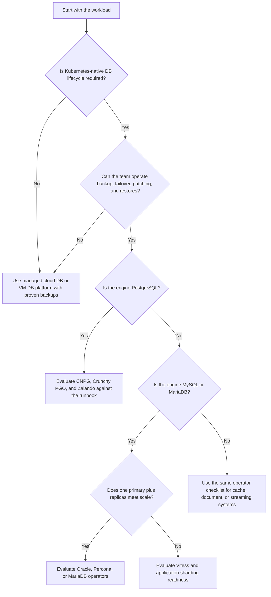

## What You'll Be Able to Do

- **Explain** why a StatefulSet is not enough for production database operations on bare-metal Kubernetes.
- **Deploy** a CloudNativePG cluster with WAL archiving, scheduled backups, and explicit storage placement.
- **Evaluate** PostgreSQL, MySQL, MariaDB, and cache operators using production readiness criteria.
- **Design** bare-metal storage, topology, and backup placement for durable database workloads.
- **Choose** self-hosted operators versus managed cloud databases using cost, risk, and utilization tradeoffs.

## Why This Module Matters

Hypothetical scenario: your platform team has moved stateless services onto an on-premises Kubernetes cluster, and the next migration wave is the database tier. The application teams expect the same behavior they received from managed cloud services: a primary that fails over, replicas that stay caught up, backups that can restore to a point in time, minor upgrades without a maintenance weekend, and a connection endpoint that does not change when a pod is replaced. Kubernetes gives you scheduling, networking, and persistent volume abstractions, but it does not automatically become a database administrator just because a database process runs in a pod.

This is where database operators become important. Operating stateful databases on bare-metal Kubernetes requires replacing cloud-provider managed services like RDS, Cloud SQL, or ElastiCache with in-cluster orchestration that your team owns. Standard `StatefulSet` primitives handle stable identity and stable storage, but they lack application-specific knowledge required for safe failover, replication scaling, point-in-time recovery, minor-version upgrades, switchover, connection pooling, and re-provisioning a broken replica. A `StatefulSet` can bring `postgres-2` back, but it cannot decide whether `postgres-2` is safe to promote after a network partition.

The on-premises part changes the risk model. In a cloud service, the managed database vendor hides a long chain of operational details behind an API: volume attachment, zone placement, backup storage, retention, patching, control-plane health, and support escalation. In your own datacenter or colo, those details are your architecture. The database operator can automate the database-specific loop, but it still depends on your storage class, rack topology, object store, power design, network fabric, monitoring, and human runbooks. That makes the operator a powerful control plane, not a magic boundary around weak infrastructure.

> **The Database Operator Analogy**
>
> A `StatefulSet` is like assigning every apartment in a building a permanent mailbox and door number. A database operator is the building manager who knows which resident is responsible for rent, who has a spare key, when maintenance is safe, where the fire exits are, and how to recover records after a flood. Stable addresses matter, but the operational knowledge is what keeps the building livable.

## Why Operators for Databases

Database operators encode DBA operational routines into custom controllers. Following the Kubernetes Operator pattern, they combine custom resource definitions with controllers that implement a continuous reconciliation loop, constantly driving the observed state of the database cluster toward the desired state. For a database, that desired state is not only "three pods exist." It is also "one writable primary exists, replicas are following the correct timeline, backups are being archived, credentials are present, services route to the correct role, and failed instances are rebuilt without accidentally accepting divergent writes."

The distinction matters most during day-2 operations. Day-0 installation can be solved with a Helm chart, a `StatefulSet`, and a PVC template, but production failure modes happen after the database has accepted data. A controller with database knowledge can watch replication lag before promoting a standby, annotate or fence an unsafe instance, recreate a replica from a fresh base backup, roll a minor image update through replicas before touching the primary, and expose status conditions that mean something to both Kubernetes operators and DBAs. Without that loop, every failover becomes a manual incident with a high risk of split-brain or silent data loss.

The most useful mental model is to separate infrastructure guarantees from database guarantees. Kubernetes can guarantee that pods have names, PVCs can be rebound according to storage rules, and Services can route traffic to selected endpoints. PostgreSQL, MySQL, MariaDB, Redis-compatible stores, and Kafka each have their own replication, recovery, quorum, and durability semantics. A good operator bridges those layers by translating a declarative Kubernetes object into database-native actions, while still making the failure domain visible enough for human operators to audit and override.

## The Bare-Metal Database Architecture

Bare-metal database architecture starts with a blunt question: where does the write land when the pod disappears? If the answer is "on whatever volume the default StorageClass created," the design is not yet production ready. Relational databases care about write latency, fsync behavior, ordering, and recovery semantics more than most stateless workloads. A storage layer that looks healthy for container images, logs, or shared file workloads can still be unsuitable for a write-heavy database primary because every commit path may wait for durable I/O.

On managed cloud providers, database operators often rely on underlying infrastructure APIs (e.g., EBS snapshots) for backups. On bare metal, you must provide the complete stack:

1. **Fast Local Storage:** Databases require low latency. You must use Local Persistent Volumes (via TopoLVM, OpenEBS LocalPV) or highly optimized network block storage (Ceph RBD).
2. **Object Storage:** For continuous backup and PITR, operators stream Write-Ahead Logs (WALs) and base backups to an S3-compatible endpoint. On bare metal, this is typically an internal MinIO cluster or Ceph RadosGW.
3. **Fencing Mechanisms:** To prevent split-brain scenarios during network partitions, operators must reliably "fence" (isolate or kill) the old primary before promoting a replica.

The storage choice is the first major fork. Local NVMe gives excellent latency and predictable fsync behavior when the database pod stays on the node that owns the disk. It also makes node loss more operationally visible, because the database operator must rebuild a replacement instance from another replica or from backup. Network block storage such as Ceph RBD can survive node replacement more naturally, but every synchronous write now crosses a storage network and a distributed storage system. That does not make one approach universally better; it means you must decide whether your primary constraint is tail latency, operational simplicity, rack-level durability, or storage-team familiarity.

Topology is the second major fork. A three-instance database placed on three Kubernetes nodes is not automatically resilient if those nodes sit in the same rack, share the same top-of-rack switch, or draw from the same power feed. For on-premises clusters, node labels should reflect the physical world: rack, row, power domain, storage pool, and sometimes maintenance domain. The operator can express anti-affinity, but the labels must represent real failure boundaries, otherwise Kubernetes spreads pods across names that all fail together.

> **Stop and think**: If a bare-metal node fails entirely, how does the operator know whether it's a temporary network partition or a permanent hardware failure? Without cloud APIs to query, the operator cannot truly tell a transient network partition from a dead node, so it relies on the kubelet's node-readiness/health signals plus explicit fencing (CloudNativePG's `fencing` annotation) before promoting a replica — and on bare metal, robust split-brain prevention ultimately needs out-of-band BMC/IPMI fencing to power-isolate the suspect node. (Kubernetes `Lease` objects drive controller leader election, not database primary fencing.)


```mermaid
graph TD
    subgraph K8s Cluster
        O[Operator Controller]
        P[Primary DB Pod]
        R1[Replica DB Pod 1]
        R2[Replica DB Pod 2]
        
        O -->|Monitors & Manages| P
        O -->|Monitors & Manages| R1
        O -->|Monitors & Manages| R2
        
        P -.->|Streaming Replication| R1
        P -.->|Streaming Replication| R2
    end
    
    subgraph Bare Metal Infrastructure
        S3[MinIO / Ceph RGW S3]
        Local[Local NVMe PVs]
        
        P -->|Archives WALs| S3
        P --- Local
        R1 --- Local
        R2 --- Local
    end
```

This diagram hides an important operational detail: the object store is not optional backup decoration. WAL archiving is the bridge between "I have replicas" and "I can recover to a precise point after the whole cluster loses quorum." Replicas protect against common node and pod failures, but they also replicate many forms of corruption and operator mistakes. A dropped table, a bad migration, or an application bug that overwrites rows can propagate instantly to every standby. Point-in-time recovery requires a base backup plus archived WAL or binlog history stored outside the primary database volume.

The object store must be outside the immediate blast radius of the database nodes. A MinIO tenant, Ceph RGW service, or other S3-compatible system running on the same rack and power circuit as the database cluster may satisfy an API field, but it does not satisfy disaster recovery. For production, backup placement should be deliberately off-node, usually off-rack, and often replicated to a second room or site. If your restore plan depends on the same Ceph pool that holds the live database PVCs, you have built a convenient snapshot workflow rather than an independent recovery path.

## PostgreSQL: CloudNativePG (CNPG)

CloudNativePG is a CNCF Sandbox project, accepted at that maturity level on January 21, 2025, and its 1.29 release line is current for this curriculum snapshot. The CloudNativePG 1.29 supported-releases matrix lists Kubernetes 1.35, 1.34, and 1.33 support and PostgreSQL major versions 14 through 18, with PostgreSQL 18.3 as the default image for the 1.29.x line. That matters for this module because the example should use the operator's own PostgreSQL image registry, `ghcr.io/cloudnative-pg/postgresql`, rather than a generic third-party database image.

CNPG is a useful worked example because it makes the operator boundary visible. A `Cluster` custom resource declares how many PostgreSQL instances should exist, which image they should run, how PVCs should be created, how pod anti-affinity should be applied, where WAL should be archived, and how backups should be requested. The controller then reconciles those Kubernetes objects and database actions continuously. Unlike a hand-authored `StatefulSet`, it understands PostgreSQL roles, replication state, WAL timelines, services for primary and replica traffic, and the difference between a restart, a switchover, and a failover.

### Architecture and Replication

CNPG deploys instances as a single `Cluster` custom resource. It uses Kubernetes coordination and PostgreSQL state to manage leadership, and it exposes database role through generated Services rather than asking applications to discover pod names. The service split is a practical production feature: application write traffic should use the read/write endpoint, reporting or analytics traffic can use the replica endpoint, and operational scripts can choose the broader read endpoint only when they understand the consequences.

* **Primary:** The current writable PostgreSQL instance receives application writes through the `<cluster>-rw` Service, and the operator updates service selectors when leadership changes.
* **Replicas:** Standby instances maintain state through PostgreSQL streaming replication, either asynchronous for lower write latency or synchronous when the workload requires stronger commit acknowledgement.
* **Services:** CNPG creates role-aware Services named `<cluster>-rw`, `<cluster>-ro`, and `<cluster>-r`, which route to the primary, replicas, or any readable instance according to their selector type.

Asynchronous replication is the common starting point because write commits do not wait for a standby to confirm receipt. It gives better write latency, especially when replicas sit across racks or rooms, but it can lose the last acknowledged transactions if the primary dies before WAL reaches a replica. Synchronous replication reduces that risk by requiring acknowledgement from one or more standbys before the primary confirms a commit, but it turns replica health and network latency into part of the write path. On bare metal, that tradeoff must be made with rack topology in mind; a synchronous standby on the same top-of-rack switch may be fast, but it may not protect you from the failure domain you actually care about.

Failover is where operators earn trust or lose it. A safe controller must distinguish an unhealthy primary from a partitioned primary that might still accept writes, choose a promotion candidate with the most appropriate WAL position, isolate the old primary, and update routing endpoints. CNPG's 1.29.1 notes include specific failover fixes around unreachable primary nodes and old-primary service isolation, which is a reminder that database operators are sophisticated distributed systems. Treat operator upgrades as production database upgrades: read release notes, stage the change, and run a failover drill before you need it during an outage.

Switchover is the calmer sibling of failover. You use it when the current primary is healthy but needs planned maintenance, such as a node reboot, kernel update, firmware patch, or rack power work. A switchover gives the operator time to make a chosen replica current, promote it, and move write traffic intentionally. In an on-premises environment with regular hardware maintenance windows, planned switchovers should be routine muscle memory rather than rare emergency knowledge.

### Connection Pooling (pgBouncer)

> **Pause and predict**: What happens if an autoscaling microservice suddenly creates 500 new connections directly to the PostgreSQL primary pod? Because PostgreSQL forks an OS process for every connection, the node will likely exhaust its memory and trigger an OOMKill before the queries even execute.

In Kubernetes, hundreds of microservice pods continuously connecting and disconnecting can exhaust PostgreSQL's connection limits and consume memory through backend processes. CNPG integrates pgBouncer through the `Pooler` CRD, which maintains a smaller set of persistent database connections while multiplexing incoming client connections. The pooler does not remove the need to tune PostgreSQL, but it changes the scaling surface from "every pod can open many database backends" to "the pooler enforces a bounded connection budget."

Connection pooling also affects failover behavior. Applications should connect to the pooler or to the generated service name, not to a database pod DNS name, because pod identity is not the same as database role. When the primary changes, the role-aware service and pooler path are the stable abstraction that lets clients reconnect to the right place. If an application caches pod IPs or bypasses the pooler to reach `dojo-db-1` directly, the operator can promote a new primary correctly and the application can still fail because it ignored the database access contract.

### Storage and WAL Archiving

A production CNPG cluster **must** have an S3-compatible backup destination configured. Without it, PostgreSQL will retain WAL files locally until they are successfully archived. If the archiver fails (e.g., MinIO is down), the local persistent volume will fill up with WAL files, causing the primary database to crash and refuse to restart.

:::caution
Always set separate volume claims for data and WAL: with `.spec.walStorage`, CloudNativePG provisions a dedicated WAL PVC mounted at `/var/lib/postgresql/wal` (PGDATA stays at `/var/lib/postgresql/data`) and symlinks `pg_wal` there, instead of leaving WAL inside the data volume. If the WAL volume fills up, the database halts, but the data volume remains uncorrupted, simplifying recovery.
:::

:::warning
In CloudNativePG 1.29, the native Barman Cloud support for backup orchestration received a deprecation notice, with full removal now planned for version 1.30.0. Future deployments will migrate to alternative backup implementations, but the `barmanObjectStore` configuration remains functional for current 1.29 deployments.
:::

CNPG supports a separate `.spec.walStorage` PVC for PostgreSQL WAL. On bare metal, that separation is more than a neat YAML field. WAL is a sequential write-heavy path, while data files and indexes have different read and write patterns. Splitting WAL can reduce I/O contention, create clearer alerts, and limit the blast radius of a full volume. It also creates a lifecycle rule: once you add a separate WAL volume, design around it as a permanent part of the cluster rather than a temporary toggle.

The access mode should match relational database reality. A PostgreSQL data directory is not a shared filesystem workload, so using a ReadWriteMany volume for `PGDATA` is usually the wrong abstraction. Multiple database processes writing the same data directory is not high availability; it is corruption waiting for a bad day. Use block PVCs with one writer per database instance, then let PostgreSQL replication and the operator create the availability layer above those independent volumes.

`WaitForFirstConsumer` is especially important for local storage. With immediate binding, Kubernetes can bind a PVC to a disk before the scheduler has chosen the pod's node, creating unschedulable combinations when CPU, memory, taints, or anti-affinity later point the pod elsewhere. With delayed binding, provisioning happens after scheduling context is known, so the volume can be created or selected in the same physical place where the pod will run. For local NVMe, that distinction is the difference between a clean placement policy and a stuck production rollout.

Here is a compact CNPG storage shape for a production-like bare-metal cluster. The exact sizes are deliberately small in this teaching example, but the important parts are the explicit image, anti-affinity, dedicated WAL volume, and a storage class chosen for database semantics rather than whatever default class exists in the cluster.

```yaml
apiVersion: postgresql.cnpg.io/v1
kind: Cluster
metadata:
  name: dojo-db
spec:
  instances: 3
  imageName: ghcr.io/cloudnative-pg/postgresql:18.3-system-trixie

  affinity:
    enablePodAntiAffinity: true
    topologyKey: kubernetes.io/hostname
    podAntiAffinityType: required

  storage:
    storageClass: local-nvme-wffc
    size: 10Gi

  walStorage:
    storageClass: local-nvme-wffc
    size: 5Gi
```

Backups are separate resources, not a vague promise that someone will remember to run `pg_dump`. CNPG supports `Backup` and `ScheduledBackup` custom resources, and its 1.29 documentation describes physical backups, WAL archiving, volume snapshots, and plugin-based backup integration. Logical dumps still have a place for portability, selective export, and schema-level inspection, but they are not the primary business-continuity mechanism for a high-write production database. Physical backups plus WAL archive are what make point-in-time recovery possible.

The restore drill is part of the design, not an afterthought. A backup that has never been restored is an inventory item, not a recovery guarantee. In an on-premises environment, restore tests should answer concrete questions: can a new cluster read from the object store after the primary cluster is down, can credentials be restored without the original namespace, can the target recovery timestamp be chosen safely, and can applications be pointed at the restored service without changing every deployment manifest. Those questions belong in the quarterly operations calendar.

## MySQL at Scale: Vitess

When a single MySQL primary cannot handle the write throughput or dataset size, vertical scaling on bare metal eventually hits a hardware ceiling. Vitess, a CNCF Graduated project, is a database clustering system for horizontal scaling of MySQL-compatible workloads, originally built at YouTube. The important lesson is not "always choose Vitess." The lesson is that sharding changes the application contract, so you should reach for it only when single-primary MySQL plus read replicas, connection pooling, and hardware refresh no longer meet the workload shape.

Vitess is best understood as a distributed database control plane around MySQL. It introduces routing, topology, tablets, online schema changes, and resharding workflows that are valuable at very large scale but costly if the application is not ready for distributed SQL constraints. On bare metal, it also requires a mature network and storage plan because every shard adds more MySQL instances, more backup streams, more replication relationships, and more failure domains to observe.

### Vitess Topology

Vitess hides the complexity of database sharding from the application. The application connects to Vitess as if it were a standard single-node MySQL database.


```mermaid
graph TD
    App[Application] -->|MySQL Protocol| VTGate[VTGate Router]
    
    subgraph Vitess Cluster
        VTGate -->|gRPC| VTTablet1[VTTablet]
        VTGate -->|gRPC| VTTablet2[VTTablet]
        VTGate -->|gRPC| VTTablet3[VTTablet]
        
        Topo[Topology Server / etcd] -.-> VTGate
        Topo -.-> VTTablet1
    end
    
    subgraph Shard 0
        VTTablet1 --> MySQL_M[MySQL Primary]
        VTTablet2 --> MySQL_R1[MySQL Replica]
    end
    
    subgraph Shard 1
        VTTablet3 --> MySQL_S1_M[MySQL Primary]
    end
```

* **VTGate:** A stateless proxy that parses SQL queries, reads the VSchema (Vitess Schema), and routes the query to the correct underlying shard.
* **VTTablet:** A sidecar process deployed alongside every `mysqld` process. It intercepts queries, implements connection pooling, and protects MySQL from bad queries (e.g., queries returning too many rows).
* **Topology Server:** A highly available datastore (typically etcd) that stores cluster metadata, routing rules, and shard configurations.

:::note
Vitess does not support 100% of standard MySQL syntax. Cross-shard joins are heavily restricted or perform poorly. Applications migrating to Vitess must be audited for compatibility with distributed SQL limitations.
:::

Most on-premises teams should evaluate ordinary MySQL and MariaDB operators before jumping to sharding. Oracle's MySQL Operator manages MySQL InnoDB Cluster setups and includes lifecycle operations such as setup, maintenance, upgrades, and backups. Percona publishes MySQL operators for Percona Server and Percona XtraDB Cluster, with production documentation around backups, recovery, scaling, and failover. MariaDB documents official Kubernetes operators for MariaDB and MaxScale patterns. These operators differ in replication model, licensing, enterprise support, and CRD design, but the evaluation questions are the same.

A good MySQL-family operator must make replication topology explicit. Does it use asynchronous replication, group replication, Galera-style synchronous replication, or a proxy/router layer? How does it detect primary failure, and what protects it from promoting a stale member? Can it run backups from a replica without overloading the writer? Does point-in-time recovery use binlog archiving, and where are those binlogs stored in your on-premises object store? If those answers are vague, the operator may still be useful for development, but it is not yet a production database platform.

PostgreSQL operator choice deserves the same evaluation discipline. CloudNativePG is the worked example here because it is community-governed under CNCF and exposes the lifecycle clearly, but it is not the only option. The Zalando Postgres Operator has a long production history and a different API style. Crunchy Data's PGO focuses on a declarative PostgreSQL solution with high availability and backup workflows. Compare them against your operational contract rather than a popularity ranking: supported PostgreSQL versions, backup mechanism, restore UX, security model, upgrade behavior, observability, support path, and how well the operator fits GitOps.

## In-Memory Datastores: Redis, Valkey, and Memcached

In-memory data grids are essential for caching, session management, rate limiting, leaderboards, short-lived queues, and request coalescing. They are also easy to overstate as durable systems because they feel fast and simple during a demo. For on-premises Kubernetes, decide first whether the data is disposable cache, reconstructable session state, or a source of truth. The operator pattern is useful for the latter two categories, but Memcached-style disposable caching often needs a plain Deployment, a Service, and client-side consistent hashing more than it needs a complex controller.

### The Shift to Valkey

Following Redis Ltd's 2024 license change from the earlier BSD-licensed Redis OSS lineage to source-available licenses, the Linux Foundation community launched **Valkey** as an open source fork. For new bare-metal deployments, Valkey-compatible operators or Redis operators with a clear Valkey migration path reduce licensing surprise and keep the caching layer under a more predictable open governance model. The technical evaluation still matters: check cluster-mode support, Sentinel or equivalent failover behavior, persistence settings, memory eviction policy, TLS, authentication, backup expectations, and whether the operator can safely roll nodes without dropping the whole cache.

### Deployment Topologies

| Datastore | Architecture | K8s Operator / Pattern | Best For |
| :--- | :--- | :--- | :--- |
| **Memcached** | Shared-nothing, consistent hashing handled by client. | Deployment + Headless Service. Operator rarely needed. | Simple, transient key/value caching. High throughput, low complexity. |
| **Valkey / Redis (Sentinel)** | Primary-Replica with Sentinel nodes for election. | KubeDB, Spotahome Redis Operator. | General caching, pub/sub, single-threaded high performance. |
| **Valkey / Redis (Cluster)** | Sharded architecture. Multiple Primaries. | KubeDB, OT-Container-Kit Redis Operator. | Datasets exceeding the memory capacity of a single bare-metal node. |

The cost/risk profile for in-memory systems is different from PostgreSQL and MySQL. A cache miss storm after a full cluster restart can overload the backing database, so "the cache is disposable" does not mean "the cache has no availability requirement." On bare metal, reserve memory deliberately, monitor fragmentation and eviction, and avoid placing every cache shard on the same physical node family that also hosts the primary database. A failed cache tier should degrade the application, not become the reason the database operator starts a failover.

## The Broader Operator Ecosystem

While CloudNativePG, Vitess, MySQL operators, MariaDB operators, and Valkey-compatible operators cover the main examples in this module, the Kubernetes ecosystem provides specialized operators for many stateful systems. MongoDB now documents MongoDB Controllers for Kubernetes as the replacement path for earlier MongoDB Kubernetes operators. Strimzi remains the common open source reference for running Apache Kafka on Kubernetes and is listed by the project as a CNCF Incubating project. KubeBlocks represents the multi-database control-plane approach, where one operator family tries to manage many engines through a common framework.

Use broad operators carefully. A unified API can simplify day-0 onboarding and reduce the number of CRD models a platform team must learn, but it can also hide engine-specific differences that matter during incidents. A PostgreSQL point-in-time recovery, a MySQL binlog restore, a Kafka broker replacement, and a Redis-compatible shard resharding operation are not the same procedure. If a multi-engine operator abstracts those differences cleanly and exposes enough detail for audit, it may be useful. If it collapses them into generic "backup" and "restore" buttons without engine-specific runbooks, it creates false confidence.

Operator Lifecycle Manager can help large fleets install and update operators, but it should not be treated as a substitute for database release management. The OLM v0 repository is in maintenance mode, and the operator-framework community is developing newer lifecycle-management designs. For production databases, the platform team still needs a version policy: who approves operator upgrades, how CRDs are rolled out, whether conversion webhooks are tested, how rollback works, and how application owners are notified when an operator changes default behavior.

## Storage Requirements for Database Operators

Database operator success depends on storage behavior more than on YAML neatness. Kubernetes persistent volumes describe capacity and attachment, but databases care about latency distribution, flush semantics, queue depth, write amplification, and how storage recovers after a host reboot. Before standardizing an operator, run storage and database benchmarks in the same topology the database will use in production. A benchmark on one empty node does not prove a rack of busy nodes can sustain checkpoint spikes, backup reads, compaction, and application writes at the same time.

Local NVMe is attractive because it keeps the write path short and makes latency easier to reason about. The tradeoff is that the database availability layer must come from the database engine and operator, not from the disk surviving node loss. That is why pod anti-affinity, `WaitForFirstConsumer`, rack labels, and tested replica rebuilds matter so much. If the primary node fails, the operator should promote a replica and later recreate the lost instance from replication or backup. The local disk is fast, but it is not portable.

Networked block storage such as Ceph RBD is attractive because it decouples a PVC from one failed worker node and can provide durable storage services across a storage cluster. The tradeoff is that every database write now depends on storage network health and storage-cluster behavior. Replicating at the storage layer and at the database layer can also amplify writes, especially when each PostgreSQL instance already has its own replica set. CNPG's storage documentation calls this out for block storage designs: storage-level replicas are useful, but they should be aligned with the database's shared-nothing architecture rather than blindly multiplied.

ReadWriteMany storage is usually the wrong answer for an RDBMS data directory. Shared filesystems have legitimate uses in Kubernetes, but a PostgreSQL or MySQL data directory is designed for one database server process owning its files. High availability should be built through independent instances and database replication, not multiple pods mounting and writing the same directory. If a storage vendor claims RWX makes relational database HA easy, ask exactly how it prevents concurrent writers, split-brain, stale cache reads, and filesystem-level corruption during failover.

Storage topology should be visible in Kubernetes labels. At minimum, label nodes by rack or row when those boundaries represent real power and network failure domains. Larger on-premises environments may also label storage pool, chassis, room, or maintenance domain. Then configure database operators to spread replicas across those labels. The goal is not aesthetic scheduling; the goal is to prevent one breaker, one top-of-rack switch, or one storage shelf from removing all copies of the same database.

## Backup, Restore, and Disaster Recovery

Backup design begins by separating logical backups, physical backups, and continuous log archiving. Logical backups such as `pg_dump` or MySQL dumps are useful for portability, selective recovery, schema comparison, and low-volume databases. They are not enough for strict recovery point objectives on active production systems because they represent a point-in-time export and can be slow to restore at size. Physical base backups copy database files in a database-aware way, and WAL or binlog archiving captures the changes needed to recover forward to a chosen point.

Point-in-time recovery is the operational capability you are really buying with continuous archiving. If an application deploy corrupts data at 13:07, a nightly backup from 02:00 loses a business day, while a base backup plus archived WAL may let you recover to 13:06. The operator can make this workflow declarative, but the humans still need to decide the target timestamp, validate the restored database, and redirect traffic safely. The harder part of PITR is rarely the command; it is the decision discipline during pressure.

On premises, backup location has physical meaning. A MinIO instance, Ceph RGW endpoint, or other S3-compatible object store in the same cluster is convenient for the lab, but production backups should survive the loss of a node pool, rack, storage shelf, and ideally the primary server room. Many teams use a local object store for fast restores and then replicate to an off-rack or off-site target for disaster recovery. That second copy is not a luxury when the same maintenance mistake can affect both the live PVCs and the first backup target.

Restore drills should be boring, scheduled, and measured. At least one drill should restore into a different namespace with fresh secrets, because real disasters often include broken service accounts, missing encryption keys, or a damaged cluster state. Another drill should restore after intentionally deleting the original database cluster, because that exposes hidden dependencies on live objects. Record the elapsed time, the largest manual step, the validation query, and the application cutover action. Those notes become the runbook that matters during the next incident.

## Cost and Risk Lens: Self-Hosted Operators vs Managed Databases

The economic case for on-premises database operators is a trade, not a free discount. Cloud managed databases charge for compute, storage, I/O, backup retention, cross-region replication, support, and egress, but they also include a service team's operational labor and a tested control plane. Self-hosting replaces part of that bill with capital expense and internal responsibility: servers, disks, racks, power, cooling, network gear, spare parts, support contracts, monitoring, backup media, and the people who patch, test, and respond at 03:00.

CapEx versus OpEx changes how mistakes show up. In cloud, overprovisioning usually appears as a monthly bill that can be reduced next month. On premises, overprovisioning becomes hardware that sits underutilized until the next refresh cycle, while underprovisioning becomes a purchase process, lead time, rack capacity check, and maintenance window. Depreciation matters because a database platform that looks cheap in year one may be expensive if the storage refresh must happen earlier than planned or if a support contract is required to keep firmware and replacement parts available.

On-premises can beat managed cloud databases when utilization is steady and high, data gravity is strong, latency to local applications matters, egress-heavy workloads would be punished by cloud transfer charges, or regulatory controls require specific physical custody. It can also win when a platform team already operates reliable datacenter infrastructure and can amortize staff, monitoring, and hardware across many database clusters. In that case, an operator turns repeatable DBA work into a platform service without paying a managed database margin for every instance.

On-premises does not win automatically. Small fleets, spiky workloads, uncertain product demand, weak operations coverage, and low utilization often favor managed services because the cloud provider absorbs idle capacity, hardware failures, and much of the control-plane complexity. If you need one small production database and the team has no on-call DBA skill, self-hosting on bare metal can be more expensive even when the cloud line item looks higher. A fair TCO model includes outage risk, restore-test time, hiring, training, support escalation, and the opportunity cost of engineers operating databases instead of building product features.

The risk lens is equally important. Managed cloud lock-in is real, but so is self-hosting lock-in to your own operational maturity. If your team cannot regularly patch the operator, test failover, monitor WAL archiving, and prove restores, the cheaper infrastructure is not cheaper. The correct comparison is not "cloud database bill versus server invoice." It is "managed service contract versus the full cost of building and sustaining a reliable database platform."

## Patterns & Anti-Patterns

Proven patterns are useful because they encode failure knowledge before the incident. The strongest pattern for bare-metal databases is shared-nothing placement: each database instance owns its own block PVC, replicas land on different physical failure domains, and the database engine replicates between instances. This scales well when the cluster has enough nodes and racks to spread replicas, and it keeps recovery actions understandable because one broken instance can be destroyed and rebuilt without trying to untangle shared files.

Another strong pattern is object-store-first recovery. Every production database cluster should archive logs to an object store outside the immediate node failure domain, and every platform should include a scheduled restore drill. This pattern scales from a single CNPG cluster to a fleet because the control objective is stable: you can recreate the database state without trusting the original pod, PVC, or node. As the fleet grows, centralize bucket policy, encryption, retention, and replication so teams get consistent recovery behavior.

A third pattern is role-aware access. Applications connect through operator-managed Services or poolers such as CNPG `Pooler`, never through pod names. This pattern scales because it lets the operator change the primary without every application needing to understand database internals. It also gives platform teams a clear place to insert connection limits, TLS policy, network policy, and observability. When every application invents its own connection path, failover becomes a compatibility problem.

| Pattern | When to Use | Why It Works | Scaling Consideration |
| :--- | :--- | :--- | :--- |
| Shared-nothing database instances | Production RDBMS clusters with replicas and block PVCs. | Each instance owns one writable data directory, so replication is database-aware rather than filesystem-shared. | Requires node and rack labels that represent real physical failure domains. |
| Object-store-first recovery | Any database with business continuity requirements stronger than daily restore. | Base backups plus WAL or binlog archives allow PITR and recovery outside the failed node. | Standardize buckets, retention, encryption, and restore drills across the fleet. |
| Role-aware access through Services or poolers | Applications that must survive switchover, failover, and rolling upgrades. | Clients connect to a stable role endpoint while the operator changes backing pods. | Pooler sizing and connection budgets become platform-level capacity inputs. |

Anti-patterns are tempting because they often work in a demo. The first is "StatefulSet equals database platform." Teams fall into it because a StatefulSet gives stable names, PVCs, and ordered rollout, which looks close to what a database needs. The missing pieces are replication orchestration, fencing, backup, restore, role-aware routing, and upgrade sequencing. The better alternative is either a database operator with a tested lifecycle or a deliberate VM-based database platform if Kubernetes is not ready.

The second anti-pattern is "RWX for high availability." Teams choose it because shared storage feels like a shortcut around replica rebuilds and local disk placement. For an RDBMS data directory, shared write access is not the same as safe multi-writer coordination. The better alternative is one writable data directory per database instance, database-native replication, and operator-managed promotion. Use RWX for workloads designed for shared files, not as a substitute for database HA.

The third anti-pattern is "backup target inside the same blast radius." Teams do this because it is convenient to deploy MinIO in the same cluster and point every operator at it. That may be fine for a lab or fast local restore, but it fails the real disaster test if the same rack, Ceph pool, or cluster state is lost. The better alternative is layered backup placement: local object storage for speed, replicated off-rack or off-site object storage for survival, and routine restore tests from the remote copy.

| Anti-Pattern | What Goes Wrong | Why Teams Fall Into It | Better Alternative |
| :--- | :--- | :--- | :--- |
| Treating StatefulSet as full DBA automation | Failover, backup, PITR, and upgrade decisions become manual during incidents. | Stable pod names and PVCs look like enough during day-0 testing. | Use a database operator or keep the database on a VM platform with proven runbooks. |
| Mounting one RWX data directory across database pods | Concurrent writers or stale readers can corrupt data and hide split-brain. | Shared storage appears to avoid replica rebuild complexity. | Use independent block PVCs and database-native replication between instances. |
| Keeping all backups in the same failure domain | A rack, storage, or cluster failure can remove live data and the first backup copy. | In-cluster object storage is easy to deploy and fast to test. | Replicate backups off-rack or off-site and drill restores from that independent target. |

## Decision Framework

Choose the smallest database operating model that satisfies the workload's recovery, latency, scale, and compliance requirements. A single PostgreSQL VM with a mature backup system can be better than a half-understood Kubernetes operator. A CNPG cluster can be better than a hand-built StatefulSet when you need Kubernetes-native lifecycle management. A managed cloud database can be better than both when demand is spiky or the team lacks the operational depth to run a production database platform. The decision should be explicit rather than inherited from where the application happens to run.

| Situation | Strong Candidate | Tradeoff to Accept | Do Not Choose It When |
| :--- | :--- | :--- | :--- |
| PostgreSQL with steady on-prem demand and strong platform operations | CloudNativePG with block PVCs, WAL archive, pooler, and restore drills. | You own operator upgrades, storage behavior, failover testing, and backup placement. | The team cannot test PITR or provide database-aware on-call coverage. |
| MySQL-compatible workload that fits one primary plus replicas | Oracle, Percona, or MariaDB-family operator matched to the engine. | Operator semantics differ; binlog/PITR, router, and failover behavior must be tested. | The application already requires cross-shard writes or unsupported SQL patterns. |
| MySQL workload that exceeds single-primary scale | Vitess with application query audit and sharding design. | The application accepts distributed SQL constraints and new operational components. | The real problem is missing indexes, poor pooling, or under-sized hardware. |
| Disposable cache or simple session cache | Memcached or Valkey/Redis-compatible Deployment or operator. | Cache loss must be survivable and backends must handle warm-up pressure. | The cache has become an unacknowledged source of truth. |
| Small, spiky, or low-utilization database fleet | Managed cloud database or existing VM database platform. | You pay managed-service margin or keep a non-Kubernetes operating model. | Data sovereignty, egress, or local latency requirements make cloud unsuitable. |


```mermaid
flowchart TD
    A[Start with the workload] --> B{Is Kubernetes-native DB lifecycle required?}
    B -- No --> C[Use managed cloud DB or VM DB platform with proven backups]
    B -- Yes --> D{Can the team operate backup, failover, patching, and restores?}
    D -- No --> C
    D -- Yes --> E{Is the engine PostgreSQL?}
    E -- Yes --> F[Evaluate CNPG, Crunchy PGO, and Zalando against the runbook]
    E -- No --> G{Is the engine MySQL or MariaDB?}
    G -- Yes --> H{Does one primary plus replicas meet scale?}
    H -- Yes --> I[Evaluate Oracle, Percona, or MariaDB operators]
    H -- No --> J[Evaluate Vitess and application sharding readiness]
    G -- No --> K[Use the same operator checklist for cache, document, or streaming systems]
```

The final decision should include a rollback path. If a pilot operator cannot restore a database into a clean namespace, roll a minor version without unexpected downtime, and recover from a deleted primary pod while preserving data, do not promote it to the platform standard. If it passes those drills, document the exact storage class, anti-affinity, backup target, image policy, and support path. Production readiness is the combination of the operator and the contract around it.

## Did You Know?

- **CloudNativePG 1.29 aligns with the curriculum Kubernetes target:** The supported-releases matrix lists Kubernetes 1.35 support and PostgreSQL 18.3 as the default image for that release line.
- **CloudNativePG can provision a separate WAL PVC:** The `.spec.walStorage` field creates a dedicated volume for WAL, which can reduce I/O contention and improve operational visibility.
- **Kubernetes `WaitForFirstConsumer` delays volume binding:** This storage class mode lets provisioning consider pod scheduling constraints, which is critical when local disks are tied to specific nodes.
- **OLM v0 is in maintenance mode:** The operator-framework repository documents reduced feature expectations for OLM v0 while the community works on the newer operator-controller design.

## Common Mistakes

| Mistake | Problem | Solution |
| :--- | :--- | :--- |
| Treating a `StatefulSet` as a complete database operator | Stable identity and PVCs do not provide failover, PITR, backup orchestration, or role-aware routing. | Use a database operator with tested day-2 workflows or keep the database on a platform with established DBA runbooks. |
| Using RWX storage for an RDBMS data directory | Shared write access can corrupt the data directory and does not create safe database-level high availability. | Use one block PVC per database instance and rely on database replication plus operator-managed promotion. |
| Leaving WAL and data on one tiny PVC | Failed WAL archiving can fill the volume and halt the primary, making recovery more stressful. | Size WAL deliberately, consider `.spec.walStorage`, and alert on archiving failures and volume growth. |
| Putting every replica in the same rack or power domain | Kubernetes sees different nodes, but the physical infrastructure can fail all replicas together. | Label real failure domains and configure anti-affinity around racks, rows, or power groups where practical. |
| Testing backups but not restores | Backup commands can succeed while credentials, buckets, retention, or recovery steps are broken. | Schedule restore drills into a fresh namespace and record RTO, validation queries, and manual steps. |
| Connecting applications directly to database pod names | Failover changes database role, but clients keep using a stale or unsafe endpoint. | Connect through operator-managed role Services or poolers such as CNPG `Pooler`. |
| Ignoring total cost of ownership | Server purchase price excludes power, cooling, rack space, network gear, support, spares, and staff time. | Compare managed database cost against full on-prem TCO, depreciation, refresh cycle, and operational risk. |

## Quiz

<details>
<summary>1. Scenario: A platform team proposes a plain StatefulSet for production PostgreSQL because it gives every pod a stable name and PVC. What should you challenge first?</summary>

Challenge the assumption that stable identity equals database operations. A StatefulSet can preserve pod names and storage, but it does not know how to choose a promotion candidate, archive WAL, perform PITR, or route clients to the current primary. The better design is either a database operator such as CNPG with tested day-2 workflows or a non-Kubernetes database platform with mature DBA runbooks. The assessment should include a failover drill, a restore drill, and an upgrade drill rather than only a successful first deployment.
</details>

<details>
<summary>2. Scenario: A CNPG cluster uses local NVMe, but the StorageClass binds PVCs immediately and pods sometimes remain Pending after anti-affinity rules are applied. What storage behavior is missing?</summary>

The missing behavior is delayed binding through `volumeBindingMode: WaitForFirstConsumer`. Immediate binding can select a local disk before the scheduler has chosen the node, so the PVC and pod placement can conflict. With `WaitForFirstConsumer`, provisioning considers scheduling constraints such as node labels, taints, and anti-affinity before selecting or creating the volume. This is especially important for local disks because the volume exists on one physical node.
</details>

<details>
<summary>3. Scenario: The object store used for WAL archiving is unavailable for a long period while the database continues accepting writes. What failure should the runbook expect?</summary>

The runbook should expect WAL files to accumulate on the database volume because PostgreSQL cannot safely recycle WAL that has not been archived. If the volume fills, the primary can halt or crash and may fail to restart until space or archiving is addressed. The immediate response is to confirm archiver errors, protect data durability, and either restore object storage, expand storage, or follow a documented emergency procedure. The long-term fix is monitoring for archive lag and backup-target health before the local disk reaches a critical threshold.
</details>

<details>
<summary>4. Scenario: An application team wants Vitess because the MySQL database is slow, but the workload has not been indexed or connection-pooled. What should happen before sharding?</summary>

The team should first prove that single-primary MySQL has actually reached a scale limit after ordinary tuning. Indexing, query review, connection pooling, hardware sizing, and read replicas often solve performance problems without introducing distributed SQL constraints. Vitess is powerful when the workload truly needs horizontal sharding, but it adds routing, topology, resharding, and compatibility work. Choosing it too early can turn an ordinary database tuning problem into a distributed-systems migration.
</details>

<details>
<summary>5. Scenario: A compliance team rejects source-available database components for new internal infrastructure. How should you evaluate Redis-compatible cache operators?</summary>

Start by separating licensing from technical suitability. Valkey exists as an open source fork from the earlier Redis OSS lineage, so a Valkey-compatible operator may satisfy the governance requirement better than an operator tied only to current Redis licensing. Then evaluate the same operational primitives you would evaluate for any cache: failover, sharding, persistence, TLS, authentication, resource isolation, backup expectations, and rolling upgrade behavior. A permissive license does not compensate for weak operational mechanics.
</details>

<details>
<summary>6. Scenario: A restore test succeeds only when the original namespace, secrets, and object-store credentials still exist. Why is that not enough?</summary>

That test proves a narrow recovery path, not disaster recovery. Real incidents can damage namespace state, secrets, service accounts, or the cluster that originally ran the database. A stronger drill restores into a clean namespace with freshly created credentials and validates that the backup target contains everything needed to rebuild the database state. This also exposes hidden dependencies on live Kubernetes objects that would not survive a larger failure.
</details>

<details>
<summary>7. Scenario: Finance compares the monthly cloud database bill to the purchase price of three servers and concludes on-premises is cheaper. What is missing from the cost model?</summary>

The comparison is missing total cost of ownership. On-premises databases require rack space, power, cooling, networking, support contracts, spare parts, monitoring, backup storage, refresh planning, and operations headcount. Depreciation and utilization matter because hardware paid up front can sit idle or require replacement earlier than expected. A fair comparison includes the cost of failover testing, patching, restore drills, and outage risk, not only the server invoice.
</details>

## Hands-On Exercise

This exercise deploys a small CloudNativePG cluster, configures a single-pod MinIO object store with official MinIO images for lab use, archives WAL to an S3-compatible bucket, creates a scheduled backup resource, and observes role-aware services. A single-pod MinIO instance is not a production backup target; it is a local teaching stand-in for the off-rack MinIO, Ceph RGW, or external S3-compatible target you would use in a real bare-metal design.

**Prerequisites:** You need a Kubernetes 1.35-compatible lab cluster with at least three schedulable worker nodes, `kubectl` installed, a default StorageClass for the lab, and outbound access to GitHub and public container registries. If you use a real on-premises cluster instead of `kind`, run this in a non-production namespace and confirm the storage class can safely create disposable test PVCs.

### Step 1: Install the CloudNativePG Operator

Deploy the CNPG controller from the official 1.29 release branch and confirm the controller pod becomes ready. In production, mirror and pin this manifest through your GitOps pipeline instead of applying remote YAML directly from a shell.

```bash
kubectl apply --server-side -f \
  https://raw.githubusercontent.com/cloudnative-pg/cloudnative-pg/release-1.29/releases/cnpg-1.29.1.yaml

kubectl rollout status deployment/cnpg-controller-manager -n cnpg-system
```

### Step 2: Deploy a Lab MinIO Object Store

Create a minimal MinIO Deployment and Service using the official `quay.io/minio/minio` image path. The tag shown here is a pinned release tag from the upstream MinIO chart defaults; for your own lab, verify the current release tag or mirror an approved digest through your internal registry.

```yaml
# minio-lab.yaml
apiVersion: v1
kind: Namespace
metadata:
  name: minio-system
---
apiVersion: v1
kind: Secret
metadata:
  name: minio-root
  namespace: minio-system
type: Opaque
stringData:
  MINIO_ROOT_USER: admin
  MINIO_ROOT_PASSWORD: supersecret123
---
apiVersion: apps/v1
kind: Deployment
metadata:
  name: minio
  namespace: minio-system
spec:
  replicas: 1
  selector:
    matchLabels:
      app: minio
  template:
    metadata:
      labels:
        app: minio
    spec:
      containers:
      - name: minio
        image: quay.io/minio/minio:RELEASE.2024-12-18T13-15-44Z
        args:
        - server
        - /data
        envFrom:
        - secretRef:
            name: minio-root
        ports:
        - name: s3
          containerPort: 9000
---
apiVersion: v1
kind: Service
metadata:
  name: minio
  namespace: minio-system
spec:
  selector:
    app: minio
  ports:
  - name: s3
    port: 9000
    targetPort: s3
```

```bash
kubectl apply -f minio-lab.yaml
kubectl rollout status deployment/minio -n minio-system
```

### Step 3: Create the Backup Bucket

Use the official MinIO Client image to create the S3 bucket that CNPG will use for base backups and WAL archiving. This Job is intentionally separate from the MinIO Deployment so you can inspect whether bucket creation succeeded.

```yaml
# minio-bucket-job.yaml
apiVersion: batch/v1
kind: Job
metadata:
  name: create-cnpg-backup-bucket
  namespace: minio-system
spec:
  template:
    spec:
      restartPolicy: OnFailure
      containers:
      - name: mc
        image: quay.io/minio/mc:RELEASE.2025-08-13T08-35-41Z
        env:
        - name: MINIO_ROOT_USER
          valueFrom:
            secretKeyRef:
              name: minio-root
              key: MINIO_ROOT_USER
        - name: MINIO_ROOT_PASSWORD
          valueFrom:
            secretKeyRef:
              name: minio-root
              key: MINIO_ROOT_PASSWORD
        command:
        - /bin/sh
        - -c
        - |
          mc alias set lab http://minio.minio-system.svc.cluster.local:9000 "$MINIO_ROOT_USER" "$MINIO_ROOT_PASSWORD"
          mc mb --ignore-existing lab/cnpg-backups
```

```bash
kubectl apply -f minio-bucket-job.yaml
kubectl wait --for=condition=complete job/create-cnpg-backup-bucket -n minio-system --timeout=120s
```

### Step 4: Configure CNPG Backup Credentials

Create a Kubernetes Secret (it lands in the `default` namespace for this lab — production should isolate each database in its own namespace) with credentials that CNPG can use to reach the lab object store. Production clusters should use stronger credential rotation, namespace isolation, network policy, and object-store bucket policy.

```bash
kubectl create secret generic minio-creds \
  --from-literal=ACCESS_KEY_ID=admin \
  --from-literal=ACCESS_SECRET_KEY=supersecret123
```

### Step 5: Deploy the PostgreSQL Cluster

Apply a three-instance PostgreSQL cluster with role-aware services, anti-affinity, WAL archiving, a separate WAL volume, and the official CloudNativePG PostgreSQL image. The example keeps the storage small for a classroom lab; production sizing should come from benchmark data and capacity forecasts.

```yaml
# pg-cluster.yaml
apiVersion: postgresql.cnpg.io/v1
kind: Cluster
metadata:
  name: dojo-db
spec:
  instances: 3
  imageName: ghcr.io/cloudnative-pg/postgresql:18.3-system-trixie

  affinity:
    enablePodAntiAffinity: true
    topologyKey: kubernetes.io/hostname

  storage:
    size: 1Gi

  walStorage:
    size: 1Gi

  backup:
    barmanObjectStore:
      destinationPath: s3://cnpg-backups/
      endpointURL: http://minio.minio-system.svc.cluster.local:9000
      s3Credentials:
        accessKeyId:
          name: minio-creds
          key: ACCESS_KEY_ID
        secretAccessKey:
          name: minio-creds
          key: ACCESS_SECRET_KEY
      wal:
        compression: gzip
```

```bash
kubectl apply -f pg-cluster.yaml
kubectl get pods -l cnpg.io/cluster=dojo-db -w
```

### Step 6: Add a Scheduled Backup and Verify Role Routing

Create a `ScheduledBackup` resource so backup orchestration is declared in Kubernetes rather than remembered by an operator. Then inspect the three service endpoints that applications should use instead of pod names.

```yaml
# scheduled-backup.yaml
apiVersion: postgresql.cnpg.io/v1
kind: ScheduledBackup
metadata:
  name: dojo-db-daily
spec:
  schedule: "0 0 0 * * *"
  backupOwnerReference: self
  cluster:
    name: dojo-db
```

```bash
kubectl apply -f scheduled-backup.yaml
kubectl get scheduledbackup dojo-db-daily
kubectl get svc dojo-db-rw dojo-db-ro dojo-db-r
```

### Step 7: Observe Failover Behavior

Identify the primary, delete that pod to simulate a crash, and watch the role label move to another instance. This exercise validates the operator path, not the full datacenter failure path; a real runbook should also include node loss, rack maintenance, object-store outage, and restore drills.

```bash
kubectl get pods -l cnpg.io/cluster=dojo-db,cnpg.io/instanceRole=primary

# Replace the pod name with the primary returned by the previous command.
kubectl delete pod dojo-db-1 --force --grace-period=0

kubectl get pods -l cnpg.io/cluster=dojo-db -L cnpg.io/instanceRole -w
```

**Success Criteria:**

- [ ] **Explain** in your notes why the StatefulSet primitive alone would not perform WAL archiving, PITR, role routing, or safe failover for this database.
- [ ] **Deploy** the CNPG controller, the lab MinIO object store, the bucket Job, the `dojo-db` Cluster, and the `dojo-db-daily` ScheduledBackup using only the official CloudNativePG and MinIO image paths shown in the lab.
- [ ] **Evaluate** the generated `dojo-db-rw`, `dojo-db-ro`, and `dojo-db-r` Services and identify which endpoint applications should use for writes.
- [ ] **Design** a production improvement list that replaces the lab object store with off-rack MinIO or Ceph RGW, adds rack-aware labels, and documents a restore drill.
- [ ] **Choose** whether this workload should remain self-hosted by writing one paragraph that compares utilization, data sovereignty, egress, operations headcount, and managed cloud alternatives.

## Next Module

Next, continue with [Storage Observability and Capacity Forecasting](module-4.6-storage-observability-capacity-forecasting/) to connect database operator health with the storage metrics and forecasts that keep on-premises stateful platforms reliable.

## Sources

* [CloudNativePG project page at CNCF](https://www.cncf.io/projects/cloudnativepg/)
* [CloudNativePG 1.29 release notes](https://cloudnative-pg.io/docs/1.29/release_notes/v1.29/)
* [CloudNativePG image catalog](https://cloudnative-pg.io/docs/1.29/image_catalog/)
* [CloudNativePG replication](https://cloudnative-pg.io/docs/1.29/replication/)
* [CloudNativePG backup](https://cloudnative-pg.io/docs/1.29/backup/)
* [CloudNativePG recovery](https://cloudnative-pg.io/docs/1.29/recovery/)
* [CloudNativePG service management](https://cloudnative-pg.io/docs/1.29/service_management/)
* [CloudNativePG connection pooling](https://cloudnative-pg.io/docs/1.29/connection_pooling/)
* [CloudNativePG storage](https://cloudnative-pg.io/docs/1.29/storage/)
* [CloudNativePG scheduling](https://cloudnative-pg.io/docs/1.29/scheduling/)
* [Kubernetes Operator pattern](https://kubernetes.io/docs/concepts/extend-kubernetes/operator/)
* [Kubernetes StatefulSets](https://kubernetes.io/docs/concepts/workloads/controllers/statefulset/)
* [Kubernetes StorageClasses](https://kubernetes.io/docs/concepts/storage/storage-classes/)
* [Kubernetes Persistent Volumes](https://kubernetes.io/docs/concepts/storage/persistent-volumes/)
* [MinIO object store repository](https://github.com/minio/minio)
* [MinIO Client repository](https://github.com/minio/mc)
* [Rook Ceph object storage](https://rook.io/docs/rook/latest/Storage-Configuration/Object-Storage-RGW/object-storage/)
* [TopoLVM repository](https://github.com/topolvm/topolvm)
* [Rancher Local Path Provisioner](https://github.com/rancher/local-path-provisioner)
* [MySQL Operator for Kubernetes manual](https://dev.mysql.com/doc/mysql-operator/en/)
* [Percona Operator for MySQL](https://docs.percona.com/percona-operator-for-mysql/ps/index.html)
* [MariaDB Kubernetes operators](https://mariadb.com/docs/server/server-management/automated-mariadb-deployment-and-administration/kubernetes-and-mariadb/kubernetes-operators-for-mariadb)
* [Crunchy Data Postgres Operator](https://github.com/crunchydata/postgres-operator)
* [Zalando Postgres Operator quickstart](https://opensource.zalando.com/postgres-operator/docs/quickstart.html)
* [Vitess Operator for Kubernetes](https://vitess.io/docs/23.0/get-started/operator/)
* [Vitess supported databases](https://vitess.io/docs/24.0/overview/supported-databases/)
* [Valkey project history](https://valkey.io/topics/history/)
* [Operator Lifecycle Manager v0 repository](https://github.com/operator-framework/operator-lifecycle-manager)
* [MongoDB Controllers for Kubernetes](https://www.mongodb.com/docs/kubernetes/current/)
* [Strimzi project site](https://strimzi.io/)
* [KubeBlocks introduction](https://kubeblocks.io/docs/preview/user_docs/overview/introduction)
