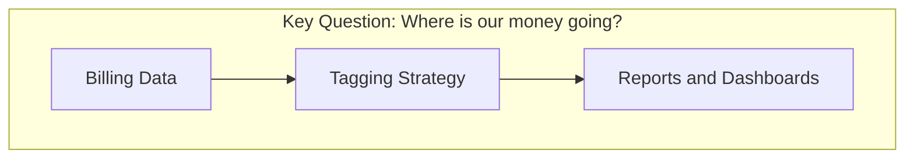
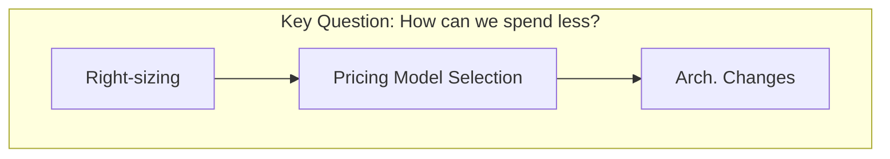
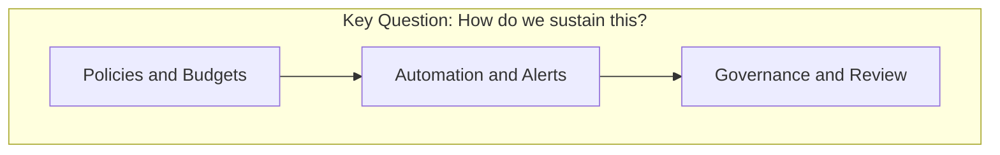
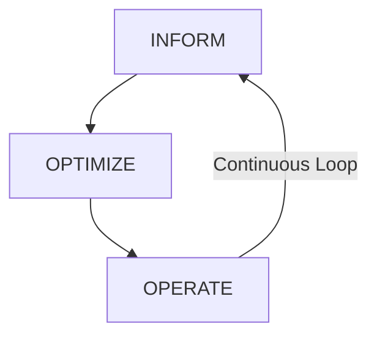
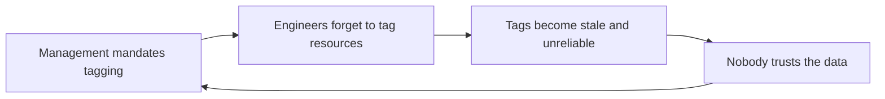

> **Discipline Module** | Complexity: `[QUICK]` | Time: 1.5h

## Prerequisites

Before starting this module:
- **Required**: Basic understanding of cloud computing (AWS, GCP, or Azure)
- **Required**: Familiarity with on-demand cloud services (compute, storage, networking)
- **Recommended**: Access to a cloud billing console (even a free-tier account)
- **Recommended**: Spreadsheet skills for cost analysis

---

## What You'll Be Able to Do

After completing this module, you will be able to:

- **Design a FinOps practice with clear roles, responsibilities, and organizational reporting structures**
- **Implement cloud cost visibility using tagging strategies and cost allocation frameworks**
- **Analyze cloud spending patterns to identify waste, anomalies, and optimization opportunities**
- **Build FinOps maturity assessments that track progress from reactive cost management to proactive optimization**

## Why This Module Matters

Your company just got its first six-figure cloud bill. The CTO is panicking. The VP of Engineering says "we need to optimize." The CFO wants to know *who* spent *what* and *why*.

Welcome to FinOps.

Cloud computing flipped the economics of IT upside down. Before cloud, you bought servers upfront (CapEx), and the finance team amortized them over 3-5 years. Predictable. Boring. Safe.

Now? Any developer with an AWS credential can spin up a $50,000/month machine learning cluster before lunch. The bill arrives 30 days later. Finance has no idea what `m6i.24xlarge` means, and Engineering has no idea what "accrual accounting" means.

**FinOps bridges this gap.** It's a cultural practice that brings financial accountability to cloud spending — giving engineers the data they need to make smart tradeoffs, and giving finance the visibility they need to sleep at night.

> **Stop and think**: If an engineering team provisions a cluster that costs twice as much but enables releasing features twice as fast, is that an optimization or a waste? FinOps provides the framework to answer this.

Without FinOps:
- Cloud bills grow 20-35% faster than revenue
- Teams hoard resources "just in case"
- Nobody knows the true cost of a feature
- Finance discovers overruns weeks after they happen

With FinOps:
- Teams own their spend and optimize proactively
- Cost is a first-class engineering metric
- Unit economics drive architectural decisions
- Finance and Engineering speak the same language

---

## Did You Know?

- **Gartner estimates that through 2025, 60% of infrastructure and operations leaders will encounter public cloud cost overruns** that negatively impact their budgets. Most organizations waste 25-35% of their cloud spend on idle or over-provisioned resources.

- **The FinOps Foundation (part of The Linux Foundation) has over 12,000 members** from companies like Google, Microsoft, Spotify, and Nike. FinOps is now a recognized discipline with its own certification (FinOps Certified Practitioner), framework, and community — not just "someone looking at the bill."

- **Netflix famously spends over $1 billion annually on AWS**, but their cost per streaming hour has dropped consistently year over year. That's FinOps in action — not reducing spend, but maximizing *value per dollar spent*.

---

## The FinOps Foundation Framework

The FinOps Foundation defines a lifecycle with three phases. Think of it as a continuous improvement loop, not a one-time project.

### Phase 1: Inform

**Goal**: See what you're spending, who's spending it, and whether it aligns with business value.

This is where most organizations start — and many never leave. Visibility is the foundation.



Key activities in the Inform phase:
- **Ingest billing data** from all cloud providers
- **Tag resources** so costs can be attributed to teams, products, and environments
- **Build dashboards** that show spend trends, anomalies, and forecasts
- **Allocate shared costs** (networking, support, platform teams)
- **Define unit economics** (cost per customer, cost per transaction)

### Phase 2: Optimize

**Goal**: Reduce waste and improve the cost efficiency of cloud resources.

Once you can see where the money goes, you can start making it go further.



Key activities in the Optimize phase:
- **Rightsize instances** — match resources to actual utilization
- **Select pricing models** — Reserved Instances, Savings Plans, Spot
- **Eliminate waste** — unused resources, old snapshots, idle load balancers
- **Architect for cost** — serverless, autoscaling, multi-tier storage

### Phase 3: Operate

**Goal**: Build organizational processes that sustain cost optimization continuously.

This is where FinOps becomes a *culture*, not just a project.



Key activities in the Operate phase:
- **Set budgets and alerts** per team, environment, and project
- **Automate cost controls** — scheduled shutdowns, auto-rightsizing
- **Establish governance** — approval workflows for expensive resources
- **Regular reviews** — weekly cost standups, monthly business reviews
- **Continuous improvement** — refine forecasts, update commitments

### The Lifecycle in Motion

These phases aren't sequential. A mature FinOps practice runs all three simultaneously:



---

## Cloud Billing 101

### The Three Dimensions of Cloud Cost

Every cloud resource has a cost determined by three factors:

| Dimension | Description | Example |
|-----------|-------------|---------|
| **Resource type** | What you're using | EC2 instance, S3 bucket, RDS database |
| **Usage quantity** | How much/long you use it | 730 hours, 500 GB, 1M API calls |
| **Pricing model** | How you pay | On-demand, Reserved, Spot |

Understanding these dimensions is the key to reading any cloud bill.

### Pricing Models Explained

#### On-Demand (Pay-As-You-Go)

The default. No commitment. Maximum flexibility. Maximum price.

```text
On-Demand Pricing:
----------------------------------------
m6i.xlarge (4 vCPU, 16 GB RAM)

Price: $0.192/hour
Monthly (730h): ~$140
Annual: ~$1,681

Pros: No commitment, scale up/down
Cons: Most expensive per hour
----------------------------------------
```

**When to use**: Unpredictable workloads, short-term projects, development environments during business hours only.

#### Reserved Instances (RIs)

Commit to 1 or 3 years of usage in exchange for a discount.

```text
Reserved Instance Pricing (m6i.xlarge):
----------------------------------------
Payment Options:

1-Year No Upfront:    $0.125/hr (35%)
1-Year All Upfront:   $0.114/hr (41%)
3-Year No Upfront:    $0.089/hr (54%)
3-Year All Upfront:   $0.072/hr (63%)

Savings vs On-Demand: 35-63%
Risk: Pay even if unused
----------------------------------------
```

**When to use**: Stable, predictable workloads that run 24/7 — databases, core application servers, baseline capacity.

#### Savings Plans

AWS-specific. Commit to a $/hour spend level, not specific instance types.

```text
Savings Plans:
----------------------------------------
Commit: $10/hour for 1 year
Flexibility: Any instance family/size
Discount: Up to 72% vs On-Demand

Compute SP: Any instance, any region
EC2 SP: Specific family, any size

Better than RIs for:
- Teams that change instance types
- Multi-region deployments
- Workloads migrating to Graviton
----------------------------------------
```

**When to use**: When you want RI-like savings but need flexibility to change instance types, sizes, or regions.

#### Spot Instances

Use spare cloud capacity at up to 90% discount. The catch? The cloud provider can reclaim them with 2 minutes' notice.

```text
Spot Instance Pricing (m6i.xlarge):
----------------------------------------
On-Demand:  $0.192/hr
Spot:       $0.038/hr (80% savings)

Warning - Interruption rate varies:
  m6i.xlarge: ~5% monthly
  c6i.2xlarge: ~3% monthly
  r5.large: ~8% monthly

Best for: Batch, CI/CD, stateless apps
Bad for: Databases, stateful workloads
----------------------------------------
```

> **Stop and think**: If Spot instances are up to 90% cheaper, why wouldn't you run your primary database on them? The risk of unpredictable termination makes them unsuitable for stateful workloads without robust external replication and failover mechanisms.

**When to use**: Fault-tolerant, stateless workloads — batch processing, CI/CD, dev/test, data processing, machine learning training.

### Pricing Model Comparison

| Model | Savings | Commitment | Flexibility | Best For |
|-------|---------|------------|-------------|----------|
| On-Demand | 0% | None | Full | Spiky/unpredictable |
| Reserved (1yr) | 35-41% | 1 year | Low | Stable baseline |
| Reserved (3yr) | 54-63% | 3 years | Very low | Long-term core infra |
| Savings Plans | 30-72% | 1-3 years | Medium | Flexible commitment |
| Spot | 60-90% | None | Full (but interruptible) | Fault-tolerant batch |

---

## CapEx vs OpEx: Why It Matters

This isn't just an accounting detail. The CapEx-to-OpEx shift fundamentally changes how organizations plan and budget for technology.

### Capital Expenditure (CapEx)

```text
Traditional Data Center (CapEx):
----------------------------------------------
Year 0: Buy $500,000 of servers
Year 1: Depreciate $100K, use 20% capacity
Year 2: Depreciate $100K, use 45% capacity
Year 3: Depreciate $100K, use 70% capacity
Year 4: Depreciate $100K, use 90% capacity
Year 5: Depreciate $100K, need more capacity

Total Cost: $500K + maintenance + power
Utilization: Averaged 53% over 5 years
Wasted: 47% of capacity
----------------------------------------------
```

**Characteristics**:
- Large upfront investment
- Predictable annual depreciation
- Assets appear on balance sheet
- Long procurement cycles (weeks to months)
- You pay whether you use it or not

### Operational Expenditure (OpEx)

```text
Cloud (OpEx):
----------------------------------------------
Month 1: $8,200  (launch, testing)
Month 2: $11,400 (growing users)
Month 3: $15,800 (marketing push)
Month 4: $9,100  (optimized after review)
Month 5: $12,600 (seasonal uptick)
Month 6: $7,300  (rightsized instances)

Total: $64,400 for 6 months
Pay for what you use, when you use it
Scale up for peaks, scale down for troughs
----------------------------------------------
```

**Characteristics**:
- No upfront investment
- Variable monthly costs
- Expenses on income statement (not balance sheet)
- Instant provisioning (minutes)
- You pay only for what you consume

### Why Finance Cares

| Concern | CapEx | OpEx (Cloud) |
|---------|-------|--------------|
| Budget predictability | High (fixed depreciation) | Low (variable monthly) |
| Cash flow impact | Large upfront | Spread over time |
| Tax treatment | Depreciated over years | Deducted immediately |
| Financial planning | Annual cycle | Continuous forecasting |
| Approval process | Board/CFO approval | Often decentralized |

**The FinOps challenge**: Finance teams built processes for CapEx. Cloud (OpEx) breaks those processes. FinOps builds new ones.

---

## Tagging: The Foundation of Cost Visibility

Tags are key-value pairs attached to cloud resources. Without tags, your bill is a single number. With tags, it's a detailed breakdown by team, project, environment, and business unit.

> **Pause and predict**: If you enforce tagging starting today, what happens to the visibility of the infrastructure created yesterday?

### Why Tagging Fails (and How to Fix It)

Most organizations start tagging and give up within 3 months. Here's why:



### A Tagging Strategy That Works

**Mandatory tags** (enforce via policy — block resource creation without them):

| Tag Key | Example Values | Purpose |
|---------|---------------|---------|
| `team` | `payments`, `search`, `platform` | Cost attribution |
| `environment` | `production`, `staging`, `development` | Environment cost split |
| `service` | `checkout-api`, `user-service` | Service-level costing |
| `cost-center` | `CC-4521`, `CC-7803` | Finance mapping |

**Recommended tags** (useful but not blocking):

| Tag Key | Example Values | Purpose |
|---------|---------------|---------|
| `owner` | `jane.smith`, `team-payments` | Accountability |
| `project` | `migration-v2`, `black-friday` | Project tracking |
| `managed-by` | `terraform`, `helm`, `manual` | IaC compliance |
| `expiry` | `2026-06-30` | Cleanup automation |

### Enforcing Tags

Tags only work if they're enforced. Here's a Terraform example using AWS:

```hcl
# AWS Organization Tag Policy
resource "aws_organizations_policy" "tag_policy" {
  name    = "mandatory-tags"
  type    = "TAG_POLICY"
  content = jsonencode({
    tags = {
      team = {
        tag_key = {
          "@@assign" = "team"
        }
        enforced_for = {
          "@@assign" = [
            "ec2:instance",
            "ec2:volume",
            "rds:db",
            "s3:bucket"
          ]
        }
      }
      environment = {
        tag_key = {
          "@@assign" = "environment"
        }
        tag_value = {
          "@@assign" = [
            "production",
            "staging",
            "development",
            "sandbox"
          ]
        }
        enforced_for = {
          "@@assign" = [
            "ec2:instance",
            "ec2:volume",
            "rds:db"
          ]
        }
      }
    }
  })
}
```

---

## Unit Economics: The North Star

Raw cloud spend is meaningless without context. Spending $200,000/month on cloud sounds alarming — until you learn you're serving 10 million customers and each one generates $5/month in revenue.

**Unit economics** connects cloud cost to business value.

> **Pause and predict**: If your cloud bill increases by 50% next month, but your unit cost per transaction drops by 10%, how should finance interpret this change?

### Common Unit Metrics

| Business Type | Unit Metric | Example |
|---------------|------------|---------|
| SaaS | Cost per customer | $0.83/customer/month |
| E-commerce | Cost per transaction | $0.012/order |
| Streaming | Cost per stream hour | $0.0031/hour |
| API platform | Cost per API call | $0.000042/call |
| Gaming | Cost per daily active user | $0.15/DAU |

### Calculating Unit Economics

```text
Step 1: Total cloud cost for the service
  → $42,000/month for the checkout service

Step 2: Total business units processed
  → 3.2 million orders/month

Step 3: Divide
  → $42,000 / 3,200,000 = $0.013/order

Step 4: Track the trend
  → Last month: $0.015/order
  → This month: $0.013/order
  → Improving! Cost efficiency increased 13%
```

**Why this matters**: If your cost per order is $0.013 but your margin per order is $2.50, you know infrastructure is ~0.5% of revenue. That's healthy. If it's 15% of revenue, you have a problem.

---

## Common Mistakes

| Mistake | Why It Happens | How to Fix It |
|---------|---------------|---------------|
| Treating FinOps as a one-time project | Leadership wants quick savings | Establish continuous review cadence |
| Only looking at total spend | Aggregate numbers hide waste | Break down by team, service, environment |
| Buying RIs/SPs too early | Premature commitment before understanding usage | Observe 2-3 months of usage patterns first |
| No tagging enforcement | "We'll add tags later" | Enforce at resource creation, not retroactively |
| Ignoring data transfer costs | Focus only on compute/storage | Data transfer is often 8-15% of total bill |
| Cost optimization = cutting spend | Confusing efficiency with austerity | Focus on unit economics, not raw spend |
| Centralized FinOps team does everything | One team can't optimize for 50 engineering teams | Decentralize ownership, centralize tooling |
| Ignoring committed spend utilization | Buy RIs then forget to track usage | Monitor RI/SP utilization weekly |

---

## Quiz

### Question 1
Your organization has just migrated its main application to the cloud. The CFO is concerned about upcoming bills and wants to establish a FinOps practice. You are tasked with leading this initiative. What three continuous phases should you implement to ensure long-term cost efficiency?

<details>
<summary>Show Answer</summary>

**Inform, Optimize, Operate.** The Inform phase must be established first to give you visibility into spending across all your new cloud resources. Then, the Optimize phase allows you to systematically reduce waste and improve efficiency based on that data. Finally, the Operate phase builds sustainable processes, guardrails, and governance to maintain efficiency as the infrastructure grows. Crucially, these three phases run continuously as a never-ending cycle, not as a one-time implementation project.
</details>

### Question 2
A workload runs 24/7 and has been stable for 8 months. It currently uses On-Demand instances costing $2,100/month. Which pricing model would you recommend and why?

<details>
<summary>Show Answer</summary>

You should recommend **Reserved Instances or Savings Plans** for this workload. With 8 months of stable usage data, this workload is a strong candidate for commitment-based pricing rather than on-demand. A 1-Year All Upfront RI could save approximately 41%, bringing the cost down to around $1,240/month and resulting in significant annual savings. However, if the engineering team suspects they might need to change instance types or scale across regions in the future, a Compute Savings Plan offers a similar financial benefit while preserving necessary architectural flexibility.
</details>

### Question 3
Your company's cloud bill is $180,000/month, but only 62% of resources have proper tags. Why is this a problem, and what would you do?

<details>
<summary>Show Answer</summary>

Without tags on 38% of resources, you cannot accurately attribute approximately $68,400/month to any specific team or project. This massive blind spot makes cost optimization nearly impossible because you cannot determine who owns the resources or whether they are actively needed for business value. To fix this, you must first implement tag enforcement policies that block the creation of new resources without mandatory tags. Then, you should organize a tagging remediation sprint to retroactively map existing untagged resources, aiming for a compliance target of 95% or higher within the next 60 days.
</details>

### Question 4
Your startup recently shifted its infrastructure from an on-premises data center to a public cloud provider. The finance director is struggling to forecast the quarterly budget using their traditional spreadsheet models. How does the transition from CapEx to OpEx explain this difficulty, and what must the finance team change?

<details>
<summary>Show Answer</summary>

**CapEx** (Capital Expenditure) involves a large upfront purchase that is depreciated over years, making it highly predictable and planned. **OpEx** (Operational Expenditure) is a pay-as-you-go model that is inherently variable and immediate. The shift to cloud moves IT spending entirely from CapEx to OpEx, which invalidates forecasting models built around predictable annual depreciation schedules. Furthermore, in the cloud, any engineer can provision resources and generate expenses on demand without going through a traditional procurement pipeline. Finance teams must therefore transition from static annual budgeting cycles to continuous, dynamic forecasting, working closely with engineering teams to understand real-time utilization trends.
</details>

### Question 5
During a monthly review meeting, the VP of Engineering proudly announces that the cloud bill has remained steady at $300,000 per month for the past quarter. However, the FinOps practitioner argues that this number alone is insufficient to determine if the company is managing its cloud resources effectively. Why is raw spend inadequate for decision-making, and what framework should be used instead?

<details>
<summary>Show Answer</summary>

Raw spend alone is completely inadequate because it lacks business context and fails to indicate whether the infrastructure investment is actually efficient. For example, a stable $300,000 bill could be excellent news if the user base doubled during that quarter, or terrible news if the company lost half of its active customers. Instead, the organization must adopt unit economics, which ties the cloud spend to a specific business metric such as cost per customer or cost per transaction. This framework reveals the true efficiency of the cloud usage. If the cost per transaction decreases over time while the total spend remains flat, the organization is successfully optimizing its operations and supporting sustainable growth.
</details>

---

## Hands-On Exercise: Analyze a Cloud Bill

In this exercise, you'll analyze a simplified AWS Cost and Usage Report (CUR) to identify spending patterns, waste, and optimization opportunities.

### Setup

Create a sample CUR dataset:

```bash
mkdir -p ~/finops-lab && cd ~/finops-lab

cat > cloud_bill.csv << 'EOF'
date,team,service,resource_type,environment,usage_hours,cost_usd
2026-03-01,payments,EC2,m6i.2xlarge,production,744,285.12
2026-03-01,payments,EC2,m6i.xlarge,production,744,142.56
2026-03-01,payments,RDS,db.r6g.xlarge,production,744,401.28
2026-03-01,payments,S3,Standard,production,744,23.50
2026-03-01,payments,EC2,m6i.xlarge,staging,744,142.56
2026-03-01,search,EC2,c6i.4xlarge,production,744,487.68
2026-03-01,search,EC2,c6i.2xlarge,production,744,243.84
2026-03-01,search,ElastiCache,cache.r6g.xlarge,production,744,327.36
2026-03-01,search,EC2,c6i.xlarge,development,744,121.92
2026-03-01,search,EC2,c6i.xlarge,staging,744,121.92
2026-03-01,platform,EC2,m6i.xlarge,production,744,142.56
2026-03-01,platform,EKS,cluster,production,744,73.00
2026-03-01,platform,EC2,t3.medium,development,744,30.26
2026-03-01,platform,EC2,t3.large,development,200,15.28
2026-03-01,platform,NAT Gateway,per-GB,production,744,89.50
2026-03-01,untagged,,m6i.4xlarge,unknown,744,570.24
2026-03-01,untagged,,t3.xlarge,unknown,744,121.18
2026-03-01,untagged,,EBS gp3 500GB,,744,40.00
2026-03-01,ml-team,EC2,p3.2xlarge,development,186,568.26
2026-03-01,ml-team,EC2,p3.2xlarge,development,0,0.00
2026-03-01,ml-team,S3,Standard,production,744,156.80
2026-03-01,data,EC2,r6i.2xlarge,production,744,362.88
2026-03-01,data,RDS,db.r6g.2xlarge,production,744,802.56
2026-03-01,data,EC2,m6i.xlarge,staging,400,76.80
EOF

echo "Sample CUR data created."
```

### Analysis Tasks

Use standard command-line tools to answer these questions:

**Task 1: Total spend by team**

```bash
cd ~/finops-lab

# Calculate total cost per team
awk -F',' 'NR>1 {team[$2]+=$7} END {for(t in team) printf "%-12s $%9.2f\n", t, team[t] | "sort -t$ -k2 -rn"}' cloud_bill.csv
```

Expected output (approximate):
```text
data         $  1,242.24
search       $  1,302.72
payments     $    995.02
untagged     $    731.42
ml-team      $    725.06
platform     $    350.60
```

**Task 2: Identify the untagged resources**

```bash
# Find untagged resources and their costs
awk -F',' 'NR>1 && $2=="untagged" {printf "Resource: %-15s Env: %-10s Cost: $%.2f\n", $4, $5, $7}' cloud_bill.csv
```

**Task 3: Non-production spend**

```bash
# Calculate spend by environment
awk -F',' 'NR>1 {env[$5]+=$7} END {for(e in env) printf "%-15s $%9.2f\n", e, env[e] | "sort -t$ -k2 -rn"}' cloud_bill.csv
```

**Task 4: Optimization opportunities report**

```bash
cat > analyze_bill.sh << 'SCRIPT'
#!/bin/bash
echo "=========================================="
echo "  FinOps Analysis Report"
echo "  Date: $(date +%Y-%m-%d)"
echo "=========================================="
echo ""

FILE="cloud_bill.csv"
TOTAL=$(awk -F',' 'NR>1 {sum+=$7} END {printf "%.2f", sum}' "$FILE")
echo "TOTAL MONTHLY SPEND: \$$TOTAL"
echo ""

echo "--- Spend by Team ---"
awk -F',' 'NR>1 {team[$2]+=$7} END {for(t in team) printf "  %-12s $%9.2f\n", t, team[t]}' "$FILE" | sort -t'$' -k2 -rn
echo ""

echo "--- Spend by Environment ---"
awk -F',' 'NR>1 && $5!="" {env[$5]+=$7} END {for(e in env) printf "  %-15s $%9.2f\n", e, env[e]}' "$FILE" | sort -t'$' -k2 -rn
echo ""

UNTAGGED=$(awk -F',' 'NR>1 && $2=="untagged" {sum+=$7} END {printf "%.2f", sum}' "$FILE")
PCT=$(echo "scale=1; $UNTAGGED * 100 / $TOTAL" | bc)
echo "--- Tagging Compliance ---"
echo "  Untagged spend: \$$UNTAGGED ($PCT% of total)"
echo ""

echo "--- Optimization Opportunities ---"
# ML GPU running only 186 of 744 hours = 25% utilization
echo "  1. ML GPU (p3.2xlarge): Only 186/744 hours used (25% utilization)"
echo "     → Use Spot instances or schedule start/stop = save ~\$400/mo"
echo ""
echo "  2. Idle ML GPU (p3.2xlarge): 0 hours, still allocated"
echo "     → Terminate immediately = save up to \$568/mo"
echo ""
echo "  3. Staging instances running 24/7 (payments, search)"
echo "     → Schedule business-hours only = save ~55% (~\$145/mo)"
echo ""
echo "  4. Untagged resources: \$$UNTAGGED/mo with no owner"
echo "     → Tag or terminate = potential savings \$$UNTAGGED/mo"
echo ""

POTENTIAL="1,113"
echo "ESTIMATED MONTHLY SAVINGS: ~\$$POTENTIAL (potential)"
SCRIPT

chmod +x analyze_bill.sh
bash analyze_bill.sh
```

### Success Criteria

You've completed this exercise when you:
- [ ] Created the sample CUR dataset
- [ ] Identified total spend by team (data and search are top spenders)
- [ ] Found untagged resources ($731 in unattributed spend)
- [ ] Calculated non-production spend percentage
- [ ] Identified at least 3 optimization opportunities
- [ ] Generated a summary report with estimated savings

---

## Key Takeaways

1. **FinOps is a cultural practice, not a tool** — it brings financial accountability to the speed of cloud
2. **The lifecycle is continuous** — Inform, Optimize, Operate runs as a never-ending loop
3. **Pricing models are levers** — matching the right model (On-Demand, RI, SP, Spot) to each workload saves 30-80%
4. **Tags are the foundation** — without tags, you're flying blind on cost attribution
5. **Unit economics matter more than total spend** — cost per customer tells you if you're efficient, raw spend doesn't

---

## Further Reading

**Books**:
- **"Cloud FinOps"** — J.R. Storment & Mike Fuller (the definitive FinOps book, O'Reilly)
- **"Cloud Cost Optimization Handbook"** — Google Cloud Architecture Center (free online)

**Resources**:
- **FinOps Foundation Framework** — finops.org/framework (the complete FinOps framework)
- **AWS Cost and Usage Report** — docs.aws.amazon.com/cur (understand your AWS bill)
- **FinOps Certified Practitioner** — finops.org/certification (professional certification)

**Talks**:
- **"FinOps: The Operating Model for Cloud"** — J.R. Storment (YouTube, KubeCon)
- **"How Spotify Manages Cloud Costs"** — FinOps Summit (YouTube)

---

## Summary

FinOps transforms cloud spending from an unpredictable cost center into a managed business driver. By following the Inform-Optimize-Operate lifecycle, implementing robust tagging, choosing the right pricing models, and tracking unit economics, teams can reduce cloud waste by 25-40% while maintaining — or even improving — the speed and agility that cloud provides.

The key insight is that FinOps is not about spending *less*. It's about spending *better*. A company that doubles its cloud bill while tripling its revenue has better FinOps than one that cuts spending 20% and stalls growth.

---

## Next Module

Continue to [Module 1.2: Kubernetes Cost Allocation & Visibility](../module-1.2-k8s-cost-allocation/) to learn how to attribute cloud costs in multi-tenant Kubernetes clusters.

---

*"The cloud bill is not a cost — it's a business metric."* — FinOps Foundation