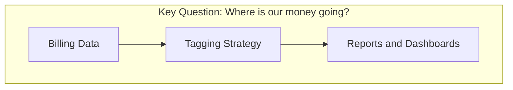
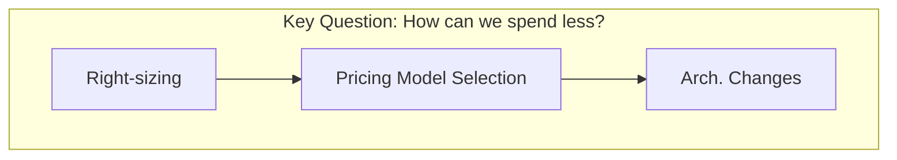
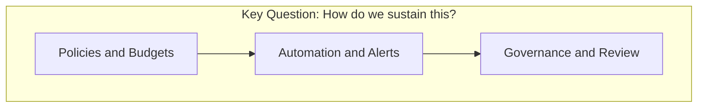
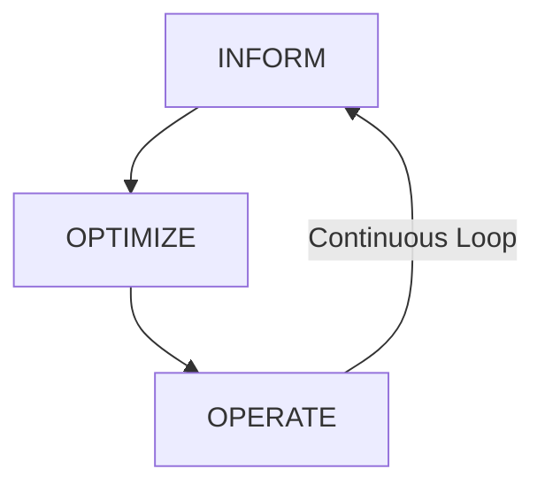
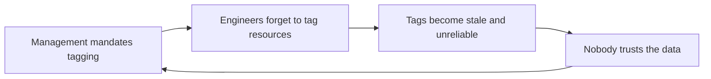
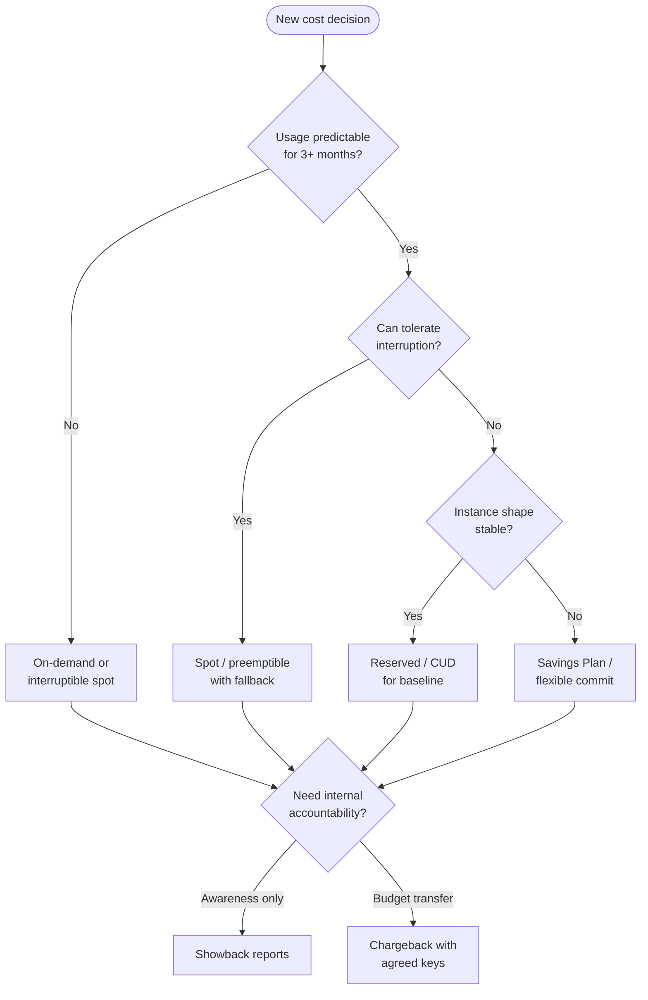

> **Discipline Module** | Complexity: `[QUICK]` | Time: 1.5h

## Prerequisites

This module assumes you already understand what compute, storage, and networking mean in a public cloud context — any major provider suffices. You should be comfortable reading a monthly invoice or cost export at a high level, even if you have never built a FinOps practice. Access to a billing console or sample Cost and Usage Report accelerates the hands-on exercise, and basic spreadsheet or command-line aggregation skills help you reproduce the analysis patterns on your own data.

---

## What You'll Be Able to Do

When you finish this module, you can explain how FinOps connects engineering decisions to financial outcomes and apply that lens to real invoices. The following outcomes describe specific capabilities you will practice in the sections and assessments below:

- **Design a FinOps practice with clear roles, responsibilities, and organizational reporting structures**
- **Implement cloud cost visibility using tagging strategies and cost allocation frameworks**
- **Analyze cloud spending patterns to identify waste, anomalies, and optimization opportunities**
- **Build FinOps maturity assessments that track progress from reactive cost management to proactive optimization**

## Why This Module Matters

Your company just received its first six-figure cloud bill. The CTO is alarmed because infrastructure spend jumped faster than revenue. The VP of Engineering says the team must optimize immediately, but nobody can explain which product lines drove the increase. The CFO wants to know who spent what, and whether that spend produced measurable business value.

Cloud computing inverted the economics of IT. Before cloud, you bought servers upfront as capital expenditure, and finance amortized those assets over three to five years. Procurement cycles were slow, but budgets were predictable. Engineers requested hardware months in advance; finance signed purchase orders once per quarter.

Now any developer with cloud credentials can provision compute, storage, and managed services in minutes. The invoice arrives weeks later, often with line items that finance cannot map to products or teams. Engineering speaks in requests, limits, and availability zones; finance speaks in cost centers, accruals, and variance reports. Without a shared language, both sides talk past each other while spend compounds.

FinOps bridges this gap. It is a cultural practice — not a single tool — that brings financial accountability to the speed and elasticity of cloud. Engineers receive timely, actionable cost data so they can trade off performance, reliability, and price deliberately. Finance receives allocation coverage and unit economics so forecasts reflect how the business actually consumes infrastructure.

> **Stop and think**: If an engineering team provisions a cluster that costs twice as much but enables releasing features twice as fast, is that optimization or waste? FinOps provides the framework to answer that question with evidence instead of opinion.

Without FinOps, cloud bills can grow faster than the business value they support. Teams hoard capacity just in case. Nobody knows the true cost of shipping a feature. Finance discovers overruns only after month-end close. With FinOps, teams own their spend, cost becomes a first-class engineering metric, and leadership decisions rest on unit economics rather than a single scary total.

Hypothetical scenario: A product organization launches a successful campaign that doubles traffic over a weekend. Gross cloud spend rises sharply while cost per active user actually improves because autoscaling absorbed the spike without emergency hardware purchases. FinOps gives leadership the vocabulary to celebrate efficient growth instead of punishing the team that kept the service available. The opposite story — flat revenue with climbing unit cost — becomes visible early enough to investigate architecture and allocation before the quarter closes.

---

## Part 1: The FinOps Lifecycle — Inform, Optimize, Operate

The FinOps Foundation defines a lifecycle with three phases that run as a continuous improvement loop, not a one-time project. Mature organizations execute all three phases simultaneously: you never finish informing, because new services and teams constantly appear; you never finish optimizing, because workloads and prices change; you never finish operating, because governance and culture require ongoing reinforcement.

### Phase 1: Inform — See Where Money Goes

The Inform phase answers one question: where is our money going, and does that spending align with business priorities? Most organizations begin here, and many stall because they treat visibility as a dashboard project instead of a data-quality discipline. Inform produces trusted allocation, baseline unit economics, and shared vocabulary between engineering and finance.


```mermaid
graph LR
    subgraph INFORM [Key Question: Where is our money going?]
        direction LR
        A[Billing Data] --> B[Tagging Strategy]
        B --> C[Reports and Dashboards]
    end
```

Ingesting billing data from every cloud account and service is the mechanical first step. Raw invoices and Cost and Usage Reports must land in a warehouse or cost tool with consistent granularity — hourly or daily, by resource, by tag, by region. Tagging strategy turns that raw feed into attributable spend: without labels, you see totals; with labels, you see owners. Dashboards and reports translate attributed data into trends, anomalies, and forecasts that teams review on a cadence.

Finance teams often receive consolidated invoices while engineering teams experience cost through accounts, subscriptions, or folders. Inform must reconcile those hierarchies so a single service owner does not appear under three different names in three exports. Standardize account naming, map subscriptions to cost centers, and document which organizational unit owns shared networking assets before you publish the first showback deck.

Inform also allocates shared costs — networking, support plans, platform engineering, security tooling — using rules everyone agrees on before the numbers appear in a chargeback report. Changing the key monthly destroys trust; document assumptions and revisit on a quarterly cadence. Finally, Inform defines unit economics: cost per customer, per transaction, or per API call. Those ratios become the north star that prevents panic when gross spend rises alongside healthy growth.

### Phase 2: Optimize — Spend Smarter, Not Just Less

Optimize asks how to improve cost efficiency without breaking reliability or delivery speed. Visibility alone does not save money; informed engineering decisions do. Rightsizing matches provisioned capacity to measured utilization. Pricing model selection trades flexibility for discount through reservations, savings plans, or spot capacity where interruption tolerance exists.

Optimize is where engineering judgment matters most. A smaller instance type might save money but violate latency SLOs during traffic spikes. FinOps practitioners bring data — utilization percentiles, throttling events, error budgets — so teams choose informed tradeoffs instead of defaulting to the largest available SKU because an incident once caused pain.


```mermaid
graph LR
    subgraph OPTIMIZE [Key Question: How can we spend less?]
        direction LR
        A[Right-sizing] --> B[Pricing Model Selection]
        B --> C[Arch. Changes]
    end
```

Eliminating waste — idle instances, orphaned volumes, forgotten load balancers — often yields fast wins with low risk. Architectural changes — tiered storage, autoscaling, serverless for spiky work — compound savings over quarters. Optimize is iterative: each change shifts utilization patterns, which may invalidate yesterday's reservation strategy. That is why Optimize runs in parallel with Inform, not after it.

### Phase 3: Operate — Sustain the Practice

Operate embeds cost discipline into how the organization works every day. Budgets and alerts translate forecasts into guardrails teams feel before month-end surprises. Automation enforces policies: scheduled shutdowns for non-production environments, tag enforcement at deploy time, approval workflows for expensive SKUs.


```mermaid
graph LR
    subgraph OPERATE [Key Question: How do we sustain this?]
        direction LR
        A[Policies and Budgets] --> B[Automation and Alerts]
        B --> C[Governance and Review]
    end
```

Governance defines who can approve exceptions and how escalations work when a team exceeds budget. A mature Operate practice documents exception paths — who can approve a temporary GPU cluster for a training sprint, for how long, and with what post-hoc review — so urgency during incidents does not become permanent expensive footprint.

Regular reviews — weekly engineering cost standups, monthly business reviews with finance — keep attention on unit economics instead of one annual scramble. Continuous improvement refines forecasts, revisits commitments, and updates allocation rules as the product portfolio evolves. Operate is also where you measure FinOps maturity honestly and publish next-quarter priorities based on gaps, not vanity scores.

### The Lifecycle in Motion

These phases are not a waterfall. A mature FinOps practice runs Inform, Optimize, and Operate as a single loop:


```mermaid
graph TD
    A[INFORM] --> B[OPTIMIZE]
    B --> C[OPERATE]
    C -->|Continuous Loop| A
```

When Inform exposes a tagging gap, Operate updates IaC policies. When Optimize rightsizes a service, Inform refreshes unit-cost dashboards. When Operate sets a budget alert, Optimize investigates the spike before it becomes structural waste. Treating any phase as "complete" is a category error: new services, acquisitions, and product lines continually reintroduce unknown spend that Inform must absorb.

### What Each Phase Produces

Inform delivers **trusted allocation** — tagged spend, shared-cost rules, allocation coverage metrics, and baseline unit economics. Optimize delivers **efficiency gains** — smaller footprints, better pricing-model fit, and architectural patterns that reduce waste without breaching SLOs. Operate delivers **sustainability** — budgets, forecasts, governance cadence, maturity scores, and cultural habits that survive reorganizations and leadership changes. Artifacts from each phase should be written down: allocation runbooks, commitment portfolios, and review agendas that new FinOps practitioners can inherit.

---

## Part 2: FinOps Foundation Framework — Domains, Capabilities, and Personas

The [FinOps Foundation Framework](https://www.finops.org/framework/) organizes durable practice into domains, capabilities, and personas. Domains describe *what* you manage: understanding cloud usage and cost, performance tracking and benchmarking, real-time decision making, cloud rate optimization, and organizational alignment. Capabilities describe *how* you execute within each domain — for example allocation, budgeting, forecasting, workload optimization, and licensing strategy.

Personas clarify who does what. Engineers and engineering managers consume allocation data and act on rightsizing recommendations. Finance and procurement own commitments, invoices, and variance analysis. Leadership sets guardrails and evaluates unit economics against business goals. Product managers connect feature investment to marginal infrastructure cost. A FinOps practitioner — sometimes a dedicated role, sometimes a coalition — coordinates tooling, cadence, and maturity assessments across those personas.

Designing a FinOps practice means wiring those personas into reporting structures that do not collapse into a central team doing everyone else's optimization. Central teams provide standards, tooling, and training; engineering teams own workload-level decisions because they understand latency, redundancy, and release risk. Finance owns the chart of accounts mapping and commitment portfolio. Leadership owns policy: when to prioritize margin versus speed, and which unit metric is authoritative for a given product line.

Reporting structures should make accountability obvious in every review deck. Engineering managers see their team's allocation trend and unit metric; finance sees commitment utilization and forecast variance; product sees marginal infrastructure cost of roadmap bets. When those views disagree, the FinOps practitioner investigates data quality first — duplicate tags, missing shared splits, stale forecasts — before declaring a team "out of control."

### Maturity: Crawl, Walk, Run

The framework describes maturity as crawl, walk, run — not a single maturity score for the whole company. An organization might *run* on reservation management while still *crawling* on Kubernetes allocation. Maturity assessments should score capabilities independently, publish gaps honestly, and sequence investments where low maturity blocks higher-value work.

| Maturity stage | Typical signal | Example focus |
|----------------|----------------|---------------|
| **Crawl** | Reactive, invoice-driven | Export bills, basic tagging, executive dashboard |
| **Walk** | Proactive team ownership | Showback, budgets, monthly reviews, RI/SP basics |
| **Run** | Embedded in engineering flow | Chargeback, automated policies, unit economics in OKRs |

Building a maturity assessment starts with capability checklists derived from the framework: allocation coverage percentage, forecast accuracy, commitment utilization, anomaly response time, and percentage of engineering teams receiving regular cost feedback. Reassess quarterly; celebrate crawl→walk progress on one capability instead of claiming FinOps is "done."

### Domains in Practice

**Understand cloud usage and cost** is the Inform backbone: ingestion, allocation, shared splits, and invoice reconciliation. **Quantify business value** connects those dollars to product outcomes — revenue per tenant, margin per order — so optimization debates reference value, not fear. **Optimize cloud rates and usage** covers rightsizing, commitment instruments, and architectural efficiency without confusing "cheaper" with "worse." **Manage the FinOps practice** covers personas, training, tooling standards, and the operating cadence that keeps finance and engineering aligned when priorities conflict.

---

## Part 3: Anatomy of a Cloud Bill

A cloud invoice is not one number — it is a stack of meters, each with its own unit and pricing axis. Learning to read those line items is the foundation of Inform. Most provider bills group spend into compute, storage, networking (especially data transfer and egress), and managed services (databases, Kubernetes control planes, message queues, observability backends).

Compute charges usually reflect instance hours, vCPU/memory size, and pricing model (on-demand, committed, spot). Storage bills combine capacity, access tier, and operations (PUT/LIST requests). Networking costs surprise teams because they are usage-based and cross-region: egress from a popular service to the public internet can dominate a seemingly small application. Managed services add their own SKUs — per-node cluster fees, per-GB ingestion, per-million API calls — that do not appear in simple VM spreadsheets.

Every charge sits on three durable dimensions that behave the same way whether you read an AWS, GCP, or Azure export: what resource type metered the usage, how much was consumed, and which pricing model applied to that consumption window. Internalizing those dimensions lets you compare rows across services without memorizing every product code.

| Dimension | Description | Example |
|-----------|-------------|---------|
| **Resource type** | What you're using | Virtual machine, object bucket, managed database |
| **Usage quantity** | How much or how long | Instance hours, stored gigabytes, API calls |
| **Pricing model** | How you pay | On-demand, committed discount, interruptible capacity |

Hypothetical scenario: A platform team sees a month-over-month jump from $120,000 to $158,000. Drilling into the bill reveals compute flat, storage up slightly, and networking egress doubling because a new analytics export copied production data cross-region nightly. Without line-item literacy, leadership might blame "too many servers" and miss the actual lever.

### Managed Services and Hidden Meters

Managed databases, Kubernetes control planes, message buses, and observability backends bill on their own meters — vCPU and storage for databases, per-cluster hourly fees, per-million requests, per-gigabyte ingestion. These lines rarely appear in the same spreadsheet engineers use for VM counts, yet they compound silently as microservices multiply. FinOps Inform must include managed SKUs in the same allocation taxonomy as compute instances, tagging the projects that provisioned them or mapping shared platform cost explicitly.

Support plans, enterprise agreements, and marketplace purchases add another layer above raw infrastructure. Finance often recognizes these centrally while engineering attributes workload cost locally. Document which fees stay corporate overhead versus which pass through to product P&L so chargeback debates do not reopen settled accounting policy every month.

### On-Demand, Committed, and Interruptible Pricing

On-demand is the default pay-as-you-go model: no commitment, maximum flexibility, highest unit price. Committed discounts — Reserved Instances, Savings Plans, Committed Use Discounts — trade term and predictability for lower rates. Interruptible capacity (Spot, Preemptible VMs) trades availability guarantees for steep discounts on spare capacity.

The durable principle is flexibility versus price, not memorizing every SKU name. Stable baselines belong on commitments once usage is observable. Bursty or experimental work stays on-demand or interruptible tiers with explicit fault-tolerance design. When in doubt, model three scenarios in a spreadsheet — on-demand only, partial commitment, full commitment — using your observed hourly usage before asking finance to sign a term.

Interruptible workloads require engineering guarantees, not finance optimism. Stateless workers, queue consumers, and batch jobs that checkpoint progress can survive reclamation events; synchronous user-facing paths usually cannot. Document interruption tolerance in service catalogs so FinOps reviewers do not accidentally recommend spot tiers for tiers that lack HA design.

```text
On-Demand Pricing (illustrative):
----------------------------------------
General-purpose instance (4 vCPU, 16 GB RAM)

Price: billed per hour, no term
Monthly (730h): moderate predictable baseline
Pros: No commitment, scale freely
Cons: Highest hourly rate
----------------------------------------
```

Committed pricing (illustrative) shows the same shape across providers: one- or three-year terms, optional upfront payment, discounts that increase with commitment length and payment upfront. Interruptible pricing adds reclamation notice — often minutes — so only fault-tolerant workloads qualify.

### Pricing Model Comparison

| Model | Savings (typical) | Commitment | Flexibility | Best For |
|-------|-------------------|------------|-------------|----------|
| On-Demand | Baseline | None | Full | Spiky or unknown usage |
| Reserved / CUD (1yr) | Moderate | One year | Low | Stable baseline |
| Reserved / CUD (3yr) | Higher | Multi-year | Very low | Long-lived core infra |
| Savings Plans | Moderate–high | Term + $/hr commit | Medium | Mixed instance shapes |
| Spot / Preemptible | High | None | Interruptible | Batch, CI, stateless burst |

The table below captures a **landscape snapshot — as of 2026-06. This changes fast; verify against vendor docs before relying on specifics.** Use it when you need indicative list prices during learning exercises, not as the basis for commitment contracts.

| Provider | On-demand example | 1-year committed (indicative) | Spot / preemptible note |
|----------|-------------------|----------------------------------|-------------------------|
| AWS | m6i.xlarge ~$0.19/hr on-demand | RI/SP discounts vary by payment option | Spot reclamation ~2 min notice |
| GCP | n2-standard-4 list pricing per hour | CUD % published per SKU | Preemptible termination at provider discretion |
| Azure | D-series pay-as-you-go | Reservation % by term and region | Spot eviction policy varies by SKU |

---

## Part 4: Allocation Hygiene — Tags, Coverage, and Shared Spend

Cost allocation assigns each dollar of cloud spend to an owner: team, product, environment, or cost center. Tags (cloud provider labels) and Kubernetes labels are the primary hygiene mechanism. Untagged and shared spend is the root problem in most Inform failures — not missing dashboards.

Without allocation coverage targets, organizations debate tools forever while the underlying data stays opaque. Set a published goal — for example, ninety percent attributable spend within two quarters — and report progress monthly alongside gross spend. When leadership sees coverage stall, invest in enforcement and remediation instead of another dashboard SKU.

**Allocation coverage** is the percentage of gross spend that carries attributable labels after applying agreed rules. If only sixty percent of spend is tagged, forty percent is effectively invisible in showback reports. Finance sees a blob labeled "unallocated" or "shared infrastructure," and engineering teams argue about fairness instead of optimizing workloads.

Shared costs — cluster control planes, NAT gateways, corporate VPNs, central logging — never map one-to-one to a single microservice. FinOps practice defines allocation keys upfront: proportional to CPU requests, per namespace, per egress gigabyte, or fixed splits documented in a runbook. Changing the key monthly destroys trust; document assumptions and revisit on a quarterly cadence.

### Showback versus Chargeback

**Showback** publishes cost reports to engineering without moving money. It builds awareness and accountability with low political friction — ideal when maturity is crawl or walk. **Chargeback** actually bills internal teams, mirroring external invoices inside corporate accounting. It forces discipline but requires finance readiness, accurate allocation, and executive sponsorship.

| Approach | Money moves? | Org readiness | Primary risk |
|----------|--------------|---------------|--------------|
| Showback | No | Crawl / Walk | Awareness without behavior change |
| Chargeback | Yes | Walk / Run | Disputes if allocation untrusted |
| Hybrid | Partial | Walk | Complexity without clear rules |

Hypothetical scenario: Platform engineering runs shared Kubernetes clusters for twelve teams. Showback reports attribute node and storage costs by namespace labels; shared ingress and control-plane fees split by CPU request share. After two quarters of stable reports, finance pilots chargeback for production namespaces only, keeping sandboxes on showback until tagging compliance exceeds ninety-five percent.

### Allocation Coverage as a KPI

Publish **allocation coverage** on the same dashboard as gross spend. Define the metric precisely: tagged attributable spend divided by total spend after agreed exclusions (taxes, corporate support, one-time credits). When coverage rises from sixty to ninety percent, optimization conversations shift from "whose is this?" to "should this workload exist?" — a sign Inform maturity is working. Module 1.2 extends these ideas to namespace labels, idle cost, and the request-versus-usage gap inside Kubernetes.

---

## Part 5: Tagging — The Foundation of Cost Visibility

[Tags are key-value pairs attached to cloud resources](https://docs.aws.amazon.com/organizations/latest/userguide/orgs_manage_policies_tag-policies.html). Without them, your bill is a single opaque total. With consistent tags, the same export powers team dashboards, anomaly detection, and commitment planning. Before you debate showback versus chargeback, ask whether allocation coverage is high enough for anyone to trust the numbers.

> **Pause and predict**: If you enforce tagging starting today, what happens to visibility for infrastructure created yesterday? Untagged legacy assets remain a blind spot until you remediate them or park their spend in an explicit shared-cost bucket that leadership acknowledges in every review.

Most organizations abandon tagging within a few months because enforcement is optional and retroactive cleanup is painful. The failure loop is predictable: leadership mandates tags, engineers forget during incidents, labels drift, finance stops trusting reports, and tagging is declared ineffective until the next invoice shock restarts the cycle.


```mermaid
graph LR
    A[Management mandates tagging] --> B[Engineers forget to tag resources]
    B --> C[Tags become stale and unreliable]
    C --> D[Nobody trusts the data]
    D --> A
```

Breaking the cycle requires prevention at creation time — IaC hooks, policy-as-code, and deploy pipelines that reject untagged resources — plus a bounded remediation sprint for legacy assets.

**Mandatory tags** should be few and stable; enforce them [via organization policy](https://docs.aws.amazon.com/organizations/latest/userguide/enforce-required-tag-keys-iac.html) so Terraform, CloudFormation, and Pulumi deployments cannot create noncompliant resources in the first place.

| Tag Key | Example Values | Purpose |
|---------|---------------|---------|
| `team` | `payments`, `search`, `platform` | Cost attribution |
| `environment` | `production`, `staging`, `development` | Environment cost split |
| `service` | `checkout-api`, `user-service` | Service-level costing |
| `cost-center` | `CC-4521`, `CC-7803` | Finance mapping |

Recommended tags add accountability without blocking deploys: `owner`, `project`, `managed-by`, and `expiry` for automated cleanup. Kubernetes inherits the same discipline via namespace labels and annotations that downstream allocation tools map to cloud resource tags on nodes and volumes.

```hcl
# AWS Organization Tag Policy (illustrative excerpt)
resource "aws_organizations_policy" "tag_policy" {
  name    = "mandatory-tags"
  type    = "TAG_POLICY"
  content = jsonencode({
    tags = {
      team = {
        tag_key = {
          "@@assign" = "team"
        }
        enforced_for = {
          "@@assign" = [
            "ec2:instance",
            "ec2:volume",
            "rds:db",
            "s3:bucket"
          ]
        }
      }
      environment = {
        tag_key = {
          "@@assign" = "environment"
        }
        tag_value = {
          "@@assign" = [
            "production",
            "staging",
            "development",
            "sandbox"
          ]
        }
        enforced_for = {
          "@@assign" = [
            "ec2:instance",
            "ec2:volume",
            "rds:db"
          ]
        }
      }
    }
  })
}
```

---

## Part 6: Unit Economics — The North Star

Raw cloud spend is meaningless without business context. Spending $200,000 per month sounds alarming until you divide by ten million active customers and compare infrastructure cost to revenue per customer. **Unit economics** connects cloud cost to value-producing activity and prevents both false panic and false comfort.

> **Pause and predict**: If your cloud bill rises fifty percent but unit cost per transaction falls ten percent, how should finance interpret the change?

| Business Type | Unit Metric | Illustrative shape |
|---------------|------------|-------------------|
| SaaS | Cost per customer | Dollars per customer per month |
| E-commerce | Cost per order | Cents per checkout |
| Streaming | Cost per stream hour | Fractions of a cent per hour |
| API platform | Cost per API call | Micro-dollars per request |

```text
Step 1: Total cloud cost for the service
  → $42,000/month for the checkout service

Step 2: Total business units processed
  → 3.2 million orders/month

Step 3: Divide
  → $42,000 / 3,200,000 = $0.013/order

Step 4: Track the trend month over month
```

Shared Kubernetes clusters break naive attribution because many teams share nodes, ingress, and control-plane overhead. A service's unit cost depends on allocation rules from Inform, not only on its own Pod count. Module 1.2 addresses namespace- and label-based attribution; here, recognize that unit economics without allocation hygiene measures fiction.

### Connecting Unit Economics to Product Decisions

Product and engineering leaders should review unit cost when prioritizing roadmap items. A feature that doubles infrastructure cost per user while improving retention might be an excellent trade; a feature that raises unit cost without measurable value is a tax on margins. FinOps does not replace product judgment — it supplies the denominator finance and engineering can argue about with shared data instead of competing anecdotes from last month's invoice PDF.

---

## Part 7: CapEx versus OpEx — Why Finance Cares

The shift from capital expenditure to operational expenditure is not accounting trivia — it changes who can spend, how fast budgets move, and which forecasts fail. CapEx bought depreciating assets with long procurement cycles. OpEx buys consumption with monthly variance tied directly to engineering activity.

```text
Traditional Data Center (CapEx):
----------------------------------------------
Year 0: Buy $500,000 of servers
Year 1: Depreciate $100K, use 20% capacity
Year 2: Depreciate $100K, use 45% capacity
Year 3: Depreciate $100K, use 70% capacity
Year 4: Depreciate $100K, use 90% capacity
Year 5: Depreciate $100K, need more capacity

Total Cost: $500K + maintenance + power
Utilization: Averaged roughly half of purchased capacity over five years
----------------------------------------------
```

```text
Cloud (OpEx):
----------------------------------------------
Month 1: $8,200  (launch, testing)
Month 2: $11,400 (growing users)
Month 3: $15,800 (marketing push)
Month 4: $9,100  (optimized after review)
Month 5: $12,600 (seasonal uptick)
Month 6: $7,300  (rightsized instances)

Total: $64,400 for six months
Pay for what you use, when you use it
----------------------------------------------
```

| Concern | CapEx | OpEx (Cloud) |
|---------|-------|--------------|
| Budget predictability | High (fixed depreciation) | Lower (variable monthly) |
| Cash flow impact | Large upfront | Spread over time |
| Approval process | Board/CFO for large buys | Often decentralized to engineers |
| Planning cycle | Annual | Continuous forecasting |

FinOps builds new processes — tagging, showback, unit metrics, commitment governance — because legacy CapEx playbooks cannot explain a bill that changes every time someone scales a Deployment.

---

## Part 8: Forecasting, Budgets, and Anomaly Detection

Operate-phase FinOps turns Inform data into forward-looking discipline. **Forecasting** projects spend from historical curves, planned launches, and known commitments. A forecast is not prophecy; it is a shared assumption finance and engineering can debate before money is spent. Start with tagged historical baselines, then layer growth scenarios: new region, doubled traffic, additional non-production environments for a release train.

**Budgets** translate forecasts into guardrails. Account-level budgets catch runaway accounts; team-level budgets connect ownership to consequences. Alerts should fire on trends — projected month-end overrun at mid-month — not only after the invoice closes. Pair dollar thresholds with unit-metric thresholds so a growing business is not punished for serving more customers efficiently.

**Anomaly detection** flags deviations from expected patterns: a sudden doubling of egress, a new untagged service family, a GPU instance type appearing in production without change approval. Automated detectors accelerate Inform; human review confirms whether the anomaly is attack, misconfiguration, or planned growth. Hypothetical scenario: A batch job misconfigured to sync logs cross-region triggers a networking spike. Anomaly alert routes to the owning team within hours instead of surfacing in finance's month-end variance deck.

Effective forecasting requires the same allocation hygiene as showback. If thirty percent of spend is untagged, thirty percent of your forecast is fiction. Mature programs publish forecast accuracy metrics — mean absolute percentage error by team — alongside the forecast itself so credibility compounds.

Budget owners should see unit metrics in the same view as dollar totals. A team under budget on dollars but over budget on cost per customer may still be harming margins. Conversely, a team over dollar budget while improving unit economics may deserve capacity for growth. Operate-phase reviews exist to disentangle those stories with data instead of rank by invoice slice alone.

---

## Part 9: Commitment Governance — Discounts Without Lock-In Regret

Commitment-based discounts are a durable FinOps concept across every hyperscaler: trade flexibility for lower unit price over a term. The failure mode is not using commitments; it is buying the wrong shape too early and paying for unused reservation capacity — **utilization** becomes the Operate metric that matters as much as discount percentage.

Governance starts after Inform establishes a stable baseline. Observe two to three months of hourly usage before converting on-demand baseline to reserved or savings-style commitments. Platform teams publish a **commitment portfolio**: which accounts hold which instruments, expiration dates, and coverage targets for steady-state compute. Finance owns renewal calendar; engineering owns shape accuracy.

When workloads shift — Graviton migration, container density improvements, regional failover drills — commitment coverage drifts. Weekly utilization review asks: are we paying for capacity nobody schedules? If yes, Optimize changes shape or finance sells commitments on secondary markets where providers allow it. If utilization is healthy but on-demand spill remains high, additional commitment may be justified.

Interruptible capacity sits outside the commitment portfolio but inside the same decision framework. Batch, CI, and fault-tolerant workers belong on spot or preemptible tiers with explicit interruption handling; never mix interruptible capacity into databases or single-replica stateful tiers without engineering sign-off documented in the architecture record.

---

## Part 10: Bringing Engineering Into FinOps Without Slowing Delivery

FinOps fails when engineers experience it as procurement theater — another ticket queue blocking deploys. Successful programs embed cost signals where decisions already happen: pull request comments from IaC cost estimation, namespace dashboards linked from service runbooks, and post-incident reviews that include incremental cloud cost of mitigation choices.

Engineers respond to metrics they can influence. Showing a team that their staging environment costs as much as a production slice motivates scheduled shutdowns more than a lecture from finance. Showing that rightsizing a Deployment improved cost per request without raising p95 latency proves FinOps protects velocity. Language matters: "cost efficiency" and "unit economics" land better than "cutting the bill."

Leadership sets the tone. If executives reward only feature speed, teams hide over-provisioning. If executives reward reliability and unit cost jointly, teams ask platform for autoscaling and rightsizing guidance early in design. The FinOps practitioner brokers that tone — translating finance constraints into engineering SLO language and translating architectural tradeoffs into forecast updates finance can model.

Training is part of Operate. New hires learn the tagging taxonomy alongside CI/CD conventions. FinOps office hours answer "why did my service double?" with data, not blame. Over quarters, cost awareness becomes as routine as security review — not because cloud is cheap, but because waste is an unforced error in a competitive product.

### Kubernetes and the Next Layer of Inform

Even perfect cloud tagging stops at the cluster boundary until you allocate inside Kubernetes. Nodes appear as EC2 lines; Pods do not. Platform teams running shared clusters on Kubernetes 1.35 should plan for namespace labels, resource requests, and allocation tooling as the next Inform milestone after account-level tagging stabilizes. This module establishes the finance and allocation vocabulary; Module 1.2 applies it to multi-tenant clusters where the request-versus-usage gap creates idle cost most organizations never see at the VM layer alone.

---

## Patterns and Anti-Patterns

### Patterns That Work

1. **Start with Inform data quality** — Fix tagging and allocation coverage before buying optimization tools. Dashboards on dirty data amplify confusion.
2. **Publish unit economics alongside gross spend** — Leadership reviews cost per transaction every month, not only the total.
3. **Match pricing model to workload shape** — Commit stable baselines; keep experimental and bursty work on flexible models.
4. **Decentralize ownership, centralize standards** — Platform provides taxonomy and tooling; product teams act on their allocation.
5. **Run the lifecycle loop on a cadence** — Weekly operational reviews for anomalies, monthly for commitments, quarterly for maturity reassessment.

Patterns succeed when they are boring and repeated. A quarterly maturity reassessment that never changes priorities loses credibility; a monthly fifteen-minute team review that surfaces one actionable item builds the habit that makes Operate sustainable.

### Anti-Patterns to Avoid

| Anti-Pattern | Why It Fails | Better Approach |
|--------------|--------------|-----------------|
| Optimization before visibility | Savings cannot be attributed or sustained | Inform first: tags, coverage, shared rules |
| Central FinOps team rightsizes every service | Lack of workload context | Enable teams with data and guardrails |
| Commitment shopping day one | Locks wrong shape before usage stabilizes | Observe usage, then commit baseline |
| Cost cutting as sole KPI | Stifles growth and reliability | Optimize unit economics and value |
| Tool purchase replaces culture | Shelfware dashboards | Personas, cadence, and accountability |
| Ignoring egress and managed SKUs | Misses fastest-growing line items | Full bill anatomy in reviews |

---

## Decision Framework — Pricing and Allocation Choices

Use the flowchart below when choosing pricing models or allocation approaches for a workload or team. Start with usage predictability, then interruption tolerance, then instance shape stability — only after those axes are clear should you decide whether internal reporting stays at showback or advances to chargeback.


```mermaid
flowchart TD
    START([New cost decision]) --> Q1{Usage predictable<br/>for 3+ months?}
    Q1 -->|No| OD[On-demand or<br/>interruptible spot]
    Q1 -->|Yes| Q2{Can tolerate<br/>interruption?}
    Q2 -->|Yes| SPOT[Spot / preemptible<br/>with fallback]
    Q2 -->|No| Q3{Instance shape<br/>stable?}
    Q3 -->|Yes| RI[Reserved / CUD<br/>for baseline]
    Q3 -->|No| SP[Savings Plan /<br/>flexible commit]
    OD --> ALLOC{Need internal<br/>accountability?}
    SPOT --> ALLOC
    RI --> ALLOC
    SP --> ALLOC
    ALLOC -->|Awareness only| SB[Showback reports]
    ALLOC -->|Budget transfer| CB[Chargeback with<br/>agreed keys]
```

The same decision logic applies across providers: predictability, interruption tolerance, and shape stability determine commitment depth; organizational maturity determines showback versus chargeback. Revisit the flowchart when workloads move regions, when you adopt Kubernetes bin-packing that changes node shapes, or when finance asks whether internal billing should begin — each trigger maps to a different branch, not a new ad hoc policy.

---

## Cost-Tooling Rosetta — Capability View

The Rosetta table below is a **landscape snapshot — as of 2026-06. This changes fast; verify against vendor docs before relying on specifics.** Compare tools by the capability you need for your current lifecycle phase rather than treating any column as a universal winner.

| Capability | OpenCost | Kubecost | Cloud cost explorer (native) | Infracost |
|------------|----------|----------|------------------------------|-----------|
| Kubernetes allocation | Core focus | Core focus | Limited without add-ons | N/A (pre-deploy) |
| Cloud bill integration | Via provider config | Supported | Native | N/A |
| Showback / chargeback | Reports, APIs | Reports, policies | Account/label reports | N/A |
| Rightsizing signals | Usage-based allocation | Recommendations | Provider advisors | N/A |
| Idle / shared cost split | Allocation rules | Allocation rules | Tag-dependent | N/A |
| CI cost estimation | Indirect | Varies | N/A | IaC pull-request estimates |
| Anomaly detection | Varies by deployment | Supported | Native budgets/alerts | N/A |

OpenCost provides a [vendor-neutral specification](https://opencost.io/docs/) for Kubernetes cost monitoring; Kubecost and other implementations expose similar allocation concepts with different packaging. Cloud provider explorers excel at invoice fidelity; Infracost addresses shift-left estimation before resources exist. Choose based on which capability gap blocks your Inform or Optimize phase today.

No single product replaces the FinOps lifecycle. A native cost explorer may suffice for crawl-stage Inform on one cloud account. Kubernetes-heavy organizations eventually need allocation inside the cluster boundary. IaC estimation tools complement post-deploy monitoring by catching expensive templates before they merge. The Rosetta view keeps those roles distinct so you do not expect one dashboard to solve forecasting, allocation, rightsizing, and pre-merge estimation simultaneously.

---

## Did You Know?

- **Cloud cost overruns and waste are common operational risks.** Idle and over-provisioned resources frequently appear when teams lack visibility, ownership, and consistent allocation — long before anyone needs an advanced optimization engine.

- **The FinOps Foundation ([hosted by the Linux Foundation](https://www.linuxfoundation.org/press/press-release/the-linux-foundation-brings-together-it-and-finance-teams-to-advance-cloud-financial-management-and-education)) maintains a practitioner community, certification, and framework** — FinOps is a defined discipline with domains and capabilities, not an informal nickname for staring at invoices.

- **Large streaming platforms may spend heavily on cloud infrastructure**, so mature FinOps programs often optimize cost per streaming hour rather than minimizing gross spend — efficiency relative to value matters more than the headline total.

- **Data transfer and egress line items frequently represent a double-digit share of bills** in data-heavy architectures, yet many optimization programs focus only on compute instance sizes — full bill anatomy prevents misallocated effort.

---

## Common Mistakes

| Mistake | Why It Happens | How to Fix It |
|---------|---------------|---------------|
| Treating FinOps as a one-time project | Leadership wants quick savings | Establish continuous Inform–Optimize–Operate cadence |
| Only looking at total spend | Aggregate numbers hide waste | Break down by team, service, environment, unit metric |
| Buying RIs/SPs too early | Premature commitment before usage clarity | Observe two to three months of stable usage first |
| No tagging enforcement | "We'll add tags later" | Enforce at resource creation via policy and IaC |
| Ignoring data transfer costs | Focus only on compute and storage | Include networking in monthly reviews and allocation |
| Cost optimization equals cutting spend | Confusing efficiency with austerity | Lead with unit economics and value alignment |
| Centralized FinOps team does everything | One team cannot optimize fifty services | Decentralize ownership, centralize standards and tooling |
| Ignoring committed spend utilization | Buy discounts then forget coverage | Monitor commitment utilization weekly |

FinOps transforms cloud spending from an unpredictable cost center into a managed input for product and platform decisions. The Inform–Optimize–Operate lifecycle, allocation hygiene, pricing-model literacy, and unit economics give teams a shared language that survives vendor and tooling churn. Spending better — not blindly spending less — is the outcome that keeps cloud agility worth the invoice.

When you continue to Module 1.2, you will apply these Inform foundations inside Kubernetes, where shared clusters hide cost behind abstractions until allocation tooling and labels make Pod-level spend visible. Carry forward the habits from this module: measure coverage, publish unit metrics, and treat every optimization proposal as a hypothesis you validate against business value.

---

## Quiz

### Question 1
Your organization has just migrated its main application to the cloud. The CFO wants a FinOps practice with defined roles for engineering, finance, and leadership. Which three continuous lifecycle phases should you implement, and how do personas map to them?

<details>
<summary>Answer</summary>

Implement **Inform, Optimize, and Operate** as a continuous loop. Engineers and engineering managers own workload decisions informed by allocation and unit metrics during Inform and Optimize. Finance owns invoices, commitments, and variance analysis across Inform and Operate. Leadership sets policies, guardrails, and unit-economic goals during Operate. A FinOps practitioner coordinates tooling and maturity assessments so reporting structures stay clear — nobody assumes a central team will optimize every service in isolation.
</details>

### Question 2
A workload runs twenty-four hours per day and has been stable for eight months on on-demand instances costing roughly $2,100 per month. Which pricing model would you recommend and why?

<details>
<summary>Answer</summary>

Recommend **Reserved Instances, Committed Use Discounts, or Savings Plans** because eight months of stable usage demonstrates predictable baseline demand. Commitment-based models trade term and flexibility for lower unit rates. If instance family or region may change, a flexible savings-style commitment preserves optionality while still capturing discount. Keep burst or experimental components on on-demand or interruptible tiers rather than committing one hundred percent of volatile shape.
</details>

### Question 3
Your company's cloud bill is $180,000 per month, but only sixty-two percent of resources have proper tags. Why is this an Inform-phase failure, and what would you do first?

<details>
<summary>Answer</summary>

With thirty-eight percent of spend unattributed, roughly $68,000 per month lacks trustworthy ownership in showback or chargeback reports — optimization targets become guesswork. This is an Inform data-quality failure, not an Optimize problem. First, enforce mandatory tags at creation through organization policies and IaC. Then run a bounded remediation sprint on legacy resources, tracking **allocation coverage** toward ninety-five percent before demanding chargeback. Without trusted attribution, finance and engineering will dispute numbers instead of improving unit economics.
</details>

### Question 4
Finance struggles to forecast quarterly cloud budget after migrating from owned data centers. How does the CapEx-to-OpEx shift explain the difficulty, and what FinOps capability helps?

<details>
<summary>Answer</summary>

CapEx spreads large upfront purchases over years of depreciation, producing predictable annual lines. OpEx bills reflect real-time consumption that engineers can change without procurement — variance appears monthly. Finance must shift from static annual cycles to continuous forecasting informed by tagged allocation, usage trends, and unit economics. Inform capabilities — ingestion, tagging, dashboards — plus Operate budgeting and review cadences give finance leading indicators instead of surprise month-end totals.
</details>

### Question 5
The VP of Engineering reports flat $300,000 monthly cloud spend for three quarters. Why is raw spend alone insufficient, and which framework should leadership use?

<details>
<summary>Answer</summary>

Flat gross spend hides business context: customer count, transaction volume, or revenue may have moved sharply while the total stayed constant. Leadership should use **unit economics** — cost per customer, order, or API call — to judge efficiency. FinOps maturity assessments should track whether Inform produces those ratios reliably and whether Optimize actions improve them. A flat bill with collapsing unit volume is a crisis; a rising bill with improving unit cost may signal healthy growth.
</details>

### Question 6
Platform leadership debates showback versus chargeback for Kubernetes namespaces. When is each appropriate, and what prerequisite must be true for chargeback?

<details>
<summary>Answer</summary>

**Showback** fits crawl and early walk maturity: publish costs to build awareness without moving internal budget. **Chargeback** fits walk and run maturity when finance can absorb internal transfers and teams trust allocation keys for shared cluster overhead. Chargeback prerequisites include high allocation coverage, documented shared-cost splits, and executive sponsorship — otherwise disputes consume the FinOps program. Many organizations run years of showback before piloting chargeback on production only.
</details>

### Question 7
Hypothetical scenario: A FinOps practitioner scores the organization as *run* on reservation management but *crawl* on Kubernetes allocation. What should the maturity assessment recommend next?

<details>
<summary>Answer</summary>

The assessment should recommend sequencing investment into Kubernetes allocation — namespaces, labels, shared-cost rules — because container spend without attribution blocks trustworthy unit economics and chargeback. Maturity assessments must score capabilities independently per the FinOps Foundation framework, not award a single headline level. Publish the gap, assign owners across engineering and finance personas, and reassess next quarter. Optimizing commitments while Kubernetes spend remains opaque optimizes the wrong layer.
</details>

### Question 8
During Analyze-phase review of a Cost and Usage Report, you see rising NAT gateway and cross-region egress charges while compute is flat. What optimization and Inform actions apply?

<details>
<summary>Answer</summary>

This pattern suggests data movement architecture — not instance sizing — drives spend. Inform should attribute egress to services and teams using tagging and flow logs where available. Optimize should evaluate topology: colocate consumers, compress exports, use private connectivity, or tier analytics pipelines. Analyze spending patterns by **line item category** before launching a generic rightsizing initiative. FinOps connects billing literacy to targeted engineering changes instead of blanket cost cuts.
</details>

---

## Hands-On Exercise: Analyze a Cloud Bill

In this exercise, you'll analyze a simplified [AWS Cost and Usage Report (CUR)](https://docs.aws.amazon.com/cur/latest/userguide/what-is-cur.html) to identify spending patterns, waste, and optimization opportunities. The workflow mirrors what FinOps practitioners do during Inform and Analyze reviews: aggregate by owner, quantify unattributed spend, compare environments, and narrate findings for stakeholders who will not read raw CSV rows.

Real CUR files contain millions of rows and dozens of columns; this lab compresses the shape so you can practice the logic on a laptop in minutes. The same patterns apply when you load production exports into a warehouse, a spreadsheet, or a cost tool — only the scale changes. Pay attention to how untagged rows distort team rankings and how non-production environments contribute material spend without carrying production traffic.

### Setup

The hands-on lab uses a simplified comma-separated export that mirrors the shape of a real [AWS Cost and Usage Report](https://docs.aws.amazon.com/cur/latest/userguide/what-is-cur.html): one row per resource line with team, service, environment, and cost columns. Run the commands below from any Unix-like shell to create the dataset locally; no cloud account is required because the values are illustrative teaching data rather than live billing.

```bash
mkdir -p ~/finops-lab && cd ~/finops-lab

cat > cloud_bill.csv << 'EOF'
date,team,service,resource_type,environment,usage_hours,cost_usd
2026-03-01,payments,EC2,m6i.2xlarge,production,744,285.12
2026-03-01,payments,EC2,m6i.xlarge,production,744,142.56
2026-03-01,payments,RDS,db.r6g.xlarge,production,744,401.28
2026-03-01,payments,S3,Standard,production,744,23.50
2026-03-01,payments,EC2,m6i.xlarge,staging,744,142.56
2026-03-01,search,EC2,c6i.4xlarge,production,744,487.68
2026-03-01,search,EC2,c6i.2xlarge,production,744,243.84
2026-03-01,search,ElastiCache,cache.r6g.xlarge,production,744,327.36
2026-03-01,search,EC2,c6i.xlarge,development,744,121.92
2026-03-01,search,EC2,c6i.xlarge,staging,744,121.92
2026-03-01,platform,EC2,m6i.xlarge,production,744,142.56
2026-03-01,platform,EKS,cluster,production,744,73.00
2026-03-01,platform,EC2,t3.medium,development,744,30.26
2026-03-01,platform,EC2,t3.large,development,200,15.28
2026-03-01,platform,NAT Gateway,per-GB,production,744,89.50
2026-03-01,untagged,,m6i.4xlarge,unknown,744,570.24
2026-03-01,untagged,,t3.xlarge,unknown,744,121.18
2026-03-01,untagged,,EBS gp3 500GB,,744,40.00
2026-03-01,ml-team,EC2,p3.2xlarge,development,186,568.26
2026-03-01,ml-team,EC2,p3.2xlarge,development,0,0.00
2026-03-01,ml-team,S3,Standard,production,744,156.80
2026-03-01,data,EC2,r6i.2xlarge,production,744,362.88
2026-03-01,data,RDS,db.r6g.2xlarge,production,744,802.56
2026-03-01,data,EC2,m6i.xlarge,staging,400,76.80
EOF

echo "Sample CUR data created."
```

### Analysis Tasks

Work through four analysis steps using standard command-line tools. Each step practices a different Inform or Analyze skill: attribution by owner, detection of untagged waste, environment mix review, and synthesis into an optimization narrative you could present in a weekly cost standup.

**Task 1 — Total spend by team.** Aggregate the `cost_usd` column grouped by the `team` field so you can see which organizational owners drive the largest share of monthly spend. The command below uses `awk` for a zero-dependency approach you can run on any laptop.

```bash
cd ~/finops-lab

# Calculate total cost per team
awk -F',' 'NR>1 {team[$2]+=$7} END {for(t in team) printf "%-12s $%9.2f\n", t, team[t] | "sort -t$ -k2 -rn"}' cloud_bill.csv
```

When the aggregation finishes, you should see `search` and `data` among the top spenders, with a large `untagged` row that flags an Inform hygiene problem worth escalating before any rightsizing work begins. Approximate expected totals:

```text
data         $  1,242.24
search       $  1,302.72
payments     $    995.02
untagged     $    731.42
ml-team      $    725.06
platform     $    350.60
```

**Task 2 — Untagged resource inventory.** Filter rows where `team` equals `untagged` to list resources that cannot participate in showback or chargeback until someone claims ownership or finance assigns them to a shared platform bucket with documented rules.

```bash
# Find untagged resources and their costs
awk -F',' 'NR>1 && $2=="untagged" {printf "Resource: %-15s Env: %-10s Cost: $%.2f\n", $4, $5, $7}' cloud_bill.csv
```

**Task 3 — Environment mix.** Summarize spend by `environment` to quantify how much non-production capacity runs continuously. Persistent staging and development footprints are common Optimize targets when schedules or autoscaling policies are absent.

```bash
# Calculate spend by environment
awk -F',' 'NR>1 {env[$5]+=$7} END {for(e in env) printf "%-15s $%9.2f\n", e, env[e] | "sort -t$ -k2 -rn"}' cloud_bill.csv
```

**Task 4 — Optimization narrative.** The shell script below combines the prior aggregates into a short report suitable for a FinOps review: totals, team and environment splits, tagging compliance percentage, and plain-language optimization opportunities including GPU utilization and always-on staging.

```bash
cat > analyze_bill.sh << 'SCRIPT'
#!/bin/bash
echo "=========================================="
echo "  FinOps Analysis Report"
echo "  Date: $(date +%Y-%m-%d)"
echo "=========================================="
echo ""

FILE="cloud_bill.csv"
TOTAL=$(awk -F',' 'NR>1 {sum+=$7} END {printf "%.2f", sum}' "$FILE")
echo "TOTAL MONTHLY SPEND: \$$TOTAL"
echo ""

echo "--- Spend by Team ---"
awk -F',' 'NR>1 {team[$2]+=$7} END {for(t in team) printf "  %-12s $%9.2f\n", t, team[t]}' "$FILE" | sort -t'$' -k2 -rn
echo ""

echo "--- Spend by Environment ---"
awk -F',' 'NR>1 && $5!="" {env[$5]+=$7} END {for(e in env) printf "  %-15s $%9.2f\n", e, env[e]}' "$FILE" | sort -t'$' -k2 -rn
echo ""

UNTAGGED=$(awk -F',' 'NR>1 && $2=="untagged" {sum+=$7} END {printf "%.2f", sum}' "$FILE")
PCT=$(echo "scale=1; $UNTAGGED * 100 / $TOTAL" | bc)
echo "--- Tagging Compliance ---"
echo "  Untagged spend: \$$UNTAGGED ($PCT% of total)"
echo ""

echo "--- Optimization Opportunities ---"
echo "  1. ML GPU (p3.2xlarge): Only 186/744 hours used (25% utilization)"
echo "     → Use Spot instances or schedule start/stop"
echo ""
echo "  2. Idle ML GPU (p3.2xlarge): 0 hours, still allocated"
echo "     → Terminate immediately"
echo ""
echo "  3. Staging instances running 24/7 (payments, search)"
echo "     → Schedule business-hours only"
echo ""
echo "  4. Untagged resources: \$$UNTAGGED/mo with no owner"
echo "     → Tag or terminate"
echo ""
SCRIPT

chmod +x analyze_bill.sh
bash analyze_bill.sh
```

### Success Criteria

Complete the exercise when you have reproduced each analysis step and can explain which findings belong to Inform versus Optimize. Use the unchecked items below as your self-assessment checklist before moving to Module 1.2.

You've completed this exercise when you:
- [ ] Created the sample CUR dataset
- [ ] Identified total spend by team (data and search are top spenders)
- [ ] Found untagged resources ($731 in unattributed spend)
- [ ] Calculated non-production spend percentage
- [ ] Identified at least 3 optimization opportunities
- [ ] Generated a summary report with estimated savings

---

## Sources

- [FinOps Foundation Framework](https://www.finops.org/framework/) — Domains, capabilities, personas, and maturity guidance for cloud financial management.
- [FinOps Foundation — What is FinOps](https://www.finops.org/introduction/what-is-finops/) — Definition of FinOps as a cultural practice bridging engineering, finance, and business.
- [Linux Foundation — FinOps Foundation announcement](https://www.linuxfoundation.org/press/press-release/the-linux-foundation-brings-together-it-and-finance-teams-to-advance-cloud-financial-management-and-education) — Host organization and community context for the FinOps Foundation.
- [AWS Well-Architected — Cost Optimization Pillar](https://docs.aws.amazon.com/wellarchitected/latest/cost-optimization-pillar/welcome.html) — Durable cost optimization principles for AWS workloads.
- [AWS — Select the best pricing model](https://docs.aws.amazon.com/wellarchitected/latest/cost-optimization-pillar/select-the-best-pricing-model.html) — On-demand versus commitment pricing tradeoffs.
- [AWS — Reserved Instances](https://docs.aws.amazon.com/AWSEC2/latest/UserGuide/ec2-reserved-instances.html) — Commitment terms and billing mechanics for EC2 RIs.
- [AWS — Savings Plans](https://docs.aws.amazon.com/savingsplans/latest/userguide/sp-ris.html) — Flexible hourly spend commitments.
- [AWS — Spot Instance best practices](https://docs.aws.amazon.com/AWSEC2/latest/UserGuide/spot-best-practices.html) — Interruptible capacity and workload suitability.
- [AWS — Cost and Usage Reports](https://docs.aws.amazon.com/cur/latest/userguide/what-is-cur.html) — Comprehensive billing export format for analysis.
- [AWS Organizations — Tag policies](https://docs.aws.amazon.com/organizations/latest/userguide/orgs_manage_policies_tag-policies.html) — Tag definitions and enforcement scope.
- [Google Cloud Architecture Framework — Cost optimization](https://cloud.google.com/architecture/framework/cost-optimization) — Cross-cutting cost principles on GCP.
- [Azure Well-Architected — Cost optimization](https://learn.microsoft.com/en-us/azure/well-architected/cost-optimization/) — Microsoft guidance for cost-efficient Azure architectures.
- [Kubernetes — Manage resources for containers](https://kubernetes.io/docs/concepts/configuration/manage-resources-containers/) — Requests, limits, and resource model foundations for later allocation modules.
- [OpenCost documentation](https://opencost.io/docs/) — Vendor-neutral Kubernetes cost monitoring specification and setup.

---

## Next Module

Continue to [Module 1.2: Kubernetes Cost Allocation & Visibility](../module-1.2-k8s-cost-allocation/) to learn how to attribute cloud costs in multi-tenant Kubernetes clusters.
