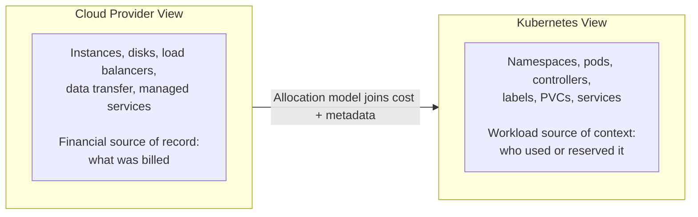
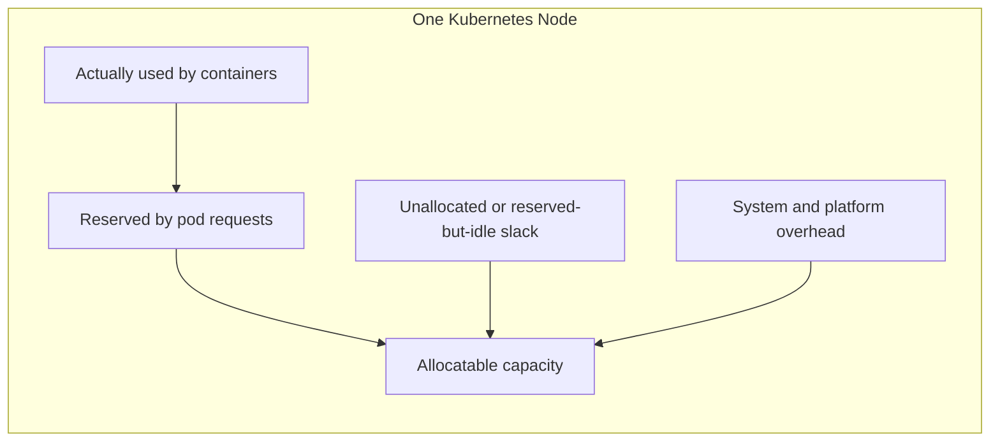
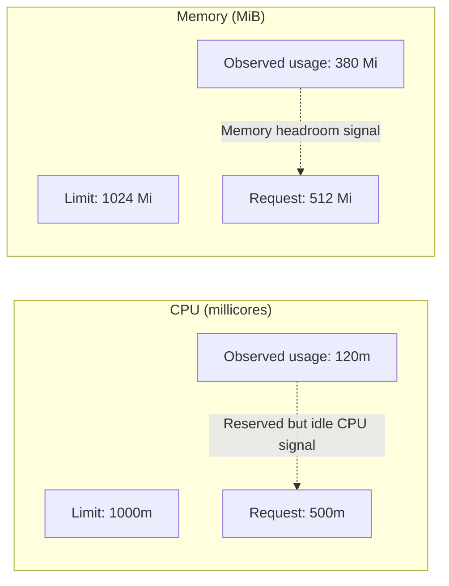
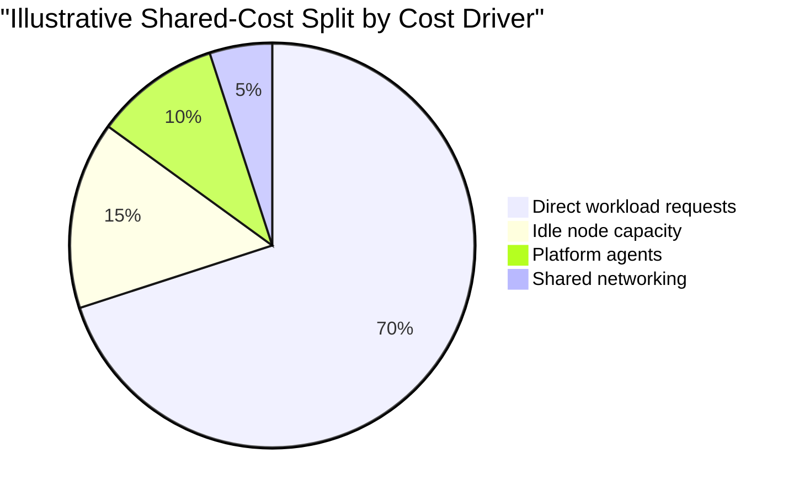
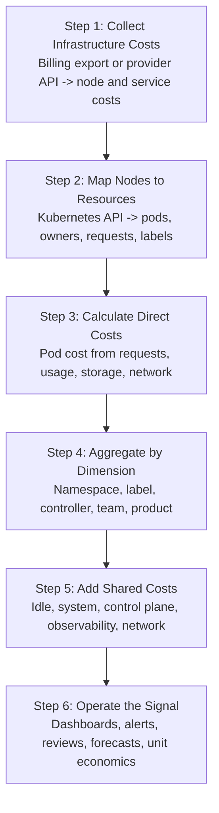
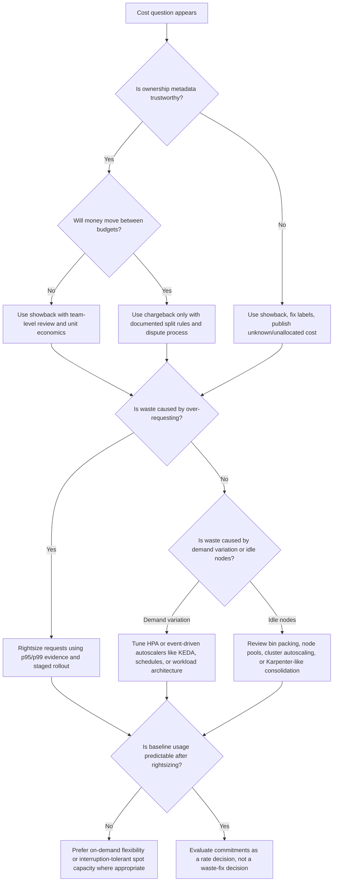

> **Discipline Module** | Complexity: `[MEDIUM]` | Time: 2.5h

## What You'll Be Able to Do

Cost allocation is the translation layer between a shared Kubernetes platform and the people who make product, reliability, and budget decisions. After this module, you should be able to explain where Kubernetes spending comes from, choose a fair allocation method, and turn cost visibility into an operating signal that engineers can trust rather than a monthly accusation from finance.

- **Allocate** Kubernetes compute, storage, network, idle, and shared overhead costs across namespaces, labels, pods, controllers, services, and teams.
- **Explain** how requests, actual usage, limits, Quality of Service classes, bin packing, and cluster overhead create different cost signals.
- **Design** showback and chargeback models that expose spend fairly in a multi-tenant cluster without destroying engineering trust.
- **Build** cost dashboards and alerts that treat idle cost, allocation coverage, and unit economics as first-class platform signals.
- **Evaluate** outputs from OpenCost, Kubecost, cloud-native cost explorers, and CI cost-estimation tools as evidence for decisions rather than as automatic policy.

## Why This Module Matters

Your cloud bill can tell you that a worker node, persistent volume, load balancer, or managed control plane incurred cost. It usually cannot tell you whether the underlying Kubernetes workload belonged to the checkout team, the search team, an abandoned staging environment, a shared observability stack, or spare node capacity waiting for a future burst. That gap is where many FinOps efforts stall: the organization knows Kubernetes is expensive, but the people who can change resource requests, replicas, schedules, and architecture cannot see the bill in the language they use every day.

Kubernetes makes this harder because one node can host pods from many teams at the same time. A cloud billing export sees an instance or virtual machine; the Kubernetes API sees pods, labels, owners, namespaces, persistent volume claims, services, and controllers. Cost allocation connects those two views by mapping infrastructure cost to schedulable resources and then aggregating that cost into business dimensions such as team, product, environment, or feature. The goal is not accounting theater. The goal is to make waste visible at the decision point where it can be fixed.

The durable lesson is that Kubernetes cost allocation is a model, not a perfect measurement instrument. Every model makes choices about whether to allocate by request, actual usage, maximum of request and usage, idle capacity, storage, network, control-plane overhead, and shared platform services. Good FinOps practice makes those choices explicit, explains the tradeoffs, and improves the model as trust and data quality improve. Bad FinOps practice hides assumptions behind a dashboard and then asks teams to accept a bill they cannot reproduce.

> **The Apartment Building Analogy**
>
> Think of a shared Kubernetes cluster as an apartment building with one utility bill. Each tenant has a lease, a meter, and access to shared spaces such as hallways, elevators, and lobby lighting. Request-based allocation is like charging tenants for the space they reserved; usage-based allocation is like charging only for measured electricity and water; shared-cost allocation is the rule for splitting the elevator and lobby. The important part is not pretending any one rule is morally perfect. The important part is choosing a rule everyone understands, publishing it, and revisiting it when tenant behavior or building design changes.

## Prerequisites

This module assumes you already understand the FinOps lifecycle from [Module 1.1: FinOps Fundamentals](../module-1.1-finops-fundamentals/), especially the Inform, Optimize, and Operate loop. You should also be comfortable reading a Kubernetes Pod or Deployment manifest, identifying a namespace, and explaining the difference between resource requests and limits. The hands-on exercise uses a local cluster and current curriculum examples assume Kubernetes 1.35 behavior for scheduling, resource requests, limits, Horizontal Pod Autoscaling, and Vertical Pod Autoscaling.

- **Required**: [Module 1.1: FinOps Fundamentals](../module-1.1-finops-fundamentals/)
- **Required**: Kubernetes basics: Pods, Deployments, Namespaces, Services, labels, and selectors
- **Required**: Resource requests and limits for CPU and memory
- **Recommended**: Access to a local Kubernetes cluster through kind or minikube
- **Recommended**: `kubectl`, `helm`, `jq`, and basic shell familiarity

---

## Part 1: The Kubernetes Cost Model

### Why Cloud Bills Do Not Show Kubernetes Costs

Cloud billing systems are accurate at the infrastructure layer. They know about instances, disks, managed control planes, load balancers, NAT gateways, data transfer, snapshots, and provider-specific managed services. Kubernetes operates one layer above that. It schedules pods onto nodes, attaches volumes to workloads, exposes services through cloud integrations, and adds metadata that often matters more to the business than the provider resource name. Cost allocation starts by respecting both truths: the cloud bill is the financial source of record, and the Kubernetes API is the workload source of context.

The visibility problem appears whenever multiple teams share the same infrastructure. A node might run a payments API, a search indexer, a logging agent, a platform controller, and a short-lived batch job at the same time. The cloud provider can price the node, but it does not know which pod requested which share of CPU and memory unless a Kubernetes-aware allocation layer joins billing data with cluster state. That join is the heart of Kubernetes FinOps: convert raw infrastructure cost into workload-aligned cost without pretending that the raw bill already contains that answer.



The model needs three categories of input. First, it needs the cost of the infrastructure that backs the cluster, ideally from the billing export or provider cost API rather than a hand-maintained price table. Second, it needs Kubernetes resource data: which pods ran where, which resources they requested, which labels and owners they carried, and which volumes and services they used. Third, it needs organizational metadata: which labels represent team, product, environment, customer segment, or cost center, and how shared services should be split. If any category is weak, the allocation can still be useful, but its uncertainty must be visible.

### The Request-Usage Gap

Kubernetes schedules pods based on requests, not on future actual usage. When a container asks for CPU or memory, the scheduler uses that request to decide whether a node has enough allocatable capacity for the pod. That decision is conservative by design because the scheduler must protect reliability before it optimizes finance. A pod that requests far more CPU or memory than it normally uses can therefore block capacity for other workloads even when the node looks quiet in runtime metrics.

This request-usage gap is the core idle-cost mechanism in Kubernetes. If a pod requests one CPU but normally uses a small fraction of that request, the unused requested capacity is not automatically available to another pod from the scheduler's perspective. Enough over-requested pods force the cluster to run more nodes than the workload truly needs. The bill then shows more infrastructure; the runtime dashboard shows low utilization; the allocation model explains who reserved the capacity that made those nodes necessary.

The same idea applies at the cluster level. A node can have unallocated capacity because no pod requested it, reserved-but-idle capacity because pods requested it but did not use it, or overhead capacity consumed by system components that make the cluster function. Those are different kinds of cost. Treating all of them as "waste" misses the reliability reason they exist, while hiding them entirely makes teams believe their service is cheaper than it really is. A good allocation report separates these categories so engineering and finance can have a precise conversation.



### Requests, Limits, and Actual Usage

Resource requests are the minimum resources Kubernetes reserves for a container when scheduling a pod. Limits are runtime ceilings enforced by the kubelet and container runtime. Actual usage is what the container consumed over time, usually observed through kubelet, cAdvisor, the Metrics API, Prometheus, or a cost tool that reads those signals. These three values answer different questions, and a FinOps model must avoid mixing them accidentally.

```yaml
apiVersion: v1
kind: Pod
metadata:
  name: payment-api
  namespace: payments
spec:
  containers:
  - name: api
    image: payments/api:v2.4
    resources:
      requests:
        cpu: "500m"      # Scheduler reserves half a CPU core
        memory: "512Mi"  # Scheduler reserves 512 MiB of memory
      limits:
        cpu: "1000m"     # Runtime ceiling for CPU bursting
        memory: "1Gi"    # Runtime ceiling before memory enforcement
```

For allocation, requests are attractive because they represent reserved capacity and because teams can change them in the same manifests they already own. They also create a clear incentive: if a team reserves more capacity than it needs, its showback report makes the reservation visible. Usage is attractive because it reflects measured consumption and can feel fair to bursty workloads. It is also noisier, harder to forecast, and can remove the incentive to rightsize requests if teams are charged only for what they happened to use.

Limits are a different signal again. CPU limits can throttle work when a container tries to exceed its ceiling, while memory limits can lead to termination when the process grows beyond the allowed memory. Charging by limits alone is usually too punitive for services that need burst headroom, but limits still matter in analysis because they reveal the blast radius a workload could create at runtime. In practice, allocation conversations often start with requests, then compare requests to p95 or p99 usage to identify rightsizing candidates without automatically applying every recommendation.



### Choosing the Allocation Basis

There is no universal allocation basis because the model must match the behavior you want to encourage. Request-based allocation encourages teams to reserve responsibly and gives finance a more stable number. Usage-based allocation helps teams with bursty or event-driven workloads avoid paying for headroom they rarely use, but it can make budgets less predictable and can weaken request discipline. A max(request, usage) model protects against workloads that use more than they request, while a weighted model can intentionally balance reliability headroom with consumption.

| Method | Basis | What It Encourages | Main Tradeoff |
|--------|-------|--------------------|---------------|
| Request-based | Reserved CPU and memory | Rightsized reservations and predictable reports | Can feel harsh to bursty workloads with legitimate headroom |
| Usage-based | Observed CPU and memory | Consumption awareness and runtime efficiency | Can make budgets volatile and ignore scheduler pressure |
| Max(request, usage) | Higher of reserved or observed | Honest requests and protection against under-requesting | Harder to explain to non-engineers |
| Weighted blend | Agreed mix of reservation and usage | Balanced behavior across different workload shapes | Requires governance around the chosen weights |

Hypothetical scenario: a team runs a latency-sensitive API that requests 1000m CPU per replica but normally uses 250m, with short bursts during product launches. A pure request-based model will flag the unused reservation and push the team toward smaller requests, perhaps with more replicas or better autoscaling. A pure usage-based model will make the service look cheap most of the month, but it will not show that the cluster still needs enough reserved headroom to schedule the pods safely. The better conversation is not "which number is true"; it is "how much headroom is justified by reliability, and how do we make that justification visible?"

### QoS, Bin Packing, and Cluster Overhead

Kubernetes Quality of Service classes influence eviction behavior and operational risk, which means they indirectly affect cost decisions. A Guaranteed pod with equal requests and limits can be easier to reason about during pressure, but it can also reserve capacity very explicitly. A Burstable pod may be a practical compromise for many services because it reserves a baseline and allows headroom. A BestEffort pod carries no requests and is cheap in allocation models that depend only on requests, but it can be evicted first and can distort cost visibility if important workloads avoid requests to avoid showback.

Bin packing is the cluster-level expression of request discipline. If workload requests fit together neatly, the scheduler can place more work on fewer nodes while preserving reliability. If requests are oversized, oddly shaped, or constrained by too many node selectors and affinity rules, the cluster may need additional nodes even when CPU or memory graphs appear low. Allocation reports should therefore show both workload-level reservation gaps and cluster-level idle capacity. A team can rightsize one deployment and still see little bill movement if fragmented requests, daemonset overhead, or node-pool constraints prevent nodes from being removed.

Cluster overhead is not an accounting nuisance; it is part of the service cost. Core DNS, networking components, storage drivers, observability agents, policy controllers, service mesh sidecars, admission controllers, backup agents, and cost collectors all consume resources that business workloads rely on. Some overhead scales with the number of nodes, some with the number of pods, and some with organizational requirements such as audit retention or security scanning. Treating overhead as invisible platform cost makes application teams under-estimate their true unit economics, while dumping it on one platform namespace makes the platform team look artificially expensive.

---

## Part 2: Allocation Dimensions and Metadata Contracts

### Namespace, Label, Pod, Controller, and Team Views

A Kubernetes allocation report is useful only if it can be grouped by dimensions people recognize. Namespace is the simplest dimension because most clusters already use namespaces to separate teams, environments, or applications. It is also blunt. A shared namespace can contain workloads from multiple teams, and a single team can own workloads across production, staging, and batch namespaces. Namespace allocation is a good starting view, but it should not be the only view in a mature model.

Labels provide the durable metadata contract. A label such as `team`, `product`, `environment`, `service`, or `cost-center` can follow a workload across namespaces and can support reports that finance, platform engineering, and product managers all understand. The danger is label drift: if different teams use `owner`, `team_name`, `squad`, and `group` for the same concept, the allocation model becomes a cleanup project instead of a teaching tool. FinOps teams should define a small mandatory label schema, validate it at admission or CI time, and publish examples that make the easy path the correct path.

Pod and controller views serve different purposes. Pod-level allocation is useful for debugging a spike or explaining why one replica set consumed more than expected during a rollout. Controller-level allocation is better for stable reporting because Deployments, StatefulSets, Jobs, and CronJobs represent ownership more clearly than individual pods. Team and product views are the business rollups that turn raw allocation into decision support. A good dashboard lets the viewer move between these layers without changing the underlying model.

```yaml
apiVersion: apps/v1
kind: Deployment
metadata:
  name: checkout-service
  namespace: payments
  labels:
    app: checkout
    team: payments
    cost-center: "CC-4521"
    product: "storefront"
    environment: "production"
spec:
  replicas: 3
  selector:
    matchLabels:
      app: checkout
  template:
    metadata:
      labels:
        app: checkout
        team: payments
        cost-center: "CC-4521"
        product: "storefront"
        environment: "production"
    spec:
      containers:
      - name: api
        image: nginx:alpine
        resources:
          requests:
            cpu: "300m"
            memory: "512Mi"
          limits:
            cpu: "900m"
            memory: "1Gi"
```

The label contract should be boring on purpose. Require the few fields needed for allocation, ownership, and incident response; avoid asking every team to maintain a large taxonomy nobody audits. A practical contract might require `team`, `service`, `environment`, and `cost-center`, then allow optional labels for product, feature, customer segment, or compliance boundary. The right enforcement point depends on culture: some organizations start with CI warnings, some use admission policies, and some rely on namespace templates. The important point is that missing metadata becomes visible before the monthly report.

### Resource Quotas and Allocation Guardrails

Resource quotas are not a cost allocation system, but they make allocation behavior visible earlier. A namespace quota can cap total requested CPU and memory, which forces teams to notice when a deployment consumes more reserved capacity than expected. LimitRanges can provide default requests and limits for containers that omit them, reducing the number of workloads that are impossible to allocate fairly. These controls should be paired with reports, not used as silent punishment, because a quota failure without context teaches frustration instead of FinOps discipline.

The useful pattern is to treat quotas as budget guardrails and allocation reports as feedback. When a namespace approaches its request quota, the team should be able to see which controllers are responsible, whether observed usage justifies the reservation, and whether the next action is rightsizing, horizontal scaling, architecture change, or a budget conversation. This turns a quota from an arbitrary platform rule into an early warning that connects cost, reliability, and ownership.

### Unit Economics and Allocation Dimensions

Unit economics translates allocated platform cost into a business denominator. Cost per customer, cost per request, cost per order, cost per training job, cost per tenant, or cost per feature can be more useful than total namespace cost because it shows whether spend is scaling with value. A product whose monthly cluster cost rises while customer volume rises faster may be improving. A product whose cluster cost rises while the business denominator stays flat needs investigation even if the absolute bill is smaller.

The allocation dimension determines whether unit economics can be calculated credibly. If every checkout workload carries `product=storefront` and every order event is counted in the same reporting period, cost per order can be a useful trend. If half the workloads are unlabeled or shared services are excluded, the metric becomes misleading. Start with a unit metric that has clean ownership and a stable denominator, then expand. Unit economics should reduce confusion, not create a precision costume for incomplete data.

```text
Illustrative unit-cost formulas:

Cost per request  = allocated service cost / successful requests
Cost per customer = allocated product cost / active customers
Cost per job      = allocated batch cost / completed jobs
Cost per feature  = allocated feature-label cost / business events for that feature
```

---

## Part 3: Shared, Idle, and Overhead Costs

### Why Shared Costs Must Stay Visible

Shared cost is the allocation category that exposes whether the organization is using FinOps as a trust-building practice or a blame mechanism. Some resources clearly belong to one workload, such as a pod's requested CPU or a persistent volume claim owned by one service. Other resources support everyone: control-plane fees, DNS, CNI components, node-local agents, observability pipelines, policy controllers, ingress infrastructure, NAT gateways, and unallocated node capacity. If you hide those costs, service teams under-estimate what their workloads really require. If you dump them randomly, teams stop trusting the report.

There are three common splitting methods. An even split is simple and politically easy when all tenants are similar, but it overcharges small teams and undercharges large ones. A request-weighted split charges teams in proportion to the capacity they reserve, which aligns well with scheduler pressure and works naturally with request-based allocation. A usage-proportional split can be useful for network egress or storage throughput where measured consumption is the fairness signal. The right method can differ by cost type, which is why the model should document the split rule next to the number.

| Shared Cost | Examples | Durable Split Options | Fairness Question |
|-------------|----------|-----------------------|-------------------|
| Idle node capacity | Unallocated CPU and memory after scheduling | Request-weighted, node-pool-weighted, visible platform pool | Who caused the node to exist, and who benefits from the headroom? |
| System components | DNS, CNI, CSI, kube-proxy, node agents | Request-weighted, pod-count-weighted, even split | Does overhead scale with requests, pods, nodes, or tenancy? |
| Observability | Metrics, logs, tracing, dashboards, retention | Usage-proportional, request-weighted, service-tier split | Which teams generate the data and which teams require the retention? |
| Control plane | Managed control-plane fees, API server overhead | Even split, request-weighted, cluster-level platform tax | Is the cluster a shared utility or a workload-specific environment? |
| Network | Load balancers, NAT, cross-zone or internet egress | Usage-proportional where measurable | Which traffic source or consumer drives the charge? |

Hypothetical scenario: a shared production cluster has a round internal monthly cost of 100 cost units. Workload requests account for 70 units, node idle capacity accounts for 15 units, platform agents account for 10 units, and shared networking accounts for 5 units. If the report shows only the 70 workload units, every team believes its service is cheaper than the cluster reality. If the report allocates all 30 shared units evenly, a small team may pay the same overhead as the largest tenant. If the report allocates idle and agents by request share while allocating network by measured transfer, the model is more complex, but each cost follows a defensible driver.



### Idle Cost Is a Signal, Not a Trash Can

Idle cost deserves its own line because it can mean different things. Some idle capacity is deliberate reliability headroom for bursts, rollouts, node drains, and fault tolerance. Some idle capacity is fragmentation caused by oversized requests, incompatible node pools, affinity rules, or daemonset overhead. Some idle capacity is temporary because autoscalers need time to remove nodes after load drops. A useful report does not simply shame idle cost; it asks why the idle exists and whether it is justified by reliability, performance, or operational constraints.

The most important distinction is unallocated idle versus reserved idle. Unallocated idle is node capacity no pod requested. It may indicate that cluster autoscaling can consolidate nodes, that a node pool has too much baseline capacity, or that system overhead prevents an otherwise empty node from disappearing. Reserved idle is capacity requested by workloads but not used. It points toward rightsizing, request policy, or workload architecture. Both contribute to the bill, but they require different owners and different fixes.

### Cost Allocation Formula

The basic request-based formula is simple enough to teach, even though production systems add many refinements. Start with the hourly or monthly cost of a node, split that cost across resource dimensions, then allocate each pod's share based on requested resources on that node. Storage, GPU, and network charges should be modeled separately when they are material because their cost drivers differ from CPU and memory. The formula is a teaching device; the implementation should use real billing data and the cost tool's documented model.

```text
Pod CPU cost =
  (pod_cpu_request / node_allocatable_cpu) * node_cpu_cost

Pod memory cost =
  (pod_memory_request / node_allocatable_memory) * node_memory_cost

Pod direct allocation =
  pod_cpu_cost + pod_memory_cost + pod_storage_cost + pod_network_cost

Team allocation =
  sum(pod direct allocation for team) + allocated shared costs
```

Hypothetical scenario: imagine a node whose internal monthly cost is modeled as 100 cost units, with 60 units assigned to CPU and 40 units assigned to memory for allocation purposes. A pod that reserves one quarter of the node's allocatable CPU receives 15 CPU cost units, and a pod that reserves one eighth of the node's allocatable memory receives 5 memory cost units. The pod's direct compute allocation is therefore 20 cost units before storage, network, and shared overhead. The exact weights should come from your chosen allocation method, but the reasoning should always be reproducible.

### GPUs and Specialized Hardware

Specialized hardware breaks simplistic CPU-memory assumptions. A GPU node, high-memory node, local-SSD node, or accelerator pool often exists because a small number of workloads require capabilities unavailable elsewhere. Allocating that node mostly by generic CPU and memory can hide the real cost driver. If a pod requests a GPU, the allocation model should treat the accelerator as a first-class resource and should show idle accelerator time separately from ordinary idle CPU.

This is also where showback can teach architecture. A machine learning team may reasonably need expensive accelerators during training windows, but the allocation report can still show whether those accelerators are idle outside those windows, whether jobs queue efficiently, and whether batch scheduling would improve utilization. The FinOps lesson is not "never use expensive hardware." It is "make the scarce resource visible in the same business language as the value it produces."

---

## Part 4: Showback, Chargeback, and Trust

### Showback First

Showback means "here is what your workloads cost" without moving money between budgets. It is the right starting point for most Kubernetes FinOps programs because the first objective is trust. Teams need time to see how labels map to reports, how requests map to allocation, how shared costs are split, and how to challenge numbers that look wrong. A showback report should invite correction. Missing labels, mis-owned namespaces, abandoned resources, and odd request settings are expected findings during the first cycles, not evidence that engineers are careless.

```text
Hypothetical scenario: Monthly Cost Report - Payments Team
---------------------------------------------------------
Namespace scope: payments
Allocation model: request-based compute + explicit shared costs

Compute requests:          100 cost units
Persistent volumes:         20 cost units
Load balancer share:        10 cost units
Shared platform overhead:   30 cost units
---------------------------------------------------------
Total visible cost:        160 cost units

Optimization prompts:
- checkout-api reserves materially more CPU than observed p95 usage
- payment-worker has replicas during a quiet overnight window
- staging-like workloads should be reviewed for schedule and ownership
```

The report avoids two common mistakes. It does not present recommendations as automatic savings, and it does not hide the allocation model. "Optimization prompts" are questions for engineering review, not commands to cut capacity. A rightsizing recommendation can be wrong if the observation window missed a seasonal spike, if a service has strict cold-start behavior, or if memory usage is intentionally high before a batch flush. FinOps works when recommendations are treated as input to an engineering decision, not as autopilot.

### Chargeback Later

Chargeback means the allocation report drives real internal billing, budget transfer, or cost-center accounting. That can be useful in large organizations, but it raises the cost of every data-quality error. A mislabeled namespace under showback is an annoyance and a fix ticket. The same mislabeled namespace under chargeback is a budget dispute. That is why chargeback should follow a period of showback, label cleanup, model documentation, owner sign-off, and exception handling.

```text
Hypothetical scenario: Internal Allocation Notice - Payments Team
----------------------------------------------------------------
Billing period: monthly
Allocation basis: requests for compute, ownership for storage,
usage-proportional network, request-weighted platform overhead

Line items:
  Kubernetes compute reservation:      100 cost units
  Persistent volume ownership:          20 cost units
  Shared load balancer allocation:      10 cost units
  Platform overhead allocation:         30 cost units
  Adjustment for approved shared work: -10 cost units
----------------------------------------------------------------
  Total charged allocation:            150 cost units
```

Chargeback can also create perverse incentives if the model is too narrow. If teams are charged only for usage, they may inflate requests because reservation is free to them. If teams are charged only for requests, they may under-request and create reliability risk. If shared costs are invisible, teams may optimize their own services while shifting expense to the platform. The governance answer is to publish the model, monitor behavior changes, and adjust the model when it encourages the wrong outcome.

### Choosing Showback or Chargeback

The decision is cultural as much as technical. Showback fits an organization that is learning its metadata quality, has inconsistent ownership labels, or still needs engineering buy-in. Chargeback fits an organization with stable ownership, reproducible reports, finance processes that can handle disputes, and product teams that already use unit economics in planning. A hybrid model is common: showback for new teams and experimental environments, chargeback for mature product lines, and explicit platform-funded pools for work that benefits the whole organization.

| Factor | Prefer Showback | Consider Chargeback |
|--------|-----------------|---------------------|
| Metadata quality | Ownership labels are incomplete or inconsistent | Required labels are enforced and audited |
| Trust in model | Teams are still validating assumptions | Teams can reproduce and challenge reports |
| Organizational maturity | Cost visibility is new to engineering | Product teams already manage cloud budgets |
| Shared-cost policy | Split rules are still being negotiated | Split rules are documented and accepted |
| Failure mode | Education and cleanup are the goal | Budget accountability is the goal |

---

## Part 5: Cost Monitoring as an Operating Signal

### The Cost Allocation Pipeline

Cost allocation is not a one-time spreadsheet. It is a data pipeline that should run often enough for engineers to connect changes in manifests, deployments, traffic, and schedules with changes in cost. The pipeline collects infrastructure cost, maps nodes to Kubernetes resources, calculates direct pod costs, aggregates by durable dimensions, adds shared costs, and publishes reports or metrics. Each step needs observability because a silent break in billing ingestion or label collection can make the report look calm while the model is actually blind.



Prometheus is often part of this pipeline because Kubernetes teams already use it for operational metrics, and tools such as OpenCost expose metrics and APIs that can be scraped or queried. The important design choice is not the brand of dashboard; it is whether cost metrics sit next to reliability and capacity metrics. A team reviewing a deployment should be able to see request changes, replica changes, p95 usage, error rate, latency, allocated cost, and idle share together. If cost lives in a separate finance portal, engineers will treat it as lagging commentary rather than an operating signal.

Cost can also participate in service-level thinking, but it should not be framed as an SLO that competes with reliability in a simplistic way. A better pattern is to define cost guardrails and review triggers: allocation coverage should stay complete enough to trust reports; idle cost should be explained by a known headroom or scaling policy; unit cost should be reviewed when it drifts away from traffic or customer growth; and anomaly alerts should route to the owner who can connect the spike to a deployment or incident. These signals do not replace reliability SLOs. They add the economic dimension that platform teams need to operate responsibly.

### Dashboard Views for Different Personas

The FinOps Foundation framework emphasizes personas because the same cost data must support different decisions. Engineers need workload-level detail, request-to-usage gaps, and concrete links back to manifests. Product managers need unit economics and trend lines by customer, feature, or business capability. Finance needs allocation coverage, forecast confidence, budget variance, and a documented model. Platform teams need shared-cost drivers, cluster efficiency, node-pool fragmentation, and opportunities to improve the platform itself.

One dashboard rarely serves all of those needs. A better pattern is layered reporting over the same allocation model. The engineering view starts with namespaces, controllers, labels, requests, p95 usage, and optimization prompts. The platform view starts with node pools, idle cost, daemonset overhead, autoscaler behavior, and bin-packing constraints. The finance view starts with cost-center rollups, shared-cost policy, allocation coverage, and month-over-month variance. The product view starts with unit metrics and business context. The shared model keeps these views consistent while each persona sees the level of detail that matches its decisions.

### Recommendations Are Inputs, Not Autopilot

Rightsizing recommendations are useful because humans are bad at continuously comparing manifests with observed behavior across hundreds of workloads. They are dangerous when treated as automatic truth. A recommendation engine sees a historical window, a metric source, and a policy. It may not know that a service has a quarterly traffic pattern, that a batch job is intentionally quiet before a launch, that memory spikes during rare reconciliation events, or that a rollout needs headroom to avoid cascading retries.

The durable methodology is to treat recommendations as a queue of hypotheses. Review the observation window, compare p95 and p99 usage with requests, check whether the workload uses HPA or VPA (and never drive both from the same CPU or memory metric — that pits scaling out against scaling up; see Module 1.3 for the split-metric pattern), understand QoS and limit behavior, validate against incident history, and then apply changes gradually. If the workload is stateless and horizontally scalable, lowering requests and relying on HPA may be safe. If the workload is stateful or latency-sensitive, a conservative request with explicit headroom may be justified. The allocation report should preserve that nuance rather than reducing every recommendation to a promised saving.

---

## Part 6: Landscape Snapshot and Cost-Tooling Rosetta

> **Landscape snapshot — as of 2026-06. This changes fast; verify against vendor docs before relying on specifics.**
>
> OpenCost is listed by CNCF as an Incubating project and describes a vendor-agnostic methodology for measuring and allocating Kubernetes cluster costs to tenants. Kubecost is a commercial implementation of the same allocation concepts, now part of IBM's FinOps portfolio (acquired 2024) — verify its current packaging and naming when you reach IBM-branded docs. Kubernetes resource-management semantics remain centered on requests for scheduling and limits for runtime enforcement, while autoscaling behavior depends on the configured HPA, VPA, metrics pipeline, and provider environment. Cloud-native cost explorers, commercial FinOps platforms, and CI cost-estimation tools change feature sets frequently, so treat this snapshot as a refreshable map of capabilities rather than a ranking.

The durable spine is capability-based. You need cost ingestion, Kubernetes metadata correlation, idle-cost attribution, shared-cost rules, showback and chargeback reporting, anomaly detection, rightsizing evidence, and pre-deployment cost awareness. Tools differ in packaging, integration depth, hosting model, and opinionated workflows. The mistake is choosing a tool first and letting its defaults become policy. Choose the policy first, then use tools to implement and audit it.

| Durable Capability | OpenCost | Kubecost | Cloud-Native Cost Explorer | Infracost |
|--------------------|----------|----------|----------------------------|-----------|
| Kubernetes allocation | Provides open cost-allocation metrics and APIs for Kubernetes workloads | Builds allocation workflows and dashboards around Kubernetes concepts such as namespace, controller, service, and label | Provider tools can expose infrastructure and, for some managed Kubernetes services, split or container cost views | Not a runtime Kubernetes allocator; estimates infrastructure cost before deployment |
| Idle-cost attribution | Exposes allocation data that can distinguish allocated and idle cost depending on configuration | Adds product workflows for idle, efficiency, and allocation views | Often strong for node or service spend, weaker for pod-level context unless provider-specific integrations are enabled | Flags cost changes in infrastructure-as-code rather than observing runtime idle |
| Showback and chargeback | Supplies metrics/API foundations for reports you build or integrate | Provides reporting features designed for team and business rollups | Supports finance-facing bill views and account or tag-based allocation | Supports pull-request discussion before infrastructure changes reach the bill |
| Rightsizing evidence | Can surface request, usage, and allocation signals for analysis | Provides recommendation workflows based on observed usage and requests | Provider recommendations can help at instance or managed-service level | Can catch expensive infrastructure changes before merge |
| Anomaly and budget workflows | Usually integrated through Prometheus, alerting, or downstream systems | Product workflows may include alerts and budget features | Provider billing tools commonly support budgets, alerts, and anomaly workflows | CI comments and policies can prevent cost surprises before apply |
| Metadata contract | Relies on Kubernetes labels, namespaces, and workload metadata | Uses Kubernetes concepts and organizational mappings | Relies heavily on cloud accounts, tags, labels, and provider billing dimensions | Relies on repository metadata, IaC structure, tags, and policy context |

OpenCost and Kubecost are useful examples in this module because they make the Kubernetes allocation mechanics concrete. They are not the subject of the module. A cloud-native cost explorer may be enough for high-level account and service spend, but it often lacks the Kubernetes ownership context required for team-level showback in a shared cluster. A CI cost estimator such as Infracost helps before infrastructure changes are applied, but it does not replace runtime allocation because Kubernetes scheduling, idle cost, and shared overhead emerge after workloads run. These tools are peers in a workflow, not a ranked list.

---

## Patterns & Anti-Patterns

Good FinOps patterns make cost visible without making engineers afraid to reserve reliability headroom. The strongest pattern is a written allocation policy that explains the basis for compute, memory, storage, network, idle, and shared costs in plain language. The second pattern is a small mandatory metadata contract enforced before deployment or shortly after. The third pattern is a recurring review loop where teams compare allocation, request-to-usage gaps, unit economics, and reliability outcomes before changing manifests.

| Pattern | Why It Works | What It Looks Like |
|---------|--------------|--------------------|
| Policy before tooling | Prevents dashboard defaults from becoming accidental finance policy | A short allocation standard explains direct costs, shared costs, idle cost, and dispute handling |
| Labels as a contract | Makes reports stable across namespaces, clusters, and teams | Required `team`, `service`, `environment`, and `cost-center` labels appear on workloads |
| Shared costs shown explicitly | Builds trust by revealing platform overhead instead of hiding it | Reports show direct workload cost plus allocated idle, system, network, and observability cost |
| Recommendations as review inputs | Protects reliability while still finding waste | Rightsizing tickets include p95/p99 evidence, owner context, and rollout safety notes |

Anti-patterns usually come from chasing precision without trust or speed without context. A model that waits for perfect data never teaches anyone. A model that charges teams before labels are clean creates political resistance. A model that hides idle cost under a platform bucket makes application decisions look cheaper than they are. A model that ranks tools instead of capabilities goes stale and distracts from the operating practice.

| Anti-Pattern | Why It Hurts | Better Approach |
|--------------|--------------|-----------------|
| Chargeback on day one | Turns metadata cleanup into a budget fight | Start with showback, document errors, and graduate mature scopes |
| Usage-only allocation | Can remove incentives to rightsize requests | Include request pressure or max(request, usage) where scheduler capacity matters |
| Hidden platform overhead | Makes services appear cheaper than their real support cost | Allocate overhead with explicit split rules and a visible platform line |
| Tool-first governance | Lets product defaults define fairness | Define allocation policy, then configure tools to match it |
| Promised savings from recommendations | Treats observed history as guaranteed future behavior | Review recommendations with workload owners and reliability evidence |
| One giant dashboard for everyone | Forces every persona through the wrong level of detail | Build persona-specific views over one shared allocation model |

---

## Decision Framework

Use this framework when a cost question becomes a policy question. It deliberately separates three decisions that often get blended together: how to communicate cost, how to reduce waste, and how to choose rate commitments. The first decision is organizational, the second is engineering, and the third is financial risk management. Mixing them produces bad outcomes, such as buying commitments before rightsizing or charging teams before they trust allocation.



| Decision | Choose This When | Avoid This When | Evidence to Review |
|----------|------------------|-----------------|--------------------|
| Showback vs chargeback | You need awareness first, or data quality is still improving | You need formal budget accountability and the model is already trusted | Label coverage, owner disputes, report reproducibility, finance process maturity |
| Rightsize vs autoscale | Requests materially exceed observed p95/p99 usage | Demand changes faster than pod size can safely change | Usage window, SLO history, HPA/VPA settings, QoS class, rollout risk |
| Cluster consolidation | Idle nodes remain after workload rightsizing | Node pools are constrained by hard tenancy, compliance, or hardware needs | Node-pool fragmentation, daemonset overhead, pod disruption budgets, affinity rules |
| Commitment vs on-demand vs spot | Baseline usage is predictable after waste has been reduced | Usage is uncertain, seasonal, or interruption-sensitive | Historical baseline, business forecast, interruption tolerance, provider terms |

Commitment-based discounts are deliberately last in this framework. Reserved Instances, Savings Plans, committed use discounts, and similar provider programs trade flexibility for a lower rate on usage that actually materializes. Spot-style capacity trades interruption risk for a lower price on workloads that can tolerate replacement. Those are rate and risk decisions, not allocation decisions. If you buy commitments before fixing oversized requests and idle nodes, you may simply discount waste and make it harder to see.

---

## Did You Know?

- **Kubernetes scheduling uses requests**: The Kubernetes scheduler places pods using container resource requests, while the kubelet enforces limits at runtime. That is why request discipline affects both cost allocation and cluster capacity planning.
- **Allocation is a named FinOps capability**: The FinOps Foundation describes allocation as apportioning costs to responsible categories, including shared elements, using account structures, tags, labels, and derived metadata.
- **OpenCost is a CNCF Incubating project as of 2026-06**: CNCF lists OpenCost as accepted in 2022 and moved to Incubating maturity in 2024, which is a volatile fact that should be rechecked when refreshing this module.
- **Autoscaling metrics and cost metrics answer different questions**: Metrics Server and HPA help Kubernetes adjust capacity for demand, while allocation tools connect resource and billing data to ownership and financial accountability.

---

## Common Mistakes

| Mistake | Why It Happens | How to Fix It |
|---------|----------------|---------------|
| Treating the cloud bill as enough | Provider bills stop at infrastructure resources | Join billing data with Kubernetes namespaces, labels, owners, and resource requests |
| Ignoring idle resources | Reports count only allocated pods and omit slack capacity | Show unallocated idle and reserved-but-idle capacity as separate visible lines |
| Starting with chargeback | Finance wants accountability before engineering trusts the data | Run showback first, clean labels, document split rules, and add a dispute process |
| Using only namespace allocation | Namespaces are easy but often mix teams, products, and environments | Add a small label contract and aggregate by team, product, service, and environment |
| Hiding shared platform cost | Platform overhead feels hard to assign fairly | Split overhead by documented drivers such as requests, pod count, usage, or even share |
| Treating recommendations as autopilot | Tool output looks precise and actionable | Review p95/p99 usage, workload seasonality, QoS, autoscaling, and rollout risk before applying changes |
| Optimizing rates before reducing waste | Discounts are attractive and easier than engineering cleanup | Rightsize and explain baseline usage before commitments, reservations, or spot migration |
| Building one dashboard for every persona | Finance, platform, product, and engineering need different views | Use one allocation model with persona-specific dashboards and shared definitions |

---

## Quiz

### Question 1

**Scenario**: Your team deployed a `recommendation-engine` workload that requests 1000m CPU and 4 GiB memory per replica. After a normal production week, p95 usage is closer to 250m CPU and 2 GiB memory, and the service has no known launch event in the next review window. In a request-based allocation model, what does this tell you, and what should the next engineering step be?

<details>
<summary>Answer</summary>

The workload is allocated cost for the reserved request, not only for the observed usage, because the scheduler treats requested capacity as capacity that must be available on a node. This exposes a request-to-usage gap that may be legitimate headroom or may be oversized reservation. The next step is not an automatic cut; the team should review p95 and p99 usage, SLO history, rollout behavior, and autoscaling configuration before lowering requests in a staged change. This probes the outcome to **explain** how requests, usage, limits, QoS, and bin packing create different cost signals.
</details>

### Question 2

**Scenario**: A shared cluster has good namespace separation but inconsistent labels. Some workloads use `team`, others use `owner`, and several batch jobs have no business metadata. Finance asks for chargeback next month. What should you recommend?

<details>
<summary>Answer</summary>

Recommend showback first because chargeback would turn metadata cleanup into a budget dispute. The team should define a small mandatory label contract, publish unknown and unallocated cost explicitly, and let owners correct the data before money moves between budgets. Namespace reports can still be useful during this period, but they should be labeled as a coarse view rather than a final bill. This probes the outcome to **design** showback and chargeback models that preserve trust in a multi-tenant cluster.
</details>

### Question 3

**Scenario**: Your report shows direct workload cost by namespace, but it excludes DNS, CNI agents, observability collectors, managed control-plane cost, and unallocated node capacity. Product managers are using the report to compare feature profitability. What is wrong with the report?

<details>
<summary>Answer</summary>

The report hides shared and idle costs that are part of the real cost of running the product on the platform. Product managers will underestimate unit cost because the report makes shared platform services look free. The fix is to add explicit shared-cost lines with documented split rules, such as request-weighted overhead or usage-proportional network allocation where measurements exist. This probes the outcome to **allocate** direct and shared Kubernetes costs across teams and business dimensions.
</details>

### Question 4

**Scenario**: A manager sees a provider cost explorer line for the production cluster's worker nodes and asks for cost per service. Why can the provider view be correct and still insufficient?

<details>
<summary>Answer</summary>

The provider view is correct about what infrastructure was billed, but it does not contain enough Kubernetes ownership context to divide a shared node across pods, controllers, labels, and teams. A single node can host workloads from several services plus platform components, so the bill must be joined with Kubernetes metadata and resource signals. A Kubernetes-aware allocation model can then aggregate cost by namespace, label, controller, service, or team. This probes the outcome to **build** dashboards that expose Kubernetes spending in engineering language.
</details>

### Question 5

**Scenario**: A cost tool recommends lowering requests on a latency-sensitive API. The workload uses HPA, has strict p99 latency goals, and sometimes receives burst traffic after partner events. How should the team treat the recommendation?

<details>
<summary>Answer</summary>

The recommendation should be treated as evidence for review, not as an automatic change. The team should inspect the observation window, p95 and p99 usage, HPA targets, latency history, and whether partner events were represented in the data. A staged request reduction may still be appropriate, but the team should preserve reliability headroom that is justified by the workload's behavior. This probes the outcome to **evaluate** tooling outputs without mistaking recommendations for autopilot.
</details>

### Question 6

**Scenario**: After rightsizing several deployments, the cluster still has idle nodes in one node pool. The team says cost allocation must be wrong because pod requests went down but the bill did not. What should you investigate next?

<details>
<summary>Answer</summary>

Investigate bin packing and node-pool constraints before blaming the allocation model. Oversized requests are only one reason nodes stay alive; daemonset overhead, affinity rules, topology constraints, disruption budgets, special hardware pools, and autoscaler timing can all prevent consolidation. The report should distinguish reserved-but-idle workload capacity from unallocated node idle so the right owner can act. This reinforces the outcome to **explain** how requests, bin packing, and cluster overhead create different cost signals.
</details>

### Question 7

**Scenario**: A finance stakeholder wants to buy long-term compute commitments because the Kubernetes bill is high. Engineering has not yet cleaned labels, rightsized requests, or identified idle node pools. What is the FinOps response?

<details>
<summary>Answer</summary>

Commitments should come after the organization understands its baseline usage and removes obvious waste. Reserved capacity, savings plans, committed use discounts, and similar mechanisms reduce rates for usage that materializes, but they do not explain ownership or fix oversized requests. The FinOps response is to finish allocation, showback, rightsizing review, and baseline analysis first, then evaluate commitments for the predictable remainder. This connects allocation decisions to durable financial methodology without turning provider discounts into the subject of the module.
</details>

---

## Hands-On Exercise: Allocation Signals in a Local Cluster

Deploy a small multi-namespace cluster, attach ownership labels, install OpenCost with Prometheus, and generate a simple allocation report. The local report uses illustrative internal rates because kind and minikube do not produce a real cloud bill. In a real environment, you would replace those rates with billing-export data or the pricing data used by your allocation tool.

### Prerequisites

- `kind` or `minikube` installed
- `kubectl` configured
- `helm` v3 installed
- `jq` installed for formatting API responses

### Step 1: Create a Cluster

```bash
cat > /tmp/kind-finops.yaml << 'EOF'
kind: Cluster
apiVersion: kind.x-k8s.io/v1alpha4
nodes:
- role: control-plane
- role: worker
- role: worker
EOF

kind create cluster --name finops-lab --config /tmp/kind-finops.yaml
```

### Step 2: Deploy Sample Workloads

Create workloads that simulate multi-tenant usage and deliberately include different request shapes. The `ml-trainer` workload is intentionally over-requested for discussion purposes; do not copy these values into production without measurement.

```bash
kubectl create namespace payments
kubectl create namespace search
kubectl create namespace ml-pipeline
kubectl create namespace staging

kubectl apply -f - << 'EOF'
apiVersion: apps/v1
kind: Deployment
metadata:
  name: payment-api
  namespace: payments
  labels:
    app: payment-api
    team: payments
    cost-center: "CC-4521"
spec:
  replicas: 3
  selector:
    matchLabels:
      app: payment-api
  template:
    metadata:
      labels:
        app: payment-api
        team: payments
        cost-center: "CC-4521"
    spec:
      containers:
      - name: api
        image: nginx:alpine
        resources:
          requests:
            cpu: "200m"
            memory: "256Mi"
          limits:
            cpu: "500m"
            memory: "512Mi"
---
apiVersion: apps/v1
kind: Deployment
metadata:
  name: payment-worker
  namespace: payments
  labels:
    app: payment-worker
    team: payments
    cost-center: "CC-4521"
spec:
  replicas: 2
  selector:
    matchLabels:
      app: payment-worker
  template:
    metadata:
      labels:
        app: payment-worker
        team: payments
        cost-center: "CC-4521"
    spec:
      containers:
      - name: worker
        image: nginx:alpine
        resources:
          requests:
            cpu: "100m"
            memory: "128Mi"
          limits:
            cpu: "300m"
            memory: "256Mi"
EOF

kubectl apply -f - << 'EOF'
apiVersion: apps/v1
kind: Deployment
metadata:
  name: search-api
  namespace: search
  labels:
    app: search-api
    team: search
    cost-center: "CC-7803"
spec:
  replicas: 4
  selector:
    matchLabels:
      app: search-api
  template:
    metadata:
      labels:
        app: search-api
        team: search
        cost-center: "CC-7803"
    spec:
      containers:
      - name: api
        image: nginx:alpine
        resources:
          requests:
            cpu: "300m"
            memory: "512Mi"
          limits:
            cpu: "800m"
            memory: "1Gi"
---
apiVersion: apps/v1
kind: Deployment
metadata:
  name: search-indexer
  namespace: search
  labels:
    app: search-indexer
    team: search
    cost-center: "CC-7803"
spec:
  replicas: 2
  selector:
    matchLabels:
      app: search-indexer
  template:
    metadata:
      labels:
        app: search-indexer
        team: search
        cost-center: "CC-7803"
    spec:
      containers:
      - name: indexer
        image: nginx:alpine
        resources:
          requests:
            cpu: "500m"
            memory: "1Gi"
          limits:
            cpu: "1000m"
            memory: "2Gi"
EOF

kubectl apply -f - << 'EOF'
apiVersion: apps/v1
kind: Deployment
metadata:
  name: ml-trainer
  namespace: ml-pipeline
  labels:
    app: ml-trainer
    team: ml
    cost-center: "CC-9102"
spec:
  replicas: 1
  selector:
    matchLabels:
      app: ml-trainer
  template:
    metadata:
      labels:
        app: ml-trainer
        team: ml
        cost-center: "CC-9102"
    spec:
      containers:
      - name: trainer
        image: nginx:alpine
        resources:
          requests:
            cpu: "2000m"
            memory: "4Gi"
          limits:
            cpu: "4000m"
            memory: "8Gi"
EOF

kubectl apply -f - << 'EOF'
apiVersion: apps/v1
kind: Deployment
metadata:
  name: staging-full-stack
  namespace: staging
  labels:
    app: staging-full-stack
    team: platform
    cost-center: "CC-3300"
spec:
  replicas: 3
  selector:
    matchLabels:
      app: staging-full-stack
  template:
    metadata:
      labels:
        app: staging-full-stack
        team: platform
        cost-center: "CC-3300"
    spec:
      containers:
      - name: app
        image: nginx:alpine
        resources:
          requests:
            cpu: "250m"
            memory: "256Mi"
          limits:
            cpu: "500m"
            memory: "512Mi"
EOF

kubectl get pods -A --field-selector=status.phase=Running -L team,cost-center
```

### Step 3: Deploy Prometheus and OpenCost

```bash
helm repo add prometheus-community https://prometheus-community.github.io/helm-charts
helm repo add opencost https://opencost.github.io/opencost-helm-chart
helm repo update

helm install prometheus prometheus-community/prometheus \
  --namespace opencost-system \
  --create-namespace \
  -f https://raw.githubusercontent.com/opencost/opencost/develop/kubernetes/prometheus/extraScrapeConfigs.yaml \
  --set server.persistentVolume.enabled=false \
  --set alertmanager.enabled=false \
  --set kube-state-metrics.enabled=true \
  --set prometheus-node-exporter.enabled=true \
  --set prometheus-pushgateway.enabled=false

helm install opencost opencost/opencost \
  --namespace opencost-system \
  --set opencost.prometheus.internal.serviceName=prometheus-server \
  --set opencost.prometheus.internal.namespaceName=opencost-system \
  --set opencost.ui.enabled=true

kubectl rollout status deployment/opencost -n opencost-system --timeout=120s
```

The `-f extraScrapeConfigs.yaml` flag is essential: it adds the scrape job that tells Prometheus to collect OpenCost's own metrics from port 9003. Without it OpenCost installs cleanly but its `/allocation` queries return empty or incomplete data, because the underlying cost metrics are never scraped — a silent failure that looks like a working install.

### Step 4: Query Cost Allocation

Use OpenCost as the worked example for the allocation concept. The same learning goal applies if your organization uses another tool: ask which dimensions it can aggregate by, how it treats idle and shared cost, and how it connects to billing data.

```bash
kubectl port-forward -n opencost-system svc/opencost 9003:9003 &
sleep 5

curl -s "http://127.0.0.1:9003/allocation/compute?window=1h&aggregate=namespace" | jq '.'

curl -s "http://127.0.0.1:9003/allocation/compute?window=1h&aggregate=label:team" | jq '.'
```

### Step 5: Generate a Simple Request-Based Report

This local script does not replace OpenCost. It exists to make the request-based allocation concept tangible by summing namespace requests and applying round illustrative rates. Real production reports should use billing data and documented allocation rules.

```bash
cat > /tmp/cost_report.sh << 'SCRIPT'
#!/usr/bin/env bash
set -euo pipefail

echo "============================================"
echo "  Kubernetes Cost Allocation Report"
echo "  Cluster: finops-lab"
echo "  Date: $(date +%Y-%m-%d)"
echo "============================================"
echo ""

namespaces="payments search ml-pipeline staging"

cpu_request_millicores() {
  kubectl get pods -n "$1" -o jsonpath='{range .items[*]}{range .spec.containers[*]}{.resources.requests.cpu}{"\n"}{end}{end}' | \
    awk '
      /m$/ { gsub("m", ""); total += $1; next }
      $1 != "" { total += $1 * 1000 }
      END { printf "%.0f", total }
    '
}

memory_request_mib() {
  kubectl get pods -n "$1" -o jsonpath='{range .items[*]}{range .spec.containers[*]}{.resources.requests.memory}{"\n"}{end}{end}' | \
    awk '
      /Gi$/ { gsub("Gi", ""); total += $1 * 1024; next }
      /Mi$/ { gsub("Mi", ""); total += $1; next }
      /Ki$/ { gsub("Ki", ""); total += $1 / 1024; next }
      $1 != "" { total += $1 / 1024 / 1024 }
      END { printf "%.0f", total }
    '
}

echo "--- Resource Requests by Namespace ---"
for ns in $namespaces; do
  cpu=$(cpu_request_millicores "$ns")
  mem=$(memory_request_mib "$ns")
  printf "  %-15s CPU: %6sm  Memory: %6s Mi\n" "$ns" "$cpu" "$mem"
done

echo ""
echo "--- Illustrative Cost Estimate (internal rates only) ---"
echo "Assumption: 0.05 cost units per CPU-hour and 0.007 cost units per GiB-hour"
for ns in $namespaces; do
  cpu=$(cpu_request_millicores "$ns")
  mem=$(memory_request_mib "$ns")
  cpu_cost=$(awk -v cpu="$cpu" 'BEGIN { printf "%.2f", cpu / 1000 * 0.05 * 730 }')
  mem_cost=$(awk -v mem="$mem" 'BEGIN { printf "%.2f", mem / 1024 * 0.007 * 730 }')
  total_cost=$(awk -v cpu="$cpu_cost" -v mem="$mem_cost" 'BEGIN { printf "%.2f", cpu + mem }')

  printf "  %-15s CPU: %7s  Memory: %7s  Total: %7s cost units/mo\n" \
    "$ns" "$cpu_cost" "$mem_cost" "$total_cost"
done

echo ""
echo "--- Review Prompts ---"
echo "  ml-pipeline: high CPU and memory requests for one replica; verify p95 and p99 usage"
echo "  staging: replicas run continuously; verify whether schedule matches business need"
echo "  search: multiple replicas; compare request baseline with HPA and traffic pattern"
SCRIPT

chmod +x /tmp/cost_report.sh
bash /tmp/cost_report.sh
```

### Step 6: Interpret the Output

The report should make two ideas visible. First, ownership labels allow the same workloads to be grouped by namespace or team, which is the metadata foundation for showback. Second, request-based estimates can flag likely over-reservation before you have a perfect production cost model. The output is not a promise of savings; it is a prompt for workload owners to compare requests with observed usage and reliability needs.

### Step 7: Cleanup

```bash
kind delete cluster --name finops-lab
```

### Success Criteria

You've completed this exercise when you:

- [ ] Created a multi-namespace Kubernetes cluster with labeled workloads
- [ ] Deployed Prometheus and OpenCost
- [ ] Queried the OpenCost API for namespace-level and team-label allocation
- [ ] Generated a request-based report showing per-namespace CPU and memory reservations
- [ ] Identified at least two optimization review prompts without treating them as guaranteed savings

---

## Sources

- [FinOps Framework Overview](https://www.finops.org/framework/)
- [Allocation FinOps Framework Capability](https://www.finops.org/framework/capabilities/allocation/)
- [FinOps Personas](https://www.finops.org/framework/personas/)
- [Understand Usage and Cost Domain](https://www.finops.org/framework/domains/understand-usage-cost/)
- [OpenCost Specification](https://opencost.io/docs/specification/)
- [OpenCost API](https://opencost.io/docs/integrations/api/)
- [OpenCost API Examples](https://opencost.io/docs/integrations/api-examples/)
- [OpenCost CNCF Project](https://www.cncf.io/projects/opencost/)
- [Kubernetes Resource Management for Pods and Containers](https://kubernetes.io/docs/concepts/configuration/manage-resources-containers/)
- [Kubernetes Horizontal Pod Autoscaling](https://kubernetes.io/docs/concepts/workloads/autoscaling/horizontal-pod-autoscale/)
- [Kubernetes Vertical Pod Autoscaling](https://kubernetes.io/docs/concepts/workloads/autoscaling/vertical-pod-autoscale/)
- [Kubernetes Resource Metrics Pipeline](https://kubernetes.io/docs/tasks/debug/debug-cluster/resource-metrics-pipeline/)
- [Kubecost Allocation API](https://www.ibm.com/docs/en/kubecost/self-hosted/2.x?topic=apis-allocation-api)
- [Amazon EKS Cost Monitoring with Kubecost](https://docs.aws.amazon.com/eks/latest/userguide/cost-monitoring-kubecost-bundles.html)
- [Infracost Documentation](https://www.infracost.io/docs/)
- [AWS Well-Architected Cost Optimization Pillar](https://docs.aws.amazon.com/wellarchitected/latest/cost-optimization-pillar/welcome.html)
- [Google Cloud Committed Use Discounts](https://docs.cloud.google.com/compute/docs/instances/signing-up-committed-use-discounts)
- [Azure Well-Architected Cost Optimization](https://learn.microsoft.com/en-us/azure/well-architected/cost-optimization/)
- [Karpenter Concepts](https://karpenter.sh/docs/concepts/)
- [Karpenter Disruption](https://karpenter.sh/docs/concepts/disruption/)

## Next Module

Continue to [Module 1.3: Workload Rightsizing & Optimization](../module-1.3-rightsizing/) to learn how to turn allocation evidence into safe resource changes.
