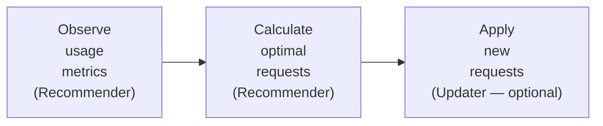
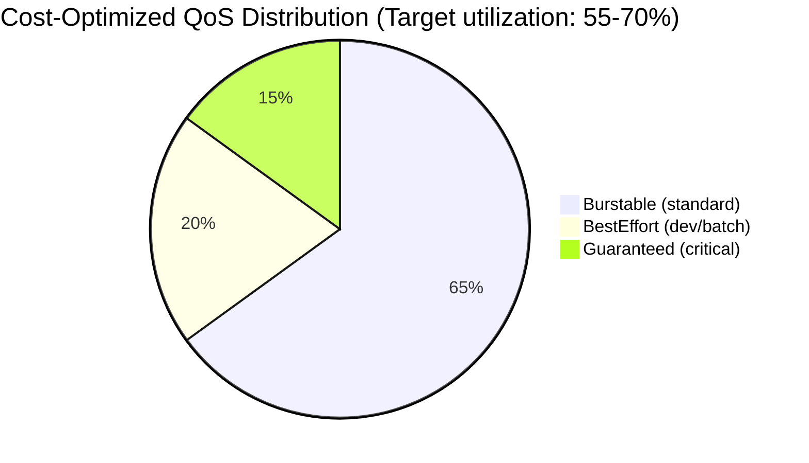
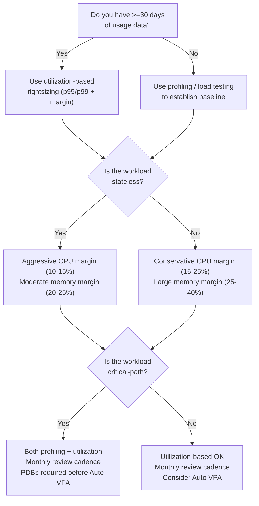

> **Discipline Module** | Complexity: `[MEDIUM]` | Time: 2.5h

## Prerequisites

Ensure you have the following prerequisite knowledge and cluster access before beginning the content below:
- **Required**: [Module 1.2: Kubernetes Cost Allocation](../module-1.2-k8s-cost-allocation/) — Cost visibility and attribution
- **Required**: Understanding of Kubernetes resource requests and limits
- **Required**: Familiarity with Deployments, Pods, and container resource management
- **Recommended**: Experience with `kubectl top` and metrics-server
- **Recommended**: Access to a local Kubernetes cluster (kind or minikube)

---

## What You'll Be Able to Do

After completing this module, you will have the skills and practical knowledge to accomplish the following outcomes:

- **Implement resource rightsizing recommendations using VPA, Goldilocks, or custom analysis scripts**
- **Design rightsizing workflows that validate changes in staging before applying to production workloads**
- **Analyze resource request and limit patterns to identify over-provisioned and under-provisioned workloads**
- **Build automated rightsizing pipelines that continuously optimize resource allocations based on actual usage**

## Why This Module Matters

In Module 1.2, you learned that the gap between requested and used resources is the largest single source of Kubernetes compute waste. Most production workloads use a small fraction of what they request — sometimes as little as 10-20%. This means the majority of provisioned capacity is sitting idle, paid for but never consumed.

Why does this happen? Because engineers setting resource requests face an asymmetric risk: **request too little and the application crashes at 3 AM. Request too much and nothing visible goes wrong.** The cost is absorbed by a cloud bill that arrives weeks later and is read by a different team. The outage fires a PagerDuty alert that wakes up the engineer who set the request. The incentive structure is perfectly aligned to produce over-provisioning.

> **Hypothetical scenario — illustrative numbers only**
>
> Consider a mid-size platform team running 80 services across a production cluster. A typical service requests 1000m CPU but actually uses 250m at p95. The difference — 750m of idle CPU reservation per replica — prevents the scheduler from placing other workloads on that node. Multiplied across six replicas and eighty services, the locked-but-unused capacity represents a substantial fraction of the cluster's total compute power. That capacity costs money every hour, whether the CPU cycles are consumed or not. This is not a theoretical edge case — it is the default state of nearly every Kubernetes cluster that has not been systematically rightsized.
>
> ```mermaid
> graph TD
>     subgraph "The Developer's Dilemma"
>         A["'My app uses ~200m CPU normally, but once last<br>quarter it spiked to 800m during peak traffic.<br>I'll request 1000m to be safe.'"]
>         B["Actual usage (p95): 250m CPU<br>Requested: 1000m CPU<br>Wasted: 750m CPU per replica"]
>         C["Multiply by replica count, then by<br>service count across the cluster"]
>         D["The cumulative idle reservation<br>is the cluster's single largest cost"]
>     end
>     A --> B
>     B --> C
>     C --> D
> ```

Rightsizing is the systematic practice of aligning resource requests with actual observed usage. It is the single highest-return FinOps activity for Kubernetes because it requires no architectural changes, no application rewrites, and no new infrastructure — only the discipline to measure, recommend, apply, and verify. Rightsizing turns the developer's rational over-provisioning into a managed process where safety margins are explicit, data-driven, and continuously updated rather than set once and forgotten.

Within the FinOps Foundation's lifecycle model, rightsizing sits squarely in the **Optimize** phase — the phase where teams act on the visibility gained during Inform to reduce waste and improve efficiency. But the Inform phase is what makes Optimize possible: you cannot rightsize what you cannot measure, and you cannot sustain rightsizing without the allocation and showback mechanisms covered in Module 1.2. Once rightsized, the Operate phase takes over, with continuous monitoring and automated enforcement ensuring that the gains are not eroded by the next deployment or the next traffic surge. Rightsizing is therefore not an isolated activity but the bridge between cost visibility and sustained cost efficiency — it is where the data gathered during Inform is converted into the operational practices that define Operate.

The durable methodology this module teaches — observe usage, generate a recommendation, apply with explicit headroom, then re-observe — applies regardless of which tools you use to implement it. Whether you run VPA, query Prometheus by hand, or use a commercial cost platform, the underlying loop is the same. Master the loop, and you can rightsize any Kubernetes workload on any infrastructure.

---

## Rightsizing Fundamentals

### The Rightsizing Loop

Rightsizing is not a one-time project. It is a continuous four-phase cycle that must be embedded in platform operations:

1. **Observe** — Collect actual resource consumption data over a meaningful time window (minimum 7 days, ideally 30+ days to capture weekly and monthly cycles). CPU usage is measured in millicores consumed per second; memory usage is measured as the working set — the pages actively referenced by the container, not including inactive file cache. Observation answers the question: what does this workload actually use?

2. **Recommend** — Apply a statistical model to the observed data to produce a suggested resource request. The model must account for the shape of the usage distribution: a workload that spikes to 2000m for five seconds once per hour needs a different recommendation than one that runs steadily at 200m. The recommendation is a starting point, not a command. Any tool that produces a number without explaining its methodology and confidence should be treated with scepticism.

3. **Apply with headroom** — Take the recommendation and add an explicit, documented safety margin. CPU typically gets 10-20% headroom above p95 or p99 usage because CPU throttling is graceful: the container slows down but stays alive. Memory typically gets 20-30% headroom above p99 usage because memory OOM-kill is catastrophic: the container dies, potentially corrupting state. The margin is not an afterthought — it is the explicit engineering decision that balances cost against reliability.

4. **Re-observe** — After applying new requests, monitor the workload for at least 72 hours. Watch for OOM-kills, CPU throttling, latency regressions, and changes in the workload's own usage pattern (new requests can change how the application behaves — a container given more memory may use more memory due to larger caches or GC heuristics). Usage patterns also drift over time as code changes, traffic grows, and dependencies evolve. Re-observe continuously; re-recommend on a monthly cadence.

This loop is the durable spine of rightsizing. Every tool in the ecosystem — VPA, Kubecost, cloud-native cost explorers, custom Prometheus scripts — implements some subset of it. Understanding the loop means you can evaluate any tool on whether it helps you observe, recommend, apply, or re-observe, and you can fill the gaps with your own automation where needed.

A critical insight that distinguishes mature rightsizing practices from superficial ones is that the re-observe phase is not merely a safety check — it is where the organisational learning happens. Each cycle through the loop generates data about how workloads actually behave under different resource profiles. Over multiple cycles, teams accumulate a statistical profile of their fleet: which workloads are bursty and need p99 sizing, which are stable and can use p95, which grow predictably with traffic and need capacity planning rather than reactive rightsizing, and which are inherently unpredictable and should be treated as exceptions. This institutional knowledge is the real output of sustained rightsizing, and it is far more valuable than any single round of cost reduction. A team that has run the rightsizing loop for six months can make resource decisions with confidence; a team that runs it once and declares victory learns nothing that survives the next deployment.

### The Bin-Packing Effect

Rightsizing individual workloads produces a second-order benefit that is often larger than the direct savings: improved bin-packing efficiency. When a pod requests 1000m CPU but uses 250m, the Kubernetes scheduler reserves the full 1000m on the node where the pod is placed. The remaining 750m is unavailable to any other workload, even though it sits idle. This fragmentation spreads across the cluster: nodes appear full (no allocatable capacity remaining) while actually running at low utilization.

When you rightsize that pod to request 300m CPU, the scheduler now has 700m of previously-locked capacity available for other workloads. Across a cluster of dozens of nodes, the cumulative effect can be dramatic — you may find that rightsizing enables you to remove nodes entirely, or to defer a cluster expansion that would otherwise have been necessary. This is bin-packing: fitting more workloads onto the same set of nodes by eliminating wasted reservations.

Bin-packing interacts with node sizing. Larger nodes (e.g. 16 vCPU, 64Gi) provide more flexibility for the scheduler to pack diverse workloads but create larger "stranding" losses when a single large pod prevents scheduling on an otherwise empty node. Smaller nodes reduce stranding but increase the overhead of the control plane and operating system per unit of workload. The optimal node size for bin-packing efficiency is context-dependent and should be measured, not guessed — but tighter resource requests always improve bin-packing regardless of node size, because they reduce the size of the "holes" the scheduler must work around.

---

## Identifying Over-Provisioned Workloads

### The Request-Usage Gap

The first step in rightsizing is finding where the biggest gaps exist between what's requested and what's used. This requires comparing two sources of data: the resource requests declared in pod specifications (what the scheduler reserves) and the actual resource consumption reported by the metrics pipeline (what the container really uses).

```bash
# Quick check: resource requests vs actual usage
kubectl top pods -n payments --containers
```

```
NAMESPACE  POD                        CONTAINER  CPU(cores)  MEMORY(bytes)
payments   payment-api-7d8f9c-abc12   api        23m         84Mi
payments   payment-api-7d8f9c-def34   api        31m         91Mi
payments   payment-api-7d8f9c-ghi56   api        18m         78Mi
payments   payment-worker-5b6c7-jkl89 worker     8m          42Mi
payments   payment-worker-5b6c7-mno01 worker     5m          38Mi
```

Compare the instantaneous snapshot against the declared resource requests to quantify the gap between reserved and used capacity:

```
payment-api:
  Requested: 200m CPU, 256Mi memory (per replica)
  Actual:    ~24m CPU, ~84Mi memory (average)
  Gap:       176m CPU (88%), 172Mi memory (67%)

payment-worker:
  Requested: 100m CPU, 128Mi memory (per replica)
  Actual:    ~7m CPU, ~40Mi memory (average)
  Gap:       93m CPU (93%), 88Mi memory (69%)
```

Note that `kubectl top` provides only an instantaneous snapshot. A single measurement tells you nothing about whether the workload spikes at particular times of day, during deployments, or under specific traffic patterns. Point-in-time data is useful for a quick sanity check but dangerous as the basis for a rightsizing decision. For that, you need historical data.

### Using Prometheus Queries

For robust rightsizing decisions, you need historical analysis over days or weeks rather than relying on a single point-in-time snapshot from `kubectl top`:

```promql
# Average CPU usage vs requests over 7 days, by container
avg by (namespace, pod, container) (
  rate(container_cpu_usage_seconds_total{container!=""}[5m])
) / on(namespace, pod, container) group_left()
kube_pod_container_resource_requests{resource="cpu"}

# Returns values like 0.12, meaning 12% of requested CPU is actually used
```

```promql
# Memory usage vs requests over 7 days
avg by (namespace, pod, container) (
  container_memory_working_set_bytes{container!=""}
) / on(namespace, pod, container) group_left()
kube_pod_container_resource_requests{resource="memory"}

# Returns values like 0.33, meaning 33% of requested memory is used
```

```promql
# Find the worst offenders: pods where avg CPU usage < 10% of requests
avg by (namespace, pod) (
  rate(container_cpu_usage_seconds_total{container!=""}[1h])
) / on(namespace, pod) group_left()
sum by (namespace, pod) (
  kube_pod_container_resource_requests{resource="cpu"}
) < 0.10
```

The last query is the one you run when you need to identify the biggest wins quickly. It surfaces workloads where the request-usage gap is so large that rightsizing is nearly risk-free — if a pod uses 8% of its requested CPU averaged over a full hour, reducing its request by 50% still leaves ample headroom. These are the workloads you rightsize first, both because the savings are largest and because the risk of disruption is lowest.

### The Rightsizing Matrix

Categorize workloads based on their usage patterns using the matrix below to prioritise rightsizing action across the cluster:

| Category | CPU Usage vs Request | Memory Usage vs Request | Action |
|----------|---------------------|------------------------|--------|
| **Massively over-provisioned** | < 15% | < 30% | Rightsize immediately (easy win) |
| **Moderately over-provisioned** | 15-40% | 30-60% | Rightsize with monitoring |
| **Reasonably sized** | 40-70% | 60-80% | Monitor, minor adjustments |
| **Tight** | 70-85% | 80-90% | Watch carefully, might need increase |
| **Under-provisioned** | > 85% | > 90% | Increase requests immediately |

---

> **Pause and predict**: If you scale up replicas using HPA based on CPU, and VPA also tries to change CPU requests, what might happen?

## The Vertical Pod Autoscaler (VPA)

### What VPA Does

VPA is a Kubernetes project that automates the observe-and-recommend phases of the rightsizing loop. It watches actual resource consumption over time — typically using the metrics-server or Prometheus as a data source — and produces three numbers for each container: a lower bound (the minimum request that would avoid starvation), a target (the recommended value), and an upper bound (the maximum likely to be needed). Optionally, VPA can also apply its recommendations automatically by evicting pods and recreating them with updated resource requests.



Understanding what VPA actually does — and does not do — is essential before trusting it with production workloads. VPA analyses historical usage and fits a statistical model to produce a recommendation. It does not understand your application's architecture, does not know about upcoming traffic events, and does not account for the fact that changing resource requests can change the workload's behaviour (a container given more memory may use more memory). Its recommendations are valuable inputs to a human decision — they should not be treated as autopilot for production-critical services.

### VPA Components

| Component | Role | Required? |
|-----------|------|-----------|
| **Recommender** | Watches usage, calculates recommendations | Yes |
| **Updater** | Evicts pods to apply new requests | Only for Auto mode |
| **Admission Controller** | Sets requests on new pods | Only for Auto/Initial modes |

### VPA Update Modes

The mode you choose determines how much trust you place in VPA's recommendations and how much control you retain over the application process:

| Mode | Behavior | Use Case |
|------|----------|----------|
| `Off` | Only generates recommendations, applies nothing | **Start here** — review before changing anything |
| `Initial` | Sets requests on pod creation, doesn't change running pods | Safe for new deployments |
| `Auto` | Evicts and recreates pods with updated requests | Fully automated rightsizing |
| `Recreate` | Same as Auto (legacy name) | Avoid, use Auto instead |

**Best practice**: Always start with `Off` mode. Let VPA collect at least 7 days of usage data — ideally a full 30 days to capture monthly billing and traffic cycles — before reviewing its first recommendations. Only after engineering teams have reviewed the recommendations, compared them against their own understanding of the workload, and built confidence in VPA's accuracy should you consider graduating to more automated modes.

### Why Recommendations Are Input, Not Autopilot

VPA's recommendation model has known limitations that every operator must understand. It analyses a historical time series and fits a statistical distribution, typically computing percentiles from the observed data. This means VPA is backward-looking by design: it can only recommend based on what has happened, not what will happen. If your application has a seasonal traffic pattern (month-end billing, holiday shopping, quarterly close), VPA trained on off-peak data will under-recommend and leave you vulnerable when peak arrives.

VPA also does not account for application-level semantics. A Go service with a fixed goroutine pool may genuinely need 500m CPU to serve peak traffic even though it averages 100m; VPA will see 100m and recommend 120m, and your service will degrade under load. A JVM application may need 2Gi of heap even though its working set appears to be 800Mi, because garbage collection behaviour changes when the heap is constrained. VPA sees memory bytes, not GC pause times or OOM-kill risk. Its recommendation is a data point, not a decision. The human operator brings the context that the statistical model lacks.

### VPA Limitations

Before committing to VPA as your primary rightsizing mechanism, understand the following known limitations that affect every deployment:

1. **VPA and HPA conflict on CPU/memory** — Don't use both to scale the same metric. VPA adjusts requests; HPA adjusts replicas. If both try to respond to CPU, they fight: VPA increases the per-pod CPU request, which reduces the utilisation percentage that HPA uses to decide whether to scale, which causes HPA to scale down, which concentrates load on fewer pods, which increases per-pod CPU usage, which causes VPA to increase requests further. The result is a thrashing loop that degrades both cost efficiency and reliability. The safe pattern is strict metric separation: VPA on memory only, HPA on CPU only.

2. **VPA evicts pods to update** — In Auto mode, VPA terminates running pods and lets the Deployment controller recreate them with the new resource values. Each eviction causes a brief disruption window during which the old pod is terminating and the new pod is starting. For stateless services with multiple replicas and proper readiness probes, this disruption is usually invisible. For stateful services or single-replica deployments, it means a hard restart. Always set PodDisruptionBudgets before enabling Auto mode, and never enable Auto mode on StatefulSets without thoroughly testing the restart behaviour.

3. **VPA needs history** — Recommendations are only as good as the data they are based on. Give VPA at least 24-48 hours of data for a rough recommendation, and at least 7 days for a recommendation you can trust. Workloads with weekly cycles (higher load on weekdays, lower on weekends) need the full week to produce an accurate picture.

4. **VPA doesn't set limits** — VPA manages resource requests only. It does not set, recommend, or adjust resource limits. You need a separate policy for limits, and the relationship between requests and limits determines the pod's QoS class, which in turn determines eviction priority under node pressure.

5. **VPA ignores burst patterns** — If your application spikes to 2000m CPU for 5 seconds once per hour but otherwise idles at 50m, VPA's statistical model may smooth the spike away entirely. The resulting recommendation will be far too low to handle the burst, and your application will experience severe throttling during each spike. Workloads with bursty usage patterns need profiling-based sizing (see below), not pure VPA recommendations.

### The VPA Restart Caveat

A subtle but important consequence of VPA's Auto mode is that changing resource requests usually requires a pod restart. Kubernetes does not support live resource request updates for running containers — the only way to change a pod's resource specification is to terminate the old pod and create a new one with the updated values. VPA's Updater component handles this by evicting pods according to the configured update policy, but the eviction itself is a pod deletion. If your application takes 30 seconds to start, or maintains in-memory state that is not backed by persistent storage, those 30 seconds of unavailability during the restart are the direct cost of automated rightsizing. This is not a VPA bug — it is a fundamental constraint of how Kubernetes manages container resources — but it is a constraint that every VPA deployment plan must account for.

---

## HPA Tuning for Cost

The Horizontal Pod Autoscaler (HPA) scales replicas. Most teams configure it for availability — conservative scale-up, aggressive scale-down — but the same HPA policy is also a cost control surface. Every replica you avoid running is compute you avoid paying for.

### Aggressive vs Conservative Scaling

```yaml
# Cost-optimized HPA (scales down quickly, scales up carefully)
apiVersion: autoscaling/v2
kind: HorizontalPodAutoscaler
metadata:
  name: payment-api
  namespace: payments
spec:
  scaleTargetRef:
    apiVersion: apps/v1
    kind: Deployment
    name: payment-api
  minReplicas: 2          # Don't go below 2 for HA
  maxReplicas: 12         # Cap the spend
  metrics:
  - type: Resource
    resource:
      name: cpu
      target:
        type: Utilization
        averageUtilization: 65    # Scale up at 65% — more aggressive than default 50%
  behavior:
    scaleUp:
      stabilizationWindowSeconds: 120   # Wait 2 min before scaling up
      policies:
      - type: Pods
        value: 2                         # Add max 2 pods at a time
        periodSeconds: 60
    scaleDown:
      stabilizationWindowSeconds: 300   # Wait 5 min before scaling down
      policies:
      - type: Percent
        value: 25                        # Remove max 25% of pods at a time
        periodSeconds: 120
```

Each HPA parameter represents a tradeoff between cost and responsiveness. A higher target utilisation (65-80% instead of the default 50%) means fewer replicas are running at steady state, which directly reduces cost — but it also means less headroom to absorb a traffic spike before the next scale-up event completes. Lower minReplicas reduce the baseline cost but increase cold-start latency when traffic arrives after a period of zero load. Faster scale-down policies reclaim idle capacity sooner but risk thrashing if load fluctuates around the threshold. These are not defaults to accept uncritically — they are engineering decisions that should be tuned to the specific workload's traffic pattern and the business's tolerance for latency under load.

### Cost Impact of HPA Settings

| Setting | Cost Impact | Risk |
|---------|-------------|------|
| Higher target utilization (65-80%) | Lower cost — fewer replicas needed | Higher latency during spikes |
| Lower minReplicas | Lower baseline cost | Slower response to sudden load |
| Faster scaleDown | Less idle capacity | Thrashing if load fluctuates |
| Slower scaleUp | Temporary under-capacity | Brief degradation during ramp |
| Custom metrics (queue depth) | Scale on actual demand, not CPU | Requires metrics pipeline setup |

### Combining HPA + VPA Safely

The trick is: let VPA handle resource *requests* and HPA handle *replica count* — but on **different metrics**.

```yaml
# VPA: Right-size the per-pod resources
apiVersion: autoscaling.k8s.io/v1
kind: VerticalPodAutoscaler
metadata:
  name: payment-api-vpa
  namespace: payments
spec:
  targetRef:
    apiVersion: apps/v1
    kind: Deployment
    name: payment-api
  updatePolicy:
    updateMode: "Off"    # Recommendation only
  resourcePolicy:
    containerPolicies:
    - containerName: api
      controlledResources: ["memory"]  # VPA manages memory ONLY
      minAllowed:
        memory: "64Mi"
      maxAllowed:
        memory: "2Gi"

# HPA: Scale replicas based on CPU
apiVersion: autoscaling/v2
kind: HorizontalPodAutoscaler
metadata:
  name: payment-api-hpa
  namespace: payments
spec:
  scaleTargetRef:
    apiVersion: apps/v1
    kind: Deployment
    name: payment-api
  minReplicas: 2
  maxReplicas: 10
  metrics:
  - type: Resource
    resource:
      name: cpu
      target:
        type: Utilization
        averageUtilization: 70
```

**Rule**: VPA on memory, HPA on CPU. They don't conflict because they manage different dimensions. VPA ensures each pod has enough memory to avoid OOM-kill; HPA ensures enough pods exist to handle the aggregate CPU demand. The two autoscalers are not fighting over the same signal, so each can do its job without interfering with the other, and the operator can independently tune the cost-vs-reliability tradeoff in each dimension.

---

> **Stop and think**: Does Kubernetes evict Pods based on how much they cost, or based on how their resources are configured?

## Quality of Service (QoS) for Cost

Kubernetes assigns one of three QoS classes to every pod based on how requests and limits are configured. QoS determines eviction priority when a node runs out of resources — and because eviction means the pod is killed and rescheduled (potentially on a different node), QoS has direct implications for both reliability and cost.

### The Three QoS Classes

```yaml
# Guaranteed — highest priority, evicted last
# requests == limits for ALL containers
resources:
  requests:
    cpu: "500m"
    memory: "512Mi"
  limits:
    cpu: "500m"       # Same as request
    memory: "512Mi"   # Same as request

# Burstable — medium priority
# requests < limits (or limits not set for some resources)
resources:
  requests:
    cpu: "200m"
    memory: "256Mi"
  limits:
    cpu: "1000m"      # Higher than request
    memory: "1Gi"     # Higher than request

# BestEffort — lowest priority, evicted first
# NO requests or limits set at all
resources: {}         # Empty — no guarantees
```

### How Eviction Priority Works

When a node exhausts a compressible resource (CPU), the kernel throttles containers proportionally — everyone slows down, but no one is killed. When a node exhausts an incompressible resource (memory or disk), the kubelet must choose a pod to terminate. The eviction order is deterministic: BestEffort pods are killed first, then Burstable pods using more memory than they requested (the "overage" beyond their request), then Burstable pods within their request, and finally Guaranteed pods — which are only evicted when the kubelet itself is at risk of failing.

This priority order creates a direct cost-reliability tradeoff. Guaranteed pods pay for reserved resources at all times — every millicore and every mebibyte is accounted for in the scheduler's bin-packing — but they receive the strongest protection against eviction. Burstable pods pay for their request but can exceed it when slack capacity exists on the node, gaining flexibility at the cost of higher eviction risk. BestEffort pods pay nothing in reservation cost but are the first to die under memory pressure.

### QoS and Cost Strategy

| QoS Class | When to Use | Cost Implication |
|-----------|-------------|-----------------|
| **Guaranteed** | Critical production workloads (databases, payment APIs) | Highest — you pay for the exact resources at all times |
| **Burstable** | Most production services | Medium — pay for requests, can burst higher when available |
| **BestEffort** | Batch jobs, dev/test, non-critical tasks | Lowest — no cost guarantee, but evicted under pressure |

**Cost-optimized strategy**: Reserve Guaranteed QoS for the 10-15% of workloads that are genuinely critical — services where an eviction-caused restart would cause user-visible downtime, data loss, or a breach of SLO. Run the majority of production services as Burstable, which gives them a cost-efficient baseline with the ability to use slack capacity during bursts. Use BestEffort for development namespaces, batch processing jobs that can tolerate restart, and any workload where the cost of idle reservation exceeds the cost of occasional eviction.



The QoS distribution shown here is a starting point, not a rule. The right distribution for your cluster depends on the mix of workloads, the cost of eviction for each, and the slack capacity available on your nodes. The principle is: use Guaranteed sparingly, because every Guaranteed pod locks resources that could otherwise be shared.

---

> **Pause and predict**: If a node runs out of memory, which Pod gets evicted first: a Burstable pod using 90% of its requested memory, or a BestEffort pod using 10% of its node's memory?

## Profiling vs Utilization-Based Rightsizing

How you determine the right resource request depends on what data you have available and how predictable the workload's behaviour is. Two complementary approaches exist: utilization-based (looking backward at historical data) and profiling-based (measuring actual resource needs under controlled load).

### Utilization-Based (Reactive)

Look at historical usage data, apply a statistical model to the observed time series, and set requests to match the high percentiles with an explicitly documented safety margin:

```
Approach: Watch metrics → set requests = p95 usage + margin

payment-api over 14 days:
  CPU p50:  85m     →  Not useful (too low)
  CPU p95: 210m     →  This is the target
  CPU p99: 380m     →  Rare spikes
  CPU max: 820m     →  One-time outlier

Recommendation: requests.cpu = 250m (p95 + 19% margin)
Previous:        requests.cpu = 1000m
Savings:         750m CPU per replica (75% reduction)
```

**Pros**: Simple, data-driven, works for all workloads with sufficient history.
**Cons**: Backward-looking, doesn't account for future growth or rare events.

### Choosing p95 vs p99

The choice between p95 and p99 as your sizing target is a business decision dressed in statistical clothing. Using p95 means you accept that the workload will exceed its request roughly 5% of the time — about 72 minutes per day. During those 72 minutes, CPU will be throttled (graceful slowdown) and memory may trigger OOM-kill if limits are tight (catastrophic failure). Using p99 means you cover all but the most extreme 1% of operating conditions — about 14 minutes per day of exposure. The cost difference between p95 and p99 can be substantial for bursty workloads where the tail is long and thin: a workload with p95 of 200m and p99 of 600m costs three times as much to size at p99.

The decision framework is straightforward: for CPU on stateless services, p95 is usually sufficient because throttling is graceful and additional replicas can absorb the spikes. For memory, always use p99 or higher because the consequence of underestimation is OOM-kill, not slowdown. For stateful workloads (databases, caches, message queues), use p99 for both CPU and memory because the cost of eviction — data loss, rebuild time, increased latency during leader election — far exceeds the cost of the additional headroom.

### Profiling-Based (Proactive)

Measure actual resource needs by running the workload under controlled, representative load and observing its peak consumption during the test:

```bash
# Load test to find true resource ceiling
# Using k6 or similar load testing tool

# Step 1: Deploy with generous resources
kubectl set resources deployment/payment-api \
  --requests=cpu=2000m,memory=2Gi \
  --limits=cpu=4000m,memory=4Gi

# Step 2: Run load test at expected peak traffic
k6 run --vus 200 --duration 30m load-test.js

# Step 3: Observe actual consumption during peak
kubectl top pods -n payments

# Step 4: Set requests = observed peak + 20% margin
```

**Pros**: Accounts for peak load, forward-looking, gives confidence.
**Cons**: Requires load testing infrastructure, time-intensive.

### Which Approach to Use?

| Scenario | Recommended Approach |
|----------|---------------------|
| Existing service with 30+ days of data | Utilization-based |
| New service, no production data | Profiling (load test first) |
| Seasonal workload (Black Friday, etc.) | Profiling + seasonal adjustment |
| Batch/cron jobs | Utilization-based on last 10 runs |
| Critical path (payment, auth) | Both — profile then validate with utilization |

---

## Rightsizing Workflow

Following is a structured, phased approach to rightsizing across your cluster, moving systematically from discovery through validation:

### Phase 1: Discovery (Week 1)

```bash
# Find the biggest gaps between requests and usage
# This script ranks workloads by waste potential

cat > /tmp/rightsizing_discovery.sh << 'SCRIPT'
#!/bin/bash
echo "=== Rightsizing Discovery Report ==="
echo "Date: $(date +%Y-%m-%d)"
echo ""

for ns in $(kubectl get ns -o jsonpath='{.items[*].metadata.name}' | tr ' ' '\n' | grep -v kube); do
  echo "--- Namespace: $ns ---"
  kubectl get pods -n "$ns" -o json 2>/dev/null | python3 -c "
import json, sys
data = json.load(sys.stdin)
for pod in data.get('items', []):
    name = pod['metadata']['name']
    for c in pod['spec']['containers']:
        cname = c['name']
        req = c.get('resources', {}).get('requests', {})
        lim = c.get('resources', {}).get('limits', {})
        cpu_req = req.get('cpu', 'none')
        mem_req = req.get('memory', 'none')
        cpu_lim = lim.get('cpu', 'none')
        mem_lim = lim.get('memory', 'none')
        print(f'  {name}/{cname}: req={cpu_req}/{mem_req} lim={cpu_lim}/{mem_lim}')
" 2>/dev/null
  echo ""
done
SCRIPT

chmod +x /tmp/rightsizing_discovery.sh
bash /tmp/rightsizing_discovery.sh
```

### Phase 2: Recommend (Week 2)

Deploy VPA in Off mode so it begins observing workload usage patterns and generating recommendations without applying any changes to running pods:

```yaml
# Deploy VPA for all workloads in target namespace
apiVersion: autoscaling.k8s.io/v1
kind: VerticalPodAutoscaler
metadata:
  name: payment-api-vpa
  namespace: payments
spec:
  targetRef:
    apiVersion: apps/v1
    kind: Deployment
    name: payment-api
  updatePolicy:
    updateMode: "Off"    # Recommendations only
  resourcePolicy:
    containerPolicies:
    - containerName: api
      minAllowed:
        cpu: "25m"
        memory: "64Mi"
      maxAllowed:
        cpu: "2000m"
        memory: "4Gi"
```

After VPA has collected at least 24-48 hours of usage data, query its recommendations to understand the gap between current requests and actual consumption:

```bash
kubectl get vpa payment-api-vpa -n payments -o json | \
  python3 -c "
import json, sys
vpa = json.load(sys.stdin)
recs = vpa.get('status', {}).get('recommendation', {}).get('containerRecommendations', [])
for r in recs:
    print(f\"Container: {r['containerName']}\")
    print(f\"  Lower bound:  CPU={r['lowerBound']['cpu']}, Mem={r['lowerBound']['memory']}\")
    print(f\"  Target:       CPU={r['target']['cpu']}, Mem={r['target']['memory']}\")
    print(f\"  Upper bound:  CPU={r['upperBound']['cpu']}, Mem={r['upperBound']['memory']}\")
    print(f\"  Uncapped:     CPU={r['uncappedTarget']['cpu']}, Mem={r['uncappedTarget']['memory']}\")
"
```

### Phase 3: Apply (Week 3-4)

Apply the rightsized resource values progressively, starting with non-critical workloads and validating each change in staging before promoting to production:

```bash
# Start with non-critical workloads
# Apply VPA target recommendation + 15% margin for CPU, +20% for memory

# Example: VPA recommends cpu=120m, memory=180Mi
# Apply: cpu=138m (round to 150m), memory=216Mi (round to 256Mi)

kubectl set resources deployment/payment-api -n payments \
  --requests=cpu=150m,memory=256Mi \
  --limits=cpu=500m,memory=512Mi
```

### Phase 4: Validate (Week 4+)

```bash
# Monitor after rightsizing
# Watch for OOMKills, CPU throttling, and latency changes

# Check for OOMKills
kubectl get events -n payments --field-selector reason=OOMKilling

# Check for CPU throttling (Prometheus)
# container_cpu_cfs_throttled_seconds_total should stay low

# Check application latency (compare before/after)
# Use your APM tool or Prometheus histograms
```

---

## Patterns &amp; Anti-Patterns

### Patterns

**Pattern 1: Progressive Rightsizing** — Start with visibility only. Deploy VPA in Off mode and let it collect at least one full business cycle (7-30 days) of data. Review the recommendations with the teams that own each workload. Only after building confidence in the recommendations — and only for workloads where the team agrees the numbers make sense — begin applying changes manually. Graduate to Initial mode for new deployments, and to Auto mode only for workloads where you have PodDisruptionBudgets, minAllowed/maxAllowed bounds, and monitoring dashboards in place. The progression from Off to Auto should be measured in weeks or months, not hours.

**Pattern 2: Memory-First Margins** — Because the consequence of under-provisioning memory is catastrophic (OOM-kill, process death, potential data loss) while the consequence of under-provisioning CPU is graceful (throttling, slower response), apply asymmetric safety margins. CPU gets 10-20% above the chosen percentile target; memory gets 20-30% above p99. For JVM, Go, and other garbage-collected runtimes, add an additional 10-15% to account for GC overhead that does not appear in working-set measurements. Document the margin explicitly in the workload's resource specification or runbook so that future operators understand why the numbers are what they are.

**Pattern 3: Stateless-First Prioritization** — Begin rightsizing with stateless services — web APIs, frontends, workers that can restart cleanly. If a stateless pod is rightsized too aggressively and gets OOM-killed, Kubernetes restarts it automatically and the new pod begins serving traffic within seconds. The blast radius is contained. Only after your rightsizing process has proven itself on stateless workloads should you apply it to stateful services (databases, caches, queues), where eviction carries the risk of data loss, increased latency during leader election, or extended recovery time.

**Pattern 4: Staged Validation** — Never apply rightsizing changes directly to production. Validate in development first: apply the new resource values and run the workload's test suite. Then staging: deploy with the new values and run integration tests and soak tests under representative load. Only after both environments show stable behaviour for at least 24 hours should you promote the change to production. A rightsizing change that passes in dev but fails in staging is a cheap lesson; one that fails in production is an incident.

**Pattern 5: Bounded Automation** — Always set minAllowed and maxAllowed on every VPA object. The lower bound prevents VPA from recommending absurdly small values (such as 1m CPU for a workload that occasionally spikes to 500m) that would cause starvation. The upper bound prevents VPA from recommending values that exceed the node's capacity or your cost tolerance. Bounds are the guardrails that make automated rightsizing safe; operating without them is like running a car without brakes because the road looks straight.

### Anti-Patterns

**Anti-Pattern 1: Set-and-Forget Rightsizing** — Applying new resource requests once and never revisiting them. Usage patterns drift over time as code changes, traffic grows, dependencies evolve, and seasonal patterns shift. A request that was perfectly right-sized in January may be dangerously tight in June or wastefully loose in December. Schedule a monthly review of VPA recommendations (or your own Prometheus-based analysis) for every production workload, and make rightsizing a recurring operational practice rather than a one-time cleanup project.

**Anti-Pattern 2: Average-Based Sizing** — Using mean (p50) usage to set resource requests. The mean is pulled down by idle periods, overnight lulls, and weekend troughs — it systematically under-represents what the workload needs during actual operation. A workload that idles at 50m for 12 hours and runs at 500m for 12 hours has a mean of 275m, which is too low for the active period. Use a high percentile — p95 or p99 — that captures the workload's behaviour when it is actually doing work.

**Anti-Pattern 3: VPA Auto Without Safeguards** — Enabling VPA in Auto mode without PodDisruptionBudgets, without minAllowed/maxAllowed bounds, and without monitoring dashboards that show OOM-kills and throttling in real time. A VPA misconfiguration in Auto mode can evict every pod in a Deployment in rapid succession — especially if the new requests are too low and the pods immediately crash-loop from OOM-kills, triggering further evictions. PDBs, bounds, and monitoring are not optional when VPA is allowed to act on its own.

**Anti-Pattern 4: Symmetric CPU/Memory Margins** — Applying the same 15-20% safety margin to both CPU and memory. The failure modes are fundamentally different: CPU throttling is a performance degradation that resolves when load drops; memory OOM-kill is an instantaneous process death that may lose in-flight transactions, corrupt caches, and trigger cascading failures in upstream services. Memory margins must be larger than CPU margins, and the difference should be explicit and documented.

**Anti-Pattern 5: Rightsizing Without Application Context** — Treating VPA recommendations as authoritative without consulting the engineers who own the workload. The statistical model does not know that the application caches large objects in memory and will perform worse if the cache shrinks, or that a deployment event temporarily doubles CPU usage, or that the workload has a known memory leak that causes gradual growth between restarts. Rightsizing is a collaboration between the platform team (providing data and tooling) and the application team (providing context and domain knowledge). Either side operating alone produces worse outcomes than both working together.

---

## Decision Framework

When facing a rightsizing decision, work through the questions in the flowchart below in the order shown, documenting your path at each decision point:



This decision tree encodes the key tradeoffs covered throughout the module. Work through it for each workload before making any changes; document which path you took and why. The documentation matters because the next person to touch the workload — possibly you, six months from now — will need to understand why the numbers are what they are.

### The Headroom Decision Matrix

The most consequential single decision in rightsizing is how much headroom to leave above the observed usage. This matrix provides a starting point based on workload characteristics:

| Workload characteristic | CPU headroom | Memory headroom | Rationale |
|---|---|---|---|
| Stateless, stable traffic | 10-15% above p95 | 20-25% above p99 | Throttling is graceful; OOM-kill is not |
| Stateless, bursty traffic | 15-20% above p99 | 25-30% above p99 | Bursts need CPU headroom; memory spikes are rare |
| Stateful, stable traffic | 15-20% above p99 | 25-35% above p99 | Eviction cost is high for stateful workloads |
| Stateful, bursty traffic | 20-25% above p99 | 30-40% above p99 | Maximum conservatism for maximum protection |
| JVM / GC-heavy runtime | +5-10% on CPU | +10-15% on memory | GC overhead not captured in working set |
| Batch / cron job | p95 of last N runs + 20% | p99 of last N runs + 30% | No continuous data; size from run history |

These numbers are guidelines, not absolutes. The right headroom for your workload depends on the cost of being wrong (what happens if it gets OOM-killed at 3 AM?), the predictability of its traffic pattern (does it have a weekly cycle? a quarterly spike?), and the organisational tolerance for risk. The principle is: make the headroom decision explicit and document the reasoning, so it can be revisited when conditions change.

---

## Cost-Tooling Rosetta

The Kubernetes cost tooling ecosystem maps capabilities to tools. Use this table to understand which tool provides which part of the rightsizing loop, rather than locking into one vendor's ecosystem:

| Durable capability | K8s VPA | OpenCost | Kubecost | Karpenter | Cloud cost explorer | Infracost |
|---|---|---|---|---|---|---|
| Rightsizing recommendations | ✓ | via export | ✓ | — | ✓ | — |
| Request-vs-usage gap analysis | ✓ | ✓ | ✓ | — | — | — |
| Cost allocation (ns/label) | — | ✓ | ✓ | — | ✓ | — |
| Idle cost identification | — | ✓ | ✓ | — | — | — |
| Showback / chargeback | — | ✓ | ✓ | — | ✓ | — |
| Node bin-packing optimization | — | — | — | ✓ | — | — |
| Spot instance management | — | — | — | ✓ | ✓ | — |
| Anomaly detection | — | — | ✓ | — | ✓ | — |
| CI cost estimation (pre-deploy) | — | — | — | — | — | ✓ |
| Commitment discount analysis | — | — | ✓ | — | ✓ | — |

> **Landscape snapshot — as of 2026-06. This changes fast; verify against vendor docs before relying on specifics.**
>
> The ecosystem centres on several key projects. The CNCF hosts **OpenCost**, a vendor-neutral cost allocation specification with a reference implementation that exports data for further analysis. **Kubecost** (built on OpenCost) provides a community and commercial distribution with additional features including anomaly detection, commitment analysis, and rightsizing recommendations. Fairwinds **Goldilocks** offers a simplified dashboard that surfaces VPA recommendations across namespaces. **Karpenter** handles node-level optimization through just-in-time provisioning, consolidation, and drift detection. **Infracost** estimates cloud costs from infrastructure-as-code before deployment. Each major cloud provider ships a native cost explorer (AWS Cost Explorer, GCP Cost Management, Azure Cost Management) that integrates with their respective commitment discount programs and reserved-instance marketplaces.
>
> These tools implement different parts of the rightsizing loop described in this module. VPA covers the observe-recommend-apply cycle at the workload level. Karpenter covers the observe-apply cycle at the node level but does not make workload-level resource recommendations. OpenCost and Kubecost cover the observe and recommend phases with richer cost allocation context (namespace, label, team). Cloud cost explorers cover the observe phase with billing-level granularity but typically lack workload-level resource recommendations. Infracost covers the recommend phase for infrastructure that has not yet been deployed, providing cost estimates from Terraform or Pulumi plans. A complete FinOps practice uses the right tool for each phase of the loop rather than expecting any single tool to cover everything.

---

> **Pause and predict**: Why does the Cost-Tooling Rosetta separate Karpenter (node-level) from VPA (workload-level) into different rows? What happens if you try to optimize nodes without first rightsizing the workloads running on them?

## Did You Know?

- **Google's internal research showed that container resource requests are typically set significantly higher than actual usage** across most workloads. This isn't laziness — it's rational risk aversion. Nobody gets blamed for over-provisioning; under-provisioning causes visible outages that wake people up.

- **The Vertical Pod Autoscaler (VPA) was created specifically to solve rightsizing**. Originally developed by Google based on their internal cluster management experience, it is now a Kubernetes autoscaler project that observes actual resource consumption over time and produces statistically grounded recommendations. Its three-component architecture (Recommender, Updater, Admission Controller) separates the phases of the rightsizing loop so that operators can adopt each phase independently.

- **Memory rightsizing is fundamentally different from CPU rightsizing** because of how the Linux kernel handles resource exhaustion. CPU is compressible: when a container exceeds its limit, the kernel throttles it by limiting CPU time, and the application slows down but stays alive. Memory is incompressible: when a container tries to allocate beyond its limit, the kernel invokes the OOM killer, which terminates the process. This asymmetry means memory requests must always include a larger safety margin — typically 20-35% above peak observed usage — and the consequences of getting memory wrong are categorically more severe than getting CPU wrong.

- **Kubernetes QoS classes create a built-in cost-reliability hierarchy** that most teams don't leverage explicitly. By setting requests equal to limits for critical workloads (Guaranteed QoS) and leaving headroom between requests and limits for standard services (Burstable QoS), you create a tiered system where the most important workloads get the strongest eviction protection while less critical workloads can use idle capacity opportunistically. This hierarchy costs nothing to implement — it's a property of how you configure resources, not a feature you install — but it directly determines which pods survive when a node runs out of memory.

---

## Common Mistakes

| Mistake | Why It Happens | How to Fix It |
|---------|---------------|---------------|
| Rightsizing without monitoring | "Just reduce requests, what could go wrong?" | Always monitor OOMKills and throttling for 72+ hours after changes |
| Setting requests = average usage | Average hides peaks | Use p95 or p99 + margin, never average |
| Rightsizing memory too aggressively | Memory OOMKill is instant death | Keep 20-25% margin above p99 for memory |
| Ignoring JVM/Go runtime overhead | Language runtimes reserve memory beyond app needs | Account for GC heap, goroutine stacks, etc. |
| Rightsizing once and forgetting | Usage patterns change over time | Review VPA recommendations monthly |
| Applying Auto VPA in production immediately | Pod evictions during traffic | Start with Off mode, then Initial, then Auto with PDBs |
| Not setting VPA bounds | VPA might recommend 1m CPU or 100 CPU | Always set minAllowed and maxAllowed |
| Rightsizing without PDBs | VPA evicts pods, service goes down | Set PodDisruptionBudgets before enabling Auto mode |

---

## Quiz

### Question 1
Scenario: You are auditing a legacy batch processing application. The main Pod requests 2 CPU and 8Gi memory. Over the last 14 days, Prometheus metrics show its CPU p95 usage is 340m and memory p95 is 2.1Gi. The tech lead asks you to provide new resource request recommendations to cut costs without risking stability. What would you recommend, and how did you arrive at those numbers?

<details>
<summary>Answer</summary>

**CPU**: Recommend 400m. **Memory**: Recommend 2.5Gi to 3Gi.

Here is why: For CPU, we take the p95 usage of 340m and add a ~15% safety margin (340m * 1.15 = 391m), rounding up to 400m. For memory, because under-provisioning leads to catastrophic OOM-kills rather than just graceful throttling, we apply a larger safety margin of at least 20%. Taking the 2.1Gi p95 and adding 20% gives us 2.52Gi, which we round up to 2.5Gi or 3Gi for extra safety. By applying these calculated margins, you safely reduce CPU waste by 80% and memory waste by over 60% without risking application stability.
</details>

### Question 2
Scenario: A junior engineer on your team proposes a new rightsizing policy: "Set all resource requests (both CPU and memory) to exactly the p95 usage observed over the last 30 days." You need to explain why this policy is dangerous for the application's reliability. How do you explain the difference between CPU and memory under-provisioning?

<details>
<summary>Answer</summary>

If a container exceeds its allocated CPU, the Linux kernel simply throttles it by limiting its CPU time. The application will run slower and latency will increase, but the process remains alive and can eventually recover once the load decreases. However, memory is an incompressible resource; if a container attempts to allocate more memory than its limit, the kernel immediately terminates it via an OOM-kill. This catastrophic termination can corrupt in-flight transactions, cause data loss, and lead to service outages. Therefore, memory requests and limits must always include a significantly larger safety margin than CPU to absorb sudden spikes without killing the application.
</details>

### Question 3
Scenario: Your team has deployed a critical payment API using the Horizontal Pod Autoscaler (HPA) to scale replicas based on CPU utilization. A colleague now wants to enable the Vertical Pod Autoscaler (VPA) to automatically optimize resource requests for the same Deployment. They ask you if this is a safe configuration. How do you advise them to configure VPA and HPA to work together?

<details>
<summary>Answer</summary>

You should advise them that VPA and HPA can only safely coexist if they are configured to manage entirely different resource dimensions. If both autoscalers attempt to respond to CPU metrics simultaneously, they will conflict — VPA will try to increase the per-pod CPU requests while HPA tries to add more replicas, leading to unpredictable scaling behaviour and thrashing. The safe pattern is to configure VPA to manage only memory by setting its `controlledResources` to `["memory"]`, while allowing HPA to continue scaling the replica count based purely on CPU utilization. This ensures each autoscaler operates independently without interfering with the other's scaling logic.
</details>

### Question 4
Scenario: You are tasked with rolling out VPA across a production cluster that hosts dozens of microservices. You want to gain visibility into resource waste, but the engineering teams are terrified that automated changes will cause pod evictions and unexpected downtime. Which VPA update mode should you use to start this initiative, and how does the adoption path look over time?

<details>
<summary>Answer</summary>

You should start by deploying VPA in `Off` mode for all workloads. In this mode, VPA acts purely as an observability tool — it analyses historical usage and generates recommendations without applying any changes or evicting running pods. This allows engineering teams to review the suggested requests, compare them against their own understanding of the workload, and build trust in the tool's accuracy. Once the teams are confident in the recommendations, you can transition to `Initial` mode for new deployments, and eventually to `Auto` mode for full automation, provided that proper PodDisruptionBudgets are in place to ensure safe evictions.
</details>

### Question 5
Scenario: You've run a cluster-wide analysis and identified that 50 different Deployments are significantly over-provisioned. Your FinOps manager wants to see a quick reduction in the monthly cloud bill, but the SRE team insists on minimizing risk to critical user journeys. How do you prioritize which Deployments to rightsize first?

<details>
<summary>Answer</summary>

You should prioritize workloads by calculating their 'waste potential', which is the difference between requested and used resources multiplied by the number of replicas and the unit cost. To balance cost savings with risk, you start by targeting non-critical workloads (such as staging environments, batch jobs, or internal tools) that exhibit the largest request-usage gaps and run with high replica counts. Additionally, you should prioritize stateless services over stateful ones, as stateless applications can recover seamlessly from unexpected OOM-kills via simple restarts. By following this strategy, you secure the largest and safest financial wins early on while gradually building the organizational confidence needed to rightsize the more sensitive, mission-critical applications later.
</details>

### Question 6
Scenario: You are reviewing a VPA recommendation for a production API that handles payment processing. VPA in Off mode recommends reducing the memory request from 2Gi to 400Mi based on 14 days of data. The engineering team tells you the application is a JVM service with a 1.5Gi heap configured via `-Xmx`. Should you apply VPA's recommendation? Explain your reasoning.

<details>
<summary>Answer</summary>

No, you should not apply this recommendation directly. VPA's statistical model sees only the working set — the pages the JVM actively references — which may be well below the configured heap size. However, the JVM reserves the full 1.5Gi heap at startup and will use it during garbage collection cycles, object promotion, and peak allocation periods. Reducing the memory request to 400Mi would cause the container to be OOM-killed the moment the JVM attempts to grow its heap beyond that limit. A better approach is to rightsize based on the actual heap requirement plus JVM overhead (metaspace, code cache, thread stacks, native memory), setting the memory request to at least 2Gi (1.5Gi heap + 512Mi overhead) while using VPA only as a monitoring signal to detect if the heap itself could be reduced. This is a textbook case where application context overrides the statistical recommendation.
</details>

### Question 7
Scenario: Your team runs a stateless web frontend with HPA configured on CPU (target 70%, min 3 replicas, max 20). You've just completed a rightsizing pass that reduced the CPU request from 500m to 200m per replica. What second-order effect should you watch for in the HPA's behaviour, and why does it happen?

<details>
<summary>Answer</summary>

Reducing the CPU request from 500m to 200m will cause the HPA's utilization percentage to increase, because utilization is calculated as actual CPU usage divided by the CPU request. If the frontend was using 150m of CPU before rightsizing, its utilization was 150m/500m = 30% — well below the 70% scale-up threshold. After rightsizing to 200m request, the same 150m of usage now reports as 150m/200m = 75% utilization — above the 70% threshold. The HPA will immediately begin scaling up replicas, potentially adding more pods than the workload needs and increasing the total cost rather than reducing it. This is why rightsizing and HPA tuning must be done together: when you lower requests, you may need to raise the HPA target utilization threshold (e.g. from 70% to 80%) to prevent unnecessary scaling events. Always monitor HPA behaviour for at least one full traffic cycle after a rightsizing change.
</details>

---

## Hands-On Exercise: VPA Recommendation Mode

In this hands-on lab, you will deploy VPA in Off recommendation mode on a deliberately over-provisioned Deployment and analyze the resulting recommendations to understand how the rightsizing loop works in practice:

### Prerequisites

- `kind` or `minikube` cluster running
- `kubectl` configured
- metrics-server installed

### Step 1: Install VPA

```bash
# Clone the VPA repository
git clone https://github.com/kubernetes/autoscaler.git /tmp/autoscaler
cd /tmp/autoscaler/vertical-pod-autoscaler

# Install VPA components
./hack/vpa-up.sh

# Verify VPA is running
kubectl get pods -n kube-system | grep vpa
```

After running the VPA installation script, verify that all three VPA components are up and running in the kube-system namespace. You should see output similar to:
```
vpa-admission-controller-xxx   1/1   Running   0   30s
vpa-recommender-xxx            1/1   Running   0   30s
vpa-updater-xxx                1/1   Running   0   30s
```

### Step 2: Deploy an Over-Provisioned Workload

```bash
# Create namespace
kubectl create namespace rightsizing-lab

# Deploy a massively over-provisioned nginx
kubectl apply -f - << 'EOF'
apiVersion: apps/v1
kind: Deployment
metadata:
  name: overprovisioned-app
  namespace: rightsizing-lab
  labels:
    app: overprovisioned-app
spec:
  replicas: 3
  selector:
    matchLabels:
      app: overprovisioned-app
  template:
    metadata:
      labels:
        app: overprovisioned-app
    spec:
      containers:
      - name: app
        image: nginx:alpine
        resources:
          requests:
            cpu: "1000m"        # Way too much for nginx
            memory: "1Gi"       # Way too much for nginx
          limits:
            cpu: "2000m"
            memory: "2Gi"
        ports:
        - containerPort: 80
EOF

# Create a Service so the load-generator can reach the app via DNS
kubectl apply -f - << 'EOF'
apiVersion: v1
kind: Service
metadata:
  name: overprovisioned-app
  namespace: rightsizing-lab
spec:
  selector:
    app: overprovisioned-app
  ports:
    - port: 80
      targetPort: 80
EOF

# Wait for pods to be ready
kubectl rollout status deployment/overprovisioned-app -n rightsizing-lab

# Verify resources
kubectl get pods -n rightsizing-lab -o custom-columns=\
NAME:.metadata.name,\
CPU_REQ:.spec.containers[0].resources.requests.cpu,\
MEM_REQ:.spec.containers[0].resources.requests.memory,\
CPU_LIM:.spec.containers[0].resources.limits.cpu,\
MEM_LIM:.spec.containers[0].resources.limits.memory
```

### Step 3: Create VPA in Off Mode

```bash
kubectl apply -f - << 'EOF'
apiVersion: autoscaling.k8s.io/v1
kind: VerticalPodAutoscaler
metadata:
  name: overprovisioned-app-vpa
  namespace: rightsizing-lab
spec:
  targetRef:
    apiVersion: apps/v1
    kind: Deployment
    name: overprovisioned-app
  updatePolicy:
    updateMode: "Off"          # Recommendation only — no changes applied
  resourcePolicy:
    containerPolicies:
    - containerName: app
      minAllowed:
        cpu: "10m"
        memory: "32Mi"
      maxAllowed:
        cpu: "2000m"
        memory: "4Gi"
      controlledResources: ["cpu", "memory"]
EOF

echo "VPA created in Off mode. Waiting for recommendations..."
```

### Step 4: Generate Some Load

```bash
# Simulate light traffic to give VPA usage data
kubectl run load-generator \
  --namespace=rightsizing-lab \
  --image=busybox \
  --restart=Never \
  --command -- sh -c "
    while true; do
      wget -q -O- http://overprovisioned-app.rightsizing-lab.svc.cluster.local/ > /dev/null 2>&1
      sleep 0.5
    done
  "

echo "Load generator running. Wait 5-10 minutes for VPA to collect data..."
```

### Step 5: Review VPA Recommendations

```bash
# After 5-10 minutes, check VPA recommendations
kubectl get vpa overprovisioned-app-vpa -n rightsizing-lab -o yaml | \
  grep -A 30 "recommendation:"
```

After VPA has had time to collect data and generate recommendations, query the VPA object. Your values will vary based on your cluster's actual usage, but the structure and relative magnitudes should resemble:
```yaml
recommendation:
  containerRecommendations:
  - containerName: app
    lowerBound:
      cpu: 10m
      memory: 48Mi
    target:
      cpu: 15m
      memory: 62Mi
    uncappedTarget:
      cpu: 15m
      memory: 62Mi
    upperBound:
      cpu: 42m
      memory: 131Mi
```

### Step 6: Analyze the Results

```bash
cat > /tmp/analyze_vpa.sh << 'SCRIPT'
#!/bin/bash
echo "============================================"
echo "  VPA Rightsizing Analysis"
echo "============================================"
echo ""

# Current requests
echo "CURRENT REQUESTS (per replica):"
echo "  CPU:    1000m"
echo "  Memory: 1Gi (1024Mi)"
echo ""

# Get VPA recommendations
VPA_JSON=$(kubectl get vpa overprovisioned-app-vpa -n rightsizing-lab -o json 2>/dev/null)

if [ -z "$VPA_JSON" ]; then
  echo "ERROR: VPA not found or no recommendations yet."
  echo "Wait a few more minutes and try again."
  exit 1
fi

echo "$VPA_JSON" | python3 -c "
import json, sys
data = json.load(sys.stdin)
recs = data.get('status', {}).get('recommendation', {}).get('containerRecommendations', [])
if not recs:
    print('No recommendations available yet. Wait 5-10 minutes.')
    sys.exit(0)
r = recs[0]
print('VPA RECOMMENDATIONS:')
print(f\"  Target:      CPU={r['target']['cpu']}, Memory={r['target']['memory']}\")
print(f\"  Lower bound: CPU={r['lowerBound']['cpu']}, Memory={r['lowerBound']['memory']}\")
print(f\"  Upper bound: CPU={r['upperBound']['cpu']}, Memory={r['upperBound']['memory']}\")
print()

# Parse target values for savings calculation
cpu_target = r['target']['cpu']
if cpu_target.endswith('m'):
    cpu_target_m = int(cpu_target[:-1])
else:
    cpu_target_m = int(float(cpu_target) * 1000)

mem_target = r['target']['memory']
if mem_target.endswith('Mi'):
    mem_target_mi = int(mem_target[:-2])
elif mem_target.endswith('Gi'):
    mem_target_mi = int(float(mem_target[:-2]) * 1024)
elif mem_target.endswith('M'):
    mem_target_mi = int(mem_target[:-1])
else:
    mem_target_mi = int(int(mem_target) / 1048576)

cpu_savings = ((1000 - cpu_target_m) / 1000) * 100
mem_savings = ((1024 - mem_target_mi) / 1024) * 100

print('SAVINGS ANALYSIS:')
print(f'  CPU:    {1000}m → {cpu_target_m}m = {cpu_savings:.0f}% reduction')
print(f'  Memory: 1024Mi → {mem_target_mi}Mi = {mem_savings:.0f}% reduction')
print()

# With margin
cpu_safe = int(cpu_target_m * 1.15 / 5) * 5  # 15% margin, round to 5
mem_safe = int(mem_target_mi * 1.20 / 16) * 16  # 20% margin, round to 16
print('RECOMMENDED NEW REQUESTS (with safety margin):')
print(f'  CPU:    {max(cpu_safe, 25)}m  (target + 15%)')
print(f'  Memory: {max(mem_safe, 64)}Mi (target + 20%)')
print()
print('ESTIMATED MONTHLY SAVINGS (3 replicas):')
cpu_saved = (1000 - max(cpu_safe, 25)) / 1000 * 3
print(f'  CPU:    {cpu_saved:.2f} cores freed across cluster')
print(f'  At \$0.05/CPU-hr: ~\${cpu_saved * 0.05 * 730:.2f}/month')
"
SCRIPT

chmod +x /tmp/analyze_vpa.sh
bash /tmp/analyze_vpa.sh
```

### Step 7: Apply Rightsized Resources

```bash
# Apply the VPA-recommended values with margin
# Adjust these based on your actual VPA output
kubectl set resources deployment/overprovisioned-app \
  -n rightsizing-lab \
  --requests=cpu=25m,memory=64Mi \
  --limits=cpu=100m,memory=256Mi

# Watch the rollout
kubectl rollout status deployment/overprovisioned-app -n rightsizing-lab

# Verify new resource allocation
kubectl get pods -n rightsizing-lab -o custom-columns=\
NAME:.metadata.name,\
CPU_REQ:.spec.containers[0].resources.requests.cpu,\
MEM_REQ:.spec.containers[0].resources.requests.memory
```

### Step 8: Cleanup

```bash
kubectl delete namespace rightsizing-lab
kubectl delete pod load-generator -n rightsizing-lab --ignore-not-found
```

### Success Criteria

You have completed this hands-on exercise when you have achieved all of the following verifiable outcomes:
- [ ] Deployed VPA and verified all three components are running
- [ ] Created an over-provisioned Deployment (1000m CPU, 1Gi memory for nginx)
- [ ] Deployed VPA in Off mode and generated recommendations
- [ ] Analyzed VPA recommendations and calculated savings
- [ ] Applied rightsized resources with safety margins
- [ ] Verified the Deployment runs correctly with reduced resources

---

## Key Takeaways

1. **The request-usage gap is the largest source of Kubernetes waste** — most workloads use a small fraction of what they request, and closing that gap through systematic rightsizing is the highest-ROI FinOps activity available.
2. **Rightsizing is a continuous loop, not a one-time project** — observe, recommend, apply with explicit headroom, and re-observe on a monthly cadence as usage patterns evolve.
3. **VPA automates the observe-and-recommend phases** — start with Off mode to build confidence in the recommendations, then graduate to Initial and Auto modes only with PDBs and bounds in place.
4. **Memory needs more margin than CPU** — CPU throttling is a graceful slowdown; memory OOM-kill is an instantaneous process death. Document your margin decisions explicitly.
5. **HPA and VPA can coexist safely** — separate the metrics they manage: VPA on memory, HPA on CPU. Never let both autoscalers respond to the same resource dimension.
6. **Rightsizing improves bin-packing** — tighter resource requests enable the scheduler to place more workloads on each node, amplifying the savings beyond the per-workload reduction.

---

## Sources

- [Kubernetes: Resource Management for Pods and Containers](https://kubernetes.io/docs/concepts/configuration/manage-resources-containers/) — Official documentation on requests, limits, and how the scheduler uses them
- [Kubernetes: Vertical Pod Autoscaler](https://github.com/kubernetes/autoscaler/tree/master/vertical-pod-autoscaler) — VPA project repository with architecture documentation and deployment guides
- [Kubernetes: Horizontal Pod Autoscaler](https://kubernetes.io/docs/tasks/run-application/horizontal-pod-autoscale/) — HPA configuration, metrics, and behaviour documentation
- [Kubernetes: Configure Quality of Service for Pods](https://kubernetes.io/docs/tasks/configure-pod-container/quality-service-pod/) — QoS class assignment and eviction priority rules
- [Kubernetes: Node-pressure Eviction](https://kubernetes.io/docs/concepts/scheduling-eviction/node-pressure-eviction/) — How the kubelet decides which pods to evict under resource pressure
- [Kubernetes: Pod Disruption Budgets](https://kubernetes.io/docs/concepts/workloads/pods/disruptions/) — PDB configuration for safe voluntary evictions
- [Kubernetes: Production-Grade Container Orchestration — Autoscaling Overview](https://kubernetes.io/docs/concepts/workloads/autoscaling/) — Overview of all Kubernetes autoscaling mechanisms and their interactions
- [OpenCost: Open Source Kubernetes Cost Monitoring](https://www.opencost.io/docs/) — Vendor-neutral cost allocation specification and reference implementation
- [Karpenter: Just-in-Time Node Autoscaler](https://karpenter.sh/docs/) — Node-level optimization through consolidation, drift detection, and instance selection
- [FinOps Foundation: Optimize Capability](https://www.finops.org/framework/capabilities/optimize-cloud-usage/) — The FinOps Foundation's definition of the optimize capability within the FinOps lifecycle
- [CNCF TAG Environmental Sustainability: Cloud Native Sustainability](https://tag-env-sustainability.cncf.io/) — CNCF Technical Advisory Group on the intersection of cloud efficiency and environmental sustainability
- [Infracost: Cloud Cost Estimates for Terraform](https://www.infracost.io/docs/) — Pre-deployment cost estimation for infrastructure-as-code

---

## Summary

Rightsizing is the highest-ROI FinOps activity in Kubernetes because it requires no architectural changes or new infrastructure — only the discipline to measure actual usage, apply statistically grounded recommendations with explicit headroom, and re-observe continuously. The rightsizing loop (observe → recommend → apply → re-observe) works regardless of which tools implement it, and the principles taught in this module — asymmetric CPU/memory margins, progressive VPA adoption, HPA+VPA metric separation, and QoS-aware resource configuration — apply to any Kubernetes cluster on any infrastructure.

The key is to start with visibility (Off mode VPA or Prometheus-based analysis), apply changes gradually (non-critical workloads first, staging before production), and monitor aggressively after changes (OOM-kills, throttling, latency). Rightsizing is not a one-time project — it is a continuous operational practice. Usage patterns evolve with every code change, traffic shift, and seasonal cycle. The teams that treat rightsizing as an ongoing discipline rather than a cleanup sprint are the ones that sustain cost efficiency at scale.

---

## Next Module

Continue to [Module 1.4: Cluster Scaling &amp; Compute Optimization](../module-1.4-compute-optimization/) to learn how Karpenter, Spot instances, and node consolidation reduce infrastructure costs at the cluster level.

---

*"The most expensive resource is the one nobody's using. The second most expensive is the one that was right-sized last year and never checked again."* — FinOps proverb
