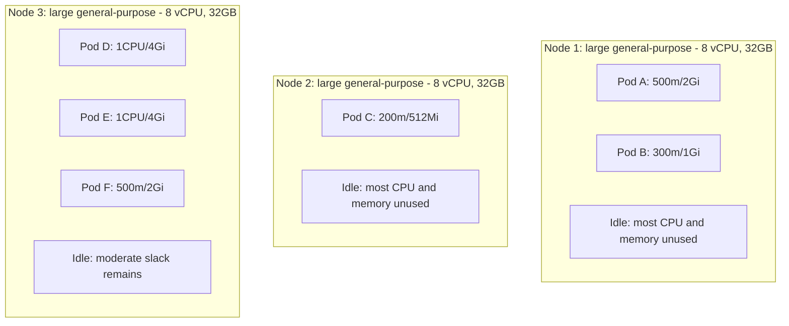
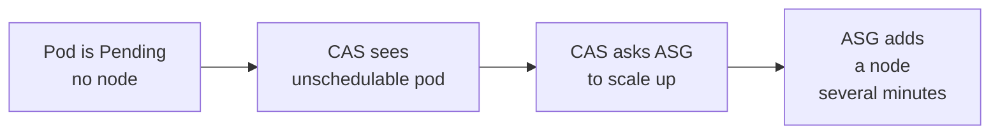
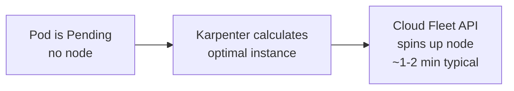
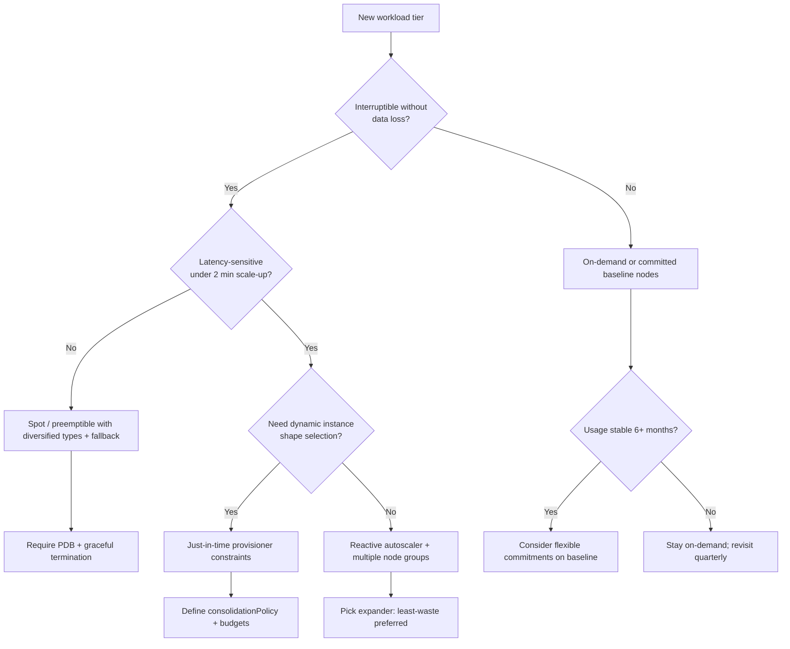

> **Discipline Module** | Complexity: `[COMPLEX]` | Time: 3h

## Prerequisites

Before starting this module:
- **Required**: [Module 1.3: Workload Rightsizing](../module-1.3-rightsizing/) — VPA, rightsizing workflows
- **Required**: Understanding of Kubernetes node pools and autoscaling
- **Required**: Familiarity with Karpenter or Cluster Autoscaler concepts
- **Recommended**: AWS experience (Karpenter examples use AWS terminology)
- **Recommended**: Understanding of EC2 instance types and pricing

---

## What You'll Be Able to Do

After completing this module, you will be able to:

- **Implement** spot instance strategies for Kubernetes workloads with proper fault tolerance and interruption handling
- **Design** node pool architectures that mix instance types for optimal price-performance
- **Configure** cluster autoscaler policies that balance cost efficiency with workload availability requirements
- **Evaluate** compute pricing models — on-demand, reserved, spot, savings plans — for your workload patterns
- **Apply** node consolidation strategies that reclaim idle compute capacity without violating disruption budgets

## Why This Module Matters

Module 1.3 taught you to rightsize individual workloads — giving each Pod exactly the resources it needs. But even with perfectly rightsized Pods, your cluster can still waste enormous amounts of money if the *nodes* underneath those Pods are inefficient. Node-level waste is the second-largest compute cost leak in Kubernetes after over-provisioned Pod requests, and it is harder to see because the bill arrives as a lump sum of EC2 or VM charges rather than a per-namespace allocation report.

**Hypothetical scenario:** Imagine a development cluster running three large general-purpose nodes. Each node costs roughly three hundred dollars per month in on-demand pricing. Rightsizing has shrunk your Pods so each node now carries only a fraction of its allocatable CPU and memory. The scheduler cannot place additional Pods because of affinity rules or namespace quotas, yet the autoscaler does not remove the nodes because utilization still clears the scale-down threshold. You are paying for three full machines to host workloads that could fit on one right-sized instance after consolidation.



After consolidation and right-sized node selection, the same Pod footprint might fit on a single medium general-purpose node. The durable lesson is not a specific dollar figure — it is that **rightsizing Pods without optimizing nodes leaves the largest structural inefficiency untouched**. Cluster autoscaling, consolidation, instance-type selection, and pricing-model choice are the levers that attack node-level waste.

This module teaches the durable methodology behind those levers: how reactive Cluster Autoscaler and just-in-time provisioners like Karpenter differ as *architectural patterns*, how bin-packing and consolidation reclaim idle capacity, how Spot and commitment discounts trade flexibility for price, and how to decide which combination fits your availability requirements. Tools illustrate the concepts — they are not the subject.

> **The Tetris Analogy**
>
> Rightsizing is choosing the right block size for each piece. Cluster compute optimization is playing Tetris on the board itself — picking the right-sized machine, rotating instance families to fit the pending Pod shapes, and clearing empty rows (nodes) before they keep costing money.

---

## Did You Know?

- **The Kubernetes scheduler and the cluster autoscaler solve different problems.** The scheduler places Pods onto existing nodes; the cluster autoscaler adds or removes nodes when the scheduler cannot find a fit. Many teams debug "scheduling problems" by tweaking Pod specs when the real bottleneck is that no appropriately sized node exists — or that too many oversized nodes remain after load drops.

- **Spot and preemptible instances are not "cheap on-demand" — they are a different contract.** Cloud providers sell unused capacity at a discount in exchange for the right to reclaim it with short notice. Workloads that treat Spot like discounted on-demand without interruption handling will eventually lose data or break SLOs during a reclamation wave.

- **Commitment discounts (Reserved Instances, Savings Plans, Committed Use Discounts) reward predictability, not efficiency.** Buying a three-year reservation for a machine size you rightsized away six months later converts waste into a contractual obligation. FinOps teams cover baseline steady-state usage with commitments and keep burst capacity on flexible pricing models.

- **ARM-based instances (such as AWS Graviton) can change the price-performance curve for container workloads**, but migration has a compatibility cost: multi-arch image builds, native library support, and performance validation in staging. The FinOps win appears only when the portability work is cheaper than the recurring compute savings — a calculation that depends on your software stack, not marketing claims.

---

## The Node-Level Cost Model

Before touching autoscaling configuration, you need a clear picture of where node money goes. Cloud bills for Kubernetes compute typically aggregate to **node hours × instance price × pricing model modifier**. Inside the cluster, cost efficiency is driven by how fully schedulable capacity is *requested* by Pods, how fully requested capacity is *used*, and how many nodes exist to satisfy those requests.

The gap between Pod **requests** and actual **usage** is the rightsizing problem from Module 1.3. The gap between **node allocatable resources** and **sum of Pod requests** on that node is **scheduling slack** — capacity you pay for that no workload has claimed. The gap between **node capacity** and **running Pods** after scale-down delays is **consolidation debt** — nodes that remain because the autoscaler is conservative or because Pod disruption budgets block eviction.

```text
Node cost efficiency stack (conceptual):

  Cloud bill          →  instance hours × $/hour × commitment discount
  Node allocatable    →  kube-reserved and system overhead subtracted
  Scheduled requests  →  sum of Pod CPU/memory requests on the node
  Actual usage        →  metrics-server / Prometheus observed consumption

  Waste layer 1:  allocatable − scheduled requests   (bin-packing failure)
  Waste layer 2:  scheduled requests − actual usage  (rightsizing failure)
  Waste layer 3:  nodes with no schedulable capacity (consolidation failure)
```

FinOps for compute optimization attacks all three layers, but **order matters**. Rightsizing without consolidation leaves Pods small and nodes large. Consolidation without rightsizing packs inefficient Pods tightly onto expensive machines. Autoscaling without either merely reproduces the same waste pattern at varying cluster sizes. Mature teams run these activities as a pipeline: measure allocation gaps, rightsize requests, then tune autoscaling and consolidation to match real demand shapes.

Unit economics still apply at the node layer. If your platform charges internal teams by namespace, the **cost per schedulable CPU-hour** on a node pool is the bridge between cloud invoices and product decisions. A Spot-backed batch pool and an on-demand control-plane-adjacent pool may both run Kubernetes, but their unit costs and risk profiles differ by an order of magnitude. Making that visible is an Inform-phase activity; choosing the right pool per workload is Optimize-phase engineering.

---

## Cluster Autoscaling: Reactive vs Just-in-Time

Cluster autoscaling answers one question: **when the scheduler marks Pods as unschedulable because no node satisfies their constraints, how does the cluster obtain new capacity — and when load drops, how does it release capacity safely?** Two architectural patterns dominate managed Kubernetes in 2026: **reactive node-group scaling** (Cluster Autoscaler and cloud-managed equivalents) and **just-in-time node provisioning** (Karpenter and similar direct-to-API provisioners).

Reactive scaling assumes you have **pre-declared node groups** — Auto Scaling Groups on AWS, Managed Instance Groups on GCP, Virtual Machine Scale Sets on Azure. Each group has a template: instance type, disk, labels, taints. The autoscaler watches for pending Pods, picks a group whose template could fit them, and increments the group's desired size. Scale-down reverses the flow after a cooldown: if a node is underutilized and its Pods can move elsewhere, the autoscaler cordons, drains, and terminates it.

Just-in-time provisioning removes the fixed group template as the primary abstraction. A provisioner evaluates **all pending Pods collectively**, searches a **catalog of instance types** allowed by policy, and launches the combination that minimizes cost and scheduling latency subject to constraints. When demand falls, it **consolidates** — replacing many underused nodes with fewer right-sized ones, or simply terminating empty nodes. The durable difference is not "faster YAML" but **who owns instance-type selection**: the platform engineer at node-group design time, or the provisioner at scheduling time.

Neither pattern replaces the Kubernetes scheduler. Both depend on accurate Pod resource requests, tolerations, node selectors, topology spread constraints, and Pod disruption budgets. Autoscaling amplifies whatever scheduling policy you already have; it does not fix contradictory affinity rules or missing requests.

---

## Cluster Autoscaler vs Karpenter

### Cluster Autoscaler (CAS)

The Cluster Autoscaler is the original Kubernetes node autoscaler. It integrates with cloud provider scaling groups and has been in production use since 2016 across AWS, GCP, Azure, and several on-premises integrations. Its mental model matches how many platform teams already think about infrastructure: **you define pools; the autoscaler scales pool size.**

**Cluster Autoscaler Workflow:**



When Pods become `Pending` because no node has enough allocatable CPU, memory, or specialized resources (GPU, local SSD), the Cluster Autoscaler scans configured node groups in priority order. For each candidate group, it simulates whether adding a node from that group's template would schedule the pending Pods. When it finds a fit, it increases the group's desired capacity. The cloud provider launches an instance, the kubelet registers, and the scheduler places the Pods. Scale-up latency is dominated by **image pull, bootstrap, and cloud API speed** — commonly several minutes on AWS when traversing Auto Scaling Groups.

Scale-down is intentionally conservative. The autoscaler waits until nodes are underutilized relative to configured thresholds, respects PodDisruptionBudgets and mirror Pods on system nodes, and avoids flapping with cooldown timers. That conservatism protects availability but leaves **consolidation debt** on the table: three half-empty nodes may persist because no single node in the pre-defined groups can absorb all workloads simultaneously.

**Strengths of the reactive model** include multi-cloud consistency, extensive operational runbooks, and predictable behavior when node groups are well-designed. **Limitations** include fixed instance-type choices per group, slower scale-out when templates are a poor match for pending Pod shapes, and manual work to diversify Spot instance types across multiple groups.

### Karpenter

Karpenter is a node provisioning controller originally developed for AWS EKS and now maintained under the Kubernetes SIG Autoscaling umbrella with a vendor-neutral core (`kubernetes-sigs/karpenter`) and cloud-specific providers. It provisions nodes by calling cloud APIs directly rather than resizing pre-defined groups. On AWS, it uses the EC2 Fleet API to launch instances selected from constraints you declare in `NodePool` and `NodeClass` objects.

**Karpenter Workflow:**



When Pods are unschedulable, Karpenter evaluates their combined requirements — resource requests, node selectors, affinities, tolerations, topology spread, and daemonset overhead — and selects instance types from an allowed set. It can launch **multiple nodes in parallel** when a single machine cannot satisfy topology spread. When utilization drops, Karpenter's disruption controllers can **consolidate** workloads onto fewer nodes and terminate empties, subject to disruption budgets and consolidation policies you configure.

> **Stop and think**: How does provisioning latency change your tolerance for running nodes at higher utilization? Faster scale-out reduces the need for idle headroom — but only if your workloads tolerate the brief scheduling gap during bursts.

**Strengths of the just-in-time model** include dynamic instance-type selection, native Spot diversification with on-demand fallback, and built-in consolidation. **Tradeoffs** include additional controller complexity, cloud-provider-specific maturity differences (AWS provider is the most documented; other providers continue to evolve), and a learning curve for disruption budgets and consolidation tuning.

### Comparison

| Feature | Cluster Autoscaler | Karpenter |
|---------|-------------------|-----------|
| Node provisioning | Via scaling groups (pre-defined) | Direct cloud API (dynamic) |
| Instance selection | Fixed per node group | Dynamic within policy constraints |
| Typical provisioning speed | Several minutes | Often one to two minutes on AWS |
| Spot support | Manual per-group configuration | First-class capacity-type constraints |
| Bin-packing | Fits into existing group templates | Selects instance size per pending batch |
| Consolidation | Scale-down of underused nodes | Consolidation + replacement options |
| Multi-arch (ARM) | Separate node groups | Constraint-based in NodePool |
| Cloud support | Broad multi-cloud + on-prem options | AWS mature; other providers evolving |

### Choosing Between Patterns

The durable question is not "which controller wins" but **which constraints dominate your environment**. If you operate multi-cloud Kubernetes with identical node-group patterns across providers, Cluster Autoscaler’s model may reduce cognitive load. If you run large AWS EKS footprints with diverse workload shapes and aggressive cost targets, just-in-time provisioning may extract more bin-packing efficiency — at the cost of learning Karpenter-specific APIs. If your cloud provider offers a managed Kubernetes autopilot tier that provisions nodes transparently, you may already be using just-in-time provisioning without installing either controller.

| Scenario | Cluster Autoscaler emphasis | Karpenter emphasis |
|----------|----------------------------|-------------------|
| Multi-cloud standardization | Pre-defined groups per cloud | Per-cloud NodePools with shared patterns |
| Diverse instance-type needs | Multiple groups per type | Single NodePool with instance constraints |
| Spot with fallback | Separate Spot and on-demand groups | Mixed capacity-type requirements |
| Strict change-control | Familiar ASG operations | CRD-driven provisioning policies |
| Aggressive consolidation | Tune scale-down delays carefully | Tune `consolidationPolicy` and budgets |

Present both as **peers with different architectural assumptions**, not as a ranked leaderboard. Your choice should follow from scheduling latency requirements, cloud scope, and operational familiarity — then be validated with cost and availability metrics in your own clusters.

---

## Configuring Just-in-Time Provisioning

Karpenter expresses policy through `NodePool` resources (scheduling constraints and disruption behavior) and provider-specific classes (for AWS, `EC2NodeClass` defines subnets, AMIs, and security groups). The following manifest illustrates **capacity-type mixing** and **instance family constraints** without locking you to a single machine size:

```yaml
apiVersion: karpenter.sh/v1
kind: NodePool
metadata:
  name: default
spec:
  template:
    metadata:
      labels:
        team: shared
    spec:
      requirements:
        - key: karpenter.k8s.aws/instance-category
          operator: In
          values: ["c", "m", "r"]
        - key: karpenter.k8s.aws/instance-size
          operator: In
          values: ["medium", "large", "xlarge", "2xlarge"]
        - key: karpenter.sh/capacity-type
          operator: In
          values: ["spot", "on-demand"]
        - key: kubernetes.io/arch
          operator: In
          values: ["amd64", "arm64"]
      nodeClassRef:
        group: karpenter.k8s.aws
        kind: EC2NodeClass
        name: default
  disruption:
    consolidationPolicy: WhenEmptyOrUnderutilized
    consolidateAfter: 5m
```

**Configure** cluster autoscaling policies by translating business rules into these knobs. `consolidateAfter` balances cost against stability: aggressive consolidation saves money but increases Pod churn. `WhenEmptyOrUnderutilized` allows Karpenter to replace an expensive node with a cheaper one if all Pods can reschedule — the heart of **compute optimization without manual node surgery**. PodDisruptionBudgets on stateful workloads tell the provisioner where consolidation must stop.

For Cluster Autoscaler, the parallel levers are **node group boundaries**, **scale-down-enabled flags**, **expander strategies** (`least-waste` vs `random`), and **priority expanders** that prefer cheaper groups when multiple could satisfy pending Pods. Document your chosen policy in runbooks so on-call engineers know whether a pending Pod should trigger a scale-up incident or a rightsizing review.

---

## Node Consolidation and Bin-Packing

**Bin-packing** is the combinatorial problem of fitting Pod resource requests onto machines with finite allocatable CPU and memory. Kubernetes does this online via the scheduler every time a Pod is created. **Consolidation** is offline bin-packing at the node layer: given the current Pod set, is there a cheaper multiset of nodes that could host the same workloads?

Poor bin-packing shows up as many nodes each running at low request utilization. The autoscaler may have scaled up during a traffic spike using large instances because they were the only template that fit GPU or memory-heavy Pods; after scale-in, small Pods remain spread across those large nodes because the scheduler already placed them and nothing forces re-packing until consolidation runs.

**Apply** consolidation strategies incrementally. Start with workloads that are stateless, horizontally scaled, and backed by PodDisruptionBudgets that allow at least one disruption. Batch and CI workloads are typical first candidates. Stateful systems with local data or long startup times need higher `consolidateAfter` delays and tighter budgets. Measure **scheduling latency during consolidation events** alongside **node-hour reduction** — FinOps wins that breach latency SLOs are losses elsewhere.

DaemonSets complicate bin-packing because every node pays their resource tax. A logging or monitoring agent consuming two hundred millicores on a thirty-node cluster is six cores of unavoidable overhead. Centralizing optional agents or using tolerations to limit daemon proliferation is a platform design choice with direct compute cost impact.

```text
Consolidation decision checklist (platform engineer view):

  1. Can every Pod on the node reschedule elsewhere without violating PDBs?
  2. Will replacement nodes satisfy topology spread and affinity rules?
  3. Is there a cheaper instance type or capacity type that fits the bundle?
  4. Does the workload tolerate eviction notice within the cloud's interruption window?
  5. Are metrics dashboards watching scheduling latency during the event?
```

---

## Spot and Preemptible Economics

Spot Instances (AWS), Spot VMs (GCP), and Spot Virtual Machines (Azure) sell spare capacity at variable discounts. The **durable economic idea** is trading **price** for **availability guarantees**: the cloud provider may reclaim capacity when demand returns, giving you a two-minute (AWS) style warning on interruption. Preemptible VMs on GCP follow a similar contract with a maximum lifetime. This is not a loyalty discount — it is a **risk-sharing arrangement**.

**Implement** spot strategies by classifying workloads into interruption tolerance tiers. **Tier 1 — spot-safe**: stateless web tiers with replicas greater than one, batch jobs with checkpointing, queue consumers with at-least-once delivery. **Tier 2 — spot-cautious**: data pipelines with moderate restart cost; use Spot with on-demand fallback and diversified instance types. **Tier 3 — spot-unsafe**: single-replica stateful systems, jobs without idempotency, workloads that cannot tolerate eviction within notice periods.

Kubernetes integrates Spot at the **node pool** layer. Nodes carry labels such as `karpenter.sh/capacity-type=spot` or cloud-specific labels; workloads land on Spot only if they tolerate the corresponding taints or use tolerations explicitly. Mixing Spot and on-demand in one NodePool lets Karpenter attempt Spot first and fall back when capacity is unavailable — diversification across instance types and availability zones reduces the probability that a single reclamation wave blocks scheduling.

Interruption handling belongs in application design, not only infrastructure labels. The AWS Node Termination Handler (and cloud-specific equivalents) listens for reclamation events, cordons nodes, and drains Pods gracefully. Without graceful termination, Spot saves money on paper while increasing incident volume. Pair Spot nodes with **PodDisruptionBudgets** and **terminationGracePeriodSeconds** that fit your drain time budget.

> **Hypothetical scenario:** A batch team runs nightly ETL on Spot-only nodes. One evening, three instance types in an availability zone are reclaimed simultaneously. Without diversified types and without a fallback on-demand NodePool, Jobs remain pending until morning. The FinOps lesson: Spot savings must be modeled with **interruption correlation risk**, not average discount percentage alone.

---

## Instance Type Selection

Cloud providers expose dozens of instance families optimized for different resource shapes: **compute-optimized** (high CPU per dollar), **general-purpose** (balanced), **memory-optimized** (high RAM per dollar), **storage-optimized**, and **accelerator** families for GPUs. Picking the wrong family is a silent tax — you pay for RAM you do not need because you chose a general-purpose size when a compute-optimized size would have scheduled the same Pods at lower hourly cost.

**Design** node architectures that expose **multiple shapes** rather than one "standard worker." A microservices fleet might default to general-purpose medium instances while isolating memory-heavy search replicas on memory-optimized nodes via node selectors. GPU inference belongs on accelerator families with taints so generic workloads never accidentally land on expensive silicon.

The Kubernetes scheduler respects **Pod resource requests**, not machine family names. If your Pods request four CPUs and eight gibibytes of memory, any instance with sufficient allocatable resources is a candidate — unless node selectors, affinities, or taints narrow the set. Autoscaling controllers search within the allowed set. Widening allowed families increases optimization opportunity and **Spot diversification**; narrowing simplifies compliance and debugging.

Local instance store versus network-attached storage also affects cost and performance. Storage-optimized instances with NVMe can be cheaper per IOPS for ephemeral shuffle workloads but wrong for Pods expecting persistent volumes on slow disks. FinOps here merges with architecture: the cheapest node is not cheapest if it forces expensive cross-AZ traffic or oversized persistent disks.

---

## ARM and Graviton Migration

ARM-based cloud instances (AWS Graviton, Azure Ampere Altra, GCP Tau T2A) often change the **price-performance ratio** for containerized Linux workloads because cloud providers pass architectural efficiency to customers as lower hourly rates. The durable FinOps question is whether **migration cost** (building multi-arch images, validating dependencies, regression testing) is less than **recurring savings** over your planning horizon.

Containers simplify architecture portability relative to bare-metal migrations: if your image ships `linux/amd64` and `linux/arm64` manifests, Kubernetes can schedule either via `kubernetes.io/arch` node affinity. Many open-source stacks already publish multi-arch images. Proprietary binaries, JNI libraries, and certain encryption tooling remain common blockers — discover them in staging, not during a finance-mandated cutover.

**Design** heterogeneous clusters that run ARM for compatible workload pools and retain x86 pools for exceptions. Karpenter and multi-group Cluster Autoscaler setups both support arch constraints. Gradual migration beats big-bang replacement: move stateless leaf services first, measure latency and error budgets, then expand scope. FinOps partners with engineering here — savings appear only when reliability is preserved.

---

## Commitment-Based Discounts

On-demand pricing is the **baseline flexible rate**: no upfront commitment, scale any time, pay the highest hourly price. **Reserved Instances (RIs)**, **Savings Plans (SPs)** on AWS, **Committed Use Discounts (CUDs)** on GCP, and **Reserved VM Instances** on Azure trade **term length and spend predictability** for **lower effective rates**. The durable idea: **you are purchasing insurance against your own forecast error** — if actual usage diverges from commitment, savings evaporate while obligations remain.

**Evaluate** pricing models against a **baseline utilization forecast**, not peak burst capacity. A common pattern covers sixty to seventy percent of steady CPU hours with commitments and keeps burst on-demand or Spot. Savings Plans offer flexibility across instance families and regions within a cloud; traditional RIs bind more tightly but may offer deeper discounts for stable shapes.

Kubernetes complicates commitments because cluster rightsizing and consolidation change the instance types and sizes you need over time. Buying three-year reservations for `m6i.4xlarge` nodes before rightsizing shrinks workloads to `m6i.xlarge` leaves you paying for capacity you no longer schedule. FinOps maturity means **syncing commitment purchases with quarterly capacity reviews**, not treating discounts as a one-time procurement event.

| Pricing model | Flexibility | Typical use in Kubernetes |
|---------------|-------------|----------------------------|
| On-demand | Highest | Burst, experiments, unknown lifetimes |
| Spot / preemptible | High with interruption risk | Batch, fault-tolerant replicas |
| Savings Plans / flexible commitments | Medium | Steady cluster baseline after rightsizing |
| Reserved / CUD (strict) | Lower | Stable node pools with slow-changing shapes |

---

## Landscape Snapshot — as of 2026-06

> **This changes fast; verify against vendor docs before relying on specifics.**

| Topic | Snapshot (verify at source) |
|-------|----------------------------|
| Karpenter project status | Vendor-neutral core under Kubernetes SIG Autoscaling; AWS provider widely documented; check provider maturity per cloud before production rollout |
| Karpenter stable API | `karpenter.sh/v1` NodePool API; see upstream release notes for consolidation and disruption fields |
| AWS Spot interruption notice | Two-minute warning for EC2 Spot Instances in most cases; behavior documented in AWS Spot documentation |
| AWS Graviton positioning | AWS markets Graviton instances as lower cost and better performance per watt for many workloads; validate with your binaries |
| Cluster Autoscaler | Ships with major cloud Kubernetes offerings; version skew with control plane minor version matters |
| Commitment products | AWS Savings Plans and Reserved Instances, GCP Committed Use Discounts, Azure Reserved VM Instances — discount depth varies by term, payment option, and region |

---

## Cost-Tooling Rosetta

Capabilities compared as peers — not ranked. Tool features change; verify in docs.

| Capability | OpenCost | Kubecost | Cloud cost explorer | Cluster Autoscaler | Karpenter |
|------------|----------|----------|---------------------|-------------------|-----------|
| Cost allocation by namespace/label | Core focus | Core focus | Via tags on nodes/resources | Indirect (tags on groups) | Indirect (labels on nodes) |
| Idle / slack cost visibility | Yes | Yes | Limited at Pod level | No | No |
| Showback / chargeback reporting | Integrations | Built-in views | Billing console reports | No | No |
| Rightsizing recommendations | Limited / partner | Yes | Native advisor tools | No | Indirect via consolidation |
| Anomaly detection | Varies by install | Yes | Native billing alerts | No | No |
| Node provisioning | No | No | No | Scale groups | Direct API |
| Spot / mixed capacity orchestration | No | Guidance | No | Per-group config | Capacity-type constraints |
| CI cost estimation | No | No | Third-party | No | No |

---

## Patterns

**Rightsize before autoscale aggressively.** Shrinking Pod requests changes the node shapes autoscaling controllers select. Running consolidation on oversized requests packs waste more densely.

**Mixed capacity-type NodePools with on-demand fallback.** Prefer interruptible capacity for eligible workloads while preserving schedulability when Spot pools dry up — implement via provisioner constraints, not wishful scheduling.

**Diversified Spot instance-type allowlists.** Spread reclamation risk across families and zones instead of betting on a single cheap instance type that correlates during capacity crunches.

**Topology-aware consolidation windows.** Run disruptive consolidation during maintenance periods or low-traffic hours when PDBs allow — measure cost saved versus scheduling latency impact.

**Commitment coverage on stabilized baselines.** Purchase flexible commitments only after several quarters of rightsized, consolidated usage data — align finance and engineering calendars.

**Heterogeneous architecture pools.** Operate ARM and x86 pools side by side with explicit arch selectors so migration proceeds workload-by-workload without blocking the scheduler.

---

## Anti-Patterns

| Anti-Pattern | Why It Fails | Better Approach |
|--------------|--------------|-----------------|
| Autoscale before rightsizing | Scales nodes to fit bloated requests | Rightsize Pods, then tune autoscaling |
| Single instance-type node group | Poor bin-packing; Spot correlation | Multiple shapes or dynamic provisioner constraints |
| Spot for single-replica stateful apps | Interruptions become outages | On-demand or replicated designs with PDBs |
| Aggressive consolidation without PDBs | Violates availability during evictions | Define budgets per service tier first |
| Long-term RI before usage stabilizes | Locks spend on wrong shapes | Quarterly baseline review before commitments |
| Treating Spot discount as guaranteed savings | Ignores interruption handling cost | Model risk-adjusted unit economics |
| One global autoscaler policy | Batch and latency-sensitive tiers differ | Separate NodePools / groups per tier |
| Ignoring daemonset overhead | Hidden per-node tax erodes savings | Audit cluster add-ons regularly |

---

## Decision Framework

Use this flowchart when choosing compute pricing and provisioning strategy for a workload tier:



Walk the graph with **service tier owners**, not alone. Finance owns commitment questions; SRE owns interruption tolerance; platform engineering owns provisioner configuration.

---

## Integrating Workload and Node Optimization

Rightsizing and cluster compute optimization are sequential stages of the same FinOps pipeline, not competing projects owned by different teams. When Module 1.3 shrinks Pod CPU requests from one full core to two hundred millicores, the scheduler suddenly has more placement options on existing nodes — which can delay scale-up events and reduce node-hour consumption without any autoscaling change at all. Conversely, when consolidation packs Pods tightly but those Pods still request three times their measured usage, you have simply concentrated waste into fewer, still-oversized machines.

The integration pattern that works in production is a **monthly joint review**: platform engineering brings node utilization and consolidation metrics; application teams bring VPA recommendations and latency dashboards; FinOps brings allocated spend per namespace and commitment utilization. Decisions flow in order — first accept or reject rightsizing changes in staging, then adjust NodePool constraints or node group instance types, then revisit commitment coverage if baseline node hours shifted materially. Skipping the first step and leaping to Spot-heavy NodePools amplifies risk without maximizing savings, because large requests force large instances even when Spot is cheap.

Horizontal Pod Autoscaler activity also changes node economics. If HPA adds replicas during business hours, pending Pods may trigger scale-up events that persist after replicas scale down because scale-down cooldowns lag traffic patterns. Tune cluster autoscaling only after HPA behavior is understood — otherwise you optimize nodes for a replica count that no longer exists. The durable mental model is **Pods drive scheduler decisions; schedulers drive autoscaling decisions; finance validates whether the resulting node hours match business value**.

---

## Cluster Autoscaler Configuration in Practice

Cluster Autoscaler behavior is controlled through a combination of deployment flags, cloud-specific settings on node groups, and RBAC permissions to modify scaling groups. The **`--expander`** flag determines which eligible node group receives a scale-up when several could fit pending Pods. The `least-waste` expander prefers the group that leaves the smallest fraction of unused CPU and memory on the new node — a direct bin-packing heuristic at group selection time. The `priority` expander consults a ConfigMap ranking groups so platform teams can prefer cheaper Spot-backed groups for batch namespaces while reserving on-demand groups for system components.

Scale-down behavior hinges on **`--scale-down-utilization-threshold`** and **`--scale-down-unneeded-time`**. A high utilization threshold keeps nodes longer, reducing eviction churn at the cost of idle capacity. A long unneeded time prevents flapping when replica counts oscillate. There is no universal optimum — latency-sensitive platforms accept more headroom; cost-sensitive batch platforms accept more churn. Document chosen values in your platform runbook and revisit them after major application releases.

Cluster Autoscaler also respects **PodDisruptionBudgets**, mirror Pods, and kube-system scheduling rules. If scale-down never removes nodes despite low utilization, common causes include PDBs with `minAvailable` equal to replica count, Pods with local storage, or missing tolerations preventing rescheduling onto remaining nodes. Debugging "why won't nodes scale down" is as important as debugging pending Pods — both sides of autoscaling affect the invoice.

On AWS, ensure IAM permissions allow `autoscaling:SetDesiredCapacity` and that node group tags include the cluster ownership keys Cluster Autoscaler expects. On GKE, node auto-provisioning overlaps conceptually with just-in-time provisioning but uses Google-managed policies. The implementation differs; the FinOps goal is identical: **match billed node hours to schedulable demand**.

---

## Observability for Compute FinOps

You cannot optimize what you measure only as a monthly cloud total. Compute FinOps observability connects **cloud billing exports** with **Kubernetes metrics** so teams see node-hour drivers in the same language they use for reliability work. At minimum, track allocatable versus requested CPU and memory per node, pending Pod duration, scale-up and scale-down event counts, Spot interruption rates, and cost per namespace after allocation.

Prometheus queries against `kube_pod_container_resource_requests` and `kube_node_status_allocatable` expose scheduling slack. Recording rules that compute `sum(requests) / sum(allocatable)` per node pool highlight pools where bin-packing fails. Pending Pod metrics — time from unschedulable to scheduled — validate whether provisioning latency forces over-provisioning. If P95 pending time approaches your SLO breach window, finance may need to accept higher baseline node counts even if average utilization looks low.

Cost tooling such as OpenCost or Kubecost (see the Rosetta table) attributes node costs to namespaces using labels and shared cost splitting rules. Cloud-native billing consoles attribute by tags on instances. The FinOps bridge activity is ensuring **node labels and cloud tags align** with the chargeback model from Module 1.2 — otherwise compute optimization saves money globally while political friction grows locally because teams cannot see their share.

Alerting should treat sustained pending Pods and failed scale-ups as incident-worthy for platforms that promise elastic capacity. A Spot pool that cannot launch for twelve hours is both a scheduling outage and a cost event if workloads fall back to expensive on-demand emergency capacity without governance. Pair infrastructure alerts with weekly cost anomaly review so technical and financial signals reinforce each other.

---

## Operating Just-in-Time Provisioners Day to Day

Karpenter and similar provisioners shift operational work from **managing Auto Scaling Group desired counts** to **managing constraint CRDs and disruption policies**. Day-two tasks include reviewing NodePool allowlists when new instance generations launch, adjusting consolidation aggression after major traffic pattern changes, and auditing orphaned `NodeClaim` objects when cloud instances fail to terminate cleanly.

Disruption budgets in Karpenter limit how aggressively consolidation may proceed within a time window — analogous in purpose to Kubernetes PodDisruptionBudgets but at the provisioner layer. When security patching requires node replacement, provisioners may use **drift** or **expiration** policies to cycle nodes even when utilization is high. FinOps participates in those windows: replacing nodes during business hours may save less than patching during maintenance if fallback capacity requires on-demand burst.

Version upgrades for provisioner controllers should run through staging clusters that mirror production instance constraints. API migrations — such as moves between alpha and stable CRD versions — can silently halt provisioning if validation fails. Treat provisioner upgrades like control plane upgrades: test pending Pod scenarios, Spot fallback, and consolidation in a sandbox before production promotion.

Runbooks should document **when to pause consolidation** — for example during peak retail hours or end-of-quarter batch jobs — and how to pin workloads to on-demand NodePools temporarily. Emergency levers belong in runbooks finance approves in advance so incident response does not accidentally double spend.

---

## Accelerator and GPU Compute Economics

General-purpose CPU optimization dominates FinOps conversations because most Kubernetes workloads are web services and workers. Accelerator families break the usual bin-packing math: GPUs are expensive, partially shareable only with specific software stacks, and often idle between inference bursts. The FinOps posture is **isolation and time-sharing**, not "run everything on the cheapest CPU node."

GPU pools should carry taints and clear labels so only workloads requesting `nvidia.com/gpu` (or vendor-specific resources) schedule there. Autoscaling GPU nodes without autoscaling GPU-consuming Pods wastes silicon — Karpenter and Cluster Autoscaler will happily launch expensive nodes for Pods that requested GPUs unnecessarily. Rightsizing GPU requests and using horizontal scaling for stateless inference replicas often beats vertical giant instances.

Spot can apply to some GPU instance types in certain regions, but interruption correlation and capacity scarcity make fallback planning essential. Many teams run GPU baselines on committed on-demand or reserved capacity and treat Spot GPU as optional acceleration for fault-tolerant training jobs with checkpointing. The evaluation framework matches CPU: classify tolerance, model interruption cost, measure unit economics per inference or training hour — not per node.

---

## FinOps Lifecycle Alignment

Cluster compute optimization spans all three FinOps Foundation phases. **Inform** builds the dashboards and allocation rules that show which node pools drive spend and which namespaces consume them. **Optimize** applies rightsizing, autoscaling policy tuning, Spot adoption, consolidation, and commitment purchases. **Operate** institutionalizes monthly reviews, budgets, anomaly alerts, and approval workflows for expensive instance types or long-term commitments.

Personas collaborate differently in each phase. **FinOps practitioners** translate billing data into node-hour trends. **Engineering directors** approve risk tradeoffs between Spot and on-demand. **Platform engineers** implement NodePools and Cluster Autoscaler flags. **Product owners** decide whether latency SLOs justify higher baseline capacity. When any persona is missing, organizations oscillate between panic cost cuts and unconstrained spend.

> **Hypothetical scenario:** A platform team enables aggressive consolidation every night without informing application owners. Stateless APIs recover fine, but a nightly billing batch job with a thirty-minute startup time misses its finance deadline twice in one week. The fix is Operate-phase governance: consolidation windows published in advance, PDBs negotiated per tier, and FinOps metrics showing savings alongside job completion rates. Compute optimization succeeded technically while failing organizationally — a reminder that node dollars always sit inside business processes.

---

## Capacity Planning Versus Continuous Optimization

Traditional capacity planning asks, "How many nodes will we need next quarter?" and provisions headroom upfront. Kubernetes autoscaling inverts part of that logic: capacity becomes **elastic**, and planning focuses on **constraints and ceilings** rather than fixed counts. FinOps still needs forecasts — commitments and budgets require them — but the unit of planning shifts from "number of m6i.xlarge nodes" to "baseline vCPU-hours per environment" plus "burst multiplier for peak events."

A practical hybrid approach keeps **two numbers** on the dashboard. First, **steady-state vCPU-hours** after rightsizing and consolidation, smoothed over four to six weeks — this feeds commitment purchases and departmental budgets. Second, **peak schedulable demand** observed during the busiest day in the same window — this feeds autoscaling maximums, Spot fallback capacity, and latency SLO reviews. When steady-state is far below peak, your cluster is burst-heavy; Spot and just-in-time provisioning extract more value. When steady-state approximates peak, you run hot — consolidation opportunities are smaller and commitments safer.

Seasonal events (retail peaks, tax filing, semester starts) should trigger **pre-warming policies** agreed with finance in advance. Temporarily raising minimum node counts or relaxing consolidation is not failure — it is priced risk management. Document the expected incremental node-hour cost and retire the policy after the event so temporary capacity does not become permanent sediment. FinOps maturity shows up in how cleanly you return to optimized baselines after known peaks.

Finally, distinguish **engineering-driven optimization** from **vendor-driven price changes**. A new instance generation or regional price cut can lower bills without any cluster change — finance may celebrate while platform work is unchanged. Conversely, excellent autoscaling work can be invisible on the invoice if usage grew simultaneously. Always report optimization as **unit cost per workload transaction** or **cost per namespace per week**, not only absolute spend, so improvements remain visible inside growth.

Platform engineers should also maintain a **change log for autoscaling policy** tied to cost dashboards. When you tighten consolidation, widen Spot allowlists, or add a new instance family to a NodePool, record the date and the hypothesis ("we expect batch namespaces to shed twenty node-hours per week"). Review outcomes two weeks later against Prometheus and billing exports. This closes the FinOps feedback loop and prevents policy churn driven by anecdote rather than evidence — the same scientific habit Module 1.3 applied to Pod requests, extended to the node layer where invoices actually materialize.

Treat every autoscaling change as a **two-week experiment** with a written success criterion. If node-hours fall but pending Pod duration breaches SLO, roll back and capture the lesson. If node-hours stay flat but latency improves, you may have traded cost for reliability intentionally — finance should see that trade documented, not hidden inside a cluster upgrade ticket. Shared experiment notes help the next engineer avoid repeating a failed consolidation policy on the same workload tier.

---

## Common Mistakes

| Mistake | Problem | Solution |
|---------|---------|----------|
| Scaling clusters without rightsizing Pods first | Pays for larger nodes than workloads need | Complete Module 1.3 rightsizing pipeline before autoscale tuning |
| Using one instance type for all workloads | Memory-heavy and CPU-heavy Pods share wrong economics | Split pools or use dynamic instance constraints |
| Running Spot without interruption handling | Reclamations cause failed jobs and pager storms | Add termination handlers, PDBs, and fallback capacity |
| Setting consolidation aggression too high | Latency spikes during node replacements | Increase `consolidateAfter`; consolidate tier by tier |
| Buying maximum-term reservations early | Locks wrong instance shapes after optimization | Commit only after baseline utilization stabilizes |
| Ignoring Pod disruption budgets | Consolidation blocked unpredictably or unsafe evictions | Define PDBs before enabling consolidation |
| Treating autoscaling as set-and-forget | Drift in workload shapes erodes original policy fit | Review autoscaling metrics monthly with cost dashboards |
| Measuring success only by node count | Fewer nodes can still be wrong instance families | Track cost per schedulable CPU-hour and request utilization |

---

## Quiz

1. **Scenario:** Your cluster has three half-empty on-demand nodes after a traffic drop. Rightsizing is complete. Pending Pods are zero. What FinOps mechanism reclaims this waste, and what guardrail prevents an outage during it?

   <details>
   <summary>Answer</summary>
   Node consolidation (via Karpenter consolidation or Cluster Autoscaler scale-down) reclaims idle capacity by evicting Pods and terminating underused nodes. PodDisruptionBudgets limit simultaneous evictions so highly available services keep minimum replicas online. Configure cluster autoscaler policies with appropriate consolidation delays and test with stateless tiers first before touching latency-sensitive workloads.
   </details>

2. **Scenario:** A finance leader asks you to move every workload to Spot immediately for maximum savings. How do you respond with a durable FinOps framing?

   <details>
   <summary>Answer</summary>
   Spot trades availability guarantees for lower price — it is not discounted on-demand. Implement spot strategies only for interruption-tolerant tiers with diversified instance types, graceful termination, and on-demand fallback. Evaluate compute pricing models per workload class: batch and redundant replicas may qualify; single-replica stateful systems do not. Present unit economics with interruption risk, not headline discount percentages.
   </details>

3. **Why does rightsizing Pod requests change cluster autoscaling economics even when node counts stay the same?**

   <details>
   <summary>Answer</summary>
   Autoscalers and provisioners select node sizes based on pending Pod resource requests and constraints. Smaller requests allow scheduling onto smaller instance types and improve bin-packing efficiency. Without rightsizing, autoscaling launches larger nodes than necessary, paying for allocatable CPU and memory no Pod will ever request. Rightsizing shrinks the Tetris pieces so consolidation and instance selection can find cheaper boards.
   </details>

4. **Compare reactive Cluster Autoscaler scaling groups with Karpenter-style just-in-time provisioning along two axes: who chooses instance type, and how consolidation typically works.**

   <details>
   <summary>Answer</summary>
   Cluster Autoscaler chooses among pre-defined node group templates fixed at design time; scale-down removes underutilized nodes after cooldowns. Karpenter chooses instance types dynamically from policy constraints when Pods are pending and can consolidate by replacing nodes with cheaper alternatives that still fit the Pod bundle. Neither replaces the scheduler; both amplify scheduling and rightsizing quality.
   </details>

5. **Design question:** You need GPU inference nodes for bursty traffic and separate general-purpose nodes for APIs. How should node pool architectures reflect this?

   <details>
   <summary>Answer</summary>
   Design node pool architectures with separate pools or NodePools: accelerator families with taints for GPU inference, general-purpose families for APIs. Apply spot strategies only if inference jobs tolerate interruption or maintain on-demand fallback GPUs. Mix instance types within each tier for Spot diversification where applicable. Measure price-performance per tier instead of forcing one instance type for optimal price-performance globally.
   </details>

6. **When are commitment-based discounts (Savings Plans, Reserved Instances, CUDs) appropriate in a Kubernetes cluster, and when are they dangerous?**

   <details>
   <summary>Answer</summary>
   Commitments fit stable baseline node hours after rightsizing and consolidation have stabilized — typically steady production footprints, not bursty dev clusters. They are dangerous when purchased before instance shapes are validated: Kubernetes optimization continuously changes the ideal node size and family. Evaluate compute pricing models quarterly; cover baseline with flexible commitments and keep burst on Spot or on-demand.
   </details>

7. **Scenario:** Pods stay Pending during Spot capacity shortages. Your NodePool allows only Spot. What configuration change fixes scheduling without abandoning Spot economics entirely?

   <details>
   <summary>Answer</summary>
   Configure cluster autoscaler policies to allow both Spot and on-demand capacity types in the NodePool requirements so the provisioner can fall back when Spot is unavailable. Diversify allowed instance types and zones to reduce correlation. Implement spot instance strategies with interruption handlers so reclaimed nodes drain safely. Long term, separate burst tiers that accept on-demand from batch tiers that can wait for Spot capacity.
   </details>

8. **How do Pod disruption budgets interact with node consolidation decisions?**

   <details>
   <summary>Answer</summary>
   PodDisruptionBudgets cap voluntary evictions during consolidation — if a PDB allows only one disruption and multiple Pods need moving, consolidation pauses or skips that node. Apply node consolidation strategies by setting budgets per service tier: strict budgets for stateful systems, looser budgets for stateless replicas. Without PDBs, aggressive consolidation can violate availability; with overly strict PDBs, savings stall.
   </details>

---

## Hands-On Exercise: Node Utilization and Spot-Safe Scheduling

This exercise uses a local cluster (kind or minikube) to practice measuring node-level slack and declaring Spot-safe scheduling patterns. Cloud provisioning controllers are not required — you will apply the same FinOps concepts via labels, taints, tolerations, and PodDisruptionBudgets.

### Step 1: Create a lab namespace

```bash
kubectl create namespace compute-finops-lab
```

### Step 2: Deploy a sample workload with explicit requests

```bash
kubectl apply -n compute-finops-lab -f - <<'EOF'
apiVersion: apps/v1
kind: Deployment
metadata:
  name: api-sim
spec:
  replicas: 3
  selector:
    matchLabels:
      app: api-sim
  template:
    metadata:
      labels:
        app: api-sim
        tier: stateless
    spec:
      containers:
        - name: app
          image: registry.k8s.io/e2e-test-images/agnhost:2.45
          command: ["agnhost", "pause"]
          resources:
            requests:
              cpu: 100m
              memory: 128Mi
            limits:
              cpu: 200m
              memory: 256Mi
EOF
```

### Step 3: Measure node-level request utilization

```bash
kubectl top nodes
kubectl describe nodes | grep -A5 "Allocated resources"
```

Compare **allocatable** CPU and memory on each node with **requested** totals from the describe output. Large gaps indicate scheduling slack — the node-level waste this module addresses.

### Step 4: Simulate a Spot-style taint and toleration

```bash
# Label and taint one node as if it were spot (pick an actual node name from kubectl get nodes)
NODE=$(kubectl get nodes -o jsonpath='{.items[0].metadata.name}')
kubectl label node "$NODE" capacity-type=spot --overwrite
kubectl taint node "$NODE" spot=true:NoSchedule --overwrite

kubectl apply -n compute-finops-lab -f - <<'EOF'
apiVersion: apps/v1
kind: Deployment
metadata:
  name: spot-tolerant-worker
spec:
  replicas: 2
  selector:
    matchLabels:
      app: spot-worker
  template:
    metadata:
      labels:
        app: spot-worker
    spec:
      tolerations:
        - key: spot
          operator: Equal
          value: "true"
          effect: NoSchedule
      nodeSelector:
        capacity-type: spot
      containers:
        - name: worker
          image: registry.k8s.io/e2e-test-images/agnhost:2.45
          command: ["agnhost", "pause"]
          resources:
            requests:
              cpu: 50m
              memory: 64Mi
EOF
```

After applying the Spot-tolerant Deployment, confirm scheduling succeeded by listing Pod placement across nodes — you should see the spot-worker replicas on the node that carries the `capacity-type=spot` label and `spot=true` taint, demonstrating that tolerations override the taint while other workloads without tolerations remain excluded from interruptible capacity.

```bash
kubectl get pods -n compute-finops-lab -o wide
```

### Step 5: Add a PodDisruptionBudget for spot-tolerant workers

```bash
kubectl apply -n compute-finops-lab -f - <<'EOF'
apiVersion: policy/v1
kind: PodDisruptionBudget
metadata:
  name: spot-worker-pdb
spec:
  minAvailable: 1
  selector:
    matchLabels:
      app: spot-worker
EOF
```

The PodDisruptionBudget you apply next encodes how many spot-worker replicas must remain available during voluntary disruptions — the same constraint a provisioner respects when consolidating nodes. After creating the PDB, read its status to see `allowedDisruptions` and verify your minimum availability matches the fault tolerance you intend for interruptible capacity.

```bash
kubectl get pdb -n compute-finops-lab
```

### Step 6: Validate a Karpenter-style NodePool manifest (dry-run)

Even when Karpenter is not installed locally, writing and client-validating a NodePool manifest builds fluency with the policy objects that govern just-in-time provisioning in production clusters. The dry-run below checks API shape and field names without contacting a cloud provider, which is the same validation loop platform engineers use in CI pipelines before promoting autoscaling policy changes.

```bash
kubectl apply --dry-run=client -f - <<'EOF'
apiVersion: karpenter.sh/v1
kind: NodePool
metadata:
  name: lab-example
spec:
  template:
    spec:
      requirements:
        - key: karpenter.sh/capacity-type
          operator: In
          values: ["spot", "on-demand"]
      nodeClassRef:
        group: karpenter.k8s.aws
        kind: EC2NodeClass
        name: default
  disruption:
    consolidationPolicy: WhenEmptyOrUnderutilized
    consolidateAfter: 10m
EOF
```

### Step 7: Cleanup

```bash
kubectl delete namespace compute-finops-lab
kubectl taint node "$NODE" spot=true:NoSchedule- 2>/dev/null || true
kubectl label node "$NODE" capacity-type- 2>/dev/null || true
```

### Success Criteria

- [ ] Measured allocatable versus requested resources on at least one node and identified scheduling slack
- [ ] Deployed a Spot-tolerant workload using taints, tolerations, and node labels
- [ ] Created a PodDisruptionBudget that allows safe consolidation of spot-tolerant replicas
- [ ] Validated a NodePool manifest with `kubectl apply --dry-run=client`

---

## Sources

- [FinOps Foundation Framework](https://www.finops.org/framework/) — domains, capabilities, and personas for cloud financial management
- [Kubernetes Cluster Autoscaling](https://kubernetes.io/docs/concepts/cluster-administration/cluster-autoscaling/) — how the Cluster Autoscaler integrates with schedulers and node groups
- [Kubernetes Autoscaling Overview](https://kubernetes.io/docs/concepts/workloads/autoscaling/) — HPA, VPA, and cluster-level scaling relationships
- [Karpenter Documentation](https://karpenter.sh/docs/) — just-in-time node provisioning concepts and operations
- [Karpenter NodePools](https://karpenter.sh/docs/concepts/nodepools/) — constraints, disruption, and consolidation policies
- [AWS Well-Architected Cost Optimization Pillar](https://docs.aws.amazon.com/wellarchitected/latest/cost-optimization-pillar/welcome.html) — durable cost practices including pricing model selection
- [AWS Spot Instances](https://docs.aws.amazon.com/AWSEC2/latest/UserGuide/using-spot-instances.html) — interruption behavior and Spot request mechanics
- [AWS Reserved Instances](https://docs.aws.amazon.com/AWSEC2/latest/UserGuide/ec2-reserved-instances.html) — commitment-based EC2 discounts and flexibility tradeoffs
- [Google Cloud Spot VMs](https://cloud.google.com/compute/docs/instances/spot) — preemptible capacity model on GCP
- [Azure Well-Architected Cost Optimization](https://learn.microsoft.com/en-us/azure/well-architected/cost-optimization) — commitment and usage optimization patterns
- [Kubernetes Pod Disruption Budgets](https://kubernetes.io/docs/concepts/workloads/pods/disruptions/) — voluntary disruption controls during consolidation and drains
- [OpenCost Documentation](https://opencost.io/docs/) — Kubernetes cost allocation primitives for showback

---

## Next Module

Continue to [Module 1.5: Storage & Network Cost Management](../module-1.5-storage-network-costs/) to tackle the storage and networking cost categories that often hide beneath compute on your cloud bill.
