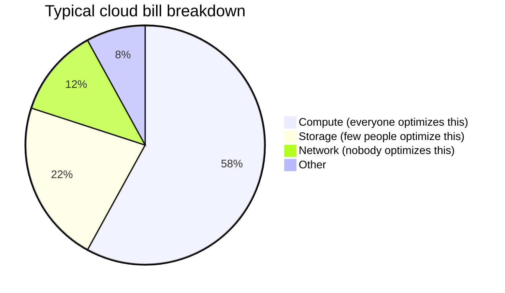
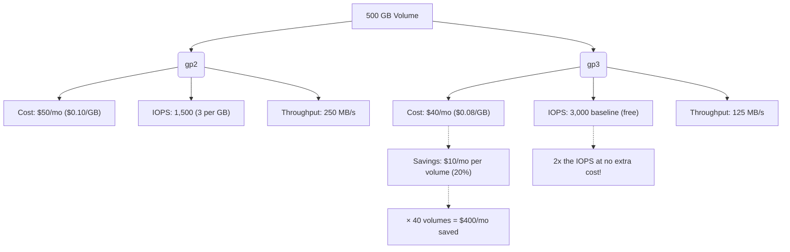
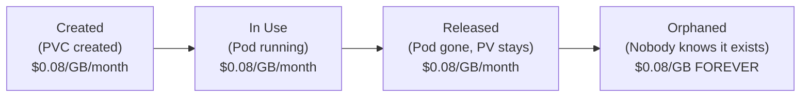
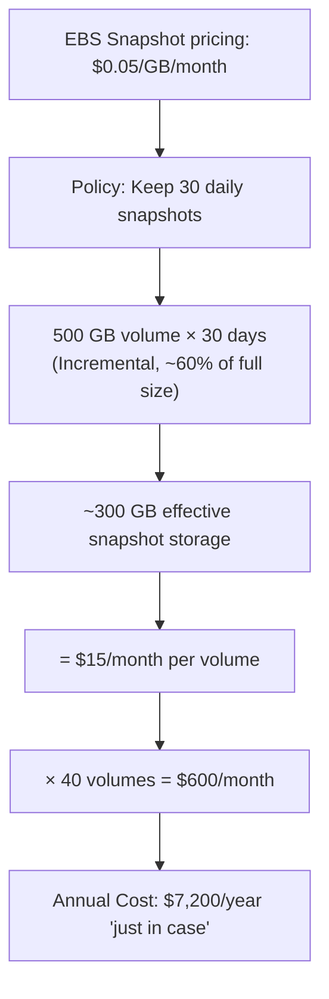
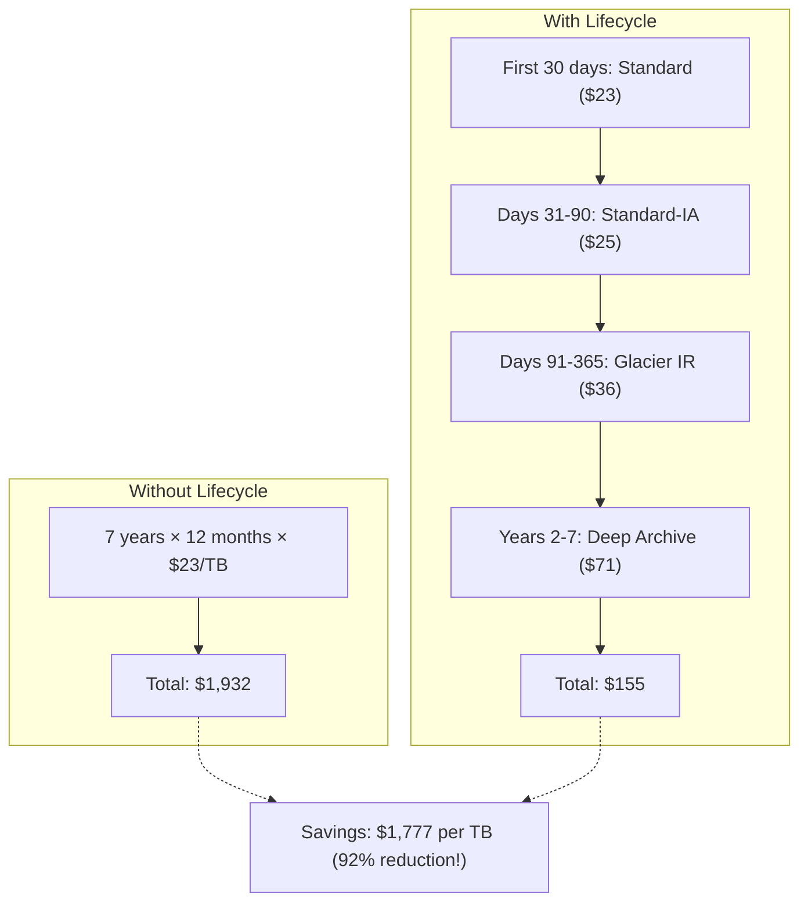
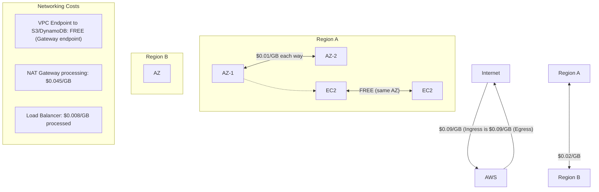
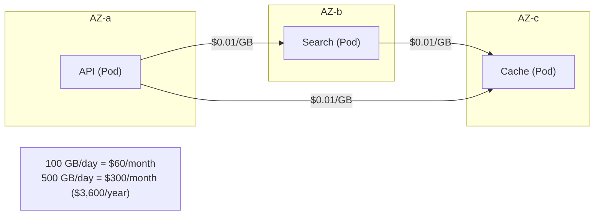
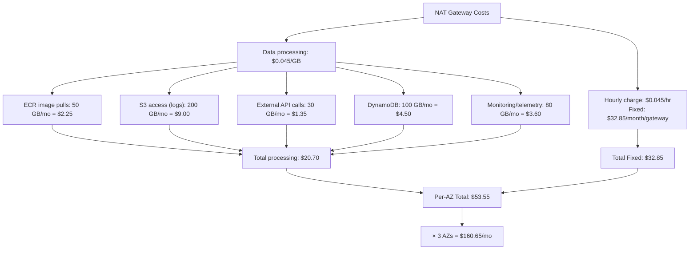
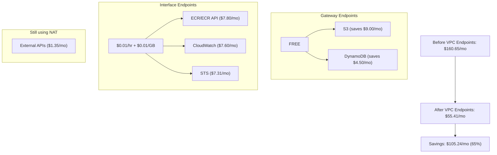

> **Discipline Module** | Complexity: `[MEDIUM]` | Time: 2h

## Prerequisites

Before starting this module:
- **Required**: [Module 1.1: FinOps Fundamentals](../module-1.1-finops-fundamentals/) — FinOps lifecycle, billing concepts
- **Required**: Understanding of Kubernetes Persistent Volumes and StorageClasses
- **Required**: Basic networking concepts (VPC, subnets, NAT, load balancers)
- **Recommended**: AWS or GCP experience (examples use AWS terminology)
- **Recommended**: Familiarity with cloud storage tiers (S3, EBS, EFS)

---

## What You'll Be Able to Do

After completing this module, you will be able to:

- **Implement storage cost optimization through lifecycle policies, tiering, and right-sized volume claims**
- **Design network cost reduction strategies that minimize cross-AZ traffic and egress charges**
- **Analyze storage and network spending to identify the largest cost drivers in your Kubernetes environment**
- **Build monitoring dashboards that track storage utilization and network transfer costs by namespace and service**

## Why This Module Matters

Everyone optimizes compute. It's the obvious line item — the big EC2 or GCE charges that dominate the bill. But lurking beneath are two cost categories that grow silently and are far harder to control: **storage** and **networking**.

Here's what makes them dangerous:

**Storage**: Resources that persist after workloads die. Delete a Deployment, and the PersistentVolume stays. Terminate a node, and the EBS volume remains. Take a snapshot "just in case," and it lives forever. Storage costs accumulate like sediment — slowly, quietly, and expensively.

**Networking**: The invisible tax on everything. Every cross-AZ call costs money. Every response to a user costs money. Every NAT Gateway byte costs money. And nobody budgets for it because nobody can predict it.



The 34% that's storage and network? That's where the hidden waste lives. This module shows you how to find it and fix it.

---

## Did You Know?

- **AWS data transfer costs can be the third-largest line item** on a cloud bill, after compute and storage. Cross-AZ data transfer alone costs $0.01/GB in each direction — which sounds cheap until you realize a busy microservice architecture can generate terabytes of cross-AZ traffic monthly. One company discovered their service mesh was costing $23,000/month just in cross-AZ data transfer.

- **Orphaned EBS volumes are one of the most common sources of cloud waste.** When a Kubernetes node is terminated or a PV is released with a `Retain` reclaim policy, the underlying EBS volume persists — and you keep paying for it. AWS estimates that 20-30% of EBS volumes in a typical account are unattached.

- **NAT Gateway pricing is often the biggest networking surprise.** At $0.045/GB for data processing plus $0.045/hour for the gateway itself, a NAT Gateway processing 5 TB/month costs over $250 — just for routing traffic. VPC Endpoints for AWS services (S3, DynamoDB, ECR) can eliminate most of this cost for free.

---

## Storage Cost Management

### EBS Volume Types and Costs

Understanding which storage type to use is the first optimization lever:

| Volume Type | IOPS | Throughput | Cost ($/GB/mo) | Best For |
|-------------|------|------------|-----------------|----------|
| gp3 (General Purpose SSD) | 3,000 baseline (free) | 125 MB/s baseline | $0.08 | Most workloads (default) |
| gp2 (Older GP SSD) | 3 IOPS/GB (min 100) | Tied to IOPS | $0.10 | Legacy — migrate to gp3 |
| io2 (Provisioned IOPS) | Up to 64,000 | Up to 1,000 MB/s | $0.125 + $0.065/IOPS | Databases needing guaranteed IOPS |
| st1 (Throughput HDD) | 500 | 500 MB/s | $0.045 | Big data, sequential reads |
| sc1 (Cold HDD) | 250 | 250 MB/s | $0.015 | Infrequent access, archives |

### Quick Win: gp2 to gp3 Migration

gp3 is almost always cheaper than gp2 — with better baseline performance:



### Kubernetes StorageClass for Cost Optimization

```yaml
# Cost-optimized gp3 StorageClass
apiVersion: storage.k8s.io/v1
kind: StorageClass
metadata:
  name: gp3-cost-optimized
provisioner: ebs.csi.aws.com
parameters:
  type: gp3
  fsType: ext4
  encrypted: "true"
reclaimPolicy: Delete      # Auto-cleanup when PVC deleted
allowVolumeExpansion: true  # Grow without recreating
volumeBindingMode: WaitForFirstConsumer  # Bind to same AZ as pod
---
# Cold storage for infrequent access (logs, archives)
apiVersion: storage.k8s.io/v1
kind: StorageClass
metadata:
  name: cold-storage
provisioner: ebs.csi.aws.com
parameters:
  type: sc1
  fsType: ext4
reclaimPolicy: Delete
volumeBindingMode: WaitForFirstConsumer
```

### Orphaned Volumes: The Silent Cost Drain

Orphaned volumes happen when:
1. A PVC is deleted but the PV has `reclaimPolicy: Retain`
2. A node is terminated but the EBS volume isn't cleaned up
3. A StatefulSet is deleted but its PVCs persist (by design)
4. Terraform creates volumes that aren't managed by Kubernetes

> **Stop and think**: If a developer deletes a namespace containing a StatefulSet, what happens to the underlying cloud volumes? By default, the PVCs might be deleted depending on garbage collection policies, but if the PV `reclaimPolicy` is `Retain`, the underlying EBS volumes will persist forever.



### Finding Orphaned PVs in Kubernetes

```bash
# Find PVs that are Released (no longer bound to a PVC)
# Note: PVs only support metadata.name and metadata.namespace field selectors,
# so we filter by phase using grep or jq instead
kubectl get pv | grep Released

# Find PVs that are Available (never claimed)
kubectl get pv | grep Available

# For structured output, use jq:
# kubectl get pv -o json | jq '.items[] | select(.status.phase=="Released") | .metadata.name'

# Detailed view with age
kubectl get pv -o custom-columns=\
NAME:.metadata.name,\
STATUS:.status.phase,\
CAPACITY:.spec.capacity.storage,\
RECLAIM:.spec.persistentVolumeReclaimPolicy,\
STORAGECLASS:.spec.storageClassName,\
AGE:.metadata.creationTimestamp
```

### Snapshot Management

Snapshots are another silent cost accumulator:



### Snapshot Lifecycle Policy

```json
{
  "Description": "Cost-optimized snapshot lifecycle",
  "Rules": [
    {
      "Name": "daily-snapshots-7-day-retention",
      "Schedule": "cron(0 2 * * *)",
      "Retain": 7,
      "CopyTags": true,
      "Tags": {
        "lifecycle": "managed",
        "retention": "7-days"
      }
    },
    {
      "Name": "weekly-snapshots-30-day-retention",
      "Schedule": "cron(0 3 * * 0)",
      "Retain": 4,
      "CopyTags": true,
      "Tags": {
        "lifecycle": "managed",
        "retention": "30-days"
      }
    }
  ]
}
```

---

## S3 Storage Tiering

For object storage, choosing the right tier can save 50-90%:

| Tier | Cost ($/GB/mo) | Retrieval Cost | Access Pattern |
|------|----------------|----------------|----------------|
| S3 Standard | $0.023 | Free | Frequent access |
| S3 Intelligent-Tiering | $0.023-$0.004 | Free | Unknown/changing patterns |
| S3 Standard-IA | $0.0125 | $0.01/GB | Monthly access |
| S3 One Zone-IA | $0.01 | $0.01/GB | Reproducible data, monthly |
| S3 Glacier Instant | $0.004 | $0.03/GB | Quarterly, instant retrieval |
| S3 Glacier Flexible | $0.0036 | Minutes to hours | Annual compliance |
| S3 Glacier Deep Archive | $0.00099 | 12-48 hours | Regulatory retention |

### Lifecycle Policy Example

```json
{
  "Rules": [
    {
      "ID": "logs-lifecycle",
      "Filter": { "Prefix": "logs/" },
      "Status": "Enabled",
      "Transitions": [
        {
          "Days": 30,
          "StorageClass": "STANDARD_IA"
        },
        {
          "Days": 90,
          "StorageClass": "GLACIER_IR"
        },
        {
          "Days": 365,
          "StorageClass": "DEEP_ARCHIVE"
        }
      ],
      "Expiration": {
        "Days": 2555
      }
    }
  ]
}
```



---

## Network Cost Management

### The Data Transfer Cost Map

Understanding where data transfer charges apply:



### Cross-AZ Traffic: The Kubernetes Hidden Tax

In Kubernetes, services communicate across AZs constantly. Every cross-AZ call costs $0.01/GB in each direction ($0.02/GB round-trip).



### Reducing Cross-AZ Traffic

**Strategy 1: Topology-Aware Service Routing**

```yaml
# Route traffic to same-AZ endpoints first
apiVersion: v1
kind: Service
metadata:
  name: search-api
  namespace: search
  annotations:
    service.kubernetes.io/topology-mode: Auto
spec:
  selector:
    app: search-api
  ports:
  - port: 80
    targetPort: 8080
```

With `topology-mode: Auto`, Kubernetes routes traffic to same-zone endpoints when possible, falling back to cross-zone only when needed.

**Strategy 2: Pod Topology Spread with Zone Awareness**

```yaml
apiVersion: apps/v1
kind: Deployment
metadata:
  name: search-api
spec:
  replicas: 6
  template:
    spec:
      topologySpreadConstraints:
      - maxSkew: 1
        topologyKey: topology.kubernetes.io/zone
        whenUnsatisfiable: DoNotSchedule
        labelSelector:
          matchLabels:
            app: search-api
```

This ensures pods are evenly distributed across AZs, so each AZ has local endpoints to talk to.

**Strategy 3: Zone-Affine Deployments**

For services that communicate heavily, co-locate them in the same AZ:

```yaml
# Co-locate API and its cache in the same AZ
apiVersion: apps/v1
kind: Deployment
metadata:
  name: api-server
spec:
  template:
    spec:
      affinity:
        podAffinity:
          preferredDuringSchedulingIgnoredDuringExecution:
          - weight: 100
            podAffinityTerm:
              labelSelector:
                matchLabels:
                  app: redis-cache
              topologyKey: topology.kubernetes.io/zone
```

### NAT Gateway vs VPC Endpoints

> **Pause and predict**: Which AWS service generates the most outbound traffic from an average Kubernetes cluster? (Hint: Think about how your pods start up). ECR image pulls and S3 backups are consistently the heaviest consumers of NAT Gateway bandwidth.

NAT Gateway is one of the most expensive networking components — and often unnecessary.



### VPC Endpoints Eliminate Most NAT Costs



### Essential VPC Endpoints for EKS

```hcl
# Terraform: Create VPC Endpoints for EKS cost optimization
resource "aws_vpc_endpoint" "s3" {
  vpc_id       = aws_vpc.main.id
  service_name = "com.amazonaws.${var.region}.s3"
  vpc_endpoint_type = "Gateway"
  route_table_ids   = aws_route_table.private[*].id
  # Gateway endpoints are FREE
}

resource "aws_vpc_endpoint" "ecr_api" {
  vpc_id              = aws_vpc.main.id
  service_name        = "com.amazonaws.${var.region}.ecr.api"
  vpc_endpoint_type   = "Interface"
  private_dns_enabled = true
  subnet_ids          = aws_subnet.private[*].id
  security_group_ids  = [aws_security_group.vpc_endpoints.id]
}

resource "aws_vpc_endpoint" "ecr_dkr" {
  vpc_id              = aws_vpc.main.id
  service_name        = "com.amazonaws.${var.region}.ecr.dkr"
  vpc_endpoint_type   = "Interface"
  private_dns_enabled = true
  subnet_ids          = aws_subnet.private[*].id
  security_group_ids  = [aws_security_group.vpc_endpoints.id]
}

resource "aws_vpc_endpoint" "logs" {
  vpc_id              = aws_vpc.main.id
  service_name        = "com.amazonaws.${var.region}.logs"
  vpc_endpoint_type   = "Interface"
  private_dns_enabled = true
  subnet_ids          = aws_subnet.private[*].id
  security_group_ids  = [aws_security_group.vpc_endpoints.id]
}
```

---

## Common Mistakes

| Mistake | Why It Happens | How to Fix It |
|---------|---------------|---------------|
| Using gp2 instead of gp3 | Default in many tools/templates | Change default StorageClass to gp3 |
| PVs with Retain policy and no cleanup | Safety-first mentality | Use Delete policy for non-critical data, automate cleanup for Retain |
| No snapshot lifecycle policy | "Snapshots are cheap" | Implement DLM policies: 7 daily, 4 weekly |
| All traffic through NAT Gateway | Simple architecture | Add Gateway endpoints (S3, DynamoDB) and Interface endpoints (ECR, CloudWatch) |
| Ignoring cross-AZ data transfer | Invisible on most dashboards | Enable topology-aware routing, monitor with VPC Flow Logs |
| Over-sized EBS volumes "just in case" | Can't shrink EBS | Start small with volume expansion enabled |
| S3 Standard for everything | Default tier | Implement lifecycle policies for logs and backups |
| No volume encryption | "We'll do it later" | Encrypt by default — gp3 encrypted costs the same |

---

## Quiz

### Question 1
Your platform team has been running 35 gp2 EBS volumes for various StatefulSets. Each volume averages 200 GB in size and requires around 1,500 IOPS during peak hours. Your finance department has mandated a 10% reduction in cloud storage spend. How much can you save annually by migrating these volumes to gp3, and will performance be impacted?

<details>
<summary>Show Answer</summary>

Migrating to gp3 will save your team $1,680 per year. Here is why: gp2 charges $0.10/GB/month, meaning 35 volumes at 200 GB costs $700/month. gp3 charges $0.08/GB/month, which reduces the cost to $560/month, yielding a $140 monthly savings. Furthermore, your performance will actually improve. gp2 provides 3 IOPS per GB, so a 200 GB volume only guarantees 600 IOPS (though it bursts). gp3 provides a guaranteed 3,000 IOPS baseline for free, comfortably exceeding your 1,500 IOPS peak requirement without any extra provisioning costs. This represents a rare "win-win" in FinOps where you simultaneously cut costs and increase performance reliability.
</details>

### Question 2
An EKS cluster you manage has seen a massive spike in NAT Gateway data processing costs, reaching 8 TB this past month. Upon investigating VPC Flow Logs, you discover that 5 TB of this traffic is backups heading to S3, and 2 TB consists of container image pulls from ECR. Your manager wants to know how much money you can save by implementing VPC Endpoints without changing the application code.

<details>
<summary>Show Answer</summary>

You can save approximately $3,360 per year ($280/month) by implementing VPC Endpoints. Here is why: Traffic routed through a NAT Gateway incurs a $0.045/GB processing fee. By adding an S3 Gateway Endpoint, you route the 5 TB of S3 backup traffic entirely within the AWS network for free, immediately saving $225/month. For the 2 TB of ECR traffic, you can deploy Interface Endpoints (AWS PrivateLink), which cost $0.01/hour per AZ plus $0.01/GB processed. This reduces the ECR data processing cost from $90/month (via NAT) to roughly $34.60/month, yielding an additional $55.40 in savings. The application code requires no changes because Gateway Endpoints automatically update route tables, and Interface Endpoints provide private DNS resolution that seamlessly intercepts the traffic.
</details>

### Question 3
Your distributed microservices architecture spans three Availability Zones (AZs) for high availability. However, your monthly AWS bill shows a significant and growing line item for "Data Transfer - Inter-AZ". The development team claims they only communicate internally. Why is this happening, and what specific Kubernetes configurations can you implement to mitigate this cost?

<details>
<summary>Show Answer</summary>

This happens because kube-proxy's default behavior is to load-balance service requests randomly across all available backend pods, regardless of their Availability Zone. Since AWS charges $0.01/GB for cross-AZ data transfer in each direction ($0.02/GB round-trip), an API pod in AZ-a calling a service will statistically send about 66% of its traffic across AZ boundaries. To mitigate this, you should implement topology-aware routing by adding the `service.kubernetes.io/topology-mode: Auto` annotation to your Services, which instructs kube-proxy to prefer endpoints in the same AZ. Additionally, you should configure Pod Topology Spread Constraints to ensure your deployments are evenly distributed across AZs, guaranteeing that local endpoints are always available to handle the routing requests.
</details>

### Question 4
A development team running a 500 GB PostgreSQL database on Kubernetes has configured an automated cron job to take a daily EBS snapshot for disaster recovery. They have been running this for 50 days without an expiration policy, resulting in 50 snapshots. They are surprised to see a massive spike in snapshot costs. What is their current monthly cost, and how can they adjust their retention policy to balance safety with budget?

<details>
<summary>Show Answer</summary>

Their current monthly snapshot cost is approximately $760/month, but this can be drastically reduced by implementing a tiered retention policy. Here is why the cost is so high: AWS charges $0.05/GB/month for EBS snapshots. While the first snapshot is a full 500 GB, subsequent daily snapshots are incremental and typically average around 60% of the volume size (300 GB) for active databases. This means they are storing over 15,200 GB of snapshot data. To optimize this, they should implement a Data Lifecycle Manager (DLM) policy that keeps only 7 daily snapshots, 4 weekly snapshots, and perhaps 3 monthly snapshots. This provides robust point-in-time recovery for the critical recent window while reducing their total retained snapshots from 50 to 14, effectively lowering their monthly cost to around $210/month.
</details>

### Question 5
You are tasked with redesigning the network architecture for a high-traffic Kubernetes cluster to minimize NAT Gateway expenses. You have the option to use VPC Gateway Endpoints and VPC Interface Endpoints to route traffic to various AWS services. How should you decide which type of endpoint to use for services like S3, DynamoDB, and ECR?

<details>
<summary>Show Answer</summary>

You should always use Gateway Endpoints for S3 and DynamoDB, while reserving Interface Endpoints for high-traffic services like ECR when the data transfer savings outweigh the hourly endpoint cost. Here is why: Gateway Endpoints are entirely free and operate at the network layer by adding a target route to your VPC route tables, making them the most cost-effective solution for S3 and DynamoDB traffic. Interface Endpoints, powered by AWS PrivateLink, create an Elastic Network Interface (ENI) within your subnets and support over 100 AWS services (including ECR and CloudWatch). However, Interface Endpoints charge an hourly fee per AZ (around $0.01/hr) plus a $0.01/GB processing fee. Therefore, Interface Endpoints only make financial sense when the service generates enough traffic that paying the $0.01/GB rate is significantly cheaper than the $0.045/GB NAT Gateway fee.
</details>

---

## Hands-On Exercise: Find Unattached PVs and Old Snapshots

Write scripts to identify storage waste in your Kubernetes cluster.

### Step 1: Setup

```bash
# Create a kind cluster
kind create cluster --name storage-lab

# Create namespace
kubectl create namespace storage-lab
```

### Step 2: Create Storage Resources (Simulated Waste)

```bash
# Create PVs and PVCs to simulate various states
kubectl apply -f - << 'EOF'
# PV with Retain policy (will become orphaned)
apiVersion: v1
kind: PersistentVolume
metadata:
  name: orphaned-pv-001
  labels:
    type: database-backup
spec:
  capacity:
    storage: 100Gi
  accessModes:
    - ReadWriteOnce
  persistentVolumeReclaimPolicy: Retain
  storageClassName: manual
  hostPath:
    path: /tmp/pv-001
---
apiVersion: v1
kind: PersistentVolume
metadata:
  name: orphaned-pv-002
  labels:
    type: log-archive
spec:
  capacity:
    storage: 250Gi
  accessModes:
    - ReadWriteOnce
  persistentVolumeReclaimPolicy: Retain
  storageClassName: manual
  hostPath:
    path: /tmp/pv-002
---
apiVersion: v1
kind: PersistentVolume
metadata:
  name: orphaned-pv-003
  labels:
    type: ml-model-store
spec:
  capacity:
    storage: 500Gi
  accessModes:
    - ReadWriteOnce
  persistentVolumeReclaimPolicy: Retain
  storageClassName: manual
  hostPath:
    path: /tmp/pv-003
---
# Active PV with PVC (this one is in use)
apiVersion: v1
kind: PersistentVolume
metadata:
  name: active-pv-001
spec:
  capacity:
    storage: 50Gi
  accessModes:
    - ReadWriteOnce
  persistentVolumeReclaimPolicy: Delete
  storageClassName: manual
  hostPath:
    path: /tmp/pv-active
---
apiVersion: v1
kind: PersistentVolumeClaim
metadata:
  name: active-pvc
  namespace: storage-lab
spec:
  accessModes:
    - ReadWriteOnce
  storageClassName: manual
  resources:
    requests:
      storage: 50Gi
EOF

echo "Storage resources created."
```

### Step 3: Write the Waste Detection Script

```bash
cat > /tmp/storage_audit.sh << 'SCRIPT'
#!/bin/bash
echo "============================================"
echo "  Storage Waste Audit Report"
echo "  Date: $(date +%Y-%m-%d)"
echo "============================================"
echo ""

# Section 1: Unbound PVs (Available or Released)
echo "--- Unbound Persistent Volumes ---"
echo ""
UNBOUND=$(kubectl get pv -o json 2>/dev/null | python3 -c "
import json, sys
data = json.load(sys.stdin)
items = [pv for pv in data.get('items', []) if pv['status']['phase'] != 'Bound']
json.dump({'items': items}, sys.stdout)
" 2>/dev/null)
UNBOUND_COUNT=$(echo "$UNBOUND" | python3 -c "
import json, sys
data = json.load(sys.stdin)
pvs = data.get('items', [])
print(len(pvs))
" 2>/dev/null)

if [ "$UNBOUND_COUNT" -gt 0 ]; then
  echo "Found $UNBOUND_COUNT unbound PV(s):"
  echo ""
  echo "$UNBOUND" | python3 -c "
import json, sys
data = json.load(sys.stdin)
total_gb = 0
for pv in data.get('items', []):
    name = pv['metadata']['name']
    phase = pv['status']['phase']
    cap = pv['spec']['capacity']['storage']
    reclaim = pv['spec']['persistentVolumeReclaimPolicy']
    created = pv['metadata']['creationTimestamp']
    pv_type = pv['metadata'].get('labels', {}).get('type', 'unknown')

    # Parse capacity
    gb = 0
    if 'Gi' in cap:
        gb = int(cap.replace('Gi', ''))
    elif 'Ti' in cap:
        gb = int(cap.replace('Ti', '')) * 1024

    total_gb += gb
    cost_mo = gb * 0.08  # gp3 pricing

    print(f'  {name}')
    print(f'    Status: {phase} | Size: {cap} | Reclaim: {reclaim}')
    print(f'    Type: {pv_type} | Created: {created}')
    print(f'    Estimated cost: \${cost_mo:.2f}/month')
    print()

total_cost = total_gb * 0.08
print(f'  TOTAL UNBOUND: {total_gb} Gi = \${total_cost:.2f}/month (\${total_cost * 12:.2f}/year)')
"
else
  echo "  No unbound PVs found."
fi

echo ""

# Section 2: PVCs without active Pods
echo "--- PVCs Not Mounted by Any Pod ---"
echo ""

# Get all PVC names that are currently mounted
MOUNTED_PVCS=$(kubectl get pods -A -o json 2>/dev/null | python3 -c "
import json, sys
data = json.load(sys.stdin)
mounted = set()
for pod in data.get('items', []):
    ns = pod['metadata']['namespace']
    for vol in pod['spec'].get('volumes', []):
        pvc = vol.get('persistentVolumeClaim', {}).get('claimName')
        if pvc:
            mounted.add(f'{ns}/{pvc}')
for m in sorted(mounted):
    print(m)
" 2>/dev/null)

# Get all PVCs and check if they're mounted
kubectl get pvc -A -o json 2>/dev/null | python3 -c "
import json, sys

mounted = set(line.strip() for line in '''$MOUNTED_PVCS'''.strip().split('\n') if line.strip())

data = json.load(sys.stdin)
unmounted = []
for pvc in data.get('items', []):
    ns = pvc['metadata']['namespace']
    name = pvc['metadata']['name']
    key = f'{ns}/{name}'
    if key not in mounted:
        cap = pvc['status'].get('capacity', {}).get('storage', 'unknown')
        unmounted.append((ns, name, cap))

if unmounted:
    for ns, name, cap in unmounted:
        print(f'  {ns}/{name} ({cap}) — not mounted by any pod')
    print(f'\n  Total unmounted PVCs: {len(unmounted)}')
else:
    print('  All PVCs are actively mounted.')
"

echo ""

# Section 3: Storage class analysis
echo "--- StorageClass Summary ---"
echo ""
kubectl get sc -o custom-columns=\
NAME:.metadata.name,\
PROVISIONER:.provisioner,\
RECLAIM:.reclaimPolicy,\
BINDING:.volumeBindingMode 2>/dev/null

echo ""

# Section 4: Recommendations
echo "--- Recommendations ---"
echo ""
echo "  1. Review all Released/Available PVs — delete if data is no longer needed"
echo "  2. Change default StorageClass to gp3 if currently using gp2"
echo "  3. Set reclaim policy to Delete for non-critical PVs"
echo "  4. Implement snapshot lifecycle policies (7 daily, 4 weekly)"
echo "  5. Use volume expansion instead of creating oversized volumes"
echo ""
echo "============================================"
SCRIPT

chmod +x /tmp/storage_audit.sh
bash /tmp/storage_audit.sh
```

### Step 4: AWS-Specific Audit (Reference)

For real AWS environments, extend the audit to EBS and snapshots:

```bash
# Find unattached EBS volumes (AWS CLI)
cat > /tmp/aws_storage_audit.sh << 'AWSSCRIPT'
#!/bin/bash
# NOTE: This requires AWS CLI configured with appropriate permissions

echo "--- Unattached EBS Volumes ---"
aws ec2 describe-volumes \
  --filters Name=status,Values=available \
  --query 'Volumes[].{ID:VolumeId,Size:Size,Type:VolumeType,Created:CreateTime,AZ:AvailabilityZone}' \
  --output table 2>/dev/null || echo "  (AWS CLI not configured — skipping)"

echo ""
echo "--- Old EBS Snapshots (>90 days) ---"
NINETY_DAYS_AGO=$(date -v-90d +%Y-%m-%dT00:00:00 2>/dev/null || date -d "90 days ago" +%Y-%m-%dT00:00:00 2>/dev/null)
aws ec2 describe-snapshots \
  --owner-ids self \
  --query "Snapshots[?StartTime<='${NINETY_DAYS_AGO}'].{ID:SnapshotId,Size:VolumeSize,Started:StartTime,Description:Description}" \
  --output table 2>/dev/null || echo "  (AWS CLI not configured — skipping)"

echo ""
echo "--- EBS Volume Type Distribution ---"
aws ec2 describe-volumes \
  --query 'Volumes[].VolumeType' \
  --output text 2>/dev/null | tr '\t' '\n' | sort | uniq -c | sort -rn || \
  echo "  (AWS CLI not configured — skipping)"
AWSSCRIPT

chmod +x /tmp/aws_storage_audit.sh
echo "AWS audit script created at /tmp/aws_storage_audit.sh"
echo "(Run manually if you have AWS CLI configured)"
```

### Step 5: Cleanup

```bash
kind delete cluster --name storage-lab
```

### Success Criteria

You've completed this exercise when you:
- [ ] Created PVs simulating both active and orphaned states
- [ ] Ran the storage audit script and identified 3 orphaned PVs
- [ ] Calculated the monthly cost of orphaned storage ($68/month for 850Gi at gp3 rates)
- [ ] Reviewed the AWS audit script for finding unattached EBS volumes and old snapshots
- [ ] Listed at least 3 storage optimization recommendations for your environment

---

## Key Takeaways

1. **Storage costs accumulate silently** — orphaned PVs, unmanaged snapshots, and wrong volume types add up fast
2. **gp2 to gp3 is a no-brainer** — 20% cheaper with 2x baseline IOPS, zero downside
3. **Cross-AZ data transfer is the hidden Kubernetes tax** — use topology-aware routing to keep traffic local
4. **NAT Gateways are expensive** — VPC Gateway Endpoints for S3/DynamoDB are free and save hundreds monthly
5. **S3 lifecycle policies save 80-90%** — move logs and backups through storage tiers automatically

---

## Further Reading

**Articles**:
- **"Understanding AWS Data Transfer Costs"** — aws.amazon.com/blogs/architecture
- **"EBS Volume Types Explained"** — docs.aws.amazon.com/ebs/latest/userguide
- **"Kubernetes Storage Best Practices"** — cloud.google.com/architecture

**Tools**:
- **AWS Cost Explorer** — Filter by service/usage type to find storage and network waste
- **S3 Storage Lens** — Dashboard for S3 usage patterns and optimization recommendations
- **VPC Flow Logs** — Analyze network traffic patterns for cross-AZ cost optimization

**Talks**:
- **"Taming Data Transfer Costs"** — AWS re:Invent (YouTube)
- **"Storage Cost Optimization in Kubernetes"** — KubeCon (YouTube)

---

## Summary

Storage and network costs are the silent budget killers in cloud. While compute gets all the optimization attention, storage grows through orphaned volumes, unmanaged snapshots, and wrong tier choices. Network costs compound through cross-AZ traffic, NAT Gateways, and data egress. The fixes are often straightforward — migrate to gp3, add VPC endpoints, enable topology-aware routing, implement lifecycle policies — but they require awareness first. Regular storage audits and network flow analysis should be part of every FinOps practice.

---

## Next Module

Continue to [Module 1.6: FinOps Culture & Automation](../module-1.6-finops-culture/) to learn how to build organizational habits, automate cost governance, and embed FinOps into your CI/CD pipeline.

---

*"Data has mass. And mass has cost."* — Cloud networking truth