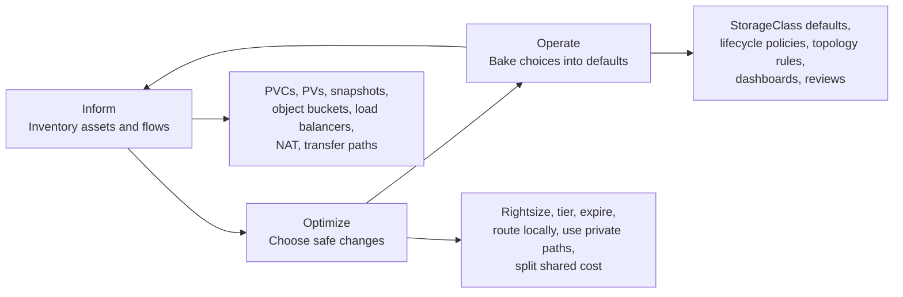
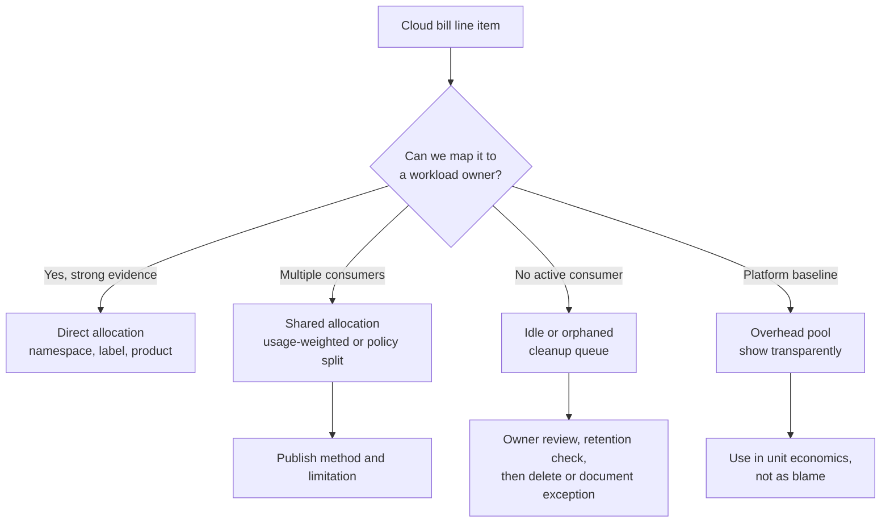
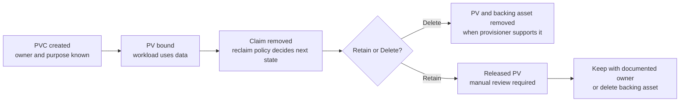
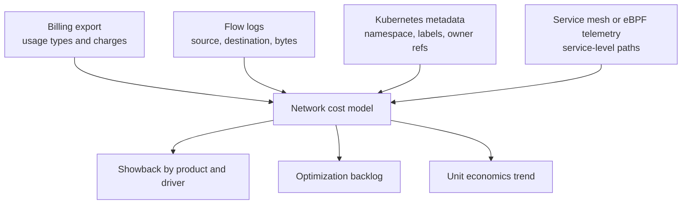
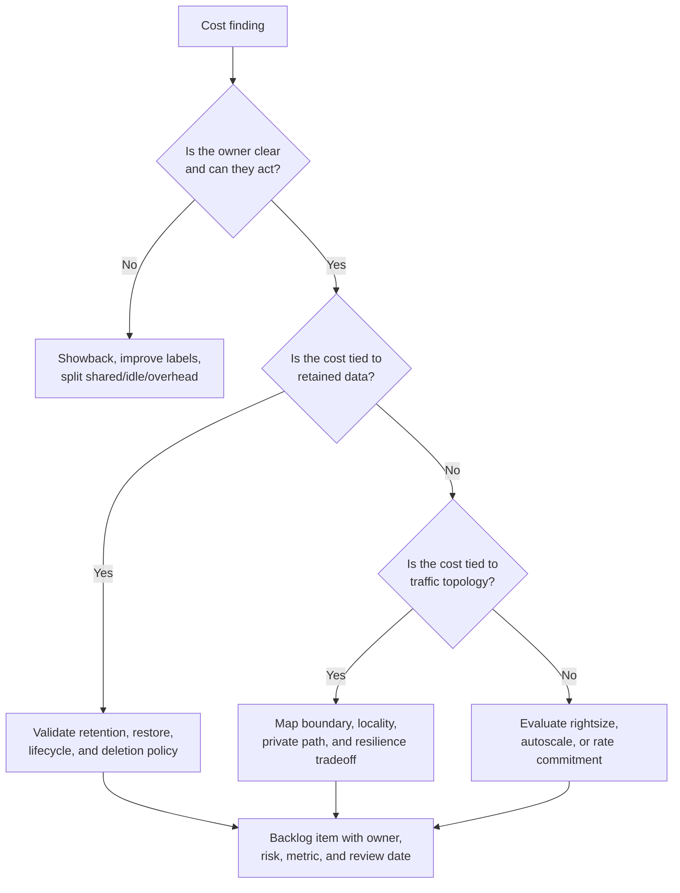

> **Discipline Module** | Complexity: `[MEDIUM]` | Time: 2h
>
> **Prerequisites**: [Module 1.1: FinOps Fundamentals](../module-1.1-finops-fundamentals/), Kubernetes Persistent Volumes and StorageClasses, basic VPC networking, and the idea that cloud bills are usage records rather than a single invoice line.

## What You'll Be Able to Do

After completing this module, you will be able to:

- **Audit** storage and network cost drivers across PersistentVolumes, object storage, snapshots, load balancers, NAT, and data transfer paths.
- **Design** allocation models that attribute shared storage and network costs to namespaces, services, teams, products, or business units without pretending the model is perfect.
- **Apply** lifecycle, tiering, topology, and right-sizing methods that reduce waste while preserving recovery, durability, latency, and availability requirements.
- **Evaluate** the tradeoffs between volume size, provisioned performance, retention, retrieval cost, cross-zone traffic, private endpoints, and internet egress before changing architecture.
- **Build** a repeatable FinOps operating loop that turns storage and network findings into backlog items, review rituals, and measurable unit economics.

## Why This Module Matters

Compute cost is visible because nodes have names, pods have requests, and autoscalers produce events that engineers already watch. Storage and network cost are quieter. A PersistentVolume can outlive the StatefulSet that once needed it, a snapshot can outlive the incident that justified it, and a service-to-service call can cross an availability-zone boundary thousands of times before anyone notices the billing dimension. These costs are not mysterious, but they are under-attributed because they are attached to flows and retained assets rather than to the deployment object that started the work.

The practical danger is that storage and network decisions often sit outside the normal platform feedback loop. A team might tune CPU requests every sprint while leaving volume claims sized for a worst-case future that never arrived. Another team might deploy services across three zones for resilience, then accidentally send chatty internal traffic across those zones because the service routing model is unaware of cost. A third team might archive every log file into a cheap-looking object-storage tier, only to discover during an investigation that retrieval, restore time, and request charges matter as much as the storage rate.

FinOps treats these problems as engineering design questions, not as finance complaints. The goal is not to minimize every byte, shrink every disk, or route all traffic through the cheapest path. The goal is to make the cost model visible enough that product, engineering, finance, and operations can choose the right tradeoff. Sometimes the right answer is to pay for cross-zone traffic because the workload needs resilience. Sometimes it is to keep a manual-retain volume because recovery is more important than automation. FinOps asks you to make those decisions intentionally, document the reason, and revisit the decision when usage changes.

> **The Warehouse and Highway Analogy**
>
> Storage is a warehouse lease, and network is the toll road between warehouses, factories, and customers. A platform team can make the warehouse look cheap by moving boxes into distant cold storage, but that only works if nobody needs those boxes quickly. The team can also make the highway look invisible by focusing on the trucks rather than the tolls, but every unnecessary detour still becomes part of the delivered cost of the product.

The Kubernetes twist is that the platform deliberately abstracts the underlying warehouse and highway. A PVC asks for capacity, not a finance category. A Service asks for stable discovery, not a cross-zone cost boundary. A load balancer exposes an endpoint, not a chargeback plan. Those abstractions are useful, but they create a translation job. Platform FinOps is the discipline of mapping Kubernetes intent back to cloud billing primitives without making engineers read raw billing exports for every decision.

## Part 1: Storage And Network In The FinOps Lifecycle

Storage and network optimization should follow the same durable lifecycle you learned in the earlier FinOps modules: Inform, Optimize, and Operate. In the Inform phase, the platform creates trustworthy visibility into which workloads hold storage, which flows move data, which shared services create overhead, and which labels or namespaces can carry allocation. In the Optimize phase, teams choose actions such as deleting orphaned volumes, adjusting claims, changing lifecycle rules, colocating chatty services, or replacing public paths with private endpoints. In the Operate phase, those choices become defaults, guardrails, backlog rituals, review dashboards, and exception processes.

The important lesson is that storage and network cost management is not a one-time cleanup campaign. A cleanup can remove waste, but the waste returns unless the operating model changes. If every new StatefulSet still starts with an oversized volume claim, every temporary snapshot still lacks an expiration owner, and every service still communicates through a topology-blind route, the same bill shape will reappear. A mature FinOps practice turns the cleanup findings into platform defaults, CI checks, review prompts, and team-level scorecards.

The FinOps Foundation framework is useful here because it separates activities from personas. Finance needs forecastable categories and allocation rules. Engineering needs controls that are safe to apply and easy to understand. Product needs unit economics that connect infrastructure spend to customer value. Platform teams bridge those needs by translating cloud line items into workload-level evidence. Storage and network are especially good tests of this bridge because raw bills describe services and transfer types, while engineers reason about databases, caches, APIs, logs, backups, and user-facing paths.

The first allocation decision is the grain of accountability. Namespace-level showback is easy to explain and often good enough for early visibility, but it hides shared storage, shared ingress, centralized telemetry, and cross-namespace dependencies. Label-based allocation gives more business meaning when labels such as `team`, `product`, `environment`, and `cost-center` are reliable. Chargeback requires even more care because teams will optimize toward the rule they are charged against. A weak rule can create perverse behavior, such as deleting useful telemetry, avoiding shared services that reduce total cost, or moving traffic patterns out of sight.

Showback and chargeback are not moral categories. Showback teaches teams what they consume and creates conversation without direct financial transfer. Chargeback moves cost into budgets and creates stronger incentives, but it also raises the fairness bar. For storage and network, most organizations should begin with showback, validate that allocation rules are stable, explicitly split shared and idle cost, then move selected categories into chargeback only when teams can influence the cost driver. Charging a product team for a central NAT gateway they cannot change is not accountability; it is accounting theater.

Unit economics bring the discussion closer to business value. A platform might track cost per customer, cost per request, cost per GiB retained, cost per report generated, or cost per training run. Storage and network matter because they often scale with customer behavior even when compute stays steady. A product that serves more media, stores more audit history, or moves more data between regions can become more expensive per customer without adding many pods. Good unit economics expose that pattern early enough for product and architecture teams to make deliberate decisions.


```mermaid
flowchart LR
    A["Inform<br/>Inventory assets and flows"] --> B["Optimize<br/>Choose safe changes"]
    B --> C["Operate<br/>Bake choices into defaults"]
    C --> A

    A --> A1["PVCs, PVs, snapshots,<br/>object buckets, load balancers,<br/>NAT, transfer paths"]
    B --> B1["Rightsize, tier, expire,<br/>route locally, use private paths,<br/>split shared cost"]
    C --> C1["StorageClass defaults,<br/>lifecycle policies, topology rules,<br/>dashboards, reviews"]
```

## Part 2: Allocation For The Under-Attributed Half Of The Bill

Storage and network become under-attributed because the cost owner is rarely the same object that created the technical dependency. A PersistentVolume may be linked to a PVC, but the cloud disk may be visible in a cloud billing export under a volume identifier rather than a Kubernetes namespace. A snapshot may be created by a backup controller, yet its value belongs to the application whose recovery point it protects. A NAT gateway may sit in a networking account and serve every private subnet, while the actual bytes come from image pulls, package downloads, telemetry export, backups, and application calls.

The durable allocation method is to separate direct, shared, idle, and overhead cost before assigning numbers to teams. Direct cost has a clear owner, such as a namespace-specific volume or a bucket prefix dedicated to one product. Shared cost supports multiple tenants, such as a central ingress controller, telemetry pipeline, backup bucket, or NAT gateway. Idle cost is paid capacity that does not currently serve work, such as released PVs, unattached disks, empty but retained volumes, or provisioned performance that usage never approaches. Overhead cost is the platform cost required to provide the service at all, such as control-plane fees, base networking components, or shared operational storage.

A common mistake is to force every shared byte into a single owner because the spreadsheet needs a row. That creates false precision and weak trust. It is better to publish a simple rule and its limitations. For example, a shared log bucket might be allocated by bytes ingested per namespace, while the bucket's fixed overhead is split by active namespace count. A NAT gateway might be allocated by flow-log bytes when the data exists, then moved to a platform overhead pool when the flow evidence is incomplete. The allocation model should be honest about what it knows, what it estimates, and what remains intentionally unallocated.

Labels are the contract between Kubernetes intent and FinOps reporting. Namespace labels can identify team and environment, deployment labels can identify service and product, and cloud tags can carry the same values to provider billing systems. The hard part is not adding labels once. The hard part is keeping labels valid when teams rename services, split products, move namespaces, run temporary jobs, or create resources through multiple tools. A useful FinOps platform treats missing or invalid labels as an operational signal, not as a finance cleanup ticket.

Showback dashboards should explain the driver before showing the number. A team seeing "network cost increased" needs to know whether the increase came from internet egress, cross-zone traffic, NAT processing, load balancer processing, cross-region replication, or object-store retrieval. A team seeing "storage cost increased" needs to know whether the increase came from larger claims, more retained snapshots, colder-tier retrieval, higher provisioned IOPS, or orphaned assets. Cost without driver context produces arguments. Cost with driver context produces engineering choices.

Chargeback should be reserved for categories where teams can act safely. Direct namespace volumes are usually chargeback candidates once labels are reliable. Orphaned resources can be charged to the owning team after a grace period if ownership is clear. Shared network egress is usually better handled through showback first because architecture, platform defaults, and provider-specific networking constraints strongly influence the bill. The decision is not "finance versus engineering"; it is whether the cost signal points to the person who can change the system without breaking it.


```mermaid
flowchart TD
    A["Cloud bill line item"] --> B{"Can we map it to<br/>a workload owner?"}
    B -- "Yes, strong evidence" --> C["Direct allocation<br/>namespace, label, product"]
    B -- "Multiple consumers" --> D["Shared allocation<br/>usage-weighted or policy split"]
    B -- "No active consumer" --> E["Idle or orphaned<br/>cleanup queue"]
    B -- "Platform baseline" --> F["Overhead pool<br/>show transparently"]
    D --> G["Publish method and limitation"]
    E --> H["Owner review, retention check,<br/>then delete or document exception"]
    F --> I["Use in unit economics,<br/>not as blame"]
```

## Part 3: Kubernetes Storage Cost Model

Kubernetes storage cost begins with a request, but the bill is paid on the provider asset. A PVC asks for capacity and access mode, a StorageClass translates the request into a storage backend, and a CSI driver provisions or attaches the underlying disk, file share, or volume. The platform bill is shaped by the provisioned size, selected storage class, retained lifecycle, provisioned performance, replication model, snapshots, and the operational pattern of the workload. A small YAML field can therefore become a long-lived financial commitment.

The request-versus-usage gap is the storage version of idle compute. If a team asks for a large volume because it might need room later, the provider usually bills the provisioned capacity immediately. Kubernetes volume expansion can make "start smaller and grow" practical for many workloads, but volume shrinking is not generally the same simple operation. That asymmetry changes behavior. Teams often over-request because expansion planning feels risky, while platform teams need to make expansion safe enough that oversized initial claims stop looking like the only responsible choice.

Provisioned performance adds another dimension. Some storage types bind performance to size, which encourages teams to over-provision capacity just to get throughput or IOPS. Newer generations or different classes may decouple capacity from performance, allowing the platform to buy the performance it needs without carrying unnecessary GiB. The durable principle is not that one provider's volume family is always the answer. The durable principle is that storage class economics change over time, and platform defaults must be revisited when a newer generation changes the capacity-performance-price triangle.

Reclaim policy is a safety and cost decision, not just a Kubernetes cleanup flag. A `Delete` policy removes the Kubernetes PV and, for supported dynamic provisioners, the backing storage asset when the claim is removed. A `Retain` policy keeps the underlying asset for manual recovery. Retain is valuable for important data and dangerous for temporary environments because it creates assets that stop appearing in ordinary workload views while continuing to exist in cloud inventory. The right policy depends on the data's recovery requirement, not on a universal preference for either deletion or retention.

`WaitForFirstConsumer` is another cost-relevant storage setting because topology-constrained volumes must land where pods can actually run. Immediate provisioning can create a volume before the scheduler has selected a node, which is risky when zones matter. Delayed binding lets Kubernetes consider scheduling constraints before provisioning or binding the volume. The cost impact is indirect but real: fewer unschedulable pods, fewer abandoned attempts, and fewer volumes stranded in the wrong place because the storage asset was created before workload placement was known.

StorageClass defaults deserve a regular FinOps review. A platform should ask whether the default class matches the common workload, whether encryption and expansion settings match policy, whether the reclaim policy is safe for the environment, whether the class is zone-aware, and whether older classes remain only for compatibility. A default created during the first cluster build can silently shape every team's cost for years. Treat it like an API contract that needs release notes, migration guidance, and an exception path.

```yaml
# Example StorageClass for general stateful workloads.
# Validate parameters against your CSI driver and cloud provider before use.
apiVersion: storage.k8s.io/v1
kind: StorageClass
metadata:
  name: general-purpose-expandable
provisioner: ebs.csi.aws.com
parameters:
  type: gp3
  fsType: ext4
  encrypted: "true"
reclaimPolicy: Delete
allowVolumeExpansion: true
volumeBindingMode: WaitForFirstConsumer
---
# Example StorageClass for retained data where manual recovery is required.
# Retain should come with an owner review and cleanup process.
apiVersion: storage.k8s.io/v1
kind: StorageClass
metadata:
  name: retained-recovery-data
provisioner: ebs.csi.aws.com
parameters:
  type: gp3
  fsType: ext4
  encrypted: "true"
reclaimPolicy: Retain
allowVolumeExpansion: true
volumeBindingMode: WaitForFirstConsumer
```

The StorageClass example preserves the useful shape from the original module while changing the lesson. The point is not that every cluster should use these exact names or an AWS CSI driver. The point is that a platform default should encode the financial and operational posture: choose a current general-purpose class, allow controlled growth, bind with scheduling context, encrypt by default, and reserve manual retention for data that has a documented recovery reason. A different cloud or CSI driver will use different parameters, but the review questions stay the same.

## Part 4: Orphaned Volumes, Unattached Disks, And Stale Snapshots

Orphaned storage is waste with a memory. It usually began as a legitimate safety measure: keep the database volume when deleting a test StatefulSet, preserve a disk during a node migration, retain snapshots before a risky release, or hold a backup until the new restore process is proven. The cost problem appears when the safety decision has no expiration, owner, or review path. The data may still be valuable, but nobody can explain why it is retained, what recovery point it protects, or when it can be deleted.

Kubernetes exposes several early signals. PVs in `Released` state deserve review because their claims are gone while the PV object remains. PVs in `Available` state deserve review because they are not bound to a claim. PVCs that are bound but not mounted by any running pod may be valid, especially for paused workloads, but they should not be invisible. Cloud inventory adds another layer by showing unattached disks, snapshots without recent restore tests, disks not tagged with a Kubernetes owner, and volumes whose size or performance class no longer matches observed usage.

Snapshot cost is subtle because snapshots feel smaller and safer than full copies. Incremental storage helps, but retention count, change rate, and restore requirements still matter. A busy database with frequent writes can accumulate much more snapshot data than a mostly static volume, and a long retention window can outlive the business need. FinOps does not say "take fewer backups" as a blanket rule. It asks teams to connect snapshot frequency and retention to recovery point objective, recovery time objective, legal retention, and tested restore practice.

The most reliable snapshot policy is tiered by recovery value. Recent restore points are usually more valuable because most operational mistakes are discovered quickly. Weekly or monthly restore points may be useful for longer investigations or compliance, but they should have a documented reason. If a team cannot state why a snapshot is retained, what system it restores, and who approves deletion, the snapshot belongs in a review queue. That queue should include engineering and data owners because deletion is a data-loss decision, not a finance-only action.

Hypothetical scenario: A team creates a temporary analytics namespace for a migration rehearsal and requests three retained volumes: 100 Gi, 250 Gi, and 500 Gi. The rehearsal ends, the namespace is deleted, and the PVs move to a released state because the reclaim policy was intentionally conservative. In a healthy FinOps loop, the next storage audit flags those released PVs, the owner confirms the rehearsal data is no longer needed, and the volumes are deleted after a short review window. In an unhealthy loop, the volumes remain because everyone assumes someone else owns the cleanup.


```mermaid
graph LR
    A["PVC created<br/>owner and purpose known"] --> B["PV bound<br/>workload uses data"]
    B --> C["Claim removed<br/>reclaim policy decides next state"]
    C --> D{"Retain or Delete?"}
    D -- "Delete" --> E["PV and backing asset removed<br/>when provisioner supports it"]
    D -- "Retain" --> F["Released PV<br/>manual review required"]
    F --> G["Keep with documented owner<br/>or delete backing asset"]
```

The audit loop should produce a decision, not merely a list. For every suspicious asset, record the owner, data class, age, last mounted workload, reclaim policy, restore requirement, and proposed action. The action may be delete, retain with expiration, resize, migrate to a different class, or add a missing tag. A list that nobody reviews is another dashboard. A list that feeds a weekly cleanup queue is an operating mechanism.

```bash
# Find PVs that are Released or Available.
kubectl get pv

# Structured view for review. PVs only support a limited set of field selectors,
# so filter phase with jq when you need precise output.
kubectl get pv -o json | jq -r '
  .items[]
  | select(.status.phase == "Released" or .status.phase == "Available")
  | [
      .metadata.name,
      .status.phase,
      .spec.capacity.storage,
      .spec.persistentVolumeReclaimPolicy,
      (.spec.storageClassName // "-"),
      .metadata.creationTimestamp
    ]
  | @tsv'

# Detailed inventory for owner review.
kubectl get pv -o custom-columns=\
NAME:.metadata.name,\
STATUS:.status.phase,\
CAPACITY:.spec.capacity.storage,\
RECLAIM:.spec.persistentVolumeReclaimPolicy,\
STORAGECLASS:.spec.storageClassName,\
AGE:.metadata.creationTimestamp
```

## Part 5: Object Storage Tiering Without The Retrieval Trap

Object storage is usually where teams learn that "cheap at rest" is not the same as "cheap to use." Hot, warm, cold, and archive tiers are durable concepts across providers, even though each provider names and prices them differently. Hot tiers optimize for frequent access and low operational friction. Warm or infrequent tiers reduce storage cost when access is rare enough. Cold and archive tiers can be excellent for long retention, but retrieval time, retrieval fees, minimum storage duration, metadata overhead, and request costs can change the economics completely.

Lifecycle policies are useful because they move the decision from human memory into declared behavior. Logs might remain hot for immediate troubleshooting, transition to a lower-access tier after the common incident window, and expire after the retention requirement ends. Backups might follow a different path because restore speed matters more than casual query access. Compliance archives might prioritize retention and immutability over speed. The policy should reflect access patterns and obligations, not a generic desire to make everything colder.

The retrieval trap happens when a team optimizes only the storage line item. A cold tier can be cheaper while data sits untouched, but an investigation, reprocessing job, migration, or customer export may require reading a large amount of that data. Retrieval can add direct cost, operational delay, and engineering coordination. The right question is not "which tier has the lowest storage rate?" The right question is "what will this data cost over its whole lifecycle, including transition, minimum duration, retrieval, restore delay, and deletion?"

Small objects deserve special attention. Some providers apply minimum billable object sizes, per-object transition charges, or metadata overhead in colder classes. A bucket full of tiny log fragments can behave very differently from a bucket of large backup archives. Before moving a large population of objects, sample the object count, average size, access history, and expected retrieval pattern. A policy that is economical for large monthly archives may be wasteful for millions of tiny files.

Lifecycle design also needs product context. Audit logs, customer exports, security evidence, training data, and application attachments have different value curves. Security logs may be rarely accessed but extremely valuable during an incident. Customer content may have strict deletion requirements. Derived analytics data may be reproducible and safe to expire sooner. The FinOps contribution is to help the platform expose the tradeoff so the data owner can choose deliberately.

```json
{
  "Rules": [
    {
      "ID": "logs-lifecycle-example",
      "Filter": { "Prefix": "logs/" },
      "Status": "Enabled",
      "Transitions": [
        {
          "Days": 30,
          "StorageClass": "STANDARD_IA"
        },
        {
          "Days": 90,
          "StorageClass": "GLACIER_IR"
        },
        {
          "Days": 365,
          "StorageClass": "DEEP_ARCHIVE"
        }
      ],
      "Expiration": {
        "Days": 2555
      }
    }
  ]
}
```

The JSON example is intentionally an example, not a universal policy. The durable method is to start with the access pattern, map the legal and operational retention requirement, model the full lifecycle cost, and then test retrieval before relying on the tier. A backup that cannot be restored within the required window is not a backup, even if the storage line looks efficient. An archive that costs more to retrieve than the team expected is still a product decision, but it should be a known decision.

## Part 6: The Invisible Network Bill

Network cost is difficult because engineers experience network as latency, reliability, and reachability, while bills experience network as direction, boundary, service, and processing path. Moving data inside one zone can have a different cost profile from moving data between zones. Moving data between regions differs from moving data to the public internet. Passing data through a managed NAT service, load balancer, firewall, service mesh, private endpoint, or transit component can add processing dimensions. The topology is the cost model.

Kubernetes adds another layer because Services intentionally hide individual pod locations. A client calls a stable service name, and Kubernetes chooses a backend endpoint according to service semantics, readiness, topology hints or preferences, and implementation details. That abstraction is usually the right engineering tradeoff. The FinOps risk appears when a chatty service pair is spread across zones and the default traffic path ignores locality. The application still works, but internal traffic can become a recurring transfer charge.

Cross-zone traffic should be treated as a reliability tradeoff, not automatically as waste. Multi-zone distribution protects workloads from zone failure and is often required for production. The waste appears when routine traffic crosses zones even though equivalent local endpoints exist, or when a chatty dependency is spread in a way that adds cost without adding meaningful resilience. A cost-aware platform keeps high-availability design intact while preferring local paths where safe.

Kubernetes service traffic distribution is one tool for expressing that preference. In the Kubernetes 1.35 target for this curriculum, `PreferSameZone` and `PreferSameNode` are generally available values for the Service `trafficDistribution` field, while the older `PreferClose` name is deprecated in favor of the more explicit zone-oriented value. This is still a preference rather than a hard isolation rule. The service must have healthy local endpoints, and the implementation can fall back when local endpoints are unavailable.

```yaml
# Prefer endpoints in the same zone when healthy endpoints exist.
# Kubernetes 1.35 uses PreferSameZone as the explicit value.
apiVersion: v1
kind: Service
metadata:
  name: search-api
  namespace: search
spec:
  selector:
    app: search-api
  ports:
    - port: 80
      targetPort: 8080
  trafficDistribution: PreferSameZone
```

Topology spread constraints complete the picture by making local endpoints possible. If every replica of a backend happens to land in one zone, same-zone routing cannot help clients in other zones. Spread constraints let the scheduler distribute pods across zones so each zone has a reasonable chance of local service endpoints. The goal is not to pin everything to one zone, which would weaken resilience. The goal is to make the resilient topology cost-aware.

```yaml
apiVersion: apps/v1
kind: Deployment
metadata:
  name: search-api
spec:
  replicas: 6
  selector:
    matchLabels:
      app: search-api
  template:
    metadata:
      labels:
        app: search-api
    spec:
      topologySpreadConstraints:
        - maxSkew: 1
          topologyKey: topology.kubernetes.io/zone
          whenUnsatisfiable: DoNotSchedule
          labelSelector:
            matchLabels:
              app: search-api
      containers:
        - name: search-api
          image: registry.k8s.io/pause:3.10
```

Zone affinity can help with tightly coupled dependencies, but it must be used carefully. Co-locating an API and cache can reduce cross-zone traffic and latency, but over-constraining placement can reduce availability or create scheduling pressure. A preferred affinity is often safer than a required rule because it expresses the cost preference without blocking scheduling when the cluster is under stress. Strong rules belong only where the resilience and capacity implications are understood.

```yaml
apiVersion: apps/v1
kind: Deployment
metadata:
  name: api-server
spec:
  selector:
    matchLabels:
      app: api-server
  template:
    metadata:
      labels:
        app: api-server
    spec:
      affinity:
        podAffinity:
          preferredDuringSchedulingIgnoredDuringExecution:
            - weight: 100
              podAffinityTerm:
                labelSelector:
                  matchLabels:
                    app: redis-cache
                topologyKey: topology.kubernetes.io/zone
      containers:
        - name: api-server
          image: registry.k8s.io/pause:3.10
```

The same logic applies outside the cluster. NAT gateways, cloud NAT services, private endpoints, interface endpoints, gateway endpoints, load balancers, and egress gateways all represent design choices about where traffic exits a private network and which managed service processes it. A NAT gateway is convenient because private workloads can reach external endpoints without public addresses. It can also become a concentrated data-processing line item if image pulls, package downloads, backups, telemetry export, and cloud API calls all pass through it.

Private endpoints are not automatically cheaper; they are a design option. Gateway-style endpoints for object storage or key-value services can remove unnecessary NAT paths in some clouds. Interface-style endpoints may add hourly and per-data charges while reducing NAT processing, improving private routing, or meeting security requirements. The decision should compare the whole path: endpoint fixed cost, endpoint processing, NAT processing, data transfer, operational complexity, security posture, and failure modes. FinOps makes that comparison explicit before architecture hardens around a default.

```hcl
# Terraform sketch: private AWS service endpoints for a private EKS network.
# Confirm current pricing, service support, and route-table behavior in your region.
resource "aws_vpc_endpoint" "s3" {
  vpc_id            = aws_vpc.main.id
  service_name      = "com.amazonaws.${var.region}.s3"
  vpc_endpoint_type = "Gateway"
  route_table_ids   = aws_route_table.private[*].id
}

resource "aws_vpc_endpoint" "ecr_api" {
  vpc_id              = aws_vpc.main.id
  service_name        = "com.amazonaws.${var.region}.ecr.api"
  vpc_endpoint_type   = "Interface"
  private_dns_enabled = true
  subnet_ids          = aws_subnet.private[*].id
  security_group_ids  = [aws_security_group.vpc_endpoints.id]
}

resource "aws_vpc_endpoint" "ecr_dkr" {
  vpc_id              = aws_vpc.main.id
  service_name        = "com.amazonaws.${var.region}.ecr.dkr"
  vpc_endpoint_type   = "Interface"
  private_dns_enabled = true
  subnet_ids          = aws_subnet.private[*].id
  security_group_ids  = [aws_security_group.vpc_endpoints.id]
}

resource "aws_vpc_endpoint" "logs" {
  vpc_id              = aws_vpc.main.id
  service_name        = "com.amazonaws.${var.region}.logs"
  vpc_endpoint_type   = "Interface"
  private_dns_enabled = true
  subnet_ids          = aws_subnet.private[*].id
  security_group_ids  = [aws_security_group.vpc_endpoints.id]
}
```

## Part 7: Measuring Traffic Topology

A network cost dashboard should start with flows, not with blame. Useful questions include which services talk most, which namespace pairs cross zones, which workloads create internet egress, which private subnets depend on NAT, which load balancers process the most data, which object buckets receive or return the most data, and which flows have no clear owner label. This is where platform engineering and finance meet: finance can show that a transfer category increased, but engineering telemetry explains why.

Provider flow logs are often the bridge between billing and topology. VPC Flow Logs, cloud network telemetry, load balancer metrics, NAT metrics, service mesh telemetry, and eBPF-based network observability can each reveal a different part of the path. None of them is perfect. Flow logs may show IP addresses rather than Kubernetes owners. Service mesh telemetry may miss traffic that bypasses the mesh. Billing exports may show usage type without application context. The platform job is to join enough signals to support decisions while making uncertainty visible.

The first dashboard view should separate traffic by boundary. Same-zone, cross-zone, cross-region, internet egress, provider-service traffic, and NAT-processed traffic answer different questions. Lumping them into "network" hides the action. A cross-zone increase might call for topology-aware routing or workload placement changes. Internet egress might call for CDN, caching, compression, product-level rate limiting, or customer data-export review. NAT growth might call for private endpoints, dependency inventory, image-pull optimization, or a review of outbound architecture.

The second dashboard view should connect traffic to unit economics. Cost per request can reveal chatty internals, but it can also mislead if request size varies widely. Cost per GiB served is useful for media and data products, but it ignores business value if some exports are premium features. Cost per customer can reveal growth pressure, but only if customer usage is reasonably attributed. Good unit metrics are chosen with product context, then trended over time so teams can see whether architecture is improving or merely moving costs between categories.

The third dashboard view should show exceptions. Some flows should be expensive because they are valuable, such as regulated exports, critical replication, or active incident investigation. Other flows should be flagged because they are surprising, such as a test namespace generating steady internet egress, a telemetry exporter sending uncompressed payloads, or a service calling a regional dependency through a public path. FinOps is not about shaming expensive flows. It is about distinguishing expensive value from expensive accidents.

Hypothetical scenario: A platform team notices that a search API and cache exchange a large amount of data every day. Both services are healthy and the application latency is acceptable, so ordinary reliability dashboards show no problem. Flow evidence shows that most calls cross zone boundaries because replicas are unevenly distributed and the Service has no locality preference. The fix is not to collapse the workload into one zone; it is to add spread constraints, use same-zone traffic preference where supported, and monitor whether the cross-zone share falls without hurting availability.


```mermaid
flowchart TD
    A["Billing export<br/>usage types and charges"] --> D["Network cost model"]
    B["Flow logs<br/>source, destination, bytes"] --> D
    C["Kubernetes metadata<br/>namespace, labels, owner refs"] --> D
    E["Service mesh or eBPF telemetry<br/>service-level paths"] --> D
    D --> F["Showback by product and driver"]
    D --> G["Optimization backlog"]
    D --> H["Unit economics trend"]
```

## Part 8: Decision Framework

Cost decisions fail when they are framed as one-dimensional choices. Showback versus chargeback is not a finance preference; it depends on evidence quality and control. Rightsize versus autoscale is not a tool preference; it depends on workload shape and safety. Commit, on-demand, and spot-style capacity are not ranks; they trade flexibility, interruption tolerance, and price. Storage and network decisions need the same multi-axis thinking because the cheapest line item can be the wrong system outcome.

Use a decision framework when the same debate keeps returning. The framework should name the driver, the evidence needed, the safe default, the exception path, and the review cadence. If a workload needs a retained PV, the exception is valid when it has a data owner, recovery reason, and expiry review. If a service needs cross-zone calls, the exception is valid when it supports resilience, latency, or data-locality requirements. If an archive needs a cold tier, the exception is valid when retrieval delay and cost are acceptable.

| Decision | Choose This When | Avoid This When | Review Signal |
|----------|------------------|-----------------|---------------|
| Showback before chargeback | Allocation evidence is incomplete, teams need learning time, or shared platform costs dominate | Teams already control the driver and budgets require direct recovery | Teams ask the same "why is this mine?" question repeatedly |
| Chargeback for direct storage | PVCs, buckets, or prefixes have strong owner labels and teams can resize, delete, or justify retention | Shared services or missing labels would make the charge feel arbitrary | Cost owners can explain their top drivers without finance translation |
| Right-size volume claims | Usage is stable, expansion is supported, and restore testing covers the change | The workload has unknown growth, shrink operations are risky, or the data owner cannot validate recovery | Provisioned capacity remains far above observed high-water mark |
| Lifecycle object data | Access pattern and retention obligation are known | Data has unpredictable urgent retrieval needs or many tiny objects with unfavorable transition economics | Retrieval cost, restore delay, or transition requests surprise the team |
| Prefer local network paths | Equivalent healthy endpoints exist in the same zone or private path | Locality preference would weaken failover, overload one zone, or hide a required replication path | Cross-zone or NAT-processed traffic grows faster than product usage |
| Commit to capacity or rates | Usage is predictable and the service can tolerate reduced flexibility | Demand is spiky, experimental, or tied to short-lived projects | On-demand baseline remains steady across several planning periods |
| Use spot-style capacity | Work is interruptible, checkpointed, or horizontally redundant | State, latency, or recovery requirements make interruption unsafe | Evictions are handled without violating user-facing objectives |


```mermaid
flowchart TD
    A["Cost finding"] --> B{"Is the owner clear<br/>and can they act?"}
    B -- "No" --> C["Showback, improve labels,<br/>split shared/idle/overhead"]
    B -- "Yes" --> D{"Is the cost tied to<br/>retained data?"}
    D -- "Yes" --> E["Validate retention, restore,<br/>lifecycle, and deletion policy"]
    D -- "No" --> F{"Is the cost tied to<br/>traffic topology?"}
    F -- "Yes" --> G["Map boundary, locality,<br/>private path, and resilience tradeoff"]
    F -- "No" --> H["Evaluate rightsize,<br/>autoscale, or rate commitment"]
    E --> I["Backlog item with owner,<br/>risk, metric, and review date"]
    G --> I
    H --> I
```

This framework also protects teams from recommendation autopilot. A cost tool can flag a volume as underused, a bucket as a tiering candidate, or a service path as expensive. That recommendation is input, not permission to mutate production. Platform teams should validate workload behavior, recovery objectives, compliance constraints, and owner intent before applying a change. The strongest FinOps practices combine automated detection with human review at the point where cost, reliability, and data safety intersect.

## Part 9: Patterns & Anti-Patterns

The strongest storage and network FinOps patterns are boring in the best way. They make cost visible at the same place engineers already make design decisions. They favor defaults that prevent accidental waste, while leaving room for documented exceptions. They turn billing surprises into architecture learning, not into a monthly blame cycle. They also avoid pretending that cloud financial management is separate from reliability, security, and product design.

**Pattern: Owner-first storage inventory.** Every PV, bucket prefix, snapshot policy, and retained disk should carry enough ownership context to answer who uses it, why it exists, what data class it holds, and when it should be reviewed. The implementation may use Kubernetes labels, cloud tags, backup metadata, or a CMDB, but the operating goal is the same. If ownership cannot be established, the item enters an investigation queue before it enters a deletion queue.

**Pattern: Cost-aware defaults with explicit exceptions.** A default StorageClass, lifecycle policy, or topology preference should match the common case and encode the platform's current best understanding. Exceptions should be easy enough that teams do not bypass the platform, but explicit enough that the exception has an owner and review date. This pattern is more durable than trying to approve every resource manually.

**Pattern: Flow-based network review.** Network cost reviews should start from traffic boundaries and service paths rather than from aggregate spend. Teams should be able to see cross-zone, cross-region, internet, private-provider, NAT-processed, and load-balanced traffic separately. Once the path is visible, the platform can decide whether the flow is valuable, accidental, or better served by a different topology.

**Pattern: Unit economics connected to product behavior.** Storage and network unit metrics should be tied to the way customers use the product. A data platform might track cost per GiB processed, while an API product might track network cost per thousand requests or per active customer. The metric does not need to be perfect. It needs to be stable enough that teams can see whether architecture changes improve the cost of delivering value.

**Anti-pattern: Treating deleted Kubernetes objects as deleted cloud cost.** Kubernetes object deletion and cloud asset deletion are related but not identical. Retain policies, finalizers, backup controllers, external provisioners, and failed cleanup operations can leave billable assets behind. Assuming deletion is complete without checking the provider inventory is how orphaned disks and stale snapshots become permanent.

**Anti-pattern: Freezing storage in the coldest tier by default.** Cold and archive tiers are useful when access is rare and retrieval delay is acceptable. They are harmful when teams need urgent restoration, frequent investigation, or large reprocessing. The cheapest storage tier can create the most expensive incident if it blocks recovery or surprises the team with retrieval economics.

**Anti-pattern: Optimizing network paths without resilience review.** Local routing, private endpoints, and zone affinity can reduce unnecessary transfer, but they can also change failure behavior. A platform that removes cross-zone traffic by weakening failover has not optimized cost; it has traded an obvious bill for a hidden reliability risk. Every network optimization should state the resilience assumption it preserves.

**Anti-pattern: Blindly applying cost-tool recommendations.** Tools can detect patterns faster than humans, but they cannot know every recovery objective, legal hold, incident context, or product promise. Recommendations should feed a review queue with evidence and suggested action. The team should decide whether to apply, defer, reject, or turn the recommendation into a safer platform default.

## Landscape Snapshot And Cost-Tooling Rosetta

> **Landscape snapshot - as of 2026-06. This changes fast; verify against vendor docs before relying on specifics.**
>
> Kubernetes 1.35 promotes the explicit `PreferSameZone` and `PreferSameNode` Service `trafficDistribution` values to general availability, with `PreferClose` deprecated in favor of `PreferSameZone`. AWS documentation describes gp3 as a newer general-purpose EBS generation with independently configurable performance and a lower per-GB price than gp2 in common regions, but storage prices remain region-specific and should be checked on the live pricing page. AWS, Google Cloud, and Azure all publish separate pricing dimensions for storage class, retrieval, data transfer, and NAT-style processing; do not collapse provider, region, transfer boundary, and product into a ranked list. OpenCost is a CNCF-owned, vendor-neutral Kubernetes cost allocation project, Kubecost builds a commercial product around Kubernetes cost visibility, cloud-native cost explorers expose provider billing and recommendations, Vantage provides multi-cloud cost management views, and Infracost estimates infrastructure-as-code cost impact before changes merge.

| Durable Capability | OpenCost | Kubecost | Cloud-Native Cost Explorer | Infracost |
|--------------------|----------|----------|----------------------------|-----------|
| Kubernetes allocation | Vendor-neutral allocation model for cluster assets and workloads | Kubernetes-focused allocation and reporting built around similar workload concepts | Provider billing views can show managed Kubernetes services and tags, but pod-level context varies | Not a runtime allocator; estimates resources declared in supported IaC |
| Persistent volume cost visibility | Models persistent volumes and attached storage when metrics and pricing inputs are available | Shows persistent volume cost and workload association when integrated with cluster data | Shows disks, snapshots, and storage services from provider billing inventory | Estimates declared disks, buckets, and related resources before deployment |
| Idle or shared cost handling | Supports allocation concepts that can expose idle and shared cluster cost | Provides views for idle, shared, and namespace/team allocation depending on configuration | Depends on tag hygiene, account structure, and provider recommendation features | Can flag cost impact in pull requests but not runtime idle state |
| Network and load balancer cost | Can include load balancer and network ingress or egress cost in cluster allocation models | Provides Kubernetes network and load balancer cost views where data sources support them | Usually strongest for provider-native transfer, NAT, and load balancer billing dimensions | Estimates declared network resources, not actual traffic volume unless usage assumptions are supplied |
| Showback and chargeback | Useful as an allocation data source for showback exports | Provides dashboards and reports for team-oriented showback workflows | Useful for finance-owned reporting by account, project, subscription, tag, or cost category | Useful for pre-merge cost review and policy discussion |
| Anomaly and budget workflow | Can feed metrics and external alerting systems | Provides product-level workflows depending on edition and configuration | Native anomaly, budget, and recommendation features vary by provider | Focuses on change-time estimation and policy guardrails |
| CI cost estimation | Not its primary role | Not its primary role | Not its primary role | Primary use case: show cost impact in engineering workflows before merge |

This table is a Rosetta stone, not a ranking. Each column answers a different question at a different point in the lifecycle. Runtime Kubernetes allocation tools help explain what happened inside clusters. Cloud-native explorers reconcile provider bills, commitments, and account-level services. IaC estimators help catch cost changes before they deploy. A mature platform may use more than one category because Inform, Optimize, and Operate need different evidence.

## Did You Know?

- **PersistentVolume reclaim policy changes the cleanup path**: Kubernetes documents that `Retain` keeps the PV and backing asset for manual reclamation, while `Delete` removes supported dynamically provisioned backing storage with the PV.
- **Volume expansion is one-way in many workflows**: Kubernetes StorageClass documentation notes that expansion is for growing a volume, not shrinking it, which is why oversized initial claims become sticky.
- **Traffic distribution is now more explicit**: Kubernetes 1.35 makes `PreferSameZone` and `PreferSameNode` generally available for Service traffic distribution, while the older `PreferClose` value is deprecated.
- **Object tiering has more than one price dimension**: Provider storage docs separate storage, retrieval, request, transition, minimum-duration, and data-transfer behavior, so a lifecycle policy needs full-lifecycle modeling.

## Common Mistakes

| Mistake | Why It Happens | How to Fix It |
|---------|----------------|---------------|
| Treating PVC deletion as proof that cloud storage disappeared | The Kubernetes object lifecycle and provider asset lifecycle can diverge through retain policies, CSI behavior, or failed cleanup | Audit PV phase, cloud disks, snapshots, tags, and owner metadata together before closing cleanup work |
| Choosing a storage class once and never revisiting it | Platform defaults feel stable even when provider generations and workload needs change | Add StorageClass economics to quarterly platform review and publish migration guidance for safer defaults |
| Oversizing volumes because growth planning is uncomfortable | Teams know expansion might be easier than emergency recovery, but they lack a safe growth process | Enable expansion where appropriate, document growth runbooks, and review high provisioned-to-used gaps |
| Keeping snapshots without a restore story | Backup creation is automated, but restore ownership and retention review are not | Tie snapshot policies to RPO, RTO, data owner, restore test, and expiration review |
| Moving objects to cold tiers based only on storage rate | Retrieval, requests, minimum duration, and restore delay are easy to ignore | Model the full lifecycle and test retrieval before changing large buckets |
| Aggregating all network spend into one dashboard line | Billing categories are easier to sum than to explain | Split same-zone, cross-zone, cross-region, internet egress, NAT, endpoint, and load-balancer drivers |
| Charging teams for shared network costs they cannot influence | Finance wants allocation before engineering evidence is mature | Start with showback, improve labels and flow attribution, then charge back only controllable drivers |
| Applying cost recommendations automatically | Tools can detect waste but cannot know every data-safety or reliability requirement | Route recommendations through owner review with risk, rollback, and success metrics |

## Quiz

### Question 1

A team deletes a namespace after a migration rehearsal. The StatefulSet is gone, but the platform storage dashboard still shows several released PVs with a `Retain` reclaim policy. The team says Kubernetes cleanup already ran, and finance asks whether the volumes can be removed immediately. What should the platform FinOps response be?

<details>
<summary>Answer</summary>

The right response is to **audit** the storage driver before deleting anything. A `Retain` policy means the PV and backing asset may intentionally remain for manual recovery, so the platform should identify owner, data class, last workload, and recovery reason before action. If the rehearsal data is no longer needed, deletion is a good cleanup item; if it protects a recovery point, it should be retained with an expiration review. This answer aligns storage cost reduction with data safety instead of treating cost visibility as automatic deletion permission.
</details>

### Question 2

Your cost dashboard shows that network spend increased, but the only label in the finance report is "data transfer." The cluster runs user-facing APIs, internal caches, image pulls, backups, and telemetry exporters. What additional views do you need before assigning the increase to a team?

<details>
<summary>Answer</summary>

You need to **design** an allocation view that separates the traffic boundary and the owner evidence. At minimum, split cross-zone, cross-region, internet egress, NAT-processed, load-balancer, provider-service, and private-endpoint traffic, then join those flows to namespace, service, product, or team labels where the evidence is strong. Shared and unclear flows should remain in showback or overhead until the model is trustworthy. This prevents a chargeback rule from punishing a team for traffic it cannot see or influence.
</details>

### Question 3

A product team wants to move all logs older than one week into the coldest available object-storage tier because the storage rate is lower. The security team sometimes needs to retrieve several months of logs during investigations. How should you evaluate the policy?

<details>
<summary>Answer</summary>

You should **evaluate** the full lifecycle, not only the at-rest storage rate. The policy needs to account for retrieval cost, restore delay, request or transition charges, minimum storage duration, object size distribution, and the operational value of fast investigation. A colder tier may still be correct for older logs, but the cutoff should reflect access history and incident requirements. A small retrieval test should happen before the policy becomes a broad platform default.
</details>

### Question 4

Two services exchange heavy internal traffic and are deployed across three zones. Reliability is good, but flow logs show that many calls cross zone boundaries even when same-zone pods exist. What Kubernetes changes could reduce cost without collapsing resilience?

<details>
<summary>Answer</summary>

The platform can **apply** topology-aware methods rather than forcing everything into one zone. In Kubernetes 1.35, a Service can express `trafficDistribution: PreferSameZone`, and the backend Deployment can use topology spread constraints so each zone has local endpoints. Preferred pod affinity can help colocate tightly coupled services when it does not block scheduling or weaken failover. The success metric is a lower cross-zone share while availability and latency objectives remain intact.
</details>

### Question 5

An infrastructure pull request adds several new buckets, volumes, and private endpoints for a feature launch. Runtime allocation tools will not show real usage until after deployment. What FinOps signal can you provide before the change merges?

<details>
<summary>Answer</summary>

You can **build** a pre-merge cost review using infrastructure-as-code estimation and policy checks. The estimate will not know exact future traffic, but it can expose declared storage size, storage class, endpoint count, lifecycle settings, and assumptions that deserve review. That review should be paired with post-deploy runtime allocation because change-time estimates and actual usage answer different questions. This keeps FinOps in the engineering workflow instead of waiting for the next invoice.
</details>

### Question 6

A finance partner proposes charging every namespace an equal share of the central NAT gateway because the bill cannot yet map bytes to workloads. Engineering objects that some namespaces never use external services. What is the best next step?

<details>
<summary>Answer</summary>

The best next step is showback with better evidence, not immediate equal chargeback. The platform should inspect NAT metrics, flow logs, egress gateways, image pulls, backups, telemetry export, and dependency paths to learn which namespaces or services drive traffic. Until the evidence is reliable, the NAT cost can be shown as shared platform overhead with an explicit allocation limitation. Chargeback becomes reasonable only when the cost owner can understand and influence the driver.
</details>

### Question 7

A tool recommends shrinking or deleting a volume because observed usage is low. The volume belongs to a database that supports a regulated workflow, and the data owner is not sure how restore testing works. Should the platform apply the recommendation automatically?

<details>
<summary>Answer</summary>

No. A recommendation is input to review, not autopilot. The platform should validate data classification, recovery objectives, restore evidence, growth pattern, and whether the storage backend supports the proposed change safely. If the volume is genuinely oversized, the outcome may be a planned migration, a new expansion policy, or a future resize after testing. This is how you optimize cost while preserving reliability, compliance, and trust.
</details>

## Hands-On Exercise: Storage And Network Cost Audit

This lab uses a local kind cluster to practice the inventory side of the FinOps loop. The cluster cannot create real cloud disks or real cloud data-transfer charges, so the exercise simulates storage states and teaches the review workflow. In a real environment, you would join this Kubernetes evidence with cloud inventory, billing export, flow logs, and owner labels before deleting or reallocating anything.

### Step 1: Create A Local Cluster And Simulated Storage

```bash
kind create cluster --name storage-network-lab
kubectl create namespace storage-lab

kubectl apply -f - << 'EOF'
apiVersion: v1
kind: PersistentVolume
metadata:
  name: orphaned-pv-001
  labels:
    owner: payments
    data-class: rehearsal
spec:
  capacity:
    storage: 100Gi
  accessModes:
    - ReadWriteOnce
  persistentVolumeReclaimPolicy: Retain
  storageClassName: manual
  hostPath:
    path: /tmp/pv-001
---
apiVersion: v1
kind: PersistentVolume
metadata:
  name: orphaned-pv-002
  labels:
    owner: search
    data-class: log-archive
spec:
  capacity:
    storage: 250Gi
  accessModes:
    - ReadWriteOnce
  persistentVolumeReclaimPolicy: Retain
  storageClassName: manual
  hostPath:
    path: /tmp/pv-002
---
apiVersion: v1
kind: PersistentVolume
metadata:
  name: orphaned-pv-003
  labels:
    owner: ml-platform
    data-class: model-cache
spec:
  capacity:
    storage: 500Gi
  accessModes:
    - ReadWriteOnce
  persistentVolumeReclaimPolicy: Retain
  storageClassName: manual
  hostPath:
    path: /tmp/pv-003
---
apiVersion: v1
kind: PersistentVolume
metadata:
  name: active-pv-001
  labels:
    owner: checkout
    data-class: active
spec:
  capacity:
    storage: 50Gi
  accessModes:
    - ReadWriteOnce
  persistentVolumeReclaimPolicy: Delete
  storageClassName: manual
  hostPath:
    path: /tmp/pv-active
---
apiVersion: v1
kind: PersistentVolumeClaim
metadata:
  name: active-pvc
  namespace: storage-lab
spec:
  accessModes:
    - ReadWriteOnce
  storageClassName: manual
  selector:
    matchLabels:
      owner: checkout
      data-class: active
  resources:
    requests:
      storage: 50Gi
EOF
```

### Step 2: Run A Kubernetes Storage Audit

```bash
cat > /tmp/storage_audit.sh << 'SCRIPT'
#!/usr/bin/env bash
set -euo pipefail
PYTHON_BIN="${PYTHON_BIN:-.venv/bin/python}"

echo "Storage Waste Audit Report"
echo "Generated: $(date +%Y-%m-%d)"
echo

echo "Unbound retained PersistentVolumes"
kubectl get pv -o json | "$PYTHON_BIN" -c '
import json
import sys

data = json.load(sys.stdin)
items = [
    pv for pv in data.get("items", [])
    if pv.get("status", {}).get("phase") != "Bound"
    and pv.get("spec", {}).get("persistentVolumeReclaimPolicy") == "Retain"
]

if not items:
    print("  none")
    raise SystemExit(0)

total_gib = 0
for pv in items:
    meta = pv["metadata"]
    spec = pv["spec"]
    name = meta["name"]
    phase = pv["status"]["phase"]
    capacity = spec["capacity"]["storage"]
    labels = meta.get("labels", {})
    owner = labels.get("owner", "unknown")
    data_class = labels.get("data-class", "unknown")
    reclaim = spec.get("persistentVolumeReclaimPolicy", "unknown")

    gib = 0
    if capacity.endswith("Gi"):
        gib = int(capacity[:-2])
    elif capacity.endswith("Ti"):
        gib = int(capacity[:-2]) * 1024
    total_gib += gib

    print(f"  {name}")
    print(f"    phase={phase} capacity={capacity} reclaim={reclaim}")
    print(f"    owner={owner} data_class={data_class}")
    print("    action=owner review before delete")

print(f"  total_unbound_capacity_gib={total_gib}")
'

echo
echo "PVCs not mounted by any pod"
mounted="$(
  kubectl get pods -A -o json | "$PYTHON_BIN" -c '
import json
import sys

data = json.load(sys.stdin)
mounted = set()
for pod in data.get("items", []):
    ns = pod["metadata"]["namespace"]
    for volume in pod["spec"].get("volumes", []):
        claim = volume.get("persistentVolumeClaim", {}).get("claimName")
        if claim:
            mounted.add(f"{ns}/{claim}")
for item in sorted(mounted):
    print(item)
'
)"

kubectl get pvc -A -o json | MOUNTED_PVCS="$mounted" "$PYTHON_BIN" -c '
import json
import os
import sys

mounted = {
    line.strip()
    for line in os.environ.get("MOUNTED_PVCS", "").splitlines()
    if line.strip()
}
data = json.load(sys.stdin)
unmounted = []
for pvc in data.get("items", []):
    ns = pvc["metadata"]["namespace"]
    name = pvc["metadata"]["name"]
    key = f"{ns}/{name}"
    if key not in mounted:
        capacity = pvc.get("status", {}).get("capacity", {}).get("storage", "unknown")
        unmounted.append((key, capacity))

if not unmounted:
    print("  none")
else:
    for key, capacity in unmounted:
        print(f"  {key} capacity={capacity} action=confirm owner and workload state")
'

echo
echo "StorageClass Summary"
kubectl get sc -o custom-columns=\
NAME:.metadata.name,\
PROVISIONER:.provisioner,\
RECLAIM:.reclaimPolicy,\
BINDING:.volumeBindingMode 2>/dev/null || true

echo
echo "Recommendations"
echo "  1. Review released or available PVs with owner and data-class labels."
echo "  2. Compare provisioned capacity with observed high-water marks before resizing."
echo "  3. Confirm snapshot retention has an owner, restore objective, and expiration."
echo "  4. Check whether default StorageClasses still match current provider economics."
echo "  5. Split direct, shared, idle, and overhead storage cost in showback reports."
SCRIPT

chmod +x /tmp/storage_audit.sh
bash /tmp/storage_audit.sh
```

### Step 3: Sketch The Cloud Inventory Join

```bash
cat > /tmp/cloud_storage_review.md << 'EOF'
# Cloud Storage Review Template

For each unattached disk, retained volume, stale snapshot, or object lifecycle finding:

- Kubernetes owner evidence:
- Cloud tag evidence:
- Data class:
- Last attached workload:
- Restore requirement:
- Retention rule:
- Proposed action:
- Risk if deleted:
- Risk if retained:
- Review owner:
- Review date:
EOF

cat /tmp/cloud_storage_review.md
```

### Step 4: Map Network Drivers

```bash
cat > /tmp/network_cost_questions.md << 'EOF'
# Network Cost Driver Questions

1. Which namespace pairs produce the largest internal byte volume?
2. Which flows cross zones when same-zone endpoints exist?
3. Which workloads use NAT or public egress for provider services?
4. Which object buckets produce retrieval or internet egress?
5. Which load balancers or ingress paths process the most data?
6. Which traffic categories lack team, product, or environment labels?
7. Which flows are valuable exceptions that should be documented?
EOF

cat /tmp/network_cost_questions.md
```

### Step 5: Cleanup

```bash
kind delete cluster --name storage-network-lab
rm -f /tmp/storage_audit.sh /tmp/cloud_storage_review.md /tmp/network_cost_questions.md
```

### Success Criteria

- [ ] Created the simulated PV and PVC inventory in a local kind cluster.
- [ ] Ran the audit script and identified three unbound retained PVs.
- [ ] Wrote an owner-review action for each retained storage item before deletion.
- [ ] Listed the evidence needed to join Kubernetes storage objects with cloud inventory.
- [ ] Separated at least five network cost drivers by traffic boundary or managed processing path.
- [ ] Proposed one showback metric and one unit-economic metric for storage or network cost.

## Sources

- [FinOps Framework](https://www.finops.org/framework/)
- [FinOps Personas](https://www.finops.org/framework/personas/)
- [OpenCost Specification](https://opencost.io/docs/specification/)
- [CNCF FinOps for Kubernetes Report](https://www.cncf.io/wp-content/uploads/2021/06/FINOPS_Kubernetes_Report.pdf)
- [Kubernetes Persistent Volumes](https://kubernetes.io/docs/concepts/storage/persistent-volumes/)
- [Kubernetes Storage Classes](https://kubernetes.io/docs/concepts/storage/storage-classes/)
- [Kubernetes Services](https://kubernetes.io/docs/concepts/services-networking/service/)
- [Kubernetes Pod Topology Spread Constraints](https://kubernetes.io/docs/concepts/scheduling-eviction/topology-spread-constraints/)
- [Amazon EBS Volume Types](https://docs.aws.amazon.com/ebs/latest/userguide/ebs-volume-types.html)
- [Amazon EBS Pricing](https://aws.amazon.com/ebs/pricing/)
- [AWS Data Transfer Costs for Common Architectures](https://aws.amazon.com/blogs/architecture/overview-of-data-transfer-costs-for-common-architectures/)
- [AWS NAT Gateway Pricing](https://docs.aws.amazon.com/vpc/latest/userguide/nat-gateway-pricing.html)
- [Amazon S3 Object Lifecycle Management](https://docs.aws.amazon.com/AmazonS3/latest/userguide/object-lifecycle-mgmt.html)
- [Amazon S3 Storage Classes](https://docs.aws.amazon.com/AmazonS3/latest/userguide/storage-class-intro.html)
- [Google Cloud Storage Classes](https://cloud.google.com/storage/docs/storage-classes)
- [Google Cloud Storage Pricing](https://cloud.google.com/storage/pricing)
- [Google Cloud Network Pricing](https://cloud.google.com/vpc/network-pricing)
- [Azure Blob Storage Access Tiers](https://learn.microsoft.com/en-us/azure/storage/blobs/access-tiers-overview)
- [Azure Bandwidth Pricing](https://azure.microsoft.com/en-us/pricing/details/bandwidth/)
- [AWS Well-Architected Cost Optimization Pillar](https://docs.aws.amazon.com/wellarchitected/latest/cost-optimization-pillar/welcome.html)

## Next Module

Continue to [Module 1.6: FinOps Culture & Automation](../module-1.6-finops-culture/) to learn how to turn cost visibility into durable engineering habits, policy automation, and team operating rhythms.
