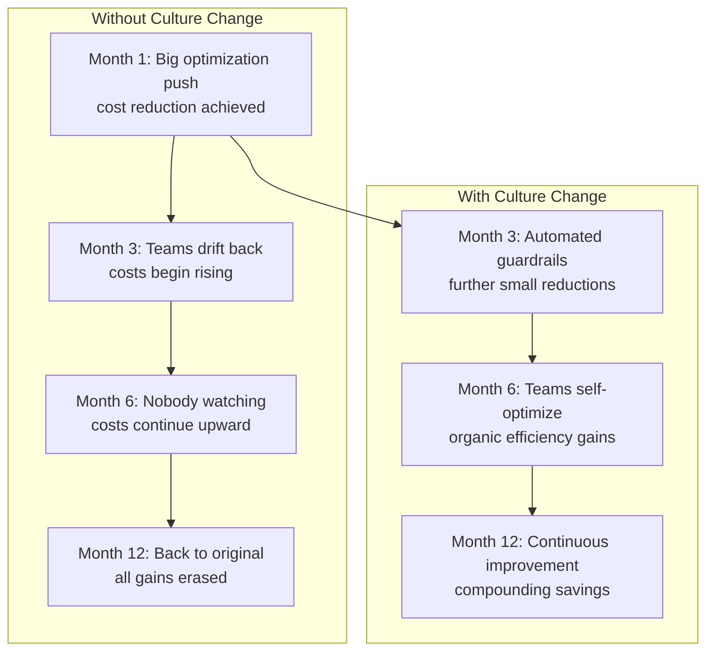
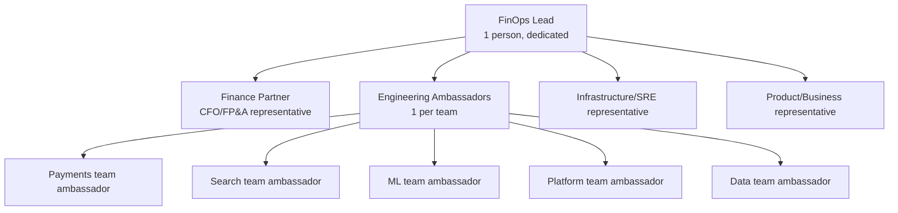
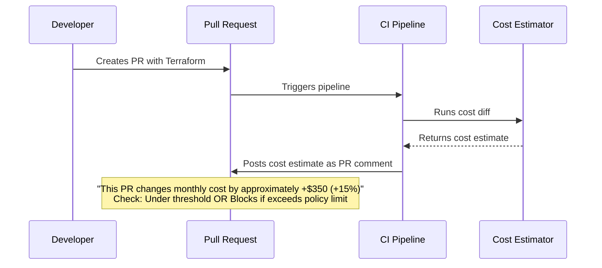
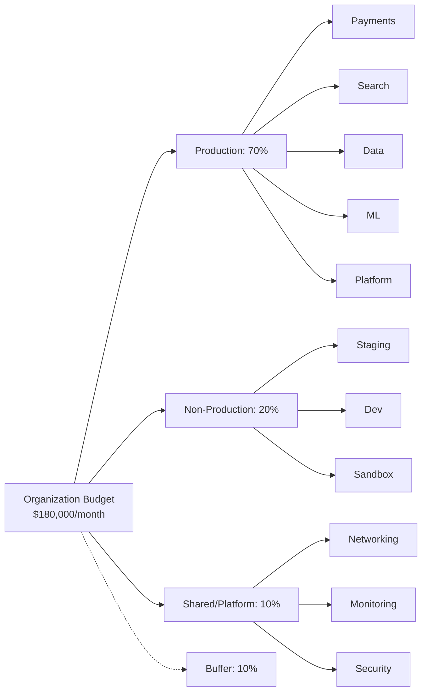
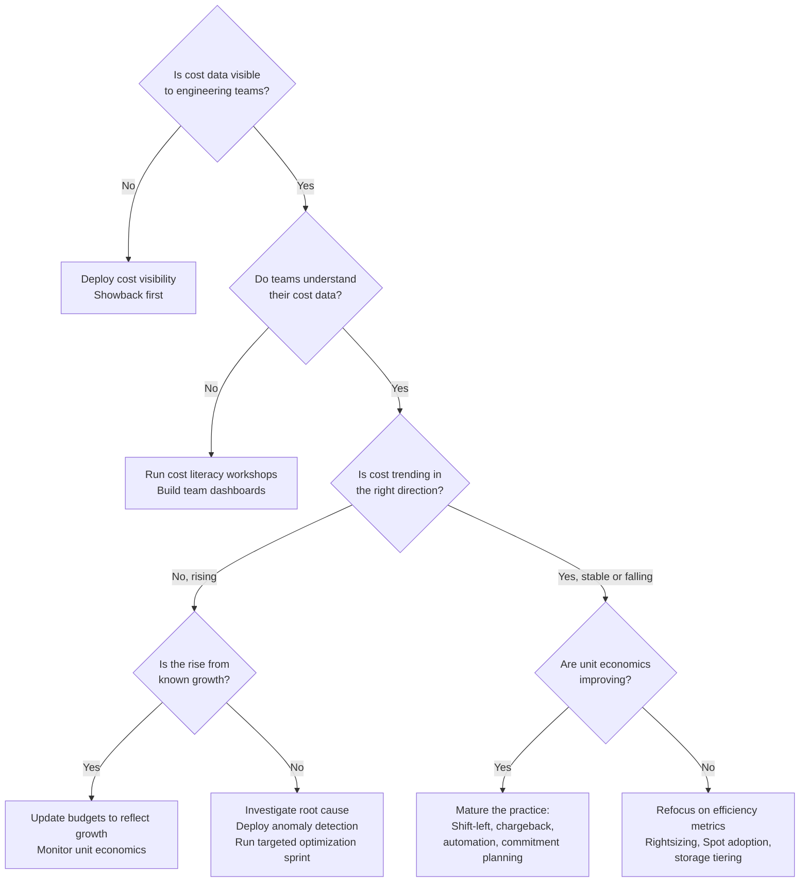

> **Discipline Module** | Complexity: `[MEDIUM]` | Time: 2h

## Prerequisites

Before starting this module:

- **Required**: [Module 1.5: Storage & Network Cost Management](../module-1.5-storage-network-costs/) — Completing the technical FinOps modules
- **Required**: Understanding of CI/CD pipelines (GitHub Actions, GitLab CI, or similar)
- **Required**: Basic Terraform familiarity (for Infracost exercise)
- **Recommended**: Experience with Infrastructure as Code workflows
- **Recommended**: Involvement in team budgeting or capacity planning

---

## What You'll Be Able to Do

After completing this module, you will be able to:

- **Lead organizational change that embeds cost awareness into engineering culture and daily practices**
- **Design accountability models and incentive programs that motivate teams to optimize cloud spending without blaming individuals**
- **Build cost review processes that integrate with sprint planning, pull requests, and architecture decision records**
- **Implement cost anomaly detection and budget forecasting that alerts teams to unexpected spending changes before they compound**
- **Deploy automation patterns that enforce tagging, reclaim idle resources, and schedule non-production shutdowns without manual intervention**

---

## Why This Module Matters

You have learned the technical side of FinOps: cost allocation, rightsizing, compute optimization, storage and network management. Those skills let you identify waste and execute optimizations. But here is the uncomfortable truth that every FinOps practitioner discovers: **technical optimization without cultural change is temporary.**

You can rightsize every workload, migrate every volume to gp3, and add VPC endpoints everywhere — and six months later, costs will be right back where they started. The reason is not that the optimizations failed. It is that the *behaviors* that created the waste never changed. Developers will still over-provision out of caution. Teams will still spin up resources without tags because nobody asks for them. Nobody will look at the dashboards you built because the dashboards live in a separate tab that nobody opens.

This module addresses the durable principle behind every successful FinOps practice: **FinOps is far more about culture than technology.** The tools — OpenCost, Kubecost, Infracost, cloud-native cost explorers, Vantage — are necessary but insufficient. They provide visibility. Visibility without accountability produces awareness. Awareness without incentives produces indifference. Indifference produces the cost drift you set out to eliminate.

The cultural work happens at multiple layers simultaneously. At the individual level, engineers need cost data surfaced where they already work — in pull requests, in their developer portal, in sprint planning. At the team level, cost must become a shared metric alongside latency, error rate, and throughput — not a separate spreadsheet owned by a different department. At the organizational level, the engineering and finance functions must develop a shared vocabulary so that infrastructure decisions are evaluated in business terms (dollars, margins, unit economics) rather than purely technical ones (CPU cores, gigabytes, instance types). At the automation level, policy must be encoded so that good behavior is the path of least resistance and anomalous spending triggers alerts before the monthly bill arrives.



The mermaid diagram above illustrates a pattern observed across organizations that treat FinOps as a one-time project versus those that embed it as an ongoing practice. The "without culture change" path is not hypothetical — it mirrors the experience of teams that complete a cost-optimization sprint, declare victory, and move on. The "with culture change" path requires sustained investment in the practices this module teaches: guild formation, shift-left estimation, anomaly detection, automation, gamification, and the engineering-finance bridge. The payoff is not a single cost reduction but a permanently lower cost-growth trajectory.

> **Pause and predict**: If you ask an engineer to choose between shipping a feature a week early or saving a few hundred dollars a month in cloud costs, which will they choose? How does a FinOps guild change this calculation? If you answer "the feature, every time," you have correctly identified the problem. The guild's job is not to flip that choice — it is to make the cost data so visible and the optimized path so easy that the tradeoff never arises.

---

## Building a FinOps Guild

### What Is a FinOps Guild?

A FinOps guild — also called a community of practice — is a cross-functional group that drives cost awareness across the organization. The distinction between a guild and a centralized FinOps *team* is fundamental to understanding why some organizations sustain cost efficiency while others cycle through optimization-and-drift loops. A centralized team *does* the optimization work. A guild *enables* every team to do its own optimization work.

The centralized model appears efficient at first. Three dedicated FinOps engineers can rightsize pods, migrate storage classes, and clean up unattached volumes faster than any distributed group of part-time ambassadors. But the centralized model creates a structural dependency: engineers learn that cost is someone else's problem. When the next sprint introduces a new microservice with generous resource requests, nobody flags it because the FinOps team will catch it later. The FinOps team *does* catch it — three months later, after the cloud bill arrives — and the cycle repeats.

The guild model breaks this dependency by distributing ownership. Every engineering team has an ambassador — typically a senior engineer who spends two to four hours a month on FinOps activities. The ambassador reviews their team's cost reports, flags anomalies in sprint planning, and represents the team in guild meetings. A single dedicated FinOps lead provides centralized tooling, dashboards, reporting infrastructure, and facilitation. The lead does not optimize individual workloads; they build the systems that make optimization visible and measurable for everyone else. This division of labor — ambassadors own the decisions, the lead owns the decision-support infrastructure — is what makes the guild model scale beyond what any centralized team could achieve on its own.



This structure mirrors the organizational pattern that the FinOps Foundation describes in its framework: cross-functional stakeholders with clearly defined responsibilities, operating on a regular cadence. The Finance Partner translates cloud costs into business metrics and owns budgeting. The Infrastructure representative handles the technical tooling — deploying cost collectors, configuring anomaly alerts, and maintaining the automation pipelines. The Product representative connects cost to product value, ensuring that optimization efforts are prioritized against feature work with a shared understanding of the tradeoffs.

### Roles and Responsibilities

The table below captures the standard roles in a FinOps guild. The time commitments are guidelines drawn from organizations that have mature practices; they will vary with organizational size and cloud spend.

| Role | Responsibility | Time Commitment |
|------|---------------|-----------------|
| **FinOps Lead** | Own the practice, tooling, dashboards, reporting | Full-time or 50% |
| **Finance Partner** | Translate cloud costs to business metrics, budgeting | 4-6 hours/month |
| **Engineering Ambassadors** | Champion cost awareness in their team, review reports | 2-3 hours/month |
| **Infra/SRE Rep** | Technical optimization, tooling, automation | 8-10 hours/month |
| **Product Rep** | Connect cost to product value, prioritize optimization | 2-3 hours/month |

### Starting a Guild from Scratch

Building a guild is itself a cultural change initiative. The sequence matters. Starting with chargeback before teams have visibility breeds resentment. Starting with complex automation before teams understand their cost baseline produces confusion. The three-phase progression below represents a path that multiple organizations have followed successfully.

**Phase 1 — Foundation (Month 1).** Identify a FinOps lead — this can be a part-time role initially allocated from an existing platform or infrastructure engineer. Recruit one ambassador per engineering team by framing the role as a leadership development opportunity, not an administrative burden. Deploy basic cost visibility using an open-source cost monitoring tool such as OpenCost or the Kubecost free tier, integrated with your existing observability stack. Send the first monthly cost report as showback — a "for your information" communication with no financial consequences attached. The goal of Phase 1 is not optimization. It is establishing that cost data exists and is accessible.

**Phase 2 — Awareness (Months 2-3).** Run the first cost optimization sprint by selecting the top sources of waste visible in the Phase 1 data — unattached volumes, oversized pods, non-production clusters running over weekends. Create team-level dashboards so each ambassador can see their own team's data without wading through the entire organizational view. Start a weekly communication cadence — a Slack message with the top three cost movements, a brief note on the largest anomaly, and a callout celebrating whichever team made the biggest improvement. Celebrate wins publicly. The behavioral mechanism here is social proof: when the Search team sees the Payments team getting recognized for a cost improvement, they become curious about their own numbers.

**Phase 3 — Habits (Months 4-6).** Integrate cost estimation into sprint planning so that every new feature proposal includes an approximate monthly infrastructure cost alongside the effort estimate. Deploy cost anomaly alerts so that unexpected spending changes reach the responsible team within hours, not at the end of the billing cycle. Begin chargeback conversations — transitioning from "here is what your infrastructure costs" to "this amount is allocated to your budget." Train ambassadors on deeper cost optimization techniques: spot instance adoption, commitment-based discount planning, and storage tiering. By the end of Phase 3, cost awareness should feel like a normal part of engineering work, not a special initiative.

---

## The Engineering-Finance Bridge

### Why Engineers and Finance Speak Different Languages

The single largest communication gap in cloud financial management sits between the engineering organization and the finance function. Engineers describe infrastructure in terms of CPU cores, gigabytes of memory, IOPS, and instance families. Finance describes the business in terms of dollars, gross margins, operating expenses, and return on invested capital. Neither vocabulary is wrong, but neither is directly translatable into the other without deliberate effort.

When an infrastructure team says "we need twenty more CPU cores to handle projected growth," finance hears an unbounded cost request with no business justification. When finance asks "what is the ROI of that Kubernetes cluster," engineering hears a request to justify the existence of the platform itself. Both sides become frustrated, and the conversation stalls.

The FinOps practitioner's role at this bridge is translation — in both directions. To engineering, you translate financial concepts into operational terms: "Our infrastructure cost as a percentage of revenue is climbing. That means if we maintain our current trajectory, infrastructure will consume our entire margin on the mid-tier customer segment within three quarters. We need to find efficiencies that do not degrade the customer experience." To finance, you translate engineering work into financial impact: "The platform team migrated forty stateless workloads to spot instances this quarter. That reduces our annual compute run rate by a significant amount while maintaining availability above our SLA. It is a permanent cost reduction with no recurring engineering overhead."

### The Translation Table

The following table maps common engineering statements to their financial equivalents. Learning to produce both columns — and to choose the right column for the right audience — is a core FinOps competency.

| Engineering Metric | Finance Translation |
|-------------------|-------------------|
| "We need 20 more CPU cores" | "We need additional compute capacity to handle projected growth; the monthly cost impact is the relevant figure" |
| "Our p99 latency improved 40ms" | "Response time improvement correlates with user retention; each millisecond of latency reduction has measurable revenue impact" |
| "We rightsized 30 pods" | "We reduced recurring infrastructure cost without service degradation — it is a permanent efficiency gain" |
| "We migrated to Spot" | "We reduced compute costs by trading a small availability risk for a substantial price discount, with automated fallback" |
| "Our cluster utilization is 18%" | "We are paying for significantly more capacity than we consume on average; this is idle cost that could fund other initiatives" |

### Showback, Chargeback, and the Accountability Maturity Model

Accountability for cloud costs matures along a predictable spectrum. Understanding where your organization sits on this spectrum determines which interventions will be effective and which will generate resistance.

**Level 1 — No Visibility.** Costs are aggregated into a single cloud bill with no breakdown by team, service, or environment. Nobody knows what anything costs. FinOps is not practiced because there is no data to practice it on.

**Level 2 — Showback.** Costs are allocated to teams or business units and reported regularly, but there are no financial consequences. The communication is informational: "Your team's infrastructure cost this month was approximately this amount. Here is the breakdown." Showback builds cost awareness without triggering defensive reactions. It is the correct starting point for any organization beginning FinOps.

**Level 3 — Chargeback (Soft).** Costs are allocated to team budgets, but overruns trigger a conversation rather than a penalty. Teams are expected to understand their spending and explain deviations. The accountability is social and reputational — nobody wants to be the team that blew its budget with nothing to show for it.

**Level 4 — Chargeback (Hard).** Cloud costs are deducted from team budgets with real financial consequences. An overrun in infrastructure means less budget for headcount, tools, or conferences. Hard chargeback creates strong incentives but can also create perverse behaviors: teams under-provision to stay under budget, degrading reliability. Hard chargeback should only be deployed after teams have had at least six months of showback and soft chargeback to develop cost literacy.

**Level 5 — Unit Economics.** Accountability moves beyond absolute spending to efficiency ratios: cost per customer, cost per request, cost per feature. Teams are evaluated on whether their unit costs are improving over time, not whether their absolute spend went up or down. This is the most mature level because it aligns cost accountability with business growth — a team that doubled its customer base while keeping unit costs flat has performed excellently, even though its absolute spend doubled.

The progression through these levels is cultural work. Moving from Level 1 to Level 2 requires deploying cost allocation tooling. Moving from Level 2 to Level 3 requires building trust between engineering and finance. Moving from Level 3 to Level 4 requires a mature budgeting process. Moving to Level 5 requires stable unit-economic metrics that both engineering and finance agree are the right measures of efficiency.

### The Monthly FinOps Business Review

> **Hypothetical scenario: Monthly FinOps Review**
>
> **Executive Summary:**
> - Total cloud spend: $170,000 (budget: $180,000) — under budget
> - Month-over-month change: +3%
> - Cost per customer: $0.70 (target: under $0.75) — target met
> - Savings realized this month: $8,000
>
> **Key Wins:**
> - Payments team rightsizing: reduced monthly spend by approximately $3,000 (ongoing)
> - Storage class migration: reduced monthly spend by approximately $1,500 (one-time, permanent)
> - Spot adoption for CI/CD: reduced monthly spend by approximately $4,000 (ongoing)
>
> **Risks:**
> - ML training costs growing month-over-month (investigating)
> - Untagged resources: approximately $7,000/month (down from $10,000 — improving)
>
> **Next Month Focus:**
> - Complete cross-AZ traffic optimization
> - Begin Reserved Instance planning for upcoming quarter
> - Launch team cost dashboards in developer portal

The review format above illustrates a durable pattern: executive summary, wins with approximate dollar figures, risks with trend direction, and forward-looking focus items. The specific dollar amounts are illustrative and round. In a real organization, these would be replaced with actual figures from the cloud billing data. The structure — summary, wins, risks, forward plan — is what persists across organizations regardless of their absolute spend level.

### Finance Report Template

| KPI | This Month | Last Month | Trend |
|-----|------------|------------|-------|
| Total cloud spend | $170,000 | $165,000 | up |
| Budget variance | ($10,000) | ($15,000) | rising |
| Cost per customer | $0.70 | $0.72 | down |
| Revenue per customer | $4.20 | $4.15 | up |
| Infra as % of revenue | 16% | 17% | down |
| Savings this month | $8,000 | $5,000 | up |
| Commitment utilization | 87% | 82% | up |
| Tagging compliance | 91% | 88% | up |
| Waste (estimated) | $22,000 | $29,000 | down |

---

## Cost in CI/CD: Shift-Left FinOps

The cheapest moment to catch a cost problem is before the infrastructure that creates it exists. A pod sized at eight CPU cores when two would suffice costs the same whether you discover the waste on day one or day ninety — but discovering it on day one saves eighty-nine days of unnecessary spend. This is the principle of shift-left FinOps: moving cost evaluation as early in the development lifecycle as possible.

Shift-left cost estimation has three natural integration points. The earliest is the architecture decision record or design review, where a proposed system topology can be cost-modeled before a single line of Terraform is written. This is the cheapest and most flexible intervention point — changing an architecture diagram costs nothing. The next is the pull request, where infrastructure-as-code changes can be automatically cost-estimated and the estimate posted as a PR comment. At this stage the design is committed to code but not yet deployed, so corrections still require engineering time but incur no cloud spend. The latest — and still valuable — is the deployment pipeline, where cost guards can block or flag changes that exceed predefined thresholds. At this stage the change is minutes from being live, and a block here is the most expensive in terms of engineer context-switching cost, but still far cheaper than discovering the waste on the monthly bill.

The pull-request integration point offers the best balance of accuracy and timeliness. At this stage, the infrastructure change is fully specified (instance types, counts, storage sizes, data transfer patterns) so the cost estimate is concrete, but the change has not yet been applied so there is no incurred waste. Infracost is a widely used tool for this integration point, but the principle — cost estimation from infrastructure-as-code diffs — is durable and can be implemented with other tools or custom scripts that query cloud pricing APIs.

### How Shift-Left Cost Estimation Works



The flow is straightforward: a developer opens a pull request containing infrastructure-as-code changes. The CI pipeline runs a cost estimation tool against the proposed changes, comparing them to the current baseline. The tool produces a cost diff — how much the monthly bill would change if this PR were merged. That diff is posted as a comment on the PR, visible to the author, the reviewers, and anyone else watching the repository.

### Infracost PR Comment Example

```markdown
## Infracost Cost Estimate

| Project | Previous | New | Diff |
|---------|----------|-----|------|
| production/eks | $1,850/mo | $2,200/mo | +$350 (+19%) |

### Cost Breakdown

| Resource | Monthly Cost | Change |
|----------|-------------|--------|
| aws_eks_node_group.workers | $1,400 to $1,750 | +$350 |
| (added 2 compute-optimized nodes) | | |

### Details
- Node group scaled from 5 to 7 instances
- Instance type: compute-optimized (~$175/mo each)
- Consider: Could Karpenter autoscaling handle this workload elasticity instead of static scaling?

**This PR exceeds the 10% cost increase threshold.**
Approval from @finops-team required.
```

The example above uses approximate round numbers to illustrate the pattern. In a real pipeline, Infracost queries live cloud pricing APIs and produces exact figures. The key design elements are: a summary table showing the total cost change, a breakdown showing which resources changed, a human-readable explanation of what changed, and a clear gate — the threshold check that determines whether the PR requires additional approval.

### GitHub Actions: Infracost with Cost Threshold

```yaml
# .github/workflows/infracost.yml
name: Infracost Cost Check

on:
  pull_request:
    paths:
      - 'terraform/**'
      - '*.tf'

permissions:
  contents: read
  pull-requests: write

jobs:
  infracost:
    runs-on: ubuntu-latest
    name: Infracost Cost Estimate

    steps:
      - name: Checkout base branch
        uses: actions/checkout@v4
        with:
          ref: ${{ github.event.pull_request.base.sha }}

      - name: Setup Infracost
        uses: infracost/actions/setup@v3
        with:
          api-key: ${{ secrets.INFRACOST_API_KEY }}

      - name: Generate base cost
        run: |
          infracost breakdown \
            --path=terraform/ \
            --format=json \
            --out-file=/tmp/infracost-base.json

      - name: Checkout PR branch
        uses: actions/checkout@v4

      - name: Generate PR cost diff
        run: |
          infracost diff \
            --path=terraform/ \
            --compare-to=/tmp/infracost-base.json \
            --format=json \
            --out-file=/tmp/infracost-diff.json

      - name: Post PR comment
        uses: infracost/actions/comment@v3
        with:
          path: /tmp/infracost-diff.json
          behavior: update

      - name: Check cost threshold
        run: |
          # Extract the cost difference (positive = increase, negative = decrease)
          DIFF=$(cat /tmp/infracost-diff.json | \
            jq -r '.diffTotalMonthlyCost // "0"')
          BASE=$(cat /tmp/infracost-diff.json | \
            jq -r '.pastTotalMonthlyCost // "1"')

          # Only check increases (skip if cost decreased)
          if [ "$(echo "$DIFF <= 0" | bc)" -eq 1 ]; then
            echo "Cost change: \$${DIFF}/mo (decrease or zero). No threshold check needed."
            exit 0
          fi

          # Calculate percentage increase
          if [ "$(echo "$BASE > 0" | bc)" -eq 1 ]; then
            PCT=$(echo "scale=1; ($DIFF / $BASE) * 100" | bc)
          else
            PCT="0"
          fi

          echo "Cost increase: ${PCT}%"

          # Fail if cost increase exceeds 10%
          THRESHOLD=10
          if [ "$(echo "$PCT > $THRESHOLD" | bc)" -eq 1 ]; then
            echo "::error::Cost increase of ${PCT}% exceeds ${THRESHOLD}% threshold"
            echo "This PR requires FinOps team approval."
            exit 1
          fi

          echo "Cost change within threshold."
```

### GitLab CI Alternative

```yaml
# .gitlab-ci.yml
infracost:
  stage: validate
  image: infracost/infracost:ci-latest
  script:
    - git checkout $CI_MERGE_REQUEST_TARGET_BRANCH_NAME
    - infracost breakdown --path=terraform/ --format=json --out-file=base.json
    - git checkout $CI_COMMIT_SHA
    - infracost diff --path=terraform/ --compare-to=base.json --format=json --out-file=diff.json
    - infracost comment gitlab --path=diff.json --gitlab-token=$GITLAB_TOKEN --repo=$CI_PROJECT_PATH --merge-request=$CI_MERGE_REQUEST_IID --behavior=update
  rules:
    - if: '$CI_PIPELINE_SOURCE == "merge_request_event"'
      changes:
        - terraform/**/*
```

---

## Cost Anomaly Detection and Forecasting

Anomaly detection is the Operate-phase capability that catches unexpected cost movements before they compound into budget-busting surprises. Its value is not in the detection itself — a spike visible on a dashboard is still a spike you have to pay for — but in the *lead time* it creates. Detecting an anomaly within hours means the team can investigate while the affected resources are still running and the root cause is fresh. Detecting it at the end of the billing cycle means the money is already spent and the investigation must reconstruct events from logs.

The distinction between anomaly detection and threshold alerting is worth understanding clearly because they are often conflated. A threshold alert fires when a metric crosses a fixed boundary — "alert when daily spend exceeds $5,000." A cost anomaly detection system learns the normal spending pattern for each service, account, or tag combination and fires when the actual spending diverges from that pattern in a statistically significant way. A threshold alert on a service that normally spends $4,000/day will miss a spike to $4,900 because the threshold was never crossed, even though the spike represents a 22% increase. An anomaly detection system tuned to that service's baseline would catch the same spike because it recognizes the deviation from the expected pattern. For this reason, anomaly detection is the preferred approach for variable-cost services — those whose spending naturally fluctuates with traffic — while threshold alerting remains appropriate for fixed-cost resources like Reserved Instances and committed-use discounts where the expected spend is known precisely.

### Types of Cost Anomalies

Not all cost anomalies look the same, and each type requires a different detection strategy. A threshold-based alert that catches a 40% day-over-day spike will miss a gradual 5% weekly increase that compounds into a substantial overrun over two months. A trend-analysis system that catches the gradual increase may produce too many false positives if applied to naturally volatile workloads.

| Anomaly Type | Example | Detection Method |
|-------------|---------|-----------------|
| **Spike** | Cost jumps sharply day-over-day | Threshold alerting |
| **Trend** | Gradual weekly increase sustained over multiple weeks | Trend analysis |
| **New resource** | Unfamiliar service appears on bill | Service catalog allowlist |
| **Rate change** | Commitment expires, on-demand pricing kicks in | Commitment monitoring |
| **Data transfer** | Cross-region traffic surge | Network flow analysis |

Each detection method has a characteristic false-positive profile. Threshold alerting is simple to implement but produces noise for workloads with legitimate burst patterns. Trend analysis catches slow leaks but requires enough historical data to establish a baseline — typically at least four to six weeks. Service allowlisting flags brand-new cost sources immediately but requires maintaining the allowlist as the service catalog evolves. The durable principle is defense in depth: deploy multiple detection methods and route each to the appropriate responder — the team that owns the affected resources, not a centralized FinOps operations desk.

### Integrating Anomaly Detection with Forecasting

Anomaly detection answers the question "what happened unexpectedly?" Forecasting answers the question "where are we headed?" The two capabilities reinforce each other. A forecast that does not account for anomalies will be systematically optimistic — it will project a smooth trend line through a noisy reality and consistently under-predict actual spend. Conversely, anomaly detection without forecasting context will generate alerts for spending changes that are actually expected (a planned marketing campaign that doubles traffic, a seasonal peak, a known infrastructure expansion).

The forecasting techniques available range from simple linear extrapolation — suitable for stable, predictable workloads — to machine-learning-based models that decompose spend into trend, seasonal, and residual components. The technique matters less than the process: forecasts must be reviewed regularly against actuals, and the forecast error must be tracked as a metric in its own right. An organization that cannot forecast its cloud spend within a predictable error band cannot set meaningful budgets, and an organization without meaningful budgets cannot practice chargeback.

### AWS Cost Anomaly Detection

```hcl
# Terraform: AWS Cost Anomaly Detection
resource "aws_ce_anomaly_monitor" "service_monitor" {
  name              = "service-cost-monitor"
  monitor_type      = "DIMENSIONAL"
  monitor_dimension = "SERVICE"
}

resource "aws_ce_anomaly_monitor" "team_monitor" {
  name         = "team-cost-monitor"
  monitor_type = "CUSTOM"
  monitor_specification = jsonencode({
    And = null
    Or  = null
    Not = null
    Tags = {
      Key          = "team"
      Values       = []
      MatchOptions = ["ABSENT"]
    }
  })
}

resource "aws_ce_anomaly_subscription" "alerts" {
  name = "cost-anomaly-alerts"
  frequency = "DAILY"

  monitor_arn_list = [
    aws_ce_anomaly_monitor.service_monitor.arn,
    aws_ce_anomaly_monitor.team_monitor.arn,
  ]

  subscriber {
    type    = "EMAIL"
    address = "finops-team@company.com"
  }

  subscriber {
    type    = "SNS"
    address = aws_sns_topic.cost_alerts.arn
  }

  threshold_expression {
    dimension {
      key           = "ANOMALY_TOTAL_IMPACT_ABSOLUTE"
      values        = ["100"]        # Alert if impact > $100
      match_options = ["GREATER_THAN_OR_EQUAL"]
    }
  }
}
```

### Prometheus-Based Anomaly Alerting (Kubernetes)

```yaml
# PrometheusRule for cost anomaly alerts
apiVersion: monitoring.coreos.com/v1
kind: PrometheusRule
metadata:
  name: finops-anomaly-alerts
  namespace: monitoring
spec:
  groups:
  - name: finops.anomalies
    rules:
    # Alert when namespace cost increases >30% vs 7-day average
    - alert: CostAnomalySpike
      expr: |
        (
          sum by (namespace) (
            kubecost_allocation_cpu_cost + kubecost_allocation_memory_cost
          )
          /
          avg_over_time(
            (sum by (namespace) (
              kubecost_allocation_cpu_cost + kubecost_allocation_memory_cost
            ))[7d:1h]
          )
        ) > 1.3
      for: 2h
      labels:
        severity: warning
        team: finops
      annotations:
        summary: "Cost anomaly: {{ $labels.namespace }} cost increased >30%"
        description: "Namespace {{ $labels.namespace }} cost is {{ $value | humanize }}x its 7-day average."

    # Alert when new untagged resources appear
    - alert: UntaggedResourcesGrowing
      expr: |
        count(kube_pod_labels{label_team=""}) > 10
      for: 1h
      labels:
        severity: warning
      annotations:
        summary: "{{ $value }} pods running without team label"
```

---

## Automation Patterns for FinOps

Automation is the mechanism that converts cultural intent into reliable behavior. A team that *intends* to tag every resource will still miss tags during an incident at 3 AM. A policy that *requires* non-production clusters to shut down over weekends will be forgotten during the sprint-end crunch. Automation encodes the policy so that compliance is the default and non-compliance requires an explicit override.

### Scheduled Scale-Down for Non-Production Environments

Non-production environments — development, staging, sandbox — typically do not need to run continuously. A cluster that serves developers during business hours can be scaled to zero overnight and on weekends. The automation pattern is straightforward: a cron schedule that scales deployments to zero replicas at a defined time and restores them before the next working day begins.

The implementation can be as simple as a Kubernetes CronJob that adjusts replica counts, or as sophisticated as a cluster autoscaler integration that suspends entire node groups. The durable principle is not the specific implementation but the recognition that non-production infrastructure should not run at production availability levels. The savings from this single pattern are typically substantial because non-production environments often represent a significant fraction of total cloud spend.

Implementing scheduled scale-down well requires attention to two edge cases. The first is stateful workloads. Stateless deployments can be scaled to zero and restored trivially because they carry no persistent data. Stateful workloads — databases, message queues, search indexes — require a graceful shutdown sequence that flushes data and a startup sequence that verifies data integrity before accepting traffic. Automating scale-down for stateful workloads is possible but demands testing that validates the full stop-start cycle, not just the individual stop and start operations in isolation. The second edge case is scheduling across time zones. A scale-down schedule set to "8 PM Eastern" will cut off developers on the West Coast at 5 PM their time, potentially disrupting late-afternoon work. The solution is either to align the schedule with the latest-working time zone in the organization or to allow per-team overrides so that each team controls its own non-production availability window.

### Idle Resource Reaping

Resources that are provisioned but unused accumulate silently. Unattached persistent volumes, load balancers pointing to terminated backends, elastic IPs not associated with any instance, and stopped instances that still accrue storage charges all contribute to a slow cost leakage that is invisible unless someone actively searches for it. Idle resource reaping is the automated process of identifying and removing these resources.

The pattern has three stages: detection, notification, and removal. Detection queries the cloud API for resources matching "unused" criteria (volume status "available," load balancer with zero healthy targets, IP address with no association). Notification informs the resource owner — deduced from tags — and provides a grace period, typically seven days. Removal executes after the grace period expires with no response. The grace period is essential: an unattached volume might be a snapshot target awaiting a maintenance window, and automated deletion without warning causes incidents.

Designing an effective reaping system requires balancing thoroughness against safety. A reaper that aggressively removes every unattached resource the moment it is detected will cause production incidents when it deletes a volume that was temporarily detached for a maintenance operation. A reaper that requires manual approval for every removal will never achieve coverage because the approval queue will grow faster than anyone can triage it. The middle ground is a tiered approach: resources that have been unattached for a short window (under 48 hours) generate a notification only; resources unattached for a medium window (48 hours to 14 days) generate a notification with an auto-resolution deadline; resources unattached beyond 14 days are removed automatically with a final notification sent at the time of deletion. The tiers and thresholds should be configurable per environment — production might use longer windows and require manual approval at every stage, while sandbox environments can use aggressive auto-removal.

### Tagging Enforcement

Resource tagging is the foundation of cost allocation, but manual tagging compliance decays over time. New services are created during incidents without tags. Infrastructure provisioned through a new CI pipeline lacks the tagging step that the old pipeline included. Tagging enforcement uses policy-as-code to reject or flag resources that lack required tags at provisioning time.

Cloud-native policy engines — AWS Organizations SCPs, Azure Policy, GCP Organization Policy — can block resource creation when mandatory tags are absent. Kubernetes-native approaches include admission controllers that mutate or reject resources based on label requirements. The enforcement should be progressive: start with audit-only mode that reports violations without blocking, transition to soft enforcement that blocks in non-production but warns in production, and eventually reach hard enforcement everywhere. As with showback-to-chargeback, the progression builds trust and gives teams time to adapt their workflows.

Effective tagging enforcement must also address the tag quality problem, not just tag presence. A resource tagged with `team=misc` or `environment=unknown` satisfies a presence check but contributes nothing to cost allocation. Tagging policies should validate against a controlled vocabulary — an approved list of team names, environment designations, and cost-center codes — and reject values that fall outside that vocabulary. Maintaining the controlled vocabulary is itself a cross-functional task: finance owns the cost-center list, engineering leadership owns the team list, and platform engineering owns the environment taxonomy. When these stakeholders do not coordinate, the vocabulary drifts and the enforcement becomes a source of friction rather than a quality guarantee.

### Cost Policy as Code

The shift-left principle applied to policy means that cost rules should be version-controlled, tested, and deployed through the same pipelines as application code. A cost policy that lives in a wiki page has no enforcement mechanism. A cost policy encoded as Open Policy Agent (OPA) rules, Kyverno policies, or cloud-native policy definitions can be automatically enforced at resource creation time.

> **Landscape snapshot — as of 2026-06. This changes fast; verify against vendor docs before relying on specifics.**

The tools available for cost policy enforcement span multiple layers of the stack. At the infrastructure-as-code layer, tools like Infracost and Open Policy Agent can evaluate Terraform plans against cost policies before resources are created. At the Kubernetes admission layer, Kyverno and OPA Gatekeeper can enforce resource request limits, require cost allocation labels, and reject configurations that exceed defined budgets. At the cloud-provider layer, each of the major providers offers policy engines — AWS Organizations SCPs, Azure Policy, GCP Organization Policy — that can enforce tagging, restrict expensive instance types, and limit region usage.

The **Cost-Tooling Rosetta** below maps durable FinOps capabilities to the tools that implement them. Treat the "tool" column as illustrative, not prescriptive. The capability column describes the permanent function; any given tool may gain, lose, or change its implementation of that function over time.

| Capability | Illustrative Tools | Durable Principle |
|---|---|---|
| Cost allocation by namespace/label | OpenCost, Kubecost, cloud-native cost explorers | Allocate spend to the team or service responsible |
| Idle-cost attribution | Kubecost, cloud-native cost explorers | Expose the request-versus-usage gap |
| Showback reporting | OpenCost, Kubecost, Vantage | Provide visibility without financial consequences |
| Chargeback/showback automation | Kubecost, cloud-native cost explorers | Automate the allocation-to-team pipeline |
| Rightsizing recommendations | Kubecost, cloud-native cost advisors, VPA | Produce recommendations as input to human decision |
| Anomaly detection | Cloud-native anomaly detection, Kubecost alerts | Detect unexpected spending movements early |
| CI cost estimation | Infracost, cloud-native cost estimators | Estimate cost from infrastructure-as-code diffs |
| Commitment planning | Cloud-native cost explorers, Vantage | Model Reserved Instance / Savings Plan scenarios |
| Spot instance automation | Karpenter, Cluster Autoscaler | Trade flexibility for cost on interruptible workloads |
| Scheduled scaling | KEDA, CronJobs, cloud-native instance schedulers | Scale non-production environments to zero off-hours |

---

## Budgeting and Forecasting

### Setting Cloud Budgets

A cloud budget is more than a spending limit — it is a planning tool that forces the organization to allocate finite resources across competing priorities. Budgets that are set once annually and never revisited fail in both directions: they constrain teams whose growth exceeds projections, and they mask waste in teams whose spending is well below the budget ceiling. Effective cloud budgeting operates on a monthly cadence with quarterly re-forecasting.



The budget tree above illustrates a common allocation pattern: production workloads receive the largest share, non-production environments are explicitly budgeted rather than ignored, shared platform services are accounted for separately, and a buffer — typically 10% — absorbs unexpected spikes without triggering overrun alerts. The buffer is not "free money." It is a recognition that cloud spending is inherently variable and that setting budgets at exactly 100% of expected spend guarantees that every minor deviation triggers an alert, which causes alert fatigue.

### AWS Budget Configuration with Tiered Alerts

```hcl
# Terraform: AWS Budget with alerts at multiple thresholds
resource "aws_budgets_budget" "team_payments" {
  name         = "payments-team-monthly"
  budget_type  = "COST"
  limit_amount = "32000"
  limit_unit   = "USD"
  time_unit    = "MONTHLY"

  cost_filter {
    name   = "TagKeyValue"
    values = ["user:team$payments"]
  }

  notification {
    comparison_operator       = "GREATER_THAN"
    threshold                 = 75
    threshold_type            = "PERCENTAGE"
    notification_type         = "FORECASTED"
    subscriber_email_addresses = ["payments-lead@company.com"]
  }

  notification {
    comparison_operator       = "GREATER_THAN"
    threshold                 = 90
    threshold_type            = "PERCENTAGE"
    notification_type         = "ACTUAL"
    subscriber_email_addresses = [
      "payments-lead@company.com",
      "finops@company.com"
    ]
  }

  notification {
    comparison_operator       = "GREATER_THAN"
    threshold                 = 100
    threshold_type            = "PERCENTAGE"
    notification_type         = "ACTUAL"
    subscriber_email_addresses = [
      "payments-lead@company.com",
      "finops@company.com",
      "vp-engineering@company.com"
    ]
  }
}
```

The tiered alert design is deliberate. At 75% of the forecasted budget, only the team lead receives a notification — this is a heads-up, not an alarm. At 90% of actual spend, the FinOps team is added to provide support and investigate whether the trajectory is justified. At 100%, the VP of Engineering is included, which elevates the conversation to a business decision: is this overrun justified by business need, and should the budget be adjusted? This escalation path prevents both alert fatigue (by not alarming everyone at every threshold) and unnoticed overruns (by widening the audience as the situation approaches the limit).

---

## Patterns and Anti-Patterns

The difference between a FinOps practice that sustains and one that fades is often not the sophistication of the tooling or the size of the budget. It is whether the organization has internalized the patterns that make cost efficiency self-reinforcing or fallen into the anti-patterns that make it adversarial. The patterns below describe recurring solutions to the cultural, organizational, and automation challenges that every FinOps practitioner encounters. The anti-patterns describe the failure modes that are predictable enough to identify and avoid before they take root.

### Patterns — What Good Looks Like

1. **Cost as a shared metric, not a finance spreadsheet.** Embed cost data where engineers already work: PR comments, developer portals, sprint planning tools. When cost data requires opening a separate dashboard in a separate tab, it will not be checked. When it appears alongside the metrics engineers already care about — latency, error rate, deployment frequency — it becomes part of the operational rhythm.

2. **Progressive accountability.** Start with showback until teams understand their cost data. Move to soft chargeback when teams can explain their spending. Graduate to hard chargeback only after teams have the tooling and knowledge to control their costs. Skipping stages generates resistance because teams are being held accountable for something they cannot yet influence.

3. **Ambassadors over enforcers.** A FinOps guild with engineering ambassadors from each team scales cost awareness horizontally. A centralized FinOps team that enforces policies from above creates an adversarial relationship where engineers optimize to satisfy the policy rather than to improve efficiency. Ambassadors translate FinOps goals into engineering language and surface engineering concerns back to the FinOps lead.

4. **Automation as cultural reinforcement.** Automate tagging enforcement, idle resource reaping, and non-production scale-down so that the path of least resistance is the cost-efficient path. Automation is not a substitute for culture — it is the mechanism that makes the desired culture the default.

5. **Wins celebrated publicly, overruns discussed privately.** Public recognition for cost optimization creates positive social pressure. Public shaming for cost overruns creates defensive behavior and hidden costs. The team that overspent should have a private conversation with the FinOps lead to understand what happened and whether the spending was justified; the team that achieved a significant saving should be recognized in the company-wide communication channel.

### Anti-Patterns — What to Avoid

| Anti-Pattern | Why It Fails | Better Approach |
|---|---|---|
| **Making FinOps synonymous with cost cutting** | Creates a mindset where optimization is framed as austerity, which engineers resist | Frame FinOps as cost *efficiency* — getting maximum business value per dollar spent |
| **Imposing FinOps top-down without engineering buy-in** | Engineers treat it as a compliance checkbox rather than a practice they own | Start with showback, give teams visibility into their own data, let curiosity drive the first optimizations |
| **Overcomplicating cost allocation before basic visibility exists** | Teams spend months perfecting allocation models while real waste goes unaddressed | 80% accuracy in allocation is sufficient to start finding and fixing waste; refine the model iteratively |
| **Ignoring non-production costs** | Dev, staging, and sandbox environments can collectively rival production spend | Budget non-production explicitly, automate scale-down off-hours, treat non-production cost as a first-class concern |
| **No automation in CI/CD** | Manual cost reviews do not scale beyond a handful of teams and are inconsistently applied | Integrate cost estimation into the PR pipeline so every infrastructure change is evaluated automatically |
| **Annual budgeting for cloud spend** | Cloud spending is variable by nature; annual budgets create artificial cliffs and gaming behavior | Monthly budgets with quarterly re-forecasting accommodate the natural variability of cloud consumption |
| **Central FinOps team owns all optimization** | Creates a bottleneck and signals to engineers that cost is someone else's responsibility | Decentralize ownership through ambassadors; centralize tooling, dashboards, and automation infrastructure |
| **No celebration of wins** | Optimization feels like unrewarded overhead, and teams stop engaging | Public recognition, ambassador spotlights, and leadership acknowledgment make cost work visible and valued |

---

## Decision Framework: When to Use Which Cost Intervention



The decision framework above is organized around a single question sequence that any FinOps practitioner can ask when evaluating their organization's state. It starts with visibility because without visibility, no other intervention is possible. It moves through understanding, trend assessment, root-cause analysis, and finally maturity. The framework is deliberately tool-agnostic — it describes *what to do* at each stage without prescribing *which tool* to do it with.

---

## Did You Know?

- **The FinOps Foundation's practitioner survey has consistently identified "getting engineers to take action" as the top challenge for FinOps practitioners** — ranking above tooling, data quality, and executive support. A large majority of respondents cite cultural adoption as harder than technical implementation. This finding has been stable across multiple survey years, which is why the FinOps Foundation lists "Engineering Alignment" as a core domain alongside cost allocation and optimization.

- **Embedding cost data where engineers already work is more effective than building dedicated dashboards.** The behavioral insight is straightforward: engineers spend their time in terminals, IDEs, pull requests, and developer portals. A cost dashboard that requires navigating to a separate URL competes with every other demand on attention and loses. Cost data surfaced in a PR comment (through a CI integration) or in a developer portal plugin (such as the Backstage Cost Insights plugin) reaches engineers in their existing workflow, where the cognitive cost of engaging with it is near zero.

- **Gamification works because engineering culture is already competitive.** Teams compete on latency percentiles, deployment frequency, and incident response time. Adding cost efficiency to the set of competitive metrics — through a leaderboard that ranks teams by cost-per-request or cost-per-customer rather than absolute spend — taps into existing cultural dynamics rather than trying to create new ones. The leaderboard itself requires no expensive tooling: a dashboard that queries the existing cost allocation data and ranks the results is sufficient.

- **The shift-left principle in FinOps is economically asymmetric.** Catching a cost-increasing change in a pull request costs the time to run the estimation tool and review the comment — roughly five minutes of an engineer's and a reviewer's time. Catching the same change on a cloud bill thirty days later costs thirty days of the unnecessary spend *plus* the engineering time to investigate, root-cause, and remediate — which is nearly always longer than the five-minute PR review would have been. This asymmetry is why the return on investment for CI-integrated cost estimation is among the highest of any FinOps practice.

---

## Common Mistakes

| Mistake | Why It Happens | How to Fix It |
|---------|---------------|---------------|
| Making FinOps = cost cutting | Pressure from leadership | Frame as "cost efficiency" and unit economics, not austerity |
| No engineering buy-in | FinOps imposed top-down | Start with showback, empower teams with data |
| Overcomplicating cost models | Perfectionism in allocation | 80% accuracy is fine to start; iterate |
| Ignoring non-production costs | "It's just dev" | Dev/staging can be a substantial fraction of total spend |
| No automation in CI/CD | Manual reviews don't scale | Deploy cost estimation in CI and automate cost checks |
| Annual budgets for cloud | CapEx thinking applied to OpEx | Monthly budgets with quarterly re-forecasting |
| FinOps team owns all optimization | Bottleneck, single point of failure | Decentralize with ambassadors, centralize tooling |
| No celebration of wins | Optimization feels like a chore | Public recognition, leaderboards, leadership acknowledgment |

---

## Quiz

### Question 1
You are the newly appointed FinOps Lead at a mid-sized SaaS company. The company ran a substantial optimization push six months ago, but since then, costs have crept back up. You notice engineers never look at the cost dashboards you built in Grafana. How should you change your approach to ensure long-term cost awareness?

<details>
<summary>Show Answer</summary>

Passive dashboards require engineers to actively interrupt their workflow to seek out cost data, which rarely happens in practice. To change this behavior, you must bring the cost data directly to where engineers already work, such as embedding it in CI/CD pipeline PR comments or a developer portal. Additionally, introducing gamification like a team leaderboard taps into engineering competitiveness, making cost optimization a visible and social effort. Finally, shifting from a centralized team model to a guild model ensures that every engineering team has a local ambassador who champions these metrics. By making cost data unavoidable and actionable, you integrate it into the daily engineering culture rather than treating it as a separate chore.
</details>

### Question 2
A developer on the payments team opens a PR that adds 3 new compute-optimized EC2 instances to a Terraform module. Infracost, running in your CI pipeline, estimates a substantial monthly increase for that module (approximately 18%). Your organization's policy blocks PRs with a cost increase exceeding 10%. The developer complains that this is blocking an urgent feature launch. How should you handle this situation?

<details>
<summary>Show Answer</summary>

The automated block is functioning exactly as intended: it is designed to create a mandatory conversation, not to act as a permanent hard stop. Growth naturally requires spending, but the FinOps review ensures that this spending is intentional and optimized before resources are provisioned. You should engage with the developer to understand the architectural requirements and explore whether cheaper alternatives — ARM-based Graviton instances, spot instances, or smaller instance types with horizontal scaling — could meet their needs. If the instances are justified and optimized, you should approve the exception and document the rationale for the monthly business review. This process reinforces cost-conscious engineering without stalling necessary product delivery.
</details>

### Question 3
Your infrastructure team just completed a major initiative, migrating 40 stateless background worker pods to spot instances. When presenting this achievement to the CFO, how should you frame the update to ensure its business value is understood?

<details>
<summary>Show Answer</summary>

You must translate the technical achievement into financial and business impact because a CFO thinks in terms of risk, annualized savings, and margins, not pods or spot markets. Instead of discussing the underlying Kubernetes mechanics, you should state: "We reduced our annual compute run rate by a substantial amount by safely utilizing discounted spare capacity, all while maintaining our service availability SLA." This framing highlights the dollar amount over a long-term horizon, reassures them that customer experience was not compromised, and emphasizes that the optimization requires no ongoing engineering effort. By speaking the language of finance, you clearly demonstrate how the engineering team is directly improving the company's unit economics.
</details>

### Question 4
Your CTO wants to improve cloud cost efficiency and proposes hiring three dedicated FinOps engineers to form a central team that will handle all optimization tasks. You advocate for building a FinOps Guild instead, with only one dedicated lead and ambassadors from each engineering team. Why is the guild model more effective for long-term cultural change?

<details>
<summary>Show Answer</summary>

A centralized FinOps team that executes all optimizations often becomes a bottleneck and inadvertently signals to developers that cost management is someone else's problem. When a separate team is responsible for cost, product engineers continue to prioritize speed over efficiency, leading to a constant game of catch-up where the FinOps team cleans up after the fact. In contrast, a guild model decentralizes ownership by embedding ambassadors directly within the engineering teams, fostering local accountability and cost awareness at the point of creation. The single dedicated FinOps lead focuses on providing the centralized tooling and visibility that the teams need to make their own informed decisions. This approach scales much better because it changes the engineering culture from the ground up rather than imposing optimization from the top down.
</details>

### Question 5
You want to introduce a Cloud Efficiency Leaderboard to gamify cost optimization among your five engineering teams. The finance department suggests ranking the teams by "Total Dollars Saved" this month. Why is this a dangerous metric, and what should you use instead?

<details>
<summary>Show Answer</summary>

Ranking teams by absolute "Total Dollars Saved" or "Lowest Total Spend" creates perverse incentives because it inherently penalizes rapidly growing teams while rewarding stagnant ones. A team supporting a highly successful, fast-growing product line will naturally spend more and might struggle to find massive absolute savings, whereas an over-provisioned legacy team could easily slash thousands of dollars. Instead, you should gamify efficiency metrics like "Cost per 1,000 requests" or "Cost per customer served" to ensure you are measuring the true business value of the infrastructure. Using unit economics ensures that teams are encouraged to architect their systems efficiently and scale responsibly, rather than simply starving their applications of necessary resources to win a contest.
</details>

### Question 6
Your organization currently practices showback — teams receive monthly cost reports with no financial consequences. The CFO wants to move directly to hard chargeback, where cloud costs are deducted from team budgets. You advise against skipping the intermediate step of soft chargeback. Explain why the progression matters.

<details>
<summary>Show Answer</summary>

Moving directly from showback to hard chargeback creates a situation where teams are held financially accountable for costs they have never had to manage before, and they lack the tooling, knowledge, and cultural practice to control those costs. The result is typically a combination of panic-driven under-provisioning (which degrades reliability), blame-shifting (teams disputing allocation accuracy rather than optimizing), and gaming behavior (deferring legitimate infrastructure investments to stay under budget). Soft chargeback serves as a transitional phase: costs are allocated to team budgets and overruns trigger a conversation, but there are no immediate financial penalties. This gives teams time to develop cost literacy, build optimization workflows, and trust the accuracy of the allocation data before real money is at stake. The progression should typically span at least two quarters.
</details>

### Question 7
You have been asked to design a cost anomaly detection system. Your first draft uses a single detection method: a threshold alert that fires when any service's daily cost exceeds its seven-day average by more than 30%. What gaps does this single-method approach leave, and how would you address them?

<details>
<summary>Show Answer</summary>

A single threshold-based detection method leaves at least three significant gaps. First, it will miss gradual cost creep — a service that increases spending by 5% each week will never trigger a 30% day-over-day alert but will double its cost over three months. Second, it will produce false positives for legitimate burst patterns — a batch processing job that runs weekly and spikes costs on that day will trigger an alert every week, rapidly causing alert fatigue. Third, it cannot detect new cost sources — if a team spins up a brand-new service with no historical baseline, there is no seven-day average to compare against. A defense-in-depth approach would add trend analysis to catch gradual increases, seasonal decomposition or schedule awareness to suppress alerts during known burst windows, and a service catalog allowlist to flag entirely new cost sources for review.
</details>

---

## Hands-On Exercise: Infracost in a Terraform Pipeline

Set up Infracost to estimate costs of Terraform changes and enforce a cost threshold.

### Step 1: Install Infracost

```bash
# macOS
brew install infracost

# Linux
curl -fsSL https://raw.githubusercontent.com/infracost/infracost/master/scripts/install.sh | sh

# Verify installation
infracost --version
```

### Step 2: Register for API Key

```bash
# Register for a free API key (required for pricing data)
infracost auth login

# Or set manually if you already have one
# export INFRACOST_API_KEY="ico-your-key-here"
```

### Step 3: Create Sample Terraform

```bash
mkdir -p ~/finops-infracost-lab && cd ~/finops-infracost-lab

cat > main.tf << 'EOF'
terraform {
  required_providers {
    aws = {
      source  = "hashicorp/aws"
      version = "~> 5.0"
    }
  }
}

provider "aws" {
  region = "us-east-1"
}

# Base infrastructure — current state
resource "aws_instance" "api_server" {
  count         = 3
  ami           = "ami-0c55b159cbfafe1f0"
  instance_type = "m6i.large"

  tags = {
    Name        = "api-server-${count.index}"
    team        = "payments"
    environment = "production"
  }
}

resource "aws_instance" "worker" {
  count         = 2
  ami           = "ami-0c55b159cbfafe1f0"
  instance_type = "c6i.xlarge"

  tags = {
    Name        = "worker-${count.index}"
    team        = "payments"
    environment = "production"
  }
}

resource "aws_db_instance" "database" {
  allocated_storage    = 100
  engine               = "postgres"
  engine_version       = "15.4"
  instance_class       = "db.r6g.large"
  db_name              = "payments"
  skip_final_snapshot  = true

  tags = {
    team        = "payments"
    environment = "production"
  }
}

resource "aws_ebs_volume" "data" {
  count             = 3
  availability_zone = "us-east-1a"
  size              = 200
  type              = "gp3"

  tags = {
    team        = "payments"
    environment = "production"
  }
}
EOF

echo "Base Terraform configuration created."
```

### Step 4: Generate Base Cost Estimate

```bash
cd ~/finops-infracost-lab

# Generate baseline cost estimate
infracost breakdown --path=. --format=table

# Save JSON for later comparison
infracost breakdown --path=. --format=json --out-file=/tmp/base-cost.json

echo ""
echo "Base cost estimate generated."
```

### Step 5: Make a Cost-Increasing Change

```bash
cd ~/finops-infracost-lab

# Simulate a PR that adds more infrastructure
cat > scaling_change.tf << 'EOF'
# New resources added in this "PR"
resource "aws_instance" "search_server" {
  count         = 4
  ami           = "ami-0c55b159cbfafe1f0"
  instance_type = "c6i.2xlarge"

  tags = {
    Name        = "search-server-${count.index}"
    team        = "search"
    environment = "production"
  }
}

resource "aws_elasticache_cluster" "search_cache" {
  cluster_id           = "search-cache"
  engine               = "redis"
  node_type            = "cache.r6g.large"
  num_cache_nodes      = 3
  parameter_group_name = "default.redis7"
}

resource "aws_nat_gateway" "main" {
  allocation_id = "eipalloc-placeholder"
  subnet_id     = "subnet-placeholder"

  tags = {
    Name = "main-nat"
  }
}
EOF

echo "Scaling change created (simulating a PR)."
```

### Step 6: Generate Cost Diff

```bash
cd ~/finops-infracost-lab

# Generate diff against baseline
infracost diff --path=. --compare-to=/tmp/base-cost.json --format=table

# Save JSON diff
infracost diff --path=. --compare-to=/tmp/base-cost.json --format=json --out-file=/tmp/cost-diff.json
```

### Step 7: Enforce Cost Threshold

```bash
cat > ~/finops-infracost-lab/check_threshold.sh << 'SCRIPT'
#!/bin/bash
THRESHOLD_PCT=10
DIFF_FILE="/tmp/cost-diff.json"

if [ ! -f "$DIFF_FILE" ]; then
  echo "ERROR: Diff file not found. Run infracost diff first."
  exit 1
fi

# Extract costs
PAST_COST=$(cat "$DIFF_FILE" | python3 -c "
import json, sys
data = json.load(sys.stdin)
past = data.get('pastTotalMonthlyCost', '0')
print(past if past else '0')
" 2>/dev/null)

NEW_COST=$(cat "$DIFF_FILE" | python3 -c "
import json, sys
data = json.load(sys.stdin)
new = data.get('totalMonthlyCost', '0')
print(new if new else '0')
" 2>/dev/null)

DIFF_COST=$(cat "$DIFF_FILE" | python3 -c "
import json, sys
data = json.load(sys.stdin)
diff = data.get('diffTotalMonthlyCost', '0')
print(diff if diff else '0')
" 2>/dev/null)

echo "============================================"
echo "  Cost Threshold Check"
echo "============================================"
echo ""
echo "Previous monthly cost: \$$PAST_COST"
echo "New monthly cost:      \$$NEW_COST"
echo "Difference:            \$$DIFF_COST"

if [ "$(echo "$PAST_COST > 0" | bc)" -eq 1 ]; then
  PCT=$(echo "scale=1; ($DIFF_COST / $PAST_COST) * 100" | bc 2>/dev/null)
  echo "Percentage change:     ${PCT}%"
  echo "Threshold:             ${THRESHOLD_PCT}%"
  echo ""

  if [ "$(echo "$PCT > $THRESHOLD_PCT" | bc)" -eq 1 ]; then
    echo "FAILED: Cost increase of ${PCT}% exceeds ${THRESHOLD_PCT}% threshold."
    echo ""
    echo "Actions required:"
    echo "  1. Review if all new resources are necessary"
    echo "  2. Check for cheaper alternatives (Spot, ARM, smaller instances)"
    echo "  3. Get FinOps team approval before merging"
    exit 1
  else
    echo "PASSED: Cost change within acceptable threshold."
  fi
else
  echo "No base cost for comparison (new infrastructure)."
  echo "PASSED: New infrastructure, no threshold to compare."
fi
SCRIPT

chmod +x ~/finops-infracost-lab/check_threshold.sh
bash ~/finops-infracost-lab/check_threshold.sh
```

### Step 8: Cleanup

```bash
rm -rf ~/finops-infracost-lab
```

### Success Criteria

You've completed this exercise when you:

- [ ] Installed Infracost and obtained an API key
- [ ] Created a base Terraform configuration with cost estimate
- [ ] Added new resources simulating a cost-increasing PR
- [ ] Generated a cost diff showing the increase
- [ ] Ran the threshold check script and saw it fail (exceeding the threshold)
- [ ] Understood how this integrates into GitHub Actions or GitLab CI

---

## Sources

- **FinOps Foundation Framework** — https://www.finops.org/framework/ — The canonical reference for FinOps domains, capabilities, and personas. Defines the Inform, Optimize, and Operate lifecycle phases that structure FinOps practice.
- **FinOps Foundation — Capabilities** — https://www.finops.org/framework/capabilities/ — Detailed descriptions of each FinOps capability, including cost allocation, anomaly detection, and unit economics.
- **Infracost Documentation** — https://www.infracost.io/docs/ — Documentation for the open-source tool that estimates cloud costs from Terraform plans in CI/CD pipelines.
- **OpenCost Documentation** — https://www.opencost.io/docs/ — Documentation for the CNCF sandbox project that provides real-time cost monitoring and allocation for Kubernetes.
- **Kubernetes — Managing Resources for Containers** — https://kubernetes.io/docs/concepts/configuration/manage-resources-containers/ — The authoritative reference for Kubernetes resource requests and limits, the foundation of the Kubernetes cost model.
- **Kubernetes — Horizontal Pod Autoscaling** — https://kubernetes.io/docs/tasks/run-application/horizontal-pod-autoscaling/ — Documentation for the HPA controller, a core technique for matching provisioned capacity to actual demand.
- **Kubernetes — Vertical Pod Autoscaler** — https://github.com/kubernetes/autoscaler/tree/master/vertical-pod-autoscaler — The VPA project, which produces resource recommendations (rightsizing) and can optionally apply them automatically.
- **Karpenter Documentation** — https://karpenter.sh/docs/ — Documentation for the open-source Kubernetes node autoscaler that provisions right-sized instances and supports spot instance automation.
- **AWS Cost Anomaly Detection** — https://docs.aws.amazon.com/cost-management/latest/userguide/manage-ad.html — AWS documentation for the native cost anomaly detection service, including monitor types and subscription configuration.
- **AWS Budgets** — https://docs.aws.amazon.com/cost-management/latest/userguide/budgets-managing-costs.html — AWS documentation for budget creation, threshold alerts, and forecasting integration.
- **CNCF TAG Environmental Sustainability — Cloud Native Cost** — https://tag-env-sustainability.cncf.io/ — The CNCF Technical Advisory Group addressing the intersection of cloud cost optimization and environmental sustainability, with guidance on measuring and reducing the carbon impact of cloud infrastructure.
- **Backstage Cost Insights Plugin** — https://backstage.io/docs/features/software-catalog/descriptor-format — The Backstage developer portal plugin that surfaces cloud costs alongside service metadata, implementing the "embed cost where engineers already work" pattern.

---

## Summary

Technical FinOps without cultural FinOps is a project. Technical FinOps *with* cultural FinOps is a practice. By building a FinOps guild with engineering ambassadors, embedding cost into CI/CD pipelines, automating anomaly detection and budget alerts, gamifying optimization through leaderboards, and communicating in the language of finance, organizations transform cloud cost management from a periodic cleanup into a continuous, self-sustaining discipline. The result: costs stay optimized not because someone is watching, but because everyone is.

---

## Next Module

You have completed the FinOps discipline track. To continue your learning:

- **Review the FinOps modules** for a summary of all topics and additional resources
- **Apply what you have learned** — start with Module 1.1's exercise on your own cloud bill
- **Join the FinOps Foundation** at finops.org for community, certifications, and frameworks
- **Explore related disciplines**: [SRE](/platform/disciplines/core-platform/sre/), [Platform Engineering](/platform/disciplines/core-platform/platform-engineering/), [GitOps](/platform/disciplines/delivery-automation/gitops/)

---

*"Culture eats cost optimization for breakfast."* — Adapted from Peter Drucker
