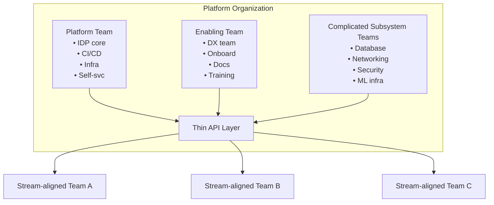
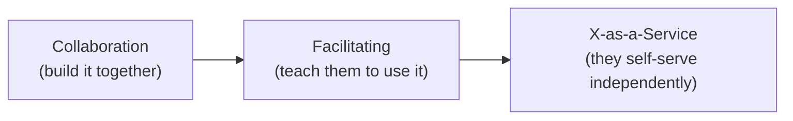
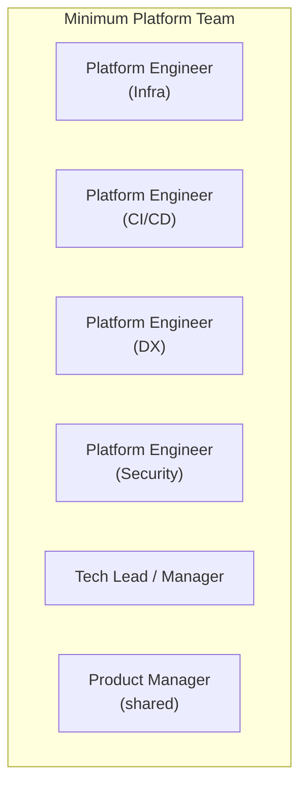
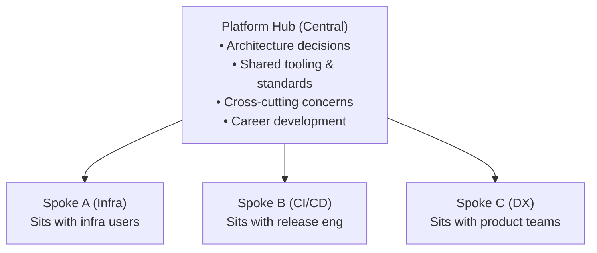

> **Discipline Module** | Complexity: `[ADVANCED]` | Time: 55-65 min

## Prerequisites

Before starting this module:
- **Required**: [Engineering Leadership Track](/platform/foundations/engineering-leadership/) — Stakeholder communication, ADRs, mentorship
- **Required**: [Systems Thinking Track](/platform/foundations/systems-thinking/) — Understanding feedback loops and emergent behavior
- **Recommended**: [SRE: What is SRE?](/platform/disciplines/core-platform/sre/module-1.1-what-is-sre/) — Team structures for operational disciplines
- **Recommended**: Experience working on or with infrastructure teams

---

## What You'll Be Able to Do

After completing this module, you will be able to:

- **Design a platform team structure with the right mix of skills across infrastructure, developer tooling, and SRE**
- **Build hiring criteria and interview processes that identify strong platform engineering candidates**
- **Implement team rituals and working agreements that foster collaboration with application teams**
- **Evaluate team effectiveness using DORA metrics, developer satisfaction, and platform adoption rates**

## Why This Module Matters

In 2019, a fintech company hired 12 platform engineers in three months. They had budget, executive sponsorship, and clear technical vision. Within a year, half the team had quit and the other half was running a glorified ticket queue.

The problem was not technical. They had hired backend engineers who were great at building distributed systems but had no interest in developer tooling. They organized the team as a service bureau — you file a ticket, we build it. Developers hated waiting, platform engineers hated being order-takers, and nobody was doing the strategic work of designing self-service abstractions.

**Building a platform team is an organizational design problem, not a hiring problem.** You need the right people, in the right structure, doing the right work. Get any one of those wrong and you'll spend millions building infrastructure nobody uses. This module gives you the frameworks to get all three right.

---

## Did You Know?

> The 2024 State of Platform Engineering report found that **78% of organizations have some form of platform team**, but only **34%** rate their platform as "successful." The gap is almost entirely about team design and organizational positioning, not technology choices.

> **Conway's Law** — "Organizations which design systems are constrained to produce designs which are copies of the communication structures of these organizations" — was published in 1967, but most companies still design their org chart without considering its impact on their architecture.

> **Spotify's "model"** was never meant to be copied. Henrik Kniberg, who documented squads, tribes, and guilds, has said publicly that the model was a snapshot of one moment in time, and that Spotify itself moved away from it. Yet companies still reorganize around "the Spotify model" without understanding the context.

> According to Team Topologies research, the **optimal cognitive load** for a single team is roughly what 7-9 people can own end-to-end. Platform teams that try to own "all infrastructure" for 500 developers inevitably collapse under the weight.

---

## Team Topologies for Platform Organizations

> **Stop and think**: Before reading further, how would you categorize the teams in your current organization? Do you have clear boundaries, or does everyone do a little bit of everything?

### The Four Team Types

Matthew Skelton and Manuel Pais defined four fundamental team types. Understanding these is essential for platform leaders because your platform organization will contain all four:

| Team Type | Purpose | Platform Context |
|-----------|---------|-----------------|
| **Stream-aligned** | Delivers value in a business domain | Application teams that consume your platform |
| **Enabling** | Helps stream-aligned teams adopt new capabilities | Platform evangelists, developer advocates |
| **Complicated subsystem** | Owns deep specialist knowledge | Database team, networking team, security team |
| **Platform** | Provides self-service capabilities | Your core platform team |

### How These Map to Platform Organizations



### Interaction Modes

Teams don't just exist — they interact. Team Topologies defines three interaction modes:

| Mode | Description | When to Use |
|------|-------------|-------------|
| **Collaboration** | Two teams working closely together | Discovery phase, new capabilities |
| **X-as-a-Service** | One team consumes another's API | Mature, well-understood capabilities |
| **Facilitating** | One team coaches another | Adoption of new tools or practices |

**Critical insight for platform leaders**: Most platform capabilities should evolve through these phases:



If you jump straight to X-as-a-Service, you build something nobody wants. If you stay in Collaboration forever, you don't scale.

---

## Conway's Law and Organizational Design

> **Pause and predict**: If Conway's Law is true, what happens when a tightly coupled organization tries to build a microservices architecture?

### The Law You Cannot Break

> "Any organization that designs a system will produce a design whose structure is a copy of the organization's communication structure." — Melvin Conway, 1967

This is not a suggestion. It is a force of nature. Your architecture will mirror your org chart whether you plan for it or not.

### The Inverse Conway Maneuver

Smart organizations use Conway's Law deliberately. Instead of letting org structure accidentally shape architecture, they design their org structure to produce the architecture they want.

| If You Want This Architecture... | ...Organize Teams Like This |
|----------------------------------|----------------------------|
| Microservices | Small, autonomous teams owning individual services |
| Shared platform + independent apps | Central platform team + stream-aligned teams |
| Modular monolith | Teams aligned to bounded contexts, shared codebase |
| Multi-cloud abstraction | Platform team that owns the abstraction layer |

### Real Example: The Accidental Monolith

A company had 4 development teams and 1 infrastructure team. The infra team owned all shared services: database, message queue, cache, logging.

The result? Every application used the same database cluster, the same Redis instance, the same Kafka topics. Not because it was the right architecture — because it was the only architecture their org chart could produce.

When they split the infrastructure team into embedded platform engineers (one per dev team) plus a thin shared-services layer, the architecture naturally evolved toward independent service ownership.

**Lesson**: If you want loosely coupled services, you need loosely coupled teams. If your platform team is a monolith, your platform will be too.

---

## Hiring Platform Engineers

> **Stop and think**: Think about the best tooling or infrastructure engineer you have worked with. Did they come from an operations background or a product development background?

### What Makes Platform Engineers Different

Platform engineers are not backend engineers who got bored. They are not ops engineers who learned to code. They are a distinct specialization that requires a specific combination of skills and mindset.

| Trait | Why It Matters |
|-------|---------------|
| **Empathy for developers** | Your users are internal — you must care about their experience |
| **Systems thinking** | Platform decisions cascade across the entire organization |
| **Comfort with ambiguity** | "Build the right thing" is harder than "build the thing right" |
| **Product mindset** | You are building a product, not running a service |
| **Teaching ability** | You succeed when others can do things without you |
| **Deep technical skill** | Kubernetes, CI/CD, IaC, networking, security — you need breadth and depth |
| **Patience with adoption** | Change happens slowly; you cannot force it |

### The Interview Framework

Traditional engineering interviews test algorithm skills and system design. For platform engineers, you need to also test for empathy, product thinking, and teaching ability.

**Round 1: Technical depth** (standard)
- System design: "Design a multi-tenant CI/CD platform"
- Coding: Infrastructure automation, API design
- Debugging: "This Kubernetes deployment is failing — walk me through diagnosis"

**Round 2: Platform thinking** (unique to platform roles)
- Scenario: "Three teams want conflicting things from the platform. How do you decide?"
- Design: "How would you build a self-service database provisioning system?"
- Trade-offs: "When would you NOT build a self-service feature?"

**Round 3: Empathy and communication**
- Role play: "I'm a frustrated developer. My deploy has been broken for 2 hours. Help me."
- Writing: "Write documentation for a feature you just designed"
- Teaching: "Explain Kubernetes networking to someone who's never used containers"

### Where to Find Platform Engineers

| Source | Quality | Notes |
|--------|---------|-------|
| Internal transfers from SRE/DevOps | High | Already know your context |
| Internal transfers from product engineering | High | Bring user empathy, may lack infra depth |
| External hires from platform companies | High | Proven experience, expensive |
| External hires from consulting | Medium | Broad experience, may lack depth |
| Junior engineers with platform interest | Medium | Need investment, high loyalty |
| Rebranded ops engineers | Low | Often lack product mindset — but not always |

**The best platform engineers often come from product teams.** They have the empathy and the frustration. They know what's broken because they've lived with it. Pair them with someone who has deep infrastructure skills and you have a powerful combination.

---

## Team Size and Skill Mix

> **Stop and think**: Looking at your current platform team, is the skill mix skewed too far toward pure infrastructure? Do you have engineers dedicated to developer experience?

### The Two-Pizza Rule (Adapted for Platforms)

Amazon's "two-pizza team" (6-8 people) applies to platform teams, but the skill mix is different:

**Minimum viable platform team (5-7 people)**:



### Scaling the Team

| Org Size | Platform Team Size | Structure |
|----------|--------------------|-----------|
| 20-50 devs | 2-3 platform engineers | One team, broad scope |
| 50-150 devs | 5-8 platform engineers | One team with specializations |
| 150-500 devs | 10-20 across 2-3 teams | Split by domain (infra, CI/CD, DX) |
| 500-1000 devs | 20-40 across 4-6 teams | Platform organization with enabling teams |
| 1000+ devs | 40+ across 6+ teams | Full platform division with sub-teams |

**Rule of thumb**: Platform teams should be roughly **10-15% of your engineering organization**, though this varies by platform maturity and ambition.

### Embedding vs Centralized

This is one of the most consequential decisions a platform leader makes.

| Model | Pros | Cons | Best For |
|-------|------|------|----------|
| **Fully centralized** | Consistent standards, efficient specialization | Disconnected from user needs, bottleneck | Early platform, small org |
| **Fully embedded** | Deep user understanding, fast response | Inconsistent practices, "captured" by teams | Mature org, high autonomy |
| **Hub and spoke** | Standards + context, scalable | Complex coordination, dual reporting | Most organizations at scale |
| **Rotating embed** | Fresh perspectives, knowledge sharing | Disruptive, relationship-building overhead | Medium orgs wanting best of both |

**The hub-and-spoke model** is the most common pattern for mature platform organizations:



---

## Case Studies

### Spotify: Squads, Tribes, and the Platform They Actually Built

What people think Spotify did: autonomous squads with no coordination.

What Spotify actually did: built a sophisticated internal platform (Backstage) to make squad autonomy possible.

**Key decisions**:
- **Autonomous squads** needed **shared infrastructure** — you cannot have 200 teams each building their own CI/CD
- **Backstage** (now open source) started as Spotify's internal developer portal, solving the "where is everything?" problem
- **Golden paths** provided opinionated defaults — squads could deviate, but most chose the easy path
- **Platform was optional** — squads were never forced to use it, which meant the platform had to be genuinely good

**Lesson**: Autonomy requires a platform. Without shared infrastructure, autonomy becomes chaos.

### Netflix: The Paved Road

Netflix does not have a "platform team" in the traditional sense. Instead, they have multiple infrastructure teams that each own a piece of the developer experience:

- **Cloud infrastructure**: AWS abstraction
- **Build/deploy**: Spinnaker (which they open-sourced)
- **Data platform**: Real-time and batch processing
- **Developer productivity**: IDE tools, local development

**Key decisions**:
- **"Paved road" philosophy**: We build the best path. You can go off-road, but you own the consequences
- **High freedom, high responsibility**: Teams choose their own languages, frameworks, and patterns — but they operate what they build
- **Context over control**: Instead of mandates, Netflix provides rich context (memos, documentation, data) so teams make informed choices
- **Senior-heavy hiring**: Netflix hires experienced engineers who need less guidance, which enables more autonomy

**Lesson**: If you hire senior enough people and give them excellent tooling, you need less governance.

### Google: The Original Platform Organization

Google's infrastructure is arguably the first modern platform organization, though they did not call it that:

- **Borg** (precursor to Kubernetes): Centralized cluster management
- **Blaze/Bazel**: Unified build system
- **Stubby/gRPC**: Standard RPC framework
- **Bigtable, Spanner, etc.**: Managed storage services

**Key decisions**:
- **Mandate standard infrastructure**: At Google's scale, heterogeneity is unmanageable
- **Invest in deep abstractions**: Engineers do not manage servers, they describe workloads
- **Dedicated infrastructure teams**: Thousands of engineers work on internal platforms
- **Monorepo**: A single codebase enforces consistency and enables tooling

**Lesson**: At sufficient scale, mandated platforms become necessary — but only if the platform is excellent.

### The Pattern Across All Three

| | Spotify | Netflix | Google |
|-|---------|---------|--------|
| **Adoption model** | Optional | Optional (paved road) | Mandatory |
| **Team autonomy** | High | Very high | Medium |
| **Platform investment** | High | High | Very high |
| **Developer count** | ~2,000 | ~2,500 | ~30,000+ |
| **Key insight** | Portal for discoverability | Context over control | Abstractions at scale |

---

## Common Anti-Patterns

> **Pause and predict**: Which of these four anti-patterns is most prevalent in your current organization?

### Anti-Pattern 1: The Ticket Queue

**Symptom**: Platform team operates as a service bureau. Developers file tickets, platform team executes.

**Why it happens**: Easier than building self-service. Feels productive (look at all these tickets we closed!).

**Why it fails**: Does not scale. Platform engineers become order-takers instead of building leverage. Developers wait instead of moving fast.

**Fix**: For every ticket type that comes in more than 3 times per month, build a self-service solution.

### Anti-Pattern 2: The Ivory Tower

**Symptom**: Platform team builds technically impressive infrastructure that nobody asked for.

**Why it happens**: Engineers love interesting problems. Building the perfect abstraction is more fun than talking to users.

**Why it fails**: Nobody adopts it. Developers work around it. Money wasted.

**Fix**: Mandatory user research before every major initiative. No project starts without talking to at least 5 developers.

### Anti-Pattern 3: The Reorg Carousel

**Symptom**: Platform team restructures every 6-12 months. New leader, new strategy, new priorities.

**Why it happens**: Lack of clear metrics for success. Each new leader has a different vision.

**Why it fails**: No initiative reaches maturity. Institutional knowledge is lost. Trust erodes.

**Fix**: Define success metrics (adoption rate, developer satisfaction, time-to-production) and evaluate against them before restructuring.

### Anti-Pattern 4: The Accidental Platform Team

**Symptom**: A team that started as "DevOps" or "infrastructure" gradually becomes a platform team without acknowledging the transition.

**Why it happens**: Organic growth. Somebody built a CI/CD pipeline, then a deployment tool, then a portal...

**Why it fails**: No product management. No user research. No intentional design. Just accumulated tools.

**Fix**: Acknowledge the transition. Hire or appoint a product manager. Define your platform's scope and users.

---

## Hands-On Exercises

### Exercise 1: Team Topology Mapping (45 min)

Map your current organization using Team Topologies:

**Step 1**: List all teams that interact with infrastructure or platform services.

**Step 2**: Classify each team:
```text
┌──────────────────────────────────────────────────────────┐
│ Team Name:                                               │
│ Type: [ ] Stream-aligned  [ ] Platform                   │
│       [ ] Enabling        [ ] Complicated Subsystem      │
│                                                          │
│ Current interaction modes:                               │
│ With [Team X]: [ ] Collaboration  [ ] X-as-a-Service     │
│                [ ] Facilitating                           │
│                                                          │
│ Desired interaction mode (in 6 months):                  │
│ With [Team X]: [ ] Collaboration  [ ] X-as-a-Service     │
│                [ ] Facilitating                           │
│                                                          │
│ Cognitive load (1-5): ___                                │
│ Biggest pain point:                                      │
└──────────────────────────────────────────────────────────┘
```

**Step 3**: Identify mismatches:
- Teams doing platform work but classified as stream-aligned?
- Collaboration modes that should have evolved to X-as-a-Service?
- Teams with cognitive load > 3 that need enabling support?

**Step 4**: Draft a target topology for 6 months from now.

### Exercise 2: Platform Engineer Job Description (30 min)

Write a job description for your next platform engineering hire. Include:

1. **Role context**: What the team builds, who they serve, what stage they are at
2. **Key responsibilities**: 5-7 bullets that emphasize product thinking, not just technical skills
3. **Required skills**: Technical depth + empathy + communication
4. **Interview process**: At least one round that tests user empathy
5. **What success looks like**: 30/60/90 day milestones

Compare your draft against this checklist:
- [ ] Does it mention "developer experience" or "user experience"?
- [ ] Does it include product/empathy skills, not just technical?
- [ ] Would a talented backend engineer understand this is a different role?
- [ ] Does it honestly describe challenges, not just opportunities?

### Exercise 3: Conway's Law Audit (30 min)

Analyze Conway's Law in your organization:

1. **Draw your org chart** (teams and reporting lines)
2. **Draw your system architecture** (services and dependencies)
3. **Overlay them**: Where does org structure mirror system structure?
4. **Identify friction**: Where does your architecture fight your org chart?
5. **Propose changes**: Would reorganizing one team improve your architecture?

Document your findings:
```text
Conway's Law Audit - [Date]
═══════════════════════════

Current org structure creates:
  [+] Good alignment: [examples]
  [-] Poor alignment: [examples]

Architecture changes blocked by org structure:
  1. [example]
  2. [example]

Proposed org change:
  [What] → [Expected architecture improvement]
```

---

## War Story: The Platform Team That Built Itself Into a Corner

**Company**: Mid-size SaaS company, ~300 engineers, Series D

**Situation**: The "Developer Productivity" team (6 people) had been building internal tools for 2 years. They had built a custom CI/CD system, a deployment tool, an internal Kubernetes abstraction, and a developer portal. All technically impressive. All tightly coupled to each other.

**The problem**: When they tried to hire their 7th and 8th engineers, nobody could onboard. The system had grown organically with no documentation, no API boundaries, and no clear ownership model. The original 6 engineers each had their own domain in their head, but it was not written down anywhere.

**Timeline**:
- **Month 1-2**: New hires shadow existing team members. Learning is slow because there is no documentation and the architecture is not modular enough to work on independently.
- **Month 3**: First new hire makes a change to the CI system that breaks the deployment tool. Nobody predicted this coupling.
- **Month 4**: Team lead realizes they need to stop building features and invest in platform architecture. Leadership pushes back: "We hired new people to go faster, not slower."
- **Month 6**: One of the original 6 engineers burns out and leaves. Critical knowledge walks out the door.
- **Month 8**: After painful rearchitecting, the team splits into 2 sub-teams with clear API boundaries. Onboarding drops from 3 months to 3 weeks.

**Business impact**: 6 months of near-zero feature delivery. One key departure. $800K+ in lost productivity.

**Root cause**: They built the team like a startup (move fast, everyone knows everything) but tried to scale it like a mature organization. The transition point — around 6-8 people — is where informal knowledge sharing breaks down and you need explicit architecture, documentation, and boundaries.

**Lessons**:
1. **Document before you need to**: If only one person understands a system, you have a bus-factor problem
2. **Design for replaceability**: Every component should be ownable by someone who did not build it
3. **Modularize at 5-6 people**: This is the inflection point where informal coordination stops working
4. **Invest in onboarding**: The time you spend on onboarding material pays back every single hire

---

## Knowledge Check

### Question 1
Scenario: Your organization has 200 developers and a 4-person platform team that's overwhelmed. They spend 80% of their time on tickets. What's your first move?

<details>
<summary>Show Answer</summary>

Analyze the ticket queue to find the top 3-5 most common request types. Then build self-service solutions for those specific request types. The goal is to shift from executing requests to eliminating them. You also need to grow the team — 4 people for 200 developers is understaffed (2% vs the recommended 10-15%). However, hiring alone will not fix the problem if the team model is a ticket queue, so you must fix the model first, then scale.

</details>

### Question 2
Scenario: You have been hired to restructure a 500-person engineering department. You need to map the existing teams to the Team Topologies model to identify gaps. During this exercise, you find a team that solely manages the Kafka clusters and another team that writes the core application features. How would you classify these teams, and what other team types must exist to complete a mature platform organization?

<details>
<summary>Show Answer</summary>

The team managing Kafka clusters is a Complicated Subsystem team, as they own deep specialist knowledge. The team writing application features is a Stream-aligned team delivering business value. To complete the structure, you need a Platform team providing self-service capabilities (like the CI/CD pipeline) and an Enabling team helping the Stream-aligned teams adopt new tools. Without all four types correctly identified and scoped, you risk misaligning responsibilities and creating bottlenecks.

</details>

### Question 3
Scenario: Your VP of Engineering just returned from a conference and announces that the entire engineering department will be reorganizing into 'squads, tribes, and guilds' by next quarter to emulate the 'Spotify model.' As the platform lead, how do you respond to ensure this reorganization does not harm developer productivity?

<details>
<summary>Show Answer</summary>

Push back constructively by explaining that the 'Spotify model' was a snapshot of a single point in time, and even Spotify evolved past it. What actually made their squads effective was the massive investment in developer tooling like Backstage, which enabled true autonomy. Copying an organizational structure without understanding the context and the underlying platform requirements will lead to chaos, as Conway's Law works both ways. Instead, propose using frameworks like Team Topologies to design a structure that addresses your specific internal bottlenecks and architectural goals.

</details>

### Question 4
Scenario: You are hiring your first platform engineer. You have two final candidates: one is a brilliant infrastructure engineer with deep Kubernetes expertise but has never worked on developer-facing tools. The other is a solid (not exceptional) backend engineer who previously built internal developer tooling and has strong communication skills. Who do you hire?

<details>
<summary>Show Answer</summary>

Hire the backend engineer with developer tooling experience. Platform engineering is fundamentally about building products for other engineers, and user empathy is much harder to teach than Kubernetes administration. The infrastructure expert might build technically impressive systems that no one wants to use, while the tooling engineer will build things developers actually adopt. You can pair them with infrastructure depth later through documentation, pairing, or subsequent hires, but losing developer trust early on will doom the platform.

</details>

### Question 5
Scenario: Your platform team has been in 'collaboration mode' with the payments team for 8 months, jointly developing a new deployment pipeline. The payments team loves it, but two other product teams are now waiting for the exact same capability. What do you do?

<details>
<summary>Show Answer</summary>

It is time to transition from Collaboration to X-as-a-Service. Eight months of collaboration means you should have learned enough to generalize the solution. First, extract the payments-specific parts from the general capability and build a self-service interface that does not require platform team involvement. Finally, move to Facilitating mode with the next two teams—help them adopt the self-service tool rather than building it with them. Setting a deadline for fully transitioning payments to the self-service model will ensure the platform team can scale its impact.

</details>

### Question 6
Scenario: Your company's flagship product is a monolithic application maintained by a single, massive engineering department. Leadership wants to break it down into independent microservices over the next year to speed up deployments, but they plan to keep the single massive engineering department intact during the transition. Based on Conway's Law, what is likely to happen, and what maneuver should you suggest instead?

<details>
<summary>Show Answer</summary>

The microservices migration is highly likely to fail or result in a 'distributed monolith' because the organizational structure still communicates as a single, tightly coupled entity. To fix this, you should suggest the Inverse Conway Maneuver, which involves deliberately designing your organizational structure to produce the architecture you want. By breaking the massive engineering department into small, autonomous teams first, you force the communication patterns to match the desired loosely coupled architecture. This proactive reorganization ensures the technical architecture naturally follows the new communication boundaries.

</details>

### Question 7
Scenario: Your platform team has grown to 30 engineers supporting 300 developers. You initially structured them as a fully centralized team, but stream-aligned teams complain the platform is disconnected from their daily needs. Some managers suggest embedding all platform engineers directly into the product teams. Why is this a risky overcorrection, and what model should you implement instead?

<details>
<summary>Show Answer</summary>

Moving to a fully embedded model is a risky overcorrection because you will lose consistent standards, shared tooling, and centralized career development for platform engineers. Instead, you should implement a hub and spoke model to combine the benefits of both approaches. The central hub maintains the architectural vision and core shared tools, while the spokes sit directly with product or release teams to maintain deep user context and provide fast responses. This prevents the platform team from becoming a centralized bottleneck while also avoiding the fragmentation and 'capture' of fully embedded engineers.

</details>

### Question 8
Scenario: Your platform team just launched a new self-service database provisioning feature, but only 2 out of 15 teams are using it after 3 months. The feature works perfectly from a technical standpoint. What went wrong?

<details>
<summary>Show Answer</summary>

The low adoption rate most likely stems from a failure in product management rather than technical execution. You may have skipped user research and built what you assumed developers needed, rather than what they actually wanted. Alternatively, the feature might suffer from poor discoverability, missing documentation, or a switching cost that is too high to justify leaving their existing workarounds. To fix this, you must conduct user interviews to identify the exact root cause. If it is a discoverability issue, invest in internal marketing; if it is a poor product-market fit, re-evaluate the feature's core value proposition.

</details>

---

## Summary

Building effective platform teams requires three things: the right people (empathetic engineers with product mindset), the right structure (team topologies matched to your architecture goals), and the right work model (self-service over ticket queues).

Key principles:
- **Conway's Law is real**: Your org chart shapes your architecture whether you plan for it or not
- **Team Topologies provides the vocabulary**: Platform, Enabling, Complicated Subsystem teams each play a role
- **Interaction modes evolve**: Collaboration to Facilitating to X-as-a-Service
- **Hire for empathy**: Technical skills can be taught; caring about developer experience cannot
- **Scale intentionally**: The informal patterns that work at 5 people break at 10

---

## What's Next

Continue to [Module 1.2: Developer Experience Strategy](../module-1.2-developer-experience/) to learn how to measure and improve the experience your platform provides.

---

*"You don't build platforms for engineers. You build platforms with engineers, for the organization."*