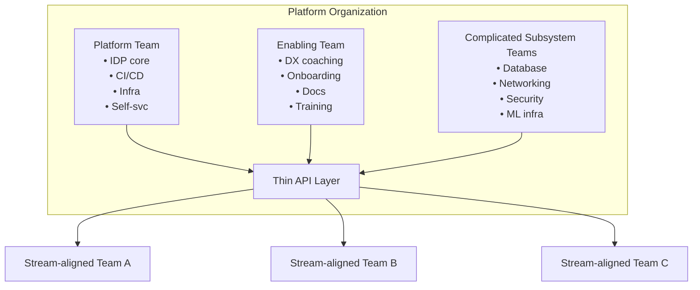
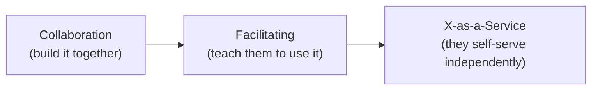
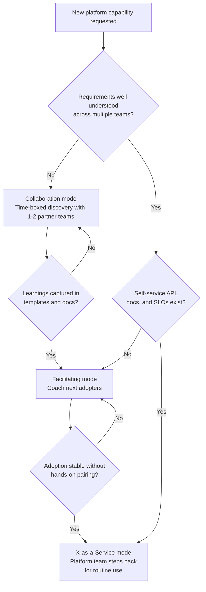

> **Discipline Module** | Complexity: `[ADVANCED]` | Time: 55-65 min

## Prerequisites

Before starting this module:
- **Required**: [Engineering Leadership Track](/platform/foundations/engineering-leadership/) — Stakeholder communication, ADRs, mentorship
- **Required**: [Systems Thinking Track](/platform/foundations/systems-thinking/) — Understanding feedback loops and emergent behavior
- **Recommended**: [SRE: What is SRE?](/platform/disciplines/core-platform/sre/module-1.1-what-is-sre/) — Team structures for operational disciplines
- **Recommended**: Experience working on or with infrastructure teams

---

## What You'll Be Able To Do

After completing this module, you will be able to:

- **Design a platform team structure with the right mix of skills across infrastructure, developer tooling, and SRE**
- **Build hiring criteria and interview processes that identify strong platform engineering candidates**
- **Implement team rituals and working agreements that foster collaboration with application teams**
- **Evaluate team effectiveness using DORA metrics, developer satisfaction, and platform adoption rates**

## Why This Module Matters

**Hypothetical scenario:** A mid-size product organization hires roughly a dozen platform engineers in one quarter. Leadership has budget, executive sponsorship, and a clear technical vision for an internal developer platform. Within a year, half the team has left and the remainder spends most of its time closing tickets instead of building reusable capabilities. The hires were strong backend engineers, but few wanted to own developer-facing products, and the team was organized as a service bureau where application teams filed requests and waited.

The failure was not Kubernetes expertise or cloud architecture. It was organizational design: the wrong people in the wrong structure doing the wrong kind of work. Platform teams that behave like shared-services ticket queues cannot reduce cognitive load for stream-aligned teams, and stream-aligned teams respond by building shadow tooling that fragments the estate further. [Matthew Skelton and Manuel Pais argue in *Team Topologies* that platform teams exist to provide internal services that reduce the extraneous cognitive load on product teams](https://teamtopologies.com/), which only works when the platform team is positioned as an enabling, product-minded partner rather than a gatekeeper.

**Building a platform team is an organizational design problem before it is a hiring problem.** You need people who can treat internal developers as customers, a topology that matches your architectural goals, and interaction modes that default to self-service rather than perpetual pairing. This module teaches those durable design choices using frameworks you can cite in architecture reviews and headcount planning conversations, without pretending that org design has a single universal template.

> **The Platform Team Analogy**
>
> Think of a platform team like municipal road maintenance rather than a custom garage for every driver. A good roads department paves predictable routes, posts clear signage, and fixes potholes on shared paths so millions of trips do not require a escort. A bad one makes every neighborhood request a bespoke construction project. Developers notice the difference immediately in time-to-production, not in slide decks.

---

## Team Topologies for Platform Organizations

Before you draw boxes on an org chart, you need a vocabulary for what each box is supposed to do. [Team Topologies defines four fundamental team types and three interaction modes between them](https://teamtopologies.com/key-concepts), and platform leaders use that vocabulary to explain why a database guild is not the same thing as a platform team even when both touch PostgreSQL. Stream-aligned teams deliver continuous flow of change aligned to a stream of work—usually a product, customer journey, or business capability—and they are the reason the platform exists. Platform teams provide internal services that reduce the cognitive load on stream-aligned teams through well-documented APIs, paved paths, and self-service interfaces. Enabling teams help stream-aligned teams acquire missing capabilities, often temporarily, through coaching and facilitation rather than permanent ownership. Complicated-subsystem teams hold deep specialist knowledge for subsystems that would overload a generalist stream-aligned team, such as low-latency trading engines, specialized ML inference stacks, or regulated cryptography modules.

Your platform organization will contain all four types even if your headcount plan only mentions one "platform team" line item. The platform team itself is the internal product group that turns repetitive infrastructure work into consumable capabilities. Enabling functions—developer experience research, adoption coaching, technical writing—may live inside the platform team early on and spin out as enabling teams once the organization crosses roughly one hundred to one hundred fifty developers, depending on domain complexity. Complicated-subsystem teams often pre-exist the platform team in mature enterprises; the platform team's job is to integrate their capabilities behind stable interfaces rather than forcing every stream-aligned team to become a database expert. When leaders skip this mapping exercise, they accidentally assign platform accountability to teams that are structurally stream-aligned, which produces the familiar pattern of product squads owning CI pipelines forever because nobody else will.

```mermaid
graph TD
    subgraph PO[Platform Organization]
        PT["Platform Team<br/>• IDP core<br/>• CI/CD<br/>• Infra<br/>• Self-svc"]
        ET["Enabling Team<br/>• DX coaching<br/>• Onboarding<br/>• Docs<br/>• Training"]
        CST["Complicated Subsystem Teams<br/>• Database<br/>• Networking<br/>• Security<br/>• ML infra"]
        API[Thin API Layer]
        
        PT --> API
        ET --> API
        CST --> API
    end
    
    API --> SA["Stream-aligned Team A"]
    API --> SB["Stream-aligned Team B"]
    API --> SC["Stream-aligned Team C"]
```

The diagram is intentionally simplified: real enterprises have federation boundaries, vendor-operated subsystems, and legacy systems that do not fit neat boxes. The design question is not whether your diagram is perfect but whether every team can name its primary type, its customers, and the interfaces it exposes. Platform teams that cannot articulate their team API—supported capabilities, ownership boundaries, on-call expectations, documentation entry points, and service expectations— tend to become implicit gatekeepers because the only way to get work done is to know someone on Slack.

### Interaction modes and the default path to X-as-a-Service

Teams do not only have a charter; they have a relationship mode with other teams. [Collaboration mode means two teams work closely together for a bounded period, typically when discovering a new capability or exploring unfamiliar constraints](https://teamtopologies.com/key-concepts). X-as-a-Service mode means one team consumes another team's offering through a stable interface with minimal ongoing coordination, which is how mature platform capabilities should behave for most stream-aligned teams most of the time. Facilitating mode means one team temporarily helps another team learn a new practice or adopt a tool without taking permanent ownership of the outcome, which is the natural posture of enabling teams and of platform teams during rollouts.

Platform leaders should treat interaction mode as a lifecycle rather than a personality trait. A new deployment pipeline might begin in collaboration with one stream-aligned team so platform engineers learn real constraints. It should shift to facilitating mode with the next two teams that adopt it. It should end in X-as-a-Service mode once documentation, SLOs, and self-service APIs make platform involvement optional for routine work. Staying in collaboration mode forever feels friendly but hides scaling failure: the platform team becomes the bottleneck for every change. Jumping straight to X-as-a-Service without discovery produces elegant abstractions that do not match developer workflows, which is the ivory-tower failure mode described later in this module.

```mermaid
graph LR
    C["Collaboration<br/>(build it together)"] --> F["Facilitating<br/>(teach them to use it)"]
    F --> X["X-as-a-Service<br/>(they self-serve independently)"]
```

The critical leadership discipline is to time-box collaboration. When a joint effort exceeds roughly one to two quarters without a credible self-service path, executives should ask whether the platform team is doing product discovery or accidentally becoming a staff-augmentation vendor for a favored product squad. Facilitating mode is often under-invested because it does not feel as heroic as building features, yet it is what converts a bespoke pipeline into organizational leverage.

---

## Conway's Law and the Inverse Conway Maneuver

[Melvin Conway observed in 1968 that organizations design systems whose structures mirror their communication paths](https://www.melconway.com/Home/Conways_Law.html). The observation is empirically durable: if only one infrastructure group may touch the message broker, you will get one shared cluster whether or not that matches domain boundaries. [Martin Fowler's summary of Conway's Law stresses that the mirroring effect is not optional governance—it emerges from how people coordinate when they build software](https://martinfowler.com/bliki/ConwaysLaw.html). Platform leaders who ignore Conway's Law often publish microservices strategies while keeping a monolithic org chart, then wonder why services remain tangled and deployments require company-wide change windows.

The Inverse Conway Maneuver, described by [ThoughtWorks and others in the Team Topologies literature](https://teamtopologies.com/key-concepts), flips the causality deliberately: you shape teams and communication paths to produce the architecture you want rather than accepting accidental coupling. If you want independently deployable services aligned to business capabilities, you create stream-aligned teams with ownership of those services and give them platform-backed ways to provision dependencies without central tickets. If you want a shared internal platform with consistent security and observability baselines, you fund a platform team with authority to publish paved paths while stream-aligned teams retain product autonomy inside those guardrails.

| If you want this architecture… | …organize teams like this |
|--------------------------------|---------------------------|
| Microservices with clear ownership | Small stream-aligned teams owning individual services end-to-end |
| Shared platform plus independent apps | Platform team publishing self-service capabilities to stream-aligned teams |
| Modular monolith | Teams aligned to bounded contexts with explicit module interfaces |
| Portable multi-cloud abstractions | Platform team owning the abstraction layer and migration tooling |

**Hypothetical scenario:** An organization maintains four application teams and one centralized infrastructure team that owns shared database, messaging, and caching services. Every application depends on the same clusters not because domain experts chose that design in architecture review, but because the infra team's communication hub made shared components the path of least resistance. When leadership later embeds platform engineers with each application team and keeps a thin shared-services layer for truly common concerns, service boundaries begin to align with team boundaries over subsequent quarters without a big-bang rewrite.

The lesson for platform hiring and roadmaps is direct: if your platform team is structurally a monolith, your platform architecture will resist decomposition until you split ownership and interfaces. Conway's Law also explains why "shadow IT" appears after platform failures—stream-aligned teams recreate communication paths that match their delivery needs when official paths are too slow.

---

## Cognitive Load as the Central Design Constraint

Educational psychologist John Sweller's cognitive load theory distinguishes three loads that platform designers should keep separate in planning conversations. Intrinsic load is the inherent difficulty of the task itself, such as reasoning about distributed consistency or financial regulations. Extraneous load is friction imposed by poor tooling, unclear documentation, or organizational coordination overhead that adds no learning value. Germane load is productive effort that builds durable skill and better mental models. Platform teams exist to shrink extraneous load for stream-aligned teams so developers can spend working memory on domain problems rather than on undifferentiated heavy lifting such as manually wiring ingress, cert rotation, or baseline observability for every new service.

[Cognitive load is a first-class design constraint in Team Topologies](https://teamtopologies.com/key-concepts), which recommends sizing teams so they can own a bounded set of concerns with clear interfaces. When a platform team tries to own "all infrastructure" for hundreds of developers, extraneous load explodes inside the platform team itself: on-call pages multiply, context switching becomes constant, and engineers cannot maintain mental models of every consumer workflow. The resulting quality drop increases extraneous load for customers too, because opaque platform behavior forces developers to read source code or chase Slack approvals.

Platform leaders should measure cognitive load indirectly before they pretend to measure it precisely. Long onboarding times for new services, repeated questions in the same Slack channel, and developers maintaining personal runbooks for standard tasks are all signals that extraneous load is leaking backward from the platform. Germane load is not the enemy—learning Kubernetes deeply might be germane for a platform engineer—but forcing every product developer to learn cluster internals for a routine deploy is extraneous load you should eliminate with a paved path.

Reducing extraneous load is not the same as removing all decisions. Good platforms encode opinionated defaults while documenting escape hatches for teams with genuine special requirements. The failure mode is either extreme: a platform that exposes every low-level knob recreates infrastructure team toil inside product squads, while a platform that hides all knobs until something breaks creates learned helplessness and rage during incidents.

---

## The Platform Team API, Sizing, and Ownership

Skelton and Pais extend the idea of service APIs to **team APIs**: explicit descriptions of what a team provides, how to engage them, what response times to expect, and what is out of scope. A platform team API might document self-service links for golden-path service creation, office hours for design consultations, on-call scope for managed control planes, and SLAs for breaking changes to shared templates. Without a team API, stream-aligned teams infer rules from tribal knowledge, which guarantees inconsistent treatment and hidden gatekeeping when busy platform engineers shortcut requests they like and deprioritize others.

Team sizing follows from cognitive load boundaries rather than from vanity ratios. A platform team of roughly seven to nine people can own a coherent slice of capabilities when interfaces are clear and on-call is sustainable; adding people without splitting ownership domains usually increases coordination overhead faster than throughput. Illustrative staffing patterns—not prescriptive industry statistics—often show platform engineering headcount growing toward roughly ten to fifteen percent of total engineering population in organizations with ambitious internal platforms, but a two-person platform team can be appropriate for fifty developers if scope is narrow and paved paths are few.

Ownership models must answer who runs the platform's platform: who owns Terraform modules, who owns the IDP catalog schema, who owns breaking changes to templates, and who pays down internal technical debt when self-service APIs sprawl. Many organizations split **product ownership** (prioritization, roadmap, developer research) from **production ownership** (SLOs, incident response, capacity), but the labels matter less than clarity. Ambiguous ownership produces the accidental platform team anti-pattern where tools accumulate without a product manager, adoption plan, or deprecation policy.

On-call for platform teams should cover shared control planes and managed services the team operates, not every application incident caused by misconfigured consumer YAML. When platform on-call becomes "all infra pages," extraneous load returns through the back door and platform engineers burn out the same way traditional ops teams did. Define paging policies that distinguish platform defects from consumer misconfiguration, provide fast feedback loops for misconfiguration (linting, policy checks, actionable errors), and publish runbooks that stream-aligned teams can execute without waiting for a human router.

---

## Platform Team vs Shared Services and Gatekeeper Anti-Patterns

[Evan Bottcher defines a digital platform as a foundation of self-service APIs, tools, services, knowledge, and support arranged as a compelling internal product](https://martinfowler.com/articles/talk-about-platforms.html)—the opposite of a thick shared-services queue that merely centralizes toil. A shared services operations group that executes change requests through tickets may look like a platform team on paper but behaves like a cost center queue. The difference shows up in default interaction mode: shared services default to "ask us and wait," while platform teams default to "here is the API, docs, and golden path; we collaborate only during discovery."

Gatekeeper platforms insert mandatory human approval into routine workflows—every namespace, every deploy, every database—often for legitimate security reasons that were implemented as people instead of policy. Gatekeeping creates visible control at the expense of flow, and it trains developers to route around the platform. Ivory-tower platforms skip gatekeeping but still fail when they build impressive technology without continuous user research; adoption stays low because switching costs exceed benefits.

[The CNCF TAG App Delivery platform engineering whitepaper emphasizes platforms as curated experiences that improve developer productivity and operational excellence](https://tag-app-delivery.cncf.io/whitepapers/platforms/), which requires feedback loops with customers rather than purely internal technical milestones. Platform teams that measure success only by uptime of internal clusters miss half the job: a highly available tool nobody uses still wastes organizational attention and budget.

Security partnership should begin at design time rather than at approval time. Platform teams that embed policy checks, secure defaults, and threat-modeling office hours into golden paths reduce the need for human gatekeepers while still satisfying audit requirements. When security teams only appear as blockers at the end of a workflow, stream-aligned teams learn to hide work until the last minute, which increases risk rather than reducing it.

Documentation and technical writing are force multipliers for platform leverage. A self-service API without examples, error catalogs, and migration guides becomes a ticket generator no matter how elegant the backend is. Platform teams should budget writer time or engineer time explicitly reserved for docs the same way they budget on-call rotations, because documentation debt shows up later as repeated Slack questions and fragile tribal knowledge.

---

## Embedding, Centralization, and the Hub-and-Spoke Compromise

Early platform teams are often fully centralized because consistency is easier when everyone sits together and the customer base is small enough to know by name. Fully embedded models place platform engineers inside each product team, which improves empathy and response time but erodes shared standards when every squad forks templates and pipeline logic. Most organizations that grow past roughly one hundred fifty developers converge toward hub-and-spoke arrangements unless regulatory constraints force strict central control.

In a hub-and-spoke model, the hub publishes the team API, core templates, architectural principles, and career framework for platform work, while spokes embed engineers with major product areas for discovery and feedback. Dual reporting lines fail when incentives conflict, so spokes should be dotted-line embedded for context while the hub owns performance standards and roadmap allocation. Without that clarity, embedded engineers become captive staff augmentation for the loudest product director.

Rotating embed assignments can refresh context and spread knowledge, but rotation without documentation destroys continuity. If every embed rebuilds relationships from zero without updating paved paths, the organization feels responsive while repeating the same discoveries quarterly. Pair rotations with explicit handoff rituals and updates to the team API so insights compound rather than evaporate.

Illustrative sizing patterns suggest platform headcount often lands between ten and fifteen percent of total engineering population when internal platforms are strategic, but a smaller ratio works when scope is narrow and legacy constraints limit paved-path coverage. Ratios are planning heuristics, not benchmarks to defend in budget meetings as if they were industry law. The actionable question is whether stream-aligned teams still perform undifferentiated heavy lifting that the platform could absorb next quarter.

---

## Staffing, Roles, and Hiring Platform Engineers

Platform engineering is a distinct specialization, not a rebranded ops role and not a backend team exiled to Kubernetes. Strong candidates combine deep technical breadth with product empathy: they enjoy making other engineers successful, they can explain trade-offs in writing, and they prefer leverage over heroics. A minimum viable platform team often blends infrastructure engineering, CI/CD and release automation, developer experience advocacy, security partnership, technical leadership, and product management—even if some roles are fractional at first.

| Role focus | Primary contribution | Common failure if missing |
|------------|---------------------|---------------------------|
| Platform / infra engineering | Reliable control planes, IaC, runtime abstractions | Pretty portal atop brittle foundations |
| CI/CD and release engineering | Repeatable pipelines, promotion, rollback | Manual deploy heroes per team |
| Developer experience | Research, docs, onboarding, feedback loops | Tools built for platform engineers only |
| Security partnership | Guardrails, policy-as-code, threat modeling | Bolt-on approvals and gatekeeping |
| Product management | Prioritization, adoption metrics, roadmap | Perpetual ticket queue without strategy |
| Technical leadership | Architecture coherence, team API, hiring bar | Fragmented tools and unclear boundaries |

Generalists who can span infra and developer-facing APIs are precious early hires; specialists become more valuable as the internal platform surface area grows and on-call domains must split. Internal transfers from product engineering often bring user empathy and credible frustration with current tools; internal transfers from SRE or traditional ops bring production discipline. Either profile can succeed with intentional pairing and mentorship rather than assuming one background is universally superior.

### Interview design that tests platform thinking

Traditional algorithm-heavy interviews under-select for platform work. Structured interviews should still test technical depth—design a multi-tenant CI service, debug a failing deployment, review infrastructure code—but must add scenarios about conflicting stakeholder requests, build-vs-buy decisions, and teaching ability. A role-play where the candidate helps a frustrated developer triage a broken deploy reveals communication skills that whiteboard puzzles miss. A written exercise asking for documentation of a feature design reveals whether the candidate can reduce extraneous load for the next engineer.

Hire for empathy and learning velocity when forced to choose between a brilliant infra expert who dismisses internal users and a solid engineer who has built internal tools and communicates clearly. Deep Kubernetes knowledge can be added through pairing; regaining developer trust after a condescending platform interaction takes quarters. Subsequent hires can deepen specialist skills once the team API and paved paths exist.

---

## Measuring Platform Team Effectiveness

Platform teams need metrics that connect internal product work to organizational outcomes, not vanity counts of tickets closed or clusters provisioned. [DORA's four keys—deployment frequency, lead time for changes, change failure rate, and failed deployment recovery time—remain the standard delivery performance lens](https://dora.dev/), and platform leaders should compare teams consuming the platform against similar teams that do not yet consume it, rather than celebrating org-wide averages that hide regressions.

Developer satisfaction complements DORA because delivery speed without satisfaction usually indicates burnout or quality shortcuts. [The DevEx framework articulated by Abi Noda, Margaret-Anne Storey, Nicole Forsgren, and Michaela Greiler connects feedback loops, cognitive load, flow, and other socio-technical factors to measurable developer experience](https://doi.org/10.1145/3595878). Lightweight quarterly surveys with a mix of Likert-scale trends and open-ended friction questions outperform annual HR surveys that arrive too late to guide roadmaps.

Platform adoption metrics should track meaningful usage, not logins. Count services created through golden paths, percentage of deploys using standard pipelines, time from idea to first production deploy for new teams, and repeat requests that indicate self-service gaps. An adoption plateau with high satisfaction may mean the platform serves early adopters well; a adoption climb with falling satisfaction may mean you forced migration before quality caught up.

| Signal type | Example measures | Interpretation caution |
|-------------|------------------|------------------------|
| Delivery performance | DORA metrics by team and platform cohort | Compare like teams; avoid punishing legacy constraints |
| Developer sentiment | Survey trends, interview themes, support tone | Qualitative samples need structured synthesis |
| Adoption depth | Golden-path usage, template reuse, API calls | Raw counts without workflow context mislead |
| Operational health | Platform SLOs, incident rates, toil hours | Uptime alone ignores unused platforms |

Review metrics in public rituals with stream-aligned partners so the platform team cannot optimize locally at the expense of customers. When DORA improves but open-ended survey comments mention new YAML burdens, you have traded one extraneous load for another and should adjust the paved path.

---

## Team Rituals and Working Agreements with Application Teams

Tools do not replace trust, and platform teams without explicit working agreements drift into adversarial relationships with product engineering. Working agreements document how requests enter the platform team, how priorities are negotiated, when office hours replace ad-hoc pings, and how breaking changes are announced. A lightweight agreement might specify that stream-aligned teams join a monthly platform forum, that experimental features start in collaboration mode with a named partner team, and that production incidents follow a shared severity rubric rather than blameful handoffs.

Rituals translate strategy into repeatable behavior. A **platform office hours** slot gives developers predictable access without permanent Slack open-door policies that destroy focus time. A **customer council** of rotating stream-aligned representatives validates roadmap priorities and prevents one loud team from capturing the platform. **Blameless joint retros** after painful migrations surface documentation and self-service gaps before they become recurring support tickets. **Showcase demos** every six weeks make invisible platform progress visible and invite feedback while features are still adjustable.

Working agreements should also define **what the platform team will not do**, which is as important as scope statements. Without explicit non-goals, platform teams accept bespoke work that undermines self-service strategy, or they refuse reasonable requests without explaining where stream-aligned ownership begins. Clarity here reduces passive gatekeeping: when a request is out of scope, the agreement should point to the self-service path, the enabling session, or the subsystem team responsible.

**Hypothetical scenario:** A platform team publishes working agreements that limit custom pipeline work to one collaborative slot per quarter per domain team unless a self-service gap is documented in a public backlog. Ticket volume drops over several months not because developers were rejected, but because the backlog made missing capabilities negotiable and prioritized, while routine requests moved to templates developers could fork without waiting.

---

## Landscape snapshot — as of 2026-06. This changes fast; verify against vendor docs before relying on specifics.

Internal developer portal products illustrate how platform teams expose catalogs, scaffolding, and scorecards; they are not substitutes for team design. Treat vendor features as examples of durable capabilities rather than as winners of a fictional market share contest.

| Durable capability | What good looks like | Illustrative tools (peers, not rankings) |
|--------------------|----------------------|------------------------------------------|
| Software catalog | Services, owners, dependencies discoverable in one place | [Backstage](https://backstage.io/), Port, Cortex |
| Golden-path scaffolding | Templates encode security and observability baselines | Backstage Software Templates, custom cookiecutters |
| Scorecards / maturity signals | Measurable production readiness without manual spreadsheets | Backstage plugins, Cortex scorecards |
| Self-service actions | Routine changes without ticket queues | Portal actions wired to GitOps or IaC pipelines |

[Backstage originated as Spotify's internal developer portal and was open-sourced to address discoverability and ownership at scale](https://backstage.io/), which aligns with the broader lesson that autonomy requires shared visibility—not that any single product defines your team topology. Choose portal tooling after you define team APIs, interaction modes, and paved paths; otherwise you digitize the ticket queue with nicer navigation.

---

## Scaling Platform Organizations Without Losing the Team API

Growth exposes whether your early informal habits scale or collapse. A platform team of five can coordinate through daily standups and shared mental models; a platform organization of thirty needs explicit domain splits, delegation, and leadership layers that still preserve one coherent customer experience. Common domain splits separate runtime and cluster infrastructure from developer workflows and CI/CD, or split control-plane operations from developer portal and template ownership. Splits should follow cognitive load boundaries and on-call sustainability, not vendor product lines or historical fiefdoms.

When platform organizations add second-tier teams, each subteam needs its own team API while the parent organization publishes a composite catalog of services. Without that nesting, stream-aligned teams receive conflicting guidance from infra platform engineers and DX platform engineers who never aligned on golden paths. Career ladders matter at this stage because platform work easily becomes invisible glue; if only product engineering has a recognizable promotion path to staff levels, your best platform engineers will transfer out to regain career visibility.

[Forsgren, Humble, and Kim's *Accelerate* research ties organizational performance to capabilities such as version control, deployment automation, and loosely coupled architecture](https://itrevolution.com/product/accelerate/), which platform teams enable but cannot single-handedly guarantee. Use that research to frame investment conversations: platform headcount is not overhead divorced from delivery outcomes when cohort metrics move together. Executives respond better to comparative trends than to architecture purity arguments alone.

Delegation rules should specify which decisions subteams may make locally versus which require architecture review. Local decisions might include template field additions that do not weaken security baselines; global decisions might include changing the default deployment strategy for all golden paths. Ambiguity here recreates gatekeeping through escalation paths that feel arbitrary to stream-aligned teams.

---

## Patterns, Anti-Patterns, and Decision Framework

### Patterns

**Paved-road platform team.** The platform publishes opinionated golden paths with escape hatches, defaults interaction mode to X-as-a-Service for routine work, and invests in docs, SLAs, and measurable adoption. Stream-aligned teams experience faster routine delivery while retaining responsibility for operating what they ship inside guardrails.

**Product-managed platform with enabling support.** A product manager or dedicated product owner prioritizes roadmap items from developer research, while enabling specialists run adoption cohorts and office hours during rollouts. Discovery collaborations are time-boxed and feed self-service interfaces rather than permanent staffing.

**Hub-and-spoke platform organization at scale.** A central hub owns standards, shared tooling, career paths, and architectural coherence; spokes embed platform engineers with major product areas for context and fast feedback. The model avoids both pure central bottlenecks and fully embedded fragmentation.

### Anti-patterns

**Ticket-queue platform team.** Every request becomes a work item handled by platform staff. Throughput scales linearly with headcount, developers wait, and platform engineers cannot invest in leverage because queues never empty.

**Ivory-tower platform team.** Impressive internal systems ship without continuous validation against developer workflows. Adoption is low, shadow tooling proliferates, and leadership misreads the problem as "developers who do not appreciate quality."

**Gatekeeper platform team.** Human approval replaces policy for routine operations. Flow stalls, audits look good briefly, and bypass routes appear that weaken security narratives.

**Accidental platform team.** A legacy ops or DevOps group accumulates tools without charter, product ownership, or explicit customers. Roadmaps become reactive, duplication flourishes, and reorgs repeat because success metrics were never defined.

Leaders recovering from these anti-patterns should sequence fixes deliberately rather than attempting a simultaneous reorg, rewrite, and tooling purge. First publish a team API and non-goals so stream-aligned teams know what to expect. Next convert the top three ticket types into self-service workflows with measurable adoption targets. Then add product management and developer research rituals before hiring aggressively. Skipping that order often produces a larger team that still closes tickets for a living.

Healthy platform teams celebrate when stream-aligned teams no longer need them for routine work. That outcome is not loss of relevance; it is proof that extraneous load was removed successfully. Executives who reward only visible heroics will accidentally incentivize gatekeeping, so align recognition with adoption, documentation quality, and cohort DORA trends instead.

### Decision framework: choosing an interaction mode

```mermaid
flowchart TD
    Start["New platform capability requested"] --> Known{"Requirements well understood<br/>across multiple teams?"}
    Known -->|No| Collab["Collaboration mode<br/>Time-boxed discovery with 1-2 partner teams"]
    Known -->|Yes| Self{"Self-service API,<br/>docs, and SLOs exist?"}
    Collab --> Learn{"Learnings captured in<br/>templates and docs?"}
    Learn -->|No| Collab
    Learn -->|Yes| Facil["Facilitating mode<br/>Coach next adopters"]
    Self -->|No| Facil
    Self -->|Yes| XaaS["X-as-a-Service mode<br/>Platform team steps back<br/>for routine use"]
    Facil --> Adopt{"Adoption stable without<br/>hands-on pairing?"}
    Adopt -->|No| Facil
    Adopt -->|Yes| XaaS
```

Use collaboration when problem domains are novel or highly regulated and you genuinely lack shared language. Move to facilitating when the capability works for early adopters but fear or skill gaps block the next cohort. Operate X-as-a-Service when errors are actionable, documentation stays current, and platform on-call covers the shared service—not every consumer mistake. Revisit the decision when regulatory changes, major incidents, or new customer segments invalidate prior assumptions; interaction modes are lifecycle choices, not one-time labels applied at launch.

When two stream-aligned teams disagree about platform priorities, the decision framework should escalate to product evidence rather than to the loudest sponsor. Compare support volume, migration cost, and risk reduction across cohorts, then time-box collaboration with the team that represents the broader pattern. Platform teams that arbitrate purely politically become gatekeepers even if their interfaces look self-service on paper.

---

## Transitioning from Shared Services to Platform Product

Many platform teams begin life as shared-services operations groups because that is the legacy function closest to infrastructure. The transition requires an explicit charter change, not only a rename on the wiki. Shared services measure throughput of fulfilled requests; platform products measure reduction of requests through self-service and quality of developer outcomes. Until leaders acknowledge that shift, engineers will optimize for ticket closure because that is what performance reviews still reward.

Start the transition by publishing a catalog of existing services with owners, SLOs, and supported interaction modes. Run a joint retrospective with stream-aligned teams to identify the top sources of wait time and duplicate work. Convert one high-volume request into a template-backed self-service flow and communicate the change as an experiment with feedback channels, not as a mandate delivered without support. Enabling rituals matter during the first three adoption waves because developers reasonably distrust platforms that previously required negotiations for every change.

Budget for internal marketing and migration assistance the same way product companies budget for customer success. Developer-facing release notes, short video walkthroughs, and pilot programs with friendly teams reduce the fear that often masquerades as technical objection. Platform teams that expect instant adoption without investment in facilitating mode usually conclude falsely that developers resist all standards, when the actual problem was change management treated as an afterthought.

Finally, align executive expectations about timelines with the interaction-mode lifecycle. Self-service capabilities that took eight months to discover with one partner team rarely migrate org-wide in a single sprint afterward. Communicate milestones in terms of reduced wait time, increased template reuse, and improved survey trends rather than only feature counts, so leadership does not interpret necessary facilitating work as platform team slowness. Treat every successful self-service launch as a handoff milestone, not a finish line, because documentation drift and new edge cases will otherwise push collaboration mode back through the side door within a quarter. Schedule a quarterly review of each major capability's interaction mode so regressions into ticket-driven work are caught early.

---

## Did You Know?

- **Conway's Law predates microservices by decades**: [Melvin Conway's paper appeared in 1968](https://www.melconway.com/Home/Conways_Law.html), yet many "digital transformation" programs still reorganize technology without reorganizing communication paths, then blame architects when bounded contexts refuse to emerge.

- **Team Topologies interaction modes are intentionally temporary**: [Skelton and Pais describe collaboration and facilitating as modes that should give way to X-as-a-Service for mature capabilities](https://teamtopologies.com/key-concepts), which contradicts platform teams that measure success by how many embedded engineers they place in product squads.

- **Developer experience research now sits alongside DORA**: [The ACM Queue DevEx article links cognitive load and feedback loops to organizational performance](https://doi.org/10.1145/3595878), giving platform leaders vocabulary that connects soft "developer happiness" conversations to measurable socio-technical design choices.

- **Compelling internal products, not shared-services queues**: [Evan Bottcher's essay defines a digital platform as self-service APIs, tools, services, knowledge, and support arranged as a compelling internal product](https://martinfowler.com/articles/talk-about-platforms.html), which is why job titles say "platform" while behavior still looks like shared services.

---

## Common Mistakes

| Mistake | Problem | Solution |
|---------|---------|----------|
| Hiring only deep infra specialists | Brilliant systems nobody adopts | Balance with DX skills; test empathy in interviews |
| Permanent collaboration mode | Platform team becomes staff augmentation | Time-box discovery; ship self-service interfaces |
| No team API published | Tribal knowledge and inconsistent gatekeeping | Document scope, SLAs, on-call, and engagement paths |
| Measuring tickets closed | Rewards queue growth instead of leverage | Track adoption, DORA cohorts, and developer sentiment |
| Copying another company's org chart | Context and platform investment differ | Use Team Topologies and Conway deliberately for your domain |
| Skipping product management | Roadmap driven by loudest Slack thread | Assign product ownership early, even part-time |
| On-call scope undefined | Platform engineers page for all infra failures | Separate platform defects from consumer misconfiguration |
| Forcing migration before quality | Adoption metrics with angry developers | Optional golden paths until satisfaction catches up |

---

## Quiz

1. **Scenario:** Your organization has two hundred developers and a six-person platform team spending most of its time executing tickets. Leadership asks whether to double headcount or change the operating model. What is your recommendation and why?

Answer

Fix the operating model before scaling headcount alone. Analyze the ticket queue, build self-service for the most frequent request types, and publish a team API that defaults routine work to X-as-a-Service. Hiring without changing interaction modes scales the queue linearly and hides leverage problems. After self-service paths exist, grow headcount to expand paved roads and enabling support, then evaluate team effectiveness using DORA metrics for platform cohorts, developer satisfaction trends, and meaningful adoption of golden paths rather than raw ticket volume.

2. **Scenario:** You are mapping teams to Team Topologies and find a group that manages Kafka clusters full-time while product teams build features. How do you classify that group, and what interaction mode should the platform team use with them?

Answer

The Kafka group is a complicated-subsystem team because it owns deep specialist knowledge that would overload stream-aligned teams. The platform team should integrate Kafka capabilities behind stable interfaces—topics, quotas, schemas—using X-as-a-Service for routine provisioning once requirements are understood. Collaboration is appropriate only while discovering new streaming patterns; facilitating helps product teams adopt standards. Misclassifying subsystem teams as generic platform staff blurs ownership and keeps extraneous load on product developers who should consume streaming as a service.

3. **Scenario:** Executives want microservices in twelve months but refuse to change team boundaries until after migration. Using Conway's Law, what outcome do you predict, and what maneuver do you propose?

Answer

You should predict a distributed monolith or failed migration because communication paths will continue to mirror the existing org chart, forcing shared databases and coordinated releases despite service boundaries on diagrams. Propose the Inverse Conway Maneuver: reorganize stream-aligned teams around bounded contexts first, backed by platform self-service for infrastructure, so architecture can follow communication paths. Cite Melvin Conway and Team Topologies literature to frame this as risk reduction, not org-chart politics for its own sake.

4. **Scenario:** Two final candidates remain for your first platform engineer: a Kubernetes expert with weak communication skills, or a backend engineer who built internal tooling and writes clear docs. Who do you hire?

Answer

Hire the backend engineer with internal tooling and communication strengths. Platform engineering requires developer empathy and teaching ability so stream-aligned teams adopt self-service capabilities; those traits are harder to install than additional Kubernetes depth. Pair the hire with infra mentors or subsequent specialist hires, and design interview processes going forward that test platform thinking and empathy explicitly, not only cluster administration.

5. **Scenario:** A deployment pipeline co-built with one product team works well after eight months, but three other teams wait for the same capability. What interaction mode shift do you make?

Answer

Shift from collaboration to facilitating and X-as-a-Service. Extract product-specific logic from the shared pipeline, document the self-service interface, and coach the waiting teams through adoption rather than rebuilding jointly with each. Time-box further collaboration to gaps discovered during facilitating sessions. This implements team rituals and working agreements that prevent one partnership from starving the rest of the organization while preserving platform team leverage.

6. **Scenario:** Your platform team's DORA metrics improve org-wide, yet quarterly developer satisfaction scores drop for teams using the new golden path. What do you investigate?

Answer

Investigate cognitive load and workflow fit, not only pipeline speed. Run structured developer experience research—interviews and friction logs—to learn whether the golden path added YAML, removed autonomy, or failed during edge cases. Compare cohorts fairly and examine support channels for recurring confusion. Effectiveness evaluation requires DORA, satisfaction, and adoption depth together; optimizing one metric alone produces fast but hated tooling.

7. **Scenario:** A centralized platform hub receives complaints that it is disconnected from product needs. Managers propose embedding all platform engineers into squads. Why is full embedding risky, and what structure do you recommend?

Answer

Full embedding risks inconsistent standards, duplicated internal tools, and fragmented careers for platform engineers, recreating pre-platform fragmentation. Recommend a hub-and-spoke model: a central team maintains shared architecture, core templates, and team APIs while embedded spokes provide context and fast feedback with major product areas. Define working agreements for prioritization so spokes do not capture all roadmap capacity with local optimizations.

8. **Scenario:** You launch self-service database provisioning, but only two of fifteen teams adopt it after three months despite reliable technology. What organizational issues might explain this?

Answer

Low adoption usually indicates product-management and enabling gaps, not technical failure. Teams may lack awareness, fear migration cost, or distrust undocumented edge behavior. Facilitate adoption with office hours, migrate one willing partner publicly, and measure whether templates match real workflows discovered during earlier collaboration. Evaluate platform team effectiveness with adoption depth and qualitative feedback, not only service uptime.

---

## Hands-On

Complete the following exercises in your organization or a sandbox planning document. Leave checkboxes unchecked until you verify each outcome with a peer or stakeholder review. Each exercise produces an artifact you can reuse in architecture reviews, hiring loops, and quarterly planning rather than a one-off classroom worksheet.

### Exercise 1: Team topology and interaction mode map

Begin by listing every team that builds software or operates shared infrastructure, then classify each team as stream-aligned, platform, enabling, or complicated subsystem using the definitions in this module. For each significant dependency, document the current interaction mode and the mode you want six months forward, noting where collaboration has lasted too long without a self-service endpoint. Finish by identifying teams whose cognitive load exceeds what they can own with a clear team API, because those teams are your enabling-team or platform-split candidates.

- [ ] Every team has a primary Team Topologies classification with named customers
- [ ] At least three collaboration relationships have a written plan to move toward X-as-a-Service
- [ ] Platform team scope and non-goals are documented as a draft team API

### Exercise 2: Platform engineer hiring rubric

Draft hiring criteria and interview stages for your next platform engineer by writing role context that names the internal customers, the paved paths that already exist, and the interaction modes the team uses today. Define five responsibilities that emphasize product thinking and developer empathy, then add one interview stage that tests teaching and communication with a realistic deploy-failure scenario. Review the rubric with a stream-aligned tech lead to catch blind spots where platform jargon hides missing user research.

- [ ] Interview plan includes platform thinking scenarios beyond generic algorithms
- [ ] Job description distinguishes platform work from traditional backend or ops roles
- [ ] Success at thirty, sixty, and ninety days references adoption and documentation outcomes

### Exercise 3: Working agreements and effectiveness dashboard

Define rituals with application teams and a minimal metrics dashboard for platform team effectiveness by drafting a working agreement that covers intake channels, office hours, incident handoffs, and explicit non-goals. Select three metrics spanning DORA cohort comparison, developer sentiment, and golden-path adoption depth, then schedule a recurring review with stream-aligned representatives so numbers are interpreted in context rather than weaponized. Capture at least one open-ended developer friction theme each month alongside quantitative signals so qualitative pain does not disappear when averages look fine.

- [ ] Working agreement is published and acknowledged by at least two stream-aligned leads
- [ ] Dashboard differentiates platform service health from developer experience outcomes
- [ ] First review meeting produces at least one prioritized self-service improvement

---

## Sources

- [Team Topologies — Key Concepts](https://teamtopologies.com/key-concepts) — Four team types and cognitive load as design constraints (Skelton & Pais).
- [Team Topologies — Book](https://teamtopologies.com/book) — Interaction modes (collaboration, X-as-a-Service, facilitating) and organizational design patterns.
- [Conway's Law (Melvin Conway, 1968)](https://www.melconway.com/Home/Conways_Law.html) — Original communication-structure observation.
- [Conway's Law — Martin Fowler](https://martinfowler.com/bliki/ConwaysLaw.html) — Durable summary and engineering implications.
- [What I Talk About When I Talk About Platforms — Evan Bottcher](https://martinfowler.com/articles/talk-about-platforms.html) — Compelling internal product definition and outcomes.
- [Platforms — Thoughtworks Insights](https://www.thoughtworks.com/en-us/insights/blog/platforms) — Practitioner framing for platform teams as products.
- [CNCF TAG App Delivery — Platform Engineering Whitepaper](https://tag-app-delivery.cncf.io/whitepapers/platforms/) — Curated platform experiences and organizational capabilities.
- [CNCF TAG App Delivery — Platform Engineering Maturity Model](https://tag-app-delivery.cncf.io/whitepapers/platform-eng-maturity-model/) — Maturity assessment framework for platform organizations.
- [DevEx: What Actually Drives Productivity — ACM Queue](https://doi.org/10.1145/3595878) — Developer experience framework linking cognitive load and feedback loops (Noda, Storey, Forsgren, Greiler).
- [DORA — DevOps Research and Assessment](https://dora.dev/) — Delivery performance metrics used to evaluate platform impact.
- [Accelerate — Forsgren, Humble, Kim](https://itrevolution.com/product/accelerate/) — Research basis for measuring software delivery performance.
- [Backstage — Developer Portal Overview](https://backstage.io/) — Example internal developer portal capabilities for catalogs and templates.

---

## Next Module

Continue to [Module 1.2: Developer Experience Strategy](../module-1.2-developer-experience/) to learn how to measure and improve the experience your platform provides.
