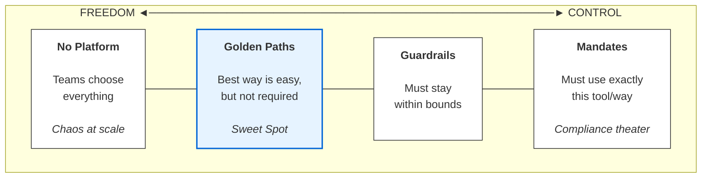
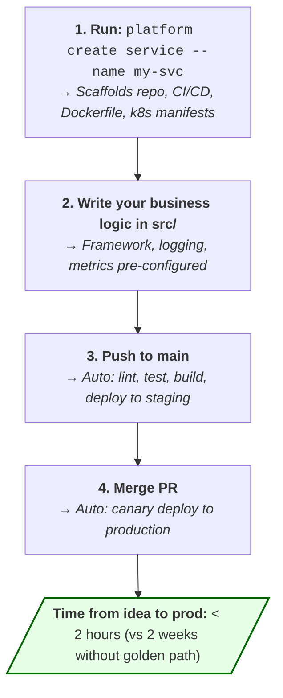
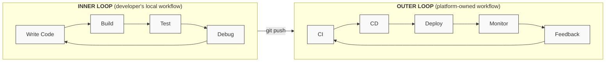

> **Discipline Module** | Complexity: `[ADVANCED]` | Time: 55-65 min

## Prerequisites

Before starting this module:
- **Required**: [Module 1.1: Building Platform Teams](/platform/disciplines/core-platform/leadership/module-1.1-platform-team-building/) — Team structures and organizational design
- **Required**: [Engineering Leadership Track](/platform/foundations/engineering-leadership/) — Stakeholder communication and ADRs
- **Recommended**: [SRE: Service Level Objectives](/platform/disciplines/core-platform/sre/module-1.2-slos/) — Measuring outcomes with SLIs/SLOs
- **Recommended**: Experience using internal developer platforms (as a consumer)

---

## What You'll Be Able to Do

After completing this module, you will be able to:

- **Design developer experience research programs that surface real pain points from engineering teams**
- **Implement DX measurement frameworks that track cognitive load, flow state, and feedback loops**
- **Build developer journey maps that identify the highest-friction moments in the software lifecycle**
- **Lead cross-functional initiatives that improve developer experience across platform boundaries**

## Why This Module Matters

In 2022, a large retail company invested $4 million in a new Kubernetes-based internal developer platform. Eighteen months later, their internal developer satisfaction survey showed a 15-point *drop*. Developers complained about longer deploy times, more YAML to write, and a steeper learning curve. The platform was technically superior to what it replaced, but the developer experience was worse.

The platform team had optimized for the wrong thing. They built a technically elegant abstraction layer, but every interaction with it required developers to understand Kubernetes concepts they did not care about. The "self-service" portal required 47 clicks to deploy a service. The documentation assumed familiarity with Helm charts.

> **Stop and think**: What is the most frustrating part of your current deployment process? Is it the tool itself, or the manual processes and cognitive load surrounding it?

**Developer experience is not about technology. It is about how it feels to get your work done.** The best platform in the world is worthless if developers dread using it. This module teaches you to measure, design, and continuously improve the experience your platform provides.

---

## Did You Know?

> A 2023 study by DX (formerly the Developer Experience Lab at the University of Victoria) found that developers spend only **52 minutes per day** in a state of deep focus. The rest is consumed by context switching, waiting for builds, searching for documentation, and navigating internal tools. Platform teams that reduce these interruptions have disproportionate impact.

> **GitHub's research** found that developer satisfaction is a stronger predictor of retention than compensation. Developers who rate their tools and processes positively are **2.3x less likely to leave** within a year, even controlling for salary.

> The concept of "cognitive load" in software teams comes from educational psychology. John Sweller's Cognitive Load Theory (1988) was about classroom learning, but it maps perfectly to developer experience: every unnecessary concept a developer must hold in working memory reduces their ability to do their actual job.

> **Google's internal research** (published via DORA) found that elite-performing teams deploy **973x more frequently** than low performers, with **6,570x faster lead time**. The difference is almost entirely in tooling and process, not individual skill.

---

## Measuring Developer Experience

### The Measurement Trap

Most organizations measure developer experience badly. They either:
1. **Don't measure at all**: "We'll know it when we see it"
2. **Measure the wrong things**: Lines of code, number of deploys, tickets closed
3. **Measure too infrequently**: Annual survey that's outdated by the time results arrive
4. **Measure without acting**: Dashboards nobody looks at

You need a multi-layered approach that combines quantitative metrics with qualitative signals.

### DORA Metrics: The Industry Standard

The DevOps Research and Assessment (DORA) team identified four key metrics that predict software delivery performance:

| Metric | What It Measures | Elite | High | Medium | Low |
|--------|-----------------|-------|------|--------|-----|
| **Deployment Frequency** | How often you deploy to production | On-demand (multiple/day) | Weekly to monthly | Monthly to 6-monthly | Fewer than 6-monthly |
| **Lead Time for Changes** | Time from commit to production | Less than 1 hour | 1 day to 1 week | 1 week to 1 month | 1 to 6 months |
| **Change Failure Rate** | % of deployments causing failure | 0-15% | 16-30% | 16-30% | 16-30% |
| **Failed Deployment Recovery Time** | Time to restore service | Less than 1 hour | Less than 1 day | 1 day to 1 week | More than 6 months |

**How to use DORA for platform teams**:
- Track these metrics **per team**, not just org-wide
- Compare teams **on your platform** vs teams **not on your platform**
- If platform teams perform worse on DORA metrics, your platform is a liability
- Set improvement targets: "Teams on our platform will achieve High DORA performance within 6 months"

> **Pause and predict**: If you only measure deployment speed without tracking failure rates, what negative behaviors might developers adopt? How could this hurt the overall product?

### SPACE Framework: Beyond Speed

DORA metrics focus on delivery speed. The SPACE framework (from Microsoft Research, GitHub, and University of Victoria) captures a fuller picture:

| Dimension | What It Measures | Example Metrics |
|-----------|-----------------|-----------------|
| **S**atisfaction | How happy developers are | Survey: "How satisfied are you with our deployment process?" (1-5) |
| **P**erformance | Outcomes of work | Code review quality, incident reduction, feature completion |
| **A**ctivity | Volume of work | Deploys, commits, PRs merged (careful — easy to game) |
| **C**ommunication | Collaboration quality | PR review turnaround, knowledge sharing, doc contributions |
| **E**fficiency | Flow and minimal friction | Build time, deploy time, time waiting for reviews |

**The SPACE principle**: Never use fewer than 3 dimensions. Any single metric can be gamed or misinterpreted. Triangulate.

### Developer Surveys: The Qualitative Layer

Surveys catch what metrics miss. Run them quarterly (not annually) with a mix of:

**Quantitative questions** (track trends over time):
```
On a scale of 1-5, how would you rate:
[ ] Ease of deploying a new service
[ ] Quality of platform documentation
[ ] Speed of getting help when stuck
[ ] Overall satisfaction with developer tools
[ ] Confidence that deploys won't break production
```

**Qualitative questions** (discover unknown problems):
```
1. What's the most frustrating part of your development workflow?
2. If you could change one thing about our platform, what would it be?
3. What do you spend too much time on that should be automated?
4. What's something that works well that we should protect?
```

**Net Promoter Score for platforms**:
```
On a scale of 0-10, how likely are you to recommend our platform
to a colleague at another company?
```

A platform NPS below 30 means you have serious problems. Above 50 is excellent.

---

## Golden Paths vs Guardrails vs Mandates

This is the single most important strategic decision for developer experience: how much freedom do developers have?

### The Spectrum



> **Stop and think**: Think of a tool you are required to use at work that you actively dislike. Is it a mandate, a guardrail, or a golden path?

### Golden Paths: The Recommended Approach

A golden path is an **opinionated, well-supported, and easy default** that developers can choose to follow. It is not mandatory, but it is clearly the path of least resistance.

**What makes a good golden path**:
- **Faster than the alternative**: If the golden path is slower, nobody will use it
- **Well-documented**: Clear guides, examples, and troubleshooting
- **Supported**: If something goes wrong on the golden path, the platform team helps
- **Opinionated**: Makes decisions for you (language, framework, deploy target, monitoring)
- **Escapable**: You can go off-path if you have a good reason

**Example: Golden path for a new microservice**



### Guardrails: Non-Negotiable Boundaries

Guardrails are constraints that prevent teams from doing dangerous or unsupportable things. Unlike golden paths, guardrails are mandatory.

| Guardrail | Rationale | Implementation |
|-----------|-----------|----------------|
| All containers must have resource limits | Prevents noisy neighbor problems | Admission controller (OPA/Kyverno) |
| All services must expose health endpoints | Required for reliable deployments | CI pipeline check |
| No public S3 buckets | Security requirement | IAM policy + automated scanner |
| All services must have at least 2 replicas in prod | Availability requirement | Deployment validation webhook |
| Secrets must come from vault, not env vars | Security baseline | CI check + runtime policy |

**The key principle**: Guardrails should be **automated**, not documented. If a guardrail exists only in a wiki, it is not a guardrail — it is a suggestion.

### Mandates: Use Sparingly

Mandates are hard requirements: "You must use this specific tool/process." They should be rare and have clear justification.

**When mandates are appropriate**:
- Regulatory compliance (SOC 2, HIPAA, PCI-DSS)
- Security requirements (authentication, encryption)
- Operational necessities (monitoring, logging in a standard format)
- Cost control (approved instance types, regions)

**When mandates backfire**:
- "Everyone must use Go" (kills innovation, frustrates teams)
- "All services must use our custom framework" (creates vendor lock-in to your own platform)
- "No exceptions to the deployment process" (blocks teams with legitimate edge cases)

---

## Self-Service Platforms: What Developers Actually Want

### The Self-Service Maturity Model

| Level | Description | Developer Experience |
|-------|-------------|---------------------|
| **0: Manual** | File a ticket, wait for someone | "I submitted a request 3 days ago..." |
| **1: Documented** | Follow a wiki guide, run scripts yourself | "I followed the guide but step 7 is outdated" |
| **2: Templated** | Use a template/scaffold, some manual steps | "I scaffolded the project but had to edit 5 files" |
| **3: Self-service** | Click a button or run a command, everything provisioned | "I ran one command and I'm deploying" |
| **4: Automated** | It happens without developer action | "I merged my PR and it's live in 5 minutes" |

**Most platform teams overestimate where they are.** They think they are at Level 3 but developers experience Level 1.

### What Developers Actually Want (Based on Research)

The Platform Engineering community surveyed over 4,000 developers. Here is what they want, ranked:

| Rank | Capability | % of Developers |
|------|-----------|-----------------|
| 1 | Fast, reliable CI/CD | 89% |
| 2 | Easy environment provisioning (dev, staging, prod) | 78% |
| 3 | Clear documentation and examples | 74% |
| 4 | Self-service database/storage provisioning | 68% |
| 5 | Standardized monitoring and logging | 65% |
| 6 | Secret management | 61% |
| 7 | Service catalog (what exists, who owns it) | 58% |
| 8 | Cost visibility | 42% |

> **Pause and predict**: Look at the capabilities developers actually want. Why do you think advanced features like "Service mesh configuration" or "Custom Kubernetes operators" are missing from the top 8?

Notice what is **not** on this list: advanced service mesh, custom Kubernetes operators, or sophisticated multi-cloud abstraction. Developers want the basics to work well before you build anything fancy.

### Reducing Cognitive Load

Cognitive load is the mental effort required to use your platform. There are three types:

| Type | Definition | Platform Example |
|------|-----------|-----------------|
| **Intrinsic** | Inherent complexity of the task | "Distributed systems are hard" |
| **Extraneous** | Unnecessary complexity from poor design | "Why do I need 3 YAML files for a simple deploy?" |
| **Germane** | Productive learning effort | "I'm learning how canary deployments work" |

**Your goal as a platform leader**: Minimize extraneous load. You cannot reduce intrinsic load (distributed systems will always be complex), and you should not reduce germane load (developers need to learn). But extraneous load — the stuff that is hard because your tools are bad — that is your responsibility.

**Cognitive load audit checklist**:
```
For each developer workflow, ask:
[ ] How many tools do they need to use?
[ ] How many concepts do they need to understand?
[ ] How many config files do they need to write?
[ ] How many people do they need to talk to?
[ ] How many dashboards do they need to check?
[ ] How many docs pages do they need to read?

For each answer, ask:
[ ] Is this number the minimum possible?
[ ] Can we eliminate, automate, or abstract any of these?
```

---

## Paved Roads at Scale

### Backstage (Spotify)

**What it is**: An open-source developer portal that provides a single pane of glass for all internal services, documentation, and tooling.

**Key capabilities**:
- **Software catalog**: What services exist, who owns them, what their status is
- **Templates**: Scaffold new services with pre-configured CI/CD, monitoring, and deployment
- **TechDocs**: Documentation lives next to the code, rendered in the portal
- **Plugins**: Extensible — connect to your existing tools (PagerDuty, Kubernetes, CI/CD)

**When to use Backstage**:
- Organization > 100 developers
- More than 50 services
- Discoverability is a problem ("where is the docs for X?")
- You want a composable platform, not a monolithic one

**When NOT to use Backstage**:
- Under 50 developers (overhead exceeds value)
- You need a complete IDP out of the box (Backstage requires significant customization)
- You lack engineers to maintain it (it is a platform for your platform)

### Port

**What it is**: A commercial internal developer portal with a focus on self-service actions and a software catalog.

**Key differentiator**: Port focuses on **actions** — developers can provision infrastructure, trigger deployments, and manage resources through the portal without writing code. Its "self-service hub" approach requires less custom development than Backstage.

**When to use Port**: Teams that want an IDP without building one from scratch. Organizations where developer self-service is the primary goal.

### Humanitec

**What it is**: A platform orchestrator that provides a reference architecture for internal developer platforms.

**Key differentiator**: Humanitec focuses on **workload-centric** abstractions. Developers describe what they need (a service with a database and a message queue), and the orchestrator handles the infrastructure details based on environment (dev vs staging vs prod).

**When to use Humanitec**: Teams that want to separate "what the developer needs" from "how infrastructure provisions it." Works well for organizations with multiple environments and deployment targets.

### Choosing the Right Approach

| Factor | Backstage | Port | Humanitec | Custom |
|--------|-----------|------|-----------|--------|
| **Setup time** | Months | Weeks | Weeks | Months-years |
| **Customization** | Very high (open source) | Medium (configurable) | Medium | Unlimited |
| **Maintenance burden** | High | Low (SaaS) | Low (SaaS) | Very high |
| **Cost** | Free + engineering time | Subscription | Subscription | Engineering time |
| **Best for** | Large orgs wanting full control | Mid-size wanting fast time-to-value | Orgs focused on workload abstraction | Unique requirements |

---

## The Developer Inner Loop and Outer Loop

Understanding these two loops is essential for DX strategy:



**Platform teams often focus too much on the outer loop** (CI/CD, deployment, monitoring) and neglect the inner loop (local dev, build times, test speed). But developers spend 80% of their time in the inner loop.

**Inner loop improvements with high ROI**:
- Faster local builds (caching, incremental compilation)
- Hot reload for development servers
- Local environment that mirrors production
- Fast, reliable tests that run locally
- IDE integrations that surface platform information

---

## Hands-On Exercises

### Exercise 1: Developer Experience Baseline Assessment (60 min)

Measure your platform's current developer experience. This exercise creates a baseline you can track over time.

**Step 1: Time the critical workflows** (measure each 3 times, take the median)

| Workflow | Target | Your Time | Gap |
|----------|--------|-----------|-----|
| Create a new service (scaffold to first deploy) | < 2 hours | ___ | ___ |
| Deploy a code change to staging | < 15 min | ___ | ___ |
| Deploy a code change to production | < 30 min | ___ | ___ |
| Roll back a bad deployment | < 5 min | ___ | ___ |
| Provision a new database | < 10 min | ___ | ___ |
| Add monitoring to a service | < 30 min | ___ | ___ |
| Find documentation for a service | < 2 min | ___ | ___ |
| Onboard a new developer | < 1 day | ___ | ___ |

**Step 2: Run a mini-survey** (send to 5-10 developers)

Use the questions from the survey section above. Calculate averages and identify the lowest-scoring areas.

**Step 3: Create a DX improvement backlog**

Rank improvements by:
- Pain level (how much does this hurt developers?)
- Reach (how many developers are affected?)
- Effort (how hard is it to fix?)

### Exercise 2: Golden Path Design Workshop (45 min)

Design a golden path for the most common developer workflow at your organization.

**Step 1**: Identify the workflow (e.g., "deploy a new microservice," "add a new API endpoint," "create a database migration")

**Step 2**: Map the current steps:
```text
Current workflow: [name]
Steps:
1. [step] — Time: ___ — Pain: Low/Med/High
2. [step] — Time: ___ — Pain: Low/Med/High
3. [step] — Time: ___ — Pain: Low/Med/High
...
Total time: ___
Total steps: ___
```

**Step 3**: Design the golden path:
```text
Golden path: [name]
Steps:
1. [step] — Time: ___
2. [step] — Time: ___
...
Total time: ___
Total steps: ___

What we eliminated: [list]
What we automated: [list]
What we abstracted: [list]
```

**Step 4**: Identify what would need to be built to make the golden path real. Estimate effort.

### Exercise 3: Cognitive Load Mapping (30 min)

Pick one workflow your platform supports and map its cognitive load. Identify and prioritize the reduction of Extraneous load items.

For each step, classify the cognitive load:
- **Intrinsic (I)** = Inherent complexity
- **Extraneous (E)** = Unnecessary complexity from tools/process
- **Germane (G)** = Productive learning

| Step | Load Type | Load Level (1-5) | Notes |
|------|-----------|------------------|-------|
| Write Dockerfile | Intrinsic (I) | 2 | |
| Write Kubernetes YAML | Extraneous (E) | 4 | ← Target for reduction |
| Configure CI pipeline | Extraneous (E) | 3 | ← Target for reduction |
| Set up monitoring | Extraneous (E) | 3 | ← Target for reduction |
| Understand canary deployment | Germane (G) | 2 | |
| Debug failing health check | Intrinsic (I) | 3 | |
| Update service mesh config | Extraneous (E) | 4 | ← Target for reduction |

---

## War Story: The Platform Nobody Used

**Company**: European e-commerce company, ~400 engineers, 60 services

**Situation**: The platform team spent 9 months building a "next-generation deployment platform" based on Kubernetes, ArgoCD, and a custom abstraction layer. It was technically excellent: blue-green deployments, automatic rollbacks, integrated monitoring, cost optimization. The CTO was excited. The platform team was proud.

**The launch**: They announced the platform in an all-hands meeting. Created documentation. Ran two training sessions. Then waited for adoption.

> **Stop and think**: Look closely at the launch strategy above. Before reading further, at what point should the platform team have realized their launch was failing, and what metric would have told them earlier?

**What happened**:
- **Month 1**: 3 teams migrated (out of 25). All were teams with a platform engineer friend who helped them personally.
- **Month 2**: 1 more team migrated. Two teams that migrated filed tickets about missing features.
- **Month 3**: No new adoption. Internal Slack messages: "Is the new platform stable?" "I heard Team X had problems." "Our current setup works fine, why switch?"
- **Month 6**: 6 teams total (24%). Leadership starts asking uncomfortable questions.

**Root cause analysis**:
1. **No user research**: The platform team assumed they knew what developers wanted. They built features developers did not ask for and missed features they desperately needed (local development support, fast rollback, simple log access).
2. **High migration cost**: Migrating from the old system required rewriting CI/CD configs, Dockerfiles, and deployment scripts. This was 2-3 weeks of work per service — work that competed with feature delivery.
3. **Passive launch**: Docs and training sessions are not a launch strategy. The team expected developers to come to them.
4. **No internal champions**: Nobody outside the platform team was advocating for the new platform.

**What they did to fix it**:
1. Hired a developer advocate who spent 2 weeks embedded with the 3 lowest-adopting teams, understanding their actual workflows
2. Built a migration tool that converted old CI/CD configs to new format automatically (reduced migration from 2-3 weeks to 2 days)
3. Added the missing features: local dev support, one-click rollback, log streaming
4. Created a "migration buddy" program where engineers from early-adopting teams helped later teams
5. Started publishing weekly metrics: "Teams on the new platform deploy 4x faster and have 60% fewer incidents"

**Month 12 (after fixes)**: 19 out of 25 teams migrated (76%). Developer satisfaction with deployment tools went from 2.1/5 to 4.2/5.

**Business impact**: The 6-month delay cost approximately $1.2M in engineering time (60 engineers x $200K fully loaded x 20% productivity loss from bad tooling x 0.5 years) and delayed two product launches that depended on the new deployment capabilities.

**Lessons**:
1. **Build with users, not for users**: Embedded user research would have caught the missing features before launch
2. **Reduce migration cost aggressively**: Every hour of migration effort is a barrier to adoption
3. **Launch is marketing**: Treat your platform like a product launch, not a code release
4. **Measure adoption as the primary metric**: Lines of code and features shipped are vanity metrics for platforms

---

## Knowledge Check

### Question 1
Scenario: Your VP of Engineering wants to measure the impact of the new internal developer platform. They suggest tracking the total number of lines of code written and the number of Jira tickets closed per developer. How should you respond, and which alternative metrics should you propose?

<details>
<summary>Show Answer</summary>

You should politely push back against measuring lines of code or tickets closed, as these are vanity metrics that encourage developers to write bloated code or split tasks artificially rather than delivering real value. Instead, propose the four DORA metrics: Deployment Frequency, Lead Time for Changes, Change Failure Rate, and Failed Deployment Recovery Time. By tracking these metrics for teams onboarded to the platform versus those who are not, you can empirically demonstrate whether the platform is actually increasing delivery speed and system stability. These industry-standard metrics capture the true outcomes of a good developer experience rather than easily gamed activity outputs, providing a reliable baseline for continuous platform improvement.

</details>

### Question 2
Scenario: Your security team mandates that every microservice must use a new, highly complex proprietary identity provider, which takes developers two weeks to integrate. Meanwhile, your platform team wants to offer a pre-configured authentication library that works out of the box but isn't strictly required. How would you classify these two approaches, and how should a platform team balance them?

<details>
<summary>Show Answer</summary>

The security team's requirement is a 'Mandate' (a strict, non-negotiable rule), while the platform team's pre-configured library is a 'Golden Path' (an opinionated, easy-to-use default that developers can opt out of if they have a valid reason). Mandates should be used sparingly and reserved only for strict regulatory or critical security compliance, as they often create bottlenecks and frustrate developers. Golden paths are the ideal approach for most platform offerings because they guide developers toward best practices by making the right way the easiest way. To balance them effectively, the platform team should build the security mandate into the golden path invisibly—for instance, by baking the complex identity provider into the default service template so developers are compliant automatically without the two-week integration burden.

</details>

### Question 3
Scenario: Six months after launching your self-service deployment portal, your DORA metrics dashboard reveals a mixed bag. Teams using the platform are deploying to production three times more frequently than non-platform teams, and their lead time for changes has dropped significantly. However, their change failure rate has doubled, and rollback times are identical to the legacy process. What does this indicate about your platform's design?

<details>
<summary>Show Answer</summary>

This data indicates that your platform has successfully optimized for deployment speed without implementing corresponding safety mechanisms or quality gates. By making it extremely easy to push code, the platform has inadvertently made it easier to push broken code into production. To fix this, you need to introduce automated guardrails, such as mandatory CI test passes before deployment, and progressive delivery strategies like canary deployments. Furthermore, the unchanged rollback times suggest you haven't abstracted the recovery process; you should provide a 'one-click rollback' feature to dramatically reduce the Failed Deployment Recovery Time, bringing safety in line with speed.

</details>

### Question 4
Scenario: A developer is trying to deploy a simple 'Hello World' Node.js app to your Kubernetes cluster. To do this, they must learn how to configure an Ingress object, write a Helm chart, set up a PodMonitor for Prometheus, and memorize the architecture of your service mesh. They complain that this process is exhausting. Using the concept of cognitive load, diagnose this problem and explain how the platform team should address it.

<details>
<summary>Show Answer</summary>

The developer is experiencing an overwhelming amount of 'extraneous cognitive load,' which is the unnecessary mental effort caused by poor tooling, excessive boilerplate, and leaky abstractions. While the 'intrinsic cognitive load' (the inherent complexity of the Node.js code itself) is low, the platform is forcing them to absorb infrastructure details that do not contribute to their business goal. To address this, the platform team should build a workload-centric abstraction or a developer portal template that hides the Kubernetes-specific YAML (Ingress, Helm, PodMonitor) behind a simple interface. By eliminating the extraneous load, developers can focus their mental energy on their application logic and 'germane cognitive load' (learning concepts that actually make them better at their core job).

</details>

### Question 5
Scenario: Your platform team has spent the last two quarters perfectly optimizing the Jenkins CI/CD pipelines, reducing production deployment time from 20 minutes to 5 minutes. However, the latest developer satisfaction survey shows morale is at an all-time low. Developers complain that their local Docker Compose environment takes 15 minutes to spin up and consumes so much RAM that their IDEs crash. Why did the platform team's investment fail to improve the overall developer experience?

<details>
<summary>Show Answer</summary>

The platform team failed to improve the developer experience because they over-indexed on the 'outer loop' (CI/CD and deployment) while completely ignoring the 'inner loop' (writing, building, and testing code locally). Developers spend approximately 80% of their working day iterating within the inner loop, meaning a slow local environment causes friction dozens of times per day. While reducing deployment times is valuable, it only affects the developer at the very end of their workflow. Platform teams must prioritize inner loop improvements—such as remote development environments, faster local caching, or lightweight local testing tools—because fixing the most frequent daily frustrations yields the highest return on investment for developer satisfaction.

</details>

### Question 6
Scenario: You are preparing to measure developer satisfaction for the first time. A senior director advises you to keep it simple by just sending a single-question quarterly poll asking: 'On a scale of 1-10, how happy are you with our internal tools?' Explain why this approach is dangerously flawed and what framework you should use instead.

<details>
<summary>Show Answer</summary>

A single 'happiness' metric is dangerously flawed because it lacks actionable granularity and fails to capture the multidimensional nature of developer experience. If the score is low, you have no data indicating whether the problem lies in slow builds, confusing documentation, or painful code reviews, making it impossible to prioritize fixes. Instead, you should adopt the SPACE framework to triangulate metrics across Satisfaction, Performance, Activity, Communication, and Efficiency. By combining quantitative data (like deployment frequency) with specific qualitative survey questions (e.g., 'What is the most frustrating part of your deployment workflow?'), you can pinpoint exactly where friction occurs and confidently invest engineering effort into solving the right problems.

</details>

### Question 7
Scenario: Your platform team spent three months building a self-service database provisioning tool. It was launched with a single email announcement and a link to a wiki page. After a quarter, only 15% of engineering teams have adopted it. The platform engineers are demoralized and want to mandate its use. What failure in product strategy does this represent, and what should be the immediate next steps?

<details>
<summary>Show Answer</summary>

This situation represents a failure in treating the platform as a product, specifically ignoring user research, migration cost reduction, and active internal marketing. A single email is not a launch strategy, and low voluntary adoption usually indicates that the tool either doesn't solve a burning pain point or requires too much effort to migrate to. Mandating its use would only breed resentment and mask the underlying usability issues. The immediate next steps should be to embed with the non-adopting teams to understand why they didn't switch, build automation to dramatically lower the migration effort, and identify an internal champion team to successfully pilot and promote the tool to their peers.

</details>

### Question 8
Scenario: Your rapidly growing startup (currently 60 engineers, expected to double this year) is struggling with service discoverability and inconsistent scaffolding. The CTO wants to immediately deploy Spotify's Backstage because 'it's the industry standard.' You have a platform team of only two engineers. What are the risks of this decision, and how would you compare Backstage to alternatives like Port or Humanitec for your specific context?

<details>
<summary>Show Answer</summary>

Deploying Backstage with only a two-person platform team is highly risky because it is not a turnkey solution; it is a framework for building a portal that requires significant, ongoing engineering investment to customize, integrate, and maintain. For a small team, the operational burden of maintaining Backstage would consume all their time, leaving nothing for actually improving the underlying developer experience. In this context, a commercial portal like Port is likely a better choice, as it provides a ready-to-use software catalog and self-service actions with much lower setup time and maintenance overhead. Alternatively, if the core pain point is managing complex deployments across multiple environments rather than just discoverability, a platform orchestrator like Humanitec might be appropriate, though a SaaS developer portal directly targets the CTO's immediate scaffolding and discoverability concerns.

</details>

---

## Summary

Developer experience is the measure of how easily and effectively engineers can do their work using your platform. It is not a feeling — it is measurable through DORA metrics, SPACE dimensions, developer surveys, and workflow timing.

Key principles:
- **Measure before you build**: Baseline your current DX so you can prove improvement
- **Golden paths over mandates**: Make the right thing the easy thing
- **Reduce cognitive load**: Eliminate unnecessary complexity, preserve useful learning
- **Focus on the inner loop**: Where developers spend most of their time
- **Self-service is a spectrum**: Know where you are and where you are going
- **Adoption is the metric**: A platform nobody uses has zero value

---

## What's Next

Continue to [Module 1.3: Platform as Product](../module-1.3-platform-as-product/) to learn how to apply product management practices to your internal platform.

---

*"The goal is not to build a platform. The goal is to make developers productive. The platform is just how you get there."*