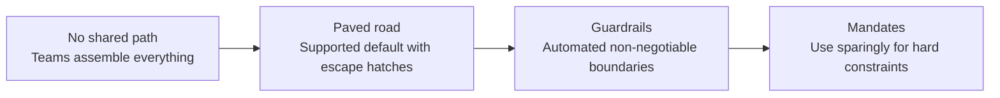
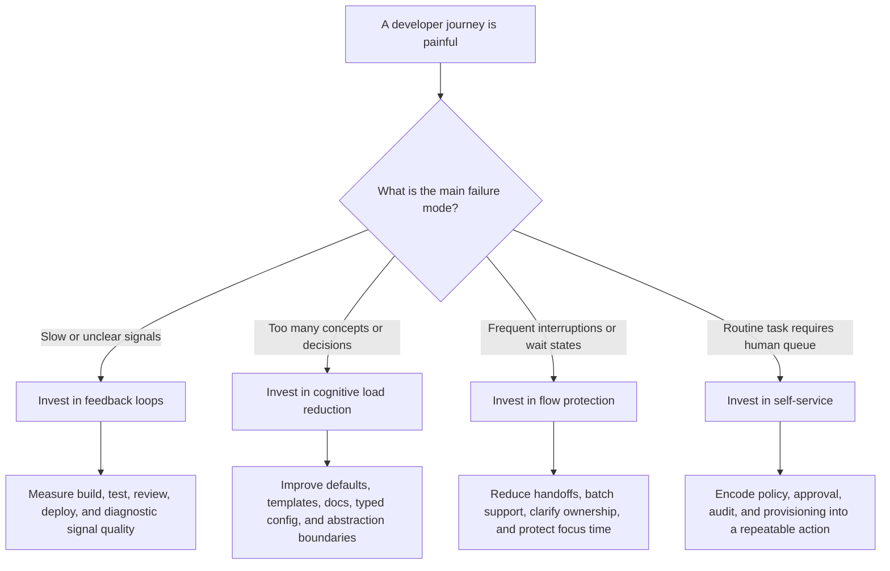

> **Discipline Module** | Complexity: `[ADVANCED]` | Time: 55-65 min

## Prerequisites

- **Required**: [Module 1.1: Building Platform Teams](/platform/disciplines/core-platform/leadership/module-1.1-platform-team-building/) - Team structures and organizational design
- **Required**: [Engineering Leadership Track](/platform/foundations/engineering-leadership/) - Stakeholder communication and ADRs
- **Recommended**: [SRE: Service Level Objectives](/platform/disciplines/core-platform/sre/module-1.2-slos/) - Measuring outcomes with SLIs/SLOs
- **Recommended**: Experience using internal developer platforms as a consumer, platform engineer, tech lead, or engineering manager

---

## What You'll Be Able to Do

After completing this module, you will be able to make specific leadership decisions about developer experience instead of treating it as a vague morale problem.

- **Design developer experience research programs that reveal real friction across teams, personas, and software delivery workflows**
- **Implement DX measurement frameworks that combine feedback loops, cognitive load, flow state, SPACE, and DORA outcomes**
- **Build developer journey maps that expose the highest-friction moments in inner-loop and outer-loop engineering work**
- **Lead cross-functional initiatives that improve developer experience across platform, security, SRE, compliance, and product boundaries**
- **Evaluate self-service platform investments by separating durable capabilities from fast-changing portal and IDP tooling choices**

---

## Why This Module Matters

Hypothetical scenario: A platform team replaces a fragile deployment script with a Kubernetes-based internal platform. The new system is more secure, more observable, and easier for the platform team to operate, but product engineers now need to understand service accounts, rollout strategies, health probes, environment overlays, and several new dashboards before they can ship a small change. The platform is technically better, yet the day-to-day developer experience is worse because the improvement moved work from the platform team onto every product team.

That scenario is common because platform teams often confuse internal engineering quality with user experience. A clean Terraform module, a well-factored controller, or a consistent cluster policy can be excellent engineering work while still creating an exhausting path for the developer trying to launch a service. Developer experience asks a different question: what does it actually feel like for a capable engineer to get useful work done through this platform?

The answer matters because platform value is indirect. A product team uses the platform so it can deliver customer value faster, more safely, and with less irrelevant effort. If the platform makes developers wait, search, translate, re-enter information, or learn concepts unrelated to their product problem, the platform becomes a tax. The tax may be hidden inside small delays, but it compounds across every build, review, deploy, incident, and onboarding moment.

Developer experience is not the same thing as making developers comfortable or removing all hard work. Software delivery includes real complexity, especially in distributed systems, security, reliability, and compliance. Good platform leadership separates essential complexity from accidental complexity. The platform should expose the ideas developers must understand to make responsible tradeoffs, while absorbing the repetitive, leaky, and organization-specific details that distract them from product work.

The leadership challenge is that DX problems rarely have a single owner. A slow build may involve repository structure, CI capacity, test strategy, dependency management, and review culture. A confusing deployment may involve platform templates, security review, observability defaults, and incident ownership. A painful onboarding path may involve documentation, team APIs, access requests, development environments, and social support. Improving DX therefore requires a research program, a measurement model, and cross-functional leadership, not just a portal launch.

The practical test is simple: when developers choose the platform voluntarily, they should do it because it is the easiest responsible way to work. That does not mean every team follows one identical path. It means the paved road is so well-supported, well-documented, and safe that teams prefer it unless they have a clear reason to go off-road. Mandates can force usage, but only a good experience earns adoption.

---

## Developer Experience as a Leadership System

Developer experience is the lived experience of developers as they move from intent to running software. It includes tools, documentation, team interactions, waiting time, interruptions, cognitive effort, and the confidence developers have that their actions will produce predictable outcomes. The ACM Queue DevEx article by Abi Noda, Margaret-Anne Storey, Nicole Forsgren, and Michaela Greiler frames this as a developer-centric way to understand productivity, because it focuses on the friction developers encounter while trying to deliver software.

For platform leaders, the important shift is from output inspection to system design. You are not trying to squeeze more activity out of individual engineers. You are trying to remove the conditions that make valuable engineering work harder than it needs to be. A developer who spends the morning waiting for a flaky integration test, the afternoon negotiating access to a staging database, and the next day recovering context after several support handoffs may look busy in activity metrics, but the system is wasting attention.

This is why single-number productivity programs are dangerous. Lines changed, commits made, tickets closed, or pull requests opened can all increase while customer value, reliability, and developer focus decline. A team under pressure can split work into smaller tickets, write unnecessary code, or push changes more frequently without making the product better. DevEx measurement must therefore look at the work system, not treat developers like factory stations.

The strongest platform teams use developer experience as an operating model. They continuously discover friction, choose a small number of high-leverage improvements, ship those improvements through product-style roadmaps, and then verify whether the lived experience changed. They do not wait for an annual survey to learn that a workflow hurts. They combine surveys, workflow timings, telemetry, support tickets, interviews, and adoption signals so they can see both the emotional and mechanical parts of the experience.

This operating model also protects the platform team from building impressive but unused infrastructure. A portal, CLI, service catalog, or workflow engine is only useful when it shortens a real path developers already need to travel. If the most painful step is waiting for security review, a beautiful catalog will not fix the experience unless it helps encode security requirements earlier. If the hardest step is debugging failing deployments, a new scaffold will disappoint unless it includes observable defaults and actionable failure messages.

The analogy is a city transit system. A city can buy modern trains, install polished ticket machines, and publish a transit map, but commuters judge the system by whether they can get from home to work reliably. If transfers are confusing, schedules are unpredictable, and delays are unexplained, the infrastructure investment feels like a failure. Developer experience works the same way: the platform is judged by journeys, not by components.

---

## The DevEx Framework: Feedback Loops, Cognitive Load, and Flow State

The DevEx framework gives platform leaders a durable spine for diagnosing friction. The three dimensions are feedback loops, cognitive load, and flow state. Each dimension describes a different way a developer's work can be slowed or degraded. Together they explain why a platform can be technically capable yet still feel painful to use.

Feedback loops are about the speed and quality of signals developers receive after taking action. A developer changes code and waits for the editor, local tests, CI, code review, deployment, runtime health checks, logs, alerts, and user feedback to tell them whether the change is good. Every slow or noisy signal invites context switching. Every missing signal forces the developer to guess. Every false signal reduces trust in the system.

Platform teams improve feedback loops by shortening the path between action and useful information. The most obvious levers are faster builds, more reliable tests, cached dependencies, incremental validation, preview environments, clear deployment status, and logs connected to the service being changed. The less obvious levers are social: review ownership, team boundaries, approval queues, incident escalation paths, and the handoff rules between product teams and specialist groups. A fast CI system does not create fast feedback if developers then wait days for a required review.

Feedback quality matters as much as feedback speed. A test that fails quickly but provides an unreadable error still creates toil. A deployment page that shows a red status without linking to the failing probe, rollout event, or recent configuration change still forces detective work. A platform should make the next debugging step obvious, because the experience of being blocked is shaped by whether the system helps the developer recover.

Cognitive load is the amount of mental processing required to perform a task. In platform work, high cognitive load often appears as leaky abstraction. A developer wants to expose an HTTP service, but the platform requires them to reason about ingress classes, certificate issuers, service mesh annotations, autoscaling behavior, and metrics wiring before they can complete a routine workflow. Some of those concepts may be important for advanced cases. They should not all be prerequisites for the first responsible path.

The useful distinction is between essential and accidental complexity. Essential complexity is tied to the problem domain or the operational responsibility the team truly owns. A team operating a latency-sensitive service should understand error budgets, traffic patterns, and rollback consequences. Accidental complexity is introduced by weak tools, fragmented ownership, outdated documentation, inconsistent naming, or platform abstractions that leak implementation details too early. The platform team's job is not to hide reality; it is to reveal the right layer at the right time.

Platform levers for reducing cognitive load include sensible defaults, scaffolding, typed configuration, examples that match real service shapes, generated documentation, software catalog ownership data, and policy checks that explain why a change is unsafe. A strong golden path reduces the number of decisions a team must make before it can start delivering value. It also preserves escape hatches for teams that need deeper control, because hiding every detail forever creates a different kind of cognitive debt.

Flow state is the developer's ability to stay immersed in a coherent piece of work. Interruptions, unclear goals, frequent tool switching, waiting, urgent support requests, and context-free alerts all break flow. Flow is not a soft luxury. It is the condition under which complex design, debugging, and learning can happen. When leaders ignore flow, they create teams that appear responsive but spend most of their energy reloading context.

Platform teams improve flow by reducing avoidable interruptions and protecting coherent journeys. That can mean batching platform support hours, routing common questions to searchable docs, designing self-service actions with clear progress and failure states, clustering required meetings, and making platform changes predictable. It can also mean saying no to platform features that create another dashboard, another approval path, or another partial abstraction without removing an older one.

The three dimensions reinforce each other. Slow feedback breaks flow because developers switch tasks while waiting. High cognitive load slows feedback because developers must interpret more concepts before acting. Broken flow increases cognitive load because developers repeatedly reconstruct what they were trying to do. A good DX strategy does not pick one dimension forever; it identifies the dominant constraint in a specific journey and fixes that constraint first.

---

## Developer Journeys and Research Programs

A developer journey map is a structured view of what a developer does, thinks, waits for, and feels while trying to complete a workflow. It is more useful than a process diagram because it includes the human cost of each step. A process diagram may say "request database access." A journey map asks who approves the request, what information the developer must already know, how long the wait feels, what work is blocked, and what happens when the request is rejected.

Start with journeys that occur frequently or carry high risk. Common platform journeys include creating a new service, running it locally, opening the first pull request, deploying to a test environment, promoting to production, rolling back, adding observability, requesting a dependency, rotating a secret, and onboarding a new engineer. The point is not to map every workflow at once. The point is to choose one journey where friction is visible and learn enough to act.

Good research programs triangulate. Interviews reveal why a step is painful, workflow timings show where time is lost, support tickets show repeated confusion, telemetry shows where the system actually slows, and surveys show whether the pain is isolated or broad. None of those signals is sufficient alone. Developers may overestimate waits, instrumentation may miss social handoffs, and support tickets may undercount teams that have stopped asking for help.

When interviewing developers, ask for recent concrete examples rather than general opinions. "Tell me about the last time you deployed a service" produces better evidence than "Do you like the deployment platform?" Watch the workflow when possible. A developer may not mention that they keep five documentation tabs open, copy values from a previous repository, or ask a teammate for the same hidden command every time. Observation catches friction that has become normal.

Break findings down by persona and team context. A senior backend engineer, a mobile developer, a data engineer, and a new hire may interact with the same platform in very different ways. Aggregate survey scores can hide sharp pain in a smaller but important group. If only one team uses a regulated deployment path, their friction may disappear inside an organization-wide average, even though that path blocks critical product work.

The output of research should be a ranked backlog of experience improvements, not a report that sits in a folder. For each finding, write the affected journey, the evidence, the suspected dimension of DevEx, the likely platform lever, the owning group, and the expected observable change. This keeps the program grounded in action. It also makes tradeoffs explicit when the fix crosses platform, security, SRE, and product boundaries.

---

## Golden Paths and Paved Roads

A golden path is an opinionated, well-supported default route through the platform. The phrase is sometimes used loosely, but the leadership principle is precise: the right thing should be the easiest responsible thing. Developers should choose the paved road because it saves time, reduces uncertainty, and gives them high confidence that the resulting service meets organizational standards.

This is different from a mandate. A mandate says, "you must use this path because leadership requires it." A paved road says, "this path is faster, safer, supported, and maintained, so most teams prefer it." Mandates may be necessary for legal, security, or reliability boundaries, but they are a weak substitute for a good experience. If a platform needs constant enforcement to maintain adoption, the paved road is probably not attractive enough.

The best paved roads are narrow at the start and expandable over time. A first path might cover a common HTTP service with standard CI, container build, deployment, logging, metrics, alerting, ownership metadata, and rollback. It should not try to satisfy every workload shape on day one. A path that tries to cover every exception often becomes so configurable that it stops being a path at all, and developers are back to assembling the platform from pieces.

The paved-road-as-pull idea matters because it changes the platform team's incentives. If product teams can opt out, the platform team must keep the path useful, coherent, and competitively easy. Voluntary adoption forces the platform to behave like a product with internal customers. It also exposes where the platform is not yet ready, because teams with legitimate needs can explain why the default does not fit them.

Guardrails still matter. A paved road can include non-negotiable safety boundaries such as vulnerability scanning, authentication patterns, production readiness checks, resource limits, audit logging, or incident ownership metadata. The difference is that a good platform bakes those boundaries into the default path and explains failures in developer language. A bad platform turns every boundary into a separate ticket, wiki page, or surprise rejection late in the release process.


```mermaid
flowchart LR
    A["No shared path<br/>Teams assemble everything"] --> B["Paved road<br/>Supported default with escape hatches"]
    B --> C["Guardrails<br/>Automated non-negotiable boundaries"]
    C --> D["Mandates<br/>Use sparingly for hard constraints"]
```

The platform leader's question is not "how do we standardize everything?" The better question is "which defaults remove the most repeated decision-making while preserving the autonomy teams need to deliver responsibly?" This question prevents standardization from becoming bureaucracy. It also keeps the platform focused on high-frequency, high-friction work rather than on abstract consistency for its own sake.

---

## Self-Service and the Internal Developer Platform

Self-service is the removal of unnecessary wait states from responsible engineering workflows. It does not mean every developer can do anything without review. It means routine, policy-compliant work can proceed without waiting for a human queue. A self-service database request may still enforce naming rules, cost limits, data classification, backup defaults, and approval thresholds. The experience improves because the policy is encoded into the path instead of discovered through ticket comments.

An internal developer platform, or IDP, is the collection of capabilities that helps teams deliver and operate software through self-service. A portal may be the front door to that platform, but the portal is not the platform by itself. The platform includes templates, APIs, automation, identity, environments, observability defaults, policy checks, documentation, support models, and ownership data. The paved road is the curated route through those capabilities for a common workflow.

This distinction prevents a common failure mode: buying or building a portal and expecting DX to improve automatically. A portal can make things discoverable, but it cannot compensate for missing automation behind the button. If a "create environment" action simply opens a ticket, developers still experience ticket-ops. If a software catalog lists ownership but does not connect to on-call, docs, dashboards, or repository metadata, it becomes another place to search rather than a reduction in cognitive load.

The maturity model below is useful because it focuses on what the developer experiences, not what the platform team has built. A team may have advanced infrastructure automation internally while developers still interact with it through manual requests. In that case the platform is operationally mature for its maintainers but experientially immature for its users.

| Level | Developer Experience | Platform Interpretation |
|---|---|---|
| Manual | "I file a ticket and wait." | Work depends on human queues and hidden specialist knowledge. |
| Documented | "I follow a guide and hope it is current." | Knowledge is visible, but execution remains fragile and manual. |
| Templated | "I start from a scaffold, then finish the hard parts." | Some repeated decisions are encoded, but handoffs remain. |
| Self-service | "I request the thing and the platform provisions it safely." | Policy and automation are integrated into a repeatable workflow. |
| Adaptive | "The platform suggests or applies the right defaults from context." | Metadata, feedback, and policy guide the workflow continuously. |

The jump from documented to self-service is where many platform efforts stall. Documentation is necessary, but documentation alone asks every team to become a part-time platform operator. Self-service asks the platform team to encode the common path as software. That encoding is harder, because it requires the platform team to understand the workflow deeply enough to automate it without removing necessary judgment.

Scaffolding is one of the highest-leverage self-service tools when it is treated as a living product. A service template can include repository layout, CI configuration, container build, Kubernetes manifests or higher-level workload definitions, ownership metadata, observability defaults, security checks, and examples for common changes. But a stale template creates long-term harm. It spreads old decisions into every new service and makes the golden path look untrustworthy.

Environments are another major self-service lever. If developers wait for shared test environments, manually coordinate database refreshes, or cannot reproduce platform behavior before production, feedback loops slow down and confidence drops. Self-service preview environments, ephemeral namespaces, realistic test data policies, and clear teardown rules can reduce waiting while protecting cost and compliance. The leadership work is to define which environment guarantees matter for which workflow.

Self-service should also include failure recovery. A platform that makes creation easy but debugging hard has only solved the first half of the journey. Developers need status, logs, traces, recent changes, ownership, common causes, and rollback paths close to the action they performed. The most useful self-service workflow often starts after something fails, because that is when developers most need the platform to explain itself.

---

## Measuring Developer Experience Without Gaming It

Measurement turns DX from opinion into an improvable system, but measurement can damage trust if it is used carelessly. The most important rule is to measure workflows and systems, not individual worth. The SPACE framework from Nicole Forsgren, Margaret-Anne Storey, Chandra Maddila, Thomas Zimmermann, Brian Houck, and Jenna Butler was created to avoid simplistic productivity measurement by combining multiple dimensions: satisfaction and well-being, performance, activity, communication and collaboration, and efficiency and flow.

SPACE is useful for platform leadership because it creates balance. Satisfaction without delivery outcomes can hide pleasant but ineffective systems. Activity without satisfaction can reward frantic work. Efficiency without communication can optimize one team's path while slowing another. Performance without flow can celebrate outcomes that are achieved through unsustainable effort. The framework pushes leaders to read signals together instead of declaring victory from one dashboard.

DORA metrics add a complementary view of delivery outcomes. Deployment frequency, change lead time, change failure rate, and failed deployment recovery time describe whether a delivery system is moving changes quickly and recovering safely. These are not pure DevEx metrics, because many factors influence them, but they are important lagging indicators. A platform that improves feedback loops and reduces cognitive load should eventually help teams deliver with better speed and stability.

Leading indicators show whether the experience is changing before delivery outcomes move. Examples include time to first successful local run, time from scaffold to first deployment, CI wait time, flaky test rate, review wait time, percentage of services using supported templates, documentation findability, self-service action success rate, and number of handoffs in a workflow. These signals are closer to the platform team's levers, which makes them useful for prioritization.

Perceptual measures are equally important because many DX problems are invisible to system telemetry. A build system can report average duration, but only developers can explain whether failures are understandable. A portal can report action usage, but only developers can say whether they trust the result. Surveys, interviews, and transactional feedback should ask about specific workflows rather than general happiness alone. "How easy was it to diagnose your last failed deployment?" is more actionable than "Are you happy with tooling?"

The best measurement programs combine three families of signals. Perceptual signals capture developer judgment and emotion. Workflow signals capture timings, waits, failure modes, and handoffs. Outcome signals capture delivery, reliability, quality, adoption, and retention risks at the team or organization level. When all three move together, leaders can be more confident. When they disagree, the disagreement is usually where the learning is.

| Signal Family | Example Questions | Platform Use |
|---|---|---|
| Perceptual | "Is the deployment process understandable and trustworthy?" | Reveals friction, confidence, and trust that telemetry misses. |
| Workflow | "Where do developers wait, retry, or switch tools?" | Identifies concrete platform and process levers for improvement. |
| Outcome | "Are teams delivering safely with less delay?" | Connects DX investment to software delivery and business results. |

Avoid ranking individual developers with these signals. Individual-level measurement creates fear, gaming, and local optimization. Platform leaders should aggregate to teams, journeys, platform capabilities, and workflow segments. The goal is to improve the system that developers work inside. When a metric makes developers feel inspected rather than helped, it will distort behavior and reduce the honesty of the feedback program.

Measurement also needs an action contract. If you survey developers repeatedly and do not act, participation becomes a tax and trust erodes. Publish what you heard, what you are doing, what you are not doing yet, and why. Close the loop after changes ship. Developers do not need every request accepted, but they do need evidence that feedback changes platform decisions.

---

## Inner Loop, Outer Loop, and the Real Cost of Interruptions

Developer journeys often divide into an inner loop and an outer loop. The inner loop is the local cycle of writing, building, testing, debugging, and learning. The outer loop is the shared delivery system: CI, review, deployment, progressive rollout, observability, incident response, and production feedback. Platform teams frequently over-invest in the outer loop because it is easier to centralize, instrument, and present to executives.

Ignoring the inner loop is a strategic mistake. Developers may deploy once a day, but they build, test, search, and debug many times during a day. If local setup is fragile, test data is hard to obtain, or the service cannot run without a distant shared environment, every product change begins with friction. Improving a production deployment from several minutes to fewer minutes is useful, but it may not change the lived experience if the developer loses focus every hour in the local workflow.

The inner loop and outer loop should be designed together. A service template that works in production but not locally teaches developers to distrust the golden path. A local environment that differs too much from the deployment platform creates surprises later. A CI pipeline that catches issues only after a long queue encourages developers to batch risky changes. The goal is a coherent chain of feedback, where each stage catches the right class of issue at the cheapest responsible point.

Interruptions are especially expensive because they create hidden recovery work. After a developer switches from a failing build to a support chat, then to a meeting, then back to the build, the lost time is not just the minutes spent elsewhere. The developer must reconstruct intent, reload context, and remember which hypothesis they were testing. Platform leaders who only measure queue duration miss this cognitive recovery cost.

One practical way to find interruption cost is to ask developers to narrate a recent blocked workflow. Listen for phrases such as "then I waited," "then I asked in chat," "then I tried the old script," "then I found a different doc," and "then someone with permissions helped." Those transitions are experience debt. They show where the platform is relying on memory, relationships, and persistence rather than a reliable path.

---

## Leading Cross-Functional DX Initiatives

Developer experience work cuts across organizational boundaries because the developer journey cuts across organizational boundaries. A deployment path may include product engineering, platform engineering, SRE, security, compliance, networking, identity, finance, and support. If each group optimizes its own checkpoint independently, the developer experiences a chain of unrelated demands. Platform leadership must turn those checkpoints into a coherent product surface.

The first leadership move is to name the journey owner. Ownership does not mean one team controls every system in the path. It means one accountable group is responsible for understanding the end-to-end experience, coordinating improvements, and escalating tradeoffs. Without a journey owner, each specialist team can say its part works as designed while the overall workflow remains painful.

The second move is to agree on decision rights. Security may own minimum policy, SRE may own reliability standards, finance may own cost controls, and platform may own the developer interface. When those rights are implicit, every improvement turns into negotiation. When they are explicit, the platform team can encode constraints into templates, scorecards, and self-service actions without reopening the same debate for every workflow.

The third move is to fund adoption work, not just build work. A paved road needs documentation, examples, migration support, office hours, feedback channels, release notes, champions, and deprecation plans. Treating launch as "we shipped the feature" is a product failure. Treating launch as "developers can now succeed with less effort" changes the plan, because success depends on how the path lands in real teams.

The fourth move is to maintain a visible DX backlog. Each item should connect a researched pain point to a measurable change. For example, "reduce time to first staging deploy for new services" is stronger than "improve templates." It tells stakeholders which journey matters, which outcome should move, and why the work competes well against other platform investments.

---

## Landscape Snapshot - as of 2026-06

This changes fast; verify against vendor docs before relying on specifics. Internal developer portal and IDP products should be compared as ways to express durable platform capabilities, not as universal winners. Backstage, Port, Cortex, commercial Backstage distributions, cloud-provider developer portals, and custom internal portals can all be reasonable choices when matched to the organization's operating model, integration needs, and willingness to maintain platform software.

The durable capability map is more important than the product name. A software catalog answers "what exists, who owns it, and where is the operational context?" Scaffolding and templates answer "how does a team start from a supported default?" Scorecards answer "how do we make standards visible and actionable?" Self-service actions answer "which routine tasks can developers run safely without joining a ticket queue?" A tool that lacks one capability may still be a good fit if another part of the platform provides it well.

| Durable Capability | Backstage Example | Port Example | Cortex Example | Leadership Tradeoff |
|---|---|---|---|---|
| Software catalog | Catalog metadata and ownership model | Catalog blueprints and entities | Catalog and ownership model | Decide whether you want code-owned metadata, configured data models, or managed integrations. |
| Scaffolding and golden paths | Software Templates and scaffolder actions | Self-service actions backed by existing automation | Workflow and catalog-driven actions | Decide how much engineering effort you will spend building and maintaining templates. |
| Scorecards | Plugins or custom maturity views | Scorecards for catalog entities | Scorecards for standards and migrations | Decide whether scorecards are coaching tools, release gates, or both. |
| Self-service actions | Plugins and custom integrations | Action model connected to external backends | Workflows and automations around catalog data | Decide where approval, audit, and runtime authority should live. |

Avoid tool selection by slogan. An open-source portal can still be expensive if your platform team must maintain many custom plugins. A managed product can still be weak if your workflows require deep internal integration that the product does not model well. A custom portal can be justified for unusual constraints, but only if the organization is willing to treat it as a long-lived product rather than a side project.

---

## Patterns & Anti-Patterns

Patterns are repeatable moves that make developer experience better by changing the work system. They are not ceremonies. A pattern is useful only when it reduces friction in a journey developers actually perform. Start small, instrument the path, and keep the pattern honest by measuring whether developers choose it and trust it.

| Pattern | Why It Works | How to Apply It |
|---|---|---|
| Paved road with escape hatches | It makes the default easy while preserving responsible autonomy. | Support one common workflow deeply, document off-road criteria, and review exceptions for future platform learning. |
| Journey-owned DX backlog | It keeps improvements tied to developer workflows rather than platform components. | Assign an owner to each major journey and rank work by evidence, reach, and reversibility. |
| Policy encoded early | It prevents late-stage surprises from security, reliability, and compliance checks. | Put checks into templates, CI, and self-service actions with clear explanations and remediation paths. |
| Closed-loop research | It keeps surveys and interviews connected to visible action. | Publish what you heard, what changed, what did not change, and when you will revisit it. |

Anti-patterns are attractive because they usually begin with a reasonable goal. Leaders want productivity, standardization, security, and speed. The failure happens when the implementation ignores human behavior and system effects. A metric, mandate, or tool can look rational locally while making the end-to-end developer journey worse.

| Anti-Pattern | Why It Fails | Better Approach |
|---|---|---|
| Measuring developers like factory output | Activity metrics can be gamed and often punish learning, collaboration, and simplification. | Measure teams, systems, and journeys with balanced SPACE, DevEx, and DORA-style signals. |
| Mandatory but painful golden path | Usage rises, but trust falls because developers experience the path as coercion. | Make the paved road faster and safer than alternatives, then use mandates only for hard boundaries. |
| Portal as strategy | A portal exposes capabilities, but it does not create automation, ownership, or support by itself. | Define durable platform capabilities first, then choose the portal surface that best expresses them. |
| Tool sprawl disguised as choice | Developers lose flow when every workflow requires a different UI, credential, and mental model. | Consolidate around journeys, reduce context switches, and retire old paths when the new path is ready. |
| Optimizing one metric in isolation | Speed, satisfaction, activity, and reliability can move in opposite directions. | Read metric families together and investigate tension before declaring success. |

---

## Decision Framework

Use the decision framework below when a DX improvement request arrives. The goal is to identify the dominant constraint before choosing a solution. Many platform teams skip this step and jump directly to tooling, which is how they end up buying a portal for a feedback-loop problem or adding templates for a flow problem caused by meetings and interruptions.


```mermaid
flowchart TD
    A["A developer journey is painful"] --> B{"What is the main failure mode?"}
    B -->|Slow or unclear signals| C["Invest in feedback loops"]
    B -->|Too many concepts or decisions| D["Invest in cognitive load reduction"]
    B -->|Frequent interruptions or wait states| E["Invest in flow protection"]
    B -->|Routine task requires human queue| F["Invest in self-service"]
    C --> G["Measure build, test, review, deploy, and diagnostic signal quality"]
    D --> H["Improve defaults, templates, docs, typed config, and abstraction boundaries"]
    E --> I["Reduce handoffs, batch support, clarify ownership, and protect focus time"]
    F --> J["Encode policy, approval, audit, and provisioning into a repeatable action"]
```

| Pain Signal | Primary Dimension | First Investment | Watch For |
|---|---|---|---|
| Developers wait for build, test, review, or deploy status. | Feedback loops | Shorten and clarify the signal path. | Faster noise is still noise if failures remain unreadable. |
| Developers must learn unrelated infrastructure concepts for routine work. | Cognitive load | Add defaults, scaffolds, examples, and higher-level interfaces. | Over-abstraction can hide responsibilities teams truly own. |
| Developers lose focus to meetings, support pings, and repeated handoffs. | Flow state | Redesign support and ownership around coherent journeys. | Local focus can hurt collaboration if escalation paths disappear. |
| Developers file tickets for common compliant tasks. | Self-service | Turn the request into an audited action with encoded policy. | Self-service without clear failure recovery creates new support load. |

The framework should be revisited after each change ships. If the chosen investment does not move the intended signal, do not simply push harder. Re-examine the diagnosis. A build-time project may fail because review waits dominate the journey. A self-service action may fail because developers do not trust the result. A survey may not move because the painful step affects a smaller persona that the aggregate score hides.

---

## Did You Know?

- **The ACM Queue DevEx framework names three core dimensions**: feedback loops, cognitive load, and flow state give platform leaders a practical diagnosis model for developer friction.
- **The SPACE framework warns against single-metric productivity programs**: it combines satisfaction, performance, activity, communication, and efficiency so leaders read signals in tension.
- **DORA metrics are outcome signals, not individual scorecards**: deployment frequency, change lead time, change failure rate, and failed deployment recovery time describe delivery systems.
- **A portal is only one surface of an internal platform**: durable value comes from the catalog, automation, policy, support, and golden paths behind the interface.

---

## Common Mistakes

| Mistake | Problem | Solution |
|---|---|---|
| Launching an IDP before mapping journeys | The team may polish a front door while the real pain sits in review, testing, access, or recovery. | Map one high-value journey, collect evidence, and build the smallest self-service path that changes it. |
| Treating developer satisfaction as the only DX metric | A happy survey score can hide slow delivery, fragile releases, or unsustainable manual work. | Combine perceptual, workflow, and outcome signals so tradeoffs are visible. |
| Ranking individual developers with activity metrics | People optimize for the metric, trust drops, and collaboration becomes harder to measure honestly. | Measure teams, workflows, and platform capabilities; use individual data only for consent-based coaching. |
| Making the golden path mandatory too early | Teams adopt under pressure but route around the platform when the path does not fit. | Earn voluntary adoption first, then mandate only the small set of non-negotiable boundaries. |
| Adding tools without retiring old paths | Developers face more context switching and must remember which path is current. | Pair every new paved road with a migration, support, and deprecation plan. |
| Hiding all platform detail behind abstractions | Teams cannot reason about incidents, cost, or reliability tradeoffs when the abstraction leaks. | Expose progressive detail: simple defaults first, deeper controls when responsibility requires them. |
| Running surveys without closing the loop | Developers learn that feedback is performative and participation falls. | Publish findings, actions, non-actions, owners, and dates for follow-up. |
| Optimizing outer-loop deployment while ignoring local work | Leadership sees delivery automation, but developers still fight setup, tests, and debugging all day. | Measure inner-loop and outer-loop journeys separately, then improve the highest-frequency friction first. |

---

## Quiz

### Question 1

Scenario: A director asks your platform team to prove productivity gains by reporting commits per developer, pull requests opened, and tickets closed. How should you respond, and what would you measure instead?

<details>
<summary>Answer</summary>

You should explain that activity metrics are easy to game and can punish collaboration, deletion of unnecessary code, and careful design. A better answer is to Implement DX measurement frameworks that combine SPACE dimensions, the DevEx dimensions, workflow timings, and DORA outcomes at the team or journey level. The replacement dashboard should include perceptual survey signals, workflow waits such as build and review time, and delivery outcomes such as change lead time and recovery time. This keeps the conversation focused on improving the work system rather than ranking individual developers.

</details>

### Question 2

Scenario: Product teams complain that deploying a basic service requires them to learn ingress rules, certificate configuration, metrics labels, rollout strategy, and several internal approval paths. Which DevEx dimension is most visible, and what platform levers would you use?

<details>
<summary>Answer</summary>

The most visible dimension is cognitive load, especially accidental complexity caused by a leaky platform path. The platform team should Build developer journey maps that show which concepts are truly necessary for a routine service and which ones can be absorbed into defaults, scaffolds, templates, or policy checks. The goal is not to hide operational responsibility forever, but to reveal detail progressively when teams need it. A good fix would make the first responsible deployment understandable while still allowing advanced teams to go deeper.

</details>

### Question 3

Scenario: Your deployment portal reports that self-service actions run successfully, but interviews show developers still ask platform engineers for help after failures. What is missing from the platform experience?

<details>
<summary>Answer</summary>

The portal has automated the happy path but has not made recovery self-service. Developers need failure messages, logs, rollout events, ownership links, common causes, and rollback options near the action that failed. This is a feedback-loop problem because the system returns a status without enough useful signal for the next step. It may also create support load because every unclear failure becomes a human interruption.

</details>

### Question 4

Scenario: Security wants every service to satisfy a new production-readiness standard. Product teams fear another late approval gate. How can a platform leader turn this into better DX rather than another bottleneck?

<details>
<summary>Answer</summary>

The platform leader should Lead cross-functional initiatives that encode security and reliability policy early in the paved road. Instead of adding a late manual checkpoint, the platform can put checks into templates, CI, scorecards, and self-service actions with clear remediation guidance. Security keeps decision rights over the minimum standard, while platform owns the developer-facing path that makes compliance understandable. This improves both safety and flow because teams learn about problems when they are cheaper to fix.

</details>

### Question 5

Scenario: A CTO wants to buy a developer portal immediately because service ownership is hard to find. What questions should you ask before choosing a product?

<details>
<summary>Answer</summary>

You should Evaluate self-service platform investments by separating durable capabilities from tooling choices. Ask whether the main need is a software catalog, scaffolding, scorecards, self-service actions, documentation discovery, or workflow orchestration. Then ask who will maintain metadata, which systems must integrate, how policy will be enforced, and whether the platform team can support customization. This prevents a portal purchase from being mistaken for a complete IDP strategy.

</details>

### Question 6

Scenario: A team says the golden path is technically correct but slower than its homegrown workflow. Leadership wants to mandate the golden path anyway for consistency. What should you recommend?

<details>
<summary>Answer</summary>

You should treat this as evidence that the paved road is not yet attractive enough. Mandating a slower path may increase nominal adoption while reducing trust and encouraging teams to work around the platform. The platform team should research the team's journey, identify why the homegrown path is faster, and improve the supported default where the need is common. Hard mandates should be reserved for non-negotiable boundaries, not for compensating for a weak experience.

</details>

### Question 7

Scenario: A quarterly survey shows average satisfaction is acceptable, but new hires and mobile developers report severe onboarding friction in interviews. How should the research program adapt?

<details>
<summary>Answer</summary>

The aggregate score is hiding persona-specific friction, so the research program needs segmentation. A good program should Design developer experience research programs that break findings down by team, role, tenure, and journey rather than relying only on organization-wide averages. The next step is to map the new-hire and mobile-developer journeys, collect workflow evidence, and rank fixes by reach and severity. This protects smaller but important groups from disappearing inside averages.

</details>

---

## Hands-On

This practice exercise turns the module into an actionable DX improvement plan. Choose one developer journey that happens often in your organization, such as creating a new service, deploying to staging, rolling back production, onboarding a new hire, or provisioning a database. If you do not have access to a real organization, use a team you know well and mark the result as a hypothetical practice artifact.

### Exercise 1: Map the Journey

Write the journey as a sequence from developer intent to completed outcome. For each step, record the actor, tool, wait state, decision, source of confusion, and recovery path when the step fails. Pay special attention to transitions between teams, because handoffs often explain more pain than the tools themselves.

```text
Journey: [name]
Persona: [new hire, backend developer, mobile developer, data engineer, service owner]
Start condition: [what the developer is trying to accomplish]
End condition: [how success is observed]

Step | Actor | Tool or team | Wait | Failure mode | Evidence needed
1    |       |              |      |              |
2    |       |              |      |              |
3    |       |              |      |              |
```

### Exercise 2: Diagnose the Dominant Constraint

Classify the top three pain points as feedback-loop, cognitive-load, flow-state, or self-service problems. A pain point can touch more than one dimension, but choose the primary dimension first so the proposed fix has a clear theory. If you cannot choose, collect more evidence before committing engineering effort.

```text
Pain point: [specific friction]
Primary dimension: [feedback loop, cognitive load, flow state, self-service]
Evidence: [interview quote summary, workflow timing, support ticket pattern, telemetry]
Proposed platform lever: [template, policy check, self-service action, docs, ownership change]
Expected observable change: [what should improve if the diagnosis is right]
```

### Exercise 3: Design a Paved-Road Improvement

Draft a small improvement that makes the responsible path easier without pretending every edge case is solved. Include the default path, the guardrails, the escape hatch, the support promise, and the first measurement you will review after launch. The improvement should be small enough to ship, but complete enough that a developer can succeed without hidden personal help.

- [ ] A journey map identifies at least one feedback-loop, cognitive-load, flow-state, or self-service constraint with evidence.
- [ ] A proposed paved-road improvement states the default path, the guardrails, and the conditions for going off-road.
- [ ] A measurement plan combines at least one perceptual signal, one workflow signal, and one outcome or adoption signal.
- [ ] A cross-functional ownership note names which team owns platform UX, policy, support, and final tradeoff decisions.
- [ ] A follow-up plan explains how developers will hear what changed after their feedback was collected.

---

## Sources

- [ACM Queue - DevEx: What Actually Drives Productivity](https://queue.acm.org/detail.cfm?id=3595878)
- [ACM Queue - The SPACE of Developer Productivity](https://queue.acm.org/detail.cfm?id=3454124)
- [DORA - Software Delivery Performance Metrics](https://dora.dev/guides/dora-metrics/)
- [DORA - Resources on Accelerate and DevOps Research](https://dora.dev/resources/)
- [Team Topologies - Key Concepts](https://teamtopologies.com/key-concepts-content)
- [Team Topologies - Platform Engineering](https://teamtopologies.com/platform-engineering)
- [Martin Fowler - What I Talk About When I Talk About Platforms](https://martinfowler.com/articles/talk-about-platforms.html)
- [Thoughtworks Technology Radar - Platform Engineering Product Teams](https://www.thoughtworks.com/en-us/radar/techniques/platform-engineering-product-teams)
- [CNCF TAG App Delivery - Platforms White Paper](https://tag-app-delivery.cncf.io/whitepapers/platforms/)
- [CNCF TAG App Delivery - Platform Engineering Maturity Model](https://tag-app-delivery.cncf.io/whitepapers/platform-eng-maturity-model/)
- [Backstage Docs - Software Catalog](https://backstage.io/docs/features/software-catalog/)
- [Backstage Docs - Software Templates](https://backstage.io/docs/features/software-templates/)
- [Port Docs - Self-Service Actions](https://docs.port.io/actions-and-automations/create-self-service-experiences/)
- [Port Docs - Scorecards](https://docs.port.io/scorecards/overview/)
- [Cortex Docs - Scorecards](https://docs.cortex.io/standardize/scorecards)

---

## Next Module

Continue to [Module 1.3: Platform as Product](/platform/disciplines/core-platform/leadership/module-1.3-platform-as-product/) to learn how to apply product management practices to your internal platform.
