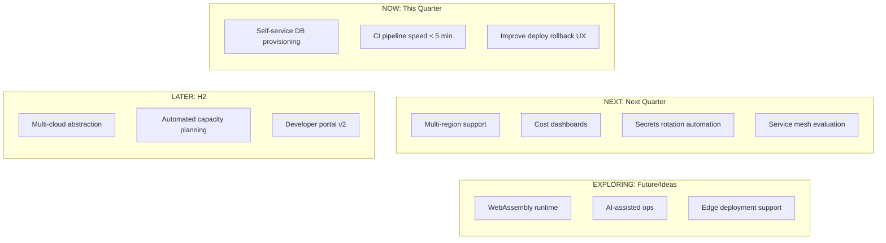
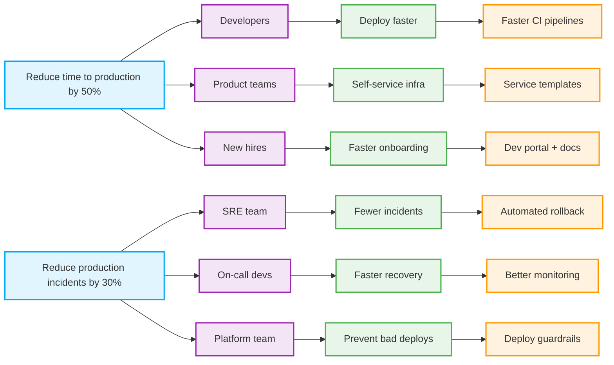

> **Discipline Module** | Complexity: `[ADVANCED]` | Time: 55-65 min

## Prerequisites

Before starting this module:
- **Required**: [Module 1.2: Developer Experience Strategy](../module-1.2-developer-experience/) — DX measurement and golden paths
- **Required**: [Module 1.1: Building Platform Teams](../module-1.1-platform-team-building/) — Team structures and hiring
- **Recommended**: [SRE: Service Level Objectives](/platform/disciplines/core-platform/sre/module-1.2-slos/) — Defining measurable targets
- **Recommended**: Some familiarity with product management concepts

---

## What You'll Be Able to Do

After completing this module, you will be able to:

- **Design a platform product strategy with clear user personas, value propositions, and success metrics**
- **Implement product management practices — roadmaps, backlogs, user research — for internal platforms**
- **Build feedback loops that continuously align platform capabilities with developer needs**
- **Evaluate platform ROI by measuring developer productivity, time-to-market, and infrastructure efficiency**

## Why This Module Matters

At a financial services company in 2021, the infrastructure team was proud of their work. They had built a Kubernetes platform with custom operators, a service mesh, progressive delivery, and automated certificate management. It took 18 months and 8 engineers. They called it "Project Atlas."

When they presented it to development teams, the first question was: "Can I deploy my Flask app with it?" The answer was: "Well, you need to write a custom resource definition, configure the Istio virtual service, set up the certificate issuer, and then..."

The room went quiet. The development teams went back to their AWS Elastic Beanstalk setup.

Project Atlas was an engineering project, not a product. Nobody had asked developers what they needed. Nobody had tested whether the abstractions made sense. Nobody had defined what "success" looked like beyond "it works." The team built what was technically interesting, not what was genuinely useful.

**Treating your platform as a product means starting with your users' problems, not your team's solutions.** It means doing user research, prioritizing ruthlessly, measuring adoption, and iterating based on feedback. This module teaches you the product management practices that make the difference between platforms developers love and platforms developers avoid.

---

## The Product Management Mindset for Platforms

### You Are Not a Service Bureau

Many platform teams operate in one of two modes:

**Mode 1: The Technology Project**
- Platform team decides what to build based on technical interest
- Success = "it works"
- Priorities set by the team or their manager
- No user research
- "If we build it, they will come"

**Mode 2: The Service Bureau**
- Developers file requests, platform team executes
- Success = "tickets closed"
- Priorities set by whoever screams loudest
- User research = reading tickets
- "We'll build whatever you ask for"

> **Stop and think**: Look at your team's current backlog. Are the items there because a user requested them, because they were technically interesting, or because data showed they were the biggest bottleneck?

Both modes fail. The Technology Project builds things nobody needs. The Service Bureau never builds strategic infrastructure because it is always reactive.

**Mode 3: The Product Team** (what you want)
- Platform team discovers and validates problems through research
- Success = adoption rate, developer satisfaction, time-to-production
- Priorities set by impact analysis and user data
- Regular user research and feedback cycles
- "We'll solve the problems that matter most"

### The Product Trio for Platforms

In product management, the "product trio" is:

| Role | Responsibility | Platform Context |
|------|---------------|-----------------|
| **Product Manager** | What to build and why | Platform PM: prioritization, roadmap, user research |
| **Designer** | How it looks and feels | Platform DX lead: APIs, CLIs, docs, portal UX |
| **Tech Lead** | How it works | Platform tech lead: architecture, implementation |

**The uncomfortable truth**: Most platform teams have a tech lead but no product manager and no designer. This is like building an external product with only engineers. You can do it, but the product will reflect engineering preferences, not user needs.

**If you cannot hire a dedicated platform PM**, designate someone on the team to own the product function. This person:
- Talks to developer teams weekly
- Maintains the platform roadmap
- Prioritizes based on data, not gut feel
- Says "no" to requests that don't align with strategy
- Measures adoption and satisfaction

---

## User Research for Internal Platforms

### "But Our Users Are Just Down the Hall"

The most common excuse for skipping user research is proximity. "We don't need formal research — we talk to developers every day."

This is wrong for three reasons:
1. **Selection bias**: You talk to the developers who come to you. These are the power users and the loudest complainers. You never hear from the silent majority.
2. **Solution framing**: When developers come to you, they bring solutions ("I need a bigger database"), not problems ("My queries are slow"). User research uncovers the real problems.
3. **Confirmation bias**: Informal conversations reinforce what you already believe. Structured research challenges assumptions.

### Research Methods for Platform Teams

| Method | Effort | Insight Quality | When to Use |
|--------|--------|----------------|-------------|
| **Developer shadowing** | High | Very high | Quarterly: sit with a developer for 2 hours and watch them work |
| **User interviews** | Medium | High | Monthly: 30 min structured conversations with 5 developers |
| **Surveys** | Low | Medium | Quarterly: quantitative trends and NPS tracking |
| **Usage analytics** | Low | Medium | Always-on: track what features are used, what's abandoned |
| **Support ticket analysis** | Low | Medium | Monthly: categorize and count request types |
| **Dogfooding** | Medium | High | Ongoing: use your own platform for your own development |

### Developer Shadowing: The Most Underused Method

Sit next to a developer for 2 hours. Don't help. Just watch and take notes.

> **Pause and predict**: If you sat behind a developer right now, how long do you think it would take them to deploy a one-line code change? How long do they think it takes? The difference between those two numbers is your friction.

**What to observe**:
```text
Developer Shadowing Notes - [Date] - [Developer Name/Team]
═══════════════════════════════════════════════════════════

Workflow observed: [what they were trying to do]

Time log:
  00:00 - Started task: [description]
  00:05 - Opened [tool/doc]. Searched for [what].
  00:08 - Couldn't find what they needed. Asked colleague on Slack.
  00:15 - Got answer. Switched to [different tool].
  00:22 - Hit error: [description]. Googled it.
  00:30 - Found workaround in old Slack thread.
  ...

Friction points (where they struggled):
  1. [description]
  2. [description]

Tools used: [list]
Context switches: [count]
Time waiting for things: [total]
Times they said "I wish..." or "This should be easier": [count and quotes]
```

**Do this with 3 different teams per quarter.** You will learn more in 6 hours of shadowing than in 6 months of assumptions.

### Structured User Interviews

Run 30-minute interviews with this script:

**Opening (5 min)**:
- "Tell me about the last time you deployed something to production."
- "Walk me through your typical day when you're building a new feature."

**Exploration (15 min)**:
- "What's the most frustrating part of your development workflow?"
- "If you had a magic wand, what would you change about our internal tools?"
- "Tell me about a time you worked around our platform instead of using it."
- "What do you spend time on that you think should be automated?"

**Validation (5 min)**:
- "We're thinking about building [feature X]. Would that help you?"
- "How would you prioritize these three improvements: [A], [B], [C]?"

**Closing (5 min)**:
- "Anything else we should know about your experience?"
- "Can I follow up with you next month?"

**The most important rule**: Listen more than you talk. If you are talking more than 20% of the time, you are doing it wrong.

---

## Roadmapping and Prioritization

### The Platform Roadmap

A platform roadmap is different from a product roadmap in three key ways:

| Dimension | Product Roadmap | Platform Roadmap |
|-----------|----------------|-----------------|
| **Time horizon** | Quarters | Halves or years (infrastructure changes are slow) |
| **Flexibility** | Can pivot quickly | Hard to pivot once infrastructure is deployed |
| **Dependencies** | Feature teams depend on you | AND you depend on feature teams to adopt |
| **Success metric** | Revenue, engagement | Adoption, satisfaction, reliability |

### Roadmap Structure



**Key principles**:
- **Now**: Committed work with clear scope. Teams can depend on this.
- **Next**: Planned but flexible. High confidence, details may change.
- **Later**: Strategic direction. Subject to change based on learning.
- **Exploring**: Ideas being evaluated. No commitment.

### RICE Prioritization

RICE is a scoring framework that helps you prioritize objectively:

| Factor | Definition | How to Estimate |
|--------|-----------|-----------------|
| **R**each | How many developers are affected? | Count of teams/developers per quarter |
| **I**mpact | How much will it help each developer? | 3 = massive, 2 = high, 1 = medium, 0.5 = low, 0.25 = minimal |
| **C**onfidence | How sure are you about reach and impact? | 100% = high, 80% = medium, 50% = low |
| **E**ffort | How many person-months? | Engineering estimate |

**RICE Score = (Reach x Impact x Confidence) / Effort**

**Example prioritization**:

| Initiative | Reach | Impact | Confidence | Effort | RICE Score |
|-----------|-------|--------|------------|--------|------------|
| Faster CI pipelines | 200 devs | 2 (high) | 80% | 2 months | **160** |
| Self-service databases | 80 devs | 3 (massive) | 80% | 3 months | **64** |
| Service mesh | 200 devs | 1 (medium) | 50% | 6 months | **16.7** |
| Custom Kubernetes operator | 20 devs | 2 (high) | 100% | 4 months | **10** |

In this example, faster CI pipelines wins by a wide margin. Service mesh — despite being technically interesting — scores low because of uncertain impact and high effort. The custom Kubernetes operator serves only 20 developers, making its reach too low to justify prioritization.

### Impact Mapping

Impact mapping connects business goals to platform initiatives:



**When RICE and impact mapping disagree**: RICE is tactical (what to build next). Impact mapping is strategic (what to build this year). Use impact mapping to set the direction, RICE to sequence within that direction.

---

## Success Metrics for Platform Products

### The Metrics That Matter

| Metric | What It Tells You | Target |
|--------|-------------------|--------|
| **Adoption rate** | Are teams choosing your platform? | > 80% of eligible teams |
| **Time-to-production** | How fast can a team ship? | < 2 hours for new service, < 30 min for changes |
| **Developer satisfaction** | Do developers like using it? | NPS > 40, satisfaction > 4/5 |
| **MTTR** | How fast do you recover from failures? | < 1 hour for platform issues |
| **Self-service ratio** | How many requests need human intervention? | > 90% self-service |
| **Onboarding time** | How fast can a new developer be productive? | < 3 days from laptop to first deploy |
| **Platform reliability** | Is your platform trustworthy? | > 99.9% availability |
| **Support ticket volume** | Is your platform easy to use? | Decreasing month over month |

### Leading vs Lagging Indicators

| Leading (predict future success) | Lagging (confirm past success) |
|----------------------------------|-------------------------------|
| Feature usage within first week | Adoption rate at quarter end |
| Developer NPS trend | Support ticket resolution time |
| Time-to-first-deploy for new teams | Overall time-to-production |
| Documentation page views | Self-service ratio |
| Support ticket resolution time | Support ticket volume trend |

**Track leading indicators weekly, lagging indicators monthly.** If leading indicators are trending down, you have time to course-correct before lagging indicators confirm the problem.

> **Stop and think**: What is the primary metric your team currently uses to report progress to leadership? If it is "number of features deployed" or "number of tickets closed," you are measuring output, not outcome.

### The Anti-Metric: Feature Count

**Never measure platform success by features shipped.** A platform team that ships 20 features nobody uses is less successful than a team that ships 3 features everyone adopts. Features are output. Adoption is outcome.

---

## Marketing Your Platform Internally

### Why Marketing Matters

"Good products sell themselves" is a myth. Even internal products need marketing because:
- Developers are busy and do not read announcements
- Switching costs make inertia powerful
- Bad first impressions create lasting resistance
- Word of mouth is slow for infrastructure tools

### Internal Marketing Tactics

| Tactic | Effort | Impact | Notes |
|--------|--------|--------|-------|
| **Weekly changelog** | Low | Medium | Email/Slack: what changed this week, with before/after examples |
| **Internal blog posts** | Medium | High | Deep dives on how a feature solves a real problem |
| **Demo days** | Medium | High | Monthly 30-min live demos of new capabilities |
| **Champions program** | High | Very high | Identify advocates in each team, give them early access |
| **Migration success stories** | Medium | High | "Team X migrated and reduced deploys from 30 min to 3 min" |
| **Office hours** | Low | Medium | Weekly drop-in session for questions and feedback |
| **Slack channel** | Low | Medium | Active channel where platform team is responsive |
| **Metrics dashboard** | Medium | High | Public dashboard showing platform value (deploy speed, reliability) |

### The Champions Program

The most effective internal marketing is peer recommendation. A "champions program" formalizes this:

> **Pause and predict**: Which developers in your organization are already informally helping their peers with platform issues? These are your natural candidates for a champions program.

**How it works**:
1. Identify 1-2 developers per major team who are enthusiastic about the platform
2. Give them early access to new features
3. Include them in design reviews
4. Train them to help their teammates
5. Recognize them publicly (shout-outs, swag, whatever your culture supports)

**Why it works**:
- Developers trust peers more than platform teams
- Champions provide distributed support, reducing platform team load
- Champions give you embedded user research
- Champions create social proof ("if Team X uses it, it must be good")

---

## Common Mistakes

| Common Mistake | Why It Happens | Better Approach |
|---------------|----------------|-----------------|
| Building features without user research | Engineers assume they know what developers need | Interview 5+ developers before starting any major initiative |
| Measuring success by features shipped | Feature count feels productive and is easy to track | Measure adoption rate, developer satisfaction, and time-to-production instead |
| Skipping internal marketing | "Good products sell themselves" mindset | Treat every launch like a product launch: changelog, demo day, champions |
| No product manager on the platform team | Leadership sees platform as "just infrastructure" | Hire or designate a PM; without one, engineering preferences drive priorities |
| Treating all feedback equally | Loudest voices get priority regardless of impact | Use RICE scoring to prioritize by reach, impact, confidence, and effort |
| Building for power users only | Power users give the most feedback and are easiest to reach | Shadow average developers; the silent majority has different needs |
| Roadmap driven by leadership pet projects | Senior leaders push "strategic" initiatives without data | Require concrete business justification and show trade-offs explicitly |
| Never killing projects | Sunk cost fallacy and fear of admitting mistakes | Set clear success criteria upfront; kill projects that do not meet them |

---

## Did You Know?

> **Gartner predicted** that by 2026, 80% of large software engineering organizations will have platform teams acting as internal providers of reusable services and tools. But they also predicted that most will fail to deliver measurable value because they lack product management discipline.

> The concept of "internal customers" dates back to the 1980s (Kaoru Ishikawa's quality management work), but most internal platform teams still don't treat their users as customers. They treat them as captive audiences who have no choice. This mindset produces bad platforms.

> **Stripe's developer experience team** applies the same product rigor to their internal tools as they do to their external API. Internal tools go through design reviews, user testing, and beta programs. The result: Stripe consistently ranks as one of the best engineering organizations to work at.

> According to McKinsey's 2023 developer survey, organizations with dedicated platform product managers see **23% higher developer satisfaction** and **31% faster time-to-production** compared to organizations where platform teams set their own priorities.

---

## Knowledge Check

### Question 1
> Scenario: You are leading a platform team that has historically operated as a "Service Bureau," prioritizing work based on whichever development team complains the loudest in Slack. You want to shift to a "Product Team" mode. Which of the following best describes how your day-to-day prioritization process will change, and why is this more effective?

<details>
<summary>Show Answer</summary>

As a Service Bureau, your priorities were purely reactive and focused on closing incoming tickets, meaning you never built strategic, long-term infrastructure. Shifting to a Product Team mode means you will now proactively discover problems through user research and prioritize based on impact and data. This outperforms the Service Bureau model because it ensures you are solving the most widespread friction points rather than just satisfying the most vocal individuals. By defining clear success metrics like adoption rates, you can validate that the things you build actually deliver organizational value.

</details>

### Question 2
> Scenario: Your platform team is trying to figure out why developers are struggling to use the new internal developer portal. One engineer suggests sending a 10-question survey to the engineering department. You suggest doing two hours of "developer shadowing" instead. Why is your approach likely to uncover the actual root cause of the portal's poor adoption?

<details>
<summary>Show Answer</summary>

Shadowing is more valuable in this scenario because it reveals the friction points that developers have normalized and stopped noticing. When developers take a survey, they only report the problems they are consciously aware of or can articulate, which often leads to them requesting specific solutions rather than describing their core problems. By sitting and watching a developer work, you can directly observe context switches, undocumented workarounds, and exactly where they abandon the portal to use the old CLI tools. Shadowing cuts through the "XY problem" by letting you see the raw workflow before the developer's biases or memory filters it.

</details>

### Question 3
> Scenario: Your team is evaluating a new feature to automate database migrations. You estimate it will reach 150 developers per quarter. You believe it will have a high impact (score of 2) on their workflow, and you are 80% confident in these estimates. The engineering effort required is 4 person-months. Should you immediately commit to building this feature based on its RICE score?

<details>
<summary>Show Answer</summary>

The RICE score for this initiative is 60 ((150 × 2 × 0.8) / 4). However, you should not automatically commit to building it just because it has a score. RICE is designed for relative prioritization across a backlog, not absolute go/no-go decisions in isolation. You must compare this score of 60 against the scores of other proposed initiatives on your platform roadmap. If your highest-scoring alternative is a 40, this feature is a clear priority; but if another initiative scores 150, this database migration feature should be deferred until higher-impact work is completed.

</details>

### Question 4
> Scenario: You present your quarterly platform metrics to the CTO. You proudly report that the new continuous delivery platform has reached 90% adoption across the engineering organization. However, the CTO points out that the latest internal NPS survey shows a developer satisfaction score of 2.5 out of 5 for the platform. How can you explain this discrepancy, and what should your immediate next step be?

<details>
<summary>Show Answer</summary>

High adoption paired with low satisfaction almost always indicates a "captive audience" situation where developers are forced to use the platform rather than choosing it willingly. This typically happens when leadership mandates the adoption of a tool, or when there are simply no other approved alternatives for deploying code. While the platform might technically solve the core problem, the user experience is likely frustrating, slow, or poorly documented, causing deep resentment. Your immediate next step must be conducting user research, such as developer shadowing, to identify and fix the most painful friction points before this dissatisfaction leads to developers building shadow IT workarounds.

</details>

### Question 5
> Scenario: A senior engineer on your platform team is extremely excited about building a custom Kubernetes operator to automate cache invalidation. However, after running the numbers, you realize this operator will only solve a problem for 5 teams and has a low RICE score of 15. The engineer is pushing hard to start the work because the technology is "cutting edge." How do you handle this prioritization conflict?

<details>
<summary>Show Answer</summary>

You should have a transparent conversation with the engineer grounded entirely in the data rather than personal preference. Show them the RICE analysis to objectively demonstrate why their proposal, while technically interesting, does not have the reach to justify prioritizing it over items that serve the broader engineering organization. It is important to also listen to their perspective in case you missed critical context, such as those 5 teams being responsible for the company's highest-revenue product. Ultimately, if the score remains low, you must firmly explain the trade-offs and clarify that building the operator means delaying higher-impact work, which would hurt overall developer productivity.

</details>

### Question 6
> Scenario: You are preparing to launch a completely revamped self-service infrastructure portal. Your previous launch failed because developers simply ignored the Slack announcements and emails. For this launch, you decide to invest heavily in building a "champions program." Why is this specific approach the most effective way to ensure successful adoption across the company?

<details>
<summary>Show Answer</summary>

A champions program is highly effective because it leverages the trust developers naturally have in their immediate peers over the platform team. By identifying enthusiastic early adopters in various teams, giving them early access, and empowering them to advocate for the portal, you create distributed, localized support. When developers see their respected teammates successfully using the new portal to ship faster, that social proof is far more persuasive than any top-down marketing email. Furthermore, champions significantly reduce the support burden on the platform team while providing an embedded source of continuous user feedback.

</details>

### Question 7
> Scenario: You have finalized your platform roadmap for the upcoming half, carefully balancing four high-impact initiatives. During a review, the VP of Engineering demands that you immediately add "multi-cloud abstraction" to the roadmap. Your data shows this has a very low RICE score, but the VP insists it is a "strategic imperative." How do you navigate this demand without completely abandoning your data-driven prioritization?

<details>
<summary>Show Answer</summary>

You must guide the VP to articulate the concrete business value behind the "strategic" label, transforming a vague mandate into a measurable goal. Present the trade-offs explicitly by showing exactly which of the four currently planned initiatives will be delayed and detailing the resulting cost to developer productivity. If the business justification is genuinely compelling—such as needing multi-cloud to close a major enterprise customer—you should accept the initiative but define strict scope and success criteria to prevent it from ballooning. By framing the conversation around trade-offs and measurable outcomes, you protect the integrity of your roadmap while still aligning with leadership's business objectives.

</details>

### Question 8
> Scenario: During performance reviews, a platform engineering manager argues that their team was highly successful this year because they shipped 25 new platform features, beating their goal of 20. However, when you look at the deployment data, overall time-to-production for the company hasn't improved at all. Why is the manager's reliance on "features shipped" a fundamentally flawed way to measure platform success?

<details>
<summary>Show Answer</summary>

"Features shipped" is an output metric that measures activity, whereas a platform's true value is determined by outcome metrics like adoption, satisfaction, and reduced time-to-production. A team can easily ship 25 features that are entirely disconnected from the actual problems developers face, resulting in zero organizational value despite high engineering output. Tracking feature count actively incentivizes the team to build smaller, disjointed components and move on quickly, rather than ensuring what they build is usable, well-documented, and widely adopted. Ultimately, a single feature that solves a major friction point and achieves 90% adoption is vastly more successful than two dozen features that collect dust.

</details>

---

## Hands-On Exercises

### Exercise 1: Platform Product Canvas (45 min)

Complete this canvas for your platform (or a platform you plan to build):

| USERS | PROBLEMS |
|-------|----------|
| **Who uses our platform?**<br><br>•<br>•<br>• | **What problems do they have?**<br><br>•<br>•<br>• |
| **ALTERNATIVES** | **What do they use today?**<br><br>•<br>•<br>• | **Why is our platform better?**<br><br>•<br>•<br>• |
| **KEY METRICS** | **UNFAIR ADVANTAGE** |
| **How do we measure success?**<br><br>•<br>•<br>• | **What can we do that nobody else can?**<br><br>•<br>•<br>• |
| **CHANNELS** | **COST STRUCTURE** |
| **How do users find and adopt the platform?**<br><br>•<br>•<br>• | **What does the platform cost to build and run?**<br><br>•<br>•<br>• |

**Validation**: Share the canvas with 3 developers. Ask: "Does this accurately describe your experience?" Revise based on feedback.

### Exercise 2: User Interview Practice (40 min)

Conduct a mock user interview with a colleague (or a real one if you have access to a developer team):

**Preparation** (10 min):
1. Write down your 3 biggest assumptions about what developers need
2. Create 5 open-ended questions designed to validate or challenge those assumptions
3. Prepare a notepad for observations

**Interview** (20 min):
Follow the interview script from the "Structured User Interviews" section. Record key quotes.

**Synthesis** (10 min):
```text
Interview Synthesis - [Date]
════════════════════════════

Top 3 pain points mentioned:
  1. [quote + context]
  2. [quote + context]
  3. [quote + context]

Surprises (things I didn't expect):
  1.
  2.

Assumptions validated:
  [+] [assumption] — confirmed by [evidence]
  [-] [assumption] — contradicted by [evidence]

Actions:
  1. [what to investigate further]
  2. [what to change based on this interview]
```

### Exercise 3: RICE Prioritization (30 min)

Take your current platform backlog (or create a fictional one of 8-10 items) and score each using RICE:

| Initiative | Reach | Impact | Confidence | Effort | RICE |
|-----------|-------|--------|------------|--------|------|
| | | | | | |
| | | | | | |
| | | | | | |

After scoring:
1. Sort by RICE score
2. Compare with your current priority order
3. Identify the biggest discrepancy (something you ranked low that RICE ranks high, or vice versa)
4. Discuss: Is RICE right, or is there context RICE misses?

### Exercise 4: Internal Marketing Plan (30 min)

Create a 90-day marketing plan for your platform's next major feature:

```text
Feature: [name]
Target audience: [which teams]
Launch date: [date]

Pre-launch (30 days before):
  Week 1: [ ] Identify 3 champion teams for beta
  Week 2: [ ] Beta launch with champions
  Week 3: [ ] Collect feedback, iterate
  Week 4: [ ] Create success story from beta team

Launch (week of):
  [ ] Blog post with problem/solution narrative
  [ ] Demo day presentation
  [ ] Slack announcement with key metrics
  [ ] Documentation published
  [ ] Migration guide ready

Post-launch (60 days after):
  Week 1-2: [ ] Office hours for early adopters
  Week 3-4: [ ] Publish adoption metrics
  Week 5-6: [ ] Champions help next wave of teams
  Week 7-8: [ ] Retrospective: what worked, what didn't

Success criteria:
  [ ] X teams adopted within 30 days
  [ ] Developer satisfaction > Y/5
  [ ] Support tickets < Z per week
```

---

## War Story: The Platform That Saved Itself With Product Management

**Company**: B2B SaaS company, ~600 engineers, 45 services

**Situation**: The platform team (8 engineers) had been building for 2 years without a product manager. They had a sophisticated CI/CD system, a Kubernetes abstraction layer, and an observability stack. But adoption was stagnating at ~50% of teams, and the CTO was questioning the team's value.

**The intervention**: The company hired a platform product manager. Her first 30 days:

**Week 1: Discovery**
- Interviewed 15 developers across 8 teams
- Shadowed 3 developers for 2 hours each
- Analyzed 6 months of support tickets
- Reviewed platform usage analytics

**Key finding**: The platform's biggest problem was not missing features. It was that the 50% of teams who had not adopted were not even aware of what the platform offered. The team had never done internal marketing. Features existed but were undiscoverable.

**Second finding**: The features developers wanted most were not what the platform team was building. Developers wanted faster CI (averaging 18 minutes), easier rollback (currently a manual 7-step process), and better documentation. The platform team was building multi-cloud abstraction.

**Week 2-3: Strategy**
- Created a platform product canvas
- Built a RICE-prioritized roadmap
- Killed the multi-cloud project (RICE score: 8. Faster CI score: 240)
- Defined success metrics: adoption rate, time-to-deploy, NPS

**Week 4: Execution kickoff**
- Launched a weekly changelog (Slack + email)
- Created a champions program with 6 developer advocates
- Started a monthly demo day
- Began work on CI speed (18 min → target 5 min)

**Results after 6 months**:
- Adoption: 50% → 78%
- CI pipeline time: 18 min → 6 min
- Deploy rollback: 7 manual steps → 1 command
- Developer NPS: 12 → 48
- Support tickets: Down 40%

**Business impact**: The CTO went from questioning the team's existence to expanding it by 4 headcount. Two product teams attributed faster feature delivery directly to platform improvements. Estimated productivity gain: 15% across adopting teams.

**Timeline**:
- Month 0: PM hired
- Month 1: Discovery and strategy
- Month 2: Quick wins (changelog, champions, docs)
- Month 3-4: CI speed improvement
- Month 5: Rollback UX improvement
- Month 6: Measure results, plan next cycle

**Lessons**:
1. **Product management transforms platform teams**: The same 8 engineers delivered dramatically more value with product direction
2. **Discovery before delivery**: 30 days of research prevented months of wasted work (multi-cloud)
3. **Marketing is not optional**: If developers don't know about your platform, it doesn't exist
4. **Measure adoption, not features**: Features shipped means nothing; adoption means everything
5. **Kill projects ruthlessly**: The multi-cloud project was 4 months in. Killing it was painful but correct

---

## Summary

Treating your platform as a product means applying the discipline of product management to internal infrastructure. This includes user research (shadowing, interviews, surveys), strategic prioritization (RICE, impact mapping), clear success metrics (adoption, not features), and intentional marketing (champions, demos, changelogs).

Key principles:
- **Start with problems, not solutions**: User research before engineering
- **Prioritize by impact**: RICE over gut feel or technical interest
- **Measure adoption**: The only metric that proves platform value
- **Market internally**: If developers don't know about it, you didn't build it
- **Kill projects**: If RICE says no, stop — even if it is technically interesting
- **Hire a product manager**: Or designate someone to own the product function

---

## What's Next

Continue to [Module 1.4: Adoption & Migration Strategy](../module-1.4-adoption-migration/) to learn how to drive adoption of your platform and manage migrations from legacy systems.

---

*"The best internal platform is one that developers choose to use, recommend to peers, and miss when it's gone."*