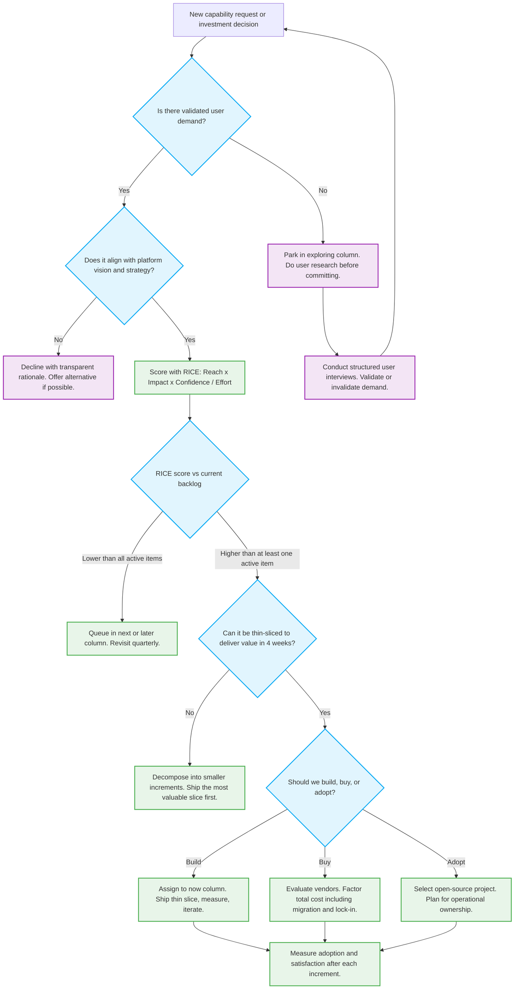

> **Discipline Module** | Complexity: `[ADVANCED]` | Time: 55-65 min

## Prerequisites

Before starting this module:
- **Required**: [Module 1.2: Developer Experience Strategy](../module-1.2-developer-experience/) — DX measurement and golden paths
- **Required**: [Module 1.1: Building Platform Teams](../module-1.1-platform-team-building/) — Team structures and hiring
- **Recommended**: [SRE: Service Level Objectives](/platform/disciplines/core-platform/sre/module-1.2-slos/) — Defining measurable targets
- **Recommended**: Some familiarity with product management concepts

---

## What You'll Be Able to Do

After completing this module, you will be able to:

- **Design a platform product strategy with clear user personas, value propositions, and success metrics**
- **Implement product management practices — roadmaps, backlogs, user research — for internal platforms**
- **Build feedback loops that continuously align platform capabilities with developer needs**
- **Evaluate platform ROI by measuring developer productivity, time-to-market, and infrastructure efficiency**
- **Choose between product-style funding, project funding, and build-vs-buy-vs-adopt decisions for platform capabilities**

---

## Why This Module Matters

Hypothetical scenario: a platform team spends 18 months building a Kubernetes platform with custom operators, a service mesh, progressive delivery, and automated certificate management. Eight engineers. When they present it to development teams, the first question is: "Can I deploy my Flask app with it?" The answer involves custom resource definitions, Istio virtual service configuration, and certificate issuer setup. The room goes quiet. The development teams return to their existing setup — whatever they were using before.

This is not a hypothetical about bad technology. The platform was technically excellent. What it lacked was product thinking. Nobody had asked developers what they needed. Nobody had tested whether the abstractions made sense for the people who would use them. Nobody had defined "success" beyond "the platform works." The team built what was technically interesting, not what was genuinely useful — and the result was a platform nobody wanted.

Treating your platform as a product means starting with your users' problems, not your team's solutions. It means doing user research, prioritizing ruthlessly based on impact, measuring adoption rather than feature output, and iterating based on feedback. It is the difference between a platform developers love and one they route around.

This mindset shift has deep roots. Evan Bottcher articulated it clearly in his 2018 article "What I Talk About When I Talk About Platforms" on martinfowler.com: a digital platform is "a foundation of self-service APIs, tools, services, knowledge and support which are arranged as a compelling internal product." The word "compelling" is critical — it implies that developers should want to use the platform, not be compelled by mandate. The CNCF Platforms White Paper, maintained by the CNCF TAG App Delivery Platforms Working Group, reinforces this with a product-centric definition: platforms "curate and present foundational capabilities, frameworks and experiences to facilitate and accelerate the work of internal customers." The internal-customer framing is not metaphorical. It is the operating model. Team Topologies (Skelton & Pais) similarly positions the platform team as providing a "compelling internal product" to stream-aligned teams, with the X-as-a-Service interaction mode as the primary interface.

This module teaches you the product management practices that make the difference between platforms developers choose and platforms they endure. You will learn how to discover real developer needs, how to build a product roadmap, how to measure what actually matters, and how to fund and sustain your platform as a long-lived product rather than a one-off project.

---

## Product Thinking for Internal Platforms

### The Shift from Project to Product

The default funding and governance model for internal infrastructure has historically been the project model. A budget is allocated, a team is assembled, a scope document is written, and the team builds toward a completion date. When the date arrives, the project is "finished" — often with a handoff to an operations team that had no part in its design — and the engineers roll off to the next initiative. This model works for bounded deliverables. It fails catastrophically for platforms.

A platform is never finished. The underlying technologies evolve. Developer needs change as the application landscape shifts. Security vulnerabilities must be patched. New teams onboard with unfamiliar requirements. Old capabilities that were once essential become dead weight. A platform that receives no continuous investment decays — not gradually, but sharply: bit-rotted documentation, unpatched dependencies, drifted configurations, and an accumulating reputation as unreliable. Developers who tried the platform and hit these rough edges do not come back. They tell their peers. The platform's adoption curve inverts. The product model treats the platform as a long-lived asset with an accountable, durable owner, where the team does not disband after the initial build but stays together, maintains a backlog, runs user research, ships improvements incrementally, and measures outcomes. The funding is ongoing rather than one-off.

This is the central insight of Thoughtworks' platform-as-a-product philosophy: a platform that is treated as a project will behave like a project — complete, static, and eventually irrelevant. A platform that is treated as a product will behave like a product — evolving, responsive, and continuously valuable. Evan Bottcher made the same point about organizational coupling: in the project model, work is batched and handed off across team boundaries, creating "backlog coupling" where the platform team's priorities are detached from delivery teams' real-time needs. In the product model, the platform team prioritizes its own backlog but does so based on direct user feedback and outcome data, creating alignment without central coordination. The platform team's backlog is not a queue of requests from other teams — it is a hypothesis-driven roadmap of investments the team believes will create the most leverage, validated continuously.

### Internal Developers Are Customers — With Real Choice

The most uncomfortable implication of product thinking for internal platforms is that your users have a choice. They may not have a formal menu of alternatives, but they can — and will — route around your platform if it creates more friction than it removes. Shadow IT is not a disciplinary problem. It is market feedback. When a delivery team provisions their own infrastructure outside the platform, uses an unapproved tool, or scripts around your API because it is too complex, they are voting with their time. The paved road must be easier than the alternatives, or nobody will walk on it.

This is the "paved-road-as-pull" principle. The platform team cannot mandate adoption and expect lasting success. Mandating a platform that developers find frustrating creates resentment, workarounds, and — in the worst case — a parallel infrastructure maintained by the people you were supposed to be helping. Adoption must be earned by making the platform genuinely, demonstrably easier to use than the alternatives. Every time a developer chooses to use your platform over rolling their own, you have won a vote of confidence. That confidence is fragile and must be re-earned with every release.

This also means that the platform team's relationship with its users is not a transaction but an ongoing commitment. The team must actively listen, respond to feedback visibly, and communicate its roadmap so that users can see that their input shapes the platform's direction. When a feature request is declined, the rationale must be transparent — ideally backed by data from the prioritization framework. When a bug is fixed, the fix must be announced. Silence from the platform team breeds the assumption that the platform is abandoned, and abandoned platforms lose users quickly.

---

## Know Your Users

### Developer Personas and Jobs-to-Be-Done

Product thinking requires knowing who your users actually are — not who you imagine them to be. In platform contexts, the instinct is to treat "developers" as a uniform category. They are not. A new hire in their first week has fundamentally different needs from a staff engineer optimizing a hot path. A frontend developer working on a React application has a different workflow from a data engineer building pipelines. A developer on a greenfield project building the first service has different platform needs from a developer maintaining a legacy monolith that cannot be easily containerized.

Developer personas are a lightweight tool for making these differences explicit. A persona captures a named archetype — for example, "Priya, the New Hire" or "Marcus, the Legacy Service Maintainer" — along with their primary goals, their typical workflow, their biggest frustrations, and what a successful platform interaction looks like for them. Personas are not market-research artifacts requiring statistical rigor. They are empathy tools that force the platform team to ask, before any design decision: which persona benefits from this? Which persona might be harmed? If the answer is "nobody specific" or "power users only," the investment is probably misdirected.

The jobs-to-be-done framework, drawn from product management practice, focuses on the functional, emotional, and social purposes a user is trying to accomplish. In platform terms, a developer is not trying to "use the CI pipeline." They are trying to get their code change into production and confirm it did not break anything. The CI pipeline is just one tool among many that helps them complete that job. Jobs-to-be-done thinking prevents the platform team from optimizing individual tools in isolation while missing the end-to-end experience. You can have the fastest CI pipeline in the world, but if the deployment, rollback, and observability steps that follow are painful, the job is still not done well.

### User Research: Beyond the Ticket Queue

If you only talk to developers who file support tickets with you, you are sampling the loudest voices and the most technical users — never the silent majority. Structured user research corrects this bias. Developer shadowing — sitting beside a developer for two hours, watching their workflow without intervening — is the method that produces the highest-quality insight per hour invested. It reveals the friction points developers have normalized and stopped noticing. A survey asks a developer what frustrates them; shadowing shows you that they open seven different tools to deploy a one-line change because the integration between those tools was never designed.

Structured user interviews complement shadowing with qualitative depth. A 30-minute conversation using the framework described in this module — opening with "Tell me about the last time you deployed something," exploring with "What would you change if you had a magic wand?", and validating proposed features — uncovers problems developers cannot articulate in a ticket. The most important rule of these interviews is that the interviewer should talk less than 20% of the time. If you are explaining, you are not learning.

Surveys and usage analytics provide breadth. A quarterly NPS survey tracks satisfaction trends across the entire engineering organization. Platform analytics — which features are used, which are ignored, where users drop out of workflows — provide objective behavioral data that complements self-reported sentiment. The combination of deep qualitative research with broad quantitative measurement gives the platform team a complete picture of what developers actually need.

### The Platform Product Manager Role

If your platform team has no product manager — and most do not — someone is still making product decisions. The decision-maker just happens to be an engineer making choices based on technical interest rather than user need. This does not produce bad platforms every time, but it produces them consistently. A platform product manager (PM) owns the "what to build and why" function: they conduct user research, maintain the roadmap, prioritize against impact data, say no to requests that do not align with strategy, and measure adoption and satisfaction.

The PM does not need to be a dedicated headcount. In smaller organizations, a senior engineer who is given explicit product ownership authority and carved-out time can fill the function. The critical requirement is not the title but the accountability: someone on the team must be responsible for ensuring that what gets built is what users need, not just what is technically interesting. This person must have the organizational authority to say no — including to senior engineers who want to build the "technically elegant" solution over the "actually useful" one.

---

## Roadmap, Vision, and Prioritization

### Outcome-Oriented Roadmaps

A platform roadmap defines what the team will build and in what order. The temptation — especially for teams accustomed to project funding — is to treat the roadmap as a feature delivery schedule with fixed dates. This is a mistake. Platform roadmapping should be outcome-oriented: each entry describes the user problem to be solved and the measurable outcome that would signal success, not just the feature to be shipped.

The "now / next / later / exploring" framework provides a good structure. "Now" contains committed work with clear scope — delivery teams can depend on these capabilities arriving this quarter. "Next" contains planned but flexible work with high confidence that it will be built, though details may change as the team learns. "Later" describes strategic direction — subject to change based on what the team discovers in the current cycle. "Exploring" captures ideas being evaluated with no commitment. This structure communicates certainty where it exists and honesty where it does not, which builds trust with the teams consuming the platform.

A common failure mode is the roadmap that is entirely driven by the loudest requesters. When a VP demands that a specific capability be added to the "now" column, the platform PM must engage in a trade-off conversation: which currently planned item would be displaced? What data supports the VP's request over the existing priorities? If the VP cannot articulate the measurable benefit and cannot identify what they are willing to sacrifice, the request is not a strategy — it is an impulse.

### Saying No

The scarcest resource on a platform team is attention. Every yes to a new capability is a no to maintenance, documentation, onboarding support, and the other "unsexy" work that determines whether the platform is actually usable. The most valuable skill a platform PM can develop is the ability to say no clearly, transparently, and without apology.

A well-structured no includes three elements. First, the data: here is how we scored this request against our other priorities using RICE or an equivalent framework, and here is where it ranks. Second, the trade-off: here is what we would have to stop doing in order to build this. Third, an alternative: if the need is genuine, is there a lightweight workaround, an existing tool that addresses 80% of the requirement, or a path for the requesting team to solve it themselves on top of the platform's APIs? A no that offers an alternative is much harder to argue with than a flat refusal.

### Thin-Slice Delivery

Platform capabilities should be delivered in the smallest viable increment that produces value for a real user, not in monolithic releases that take quarters to complete. A thin slice of a new self-service database capability might be: support for one database engine, one instance size, in one environment, with provisioning via a CLI command. Ship that to five beta teams. Watch them use it. Learn what breaks. Then add a second engine, or a UI, or automated backups — whatever the usage data and user feedback indicate is the most urgent next increment. This approach keeps the feedback loop short, prevents the team from building the wrong thing for months before discovering the mismatch, and gives users a stake in the platform's evolution.

### Opt-In over Mandate

When you release a new platform capability, the default should be opt-in. Make it discoverable, document it well, promote it through internal marketing channels, and let teams adopt it when they are ready. A mandate — "all teams must migrate by Q3" — may hit the adoption metric, but it almost always destroys satisfaction and trust. Teams forced to migrate before the platform is ready for their use case become vocal critics. Teams that migrate on their own timeline and find the experience positive become advocates. The adoption curve may be slower with opt-in, but the retention curve is much stronger.

---

## Adoption and Value Metrics

### Measuring What Matters

The single most important change a platform team can make to its operating model is to shift from measuring output to measuring outcome. Output is what you produce: features shipped, tickets closed, infrastructure provisioned. Outcome is what you achieve: developer time saved, time-to-production reduced, incidents prevented. Output metrics create incentives to build more things. Outcome metrics create incentives to build more valuable things.

Adoption rate is the foundational outcome metric for a platform product. It answers the question: of the teams who could use this platform, how many actually do? Adoption is not just a number — it is a signal of value. If adoption is low, the platform is either not solving a real problem, not easy enough to use, or not well enough communicated. If adoption is high and satisfaction is also high, the platform is delivering genuine value. If adoption is high but satisfaction is low, developers are a captive audience — mandated onto a platform they resent, which is a dangerous state because they will actively seek alternatives the moment one becomes available.

Time-to-first-value measures how long it takes a new team to achieve something useful on the platform: deploy their first service, provision their first database, run their first pipeline. If this number is measured in weeks, onboarding is broken and adoption will stall. The platform team should track this metric obsessively and invest in documentation, templates, and self-service tooling until the time-to-first-value for a standard workload is measured in hours — ideally minutes.

Retention — whether teams stay on the platform once they have adopted it — is the least-tracked and most honest metric. A team that tries the platform and then quietly returns to their previous workflow is feedback that the platform is creating more friction than the alternative. Retention tracking requires active observation: monitoring which teams have stopped using platform features, reaching out to understand why, and feeding the reasons directly into the backlog.

Developer satisfaction, typically measured through quarterly NPS surveys or periodic satisfaction scores, provides the qualitative complement to quantitative adoption metrics. A satisfaction score trending downward is an early warning signal that may precede adoption decline. A score trending upward, especially among teams that recently onboarded, validates that the platform team's investments are landing well.

### The Paved-Road-as-Pull Principle

Adoption earned through mandate is adoption on paper. Adoption earned through developer preference is adoption in fact. The platform team's job is to make the paved road the easiest path — not the only path. This means that every capability the platform provides must be easier to use than the alternative: faster to set up, better documented, more reliable, and with clear escalation paths when something goes wrong. If the platform's CI pipeline takes 10 minutes to configure and the team's homegrown script takes 2 minutes, the platform loses every time — unless the platform also provides monitoring, rollback, and secret management that the homegrown script cannot match. The value proposition must be clear and comparative.

In practice, the paved-road-as-pull principle means the platform team should welcome — or at least tolerate — the existence of alternatives. If a team has a legitimate reason to use a different tool or approach, the platform team's response should be curiosity, not coercion. What problem is the alternative solving that the platform does not? Can the platform absorb that capability? Can the alternative be wrapped and brought under the platform's governance without disrupting the team's workflow? Treating off-platform tooling as competitive intelligence rather than policy violation transforms an adversarial relationship into a collaborative one.

---

## Marketing Your Platform Internally

"Good products sell themselves" is a persistent myth in platform engineering. Even internal products need marketing because developers are busy, do not read all-hands announcements, and have strong inertia toward their existing workflows. A bad first impression — a confusing onboarding experience, an undocumented edge case, a cold-start problem — can create lasting resistance that is far harder to undo than the initial marketing investment would have been to make.

The most effective internal marketing tactic, across decades of platform practice, is the champions program. Identify one or two developers in each major team who are enthusiastic about the platform or who have already adopted it successfully. Give them early access to new features. Include them in design reviews. Train them to help their teammates. Recognize them publicly. The mechanism works because developers trust their peers far more than they trust the platform team. When a respected engineer on their team says "I switched to the platform pipeline and it cut my deploy time in half," that recommendation carries weight no internal blog post can match. Champions also provide distributed first-line support, reducing the platform team's support burden while giving the champions a sense of ownership and influence over the platform's direction.

A weekly changelog distributed through Slack or email is the lowest-effort, highest-signal marketing channel. It tells developers that the platform is alive and improving — countering the silent-abandonment perception that kills platform credibility. Each entry should describe what changed, why it matters, and — crucially — show a before-and-after that makes the benefit concrete: "Deploy rollback used to require 7 manual steps across 3 tools. Now it's one command: `platform rollback`. Here is a 30-second demo." Demo days — monthly 30-minute live sessions where the platform team shows new capabilities and answers questions — create a feedback channel that is both marketing and user research. Developers see what is available, ask questions that reveal misunderstandings or gaps in documentation, and suggest improvements that the platform team can capture immediately. The live format signals openness and responsiveness, which builds the trust that passive announcements cannot.

---

## Funding and Operating Model

### Product-Style Funding vs Project Funding

How a platform is funded determines how it behaves. Project funding — a fixed budget for a fixed scope delivered by a fixed date — creates short-term incentives. The team optimizes for completion over quality, ships what was scoped rather than what is needed, and disbands after delivery. There is no mechanism for continuous improvement, no accountability for long-term outcomes, and no incentive to care about adoption after the project closes. The result is a platform that is complete and already decaying.

Product-style funding allocates the platform team a recurring budget tied to the outcomes it delivers, not the features it ships. The team has ongoing headcount and operating budget, maintained year over year, with continued funding depending on demonstrated measurable value: adoption growth, developer satisfaction, time-to-production improvements, and reliability gains. This creates exactly the right incentives: the team is accountable for outcomes, not output; they invest in the work that produces the most leverage; they maintain and improve what they have already built because letting it decay would show up in the metrics. The shift from project to product funding is organizational, not technical, and it requires executive sponsorship — the CTO or VP of Engineering must understand and champion the distinction, because the funding model shapes behavior more powerfully than any cultural manifesto.

### Build vs Buy vs Adopt

Not every platform capability needs to be built from scratch. The product mindset applies equally to the sourcing decision. For any given capability — a service mesh, a secrets management solution, a developer portal — the platform team should evaluate three paths: build it internally, buy a commercial product or managed service, or adopt an existing open-source project that the team can configure and operate. The build option gives maximum control and customizability but carries the full maintenance burden. The buy option offloads maintenance but introduces vendor dependency and may not fit the organization's specific needs. The adopt option provides community support and avoids vendor lock-in but requires the team to develop operational expertise. The decision should be made case by case, not as a blanket policy, and should be revisited periodically as the landscape changes. A capability that was right to build two years ago may be right to replace with a managed service today, or vice versa.

### You Build It, You Run It

The relationship between the platform team and the capabilities it provides must follow the "you build it, you run it" principle. If the platform team builds a service, the platform team operates it, is on call for it, and carries the pager for it. This closes the feedback loop between design decisions and operational reality: when the team that designs an API is the team that gets paged at 3 a.m. when it fails, the API is designed with failure modes in mind. The principle extends to capabilities the platform adopts. If the team decides to adopt an open-source project as part of the platform, the team is responsible for operating it, upgrading it, and supporting it. The platform is not a handoff point where the team builds something and throws it over the wall to operations. The platform team is the operations team.

---

## A Platform Product Transformation (Hypothetical Scenario)

Hypothetical scenario: a mid-sized SaaS company with roughly 600 engineers across 45 services had a platform team of 8 engineers that had been building infrastructure for two years without a product manager. They had built a sophisticated CI/CD system, a Kubernetes abstraction layer, and an observability stack. The technology worked. But adoption had stalled at roughly half the engineering organization, and leadership was questioning the team's value proposition.

The intervention, in this scenario, was hiring a platform product manager. Her first 30 days revealed two things that transformed the team's trajectory. First, through interviews with 15 developers and shadowing sessions with 3, she discovered that the non-adopting teams were not resisting the platform — they simply did not know what it offered. The platform team had never done internal marketing. Features existed but were invisible. Second, the work the platform team was prioritizing — multi-cloud abstraction, which was technically ambitious — had near-zero overlap with what developers actually wanted: faster CI pipelines and one-command rollback. The platform team was building what was technically interesting. Developers needed what was practically useful.

The PM killed the multi-cloud project — four months of work, a painful decision — and rebuilt the roadmap around CI speed improvements, rollback UX, and discoverability. She launched a weekly changelog, a champions program, and monthly demo days. Within two quarters, the adoption trend reversed and developer satisfaction improved significantly. The same 8 engineers delivered dramatically more value with product direction than they had without it. The lesson is not that product managers are magic. It is that the discipline of discovering what users need, prioritizing by impact, and measuring adoption instead of output is what turns an engineering project into a platform product.

---

## Patterns and Anti-Patterns

### Patterns

**Product-Led Paved Road.** The platform team treats delivery teams as customers, discovers their needs through research, builds capabilities that solve the highest-impact problems, and earns adoption by making the platform the easiest path. The platform roadmap is transparent and outcome-oriented. Success is measured by adoption, satisfaction, and time-to-production. Funding is ongoing and tied to demonstrated value. This pattern produces platforms that developers recommend to their peers.

**Thin-Slice Delivery with Feedback Loops.** Each platform capability is delivered in the smallest increment that produces value for a real user, shipped to a small group of early adopters, and iterated based on observed usage and direct feedback. This prevents the multi-quarter "big reveal" that often reveals a mismatch between what was built and what was needed. The feedback loop between ship and learn is measured in weeks, not quarters.

**Champions-Led Adoption.** Instead of mandating adoption, the platform team cultivates champions in delivery teams who advocate for the platform through peer influence. Champions get early access, participate in design reviews, and provide distributed support. Adoption spreads organically through demonstrated value and social proof rather than organizational pressure.

**Outcome-First Measurement.** The platform team's primary metrics are adoption rate, developer satisfaction, time-to-production, and time-to-first-value. Feature output and ticket closure volume are tracked for operational visibility but never reported as success metrics. Leadership reviews focus on outcomes, not activity. This creates alignment between what the team does and what the organization needs.

### Anti-Patterns

**Build-It-and-They-Will-Come.** The platform team designs and builds capabilities based on technical interest or assumptions about developer needs, without user research. The platform launches with sophisticated features that solve problems nobody has, while the real friction points — slow CI, confusing documentation, missing onboarding — remain unaddressed. Adoption stalls, and the team blames the users for "not getting it."

**Mandated-but-Unloved Platform.** Leadership mandates that all teams use the platform, often with a migration deadline. Adoption metrics look good, but satisfaction is abysmal. Developers are a captive audience who resent the platform and actively seek workarounds. The platform team celebrates adoption numbers while ignoring the fact that their "users" would leave instantly if given the choice. This anti-pattern is hard to recover from because the trust deficit poisons every future interaction.

**Feature-Factory Platform.** The platform team optimizes for shipping features — measured by count, velocity, or story points — without measuring whether those features are adopted or valued. The backlog is a list of things to build rather than problems to solve. The team is busy and productive-looking, but the organization's time-to-production, developer satisfaction, and infrastructure reliability are unchanged. This anti-pattern is seductive because it feels like progress in every standup.

**Service-Bureau Platform.** The platform team acts as an internal help desk, executing whatever requests come in from delivery teams. There is no strategic prioritization, no roadmap, and no user research beyond reading the ticket queue. The team is reactive, overloaded, and never builds the foundational infrastructure that would eliminate the need for most of the tickets they process. The loudest voices drive priorities, and the silent majority — who would benefit most from strategic investment — are invisible.

---

## Decision Framework

When the platform team faces a choice between investing in a new capability, improving an existing one, or addressing technical debt, the following framework structures the conversation:


```mermaid
flowchart TD
    A[New capability request or investment decision] --> B{Is there validated user demand?}
    B -->|No| C[Park in exploring column. Do user research before committing.]
    B -->|Yes| D{Does it align with platform vision and strategy?}
    D -->|No| E[Decline with transparent rationale. Offer alternative if possible.]
    D -->|Yes| F[Score with RICE: Reach x Impact x Confidence / Effort]
    F --> G{RICE score vs current backlog}
    G -->|Lower than all active items| H[Queue in next or later column. Revisit quarterly.]
    G -->|Higher than at least one active item| I{Can it be thin-sliced to deliver value in 4 weeks?}
    I -->|No| J[Decompose into smaller increments. Ship the most valuable slice first.]
    I -->|Yes| K{Should we build, buy, or adopt?}
    K -->|Build| L[Assign to now column. Ship thin slice, measure, iterate.]
    K -->|Buy| M[Evaluate vendors. Factor total cost including migration and lock-in.]
    K -->|Adopt| N[Select open-source project. Plan for operational ownership.]

    C --> O[Conduct structured user interviews. Validate or invalidate demand.]
    O --> A

    L --> P[Measure adoption and satisfaction after each increment.]
    M --> P
    N --> P

    classDef decision fill:#e1f5fe,stroke:#03a9f4,stroke-width:2px;
    classDef action fill:#e8f5e9,stroke:#4caf50,stroke-width:2px;
    classDef research fill:#f3e5f5,stroke:#9c27b0,stroke-width:2px;
    class B,D,G,I,K decision;
    class C,E,O research;
    class F,H,J,L,M,N,P action;
```

For adoption decisions, the mandate-vs-incentivize axis requires a separate judgment:

| Factor | Favor Mandate | Favor Incentivize (Opt-In) |
|--------|--------------|---------------------------|
| **Risk of not using platform** | High — compliance, security, or regulatory exposure | Low — primarily productivity impact |
| **Maturity of platform capability** | Battle-tested, well-documented, high satisfaction | New, evolving, limited track record |
| **Switching cost for teams** | Low — drop-in replacement for current workflow | High — teams must rework pipelines or architecture |
| **Trust level with delivery teams** | High — platform team has proven credibility | Low — platform team is new or has had reliability issues |
| **Alternative paths** | Dangerous — unvetted alternatives create real risk | Benign — alternatives are reasonable and contained |

The general principle: default to incentivize. Reach for mandate only when the risk of not using the platform is demonstrably higher than the trust damage a mandate causes. When a mandate is necessary, pair it with a clear sunset clause tied to platform maturity milestones so that teams see a path back to choice.

---

## Did You Know?

- **Platform teams as a dedicated organizational construct trace back to at least 2017**, when Thoughtworks' Technology Radar began tracking "platform engineering product teams" as a distinct technique. The Radar entry noted that without product-thinking discipline, platform teams revert to being infrastructure teams with a new name — a warning that holds true today.
- **The term "paved road" originates from Netflix's platform engineering practice.** Netflix explicitly frames their internal platform as a "paved road" that makes the right thing easy and the wrong thing hard, without blocking alternative paths for teams with legitimate off-road needs. The metaphor captures the balance between guidance and autonomy that defines successful platforms.
- **The CNCF Platforms Working Group's white paper lists "Platform as a product" as item one under "Attributes of platforms"**, not as an attribute of platform teams. The separate platform-team section focuses on jobs such as roadmap research, internal evangelism, and interface management, which keeps the distinction clear: product thinking shapes the platform artifact, while discovery and advocacy are team responsibilities.
- **The SPACE framework for developer productivity** (Satisfaction and well-being, Performance, Activity, Communication and collaboration, Efficiency and flow), published by researchers including Dr. Nicole Forsgren in 2021, provides a multi-dimensional alternative to simplistic "lines of code" or "story points" productivity measures. The framework directly influenced the DevEx research that underpins modern platform product measurement.

---

## Common Mistakes

| Mistake | Problem | Solution |
|---------|---------|----------|
| Building features without user research | Engineers assume they know what developers need, shipping sophisticated capabilities that solve problems nobody has | Interview and shadow developers before starting any major initiative. Validate demand with data, not intuition |
| Measuring success by features shipped | Feature count feels productive and incentivizes building more things rather than more valuable things | Measure adoption rate, developer satisfaction, and time-to-production instead. Report outcomes to leadership |
| Skipping internal marketing | "Good products sell themselves" leads to features existing but undiscoverable, and adoption stalls | Treat every launch like a product launch: changelog, demo day, champions, documentation, migration guide |
| No product manager on the platform team | Leadership sees platform as "just infrastructure" and engineering preferences drive priorities by default | Hire or designate a PM. Without product ownership, the platform will reflect technical interest, not user need |
| Building for power users only | Power users give the most feedback and are easiest to reach, creating a platform unusable for everyone else | Shadow average developers and new hires. The silent majority has fundamentally different needs from the power users |
| Roadmap driven by leadership pet projects | Senior leaders push "strategic" initiatives without data, displacing higher-impact work | Require concrete business justification. Show trade-offs explicitly: which planned items are displaced by this mandate? |
| Never killing projects | Sunk cost fallacy and fear of admitting mistakes keep zombie projects consuming attention and credibility | Set clear success criteria upfront. Kill projects that do not meet them, and treat the decision as learning |
| Funding the platform as a one-off project | The team disbands after delivery, the platform decays, and there is no mechanism for continuous improvement | Transition to product-style funding with ongoing budget tied to demonstrated outcomes. Executive sponsorship is essential |

---

## Quiz

### Question 1
> Scenario: You are leading a platform team that has historically operated as a "Service Bureau," prioritizing work based on whichever development team complains the loudest in Slack. You want to shift to a "Product Team" mode. Which of the following best describes how your day-to-day prioritization process will change, and why is this more effective?

<details>
<summary>Answer</summary>

As a Service Bureau, your priorities were purely reactive and focused on closing incoming tickets, meaning you never built strategic, long-term infrastructure. Shifting to a Product Team mode means you will proactively discover problems through user research and prioritize based on impact data across all teams — not just the ones who complain. This outperforms the Service Bureau model because it ensures you are solving the most widespread friction points rather than satisfying the most vocal individuals. By defining clear success metrics like adoption rates, you can validate that the things you build actually deliver organizational value rather than just closing tickets.

</details>

### Question 2
> Scenario: Your platform team is trying to figure out why developers are struggling to use the new internal developer portal. One engineer suggests sending a 10-question survey to the engineering department. You suggest doing two hours of "developer shadowing" instead. Why is your approach likely to uncover the actual root cause of the portal's poor adoption?

<details>
<summary>Answer</summary>

Shadowing is more valuable in this scenario because it reveals the friction points that developers have normalized and stopped noticing. When developers take a survey, they report only the problems they are consciously aware of or can articulate, which often leads to requesting specific solutions rather than describing their core workflow problems. By sitting and watching a developer work, you can directly observe context switches, undocumented workarounds, and exactly where they abandon the portal to use old tools. Shadowing cuts through the "XY problem" by letting you see the raw workflow before the developer's biases or memory filters it — and it works with a sample size of just three developers per quarter to surface patterns.

</details>

### Question 3
> Scenario: Your team is evaluating a new feature to automate database migrations. You estimate it will reach 150 developers per quarter. You believe it will have a high impact (score of 2) on their workflow, and you are 80% confident in these estimates. The engineering effort required is 4 person-months. Should you immediately commit to building this feature based on its RICE score?

<details>
<summary>Answer</summary>

The RICE score for this initiative is 60 ((150 × 2 × 0.8) / 4). However, you should not automatically commit to building it just because it has a score. RICE is designed for relative prioritization across a backlog, not absolute go/no-go decisions in isolation. You must compare this score of 60 against the scores of other proposed initiatives on your platform roadmap. If your highest-scoring alternative is a 40, this feature is a clear priority; but if another initiative scores 150, this database migration feature should be deferred until higher-impact work is completed. RICE gives you rank ordering, not thresholds.

</details>

### Question 4
> Scenario: You present your quarterly platform metrics to the CTO. You proudly report that the new continuous delivery platform has reached 90% adoption across the engineering organization. However, the CTO points out that the latest internal NPS survey shows a developer satisfaction score of 2.5 out of 5 for the platform. How can you explain this discrepancy, and what should your immediate next step be?

<details>
<summary>Answer</summary>

High adoption paired with low satisfaction almost always indicates a "captive audience" situation where developers are forced to use the platform rather than choosing it willingly. This typically happens when leadership mandates adoption or when there are no other approved alternatives for deploying code. While the platform might technically solve the core problem, the user experience is likely frustrating, slow, or poorly documented, causing deep resentment. Your immediate next step must be conducting user research — specifically developer shadowing — to identify the most painful friction points before this dissatisfaction drives teams to build shadow IT workarounds that bypass the platform entirely.

</details>

### Question 5
> Scenario: A senior engineer on your platform team is extremely excited about building a custom Kubernetes operator to automate cache invalidation. However, after running the numbers, you realize this operator will only solve a problem for 5 teams and has a low RICE score of 15. The engineer is pushing hard to start the work because the technology is "cutting edge." How do you handle this prioritization conflict?

<details>
<summary>Answer</summary>

You should have a transparent conversation with the engineer grounded in the data rather than personal preference. Show them the RICE analysis to objectively demonstrate why their proposal, while technically interesting, does not have the reach to justify prioritizing it over items that serve the broader engineering organization. Listen to their perspective in case you missed critical context — for instance, those 5 teams might be responsible for the company's highest-revenue product, which would change the impact score. If the score remains low after that discussion, you must firmly explain the trade-offs: building this operator means delaying higher-impact work that would improve productivity for far more developers. Saying no is a core product-management skill.

</details>

### Question 6
> Scenario: You are preparing to launch a completely revamped self-service infrastructure portal. Your previous launch failed because developers simply ignored the Slack announcements and emails. For this launch, you decide to invest heavily in building a "champions program." Why is this specific approach the most effective way to ensure successful adoption across the company?

<details>
<summary>Answer</summary>

A champions program is highly effective because it leverages the trust developers naturally have in their immediate peers over the platform team. By identifying enthusiastic early adopters in various teams, giving them early access, and empowering them to advocate for the portal, you create distributed, localized support. When developers see their respected teammates successfully using the new portal to ship faster, that social proof is far more persuasive than any top-down marketing email. Furthermore, champions significantly reduce the support burden on the platform team while providing an embedded source of continuous user feedback that shapes the platform's evolution.

</details>

### Question 7
> Scenario: Your CTO has historically funded the platform as a one-off project with a fixed budget and a delivery date. After the initial build, the team was reassigned and the platform began to decay. You want to propose transitioning to product-style funding. The CTO asks: "How does product-style funding create better outcomes than project funding, and what do I get in return for an ongoing budget commitment?"

<details>
<summary>Answer</summary>

Project funding creates incentives to ship whatever was scoped by the deadline and then move on — there is no mechanism for continuous improvement, no accountability for long-term outcomes, and no incentive to care about adoption after the project closes. Product-style funding, by contrast, ties the team's ongoing budget to demonstrated outcomes: adoption growth, developer satisfaction, time-to-production improvements, and reliability gains. The team stays together, maintains what they have built, and iterates based on user feedback. The return on the ongoing budget commitment is a platform that improves over time rather than decaying, with the team accountable for metrics that directly connect to engineering productivity. You can also point to the build-vs-buy-vs-adopt framework: product-style funding gives the team the continuity to make sound sourcing decisions — evaluating when to build internally, when to buy a managed service, and when to adopt open source — rather than defaulting to whatever fits within a single project cycle.

</details>

### Question 8
> Scenario: During performance reviews, a platform engineering manager argues that their team was highly successful this year because they shipped 25 new platform features, beating their goal of 20. However, when you look at deployment data, overall time-to-production for the company has not improved at all. Why is the manager's reliance on "features shipped" a fundamentally flawed way to measure platform success?

<details>
<summary>Answer</summary>

"Features shipped" is an output metric that measures activity, whereas a platform's true value is determined by outcome metrics like adoption, satisfaction, and reduced time-to-production. A team can easily ship 25 features that are entirely disconnected from the actual problems developers face, resulting in zero organizational value despite high engineering output. Tracking feature count actively incentivizes the team to build smaller, disjointed components and move on quickly rather than ensuring what they build is usable, well-documented, and widely adopted. Ultimately, a single feature that solves a major friction point and achieves 90% adoption is vastly more successful than two dozen features that collect dust. The manager should be measuring adoption rate, not feature count.

</details>

---

The following hands-on exercises guide you through applying product management practices to your own platform context. Complete them sequentially — each builds on the concepts from the previous exercise and together they form a complete product-thinking toolkit you can bring back to your team immediately.

## Hands-On

### Exercise 1: Platform Product Canvas (45 min)

Complete this canvas for your platform (or a platform you plan to build). The canvas forces you to articulate who your users actually are, what problems they face, and how you will measure success — questions that most platform teams never answer explicitly before they begin building.

```text
Platform Product Canvas
═══════════════════════════════════════

USERS                     | PROBLEMS
--------------------------|------------------------------------------
Who uses our platform?    | What problems do they have?
- [ ] Persona 1:           | - [ ] Problem 1:
- [ ] Persona 2:           | - [ ] Problem 2:
- [ ] Persona 3:           | - [ ] Problem 3:

ALTERNATIVES              | VALUE PROPOSITION
--------------------------|------------------------------------------
What do they use today?   | Why is our platform better?
- [ ] Alternative 1:       | - [ ] Differentiator 1:
- [ ] Alternative 2:       | - [ ] Differentiator 2:

KEY METRICS               | CHANNELS
--------------------------|------------------------------------------
How do we measure success?| How do users find and adopt?
- [ ] Metric 1:            | - [ ] Channel 1:
- [ ] Metric 2:            | - [ ] Channel 2:
- [ ] Metric 3:            | - [ ] Channel 3:
```

**Success Criteria**:
- [ ] Each persona is grounded in a real developer you have spoken to (not an assumption)
- [ ] Each problem is validated by at least two independent developer conversations
- [ ] The value proposition clearly states what makes the platform better than the alternatives developers use today
- [ ] Share the completed canvas with 3 developers and revise based on their feedback

### Exercise 2: RICE Prioritization for Your Backlog (30 min)

Take your current platform backlog (or create a representative one of 8-10 items) and score each item using RICE:

```text
Initiative              | Reach | Impact | Confidence | Effort (pm) | RICE Score
------------------------|-------|--------|------------|-------------|-----------
                        |       |        |            |             |
                        |       |        |            |             |
                        |       |        |            |             |
```

After scoring:
1. Sort by RICE score descending
2. Compare with your current priority order
3. Identify the biggest discrepancy — an item you ranked high that RICE ranks low, or vice versa
4. For the discrepancy: is RICE missing context, or have you been deprioritizing based on intuition rather than data?

**Success Criteria**:
- [ ] All 8-10 items are scored with transparent, defensible estimates for each RICE factor
- [ ] At least one item that was previously high-priority is flagged for deprioritization based on its RICE score
- [ ] The reasoning for the biggest discrepancy is documented as a decision log entry

### Exercise 3: User Interview Practice (40 min)

Conduct a structured user interview with a developer (a real one if access is available, otherwise a colleague acting as one):

**Preparation** (10 min):
- [ ] Write down 3 assumptions you hold about what developers need from your platform
- [ ] Create 5 open-ended questions designed to validate or challenge those assumptions
- [ ] Prepare a notepad — you will record observations, not solutions

**Interview** (20 min):
Follow the interview script: opening (5 min exploration of their recent workflow), exploration (15 min of "what frustrates you?" and "if you had a magic wand" questions), and closing (5 min of validation and follow-up permission). Talk less than 20% of the time.

**Synthesis** (10 min):
- [ ] Document the top 3 pain points with direct quotes
- [ ] List 2 things you learned that surprised you
- [ ] Mark each of your 3 opening assumptions as validated or contradicted, with evidence
- [ ] Identify one concrete action you will take based on this interview

### Exercise 4: Internal Marketing Plan (30 min)

Draft a 90-day internal marketing plan for your platform's next major feature launch, applying the champions program, changelog, and demo day techniques described in the marketing section above. This exercise forces you to treat adoption as a deliberate campaign rather than a single announcement — a mindset shift that separates platforms developers discover from platforms they ignore.

```text
Feature: [name]
Target audience: [which teams/developer personas]

Pre-launch (30 days before):
  Week 1: [ ] Identify 3 champion teams for beta access
  Week 2: [ ] Beta launch with champions. Collect structured feedback.
  Week 3: [ ] Iterate based on beta feedback. Fix critical issues.
  Week 4: [ ] Draft success story from one beta team's experience.

Launch (week of):
  [ ] Blog post framing the feature as a solution to a real developer problem
  [ ] Demo day presentation (live, recorded, with Q&A)
  [ ] Slack announcement linking to demo recording and docs
  [ ] Documentation published and reviewed by a non-platform-team developer
  [ ] Migration or getting-started guide ready

Post-launch (60 days after):
  Week 1-2: [ ] Office hours for early adopters
  Week 3-4: [ ] Publish adoption metrics internally
  Week 5-6: [ ] Champions support the next wave of adopting teams
  Week 7-8: [ ] Retrospective: what worked, what did not, what to change for the next launch

Success criteria:
  [ ] ≥ N teams adopted within 30 days of launch
  [ ] Developer satisfaction for the feature ≥ Y out of 5
  [ ] Support tickets related to the feature ≤ Z per week
```

**Success Criteria**:
- [ ] Plan covers all three phases: pre-launch, launch week, and post-launch
- [ ] Success criteria are specific and measurable (replace N, Y, Z with real targets)
- [ ] At least two champions are identified from different teams
- [ ] Plan includes a retrospective step to capture lessons for the next launch

---

## Next Module

Continue to [Module 1.4: Adoption & Migration Strategy](../module-1.4-adoption-migration/) to learn how to drive adoption of your platform and manage migrations from legacy systems.

---

## Sources

- [What I Talk About When I Talk About Platforms — Evan Bottcher (Martin Fowler)](https://martinfowler.com/articles/talk-about-platforms.html) — The foundational 2018 article that articulated the platform-as-a-product concept, defining a digital platform as "a foundation of self-service APIs, tools, services, knowledge and support which are arranged as a compelling internal product."
- [CNCF Platforms White Paper — CNCF TAG App Delivery Platforms Working Group](https://tag-app-delivery.cncf.io/whitepapers/platforms/) — The definitive industry white paper on internal platforms for cloud computing, covering platform attributes, team attributes, challenges, success measurement, and capability mapping.
- [Team Topologies: Key Concepts — Matthew Skelton and Manuel Pais](https://teamtopologies.com/key-concepts) — The canonical reference for the four fundamental team topologies, including the platform team as a provider of a "compelling internal product" to stream-aligned teams.
- [DevEx: What Actually Drives Productivity — Noda, Storey, Forsgren, Houck (ACM Queue, 2023)](https://doi.org/10.1145/3595878) — The research paper that defined the Developer Experience (DevEx) framework, linking developer feedback loops, cognitive load, and flow state to measurable productivity outcomes.
- [Thoughtworks Technology Radar — Platforms](https://www.thoughtworks.com/radar/techniques?blipid=202011045) — Thoughtworks' ongoing assessment of technology techniques, which has tracked platform engineering product teams as a distinct organizational practice since 2017.
- [DORA Research Program](https://dora.dev) — The longitudinal research program on software delivery and operational performance, providing the evidence base for measuring platform outcomes (deployment frequency, lead time, MTTR, change failure rate).
- [Platforms Insights — Thoughtworks](https://www.thoughtworks.com/insights/topic/platforms) — Collection of articles and resources on platform strategy, engineering, and organizational design.
- [The SPACE of Developer Productivity — Forsgren, Storey, Maddila, Zimmermann, Houck, Butler (ACM Queue, 2021)](https://doi.org/10.1145/3454122.3454124) — The multi-dimensional framework for measuring developer productivity across satisfaction, performance, activity, communication, and efficiency.
- [Silicon Valley Product Group (SVPG)](https://svpg.com) — Marty Cagan's product management organization; the definitive source for modern product management practices, including empowered product teams, outcome-oriented roadmaps, and product discovery techniques applicable to internal platforms.
- [Site Reliability Engineering: How Google Runs Production Systems — Google](https://sre.google/books/) — Google's SRE book, which emphasizes treating internal services with the same product discipline as external ones, including SLO-based decision-making and user-focused design.
- [Team Topologies: Organizing Business and Technology Teams for Fast Flow — Skelton & Pais (IT Revolution Press, 2019)](https://itrevolution.com/product/team-topologies/) — The book that introduced the platform team as one of four fundamental team types, with the X-as-a-Service interaction mode as the primary mechanism for platform delivery.
- [The "Paved Road" PaaS for Microservices at Netflix: Yunong Xiao at QCon NY — InfoQ](https://www.infoq.com/news/2017/06/paved-paas-netflix/) — InfoQ's report on Yunong Xiao's QCon NY talk documents Netflix's paved-road PaaS pattern for standardizing platform components while preserving team autonomy for legitimate off-road needs.

---

*"The best internal platform is one that developers choose to use, recommend to peers, and miss when it's gone."*
